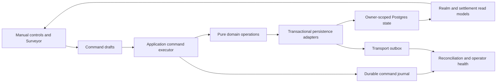

# Product completion architecture

**Status:** canonical end-state and migration sequence  
**Scope:** completion of the existing thesis, not a new simulation program

SettlementForge’s remaining architecture has one job: make the world it already
knows how to run easy to understand, safe to change, reliable to operate, and useful
in a weekly campaign habit.

The product loop is:

> Forge → save → mark canon → connect → advance → understand → prepare → record play → repeat

Every remaining project should shorten, clarify, or make that loop more trustworthy.
A proposal that adds domain depth without doing so belongs after product validation.

## 1. Constitutional boundaries

These are not implementation preferences:

- Seeded domain behavior remains deterministic and headless.
- AI may read, explain, and propose; it does not independently mint canon.
- The DM remains the authority over destructive, ambiguous, and canon-changing work.
- Public truth, private truth, and belief remain separate projections.
- A user-visible claim requires evidence of the same scope.
- Owner, target, revision, and lifecycle context accompany every durable mutation.
- Failures remain visible and retryable; acknowledgement never masquerades as repair.
- Old worlds retain their behavior unless a versioned migration intentionally changes it.

## 2. The completed system

The domain plane decides what a valid world change means. The application plane
decides who may request it, what version it targets, whether a preview is stale,
whether it has already run, how it persists, and what receipt exists. The transport
outbox remains a delivery mechanism; it is not renamed into a command journal.

### Command envelope

Every migrated durable mutation carries:

- `commandId` as its replay/idempotency identity, plus the envelope schema version;
- a registered command kind;
- provenance and owner context;
- stable save, campaign, or draft targets;
- expected aggregate revision, source fingerprint, or session epoch as applicable;
- normalized JSON parameters;
- correlation metadata for composed work.

The executor order is fixed:

1. admit and normalize context;
2. resolve a small legal command specification;
3. authorize owner and target;
4. validate expected revision and preview freshness;
5. claim the command identity and reject a conflicting fingerprint;
6. run the pure domain operation;
7. persist the unit of work;
8. finalize a receipt or expose reconciliation work.

Manual controls and Surveyor compile to the same command drafts. The existing store
operation registry remains a mutation census and governance tool; it does not become
a dynamic universal executor.

### Command receipts

A receipt records outcome, target revision before/after, deterministic result
summary, persistence status, undo/checkpoint capability, and failure/reconciliation
state. Partial application is represented explicitly. UI history and operator
health read the same receipt vocabulary.

## 3. Read and interaction architecture

The Game Grade guide is a read-model program, not a second engine.

### Three epistemic moments

- **Expectation:** what the current state makes likely before an action.
- **Outcome:** what the authorized operation actually changed.
- **Explanation:** why the resulting fact or consequence exists.

Those labels must never be used interchangeably. Estimates state uncertainty and
assumptions; exact deltas appear only after execution.

### Shared attention model

Campaign orientation derives one ordered classification:

1. action required;
2. severe active condition;
3. materially changed;
4. routine context;
5. opportunity;
6. quiet/reference.

Surfaces may filter or compress this inventory, but they do not invent private
severity scores. The Herald is the campaign-scale command brief; the settlement
Workbench is the focused edit/receipt surface.

### Contextual actions and links

Realm and settlement read models attach actions by stable operation ID. Components
render commands; they do not re-derive legal mutations from labels. Links are created
only for stable, resolvable, high-value entities. Ambiguous prose remains prose.

A stable lead change is preferred to ambient auto-cycling UI. Motion is introduced
only after accessibility and comprehension testing.

## 4. Persistence and distributed-state completion

Local-first interaction remains valuable, but durable multi-aggregate operations
graduate to server transactions.

- Settlement-only edits may optimistically apply when their revision and undo
  contracts are complete.
- Campaign plus member-settlement changes use command-specific transactional RPCs.
- Server compare-and-set protects aggregate revisions.
- Idempotency returns the original receipt for an identical retry and rejects a
  conflicting payload.
- Reconciliation never guesses which side won; the journal records the authoritative
  phase.
- Deletion reservations, refund obligations, webhook leases, and the transport
  outbox stay purpose-specific.

Migration is vertical by capability: one command from UI through receipt and
transaction before the next family moves. There is no flag-day store rewrite.

## 5. Boundary typing

The project remains JavaScript with checked JSDoc. Completion means:

- pure-domain types stay strict and headless;
- command, network, storage, and edge payloads receive runtime admission;
- new or materially changed shared UI boundaries receive checked props;
- persisted JSON is normalized once at entry, not defensively rediscovered by every
  component;
- documentation states exactly which files a typecheck covers.

A whole-repository TypeScript conversion is not required and would not solve
distributed-state correctness.

## 6. Operations and release evidence

Launch readiness is an evidence bundle, not a green unit-test count:

- migration rehearsal against a production-shaped clone;
- backup artifact, checksum, restore, integrity, RTO, and RPO receipts;
- refund/deletion/webhook obligation health with alert and acknowledgement history;
- a fail-closed scheduled probe that combines those external obligations with
  unresolved application-command journal health;
- enforced CSP and exact map-origin contracts;
- post-deploy probes for public app, map bridge, edge health, migration head, and
  obligation queues;
- rollback rehearsal;
- live Stripe and Supabase canaries using non-customer fixtures.

Service targets and escalation ownership live in
[`ops/SERVICE_OBJECTIVES.md`](./ops/SERVICE_OBJECTIVES.md).

## 7. Performance and endurance

Performance has five distinct evidence planes:

- raw and compressed first-paint transfer;
- repeatable production-build desktop and mobile browser regression evidence for
  app readiness, LCP, CLS, and interaction-to-next-paint;
- field p75 LCP, INP, and CLS on supported route/device/network bands;
- realm-size CPU, serialized state, same-thread structured-clone, isolated Node
  worker, and heap observations;
- 1/30/100-year release endurance across supported scale bands.

Thirty years is the useful horizon, one hundred years is strong release evidence,
and three hundred years is research. The certification manifest accepts partial
measurements without calling them certified. The isolated-worker receipt proves
actual `node:worker_threads` execution and direct/worker output equality; it is not
evidence of browser Web Worker startup or device-specific worker duration.

## 8. Existing-campaign import

Import is the highest-value likely expansion because the best-fit users already have
canon. It uses a staged reconciliation workflow:

1. ingest without mutation;
2. parse source claims with provenance;
3. match or propose entities;
4. surface conflicts and unsupported mechanics;
5. let the DM confirm, skip, or create each mapping;
6. preview the command set;
7. apply through the command executor;
8. retain an import receipt and bounded source-free recovery record.

Imported prose never silently becomes mechanical truth. See
[`IMPORT_RECONCILIATION_ARCHITECTURE.md`](./IMPORT_RECONCILIATION_ARCHITECTURE.md).

The deterministic SettlementForge-export reviewer now implements the complete
settlement create/reuse/skip/defer vertical. Migration 184 supplies two narrow
server-atomic commands: create-and-attach and attach-existing with disclosed
exclusive rehome. The browser stores a bounded, owner-scoped recovery record with
decisions, reviewed topology, and redacted receipts—not the uploaded export or
settlement content. Reopen therefore requires the same export again, and a recovered
receipt is attached only when the reconstructed command plan is identical. Unknown
outcomes require an explicit durable-journal check rather than a blind retry.

This is not universal campaign import. Relationships, maps, chronicles, version
history, natural-language notes, and third-party formats remain separately admitted
future verticals.

## 9. Product evidence

Internal tests can prove determinism, ownership, security shape, compatibility, and
performance envelopes. They cannot prove ease, delight, prep value, retention, or
willingness to pay.

The prelaunch task study must test the complete loop uncoached. The primary product
metric is consecutive-week use of a canonical world, not generation count. See
[`USER_VALIDATION_PROTOCOL.md`](./USER_VALIDATION_PROTOCOL.md).

## 10. Completion order

1. Keep the integration gate green and preserve the deliberately adjudicated goldens.
2. Migrate the next high-risk mutation families vertically through the durable
   journal and command-specific server transactions.
3. Complete shared attention, contextual actions, and high-value query links.
4. Finish runtime admission and truthful UI-boundary typing by touched area.
5. Rehearse the migration train and operational recovery paths.
6. Retain the synthetic desktop/mobile browser gate, add field/device evidence, and
   run the release endurance matrix.
7. Tune once from combined evidence; regenerate a golden only for a newly approved
   behavior change.
8. Run uncoached task studies and repair observed blockers.
9. Admit a narrow persistent-campaign cohort.
10. Extend import beyond structured SettlementForge exports only after the first
    vertical and cohort evidence justify it; do not add another major simulation
    system first.

## 11. Deferred by design

- New major simulation families.
- Universal noun linkification.
- Auto-cycling ambient UI.
- Terrain-at-cursor FMG work.
- Deep living-map scarring before retention evidence.
- Broad genre claims before the ontology is parameterized.
- A framework/language rewrite.
- Aggregate market-data products.

Deferral preserves the complete product goal: it concentrates effort on graduating
the existing thesis rather than lowering the bar or widening it indefinitely.
