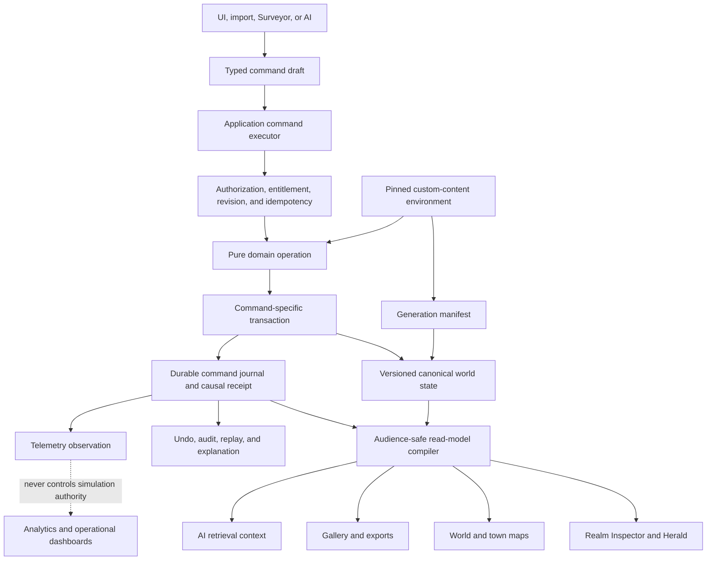
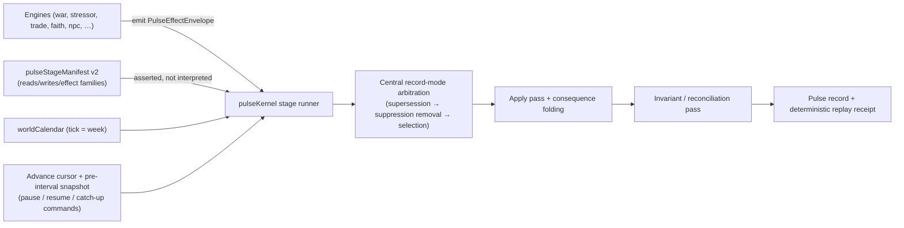
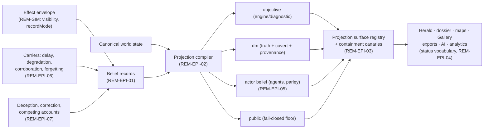
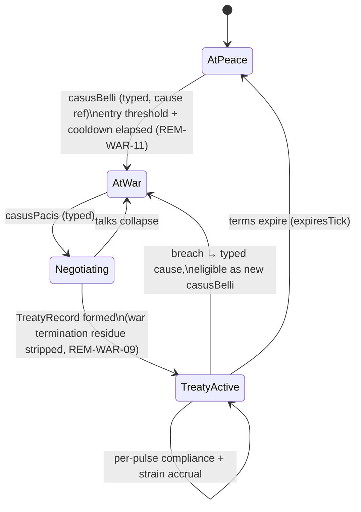
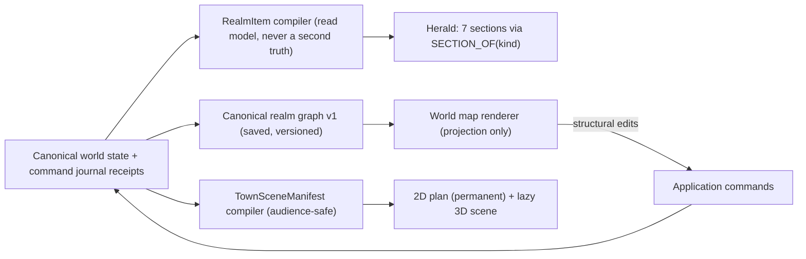
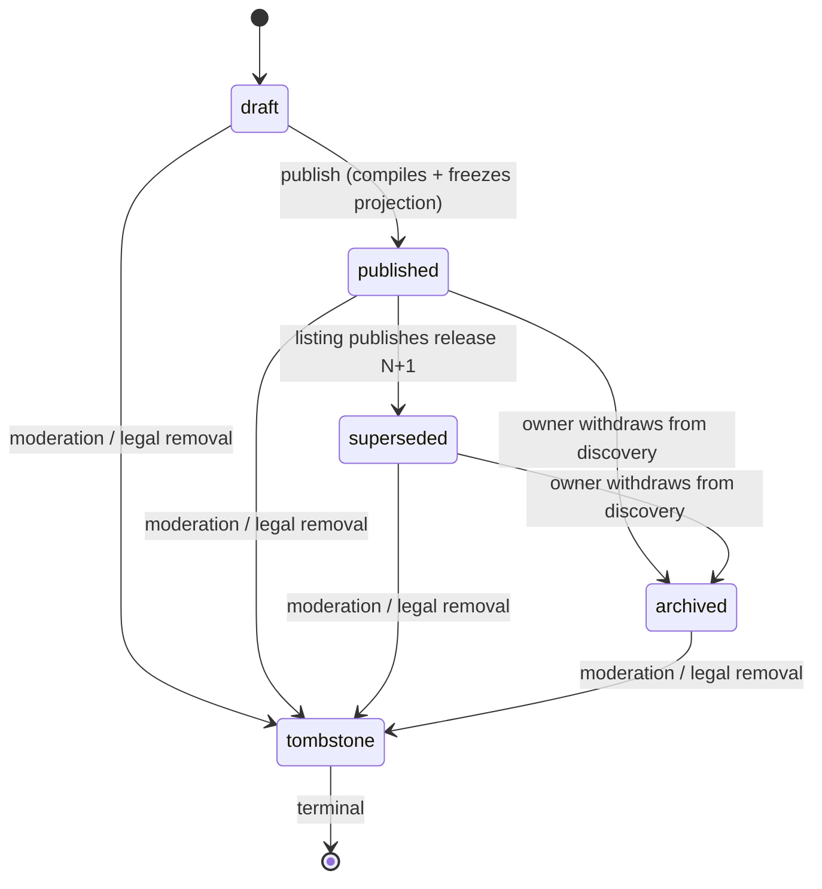
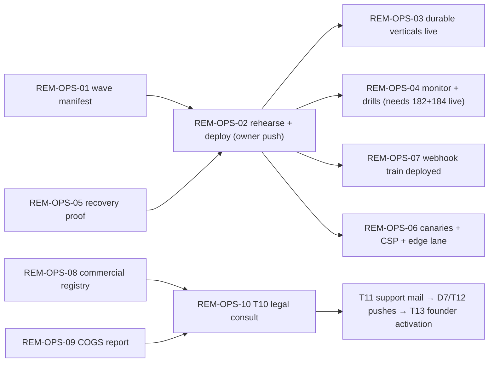

# SettlementForge — Exhaustive Remediation & Completion Architecture

**Status:** compiled remediation architecture — the execution blueprint layered over `PRODUCT_COMPLETION_ARCHITECTURE.md`
**Compiled:** 2026-07-28, from the owner-supplied completion backlog of the same date
**Grounding:** code of record = minifold worktree, branch `claude/composite-r4` @ `351077de` (live and concurrently edited at extraction time); governance home = ledger branch `review-fixes-2026-07-08` @ `9f1d2cf9`; repository migration head `192_tier_credit_multiplier.sql`; live-verified production migration head **121**
**Authority:** this document does not supersede the governance chain (ruling R4: `START_HERE.md` → ledger newest rows → `OWNER_DECISION_QUEUE.md` → minifold `CURRENT_STATE.md` + `PRODUCT_COMPLETION_ARCHITECTURE.md` → lane docs). It compiles the owner's backlog into architected, evidence-bound work items inside that frame. Where it records a judgment, the judgment is vetoable and listed in the Decision Ledger (Part 19).

---

## How to read this document

- **Part 0** is the implementer handoff: the repository's laws, gates, git protocol, owner-gated boundary, and live-tree coordination — self-contained for an implementer with the repo but without the compiling session's context. Read it first.
- **Volume I (sections 1–14)** architects every item of the owner's backlog; **Volume II** mirrors it with one implementation-grade specification per work item (files, signatures, full contracts, enumerated tests, acceptance criteria), keyed by the same `REM` id.
- **Sections 1–14** architect every item of the owner's backlog: current state (grounded in the 2026-07-28 extraction), target architecture, execution path, evidence, and risks. Work items carry `REM-<AREA>-<NN>` identifiers. Existing program identifiers (launch tail **T1–T15**, deploy-coupled **D1–D7**, golden/engine **G1–G13**, product/taste **P1–P22**, platform/money **M1–M44**, epistemic-prevention **EP-a..p**, custom-content **CC-\***, town-scene **TS3D-\***, rulings **R1–R4**, AI-ladder **L-1..L-5**) are referenced, never duplicated; many REM items exist to *execute* an already-ruled queue item and say so.
- **Part 15** maps the backlog's waves 0–9 onto the ratified execution frame — the 10-step completion order of `PRODUCT_COMPLETION_ARCHITECTURE.md` (ruling R1) and the binding owner-physical launch tail T1–T15. This document never proposes a competing order.
- **Part 16** is the definition of "exhaustively finished," each criterion bound to the receipt that proves it.
- **Part 17** is the do-not-build register. **Part 18** tracks the 33 residual issues at issue level. **Part 19** is the decision ledger for judgments made while compiling. **Part 20** is the cross-document contradiction register — known documentation disagreements this program must repair, recorded so they cannot silently re-derive stale truth.
- **Priorities:** P0 = required before the product is trustworthy and production-complete. P1 = required for the best complete expression of the current product. P2 = only after real usage proves demand. **⛔** marks owner-physical or owner-gated acts (pushes, deploys, `supabase db push`, golden-shifting flag lighting, budget/ratchet raises, legal, pricing, taste).
- **Claim discipline:** current-state statements in this document derive from the 2026-07-28 extraction of the live docs, ledgers, and code survey (CONFIRMED at extraction time); anything marked *PLAUSIBLE* is reasoning or memory not re-verified against the tree and must be re-checked at build time. The tree is live — always re-verify before editing.

## The thesis

SettlementForge is not missing more major engines. It has unusually broad and substantive capability; what it lacks is uniform **product closure**: identity, authority, durability, causal receipts, projections, UI legibility, deployment proof, and human validation completed across every vertical. The ideal product this architecture converges on:

> A deterministic living-world engine where settlements are generated coherently, saved as canon, connected spatially, advanced through time, changed by explainable consequences, safely extended by custom content, optionally assisted by AI, and presented to the DM through one legible campaign desk.

This blueprint is exhaustive relative to the current thesis and pipeline. It deliberately excludes every adjacent product — full VTT, arbitrary mod scripting, generic social network, autonomous AI game master — because adding those now would make SettlementForge worse, not more complete.

## The six inviolable laws

1. **One authority for every piece of truth.**
2. **Stable identity everywhere; names are presentation, not joins.**
3. **Every durable change travels through a typed command.**
4. **Every meaningful consequence produces a causal receipt.**
5. **Truth, belief, public knowledge, and UI projection are separate.**
6. **Telemetry observes decisions; it never silently changes simulation behavior.**

These six sit alongside — never above — the constitutional engine laws already in force: same-seed byte identity; feature dormancy with byte-identical goldens; seeded purity; monotone (owner-gated) ratchets; claims carry enforcement; premium isolation; endogeneity; THE PROMISE ("a seed is a world, forever"); FINITE-SEMANTICS; the LEGIBILITY and NEWS ADDRESS laws; and the eager first-paint budget of 1,040,000 bytes.

## The target architecture



This is the same command-spine architecture `PRODUCT_COMPLETION_ARCHITECTURE.md` ratifies, extended with the two platform pins the backlog makes explicit: the pinned custom-content environment feeding both generation and domain operations, and telemetry's strictly observational relationship to simulation authority. The command layer exists today (`src/application/commands/`, 2,104 LOC, envelope schema v1, memory journal, receipts, five adapters; `CUT_TRADE_ROUTE` is the first fully server-authoritative vertical). The architecture below is therefore predominantly a **completion** architecture: extending proven spines across every vertical, not inventing new ones.

## Section index

1. Program governance, command authority, identity, and codebase architecture (REM-ARCH)
2. Simulation substrate: effect envelope, record modes, stage execution, and time (REM-SIM)
3. Epistemology and information (REM-EPI)
4. War, naval conflict, occupation, peace, and faith (REM-WAR, REM-FAITH)
5. Economy, trade, resources, and supply; population, migration, and settlement lifecycle (REM-ECO, REM-POP)
6. Stressors, calamities, and arcs; NPCs, factions, politics, and agency; diplomacy and statecraft (REM-STR, REM-NPC, REM-DIP)
7. Code quality: responsibility refactors, runtime contracts, registries, failure behavior, and performance (REM-QUAL)
8. Generation: pipeline manifest, strict execution, identity, provenance, safe regeneration, coherence (REM-GEN)
9. Realm Inspector, world map, town map, and spatial product (REM-RLM)
10. Custom content: cloud gates, atomic environments, authoring UX, import security, restraints (REM-CC)
11. AI capabilities and restraints (REM-AI)
12. Gallery; analytics and telemetry (REM-GAL, REM-AN)
13. Product and UX completion; persistence, operations, security, and commercial trust (REM-UX, REM-OPS)
14. Testing, evidence architecture, and human proof (REM-TEST)

Volume II follows section 14, mirroring these fourteen sections with implementation specifications (II.1–II.14). Parts 15–21 close the program frame; Part 22 reproduces the owner's source backlog verbatim so every "backlog §N" citation resolves inside this document.

---

## 0. Implementer handoff — read this before touching anything

This part is written for an implementer who has this repository but none of the compiling session's private context. Everything you need is in this document and the repo's own files; nothing load-bearing lives anywhere else.

**What this is.** SettlementForge is a deterministic D&D settlement/world simulator (React + Zustand + Supabase/Postgres/RLS + Deno edge functions; JavaScript with JSDoc types — no TypeScript rewrite). First-party `src/` measures 462,014 lines across 1,708 tracked files with 32 edge functions and 192 migrations at head `192_tier_credit_multiplier.sql` (live-verified production head: 121). The product loop: Forge → save → mark canon → connect → advance → understand → prepare → record play → repeat.

**Where the truth lives.**
- Code of record: the worktree `.claude/worktrees/minifold`, branch `claude/composite-r4`. All engine/UI/edge work happens on this lineage (in the worktree or a fresh worktree branched from its tip) — never on the main tree.
- The main tree (repo root) holds branch `review-fixes-2026-07-08`: the **ledger/governance lane**. Only documentation and governance commits belong there; never check out or build code branches in it, and never merge it toward `master`.
- `master` is a frozen ancestor of `claude/composite-r4` awaiting the owner's fast-forward (queue item T8). Do not touch it.
- Decision surfaces: `docs/OWNER_DECISION_QUEUE.md` (the ONE owner-decision queue; rulings recorded in place, never deleted), `docs/COMPREHENSIVE_REVIEW_PROGRAM.md` (append-only program ledger — append a row and commit after every landing), `docs/GOLDEN_SHIFT_LEDGER.md` (every same-seed output shift gets a declared row), `docs/START_HERE.md` (the zero-context bootstrap; where it disagrees with git, git wins).

**How to use this document.** Volume I (sections 1–14) is the architecture: 202 work items with current state, target design, execution path, evidence, and risks. Volume II mirrors it with one implementation specification per item, keyed by the same `REM-<AREA>-<NN>` id: files, signatures, full contracts, migrations, enumerated tests, acceptance criteria, and warnings. To work an item: read its Volume I entry, then its Volume II spec, execute every verify-first step (facts move — the grounding here was extracted 2026-07-28), implement, run the named evidence, and record the landing (ledger row + commit). Parts 15–21 carry the wave order, definition of finished, restraints, residual register, decision ledger, contradiction register, and the compile-time dispositions RA-1..RA-16 that close this document's open design forks (vetoable manager rulings under the owner's standing delegation — treat as binding unless the owner vetoes). Part 22 reproduces the owner's source backlog verbatim; "backlog §N" citations resolve there.

**The laws (all binding, none optional).**
1. Same-seed byte identity: the same seed and inputs produce byte-identical output.
2. Dormancy: new engine capability ships DARK behind a virtual flag absent from `DEFAULT_SIMULATION_RULES`, with byte-identical dormancy goldens proving flag-off output is unchanged.
3. Seeded purity: engine and domain code never call ambient random, time, or locale-dependent ordering; fork seeded RNG locally.
4. Monotone ratchets: size/type/cycle/cast/kill-list baselines only shrink; raising any ratchet, budget, or ceiling is owner-gated — never self-authorized. The eager first-paint budget is 1,040,000 bytes; everything new is lazy.
5. Claims carry enforcement: a completeness claim names a real test wired into the gate.
6. Premium isolation: tier never touches generation; free/anonymous surfaces never see live deity names or DM truth (the `includeCovert`/`includeGroundTruth` selector convention is the reveal seam).
7. Endogeneity: the party observes the world; it never feeds fit math.
8. THE PROMISE: "a seed is a world, forever" — tuning changes are owner-signed and versioned.
9. FINITE-SEMANTICS: only typed buckets touch the engine; AI is a bucketing clerk, never a writer of engine inputs.
10. Golden law: never re-record a golden without a declared shift row stating the legitimate cause (ruling R2: "never an UNDECLARED regen; the flag-lighting regen remains singular"). Batch membership per RA-1/RA-2.
11. The six laws of this architecture (see "The six inviolable laws" above).
12. A rewritten behavioral test pin is a violation — pins stay green untouched; fix behavior, not assertions.

**Gates and how to run them.**
- `npm run check` — the main code gate: validate:data → validate:custom-content-manifest → validate:migration-head → validate:edge → validate:map → validate:tuning-bands → validate:foundry-module → validate:mcp-server → typecheck → typecheck:domain:strict → lint → test → build → verify:dist. `npm run check:full` adds `check:edge-behavior` (Deno). `npm run check:tail` streams safely.
- Never read a gate through a pipe — `npm run check | tail` reports the pipe's exit status and has greenwashed red gates; run bare or via `sh scripts/gate-tail.sh <cmd>`.
- Run `npm run build` before `verify:dist` (dist contracts test the built output). Worktrees resolve the MAIN tree's `node_modules` — run `npm ci` where needed and beware silent walk-up.
- Full suite at every fold; focused green groups have a proven blind spot and are never presented as a green repository.
- Timeout-shaped reds under parallel machine load are usually fakes — re-run the failing file in isolation before diagnosing (proven repeatedly). Check `ps aux | grep vitest` before believing a timeout.

**Git protocol (each rule exists because its violation has already bitten this program).**
- Never `git add -A`, `-u`, or `.` — stage explicit files only, and verify every staged hunk is yours.
- Never `git stash`. A foreign stash (`analytics-intelligence-layer`) exists — never touch it.
- Branch-guard every state-mutating compound command: `[ "$(git branch --show-current)" = "<expected>" ] || exit 1` — working directories reset between shell calls.
- The tree may be shared with concurrent sessions: re-read `git status` immediately before staging, prefer pathspec commits (`git commit <file> -m ...`), and yield if another process holds the index.
- Preserve foreign WIP unconditionally — unknown untracked files and dirty hunks you didn't write belong to someone; never clean, reset, or overwrite them.
- NUL-scan diffs (python, not grep — grep silently lies on NUL bytes) before merging generated or agent-edited content.
- After committing, confirm untracked files survived any pre-commit hook.

**Owner-gated acts — prepare, schedule, and surface; never perform.** Pushes to origin and PR merges; deploys and `supabase db push`; golden-shifting flag lighting; ratchet/budget raises; legal language; pricing activation; every launch-tail act T1–T15 and deploy-coupled act D1–D7; everything the RA dispositions list as not-disposed. When an item's execution path reaches a ⛔ step, stop, assemble the evidence, and hand it to the owner.

**Live-tree coordination (state as of 2026-07-28 — re-verify before starting).** A concurrent session's in-flight work sits uncommitted in minifold: untracked `src/domain/worldPulse/{warRecordMode,occupationRecordMode,conditionRefreshRecordMode,pulseOutcomePartition,worldPulseFeedCuration}.js` with matching tests, plus ~56 modified worldPulse/certification/Herald files (`behavioralContract.js`, `certificationSchema.js`, `pulseKernel.js`, `advanceInterval.js`, `AdvanceReport.jsx`, …). That work IS the beginning of REM-SIM-01 and REM-TEST-06. Before implementing any REM-SIM or certification-touching REM-TEST item: run `git -C .claude/worktrees/minifold status --short` and `git log --oneline -5`, inventory what has landed or moved since this document was compiled, and reconcile with it — adopt and extend, never re-create, never overwrite.

**Claim discipline.** CONFIRMED means you executed the proof and can quote real output; PLAUSIBLE means reasoning only. Never present the second as the first. Every spec's verify-first steps exist because this document's grounding is point-in-time (2026-07-28, minifold @ `351077de`, ledger @ `9f1d2cf9`) — execute them before building. Report failures verbatim; a deferral is recorded where it will be found, never silently dropped.

**Order of work.** Part 15 maps waves 0–9. The owner deferred Wave 0's census *execution* on 2026-07-28 (implementation starts wherever the owner points); intra-item prerequisite chains in the specs still bind regardless of entry point. When two items touch one file, the specs' "Order and prerequisites" lines decide sequence — never parallelize two items over a shared file.

---

# Volume I — The architecture

## 1. Program governance, command authority, identity, and codebase architecture

This section architects the program's spine: one integration train with every branch classified, one application-command path for every durable mutation, one identity contract for every entity reference, one authority for every capability flag, one versioned schema per persisted aggregate, and one enforceable documentation chain. The thesis follows the backlog's own conclusion — SettlementForge is not missing engines; it is missing uniform authority. The current state makes that concrete: first-party `src/` is 462,014 lines across 1,708 tracked files with 32 edge functions (facts-D); a real command layer already exists at `src/application/commands/` (2,104 LOC across 15 files, envelope v1, executor, memory journal, receipts, five adapters), and CUT_TRADE_ROUTE is already the first server-authoritative vertical — command identity, base-state CAS, save mutation, and receipt in one database transaction with no legacy outbox dual-write (facts-A CURRENT_STATE). What does not yet exist is breadth and convergence: most legacy mutations bypass that spine (release blocker 3), DESTROY_SETTLEMENT is spread across 17 files with an ambient `Date.now()` inside a canon-event id (facts-D §7), engine capability knowledge is dispersed between 38 product flags in `src/lib/flagRegistry.js` and unenumerated virtual flags deliberately absent from `DEFAULT_SIMULATION_RULES`, the worktree fan-out exceeds a hundred lanes, and the governance docs carry eleven recorded cross-doc contradictions (facts-A).

Everything below builds inside the ratified frame: PRODUCT_COMPLETION_ARCHITECTURE's 10-step completion order is the governing endgame frame (ruling R1), the R4 governance chain is the authority order, and backlog waves 0–9 map into that frame rather than competing with it. Owner-gated classes (pushes, deploys, `supabase db push`, golden-shifting flag lighting, budget raises, legal) are scheduled, never executed, by this architecture. The section's items in reading order:

| ID | Item | Backlog | Wave | Priority |
|---|---|---|---|---|
| REM-ARCH-01 | Worktree/branch convergence census and classification | 1.1 | 0 | P0 |
| REM-ARCH-02 | Capability completion matrix and three status dimensions | 1.1 | 0 | P0 |
| REM-ARCH-03 | Command executor contract: conflicts, journal law, UI channel | 1.2 | 1 | P0 |
| REM-ARCH-04 | DESTROY_SETTLEMENT convergence (executes M11) | 1.2 | 1 | P0 |
| REM-ARCH-05 | Canonize/uncanonize commands with tombstoning (executes M8) | 1.2 | 1 | P0 |
| REM-ARCH-06 | Remaining six mutation-family verticals | 1.2 | 1–6 | P0 |
| REM-ARCH-07 | RealmRef identity/provenance substrate (closes G11) | 1.3 | 2 | P0 |
| REM-ARCH-08 | Engine-capability manifest over both flag planes | 1.4 | 2 | P0 |
| REM-ARCH-09 | Dependency-direction boundary tests and shrinking ratchets | 1.6 | 2 | P1 |
| REM-ARCH-10 | State normalization under versioned schemas | 1.7 | 2 | P0 |
| REM-ARCH-11 | Documentation enforceability (hardens R4) | 1.8 | 0/2 | P1 |

### REM-ARCH-01 — Converge the worktree/branch fan-out into one classified integration train
**Priority:** P0 · **Wave:** 0 · **Owner-gated:** physical deletion of any branch or worktree (data deletion); everything up to and including archive-tagging is manager-executable under the §0 delegation.
**Current state.** The code of record is the minifold worktree on `claude/composite-r4` (facts-A CURRENT_STATE; facts-C START_HERE §3c), with the main tree reserved as ledger-only on `review-fixes-2026-07-08` and master already an ancestor of composite-r4 (W1 merge 0168e287; M39 rules the review-fixes lane never merges toward master). START_HERE names the earlier code of record (`claude/the-composite` @ 78a04afc, worktree agent-a04d3f325c72e62dd) as superseded, and an `npm run ops:worktrees` script exists (facts-D gates). The full fan-out exceeds 130 worktrees per the compilation brief (PLAUSIBLE — verify at build time with `git worktree list` and `ops:worktrees`); no classification record exists for the population, and a foreign stash (`analytics-intelligence-layer`) is standing-forbidden to touch.
**Target architecture.** A checked-in census manifest, `ops/integration-train.manifest.json`, becomes the single authority for lane disposition, generated by an extended `scripts/ops/worktree-census.mjs` and hand-annotated only in the `classification` and `disposition` fields:

```json
{
  "manifestVersion": 1,
  "codeOfRecord": { "worktree": "minifold", "branch": "claude/composite-r4" },
  "rows": [{
    "branch": "claude/the-composite",
    "worktreePath": ".claude/worktrees/agent-a04d3f325c72e62dd",
    "tip": "78a04afc",
    "classification": "superseded",   // merged | superseded | blocked | abandoned | authoritative
    "reachability": { "reachableFrom": "claude/composite-r4", "provedAt": "ISO" },
    "carriedWork": ["free-text summary of unmerged commits, if any"],
    "disposition": "archive-tag",     // keep | archive-tag | owner-delete
    "archiveTag": "archive/the-composite@78a04afc"
  }]
}
```

Classification is total: every branch and every worktree gets exactly one of the five states from backlog §1.1 (merged; superseded; blocked; abandoned; still authoritative). Reachability is proved mechanically (`git merge-base --is-ancestor <tip> <codeOfRecord tip>`, or reachable from an `archive/*` tag) before any disposition other than `keep` is legal. Archive-before-delete is the law: an annotated tag `archive/<branch>@<hash>` pins the commits, so deletion never orphans work; actual deletion is a separate owner act against a signed disposition list. The manifest also records the authority chain verbatim — minifold is code, the main tree is ledger, master is a frozen ancestor awaiting the T8 fast-forward — so no session ever has to reconstruct it from memory or from a stale digest.
**Execution path.**
1. Generate the raw census (branch, worktree path, tip, ahead/behind the code-of-record tip, dirty-tree state) and commit it with every row `classification: "unclassified"`, so the walker is born red and burns down honestly.
2. Classify in batches, proving reachability per row; `blocked` rows must name their blocker (a queue id, a ruling, or a missing gate), and `authoritative` rows other than the code of record must name what they are authoritative *for* (the ledger branch qualifies; nothing else should).
3. Apply archive tags for every `merged`, `superseded`, and `abandoned` row.
4. Present the owner the `owner-delete` sublist; deletion happens only on that signature, and the manifest records the signature reference.
5. Rerun the complete repository gate on the code-of-record tip (REM-ARCH-02 defines what "complete" means) and record the result in the manifest's `postConvergenceGate` field.
**Evidence.** `tests/governance/integrationTrain.walker.test.js`: totality (every live branch and worktree has a row; every row's tip matches reality or the row is flagged stale), zero `unclassified` rows at wave exit, every non-keep row carries a proved reachability record, and the code-of-record entry is unique. The walker is registered in the mutation manifest per the E-A rules for walker-named tests.
**Risks and interactions.** The tree is live — concurrent sessions write minifold mid-task, so the census generator must re-read immediately before commit and stage by explicit pathspec (shared-index discipline). Foreign WIP and the forbidden stash are preserved unconditionally. This item feeds REM-ARCH-02 (the census is an input to the localCode status dimension) and forms the Wave 0 exit criterion together with it. Touches M39 (lane direction) and T8 (the eventual zero-conflict fast-forward PR of the composite lineage remains owner-button-only).

### REM-ARCH-02 — Stand up the capability completion matrix and the three status dimensions
**Priority:** P0 · **Wave:** 0 (bootstrap; rows update through Waves 1–8) · **Owner-gated:** none for the machinery; the production-migration receipt it tracks only moves via T9 owner-physical deploys.
**Current state.** CURRENT_STATE names five release blockers, of which blocker 1 is the migration train — working-tree migration head 192 versus live-verified production head 121, with "eleven declared waves" needing rehearsal that are defined nowhere (facts-A contradiction 3; the queue's T9 row says 118→188 plus 189/190 and a 9-wave rehearsal — the numbers disagree across documents). Completion status today lives in prose across CURRENT_STATE, the promotion ledgers (custom content's 26 CC ids; TS3D's 10 local plus 5 external gates, all external gates currently unsatisfied), and the owner queue; there is no per-capability matrix and no declared expected-red list (contradiction 11). The main gate is `npm run check` (14 chained validators from `validate:data` through `verify:dist`), with `check:full` adding `check:edge-behavior` (facts-D).
**Target architecture.** One checked-in matrix, `schema/capability-completion.manifest.json`, keyed by the capability ids of REM-ARCH-08, with the backlog's seven completion axes per row:

```json
{
  "capabilityId": "engine.supplyWarfare",
  "axes": {
    "implementation":  { "status": "complete", "evidenceRefs": [{ "path": "...", "sha256": "...", "capturedAt": "ISO", "producer": "..." }] },
    "semanticTests":   { "status": "partial",  "evidenceRefs": [] },
    "migration":       { "status": "not_applicable", "reason": "no persisted shape" },
    "uiConsumer":      { "status": "complete", "evidenceRefs": [] },
    "documentation":   { "status": "absent" },
    "productionProof": { "status": "absent" },
    "humanProof":      { "status": "absent" }
  }
}
```

Evidence records reuse the TS3D shape (path, sha256, capturedAt, producer — facts-B), because that contract already encodes the right discipline: no relabeling of evidence kinds, freshness windows, and pass semantics. The matrix federates rather than duplicates: custom-content rows point at the CC promotion ledger and TownScene rows at the TS3D contract — one authority per truth, never a second copy. Orthogonal to the matrix, three status dimensions are kept structurally separate, each with its own authority and its own failure mode:

| Dimension | Authority | Current honest value |
|---|---|---|
| localCode | Full-gate receipts on the code-of-record tip + the expected-red register | `check:full` at fold: 19,724 passed / 12 failed / 35 skipped, reds name-attributed (facts-C §9) |
| productionMigrations | Live-verified head receipt, updated only after production verification (T9 protocol) | Head 121 live-verified vs 192 in-repo — RELEASE BLOCKER |
| liveService | SERVICE_OBJECTIVES 12-item release evidence bundle | Largely unproven (CURRENT_STATE blocker 2) |

The expected-red register (name, owning lane, reason, review-by date) cures contradiction 11 and reconciles START_HERE's "exactly 4 parked golden families" against ruling R2's reclassification of the in-tree regens as declared defect-correction shifts — the register, not either doc, becomes the authority on what may be red. Two laws bind reporting: a focused passing test group is never presented as a green repository (backlog §12.1; enforced by requiring the localCode dimension to cite a `check:full` receipt), and `productionProof` flips only on externally produced evidence records — repository presence is never deployment evidence, per the custom-content doctrine.
**Execution path.**
1. Write the matrix schema and a `validate:completion-matrix` gate step (schema validity, evidence-ref hash existence, no `complete` axis without refs).
2. Populate rows for every capability the REM-ARCH-08 manifest enumerates, honestly — mostly `partial` and `absent` at first; an aspirational matrix is a defect.
3. Commit the expected-red register and wire gate reporting to diff actual reds against it, so an unexplained red fails and a vanished expected red demands a register update.
4. Write down the migration-wave partition (the eleven-versus-nine contradiction) as a table in the matrix's productionMigrations section; ratifying that partition rides T9 rehearsal.
5. Run and record the full `check:full` gate on the converged train — the Wave 0 exit receipt.
**Evidence.** `tests/governance/completionMatrix.test.js` (schema, totality against the capability manifest, no evidence-free completions); gate-report diffing against the expected-red register; the Wave 0 full-gate receipt itself.
**Risks and interactions.** The full suite exceeds the 10-minute cap and throws fake timeout reds under parallel load (facts-C START_HERE flake note, proven ~6×), so the localCode receipt protocol must record runner conditions and check for concurrent vitest workers before believing a red. Interacts with T9 (deploy), T3 (soak receipts land in liveService), M24/M37 (external-evidence gates feed `humanProof`), and REM-ARCH-11 (matrix summaries are a generated-doc table). Residual risk: a stale matrix is worse than none — REM-ARCH-11's freshness walker covers it.

### REM-ARCH-03 — Complete the application-command executor contract: typed conflicts, durable journal law, and the UI mutation channel
**Priority:** P0 · **Wave:** 1 · **Owner-gated:** none locally; any new command-vertical migration deploys only through T9.
**Current state.** `src/application/commands/` holds the spine (facts-D §8): `executeCommand.js` (321 LOC; `createCommandExecutor`, `createMemoryCommandJournal`), `commandEnvelope.js` (269 LOC; `COMMAND_SCHEMA_VERSION=1`, provenance enum `['manual','surveyor','system']`, `validateCommandEnvelope`, `commandIdForValue`, `commandFingerprint`, `commandJournalKey`, prototype-pollution `BLOCKED_KEYS`, `MAX_JSON_DEPTH=32`, `MAX_IDENTIFIER_LENGTH=240`), `commandReceipts.js` (101 LOC; `COMMAND_STATUS`, `PERSISTENCE_STATE`, begin/advance/replay), `commandRegistry.js` and `standardCommandRegistry.js`, and five adapters (customContentApply 202, canonEventApply 182, pendingEditCommit 150, importReconciliationApply 138, partyImpactRecord 111) with store-side transactions (`canonEventCommandTransaction.js` 473, `importReconciliationCommandTransaction.js` 525). The envelope already carries the backlog's required fields — stable command id, actor/owner provenance, target revision, idempotency identity, typed normalized payload, schema version — matching PCA's seven required envelope fields, and it deliberately carries no store function, React callback, persistence client, or executable policy. Ad-hoc idempotency lives separately in 20+ domain modules. PCA fixes the executor's 8-step order and two negative constraints: the store operation registry does not become a dynamic universal executor, and the transport outbox is not renamed into a command journal.
**Target architecture.** Keep PCA's 8-step order as frozen law:

```text
1 admit/normalize → 2 resolve legal command specification → 3 authorize owner+target
→ 4 validate expected revision / preview freshness → 5 claim command identity, reject conflicting fingerprint
→ 6 run pure domain operation → 7 persist unit of work → 8 finalize receipt or expose reconciliation work
```

and complete three things around it. **(1) Typed conflict taxonomy** — one discriminated union consumed by every adapter and every UI surface:

```js
CommandConflict =
  | { kind: 'stale_revision', expectedRevision, actualRevision }
  | { kind: 'fingerprint_conflict', commandId, conflictingFingerprint }
  | { kind: 'idempotent_replay', receiptRef }            // success-shaped; retry resolves here
  | { kind: 'authorization_denied', reason }
  | { kind: 'validation_failed', errors }
  | { kind: 'persistence_failed_reconcilable', reconciliationRef }
```

Stale revisions are rejected with `stale_revision`; retries land on `idempotent_replay` and return the original receipt; the same command id with a differing behavior-bearing field is `fingerprint_conflict`, never a match (facts-D §8); and partial external failure always yields a reconcilable receipt rather than silence (SERVICE_OBJECTIVES: 100% finalize-or-visibly-reconcilable, zero silent loss). **(2) Durable journal law:** journal durability is achieved per-vertical, by command-specific server transactions that persist the state change, the journal entry, and the receipt atomically in one database transaction — the CUT_TRADE_ROUTE and migration-184 shape — while `createMemoryCommandJournal` remains the local-dev and test substrate. There is deliberately no generic dual-authority wrapper and no "execute any operation" endpoint; the registry grows one registered kind at a time, each with its own command-specific authorization and persistence adapter. **(3) The UI mutation channel:** every UI mutation drafts an envelope and calls the executor; a source-scan ratchet censuses direct persistence and store-mutation reach-ins from `src/components/` and only shrinks. Dry-run/preview is legal only when it runs the same validator and read-model compiler as execution (PCA step 4's preview-freshness check is the hook), and step 8 triggers read-model refresh over memoized compiled read models (memoization architecture owned by REM-QUAL, section 7).
**Execution path.**
1. Extract the conflict union into `src/application/commands/commandConflicts.js` and migrate the five existing adapters onto it — behavior-preserving, typed where strings were.
2. Write the vertical template as doc-in-code: one exemplar module layout copied from the CUT_TRADE_ROUTE vertical, so every REM-ARCH-04..06 vertical repeats a proven shape instead of inventing one.
3. Land the UI-channel ratchet with today's census as the frozen baseline.
4. Fold the 20+ ad-hoc idempotency sites into the journal only where a vertical migrates — never as a big-bang rewrite; each remaining site is listed as ratchet debt with its owning family.
**Evidence.** `tests/application/commandConflicts.test.js` (every union member constructed, serialized, and round-tripped; retry-on-replay returns the original receipt); per-adapter conflict tests; `tests/architecture/uiMutationChannel.ratchet.test.js` (shrink-only census naming file and forbidden import); the existing envelope validation tests extended over the union.
**Risks and interactions.** The taxonomy touches every future vertical — it must land before REM-ARCH-04. Interacts with PCA completion-order step 2 (this is its enabling contract), M12/M13 (undo and toggle-surface behavior consume `undoPolicy`-bearing receipts; failure-behavior architecture is REM-QUAL, section 7), and the Surveyor plane (AI proposals enter as `provenance:'surveyor'` drafts through the same validator — DESIGN_AI_CONTROL_SURFACE's trust model, unchanged). No golden impact: the executor never touches generation.

### REM-ARCH-04 — Converge DESTROY_SETTLEMENT into one command vertical (executes M11)
**Priority:** P0 · **Wave:** 1 · **Owner-gated:** the vertical's server migration deploys via T9; local code and tests are not gated.
**Current state.** Facts-D §7 censuses 17 files. Trigger lanes: `components/settlement/EventComposer.jsx:382` (typed-name confirm), `eventComposer/ApplyControls.jsx:23`, `components/settlements/DestroySettlementControl.jsx` (2 sites), and `store/settlementSlice.js` lines 70/1270/1278/1314, which synthesizes the destroy event as `` {id: `destroy.${id}.${Date.now()}`, type:'DESTROY_SETTLEMENT', targetId:reason, timestamp:now} `` — an ambient-time use inside a canon-event id, a seeded-purity defect to cure. The single domain writer is `domain/events/mutate.js:68` (`destroySettlement`; flat-entry snapshot at line 193). Registry surfaces span `operationRegistry.js:95` (klass `canon`, undoState `irreversible`, receiptRef `eventLog-entry(DESTROY_SETTLEMENT)`), `affordanceManifest.js:481-482` (family Realm, entityKind settlement), `registryRerunKeys.js:66` (reruns economicState, powerStructure, narrative), `registryProse.js:53`, `undoEvent.js:432`, `intent/opVocabulary.js:28`, `settlementPendingEditWriters.js:16`, `actionResult.js:13,113`, plus display and metadata sites (`PendingIntentions.jsx:34`, `domain/types.js:95,109`, generated compendium data).
**Target architecture.** One registered command kind, `settlement.destroy`, on the canonEventApply adapter lineage. A single draft helper, `src/application/commands/drafts/destroySettlementDraft.js`, is the only legal constructor of a destroy intent; all lanes — the three UI triggers, Surveyor proposals, import reconciliation, and any pulse-side consequence — call it, so parity is structural rather than promised. The event id becomes deterministic: derived from the envelope's `commandId` (itself content-addressed via `commandIdForValue`), eliminating `Date.now()` from canon identity; the envelope's own timestamp slot carries wall-clock provenance where the receipt wants it, outside mechanics. The domain writer `mutate.js#destroySettlement` stays the single mutation point, now invoked only from the adapter's pure-domain step. The typed-name confirmation and the protected-entity barrier move into the command's validate step, so every lane — including draft operations — passes the same barrier (interaction with M10's named-fate cluster, whose consent semantics are owned by REM-NPC-03, section 6). Rerun keys, affordance rows, prose, and undo metadata keep their registry homes; the walker below pins that the census stays converged rather than re-fragmenting. Residual: "`DESTROY_SETTLEMENT` convergence." Residual: "Destruction parity across UI, AI, import, and pulse lanes."
**Execution path.**
1. Land the draft helper and route `settlementSlice`'s synthesis sites through it; ids become deterministic, and a compat reader accepts legacy `destroy.<id>.<epoch>` ids in existing saves forever.
2. Register `settlement.destroy` and move validation (typed-name confirm, protected-entity barrier, revision check) into the executor path; the UI triggers become thin drafters.
3. Add the server-authoritative transaction for saved/cloud worlds in the CUT_TRADE_ROUTE shape — one transaction covering identity claim, validation, event append, and receipt — with its migration ⛔ owner-gated at deploy.
4. Extend the parity walker to the Surveyor and import lanes as those verticals land in REM-ARCH-06.
**Evidence.** `tests/application/destroyCommandParity.walker.test.js`: enumerates the 17-site census, fails if any site constructs a destroy event outside the draft helper, and fails if a new lane appears unregistered (the census may only shrink toward the helper). A determinism pin: same seed, same world, same command inputs produce byte-identical destroy events across two runs. A JSON-round-trip fixture for the event-log entry (the alias-trap discipline: reload-only bugs are invisible to in-memory tests). A registry walker confirming operationRegistry, affordance, rerun-key, and prose rows survive unchanged.
**Risks and interactions.** The id change is a behavior shift on the command surface: newly created destroy ids change shape. Destroy events are user-command artifacts, not seeded generation outputs, so no golden family should embed them — PLAUSIBLE, verify at build time by scanning the golden corpora for `destroy.` literals; if any golden serializes one, its re-record is batched into the T5 ONE REGEN as a declared row (ruling R2 — never an undeclared regen). Executes M11; touches M10 (consent), M8 (REM-ARCH-05), and the undo architecture in REM-QUAL (section 7), since undoState stays `irreversible` and the UI must say so.

### REM-ARCH-05 — Make canonization/uncanonization a command pair; uncanonize archives, never erases (executes M8)
**Priority:** P0 · **Wave:** 1 · **Owner-gated:** server migration deploy via T9; the `canonState` persistence-shape addition is a recorded vetoable decision.
**Current state.** Queue item M8 records the defect: uncanonize destroys the eventLog (facts-C §5, "M8 uncanonize eventLog destruction"). The canon-event command lineage already exists (`adapters/canonEventApply.js`, 182 LOC; `canonEventCommandTransaction.js`, 473 LOC), so the vertical has its persistence shape. Backlog §10.2 states the product law this must serve: preserve audit history through uncanonization rather than destroying the event log. The Realm Inspector architecture separately proposes renaming the canon action ("Start Realm Clock"), a taste item owned by the queue, not re-decided here.
**Target architecture.** Two registered kinds, `settlement.canonize` and `settlement.uncanonize`, through canonEventApply. Uncanonize becomes a tombstone transition: the canon flag flips with a receipt, the event log is retained in full, and a `canonState` envelope on the aggregate records `{state: 'canon' | 'uncanonized', transitions: [{commandId, atTick, receiptRef}]}` so repeated canonize/uncanonize cycles form an append-only history, not a destructive toggle. Re-canonization replays nothing and invents nothing — it flips state and appends a transition. Readers that today assume "uncanonized implies no history" are migrated to filter on `canonState` instead of on the absence of data. Nothing in this design can retroactively restore event logs already destroyed by past uncanonize operations; the architecture stops the destruction and the receipt copy says so honestly. Residual: "Non-destructive uncanonization."
**Execution path.**
1. Census every reader and writer of the canon flag and locate the eventLog deletion site — the facts files do not enumerate them (PLAUSIBLE inventory; verify at build time).
2. Land the tombstone shape behind the command pair and delete the destructive path in the same commit (single-writer law: exactly one transition writer).
3. Migrate readers to `canonState`, with a legacy normalizer synthesizing `canonState` from the old flag at load (REM-ARCH-10's registry owns the versioning).
4. Add the server transaction and migration; deploy ⛔ owner-gated.
**Evidence.** `tests/application/uncanonizeTombstone.test.js`: uncanonize preserves every eventLog entry byte-for-byte; a canonize→uncanonize→canonize round trip appends two transitions and loses nothing; the persisted aggregate JSON-round-trips. A negative pin: no code path deletes eventLog rows outside migrations (source scan).
**Risks and interactions.** Persistence-shape change — versioned per REM-ARCH-10, recorded vetoably, with the load-boundary normalizer proven content-neutral. Executes M8; feeds the trust-visibility work of backlog §10.2 (owned by the UX section); interacts with REM-ARCH-04 (destroy and uncanonize are distinct verbs and must never share a lane or a receipt kind).

### REM-ARCH-06 — Migrate the remaining six mutation families through the command layer, in backlog order
**Priority:** P0 · **Wave:** 1 for families 3–4; Waves 2–6 for families 5–8, tracking their owning sections · **Owner-gated:** every family's server migration deploys via T9; billing-family changes touch paid surfaces and stay under owner-signed rulings (M5, M41).
**Current state.** Backlog §1.2 orders eight families; REM-ARCH-04/05 own the first two. Existing coverage for the rest (facts-D §8, facts-A, facts-B): cross-save structured import already has its vertical (migration 184; `apply_import_reconciliation_command` as the only writer in one PG transaction; configured offline clients refuse apply; deployment and live proof remain external); custom-content publishing already runs commands (CC-COMMAND implemented; cloud writes carry command idempotency, expected-owner checks, and expected-head CAS); pending-edit commit and party-impact record have adapters; world-pulse advance, map topology, Gallery import/fork, and billing/account mutations do not yet travel the spine. Faction-rename convergence is queued as M18 with a single-writer design in flight (PLAUSIBLE at minifold — verify at build time). The family program:

| # | Family | Commands (representative) | Existing substrate | Owning section for semantics |
|---|---|---|---|---|
| 3 | Cross-save rename and linking | `faction.rename`, `save.link` | M18 single-writer rename (in flight) | s01 (this item; executes M18) |
| 4 | World-pulse advance/apply/pause/resume/undo | `realm.advance`, `realm.applyOutcomes`, `realm.pause`, `realm.resume`, `realm.undoPulse` | `simulateCampaignWorldPulse` kernel + advanceInterval | REM-SIM (section 2) owns snapshot/catch-up semantics |
| 5 | Map topology changes | `realm.addRoute`, `realm.removeSettlementNode`, kin | CUT_TRADE_ROUTE exemplar | map/Realm section owns the canonical graph |
| 6 | Custom-content publishing/environment | already command-shaped | CC-COMMAND, binding CAS (mig 186) | custom-content section; matrix honesty only |
| 7 | Gallery import/fork | `gallery.importRelease`, `gallery.fork` | import-reconciliation lineage | Gallery section owns release semantics |
| 8 | Billing, account deletion, entitlement | journal receipts over existing RPC flows | stripe-webhook idempotency belts, mig 181/182 | REM-OPS (section 13) |
**Target architecture.** One vertical per family, each an instance of the REM-ARCH-03 template. Family 3 routes every rename and link through the single-writer module with the standing constraints intact (never cascade `factions[].id` or wizardNews records). Family 4 wraps the pulse kernel without teaching it about commands — the kernel stays pure; the command owns interval cursor, snapshot identity, and receipts, whose exact pause/resume and catch-up semantics are REM-SIM's (section 2); undo consumes the receipt's `undoPolicy`. Family 5 makes structural map changes execute commands against the canonical realm graph — map rendering never mutates truth; this item owns the command path, the map section owns the graph read model. Family 6 needs no new architecture — its remaining work is completion-matrix honesty, since CC-CLOUD-CUTOVER is OPEN. Family 7 routes Gallery imports through reconciliation commands with clone-without-collision and source-release attribution. Family 8 brings refund, deletion, and entitlement transitions under journal receipts so they are reconcilable end to end, coordinated with REM-OPS (section 13). Each family's exit criterion is identical: draft-to-receipt path live, atomic persistence, typed conflicts, idempotent retry proven, UI call sites converted, journal rows queryable, and a reconciliation surface for partial failure. This item executes PCA completion-order step 2 — migrate the next high-risk mutation families vertically through the durable journal and command-specific server transactions — and never invents a competing order.
**Execution path.**
1. Family 3, then family 4, as Wave 1 commit series, each leaving the repository green and the completion matrix updated.
2. Families 5–8 land inside their owning sections' waves with this item as the cross-cutting contract and the acceptance suite as the common bar.
3. Migrations accumulate on the train and deploy in T9 waves, never ad hoc.
**Evidence.** Per-family acceptance suites `tests/application/verticals/<family>.test.js` covering the seven exit criteria; the UI-channel ratchet (REM-ARCH-03) trending to zero for each family's surfaces; journal-query smoke inside `check:full`.
**Risks and interactions.** The world-pulse family brushes THE PROMISE: command wrapping must be byte-neutral for same-seed simulation (the kernel's per-week PRNG reseeding from the world seed is untouched); dormancy-style goldens prove neutrality before and after wrapping, and any legitimate delta would be a defect, not a shift. Family 8 is paid-surface and stays under M5/M41; the standing operator rule (no partial refunds until the webhook train deploys) is unchanged. Touches M18, M12 (advertised undo), M8/M11 (above), and the pause/resume snapshot work in REM-SIM (section 2).

### REM-ARCH-07 — Ship the RealmRef identity/provenance substrate (closes G11's contract)
**Priority:** P0 · **Wave:** 2 · **Owner-gated:** none for the substrate; any same-seed golden delta from stamping rides the T5 ONE REGEN.
**Current state.** Identity is stable in pockets and name-shaped at the seams. The Realm Inspector architecture mandates EntityLinks resolved by id, never name — the faction-key defect class (facts-C). wizardNews records carry no npc/faction id, so Herald subjects degrade to settlement links (G11), and the §0 disposition closes G11 on a shipped stable-ID contract with "no second incompatible fkey namespace". Custom content already has an exemplary identity tuple (definitionId, revisionId, revisionNumber, contentHash — facts-B), and the TS3D contract deliberately keeps scene, canonical, provenance, and RealmItem identity vocabularies separate — different vocabularies, never converted. There is no shared reference contract those planes consume.
**Target architecture.** One pure leaf module, `src/domain/identity/realmRef.js`, owning the reference contract every plane consumes — generation, simulation, map, Gallery, custom content, AI retrieval, and imports:

```js
RealmRef = {
  refVersion: 1,
  entityType,        // registry-bound enum: settlement|faction|npc|deity|institution|resource|route|district|war|treaty|...
  entityId,          // stable id, minted at generation or import; never reconstructed from a label
  worldId,           // campaign/world scope
  revision,          // optional aggregate revision where relevant
  sourceNamespace,   // 'native' | 'generated' | 'imported' | 'custom' | 'ai_proposed'
  contentRevision,   // optional custom-content revision id (compatible with the facts-B tuple)
  displayLabel       // presentation only; NEVER a join key
}
```

API surface: `makeRealmRef`, `isRealmRef`, `refKey` (canonical string form for maps and journal keys), `refEquals`, `assertResolvable(registry)`. The causal-answerability requirement of backlog §1.3 lands as a receipt obligation, not a new store: every material consequence's receipt can answer what changed, which refs were affected, what caused it, which rule and engine version applied, which inputs contributed, whether it was mechanically applied, publicly reported, suppressed, proposed, or dismissed, whether it can be undone, and which receipt records it. The effect envelope that carries `subjectRef`/`affectedRefs`/`causeRefs` is owned by REM-SIM (section 2) and consumes this contract for its ref slots — one contract, two sections, no duplication. Display-name joins are removed from mechanics via the canonical-helper law (the faction-key cure: `nameOf`/`governingFactionOf`-class helpers, never hand-rolled joins); name matching survives only at deliberately versioned compatibility boundaries, of which the `tradeRoute`→`neighbourRelationship` transition (G8) is the exemplar and is owned by REM-ECO (section 5). Stamping ids into wizardNews executes G11 under its ruled disposition — additive fields, one namespace, no parallel fkey vocabulary.
**Execution path.**
1. Land the leaf module with exhaustive unit tests. It imports nothing from the store (so no domain-layer ratchet trips) and loads as a lazy leaf (net-zero against the 1,040,000 B eager first-paint ratchet).
2. Land the name-join ratchet: a source scan censusing display-name equality joins in `src/domain/` and `src/generators/`, baseline frozen, shrink-only.
3. Stamp wizardNews and Herald subjects (G11) — additive schema; legacy records normalize at read through REM-ARCH-10's boundary machinery.
4. Migrate consumers plane by plane behind the ratchet, adopting `refKey` semantics in journal keys as REM-ARCH-06 verticals land.
**Evidence.** `tests/domain/realmRef.test.js` (round-trip, refKey stability, version gate, and label-never-joins negative pins); `tests/architecture/nameJoins.ratchet.test.js` naming file and offending join; the wizardNews stamping proven golden-neutral or declared (below); Herald EntityLink resolution tests by id against real pipeline data, never hand-built fixtures (faction-key discipline).
**Risks and interactions.** If any golden family serializes news records, stamping shifts bytes: measure first; if non-neutral, the re-record is batched into the T5 ONE REGEN as a declared row — never silent (ruling R2). Interacts with G11 (executes it), G8 (versioned-boundary exemplar, section 5), M10 (consent checks key off stable ids), REM-ARCH-04/05/06 (journal keys), the generation identity-minting work of backlog §4.3 (owned by the generation section — mint ids before dependent stages, preserve catalog ids through renames), and REM-EPI (section 3), whose belief records reference the same refs.

### REM-ARCH-08 — Build the engine-capability manifest over both flag planes, fail-closed on unknowns
**Priority:** P0 · **Wave:** 2 · **Owner-gated:** flag *lighting* is an owner-only class (golden-shifting; T5 is the singular batch); the manifest itself is not gated.
**Current state.** Facts-D §9: no module named virtualFlags, capabilityFlag, or featureFlags exists. Product flags live in `src/lib/flagRegistry.js` (188 LOC; `FLAG_DEFAULTS`; resolution order URL `?flag.X`, then localStorage `flag.<name>`, then `VITE_FLAG_<NAME>`, then default) with a lazy description sidecar `src/lib/flags.js` (102 LOC) and a dev panel — 38 flags enumerated, from `discordOauth` through `settlementScene3dDefault` to `welcomeJourneyFilm`. Engine capabilities follow the dormancy law instead: new engine systems ship dark behind virtual flags deliberately *absent* from `DEFAULT_SIMULATION_RULES`, with byte-identical dormancy goldens (facts-C START_HERE protocol); T5 will light eight charter flags plus Roads through three deep presets, by owner ruling — not defaults, not dark presets. Entitlement modules are correctly separate (`src/config/entitlementLadder.js`, `src/lib/dossierEntitlements.js`, `src/generators/narrative/siegeCapability.js`) and stay so — premium isolation is law: tier never touches generation. Nothing enumerates the virtual-flag population, and unknown-flag behavior is undefined in the facts (PLAUSIBLE that unknown keys silently resolve inert — verify at build time).
**Target architecture.** One authority file, `schema/engine-capability.manifest.json`, covering **both planes** with a shared row shape and a `plane` discriminator:

```json
{
  "capabilityId": "engine.supplyWarfare",
  "plane": "engine",                      // 'engine' | 'product'
  "owningModule": "src/domain/worldPulse/warDeployment.js",
  "dependencies": ["engine.war"],
  "conflicts": [],
  "defaultLaw": "virtual-dark",           // engine: virtual-dark | preset-only | lit; product: the default value
  "persistenceLaw": "absent-from-DEFAULT_SIMULATION_RULES-until-owner-signed-lighting",
  "simulationStage": "candidate_selection",     // engine plane only; a pulseStageManifest id
  "commandConsumers": [],
  "uiConsumers": ["WarTab"],
  "publicVisibility": "dm-only",
  "certificationTests": ["tests/..."],
  "dormancyTests": ["tests/goldens/..."],
  "migrationBehavior": "older campaigns remain dark until owner-signed lighting"
}
```

Every backlog-named capability family (disasters, naval action, intervention, settlement lifecycle, peace, supply warfare, resource dynamics, constructive flows, distance-priced news, provenance, urban fabric, NPC growth, spatial consequences, traditions, roads, commodity flow, ally intelligence) gets a row; every `FLAG_DEFAULTS` key gets a `plane:"product"` row. The manifest is the *only* place virtual-flag knowledge lives; `DEFAULT_SIMULATION_RULES` remains the runtime defaults object and the dormancy law is unchanged — the manifest documents and validates, it never lights. **Fail-closed law:** an unknown flag key encountered at any admission boundary (a simulation-rules blob in a save, a URL/localStorage/env override, a preset) is a typed rejection, not a silently inert value — mirroring the custom-content tunable rule that unknown keys are rejected, not clamped. Generated documentation and the completion matrix (REM-ARCH-02) derive from this manifest through REM-ARCH-11's machinery.
**Execution path.**
1. Census the virtual-flag population from engine code and the dormancy-golden corpus; the eight T5 charter flags are known, the remainder is a build-time census.
2. Write the manifest with honest rows and a totality walker born red wherever knowledge is missing.
3. Wire fail-closed admission at the flag-resolution and save-load boundaries, coordinated with REM-ARCH-10's normalizers so there is one admission layer, not two.
4. Point documentation generation at the manifest. Flag lighting stays exactly where the owner put it: T5, singular, owner-signed.
**Evidence.** `tests/architecture/capabilityManifest.walker.test.js`: totality both ways (every FLAG_DEFAULTS key and every engine-referenced virtual flag has a row; every row's owningModule and named tests exist), dependency graph acyclic, engine rows carry dormancy tests. Fail-closed tests: an unknown key in a rules blob rejects with a typed error; an unknown URL flag override is refused. Dormancy goldens stay byte-identical — the walker requires their existence and their greenness, never their regeneration.
**Risks and interactions.** The census must not become accidental lighting — the manifest is read-only with respect to runtime defaults, and any same-seed behavior change from this item would be a defect, not a shift. Interacts with T5 (the manifest is how the batch is expressed and audited afterward), M25 (flag-on review blackout), REM-ARCH-02 (matrix keys), REM-SIM (section 2) for making the stage manifest execution-relevant (`simulationStage` references `pulseStageManifest.js` ids, today descriptive-only: its sole importer is a topology test and the kernel does not read it, facts-D), and REM-QUAL (section 7) registry consolidation.

Backlog §1.5 (reduce accidental complexity without flattening domain richness) is owned by REM-QUAL — see section 7, where the seven mixed coordinators (`pulseKernel.js` 2,529 LOC, `settlementSlice.js` 2,352, `aiSlice.js` 1,261, `generate-narrative/index.ts` 2,057, `gallery.js` 1,248, `OutputContainer.jsx` 1,044, `stripe-webhook/index.ts` 3,352) are split by responsibility, never by line count. This section supplies the seam those refactors cut along: command-facing orchestration becomes thin adapters over the REM-ARCH-03 executor, while large pure compilers legitimately stay large.

### REM-ARCH-09 — Enforce clean dependency direction with edge-naming boundary tests and shrinking ratchets
**Priority:** P1 · **Wave:** 2 · **Owner-gated:** none.
**Current state.** The intended direction is `data → kernel/shared primitives → generators/domain → store/application → UI/export` (backlog §1.6). The facts show the discipline partially real: `pulseKernel.js` is acyclic with respect to its runner (advanceInterval calls the kernel; the kernel never imports it — facts-D §6), `settlementSlice.js` defers the ~430 kB gz generator chunk behind a memoized dynamic import, and a `tests/architecture/` tree already exists (facts-B names it in the TS3D ownership map). A generator helper cycle and residual domain-to-generator dependencies remain per the backlog; the facts files do not name the specific edges (PLAUSIBLE — census at build time with a module-graph walk).
**Target architecture.** A layered-boundary manifest plus one test. `tests/architecture/dependencyDirection.test.js` loads a checked-in layer map (`ops/dependency-layers.json`: path-prefix to layer rank) and walks the import graph; any edge from a lower rank into a higher rank fails **naming both the importing file and the forbidden edge** — never a bare count. Known violations live in an exceptions baseline that is a true ratchet: entries carry the edge, the reason, and a burn-down note, and the test fails both when the baseline grows and when an entry no longer matches a real edge (stale exceptions rot; the ratchet only shrinks — freezing today's exceptions forever is explicitly not the design, per backlog §1.6). The generator helper cycle is eliminated by extracting the shared code into a neutral leaf under the kernel/shared layer; remaining domain-to-generator edges are inverted the same way or by injecting computed inputs at the call boundary, case by case.
**Execution path.**
1. Land the layer map and the walker with the honest baseline, born with today's violations enumerated.
2. Break the generator helper cycle in one extraction commit, behavior-preserving, goldens untouched.
3. Burn down domain-to-generator edges in small commits, shrinking the baseline each time.
4. Wire the test into `npm run check` — it is fast and belongs in the main gate.
**Evidence.** The boundary test itself; per-extraction golden-neutrality runs (same-seed byte identity after each move — an import restructure must never shift outputs); baseline history showing monotone shrink.
**Risks and interactions.** Extraction can silently re-parent eager closures — measure the eager first-paint budget (1,040,000 B ratchet) with the dist-verification path after each move, since a lazy-chunk import re-parenting an eager closure is a known bite class. Interacts with REM-QUAL (section 7) file splits (splits must land on the correct side of the layer map) and with the hot-files-at-ceiling constraint (new logic lands as lazy leaves).

### REM-ARCH-10 — Normalize persisted state once, at the boundaries, under versioned schemas
**Priority:** P0 · **Wave:** 2 · **Owner-gated:** persisted-schema shape changes are a vetoable ledger class; production migrations deploy via T9.
**Current state.** M32 is CLOSED-EMPTY: the composite schema is a strict superset of the earlier shape, 224 versus 181 props — no missing properties, so normalization starts from a superset, not a fork (facts-C §5). Normalization and migration logic exists but is scattered: `normalizeSettlement`, `settlementMigrations`, `customContentMigrations`, `historyPreservation`, and kin appear among the 20+ ad-hoc idempotency modules (facts-D §8). The command journal already versions its envelope (`COMMAND_SCHEMA_VERSION=1`); custom content already has immutable revision semantics with contiguous 1..N history and forward-only rollback (facts-B). The backlog's complaint — optional chaining and historical fallbacks scattered through core mechanics — is credible but unquantified in the facts (PLAUSIBLE — census at build time).
**Target architecture.** A schema registry, `src/domain/schema/persistedSchemas.js`, declaring a versioned schema per persisted aggregate: settlement, campaign, world state, command journal, custom environment, map state, and Gallery artifact. Each declares `{aggregate, schemaVersion, validate, normalizers: {fromVersion: fn}, extensionField}`. **Boundary law:** legacy normalization runs *only* at storage and import boundaries — load, import, cloud fetch — and engines receive exactly one canonical shape; a domain module that branches on a historical field shape is a defect, and the ratchet below hunts it. Migration functions chain version-to-version and are append-only. **Extension envelopes:** unknown future-safe fields survive only inside a designated `ext` subtree per aggregate; unknown keys elsewhere are rejected at admission (coherent with REM-ARCH-08's fail-closed law and the custom-content precedent). **Compatibility fixtures:** representative old worlds checked in under `tests/fixtures/legacy-worlds/`, each proving the full lifecycle — load, normalize, engine-consume, save — with the saved form at the current schemaVersion and nothing silently dropped.
**Execution path.**
1. Land the registry wrapping the *current* shapes as version N with identity normalizers — pure bookkeeping, zero behavior change, byte-identical outputs proven.
2. Consolidate the scattered normalizers into the registry's chains, aggregate by aggregate, deleting in-mechanics fallbacks as each aggregate converges and recording each deletion against the fallback census.
3. Add the legacy-world fixtures.
4. From then on, every persisted-shape change bumps a schemaVersion, ships a normalizer, and lands as a recorded vetoable decision — `canonState` (REM-ARCH-05) is the first client.
**Evidence.** `tests/persistence/schemaVersioning.test.js` (every aggregate registered, chains contiguous, extension envelope round-trips); the legacy-world fixture suite; an in-mechanics-fallback ratchet (source scan for historical-shape branching inside `src/domain/` engines, shrink-only); same-seed byte-identity runs proving that normalization consolidation never changes generated content.
**Risks and interactions.** THE PROMISE binds hard: normalization must change shape, never content — the fixture suite is the proof, and any legitimate content-affecting correction discovered en route is declared and batched per ruling R2, never slipped in as "normalization". Interacts with M32 (its closure is this item's starting fact), REM-ARCH-05 (first new versioned shape), REM-ARCH-08 (shared admission layer), import reconciliation (its admission modules become registry clients), and the JSON-alias trap (fixtures are always JSON-round-tripped, never held in memory only, because serialization is what splits aliased objects).

### REM-ARCH-11 — Make documentation enforceable: authority tiers, generated tables, freshness walkers (hardens ruling R4)
**Priority:** P1 · **Wave:** 0 for authority marking; 2 for generated-table machinery · **Owner-gated:** none.
**Current state.** Ruling R4 fixes the governance chain: START_HERE.md, then the ledger's newest rows, then OWNER_DECISION_QUEUE.md, then minifold CURRENT_STATE.md plus PRODUCT_COMPLETION_ARCHITECTURE.md, then lane docs (facts-C §6). Reality drifts around it: facts-A records eleven cross-doc contradictions, stale numbers persist (START_HERE's ~612k LOC versus the surveyed 462k `src/`; the queue's T9 head figures versus minifold's 192), and a known hazard class exists where a migration-head bump trips ~5 scattered doc tests — proof that freshness checks work when they exist, and that they are currently fragmented.
**Target architecture.** Three mechanisms. **(1) Authority manifest:** `docs/DOC_AUTHORITY.manifest.json` — every governance-relevant document gets `{path, authorityTier: 'constitutional'|'canonical'|'planning'|'historical'|'generated', owner, freshnessRule, generatedSections: []}`. The R4 chain is expressed as data; exactly one document per subject may hold `canonical` current-state authority (CURRENT_STATE.md for program state), and `historical` documents must carry a STATUS banner line the walker verifies — this is how the canonical set stays small and audits stay clearly marked. **(2) Generated tables:** enumerable truths — operations (from the operation registry), flags and capabilities (from REM-ARCH-08's manifest), event kinds, metrics, migration heads (from `supabase/migrations/`), and completion-matrix summaries — are emitted by `scripts/gen/docs-tables.mjs` into fenced marker blocks (`<!-- GENERATED:flags -->` … `<!-- /GENERATED -->`) inside the canonical documents; hand-editing inside a block is drift and fails the walker. **(3) Freshness walker:** `tests/docs/docAuthority.walker.test.js` regenerates every declared block and fails on diff; verifies that migration-head literals in canonical-tier documents match the tracked head or sit in `historical` documents; verifies banner presence; and verifies the manifest itself is total over the governance-document population. The eleven recorded contradictions become eleven tracked reconciliation rows, each resolving to exactly one authority per R4:

| # | Contradiction (facts-A) | Resolving mechanism |
|---|---|---|
| 1 | BANKED banner vs "actively changing tree" body | canonical-tier status header generated, not hand-asserted |
| 2 | Three authority locations in one doc | authority manifest: one canonical doc per subject |
| 3 | Eleven waves vs 10 steps vs Wave-8 | wave partition written down in REM-ARCH-02's matrix; ratified at T9 |
| 4 | Status date postdates BANKED banner | generated status header carries both dates explicitly |
| 5 | Migration 184 described three ways | one generated migration-purpose table; prose defers to it |
| 6–8 | Validation-protocol denominators (5-of-12, 8-of-10, task-11) | owned by REM-TEST (section 14); tracked rows here, resolved there |
| 9 | 5-min alert objective vs 4-min cadence + ~8-min miss window | owned by REM-OPS (section 13); tracked row here |
| 10 | Diary cohort inside and after Study A's gate | owned by REM-TEST (section 14); tracked row here |
| 11 | No expected-red list | REM-ARCH-02's expected-red register |
**Execution path.**
1. Write the authority manifest and mark the historical/superseded population — Wave 0, cheap, and high-leverage for every future session.
2. Land the generator for the two easiest tables (migration heads, flags) and convert the canonical documents to marker blocks.
3. Extend to operations, event kinds, and metrics as their registries consolidate (REM-QUAL, section 7).
4. Wire the walker into `npm run check` and fold the pre-existing scattered migration-head doc tests into it, so the check lives in one place and a head bump trips one test with one fix.
**Evidence.** The walker itself; the contradiction register above compiled into the architecture document's reconciliation section; a regeneration idempotency test (running the generator twice produces zero diff).
**Risks and interactions.** Generated blocks must never rewrite owner prose — generation is confined to marked blocks, and the walker fails loudly rather than auto-fixing (assessment and change stay separate). Interacts with REM-ARCH-02 (matrix summaries are a generated table), REM-ARCH-08 (manifest as source), ruling R4 (this item is its enforcement arm), REM-TEST and REM-OPS (owners of contradiction rows 6–10), and the lane-end doc-test hazard (one authority replaces ~5 scattered tests, shrinking the +1-migration blast radius).

### Deferred within this section
- **Generic dual-authority command wrapper and any "execute any operation" endpoint** — explicitly not completion (CURRENT_STATE blocker 3; PCA negative constraints); deliberately never built.
- **Renaming the transport outbox into a command journal** — prohibited by PCA; the journal is per-vertical server transactions, full stop.
- **Physical deletion of archived branches and worktrees** — the architecture stops at archive tags plus a signed owner disposition list; deletion is an owner act on the owner's schedule.
- **Third-party and natural-language import formats; relationships/maps/chronicles import verticals** — separately admitted future verticals per PCA §8 and the import-reconciliation deferral list; the command template accommodates them, and nothing is built now.
- **Retroactive recovery of eventLogs destroyed by past uncanonize operations** — the data is gone; REM-ARCH-05 stops the destruction and says so honestly rather than promising resurrection.
- **A TypeScript rewrite, microservices, ECS, or generalized event-bus conversion** — do-not-build register (backlog §16); runtime-contract strengthening is owned by REM-QUAL (section 7).

---

## 2. Simulation substrate: effect envelope, record modes, stage execution, and time

This section architects the common substrate every simulation engine stands on: one effect/outcome envelope, one record-mode authority, an execution-relevant stage topology, and one time system. The thesis is that SettlementForge's simulation body is already broad enough (backlog bottom line; PCA's "no new major simulation system" constraint) — what it lacks is a shared contract layer, and the code survey confirms the gaps precisely: record modes exist as scattered constants and three inline bare literals with no central union (facts-D §"Record modes"); the pulse stage manifest is a 71-line frozen description imported only by one test while the 2,529-line `pulseKernel.js` executes an order the manifest cannot enforce (facts-D §"Stage manifest"); and time is an implicit "tick +1 per kernel run" convention with a wall-clock `Date.now()` leaking into a canon-event id at `settlementSlice.js` (facts-D §"DESTROY_SETTLEMENT"). Nothing here is a new engine; everything here is Wave 2 "all engines consume common contracts" work (backlog §14), executed under the standing laws — same-seed byte identity, dormancy behind virtual flags, seeded purity, THE PROMISE, and ruling R2's singular ONE REGEN.

The design bias throughout is: promote what already exists rather than invent parallel machinery. `pulseHelpers.js` already carries the record-mode constants, predicates, `RECORD_MODE_PROPOSAL_VERSION=4`, and the legacy supersession set; `pulseStageManifest.js` already declares `{id, after[], owns[], purpose}`; `advanceInterval.js` already runs the kernel N times with an `intervalStartTick` parameter; the flags `advanceMultiTick`, `simAdvanceWorker`, and `advanceWorkerParanoia` already exist in `flagRegistry.js` (facts-D §"Flags"). Each work item below finishes one of these in-flight structures into an enforced contract. Where a design would move persisted bytes, it is explicitly fenced off into an owner-signed batch per ruling R2 — every item states its golden-shift consequence.



### REM-SIM-01 — Promote record modes to one central discriminated union
**Priority:** P0 · **Wave:** 2 · **Owner-gated:** none (byte-neutral by design; any future wire-encoding change is a separate owner-signed row)
**Current state.** There is NO central record-mode union (facts-D §"Record modes"). The definition site is `src/domain/worldPulse/pulseHelpers.js` (260 LOC): `STATE_ONLY_RECORD_MODE='state_only'` (l.9), `SUPPRESSION_ONLY_RECORD_MODE='suppression_only'` (l.10), `RECORD_MODE_PROPOSAL_VERSION=4` (l.15), `LEGACY_RECORD_MODE_CANDIDATE_TYPES` Set (l.16), plus predicates `isStateOnlyOutcome`, `isSuppressionOnlyOutcome`, `isPublicOutcome`, `proposalRequiresRecordModeSupersession`. The literal `'public_event'` occurs ZERO times in `src/` — public is encoded as absence-of-recordMode via `isPublicOutcome`. Inline bare literals bypass the constants at `warDeployment.js:1880` and `:1973` (`'state_only'`), `settlementStrategy.js:510` (`'suppression_only'`), and `npcAgency.js:1069` (`'state_only'`). `warRecordMode.js` (113 LOC) is a satellite imported only by `warDeployment.js`. The backlog (§2.1) demands an explicit `public_event` member; the code convention is absence. This is the named conflict the conventions require reconciling rather than papering over.
**Target architecture.** Create `src/domain/worldPulse/recordMode.js` as the single authority — this module IS the "record modes" registry entry the backlog's §3.3 registry consolidation calls for (see REM-QUAL, section 7). The reconciliation ruling this item makes: **the canonical in-memory union has three explicit members including `'public_event'`; the persisted wire encoding keeps public-as-absence.** Normalization at admission gives every decision site the backlog's explicit literal; the encoder preserves today's bytes, so four golden families, all saved worlds, and same-seed byte identity are untouched. An explicit-on-the-wire encoding (version 5) is *defined but not adopted*; adopting it would rewrite persisted pulse records and therefore may only ship as an owner-signed declared-shift row or inside the T5 ONE REGEN batch — never silently.

```js
// src/domain/worldPulse/recordMode.js — single authority for record modes
export const RECORD_MODES = Object.freeze({
  PUBLIC_EVENT: 'public_event',        // applies mechanics; may create a headline
  STATE_ONLY: 'state_only',            // applies mechanics; no direct headline; no public-story tempo cost
  SUPPRESSION_ONLY: 'suppression_only' // participates in supersession/conflict arbitration;
                                       // removed before random selection and application
});
export const RECORD_MODE_ENCODING_VERSION = 4; // v4 = public encoded as ABSENCE on persisted records
export function normalizeRecordMode(raw) {}    // undefined|null → 'public_event'; unknown → typed admission failure (fail closed)
export function encodeRecordMode(mode) {}      // 'public_event' → field omitted under encoding v4 (byte-preserving)
// Re-homed from pulseHelpers.js, re-exported there for compatibility during migration:
// isPublicOutcome, isStateOnlyOutcome, isSuppressionOnlyOutcome,
// proposalRequiresRecordModeSupersession, LEGACY_RECORD_MODE_CANDIDATE_TYPES
```

Unknown record-mode strings fail closed with a typed admission error rather than silently coercing to public — a bare-literal typo must never become a headline.

The migration operates against the complete consumer census from facts-D (occurrence counts, so the sweep has a known denominator rather than a grep-until-quiet stopping rule):

| Consumer | Occurrences | Notes |
|---|---|---|
| `warDeployment.js` | 7 | includes inline bare `'state_only'` at l.1880, l.1973 |
| `warRecordMode.js` | 4 | 113 LOC satellite, imported only by `warDeployment.js` |
| `worldPulseFeedCuration.js` | 3 | headline/tempo consumer (REM-SIM-02 site) |
| `provenanceKernel.js` | 2 | receipt-side consumer |
| `applyWorldPulse.js` | 2 | apply-pass consumer (REM-SIM-02 site) |
| `spatial/rumorNetwork.js` | 2 | downstream state observer (REM-SIM-02 guarantee) |
| `settlementStrategy.js` | 1 | inline bare `'suppression_only'` at l.510 |
| `populationDynamics.js` | 1 | constant consumer |
| `npcAgency.js` | 1 | inline bare `'state_only'` at l.1069 |
| `candidateEvents.js` | 1 | `supersedeLegacyRecordModeProposals` l.184, called from `pulseKernel.js:1281` |

**Execution path.**
1. Land `recordMode.js` with the union, the normalize/encode pair, and the predicates moved in; `pulseHelpers.js` re-exports for one wave so no consumer breaks.
2. Replace the four inline bare literals (`warDeployment.js:1880/1973`, `settlementStrategy.js:510`, `npcAgency.js:1069`) with `RECORD_MODES.*` imports — a pure spelling change, provably byte-neutral.
3. Fold `warRecordMode.js`'s vocabulary onto the central module (it keeps its war-specific policy logic; it stops owning mode strings).
4. Add the source-scan ratchet (Evidence) so the bare-literal habitat cannot regrow.
5. Retire the `pulseHelpers.js` re-exports once every census row above is migrated. Nothing ships behind a flag because nothing changes behavior.
**Evidence.** `tests/domain/worldPulse/recordModeUnion.test.js`: normalize/encode round-trip totality over all three members plus undefined/null/unknown; encode(normalize(x)) byte-stability against fixture records. `tests/architecture/recordModeLiterals.test.js`: source scan forbidding the bare strings `'state_only'`, `'suppression_only'`, `'public_event'` anywhere in `src/` outside `recordMode.js` — a monotone ratchet seeded at zero exceptions after step 2. Same-seed proof: `worldpulseSpatialGolden`, `worldpulseDeityGolden`, and `beliefMapGolden` green-unchanged after every step. New walker-named tests get E-A manifest entries per the standing enforcement rules.
**Risks and interactions.** The four inline sites might today diverge subtly from the predicate semantics; if replacing a literal changes any golden byte, that is a discovered defect and stops for a declared-shift decision rather than riding silently (ruling R2 discipline). Touches REM-SIM-02/03 (consumers of the union), the war and stressor sections (which reference, never redesign, these modes per the ownership map), and REM-QUAL's registry consolidation. G10's war-edge digest move consumes these predicates after soak.

### REM-SIM-02 — Enforce record-mode semantics centrally; engines declare intent only
**Priority:** P0 · **Wave:** 2 · **Owner-gated:** none
**Current state.** Central arbitration partially exists: `supersedeLegacyRecordModeProposals` (`candidateEvents.js:184`) is called from `pulseKernel.js:1281`, and `RECORD_MODE_PROPOSAL_VERSION=4` with `LEGACY_RECORD_MODE_CANDIDATE_TYPES` shows the in-flight versioned migration the backlog endorses ("the current in-flight record-mode work is the right architecture. Finish it"). But enforcement is distributed: ten consumer files carry their own occurrences (`warDeployment.js` 7, `worldPulseFeedCuration.js` 3, `provenanceKernel.js` 2, `applyWorldPulse.js` 2, `spatial/rumorNetwork.js` 2, plus five singles — facts-D), which means individual engines still partially reinvent filtering.
**Target architecture.** One arbitration point inside the kernel's candidate pipeline, executed in a fixed order that no engine can bypass: (a) supersession/conflict arbitration runs over ALL candidates including `suppression_only`; (b) `suppression_only` candidates are then removed **before** random selection and application; (c) `state_only` outcomes apply mechanics and are excluded from headline creation and public-story tempo accounting at exactly one site (`worldPulseFeedCuration.js` consumes the predicate; it does not re-derive the rule); (d) `public_event` outcomes proceed to selection and may create headlines. Engines' whole contract shrinks to stamping `recordMode` on what they emit — declaration of intent, nothing else. The substrate guarantee the backlog demands is explicit: **"no direct headline" must not mean "the world becomes incapable of noticing the consequence later."** `state_only` mechanical deltas land in world state before downstream stages run, so the rumor network (`spatial/rumorNetwork.js`), causal follow-ups, and later-tick candidate generation see the changed state and may surface it as emergent public events on their own merits. The arbitration point never filters *state*, only *headlines and tempo*.
**Execution path.** (1) Extract the arbitration sequence from its current partial home around `pulseKernel.js:1281` into a named kernel phase function (coordinating with REM-QUAL's pulseKernel phase split, section 7, so the extraction lands once, not twice). (2) Migrate `worldPulseFeedCuration.js` and `applyWorldPulse.js` to consume the central predicates exclusively. (3) Delete any residual per-engine filter that duplicates (a)–(d); each deletion must be byte-neutral against the worldpulse goldens or it stops as a discovered defect. (4) Add the emission-side check: an engine emitting a mode outside the union is a typed kernel error (fail closed, from REM-SIM-01's `normalizeRecordMode`).
**Evidence.** `tests/domain/worldPulse/recordModeArbitration.test.js`: a seeded fixture with all three modes proves (i) suppression candidates influence supersession outcomes yet never appear in applied results, (ii) `state_only` deltas are visible to a downstream stage in the same tick and can seed a later public event, (iii) tempo counters move only for `public_event`. Anti-vacuity: the fixture asserts non-zero counts in every mode bucket (a test must fail if nothing ever happens — backlog §2.8 discipline, applied here). Same-seed goldens green-unchanged across the extraction.
**Risks and interactions.** Highest-risk step is (3): a per-engine filter that today deviates from central semantics is a live behavior difference; the ledger discipline is stop-and-declare, not absorb. Interacts with REM-SIM-04 (allowed effect families per stage), REM-EPI (section 3 — visibility is a *separate* axis from record mode; covert/public projection is epistemology's job, and this item deliberately does not conflate them), and the Herald routing surfaces (facts-C: RealmItem read models exist behind default-off flags).

### REM-SIM-03 — Introduce the common effect/outcome envelope
**Priority:** P0 · **Wave:** 2 · **Owner-gated:** persisted-schema adoption only (see below)
**Current state.** Engines return heterogeneous outcome objects composed by the kernel (facts-D: pulseKernel "composes stressor/corruption/war/trade/occupation/religion layers, candidate rolls, apply pass, memory ratchets, pulse record"). There is no shared envelope; `decisionTier` exists as its own module (`worldPulse/decisionTier` appears in facts-D's ad-hoc idempotency list), record modes are REM-SIM-01's union, and undo semantics live per-operation (`operationRegistry.js` carries `undoState 'irreversible'` for destroy — facts-D). The backlog specifies the envelope field list verbatim.
**Target architecture.** `src/domain/worldPulse/effectEnvelope.js` defines the in-kernel currency. Every engine outcome is lifted into it at stage boundary; the kernel's apply pass, arbitration, invariant pass, and receipt composer consume only envelopes.

```js
// src/domain/worldPulse/effectEnvelope.js
export const EFFECT_ENVELOPE_SCHEMA_VERSION = 1;
/**
 * @typedef {Object} PulseEffectEnvelope
 * @property {string} effectId          // deterministic: derived from (worldSeed, tick, sourceEngine, ordinal) — never wall-clock
 * @property {string} effectType        // closed vocabulary; must belong to the emitting stage's allowed effect families (REM-SIM-04)
 * @property {string} sourceEngine      // must appear in the owning stage's owns[] roster (pulseStageManifest)
 * @property {RealmRef}   subjectRef    // identity substrate — see REM-ARCH (section 1); never a display name
 * @property {RealmRef[]} affectedRefs
 * @property {RealmRef[]} causeRefs     // recorded causes only; empty if unrecorded, never fabricated (NEWS ADDRESS LAW)
 * @property {number} occurredTick      // when it happened in world time
 * @property {number} appliedTick       // when mechanics landed (may differ under deferral/catch-up)
 * @property {Object} mechanicalDeltas  // typed per effect family
 * @property {Object} ledgerDeltas      // conservation-relevant deltas (population, stock, manpower) — REM-SIM-05 reads these
 * @property {string} visibility        // audience axis — value set owned by REM-EPI (section 3); provisional here
 * @property {('public_event'|'state_only'|'suppression_only')} recordMode   // REM-SIM-01 union
 * @property {string} decisionTier      // existing worldPulse/decisionTier vocabulary
 * @property {('undoable'|'irreversible'|'flavor')} undoPolicy  // consumed by Timeline Undo — see REM-QUAL (section 7), M12
 * @property {number} schemaVersion
 * @property {string} engineVersion     // REM-SIM-11 behavior versioning
 */
```

Two boundaries keep this safe. First, the envelope is the **in-memory** currency only: an encoder projects envelopes onto today's persisted pulse-record shape byte-identically, so goldens and saved worlds do not move. Persisting envelopes natively is a versioned schema change that only ships as an owner-signed shift row or inside the T5 ONE REGEN batch (⛔ owner-gated either way, and adding to the ruled T5 batch contents is itself an owner decision — see open questions). Second, `effectId` construction is seeded-deterministic by law; the envelope module exposes the only id constructor, and it takes no clock.
**Execution path.**
1. Land the module plus a lifting adapter (`liftLegacyOutcome(engineResult, stageId)`) so migration is per-engine, not big-bang; the adapter stamps `sourceEngine` from the stage's `owns[]` roster and fails typed on an unliftable shape.
2. Migrate the apply pass (`applyWorldPulse.js`) to consume envelopes via the adapter — byte-neutral, proven by goldens.
3. Migrate engines stage-by-stage in manifest order (bootstrap onward), each step verticalized and golden-green; the migration's denominator is the manifest's `owns[]` rosters, so completion is a checkable count, not a judgment call.
4. New engines and the war/stressor sections emit envelopes natively from day one — the adapter is a migration bridge, not a permanent citizen, and its consumer count is a shrinking ratchet.
5. Leave the persisted-adoption encoder (schema v2) defined and dark pending the owner-signed batching decision.
**Evidence.** `tests/domain/worldPulse/effectEnvelope.test.js`: schema totality (every field present/typed), deterministic `effectId` reproducibility across double-run, adapter round-trip byte-identity against captured legacy outcomes from each engine. Certification-corpus check: every applied outcome in a CERT-30 soak run carries a valid envelope (no engine bypasses the lift). Goldens green-unchanged at every migration step.
**Risks and interactions.** The wide field surface invites drift between `mechanicalDeltas` and `ledgerDeltas`; REM-SIM-05's reconciliation pass is the guard. `visibility` must not be invented here — REM-EPI owns the audience model, and this item ships with a provisional pass-through rather than a competing design. Touches every engine section (they adopt the envelope), M14's provenance-ledger/pulse-receipt convergence (envelope `causeRefs` are what the composer joins on), and REM-ARCH's RealmRef substrate, which must land first or concurrently (Wave 2 ordering).

### REM-SIM-04 — Make the pulse stage manifest execution-relevant without becoming a plugin registry
**Priority:** P0 · **Wave:** 2 (assertion) / 3 (certification tracing) · **Owner-gated:** none
**Current state.** `src/domain/worldPulse/pulseStageManifest.js` (71 LOC) declares `PULSE_STAGE_MANIFEST_VERSION=1` and `PULSE_STAGE_TOPOLOGY`, a frozen array of `{id, after[], owns[], purpose}` with confirmed ids `bootstrap`, `actor_memory`, `condition_aging` (further ids PLAUSIBLE — verify at build time; the backlog's §3.1 names nine phase families: bootstrap; actor memory; condition aging; settlement clock; mover planes; candidate selection; permission and application; consequence folding; final receipt). Its ONLY importer is `tests/domain/pulseStageTopology.test.js`; `pulseKernel.js` does not import it. The manifest's own header states pulseKernel remains execution authority and the manifest is "not a plugin registry" (facts-D). So today the manifest can silently drift from the kernel it describes.
**Target architecture.** The manifest becomes **asserted truth, not interpreted configuration** — the design explicitly rejects the plugin-registry failure mode the backlog and PCA both forbid. The v2 entry shape:

```js
// src/domain/worldPulse/pulseStageManifest.js — v2 entry (extends the existing frozen {id, after[], owns[], purpose})
{
  id: 'condition_aging',
  after: ['actor_memory'],
  owns: ['crisisLifecycle', 'activeConditions' /* engine roster, census-verified */],
  purpose: '…',
  reads:  ['activeConditions', 'settlementClock' /* state paths, census-derived, hand-reviewed */],
  writes: ['activeConditions'],
  allowedEffectFamilies: ['condition.*'],   // envelope effectType families this stage may emit
}
```

Three mechanisms, in increasing strictness:
1. **Kernel-asserted topology (always on).** `pulseKernel.js` exports its execution order as a constant (after REM-QUAL's phase split, the ordered list of named phase functions; before it, an explicit exported array) and asserts at module initialization that this order is a valid topological linearization of `PULSE_STAGE_TOPOLOGY` with an exactly-equal id set — no orphans either way. Mismatch throws immediately; the world never advances under a lying manifest.
2. **Manifest v2 declarations (always validated at emission).** Each stage entry gains `reads[]`, `writes[]`, and `allowedEffectFamilies[]` alongside the existing `owns[]`. The stage runner checks every emitted envelope's `effectType` against the emitting stage's allowed families and its `sourceEngine` against `owns[]` — an O(effects) check cheap enough to run unconditionally, failing closed with a typed kernel error.
3. **Certification-mode strict tracing (cert/soak only).** In certification runs (`certify:*`, `soak:*` lanes), world state is wrapped in a tracking harness that records actual reads/writes per stage and fails hard on any access outside the declared sets — mirroring the strict declared-read/write validation the backlog mandates for generation (§4.2), so the two substrates share one discipline. This never runs on the production hot path: the kernel is 2,529 LOC executed N times per interval, and proxy tracing there would be a real regression.
The manifest stays a frozen, closed set: no registration API, no dynamic stage insertion, ids added only by editing the module under review. The existing fixed order is preserved by construction — the assertion makes reordering a loud failure instead of a silent drift.
**Execution path.**
1. Ship mechanism 1 (kernel assertion + id-set equality) — behavior-neutral, immediately protective, and deliberately landed BEFORE REM-QUAL's kernel split so the refactor happens under the assertion's protection.
2. Extend the manifest to v2 with `reads/writes/allowedEffectFamilies`, populated by census of what each stage actually touches today: the tracing harness runs in record-only mode over the certification corpus to generate first-draft sets, which are hand-reviewed before freezing — declared sets must be reviewed truth, not machine-transcribed accident.
3. Turn on emission-time family checks (mechanism 2) once REM-SIM-03's envelope gives effects a checkable `effectType`.
4. Wire strict tracing (mechanism 3) into `certify`/`soak` lanes as hard-fail.
5. Coordinate with REM-QUAL so the phase-function split consumes the same manifest ids 1:1, and re-run the census after the split settles.
**Evidence.** Extend `tests/domain/pulseStageTopology.test.js`: linearization validity, id-set equality with the kernel export, v2 field totality (every stage declares non-empty reads/writes or an explicit `reads: []` with rationale). `tests/certification/pulseStageStrictAccess.test.js`: seeded CERT-30 run under tracing with zero undeclared accesses; negative control — a deliberately undeclared write in a fixture stage must fail the harness (proves the tracer is live, not vacuous). Envelope-family check covered by a fixture emitting an off-family effect and asserting the typed failure.
**Risks and interactions.** The census in step 2 will surface stages whose real access sets are wider than anyone believes — those become findings, not silent declarations. Sequencing with REM-QUAL's kernel split matters: land mechanism 1 before the split (protects the refactor), mechanisms 2–4 after (declares against the settled shape). Interacts with REM-SIM-03 (effect families reference envelope `effectType`) and REM-SIM-05 (the invariant pass registers as the manifest's post-folding stage).

### REM-SIM-05 — Add the invariant/reconciliation pass after consequence folding
**Priority:** P0 · **Wave:** 3 · **Owner-gated:** none (new pass ships dark behind a virtual flag until certified)
**Current state.** No dedicated invariant stage exists; the kernel ends in memory ratchets and pulse-record composition (facts-D). The kernel exports `RESIDUE_STRIP_SITES`, evidence that residue stripping is already a named, enumerable obligation — but nothing verifies post-fold world state as a whole. The service objective "durable command integrity: 100% finalize-or-visibly-reconcilable, zero silent loss" (facts-A, SERVICE_OBJECTIVES) has no simulation-side enforcement point.
**Target architecture.** A new manifest stage `invariant_reconciliation`, ordered after consequence folding and before the final receipt, implemented as `src/domain/worldPulse/pulseInvariants.js` with a **closed, explicit list** of checks — deliberately not a registration API, for the same anti-plugin reason as REM-SIM-04. Initial checks: (a) tick monotonicity — post-state tick is exactly start tick + 1; (b) record-mode legality — no `suppression_only` envelope in the applied set (REM-SIM-02's guarantee, re-verified); (c) residue stripping — every site named in `RESIDUE_STRIP_SITES` is verifiably clean; (d) ledger-delta closure — the sum of `ledgerDeltas` across applied envelopes reconciles against the actual state diff for conservation-tracked quantities (population, stock, manpower — the concrete conservation ledgers themselves are architected in the economy/population sections, see REM-ECO/REM-POP (section 5); this pass is their enforcement point); (e) envelope totality — every applied change is attributable to an envelope (no anonymous mutations survive folding). Failure behavior is two-tier: in certification, any violation is a hard fail; in production, a violation aborts the interval, restores the pre-interval snapshot (REM-SIM-08), and emits a typed reconciliation receipt — visibly reconcilable, never silently wrong, per the service objective and the owner's risk-appetite directive favoring the strong option.
**Execution path.** (1) Land the pass in report-only mode behind a virtual flag absent from `DEFAULT_SIMULATION_RULES` (dormancy law), with byte-identical dormancy goldens. (2) Run it across CERT-30/CENTURY-100 soaks in report-only mode; adjudicate every reported violation as either a real defect (fix) or an over-strict check (revise the check, with rationale recorded). (3) Flip certification lanes to hard-fail. (4) Light production abort-and-restore behavior only after REM-SIM-08's snapshot machinery is proven — the abort path is worthless without an exact snapshot to restore. Flag lighting that changes user-visible advance behavior on violation is a behavior change to note in the ledger, though it only triggers on defects.
**Evidence.** `tests/domain/worldPulse/pulseInvariants.test.js`: each check has a passing fixture and a violating fixture (negative controls prove every check can actually fire — non-vacuity). Soak receipts from step 2 quoted in the promotion decision. Dormancy proof: flag-off byte-identical goldens.
**Risks and interactions.** Check (d) depends on engines populating `ledgerDeltas` honestly (REM-SIM-03 adoption order); until an engine migrates, its quantities are excluded from closure and listed in the pass's published exclusion set — a shrinking ratchet, not a permanent exemption. Interacts with REM-SIM-08 (restore path), the T3 soak bands (CERT-30/CENTURY-100/CENTURY-300 are where report-only evidence accrues), and the certification contract in REM-TEST (section 14).

### REM-SIM-06 — Establish the canonical world calendar, tick vocabulary, and duration semantics
**Priority:** P0 · **Wave:** 2 · **Owner-gated:** none
**Current state.** The tick unit exists implicitly: `pulseKernel.js` is a "pure one-week simulation kernel" that "bumps tick +1" and receives `intervalStartTick` (facts-D). There is no calendar module; season/year derivation, if any, is scattered (PLAUSIBLE — verify at build time). Timestamps in domain records are heterogeneous, and the backlog demands the occurred/observed/decided/applied/expires separation plus `dueTick`/`expiresTick`/`lastUpdatedTick` replacements for ambiguous dates.
**Target architecture.** `src/domain/time/worldCalendar.js` becomes the single time authority:

```js
// src/domain/time/worldCalendar.js
export const CALENDAR_LAW_VERSION = 1;   // persisted per world; changes are deliberate migrations, never silent
export const TICK_UNIT = 'week';         // the one and only simulation time unit
export function calendarFromTick(tick, lawVersion) {}   // → { year, season, weekOfSeason, weekOfYear }
export function formatInterval(startTick, endTick, lawVersion) {}  // human label for receipts and undo rows
// Tick-stamp vocabulary (the only sanctioned temporal fields in mechanics):
//   occurredTick, observedTick, decidedTick, appliedTick, expiresTick,
//   dueTick, lastUpdatedTick  — all integers; no Date objects in domain records
// Duration vocabulary: { startTick, durationTicks?, dueTick?, expiresTick? }
```

One explicit tick unit (the week) with all calendar structure *derived* from tick arithmetic, never stored redundantly. The five-way timestamp separation maps onto the substrate: `occurredTick`/`appliedTick` live on the effect envelope (REM-SIM-03); `observedTick` and belief-side time belong to the epistemology record (see REM-EPI, section 3, whose belief shape already carries `observedTick`/`lastConfirmedTick`/`expiresTick` in the backlog); `decidedTick` stamps command-layer decisions (see REM-ARCH, section 1). Duration semantics for occupations, treaties, travel, shortages, rumors, and obligations use the shared duration vocabulary — each engine section adopts it for its own records (war/stressor/economy sections), but the *shape* is defined once here so "expires" can never mean three different things. `CALENDAR_LAW_VERSION` is persisted with the world; season/calendar law changes create version 2 and old campaigns keep version 1 until deliberately migrated — THE PROMISE applied to time itself.
**Execution path.**
1. Land the module with derivation functions reproducing whatever tick math exists today byte-identically (goldens prove the extraction was pure).
2. Migrate consumers of ad-hoc season/date math to the module, one surface per step, each step golden-green.
3. Introduce the tick-stamp vocabulary into the envelope and new records; existing persisted records are normalized at read boundaries only (backlog §1.7 normalization law, owned by REM-ARCH) — no persisted rewrites.
4. Publish the duration vocabulary and open adoption items in the engine sections (occupations and treaties in the war section; travel and shortages in economy/population; rumors in epistemology; obligations in REM-ARCH's command surface).
**Evidence.** `tests/domain/time/worldCalendar.test.js`:
- derivation totality across multi-century tick ranges (T3's 300-year research horizon bounds the range);
- season-boundary transition correctness — a tick at each boundary maps to the right season on both sides (this is the backlog's "season boundary transitions" test, homed here);
- law-version-1 pinning against golden fixtures, and old-calendar compatibility: a fixture world pinned at law version 1 must derive identically after version 2 exists;
- format stability for `formatInterval` (string-pinned; consumed by REM-SIM-09 labels).
**Risks and interactions.** The extraction in step 1 is the risk: any existing inconsistency between two ad-hoc derivations becomes visible and must be adjudicated, not averaged. Interacts with REM-SIM-08/09 (interval labels and cursor math), REM-EPI (observed-time), and the Herald surfaces that render dates (LEGIBILITY LAW governs the rendered form; the module only supplies structure).

### REM-SIM-07 — Purge ambient wall-clock time from mechanics
**Priority:** P0 · **Wave:** 2 · **Owner-gated:** none
**Current state.** The kernel already receives `now` as an injected parameter (facts-D signature) — correct by construction at that boundary. But `settlementSlice.js` (l.1270, 1278 region) synthesizes the destroy canon event with `id: 'destroy.' + id + '.' + Date.now()` — an ambient-time read baked into a durable canon-event id (facts-D flags this NOTE explicitly). That id is non-deterministic, unreplayable, and violates seeded purity in the exact place identity matters most.
**Target architecture.** Two-part cure. (1) **Law and ratchet:** ambient time (`Date.now()`, `new Date()` without an injected clock) is forbidden in `src/domain/**` and in any code constructing durable ids or mechanical values; wall-clock may only stamp non-mechanical metadata (e.g., a receipt's `capturedAt`) and must always arrive as an injected parameter. A source-scan ratchet pins the current violation census and only shrinks. (2) **The destroy-id defect itself is cured at the command layer:** the DESTROY_SETTLEMENT convergence is owned by REM-ARCH (section 1), and its command envelope already provides exactly the right identity material — `commandId` is the replay/idempotency identity (PCA's 7-field envelope, facts-A). The converged path derives the canon-event id deterministically from the command id and target, eliminating the clock; this item supplies the law, the ratchet, and the acceptance criterion ("no durable id contains wall-clock bits"), while section 1 executes the lane convergence. Until convergence lands, the ratchet holds the existing site as a pinned, named exception so it cannot metastasize.
**Execution path.** (1) Land `tests/architecture/ambientTimeRatchet.test.js` with a census of current `Date.now()`/`new Date()` sites in domain and id-constructing code; baseline = today's exact list, shrink-only. (2) Fix trivially-injectable sites (mechanical helpers that can take a clock or tick parameter). (3) Hand the destroy-id site to REM-ARCH's convergence item with the acceptance criterion attached. (4) On convergence, remove the exception from the baseline — the ratchet enforces it never returns.
**Evidence.** The ratchet test itself; plus a determinism pin in the converged destroy vertical: executing the same destroy command twice against the same base state (idempotency path) yields the same event id — impossible under `Date.now()`, definitional afterward.
**Risks and interactions.** Changing the destroy-event id format is a persisted-shape-adjacent change: existing saved worlds contain wall-clock-formatted ids that stay valid historical data (no rewrite), while new events use deterministic ids — the normalization boundary (REM-ARCH, §1.7) treats both as opaque unique strings, so no migration is required. This is exactly M11's DESTROY_SETTLEMENT convergence surface; the residual "Destruction parity across UI, AI, import, and pulse lanes" is compiled under section 1, not here. Also touches the JSON-persistence hazard class generally: ids must be stable across save/reload round-trips.

### REM-SIM-08 — Persist the advance cursor, RNG lineage, and pre-interval snapshot; make pause/resume exact and multi-week advancement exactly equivalent
**Priority:** P0 · **Wave:** 2 (contract + local persistence) / migration deploy ⛔ owner-gated (T9 train) · **Owner-gated:** the new persistence migration joins the owner-physical migration-rehearsal train (T9: 9-wave clone rehearsal, then owner-run `supabase db push`)
**Current state.** `advanceInterval.js` runs the kernel N times; the kernel reseeds PRNG from the world seed each tick and takes `intervalStartTick` (facts-D) — so the structural preconditions for exact equivalence already exist. But no persisted cursor, input revision, RNG-fork identity, or pre-interval snapshot exists (PLAUSIBLE as to partial in-memory state — verify at build time), and the residual register names "Persisted paused-interval pre-snapshot." as an explicit gap. Critically, a foreign red named `advancePauseResume` exists at HEAD (facts-C §9: name-attributed foreign reds at the EP fold, `advancePauseResume @ 355d9eb0`) — this surface has a failing test of unadjudicated cause that MUST be triaged before building on it.
**Target architecture.** A persisted `AdvanceIntervalCursor` record makes every multi-tick advance a durable, resumable unit of work:

```js
// Persisted advance cursor (new table; migration ⛔ owner-gated deploy via T9 train)
{
  cursorId,                    // deterministic command-derived id (REM-SIM-07 law; no wall-clock)
  campaignId, inputRevision,   // revision fencing: resume/apply reject a drifted base (typed stale conflict)
  startTick, targetTick, completedTicks,
  rng: { worldSeed, forkLabel, encodingVersion },   // lineage, not raw engine state, since the kernel
                                                    // reseeds deterministically from (seed, tick)
  preIntervalSnapshotRef,      // content-addressed snapshot captured BEFORE tick 1 of the interval
  behaviorVersion, calendarLawVersion,              // REM-SIM-11 / REM-SIM-06 pins
  status,                      // 'pending'|'running'|'paused'|'aborted'|'completed'
  receiptRef                   // non-null on completion — typed, enforced (REM-SIM-09)
}
```

**The equivalence law:** one N-week advance is *exactly* N repeated one-week advances — same PRNG lineage (guaranteed by per-tick reseeding from the world seed), same intermediate states, byte-identical final state. This is a certified invariant, not an aspiration, and it is what makes pause/resume and catch-up exact: pausing after k ticks and resuming yields the identical world as an uninterrupted N-tick advance, because the cursor records k and the kernel's determinism supplies the rest. The pre-interval snapshot serves two masters: REM-SIM-05's abort-and-restore, and user-facing pause/undo of a whole interval. Interruption (crash, tab close, worker kill) leaves a `running` cursor that resume logic treats as `paused` at `completedTicks` — never a silent partial application, never a re-execution of completed ticks.
**Execution path.**
1. **Triage the foreign `advancePauseResume` red first** — adjudicate by name (per the standing triage protocol) and either fix or reclassify before any construction here; building atop an unexplained red is forbidden by the receipts-over-claims doctrine.
2. Land the cursor as a local persisted structure (browser persistence lane) behind a dark virtual flag with byte-identical dormancy goldens.
3. Prove the equivalence law (Evidence) with the flag on in test; this step also resolves the RNG-lineage design fork (Risks).
4. Write the server-side migration for cursor + snapshot-ref persistence; it enters the T9 rehearsal train (⛔ owner-gated deploy; which rehearsal wave it joins is an owner scheduling call — open question).
5. Wire the advance vertical through the application-command executor (REM-ARCH's world-pulse command vertical, backlog §1.2 item 4) so cursor writes are journaled and receipted.
**Evidence.**
- `tests/domain/worldPulse/advanceEquivalence.test.js`: one 12-week advance versus twelve 1-week advances, byte-identical final state and identical pulse records — across multiple seeds, not a corpus of one (the roads-cadence lesson: a green test over one seed proves nothing).
- The `advancePauseResume` surface (existing, post-triage): pause at every k of an N-tick interval, resume, byte-identity with the uninterrupted run.
- Interruption/retry: kill mid-interval in a fixture, resume, prove no tick double-executed (idempotent per-tick receipts) and no tick skipped.
- Revision fencing: mutate the base state under a paused cursor, prove resume rejects with the typed stale conflict.
- Old-calendar compatibility fixture per REM-SIM-06; dormancy goldens flag-off.
**Risks and interactions.** If build-time verification shows per-tick reseeding is NOT purely `(seed, tick)`-derived anywhere (hidden cross-tick RNG carry), the equivalence law needs the RNG state captured per-tick in the cursor instead — a design fork to resolve at step 3 with evidence, not assumption. Interacts with REM-SIM-05 (restore), REM-SIM-09 (catch-up rides this cursor), REM-SIM-10 (worker cancellation aborts cursors cleanly), REM-ARCH (command vertical, journal), and the T9 migration train. Residual covered: "Persisted paused-interval pre-snapshot."

### REM-SIM-09 — Make catch-up an explicit, labeled, receipted command
**Priority:** P0 · **Wave:** 2 · **Owner-gated:** none beyond REM-SIM-08's migration dependency
**Current state.** No explicit catch-up command exists (PLAUSIBLE — verify at build time; the backlog treats it as missing). The residual register carries two specific defects verbatim: "Correct catch-up interval labels." and "Non-null catch-up receipt references." — meaning today's catch-up-shaped flows can produce undo rows with wrong interval labels and receipts whose receipt reference is null.
**Target architecture.** `realm.advance.catch-up` becomes a typed command through the application-command executor (REM-ARCH, section 1), distinct from a plain advance only in intent metadata — mechanically it is the same cursor-driven N-tick advance as REM-SIM-08, which is what makes it exact. Policy is explicit and closed: the only mechanical policy is `simulate_each_tick`; there is no "skip and summarize" mode, and the substrate law is absolute — **the world never silently skips simulation because a user was absent.** Absence is a UI framing concern (the command's intent field records `catch_up` so surfaces can say "while you were away"), never a mechanics branch. Label correctness: the undo/receipt label is derived from the cursor's actual `startTick`/`targetTick` via `formatInterval` (REM-SIM-06) — e.g., the true weeks and seasons simulated — never a generic "Advance" or a recomputed guess. Receipt correctness: `receiptRef` is a required, typed, non-null field finalized by the executor's fixed step 8 (PCA's finalize-receipt step); a completed catch-up with a null receipt reference is a typed failure, not a tolerated state.
**Execution path.**
1. Define the command kind, payload schema (targetTick or tick-count plus policy), and intent metadata in the command registry (REM-ARCH); the policy enum has one member by design, so the field exists to make the law explicit, not to offer a skip.
2. Implement as a thin orchestration over the REM-SIM-08 cursor — catch-up owns zero mechanics.
3. Fix the two residuals at their source: label derivation moved onto `formatInterval` (REM-SIM-06), and receipt-ref nullability removed at the type/validation layer with a backfill-free stance (historical null-ref receipts remain historical data; new ones cannot be null).
4. Ship dark behind the advance-surface flag lane until the command vertical is certified; dormancy goldens byte-identical.
**Evidence.** `tests/store/catchUpCommand.test.js`: a 12-week catch-up produces
- an undo row whose label names the exact simulated interval (string-pinned against `formatInterval` output);
- a receipt with a non-null, resolvable `receiptRef`;
- byte-identical world state to a plain 12-week advance with the same cursor inputs — proving catch-up adds intent, not mechanics.
Negative control: a synthetic executor fault must yield a typed failure, never a completed-with-null-receipt record. A second negative control asserts no code path exists that advances the world tick without a cursor — the structural form of "never silently skip."
**Risks and interactions.** Depends on REM-SIM-08 (cursor) and REM-ARCH (executor); interacts with Timeline Undo affordances (REM-QUAL, section 7 — undo rows here must respect `undoPolicy`). Residuals covered: "Correct catch-up interval labels." and "Non-null catch-up receipt references."

### REM-SIM-10 — Run long advances in worker isolation with cancellation and stale-response rejection
**Priority:** P0 (safety contract) · **Wave:** 3 · **Owner-gated:** none (flag lighting for default-on is a behavior change to declare)
**Current state.** The flags `advanceMultiTick`, `simAdvanceWorker`, and `advanceWorkerParanoia` exist in `flagRegistry.js` (facts-D §"Flags"), so a worker-advance surface PLAUSIBLY already exists behind flags — verify at build time; the facts only confirm the flag names. A worker precedent with the right shape exists in `townScene.worker.js` (facts-B). What is not evidenced anywhere is the safety contract: cancellation semantics and input-revision-fenced stale-response rejection.
**Target architecture.** Long advances (multi-tick, century soaks, catch-up) execute in a worker; the main thread holds only the cursor and receipt state. The safety contract has three clauses. (1) **Cancellation:** cancelling sends an abort to the worker AND marks the cursor `paused` at the last completed tick — cancellation is just a pause, inheriting REM-SIM-08's exactness; no partial tick is ever applied. (2) **Stale-response rejection:** every worker request carries the cursor's `inputRevision`; a response whose revision does not match the current base state is discarded with a typed stale-conflict record — this is the same fencing the backlog's §3.5 demands generally — the `workerChannel` contract in REM-QUAL-18 (section 7) is the single authority for the fence mechanics; this item is its advance-specific first adoption and proving ground, keeps its P0 priority for that adoption, and must not fork the contract. (3) **Paranoia lane:** the existing `advanceWorkerParanoia` flag governs an optional main-thread re-verification of worker results (byte-compare of final-state fingerprint against a re-run) for certification runs — expensive, never default.
**Execution path.** (1) Verify what exists behind `simAdvanceWorker`/`advanceMultiTick` (build-time census; the design adopts, not duplicates). (2) Add the revision fence and typed stale rejection. (3) Add cancellation-as-pause wired to the cursor. (4) Certification: soak lanes run through the worker path so CENTURY-100/300 evidence exercises the real machinery. (5) Default-on lighting is a separate declared decision once T3 soak evidence exists.
**Evidence.** `tests/lib/advanceWorker.test.js`: cancel mid-interval leaves cursor paused at k with no k+1 effects; a stale response (fixture with mutated base) is rejected with the typed conflict and zero state mutation; paranoia mode fingerprint-match on a seeded run. Soak receipts from the worker path quoted at promotion.
**Risks and interactions.** Worker serialization of large realm state is a real cost (PCA's realm-size evidence plane tracks CPU/serialize/structured-clone budgets — facts-A); the design keeps the snapshot content-addressed and transfers deltas where the census shows it matters, with budgets owned by REM-QUAL's performance architecture. Interacts with REM-SIM-08 (cursor), REM-QUAL §3.5 (general stale-rejection pattern), and T3 soak infrastructure.

### REM-SIM-11 — Version simulation behavior and produce deterministic replay receipts
**Priority:** P0 · **Wave:** 2 (versioning) / 3 (replay certification) · **Owner-gated:** any persisted pulse-record shape change rides an owner-signed shift row or the T5 batch
**Current state.** No simulation behavior version exists as a persisted campaign pin (PLAUSIBLE — verify at build time; `RECORD_MODE_PROPOSAL_VERSION=4` and `PULSE_STAGE_MANIFEST_VERSION=1` show the versioning habit exists piecemeal). Pulse records exist; deterministic *replay receipts* — enough recorded identity to re-execute an interval and byte-verify it — do not. THE PROMISE ("a seed is a world, forever"; tuning changes owner-signed and versioned) and ruling R2 (never an undeclared regen) are the binding laws.
**Target architecture.** Two pins and one record. **Pin 1:** `SIMULATION_BEHAVIOR_VERSION` — a single constant naming the behavior epoch; every campaign persists the version it was created (or deliberately migrated) under. Old campaigns remain reproducible under their pinned version; behavior changes ship as a new version plus an explicit, previewable migration command — never a silent reinterpretation. This is the enforcement mechanism for THE PROMISE at the simulation layer, and it composes with M44's bounded physics multipliers (persisted with the world) and T4's signed tuning manifest: a world's outputs are a function of (seed, behaviorVersion, signed tuning manifest version, persisted multipliers, content environment) and nothing else. **Pin 2:** `calendarLawVersion` (REM-SIM-06). **The record:** a replay receipt per interval, composed as a sidecar to the existing pulse record — deliberately NOT a mutation of the persisted pulse-record shape, so goldens do not move:

```js
// Interval replay receipt (sidecar record; additive, golden-neutral)
{ worldSeed, startTick, tickCount, behaviorVersion, calendarLawVersion,
  contentEnvironmentRevision,           // custom-content pin (facts-B binding model)
  inputRevision, finalStateFingerprint, // byte-level verification target
  envelopeDigest,                       // digest over applied envelopes in order
  receiptRef }                          // command-journal linkage (REM-ARCH)
```

Replay certification re-executes the interval from the recorded identity and byte-compares `finalStateFingerprint` — the executable definition of "deterministic replay."
**Execution path.** (1) Land both version pins with version 1 equal to current behavior (a pure labeling act, byte-neutral). (2) Compose replay receipts as sidecars behind a dark flag; dormancy goldens byte-identical. (3) Add replay certification to `certify`/soak lanes. (4) Defer native envelope persistence and any pulse-record shape change to the owner-signed batch (see REM-SIM-03 and open questions). (5) Coordinate with M14 (provenance-ledger/pulse-receipt convergence): the composer joins on this receipt's identity fields rather than inventing its own.
**Evidence.** `tests/certification/pulseReplayReceipt.test.js`: record an interval, replay from the receipt alone, byte-identical fingerprint — across seeds and across a pause/resume boundary (composing with REM-SIM-08). A version-pin fixture: a campaign pinned at behavior version 1 must refuse (typed conflict) to advance under a hypothetical version 2 without the explicit migration command. Negative control: perturb one recorded field and prove replay verification fails.
**Risks and interactions.** The fingerprint must be computed over normalized canonical state (REM-ARCH §1.7) or false mismatches will plague it. Interacts with M14, T5 (batching decision), T4/M44 (signed tuning inputs), custom-content environment pinning (facts-B: campaign binding model), and REM-TEST's certification contract (section 14).

### REM-SIM-12 — Separate correctness evidence from tuning/calibration evidence
**Priority:** P1 · **Wave:** 3 · **Owner-gated:** tuning-band changes remain owner-signed (T4 discipline)
**Current state.** The gate topology already leans the right way: `check` (correctness: validate/typecheck/lint/test/build/dist) is distinct from `soak:smoke|weekly|release|research`, `tuning:weekly`, and `validate:tuning-bands` (facts-D §"Gates"). T3 is RULED: 30-year useful horizon, 100-year release gate, 300-year research, with pre-declared bands CERT-30/CENTURY-100/CENTURY-300; T4 built nine signed tuning bands @ 03685467. EP rulings bind the calibration style: EP-d (400-seed measurements run slow/nightly, never substituted with 4/50), EP-a/m/n (floors/ceilings ratified), EP-j (calamity bounds 169/100). What is missing is the classification law — nothing today prevents a tuning adjustment from quietly editing a correctness pin, or a correctness fix from being "absorbed" into a band.
**Target architecture.** Every simulation test carries exactly one class. **Correctness** tests are deterministic and binary: byte pins, goldens, invariant checks, equivalence laws, containment proofs; they run in `check`/`check:full`; they may only change with a declared behavioral cause (a rewritten behavioral pin is a violation — START_HERE protocol). **Calibration** tests are distributional and banded: envelope tests with N≥400 and ≥2σ margins under the distribution-envelope manifest discipline with `loosenPending`/`ratifiedStricterBound` flags (the EP machinery, extended from generation to simulation); they run in nightly/soak lanes at the T3 horizons; their bands move ONLY through `validate:tuning-bands` against the owner-signed manifest (⛔ owner-gated raises, per the standing budget-raise rule). The classification is structural: calibration tests live under a `tests/calibration/` root (or carry a manifest tag) and a walker asserts that no `check`-lane test consumes band constants and no calibration test asserts byte equality — the two vocabularies cannot blend. Interpretation discipline follows T3's ruling: no release certification until behavioral failures are investigated and a human Chronicle sample is reviewed — counts alone never certify.
**Execution path.** (1) Census existing simulation tests into the two classes; ambiguous ones are adjudicated and, where a single test mixes both, split. (2) Land the classification walker with an E-A manifest entry. (3) Move calibration tests to the nightly/soak lanes per EP-d. (4) Extend the distribution-envelope manifest to simulation-side envelopes as they are born (REM-SIM-05's soak evidence, REM-SIM-12 becomes their registrar).
**Evidence.** The walker itself (`tests/architecture/testClassPartition.walker.test.js`, manifest-registered); a partition report quoted at lane close showing zero mixed-class tests; band-change audit trail pointing at the signed manifest for every band move.
**Risks and interactions.** The census will find tests that are secretly calibration (seeded distribution checks presented as correctness) — reclassification may surface reds that were being tolerated; those are findings for triage, not reasons to soften the partition. Interacts with T3/T4 (horizon bands, signed manifest), the EP program's envelope machinery (queue §9), and REM-TEST (section 14), which owns the overall evidence architecture and consumes this partition.

### Deferred within this section
- **Sub-week tick granularity** (days, hours): deliberately deferred — the week is the product's single tick unit and no backlog demand exists; introducing finer granularity would multiply every duration semantic without evidence of need. Documented here so it is a recorded deferral, not a re-findable gap.
- **Native envelope persistence (pulse-record schema v2) and wire-explicit `public_event` (record-mode encoding v5):** defined by REM-SIM-01/03/11 but deliberately not adopted; each is an owner-signed shift decision (candidates for the T5 batch — see open questions).
- **A stage registration API of any kind:** explicitly refused, permanently — the manifest is asserted truth over a closed set (REM-SIM-04); this deferral is a do-not-build stance aligned with PCA and backlog §16.
- **Wall-clock-driven automatic advancement** ("the world moves while you're away in real time"): refused — it contradicts the explicit-command law and the never-silently-skip guarantee (REM-SIM-09).
- **Per-engine RNG state capture in the cursor:** held pending REM-SIM-08 step-3 evidence; adopted only if build-time verification shows cross-tick RNG carry that `(seed, tick)` reseeding does not cover.

---

## 3. Epistemology and information

SettlementForge already enforces epistemic separation at its most mature surfaces, but it enforces it by per-surface convention rather than by substrate. The Surveyor architecture carries the strongest statements of the law anywhere in the product: the two-voices contract (report[] is citation-bound and must say "the engine does not record this" when unsourceable, while musings[] are marked speculation that land only through typed operations), the parley total-grounding rule (a persona slice must be a superset of the entity's engine-consumer census, walker-checkable), and the leak-proof-by-construction rule (a player-safe brief feeds the AI the projection, never truth plus instructions) — all recorded in DESIGN_AI_CONTROL_SURFACE.md (facts-B). The TownSceneManifest states the same law spatially: audience and redaction are compiled into the manifest, fogged player sessions fail closed to the 2D plan, and "post-compile visibility toggles ... are not privacy controls" (facts-B). The Gallery compiles its public projection through sanitized RPCs whose public readers never touch the settlements table (facts-D, src/lib/gallery.js). The world-pulse layer already distinguishes what happened from what is publicly told through record modes (state_only, suppression_only, public-as-absence — facts-D, src/domain/worldPulse/pulseHelpers.js), and src/domain/spatial/rumorNetwork.js already consumes recordMode, meaning a partial information-propagation substrate exists inside the pulse. The golden ledger's G1b war-mechanics wave records the courier-umbilical fog READ fix (facts-C) — a deployed engine read that consulted objective state where it should have consulted fog-limited knowledge — which is the existing, adjudicated proof that engines today sometimes read truth where they should read knowledge, and that correcting such reads is golden-relevant.

What does not exist is the substrate those conventions imply: there is no belief record, no proposition identity, no single projection compiler that the UI, map, Gallery, exports, AI, and analytics all pass through, and containment is proven defect-by-defect (the migration-142 publicSafe allowlist scrubbed npcs[] while the aliased factions[].members[] leaked until migration 189 restored scrub parity — facts-C §5 M1) rather than by an enumerated registry with totality tests. This section architects the belief-record substrate, the four projections (objective truth, actor belief, public knowledge, DM knowledge), the fail-closed containment machinery over every player/public projection, and the staged P1 belief-carrier simulation, with the minimal-first vertical explicit. Record-mode reconciliation itself (the backlog's `public_event` literal versus the code's absence-of-recordMode convention) is owned by REM-SIM (section 2); every design below consumes whichever spelling that reconciliation lands and takes the effect envelope's `visibility` and `recordMode` fields as given inputs.



### REM-EPI-01 — Establish the belief-record substrate and proposition registry
**Priority:** P0 · **Wave:** 2 · **Owner-gated:** none for the dark build; capability-manifest row lands via REM-ARCH (section 1)

**Current state.** No belief record exists anywhere in the code survey (facts-D). Epistemic state is implicit: covertness lives in per-record flags and per-surface conventions; the Herald plan marks non-canonical provenance with a chip vocabulary of `amendable | covert (DM-only) | decreed` (facts-C, REALM_INSPECTOR_TAB_ARCHITECTURE); corruption is the standing covert-fact family with a covert-versus-revealed lifecycle (PLAUSIBLE — verify the exact field spelling at build time; the pulse composes a corruption layer per facts-D). Identity gaps block belief subjects today: wizardNews records carry no npc/faction id (facts-C, G11), so a belief "about" such a record could not name its subject stably.

**Target architecture.** One pure domain leaf owns the record shape and the proposition vocabulary. Placement is `src/domain/epistemics/beliefRecord.js` (new; no store imports — a new src/domain file with store imports trips four ratchets per standing hazard, and none are needed). The record is the backlog's shape, typed:

```js
// src/domain/epistemics/beliefRecord.js — schemaVersion 1
{
  propositionId,       // `${subjectRef.key}:${propositionKind}:${discriminator}` — stable, replay-safe
  propositionKind,     // enum from PROPOSITION_KINDS (FINITE-SEMANTICS: a closed, typed vocabulary)
  subjectRef,          // RealmRef from the REM-ARCH identity substrate (section 1); never a display name
  believedValue,       // typed per propositionKind schema (discriminated by kind, never free prose)
  confidence,          // ordinal enum: 'certain' | 'corroborated' | 'reported' | 'rumored' | 'doubted'
  sourceLineage,       // [{ originRef, carrierKind, hopTick }] — origin = effectId or actorRef
  observedTick,        // ticks only; wall-clock never enters the record (seeded-purity law)
  lastConfirmedTick,
  expiresTick,         // null = does not lapse; lapse transitions confidence, never deletes silently
  audience,            // { kind:'actor', actorRef } | { kind:'public', settlementRef } | { kind:'dm' }
  credibility,         // categorical, derived from the source track record (REM-EPI-06); 'unrated' default
  classification,      // 'report' | 'interpretation' | 'rumor' — structural, not prose tone (REM-EPI-04)
  schemaVersion
}
```

Three deliberate choices harden the backlog shape. First, `confidence` is ordinal-categorical, not numeric: the generation coherence receipt already establishes the categorical-confidence precedent ("no numeric score" — facts-B, GENERATION_CONTRACTS), and categorical rungs make the corroboration rule of REM-EPI-06 checkable ("one independent lineage raises confidence one rung") instead of an unfalsifiable float drift. Second, `audience` scopes public knowledge per settlement, with realm-public defined as the union — a design decision recorded here vetoably, because distance-delayed carriers (REM-EPI-06) are meaningless if "public" is instantaneously global. Third, `believedValue` is typed per `propositionKind`; the AI remains a bucketing clerk and can never author a proposition kind (FINITE-SEMANTICS law).

`PROPOSITION_KINDS` is a frozen registry module (`src/domain/epistemics/propositionKinds.js`) consumed by validators, walkers, and the REM-SIM effect envelope, so that every effect family that can produce knowledge declares which proposition kinds it emits. The birth mapping from record modes is a fixed contract, consumed from REM-SIM rather than re-derived per engine:

| Record mode (REM-SIM union) | Objective truth | Belief record minted at birth | Later learnability |
|---|---|---|---|
| public (absence / `public_event` after reconciliation) | changed | public-audience record, classification 'report' | already public |
| `state_only` | changed | none | yes — carriers/observation may mint later (REM-EPI-06); "no direct headline" must not mean unnoticeable forever (backlog §2.1) |
| `suppression_only` | unchanged (removed before application, facts-D) | none, ever | nothing occurred; nothing to learn |

The substrate is storage-agnostic at this wave: belief records live inside world state under a single `epistemics` envelope keyed by audience, written only by the epistemics appliers (single-writer law, mirroring the `updateConfig`-only-writer precedent). Persistence shape and migration are declared with the normalized schemas of REM-ARCH (section 1); no new table is proposed here.

**Execution path.**
1. Land `beliefRecord.js`, `propositionKinds.js`, and validators as dead code with unit tests — no producer, no consumer; the tree stays byte-identical on every golden family.
2. Register the capability row (owning module, dormancy law, certification tests) in the REM-ARCH capability manifest.
3. Wire the first producer behind the virtual flag `beliefSubstrate` (absent from DEFAULT_SIMULATION_RULES, per the dark-ship law): the pulse's public outcomes (isPublicOutcome) mint public-audience belief records mirroring the news they already emit — a pure echo, no behavior change.
4. Only then admit non-public producers (covert facts, DM knowledge) under the same flag.

**Evidence.**
- `tests/domain/epistemics/beliefRecord.test.js`: shape, validator rejection tables, tick-only fields — a wall against `Date.now()`, which already leaks into destroy-event ids per facts-D and is cured in REM-QUAL (section 7).
- A `propositionKinds` totality walker that fails when an effect family declares an unknown kind.
- Byte-identical dormancy goldens on all adjudicated golden families with the flag absent.
- A JSON-round-trip fixture test for every record fixture (JSON-alias trap: in-memory aliasing hides reload-only defects).

**Risks and interactions.** Depends on the RealmRef identity substrate (REM-ARCH, section 1); until wizardNews carries npc/faction ids (G11), beliefs about those subjects degrade to settlement-scoped subjects and must say so rather than fake precision. Touches the effect envelope contract (REM-SIM, section 2), which gains an optional `emitsPropositions` declaration. No golden shift while dark; the flag-off echo producer in step 3 must be proven byte-neutral before merge.

### REM-EPI-02 — Compile the four epistemic projections behind one audience-selector law
**Priority:** P0 · **Wave:** 2 · **Owner-gated:** none (dark, display-neutral until consumers adopt)

**Current state.** The selector convention already exists piecewise: the Surveyor state-slicer registry gives DM questions `includeGroundTruth` slices while player-framed tasks get projections (facts-B), and read helpers take explicit covert/ground-truth options rather than consulting tier — the premium-isolation law (exact option spellings, `includeCovert`/`includeGroundTruth`, are the standing convention; verify exact names at build time). The faith backlog restates the same law ("premium entitlement checks in the UI/application layer, never inside religious physics"). But there is no single compiler: each surface re-derives its own projection, which is exactly the habitat the migration-142/189 containment defect lived in.

**Target architecture.** One projection compiler owns audience math; every downstream surface consumes its output rather than raw world state. Placement is `src/domain/epistemics/projectionCompiler.js` (pure) with the API:

```js
compileEpistemicProjection(worldState, {
  audience,                  // 'objective' | 'dm' | { kind:'actor', actorRef } | { kind:'public', settlementRef }
  includeCovert = false,     // legal ONLY when audience is 'dm'
  includeGroundTruth = false // legal ONLY when audience is 'dm' or 'objective'
}) → { projection, projectionFingerprint, audienceStamp, schemaVersion }
```

The four projections are strict subsets governed by a fixed legality matrix. Selector illegality throws a typed `EpistemicAudienceError` — never a silent downgrade, because a silent downgrade is indistinguishable from a leak in the other direction:

| Audience | Contents | includeCovert | includeGroundTruth | Legal consumers |
|---|---|---|---|---|
| objective | canonical world state itself | n/a (is truth) | implicit | engine internals, certification, explicit diagnostics only |
| dm | truth + covert facts + provenance + proposal state | legal | legal | Herald DM lenses, dossier DM view, DM-framed AI tasks |
| actor | belief records for actorRef + own-settlement local state | illegal → throws | illegal → throws (grants only) | agent decisions, parley personas (REM-EPI-05) |
| public | public-audience belief records only; no covert, no seeds | illegal → throws | illegal → throws | Gallery, player exports, player-safe AI briefs, analytics |

Public knowledge is the fail-closed floor and the sole legal input to Gallery publication, player-scope exports, player-safe AI briefs, and analytics (REM-EPI-03). The Herald's `covert (DM-only)` chip renders from the dm projection. Actor belief is the only projection agents may consume once REM-EPI-05 activates.

Omniscience is permitted only as an explicit, typed grant, covering the backlog's diagnostic and supernatural cases:

```js
{ grantId, grantKind: 'diagnostic' | 'supernatural_rule', scope, expiresTick, receiptRef }
```

Diagnostic grants are non-canonical: they never persist into world state and never reach a player/public surface (the certification harness and the DM's explanation surfaces use them). Supernatural grants are world-law content — declared, versioned, gated by `magicExists` world law (facts-B, GENERATION_CONTRACTS precedence rules), and consumed as an input to actor-belief compilation, so a divination-capable actor's belief projection may legally contain facts a courier could not have delivered — but through the compiler, never around it. Premium isolation is preserved by construction: tier maps to which audiences a caller may request at the application/UI boundary; the compiler itself never reads entitlement.

**Execution path.**
1. Land the compiler pure, with the legality matrix and fingerprints, consuming today's world state and the (possibly empty) belief store — all four projections computable from day one, with actor belief and public knowledge degenerating to "empty plus explicitly-public record-mode outcomes" until producers exist.
2. Convert the Surveyor state-slicer registry to obtain its DM/player slices from the compiler (facts-B names the registry; this is a refactor of slice assembly, not of prompts).
3. Convert Gallery public projection and TownSceneManifest redaction inputs to consume `public` projections (REM-EPI-03 sequences the full surface sweep).
4. Stamp `audienceStamp` and `projectionFingerprint` into every consumer's output envelope so containment tests can assert provenance mechanically.

**Evidence.**
- `tests/domain/epistemics/projectionCompiler.test.js` with a full legality-matrix rejection table: every illegal selector combination throws typed.
- Subset-invariant property tests (public ⊆ actor-belief-union ⊆ dm ⊆ objective+covert) asserted over seeded corpora.
- Determinism pins: same world state, same audience, byte-identical projection — the same-seed law extended to projections.
- A diagnostic-grant test proving grants never serialize into canon.

**Risks and interactions.** This item is the load-bearing dependency of REM-EPI-03/04/05 and of the Gallery and AI containment work that references this section. It intersects REM-QUAL's gallery.js and aiSlice splits (section 7) — sequence the compiler adoption after those splits land or coordinate the seam explicitly. No golden shift: the compiler is read-side; adoption must be proven byte-neutral per surface before the next surface converts.

### REM-EPI-03 — Enumerate every player/public projection surface; make covert containment fail closed by construction
**Priority:** P0 · **Wave:** 3 (registry and tests) with closure hooks in Wave 6 (AI/Gallery/analytics verticals) · **Owner-gated:** none (tests and registry only; production analytics repair is the analytics vertical's item)

**Current state.** Containment today is per-surface and was proven breakable: the migration-142 publicSafe allowlist scrubbed npcs[] while factions[].members[] — the same objects in memory, split only by serialization — leaked until migration 189 landed scrub parity (facts-C §5 M1; JSON-alias trap). The strongest existing mechanisms are structural: Gallery public readers never touch the settlements table (facts-D), TownScene reveal geometry clips before manifest compilation (facts-B), and the Surveyor's extraction defense includes canary tokens and nothing-secret-in-packet (facts-B §3c). Analytics ingest is currently de facto anonymous — verify_jwt=false, no Authorization header on flush (facts-D) — which makes it a projection surface whether or not anyone intended it to be one. CC-PROVENANCE-COVERAGE is an OPEN promotion gate precisely because tick-time simulation, Herald, Chronicle, and legacy records do not yet carry provenance universally (facts-B).

**Target architecture.** A frozen projection-surface registry is the single enumeration of every path world content can travel to a player, the public, or an external system, and a walker makes it total. Placement is `src/domain/epistemics/projectionSurfaceRegistry.js`. The registry is the containment analogue of the Herald's SECTION_OF table — "the load-bearing artifact, build it first, walker-enforced" (facts-C). Initial enumeration, from the facts files:

| surfaceId | Path (facts) | Audience ceiling |
|---|---|---|
| herald-realm-inspector | RealmItem read models behind heraldCommandBrief (facts-C/D) | dm |
| dossier-output | src/components/OutputContainer.jsx (facts-D) | dm |
| world-map | map projection layer (REM-ARCH map items, section 1) | dm; player when fogged sessions exist (facts-D townMap/fogSessions) |
| town-scene-manifest | src/domain/townScene compiler, audience+redaction (facts-B) | player-fogged |
| town-scene-exports | Portrait PNG / Scene GLB via townSceneExport.worker.js (facts-B) | matches manifest audience |
| gallery-public | src/lib/gallery.js sanitized RPCs + server allowlist (facts-D) | public |
| export-pdf | pdf goldenViewModel family (facts-C) | dm or player, declared per export |
| export-foundry-uvtt | foundryExport flag surface (facts-D) | player |
| ai-retrieval-slice | state-slicer registry (facts-B) | per-task: dm or player |
| ai-parley-persona | parley persona slice (facts-B §2d) | actor belief |
| ai-player-safe-brief | player-safe brief compiler (facts-B) | public/player |
| analytics-events | src/lib/analyticsFlush.js → ingest-events (facts-D) | anonymous: no world content beyond declared schema |

Each row declares `surfaceId`, producing module, audience ceiling, the compiler entry point it must consume (REM-EPI-02), and its named containment test file. Two laws bind every row:

- The compile-time law: redaction happens where the projection is compiled, never at render time — the TownScene rule ("post-compile visibility toggles are not privacy controls") generalized to every surface.
- The whole-blob law: containment tests assert on the serialized output after a JSON round trip, never on in-memory structures, and never with a denominator derived from the surface's own declared map (self-referential pin class: independent whole-blob census only).

The canary technique is standard: certification fixtures seed known covert sentinel facts (a covert corruption record, a suppressed faith, a DM-only note, the world seed itself), and every surface test scans its entire serialized output for every sentinel. Unknown surfaces fail closed: a source scan (walker) over export/publish/prompt-assembly call sites fails when a code path producing external output is not registered — the same source-scan discipline SECTION_OF specifies.

**Execution path.**
1. Land the registry and walker with today's twelve rows; the walker's source scan is the hard part and lands first, with an allowlist that only shrinks (monotone-ratchet law).
2. Land the shared canary fixture corpus and the per-surface containment tests for the four surfaces with existing strong mechanisms (gallery-public, town-scene-manifest, ai-player-safe-brief, ai-parley-persona) — these should pass immediately and pin the status quo.
3. Land the tests for the surfaces with known gaps (analytics-events, export families, herald once built), red-listing each gap by name in the surface row rather than skipping the test — a documented red is a work order; a skip is a hole.
4. Wave 6 closes the verticals: Gallery draft preview must use the exact same public compiler as publication (backlog §8.2, referenced); analytics property schemas reject undeclared fields; and the CC-PROVENANCE-COVERAGE walker family (facts-B) folds into the same registry so provenance parity and containment are proven by one machine.

**Evidence.**
- `tests/architecture/epistemicSurfaceRegistry.walker.test.js`: totality both ways — every registered surface has a live test file; every discovered output path is registered.
- Per-surface `tests/containment/<surfaceId>.containment.test.js` canary scans on JSON-round-tripped output.
- The migration-189 parity case re-expressed as a permanent regression fixture: an aliased-structure canary — the same covert object reachable via two paths must be scrubbed via both.
- A negative control per canary (the sentinel IS present in the dm projection — proving the scan can see it), per adversarial-verify discipline.

**Risks and interactions.** The walker's source scan will initially catch surfaces this table missed — that is its job; budget for registry growth, not allowlist growth. Interacts with M1/mig-189 (closed — do not reopen; reference as fixture), CC-PROVENANCE-COVERAGE and CC-PLATFORM-EVIDENCE (facts-B open gates), the Gallery section's privacy manifest, the analytics vertical's ingest repair (backlog §9.1), and REM-TEST's certification harness (section 14), which should adopt the canary corpus for its hidden-information-containment lane (backlog §12.2). No golden shift; tests only.

### REM-EPI-04 — Separate reporting, interpretation, and rumor structurally; give every surface an honest epistemic-status vocabulary
**Priority:** P1 · **Wave:** 5 (Herald surfaces) with the vocabulary module in Wave 2 · **Owner-gated:** Herald build order is already ratified (facts-C P1/P2 — The Herald, exact-six routing); nothing new gated here

**Current state.** The separation exists as law but not as structure. The two-voices contract separates citation-bound report[] from marked musings[] in the AI plane (facts-B §3b). The Herald headline grammar makes REASON "a recorded cause link or typed cause, absent if unrecorded never faked" (facts-C), and the coherence receipt establishes the honesty precedent "absent receipts = not recorded, never passed" (facts-B). But nothing in the record shapes distinguishes a report from an interpretation from a rumor except prose tone, which is exactly what the backlog forbids.

**Target architecture.** The `classification` field of REM-EPI-01 is the structural carrier, and a small vocabulary module makes surface rendering uniform. Placement is `src/domain/epistemics/epistemicStatus.js`, exporting the closed status vocabulary `'recorded' | 'unconfirmed' | 'unknown' | 'unrecorded'` and the classification-to-presentation mapping. The three classifications are structural, with distinct obligations:

- A `report` must carry non-empty `sourceLineage` whose root is a recorded effect or receipt; a report that cannot cite is invalid at the validator, not merely unpersuasive.
- An `interpretation` cites the records it interprets and is always marked amendable — it maps onto the Herald's `amendable` provenance chip and the Divination tab's every-entry-amendable rule (facts-C).
- A `rumor` carries lineage whose root is an actor or carrier rather than a recorded effect, is capped below `'corroborated'` confidence until an independent recorded lineage joins it (REM-EPI-06), and renders with explicit rumor provenance.

Surfaces render absence honestly: where a value is not in the projection, the surface states "unknown"; where a source exists but is uncorroborated, "unconfirmed"; where the engine simply has no record, "unrecorded". The two-voices phrase "the engine does not record this" becomes a shared string owned by this module, so every surface — Herald, dossier, AI report[] — says the identical thing. Reports cite lineage inline: the Herald REASON slot resolves the lineage root through the address resolver by ID, never by name (faction-key defect class, facts-C).

**Execution path.**
1. Land `epistemicStatus.js` plus validator tightening in Wave 2 alongside REM-EPI-01 (classification obligations enforced at record admission).
2. When the Herald sections build (Wave 5, after the ratified resolver-first sequence — facts-C build order), consume the mapping in headline/article rendering: covert chip from the dm projection, amendable chip for interpretations, rumor provenance for rumors, and the four-status vocabulary in article bodies.
3. Extend the AI answer contract so report[] entries carry the same status enum, making register purity mechanically scoreable (facts-B §5 already scores register purity independently — give it a typed field to score).

**Evidence.**
- Validator rejection tables: a report without a recorded-lineage root is rejected; a rumor above its confidence cap is rejected.
- A Herald rendering test per classification proving the correct chip and never a fabricated REASON.
- A shared-string test pinning the "does not record" phrase to one export.
- The AI-side register-purity eval consuming the typed field (referenced to the AI section's eval program rather than duplicated).

**Risks and interactions.** Rides the Herald build (facts-C: shell NOT BUILT; display-layer, golden-neutral, lazy-chunk Δ≤0 constraints bind). LEGIBILITY LAW governs the rendering: statuses must read as plain language (glance → sentence → table), never as enum literals. Interacts with REM-SIM's record modes (a state_only outcome is `recorded` truth with no public proposition — the honest public rendering is "unrecorded", not a fake headline) and with G11 (subject degradation must render as "unknown subject", never a guessed name). No golden shift; display layer only.

### REM-EPI-05 — Make agents and AI parley decide from beliefs, never from hidden truth
**Priority:** P1 · **Wave:** 3 (engine seams, dark) and Wave 6 (parley evidence) · **Owner-gated:** ⛔ activation is a golden-shifting flag lighting. It is NOT in the ratified T5 ONE REGEN batch (facts-C T5 scope is closed: seven charter flags, letter humanizer, pressureModel reasons, em-dash sweep); activation therefore requires its own owner-signed declared-shift row per ruling R2 ("never an UNDECLARED regen; the flag-lighting regen remains singular").

**Current state.** Engines read omniscient state today. The candidate/decision layers — warDeployment.js, settlementStrategy.js, npcAgency.js, populationDynamics.js (the recordMode consumer set, facts-D) — consume world state directly; the G1b courier-umbilical fog READ fix (facts-C) is the one adjudicated instance where a war read was corrected to respect fog, proving both the defect class and the fix pattern. On the AI side the law is already ratified and partially built: parley total-grounding requires the persona slice to be a superset of the entity's engine-consumer census with walker-checkable parity, and player-safe briefs are leak-proof by construction (facts-B §2d, §2b — S1–S6 ship at launch per the owner's 2026-07-17 amendment). What is missing is the substrate underneath: "the entity's beliefs" currently means "curated slices of true state", because no belief store exists.

**Target architecture.** A knowledge-view seam separates what an engine may know from what the world contains, and the compiler of REM-EPI-02 is its only implementation. The seam is `actorKnowledgeView(worldState, actorRef)` in `src/domain/epistemics/actorKnowledge.js`, returning the actor-belief projection plus the actor's own-settlement local state — an actor legitimately knows its own settlement directly; distance epistemics govern cross-settlement facts. Decision functions migrate from `(worldState)` to `(localState, knowledgeView)` signatures one engine at a time. While the `beliefSubstrate` flag is dark, `actorKnowledgeView` returns a truth-equivalent view, making the refactor provably byte-neutral. When lit, cross-settlement facts resolve through belief records — delayed, degraded, and sometimes wrong — and agent decisions become functions of belief, which is the backlog's core demand.

Omniscient reads remain legal in exactly two forms (REM-EPI-02): diagnostic grants inside certification and explanation surfaces, and supernatural world-law grants. A source-scan walker forbids any other direct world-state read inside migrated decision modules — the same forbidden-edge discipline as the dependency-boundary tests of backlog §1.6, and polarity-aware: an inclusion-list of legal reads, not a forbidden-list that new code silently escapes (the forbidden-list-versus-inclusion-list polarity gap is a live hazard class from the EP program).

Parley grounding then becomes structural rather than curated: the persona slice compiles from the entity's actor-belief projection, and the §2d superset walker gains a second clause — the persona slice must contain no fact absent from the entity's belief projection unless carried by a declared grant. Faction decisions route the same way (the backlog names factions explicitly): faction-level actors get faction-scoped belief projections aggregated from member settlements' public knowledge plus faction-private records.

**Execution path.**
1. Wave 3: land `actorKnowledgeView` with the truth-equivalent dark implementation and migrate the minimal-first vertical — cross-settlement war intelligence in warDeployment.js target/threat assessment, the same terrain G1b fixed — proving byte-neutrality on all golden families.
2. Migrate settlementStrategy.js and npcAgency.js seams under the same proof.
3. Wave 6: convert parley persona assembly to the belief projection and extend the parity walker.
4. Activation (lighting `beliefSubstrate` for decisions) is scheduled as its own owner-signed shift row, after soak evidence on the dark seams; it must never ride another batch silently.

**Evidence.**
- Byte-identical golden runs per migrated engine while dark — the migration is a pure refactor until lit.
- The decision-module read walker (inclusion-list, source-scanned).
- The extended parley parity walker: superset AND no-ungrounded-fact clauses.
- A lit-mode certification lane showing agents acting on stale or false beliefs produce coherent, receipt-carrying outcomes — an army marching on a settlement it wrongly believes undefended is a feature, and the receipt must cite the belief, not the truth, as the cause.
- Anti-vacuity distribution tests: belief-truth divergence must actually occur across the N≥400 corpus, else the substrate is decorative.

**Risks and interactions.** The largest golden-shift surface in this section: lighting belief-driven decisions changes same-seed histories realm-wide. Sequencing risk with T5: all Wave 3 work here must keep flags dark so the singular ONE REGEN stays clean. Interacts with REM-SIM stage ordering (belief refresh must be a declared pulse stage with explicit read/write sets), the war section's fog and self-capture guards (EP-l/EP-p closed — do not regress), and the AI section's gateway. Depends on REM-EPI-01/02.

### REM-EPI-06 — Model information carriers: distance delay, degradation, corroboration, credibility, and forgetting (minimal-first vertical)
**Priority:** P1 · **Wave:** 3 (dark build; minimal vertical first) · **Owner-gated:** ⛔ activation shifts same-seed outputs — own owner-signed shift row, same law as REM-EPI-05; the two activations should be jointly scheduled, since carriers without believing agents are inert and agents without carriers are merely delayed truth

**Current state.** `src/domain/spatial/rumorNetwork.js` exists and consumes recordMode (facts-D — 2 occurrences), so the pulse already has a partial propagation substrate; the realm graph carries routes and distances (REM-ARCH map canon, section 1); distance-priced news is named as an existing simulation capability in the backlog's own capability enumeration (§1.4). There is no carrier record, no lineage, no credibility tracking, and nothing forgets.

**Target architecture.** Carriers are typed records moving propositions along the canonical realm graph inside the pulse, with all randomness PRNG-forked from the world seed (seeded-purity law — the kernel already reseeds from world seed per facts-D).

```js
// src/domain/epistemics/carriers.js — CarrierRecord, schemaVersion 1
{
  carrierId,           // deterministic: hash(originEffectId, routeRef, departTick) — no ambient ids
  carrierKind,         // 'official_dispatch' | 'courier' | 'trade_caravan' | 'traveler' | 'diffusion'
  routeRef,
  departTick,
  arriveTick,          // departTick + route distance cost (realm graph) — delay IS distance
  payload,             // propositionIds carried
  fidelity             // classification floor the payload arrives at (see degradation)
}
```

The five mechanics, each a pure function over these records:

- **Distance delay** derives arriveTick from the realm graph's route distance costs — the same edges trade uses (REM-ECO, section 5), so a blockade that severs a route also severs news, for free.
- **Degradation** is categorical, not numeric: each hop beyond the first can demote classification (report → rumor) and confidence one rung, per carrier kind — an official dispatch does not degrade; diffusion always does.
- **Corroboration** follows the independent-lineage rule, which is the backlog's confidence-multiplication guard stated positively: confidence rises one rung only when a new record's `sourceLineage` root differs from every existing lineage root for that propositionId; same-root repeats update `lastConfirmedTick` only. Ten retellings of one courier's report are provably weaker than two couriers from different origins.
- **Credibility** is tracked per source: a categorical track record `{confirmedCount, contradictedCount}` per (actorRef | carrierKind), folded into new records' `credibility` field — an actor whose reports keep contradicting later-recorded truth becomes structurally doubtable, which is the substrate REM-EPI-07 needs.
- **Forgetting** is `expiresTick` lapse: on lapse, confidence demotes stepwise and terminal records transition to `unknown` status rather than deleting — surfaces then honestly say "unknown" (REM-EPI-04), and re-confirmation restores.

The minimal-first vertical is explicit and narrow: extend rumorNetwork.js so that public war outcomes (the G1b terrain again) reach non-adjacent settlements as carrier-delivered propositions instead of instantaneous global knowledge — one proposition kind, one carrier kind (`courier`), one consumer (the REM-EPI-05 war-intelligence seam). Everything else — trade-caravan carriers, diffusion, credibility, forgetting — stages behind it in declared increments.

**Execution path.**
1. Land carrier records and the lineage/corroboration pure functions with unit and property tests, dead.
2. Land the pulse stage (declared in the stage manifest with read/write sets, per REM-SIM's execution-relevant manifest work) dark behind `beliefSubstrate` — byte-identical goldens.
3. Light the minimal vertical only in a certification lane; measure divergence distributions (delay histograms, false-belief rates) across the corpus before any activation proposal.
4. Stage credibility and forgetting as separate increments with their own envelope tests.
5. Activation: joint owner-signed shift row with REM-EPI-05.

**Evidence.**
- Property tests for the corroboration rule: same-lineage floods never raise confidence — the multiplication guard as an executable law.
- Determinism pins: same seed, byte-identical carrier schedules.
- Distribution-envelope tests in the N≥400, ≥2σ-margin style the EP program established (facts-B): news delay must scale with route distance, and the anti-vacuity clause must fail if no rumor ever propagates or degrades.
- A blockade-severs-news integration test.
- Forgetting-lapse lifecycle tests including the JSON-round-trip persistence path.

**Risks and interactions.** Pulse cost: carrier simulation adds per-tick work over the realm graph — budget it in the pulse performance lane (REM-QUAL, section 7) and keep the minimal vertical minimal until measured. Interacts with REM-ECO route semantics (route capacity/blockade fields, section 5), REM-SIM record modes (per the REM-EPI-01 birth table, state_only outcomes emit no carrier at birth, but the changed state remains observable later — carriers are exactly the later-noticing mechanism backlog §2.1 demands), and THE PROMISE (activation changes worlds; owner-signed, versioned). Do not reopen closed tuning: criminal-capture and depletion rulings stand untouched.

### REM-EPI-07 — Support misinformation, deception, correction, and competing accounts
**Priority:** P1 (staged last; build dark behind the same substrate) · **Wave:** 3 dark build, activation post-soak with the REM-EPI-05/06 shift schedule · **Owner-gated:** ⛔ same activation law; additionally, deception verbs as player-facing commands are new capability surface and ship dark pending owner scheduling

**Current state.** Nothing structural exists. The nearest relatives are covert corruption (covert-versus-revealed lifecycle, PLAUSIBLE — verify at build time) and suppression_only record-mode arbitration (facts-D), which prove the engine can hold facts the public cannot see, but no record can today be false.

**Target architecture.** Falsehood is a first-class belief state, never a mutation of truth. The substrate of REM-EPI-01/02 already permits it, because belief and truth are separate stores; this item is therefore mostly law, verbs, and lifecycle:

- A **misinformation** record is a belief record whose `believedValue` diverges from the objective projection — nothing more.
- **Deception** is a typed intent: an actor-authored proposition with `deceptionIntent` provenance visible only in the DM projection. The deceiver knows they lied; the DM knows; the victim's projection carries the false record with ordinary-looking lineage.
- **Competing accounts** are multiple belief records sharing a propositionId with differing believedValues inside one audience — legal, surfaced as competing (REM-EPI-04 renders them as such, with per-account lineage and credibility), and resolved only by corroboration or correction, never by silent last-writer-wins.
- **Correction** is a superseding record citing the corrected record in its lineage; correction demotes the corrected account's source credibility (feeding REM-EPI-06's track record) and lifts the corrected proposition's status.
- **Exposure** of deception converts the deceiver's `deceptionIntent` provenance into a recorded public fact with typed relationship consequences (consumed by the diplomacy section).

The authoring verbs — see, hide, lie, share, expose, correct — are the war/diplomacy section's statecraft family (backlog §2.10; architected with the war aggregate, referenced here) executing through typed commands against this substrate; this section owns their epistemic semantics only. The containment law of REM-EPI-03 binds throughout: a deception's DM-only provenance is a covert fact and must survive every canary scan.

**Execution path.**
1. Land the misinformation/correction lifecycle as pure functions with lifecycle tests, dead.
2. Extend the Herald/status rendering for competing accounts (display-layer, golden-neutral).
3. Wire the statecraft verbs as commands when the war section lands them, dark.
4. Certification lane: seeded scenarios where deception alters an agent's decision (via REM-EPI-05) and correction repairs it, with receipts naming beliefs as causes.
5. Activation rides the joint shift schedule.

**Evidence.**
- Lifecycle tests (lie → spread → compete → correct → expose) with lineage and credibility assertions at each step.
- A containment canary for deceiver provenance across all registered surfaces.
- Anti-vacuity distribution evidence in the certification lane: competing accounts must actually arise.
- Receipt tests proving explanations cite the believed falsehood, never retroactively rewrite it — the record of what was believed is history, THE PROMISE's spirit applied to epistemics.

**Risks and interactions.** Product-scope guardrail: misinformation must never resolve a named character's fate on its own — named-fate outcomes stay behind identity-consent proposals regardless of what anyone believes (facts-C M10; the war section owns the consent rules). Interacts with the diplomacy/statecraft verbs (section 4), Herald rendering (REM-EPI-04), and the AI plane: the AI may report competing accounts with citations but never invent one (two-voices law; FINITE-SEMANTICS keeps it a bucketing clerk).

### Deferred within this section

The following are deliberately deferred — documented here, not bugs to re-find:

- **Per-NPC belief inventories at full population scale.** Belief stores begin at actor granularity of settlements, factions, and decision-relevant named NPCs only; a full per-NPC store is cost without a consumer until NPC agency (backlog §2.9) demands it.
- **Numeric confidence and Bayesian updating.** Deferred permanently in favor of categorical rungs — a deliberate design position per the coherence-receipt precedent, not a staging artifact.
- **Player-facing fog-of-war as a distinct product mode** (beyond the existing DM/player lenses and fogged TownScene sessions) — deferred to the product sections.
- **Supernatural information content** beyond the grant contract (specific divination rules) — content design, deferred to world-law content work.
- **Cross-campaign belief** (what one campaign's actors know of another) — out of scope entirely; no such join exists and none is proposed.

---

## 4. War, naval conflict, occupation, peace, and faith

War and faith are among the deepest layers SettlementForge has already built: `src/domain/worldPulse/pulseKernel.js` (2,529 LOC) composes stressor, corruption, war, trade, occupation, and religion layers every simulated week, and CURRENT_STATE lists war, peace, and religion inside the composed realm simulation that exists today (facts-A). The golden-ledger war waves G1a–G1d pinned posture-versus-engagement, defender disposition, occupation constraints, deployment pruning, and residue behavior under 16 + 27 named pins (facts-C, GOLDEN_SHIFT_LEDGER), and the EP program closed a five-instance self-capture defect class across four land arms and the seaRoads S3 cell (EP-p closed, EP-l withdrawn as an instrument artefact). The thesis of this section is therefore not "build a war engine" — the do-not-build register forbids new major simulation families — but vertical completion: give the existing conflict truth an aggregate identity, conservation, receipts, explicit state machines, a symmetric peace side, and an integrated naval projection; and give faith stable namespaced identity, separated epistemic planes, command-mediated patron changes, and a single application-layer entitlement point that never touches religious physics.

Two ruled boundaries frame everything here. First, the ONE REGEN is singular (ruling R2): every item below states whether its behavior change is golden-neutral, batched into the T5 flag-lighting regen, or a separate owner-signed shift row — and because the T5 batch content is itself ruled (eight charter flags plus Roads presets, facts-C §0), the new dark capabilities designed here (peace engine, naval integration, faith diffusion) cannot silently join it; lighting each is its own ⛔ owner-signed row unless the owner amends the batch. Second, closed things stay closed: the deity-pool removal is complete and is not reopened by anything in this section; EP-p stays closed — REM-WAR-08 builds prevention machinery for a sixth self-capture instance, it does not re-litigate the five fixed ones.

Every bullet of backlog §2.4 and §2.5 maps to exactly one owning item below:

| Backlog bullet (§2.4 war / §2.5 faith) | Owning item |
|---|---|
| War aggregate (ID, participants, coalitions, goals, casus belli, fronts, deployments, supply, occupation, negotiation, treaty linkage, ticks) | REM-WAR-01 |
| Conserve population, manpower, food, materiel, casualties, prisoners, returns | REM-WAR-02 |
| Stable deployment mission identity · transit/arrival/supply/attrition/morale/resolve/withdrawal modeled separately | REM-WAR-03 |
| Front geography and route capacity mechanically relevant | REM-WAR-04 |
| Naval action and blockade in the same conflict truth | REM-WAR-05 |
| Siege/occupation/resistance/vassalization/liberation state machines | REM-WAR-06 |
| Proposals vs irreversible named outcomes · identity-consent for named death/capture/conversion/removal | REM-WAR-07 |
| No self-capture/self-target contradictions | REM-WAR-08 |
| Residue registry for pause, dismissal, supersession, retreat, termination | REM-WAR-09 |
| Peace symmetric with war (casus pacis, typed terms, expiry, compliance, strain, breach, separate peace, coalition consequences) | REM-WAR-10 |
| No perpetually extractive treaties without counterpressure · war/peace cooldowns and hysteresis | REM-WAR-11 |
| Typed downstream effects to blockades, shortages, migration, faith, trade, public belief | REM-WAR-12 |
| Certify conflict activity AND story tempo (no headline floods) | REM-WAR-14 (record-mode conformance included; REM-WAR-13 executes the ruled P3 contest record) |
| Stable deity IDs and namespaces · source provenance (native/generated/legacy/custom) | REM-FAITH-01 |
| Local religion available when spread disabled · five-plane separation | REM-FAITH-02 |
| Piety, legitimacy, stance, institutional influence derived consistently | REM-FAITH-03 |
| Schism, syncretism, suppression, reform, occupation conversion, revival states | REM-FAITH-04 |
| Patron replacement as command (preview, undo policy, receipt) | REM-FAITH-05 |
| Legacy latent pantheons without restoring the premade pool · removal stays complete | REM-FAITH-06 (permanence ratchet in REM-FAITH-01) |
| Projections cannot leak concealed faiths | REM-FAITH-07 |
| No long-horizon monopoly (bounded diffusion, countervailing local identity) | REM-FAITH-08 |
| Premium checks in UI/application layer, never religious physics | REM-FAITH-09 |
| Long-horizon diversity, spread, containment, dormant-mode tests | REM-FAITH-10 |

### REM-WAR-01 — Establish the WarRecord aggregate as the single conflict truth
**Priority:** P0 · **Wave:** 2 · **Owner-gated:** flag lighting only (golden-shifting class)
**Current state.** War state is composed per pulse across layers inside pulseKernel.js; the code survey (facts-D) shows warDeployment.js and warRecordMode.js as the visible war modules and no persisted war aggregate anywhere in the survey (PLAUSIBLE that none exists — verify at build time). The G1a–G1d waves pinned war behavior without introducing an aggregate; SECTION_OF routing already sends siege/deployment/blockade/occupation/capture to the War section (facts-C).
**Target architecture.** One canonical aggregate, built on the s01 identity substrate:

```text
WarRecord {
  warId, schemaVersion,
  participants: [RealmRef], coalitions: [{coalitionId, members, leaderRef}],
  warGoals: [typed], casusBelli: {kind, causeRef},   // typed bucket + recorded cause, never prose
  fronts: [FrontRef], deployments: [missionId],
  supplyStates, occupationStates, negotiationState,
  treatyRefs: [treatyId], startTick, endTick | null
}
```

Placement: `src/domain/worldPulse/warRecord.js` as a new lazy leaf (hot-file ceilings; eager budget untouched). Authority: phase one is a pure compile from existing pulse records — a read model, no second truth; phase two makes the kernel's apply pass the single writer, dark behind a virtual `warAggregate` flag absent from DEFAULT_SIMULATION_RULES, with byte-identical dormancy goldens. `casusBelli` is a FINITE-SEMANTICS typed bucket; AI may classify, never author.
**Execution path.** 1) Ship the compile-only read model plus a totality walker: every War-routed event kind resolves to a warId or is explicitly classified warless. 2) Wire fronts/deployments/occupation references as the other REM-WAR items land, still compile-only. 3) Flip to authoritative write-through, dark. 4) Lighting is a separate owner-signed shift row (not in the ruled T5 batch).
**Evidence.** `tests/domain/warRecordCompile.test.js` (determinism: same pulse records, same aggregate); walker totality test; dormancy golden proving flag-off byte identity across the golden families.
**Risks and interactions.** Sits under the G1 pin lattice — pins are the safety net, not obstacles. Feeds REM-WAR-13 (contest record) and REM-WAR-10 (treaty linkage). The adjacent worldpulseSpatialGolden red (sp-a|4|one_week pact-metronome, fixture regen owner-signed pending, facts-C G1d) must be resolved before new goldens are cut on that surface. Depends on s01's RealmRef (see REM-ARCH, section 1).

### REM-WAR-02 — Conserve manpower, materiel, casualties, prisoners, and returns
**Priority:** P0 · **Wave:** 3 · **Owner-gated:** any leak-fix that shifts same-seed outputs
**Current state.** No conflict conservation ledger appears in the code survey; war deltas flow through layer composition without a books-balance invariant (PLAUSIBLE — verify at build time). The population/cohort ledger that backlog §2.7 demands is architected in section 5 (REM-POP); war must consume it, not duplicate it.
**Target architecture.** A per-war, per-participant `WarLedger` with typed accounts: population (delegated to the cohort ledger), manpower, food, materiel, casualties, prisoners, returns, and an explicit `unrecorded` sink so the invariant is total rather than aspirational. Every mechanical war delta travels as an s02 effect envelope carrying `ledgerDeltas`; the conservation invariant is `Σ sources = Σ sinks + unrecorded`, checked in a reconciliation pass after consequence folding (s02's invariant pass). Prisoner accounts link to captivity states (REM-WAR-07); returns close the loop on withdrawal (REM-WAR-03).
**Execution path.** 1) Measure first, G7-style: run the invariant in report-only mode across the certification corpus and record the leak census — no bound moves before measurement. 2) Land the ledger and the report-only reconciliation pass (golden-neutral). 3) Fix leaks; each fix that shifts same-seed outputs is batched into the T5 ONE REGEN if it lands before T4 tuning sign-off, otherwise declared as its own owner-signed shift row — stated per fix, never silent.
**Evidence.** Ledger conservation certification (backlog §12.2 family); seeded multi-year runs at the T3 bands; a non-vacuity guard — the corpus must actually contain wars, using the N≥400 distribution-envelope machinery already in the tree (facts-B).
**Risks and interactions.** Leak fixes are the golden-shift hazard; the measurement gate is the control. Interacts with REM-POP conservation (section 5) — one population authority, two views.

### REM-WAR-03 — Give deployments stable mission identity and phase-separated lifecycles
**Priority:** P0 · **Wave:** 3 · **Owner-gated:** none (behavior changes declared per R2)
**Current state.** warDeployment.js is the deployment authority (facts-D: seven record-mode occurrences, inline bare `'state_only'` literals at lines 1880 and 1973); the G1 waves pinned deployment pruning. No mission identity or explicit phase machine appears in the survey (PLAUSIBLE — verify at build time).
**Target architecture.** Every deployment mints a `missionId` at creation from the seeded PRNG stream — never from ambient time; settlementSlice's `Date.now()` inside destroy-event ids (facts-D) is the anti-pattern this rule exists to prevent. Lifecycle becomes an explicit typed machine: `mustering → transit → arrived → engaged | besieging | raiding → withdrawing → returned | destroyed | dissolved`, with transit, arrival, supply, attrition, morale, resolve, and withdrawal each a separate bounded track with one typed update law — no inline recomputation. Withdrawal is distinct from destruction, and `returned` feeds the REM-WAR-02 returns account.
**Execution path.** 1) Introduce missionId and the phase enum as a compatibility shim over current deployment records (golden-neutral). 2) Extract the seven tracks behind single-writer update functions. 3) Route every transition through the s02 effect envelope with its record mode declared centrally (REM-WAR-14).
**Evidence.** Phase-machine totality test (every transition enumerated; illegal transitions rejected as typed failures); seeded gauntlet across the phase space; the existing G1 deployment-pruning pins stay green or their updates are declared.
**Risks and interactions.** Refactors warDeployment.js under pins. Mission identity is the join key for REM-WAR-01, -09, and the Herald War tab.

### REM-WAR-04 — Make front geography and route capacity mechanically relevant
**Priority:** P1 · **Wave:** 3 · **Owner-gated:** none dark; lighting per REM-WAR-01
**Current state.** Route truth lives in the trade plane and is mid-transition (G8: tradeRoute→neighbourRelationship rename, ruled, crossing the frozen POWER_INTENT_VERSION snapshot — owned by section 5). The persisted canonical realm graph is backlog §5.2's item, architected in the spatial section. Fronts do not exist as entities (facts-D shows none; PLAUSIBLE — verify).
**Target architecture.** `FrontRef` = an ordered set of realm-graph edges plus contested nodes — a reference into the canonical graph, never a parallel map truth. Deployment transit consumes edge capacity from the same capacity model trade uses (section 5's authority); military traffic crowding trade is a typed capacity-contention effect, not a narrative flourish. Sea edges join the same graph so REM-WAR-05 needs no second geometry.
**Execution path.** 1) Define FrontRef against the graph contract from the spatial section. 2) Wire transit cost/capacity reads (report-only first). 3) Enable contention effects dark inside the `warAggregate` flag scope.
**Evidence.** Front-geometry tests on the frozen validation fixture realm (≥24 settlements, facts-A); capacity-contention distribution test with a non-vacuity floor.
**Risks and interactions.** Blocked on the canonical realm graph (spatial section) and sequenced after G8's rename lands (section 5). Roads-related behavior lights only through the three ruled deep presets (facts-C §0 T5) — front logic must read whatever the preset exposes, never bypass it.

### REM-WAR-05 — Integrate naval action and blockade into the same conflict truth
**Priority:** P1 · **Wave:** 3 · **Owner-gated:** ⛔ Navy vocabulary and flag lighting (EP-g3 hold; golden-shifting)
**Current state.** DESIGN_NAVY exists in the doc trees (per assignment grounding; contents PLAUSIBLE — verify at build time). EP-g3 is ruled: retire the phantom "Major port" dead vocabulary as a separate measured cleanup while HOLDING the "Navy (if coastal)" vocabulary (facts-C §0, §9). Sea-lane generation arms exist — the fifth self-capture instance lived in seaRoads S3 (facts-C §9). The pulse layer list contains no naval layer (facts-D).
**Target architecture.** Naval action is a projection of the existing war and route substrate, not a new engine family (do-not-build register). Sea fronts are `kind: sea` edges in the one realm graph (REM-WAR-04); a blockade is an occupation-state variant anchored on a port node that zeroes or throttles capacity on its sea edges (REM-WAR-06 machinery); naval deployments are REM-WAR-03 missions with sea-legal transit. All naval consequences fan out through REM-WAR-12's typed downstream effects — blockade → shortage → migration pressure → belief — so the backlog's "disconnected flavor engine" failure mode is structurally impossible: there is no naval-only state to disconnect. Everything ships dark behind a virtual `navalConflict` flag with byte-identical dormancy goldens.
**Execution path.** 1) Sea edges land with the graph work. 2) Blockade state machine lands as an occupation variant, dark. 3) Downstream fan-out wired through REM-WAR-12. 4) The EP-g3 "Major port" retirement executes as its own measured cleanup exactly as ruled — never bundled here. 5) Navy vocabulary lights only on owner signature; lighting is its own declared shift row, not part of the ruled T5 batch.
**Evidence.** Blockade reachability and conservation tests; coastal-eligibility tests; dormancy golden; a pin that the vocabulary hold is respected (no Navy strings emitted while dark).
**Risks and interactions.** EP-g3 (ruled, executes separately); G10's family-2 war edge is queued after soak — coordinate before touching shared fixtures; the seaRoads S3 pins from the self-capture closure must stay green.

### REM-WAR-06 — Give sieges, occupations, resistance, vassalization, and liberation explicit state machines
**Priority:** P0 · **Wave:** 3 · **Owner-gated:** siege floor is ruled (G7 keeps 10); output-shifting corrections declared
**Current state.** `occupation.js` exists in the worldPulse layer with ad-hoc idempotency (facts-D §command survey); cultImpositionApply.js handles cult imposition; G7 keeps the siege floor at 10 and moved the expensive distribution corpus to research/nightly (facts-C). Occupation constraints were pinned in the G1 waves. State exists; explicit machines do not (PLAUSIBLE — verify).
**Target architecture.** Typed machines with enumerated transitions: siege `invest → assault | starve → relieved | fallen`; occupation `imposed → resisted → entrenched | liberated | vassalized`; resistance is a continuous track on the occupation record, not a one-off event. Vassalization and liberation are terminal transitions that write treaty linkage into REM-WAR-10's TreatyRecord. Every transition is an s02 effect envelope with centrally declared record mode and tick-native durations (`dueTick`/`expiresTick`, s02 time contract). Ad-hoc idempotency in occupation.js migrates to the command-journal claim discipline where the lane is durable (s01).
**Execution path.** 1) Freeze current behavior into the machine shape (transitions mirror today's outcomes exactly; golden-neutral by construction, proven by unchanged goldens). 2) Add the missing states (resistance track, vassalization, liberation) dark. 3) Migrate idempotency. 4) Any correction to current occupation behavior discovered during the freeze is a declared shift — ONE REGEN batch if pre-T4, else its own signed row.
**Evidence.** State-machine totality tests; a 30-year occupation soak at the T3 CERT-30 band; leak test with REM-WAR-09 (no orphan occupation state after termination).
**Risks and interactions.** G7's siege floor is ruled and untouched. Occupation conversion is the war-side trigger for REM-FAITH-04. Residue on every exit path is REM-WAR-09's contract.

### REM-WAR-07 — Route every named fate in war lanes through proposals and identity consent
**Priority:** P0 · **Wave:** 3 · **Owner-gated:** none (executes ruled M10 semantics for war lanes)
**Current state.** M10 is ruled: KILL_NPC means death with tombstone, EXPOSE_CORRUPTION means successor with office continuity, and there is no global identity dial; the same queue row records three NPC-deletion paths bypassing identity-consent (facts-C §5). The product boundary that a named character's fate is never resolved by the engine is standing. decisionTier.js exists in the worldPulse layer (facts-D) as the proposal-routing substrate.
**Target architecture.** War lanes never write a named fate mechanically. Named death, capture, conversion, and removal are emitted as typed PROPOSALS routed through decisionTier to the Adjudication section; only DM approval executes the fate, through the s01 command layer, with an identity-consent check and a receipt. Capture creates a captivity state on the NPC (the NPC state vocabulary is section owner: NPCs/factions — cross-reference), never a deletion. Anonymous cohort casualties flow freely through the REM-WAR-02 ledger; the consent gate binds exactly the named layer. Residual: "Identity consent across every named-fate deletion path." — this item covers the war-lane slice; the NPC section owns the full three-path cluster.
**Execution path.** 1) Census every war-lane site that can touch a named NPC (fan-out census before contract change). 2) Convert mechanical writes to proposals behind the existing decision-tier machinery. 3) Add the consent check at the command adapter. 4) Gauntlet-lock the invariant.
**Evidence.** A walker over fate-writing sites asserting proposal-or-consent on every path; gauntlet: no seed, arm, or lane produces a named fate without a consent receipt; negative control — removing the check reds the walker.
**Risks and interactions.** Converting a formerly mechanical fate to a proposal changes same-seed public output where such fates occurred: measured first, then batched into the T5 ONE REGEN or declared as its own signed row. Interacts with M10 (executes its war slice) and REM-WAR-13 (contest outcomes reference fates only through receipts).

### REM-WAR-08 — Build the structural guard that prevents a sixth self-capture instance
**Priority:** P0 · **Wave:** 2 · **Owner-gated:** none for the guard; a discovered live instance's fix is a declared shift
**Current state.** EP-l was withdrawn as an instrument artefact; the program's real yield was a self-capture defect class — an arm selecting its own home settlement as the captured or embattled target — fixed in four land arms plus the seaRoads S3 fifth instance, where the test itself had been pinning the defect (embattled port === home). EP-p is closed and stays closed (facts-C §9, §0). Five instances of the same shape is well past the structural-prevention threshold; today nothing stops a sixth arm from reintroducing the pattern.
**Target architecture.** A shared admission predicate in a neutral leaf, `src/domain/worldPulse/conflictTargetGuards.js`:

```text
assertDistinctBelligerents(subjectRef, targetRef)  // typed failure, never silent skip
```

mandatory at every candidate-construction site that pairs an aggressor with a target. Enforcement is dual: (a) a source-scan walker over a registration manifest of guarded sites — polarity chosen so a NEW unguarded pairing site fails the walker (inclusion-list of guarded sites with a census-derived denominator, never a forbidden-list that a new file escapes); (b) a property test across seeds × arms asserting target ≠ subject everywhere. The manifest follows the distribution-envelope manifest precedent already in the tree (facts-B).
**Execution path.** 1) Census all pairing sites (independent whole-source census — the denominator must not come from the guard's own registration list). 2) Land guard + manifest + walker with the five fixed arms registered. 3) If the census finds a live sixth instance, fix it separately with its shift declared: ONE REGEN batch if pre-T4, else its own signed row.
**Evidence.** Walker red on an unregistered pairing site (negative control executed, not assumed); the five existing gauntlet pins stay green; property test across the arm space.
**Risks and interactions.** Must not reopen EP-p — this is prevention machinery over a closed class. The `roads*.test.js` glob does not cover `seaRoads*` (the miss that hid instance five); the walker's file census must be extension-complete, not glob-convenient.

### REM-WAR-09 — Promote RESIDUE_STRIP_SITES into an explicit residue registry
**Priority:** P0 · **Wave:** 2 · **Owner-gated:** none
**Current state.** pulseKernel.js exports `RESIDUE_STRIP_SITES` (facts-D) — the strip-site enumeration exists as an export, and candidateEvents.js's `supersedeLegacyRecordModeProposals` (called from pulseKernel.js:1281) handles legacy supersession. What does not exist is a registry semantics: a declaration, per lifecycle exit, of what must be stripped and what must survive.
**Target architecture.** A residue registry keyed by exit kind — `pause, dismissal, supersession, retreat, war_termination` — where each entry declares the state families it strips, the state it deliberately retains (scars, aftermath, treaty linkage), and the receipt it writes. The registry is the single authority; pulseKernel's strip pass executes it rather than owning inline knowledge, which also serves the s07 kernel decomposition (strip logic becomes a phase function with a declared read/write set). War termination residue feeds the aftermath lifecycle owned by the stressor section (cross-reference).
**Execution path.** 1) Freeze: registry entries mirror today's RESIDUE_STRIP_SITES exactly; goldens unchanged prove the refactor neutral. 2) Walker: every lifecycle exit path in the war/occupation machines is registered — an unregistered exit is a red, not a silent leak. 3) Extend entries as REM-WAR-06/-10 add exits.
**Evidence.** Registry totality walker; a seeded multi-war leak test — after termination, zero orphan deployments, occupation states, or supply states reference the ended war; byte-identical goldens across the freeze step.
**Risks and interactions.** The freeze-then-extend order is load-bearing: registry-first-with-changed-behavior would be an undeclared shift. Interacts with s02's invariant/reconciliation pass and s07's pulseKernel phase split.

### REM-WAR-10 — Make peace symmetric: casus pacis and typed treaty terms
**Priority:** P1 · **Wave:** 3 · **Owner-gated:** ⛔ flag lighting (new capability; golden-shifting)
**Current state.** DESIGN_PEACE_ENGINE.md exists in both doc trees (per assignment grounding; contents PLAUSIBLE — verify at build time and reconcile this contract with it). CURRENT_STATE lists peace among the composed layers (facts-A), but no treaty shape appears in the code survey.
**Target architecture.** Peace mirrors war structurally. `casusPacis` is a typed bucket (war weariness, supply exhaustion, mediation, faith pressure, coalition fracture) with a recorded cause ref, exactly as casusBelli. The treaty is canonical:

```text
TreatyRecord {
  treatyId, warRef | null, parties: [RealmRef],
  terms: [{termId, kind: tribute|border|trade_access|vassalage|prisoner_return|faith_toleration,
           magnitude, dueTick, expiresTick, complianceState}],
  strain, breachState, separatePeaceOf | null, schemaVersion
}
```

Terms are FINITE-SEMANTICS typed buckets — the AI may propose a bucketed term through the operation envelope, never author a free-text one. Compliance and expiry are evaluated per pulse; a breach emits a typed cause that is eligible as a new casusBelli, closing the war↔peace loop. Separate peace splits coalitions with typed consequences for the remaining members. Ships dark behind a virtual `peaceEngine` flag with byte-identical dormancy goldens.


**Execution path.** 1) Land TreatyRecord + compile-only integration with existing peace outcomes. 2) Term evaluation per pulse, dark. 3) Breach/separate-peace mechanics, dark. 4) Lighting is its own owner-signed shift row (not in the ruled T5 batch).
**Evidence.** Treaty lifecycle tests (formation → compliance → expiry; formation → breach → new war eligibility); a symmetry test asserting every war-start cause class has a peace-side counterpart; dormancy golden.
**Risks and interactions.** Tribute and trade_access terms write into the economy ledgers — section 5 owns that contract; vassalage joins REM-WAR-06's terminal transitions; supplier-flip contests (REM-WAR-13) read treaty linkage.

### REM-WAR-11 — Counterpressure against extractive treaties, and war/peace hysteresis
**Priority:** P1 · **Wave:** 3 · **Owner-gated:** ⛔ all constants are owner-signed tuning bands (THE PROMISE)
**Current state.** No strain or cooldown mechanics exist (the treaty substrate itself is REM-WAR-10). The T4 tuning apparatus — nine signed bands, a signed manifest — is RULED+BUILT @ 03685467 (facts-C §0) and is the pattern these constants must join.
**Target architecture.** Two governors. Counterpressure: each extractive term accumulates `strain` in the paying party proportional to extraction magnitude; strain feeds unrest and breach probability through bounded typed curves, so a perpetually extractive treaty destabilizes itself — no term is free forever. Hysteresis: post-treaty cooldown (minimum ticks before the same pair is war-eligible) and asymmetric thresholds (war-entry pressure strictly greater than war-exit pressure) so borderline pressure cannot oscillate the pair through war/peace thrash. Every constant is a typed tuning band in the signed manifest — never a bare literal.
**Execution path.** 1) Land the mechanics dark inside the `peaceEngine` flag scope with placeholder bands flagged unsigned. 2) Calibrate on the research soak horizon. 3) Owner signs the bands (⛔ — and whether new bands can amend the already-signed T4 manifest or require a re-sign is an open owner question, recorded below). 4) Lighting rides the peaceEngine row.
**Evidence.** A thrash test: 100-year soak under adversarial pressure oscillation asserting war/peace flip frequency stays under a pre-declared band; strain-monotonicity property test; distribution envelope on war frequency with a non-vacuity floor.
**Risks and interactions.** Pure tuning surface — the highest THE-PROMISE sensitivity in this section. Interacts with T4 (manifest) and T3 (soak bands provide the calibration corpus).

### REM-WAR-12 — Fan conflict consequences out as typed downstream effects
**Priority:** P0 · **Wave:** 3 · **Owner-gated:** none for the ledgered remainder; new fan-out lights dark
**Current state.** The golden ledger's G1d remainder [domain-events-region-1] documents the missing store-layer half precisely: rippleEventThroughWorld/settlementSlice must type-upsert pulse relationshipState for non-party BROKERED_ALLIANCE, SETTLEMENT_DISPUTE, and OPENED_TRADE_ROUTE plus instigator-carrying APPLY_STRESSOR, relabel the edge, and call syncRelationshipChannelBundle (region/graph.js:649); the ledger's recommended shape is a new domain applier sibling to applyPartyImpact routed through applyWorldPulseOutcomes (facts-C).
**Target architecture.** Execute the ledger's recommended applier exactly, then generalize the discipline: every conflict consequence — blockade, shortage pressure, migration pressure, faith stress, trade disruption, public-belief update — is a typed s02 effect envelope with `causeRefs` back to the originating war effect. Public-belief updates write the s03 belief plane, never objective truth. NEWS ADDRESS LAW binds every public projection: affected settlements by name with the recorded reason, or no reason shown — never a fabricated one.
**Execution path.** 1) Land the G1d applier (the ledger's STOP-AND-REPORT remainder; behavior change is already ledgered — coordinate the pending owner-signed worldpulseSpatialGolden fixture regen). 2) Wire blockade → economy/migration/faith/belief fan-out dark inside the respective capability flags. 3) Reachability-gate each family.
**Evidence.** Fan-out reachability tests — from a blockade fixture, each downstream family demonstrably fires (non-vacuous by construction); the relabeled-edge and non-party upsert cases from the ledger get named pins; JSON-round-tripped fixtures for anything touching factions[].members[] aliasing.
**Risks and interactions.** Store-layer change under the G1 pin lattice; touches settlementSlice.js which s07 is decomposing — sequence the applier before or after that split, never during. Belief-plane writes depend on s03's substrate.

### REM-WAR-13 — Compile the realm contest record (executes P3)
**Priority:** P1 · **Wave:** 5 · **Owner-gated:** none (display layer; ruling already made)
**Current state.** P3 is RULED: the realm's W-L unit is a realm contest record — siege, conquest, defense, and supplier-flip contests — with Pantheon W/L as conversion contests (facts-C §0, §4, REALM_INSPECTOR). The Herald shell and SECTION_OF walker are NOT BUILT; the address resolver is in flight (facts-C).
**Target architecture.** `ContestRecord` is a compiled read model, never persisted parallel truth: `{contestId, kind: siege|conquest|defense|supplier_flip|conversion, parties, outcome, warRef|treatyRef, tick, receiptRef}`, compiled from WarRecord and faith transition effects. War-kind contests surface in the Herald War section; conversion contests in Faith (REM-FAITH-04 supplies them). Display-layer, golden-neutral, riding the lazy inspector chunk with Δ≤0 first-paint impact — the Herald build constraints verbatim (facts-C).
**Execution path.** 1) Compiler over existing records (usable before any REM-WAR-01 write-through). 2) SECTION_OF rows for contest kinds with single-home tests. 3) Surface in the War/Faith tabs when the shell lands.
**Evidence.** Compile determinism test; routing single-home tests; a fixture asserting outcomes cite receipts, never recompute them.
**Risks and interactions.** Sequenced behind the Herald build order (resolver → SECTION_OF → shell). Named fates inside contest outcomes appear only through REM-WAR-07 receipts.

### REM-WAR-14 — Conform war record modes centrally and certify activity separately from tempo
**Priority:** P0 · **Wave:** 2 (conformance) / 3 (certification) · **Owner-gated:** any event-mode reclassification (public output shift)
**Current state.** There is no central record-mode union: modes are defined in pulseHelpers.js, `public_event` has ZERO occurrences in src/ (public = absence of recordMode), warDeployment.js carries inline bare `'state_only'` literals at lines 1880 and 1973, and warRecordMode.js (113 LOC) is imported only by warDeployment.js (facts-D). Section 2 (REM-SIM) owns the union and the reconciliation of the backlog's `public_event` literal with the code's absence convention — this item makes war conform to whatever that reconciliation lands, and must not hard-code either answer.
**Target architecture.** War modules declare record modes exclusively through the s02 central union: the inline literals are retired, and warRecordMode.js becomes the war-side declaration table feeding the union (or folds into its registry — implementer's call, single-authority either way). Certification then splits two independently enveloped metrics: mechanical conflict activity (events per simulated year) and public story tempo (War-section headlines per year). A busy war engine must remain readable (LEGIBILITY LAW); the tempo throttle suppresses spontaneous public births, never downstream causal consequences — the stressor section's ruled distinction, applied to war.
**Execution path.** 1) Swap literals for central declarations (behavior-identical; goldens prove it). 2) Land the two envelopes with pre-declared bands. 3) Feed the human Chronicle review (T3 ruling: no release certification until behavioral failures are investigated and a human Chronicle sample is read — owner-physical).
**Evidence.** Source scan: zero bare record-mode literals under the war modules, ratcheted; activity and tempo distribution tests over the N≥400 envelope machinery; a divergence fixture proving the two metrics can move independently.
**Risks and interactions.** Reclassifying any existing event's mode changes public output — each reclassification is a declared shift (ONE REGEN batch or signed row, stated per case). G10's family-2 war edge lands after soak; do not collide fixtures.

### REM-FAITH-01 — One deity identity: namespaces, provenance, and the deity:core: lifecycle trace
**Priority:** P1 · **Wave:** 2 · **Owner-gated:** none (executes ruled G4 contract)
**Current state.** The G4 deity cluster is ruled and closes on a shipped deity-retirement contract (facts-C §0, §3): pool removal is complete (T4-batched) and must not reopen; the cluster names the dropped lawAxis, the undo-less non-DM patron replacement (REM-FAITH-05), the third converted: namespace, and the deity:core: ref lifecycle trace. Deities are one of the eight authorable custom-content categories with immutable revision identity (facts-B). worldpulseDeityGolden is a maintained golden family.
**Target architecture.** One `DeityRef` built on the s01 identity substrate: `{namespace: native|generated|legacy|custom, deityId, customRevision?}` — names are presentation, never joins. The "third converted: namespace" closure executes here as ruled. The deity:core: lifecycle trace becomes executable: for every deity:core: reference, a test traces create → read → persist → regenerate → undo → migrate and asserts the ref survives or is deliberately tombstoned on each path (the write-that-ghosts-one-path bug class is this product's most-bitten). Pool-removal permanence is enforced by a ratchet pinned at zero premade-pool entries — reopening reds the gate, satisfying "must not reopen" structurally rather than by memory.
**Execution path.** 1) Namespace totality walker over every deity reference site. 2) Lifecycle trace tests per path. 3) Zero-pool ratchet. 4) Custom deities stamp `customRevision` from the pinned content environment (facts-B binding model) at mint time.
**Evidence.** Walker + trace tests + ratchet, each with an executed negative control; worldpulseDeityGolden unchanged across the identity refactor (byte-identical), any legitimate delta declared per R2.
**Risks and interactions.** Executes G4; touches the same refs the golden family pins — the freeze-then-change discipline applies. Feeds every other REM-FAITH item; s01 owns the RealmRef substrate underneath.

### REM-FAITH-02 — Separate the five faith planes; keep local religion alive when diffusion is dark
**Priority:** P1 · **Wave:** 3 · **Owner-gated:** ⛔ diffusion flag lighting
**Current state.** The religion layer is composed inside pulseKernel per pulse (facts-D); no plane separation appears in the survey (PLAUSIBLE that local worship, patronage, and spread are interleaved — verify at build time). Cross-settlement spread is one of the capabilities backlog §1.4 requires the capability manifest to declare (s01).
**Target architecture.** Five typed planes with distinct authorities: `localPantheon` (settlement-level truth), `patronRelationship` (institution/power ↔ deity, REM-FAITH-05's subject), `publicCult` (the public-knowledge projection), `diffusion` (cross-settlement spread, flag-gated), and `concealedPractice` (resident in the s03 belief/covert plane, REM-FAITH-07). The load-bearing invariant is independence: local religion is mechanically complete with `faithDiffusion` dark — worship, patronage, piety, and local transitions all run; only spread is inert. That is what "keep local religion mechanically available even when cross-settlement spread is disabled" means structurally.
**Execution path.** 1) Split plane state behind compatibility shims (golden-neutral freeze). 2) Register each plane's capability row in the s01 manifest with dormancy law declared. 3) Diffusion mechanics dark behind the virtual flag; lighting is its own owner-signed shift row.
**Evidence.** Plane-separation tests (a write to one plane cannot mutate another except through a typed effect); the dormancy golden proving diffusion-off is byte-identical to today; capability-manifest walker rows.
**Risks and interactions.** The freeze must precede any behavior work or the split becomes an undeclared shift. REM-FAITH-08 tunes what this item makes possible.

### REM-FAITH-03 — Derive piety, legitimacy, stance, and institutional influence from one compiler
**Priority:** P1 · **Wave:** 3 · **Owner-gated:** none
**Current state.** No single derivation authority for faith quantities appears in the survey (PLAUSIBLE that surfaces re-derive locally — the faction-key defect class was exactly this shape, cured by canonical helpers; facts-C hazards).
**Target architecture.** One pure compiler — `src/domain/religion/faithDerivations.js` (PLAUSIBLE placement; the survey shows no religion directory, so the implementer verifies the real home at build time) — derives all four quantities from plane state as bounded typed values. No UI, news, AI-retrieval, or export surface re-derives; all consume the compiled read model. This is the single-writer law applied to derived faith state, and it is what makes REM-FAITH-10's envelopes meaningful (one number to envelope, not five disagreeing ones).
**Execution path.** 1) Census current derivation sites (independent census, not the new module's own list). 2) Land the compiler; port consumers behind a source scan. 3) Ratchet the scan so a new local derivation reds.
**Evidence.** Source-scan ratchet with executed negative control; determinism test (same planes, same derivations); consumer-parity fixtures for the ported surfaces.
**Risks and interactions.** If any surface's local derivation disagreed with the canonical one, porting it changes displayed values — display-layer only if the engine never read the local copies (verify), otherwise a declared shift.

### REM-FAITH-04 — Make schism, syncretism, suppression, reform, occupation conversion, and revival explicit states
**Priority:** P1 · **Wave:** 3 · **Owner-gated:** ⛔ lighting of newly added transitions
**Current state.** cultImpositionApply.js exists in the worldPulse layer (facts-D) — occupation-driven cult imposition is real machinery today. SECTION_OF routes conversion/seat-change/pantheon-rank to Faith (facts-C); P3 rules Pantheon W/L as conversion contests.
**Target architecture.** A faith-transition state machine per settlement-deity pair: `schism, syncretism, suppression, reform, occupationConversion, revival`, each a typed state with enumerated transitions, s02 effect envelopes, centrally declared record modes (REM-WAR-14 discipline), and tick-native durations. `occupationConversion` formalizes cultImpositionApply and is triggered by REM-WAR-06 occupation transitions through REM-WAR-12's fan-out — war and faith share one causal chain, not two stories. Suppression interacts with `concealedPractice` (a suppressed cult may go covert rather than vanish). Completed conversion transitions emit the conversion contests REM-WAR-13 compiles for the Faith tab.
**Execution path.** 1) Freeze cultImpositionApply's current behavior into the machine shape (goldens unchanged). 2) Add the five other states dark. 3) Wire contest emission. 4) Lighting new transitions is an owner-signed shift row.
**Evidence.** Totality tests; reachability in the certification corpus for each lit state (non-vacuous — a test must fail if nothing ever happens); dormancy goldens for the dark ones.
**Risks and interactions.** worldpulseDeityGolden pins the lit surface. Suppression/covert interplay depends on s03; occupation linkage on REM-WAR-06/-12.

### REM-FAITH-05 — Make patron replacement a command with preview, undo policy, and receipt
**Priority:** P1 · **Wave:** 2 · **Owner-gated:** none (executes ruled G4 repair)
**Current state.** G4 names the undo-less non-DM patron replacement as a defect in the ruled cluster (facts-C §3), and the assignment directs fixing it as a command. The command spine exists: src/application/commands/ — 2,104 LOC across 15 files, with executor, envelope validation, journal, receipts, and registered adapters (facts-D).
**Target architecture.** A `faith.patron.replace` command through the s01 command layer: typed payload `{settlementRef, institutionRef?, oldDeityRef, newDeityRef, reason}`; preview runs the same validator and compiler as execution (backlog §1.2's dry-run law); explicit `undoPolicy` on the receipt so Timeline Undo shows the affordance honestly (the flavor-row/undo-affordance repair is s07's — cross-reference); journal entry and receipt persisted atomically. The DM lane uses the command; engine-driven replacement (e.g. occupation conversion) remains a mechanical effect with a receipt, and where it would flip a *named* patron NPC's allegiance it emits a REM-WAR-07-style proposal instead — the identity-consent boundary is uniform.
**Execution path.** 1) Register the adapter in standardCommandRegistry.js. 2) Land preview + execute + undo round-trip. 3) Retire the undo-less path so the command is the only DM door (single writer).
**Evidence.** Command round-trip test (execute → receipt → undo → state restored, JSON-round-tripped fixture); a scan asserting the legacy path is gone; preview-equals-execution validator parity test.
**Risks and interactions.** Application-layer lane — no same-seed generation shift. The open question of undo depth after canonization is recorded for the owner below.

### REM-FAITH-06 — Support legacy latent pantheons without restoring the premade pool
**Priority:** P1 · **Wave:** 3 · **Owner-gated:** none
**Current state.** Pool removal is complete and ruled closed (G4; assignment: must not reopen). Old worlds predating removal may hold references to premade deities; the `legacy` namespace (REM-FAITH-01) exists precisely for them.
**Target architecture.** A legacy latent pantheon is frozen data: `legacy`-namespace deity records preserved for display and reference resolution — dossiers, history, and the Herald resolve them forever ("a seed is a world, forever") — but structurally excluded from generation: no generator or simulation path may sample, copy, or re-seed from the legacy namespace. Normalization of old refs into the namespace happens once, at the storage/import boundary (s01's §1.7 normalization law), never scattered through mechanics.
**Execution path.** 1) Boundary normalizer + compatibility fixtures from representative old worlds (backlog §12.2 old-world lane). 2) Legacy-not-generative walker over sampling sites. 3) Share the zero-pool ratchet with REM-FAITH-01.
**Evidence.** Old-world fixture round-trip (load → resolve → save → reload, refs intact); walker with executed negative control; ratchet.
**Risks and interactions.** Purely boundary + guard work; golden-neutral by construction. Interacts with import reconciliation (facts-B) for imported legacy worlds.

### REM-FAITH-07 — Fail concealed faiths closed through every projection
**Priority:** P0 · **Wave:** 3 · **Owner-gated:** none
**Current state.** Concealed practice as a plane does not yet exist (REM-FAITH-02 creates it); the containment machinery it must plug into is architected in s03 (belief substrate) and the Gallery/AI sections (public compiler, retrieval slices). The Surveyor design is already leak-proof by construction for player-framed tasks — projections in, never truth plus instructions (facts-B). Raised to P0 above the section's P1 baseline because a concealed-faith leak is a trust failure in the validation protocol's own terms (GM-only information exposure, facts-A §USER_VALIDATION).
**Target architecture.** `concealedPractice` state is resident in the s03 covert plane, and every projection fails closed: UI surfaces, world/town maps, Gallery public compiler, exports, AI retrieval slices, and analytics see the public cult only. The faith-specific contribution is an enumerated containment fixture family — worlds seeded with concealed cults in every structural position (patron-adjacent, suppressed-majority, occupation-hidden) — run against the projection walker s03/Gallery own. Absence pins are seeded non-empty: a fixture where the concealed cult exists and the projection provably omits it, never a vacuous `queryBy === null` over an empty world.
**Execution path.** 1) Fixtures land with REM-FAITH-02's plane split. 2) Register them in the cross-section containment enumeration (s03). 3) AI-retrieval exclusion test on the faith slices.
**Evidence.** Containment tests enumerated per projection surface, seeded non-empty; a deliberate-leak negative control that reds the walker.
**Risks and interactions.** Ownership is shared: s03 owns the walker, Gallery owns the public compiler; this item owns the faith fixtures and their non-vacuity.

### REM-FAITH-08 — Bound diffusion and preserve local identity against long-horizon monopoly
**Priority:** P1 · **Wave:** 3 · **Owner-gated:** ⛔ tuning bands owner-signed; lighting rides the diffusion flag row
**Current state.** Diffusion does not exist yet (REM-FAITH-02 builds it dark), so monopoly prevention is designed in from the start rather than retrofitted.
**Target architecture.** Three coupled governors inside the diffusion mechanics: bounded spread rates (per-pulse caps as typed tuning bands); a countervailing local-identity term (native pantheon resilience that scales with settlement identity, so diffusion decelerates into established cultures); and the suppression/revival dynamics of REM-FAITH-04 acting as endogenous counterweights. The invariant: absent DM action, no deity reaches realm monopoly within the release horizon — a diversity floor asserted at the T3 bands (30y useful, 100y release, 300y research; facts-C §0 T3).
**Execution path.** 1) Governors land with the dark diffusion mechanics. 2) Calibrate on research soaks. 3) Owner signs the bands (⛔). 4) Lighting rides the `faithDiffusion` shift row.
**Evidence.** 100-year diversity envelope with a pre-declared floor; a spread non-vacuity check (diffusion lit must actually spread — a test must fail if nothing ever happens); monotone-cap property tests.
**Risks and interactions.** Pure tuning sensitivity (THE PROMISE); depends on -02 and -04; the envelopes are REM-FAITH-10 rows.

### REM-FAITH-09 — Enforce deity-lane premium gating at one application-layer point (executes M9)
**Priority:** P0 · **Wave:** 7 (enforcement flip) with the guard ratchet planted in Wave 2 · **Owner-gated:** ⛔ paid-surface behavior (M34 sign-off class)
**Current state.** M9 records the defect exactly: deity-lane premium gating is mirrored in 3 places and enforced in 0 (facts-C §5). The entitlement modules that exist are src/config/entitlementLadder.js, src/lib/dossierEntitlements.js, and src/generators/narrative/siegeCapability.js (facts-D). Premium isolation is standing law: tier never touches generation; Surveyor semantics are FINAL as premium-as-Surveyor (facts-C §7).
**Target architecture.** ONE enforcement point in the application layer: the deity-lane entitlement check lives in the command/UI admission path — concretely, the authorize step of the s01 command executor for command-shaped deity actions (REM-FAITH-05's adapter checks it) and a single dossierEntitlements.js predicate for read-surface gating. The three mirrored declarations become display-only derivations of that single authority (one source, generated consumers — the registry-consolidation pattern, s07). Religious physics never reads tier: a source-scan ratchet forbids entitlement imports under the generators and worldPulse religion modules. The same pass audits the pre-existing siegeCapability.js placement under src/generators/narrative/ — PLAUSIBLE that it evaluates entitlement inside a generation path, which the isolation law forbids; verify at build time, and if confirmed, relocate the check to the same application-layer point rather than minting a second pattern.
**Execution path.** 1) Wave 2: plant the source-scan ratchet at the current count so the surface only shrinks. 2) Build the single predicate + derive the three mirrors from it (behavior-neutral while enforcement stays off). 3) ⛔ Owner signs the enforcement flip (paid-surface behavior; graceful downgrade defined before any tier is advertised — backlog §11.4).
**Evidence.** The premium-isolation golden: same seed, different tier, byte-identical world (the strongest possible receipt that physics is untouched); entitlement behavior tests at the command boundary for both tiers; ratchet with executed negative control.
**Risks and interactions.** Paid surface — M5 (pricing sheet) and M34 (paid-surface sign-offs) adjacency; touching Surveyor-adjacent gating must preserve the ruled premium-as-Surveyor semantics. No golden shift by construction; the golden proves it.

### REM-FAITH-10 — Certify faith over long horizons: diversity, spread, containment, dormancy
**Priority:** P1 · **Wave:** 3 · **Owner-gated:** none (bands pre-declared; human Chronicle review owner-physical)
**Current state.** The apparatus exists piecewise: worldpulseDeityGolden anchors same-seed identity; the distribution-envelope machinery (N≥400 base, ≥2σ margin, manifest-registered — facts-B) and the T3 soak bands (CERT-30/CENTURY-100/CENTURY-300) are ruled and built. What is missing is a registered faith certification family tying them together.
**Target architecture.** Four registered envelope/test rows: diversity (REM-FAITH-08's floors at the 100-year band); spread reachability (diffusion lit must demonstrably spread — non-vacuous); containment (REM-FAITH-07's fixtures at soak scale); dormancy (diffusion and every unlit transition byte-identical off). All rows enter tests/fixtures/distribution-envelopes.manifest.json so the walker owns their existence, with loosenPending/ratifiedStricterBound flags per the existing manifest law — bounds only move with a ruling.
**Execution path.** 1) Register rows as their mechanics land dark (dormancy rows first — they are provable immediately). 2) Diversity/spread rows at calibration. 3) Feed faith-flavored Chronicle samples into the T3 human review (owner-physical).
**Evidence.** The manifest rows themselves plus walker coverage; worldpulseDeityGolden green across the program, every legitimate delta declared per R2.
**Risks and interactions.** Envelope bounds are ratcheted — premature tight bounds on dark features would red at lighting; register loose, tighten by ruling. Interacts with T3 (bands), R2 (declared shifts), and the certification architecture section.

### Deferred within this section

- **Deep naval combat simulation** (ship classes, boarding, weather tactics): deliberately deferred — naval action is a projection of the war+route substrate (REM-WAR-05); a standalone naval engine is a new major simulation family and sits in the do-not-build register.
- **Terrain-at-cursor for naval routing**: deferred with G13 (ruled — waits on a truthful per-cell map bridge); sea edges use graph geometry only.
- **Deep visual scarring of war damage on maps**: deferred by design (PCA §11) until retention evidence exists.
- **Player-facing faith physics dials** (diffusion rate as a user dial): the ruled M44 dial enumeration explicitly excludes deity/faith; diffusion tuning stays owner-signed bands only, documented here so it is not re-found as a gap.
- **Multi-realm holy wars and crusade mechanics**: out of scope — sub-century, world-only product boundaries; nothing in backlog §2.4/§2.5 requires them.

---

## 5. Economy, trade, resources, and supply; population, migration, and settlement lifecycle

The economy and population planes are where SettlementForge's simulation makes its most quantitative claims, and therefore where a name-based join, an unconserved delta, or a stale projection is most corrosive to trust. This section architects both planes onto five load-bearing commitments: exact identity in every economic join (EP-g4 is the live counterexample that proves the class); one resource authority extended rather than duplicated (the GENERATION_CONTRACTS resource-truth contract is already canonical); supply modeled as an explicit validated graph with stock separated from flow and conservation enforced where claimed; a freshness contract generalized from the existing power-projection fingerprint precedent to every economy consumer; and population held in a conserved cohort ledger instead of free-floating deltas. Every behavior-shifting cure either batches into THE ONE REGEN under ruling R2 or ships dark behind a virtual flag with byte-identical dormancy goldens; nothing in this section proposes an undeclared shift.

Current state in brief, from the facts files: economy generation flows raw config → resolveResources → bounded producers → final economy → power projection with a fingerprint assertion whose missing/stale state is a generation ERROR (facts-B, GENERATION_CONTRACTS). The resource-truth contract names `steps/resolveResources.js` + `src/domain/resourceSemantics.js` as authority, with `config.nearbyResources*` field semantics and the projections `availableNativeResourceKeys` / `nativeResourceConditionRecords`; `resourceAnalysis.availableResources` is explicitly NOT a roster. `supplyChainData.js:625` carries a live wrong join (EP-g4). Reviewed custom supply chains are derived, non-authorable, and gated by the ineligible/blocked/active activation ladder (facts-B, CC-SUPPLY-CHAIN-ACTIVATION; migration 188 in-repo, live-verified production head 121). Rulings that bind this section and are built on, never re-litigated: G5 (cascade contract; +103 golden keys), G6 (depletion steps stay 0.35/0.35), G8 (closes on a shipped version-2-hash contract), M15 (table-facing economy verbs), M44 (physics-amendment surface spec ratified, dial enumeration OPEN), and the EP-g1..g4 decomposition (facts-C §0/§3/§5/§9).

### REM-ECO-01 — Make every economic join exact-ID; demote name matching to one versioned legacy fallback

**Priority:** P0 · **Wave:** 2 · **Owner-gated:** the EP-g4 cure shifts same-seed economy output; its golden re-record must be a declared shift — recommended destination is THE ONE REGEN batch, and because the T5 batch contents were owner-ruled (facts-C §0), the addition needs owner sign-off.

**Current state.** EP-g4 is live: `supplyChainData.js:625` matches institutions to supply chains with a `slice(0,12)` name-prefix comparison, so the "Specialized metalworkers" institution silently processes the GLASS chain (facts-C §9). The custom-content plane already prohibits label impersonation (custom labels may not invoke native keyword mechanics; 18-case adversarial-name matrix — facts-B), and the coherence program direction is "continue exact ID-first institution/resource joins" (backlog §4.6). No census proves the slice matcher is the last native name-shaped join.

**Target architecture.** Resources, goods, institutions, markets, deposits, and routes join only on stable IDs, minted at generation time and preserved through rename, import, and simulation (identity substrate: see REM-ARCH, section 1). Name matching survives in exactly one place: a versioned adapter module (`src/domain/economy/legacyNameJoin.js`, version `v1`) that logs join provenance and whose call-site count is held by an only-shrinks ratchet. The EP-g4 cure replaces the prefix matcher with exact chain-ID membership declared on the chain definition; institutions carry `processesChainIds[]`, never inferred from names. Custom entrants join by the custom-node tuple `{definitionId, revisionId, revisionNumber, contentHash, localUid, kind, category}` (facts-B), never by presentation label.

**Execution path.** 1. Fan-out census of every economic join site (economy, supply, trade, institution, market modules), classifying each as exact-ID, legitimate-legacy, or defect — a single found instance is a lower bound, not the population. 2. Cure EP-g4 with exact chain IDs; hold the re-record for the declared-shift batch. 3. Wrap surviving legitimate legacy reads in `legacyNameJoin` v1. 4. Install the ratchet and the source-scan walker. 5. Land the golden re-record inside T5.

**Evidence.** A seeded pin generating a native institution whose name shares a 12-character prefix with an unrelated chain and asserting it does not process that chain; extension of the 18-case adversarial-name matrix with cross-chain prefix rows; `tests/architecture/economyNameJoinCensus.walker.test.js` red on any new bare name comparison; ratchet manifest entry for `legacyNameJoin` call sites. New corpus tests ride the epistemic-prevention harness conventions (anchored negatives, seed-loop totality — facts-B).

**Risks and interactions.** The cure changes which chains institutions process — a same-seed shift that must never ride silently. Interacts with REM-ECO-08 (custom-chain joins), the G11 stable-ID contract, and REM-ECO-03 (the graph compiler consumes the exact-ID membership). Missing the census step recreates the class one file over.

### REM-ECO-02 — Keep one resource authority and make projection misuse structurally impossible

**Priority:** P0 · **Wave:** 2 · **Owner-gated:** none

**Current state.** The resource-truth contract is canonical (facts-B): authority lives in `steps/resolveResources.js` + `src/domain/resourceSemantics.js`; `config.nearbyResources` is the display roster; `nearbyResourcesNative`/`Custom` are source membership; `nearbyResourcesNativeDepleted` is authoritative depletion; `nearbyResourcesDefinitions`/`DefinitionsDepleted` are immutable custom identity; the projections are `availableNativeResourceKeys` and `nativeResourceConditionRecords`; and `resourceAnalysis.availableResources` is NOT a roster. The contract's evolution rules already require integration tests to fail on drifted projections.

**Target architecture.** No second resource authority, ever. Mechanics consume the two projections exclusively; the display roster and `resourceAnalysis.availableResources` are forbidden as mechanical inputs by a source-scan walker. The native/custom distinction remains the only source-membership axis, with custom provenance stamped from the pinned content environment (see REM-ECO-08). `nativeResourceConditionRecords` is extended — under a versioned record schema, per the contract's field-meaning versioning rule — to carry the deposit lifecycle state introduced by REM-ECO-11, so lifecycle lands inside the existing authority instead of beside it.

**Execution path.** 1. Consumer census of every reader of resource availability. 2. Install the walker forbidding roster-as-mechanics reads. 3. Migrate offending readers onto the projections. 4. Version the condition-record schema for lifecycle fields (additive, reader-tolerant).

**Evidence.** `tests/architecture/resourceProjectionConsumers.walker.test.js`; the contract-mandated projection-drift integration test extended over the new fields; a JSON-round-tripped fixture with custom definitions proving immutable-identity survival through save/reload.

**Risks and interactions.** Read-side discipline only — no behavior shift. Feeds REM-ECO-11 (lifecycle) and REM-ECO-09 (fingerprint inputs). The main hazard is misclassifying a genuine display read as mechanical during migration; the census must record intent per site.

### REM-ECO-03 — Compile supply chains as a validated graph; separate stock from flow; enforce claimed conservation

**Priority:** P0 · **Wave:** 3 · **Owner-gated:** none for the compiler and certification; engine adoption of graph-derived behavior ships dark (virtual flag), activation owner-signed.

**Current state.** Supply-chain data exists (`supplyChainData.js`; `supplyChainState` appears among the domain modules asserting ad-hoc idempotency — facts-D). No cycle validation, no explicit stock/flow separation, and no conservation checker appear anywhere in the facts files; the single-writer precedent exists in miniature (`generateFoodSecurity` is the single writer of `economicState.foodSecurity` — facts-B).

**Target architecture.** A pure compiler `src/domain/economy/supplyChainGraph.js` (PLAUSIBLE placement — verify directory conventions at build time; keep it a store-import-free leaf) producing a typed graph: nodes are deposits, producers, processors, markets, and consuming institutions keyed by exact IDs (REM-ECO-01); edges are typed flows. Validation at compile: duplicate IDs, dangling references, and undeclared cycles are hard failures; legitimately cyclic chain families must be declared with an explicit damping annotation. State splits into stock ledgers keyed `(settlementRef, goodId)` — single-writer fields on `economicState`, following the foodSecurity precedent — and per-interval flow records keyed by route. Conservation is enforced where the model claims it: a reconciliation pass after consequence folding (the s02 invariant pass — see REM-SIM, section 2) asserts, per good per interval, sources − sinks − declared losses = Δstock, with any residue landing in an explicit `unrecorded` bucket that certification bounds near zero, never in silence.

**Execution path.** 1. Ship the compiler + validators as certification-time analysis (zero behavior change). 2. Add stock/flow ledger shapes to `economicState` behind schema versioning. 3. Route existing engine writes through ledger deltas in the effect envelope (s02). 4. Wire the reconciliation pass; ship the whole write path dark behind virtual flag `supplyLedgerModel` (absent from `DEFAULT_SIMULATION_RULES`) with byte-identical dormancy goldens.

**Evidence.** Graph-validation unit tests (cycles, dangling refs, duplicates); a conservation certification test over the soak corpus; dormancy golden proof; a single-writer source scan for the new ledger fields mirroring the foodSecurity discipline.

**Risks and interactions.** The compiler consumes REM-ECO-01 exact IDs and REM-ECO-08 promoted custom nodes; the ledgers are the substrate for REM-ECO-05 prices and REM-ECO-06 shocks. Activation is a same-seed shift — its lighting is a post-T5 owner-signed declared row, since the T5 batch is ruled and THE ONE REGEN is singular (R2).

### REM-ECO-04 — Give trade routes a full mechanical state: capacity, cost, risk, seasonality, access, blockade, maintenance

**Priority:** P1 · **Wave:** 3 · **Owner-gated:** activation (same-seed shift); the persisted RouteState shape is a persistence-shape change requiring owner-vetoable recording.

**Current state.** Trade routes exist as first-class mutations — `CUT_TRADE_ROUTE` is the first server-authoritative command vertical (facts-A) — but no facts document route capacity, seasonality, or maintenance semantics. Blockade currently lives in war/naval behavior (backlog §2.4).

**Target architecture.**

```text
RouteState { routeId, endpointRefs[2], capacity, distanceCost, riskProfile,
             seasonalityProfile, politicalAccess, blockadeState,
             maintenanceState, schemaVersion }
```

RouteState is owned by the canonical realm graph (the world map remains a projection — see the world-map section, section 9); mechanical consumers (flow throughput in REM-ECO-03, price access in REM-ECO-05, migration transit in REM-POP-01) read RouteState and never re-derive route facts. `blockadeState` is written only by the war engine through typed effects with record-mode discipline (see REM-SIM, section 2 — this section does not redesign record modes). `maintenanceState` decays on ticks and is repaired through commands, giving the M15 verbs (REM-ECO-10) something real to change. The M44 trade-route-yield dial multiplies route throughput inside the substrate of REM-ECO-11 and nowhere else.

**Execution path.** 1. Define RouteState in the realm graph schema, versioned; normalize legacy route records at the storage boundary only (backlog §1.7). 2. Compile RouteState into the supply graph. 3. Move blockade truth to typed effects. 4. Ship all mechanical consequences dark behind virtual flag `routeCapacityModel` with dormancy goldens; note this flag is NOT in the ruled T5 lighting list (eight charter flags + Roads presets — facts-C §0) and stays dark until its own owner-signed row.

**Evidence.** Schema round-trip fixtures (old route records normalize once, at the boundary); dormancy golden; seeded tests that blockade/maintenance states actually gate throughput when the flag is on (effect reachability — a capability that never changes an output is a defect, per the EP program's reachability gate).

**Risks and interactions.** Touches G8 (REM-ECO-07) because route-shaped and relationship-shaped records must stop being conflated before RouteState hardens. Feeds REM-POP-06 (travel time display) and REM-ECO-06 (shock propagation).

### REM-ECO-05 — Derive prices from canonical supply, demand, scarcity, access, and market structure; derive entrepôt value from network centrality

**Priority:** P1 · **Wave:** 3 · **Owner-gated:** activation (same-seed shift), post-T5 declared row.

**Current state.** Price and market behavior sites are not documented in the facts files (PLAUSIBLE — survey at build time). What is ruled: EP-g3 retired the phantom "Major port" dead vocabulary while holding Navy vocabulary (facts-C §0/§9) — label-derived economic privilege is already recognized as a defect class.

**Target architecture.** One pure price function over canonical inputs only: stock and flow ledgers (REM-ECO-03), demand derived from population cohorts (REM-POP-01) and institution rosters, scarcity from stock-versus-demand, access from RouteState `politicalAccess`/`blockadeState` (REM-ECO-04), and market structure from institution presence — never from labels. Entrepôt value is computed as network centrality on the canonical realm graph (throughput-weighted betweenness over RouteState capacity), so a settlement earns entrepôt status from topology, not from a "port" string. Output is a versioned price projection stamped with the REM-ECO-09 freshness fingerprint.

**Execution path.** 1. Survey current price derivation sites and classify inputs. 2. Implement the pure function beside the supply graph compiler. 3. Run it shadow-mode in certification (compare against legacy prices, no consumer switch). 4. Switch consumers behind virtual flag `marketPriceModel`, dark, dormancy-proven.

**Evidence.** Property tests (monotonicity: scarcity up ⇒ price non-decreasing; blockade ⇒ access-constrained price movement); a centrality test proving a topologically central settlement out-earns a label-only "port" fixture; distribution envelopes over the certification corpus (N≥400, ≥2σ margins, registered in `tests/fixtures/distribution-envelopes.manifest.json` — facts-B).

**Risks and interactions.** Shadow-mode comparison will surface legacy price quirks; each divergence is triaged as defect-correction (declared) or model change (dark until lit). Depends on ECO-03/04; feeds the Herald Trade section and REM-ECO-10 explain verbs.

### REM-ECO-06 — Propagate shortage, embargo, blockade, smuggling, piracy, and route failure into the same ledgers

**Priority:** P1 · **Wave:** 3 · **Owner-gated:** activation with the shock family's flag(s); no separate gate.

**Current state.** Shock-like behavior exists scattered across war, stressor, and trade code (backlog §2.4/§2.8); facts-D shows record-mode consumers across `warDeployment.js`, `worldPulseFeedCuration.js`, `populationDynamics.js`. There is no single-ledger guarantee: nothing today forces a blockade's economic consequence and a shortage's economic consequence to land in the same stock/flow substrate.

**Target architecture.** Every economic shock is a typed effect in the s02 envelope whose `ledgerDeltas` write the REM-ECO-03 ledgers — no engine keeps a shadow economy. Shortage = stock floor breach (a derived condition, not a stored flag); embargo = `politicalAccess` closure on RouteState; blockade = war-written `blockadeState`; smuggling and piracy = flow modifiers on routes with risk-weighted loss entries; route failure = `maintenanceState` collapse. Headline behavior is separated from mechanical refresh by record mode, declared by the emitting engine and enforced centrally (s02 owns that design). Downstream, the same deltas drive prices (ECO-05), migration pressure (REM-POP-02), and Herald Trade items — one cause, one ledger, many projections.

**Execution path.** 1. Census existing shock write-sites. 2. Convert each to envelope effects with ledger deltas, engine by engine (war first — blockade already has conflict truth). 3. Delete or ratchet the bypass writers. 4. Certify tempo separately from mechanics (a busy economy must not flood headlines — backlog §2.4/§2.8 discipline, referenced not redesigned).

**Evidence.** Per-shock seeded pins: same seed, shock on/off, ledger delta present/absent and conserved; a walker asserting no economic state write outside the ledger writers; tempo certification reference (s14 owns the human-proof framing).

**Risks and interactions.** The conversion is the classic multi-lifecycle hazard — a shock applied on the pulse path must also survive persistence and undo (s02 pause/resume snapshots; s01 command journal). Coordinate with the war section's typed downstream effects so blockades are not converted twice.

### REM-ECO-07 — Version the tradeRoute → neighbourRelationship shape transition (executes the G8 close)

**Priority:** P0 · **Wave:** 2 · **Owner-gated:** persisted-shape transition rides the ruled G8 disposition; golden families that serialize power-intent records re-record inside THE ONE REGEN.

**Current state.** The third positional argument named `tradeRoute` in the ruling-structure path is actually a neighbour RELATIONSHIP object (G8, facts-C §3). The rename crosses the `POWER_INTENT_VERSION` frozen snapshot, and the owner ruling is precise: G8 closes on a shipped version-2-hash contract (facts-C §0). Residual: "Versioned `tradeRoute` shape transition."

**Target architecture.** `POWER_INTENT_VERSION` 2 carries the field as `neighbourRelationship`; the v2 fingerprint/hash is computed over the v2 shape — that hash contract is the ruled close condition. Readers branch explicitly on the persisted version: v1 records read `tradeRoute`, v2 records read `neighbourRelationship`, unknown versions are typed failures — never silent dual interpretation. Frozen v1 snapshots are never rewritten (the P21 frozen-record family precedent: frozen vs live is a recorded distinction, not an upgrade queue). Normalization to the in-memory shape happens at exactly one read boundary (backlog §1.7). Writers emit v2 only, from one writer site.

**Execution path.** 1. Introduce the v2 shape + hash beside v1 with a version-branched reader. 2. Corpus equivalence test: every v1 record maps to a v2 record with identical semantics (field-for-field, hash-linked). 3. Flip the writer to v2. 4. Re-record the golden families that serialize power-intent shapes inside T5. 5. Ratchet: no new `tradeRoute`-named field may appear (source scan).

**Evidence.** The equivalence corpus test; a reader test proving typed failure on unknown versions; a frozen-record test proving v1 bytes untouched after the transition; the declared-shift row naming the affected golden families.

**Risks and interactions.** This is the misnomer that blocks REM-ECO-04 from hardening RouteState against the wrong object. Interacts with s01's identity substrate (relationship edges get stable identity) and the s07 runtime-contract work (discriminated unions at persistence boundaries).

### REM-ECO-08 — Let reviewed custom supply chains enter canonical economics through one promotion point, with no duplicate physics

**Priority:** P1 · **Wave:** 6 · **Owner-gated:** migration 188 production deployment rides the T9 train (owner-physical).

**Current state.** The platform side is built: supply chains are derived and non-authorable (`reviewedSupplyChainPersistence.js`; Pack v2 rejects chain entries); the activation ladder is ineligible | blocked | active, and only active chains promote to canonical trade lists; CC-SUPPLY-CHAIN-ACTIVATION is in the implemented tier of the promotion ledger and CC-REVIEWED-DERIVED-PERSISTENCE is implemented_in_repository; migration 188 exists in-repo against a live-verified production head of 121 (facts-B).

**Target architecture.** Exactly one promotion point: active reviewed chains are appended to the same canonical trade lists the REM-ECO-03 compiler consumes, keyed by the custom-node tuple. The compiler treats promoted custom nodes identically to native nodes — same graph validation, same ledgers, same conservation — so there is no second physics. The pinned content environment (CampaignContentBinding — facts-B) stamps chain provenance, and the binding revision is an input to the REM-ECO-09 fingerprint, so an environment change automatically invalidates every economy projection. Fail-closed law applies unchanged: a broken environment collapses the whole extension to vanilla, never a surviving subset.

**Execution path.** 1. Wire promoted chains into the compiler input (behind the existing activation ladder — no new gate). 2. Add the binding revision to the freshness fingerprint. 3. Same-seed vanilla-vs-inactive-custom neutrality run over the certification corpus. 4. Production activation follows the mig-188 deploy in T9.

**Evidence.** A walker asserting the canonical trade lists are the ONLY consumer path for promoted chains (duplicate-physics guard); neutrality-when-inactive corpus proof (backlog §12.3); an activation-ladder test that blocked/ineligible chains never reach the compiler; conservation tests running over a promoted-chain fixture.

**Risks and interactions.** Depends on REM-ECO-01 (tuple joins) and REM-ECO-03 (single compiler). Touches CC-CLOUD-CUTOVER/CC-PLATFORM-EVIDENCE closure (section 11/13 scope) only as a consumer; this item adds no new platform gates.

### REM-ECO-09 — Generalize the power-freshness fingerprint into an economy-freshness contract for every consumer

**Priority:** P0 · **Wave:** 2 · **Owner-gated:** none

**Current state.** The precedent exists and is canonical: `generators/power/economyReconciliation.js` + `steps/powerEconomyReconcilePass.js` enforce `powerProjectionVersion` + `economyInputFingerprint`, and a missing or stale fingerprint is a generation ERROR (facts-B). No equivalent contract covers the other economy consumers — dossier tabs, exports, Herald, map overlays, AI slices. Residual: "Economy freshness for every consumer."

**Target architecture.**

```text
EconomyFreshness { projectionVersion, economyInputFingerprint,
                   sourceRevision, contentBindingRevision, engineVersion }
```

One helper (`src/domain/economy/economyFreshness.js`) computes the fingerprint over canonical inputs: resource-truth sidecars, stock/flow ledger heads, RouteState, and the content-binding revision. Every derived economy projection carries the stamp; every consumer validates it before use. Failure behavior is tiered by consumer class: generation-time consumers keep the precedent exactly (missing/stale = ERROR); UI consumers get a typed staleness outcome with a recompute affordance, never a silently stale table; exports refuse or visibly label; AI retrieval slices fail closed (this is the economy instance of Surveyor stale-context detection — backlog §7.4, architecture owned by the AI section).

**Execution path.** 1. Extract the fingerprint computation into the shared helper (power pass becomes its first caller — behavior unchanged). 2. Stamp each economy projection at its producer. 3. Consumer census; add the freshness gate reader by reader. 4. Install the consumer walker.

**Evidence.** `tests/architecture/economyFreshnessConsumers.walker.test.js` enumerating every reader of economy projections and asserting each passes the gate (the retentionClass walker is the pinning precedent — facts-B); a staleness-path test per consumer class (UI shows the typed outcome; export labels; AI slice refuses); a regression pin that the power pass's ERROR behavior is byte-unchanged.

**Risks and interactions.** Pure read-side hardening; the risk is walker over-reach (flagging non-mechanical readers) — census intent per site, as in REM-ECO-02. Feeds every section that displays economy: Herald Trade, exports, section 9 maps, AI context.

### REM-ECO-10 — Ship table-facing economy verbs: inspect, change, explain (executes M15)

**Priority:** P1 · **Wave:** 5 · **Owner-gated:** none beyond M15's own recorded disposition; golden-neutral display layer.

**Current state.** M15 (table-event economy verbs) is open in queue §5 (facts-C). The Herald routing table already sends trade-route, dependency, embargo, and non-war relationship events to the Trade section (facts-C, SECTION_OF example rows), and `CUT_TRADE_ROUTE` proves the command shape for a trade mutation end to end (facts-A). Residual: "Table-facing economy verbs."

**Target architecture.** Three verb families at the table surface. Inspect: show a trade arrangement's canonical facts — endpoints, RouteState, dependency edges, provenance, and the freshness receipt (REM-ECO-09). Change: typed commands through the application-command executor (see REM-ARCH, section 1) — open route, cut route (existing), embargo, repair maintenance — each with preview, receipt, and undo policy; no freeform mutation. Explain: LEGIBILITY-LAW narration (glance → sentence → table) of why a price, shortage, or dependency is what it is, compiled from recorded causes, never from re-derived formulas. Verbs route through the Trade section's contextual actions; everything rides the lazy inspector chunk (eager first-paint budget untouched).

**Execution path.** 1. Inspect verbs over existing read models (display-only, ships first). 2. Explain verbs once REM-ECO-05's projection carries cause records. 3. Change verbs as command-registry entries with adapters, one command per vertical, `CUT_TRADE_ROUTE` as the template. 4. Register each verb in the operation/affordance registries so the total-walker discipline sees them.

**Evidence.** Command round-trip tests per change verb (draft → validate → execute → receipt → undo where policy allows); a routing test pinning verbs to the Trade section; an a11y/keyboard pass on the verb strip; first-paint budget assertion unchanged.

**Risks and interactions.** Depends on Herald shell build sequence (facts-C: SECTION_OF and the 7-section shell are NOT BUILT yet); inspect/explain can land on the existing dossier surfaces first. New store actions trip the operation-registry lifecycle — register and regenerate compendium data as part of each verb's vertical.

### REM-ECO-11 — Give deposits a lifecycle; measure depletion before any dial; build the M44 dial substrate dark

**Priority:** P1 · **Wave:** 3 (lifecycle + measurement); dial substrate rides M44 · **Owner-gated:** ⛔ dial enumeration and any activation are owner-signed (M44 OPEN); depletion steps 0.35/0.35 are RULED (G6) and not touched.

**Current state.** Depletion is already authoritative in the resource truth contract (`nearbyResourcesNativeDepleted`); tuning is ruled — T4 built nine tuning bands with depletion steps 0.35/0.35 (@03685467), G6 keeps them, and the chain-stability 0.55→0.35 change is resolved (facts-C §0/§3/§7). M44's spec is ratified: five bounded multipliers — growth, depletion severity, unrest/tension gain, external-threat pressure, trade-route yield — 0.5x–2.0x, typed/validated/confirmed, persisted with the world; enumeration remains OPEN (facts-C §5). Residuals: "Resource depletion measurements before activation." and "Five physics dials remaining explicit and hidden until tuning signoff: growth; depletion; unrest/tension; external threat; route yield."

**Target architecture.** Deposit lifecycle as a typed state machine — discovery → exploitation → depletion (stepping per the ruled 0.35/0.35) → renewal where world law permits it → closure → removal — persisted inside `nativeResourceConditionRecords` under the versioned schema extension of REM-ECO-02, so lifecycle state lives in the existing authority. Measurement precedes dials, in G7's discipline (no bound moves before measurement): the 30y/100y soak bands (T3) record depletion-event rates, time-to-depletion distributions, and renewal rates as registered distribution envelopes. The dial substrate is one shared module (`src/domain/tuning/physicsDials.js`, integrated with the tuning-band manifest and the `validate:tuning-bands` gate — facts-D) exposing typed, clamped [0.5, 2.0], confirmed-on-set multipliers recorded on the save beside the seed; under THE PROMISE, every dial change is an owner-signed versioned tuning event on the world's record. The substrate serves all five ruled dial candidates — growth (consumed by REM-POP-05), depletion severity and trade-route yield (consumed here and by REM-ECO-04), unrest/tension and external threat (consumed by the stressor section) — and ships with zero dials enumerated and nothing player-visible.

**Execution path.** 1. Lifecycle states + transitions, dark behind virtual flag `depositLifecycle` with dormancy goldens. 2. Envelope measurements into the soak/nightly lane (facts-C: expensive distribution corpora run research/nightly per G7). 3. Dial substrate with an empty enumeration; wiring points typed but inert. 4. ⛔ Owner signs enumeration; each lit dial gets its own declared row.

**Evidence.** Lifecycle-transition unit tests including renewal-forbidden world-law cases; dormancy golden; envelope manifest rows for the depletion measurements with loosenPending/ratifiedStricterBound flags; a substrate test proving out-of-range and unconfirmed dial writes are rejected; a save round-trip carrying dial values beside the seed.

**Risks and interactions.** The lifecycle's closure/removal transitions are exactly where REM-ECO-12's cascade revocation fires — sequence them together. Do-not-build boundary respected: no dial becomes public before calibration (backlog §16).

### REM-ECO-12 — Fix cascade-borrowed required dependencies so decline, closure, and calamity can revoke them (executes the G5 close)

**Priority:** P0 · **Wave:** 4 · **Owner-gated:** the shift is large and ruled into batching — G5 costs +103 golden keys; EP-g2's ladder-aware repair moves 41% of golden keys / 39% of worlds and is owner-assigned to the T5 batch (facts-C §0/§9).

**Current state.** Five cascade borrows are immune to decline, closure, and calamity (G5, facts-C §3). The adjacent reachability finding is EP-g2: the audited hard_dependency fix was a proven regression, and the correct fix is the ladder-aware 3-piece repair already ruled into THE ONE REGEN (facts-C §9; facts-B records repair.hard_dependency as an UNREACHABLE stratum in the effect-reachability corpus). Residual: "Cascade-borrowed dependency decline/closure behavior."

**Target architecture.** Every cascade-borrowed required dependency carries a borrow record: `{borrowerId, lenderId, dependencyKey, borrowTick, revocationPolicy}`. Decline, closure, and calamity evaluate revocation against the lender's actual providing capacity: when the providing institution closes or declines below its threshold, the borrow is revoked and the borrower re-resolves through the ladder-aware path (EP-g2's correct 3-piece shape, not the audited regression) — downgrade, substitute, or surface the gap as a recorded consequence. This is the "cascade contract" whose shipping closes G5 per the §0 ruling. Borrow records are generation provenance (they answer "why does this institution exist here"), so they ride the provenance substrate (see REM-ARCH, section 1).

**Execution path.** 1. Materialize the five current borrows as records (data-only, no behavior change). 2. Implement revocation evaluation, dark. 3. Land the behavior change and its +103-key re-record inside T5 alongside EP-g2, as one coherent hard-dependency batch. 4. Add the repair stratum back into the effect-reachability corpus so hard_dependency is proven reachable, not recorded unreachable.

**Evidence.** Seeded pins: lender closure revokes the borrow within the interval; calamity destroying the lender revokes; decline below threshold revokes; borrower re-resolution is deterministic. Reachability: the repair.hard_dependency stratum flips from UNREACHABLE to proven in the corpus gate. The declared-shift row enumerates the moved keys.

**Risks and interactions.** The one hard sequencing rule: this must not land as a separate regen — R2 makes THE ONE REGEN singular, and this item's shift is already ruled into it. Interacts with REM-ECO-11 (closure transitions trigger revocation) and generation-coherence work (backlog §4.6).

### REM-ECO-13 — Stand up the economy certification battery: graph, conservation, rename, impersonation, multi-year distributions

**Priority:** P0 · **Wave:** 3 · **Owner-gated:** none

**Current state.** The machinery to do this honestly exists: distribution envelopes at N≥400 with ≥2σ margins registered in `tests/fixtures/distribution-envelopes.manifest.json`; anchored-negative and seed-loop-totality walkers; the effect-reachability corpus gate (facts-B). The economy-specific battery does not: no facts file records a conservation test, a rename-stability test for economic joins, or a multi-year economic distribution test.

**Target architecture.** Five certification families, all riding the existing harness conventions so the walkers stay green: graph tests (REM-ECO-03 validators over the certification corpus); conservation tests (per-good reconciliation at pulse close, plus whole-realm totals over soak horizons); rename tests (settlement and faction renames leave every exact-ID economic join intact — JSON-round-tripped fixtures, since serialization is where aliasing splits); custom-content impersonation tests (the 18-case adversarial matrix extended to chains and markets, vanilla-neutrality when inactive); and multi-year distribution tests at the ruled horizons — 30 years useful, 100 years release, 300 research (T3) — each non-vacuous: a test that passes when nothing ever happens is a defect (backlog §2.8/§12.2).

**Execution path.** 1. Graph + conservation tests against current behavior (they certify the compiler before any engine adoption). 2. Rename fixtures. 3. Impersonation matrix extension. 4. Distribution envelopes registered in the manifest, expensive corpora routed to the nightly/research lane per G7's ruled split.

**Evidence.** The battery itself is the evidence; its meta-proof is negative controls — each family must demonstrably fail on a seeded defect fixture (a cyclic graph, a conservation leak, a rename break, an impersonating label, an all-quiet world) before it counts as installed.

**Risks and interactions.** Full-suite cost: the suite already exceeds the 10-minute cap in places (facts-C gate gotchas are recorded); the horizon corpora belong in soak/nightly, not the per-commit gate. This battery is the acceptance harness for ECO-01 through ECO-12; s14 owns the human-proof layer above it.

### REM-POP-01 — Replace free-floating population deltas with a conserved cohort ledger

**Priority:** P0 · **Wave:** 3 · **Owner-gated:** persisted ledger shape (schema class); ships dark, activation post-T5 owner-signed.

**Current state.** Population changes today are engine-local deltas — `populationDynamics.js` exists as a record-mode consumer (facts-D), and no facts file records any cohort or movement ledger. Where deltas are written per engine with no shared substrate, conservation is unprovable by construction.

**Target architecture.**

```text
PopulationCohort { cohortId, homeRef, size, cohortClass, originRef,
                   arrivedTick, provenance }
MovementRecord   { movementId, cohortId, originRef, destinationRef, routeRef,
                   reason: voluntary_migration | displacement | flight
                         | forced_removal | seasonal | return,
                   size, departedTick, expectedArrivalTick, arrivedTick|null,
                   losses[{cause, size, tick}], finalDisposition, schemaVersion }
```

Each settlement's population is the sum of its cohorts; movements are records with origin, transit (a RouteState reference — REM-ECO-04), destination, typed reason, expected arrival in ticks (s02 time semantics), losses, and final disposition. The conservation identity holds per interval: Σ settlement cohorts + Σ in-transit + recorded sinks (deaths, casualties) − recorded sources (births, returns) reconciles, with any residue in an explicit `unrecorded` bucket bounded by certification — never silent. All deltas travel as `ledgerDeltas` in the s02 effect envelope; the ledger is initialized exactly once at the generation-to-simulation handoff (the generation section owns that contract; this item consumes it). War-plane conservation (manpower, casualties, prisoners, returns — backlog §2.4) reconciles into the same ledger through the war section's typed effects.

**Execution path.** 1. Ledger shapes + reconciliation pass, dark behind virtual flag `populationCohortLedger` (absent from `DEFAULT_SIMULATION_RULES`), dormancy goldens byte-identical. 2. Convert engine writers to ledger deltas engine by engine (populationDynamics first). 3. Initialize-once handoff wiring. 4. Activation as its own post-T5 owner-signed declared row — this flag is not in the ruled T5 lighting list.

**Evidence.** Conservation certification per interval and over 30y/100y horizons; a leak-hunt negative control (an intentionally unbalanced fixture must fail); dormancy golden; JSON round-trip of ledger state (persistence is where aliasing and shape bugs surface); initialize-exactly-once pin.

**Risks and interactions.** The single most connected item in this section: ECO demand (REM-ECO-05), tier drift (REM-POP-04), map flows (REM-POP-06), and the growth dial (REM-ECO-11 substrate) all read it. Persistence shape is owner-vetoable by class; record the shape decision in the ledger before building.

### REM-POP-02 — Type the movement taxonomy, make its drivers mechanical, and make displaced populations persistent states

**Priority:** P1 · **Wave:** 3 · **Owner-gated:** activation rides REM-POP-01's flag family.

**Current state.** The movement-reason distinctions (voluntary migration, displacement, flight, forced removal, seasonal movement, return) exist nowhere as a type — the backlog demands them (§2.7), and the MovementRecord union in REM-POP-01 reserves them. Carrying-capacity inputs partially exist: `economicState.foodSecurity` has a single writer (facts-B); housing, employment, safety, and political permission are not documented as mechanical inputs (PLAUSIBLE — survey at build time).

**Target architecture.** Movement pressure is a pure function over declared drivers: carrying capacity (housing stock, food security, employment from institution rosters), safety (war/occupation/stressor state), and political permission (occupation and RouteState `politicalAccess`). Each MovementRecord's typed reason is assigned by the emitting engine from those drivers — displacement and flight from war/calamity effects, forced removal from occupation commands, seasonal from the calendar (s02), return as the closing arc of a prior record. Refugee and displaced cohorts are persistent `cohortClass` values with explicit resolution paths — return, settle (class conversion), or disperse — evaluated on ticks, not one-off flavor events; their lifecycle aligns with the stressor arc discipline (latent → active → resolving → aftermath, s02's section) so aftermath states persist while mechanically meaningful.

**Execution path.** 1. Reason union + driver function, consumed first in shadow (records emitted, no size changes). 2. Refugee persistence + resolution paths. 3. Wire war/calamity/occupation emitters. 4. Light with the ledger family's activation row.

**Evidence.** Driver reachability tests (each driver, seeded, demonstrably changes movement outcomes — a permission gate that never gates is a defect); refugee persistence pins across pause/resume and save/reload; distribution envelopes on reason mix over the certification corpus (non-vacuous: some displacement must occur in war-bearing worlds).

**Risks and interactions.** Depends on REM-POP-01 and REM-ECO-04. The war and stressor sections own the emitting effects; this item owns the taxonomy and drivers, preventing duplicate migration physics.

### REM-POP-03 — Keep named-NPC movement structurally separate from anonymous cohort flow

**Priority:** P1 · **Wave:** 3 · **Owner-gated:** none

**Current state.** NPC movement and population flow are separate concerns in the backlog (§2.7 vs §2.9) but nothing structural prevents conflation today; no facts file records a boundary.

**Target architecture.** Cohorts count anonymous population only; named NPCs are never inside a cohort's `size`. NPC travel, captivity, and return are NPC-agency states (the NPC/faction section owns them) with their own records. The bridge is referential, one-directional: a MovementRecord may carry `accompanyingNpcRefs[]` for narration and Herald addressing (NEWS ADDRESS LAW needs the names), but no ledger arithmetic ever reads it, and no NPC state change is ever implied by cohort arithmetic — a cohort's losses can never resolve a named character's fate, which stays behind identity-consent rules (owner scope boundary; the named-fate cluster M10 is the governing queue item).

**Execution path.** 1. Assert the boundary in the ledger types (cohort size is a plain integer; NPC refs live outside arithmetic). 2. Source-scan walker: no NPC-state writer imports cohort arithmetic and vice versa. 3. Narration wiring for accompanying refs.

**Evidence.** A pin that a cohort loss event with accompanying NPC refs changes no NPC state; the boundary walker; a Herald-item test showing an addressed migration headline with NPC links resolved by ID.

**Risks and interactions.** Touches M10 (named-fate consent — referenced, not redesigned) and the NPC section's travel states. The cheap failure mode is a "helpful" future feature deriving NPC death from cohort casualties; the walker is the habitat removal.

### REM-POP-04 — Give settlements a full lifecycle state machine and derive tier drift from canonical state

**Priority:** P1 · **Wave:** 3 · **Owner-gated:** lifecycle activation (same-seed shift) post-T5; destruction-lane convergence itself is s01's item (M11).

**Current state.** Settlement destruction exists across 17 files with a single domain writer (`domain/events/mutate.js:68 destroySettlement`) but many trigger lanes (facts-D); the destroy-event id is built with `Date.now()` inside `settlementSlice.js` — an ambient-time use inside a canon-event id, a seeded-purity defect this program cures at the command layer (see REM-ARCH, section 1; noted here because lifecycle work must not copy the pattern). Birth, satellite growth, decline, abandonment, ruin, and reoccupation have no recorded state machine.

**Target architecture.** One typed lifecycle: founded → growing (satellite growth as a founding mode referencing a parent) → established → declining → abandoned → ruined → reoccupied (→ established), plus destroyed as the terminal command-driven state (Residual: "`DESTROY_SETTLEMENT` convergence" is owned by s01; this machine consumes its converged outcome). Transitions are driven by the canonical ledgers — population thresholds from REM-POP-01, economic viability from REM-ECO-03 — never by parallel heuristics. Tier drift is a pure derivation over the same state: population, economic throughput, institution roster; no second tier authority. Identity persists through the whole arc: a ruined settlement keeps its stable ID, and reoccupation reuses it with provenance recording the gap — names and tiers are presentation, the ID is the join. Settlement birth is a command minting identity before any dependent record exists (generation's identity-minting rule applied at simulation time).

**Execution path.** 1. Lifecycle type + derivation-only tier drift (shadow: states computed, nothing acts). 2. Transition effects with record modes, dark behind `settlementLifecycleArcs` + dormancy goldens. 3. Downstream consumers (Herald items, map presentation) read the state. 4. Post-T5 owner-signed lighting.

**Evidence.** State-machine tests over every legal and illegal transition; a reoccupation pin proving ID stability and provenance of the gap; tier-drift determinism pin (same ledger state ⇒ same tier, across save/reload); dormancy golden.

**Risks and interactions.** Depends on REM-POP-01; converges with s01's DESTROY_SETTLEMENT work — the terminal state must have exactly one writer. Registry lifecycle applies (destroy already reruns economicState/powerStructure/narrative per `registryRerunKeys.js:66`; new lifecycle events need the same rerun-key discipline).

### REM-POP-05 — Bound demographic feedback and certify long-horizon stability

**Priority:** P0 · **Wave:** 3 · **Owner-gated:** growth-dial activation is M44 (⛔ owner-signed); the bounds themselves are correctness work.

**Current state.** No facts file records anti-explosion bounds or long-horizon population certification. The horizons and bands to certify against are ruled: CERT-30 / CENTURY-100 / CENTURY-300 pre-declared bands, soak blocking tuning (T3, facts-C §1).

**Target architecture.** Growth and decline responses are clamped per interval with explicit recovery paths: no compounding rate may take a settlement's population outside a bounded envelope in one interval, decline arcs terminate in the REM-POP-04 lifecycle states rather than in negative or runaway values, and recovery operates on the same variables damage reduced (the constructive-arc symmetry of backlog §2.8). The M44 growth dial multiplies bounded rates inside the REM-ECO-11 substrate — a dial can scale the clamp's interior, never remove the clamp. Certification: whole-realm conservation (REM-POP-01's identity summed globally) plus anti-explosion envelopes at the ruled horizons — population totals, extinction rates, and growth-rate distributions inside pre-declared bands, non-vacuous in both directions (a world where nothing grows and nothing declines fails too).

**Execution path.** 1. Clamp + recovery-path implementation inside the ledger writers (part of the dark family). 2. Envelope registration for the three horizons, expensive corpora on the nightly/research lane. 3. Growth-dial wiring point, inert until M44 enumeration.

**Evidence.** Envelope manifest rows; negative controls (an unclamped fixture must breach and fail; an all-static fixture must fail vacuity); a dial-clamp test proving a 2.0x growth dial cannot escape the envelope.

**Risks and interactions.** Bands are tuning-adjacent: any band move follows the measurement-first discipline (G7) and, if it shifts behavior, the declared-shift law. Interacts with REM-ECO-11 (substrate), s02 (interval semantics: one 12-week advance versus twelve one-week advances must agree for population too — add the ledger to that equivalence test's assertions).

### REM-POP-06 — Project migration routes and travel time onto the world map

**Priority:** P1 · **Wave:** 5 · **Owner-gated:** none; display layer, golden-neutral.

**Current state.** MovementRecords do not exist yet (REM-POP-01) and the world map's projection-not-authority law is architected in the world-map section (section 9; backlog §5.2). Nothing today shows migration on the map.

**Target architecture.** Migration display is a pure projection of canonical MovementRecords: the polyline comes from the canonical realm graph's route geometry (REM-ECO-04 RouteState), travel time is `expectedArrivalTick − departedTick` rendered in world-calendar units (s02 owns the calendar), and in-transit cohorts render as flow annotations with typed reasons — refugee flows visibly distinct from voluntary migration, per the taxonomy. The map never owns migration truth, stores no migration state, and offers no migration mutation except through commands (see the world-map section, section 9, for the command boundary). Audience projection applies: covert movements (a hidden flight, a suppressed removal) fail closed out of player-facing map lenses via the epistemology substrate (see REM-EPI, section 3).

**Execution path.** 1. Read-model compiler from MovementRecords to map overlay shapes. 2. Lazy overlay rendering (everything new is lazy; first-paint budget untouched). 3. Focus/filter integration with the shared selection model so a Herald migration item and its map flow select together.

**Evidence.** A projection test proving overlay content is derivable from records alone (compile the overlay twice from the same records — byte-identical); a containment test that covert movements never reach the player lens; budget assertion on the eager chunk.

**Risks and interactions.** Blocked by REM-POP-01/-02 activation for live data, but buildable earlier against fixtures. Coordinate with section 9's canonical realm graph so route geometry has exactly one home.

### REM-POP-07 — Remove or repair the unreachable founder-tier branch

**Priority:** P1 · **Wave:** 3 · **Owner-gated:** none (delegated disposition covers the repair-vs-retire call; recorded vetoably); a repair that shifts same-seed outputs joins a declared batch.

**Current state.** The backlog records an unreachable founder-tier branch in the tier logic ("Remove or repair the unreachable founder-tier branch", §2.7) and carries it as the §13 residual "Dead founder-tier branch." The exact site is not captured in the facts extracts (PLAUSIBLE — locate at build time; the tier-drift derivation and founding paths of REM-POP-04 are the search perimeter). Distinct from founder seats/founderRecognition (commercial surface — facts-C/D); the name collision is exactly why this needs an explicit disposition.

**Target architecture.** A decision rule, then machinery so the question cannot silently reopen. First, census the branch: what tier outcome was intended, what predicate guards it, and why the guard is unsatisfiable (dead predicates are frequently conjunctions where one clause forecloses the other — treat any single found instance as a lower bound and check the neighborhood). Then: if the founder-tier outcome is intended product behavior (a freshly founded settlement entering at a founding tier — which REM-POP-04's `founded` state makes newly meaningful), repair reachability and add the outcome to the effect-reachability corpus so it is proven reachable forever; if it is vestigial, delete it and record the retirement in the dead-code discipline with a source-scan ensuring the tier vocabulary no longer references it. Either way the branch stops being unreachable-but-present, which is the worst state: it documents behavior the engine cannot exhibit.

**Execution path.** 1. Locate + census. 2. Manager disposition under the delegated authority, recorded as a vetoable ledger entry. 3. Repair (with reachability proof, shift declared if any) or retire (with scan). 4. Corpus registration.

**Evidence.** For repair: a seeded generation/simulation case that lands the founder tier, registered in the reachability corpus. For retirement: the scan proving no reference survives, and the tier-drift tests still total (every tier value reachable or retired — the "reachable, intentionally internal, or retired" totality discipline of backlog §2.9 applied to tiers).

**Risks and interactions.** If repaired, interacts with REM-POP-04's founding transitions and possibly shifts goldens (declare it). Residual: "Dead founder-tier branch."

### Deferred within this section

- Market microstructure beyond scarcity/access/structure (order books, bid-ask dynamics): excess fidelity for the product thesis; prices as a pure derivation suffice. Deliberately deferred — documented, not a bug to re-find.
- Smuggling/piracy as player-facing systems: they enter only as typed flow modifiers (REM-ECO-06); a contraband economy UI is post-evidence P2 at best.
- Any player-visible physics dial beyond the M44 five, and any dial exposure before calibration sign-off: excluded by the do-not-build register (backlog §16) and the M44 ruling.
- Demographic pyramids / age-structured cohorts: the cohort ledger is class-structured, not age-structured; age structure adds simulation surface without a consuming product feature.
- Entrepôt as a new engine family: centrality is a derived value inside the price projection (REM-ECO-05), never a standalone system.
- Automatic economic tuning from telemetry: observation never controls simulation authority (backlog law 6; AUTO_TUNABLE stays empty per §9.7).

---

## 6. Stressors, calamities, and arcs; NPCs, factions, politics, and agency; diplomacy and statecraft

This section architects the completion of the world's dramatic machinery: the stressor/calamity lifecycle, the NPC and faction agency substrate, and the diplomacy/statecraft verbs. The thesis is the backlog's own: no new engine families are needed. The pulse kernel already composes stressor, corruption, war, trade, occupation, and religion layers (facts-D: `src/domain/worldPulse/pulseKernel.js`, 2,529 lines, seeded-pure, run N times by `advanceInterval.js`); the G2R content wave already added five stress types under a registration-manifest walker (facts-C, `stressTypeRegistration.test.js`); the command spine exists (facts-D: `src/application/commands/`, 2,104 LOC across 15 files); and the three statecraft designs — DESIGN_GENEROSITY_ENGINE, DESIGN_CORRUPTION_WEB, DESIGN_INFORMATION_STATECRAFT — already exist as documents (their internal completeness is PLAUSIBLE — verify at build time). What is missing is uniformity: one lifecycle contract every condition obeys, one declaration manifest every stressor adapter fills in, one identity-consent gate every named-fate path passes through, one ledger family for grievances/obligations/trust, and one causal substrate that constructive and destructive acts share. Everything here is completion work against contracts owned elsewhere — the effect envelope and record modes (see REM-SIM, section s02), the belief substrate (see REM-EPI, section s03), and the identity/provenance substrate (see REM-ARCH, section s01).

Current-state summary: record modes exist but are decentralized with inline literals in three engine files and no central union (facts-D: `pulseHelpers.js` defines `state_only`/`suppression_only`; `public_event` has zero occurrences in src/ — public is absence-of-recordMode). The operation registry carries 31 dead registered ops (queue M7, sharpest `setLock`/`clearLocks`); three NPC-deletion paths bypass identity-consent (queue M10, now RULED); four of five `undoLastPulse` advertisers never arm (queue M12); faction rename has a single-writer convergence build in flight (queue M18; `src/domain/factionRename.js` exists per program memory — PLAUSIBLE, verify at build); and the epistemic-prevention program has already shipped the non-vacuity machinery this section's evidence plans build on (facts-B: anchored-negatives habitat 181→2, seed-loop totality 32→0, distribution envelopes N≥400 with ≥2σ margins in `tests/fixtures/distribution-envelopes.manifest.json`).

### REM-STR-01 — Ratify one universal condition lifecycle with a single aging authority
**Priority:** P0 · **Wave:** 3 · **Owner-gated:** activation of any behavior change is golden-shifting flag lighting (owner-only per START_HERE); the refactor itself ships byte-identical.
**Current state.** Condition state today is spread across domain modules that each assert their own ad-hoc idempotency: `crisisLifecycle`, `activeConditions`, `conditionPromotion`, `threatProfile`, and `worldPulse/calamityKernel` all appear in facts-D's twenty-plus-module ad-hoc idempotency census (exact paths under `src/domain/` — resolve at build). The pulse stage topology already names `condition_aging` as a stage (facts-D: `pulseStageManifest.js`, descriptive only; sole importer is `tests/domain/pulseStageTopology.test.js`). There is no shared lifecycle vocabulary: each stressor family invents its own notion of "active", "resolved", and "over".
**Target architecture.** One typed lifecycle every condition instance carries, aged by exactly one authority:

```text
latent → building → active → peak → resolving → aftermath → dormant
```

A new pure module `src/domain/worldPulse/conditionLifecycle.js` owns the state machine: legal transitions, per-phase tick counters, and the two guarantees the backlog demands — aftermath/scar state is retained while mechanically meaningful (an `aftermath` phase with typed scar records and a decay law, not an immediate delete), and immediate recurrence after resolution is structurally impossible (`dormant` carries `cooldownRemainingTicks`; the birth gate refuses while it is nonzero, with hysteresis so a condition cannot flicker at the threshold). The `condition_aging` stage becomes the only writer of phase transitions; engines may propose escalation/resolution effects through the s02 effect envelope but never mutate phase directly. Existing conditions migrate by a versioned normalizer at the storage boundary (see REM-ARCH state normalization, section s01): legacy states map into the seven-phase vocabulary with a recorded mapping table, never by in-place reinterpretation inside mechanics.
**Execution path.** (1) Land `conditionLifecycle.js` plus the transition table, dark and unused — byte-identical outputs. (2) Adapt one family (calamities, the best-instrumented per EP-j) behind a virtual flag absent from `DEFAULT_SIMULATION_RULES`, with byte-identical dormancy goldens. (3) Migrate remaining families one per commit. (4) Retire each family's private lifecycle code as its ratchet shrinks. Lighting the unified lifecycle is a same-seed behavior shift: it is NOT part of the T5 ONE REGEN (that batch's composition is ruled closed per queue §0 T5 — eight charter flags plus Roads presets only), so it gets its own owner-signed shift row when lit.
**Evidence.** `tests/domain/conditionLifecycle.contract.test.js`: transition totality (every phase × every event has a defined outcome), cooldown refusal, hysteresis, scar retention. A walker asserting no module outside the aging authority writes phase fields (source-scan, same shape as the single-writer scans in the EP program). Dormancy goldens per family before lighting. Seed-loop totality helpers per the EP program so no test is green over a corpus of one.
**Risks and interactions.** Touches every stressor family and the calamity kernel; any ordering change inside `condition_aging` risks same-seed drift, which is why every step ships dark. Interacts with REM-STR-02 (adapters declare their lifecycle parameters), REM-SIM's stage-manifest execution-relevance work (s02), and EP-j's ruled calamity envelope bounds (upper 169 / lower 100), which must not move as a side effect — the envelope pins are the regression tripwire.

### REM-STR-02 — Extend the stress-type registration manifest into a total per-adapter declaration contract
**Priority:** P0 · **Wave:** 2 · **Owner-gated:** none for the contract; any adapter whose declared behavior differs from its current behavior is a shift and follows REM-STR-01's dark-ship rule.
**Current state.** The G2R stress-type content wave added five types and a registration-manifest walker, `stressTypeRegistration.test.js` (facts-C, GOLDEN_SHIFT_LEDGER G2R remainders; each remainder row carries a live veto flag). The walker proves registration, not behavior: an adapter can register and still have unreachable effects, undeclared causes, or invented visibility semantics. Custom content already admits Stressors as one of the eight authorable categories (facts-B, CUSTOM_CONTENT_PLATFORM_ARCHITECTURE), and the custom-content section's honesty rule — "do not claim custom stressor/event physics unless an authoritative engine consumer exists" — currently has no authoritative consumer contract to point at.
**Target architecture.** Every stressor adapter ships a declaration the registry validates and the walkers enforce:

```text
StressorAdapterDeclaration {
  stressTypeId, schemaVersion, source: 'native' | { customRevisionRef },
  birthGates: { terrain?, season?, war?, economy?, population?, faith?, politics? },
      // typed predicates over canonical state — the seven cause families the
      // backlog names, made explicit and machine-checkable
  mechanicalEffects: [effectFamily...],   // s02 envelope effectType values only
  flavor: presentationBundleRef,          // prose/labels; never mechanics
  visibilityDefault: 'public' | 'dm_only' | 'covert',
  recordModeIntent,                       // declared intent; s02 central union enforces
  recurrence: { cooldownTicks, hysteresis, maxConcurrentPerSettlement },
  escalation: { ladder, gates }, resolution: { paths, residue },
  aftermath: { scars, decayLaw },
  reachability: { seedCorpusTag, expectedEffectFamilies }
}
```

Disaster flavor is structurally separated from mechanical effect bundles: `flavor` is a presentation reference the engine never reads, and `mechanicalEffects` is a closed enumeration validated against the s02 envelope — a custom stressor whose labels imply mechanics it did not declare is rejected at admission (this is the engine consumer that makes custom stressor claims honest; cross-reference the custom-content section). Authored-versus-emergent provenance is stamped at instance birth: every condition instance records whether an adapter's birth gate fired (emergent), a DM command created it (authored), or an import carried it in, using the s01 provenance substrate.
**Execution path.** (1) Define the declaration schema and extend `stressTypeRegistration.test.js` from "is registered" to "declaration is total and well-typed" — a walker red on any adapter missing a field. (2) Backfill declarations for all existing native types, transcribing current behavior exactly (byte-identical). (3) Wire the registry to reject undeclared effect families at candidate time — dark behind a virtual flag, since enforcement could change outputs where an adapter today emits something it never declared. (4) Open the custom-content admission path to the same validator.
**Evidence.** The extended registration walker (totality); per-adapter effect-reachability tests seeded from `reachability.seedCorpusTag` — every declared effect family must be demonstrated on the certification corpus, in the mold of GENERATION_CONTRACTS' effect-reachability gate (facts-B: three repair strata recorded UNREACHABLE rather than papered over — same honesty rule here: an unreachable declared effect is recorded, not deleted silently). Adversarial custom-stressor fixtures reusing the 18-case adversarial-name matrix pattern.
**Risks and interactions.** Enforcement flips are behavior-bearing; every one ships dark first. Interacts with REM-STR-01 (lifecycle parameters live in the declaration), REM-SIM record modes (s02 owns `recordModeIntent` semantics), custom content admission, and M44 — the only sanctioned player-facing dials touching this area are the ruled bounded multipliers (unrest/tension gain, external-threat pressure, 0.5x–2.0x); the declaration contract must not grow new public dials (do-not-build: more public physics dials before calibration).

### REM-STR-03 — Separate mechanical refresh from public headline birth, and tune tempo as its own governed quantity
**Priority:** P0 · **Wave:** 3 · **Owner-gated:** tempo band ratification is tuning sign-off (T4-class, owner-signed per THE PROMISE).
**Current state.** Record modes exist but are decentralized: `src/domain/worldPulse/pulseHelpers.js` defines `STATE_ONLY_RECORD_MODE` and `SUPPRESSION_ONLY_RECORD_MODE` with predicates, `public_event` never appears in src/ (public is absence-of-recordMode), and three engine files carry inline literals (`warDeployment.js` lines 1880/1973, `npcAgency.js` line 1069, `settlementStrategy.js` line 510 — facts-D). The backlog's `public_event` discriminated-union literal conflicts with the code's absence convention; that reconciliation is OWNED by s02 (see REM-SIM) and this section builds on its central union rather than re-architecting it. Feed curation exists (`worldPulseFeedCuration.js`, a record-mode consumer per facts-D). The behavioral-certification contract already distinguishes public stories from state-only maintenance (backlog §12.2; facts-C T3 soak bands), and §12.2's warning stands: observed event tempo is too high to accept without source-by-source classification.
**Target architecture.** Stressor adapters declare `recordModeIntent` (REM-STR-02) and never filter locally; the s02 central union applies it. On top of that, one tempo governor in `worldPulseFeedCuration.js` enforces the backlog's asymmetry law: story-tempo throttles may suppress the spontaneous PUBLIC BIRTH of a condition's headline, never the condition's mechanical birth or its downstream causal consequences. Concretely, when the throttle fires, the condition still enters `building` with full mechanical effect; only its headline is withheld (recorded as `state_only` with a `throttled: true` receipt field so certification can count suppressions), and later consequences remain eligible to surface — "no direct headline" must never mean the world becomes incapable of noticing the consequence later. Tempo is tuned independently from engine activity: per-section headline-rate bands (a T4-style signed tuning manifest entry), measured by the soak harness separately from mechanical event counts, so a busy engine and a readable paper are independently certified.
**Execution path.** (1) Sweep the three inline literals onto the pulseHelpers constants (pure refactor, byte-identical). (2) Land the governor dark with `throttled` receipts. (3) Run CERT-30/CENTURY-100 soaks measuring both channels; propose tempo bands. (4) Owner signs bands (T4-class); governor lights via its own shift row — not the T5 batch.
**Evidence.** A certification test asserting throttle asymmetry: for a corpus of throttled births, mechanical deltas are byte-identical to the unthrottled run and downstream consequences still surface (a paired-run differential test). Tempo-band envelope tests in the distribution-envelope manifest (N≥400, ≥2σ per facts-B). Preservation test for the existing public-versus-state-only certification distinction — the current work's distinction is retained verbatim, per the backlog's explicit instruction.
**Risks and interactions.** The paired-run test is the expensive artifact; per EP-d's ruling, 400-seed measurements run slow/nightly, never substituted with a 4/50 corpus. Interacts with REM-SIM (record-mode union, s02), the war section's story-tempo certification (conflict tempo is certified there; this item owns the cross-engine governor), and human Chronicle review — final tempo acceptance requires the owner's human read (owner-physical per queue §0), which no internal gate can replace.

### REM-STR-04 — Make recovery and constructive arcs first-class lifecycle instances on the damaged variables themselves
**Priority:** P1 · **Wave:** 3 · **Owner-gated:** activation shift row (ships dark).
**Current state.** Negative arcs damage typed state (economy, population, food security, threat, faith); recovery today is implicit — variables drift back or are patched by repair passes, without arc identity, provenance, or receipts. The backlog requires constructive arcs to operate on the same variables damaged by negative arcs, and §2.10 requires constructive and destructive acts to share one causal substrate (the diplomacy half is REM-DIP-05).
**Target architecture.** Recovery/upswing arcs are stressor adapters like any other: they register through the REM-STR-02 declaration contract with `mechanicalEffects` drawn from the SAME effect families their negative counterparts emit (sign-inverted deltas on the same ledgers), the same seven-phase lifecycle, and birth gates keyed off aftermath/scar state — a rebuilding arc's `latent` gate is precisely the presence of a scar record from REM-STR-01. No parallel "positive event" pathway exists; the prevention is structural, enforced by the walker: an adapter may not declare an effect family that no negative adapter shares unless it is registered as a novel family in the s02 envelope enumeration. Authored-versus-emergent provenance is stamped identically, so a DM-decreed restoration and an emergent recovery are distinguishable in every projection.
**Execution path.** (1) Express one existing recovery behavior (post-calamity rebuilding) as a declared adapter, dark. (2) Prove same-variable coupling with a differential test (damage then recover; assert the touched ledger keys are a subset of the damage set). (3) Add remaining constructive arcs one per commit, each dark. (4) Light as one declared shift row post-T5.
**Evidence.** Subset assertions on effect families (recovery ⊆ damage vocabulary); lifecycle contract tests reused from REM-STR-01; distribution envelopes proving recovery actually occurs on the certification corpus (non-vacuity per REM-STR-05); dormancy goldens.
**Risks and interactions.** The main risk is flavor-driven scope creep into a parallel positive engine — the walker's subset rule is the guard. Interacts with REM-DIP-01/-05 (constructive statecraft acts route through the same substrate) and REM-ECO (section s05) where recovered variables are economic.

### REM-STR-05 — Require non-vacuous distribution evidence for every stressor family
**Priority:** P0 · **Wave:** 3 · **Owner-gated:** none (bound RAISES are ratchet raises, owner-gated; additions that only tighten are not).
**Current state.** The epistemic-prevention program shipped the machinery: anchored-negatives habitat reduced 181→2, seed-loop totality 32→0, powered distribution envelopes with N≥400 and ≥2σ margins registered in `tests/fixtures/distribution-envelopes.manifest.json` with `loosenPending`/`ratifiedStricterBound` flags (facts-B, GENERATION_CONTRACTS). Ruled EP rows bind this item: EP-j fixes the calamity envelope at upper 169 / lower 100; EP-c restates degenerate rates as totality tests; EP-e pins stress icons exactly empty; EP-i plants eligible sweeps. The historical failure mode is documented in the program record: a cadence law test that was green over a corpus of one.
**Target architecture.** Every stressor family carries a registered envelope whose lower bound is strictly positive wherever the design intends occurrence — a test must fail if nothing ever happens. The REM-STR-02 declaration's `reachability` block is the hook: the envelope registry derives one envelope per declared effect family per adapter, so a newly registered stressor cannot ship without a non-vacuity floor. Vacuous-absence pins are barred by construction: any `queryBy… === null`-style absence pin must seed non-empty producing state first (the harness-default hazard from program memory — PLAUSIBLE as to specific instances, but the rule is adopted as law here). EP-e's ruling is honored, not re-litigated: the stress-icon surface remains pinned exactly empty; this item adds no icon vocabulary.
**Execution path.** (1) Census existing stressor envelopes against the adapter roster; register missing ones at currently-measured bounds (tightening only). (2) Wire the derivation from REM-STR-02 declarations so the walker reds on an adapter without envelopes. (3) Route the 400-seed measurement into the slow/nightly lane per EP-d.
**Evidence.** The envelope manifest itself plus its walker; a meta-test asserting every registered stress type has ≥1 envelope with lower bound > 0 where `reachability.expectedEffectFamilies` is non-empty; seed-loop totality helpers mandatory for any new test in this area (EP program law).
**Risks and interactions.** Bounds that later need loosening go through `loosenPending` and owner ratification — never a silent widen (monotone-ratchet law). Interacts with EP-a/m/n floors and EP-b's powered ceiling (ruled; respected as-is), REM-TEST (section s14) which owns the human-proof program, and T3 soak bands.

### REM-NPC-01 — Decompose the NPC record and carry stable identity through every surface
**Priority:** P0 · **Wave:** 2 · **Owner-gated:** none.
**Current state.** NPC identity is entangled with presentation and current state, and at least one live projection cannot address NPCs at all: wizardNews records carry no npc/faction id, so Herald subjects degrade to settlement links (queue G11, facts-C §3) — a direct NEWS ADDRESS LAW deficit. Domain modules `npcProfile` and `factionProfile` exist (facts-D ad-hoc idempotency census). The identity/provenance substrate (RealmRef) is architected in s01; this item is its NPC/faction consumer.
**Target architecture.** One decomposed NPC record with separated concerns, addressed everywhere by RealmRef:

```text
NpcRecord {
  ref,                    // s01 RealmRef: type, stable id, world id, source namespace
  identity: { name, epithets },          // presentation, never a join key
  traits, goals, beliefs,                // beliefs = s03 belief-record refs, not copies
  capabilities, relationships,           // relationship entries are ledger refs (REM-NPC-07)
  currentState: { presence, office, conditions }   // presence per REM-NPC-02
}
```

Generation mints the id early (s04's identity-minting rule), rename touches only `identity`, import maps through s01's reconciliation, simulation and news reference `ref`, and Gallery public projections carry the ref through the audience compiler. Closing G11 means the wizardNews/Herald record shape gains subject refs; where legacy records genuinely lack them, the Herald states the degraded address honestly rather than faking one (NEWS ADDRESS LAW: absent is shown as absent, never invented).
**Execution path.** (1) Introduce the decomposed shape as a versioned normalizer at storage boundaries (s01 pattern); engines receive canonical shape only. (2) Add subject refs to newly minted news records behind the s02 envelope version bump. (3) Backfill-or-declare for legacy records (a declared one-time shift if any golden family serializes the record shape — batched per constraint into its own shift row; T5's batch is closed).
**Evidence.** A source-scan walker forbidding name-joins in mechanics (the faction-key defect class cure: canonical helpers only); JSON-round-trip fixtures for every rename/cascade test (the members-alias serialization hazard from program memory — PLAUSIBLE as to current aliasing, mandatory as test law regardless); Herald address-chain tests asserting subject refs resolve by id.
**Risks and interactions.** The record-shape version crosses persistence — schema/persistence shape is owner-gated for deploy sequencing (T9 train). Interacts with REM-NPC-08 (rename safety), G11 (executes it), s01 RealmRef, and the Realm Inspector section's routing (subjects must resolve for SECTION_OF addressing).

### REM-NPC-02 — Define agency as desire × knowledge × capacity × commitment, with explicit presence states
**Priority:** P1 · **Wave:** 3 · **Owner-gated:** activation shift row (ships dark).
**Current state.** `npcAgency.js` exists in the pulse composition (facts-D: record-mode consumer at line 1069) and the kernel runs an `actor_memory` stage with memory ratchets. There is no typed agency predicate: whether an NPC acts is decided ad hoc per engine, and NPCs have no explicit presence lifecycle — travel, captivity, and disappearance are narrated, not stated.
**Target architecture.** A pure agency gate in `src/domain/worldPulse/npcAgency.js`:

```text
AgencyCheck { desire,          // typed goal pressure from NpcRecord.goals
              knowledge,       // s03 belief slice — the actor's beliefs, never omniscient truth
              capacity,        // capabilities + current presence + resources
              commitment }     // standing obligations/alliances from the REM-NPC-07 ledger
// an actor-initiated candidate is admissible iff all four pass typed thresholds
```

Presence is a typed state machine on `currentState.presence`: `resident → traveling → arrived | waylaid`, plus `stasis`, `captivity`, `disappeared`, `returned` — transitions only through typed effects, each with a receipt, so capture in war (the war section's identity-consent path) and DIP verbs read and write the same field. Knowledge is the load-bearing coupling: agents decide from beliefs (s03), which makes the omniscience prohibition structural rather than aspirational.
**Execution path.** (1) Land the presence machine dark; map current implicit states in. (2) Land the agency predicate dark, mirrored against current behavior (predicate evaluated and logged, decisions unchanged) to measure divergence on the soak corpus. (3) Light via its own shift row after divergence review.
**Evidence.** Presence-transition totality tests; a mirror-mode soak report quantifying decision divergence before lighting (the same measured-before-moved discipline as EP-g2); belief-slice containment test proving the agency gate never reads objective truth fields absent an explicit diagnostic flag.
**Risks and interactions.** The mirror phase is the cost of honesty — lighting without it risks an unreviewable behavior cliff. Interacts with REM-EPI (s03, belief slices), REM-NPC-07 (commitment input), war capture states, and REM-DIP-05 (diplomacy admissibility reuses this predicate).

### REM-NPC-03 — Route every named fate through identity consent, and wall every deletion lane with the protected-entity barrier
**Priority:** P0 · **Wave:** 2 · **Owner-gated:** none for enforcement (M10 is ruled); paid-surface interactions if any verb is entitlement-gated.
**Current state.** Queue M10 records the defect and the ruling: three NPC-deletion paths bypass identity-consent; the owner ruled `KILL_NPC` resolves as death/tombstone, `EXPOSE_CORRUPTION` resolves as successor/office continuity, and there is no global identity dial (facts-C §5). M44 excludes identity and named fates from the sanctioned physics dials. The Surveyor design already names F1 protected-entity locks as a prerequisite and its op-compiler carries a `protected` label (facts-B). The DESTROY_SETTLEMENT convergence (17 files, facts-D) is owned by s01; this item is its NPC-scale sibling and must not fork a second barrier implementation.
**Residual:** "Identity consent across every named-fate deletion path" · **Residual:** "Draft named-NPC deletion escalation".
**Target architecture.** One identity-consent gate, one protected-entity barrier, both in the command layer (s01), consulted by every lane: UI verbs, Surveyor ops, import reconciliation, world-pulse effects, and DRAFT operations. Named-character death, capture, conversion, and removal are PROPOSALS by default — they enter the Adjudication desk (Realm Inspector section) and resolve only on explicit DM authorization, executing the M10 rulings verbatim: death produces a tombstone record (identity persists, presence becomes terminal — never row deletion), and corruption exposure produces successor/office continuity through the REM-NPC-06 office ledger. Draft escalation is closed structurally: a draft `KILL_NPC` compiles to a proposal envelope whose executor path is the same consent-gated command as the interactive verb — there is no draft-side branch that reaches world-pulse deletion, and a walker proves no code path constructs a deletion effect without a consent receipt in scope.
**Execution path.** (1) Census the three bypassing paths (queue M10's finding; enumerate concretely at build). (2) Land the consent gate as a command-layer validator; convert each bypass to proposal routing, one per commit. (3) Extend the protected-entity barrier check into every deletion adapter, including `pendingEditCommit` and draft compilation (facts-D: `adapters/pendingEditCommit.js` exists). (4) Add the walker.
**Evidence.** A deletion-lane census walker (every construction site of a deletion-class effect must import the consent gate — the DESTROY_SETTLEMENT 17-file census in facts-D is the model); tombstone lifecycle tests (create/read/persist/regenerate/undo — the full lifecycle trace); a draft-escalation regression test that drafts `KILL_NPC` and asserts the world-pulse path refuses without consent; JSON-round-trip fixtures per the alias hazard.
**Risks and interactions.** Consent routing adds a decision step to flows that previously auto-applied — a deliberate product change already ruled by M10; not re-litigated. Interacts with s01 (barrier implementation home; DESTROY_SETTLEMENT parity residual is s01's), REM-NPC-06 (office continuity), the war section (capture/conversion outcomes), and Surveyor S3 (its ops hit the same gate).

### REM-NPC-04 — Build the total operation/facet walker and disposition every registered capability
**Priority:** P0 · **Wave:** 2 · **Owner-gated:** none (queue §0 delegates disposition; exposures creating paid-surface behavior remain gated).
**Current state.** Queue M7: 31 dead registered ops, sharpest `setLock`/`clearLocks`. Queue M12: four of five `undoLastPulse` advertisers never arm. Queue M13: fifteen ops have store-GLOBAL toggle scope. The registry lives at `src/store/operationRegistry.js` (facts-D: entry at line 95 with klass/undoState/receiptRef fields); `affordanceManifest.js` carries family/entityKind metadata (facts-D lines 481–482). Program memory records a prior retirement wave (registry 170→158 with four held ops in a DEAD_OPERATIONS comment) — PLAUSIBLE, verify counts at build; memory also warns that op retirement cascades into five frozen artifacts and that a stale sweep-script anchor can pass a probe that never ran — dry-run every touched anchor.
**Target architecture.** A total classification walker, `tests/architecture/operationFacetTotality.test.js`, that reds unless every registered operation carries exactly one disposition:

```text
disposition: 'reachable'              // ≥1 proven UI/command consumer, dispatch-point-anchored
           | 'intentionally_internal' // named internal caller + rationale string
           | 'retired'                // tombstoned in registry history, code deleted
```

Reachability is proven at the DISPATCH POINT, not by import (the consumer-census law from the command-registry program — a component importing an op name is not a consumer; the walker anchors on actual dispatch). The same walker covers facets: every advertised affordance (undo advertisements included) must arm under at least one test-driven state, which converts M12 from a finding into a standing invariant — an advertiser that never arms is either fixed or reclassified. The backlog's exemplars (reassignment/championing) get explicit dispositions through this process rather than ad-hoc deletion.
**Execution path.** (1) Land the walker with today's truth encoded (31 dead ops enumerated as `pending_disposition`, a temporary fourth state with a shrink-only ratchet). (2) Disposition in batches: expose via REM-NPC-05 verbs where product value exists, mark internal with rationale, or retire through the five-artifact cascade checklist. (3) Fix or reclassify the four non-arming `undoLastPulse` advertisers (M12). (4) Delete the `pending_disposition` state when the ratchet hits zero.
**Evidence.** The walker itself (totality + shrink-only ratchet); per-exposure dispatch-point tests; arming tests for every retained undo advertiser; store-action registry regen (`gen:compendium-data`) verified after each retirement per the lifecycle law.
**Risks and interactions.** Retirement collides with frozen artifacts (compendium generated data, prose registries — facts-D lists `registryProse.js`, `registryRerunKeys.js`, `compendiumData.generated.js`); the cascade checklist governs. Interacts with REM-NPC-05 (the exposure path), REM-QUAL registry consolidation (s07 owns the registry-of-registries; this walker feeds it), M13 (toggle-scope corrections ride the disposition pass), and s07's undo-affordance program (M12's arming fix lands here; Timeline Undo affordance policy is s07's).

### REM-NPC-05 — Give every contextual UI verb a typed command and a receipt
**Priority:** P1 · **Wave:** 5 · **Owner-gated:** none.
**Current state.** PCA's read/interaction architecture defines contextual actions and the completion order's step 3 covers shared attention/contextual actions/query links (facts-A). The command spine and adapters exist (facts-D), and `affordanceManifest.js` already models verb metadata. But contextual verbs today can reach into store mutation directly; the backlog requires every UI mutation to call the command layer.
**Target architecture.** Every contextual verb resolves to a registered command envelope (facts-D: `commandEnvelope.js`, `COMMAND_SCHEMA_VERSION=1`, provenance `manual`) executed through `executeCommand.js`, producing a receipt that the Herald/Workbench surfaces can cite (surface roles per PCA: Herald = campaign-scale brief; Workbench = focused edit/receipt surface). The affordance manifest becomes the single derivation source: verb label, target entityKind, command kind, undo policy, and protected-entity applicability — so REM-NPC-03's barrier and REM-NPC-04's walker both read the same table. No verb may ship with `undoState` it cannot honor (the M12 lesson generalized).
**Execution path.** (1) Derive the verb table from `affordanceManifest.js`; diff against actual dispatch sites. (2) Migrate direct-mutation verbs one command adapter at a time (the CUT_TRADE_ROUTE vertical in facts-A CURRENT_STATE is the proven template: command identity + CAS + mutation + receipt in one transaction). (3) Wire receipts into the Workbench receipt surface.
**Evidence.** A walker asserting every manifest verb maps to a registered command kind; per-verb integration tests through the executor; a no-direct-mutation source scan over components dispatching verbs.
**Risks and interactions.** Sequencing rides Wave 5's Realm/desk work (Realm Inspector section) because verbs surface there; the command foundation is Wave 2 (s01). Interacts with REM-NPC-04 (dispositions decide which verbs exist), s07 failure behavior (typed failures for failed verbs), and PCA's negative constraint — the operation registry must NOT become a dynamic universal executor; each verb binds to a specific registered command.

### REM-NPC-06 — Add faction coalition, bloc, succession, and leadership ledgers, and split person-memories from office-memories
**Priority:** P1 · **Wave:** 3 · **Owner-gated:** activation shift row (ships dark; memory-family flags are ruled OUT of the T5 batch per queue §0 T5).
**Current state.** Faction relationship machinery exists (`factionRelationshipUpdate`, `factionProfile` in facts-D's census; `syncRelationshipChannelBundle` at `region/graph.js:649` per facts-C G1d), and the kernel runs `actor_memory` with memory ratchets. There is no coalition/bloc aggregate, no succession record, and memory is attached to actors only — when a seat changes hands, institutional memory either vanishes with the person or wrongly follows them. The M10 ruling (EXPOSE_CORRUPTION = successor/office continuity) presupposes exactly the office ledger this item builds.
**Target architecture.** Two additions to the faction substrate. First, typed political ledgers: `CoalitionLedger` (members, formation cause receipt, cohesion, dissolution conditions), `SuccessionLedger` (office ref, ordered claimants, legitimacy inputs), and `LeadershipLedger` (office ref, holder ref, tenure ticks, acquisition receipt) — all keyed by RealmRef, all written only through typed effects. Second, the memory split: `personMemories` stay on the NPC record; `officeMemories` attach to an office entity that survives holder changes. Succession moves the office (with its memories, obligations, and grievances held ex officio) to the successor; personal grievances stay with the person. This is what makes office continuity semantically real: exposing a corrupt officeholder tombstones the person's tenure and seats a successor who inherits the office's memory but not the predecessor's personal web.
**Execution path.** (1) Land office entities + ledgers dark behind a virtual flag (the memory-family flag stays out of T5 per ruling; this capability lights post-T5 via its own shift row). (2) Wire succession into the `EXPOSE_CORRUPTION` resolution path (REM-NPC-03). (3) Wire coalition reads into war/diplomacy candidate logic behind the same flag.
**Evidence.** Office-continuity lifecycle tests (seat change: office memories persist, person memories depart — full lifecycle trace including serialization round-trip); succession determinism tests (same seed, same claimant order); dormancy goldens proving zero same-seed drift while dark.
**Risks and interactions.** New persisted entities cross schema — deploy sequencing rides the T9 train (owner-gated). Interacts with REM-NPC-03 (executes M10's continuity half), REM-NPC-07 (offices hold obligations), the war section (coalitions), and M19 (factions bucket).

### REM-NPC-07 — Give grievances, obligations, trust, and alliances explicit decay and renewal laws
**Priority:** P1 · **Wave:** 3 · **Owner-gated:** decay constants are tuning — owner-signed per THE PROMISE; the ratified obligation band stands.
**Current state.** T4 is RULED+BUILT @ 03685467 with nine tuning bands including obligation decay 0.02 (facts-C §0) — an existing, signed decay law for obligations. Grievances, trust, and alliances have no equivalent: they persist indefinitely or vanish by ad-hoc code, and nothing renews them on contact.
**Target architecture.** One relational-ledger family with a uniform decay/renewal contract:

```text
RelationalLedgerEntry {
  kind: 'grievance' | 'obligation' | 'trust' | 'alliance',
  holderRef, counterpartyRef,          // NPC, faction, or office (REM-NPC-06)
  magnitude, formedTick, causeReceiptRef,
  decayLaw: { bandId, ratePerTick },   // bandId from the signed tuning manifest
  renewalEvents: [effectFamily...],    // typed contacts that refresh or deepen
  expiresTick | null, settledByReceiptRef | null
}
```

Decay is applied only in the `condition_aging`/`actor_memory` stages (single aging authority, REM-STR-01's discipline), rates come only from the signed tuning manifest (obligation keeps its ratified 0.02; grievance/trust/alliance bands are proposed and owner-signed before lighting), and renewal is typed: an alliance honored in war refreshes; a grievance answered by reconciliation (REM-DIP-02) settles with a receipt rather than silently zeroing. Every entry answers "why does this NPC still resent that faction" from its cause receipt — the LEGIBILITY LAW applied to feelings.
**Execution path.** (1) Land the ledger shape and migrate existing obligation records into it (byte-identical: same decay math, new envelope). (2) Add grievance/trust/alliance entries dark. (3) Propose bands from soak measurement; owner signs; light via shift row.
**Evidence.** Decay determinism tests (same seed, same tick, same magnitude); renewal typed-event tests; a conservation-style test that no ledger entry mutates outside the aging stages (source scan); envelope tests on long-horizon soaks proving neither eternal grudges nor instant amnesia (30y/100y horizons per T3 bands).
**Risks and interactions.** Migrating obligations must not shift the 0.02 behavior — a paired-run differential proves byte identity before/after the envelope change. Interacts with REM-NPC-02 (commitment input), REM-NPC-06 (offices as holders), REM-DIP-01/-02 (obligation formation and settlement), and T4 (never re-litigate signed bands).

### REM-NPC-08 — Converge faction rename onto the single writer and certify identity safety
**Priority:** P0 · **Wave:** 2 · **Owner-gated:** none (M18 is queued and delegated).
**Current state.** Executes M18 (facts-C §5: faction-rename convergence + door). A single-writer module `src/domain/factionRename.js` exists per program memory — PLAUSIBLE, verify at build — with an async cascade (`renameFactionImpl` and its callers went async; an un-awaited `.changed` read lies silently) and a single-save undo queue; the build is recorded as uncommitted, so the first act is a fresh-tree survey, not trust in this description. Two cascade prohibitions are standing directives: never cascade into wizardNews records, and never cascade `factions[].id`.
**Target architecture.** All rename entry points (UI verb, import reconciliation, Surveyor ops) route through the one domain writer; a source-scan walker forbids any other module from writing faction name fields. Rename is presentation-only by construction (REM-NPC-01: `identity` is not a join key), so the cascade's job shrinks to display-name propagation and explicitly enumerated derived surfaces — with wizardNews and `factions[].id` on a hard exclusion list asserted by test, because news records are historical documents (they said what they said) and ids are identity. The rename command carries a receipt and a single-save undo entry.
**Execution path.** (1) Survey the current tree state of `factionRename.js` (CONFIRM the PLAUSIBLE). (2) Wire remaining entry points through it; add the walker. (3) Await-correctness pass over the async cascade (every `.changed` consumer awaits). (4) Certify with pipeline-real data, not synthetic fixtures (the faction-key defect-class law).
**Evidence.** Single-writer source scan; JSON-round-trip rename fixtures (the members-alias hazard makes in-memory-only rename tests structurally blind — round-trip is mandatory); exclusion-list tests for wizardNews and `factions[].id`; an async-cascade regression test that would fail on an un-awaited promise (assert on settled state, never on `.changed` of a pending promise).
**Risks and interactions.** The uncommitted in-flight build means a parallel session may have moved it — fresh survey before editing (shared-tree law). Interacts with REM-NPC-01 (identity decomposition makes rename cheap), G11 (wizardNews shape), and import reconciliation (imported factions rename through the same writer).

### REM-DIP-01 — Complete the generosity engine: conserved cost, full beneficiary/payer/obligation/resentment receipts
**Priority:** P1 · **Wave:** 3 · **Owner-gated:** activation shift row (ships dark).
**Current state.** DESIGN_GENEROSITY_ENGINE exists as a design document (per program direction; content completeness PLAUSIBLE — verify at build). No facts-file evidence shows a runtime generosity ledger; aid and mercy today produce narrative flavor without conserved cost, which is exactly the backlog's "free universal optimization" failure mode.
**Target architecture.** Every generous act is a typed effect through the s02 envelope with a mandatory cost leg drawn from conserved or strategically scarce stocks (treasury, food, materiel, political capital — ledgers owned by s05's economy contracts and this section's relational ledgers), and a four-party receipt:

```text
GenerosityReceipt { actId, actorRef, beneficiaryRef, payerRef,
                    costLedgerDeltas,          // must be nonzero; validator-enforced
                    obligationFormedRef,       // REM-NPC-07 entry, or explicit 'none' reason
                    resentmentDeltas: [ { ref, grievanceEntryRef } ],
                    causeReceiptRef }
```

Who benefited, who paid, what obligation formed, and who resented it are all first-class: aid to one settlement can seed a grievance in its rival, recorded as a REM-NPC-07 grievance entry with this receipt as cause. The anti-optimization guard is structural: the envelope validator rejects a generosity effect with zero-cost deltas, and the obligation formed decays at the signed band rather than compounding forever (no perpetual-extraction mirror image — symmetric with the war section's treaty counterpressure rule).
**Execution path.** (1) Reconcile DESIGN_GENEROSITY_ENGINE's specifics against this contract at build; the shared-substrate rule wins where they diverge (no parallel engine). (2) Land the receipt shape + validator dark. (3) Express existing aid-like behaviors as generosity effects behind a virtual flag. (4) Light via shift row post-T5.
**Evidence.** Validator rejection tests (zero-cost generosity refused); conservation tests across the cost leg (s05's conservation harness); distribution envelopes proving generosity both occurs and does not dominate (non-vacuity + anti-optimization, N≥400); dormancy goldens.
**Risks and interactions.** Cost legs touch economy ledgers — coordinate with REM-ECO (s05) so no second stock authority appears. Interacts with REM-NPC-07 (obligations/grievances), REM-DIP-02 (mercy/aid consequence typing), and REM-STR-04 (constructive-arc substrate).

### REM-DIP-02 — Type the relationship consequences of mercy, refusal, tribute, aid, betrayal, and reconciliation
**Priority:** P1 · **Wave:** 3 · **Owner-gated:** activation shift row for new consequence families (ships dark).
**Current state.** The relationship-propagation machinery exists and its gap is already ledgered: facts-C G1d records that `rippleEventThroughWorld`/`settlementSlice` must type-upsert pulse `relationshipState` for non-party `BROKERED_ALLIANCE`/`SETTLEMENT_DISPUTE`/`OPENED_TRADE_ROUTE` plus instigator-carrying `APPLY_STRESSOR`, and calls `syncRelationshipChannelBundle` (`region/graph.js:649`); the ledgered recommended shape is a new domain applier sibling to `applyPartyImpact` routed through `applyWorldPulseOutcomes`. A command adapter `partyImpactRecord.js` (111 LOC) already exists (facts-D).
**Target architecture.** A closed vocabulary of statecraft acts, each mapping to typed relationship-channel deltas through exactly one applier — the G1d-recommended sibling, generalized: `applyStatecraftImpact` in `src/domain/worldPulse/`, routed through `applyWorldPulseOutcomes`, writing relationship channels and REM-NPC-07 ledger entries only. The six backlog verbs are the initial enumeration: mercy (grievance settle + trust up), refusal (obligation refused + trust down), tribute (conserved transfer + obligation formed on recipient), aid (REM-DIP-01 receipt), betrayal (alliance breach + grievance formed, magnitude keyed to the broken entry), reconciliation (grievance settle with receipt + bounded trust restore). Each is a FINITE-SEMANTICS typed bucket — AI may propose one as a Surveyor op, never free-write a consequence.
**Execution path.** (1) Execute the ledgered G1d Lane-2 store-layer work first (it is a recorded STOP-AND-REPORT remainder, not new design). (2) Generalize into `applyStatecraftImpact` with the six-verb table, dark. (3) Route existing mercy/tribute-like behaviors through it, one verb per commit.
**Evidence.** Per-verb applier unit tests with pipeline-real fixtures; a totality test that every vocabulary verb has an applier row (no orphan verbs, no unlisted appliers); relationship-channel conservation checks; the G1d remainder's own pin (worldpulseSpatialGolden pact-metronome) resolved per its ledger row's owner-signed batched-regen note.
**Risks and interactions.** The G1d remainder's golden (worldpulseSpatialGolden sp-a|4|one_week) is legitimately red pending its owner-signed batched regen — this item must not smuggle that regen in silently; the ledger row governs. Interacts with REM-DIP-01, REM-NPC-07, the war section (betrayal during war), and s02 (envelope families).

### REM-DIP-03 — Complete the corruption web: beneficiary, mechanism, exposure risk, harmed party, counterplay, decay or entrenchment
**Priority:** P1 · **Wave:** 3 · **Owner-gated:** activation shift row; criminal-capture tuning is ruled and stands.
**Current state.** A corruption layer already runs in the pulse kernel (facts-D: pulseKernel composes a corruption layer); `EXPOSE_CORRUPTION` exists as an operation with a ruled resolution (M10: successor/office continuity); the criminal-capture rate was owner-ruled "recalibrate" and the resulting ~6.75% capture is accepted tuning truth (facts-C §7). DESIGN_CORRUPTION_WEB exists as a document (contents PLAUSIBLE — verify at build). One governance defect is recorded: queue §7 claims the criminal-capture recalibration is ledgered in GOLDEN_SHIFT_LEDGER.md, but no such row exists there (facts-C discrepancy note).
**Target architecture.** Every corruption instance becomes a typed record on the existing layer:

```text
CorruptionRecord { corruptionId, beneficiaryRef, mechanism,       // typed enum: embezzlement, capture, …
                   harmedRefs, exposureRisk,                       // seeded-pure hazard, not ambient chance
                   counterplay: [statecraftVerbRef...],            // REM-DIP-04 verbs that can act on it
                   trajectory: 'decaying' | 'entrenching',         // explicit per-tick law
                   revealState: 'covert' | 'revealed' }            // owner vocabulary: "compromised" spans both
```

Reveal state binds to the s03 belief substrate and the s02 visibility/record-mode fields: covert corruption is `suppression_only`/DM-only through every projection (fail closed), and EXPOSE flips reveal state through the consent-gated command (REM-NPC-03) with office continuity (REM-NPC-06). Counterplay is enumerable: each record declares which statecraft verbs can touch it (expose, correct, share), so corruption is playable, not just weather. Trajectory replaces implicit permanence — a web either decays (pressure, lost patron) or entrenches (successful capture), by typed law on the aging stage.
**Execution path.** (1) Reconcile DESIGN_CORRUPTION_WEB to this contract at build. (2) Wrap existing layer state into `CorruptionRecord` dark (byte-identical wrapper first). (3) Land trajectory + counterplay wiring behind a virtual flag. (4) Repair the governance gap: record the criminal-capture recalibration row in GOLDEN_SHIFT_LEDGER.md retroactively (bookkeeping, no behavior change). (5) Light via shift row.
**Evidence.** Containment tests: covert records absent from every player/public projection (the s03 enumerated-projection harness); consent-gate integration test on EXPOSE; trajectory determinism; distribution envelopes on corruption birth/decay (respecting the ruled ~6.75% capture truth — bounds set around it, never "fixing" it); dormancy goldens.
**Risks and interactions.** The capture rate is settled — any envelope must encode it as truth, not re-open it. Interacts with REM-NPC-03/-06 (exposure resolution), REM-DIP-04 (counterplay verbs), REM-EPI (s03, belief/reveal), and M9 (deity-lane premium gating is queue-tracked; per the premium-isolation law, no entitlement check may enter corruption physics).

### REM-DIP-04 — Formalize the information-statecraft verbs: see, hide, lie, share, expose, correct
**Priority:** P1 · **Wave:** 3 · **Owner-gated:** activation shift row (ships dark).
**Current state.** DESIGN_INFORMATION_STATECRAFT exists as a document (contents PLAUSIBLE — verify at build). The substrate it needs is architected elsewhere: the belief record, source lineage, credibility, and misinformation/correction model are s03's (REM-EPI); `suppression_only` exists in the record-mode vocabulary (facts-D); the rumor network exists (`spatial/rumorNetwork.js`, a record-mode consumer per facts-D). What does not exist is the verb layer: typed, receipted actions by which actors and the DM operate on the information plane.
**Target architecture.** Six typed commands/effects, each a thin verb over s03 primitives — no second epistemology engine:

```text
see    → create/refresh a belief record from an authorized observation channel
hide   → set visibility/suppression on a fact the actor controls (record-mode aware)
lie    → author a belief proposition with false content + real source lineage (deception, s03)
share  → transmit a belief along an information carrier with distance delay (s02 time)
expose → reveal a covert record (consent-gated when it names a fate; REM-NPC-03/DIP-03)
correct→ issue a correcting account bound to the original proposition's lineage
```

Each verb produces a receipt; each is admissible only through the REM-NPC-02 agency gate (an actor must believe the fact to share it, control it to hide it, and have carrier capacity to move it). Lineage prevents laundering: multiple shares of one source do not multiply confidence (s03's anti-corroboration rule), and `correct` binds to the lineage it corrects so competing accounts remain structurally distinct. For the DM, the same verbs surface as contextual commands (REM-NPC-05); for AI, they are proposable ops only (FINITE-SEMANTICS: the AI is a bucketing clerk, never a writer).
**Execution path.** (1) Reconcile DESIGN_INFORMATION_STATECRAFT to the s03 substrate at build; delete any parallel-truth store it proposes. (2) Land the six verbs as command kinds + envelope effects, dark. (3) Wire NPC-initiated use through the agency gate behind a virtual flag. (4) Light via shift row after containment certification.
**Evidence.** Per-verb receipt tests; leakage tests (a `hide` fact absent from every player projection — reuse s03's containment enumeration); lineage-conservation tests for share/correct; an agency-admissibility test per verb; dormancy goldens.
**Risks and interactions.** The deception verb (`lie`) creates DM-visible false beliefs — Herald copy must present them under the s03 reporting/interpretation/rumor separation, never as canon truth (NEWS ADDRESS LAW: unrecorded reasons are shown absent, never faked). Interacts with REM-EPI (s03 owns every primitive), REM-DIP-03 (counterplay), Surveyor S3 (proposal path), and the two-voices law (facts-B) which already models the report/musing split these verbs must respect.

### REM-DIP-05 — Bind diplomacy to the shared causal substrate and to actor knowledge, capability, commitments, and delay
**Priority:** P1 · **Wave:** 3 · **Owner-gated:** activation shift row for the admissibility gate (ships dark, mirror-mode first).
**Current state.** Diplomatic outcomes already move through the pulse (treaty/alliance events in the relationship machinery, facts-C G1d), but admissibility is unconstrained: nothing structurally prevents a faction from negotiating with knowledge it cannot have, resources it does not hold, or at a speed that ignores distance. Constructive and destructive acts also do not yet share one substrate end to end — the gap REM-STR-04 closes for arcs and this item closes for statecraft.
**Target architecture.** One admissibility gate on every diplomatic candidate, evaluated in the kernel's candidate-selection stage using exactly four inputs — the REM-NPC-02 quadruple applied to states: knowledge (the actor's s03 belief slice: you negotiate over what you believe, and can be wrong), capability (conserved stocks per s05 + REM-DIP-01 cost legs), commitments (open REM-NPC-07 obligations and alliances constrain contradictory acts — a typed conflict, not silent permission), and delay (proposals travel as information carriers with s02 tick-denominated transit; no same-tick realm-wide treaties). Constructive/destructive substrate unity is asserted, not aspired to: a walker proves every statecraft effect family (generosity, corruption counterplay, information verbs, relationship consequences) emits through the s02 envelope and writes only canonical ledgers — no statecraft-private state stores. This item deliberately builds NO new diplomacy engine: it is a gate plus a walker over engines that already exist, per the do-not-build register.
**Execution path.** (1) Land the substrate-unity walker first (it constrains all other DIP items and reds on any private store they might introduce). (2) Land the admissibility gate in mirror mode (evaluated and logged, decisions unchanged) over a soak corpus. (3) Review divergence; light via its own shift row.
**Evidence.** The substrate walker (source scan: statecraft modules import canonical ledger writers only); mirror-mode divergence report at 30y/100y horizons; delay tests (treaty proposal transit time scales with route distance per the s02 time contract); commitment-conflict tests (an actor with an open alliance obligation cannot admit a contradictory pact without a typed breach — which is REM-DIP-02's betrayal verb, receipted).
**Risks and interactions.** The gate is the largest same-seed behavior change in this section — the mirror-mode phase is mandatory, and lighting is its own owner-signed shift row (T5's batch is closed). Interacts with every other DIP item, REM-NPC-02/-07, REM-EPI (s03), REM-SIM time semantics (s02), and the war section (war/peace admissibility shares the gate's inputs; cooldown/hysteresis for war-peace thrashing is architected there and must not be duplicated here).

### Deferred within this section
- Stress-icon UI vocabulary: EP-e's ruling pins the stress-icon surface exactly empty; no icon system is designed here. Deliberately deferred — documented, not a bug to re-find.
- Player-facing Parley: parked per the Surveyor design's own parking (facts-B §6); the agency and belief substrates here are prerequisites, not a reopening.
- A global identity dial: ruled out by M10 ("no global identity dial"); named-fate policy remains per-verb consent, never a world switch.
- Deep NPC schedule/daily-routine simulation: excluded as a new engine family (do-not-build register); presence states (REM-NPC-02) are the coarse substrate that suffices.
- Autonomous AI statecraft: AI proposes typed ops only (FINITE-SEMANTICS); no autonomy expansion is architected here — Surveyor S7's typed StopConditions remain the ceiling.
- Additional public physics dials for stressor/diplomacy tuning: M44's five ruled dials are the complete sanctioned set; tempo bands and decay laws remain internal owner-signed tuning.

---

## 7. Code quality: responsibility refactors, runtime contracts, registries, failure behavior, and performance

This section architects the code-quality plane of the remediation: the seven mixed-coordinator refactors (backlog §1.5 and §3.1), the runtime-contract program (§3.2), registry consolidation (§3.3), the failure/undo family (§3.4), and the performance architecture (§3.5). Its thesis is the backlog's own: file size is not the defect — mixed responsibility is. The pure war, peace, belief, and resource compilers stay large and coherent; the files that combine orchestration, policy, persistence, UI state, compatibility, logging, and formatting get split along responsibility seams that already exist in the architecture (the pulse stage manifest, the command envelope, the read-model compilers, the edge-function decision/adapter boundary). Every refactor in this section is governed by one law stated in REM-QUAL-01 and never repeated: a responsibility split is byte-behavior-preserving, proven by unchanged golden families and a before/after export census, and therefore contributes nothing to THE ONE REGEN. No item here is a framework rewrite, TypeScript rewrite, microservice conversion, ECS conversion, or generalized event-bus rewrite — all five are in the do-not-build register and stay there.

Current state, in one paragraph (facts-D): the LOC census of the seven targets is `src/domain/worldPulse/pulseKernel.js` 2529, `src/store/settlementSlice.js` 2352 (+ helpers 365), `src/store/aiSlice.js` 1261, `supabase/functions/generate-narrative/index.ts` 2057, `src/lib/gallery.js` 1248 (+ three satellites), `src/components/OutputContainer.jsx` 1044, and `supabase/functions/stripe-webhook/index.ts` 3352. The stage manifest (`pulseStageManifest.js`, 71 lines) is descriptive only — pulseKernel does not import it. The command spine exists (2104 LOC across 15 files in `src/application/commands/`), `typecheck:domain:strict` and `typecheck:ui-boundaries` exist as gates, and the flag, operation, event, command, and custom-content registries all exist but with no uniform contract and a large operation-registry exemption surface (queue M7). The failure/undo family is the weakest plane: undo affordances advertise where they never arm (M12), Timeline Undo has no explicit `undoPolicy` input, and the import-reconciliation architecture contains no undo-stack repair at all (facts-B, IMPORT_RECONCILIATION_ARCHITECTURE.md). Performance has a hard eager first-paint ratchet at 1,040,000 B with 23 B of margin (queue §7 TRANCHE-3 closure at 1,039,977) and two ruled reclaim items open (M30, M35).

### REM-QUAL-01 — Establish the responsibility-split law and the refactor proof harness
**Priority:** P1 · **Wave:** 2 · **Owner-gated:** none
**Current state.** No shared machinery exists for proving a split changed nothing. The repo's strongest precedents are piecemeal: golden families (generator, belief-map, deity-pulse, PDF — facts-A CURRENT_STATE) prove same-seed identity, `verify:dist` proves build shape, and size ratchets hold ceilings with tolerance zero. Ruling R2 (facts-C §6) makes any undeclared golden regen a violation, which is exactly the discipline a refactor program needs but currently gets only by convention.
**Target architecture.** A single refactor gate, run before and after every split in REM-QUAL-02..08, comprising four proofs: (1) golden identity — all six regen surfaces of the COMPLETE REGEN SET census (facts-C GOLDEN_SHIFT_LEDGER) byte-identical, zero re-records; (2) export census — a script (`scripts/refactor/export-census.mjs`, new) snapshots every public export (name, arity, module) of the target file and its satellites and diffs post-split; the facade re-exports must make the diff empty; (3) size accounting — every new module gets a sizeBaseline entry at its actual size, the sum bounded by the pre-split ceiling (net-zero-or-shrink; ceilings are tolerance-0, so entries are exact); (4) full `npm run check` bare, never piped. The split pattern itself is fixed: the original path becomes a thin facade that re-exports from the new modules, so no consumer changes in the split commit; consumer migration to direct imports is a separate, later, mechanical commit per target. Splits never change lazy/eager placement in the same commit as the responsibility split — chunk moves are REM-QUAL-17's job, because a lazy import can silently re-parent an eager closure.
**Execution path.**
1. Build the export-census script and wire it as `check:refactor <path>`.
2. Run it against pulseKernel.js as the pilot and record the baseline snapshot.
3. Record the gate as a required step in each REM-QUAL-02..08 item's first commit.
Nothing ships behind a flag; the harness is tooling, not product surface.
**Evidence.** The census script's own test (`tests/scripts/exportCensus.test.js`), plus per-split receipts: quoted golden-suite output, empty census diff, green full gate.
**Risks and interactions.** The harness is the guardrail for every other item in this section; skipping it on any one split is the section's failure mode. Interacts with R2 (any golden delta during a split = stop-and-report, never re-record).

### REM-QUAL-02 — Split pulseKernel.js into phase modules matching the stage-manifest topology
**Priority:** P1 · **Wave:** 3 · **Owner-gated:** none
**Current state.** `src/domain/worldPulse/pulseKernel.js` (2529 lines) is the pure one-week simulation kernel: it exports `simulateCampaignWorldPulse(...)` and `RESIDUE_STRIP_SITES`, bumps tick +1, reseeds the PRNG from the world seed, composes stressor/corruption/war/trade/occupation/religion layers, runs candidate rolls, the apply pass, memory ratchets, and the pulse record (facts-D §1). `pulseStageManifest.js` (71 lines) carries `PULSE_STAGE_TOPOLOGY` — a frozen array of `{id, after[], owns[], purpose}` — but its only importer is `tests/domain/pulseStageTopology.test.js`; the kernel does not consume it. `advanceInterval.js` runs the kernel N times and the kernel never imports it back — that direction is a live invariant.
**Target architecture.** Phase-oriented modules under `src/domain/worldPulse/phases/`, one per backlog-named phase, ids matched 1:1 to `PULSE_STAGE_TOPOLOGY` entries:
```text
src/domain/worldPulse/phases/
  bootstrap.js            actorMemory.js         conditionAging.js
  settlementClock.js      moverPlanes.js         candidateSelection.js
  permissionApplication.js consequenceFolding.js  finalReceipt.js
```
Each phase module exports one pure function `runPhase(ctx)` receiving and returning the explicit pulse context; `pulseKernel.js` shrinks to the single ordered orchestrator that imports the phases and calls them in the manifest's fixed order — explicitly, not by iterating a registry. This preserves the manifest header's own negative constraint ("not a plugin registry") and PCA's negative constraint that no dynamic universal executor appears. Import direction becomes `phases/ ← pulseKernel.js ← advanceInterval.js`, acyclic at every level; phase modules import domain helpers only, never the orchestrator, never the store (a new `src/domain` file with store imports trips the domain-layer ratchets — that is the ratchet doing its job). `RESIDUE_STRIP_SITES` and the `simulateCampaignWorldPulse` signature are preserved on the facade. The record-mode supersession call (`supersedeLegacyRecordModeProposals`, currently pulseKernel.js:1281) lands inside `candidateSelection.js`; its promotion into a central discriminated union is REM-SIM's record-mode item (see section 2), and this split deliberately gives that work a one-file seam.
**Execution path.**
1. Land the topology walker first (see Evidence) against the still-monolithic kernel so the phase boundaries are pinned before code moves.
2. Extract phases one at a time in manifest order — extraction order follows execution order — each commit passing the REM-QUAL-01 gate.
3. Shrink the orchestrator to imports plus the fixed call sequence.
4. Hand the seam to REM-SIM (section 2) for execution-relevant manifest enforcement (declared read/write sets per phase — REM-SIM owns the semantics, this item owns the module shape).
Nothing here is flagged: byte-identical behavior needs no dormancy story.
**Evidence.** `tests/architecture/pulsePhaseTopology.test.js` (walker: every manifest stage id has exactly one phase module and vice versa; orchestrator call order equals topological order; no phase imports the orchestrator or advanceInterval). Golden identity per REM-QUAL-01 across worldpulseSpatialGolden and worldpulseDeityGolden specifically, since these exercise the kernel.
**Risks and interactions.** The highest-risk split in the section — the kernel is the seeded heart, and any accidental reorder of PRNG draws shifts same-seed worlds. Mitigation: extraction order follows execution order, one phase per commit, golden gate per commit. Interacts with REM-SIM's effect envelope and stage-manifest items (section 2), EP-g ladder work (queue §9 — the hard_dependency repair is ONE-REGEN-batched and must not be smuggled into this refactor), and G10's post-soak war-edge work.

### REM-QUAL-03 — Split settlementSlice.js into command orchestration, selectors, and compatibility shims
**Priority:** P1 · **Wave:** 2 · **Owner-gated:** none
**Current state.** `src/store/settlementSlice.js` (2352 lines, + `settlementSliceHelpers.js` 365) holds generated-settlement state, the saved library, and the reactive what-if/delta engine; it memoizes `loadEngine()`, a dynamic-import bag deferring the ~430 kB gz generator chunk to first generate, so actions are async (facts-D §1). It synthesizes destroy events with `id: 'destroy.' + id + '.' + Date.now()` (l.1270 area) — ambient wall-clock inside a canon-event id, a direct seeded-purity defect (facts-D DESTROY_SETTLEMENT survey).
**Target architecture.** Three-way split by the backlog's own taxonomy, under `src/store/settlement/`:
```text
src/store/settlement/
  createSettlementSlice.js   # command-facing orchestration: actions, engine loading, pending-edit entry
  settlementSelectors.js     # selectors and read models; pure over state, memoized per REM-QUAL-19
  settlementCompat.js        # versioned legacy-shape shims, applied at load/import boundaries only
  settlementEngineLoader.js  # the memoized loadEngine() bag, preserved verbatim (chunk identity untouched)
```
`settlementSlice.js` remains as the facade exporting `createSettlementSlice`, `DERIVED_CONFIG_KEYS`, `stripDerivedConfigKeys`. Orchestration routes durable mutations toward the application-command layer as REM-ARCH's command migration reaches each family (see section 1); this split is what makes that migration tractable — command adapters call into a file that no longer also contains selectors and compat. The Date.now() defect is cured here: the destroy-event id derives from the command envelope's `commandIdForValue` (deterministic identity already exists in `commandEnvelope.js`), and the timestamp comes from the injected execution-context clock. This changes the id shape of newly created destroy events only; destroy is a user-command-time act, not seeded generation, so no golden family covers it and no same-seed output shifts — not ONE-REGEN material, recorded as a versioned forward-only id-format change (PLAUSIBLE that no golden covers destroy ids — verify at build time before claiming golden-neutrality).
**Execution path.**
1. Extract `settlementEngineLoader.js` (pure move; chunk graph proven unchanged with VERIFY_DIST — a lazy import can silently re-parent an eager closure, so this is measured, not assumed).
2. Extract selectors into `settlementSelectors.js`.
3. Extract compat shims and stamp each with the schema version it normalizes from (coordinating with REM-ARCH's normalize-once architecture, section 1).
4. Cure the destroy-id defect in the orchestration module, behind the command adapter, so DESTROY_SETTLEMENT convergence (M11, section 1) lands on the cured writer.
**Evidence.** REM-QUAL-01 gate; JSON-round-tripped fixtures for every rename/cascade test touched (the factions[].members[] alias is only split by serialization); a pin that the destroy-event id for a fixed command envelope is byte-stable across two runs (kills the ambient-time class); store-action census unchanged (new store actions would need operationRegistry rows and compendium regen — this split adds none).
**Risks and interactions.** Executes toward M11 and REM-ARCH's command migration order (families 1–8, section 1). The id cure touches `undoEvent.js` and `eventLog` consumers — trace create/read/persist/undo/import paths before landing. Coverage floors pin saves.js and creditsSlice.js neighbors; the split must keep `test:coverage:floors` green.

### REM-QUAL-04 — Split aiSlice.js into transport, task execution, state, and UI concerns
**Priority:** P1 · **Wave:** 6 · **Owner-gated:** none
**Current state.** `src/store/aiSlice.js` (1261 lines) holds AI narrative and daily-life state; refine-in-place (the server returns an `aiSettlement` mirroring the settlement plus thesis); regeneration stages into `_aiStaging` with an atomic swap on success; credit-gated via creditsSlice, deliberately not tier-gated (facts-D §1). `aiSlice.js` is on the `test:coverage:floors` pinned list (facts-D gates).
**Target architecture.** Four modules under `src/store/ai/`: `aiTransport.js` (edge-function calls, NDJSON stream consumption, retry/abort), `aiTasks.js` (task orchestration: thesis, refinement passes, daily life; staging and atomic swap live here), `createAiSlice.js` (state shape and actions), `aiUiState.js` (progress, per-field streaming display state, error surface state). The `_aiStaging` atomic-swap pattern is preserved and promoted to the section-wide precedent for optimistic-state discipline (REM-QUAL-13 cites it). Premium isolation holds: entitlement checks stay in transport/application, never in task math. The transport module is the future seat of the AI-gateway client (section on AI capabilities owns the gateway itself); this split means the gateway lands by swapping one module.
**Execution path.**
1. Extract `aiTransport.js`.
2. Extract `aiTasks.js` with the staging/atomic-swap machinery intact.
3. Shrink the slice to state shape and actions; extract `aiUiState.js`.
4. Move the coverage-floor pin from `aiSlice.js` to the four new paths in the same commit (a floor pinned to a shrunken facade would be vacuous).
**Evidence.** REM-QUAL-01 gate; a staging-swap pin: a failed refinement pass leaves the visible settlement byte-identical (executes the optimistic-rollback contract of REM-QUAL-13); coverage floors re-pointed and green.
**Risks and interactions.** Interacts with the AI-gateway and provider-registry items (AI section) and M43's capability ladder (L-1..L-5 landed per facts-C). Refund semantics live server-side (REM-QUAL-05) — this split must not duplicate them client-side.

### REM-QUAL-05 — Split generate-narrative/index.ts into auth, validation, provider execution, spend/refund, and projection
**Priority:** P1 · **Wave:** 6 · **Owner-gated:** deploy (edge-function redeploy rides the owner-physical deploy tail)
**Current state.** `supabase/functions/generate-narrative/index.ts` (2057 lines): phase 1 identity thesis; phase 2 eight parallel in-place refinement passes; daily life is 5 parallel calls; NDJSON per-field streaming; refund policy is thesis success + pass failures = no refund, thesis failure = full refund. Exports `handleGenerateNarrative`, `progressionAffectedKeys`, `MAX_BODY_BYTES`, cache-breakpoint helpers (facts-D §1).
**Target architecture.** The edge pure-unit pattern (backlog §1.5 last bullet), instantiated here first: pure decision modules that take parsed input and return decision data, plus one thin runtime adapter that owns Deno/HTTP/secrets.
```text
supabase/functions/generate-narrative/
  index.ts        # thin adapter: HTTP, streaming transport, secret access
  auth.ts         # authentication + entitlement decision (pure over verified claims)
  validate.ts     # task/body validation incl. MAX_BODY_BYTES; typed rejections
  providers.ts    # provider execution plan: phases, parallelism, cache breakpoints
  spend.ts        # spend reservation + refund decision table (the policy, as data)
  project.ts      # response projection: aiSettlement shape, NDJSON field emission
```
The refund policy becomes an explicit decision table in `spend.ts` with the current policy encoded verbatim — paid-surface behavior, so any change to the table (as opposed to its location) is owner-gated and out of scope here. Pure modules are testable under Vitest without the Deno runtime; only `index.ts` needs `check:edge-behavior`.
**Execution path.**
1. Extract `validate.ts` and `spend.ts` (pure, highest test value; the refund decision table encoded verbatim).
2. Extract `auth.ts` and `project.ts`.
3. Reduce `index.ts` to the adapter.
4. Redeploy rides the next owner deploy window — until then the split exists in-repo with the full gate green, which is safe because edge functions deploy atomically per function.
**Evidence.** Pure-unit tests per module (notably a spend/refund table test enumerating all four thesis×pass outcome cells); `check:edge-behavior` green; byte-diff of a recorded NDJSON stream for a fixed fixture request replayed through old and new handlers.
**Risks and interactions.** Interacts with the AI gateway (this function is its likely first tenant) and M5 (task pricing sign-off — the decision table is where signed prices land). The stream-projection module touches the writer/reader payload-spelling hazard class: the replay diff is the cure-shaped evidence.

### REM-QUAL-06 — Split stripe-webhook/index.ts into per-event-family decision units and one runtime adapter
**Priority:** P1 · **Wave:** 7 · **Owner-gated:** deploy (webhook redeploy is production billing surface; rides T9/T12 sequencing)
**Current state.** `supabase/functions/stripe-webhook/index.ts` (3352 lines) handles the Checkout/PI/Refund/Invoice/Charge/Dispute/Subscription lifecycle in ~14 case branches (lines 2691–3250). All grants flow through the service-role-only `system_grant_credits` RPC. Two idempotency belts exist: the migration-181 event-processing lease (dup→200, concurrent→409, failure releases, stale reclaimable) and grant-level atomic claim (024) plus per-invoice/session ledger dedup (facts-D §1). Wave 8 (M1, facts-C §5) already fixed the four defect sites and ratified the policy: FULL clawback for every reversal class; pack refunds drive negative balance by design (mig 190 netting).
**Target architecture.** Per-family pure decision modules and one runtime adapter:
```text
supabase/functions/stripe-webhook/
  index.ts          # adapter: signature verification, mig-181 lease belt, RPC execution, 200/409 protocol
  policy.ts         # the ratified clawback/grant policy table — imported by every family, never copied
  checkout.ts  paymentIntent.ts  refund.ts  invoice.ts
  charge.ts    dispute.ts        subscription.ts
```
Each family module exports `decide(event, priorState) → {grants, clawbacks, ledgerWrites, obligations}` as plain data. The adapter exclusively owns Stripe signature verification, the mig-181 lease belt, RPC execution of the decision's writes, and the 200/409 protocol. Both idempotency belts stay exactly where they are (lease in the adapter, grant-level claim inside the RPC path) — the split must not create a third belt or weaken either.
**Execution path.**
1. Build the replay-parity harness first (see Evidence) against the monolith.
2. Extract one family per commit in ascending risk order: invoice → charge → subscription → checkout → PI → dispute → refund last, since refund carries the ratified clawback policy.
3. Reduce the adapter.
4. Redeploy only in an owner deploy window, after the harness shows zero decision drift.
**Evidence.** A recorded-event corpus (sanitized production-shaped fixtures for all ~14 branches, plus disordering and duplicate-delivery cases) replayed through old and new handlers with byte-identical decision output — this is the item's done bar. Signed-event and replay/reconciliation behavior tests belong to REM-OPS (section 13); this item's parity harness feeds them.
**Risks and interactions.** The most consequence-laden refactor in the section: a silent decision drift is a money bug. Interacts with M1/M2 (policy is ratified — never re-litigated here), M41 (refund-copy contradictions; copy fixes are REM-OPS), and the standing operator rule that no partial refunds are issued until the webhook train deploys. Residual: none directly, but the parity corpus doubles as the "webhook disordering" evidence §11.3 asks for.

### REM-QUAL-07 — Split gallery.js into publication, querying, moderation, import/fork, and public projection
**Priority:** P1 · **Wave:** 6 · **Owner-gated:** none
**Current state.** `src/lib/gallery.js` (1248 lines, ~30 exports) plus satellites `galleryAliveness.js` (112), `galleryHubs.js` (84), `galleryUnlisted.js` (160) form the client API: publish/unpublish RPCs, sanitized public list/fetch RPCs, map sharing, votes, reactions, curation/featuring, view counts. Public readers never touch the settlements table; the client sanitizer is defense in depth behind server RPC sanitization. There is no `src/services/` directory (facts-D §1).
**Target architecture.** Five modules under `src/lib/gallery/` (staying in `src/lib` — inventing a services layer is exactly the accidental-complexity this section removes): `galleryPublication.js` (publish/unpublish/release lifecycle), `galleryQueries.js` (list/fetch/search/pagination), `galleryModeration.js` (curation, featuring, reports — the seam where the Gallery section's moderation architecture lands), `galleryImportFork.js` (import/fork client calls, routed through reconciliation commands per the Gallery section), `galleryProjection.js` (the client-side sanitizer, kept as layered defense and pinned as such). The three satellites fold into the matching modules. `gallery.js` remains the facade.
**Execution path.** One module per commit under the REM-QUAL-01 gate; the projection module moves last, with its sanitizer tests moving in the same commit so the defense-in-depth pin never has a gap.
**Evidence.** Export census (30 exports, zero drift); a projection containment test asserting the client sanitizer rejects a fixture containing seed/hidden-note fields even when a (simulated) server response carries them — the layered-defense pin.
**Risks and interactions.** Interacts with the GalleryArtifact union and release semantics (Gallery section, §8.1–8.4) — this split is deliberately shaped so those items land module-by-module. No golden interaction.

### REM-QUAL-08 — Reduce OutputContainer.jsx to a shell over compiled read models
**Priority:** P1 · **Wave:** 5 · **Owner-gated:** none
**Current state.** `src/components/OutputContainer.jsx` (1044 lines) is the dossier output shell: `TAB_GROUPS`, `collectChronicle`, a default component with 13 props, tabs, mobile strip, lifecycle spine, action band, analytics funnel/dwell, pricing moments, plot hooks, chronicle feed (facts-D §1). It mixes projection compilation (collectChronicle) with presentation, instrumentation, and monetization moments.
**Target architecture.** The component becomes a shell that renders compiled read models it does not compute. Compilation moves to `src/lib/dossierReadModel.js` (pure: settlement → per-tab view models, chronicle feed, plot-hook rows), instrumentation to a `useDossierAnalytics` hook (funnel/dwell events only — analytics stays observational per the six laws), and pricing moments to a config-driven `dossierMoments.js` consuming the entitlement ladder. `TAB_GROUPS` becomes data exported from the read-model module so the tab census is testable without rendering. Props shrink from 13 toward a target of settlement identity + audience + handlers (exact surface fixed at build time against consumers).
**Execution path.**
1. Extract `collectChronicle` and per-tab compilation to the read-model module (pure move).
2. Extract the analytics hook.
3. Extract pricing moments.
4. Shrink the component.
Each commit passes the REM-QUAL-01 gate; sizeBaseline entries are exact and the combined ceiling only shrinks.
**Evidence.** Read-model unit tests over seeded fixtures (non-empty state seeded explicitly — a `queryBy === null` absence pin over a default-empty harness is vacuous); a render-parity snapshot for one representative settlement across old and new trees; analytics event census unchanged.
**Risks and interactions.** Feeds REM-QUAL-19 (read-model memoization) and the Realm Inspector read-model program (section on realm surfaces); the canonicalViewModel flag (facts-D flag list) suggests partial prior art — survey it first (PLAUSIBLE overlap — verify at build time). JSX comments count against ceilings; keep the split net-negative.

### REM-QUAL-09 — Strengthen runtime schemas at the five boundary classes and convert kind-branching objects to discriminated unions
**Priority:** P0 · **Wave:** 2 · **Owner-gated:** none
**Current state.** The command boundary is the strongest: `commandEnvelope.js` (269 lines) carries `COMMAND_SCHEMA_VERSION=1`, `validateCommandEnvelope`, prototype-pollution `BLOCKED_KEYS`, `MAX_JSON_DEPTH=32`, `MAX_IDENTIFIER_LENGTH=240` (facts-D). The other four classes are uneven: persistence normalization is scattered (ad-hoc idempotency asserted independently in 20+ domain modules — facts-D command survey), network boundaries vary per edge function, the import boundary has typed session records (facts-B), and the AI-operation boundary has the OperationEnvelope design (facts-B, Surveyor). Several de facto unions already exist as bare string sets: import outcomes `applied | stale | failed | reconcile-required`, sample outcomes `materialized | absent | ambiguous | dormant`, `COMMAND_STATUS`/`PERSISTENCE_STATE`. Record mode is the flagship absent union — 'public_event' has zero occurrences in src/ and public means absence-of-recordMode (facts-D) — its central union is owned by REM-SIM (see section 2); this item supplies the conversion machinery it uses.
**Target architecture.** One runtime-contract module family, `src/contracts/`, with one schema module per boundary class: `persistedShapes.js`, `networkShapes.js`, `commandShapes.js` (re-exporting the existing envelope validator — no second authority), `importShapes.js`, `aiOperationShapes.js`. Parse-don't-validate: each exposes `parseX(raw) → {ok:true, value} | {ok:false, failure}` where `failure` is a REM-QUAL-13 typed domain failure; every parsed shape carries an explicit `schemaVersion`; unknown versions fail closed. Discriminated-union conversion happens where behavior branches by kind: each string-set above becomes a frozen union constant with an exhaustiveness helper (`assertNever`-style) so an unhandled kind is a test failure, not a silent fallthrough. Checked JavaScript/JSDoc is retained; there is no TypeScript rewrite — `@typedef` unions plus `typecheck:domain:strict` give the checking. Compatibility normalization becomes explicit and versioned: every legacy shim (REM-QUAL-03's `settlementCompat.js` and its siblings) declares `{fromVersion, toVersion, appliedAt: 'storage'|'import'}`; the normalize-once architecture itself is REM-ARCH's (section 1) — this item defines the shim contract those modules implement.
**Execution path.**
1. Land `src/contracts/` with the command boundary as a re-export (zero behavior change).
2. Convert the import and sample-outcome string sets to unions with exhaustiveness tests.
3. Adopt at the persistence boundary alongside REM-ARCH's normalization work.
4. Network and AI-operation boundaries adopt as their verticals land (REM-QUAL-05/06, AI gateway).
**Evidence.** Per-boundary parse tests including malformed, prototype-pollution, over-depth, and unknown-version fixtures; exhaustiveness tests per union; a walker asserting no new bare string-literal branching on the converted kinds outside the union modules.
**Risks and interactions.** The command boundary must remain single-authority — `commandShapes.js` re-exports, never re-implements. Interacts with REM-SIM (record-mode union), REM-ARCH (normalization placement), and the import vertical. No golden interaction: parsing is boundary-side, not seeded-engine-side.

### REM-QUAL-10 — Ratchet down the any-cast baseline and undocumented dynamic fields
**Priority:** P1 · **Wave:** 2 (continuous through 6) · **Owner-gated:** none (raising any baseline would be owner-gated; none is proposed)
**Current state.** `typecheck:domain:strict` runs in the main gate and `typecheck:ui-boundaries` exists (facts-D gates). The any-cast baseline stands at 2252 exact, shrink-only. A test named `domainAnyCastBaseline` appears in the EP fold's foreign-red list (facts-C §9, name-attributed, not program-caused) — the program's first act is adjudicating that red: baseline drift from parallel work versus genuine growth.
**Target architecture.** A two-ratchet program. Ratchet one: the any-cast count, held in a baseline file the test compares exactly; every tranche of conversions lowers the number in the same commit; the number never rises. Ratchet two: a strict-perimeter include-list — files under `typecheck:domain:strict` coverage — that only grows; a file entering the perimeter never leaves. Tranche order by judgment density: `src/domain/worldPulse` (rides REM-QUAL-02's phase extraction — each extracted phase enters the strict perimeter as it lands), then `src/generators`, then `src/store` (rides REM-QUAL-03/04), then boundary-adjacent `src/lib`. Undocumented dynamic fields get the same treatment: a census of dynamic property writes in domain code becomes a baseline, and every extension point that survives review is either promoted to a declared extension envelope (REM-ARCH's designated envelopes, section 1) or removed.
**Execution path.**
1. Adjudicate the domainAnyCastBaseline red and re-pin 2252 (or the corrected true count, with the correction stated).
2. Wire the dynamic-field census walker with today's count as its exact baseline.
3. Schedule tranches to ride the refactor items so files are typed as they are touched, never in a standalone churn wave.
**Evidence.** The baseline tests themselves (exact-count, shrink-only), the include-list walker, and per-tranche receipts quoting the before/after counts.
**Risks and interactions.** Interacts with every refactor item (tranches ride them). The failure mode is baseline erosion via "temporary" raises — the design forbids raises entirely; a genuinely necessary new any must be paid for by removing more elsewhere in the same commit.

### REM-QUAL-11 — Validate declared read/write sets and prefer immutable patches in generator stages and domain operations
**Priority:** P1 · **Wave:** 3 · **Owner-gated:** none
**Current state.** The stage manifest declares `owns[]` per pulse stage but nothing enforces it (facts-D). On the generation side, GENERATION_CONTRACTS.md records an effect-reachability corpus and distribution envelopes but no strict-mode concept (facts-B, "ABSENT from doc"). Undeclared mutation is currently detectable only by golden drift after the fact.
**Target architecture.** A shared access-tracking harness, `tests/helpers/accessTracking.js`: wraps a state object in a recording proxy, runs a stage or phase, and reports the exact read and write key-paths. Certification suites (not production paths — the proxy is test-time only, so seeded-purity and performance are untouched) assert reported writes ⊆ declared writes and fail on undeclared mutation. REM-SIM owns the pulse-side declared sets (execution-relevant manifest, section 2); the generation section owns strict execution over the certification corpus; this item owns the one harness both consume, so the two certifications cannot drift apart in semantics. Immutable patches: phase and stage functions move from in-place mutation toward returning patch objects folded by the orchestrator — adopted opportunistically as REM-QUAL-02 extracts phases (a phase already shaped as ctx-in/ctx-out converts cheaply), never as a big-bang rewrite, and each conversion is proven byte-identical under the REM-QUAL-01 gate.
**Execution path.**
1. Build the harness with its own tests.
2. Wire it into pulse certification for one already-extracted phase.
3. Extend across phases and generation stages as declared sets land.
4. Flip undeclared-access from warning to hard failure per suite once that suite's declarations are complete (per-suite flip, so the gate is never vacuously green).
**Evidence.** Harness self-tests (a deliberately undeclared write must red); per-suite strictness receipts; negative control — a known-good phase run under the harness reports exactly its declared set.
**Risks and interactions.** Interacts with REM-SIM (manifest semantics) and the generation section (strict corpus). New tests in generation trees must use `tests/helpers/anchoredNegatives.js`/`seedFailures.js` conventions or the walkers red — the harness lives beside them and follows the same manifest rules.

### REM-QUAL-12 — Consolidate the registries under one contract and resolve the operation-registry exemption surface
**Priority:** P1 · **Wave:** 2 · **Owner-gated:** none (M7 dispositions are delegated per queue §0)
**Current state.** The registries exist but heterogeneously (facts-D): `store/operationRegistry.js` (rows carry klass/undoState/receiptRef — e.g., destroySavedSettlement); the event-registry quartet `domain/events/registry.js` + `affordanceManifest.js` + `registryRerunKeys.js` + `registryProse.js`; `src/lib/flagRegistry.js` (188 lines, 38 flags, resolution order URL > localStorage > env > default) with the `flags.js` lazy sidecar; `src/application/commands/commandRegistry.js` + `standardCommandRegistry.js`; `schema/custom-content.manifest.json`; `pulseStageManifest.js`; METRICS_REGISTRY.md (PLAUSIBLE at docs/METRICS_REGISTRY.md — verify at build time); and the SECTION_OF(kind) routing table is designed but NOT BUILT (facts-C, Realm Inspector build sequence step 2). Queue M7 holds the 31 dead registered operations (sharpest: setLock/clearLocks).
**Target architecture.** Not one mega-registry — a uniform registry *contract* that each authoritative registry implements: stable id; owning module; schema version; per-entry status from the closed set `active | internal | reserved | retired`; and a generated-surface declaration (which docs, validators, walkers, and coverage reports derive from it). A meta-manifest, `schema/registries.manifest.json`, enumerates the ten registries with their authority paths; a meta-walker asserts every listed registry exists, exports the contract, and has a generation script:

| Registry | Authority today | Content owner |
|---|---|---|
| Entity types | scattered (domain/types.js partial) | REM-ARCH (section 1, identity substrate) |
| Operation types | store/operationRegistry.js | this item (M7 dispositions) |
| Simulation capabilities | flagRegistry.js + DEFAULT_SIMULATION_RULES virtual flags | REM-ARCH §1.4 capability manifest (section 1) |
| Event kinds | domain/events/registry.js + 3 parallel files | this item (quartet unification) |
| Record modes | pulseHelpers.js constants | REM-SIM (section 2) |
| Commands | commandRegistry.js + standardCommandRegistry.js | REM-ARCH (section 1) |
| Metrics | METRICS_REGISTRY.md (PLAUSIBLE path — verify) | analytics section |
| AI tasks | Surveyor design, not yet a registry | AI section |
| Custom-content fields | schema/custom-content.manifest.json | custom-content section |
| Realm Inspector routes | SECTION_OF(kind) — designed, NOT BUILT | realm section |

This item builds the contract, the meta-walker, the generators, and unifies the event quartet behind one authoritative module with three generated projections (affordances, rerun keys, prose) instead of four hand-maintained parallels. The operation-registry exemption surface resolves by executing M7: every registered operation becomes `active` (a real consumer exists, walker-proven at the dispatch point), `internal` (deliberate, documented), or retired — the exemption list ratchets to zero and the ratchet only shrinks.
**Execution path.**
1. Define the contract and the meta-manifest.
2. Retrofit flagRegistry and commandRegistry (smallest surfaces).
3. Unify the event quartet — generated projections proven byte-identical to the current hand-maintained files before the hand files are deleted.
4. Execute M7 dispositions op-by-op, each with dispatch-point evidence.
5. As other sections' registries land, they register in the meta-manifest at birth.
**Evidence.** Meta-walker test; per-registry generated-doc freshness tests (regenerating produces zero diff at HEAD — the enforceable-documentation mechanism §1.8 asks for, executed here for registries); the M7 exemption ratchet at zero with per-op receipts.
**Risks and interactions.** Executes M7. Feeds REM-ARCH §1.8 (enforceable docs) and every section that owns a registry. Op retirement cascades into frozen artifacts (compendium regen among them) — the retirement checklist runs per op, and any sweep-script anchor is dry-run first.

### REM-QUAL-13 — Adopt typed domain failures, error boundaries, and optimistic-state rollback
**Priority:** P0 · **Wave:** 3 · **Owner-gated:** none
**Current state.** `store/actionResult.js` (142 lines) exists as a partial typed-result surface; command receipts carry `COMMAND_STATUS`/`PERSISTENCE_STATE` with terminal-status semantics; `src/lib/errorReporter.js` ships client errors via sendBeacon to log-client-error (facts-D). The failure taxonomy above those islands is strings and swallowed catches; the backlog's requirement is typed failures, actionable recovery, boundaries at top level and subsystem level, and no orphaned optimistic state.
**Target architecture.** One failure envelope, `src/domain/failures.js`:
```text
{ kind,            // closed union per family: 'stale_revision' | 'conflict' | 'validation' |
                   // 'entitlement' | 'transport' | 'partial_external' | 'internal'
  family,          // producing subsystem id (registry-backed, REM-QUAL-12)
  message,         // operator-facing; never the UI string
  recovery,        // typed recovery affordance: 'retry' | 'reload' | 'reconcile' | 'contact' | 'none'
  receiptRef,      // present whenever a command/receipt exists — partial external failures keep theirs
  cause }          // structured, never a bare string
```
Every command failure is surfaced or explicitly, visibly parked — never ignored: the executor's terminal statuses map onto this envelope, and a lint-shape walker fails any `catch` in command/store paths that neither rethrows, returns a typed failure, nor records to the reporter. UI: a top-level React error boundary plus subsystem boundaries around the dossier shell, map surfaces, Herald/Inspector, and Gallery — each rendering the typed `recovery` affordance, not a dead-end apology. Optimistic state: the `_aiStaging` atomic-swap pattern (REM-QUAL-04) becomes the rule — optimistic UI stages into a shadow, commits on receipt, discards on typed failure; failed commands can therefore never strand half-applied visible state.
**Execution path.**
1. Land the envelope and map command-executor terminal statuses onto it.
2. Add boundaries: top-level first, then dossier shell, map surfaces, Herald/Inspector, Gallery.
3. Convert the highest-risk store paths (settlement destroy, canon, import apply) to staged-commit optimistic handling as their command migrations land (section 1).
4. Wire the catch-walker and burn down its initial exemption list shrink-only.
**Evidence.** Envelope unit tests; per-boundary crash-injection tests (a thrown render error yields the boundary UI with the correct recovery affordance, and the reporter receives the typed envelope); an optimistic-rollback pin per converted path (inject a typed failure post-optimistic-update; assert visible state byte-equal to pre-action).
**Risks and interactions.** Feeds REM-QUAL-14/15/16 (undo failures ride the same envelope) and the command layer (section 1). Error boundaries change failure rendering, not simulation behavior — golden-neutral by construction.

### REM-QUAL-14 — Make Timeline Undo consume an explicit undoPolicy and exclude flavor rows
**Priority:** P0 · **Wave:** 3 · **Owner-gated:** none
**Current state.** operationRegistry rows already carry `undoState` (destroySavedSettlement is 'irreversible' — facts-D), but Timeline Undo has no single policy input, and queue M12 records that 4 of 5 undoLastPulse advertisers never arm. The effect envelope designed in section 2 carries `undoPolicy` as a field (backlog §2.1).
**Target architecture.** One closed union, `undoPolicy: 'undoable' | 'compensating' | 'irreversible' | 'flavor'`, sourced from exactly two authorities and no others: the operation registry for registered operations (renaming/normalizing today's `undoState` — a versioned registry-schema change, REM-QUAL-12 contract) and the effect envelope for simulation consequences (REM-SIM, section 2). Timeline Undo renders the Undo affordance if and only if the row's policy is 'undoable' or 'compensating'; 'flavor' rows (prose/presentational records with no mechanical delta) never show Undo — Residual: "Flavor-row exclusion from undo". Undo execution failures are REM-QUAL-13 typed failures rendered with recovery affordances, never silent — Residual: "Typed failure handling in undo". The M12 advertisers are re-audited against the policy: each either arms correctly or its affordance is removed — Residual: "Correct Timeline Undo affordances".
**Execution path.**
1. Add the policy union to the registry contract and stamp every registered op (default 'irreversible' until proven otherwise — fail-closed).
2. Thread policy into the timeline row read model.
3. Gate the Undo affordance on it.
4. Re-audit the five undoLastPulse advertisers with arm/never-arm receipts each.
**Evidence.** A totality walker: every timeline row kind resolves to a policy (no orphans); an affordance test per policy value (seeded non-empty fixtures — the vacuous-absence-pin trap applies squarely here); M12 receipts quoting each advertiser's armed behavior.
**Risks and interactions.** Executes M12. Interacts with REM-SIM's envelope (field semantics must match — one union, defined once in the contracts module) and the catch-up undo-label residuals owned by REM-SIM (section 2).

### REM-QUAL-15 — Design import-reconciliation repair for both undo and redo stacks
**Priority:** P0 · **Wave:** 3 · **Owner-gated:** none
**Current state.** IMPORT_RECONCILIATION_ARCHITECTURE.md defines the session lifecycle, commands, records, and recovery, and mentions no undo-stack repair anywhere (facts-B, noted explicitly). An import that applies create-and-attach or attach-existing commands lands new canonical state under a client whose undo and redo stacks were built against pre-import state; an undo popped after import could revert imported facts it never owned, and a stale redo could replay over them.
**Target architecture.** Residual: "Import reconciliation across both undo stacks". A post-apply reconciliation pass, `src/lib/importUndoReconciliation.js`, runs inside the import-apply flow after receipts land: (1) compute the touched-entity set from the import receipt (stable IDs, not names); (2) walk both stacks — undo and redo symmetrically; (3) every stack entry whose target set intersects the touched set is invalidated in place, replaced by a typed tombstone entry `{kind:'invalidated_by_import', importReceiptRef, originalSummary}` that renders as a visible, non-actionable row (the user sees *why* undo history shortened — silent truncation is the failure mode this exists to prevent); (4) entries with no intersection survive untouched; (5) redo entries downstream of any invalidated entry are invalidated too, because their preconditions are gone. Rebase-instead-of-invalidate is deliberately rejected: replaying old intents over imported state is a semantic guess, and the import architecture's own matching rules forbid guessing. The pass is atomic with the apply from the user's perspective — partial-failure of the apply (which the import design already handles with retained receipts) leaves stacks untouched until receipts confirm.
**Execution path.**
1. Define the tombstone entry type in the undo-stack schema (versioned — old persisted stacks without tombstones normalize forward).
2. Implement the intersection over stable IDs.
3. Wire into the import-apply adapter (`adapters/importReconciliationApply.js`).
4. Render tombstones in the timeline as visible, non-actionable rows.
**Evidence.** Fixture: build undo+redo stacks, import a touching and a non-touching settlement, assert exact invalidation set on both stacks; a JSON-round-trip pin (stacks survive persistence with tombstones intact); a negative control (import touching nothing leaves both stacks byte-identical).
**Risks and interactions.** Interacts with the import vertical (section 1/facts-B) and REM-QUAL-14 (tombstones are 'irreversible' rows, never showing Undo). The stack inventory (exact modules holding undo/redo state) is PLAUSIBLE from `undoEvent.js` and pulse-undo references — verify the full census at build time before implementation.

### REM-QUAL-16 — Add per-proposal undo where the effect envelope supports it
**Priority:** P1 · **Wave:** 5 · **Owner-gated:** none
**Current state.** Undo granularity today is coarse (whole-pulse via undoLastPulse; whole-event via undoEvent.js paths — facts-D). Proposals surface in the Adjudication desk design (facts-C, Realm Inspector §Adjudication) and in DM-parked proposal sweeps (queue M26), but resolving a proposal cannot be individually undone.
**Target architecture.** Residual: "Per-proposal undo". Per-proposal undo exists only where the proposal's applied effects declare `undoPolicy: 'compensating'` with a recorded inverse — never synthesized after the fact. The proposal resolution command records, in its receipt, the compensating command draft computed at apply time (when full context exists); undo executes that draft through the normal command executor, producing its own receipt that references the original — undo is itself a command, not a state pop. Proposals whose effects include any 'irreversible' member get no per-proposal undo and say so at resolution time (REM-QUAL-14 affordance law). This is deliberately "when supported": the design refuses a universal guarantee, because a universal inverse for arbitrary simulation consequences is exactly the kind of false promise the failure section exists to eliminate.
**Execution path.**
1. Extend the resolution receipt shape with `compensatingDraft` (versioned).
2. Implement for the narrowest real family first: dismiss/park-type resolutions, which are naturally invertible.
3. Widen family-by-family as envelopes declare compensating inverses.
4. Surface in Adjudication with the REM-QUAL-14 affordance gating.
**Evidence.** Round-trip test per supported family: resolve → undo → world state byte-equal to pre-resolution (same-seed identity is the oracle); an unsupported-family test asserting the affordance is absent and the explanation renders.
**Risks and interactions.** Depends on REM-SIM's effect envelope (section 2) and the Adjudication substrate (realm section). Interacts with M26. Golden-neutral: compensating commands are user-time acts.

### REM-QUAL-17 — Hold the eager budget, extend lazy-chunk budgets, and execute the ruled reclaims
**Priority:** P1 · **Wave:** 5 · **Owner-gated:** none for the reclaims (delegated per §0); any budget raise is owner-gated and none is proposed
**Current state.** The eager first-paint budget is a 1,040,000 B ratchet (facts-C, START_HERE protocol); TRANCHE-3 closed at 1,039,977 — 23 B of margin (queue §7). M30 (customRegistry de-eagering, ~41 KB) and M35 (golden-branch first-paint overage ~10.7 KB, ruled RECLAIM-FIRST, FP-2b/2c plus unmerged cherry-pick 92973282 — also listed in M40) are the ruled reclaim items. The lazy-sentinel precedent exists: `settlementforge:town-scene-3d:lazy-v1` with `tests/build/townScene3dLazy.test.js` (facts-B). The M39 note records a stale fork constant 1,066,400 that must not be treated as the budget.
**Target architecture.** Three parts. (a) Budget system: the eager ratchet stays at 1,040,000 B, shrink-only; per-chunk lazy budgets join it — a `scripts/verify-dist` extension asserting each named lazy chunk stays under its recorded ceiling, ceilings shrink-only, so a regression in any chunk (not just first paint) is a red. (b) Sentinels as law: every heavy lazy leaf ships a named sentinel string and a `tests/build/*Lazy.test.js` pin proving the leaf is absent from the eager graph; where the parent surface is itself lazy, the pin carries a second assertion on the parent (a lazy pin under a lazy parent is otherwise vacuous). (c) Reclaims: execute M30 (Residual: "Custom-registry de-eagering.") — the custom registry becomes a lazy leaf behind a sentinel, ~41 KB reclaimed; execute M35's reclaim-first sequence (FP-2b/2c) and land 92973282, restoring real margin before any new eager byte is spent. All measurement under VERIFY_DIST against built output — never against the dev graph, where re-parenting is invisible.
**Execution path.**
1. Land per-chunk budget verification with current sizes as ceilings.
2. Execute M30 with its sentinel and lazy test.
3. Execute M35 reclaims and the 92973282 cherry-pick (coordinating M40's un-landed-picks disposition).
4. Re-record the eager number honestly and state the new margin.
**Evidence.** verify:dist receipts quoting exact byte counts before/after each reclaim; the M30 lazy test; a negative control for the sentinel pattern (temporarily importing the leaf eagerly must red the pin).
**Risks and interactions.** Executes M30, M35, part of M40. The 23 B margin means every REM-QUAL refactor that touches eager modules must be net-zero-or-shrink until the reclaims land — sequence 17 early in Wave 5. Interacts with the M39 stale-constant cleanup (REM-OPS lane hygiene).

### REM-QUAL-18 — Standardize worker isolation with stale-response rejection by input revision
**Priority:** P1 · **Wave:** 3 · **Owner-gated:** none
**Current state.** Worker precedents exist but are per-surface: `townScene.worker.js` and `townSceneExport.worker.js` with sealed inputs (TownSceneCompileInput carries no worldState — facts-B), and the `simAdvanceWorker` + `advanceWorkerParanoia` flags in the flag roster (facts-D). The backlog requires generation, simulation advancement, heavy spatial compilation, and export work in workers where practical, with cancellation and stale-response rejection.
**Target architecture.** One shared worker-channel contract, `src/lib/workerChannel.js`: requests carry `{requestId, inputRevision, payloadFingerprint}`; the client tracks the current revision per surface and drops any response whose `inputRevision` is not current — rejection is structural, in the channel, not re-implemented per consumer. This channel contract is the single authority for the revision-fence mechanics; REM-SIM-10 (section 2) is its first adoption at P0 and must not fork it — where the two texts diverge, this contract governs. Cancellation is explicit (`cancel(requestId)` posts to the worker; the worker checks a cancellation token between phases). Sealed-input law generalizes from TownScene: a worker's input type is a compiled, closed shape — never a live store reference — so worker isolation is also an information boundary. Adoption order: simulation advancement first (the flags exist; formalize behind them — REM-SIM owns pause/resume semantics, this item owns the channel), then heavy spatial compilation, then export work, then generation (the ~430 kB engine chunk moving off-main-thread is the largest prize but touches the settlementSlice loader — rides REM-QUAL-03's `settlementEngineLoader.js` seam). Each adoption ships dark behind its existing or a new virtual flag with byte-identical dormancy behavior (worker-off path unchanged).
**Execution path.**
1. Extract the channel from the TownScene worker client (proven code, generalized).
2. Adopt for simulation advance under `simAdvanceWorker`.
3. Adopt for heavy spatial compilation.
4. Adopt for export work.
5. Generation last, with a same-seed identity proof across main-thread and worker execution — the kernel is pure, so byte-identity is the oracle and any divergence is a smuggled ambient dependency.
**Evidence.** Channel unit tests (stale revision dropped, cancelled request never resolves, fingerprint mismatch rejected); per-adoption same-seed byte-identity proof main-thread vs worker; dormancy proof per flag (flag off → old path, goldens untouched).
**Risks and interactions.** Interacts with REM-SIM (advance/pause/resume — the advancePauseResume red named at the EP fold sits in this territory; adjudicate before building on it), TownScene (contract source), and REM-QUAL-03. Structured-clone cost is on PCA's realm-size evidence plane — measure, don't assume.

### REM-QUAL-19 — Memoize compiled read models, dispose render resources deterministically, and establish per-surface latency budgets
**Priority:** P1 · **Wave:** 7 · **Owner-gated:** none (budget numbers recorded vetoably per §0 delegation)
**Current state.** RealmItem read models exist behind default-off flags (facts-A CURRENT_STATE); TownScene has deterministic cache identity (excludes device quality) and adaptive-quality rungs (render scale 1.0→0.6, LOD bias, massing-only, scene3d→plan2d under sustained floor overload — facts-B); disposal is gated by TS3D-LOCAL-08 (caching/budgets/lifecycle). SERVICE_OBJECTIVES sets field targets p75 LCP ≤2.5 s / INP ≤200 ms / CLS ≤0.1, and PCA defines five performance evidence planes; a production-build browser regression gate with non-vacuous LCP/CLS/INP exists (facts-A). No per-surface latency budget table exists.
**Target architecture.** (a) Memoization law: compiled read models (REM-QUAL-08's dossier models, RealmItem models, gallery projections) memoize keyed by explicit revision stamps — `(worldRevision, audience, filter)` — never by object identity of canonical mutable state; invalidation is revision-driven, so a stale render is structurally impossible rather than probabilistically rare. (b) Disposal law: every WebGL/canvas/map surface registers create/dispose pairs with a leak walker in tests (mount→unmount→assert zero retained contexts); the FMG bridge iframe and 2D map join TownScene under the same lifecycle contract. (c) Adaptive quality generalizes from TownScene's rung ladder to the world map (same shape: ordered rungs, sustained-overload demotion, never a mid-frame flip). (d) Latency budgets, initial design targets (vetoable, calibrated against the synthetic gate before enforcement):

| Surface | Initial p75 target (design) |
|---|---|
| Generation complete | ≤10 s desktop |
| Realm opening (warm) | ≤2.5 s |
| One-week pulse advance | ≤2 s at the ≥24-settlement fixture scale |
| Map interaction | ≤200 ms INP |
| AI task first token | ≤5 s |
| Gallery page | ≤2.5 s LCP |

Budgets enter the synthetic browser gate advisory-first, flip to enforcing per surface once two consecutive green weeks exist, and thereafter only tighten.
**Execution path.**
1. Land revision-keyed memoization in the dossier read models (REM-QUAL-08 dependency).
2. Leak walker plus disposal registration for map surfaces.
3. Adaptive rungs for the world map.
4. Budget table into the synthetic gate, advisory.
5. Per-surface enforcement flips, each with a two-green-weeks receipt.
**Evidence.** Memoization tests (same revision → same object identity; bumped revision → recompute); leak-walker receipts; synthetic-gate budget reports quoted per surface; field p75 comparison once the ops section's field telemetry lands.
**Risks and interactions.** Depends on REM-QUAL-08 and the realm read-model program; disposal work coordinates with TS3D-LOCAL-08 rather than duplicating it; budget enforcement interacts with the ops evidence bundle (section 13) and PCA plane 5 endurance receipts. Latency numbers are design, not measurements — labeling them as targets pending calibration is part of the design.

### REM-QUAL-20 — Roll the pure-decision/thin-adapter pattern across the full edge-function fleet
**Priority:** P1 · **Wave:** 3–6 (rides each function's next substantive touch) · **Owner-gated:** redeploys ride ⛔ owner deploy windows
**Current state.** 32 edge functions exist under `supabase/functions/` (facts-D). The pure-request/decision-unit + thin-runtime-adapter split is architected for exactly three: `generate-narrative` (REM-QUAL-05), `stripe-webhook` (REM-QUAL-06), and `ingest-events` (restructured by REM-AN-01) — the backlog's plural bullet ("break edge-function handlers into testable pure units and thin adapters") therefore has two-and-a-half instances, no owner for the remaining ~29, and no machinery requiring the pattern for new handlers.
**Target architecture.** The pattern the three pilots prove becomes the fleet convention, enforced structurally rather than by review memory. Each edge function separates into `<name>/decision.ts` (pure: request-shape validation in, typed decision out — no Deno/fetch/env/client construction) and `<name>/index.ts` (thin adapter: auth/client wiring, decision invocation, transport). A fleet manifest, `supabase/functions/edge-fleet.manifest.json`, records per function: split status (`split` | `legacy`), decision-module path, and behavior-test path. A walker (`tests/edge/edgeFleetPattern.walker.test.js`) enforces two laws: (1) totality — every deployed function has a manifest row; (2) a shrink-only `legacy` baseline — a NEW function may never be born `legacy`, and the `legacy` count only decreases (the ratchet shape from the any-cast and kill-list precedents). Migration is opportunistic, not a big-bang: a function converts when a REM item next touches it substantively (the billing set first — `create-checkout`, `verify-checkout-session`, `payment-refund-worker` — since REM-OPS-07's harness wants their decision units testable in Node), and pure conversion with byte-identical behavior needs no redeploy urgency beyond its owning item's window.
**Execution path.** (1) Land the manifest with all rows honestly classified (`split`: 3; `legacy`: ~29) and the walker green on the shrink-only baseline; (2) convert the billing trio with REM-OPS-07; (3) convert opportunistically as items touch their functions, decrementing the baseline each time; (4) `validate:edge` gains the manifest check so the gate carries it.
**Evidence.** The walker in `npm run check`; per-conversion decision-unit tests running under Vitest without a Deno runtime; the shrink-only baseline's downward history as the completion measure.
**Risks and interactions.** A conversion is a refactor of deployed money-touching code — each rides its owning item's test harness (REM-QUAL-06's replay corpus shape generalizes) and its ⛔ deploy window; no conversion ships on assertion alone. Interacts with REM-QUAL-05/06, REM-AN-01, REM-OPS-06 (edge behavior lane), REM-OPS-07.

### Deferred within this section
- **Repository-wide TypeScript rewrite, microservice decomposition, ECS, generalized event bus, framework rewrite** — do-not-build register (backlog §16); deliberately not architected. Checked JS/JSDoc plus the strict-perimeter ratchet (REM-QUAL-10) is the chosen typing posture.
- **Turning the pulse stage manifest into a plugin registry** — explicitly refused (REM-QUAL-02); ordering stays hard-coded in one orchestrator by design.
- **Undo-stack rebase on import** — considered and rejected in REM-QUAL-15 (invalidate-with-tombstone chosen); recorded here so the rejection is not re-derived later.
- **Generation-in-worker as the first worker adoption** — deliberately last in REM-QUAL-18's order despite being the largest win; it depends on REM-QUAL-03's loader seam and carries the highest identity risk. Documented deferral, not a dropped thread.
- **Final latency-budget ratification** — numbers in REM-QUAL-19 are vetoable design targets; enforcement flips only after two green synthetic weeks per surface.
- **Server-side moderation service for Gallery** — REM-QUAL-07 creates the client seam only; moderation architecture belongs to the Gallery section (§8.5).

---

## 8. Generation: pipeline manifest, strict execution, identity, provenance, safe regeneration, coherence

The generation vertical is the most contract-rich plane in the product. GENERATION_CONTRACTS.md (268 lines, canonical, minifold @ 351077de) already fixes the pipeline flow — raw config, then resolveConfig producing the effective config, culture identity, content profile, and the immutable GenerationContext/WorldLaw; then resolveResources; then the bounded producers for institutions, services, NPCs, history, economy, and prose; then isolation and structural passes; then final economy; then power projection with fingerprint assertion; then final assembly with repairs; then the generationCoherenceReceipt; then the dossier, PDF, save, and simulation consumers. It names seven contracts with code authorities and carries the strongest verification machinery in the repository: the anchored-negatives habitat burned from 181 to 2, seed-loop totality from 32 to 0, powered distribution envelopes at N≥400 with ≥2σ margins under tests/fixtures/distribution-envelopes.manifest.json, and an effect-reachability corpus gate with 10 effects proven. What the doc explicitly does NOT record — and what this section therefore architects — are the three missing spines: a strict-mode concept, identity-minting rules, and a regeneration policy (all three absences are recorded verbatim in facts-B). The thesis of this section is that generation becomes finished not by generating more, but by making the pipeline self-describing (one manifest), self-policing (strict declared read/write execution), self-identifying (stable IDs minted at first existence, provenance stamped at mint), and self-preserving (regeneration that can never destroy what the DM or the campaign wrote).

Three ruled boundaries frame everything below and are never re-litigated here. First, G3 — regenSection('history') destroying authored beats — is a STANDING PARK: the history and tension edit doors stay closed until stable identity and non-destructive provenance exist (facts-C §0). This section builds exactly those two preconditions and schedules the unpark request as owner-gated; it does not reopen the doors itself, even though the backlog's §4.5 phrasing ("Fix regenSection('history')", P0) reads as an immediate fix — the ruling wins, and the fix arrives through the ruled path. Second, ruling R2 governs every golden surface this section touches: never an undeclared regen; the flag-lighting regen remains singular (T5, THE ONE REGEN); any design below whose fix legitimately shifts same-seed outputs names its disposition — T5 batch membership or its own owner-signed shift row — every time. Third, the EP-g decomposition is already ruled (facts-C §9 and §0): EP-g1 and EP-g3 are separate measured retirements, EP-g2's correct ladder-aware hard_dependency repair is a T5 ONE REGEN batch member moving 41% of golden keys and 39% of worlds (the audit's own hard_dependency fix is a proven regression and must not be applied), and EP-g4 is a live wrong-join defect. Items below execute those rulings rather than redesigning them.

### REM-GEN-01 — Author the declarative generation pipeline manifest as the single source of truth

**Priority:** P0 · **Wave:** 4 · **Owner-gated:** none

**Current state.** The pipeline order is documented prose in GENERATION_CONTRACTS.md, and the seven named contracts each have a code authority: world law in generators/generationContext.js; resource truth in steps/resolveResources.js plus domain/resourceSemantics.js; cultural identity in data/cultureProfiles.js via steps/resolveConfig.js; content profile in domain/generationContentProfile.js; isolation support in generators/isolationSupport.js; power freshness in generators/power/economyReconciliation.js plus steps/powerEconomyReconcilePass.js; coherence receipt in generators/generationCoherence.js plus generationReceiptJudgments.js (src/-relative placement of these facts-B paths is PLAUSIBLE — verify at build time). No machine-readable stage manifest exists for generation; stage metadata is split between the contracts doc and the step modules, and registration is code-ordered (the exact registration mechanism is PLAUSIBLE — verify at build time). The simulation plane holds the cautionary precedent: pulseStageManifest.js is descriptive only, imported by exactly one test, with pulseKernel.js remaining the execution authority (facts-D). That split between description and execution is precisely what this item removes on the generation side.

**Target architecture.** One frozen manifest, `src/generators/pipelineManifest.js`, that the runner executes rather than merely mirrors:

```js
export const GENERATION_PIPELINE_MANIFEST_VERSION = 1;
export const GENERATION_STAGES = Object.freeze([
  {
    id: 'resolve_config',          // stable stage ID, never renamed casually
    version: 1,                    // bumped on any behavior change; feeds replay honesty (REM-GEN-08)
    family: 'foundation',          // progress grouping for the product surface (REM-GEN-08)
    requiredInputs: ['rawConfig'],
    optionalInputs: ['contentEnvironment'],
    outputKeys: ['effectiveConfig', 'cultureIdentity', 'contentProfile', 'generationContext'], // exact
    rngFork: 'config',             // named PRNG fork identity; null for deterministic stages
    reads: [/* declared read set, path-granular */],
    writes: [/* declared write set, path-granular */],
    validators: [/* pure post-stage validators */],
    diagnostics: [/* diagnostic emitters, private-content-free */],
    independentlyRerunnable: false // regeneration-policy input (REM-GEN-05)
  },
  // ... every stage of the documented flow, in the existing fixed order
]);
```

The initial stage enumeration transcribes the documented flow one-to-one; the family assignments below are design (stage boundaries verified against code at build time):

| Manifest stage id | Family | Documented flow element |
|---|---|---|
| resolve_config | foundation | resolveConfig: effective config, culture identity, content profile, GenerationContext/WorldLaw |
| resolve_resources | foundation | resolveResources: resource truth, native/custom rosters, depletion state |
| produce_institutions | fabric | bounded producer: institutions |
| produce_services | fabric | bounded producer: services |
| produce_npcs | people | bounded producer: NPCs |
| produce_history | people | bounded producer: history |
| produce_economy | economy | bounded producer: economy |
| produce_prose | prose | bounded producer: prose (position revisited by REM-GEN-08) |
| isolation_pass | assurance | isolation/structural passes |
| final_economy | economy | final economy |
| power_reconcile | assurance | power projection + fingerprint assertion |
| final_assembly | assurance | final assembly + repairs |
| coherence_receipt | assurance | generationCoherenceReceipt |

The manifest is execution-relevant: the runner iterates it, a stage absent from the manifest cannot run, and a manifest row without an implementation reds the walker. The fixed order is preserved as a frozen array — this deliberately does not become an unconstrained plugin registry, matching the PCA negative constraint and the pulse-manifest header's own language. Stage `version` and the manifest version become part of the replay-identity tuple (REM-GEN-08) and coherence-receipt metadata. The enumerable tables in GENERATION_CONTRACTS.md (stage list, fork list, output keys) are regenerated from this manifest so the doc can never drift silently; this is the generation instance of backlog §1.8's enforceable-documentation rule, owned by s01 — see REM-ARCH (section 1).

**Execution path.**
1. Transcribe the current pipeline into a descriptive manifest plus a totality walker — golden-neutral, no runner change, immediately testable.
2. Flip the runner to manifest-driven iteration, proving byte-identical outputs across the configuration golden corpus before and after. This is a mechanism change, not a behavior change; the corpus is the tripwire, and reversion — never re-recording — is the response to drift.
3. Attach validators and diagnostics per row, migrating existing ad-hoc post-stage checks into declared validator slots.
4. Populate declared read/write sets stage by stage (consumed by REM-GEN-02).
5. Wire doc generation and the freshness test so GENERATION_CONTRACTS' enumerables derive from the manifest.

**Evidence.** New walker `tests/architecture/generationPipelineManifest.walker.test.js` asserting totality in both directions (every executing stage declared; every declared stage implemented) and frozen order. A byte-identity receipt for the runner flip across the golden corpus (all six regen surfaces untouched, per R2's no-undeclared-regen law). `npm run certify:generation` (script exists per facts-D) gains a manifest-conformance step. The doc-freshness test reds when a manifest change is not reflected in the generated tables.

**Risks and interactions.** The runner flip is the one risky move: any accidental reordering of PRNG fork consumption shifts same-seed outputs. Mitigation is fork identity pinned per manifest row plus the golden corpus as tripwire. Interacts with s02's stage-manifest work on the pulse side (REM-SIM, section 2 — same doctrine, different plane), EP-h's walker re-freeze (ruled to a later wave), and every subsequent item in this section, which all hang metadata on manifest rows.

### REM-GEN-02 — Make strict declared read/write execution the certification norm and stage outputs patch-only

**Priority:** P0 · **Wave:** 4 · **Owner-gated:** none

**Current state.** No strict-mode concept exists in the generation contracts (facts-B, explicit absence). Exactly one seam already behaves strictly: power freshness, where a missing or stale powerProjectionVersion/economyInputFingerprint is a generation ERROR rather than a warning — the pattern this item generalizes. Bounded producers write into a shared under-construction settlement object (mutation mechanism PLAUSIBLE — verify at build time). Runtime admission and honest boundary typecheck exist at the application boundary (CURRENT_STATE integration adds), but there is no pipeline-admission validation and no separation contract between what the user asked for, what configuration was resolved, and what was generated. The Surveyor's S5 settlement-construction stage — intent, then config, then generate, then an intent-vs-result comparator, then revise, then commit (facts-B) — already presumes that separation exists; today nothing guarantees it.

**Target architecture.** Three mechanisms, all certification-first so production behavior never shifts.

**(a) Strict declared access.** Under `certify:generation`, every stage's inputs are wrapped in access-recording proxies; any read outside the declared read set or any write outside the declared write set is a hard certification failure, enforced across the whole certification corpus. Production runtime keeps zero-overhead direct execution — strictness lives where the corpus lives, which is what makes this item golden-neutral by construction. The initial census of undeclared accesses becomes a shrink-only ratchet:

```js
// tests/fixtures/generation-access.ratchet.json — counts may only decrease
{ "produce_economy": { "undeclaredReads": 14, "undeclaredWrites": 3 },
  "produce_history": { "undeclaredReads": 9,  "undeclaredWrites": 1 },
  // ... a stage graduates to hard-fail when both counts reach 0
}
```

**(b) Patch-only outputs.** Stages migrate from in-place mutation to emitting `{patches[], diagnostics[]}`; the runner applies patches. Write-set validation then becomes structural — patch paths must be a subset of the declared write set — instead of observational, and provenance attribution (REM-GEN-04) becomes free because every patch carries its producing stage. Each stage's migration is proven byte-identical against the golden corpus before the next begins; the migration order follows the pipeline order so upstream shapes stabilize first.

**(c) Admission and intent preservation.** Raw config is schema-validated at pipeline admission (versioned schema, typed rejection; unknown keys rejected, not clamped, matching the CC tunables precedent). Three records are kept distinct and separately persisted: `userIntent` (the raw request, immutable from admission onward), `resolvedConfig` (the effective configuration produced by resolveConfig), and `generatedState`. Repair stages patch only `generatedState` and log repair records into provenance; no later stage may rewrite `userIntent` or `resolvedConfig`. The record of what the user requested is permanent — which is exactly what S5's intent-vs-result comparator consumes, and what the backlog's "never allow later repair stages to erase the record of what the user requested" demands.

**Execution path.**
1. Build the recording-proxy harness inside the certification runner, with structural traversal (serialization, cloning) whitelisted distinctly from semantic reads.
2. Take the undeclared-access census across the certification corpus; register the shrink-only ratchet manifest.
3. Burn down per stage, declaring honest read/write sets in the REM-GEN-01 manifest as each stage is examined; graduate stages to hard-fail at zero.
4. Migrate stages to patch-only outputs in pipeline order, one byte-identity receipt per stage.
5. Land admission validation and the three-record separation; point the Surveyor comparator at `userIntent` (the comparator surface itself lives in section 7's AI plane).

**Evidence.** A deliberate negative control: a fixture stage performing one undeclared read must red the gate — a strict mode that has never failed proves nothing. The ratchet manifest with an only-shrinks walker. Per-stage byte-identity receipts. Admission rejection tests for malformed config and unknown keys. A pin that a repair stage attempting to mutate `userIntent` receives a typed failure. All of these run inside `certify:generation`, keeping the main `npm run check` wall-clock unchanged.

**Risks and interactions.** Proxy recording can false-positive on getters, symbol access, and defensive copying — the whitelisting discipline is the item's main engineering subtlety, and a false-positive-riddled strict mode would train implementers to widen declarations rather than fix accesses, which is the failure mode to design against. Patch-only migration of the largest producers (economy, history) risks subtle ordering changes; the golden corpus is the tripwire. Interacts with s07's runtime-contract program (REM-QUAL owns repository-wide schema strengthening; this item is the generation-specific instrument), REM-GEN-01 (manifest rows carry the declared sets), REM-GEN-04 (patch attribution), and REM-GEN-05 (the stage-level DAG for regen closure is computed from these sets).

### REM-GEN-03 — Mint stable identity for every generated entity kind at first existence, provenance stamped at mint

**Priority:** P0 · **Wave:** 4 · **Owner-gated:** lighting the persisted id serialization is golden-shifting flag lighting — ⛔ T5 ONE REGEN batch membership or an owner-signed shift row (owner call; see open questions)

**Current state.** GENERATION_CONTRACTS records no identity-minting rules (facts-B, explicit absence). The cost of that absence is already ruled on downstream: G11 records that wizardNews carries no npc/faction id, so Herald subjects degrade to settlement links, and §0 closes G2/G4/G5/G8/G11 on shipped stable-ID contracts with the constraint "no second incompatible fkey namespace". The identity/provenance substrate itself (RealmRef) is architected in s01 (REM-ARCH, Wave 2); this item is generation's producer-side adoption of it. The repository also carries the exact anti-pattern to forbid: settlementSlice.js synthesizes destroy-event ids with `Date.now()` (facts-D) — ambient wall-clock inside a canon identity, a seeded-purity defect whose cure belongs to s01's command work. Generation ids must never repeat it.

**Target architecture.** A single minting module, `src/generators/identityMint.js`, invoked by the producing stage at the entity's first existence, for all eight kinds: settlement, institution, faction, NPC, resource, route, district, and narrative beat (`beatId` — the load-bearing one for REM-GEN-05).

```js
// Deterministic, wall-clock-free, fork-isolated derivation
mintId({ kind, worldSeed, stageId, ordinal })
// -> `${kind}:${stableHash(worldSeed, 'identity', stageId, ordinal)}`
```

The rules:
- **Deterministic derivation.** Ids derive from a dedicated `identity` PRNG fork or a pure per-stage ordinal counter, namespaced by kind. No existing fork's draw sequence is perturbed, so same-seed byte identity of all current outputs is preserved by construction. No wall clock, ever.
- **Names are presentation.** Downstream stages join by id only; identity is never reconstructed from a label. This is backlog law 2 made local to generation.
- **Catalog lineage survives renames.** Renames preserve `catalogId`/`sourceId`, so a renamed institution still knows which catalog entry produced it.
- **Provenance at mint, not later.** Native entities are stamped `source:'native'` plus catalog id at mint. Custom-content entities are stamped the platform's custom-node tuple — definitionId, revisionId, revisionNumber, contentHash (facts-B CC) — plus the content-environment revision, immediately, so no later stage can observe an entity that does not know where it came from. This is the "stamp custom-content revision provenance immediately" backlog bullet, and it means impersonation checks (REM-GEN-06) operate on recorded provenance rather than inference.
- **Dormancy.** Ids are computed always (cheap, in-memory), but serialized surfaces emit them only behind a virtual flag `generationStableIds` absent from DEFAULT_SIMULATION_RULES-equivalent defaults, with byte-identical dormancy goldens proving the dark ship. Lighting the flag re-records golden families and is therefore T5 batch material or its own signed row — never silent.

**Execution path.**
1. Land `identityMint.js` and append the minting rules to GENERATION_CONTRACTS.md; its evolution rules already require versioning persisted receipts on field-meaning change, and this is that discipline applied prospectively.
2. Mint in producers; ids flow in-memory only; record dormancy goldens.
3. Convert downstream joins from label to id one consumer family at a time — each conversion is golden-neutral because presentation output is unchanged.
4. Enable serialization behind the flag; dossier, save, Herald, and export consumers read ids when lit.
5. T5 lighting with the declared-shift row, or a separate owner-signed row if the owner keeps the T5 batch closed.

**Evidence.** A rename-storm property test: rename every entity in a corpus world, re-derive all joins, assert zero broken references — with the fixture passed through a full JSON serialization round-trip inside the test, so in-memory aliasing cannot mask a reload-only break. Byte-identical dormancy goldens. A source-scan walker forbidding new name-keyed joins in `src/generators/` (census, then shrink-only ratchet, then zero). Id-uniqueness and derivation-stability pins across the certification corpus. A seeded-purity scan asserting `identityMint.js` and its callers contain no `Date.now`/`Math.random`.

**Risks and interactions.** The serialization lighting is the golden event — EP-g2's measured 41%-of-golden-keys movement is the scale precedent for what a batched member costs, which is exactly why this ships dark and batches. Interacts with s01's RealmRef substrate (this item must consume, not fork, that shape — the ruled "no second incompatible fkey namespace" constraint), G11's wizardNews identity, M18 faction-rename convergence, the Realm Inspector address resolver (section 5's plane, where the resolver joins by these ids), and REM-GEN-05, for which `beatId` is precondition one of the G3 unpark.

### REM-GEN-04 — Extend provenance to every material generated fact, keeping the user receipt plain-language

**Priority:** P1 · **Wave:** 4 · **Owner-gated:** none (diagnostics plane ships dark; any persisted-shape change rides T5 or a signed row, declared at that time)

**Current state.** The coherence receipt is canonical and well-shaped: statuses `coherent | coherent_with_authored_tensions | needs_review`; categorical confidence `pass / pass_with_tension / needs_review / not_applicable` with deliberately no numeric score; seven judgments; worldLawVersion metadata; and the absence law — an absent receipt means "not recorded", never "passed" (facts-B). What is missing is fact-level provenance: final assembly performs repairs, but per-fact repair records are not a recorded contract, and CC-PROVENANCE-COVERAGE stands OPEN with a defined exit (generator provenance coverage walker; simulation and worker parity tests; TownScene and 2D map provenance tests; Herald and Chronicle provenance tests; legacy-inference shrink report).

**Target architecture.** A `GenerationFactProvenance` record attachable to every material generated fact:

```js
{
  sourceStage: { id, version },               // from the REM-GEN-01 manifest row
  intentRefs: [/* userIntent / resolvedConfig keys consumed */],
  causalInputs: [/* entity ids + input fingerprints */],
  contentRevisionRef,                          // custom-node tuple, or native catalog id
  repairs: [{ repairStage, rule, summary }],   // every repair/reconciliation step, in order
  coherenceJudgmentRef                         // which of the 7 judgments covers this fact
}
```

Two planes with a hard wall between them. The **diagnostics plane** carries full detail, is private-content-free (the TownScene diagnostics discipline is the precedent), and never enters player-safe projections. The **receipt plane** remains the existing plain-language coherence receipt — LEGIBILITY LAW governs it (glance, then sentence, then table), categorical confidence stays categorical, and no numeric internals leak upward. The absence law is preserved and extended: a fact without provenance reads "not recorded" and never inherits a passing judgment. With REM-GEN-02's patch-only outputs, `sourceStage` attribution is structural — the runner stamps it from the patch — so provenance becomes mostly a byproduct of the execution model rather than per-stage bookkeeping.

**Execution path.**
1. Provenance recorder in the manifest-driven runner, attributing patches automatically.
2. Repair stages log repair records — this also completes REM-GEN-02's guarantee that repairs never erase the user's request: the request survives in `userIntent`, the repair survives in `repairs[]`.
3. Build the generator half of the CC-PROVENANCE-COVERAGE walker and the legacy-inference shrink report.
4. Add the display-layer "how do we know" expansion per judgment on the receipt surface — golden-neutral, no engine change, lazy-loaded under the first-paint budget.

**Evidence.** The provenance coverage walker: every material fact family either carries provenance or sits on an explicitly enumerated legacy-exemption list that only shrinks. A receipt absence-semantics pin (absent provenance renders as not-recorded). A containment test asserting the diagnostics plane is unreachable from player-safe projections, joining the existing containment family. A repair-record non-vacuity pin: a corpus config known to trigger a repair must produce the repair record — a repair log that is always empty proves nothing.

**Risks and interactions.** Provenance volume on 100-seed corpora is the performance risk; the diagnostics plane must be skippable in bulk soak runs while mandatory in certification. Executes the generator portion of M24's CC-PROVENANCE-COVERAGE gate (s06 owns the platform half). Feeds the Herald's PROVENANCE chip semantics (chip only when non-canonical — facts-C headline grammar) and REM-GEN-05's non-destructive-provenance precondition for the G3 unpark.

### REM-GEN-05 — Make regeneration safe: three-layer history, per-section ownership and merge policy, full-regen default

**Priority:** P0 · **Wave:** 4 · **Owner-gated:** G3 is a STANDING PARK — the unpark of the history/tension edit doors is the owner's; every fixture re-record obeys R2 (signed shift rows only; the flag-lighting regen stays singular)

**Residual:** "Safe history regeneration preserving authored beats and campaign-era events."

**Current state.** G3 records that regenSection('history') destroys authored beats, and the ruling parks the doors "until stable identity + non-destructive provenance" (facts-C §0). GENERATION_CONTRACTS records no regeneration policy at all (facts-B). The ledger's regen census fixes SIX regen surfaces re-recordable only in one owner-co-signed commit: generator-golden-master.json, worldpulseSpatialGolden, worldpulseDeityGolden, the two generation.test.js snapshots, the pdf goldenViewModel, and aiGroundingBundle via build:edge-shared. Those are fixture surfaces, distinct from product regeneration, which today consists of regenSection plus canon-event rerun keys: src/domain/events/registryRerunKeys.js:66 reruns economicState, powerStructure, and narrative after events such as DESTROY_SETTLEMENT (facts-D grouping; exact semantics PLAUSIBLE — verify at build time). Ruling R2 stands over all of it.

**Target architecture.** The three-layer history model:

```text
Layer 1  generated  — pre-campaign beats minted by the history producer; owner: pipeline;
                      regenerable; every beat carries beatId (REM-GEN-03) + provenance (REM-GEN-04).
Layer 2  authored   — DM edits stored as an overlay keyed by beatId, never a rewrite of layer 1:
                      { op: 'amend' | 'add' | 'remove', beatRef | anchorBeatIds, payload, receipt }
                      'remove' is a tombstone; 'add' anchors to neighbor beatIds, never to indices.
Layer 3  campaign   — campaign-era events written by world-pulse advancement; live in the canon
                      event log / chronicle; owner: simulation; NEVER within regeneration scope.
```

Regenerating history re-mints layer 1 only, then re-applies the layer-2 overlay by beatId. An overlay entry whose target beat no longer exists after regeneration becomes an explicit reconciliation item — preserved as an orphaned authored beat, flagged for the DM, never silently dropped. Layer 3 is untouched by construction, because regeneration's declared write set (REM-GEN-02) simply does not include the campaign store; the guarantee is structural, not behavioral.

Per-section ownership and merge policy is declared once (the section enumeration is design; verify the live regenerable-section list, including the registryRerunKeys surface, at build time):

| Regenerable section | Owner of generated content | Authored overlay | Pre-canon regen policy | Post-canon regen policy |
|---|---|---|---|---|
| history | pipeline | beat overlay by beatId | regen L1 + reapply overlay | regen L1 + reapply overlay; L3 untouched |
| narrative/prose | pipeline | pending-edit overlay | regenerate freely (facts-preserving per REM-GEN-08) | regenerate freely |
| economy | pipeline | via pending edits | full regen only | REFUSED (typed) or proposal — ledgers initialized (REM-GEN-07) |
| powerStructure | pipeline | via pending edits | full regen only | REFUSED (typed) or proposal |
| npcs / factions | pipeline | via pending edits | full regen only | REFUSED (typed) or proposal |
| resources | pipeline (resource truth) | none | full regen only | REFUSED (typed) — depletion state is simulation-owned |

**Full regeneration remains the default.** No key-level dependency DAG exists today — the only key-level coupling proof in the pipeline is the power/economy fingerprint — so partial reruns are offered only for sections whose manifest row declares `independentlyRerunnable: true` AND whose declared write set has no downstream declared reader. That stage-level closure, computed from REM-GEN-01/02's read/write sets, is the deliberately conservative interim DAG:

```text
affectedClosure(stage S):
  frontier = writes(S)
  affected = { S }
  repeat until fixed point:
    for each stage T after S in manifest order:
      if reads(T) ∩ frontier ≠ ∅: affected += T; frontier ∪= writes(T)
  return affected            // previewed to the DM before any partial rerun executes
```

When a partial rerun is offered, the complete affected closure is computed and previewed — which sections and keys will change — before execution. A partial rerun that could leave a silently stale downstream fact is not offered at all; the closure algorithm's conservatism guarantees over-inclusion, never under-inclusion.

The unpark path: this item plus REM-GEN-03/04 delivers exactly G3's two named preconditions. When both carry receipts, the unpark request goes to the owner with the evidence packet attached; the doors stay closed until the owner lifts the park.

**Execution path.**
1. Land the layered store for history with beatIds — dark, behind a virtual flag with byte-identical dormancy goldens; the existing flat history remains the serialized shape until lit.
2. Implement overlay application and reconciliation-item surfacing.
3. Implement the section policy table and the canonized-refusal path (typed failure, per backlog §3.4's typed-domain-failure law, owned by s07).
4. Implement affected-closure computation from the manifest's read/write sets, plus the preview surface.
5. Compile the unpark evidence packet for the owner.

**Evidence.** The regen-safety gauntlet: (a) generate, author three edits (amend, add, remove), regenerate history, assert all three survive by beatId; (b) generate, canonize, advance N pulses, regenerate history, assert the chronicle is byte-identical; (c) change config so a generated beat's source vanishes, regenerate, assert the orphaned-authored reconciliation item surfaces; (d) attempt economy regen on a canonized settlement, assert typed refusal; (e) on a corpus, assert the previewed affected closure is a superset of the actual diff and report the over-inclusion rate. Plus the R2 process pin: any fixture re-record in this lane must reference a GOLDEN_SHIFT_LEDGER row, and the six-surface census does not grow silently.

**Risks and interactions.** Overlay reapplication is order-sensitive — anchoring 'add' operations to neighbor beatIds rather than positions is the load-bearing design choice; if both anchors vanish, the entry becomes a reconciliation item rather than guessing. Interacts with G3 (the park itself), M8 uncanonize eventLog destruction (s01 owns non-destructive uncanonization; the shared principle is that no lifecycle path erases history), REM-GEN-07 (the refusal rule is the same law seen from the ledger side), s02's pause/resume snapshotting, and the queue's regen-edit-loss lineage conflict (§7 — recorded as dissolved; not re-opened here).

### REM-GEN-06 — Finish coherence and dependency semantics: one reconciled-facts seam, exact-ID joins, impersonation rejection, EP-g execution

**Priority:** P0 · **Wave:** 4 · **Owner-gated:** EP-g2 is a ⛔ T5 ONE REGEN batch member by ruling; the EP-g4 fix's shift disposition is measured then owner-signed (recommendation below); cascade-borrowed golden cost (+103 keys) rides its ruled disposition executed in s05

**Residual:** "Cascade-borrowed dependency decline/closure behavior." (architected in s05; named here because backlog §4.6 carries it and generation owes the provenance half)

**Current state.** The effect-reachability corpus gate proved 10 effects and recorded three repair strata UNREACHABLE: repair.mutual_exclusion, repair.access_compatibility, repair.hard_dependency (facts-B). The ruled decomposition (facts-C §9, §0): EP-g1 retires the blockedBy/mutual_exclusion dead stratum — exclusiveGroup's 61 entries is the real mechanism; EP-g2's audited hard_dependency fix is a PROVEN REGRESSION, and the correct three-piece ladder-aware repair moves 41% of golden keys and 39% of worlds, ruled into the T5 batch; EP-g3 retires the phantom Major port vocabulary (Navy vocabulary held) as a separate measured cleanup; EP-g4 is a LIVE defect — supplyChainData.js:625 uses a slice(0,12) prefix matcher, so "Specialized metalworkers" silently processes the GLASS chain. Cascade-borrowed dependencies: G5 records five borrows immune to decline, closure, and calamity, with a fix costing +103 golden keys, ruled to close on the shipped cascade contract. The resource-truth contract is already ID-first (Definitions/DefinitionsDepleted as immutable custom identity; availableNativeResourceKeys as projection; resourceAnalysis.availableResources explicitly NOT a roster), and the CC plane holds the 18-case adversarial-name matrix with the law that custom labels may not invoke native keyword mechanics.

**Target architecture.** Five moves.

1. **One reconciled-facts seam.** Final assembly publishes a single `reconciledFacts` object; every post-reconciliation consumer — economy, power, population, resources, institutions, narrative — consumes only it. The power-freshness pattern generalizes: each consumer stamps the reconciled-facts fingerprint it consumed, and a fingerprint disagreement is a generation ERROR, exactly as a stale economyInputFingerprint is today. Coherence stops being a property asserted about the pipeline and becomes a property enforced at every seam.
2. **Exact-ID joins.** EP-g4 is the live counterexample; the fix replaces the prefix matcher with exact chain-id equality, and a census of substring/prefix joins across `src/generators/` becomes a shrink-only ratchet driven to zero. This continues the ID-first institution/resource join direction the contracts already ratify, and REM-GEN-03's minted ids give every join a real key to hold.
3. **Impersonation rejection at generation time.** The CC wall is mirrored inside certification: the adversarial-name matrix runs within `certify:generation`, asserting that a custom label string-matching a native mechanic key acquires no mechanics. The platform test and the generation test must both hold, because the failure modes differ — the platform can admit a label the generator then wrongly privileges.
4. **Cascade-borrowed provenance.** The decline/closure/calamity behavior itself is architected in s05 (see REM-ECO, section 5); generation's obligation is that every borrowed dependency is stamped `borrowed: true` plus its borrow source at mint, so the simulation-side fix operates on recorded fact rather than inference, and the five known immune borrows become enumerable from data.
5. **The narration wall.** Prose producers may only consume `reconciledFacts` — structurally, via REM-GEN-02's declared read sets, and by pipeline position via REM-GEN-08's prose-after-coherence move. FINITE-SEMANTICS is the governing law: prose (and any AI involvement) is a bucketing clerk over typed facts, never a writer of new ones. Narration inventing a fact absent from structured state becomes an undeclared-read certification failure — a gate red, not a style bug.

**Execution path.**
1. Execute EP-g1 and EP-g3 retirements as ruled — separate, measured, with ratchets shrinking and Navy vocabulary held.
2. Fix EP-g4 with an exact join; measure the same-seed blast radius on the corpus before landing.
3. Land the reconciledFacts seam and per-consumer fingerprints. This is behavior-preserving where consumers already read post-reconciliation state; any consumer found reading pre-reconciliation state is a discovered defect — fix it and measure the shift.
4. Land borrowed-dependency stamping (dark, additive, dormancy goldens).
5. Wire the adversarial matrix into certify:generation. EP-g2 waits for T5 by ruling; nothing here pre-executes it.

**Evidence.** A fingerprint-disagreement negative control (corrupt a fingerprint in a fixture, assert generation ERROR). The EP-g4 anchored regression pin — the metalworkers/GLASS case — written with the mandated anchored-negatives helpers so the pin cannot rot. The prefix-join ratchet walker at zero. The adversarial-name matrix green inside certify:generation. A borrowed-stamp presence pin on a corpus config known to borrow (non-vacuous by seeding the borrowing condition). The effect-reachability gate remains green after the retirements — the vocabulary shrinks and the gate's denominator shrinks with it, because ratchets only shrink.

**Risks and interactions.** The EP-g4 fix changes which chains process for affected worlds — a real same-seed shift. Disposition: measure, then batch into T5 alongside EP-g2, since both are supply-chain semantics and the batch already owns one of them, unless the owner prefers a separate signed row; either way it is owner-signed, never silent. Interacts with G5/s05 (cascade contract), the EP program's walker laws (new tests in generation trees must use the mandated helpers or the walkers red), REM-GEN-02 (declared reads are the enforcement substrate), and REM-GEN-08 (prose position completes the narration wall).

### REM-GEN-07 — Formalize the generation-to-simulation initialization contract: every ledger initialized exactly once

**Priority:** P0 · **Wave:** 4 · **Owner-gated:** none

**Current state.** GENERATION_CONTRACTS ends at "dossier/PDF/save/simulation consumers" — the handoff into simulation is a consumer arrow, not a contract (facts-B). On the simulation side, the pulse stage topology begins at a bootstrap stage (pulseStageManifest topology per facts-D), and CURRENT_STATE lists both seeded generation and composed realm simulation as BUILT, but no document records a single initialization seam or a once-only law. The backlog's Wave 4 exit criterion is precisely "generation safety and generation-to-simulation handoff", which makes this the wave's closing item.

**Target architecture.** One constructor, `initializeSimulationLedgers(generatedSettlement, worldLaw, contentEnvironment)`, as the ONLY module permitted to create simulation ledger state — a single-writer law enforced by source scan. It produces an `InitializationReceipt`:

```js
{
  settlementId,
  initializedAtTick,
  generatorStageVersions,     // from the REM-GEN-01 manifest, pinning what generated this world
  coherenceReceiptRef,
  contentEnvironmentRef,      // the pinned environment revision (s06's atomicity law)
  ledgers: [{ ledgerId, openingFingerprint }]   // every ledger, with its opening-balance fingerprint
}
```

Three laws:

- **Exactly-once.** Re-invocation when a receipt exists is an idempotent no-op returning the original receipt, surfaced as a typed refusal to any caller expecting a fresh initialization. Import, reconnect, restore, and migration paths all check the receipt. Regeneration of a canonized settlement cannot re-run it — REM-GEN-05's refusal rule is this law seen from the other side.
- **Totality.** The receipt's ledger manifest enumerates every simulation ledger; a walker asserts that no ledger consumed by the pulse plane is absent from the initialization manifest. No ledger may be born implicitly mid-simulation from a default — the implicit-birth path is exactly where conservation claims silently break.
- **Boundary marker.** The receipt is the durable boundary between generated pre-campaign state and campaign-era state — the same line REM-GEN-05's layer model draws for history, and the line the product surface uses to show generated history versus campaign events (section 10's UX plane consumes it; this item mints it).

**Execution path.**
1. Census existing initialization sites — the bootstrap stage plus the save/canonize lanes (the concrete site list is PLAUSIBLE — verify at build time), tracing every lifecycle path of the touched state: create, read, persist, regenerate, undo, migrate. The hidden second initializer on a lifecycle path is the bitten class this item exists to kill.
2. Route all sites through the single seam; persist the receipt with the save.
3. Land the source-scan single-writer walker and the ledger-totality walker.
4. Wire the canonize command (s01's command layer) to carry the receipt, so initialization is journaled like every durable change.

**Evidence.** The exactly-once gauntlet: canonize twice, import after canonize, regenerate after canonize — one receipt survives and every second attempt is a typed refusal. The ledger-totality walker. Opening-balance conservation pins: population and resource opening totals in the ledgers equal the generated state's totals — these become the anchor for s02's conservation certification, because a conservation chain must start from a proven opening. Byte-identity of existing flows on the corpus, since this item re-routes construction without changing constructed values.

**Risks and interactions.** The census step is the risk concentrator: missing one ad-hoc initializer in an import or restore lane leaves a second writer alive behind a walker that scans the wrong pattern — the source scan must anchor on ledger-construction sites, not on the seam's own callers. Interacts with s02 (time and pause/resume own the tick the receipt records), s01 (command journaling of canonize), and import reconciliation, which today applies only settlement identity and campaign membership (facts-B) — future import verticals inherit the receipt check by construction.

### REM-GEN-08 — Complete generation product behavior: staged progress, leak-free cancellation, prose after coherence, replay honesty, calibrated-dial discipline

**Priority:** P1 · **Wave:** 4 (display slices land with the Wave-5 surface work) · **Owner-gated:** any dial exposure is owner-signed tuning under THE PROMISE (T4/G6/G7/M44 rulings); the prose-position flip's shift disposition is owner-signed

**Residuals:** "Resource depletion measurements before activation." · "Five physics dials remaining explicit and hidden until tuning signoff: growth; depletion; unrest/tension; external threat; route yield."

**Current state.** Generation runs through settlementSlice.js's memoized `loadEngine()` dynamic-import bag — an approximately 430 kB gzipped generator chunk deferred to first generate (facts-D) — with async actions and no recorded progress-family or cancellation contract. Replay identity today is implicit: seed plus worldLawVersion receipt metadata plus the campaign content binding; there is no recorded warn-on-difference surface. On dials, the rulings are complete and recent: T4 is RULED and BUILT (nine tuning bands; depletion 0.35/0.35), G6 keeps 0.35/0.35, G7 owes depth measurements before any bound moves, and M44 ratifies the physics-amendment spec with ONLY five bounded multipliers proposed (growth, depletion severity, unrest/tension gain, external-threat pressure, trade-route yield; 0.5x–2.0x, typed, validated, confirmed, persisted with the world) and the enumeration still OPEN.

**Target architecture.**

- **Progress by family.** The manifest's `family` field (REM-GEN-01) drives progress events — human-named stage families under LEGIBILITY LAW (the REM-GEN-01 table's foundation/fabric/people/economy/prose/assurance grouping), no internal stage ids on screen. Display-layer only; golden-neutral.
- **Leak-free cancellation.** Generation writes into a staging object and commits atomically on completion — the aiSlice `_aiStaging` atomic-swap pattern (facts-D) generalized to the whole pipeline. Cancel discards staging entirely; no partial state can reach the store or persistence; a cancelled run leaves zero residue. Worker placement for the heavy phases belongs to s07's performance program (backlog §3.5); this item owns the staging/commit contract those workers will honor, including stale-response rejection by input revision.
- **Prose after coherence.** The documented flow runs prose among the bounded producers, before final economy, assembly, repairs, and the coherence receipt. Moving prose compilation after the receipt — so prose is compiled from `reconciledFacts` once coherence has passed — is the structural completion of the narration wall (REM-GEN-06) and makes prose regeneration a facts-preserving operation: its declared write set is prose keys only, enforced by REM-GEN-02. This is a pipeline reorder, and for any world where repairs changed facts between the old prose point and final assembly, prose output shifts. Disposition: measure the blast radius on the corpus, then batch into T5 or carry an owner-signed shift row — the measurement decides the recommendation; the owner signs either way.
- **Replay honesty.** The replay-identity tuple becomes explicit: seed, pipeline/stage versions from the manifest, and content-environment revision. On re-generation the tuple is compared against the stored one. Identical means deterministic replay is asserted, and the trust surface may say so (section 10's "show when a result is deterministic"). Different means an explicit warning naming which component moved — engine or content environment — never silent divergence. THE PROMISE is the law here: a seed is a world, forever, and any version movement is disclosed, not hidden.
- **The evidence corpus stays.** Representative semantic fixtures, metamorphic tests, distribution envelopes (N≥400, ≥2σ, the registered manifest, loosenPending/ratifiedStricterBound flags), the configuration golden corpus, and the effect-reachability gate — every supported option must demonstrably affect an intended output — remain registered and gating, and are never rebaselined without a signed shift row (R2).
- **Dial discipline.** Depletion and its sibling dials stay hidden until measured and owner-signed: no dial UI ships before G7's measurements land and M44's enumeration closes. Generation itself exposes no tuning surface — the M44 amendment surface is application-layer and owner-activated, and premium isolation holds throughout (tier never touches generation).

**Execution path.**
1. Progress families and the staging/commit contract land together — both hang off the manifest-driven runner.
2. The cancellation gauntlet wires into CI.
3. The prose-position flip is built behind a virtual flag, measured on the corpus, and its disposition packet goes to the owner.
4. Replay-tuple persistence and the warning surface land (display-layer, lazy).
5. The certification-corpus registrations are audited against the walkers — presence asserted, vacuity rejected.

**Evidence.** The cancellation-residue gauntlet: cancel at every family boundary, assert the store fingerprint is unchanged and persistence saw no write. Replay-tuple tests: a bumped stage version yields the warning naming the engine; an identical tuple yields byte-identical output. The prose-flip blast-radius report (corpus diff, counted keys and worlds) attached to the shift disposition. The distribution-envelope manifest and effect-reachability gate asserted registered by walker. A pin that no dial surface renders while the M44 enumeration is open — pinned against a seeded non-empty state so the absence pin is not vacuous.

**Risks and interactions.** The prose flip is the one real shift in this item — measured before decided, owner-signed always. The staging model must reconcile with pending edits and undo (s07 owns failure/undo behavior; the contract here is only that cancelled generations never touch those stacks). Dial discipline interacts with s05's depletion-measurement work, where the same residual is named with the economy architecture; this item enforces the product-side hiding. The ~430 kB deferred generator chunk and the eager first-paint budget (1,040,000 B) bound all display additions: everything new here is lazy.

### Deferred within this section

- **Key-level dependency DAG for partial regeneration** — deliberately deferred until the stage-level read/write sets (REM-GEN-01/02) have burned in across at least one full certification cycle; the full-regen default stands meanwhile. Documented here as a deliberate deferral, not a gap to re-find.
- **Retroactive identity backfill for existing saved settlements** — whether existing saves receive minted ids via one-time migration or mint-on-load normalization is scheduled with the T9 migration-train rehearsal (owner-physical deploy); the dark-shipped minting (REM-GEN-03) does not depend on it.
- **Identity minting for NL/third-party import formats** — the import architecture reserves the 'parsed' session state for future formats (facts-B); the minting rules of REM-GEN-03 will bind those verticals when they are separately admitted, and are not extended speculatively now.
- **Player-facing exposure of the full provenance internals** — the diagnostics plane stays DM/dev-facing; the plain-language coherence receipt remains the user surface under LEGIBILITY LAW. Re-open only with a section-10 legibility design, not from this plane.

---

## 9. Realm Inspector, world map, town map, and spatial product

This section architects the completion of the product's entire spatial and attention surface: the Realm Inspector/Herald as the semantic address system over the living world, the world map as a faithful projection of one canonical realm graph, the FMG bridge as a hardened isolated origin, and the town map/3D scene as a derived, audience-safe, promotable-by-evidence renderer. The thesis is that every one of these surfaces already has either a ratified design or a built substrate — what remains is convergence: the ledger-branch REALM_INSPECTOR_TAB_ARCHITECTURE.md (owner-ratified 2026-07-22, facts-C) was written before the minifold build, and minifold CURRENT_STATE (BANKED 2026-07-26, facts-A) records that RealmItem read models and the Herald/Workbench surfaces now EXIST behind default-off flags (`heraldCommandBrief`, `settlementWorkbench`, `realmItemShadowDiagnostics` in the facts-D flag list). The design doc's laws therefore govern, and the minifold artifacts are the partially-executed build: this section architects the remaining distance as verification-plus-completion against those laws, never as a second parallel design.

Current state in one paragraph: the inspector design specifies 7 sections (Dashboard, War, Faith, Trade, Events, Divination, Adjudication), a headline grammar, a walker-enforced total `SECTION_OF(kind)` routing table, a sort law, and focus mode on the existing `selectedSettlementId`; its build-sequence block still reads "resolver IN FLIGHT, everything else NOT BUILT" and is stale against the minifold flags. The world map has command infrastructure available (src/application/commands/, 2,104 LOC across 15 files, facts-D) plus `mapAutosave` and `mapDropPreview` flags, but no ratified canonical realm-graph schema. The FMG bridge has separate-origin + CSP contracts in the tree (facts-A integration adds); M6 ruled FMG BYOK disabled and fail-closed; D1 ruled CSP enforce-at-deploy; D6 (production origin infra: map.settlementforge.com Vercel + DNS/TLS + VITE_FMG_URL) is OPEN. The town scene is the most complete: TownSceneManifest, 2D-fallback law, fogged-player fail-closed, deterministic PNG/GLB exports, and adaptive quality all exist (facts-B), with all 15 promotion gates (TS3D-LOCAL-01..10, TS3D-EXTERNAL-01..05) currently UNSATISFIED and M23 ruling the 3D default off. Rulings P1 (The Herald), P2 (exact-six routing + post-advance behavior), P3 (W-L unit), P22 (scene vs canonical address spaces deliberately NOT joined), G11 (wizardNews identity), G13 (terrain-at-cursor deferred), and M6 all bind and are built upon below.



### REM-RLM-01 — Ratify RealmItem as the single canonical inspector read model and reconcile the design doc with the minifold build
**Priority:** P0 · **Wave:** 5 · **Owner-gated:** none
**Current state.** REALM_INSPECTOR_TAB_ARCHITECTURE.md (facts-C) is owner-ratified planning with a build-sequence block asserting stage 1 (inspector-address-web resolver) IN FLIGHT and stages 2–5 NOT BUILT; it contains no explicit RealmItem shape section — the shape is implicit in the headline-grammar slots, resolver key, and typed facets. Minifold CURRENT_STATE (facts-A) records "RealmItem read models + Herald/Workbench behind default-off flags" among the twelve integration adds, and facts-D lists the flags `heraldCommandBrief`, `settlementWorkbench`, and `realmItemShadowDiagnostics`. The two documents disagree only because the ledger doc predates the banking fold.
**Target architecture.** Declare the minifold RealmItem read model the one canonical inspector read model and make the design doc's implicit shape explicit as a versioned contract. RealmItem is *compiled* from canonical world state plus command-journal receipts — never persisted as a parallel truth; caches are memoized by input revision only (backlog 3.5's read-model memoization rule). The contract:

```text
RealmItem v1 {
  schemaVersion, kind,            // registered event kind; the total domain of SECTION_OF
  address,                        // stable item address from the inspector-address resolver
  subjects: RealmRef[],           // Settlement › Power › Faction › NPC chain, resolved by ID never name
  affected: RealmRef[],           // affected settlements, always explicit, rendered via EntityLink
  occurredTick, observedTick,     // separated timestamps per the s02 time contract
  headline: {subject, action, object, affected, reason},  // grammar slots, never freeform prose
  expectation?, outcome?, explanation?,  // the three epistemic moments, separately addressable
  visibility,                     // canon | amendable | covert(DM-only) | decreed  (provenance chip law)
  decisionState,                  // none | proposed | pending | resolved | dismissed
  receiptRef                      // causal article / command receipt address (deep-link target)
}
```

`RealmRef` is the shared identity/provenance substrate owned by s01 (see REM-ARCH, section 1); this item consumes it, not redefines it. The REASON slot carries a recorded cause link or typed cause and is absent when unrecorded — never faked (NEWS ADDRESS LAW). The severity used anywhere in the item derives from the PCA shared attention model's six ordered ranks (facts-A); surfaces may filter and compress but never invent private severity scores.
**Execution path.** (1) Read the minifold RealmItem implementation and diff it against this contract — every current-state claim about its exact field set is PLAUSIBLE — verify at build time. (2) Land the contract as a versioned schema module beside the compiler with a shape test. (3) Amend REALM_INSPECTOR_TAB_ARCHITECTURE.md's build-sequence block to the post-fold truth (stale-doc repair, s01's doc-enforceability lane). (4) Retire `realmItemShadowDiagnostics` once the shadow diagnostics have served their comparison purpose, through the normal flag-retirement path.
**Evidence.** A RealmItem schema test (shape + version); a compiler determinism test (same canonical state + receipts ⇒ byte-identical items); a "no persisted RealmItem" source scan asserting the read model never writes storage; dormancy remains trivially proven while `heraldCommandBrief` stays default-off.
**Risks and interactions.** Feeds REM-RLM-02/03; consumes s01's RealmRef and s02's tick semantics; any field-meaning change after ratification requires a schema version bump (GENERATION_CONTRACTS evolution rule pattern, facts-B).

### REM-RLM-02 — Finish the address resolver, then land the total SECTION_OF(kind) routing table with walker enforcement
**Priority:** P0 · **Wave:** 5 · **Owner-gated:** none
**Current state.** The design doc names `SECTION_OF(kind)` "the load-bearing artifact — build it first, walker-enforced" and orders it immediately after the in-flight inspector-address-web resolver (facts-C). It must be TOTAL both ways — every candidateType, impactKind, stressor, and proposal kind classified, no orphans — single-home, and routed by what the event IS, not what caused it. Whether the minifold Herald build already contains an equivalent table is not recorded in the facts — PLAUSIBLE that a partial routing exists inside the built surfaces; verify at build time. The P2 ruling keeps the exact-six routing and the post-advance→Dashboard auto-open behavior.
**Target architecture.** One typed map, one source module (proposed: `src/domain/realmInspector/sectionOf.js`, pure, lazy-reachable), consumed by every surface; a source scan forbids any other file re-deriving section membership. Domain: the union of all registered event kinds (candidate types, impact kinds, stressor kinds, proposal kinds — enumerated from the authoritative registries of s07's registry consolidation, backlog 3.3, so the walker's denominator is independent of the table itself, curing the self-referential-pin class). Range: exactly the seven sections.

```text
SECTION_OF: kind → Dashboard | War | Faith | Trade | Events | Divination | Adjudication
  // frozen typed map, single source, routed by what the event IS, not what caused it
  siege | deployment | blockade | occupation | capture          → War
  conversion | seat-change | pantheon-rank                      → Faith
  trade-route | dependency | embargo | non-war relationship     → Trade
  tradition | misc-stressor                                     → Events
  emerging-pressure                                             → Divination
  proposal | resolution                                         → Adjudication
  // Dashboard aggregates (front page + digest); it is a projection over the six, not an eighth home
```

New kinds fail the walker until classified — totality is a ratchet that can only stay total. The ratified example rows above are pinned verbatim so a refactor cannot silently re-home a kind.
**Execution path.** (1) Fold or verify the inspector-address-web resolver (its lane predates this document; its output — the stable item address — is RealmItem's `address` field). (2) Build `SECTION_OF` with the registry-derived domain. (3) Land the totality walker and single-home test BEFORE any shell work consumes the table (design-doc ordering law). (4) Wire the built Herald surfaces to consume the table and delete any surface-local routing found in step 1's verification.
**Evidence.** Totality walker (every registered kind maps; every mapped kind is registered); single-home test (a kind appears in exactly one section); source scan test (no `SECTION_OF`-equivalent switch outside the module); routing-examples pin test asserting the ratified example rows verbatim so a refactor cannot silently re-home a kind.
**Risks and interactions.** Depends on s07 registry consolidation for its denominator (degraded fallback: enumerate from the current registries in facts-D and tighten later — acceptable because the walker only strengthens). Executes the ordering the owner ratified; touches nothing golden.

### REM-RLM-03 — Complete the seven-section Herald shell: grammar, sort law, three epistemic moments, focus strip, and the Divination/Adjudication substrates
**Priority:** P1 · **Wave:** 5 · **Owner-gated:** flag lighting of `heraldCommandBrief` default (golden-neutral display layer, but default flips are owner acts)
**Current state.** The Herald/Workbench surfaces exist behind default-off flags (facts-A); PCA fixes their roles — Herald = campaign-scale command brief, settlement Workbench = focused edit/receipt surface. The design doc specifies: headline grammar `[SUBJECT-ADDRESS] [ACTION] [OBJECT] · [AFFECTED] — [REASON] [·PROVENANCE]`; SORT LAW (alphabetical by settlement for grouping, severity-then-recency within, urgent pin + Dashboard banner floats crisis above alphabet); Chronicle as a time-filter lens on every section, NOT a tab; the desk tools (Stage the Road, Timelapse) kept OUT of the paper in a tools strip; and the wf_e940f170 search/filter/focus spec — ONE persistent strip in shell chrome, focus mode as a local edition built on the EXISTING `selectedSettlementId` (mapSlice) with no new state, typed facets bound to producers, search structured via the resolver, never blind prose grep, riding the lazy inspector chunk with the ~132-byte first-paint margin untouched. Divination and Adjudication substrates were NOT BUILT as of the design doc; whether the minifold build includes them is PLAUSIBLE-unknown — verify at build time.
**Target architecture.** The shell renders the seven sections from `SECTION_OF` alone. Every headline is compiled from RealmItem grammar slots — the inverted-pyramid law binds: a DM can take from the headline alone and defend a ruling from the article alone (LEGIBILITY LAW's glance → sentence → table). Expectation, outcome, and explanation render as three separately addressable moments (PCA's three epistemic moments), never merged into one prose blob. Deep links resolve item address → causal article → `receiptRef` (the command receipt), making "why did this happen" one click from any headline. Focus, filter, and selection state live in the shell chrome and persist across Herald, map, dossier, forecast, and docket surfaces because they key off the shared `selectedSettlementId` and typed facets — no surface-local selection forks. The Divination substrate is the FORECAST pressure/emergence model — every entry `amendable`, whole-docket per the G12 ruling, never a fabricated Oracle slot (P4); the Adjudication substrate is the decisions desk (pending + resolved) and is the one section allowed to DEMAND action. War's standing W-L unit follows the P3 ruling: realm contest record = siege, conquest, defense, and supplier-flip contests; Pantheon W/L = conversion contests.
**Execution path.** (1) Verify the built Herald against each law above; produce a conformance checklist (grammar, sort, lens, strip, moments). (2) Build the missing substrates (Divination, Adjudication) as lazy leaves inside the inspector chunk. (3) Wire the P2-ruled post-advance→Dashboard auto-open. (4) Land the focus strip if absent, on `selectedSettlementId` exactly as specified. (5) Everything stays behind `heraldCommandBrief` until the owner lights it; the surface is display-layer and golden-neutral by design-doc constraint (lazy-chunk Δ≤0).
**Evidence.**
- Headline-grammar pin tests over representative RealmItems, including the absent-REASON case (reason omitted, never faked).
- Sort-law test: alphabetical grouping, severity-then-recency within, urgent pin + Dashboard banner floating crisis above alphabet.
- Chronicle-lens test: the time filter applies per-section and no Chronicle tab exists in the shell.
- Focus-mode test proving no new state atom beyond `selectedSettlementId`, and that focus persists across Herald, map, dossier, forecast, and docket.
- First-paint ratchet unchanged (1,040,000 B budget; the inspector rides its lazy chunk, Δ≤0).
- Human evidence via the M37 uncoached program: HER-01 (timed triage) and SED-01 (five-second orientation, Study B), with the Study A fixture's deterministic lead-three oracle (facts-A) as the Dashboard digest oracle.
**Risks and interactions.** Depends on REM-RLM-01/02. Subjects degrade to settlement links until REM-RLM-04 lands (G11). Human-evidence gates are owner-physical (§0). Touches P1/P2/P3/P4/G12 rulings — all built upon, none re-litigated.

### REM-RLM-04 — Backfill subject identity into wizardNews records (executes G11)
**Priority:** P1 · **Wave:** 5 build dark; lighting rides T5 or its own declared-shift row · **Owner-gated:** golden-shifting flag lighting; T5 batch amendment is an owner act
**Current state.** G11 (queue §3, facts-C): wizardNews records carry no npc/faction id, so Herald subject chains degrade to settlement links — the SUBJECT-ADDRESS grammar slot cannot render Settlement › Power › Faction › NPC for those records. The memory index corroborates: "wizardNews carries no npc/faction id."
**Target architecture.** Forward-only identity stamping. Every wizardNews producer stamps `subjectRefs: RealmRef[]` at record creation, using entities the producing engine has ALREADY resolved — zero new PRNG draws, so the stamping is deterministic and cannot perturb any same-seed sequence. Legacy persisted records are never rewritten; the RealmItem compiler resolves them through the existing degraded settlement-link path and labels the degradation ("subject recorded at settlement precision"), honest per the REASON-absence law. No name-based backfill of old records — reconstructing identity from a label is forbidden (backlog 4.3, faction-key defect class).
**Execution path.** (1) Census every wizardNews producer and the entity objects in scope at each creation site (fan-out census; the dispatch-point anchoring rule applies). (2) Add the stamp behind a virtual flag absent from DEFAULT_SIMULATION_RULES; dormancy golden proves byte-identity while dark. (3) Wire the RealmItem compiler to prefer `subjectRefs` when present. (4) Lighting: if goldens capture wizardNews shapes, lighting shifts bytes and is a declared shift — EITHER batched into the T5 ONE REGEN (requires the owner to amend the ruled T5 batch contents) OR its own owner-signed shift row per ruling R2. This document proposes T5 inclusion for singularity and marks the choice ⛔ owner.
**Evidence.** Producer-census walker (every wizardNews creation site stamps or is allowlisted with rationale); dormancy golden (flag off ⇒ byte-identical); a JSON-round-trip fixture test for the stamped records (JSON-alias trap: factions[].members[] ARE the npcs[] objects in memory — serialization is where identity bugs hide); a Herald rendering test proving full subject chains for stamped records and labeled degradation for legacy ones.
**Risks and interactions.** Golden-shifting on lighting (constraint 6 satisfied: batching decision stated, owner-gated). Consumes s01's RealmRef. Interacts with mig-142/publicSafe allowlist behavior (M1, Wave 8): any new persisted field must be classified in the public-safety allowlist before it can leak into player-safe projections.

### REM-RLM-05 — Close the naming ledger: The Herald executed, "Start Realm Clock" queued
**Priority:** P2 · **Wave:** 5 · **Owner-gated:** ⛔ owner taste ("Start Realm Clock" rename; taste walk is a physical gate per §0)
**Current state.** P1 is RULED: The Herald wins over the multiple "Wizard News" meanings (facts-C). The backlog additionally proposes renaming one of the ambiguous canon actions to "Start Realm Clock" to communicate the canon→living-world transition; no ruling exists on that string.
**Target architecture.** Execute the P1 ruling to completion: one terminology sweep replacing user-facing "Wizard News" strings with The Herald (internal identifiers like `wizardNews` record kinds stay — renaming persisted identifiers would be an identity-churn hazard for zero user value; presentation is not a join). The "Start Realm Clock" rename ships as a prepared, reversible copy patch staged for the owner's taste walk (T6) — it is exactly the class of item the walk exists to rule on. Reducing simultaneous terminology (backlog 10.1) is cross-referenced to s12's UX completion; this item owns only the two named strings.
**Execution path.** (1) String census of user-facing "Wizard News". (2) Sweep + copy pin tests. (3) Stage the Start Realm Clock patch behind the taste-walk queue, marked ⛔ owner taste, unmerged until ruled.
**Evidence.** Copy pin tests for swept strings; a grep-based absence test for the deprecated user-facing name; the staged patch itself with before/after screenshots for the walk.
**Risks and interactions.** None golden. Marketing doctrine binds (immersion outranks conversion microcopy; never re-litigate).

### REM-RLM-06 — Persist one versioned canonical realm graph and demote the world map to a pure projection
**Priority:** P0 · **Wave:** 5 · **Owner-gated:** none (schema shape review recommended at ledger)
**Current state.** No ratified realm-graph schema exists in the facts. Map persistence today lives in `saved_maps.map_data` (facts-B records it as the canonical home of the custom-content campaign binding, so the table and its JSON payload are established infrastructure). The command spine exists with a first server-authoritative vertical, CUT_TRADE_ROUTE, executing command identity + base-state CAS + save mutation + receipt in one DB transaction (facts-A) — proof that a map-adjacent structural mutation already runs command-shaped. The backlog demands: map rendering must never own economic, military, migration, or travel truth; the do-not-build register forbids "a second map-owned version of world truth."
**Target architecture.** One versioned `RealmGraph v1` persisted with the campaign:

```text
RealmGraph v1 {
  schemaVersion,
  nodes:   [{settlementId, position:{x,y}, regionId?}],
  edges:   [{edgeId, kind, endpoints:[settlementId,settlementId], provenanceRef}],
  regions: [{regionId, label, memberSettlementIds}],
  overlays:[{overlayId, overlayVersion, anchors:[{anchorId → settlementId|edgeId}], cosmetic payload}]
}
```

Edge `kind` consumes the versioned tradeRoute→neighbourRelationship transition owned by s05 (see REM-ECO, section 5) — the graph never silently interprets both spellings (G8 discipline; also the recorded misnomer hazard: the third positional in rulingStructure is a neighbour RELATIONSHIP object, not a route). Authority boundaries: node existence and edge truth derive from canonical world state; the graph owns only spatial position, region grouping, and overlay anchoring. The renderer consumes a compiled projection (canonical state ⋈ RealmGraph) and holds zero authoritative state. Cosmetic overlays are versioned and anchored to stable IDs (`anchorId → settlementId|edgeId`), so layout survives renames and topology edits; the domain-ID→visual-anchor mapping is a deterministic pure function, tested as such. Legacy `map_data` normalizes to `RealmGraph v1` exactly once at the storage/import boundary (s01's normalize-once law), with compatibility fixtures for representative old worlds.
**Execution path.** (1) Ratify the schema at the ledger. (2) Build the normalizer + compatibility fixtures. (3) Build the projection compiler and cut the renderer over to it, deleting any renderer-held truth found. (4) Version stamp all overlays. Ships dark: the projection cutover hides behind a virtual flag until parity is proven, with a same-input render-model equivalence test as the parity gate.
**Evidence.**
- Schema + normalizer round-trip tests over representative old-world fixtures (the normalize-once compatibility corpus).
- Projection purity source scan: renderer state contains no economic, military, migration, or travel fields — the "second truth" prohibition made mechanical.
- Determinism test on the domain-ID→visual-anchor mapping (pure function, same inputs ⇒ same anchors).
- JSON round-trip test on the persisted graph (alias-trap discipline: in-memory aliasing must survive serialization).
- Render-model equivalence test as the cutover parity gate, plus dormancy proof for the cutover flag while dark.
**Risks and interactions.** Persistence-shape change ⇒ schema/persistence surface is an owner-gated class for the migration itself if a DB migration is required — flag it at execution; feeds REM-RLM-07/08; consumes s05's edge-shape versioning; the "second truth" prohibition is enforced by the purity scan forever after.

### REM-RLM-07 — Route every structural map mutation through commands; make autosave command-backed; eliminate ghost edits
**Priority:** P0 · **Wave:** 5 · **Owner-gated:** none
**Current state.** `mapAutosave` and `mapDropPreview` flags exist (facts-D). CUT_TRADE_ROUTE is the model vertical (facts-A). The backlog names the defect class directly: ghost edits that appear saved but exist only in component memory. The command envelope (facts-D: `commandEnvelope.js`, COMMAND_SCHEMA_VERSION=1, validation, fingerprinting, journal keys) and executor exist; backlog 1.2 lists map topology changes as migration-priority vertical 5.
**Target architecture.** Every structural change is a typed command through the s01 application-command layer (this item EXECUTES backlog 1.2's vertical 5; the command envelope and executor are s01's contract, referenced not redesigned). The initial command family:

```text
map.edge.cut          // exists today as CUT_TRADE_ROUTE — the model vertical, server-authoritative
map.edge.create       // add route/relationship edge; validates endpoints + s05 edge-shape version
map.edge.relink       // move an endpoint; stale-revision ⇒ typed conflict
map.node.place        // position change WHEN position is mechanically meaningful (distance inputs)
map.region.assign     // region membership change
map.overlay.commit    // batched cosmetic patches, idempotent by {overlayId, overlayVersion}
```

Cosmetic overlay edits may remain overlay-local but persist through an explicit save or command-backed autosave: autosave drains a bounded queue of overlay patches into idempotent `map.overlay.commit` commands keyed by overlay version — a crash loses at most the visible unsaved window, and the UI renders explicit dirty/saved state sourced from journal acknowledgment, never from component memory. The ghost-edit cure is structural: the renderer's edit buffer is write-through — any edit either becomes a command (structural) or an overlay patch in the autosave queue (cosmetic); there is no third, silent place for an edit to live. `mapDropPreview` previews use the same validator as execution (backlog 1.2's dry-run law), so a preview can never approve what execution would reject.
**Execution path.** (1) Census every map mutation site and classify structural vs cosmetic (fan-out census). (2) Migrate structural sites to commands one vertical at a time, CUT_TRADE_ROUTE-shaped (server-authoritative where the mutation is durable). (3) Land command-backed autosave behind `mapAutosave`. (4) Delete the legacy direct-write paths and add a source scan forbidding map components from importing persistence adapters directly.
**Evidence.** Mutation-site census walker (every site classified, none unclassified); an integration test that kills the component mid-edit and proves the journal either has the command or the UI shows dirty — no silent loss (trust-failure class from the validation protocol: "silent state loss"); stale-revision conflict test (typed conflict, no clobber); autosave idempotency test (replayed patch ⇒ no duplicate).
**Risks and interactions.** Depends on REM-RLM-06's graph as the command target shape. Interacts with M12 (advertised-undo): map commands must declare honest `undoPolicy` so Timeline Undo affordances stay truthful (s07 owns failure/undo behavior). Residual-adjacent to backlog 11.2 "unify map structural mutations" — this is that item's execution.

### REM-RLM-08 — Define topology conflict resolution for imported and regenerated realms
**Priority:** P1 · **Wave:** 5 · **Owner-gated:** none
**Current state.** Import reconciliation today applies ONLY settlement identity + campaign membership; relationships and maps are "visible-but-unapplied" deferred verticals (facts-B, IMPORT_RECONCILIATION_ARCHITECTURE deferred list; facts-A names relationships/maps/chronicles as separately admitted future verticals). Regeneration can also change topology. No conflict-resolution contract exists.
**Target architecture.** Map topology joins the import pipeline as a future admitted vertical through the SAME 8-step staged reconciliation (ingest without mutation → claims → match/propose → conflicts → DM confirms → preview → apply through executor → receipt) — no bespoke merge path. Conflict semantics: node conflicts resolve by stable settlement identity (already reconciled by the settlement vertical); edge conflicts present as proposed commands (add/remove/relink) with the incoming and current graphs diffed side by side; overlay anchors survive by ID where the anchored entity survives, and orphaned anchors are listed, never silently dropped. Regeneration conflicts use the identical machinery: a regenerated topology is compiled to the same proposed-command diff and applied only through DM confirmation — regeneration never writes the graph directly (this is the map-plane instance of backlog 4.5's safe-regeneration law; cross-reference s04).
**Execution path.** (1) Specify the diff/proposal format against RealmGraph v1. (2) Build the diff compiler as a pure module with fixture pairs. (3) Wire into the import session state machine as the maps vertical when that vertical is admitted (its admission is a scheduling decision recorded at the ledger, following the import doc's "separately admitted" language). (4) Wire the regeneration path to the same compiler.
**Evidence.** Fixture-pair diff tests (import vs current, regen vs current, orphaned-anchor case); an end-to-end proposal→confirm→apply→receipt test through the executor; a negative test proving regeneration cannot mutate the graph without confirmation.
**Risks and interactions.** Depends on REM-RLM-06/07 and the import vertical admission (facts-B: migration 184 rehearsal/deploy is external — T9). Undo-stack repair for import is s07's concern (the import doc records NO undo-stack repair — a real gap, named there).

### REM-RLM-09 — Harden the FMG bridge protocol: versioned schemas, fail-closed unknowns, recovery, and the ruled BYOK posture
**Priority:** P0 · **Wave:** 5 · **Owner-gated:** none (M6 already ruled; this executes it)
**Current state.** Separate-origin FMG + CSP contracts exist in the tree (facts-A integration adds). M6 RULED: FMG BYOK disabled + fail-closed. G13 RULED: terrain-at-cursor deferred until the bridge supplies truthful per-cell data — also in PCA's deferred-by-design list. D1 RULED: CSP enforce-at-deploy with zero-violation browse of both origins and rollback by renaming to Report-Only. The bridge's message-protocol versioning state is not recorded in the facts — PLAUSIBLE that messages are unversioned; verify at build time.
**Target architecture.** The bridge speaks one versioned protocol:

```text
BridgeMessage v1 {
  bridgeProtocolVersion,     // unknown version ⇒ reject, never best-effort parse
  capabilityId,              // from the declared bridge capability manifest
  expectedWorldRevision,     // stale ⇒ typed rejection; a late response can never apply against a moved world
  payload                    // per-capability typed schema, validated on both sides
}
```

Receivers validate origin (exact-match allowlist, no wildcard), schema, version, and revision, in that order. Unknown message kinds and unknown capabilities fail closed — logged, rejected, surfaced as a bridge-health event, mirroring the custom-content fail-closed law's shape ("NEVER runs surviving subset" is the temperament to copy). Lifecycle: handshake with capability negotiation, per-request timeout, bounded automatic restart with backoff, and a user-visible degraded state ("map bridge unavailable — canonical map unaffected") because the bridge is projection-side only and its death must never threaten truth. BYOK: the M6 ruling is terminal until explicitly revisited — the bridge ships with BYOK disabled, the code path fail-closed, and a policy note at the capability manifest stating that re-enabling any FMG-adjacent external feature requires an explicit BYOK policy decision first (Residual: "FMG BYOK policy").
**Execution path.** (1) Audit the existing bridge messages against the contract; version whatever is unversioned (v1 = current shapes, explicitly stamped). (2) Land the capability manifest + validators on both sides. (3) Add timeout/restart/recovery with the degraded state. (4) Pin the M6 fail-closed posture with a test that proves the BYOK path is unreachable while disabled.
**Evidence.** Protocol conformance tests (unknown kind, unknown version, stale revision, wrong origin — each rejects with the typed reason); a restart/recovery integration test; the BYOK unreachability pin; CSP contract tests already in-tree extended to cover the bridge frames (D1's zero-violation browse becomes the deploy-time receipt).
**Risks and interactions.** G13 stays deferred (see this section's deferral list). Production proof is REM-RLM-10. Message-schema versioning interacts with s01's boundary-typing lane.

### REM-RLM-10 — Prove FMG production origin isolation: DNS, TLS, headers, CSP (executes D6's map half, under D1)
**Priority:** P0 · **Wave:** 7 · **Owner-gated:** ⛔ production credentials/state and deploys are owner-physical (§0); D6 is an open deploy-coupled item
**Current state.** D6 (facts-C §2) is OPEN and owns the production origin infrastructure: map.settlementforge.com on Vercel + DNS/TLS + VITE_FMG_URL, alongside the monitor/cron infra. D1 is RULED (CSP enforce-at-deploy; rollback = rename to Report-Only). The release evidence bundle (facts-A, SERVICE_OBJECTIVES) requires "CSP/map-origin post-deploy" as one of its 12 retained items. Nothing about the production origin is currently proven — live-service proof is CURRENT_STATE release blocker 2.
**Target architecture.** A post-deploy verification lane (extending the existing POST_DEPLOY_VERIFICATION_RUNBOOK, facts-A) that captures, as retained receipts: DNS resolution + TLS chain for map.settlementforge.com; response headers on both origins (CSP enforce mode per D1, frame-ancestors, COOP/COEP as applicable); a zero-violation browse of both origins with the CSP report endpoint quiet; an origin-isolation probe proving the app origin cannot script the bridge origin and vice versa; and VITE_FMG_URL build-time wiring verified against the deployed origin. Failure behavior is D1's ruled rollback: rename CSP to Report-Only, never delete the policy.
**Execution path.** (1) Author the probe script as a repo-owned ops script (pattern: scripts/ops/ alongside obligation-probe.mjs). (2) Owner executes the DNS/Vercel/TLS acts (⛔). (3) Run the lane post-deploy; retain receipts in the release evidence bundle. (4) Wire the bridge origin into the D6 monitor's canary set (backlog 11.3's map-bridge canary).
**Evidence.** The retained post-deploy receipt set itself; a drill receipt for the rollback path (enforce → Report-Only rename rehearsed once on the clone/staging origin).
**Risks and interactions.** Blocked by owner-physical infra acts (D6). Feeds the release evidence bundle. Cross-references s13 (REM-OPS) which owns the deploy/ops program; this item contributes the map-origin slice only.

### REM-RLM-11 — Define cross-scale spatial identity as typed correspondences, honoring the P22 never-join ruling
**Priority:** P1 · **Wave:** 5 · **Owner-gated:** re-opening the address-space join is explicitly parked behind P16 (deep-link scheme)
**Current state.** The backlog asks for stable coordinate/identity transitions realm → settlement → district → building footprint → interior with IDs preserved across 2D map, 3D scene, dossier, and simulation. P22 RULED the opposite of naive unification: scene vs canonical address spaces are deliberately NOT joined, re-open only with the deep-link scheme (P16); the TS3D architecture states scene/canonical/provenance/RealmItem ids are "different identity vocabularies, never converted," with unknown actions failing back to Dashboard (facts-B/C). TownSceneManifest already carries "building+landmark instances w/ stable canonical refs" and "picking ids + safe provenance" — i.e., the correspondence exists at the manifest boundary today.
**Target architecture.** The ruling wins and the backlog's intent is achieved WITHOUT vocabulary conversion: each scale keeps its own identity vocabulary, and crossings happen only through typed, versioned correspondence records compiled at the boundary — exactly the pattern the TownSceneManifest already implements (scene instance → stable canonical ref, one direction, audience-safe). This item generalizes that pattern into a named contract:

```text
SpatialCorrespondence v1 {
  fromVocabulary,        // 'scene' | 'realmItem' | 'provenance' | ... (registered vocabulary names)
  fromId,
  toVocabulary,          // almost always 'canonical'
  toRef,                 // RealmRef (s01 substrate)
  compiledAtRevision     // correspondences are compiled facts, staleness-checkable, never edited by hand
}
```

Correspondences are produced only by boundary compilers (manifest compiler, RealmItem compiler, dossier projection), never stored as a global join table, and never invertible by string manipulation. The realm→settlement→district→footprint chain is realized as: realm graph nodes (settlementId) → dossier/simulation districts (canonical district ids from generation, minted per s04's identity-minting lane) → manifest plots/footprints (scene ids + canonical refs). The `→ interior` rung is explicitly deferred (see REM-RLM-15). A DM following an entity across map → dossier → town scene experiences continuity because each surface resolves the same canonical ref through its own correspondence — not because ids are shared.
**Execution path.** (1) Name and version the correspondence record; retrofit the manifest's existing canonical refs as its first instance (no behavior change — a naming/contract formalization). (2) Add the dossier and RealmItem crossings. (3) Keep the P22 park: a ledger note states the join question re-opens only with P16's deep-link scheme, and any deep-link work routes through P16 first.
**Evidence.** A correspondence round-trip test per boundary (canonical entity → scene instance → canonical ref lands on the same entity); a vocabulary-isolation source scan (no module imports two vocabularies and string-converts between them); the existing TS3D unknown-action fail-back test extended to assert Dashboard fallback for unmatched correspondences.
**Risks and interactions.** Touches P16/P22 (both respected as parked); consumes s04 identity minting for district ids; the manifest side is already promotion-gated under TS3D-LOCAL-06 (interaction/provenance/edit round-trip).

### REM-RLM-12 — Make the spatial substrate a simulation input and render movers as projections of canonical routes
**Priority:** P1 · **Wave:** 5 · **Owner-gated:** none dark; any flag lighting that shifts same-seed outputs is owner-gated
**Current state.** The backlog requires district traits and route topology to be available to relevant simulation engines, the engine's spatial substrate to stay coarse (district fields, routes, footprints — never decorative props), and migration, armies, trade, and information to render as projections of their canonical domain routes. The pulse kernel already composes movement/spatial layers (facts-A lists movement among the composed realm simulation; facts-C's G1d golden entry references worldpulseSpatialGolden), so a spatial plane exists in simulation; its exact input vocabulary is PLAUSIBLE — verify at build time.
**Target architecture.** One read-only `SpatialSubstrate` projection compiled from RealmGraph v1 + generation's district data, handed to engines as an input (dependency direction per backlog 1.6: domain never imports the store or the renderer). It exposes exactly three families and nothing else:

```text
SpatialSubstrate v1 {
  districts:  {settlementId → [{districtId, traits}]},        // typed traits, from generation
  routes:     [{edgeId, kind, endpoints, capacity?, access?}], // fields owned by s05 economy contracts
  distances:  deterministic adjacency/distance derivation from node positions (pure function, cached)
}
```

Engines that need geography (war fronts and route capacity per backlog 2.4 — s02's war aggregate owns the mechanics; distance-priced news; migration paths per s05/s02) consume this substrate rather than reading the map. In the other direction, the world map renders movers — armies, migration flows, trade caravans, information carriers — purely as projections of canonical domain state (deployments, cohort ledgers, route flows, rumor propagation), each with a `provenanceRef` back to its owning record; the map never simulates movement, only interpolates display positions between canonical waypoints. Anything new that changes engine behavior ships DARK behind a virtual flag with byte-identical dormancy goldens.
**Execution path.** (1) Build the substrate compiler + determinism test. (2) Wire one consuming engine end-to-end dark (recommended first: distance-priced news, smallest blast radius). (3) Land the mover-projection layer in the renderer reading canonical records only. (4) Subsequent engine adoptions ride their owning sections' items (s02 war geography, s05 migration display).
**Evidence.** Substrate determinism golden (same graph + districts ⇒ byte-identical substrate); dormancy goldens per consuming flag; a renderer source scan proving mover positions derive only from canonical records + pure interpolation; worldpulseSpatialGolden stays green while dark.
**Risks and interactions.** This is the boundary where a map item could silently become a physics item — the dormancy discipline is the containment. Interacts with G1d's open spatial-golden remainder (owned by the golden track); any lighting is a declared shift under R2.

### REM-RLM-13 — Complete the town scene locally: close the ten TS3D-LOCAL gates and every runtime-hygiene bullet
**Priority:** P1 · **Wave:** 5 · **Owner-gated:** none (local gates are repository evidence)
**Current state.** The substrate is built and disciplined (facts-B): TownSceneManifest with versions, deterministic fingerprint, audience + redaction; 9 compiler stages; sealed TownSceneCompileInput with NO worldState/regionalGraph field; townScene.worker.js; lazy sentinel; 2D-fallback law ("Canvas failed is never an end state"); fogged player sessions fail closed to plan; fog = second spatial authorization boundary; adaptive quality ladder (render scale 1.0→0.6 through massing-only, scene3d→plan2d after sustained floor overload); deterministic Portrait PNG (CPU-rendered, not framebuffer) and Scene GLB via townSceneExport.worker.js; SVG/PDF/precision-map remain 2D-plan-based; `settlementScene3d` ships ON, `settlementScene3dDefault` ships OFF. ALL 10 local gates (TS3D-LOCAL-01..10) are UNSATISFIED — "no admissible bundle checked in." The local diagnostic `npm run audit:town-scene:local-matrix` exists and is non-promotional by construction.
**Target architecture.** No redesign — the architecture is ratified; the work is producing admissible evidence and curing whatever it surfaces. Backlog-bullet-to-gate mapping:

| Backlog 5.5 bullet | Landing gate / mechanism |
|---|---|
| Permanent accessible 2D fallback | TS3D-LOCAL-09 (2D parity + preference); the fallback law is already constitutional in the doc |
| 3D derived and non-authoritative | TS3D-LOCAL-01 (canonical manifest/projection) + the sealed TownSceneCompileInput transport already enforcing it |
| Both renderers consume the manifest | Verified under LOCAL-01/09 — the 2D plan must draw from the same manifest, not a parallel compilation (PLAUSIBLE that it already does; verify at build time) |
| Keyboard + screen-reader companion navigation | NEW: manifest-derived textual companion (ordered landmark/building list, same picking ids, operable without the canvas), landing under TS3D-LOCAL-10 |
| Adaptive quality and low-power modes | TS3D-LOCAL-08 rung evidence ("adaptive quality every rung"); the ladder down to massing-only and scene3d→plan2d exists |
| Dispose render resources on navigation | LOCAL-08 caching/budgets/lifecycle + a WebGL-resource leak test (navigate in/out N times ⇒ stable context count and memory ceiling) |
| Cache deterministic scene compilation | Exists (cache identity excludes device quality); evidence under LOCAL-08 |
| Reject stale compilation responses | Worker responses keyed by manifest fingerprint + input revision, late responses dropped; evidence under LOCAL-03 (lazy + worker isolation) |
| Deterministic PNG/SVG-PDF/GLB exports | LOCAL-04 rendered matrix + the local diagnostic's existing byte-drift failure (PNG+GLB rendered twice); SVG/PDF stay 2D-plan-based by design |
**Execution path.** (1) Run the local matrix; triage every failure. (2) Build the a11y companion (the one genuinely new surface in this item) as a lazy leaf inside the scene chunk. (3) Produce evidence records in the contract's exact shape — gateId, evidenceKind without relabeling, producer, passed===true, capturedAt ISO+tz within maxAgeDays, evidenceRefs {path, sha256} under artifacts/town-scene, sourceFingerprint === audit receipt SHA-256 — for each of the ten local gates. (4) Iterate until the bundle is admissible.
**Evidence.** The admissible TS3D-LOCAL-01..10 evidence bundle itself; the leak/disposal test; the stale-response rejection test; the companion-navigation a11y test in the automated matrix; `certify:town-scene` green.
**Risks and interactions.** M23 keeps the default off regardless — this item does not touch promotion. The 2D-parity gate is where scene drift would surface; the fogged fail-closed law must be re-proven whenever the companion surface lands (a text companion is a projection and must clip to the same fog boundary — privacy gate TS3D-LOCAL-07).

### REM-RLM-14 — Run the external town-scene evidence program and stage the promotion flip
**Priority:** P1 · **Wave:** 8 · **Owner-gated:** ⛔ promotion flip = golden-shifting-class flag lighting (separate auditable patch flipping `settlementScene3dDefault`); uncoached-user evidence is a physical gate (§0); M23/M24/M37 bind
**Current state.** Five external gates (facts-B): TS3D-EXTERNAL-01 device matrix (maxAge 30d); -02 AT journeys (45d); -03 recognition study (90d, ≥12 GMs, ≥10/12 uncoached); -04 taste walk (90d); -05 RC field soak (30d). All UNSATISFIED. M23 ruled 3D default off; M24/M37 ruled external promotion + uncoached evidence are REAL gates, and the promotion contract states missingEvidenceMeans "withhold" and booleanOnlyEvidenceAccepted false. Promotion is a separate auditable patch; the audit never mutates flags.
**Target architecture.** Execute the contract as written — no gate relaxation, no evidence relabeling. Schedule the five lanes inside the M37 uncoached-evidence program so the recognition study shares recruiting and fixtures with Study A/B where the protocol allows (the device/accessibility matrix in USER_VALIDATION_PROTOCOL — desktop 12, mobile 6, keyboard-only 3, screen reader 2, zoom 2, touch 4 — already covers the hardware classes TS3D-EXTERNAL-01/-02 need; reuse participants only where each contract's evidenceKind permits, never relabeling one study's artifact as another's). Age windows mean sequencing matters — capture in reverse-window order so everything is still fresh when the owner considers the flip:

| Gate | Content | maxAge | Capture order |
|---|---|---|---|
| TS3D-EXTERNAL-03 | Recognition study, ≥12 GMs, ≥10/12 uncoached | 90d | 1st |
| TS3D-EXTERNAL-04 | Owner taste walk | 90d | 1st (with T6) |
| TS3D-EXTERNAL-02 | Assistive-technology journeys | 45d | 2nd |
| TS3D-EXTERNAL-01 | Physical device matrix | 30d | 3rd (last) |
| TS3D-EXTERNAL-05 | RC field soak | 30d | 3rd (last) |
**Execution path.** (1) Fold the five lanes into the M37 program plan. (2) Capture -03/-04 (90d windows) first, then -02 (45d), then -01/-05 (30d). (3) Assemble the bundle; run the promotion audit (non-mutating). (4) Stage the one-line default-flip patch for the owner. If any gate fails, the outcome is the contract's own "withhold_default" — the product remains complete with 2D default per the view-precedence law.
**Evidence.** The five external evidence records in contract shape; the promotion-audit receipt; the staged flip patch referenced to the audit's sourceFingerprint.
**Risks and interactions.** Wave 8 by definition (user evidence). The flip itself is the only golden-adjacent act and is owner-physical. Interacts with M22 (3D quality-ceiling persistence) — that queue item's resolution should land before the field soak so the soak measures the shipping behavior.

### REM-RLM-15 — Footprint-derived institution interiors, bounded to a single derived shell (P2 candidate)
**Priority:** P2 · **Wave:** 9 · **Owner-gated:** ⛔ admission itself — this borders the do-not-build register ("a generic VTT or dungeon engine")
**Current state.** No interior capability exists anywhere in the facts; TownSceneManifest ends at building footprints and landmark instances. The backlog asks to "derive institution interiors from actual footprints" while simultaneously commanding "do not become a generic dungeon/interior engine," and the spatial chain in backlog 5.4 ends "→ interior."
**Target architecture.** If admitted after demand evidence (wave 9's rule: P2 requires proven demand), interiors are a strictly derived, non-authoritative projection: for an institution with a footprint in the manifest, compile a single-volume interior shell (walls from the footprint polygon, one floor, door positions from the existing gate/path data, furnishing as typed glyph zones derived from institution category — no rooms editor, no props inventory, no interior simulation, no pathfinding). The shell is compiled deterministically from the manifest by a new compiler stage, cached and audience-clipped under the same fog law, and exported through the existing deterministic exporters. Anything beyond the single shell — multi-room layouts, editable interiors, encounter maps — is the dungeon engine and stays in the do-not-build register.
**Execution path.** (1) Demand signal first (M37-program telemetry/interviews: do users ask where the inside of the temple is?). (2) Owner admission at the ledger (⛔). (3) One compiler stage + one renderer treatment behind a new default-off flag, promotion-contract-shaped from birth (the TS3D contract is the precedent and its evidence-record format is reused).
**Evidence.** Determinism golden for the shell compiler; fog-clipping test; a bounds test proving the stage emits at most one volume per institution (the anti-dungeon ratchet).
**Risks and interactions.** The sharpest risk is scope creep into the forbidden register — the bounds test is the structural prevention. Depends on REM-RLM-11's correspondence contract for interior picking ids.

### REM-RLM-16 — UVTT export as a P2 candidate beside the foundryExport precedent
**Priority:** P2 · **Wave:** 9 · **Owner-gated:** ⛔ admission (new export surface = new capability vs repair)
**Current state.** UVTT appears in the backlog's export list (5.5: "deterministic PNG, SVG/PDF, GLB, and UVTT exports where supported") but in NO facts file — no code, no contract, no ruling mentions it. The adjacent precedent exists: a `foundryExport` flag is live in the facts-D flag list, and `validate:foundry-module` runs inside the main check gate, so a Foundry-facing export lane is established infrastructure. Deterministic PNG and GLB exports exist; SVG/PDF remain 2D-plan-based (facts-B).
**Target architecture.** Treat UVTT as a candidate addition, not a commitment. If admitted: a pure serializer from the TownSceneManifest's 2D plan data (walls from footprints, portals from gates/doors, lighting from the fixed-authored-daylight model, resolution/grid from the manifest bounds) to the Universal VTT JSON shape, running in the existing townSceneExport.worker.js, deterministic and byte-stable like the PNG/GLB exports, behind a default-off flag sibling to `foundryExport`. Audience law binds absolutely: the export compiles from the audience-clipped manifest, so a player-scoped export can never contain fogged geometry (the fogged fail-closed law extends to files that leave the app). The UVTT target format's field semantics must be verified against current consumer tools at build time — PLAUSIBLE that the de-facto spec has drifted since training; verify before freezing the serializer.
**Execution path.** (1) Demand evidence (wave 9). (2) Owner admission (⛔). (3) Serializer + double-render byte-stability harness reusing the local diagnostic's pattern. (4) Flag-gated release; the export button appears only with the flag.
**Evidence.** Byte-stability golden (serialize twice, identical); fog-containment test on a player-scoped export; a fixture import into at least one real consumer tool captured as a manual receipt.
**Risks and interactions.** Zero engine surface — pure projection, golden-neutral. Interacts with REM-RLM-13's export gates only by sharing the worker.

### Deferred within this section
- **Terrain-at-cursor** — deliberately deferred, documented, not a bug to re-find: G13 RULED it waits for a truthful per-cell map bridge, and PCA lists it deferred-by-design. REM-RLM-09's capability manifest is where a future truthful-cell capability would be declared; until then no cursor-terrain surface may ship (facts-A/C).
- **Deep living-map spatial scarring** — deferred by the do-not-build register and PCA until retention evidence proves users value persistent visual change; nothing in this section builds toward it.
- **Scene↔canonical address-space join** — parked by P22; re-opens only through P16's deep-link scheme. REM-RLM-11 delivers the cross-scale experience without the join.
- **Interior depth beyond a single derived shell** — the dungeon/VTT engine boundary; permanently out per the do-not-build register (REM-RLM-15's bounds ratchet is the enforcement).
- **"Start Realm Clock" rename** — staged, unmerged, ⛔ owner taste at the T6 walk (REM-RLM-05).
- **FMG BYOK re-enablement** — M6's disabled + fail-closed posture stands; any revisit requires an explicit owner BYOK policy decision first (Residual: "FMG BYOK policy", REM-RLM-09).

---

## 10. Custom content: cloud gates, atomic environments, authoring UX, import security, restraints

Custom content is the closest-to-finished platform vertical in the product. The 1,435-line CUSTOM_CONTENT_PLATFORM_ARCHITECTURE.md (authority: `schema/custom-content.manifest.json`; machine claims: `docs/CUSTOM_CONTENT_PROMOTION_CONTRACT.json`) carries a 26-entry promotion ledger of which 16 entries are implemented, 4 are qualified (CC-USAGE-ECHO implemented_with_legacy_inference; CC-CUTOVER-PROTOCOL and CC-REVIEWED-DERIVED-PERSISTENCE implemented_in_repository; CC-VISUAL-BOUNDARY implemented_registered_subset), 3 are OPEN (CC-CLOUD-CUTOVER, CC-PROVENANCE-COVERAGE, CC-PLATFORM-EVIDENCE), 2 are deferred (CC-MARKETPLACE, CC-VISUAL-EXPANSION), 1 is not_claimed (CC-GENRE-NEUTRALITY), and 1 is prohibited (CC-ARBITRARY-RULES). The four-layer immutable model — PersistedRevision(s) → PackVersion(s) → ContentEnvironmentRevision → CampaignContentBinding — is built, with contiguous 1..N revisions, expected-head CAS on edit, rollback as a forward revision (never pointer rewind), the binding CAS RPC `compare_and_swap_campaign_content_binding` with the exact-prefix history rule, the fail-closed-to-vanilla law ("any missing/archived/duplicated/malformed/advanced head ⇒ complete extension runtime fails closed to vanilla; NEVER runs surviving subset"), the 6-step cutover protocol, and Pack v2 security limits (≤2 MiB, ≤1,000 entries, ≤128 unique provenance nodes, atomic preview, SHA-256 preview fingerprints, and the no-executable-field law).

This section is therefore an execution architecture, not an invention architecture. Its thesis: close the three open gates exactly as their contract rows demand (REM-CC-01..03, together executing queue item M24), finish the environment-stamp and provenance carriage that the atomicity law implies but the consumer planes do not yet honor (REM-CC-02, REM-CC-04), complete the authoring UX as thin, deterministic surfaces over primitives that already exist (REM-CC-05..07), harden the import boundary where the facts record demands but not defenses (REM-CC-08..09), and convert the deliberate restraints from documentation into structurally enforced prohibitions (REM-CC-10). Everything here is golden-neutral by design: vanilla worlds must remain byte-identical, so no item below joins the T5 ONE REGEN.

### REM-CC-01 — Execute CC-CLOUD-CUTOVER on the T9 migration train and land its five receipts
**Priority:** P0 · **Wave:** 1 · **Owner-gated:** ⛔ production clone creation (owner console act per OWNER_CONSOLE_RUNSHEET.md), `supabase db push`, and the deploy itself are owner-physical per queue §0; the promotion-contract amendment below is manager-decided but vetoable.

**Current state.** CC-CLOUD-CUTOVER is OPEN with proofClass `deployment_and_rehearsal`. Its exit criteria, verbatim from the promotion contract: migration head confirms 185–188; production-clone full-graph export/restore/replay/fast-forward/rollback rehearsal receipt; post-deploy RLS/grant/entitlement/archive-RPC/reviewed-chain-RPC verification; cross-device anonymous+signed-in cutover recovery drill; observed ambiguous-response + stale-local-snapshot retry evidence. The custom-content migrations are 185 (immutable definitions/revisions/packs/environments), 186 (binding CAS), 187 (archive transfer), and 188 (reviewed supply chain). The repository migration head is now 192 (`192_tier_credit_multiplier.sql`) while the live-verified production head is 121; the T9 ruling governs the train and its rehearsal-first order (clone rehearsal and rollback classification before any push). Repo presence of 185–188 is explicitly not deployment evidence.

**Target architecture.** The cutover does not get its own deploy; it rides the T9 train as a named passenger with its own receipts. Two design decisions follow.

1. The exit criterion "migration head confirms 185–188" is stale as head-equality — the train now carries through 192 — so the contract row is amended from head-equality to applied-set membership: post-deploy verification must confirm that migrations {185, 186, 187, 188} are all applied and that the live head is ≥188, recorded inside the train's wave receipt. This is a one-field edit to `docs/CUSTOM_CONTENT_PROMOTION_CONTRACT.json`, recorded as a vetoable judgment. It corrects a stale numeral; it does not weaken the gate.
2. Partial-train safety is delegated to laws that already exist. If a wave lands 185 without 186–188, runtime environment resolution fails closed to vanilla (client law), and any missing RPC produces an explicit SQL refusal classified `failed`, never `reconcile-required` (import-policy law). A half-deployed train therefore degrades honestly rather than half-applying an environment.

**Execution path.**
1. Amend the contract row (applied-set membership) and add the wave-receipt schema for the CC passenger; both are testable through the existing `validate:custom-content-manifest` gate.
2. During T9 clone rehearsal (owner console clone; `ops:migrations:rehearse`; MIGRATION_REHEARSAL_RUNBOOK), run the full-graph export/restore/replay/fast-forward/rollback drill specifically over the custom-content graph and retain the receipt. The rehearsal wave count itself (nine per the queue's T9 row, eleven per CURRENT_STATE) is reconciled by REM-OPS (section 13); this item only requires that 185–188 sit inside one classified wave.
3. ⛔ Owner deploys the train.
4. Post-deploy, run an extended `ops:post-deploy` check covering RLS policies, grants, premium entitlement at the DB policy layer, expected-owner checks, the archive RPCs (187), and the reviewed-chain RPCs (188), per POST_DEPLOY_VERIFICATION_RUNBOOK.
5. Run the cross-device cutover recovery drill: anonymous and signed-in devices execute the 6-step cutover protocol (capture both archives → record fingerprints + fence owner → prefer signed-in activation on divergence → merge/import via one stable source key + idempotent adopt-if-empty → accept only confirmed `applied` → compare-all-then-clear both local authorities), deliberately inducing one ambiguous server response and one stale local snapshot to capture the retry evidence the contract demands.
6. Record all five receipts in the promotion contract and flip CC-CLOUD-CUTOVER closed in an auditable patch.

**Evidence.** The five contract receipts, source-bound per the promotion rules (evidence source-bound; `allOpenGatesMustBeClosed` for platform promotion). Drill outcomes must exercise all four import outcomes (`applied | stale | failed | reconcile-required`, plus `stale-preserved`) and prove the two hard cutover rules: adopt-if-empty only against an owner-locked pristine destination, and local clear only after confirmed import with matching snapshots. Negative control: a deliberately fenced-off device must observe `stale` and preserve its local state. Account restoration must be demonstrated archive-first through the 187 path — restore lands as an importable archive under the preserve policy (the default restore posture), never as a destructive overwrite.

**Risks and interactions.** Rides T9 (section 13 owns train mechanics); collides with nothing in generation because no client behavior changes until an environment is bound. Whether the owner authorizes 185–188 in the same wave as 189–192 affects only drill scheduling, not design. Executes part of M24. If rehearsal reveals an irreversible step in 185–188, its rollback classification (forward-fix versus restore) is decided within the T9 frame, not here.

### REM-CC-02 — Close CC-PROVENANCE-COVERAGE: universal provenance carriage, a coverage walker, parity tests, and the legacy-inference shrink ratchet (folds CC-USAGE-ECHO)
**Priority:** P0 · **Wave:** 2 (carriage + walker) closing in Wave 6 · **Owner-gated:** none — the proofClass is `repository`.

**Current state.** CC-PROVENANCE-COVERAGE is OPEN. Exit criteria, verbatim: generator provenance coverage walker; simulation+worker provenance parity tests; TownScene+2D map provenance tests; Herald+Chronicle provenance tests; legacy inference shrink report. The recorded reason: tick-time simulation, Herald, Chronicle, and legacy records do not yet carry provenance universally. Adjacent facts: the custom-node tuple `{definitionId, revisionId, revisionNumber, contentHash, localUid, kind, category}` already exists for reviewed supply chains; TownSceneManifest already carries "picking ids + safe provenance"; resource truth already separates `Definitions`/`DefinitionsDepleted` as immutable custom identity; CC-USAGE-ECHO is qualified as implemented_with_legacy_inference; and wizardNews records carry no npc/faction id (queue G11), which degrades Herald subject linking generally.

**Target architecture.** One provenance reference shape, aligned with the identity/provenance substrate (RealmRef) architected in REM-ARCH (section 1), so custom-content provenance is a profile of the shared substrate rather than a second vocabulary:

```js
// ContentProvenanceRef — stamped on any material fact whose existence or value
// a custom definition influenced. Absent entirely on vanilla facts (dormancy law).
{
  source: 'custom' | 'legacy_inferred',   // native facts carry NO ref at all
  definitionId, revisionNumber,           // immutable identity, never labels
  environmentRevisionId,                  // which pinned environment supplied it
  contentHash,                            // revision content hash
  inference?: { basis: 'name', matchedLabel }  // legacy_inferred only
}
```

Three mechanisms close the gate:

1. **Producer manifest + walker.** A registered manifest enumerates every producer of material facts across generation, tick-time simulation, TownScene/2D map compilation, and Herald/Chronicle record composition. The walker (`tests/architecture/customContentProvenanceCoverage.walker.test.js` — new, design) asserts every producer is classified exactly one way: stamps `ContentProvenanceRef`, is registered vanilla-only, or is listed in the legacy-inference baseline with an instance count. Unregistered producers red the walker (registration-manifest pattern).
2. **Parity tests.** The same seeded world advanced on the main thread and through the simulation worker (the `simAdvanceWorker` flag exists) must emit byte-identical provenance stamps. TownScene and the 2D plan compiled from the same settlement must agree on which instances carry custom provenance. Herald and Chronicle records derived from the same pulse must carry the same refs.
3. **Shrink ratchet.** The legacy-inference baseline (`tests/fixtures/custom-content-provenance-baseline.json` — new, design) is a monotone only-shrinks count of `legacy_inferred` stamps and name-inference call sites. CC-USAGE-ECHO's legacy inference folds into this same baseline, so the usage-echo surface graduates from qualified to implemented exactly when its rows all read `source: 'custom'`. The shrink report is generated from the baseline plus walker output (doc-enforceability per REM-ARCH, section 1), never hand-written.

**Execution path.**
1. Define `ContentProvenanceRef` in a new pure module (proposed `src/domain/customContent/provenanceRef.js` — new module, design), reusing the custom-node tuple fields, and wire the RealmRef alignment.
2. Build the producer manifest and walker with the baseline frozen at today's counts — this lands green and only ratchets thereafter.
3. Stamp generation producers first (resource truth and the content profile already know custom identity), then tick-time simulation records, then TownScene/2D, then Herald/Chronicle composition. Each plane is a separately testable vertical.
4. Add the three parity test families.
5. Generate the shrink report; shrink the baseline as inference sites convert to exact-ID joins.
6. Flip the contract row when the walker is total, parity is green, and the report exists.

**Evidence.** The walker, the three parity test files, the baseline ratchet, and the generated shrink report — matching the contract's five exit artifacts one-to-one. Dormancy proof: the full vanilla golden corpus re-runs byte-identical because vanilla facts carry no ref at all (absence, not a null field). PLAUSIBLE — verify at build time: no golden family currently covers a custom-content world, so stamping custom worlds should shift no golden; if one exists, its re-record is a declared defect-correction shift under ruling R2, not the ONE REGEN.

**Risks and interactions.** This is the largest surface item in the section; it touches pulseKernel-adjacent record composition and therefore coordinates with the effect-envelope work in REM-SIM (section 2) — the envelope's provenance slot and this ref must be one design, not two. G11 (wizardNews record identity) bounds what Herald parity can promise for npc/faction subjects; the parity tests assert carriage of what exists, and the G11 repair (owned elsewhere) widens it later. Executes part of M24; graduates CC-USAGE-ECHO.

### REM-CC-03 — Close CC-PLATFORM-EVIDENCE: adversarial corpus, device lab, performance receipts, recovery drills, and the uncoached authoring study
**Priority:** P0 · **Wave:** 6 (repository and device-lab planks) and 8 (human study) · **Owner-gated:** ⛔ uncoached-user evidence is a physical gate the owner did not delegate (queue §0); device-lab hardware scheduling is owner-physical.

**Current state.** CC-PLATFORM-EVIDENCE is OPEN with proofClass `repository_device_lab_and_user_validation`. Exit criteria, verbatim: full repo gate; pack+compiler adversarial corpus; keyboard+AT matrix; large-library/large-pack performance receipt; offline/conflict/ambiguous-write recovery drills; uncoached authoring comprehension study. Existing raw material: the 18-case adversarial-name matrix; the 6-tier × 6-route/terrain × 100-seed proof corpus behind `customContentMechanicalClaims.test.js` and `customContentPresentationClaims.test.js`; Pack v2 limits to test at ceiling; the import-policy outcome vocabulary for drills; and USER_VALIDATION_PROTOCOL's device/accessibility matrix (NVDA+Chrome, VoiceOver+Safari, keyboard-only, zoom/reflow, touch). Queue item M37 already names the "CC authoring study" inside the uncoached-evidence program.

**Target architecture.** Evidence records adopt the TS3D evidence-record discipline verbatim — `gateId`, `evidenceKind` (no relabeling), producer, `passed === true`, `capturedAt` ISO+tz within a maxAge, `evidenceRefs {path, sha256}` — stored under a parallel `artifacts/custom-content/` root, so the promotion contract consumes one evidence grammar across platform planes. The five planks:

1. **Adversarial corpus.** Generalize the 18-case name matrix into a pack+compiler corpus: hostile packs at and beyond every Pack v2 limit, duplicate keys, cyclic dependencies, malformed manifests, impersonation of native catalog keywords, and boundary abuse of the 6 bounded tunables (unknown keys rejected, not clamped). Every case must fail closed with a typed refusal, never a partial apply. This corpus is also REM-CC-08's regression bed.
2. **Keyboard+AT matrix.** Run the authoring flow (all 7 contentDraftSession stages) through the s14 device matrix; pass means every stage is completable keyboard-only and announced correctly under both screen readers.
3. **Performance receipt.** Exercise a library at scale and a pack at the 2 MiB / 1,000-entry ceiling, recording admission, preview, sample, and publish latencies against budgets set in REM-QUAL (section 7).
4. **Recovery drills.** Script offline authoring, concurrent-edit CAS conflict (expected-head mismatch), and ambiguous cloud responses; each must land in the documented outcome vocabulary with no local data loss.
5. **Uncoached authoring comprehension study.** Designed and run inside the s14 human-proof program (see REM-TEST, section 14): uncoached participants author a definition, predict its mechanical effect from the comparison surface (REM-CC-05), and locate its usage. Pass thresholds are defined conjunctively in the s14 protocol style.

**Execution path.**
1. Land the evidence-record schema and the `artifacts/custom-content/` layout.
2. Build the adversarial corpus (repository plank; immediately CI-runnable).
3. Script the recovery drills as replayable integration tests plus one manual device pass.
4. ⛔ Run the device-lab matrix and performance receipt on owner-scheduled hardware.
5. Hand the study protocol to the s14 program; ⛔ the owner runs recruitment.
6. Close the row when all five receipts are current.

**Evidence.** The five receipts themselves, plus the full repo gate green at the closing commit (`npm run check`, and `check:full` where edge behavior is touched). The corpus becomes a permanent gate, not one-time evidence.

**Risks and interactions.** The human plank serializes behind s14 cohort scheduling and may lag waves 6→8; the contract permits platform promotion only when all open gates are closed, so this row is the long pole of the vertical. Executes part of M24 and the CC slice of M37. Device-lab evidence ages (TS3D uses 30–90-day maxAges); adopt an explicit maxAge per evidenceKind so the row cannot silently rot.

### REM-CC-04 — Complete atomic environment resolution and stamp the pinned environment through every consumer plane
**Priority:** P0 · **Wave:** 2 stamping, Wave 6 closure · **Owner-gated:** none.

**Current state.** The atomicity core exists and is implemented per the ledger: campaign binding is canonical in `saved_maps.map_data` (`contentBinding` + `contentBindingHistory`; explicitly NO second `campaign_content_bindings` table), guarded by the binding CAS with the exact-prefix history rule; revisions are immutable; the fail-closed law forbids running a surviving subset. What the backlog demands beyond this is carriage: every generation and campaign command resolves one pinned content environment, and that environment identity is stamped through generation, simulation, map, news, AI retrieval, Gallery, and exports. Today the stamp provably reaches generation-side resource truth (`Definitions`/`DefinitionsDepleted`) and TownScene source identity; universal carriage is exactly what CC-PROVENANCE-COVERAGE's reason-line says is missing at tick time, Herald, and Chronicle.

**Target architecture.** Distinguish the environment stamp from per-fact provenance: REM-CC-02 stamps facts; this item stamps executions. One `EnvironmentStamp` — `{environmentRevisionId, packVersionIds[], bindingRevision, resolvedAtTick}` — is resolved once per command at admission (never mid-execution) and carried per plane:

- **Generation:** the generationCoherenceReceipt gains a versioned `contentEnvironment` block (the receipt evolution rule requires versioning persisted receipts on field-meaning change).
- **Simulation:** pulse records and catch-up receipts carry the stamp of the binding at interval start.
- **Map:** TownSceneManifest folds environment identity into its deterministic fingerprint — cache identity must include the environment or cached scenes lie across rebinds.
- **News:** RealmItem read models carry the stamp whenever any cited fact is custom.
- **AI retrieval:** Surveyor retrieval slices include it in the visible context anchor.
- **Gallery:** releases capture it with dependency closure (architected in the Gallery section).
- **Exports:** PDF/PNG/GLB export receipts embed it.

Vanilla executions carry no stamp at all — absence is the vanilla marker, preserving byte-identity of every golden family. Failure behavior is split by path, refining (not contradicting) the fail-closed law: read paths on an unresolvable environment fail closed to vanilla with a visible notice; mutation and generation paths that explicitly requested a custom environment block with a typed failure, because silently generating vanilla when the user asked for custom would be a trust failure. Never a partial application in either mode. Premium isolation holds: entitlement is checked at the cloud-write and archive-import transaction boundaries exactly as today (archive export is a data-rights read, NOT premium; archive import is premium), and environment resolution itself never consults tier — tier never touches generation.

**Execution path.**
1. Define `EnvironmentStamp` beside `ContentProvenanceRef` (proposed `src/domain/customContent/environmentStamp.js` — new module, design) with the pack/archive/environment/binding vocabulary law as exported type guards, source-scanned so the four nouns cannot be conflated in new code.
2. Implement resolve-once-at-admission in the command layer — a thin extension of `src/application/commands/` context (adapters already include `adapters/customContentApply.js`), riding the command-spine work in REM-ARCH (section 1).
3. Stamp the planes in the same vertical order as REM-CC-02, sharing test fixtures.
4. Implement the split failure behavior with typed failures (REM-QUAL failure taxonomy, section 7).
5. Add replay identity: seed + engine version + content environment is the replay key; a replay under a different environment must warn, never silently differ (the generation section's deterministic-replay item consumes this stamp — see section 4's owner).

**Evidence.** A resolution-atomicity test family: environment resolution failure mid-command leaves zero partial state (negative control seeded by deleting a pack version under a bound campaign in a fixture). A stamping totality test derived from the same producer manifest as REM-CC-02's walker. Byte-identity re-runs of all vanilla golden families proving absence-when-vanilla. A binding-history test proving B→C→B produces a forward history (exact-prefix rule) with stamps that distinguish the two B-epochs.

**Risks and interactions.** The TownScene fingerprint change invalidates existing scene caches once — a cache flush, not a golden shift; it is declared in the change note. Coordinates with REM-ARCH (command admission), REM-SIM (pulse record shape), the Gallery section (release capture), and the AI section (context anchor). THE PROMISE is strengthened, not touched: a seed remains a world forever *per environment revision*, and the stamp is what makes that qualifier honest.

### REM-CC-05 — Ship the same-seed vanilla/custom comparison and plain-language mechanics explanation in the authoring flow
**Priority:** P1 · **Wave:** 6 · **Owner-gated:** none.

**Current state.** The authoring flow (`contentDraftSession.js`) has 7 stages — describe→inspect→effects→sample→revise→approve→receipt — with sample outcomes `materialized | absent | ambiguous` (plus `dormant` for assignment-requiring categories). Field tiers exist and are proven: 31 mechanical/always fields, mechanical/conditional, 53 presentation fields, unsupported; `representativeTownSeedCount: 100`. Generation is fully seeded and deterministic, so a same-seed comparison is cheap and exact. The backlog's "show a same-seed vanilla/custom comparison" and "explain which mechanics changed" are UX completions over these primitives; nothing new enters the engine.

**Target architecture.** Extend the `sample` stage with a comparison mode: run the full generation pipeline twice at the same seed — once with the vanilla environment, once with the candidate draft environment — and diff at the typed-fact level, never as a prose diff. Contract:

```js
// SameSeedComparisonReport (design)
{
  seed, engineVersion,
  vanilla:   { coherenceFingerprint },
  candidate: { environmentRevisionId, coherenceFingerprint },
  mechanicalDeltas:   [{ category, definitionId, field, tier, vanillaValue, customValue }],
  presentationDeltas: [{ ... }],
  dormant: [{ definitionId, reason }],   // reuses the sample-outcome vocabulary
  unchangedCount
}
```

"Which mechanics changed" is derived from the manifest field tiers — a delta on a mechanical/always field explains itself from the manifest's declared consumer (for example, the 4 foodImpact fields entering at `generateFoodSecurity`, the single writer of `economicState.foodSecurity`), rendered per the LEGIBILITY LAW as glance (N mechanics changed) → sentence (what changed and why) → table (the deltas). The comparison must use the real pipeline entry point, not a bare sub-generator, and the same compiler as execution (the backlog's dry-run law). Usage and provenance display consumes REM-CC-02's data directly: each usage row shows `source: 'custom'` (exact-ID) or `source: 'legacy_inferred'` with its matched label, making the exact-ID versus name-inference distinction a visible product surface rather than an internal count.

**Execution path.**
1. Add the comparison compiler as a pure module (proposed `src/domain/customContent/sameSeedComparison.js` — new, and lazy: the eager first-paint budget of 1,040,000 B means every new authoring surface loads lazily).
2. Wire it as an optional `sample`-stage action; the draft-session receipt records that a comparison was viewed.
3. Render per tier; unsupported fields route to REM-CC-07's explanation surface.
4. Feed the uncoached study (REM-CC-03): the study's "predict the mechanical effect" task is scored against this report.

**Evidence.** A determinism pin: two comparisons of the same draft at the same seed are byte-identical. A tier-fidelity test: every field appearing in `mechanicalDeltas` is manifest-tier mechanical — and because the self-referential-pin hazard applies, the expected tier census comes from the manifest file as an independent source, never from the report's own map. A dormant-category fixture proves assignment-requiring categories report `dormant` rather than a vacuous empty diff.

**Risks and interactions.** The runtime cost of a second full generation per comparison is acceptable at authoring cadence but must respect the latency budgets set in REM-QUAL (section 7); if needed, the comparison runs in a worker with stale-response rejection by input revision. Touches queue M16 (`content.definition.mass-update`) only as a future consumer — a mass update previews as N comparison reports. The custom-registry de-eagering residual (M30, ~41KB) is owned by REM-QUAL (section 7); this item's only obligation is adding zero eager bytes.

### REM-CC-06 — Ship migration-impact preview and rollback-by-revision selection over the immutable revision primitives
**Priority:** P1 · **Wave:** 6 · **Owner-gated:** none.

**Current state.** Revisions are contiguous 1..N with head=max and one linear history; edits append with expected-head CAS; rollback is a forward revision, never pointer rewind; archive is the default removal path; CC-ENVIRONMENT-MIGRATION and CC-HISTORY-UX are implemented; campaign bindings pin exact environment revisions; and the exact-prefix history rule prevents a B→C→B rebind from erasing C. The backlog asks for two UX completions: preview migration impact before publishing a revision, and support rollback by selecting an older immutable revision.

**Target architecture.** Impact preview: because revisions are immutable and bindings pin, publishing revision N+1 changes nothing for any bound campaign until that campaign rebinds — so the preview's honest content is "who is bound to what, and what would change if they advanced." The preview enumerates affected bindings (campaigns whose pinned environment contains the definition) and, for each, offers the per-category delta computed with the same resolver and compiler as execution — reusing REM-CC-05's comparison compiler with candidate = the would-be environment revision, so preview and execution can never disagree (dry-run law). Rendered as glance (N campaigns bound; 0 change now) → sentence → table.

Rollback-by-revision: the UX selects any older revision K; the system appends head M+1 whose content equals K, via the normal expected-head CAS, with a receipt recording `restoredFromRevision: K`. The pointer never rewinds; history never rewrites; concurrent edits lose the CAS race with a typed conflict, not a silent overwrite. Environment-level rollback composes the same way — a forward environment revision referencing the restored pack set — and the exact-prefix binding rule already guarantees the round trip stays visible in history.

**Execution path.**
1. Add the binding-enumeration read model (owner-scoped; a campaign's binding lives in `saved_maps.map_data`, so enumeration is a query over the author's own saves plus cloud bindings — PLAUSIBLE that a cloud-side index is needed for cross-device enumeration; verify at build time against the 185-series schema).
2. Wire the preview into the `approve` stage: publishing without viewing the preview is allowed, but the receipt records whether it was viewed.
3. Implement restore-as-forward-revision as a pure content copy plus CAS append; no new persistence shape.
4. Surface both in the revision history UI (CC-HISTORY-UX is the existing home).

**Evidence.** A three-way lifecycle test: publish N+1 and verify zero bound-campaign change; rebind one campaign and verify the delta equals the preview; restore K and verify head content equals revision K byte-for-byte, history remains contiguous, and the receipt names K. A CAS-race test: two concurrent restores produce one winner and one typed `stale` conflict. A JSON round-trip on all fixtures (alias-hazard discipline).

**Risks and interactions.** Nothing golden-facing. The preview depends on REM-CC-05's compiler; build order is 05 then 06. Interacts with the Gallery section only in that a Gallery release pins its environment and is immune to later revisions by construction — worth one cross-linking sentence in the release UI, owned there.

### REM-CC-07 — Explain unsupported fields and finish the visual-asset boundary as a registered, bounded subset
**Priority:** P1 · **Wave:** 6 · **Owner-gated:** none.

**Current state.** The unsupported tier exists in the manifest, but the backlog demands explanation rather than silent ignoring. CC-VISUAL-BOUNDARY is qualified as implemented_registered_subset — today's visual surface is exactly 4 TownScene presentation fields (`sceneProfileId`, `landmarkLevel`, `materialFamily`, `glyph`). The standing law already forbids any field becoming executable JS, dynamic import, URL fetch, renderer-trusted HTML, SQL, shader/mesh/SVG program, filesystem path, or undocumented subtree; the tunables law rejects unknown keys rather than clamping. CC-VISUAL-EXPANSION is deferred.

**Target architecture.** Admission produces a typed report instead of a boolean: every submitted field lands in exactly one bucket — accepted (with its tier), or unsupported with a typed reason from a closed vocabulary:

```text
no_engine_consumer   — recognized, but no engine consumes it
unsafe_kind          — violates the no-executable law
unknown_key          — not in the manifest
deferred_surface     — belongs to a deferred capability (e.g. visual expansion)
```

The report is surfaced in the `inspect` and `effects` stages and preserved in the draft receipt, so an author can never publish believing an ignored field works — this is the UX face of the mechanical-honesty law in REM-CC-09. The visual boundary is finished as a subset, not expanded: a walker asserts the registered visual subset is exactly the 4 fields, so any widening is a deliberate manifest change that trips a test rather than a drive-by edit. The asset-bound specification the backlog demands (type allowlist, byte ceiling, dimension ceiling, decode validation, no scriptable formats) is written now as the admission checklist any future CC-VISUAL-EXPANSION must satisfy — specified, tested as currently empty, and explicitly deferred alongside its ledger row.

**Execution path.**
1. Add the closed reason vocabulary to the manifest schema and thread it through admission.
2. Render the explanation per the LEGIBILITY LAW in the draft session.
3. Add the visual-subset walker (`tests/architecture/customContentVisualSubset.walker.test.js` — new, design).
4. Commit the asset-bound checklist beside the promotion contract as the deferred gate's specification.

**Evidence.** A totality test: every manifest field maps to exactly one admission bucket (no field can be simultaneously presentation and unsupported). An adversarial fixture per unsupported reason, drawn from REM-CC-03's corpus. A vacuity guard: at least one fixture must produce each reason, so the explanation path cannot rot unexercised (non-vacuity discipline).

**Risks and interactions.** Nothing golden-facing; this is display-layer plus manifest schema. Feeds REM-CC-03's authoring study (participants must be able to say why a field did nothing). Bounded by the CC-VISUAL-EXPANSION deferral — this item must not become a stealth expansion.

### REM-CC-08 — Harden the import boundary: structural limits, bomb defense, duplicate keys, cycles, and compatibility recording
**Priority:** P0 · **Wave:** 6 · **Owner-gated:** none.

**Current state.** Implemented: Pack v2 ≤2 MiB and ≤1,000 entries; archives ≤128 unique provenance nodes; atomic preview; SHA-256 preview fingerprints; category admission; transactional expected-head; the no-executable-field law; the 18-case adversarial-name matrix; and explicit SQL refusal classified `failed`, never `reconcile-required`. The facts record no explicit defenses for: duplicate JSON keys, dependency-graph cycles, decompression bombs, recursion/depth limits at the pack boundary, or recorded engine-version/schema compatibility per pack — PLAUSIBLE gaps; verify each at build time before building, since some may exist unrecorded. The command envelope already sets precedent constants (`MAX_JSON_DEPTH=32`, `MAX_IDENTIFIER_LENGTH=240`, prototype-pollution `BLOCKED_KEYS`).

**Target architecture.** One admission pipeline, ordered cheapest-first, each stage failing closed with a typed refusal:

1. Byte ceiling enforced before parse.
2. If the archive format is compressed — PLAUSIBLE, the format is not recorded in the facts; verify — an inflate cap and compression-ratio cap enforced before decompression completes.
3. Duplicate-key rejection via a raw pre-parse scan or a duplicate-detecting parse; naive `JSON.parse` silently last-wins, which is exactly how an impersonation payload hides.
4. Depth, identifier, and blocked-key limits reusing the command-envelope constants as shared discipline (one constants module, proposed `src/domain/customContent/admissionLimits.js` — new, design).
5. Manifest-shape validation: malformed manifests produce a typed refusal, never a partial parse.
6. Entry count and provenance-node count ceilings.
7. Stable-ID discipline: every entry is keyed by immutable ID; labels never join (the faction-key defect class).
8. Dependency-closure validation with cycle detection over the declared dependency graph; an entry referencing an absent or cyclic dependency fails the whole pack — never a surviving subset, the fail-closed law applied at admission.
9. Impersonation screen: custom labels may not invoke native keyword mechanics (existing promotion rule), enforced against the adversarial corpus.
10. Compatibility recording: each pack records `schemaVersion` and the authoring engine version; import compares, warns on mismatch, and never silently reinterprets — versioned compatibility, not fallback guessing.
11. Attribution and license metadata are required-preserved fields that survive archive round-trips and are carried into Gallery releases with the dependency closure (release capture is architected in the Gallery section; this item guarantees the data exists to carry).

**Execution path.** Stages (1)–(6) land first as a pure admission module with the adversarial corpus as its test bed; then (7)–(9) against the existing manifest; then (10)–(11) as versioned manifest schema additions. Each stage lands with its refusal fixture. Nothing ships behind a flag — admission hardening on a fail-closed boundary is repair, not new capability.

**Evidence.** The REM-CC-03 adversarial corpus is the permanent gate: every stage has at-limit-passes and over-limit-refuses fixtures, including a duplicate-key impersonation payload, a dependency cycle, a depth bomb, and (if the format is compressed) a ratio bomb. A refusal-typing test asserts no admission failure ever surfaces as a bare string or a partial apply. A round-trip test proves attribution and license survive export→import→export byte-identically.

**Risks and interactions.** Tightening admission can reject previously accepted packs; the baseline over any existing account archives (via the 187 transfer path) must be measured before enforcement — if real packs violate a new limit, that limit ships warn-then-enforce across one version, recorded vetoably. Coordinates with the Gallery section (dependency carriage at release) and REM-ARCH (shared limit constants).

### REM-CC-09 — Prove the reviewed supply-chain validation path and enforce mechanical honesty (no claimed physics without an engine consumer)
**Priority:** P0/P1 · **Wave:** 6 (the deployment plank rides Wave 1 via REM-CC-01) · **Owner-gated:** deployment of migration 188 sits inside ⛔ T9.

**Current state.** Supply chains are derived and non-authorable (`reviewedSupplyChainPersistence.js`; Pack v2 rejects supply chains as entries); activation is `ineligible | blocked | active`, and only `active` promotes to canonical trade lists; the custom-node tuple carries full identity; CC-SUPPLY-CHAIN-ACTIVATION is implemented and CC-REVIEWED-DERIVED-PERSISTENCE is implemented_in_repository — its missing plank is production deployment (migration 188), which REM-CC-01 carries. The 8 authorable categories include Stressors and Factions, so the backlog's warning is live: "do not claim custom stressor/event physics unless an authoritative engine consumer exists."

**Target architecture.** Two halves.

1. **The validation path.** Reviewed chains entering canonical economics must pass graph validation (cycle check, dependency closure over resource/institution IDs), conservation checks wherever the economic model claims conservation, and a duplicate-physics screen: a reviewed chain augments the single resource authority, it never instantiates a second pricing or flow mechanism. The one-resource-authority contract is architected in REM-ECO (section 5); this item supplies the custom-side admission into it. Activation state transitions become receipts: `blocked → active` records which validations passed and against which engine version.
2. **Mechanical honesty as structure.** The manifest gains a consumer column: every mechanical-tier field must name its authoritative engine entry point (the pattern already exists — the 4 foodImpact fields enter at `generateFoodSecurity`, the single writer of `economicState.foodSecurity`). A mechanical claim with no named consumer, or a named consumer the source scan cannot find, reds the walker. This makes "generic custom physics fields that no engine consumes" (a REM-CC-10 restraint) structurally impossible rather than editorially avoided: a field either provably does something, or the author is told it does nothing (REM-CC-07's surface).

**Execution path.**
1. Add the consumer column to `schema/custom-content.manifest.json` and backfill the 31 mechanical/always fields from the existing claims tests.
2. Build the consumer walker (`tests/architecture/customContentMechanicalConsumers.walker.test.js` — new, design) with source-scan verification of each entry point.
3. Add the chain-validation receipts to activation.
4. Deployment proof of 188 arrives with REM-CC-01's post-deploy reviewed-chain-RPC verification, flipping CC-REVIEWED-DERIVED-PERSISTENCE from implemented_in_repository to fully proven.

**Evidence.** Walker totality (31/31 mechanical/always fields with verified consumers). An unreachable-claim negative control: a fixture field claiming mechanics with no consumer must red the walker. Chain fixtures for each activation outcome, including a cycle refusal and a conservation-violation refusal. The existing `customContentMechanicalClaims.test.js` corpus remains the semantic proof and must stay green unchanged.

**Risks and interactions.** The backfill may discover a mechanical-tier field with no live consumer — that is a finding, not a fix: it gets reclassified to unsupported-with-reason or gains a consumer, each a recorded decision. Coordinates with REM-ECO (section 5) on conservation semantics. The consumer walker's source scan must anchor on real dispatch points, not substring matches — the EP-g4 lesson (`supplyChainData.js:625`, a `slice(0,12)` matcher silently joining Specialized metalworkers to the GLASS chain) is the cautionary precedent.

### REM-CC-10 — Bind the restraints: prohibited execution, deferred marketplace and visual expansion, and structurally impossible dead physics
**Priority:** P0 (the guards are cheap; the restraint is load-bearing) · **Wave:** 6 for the guards; the restraints themselves are standing · **Owner-gated:** re-opening any deferred row is an owner decision by definition.

**Current state.** The promotion ledger already encodes the restraints: CC-ARBITRARY-RULES is prohibited ("arbitrary execution NEVER" is a promotion rule); CC-MARKETPLACE and CC-VISUAL-EXPANSION are deferred and explicitly NOT required for promotion; CC-GENRE-NEUTRALITY is not_claimed and NOT required. The constitutional line governs: "Imagination may be unbounded; what enters the simulation must be typed, bounded, versioned, and explainable." The backlog's §6.5 list — no arbitrary JavaScript or user-supplied executable rules; no public marketplace before moderation, licensing, payments, compatibility, rollback, and support are proven; no unbounded CSS/HTML/assets; no generic custom physics fields no engine consumes — matches the ledger one-to-one and also appears in the do-not-build register (backlog §16), which this document may not contradict.

**Target architecture.** Restatement as binding, with enforcement moved from prose into machinery:

1. **Arbitrary execution stays prohibited permanently.** Enforcement is a manifest-schema test asserting no field kind in `schema/custom-content.manifest.json` is or can become executable (JS, dynamic import, URL fetch, renderer-trusted HTML, SQL, shader/mesh/SVG program, filesystem path, undocumented subtree), running inside `validate:custom-content-manifest` so the prohibition cannot be eroded by a schema edit that no human review catches.
2. **Unbounded CSS/HTML/assets are excluded** by REM-CC-07's visual-subset walker plus the same no-executable test; there is no styling field to bound because none exists.
3. **Dead generic physics fields are excluded** by REM-CC-09's consumer walker.
4. **CC-MARKETPLACE stays deferred.** This architecture records its re-opening preconditions verbatim from the backlog — moderation, licensing, payments, compatibility, rollback, and support proven — as a checklist row beside the ledger entry, so a future owner decision starts from a definition of ready rather than a fresh debate. Nothing is scheduled.
5. **CC-GENRE-NEUTRALITY remains unclaimed.** No test, no copy, and no roadmap row asserts it.
6. **Gallery dependency carriage (REM-CC-08) is deliberately not a marketplace.** Releases carry attribution, license, and closure so sharing is honest, while discovery, payment, and moderation surfaces remain out of scope per the deferral.

**Execution path.**
1. Land the no-executable manifest test and wire it into the existing validation gate.
2. Add the marketplace-preconditions checklist beside the ledger row (a documentation change bound to the machine-claims file, per doc-enforceability in REM-ARCH, section 1).
3. Confirm the integrating editor's do-not-build register lists all four §6.5 restraints — this section supplies them.

**Evidence.** The manifest test red-teams itself with a fixture schema containing an executable-kind field that must fail validation (negative control). The walkers from REM-CC-07 and REM-CC-09 are cited, not duplicated. No dormancy proof is needed: nothing ships.

**Risks and interactions.** The only real risk is scope creep through adjacent sections: the Gallery section's release semantics and the AI section's S4 custom-content drafting (Surveyor compiles drafts into `customContentSchema`) must both route through this section's admission pipeline — an AI-drafted definition is admitted exactly like a human-authored one, with no privileged path. That sentence is the whole integration contract, and it already follows from the standing law that AI is a bucketing clerk, never a writer.

### Deferred within this section
- **CC-MARKETPLACE** — deferred by owner-ratified ledger status; re-opening preconditions recorded in REM-CC-10; deliberately unscheduled.
- **CC-VISUAL-EXPANSION** — deferred; the asset-bound admission checklist is specified in REM-CC-07 so the deferral has a definition of ready, but no expansion work is architected.
- **CC-GENRE-NEUTRALITY** — remains not_claimed; no work item exists and none should until the owner claims the capability.
- **Custom-registry de-eagering** (M30, ~41KB) — deliberately not architected here; it is a performance-budget item owned by REM-QUAL (section 7). This section's only obligation is that every new authoring surface loads lazily.
- **Cross-account collaborative authoring and shared pack editing** — no backlog bullet requests it; the single-owner CAS model is the deliberate shape; recorded here so its absence reads as a decision, not a gap.

---

## 11. AI capabilities and restraints

The AI plane is the part of SettlementForge whose constitution is already written and ratified: the Surveyor trust model (AI proposes → simulator validates → DM authorizes), an LLM-free engine with no AI on any tick, operations-as-data, the launch-whole amendment (owner, 2026-07-17: all stages S1–S6 plus the style overhaul ship at launch, with per-stage kill-switches at the entitlement layer instead of dark flags), the forgetting law (§3e: a walker-pinned `retentionClass` of `'zero' | 'bounded' | 'training'` required per adapter, world-data classes never routed to `'training'`), the two-voices law (§3b), the conflicted-witness rule (§3f), server-side-only BYOK custody, and the M43 capability ladder (demonstrated-not-declared ceilings; scout/journeyman/master; L-1 `aiCharter.js` LANDED at 34/34, L-2a/L-2b LANDED, L-3 LANDED with migration 191, L-4/L-5 in flight at migration 192). What is missing is not law but convergence of enforcement: the serving path and the BYOK picker keep separate model allowlists that already disagree (ladder finding D1: `generate-narrative` can serve `claude-sonnet-4-6`, which the BYOK picker allowlist refuses), OpenAI models carry no recorded retention posture (ladder finding D3), the 2,057-line `supabase/functions/generate-narrative/index.ts` is the only real gateway and enforces its list ad hoc, the `aiOperationLog` audit spine is specified in hashes-not-content detail but has no confirmed persistence or mounted reader, the Surveyor runtime flag gate (M17) and Chronicle scrollback reader (M20) are open queue items, and the `ai_ip_rate_limit` infrastructure is dead (M3).

This section architects that convergence: one generated model registry, one gateway enforcement path, custody and consent machinery that executes the forgetting law, walker-checkable retrieval-slice containment (the parley superset law), the two-voices answer contract with staleness detection and mounted audit readers, command-layer operation safety with runtime stage gates, a task registry that makes cost and quality measurable down to the COGS substrate, an independent evaluation harness, and structural ratchets that pin the constitutional restraints. No item below adds AI capability, and no item touches the seeded generation or simulation path: **nothing in this section shifts same-seed outputs, and nothing here joins or requires the T5 ONE REGEN.** The launch-whole amendment is honored as ruled — the stages ship live with kill-switches; the new enforcement machinery itself lands behavior-preserving and proves it.

### REM-AI-01 — Compile the single provider/model registry
**Priority:** P0 · **Wave:** 6 · **Owner-gated:** provider-terms reverification and any OpenAI row activation (legal physical gate per queue §0); ladder-relevant migration deploys ride the T9 train

**Current state.** The provider substrate is `generate-narrative` (Anthropic Opus thesis + Haiku refinement, per DESIGN_AI_CONTROL_SURFACE); the named gap is a provider-neutral adapter plus fast/balanced/deep routing classes per task class. M43 ratified the capability ladder with demonstrated-not-declared ceilings; L-2a/L-2b LANDED and produced two registry findings that this item exists to cure: **D1** — `generate-narrative` can serve `claude-sonnet-4-6` while the BYOK picker allowlist refuses it, the duplicate-allowlist defect class the backlog names in §7.1; **D3** — OpenAI models carry NO recorded retention posture, TODO-OWNER before any OpenAI BYOK. L-3 LANDED with migration 191 (`191_surveyor_probe_tier`, the competency probe, which also restores the mig-143 health-reset-on-rotate behavior that mig 159 silently overwrote — a T9-relevant, vetoable behavior change); L-4/L-5 are in flight at migration 192 (`192_tier_credit_multiplier`, the repo head). The forgetting law already requires a walker-pinned `retentionClass` per adapter.

**Target architecture.** One authored source of truth, `schema/ai-model-registry.json`, validated by a `validate:ai-registry` gate step and compiled into both consumers: the edge functions (via the existing `build:edge-shared` artifact pipeline that already produces `aiGroundingBundle`) and the client BYOK picker (a generated module, PLAUSIBLE final path `src/domain/ai/modelRegistry.generated.js` — verify placement against domain-layer ratchets at build time). Row contract:

```json
{
  "provider": "anthropic",
  "modelId": "claude-sonnet-4-6",
  "taskFamilies": ["narrative.refine", "analyst.brief"],
  "contextLimit": 200000,
  "costClass": "balanced",
  "retentionClass": "zero | bounded | training | null",
  "cacheBehavior": "prefix | none",
  "routingClass": "fast | balanced | deep",
  "ladderTier": "scout | journeyman | master",
  "demonstratedCeilingRef": "probe-receipt id (migration-191 corpus)",
  "fallback": [{ "modelId": "...", "trustEquivalent": true }],
  "byokEligible": true,
  "servedEligible": true,
  "schemaVersion": 1
}
```

Authority rules: `healthStatus` and `ladderTier` are **derived** from probe receipts (the migration-191 competency probe), never authored — the conflicted-witness rule applied at the model grain; `retentionClass: null` makes a row structurally unroutable (`byokEligible` and `servedEligible` are forced false by the validator), which encodes the D3 posture as fail-closed rather than as a TODO comment; environment overrides (any `VITE_*` or edge-env model id) are validated against the registry and rejected as a typed error when unknown, never silently accepted; all provider adapters sit behind one interface (`send`, `stream`, `abort`, `cachePrefixCapabilities`, `retentionClass`). Both the serving check inside the gateway and the BYOK picker derive their allowlists from this registry and from nowhere else.

**Execution path.**
1. Extract the union of the existing allowlists into the registry file and land a parity test proving registry ⊇ both legacy lists — no behavior change yet.
2. Point the BYOK picker and the `generate-narrative` serving check at the generated artifacts; keep the legacy lists one commit longer as assertions.
3. Delete the legacy lists and land the single-source walker (structural-prevention: the class dies when its habitat does).
4. Adjudicate D1 explicitly: the registry either grants `claude-sonnet-4-6` to both sides or to neither — a recorded judgment-ledger entry, since it changes which models a paying BYOK user can pick.
5. OpenAI rows enter with `retentionClass: null` and stay unroutable until the owner/legal gate records their posture (⛔).

**Evidence.** `tests/ai/modelRegistryParity.test.js` (step-1 superset proof, then retired); `tests/architecture/aiModelSingleSource.test.js` — a source scan that no file outside the registry and its generated artifacts declares a model-id list (the D1 class cure); extension of the existing forgetting-law walker to assert `retentionClass` totality over registry rows; a D1 regression pin asserting the same resolution for `claude-sonnet-4-6` through both the serving path and the picker.

**Risks and interactions.** Registry rows can drift from provider reality — the forgetting law's own rule applies: verify provider terms at implementation, never from memory, and reverify before production activation (owner/legal). Interacts with M43 (ladder), M5 (cost classes feed pricing — section 13), M6 (FMG BYOK stays disabled and fail-closed; this registry does not re-enable it), REM-AI-02/-03/-07 (consumers). No golden shift.

### REM-AI-02 — Consolidate every AI task onto the one-gateway enforcement path
**Priority:** P0 · **Wave:** 6 · **Owner-gated:** new migrations (`aiOperationLog` persistence, rate-limit table drop/replace) deploy only through the T9 rehearsal train

**Current state.** `supabase/functions/generate-narrative/index.ts` (2,057 LOC) is the existing substrate: phase 1 identity thesis, phase 2 eight parallel in-place refinement passes, daily life as 5 parallel calls, NDJSON per-field streaming, `MAX_BODY_BYTES` admission, cache-breakpoint helpers, and a hard-coded refund policy (thesis success + pass failures = no refund; thesis failure = full refund). DESIGN_AI_CONTROL_SURFACE names `ai-analyst` as the S1 edge function (its presence among the 32 deployed function directories is PLAUSIBLE — verify at build time). Spend reservation RPCs exist; the named gap is a task-type price table plus per-task reservations. The `aiOperationLog` is fully specified (prompt hash, interpretation, model+template version, ops proposed/approved/rejected/edited, before/after fingerprints, seed, engine version — hashes, not content) but no facts file confirms a persistence migration for it (PLAUSIBLE: none exists; verify). M3 records the dead `ai_ip_rate_limit` infrastructure — wire or delete. Residual: "Dead AI IP rate limiter."

**Target architecture.** One enforcement library, not one URL: `supabase/functions/_shared/aiGateway.ts` exposes `enforceAiTask(request) → AdmittedTask | TypedRejection`, and every AI edge function (today `generate-narrative`, `ai-analyst`; tomorrow each launched stage endpoint) must call it before any provider IO. This satisfies "one service enforcing" through one code path while avoiding a URL migration and avoiding anything shaped like an arbitrary execute-anything endpoint — the gateway admits only a closed, enumerated task-family set from the task registry (REM-AI-08). The enforcement order is fixed and mirrors the s01 executor's shape:

```text
authenticate → entitle (tier + per-stage kill-switch, REM-AI-07)
→ rate limit (per-user × task-family token bucket)
→ idempotency claim (duplicate → prior receipt, never re-execution)
→ task schema validation (registry-driven; unknown family = typed rejection)
→ token ceiling + spend reservation (registry ceilings; reservation RPC)
→ provider execution via registry adapter (timeout, abort, stale-response rejection)
→ refund settlement (per-task refundPolicy)
→ audit receipt (aiOperationLog append, exactly once)
```

The task envelope: `{ taskId, taskFamily, actorId, campaignRef, worldRevision, sliceIds[], routing: { routingClass, byokKeyRef? }, idempotencyKey, schemaVersion }`. No UI surface calls a provider directly — the client bundle must contain zero provider hostnames or SDK imports. M3 disposition (decided here under §0 delegation, recorded vetoably): **delete** the dead IP-keyed table; the gateway is authenticated, so the correct identity axis is user × task family, implemented as a token bucket backed by a small table in the same migration that creates `aiOperationLog`. The physical decomposition of `index.ts` into authentication / task validation / provider execution / spend-refund / response projection modules is owned by s07 (see REM-QUAL, section 7); this item owns the behavioral contract those modules must satisfy and the requirement that every AI endpoint shares them.

**Execution path.**
1. Extract the enforcement steps that already exist inside `generate-narrative` into `_shared/aiGateway.ts` with byte-identical behavior, proven by the existing edge-behavior suite staying green plus a golden request/response fixture pair recorded before the move.
2. Add the missing layers (rate limit, registry-driven ceilings, audit append) dark: they log-and-allow behind a server env switch until edge-behavior receipts are green, then flip to enforce — the flip is a recorded, reversible operational act, not a deploy.
3. Route `ai-analyst` (and each subsequent stage endpoint) through the shared library at creation.
4. Write migration ≥193 for `aiOperationLog` + the rate-limit table + the `ai_ip_rate_limit` drop; it queues behind the current 121→192 train (⛔ T9).

**Evidence.** `check:edge-behavior` cases per layer with negative controls: missing auth → 401; paused stage → typed 403; over-ceiling → typed rejection with no reservation leak; duplicate idempotency key → prior receipt returned, provider not called; provider timeout → abort plus refund per policy; exactly one audit row per admitted task (a double-append must fail the test). `tests/architecture/aiGatewayCoverage.test.js` — a walker enumerating AI edge functions and pinning the `enforceAiTask` import and call; a client-bundle scan asserting zero provider hostnames (runs against `dist`, so it obeys the build-first law).

**Risks and interactions.** The refund-policy generalization must encode the shipped thesis/pass behavior as the first registry row so no user-visible refund behavior changes silently (non-negotiable 10). Extraction from a 2,057-line handler risks subtle behavior drift — the golden fixture pair and full edge suite are the guard. Interacts with M3, M5, M17 (REM-AI-07), s07's file split, s13's spend/pricing plane. No golden shift.

### REM-AI-03 — Complete BYOK custody: server-side keys, health, rotation, provider-terms gate
**Priority:** P0 · **Wave:** 6 · **Owner-gated:** OpenAI BYOK activation (ladder finding D3 + legal); T9 deploys of migrations 143/159/191 whose interplay defines health-reset semantics

**Current state.** The ratified custody spec: keys encrypted server-side (vault/pgsodium), decrypted per request inside the edge function, never logged, never sent to the client, never entering world state or any corpus; rotation, deletion, and audit supported; no re-display after entry. Surveyor at $19.99/mo sells orchestration/validation/workflow with inference on the user's key; the rider overhead is disclosed at under ~1%. The single-edge-path argument ("no bypass to write a term against") is the structural enforceability claim — which REM-AI-02 makes literal. Health semantics: migration 191 restores the mig-143 health-reset-on-rotate behavior that mig 159 silently overwrote. Whether the vault storage itself is fully shipped is PLAUSIBLE-only from the facts files — verify at build time. Ladder finding D3 blocks any OpenAI BYOK until a retention posture is recorded.

**Target architecture.** A custody module with a closed client surface: the browser ever sees only `{ keyRef, provider, last4, healthStatus, createdAt }`. Key material lives pgsodium-encrypted; decryption happens only inside `aiGateway` provider execution, scoped to the single request. Health is **demonstrated**: adding or rotating a key runs a cheap registry-declared probe task through the full gateway path (so custody, entitlement, and audit are exercised too), and rotation resets health per the restored mig-143 semantics. Selection is explicit — the task envelope's `byokKeyRef` is required for BYOK routing; no implicit "use my key if present" fallback, because silent funding-source switches are a trust failure. BYOK requests pass **identical** task and privacy controls: same slices, same audience projection, same two-voices contract, same audit rows — enforced by a source scan that no gateway branch conditions privacy or slicing on funding source. OpenAI keys are accepted for storage but unroutable (registry `retentionClass: null`, REM-AI-01) until the owner/legal gate closes (⛔).

**Execution path.**
1. Verify and, where missing, complete the vault path (PLAUSIBLE gaps only — this step may be pure verification with receipts).
2. Land the closed client-surface contract and the no-re-display pin.
3. Wire add/rotate probes through the gateway so custody, entitlement, and audit are exercised by every health check.
4. Land the funding-source-neutrality scan.
5. Record the D3 posture row for OpenAI as unroutable-until-signed.

**Evidence.** Security tests: key material absent from every response body and log line (static scan of edge source for logging of the decrypted value, plus a runtime pin that responses never echo it); rotation-resets-health regression pin — this is also the guard against the mig-159 defect class (a later migration silently overwriting an earlier one's behavior); explicit-selection edge-behavior test (BYOK task without `byokKeyRef` → typed rejection); funding-source privacy-parity test (same task, served vs BYOK, byte-identical slice set and audit shape).

**Risks and interactions.** The T9 clone rehearsal must verify the final health-reset semantics after 143/159/191 apply in order — this is exactly the historical-migration hazard M38 warns about, so the rehearsal receipt should name it. Interacts with REM-AI-01 (eligibility), REM-AI-02 (single path), M6 (FMG BYOK remains disabled + fail-closed; cross-reference REM-SPATIAL, section 5, which owns the bridge), s13 (Surveyor pricing M5). No golden shift.

### REM-AI-04 — Make retrieval slices, audience projection, and prompt assembly walker-checkable
**Priority:** P0 · **Wave:** 6 · **Owner-gated:** none

**Current state.** The design is fully specified and ratified but not confirmed built (PLAUSIBLE: partially built at most — verify at build time): a state-slicer registry; DM questions may include `includeGroundTruth` slices while player-framed tasks get projections; a visible per-surface context anchor (§2c); slice budgets and static-first prompt assembly with a byte-stable prefix pinned per task class, bounded `max_tokens`, delta-based revision, and zero-AI-where-deterministic (§7); leak-proofing by construction — the player-safe brief feeds the AI the projection, never truth plus instructions. The parley total-grounding rule (§2d) states the persona slice must be a SUPERSET of the entity's engine-consumer census, and names it walker-checkable. This item architects that walker and the containment contracts around it.

**Target architecture.** Slice registry contract: `{ sliceId, producerPath, audience: 'dm' | 'player' | 'public', budgetBytes, sourceReceiptRefs, worldRevision }`. The prompt assembler is the only door: `assembleAiPrompt(taskFamily, sliceIds[]) → { staticPrefix, dynamicSuffix }`, where `staticPrefix` is byte-stable and hash-pinned per task class (this hash is also the provider cache identity, REM-AI-08). Three structural properties, none of them prompt-dependent: **(a) no whole-campaign dumps** — the assembler accepts only registered `sliceId`s and has no raw-state parameter, following the sealed-input precedent of `TownSceneCompileInput` (which has no `worldState` field by design); **(b) audience projection before prompt construction** — the assembler refuses any slice whose audience exceeds the task's audience, so a player-facing task structurally cannot receive hidden facts, and covert material fails closed exactly as the epistemology plane requires (the belief/knowledge projections themselves are owned by REM-EPI, section 3 — parley reads the entity's beliefs, memories, traits, and public knowledge from that substrate, never omniscient truth); **(c) traceability** — the admitted `sliceIds` and their `sourceReceiptRefs` are stamped into the task's `aiOperationLog` row, which is what makes REM-AI-06's "inspect what was used" reader truthful. The parley superset walker: generate the engine-consumer census of entity fields by scanning actual consumer/dispatch sites (the command-registry census doctrine: anchor on the dispatch point, never on a declared list — a self-referential pin proves nothing), emit it as a manifest, and red the build when the persona slice manifest is not a superset.

**Execution path.**
1. Land the slice registry and assembler with the sealed-input shape; migrate `generate-narrative`'s existing context construction onto it behind a parity fixture (same inputs → byte-identical prompt) so the move is provably behavior-preserving.
2. Land audience refusal with negative controls.
3. Build the engine-consumer census generator and the parley superset walker; parley itself ships when s03's substrate is ready — the walker lands first and initially pins the census against the S1/S2 slices already in use.
4. Wire slice stamping into the audit row (depends on REM-AI-02 step 4).

**Evidence.** `tests/ai/promptAssemblyAudience.test.js` — the planted-covert-fact negative: a fixture with a DM-only fact must be structurally impossible to admit into a player task, and the test must include a deliberately unsafe control assembly proving the fact *would* leak without the gate (non-vacuity; the harness-default-empty-state lesson: seed non-empty state or the absence pin is vacuous). Byte-stable prefix golden per task class — an update to it is a declared cache-identity change, not a world golden. `tests/architecture/parleySliceParity.test.js` (the superset walker). Budget tests: an over-budget slice produces a typed truncation with a receipt, never silent loss.

**Risks and interactions.** The census generator must not devolve into list-equals-list; anchoring it on real consumer sites is the load-bearing choice. Interacts with s03 (belief substrate timing), Track K prerequisites (op adoption 5 → the full 38-type canon-event registry), REM-AI-06 (staleness uses the same `worldRevision` stamp), REM-AI-08 (prefix hash = cache identity). No golden shift.

### REM-AI-05 — Execute the forgetting law: retention manifest, prompt-hash minimization, consent separation
**Priority:** P0 · **Wave:** 6 · **Owner-gated:** ⛔ PRE-LAUNCH LEGAL CONSULT for the enrichment rider's layer-1 vocabulary and the corpus governance document (physical gate per queue §0)

**Current state.** Ratified: the forgetting law (§3e) with walker-pinned `retentionClass`; the audit spine stores prompt hashes and task metadata, not content; the §3f enrichment rider is two-layered — layer 1 a condition-of-service, ID-free, category-grade signal over a controlled vocabulary with `'other'` plus k-floored growth, flagged to PRE-LAUNCH LEGAL CONSULT, and layer 2 a consent-gated content corpus; `consentTier` stamping is listed among the §6 prerequisites; M42 ratified the intent atlas as id-free, k-anonymous aggregation that is SUGGESTION-only and never engine math (q=0.05, MIN_N=30, weight floor 0.25, soak-prior cap 0.5, render cap 12; migration 134 rollup written-not-deployed).

**Target architecture.** A retention manifest, one row per persisted AI data class, generated documentation and walkers deriving from it:

```text
promptContent        → never persisted; SHA-256 hash only (audit spine)
taskMetadata         → bounded (operational retention window)
sliceIds + receipts  → bounded (audit joinability)
rider layer 1        → ID-free category vocabulary, k-floored, condition-of-service (⛔ legal)
corpus layer 2       → consent-gated, per-actor, revocable and deletable
```

Every persisted AI row is stamped with `consentTier` at write time — a lifecycle-traced write: create (stamped), read (filtered by tier), persist (tier survives), delete (revocation expunges layer-2 rows by actor, and the deletion joins the existing durable deletion-obligation plane so it is monitored like account deletion rather than fire-and-forget). Service telemetry (spend, latency, health) and research corpus are separate tables under separate consent — the general analytics consent architecture (including the M27 opt-in/opt-out question) is owned by the analytics section; this item owns the AI-side separation so that no service-telemetry row can be promoted into corpus material by a later query, structurally: the corpus tables are the only ones permitted to hold prose, and they hold it only with a consent stamp.

**Execution path.**
1. Land the manifest and the schema walker (no schema change yet — this documents and pins what exists).
2. Add `consentTier` stamping to every AI write path.
3. Land the revocation/deletion command through the s01 command layer with an obligation-plane entry.
4. Rider layer 1 and the corpus governance document wait at the legal gate (⛔); until then layer-2 tables do not exist and layer-1 emission is off.

**Evidence.** A schema test asserting no AI-plane table column stores raw prompt or world prose outside the explicitly consent-gated corpus tables; a deletion round-trip test (write with consent → revoke → rows gone → audit hash rows remain, content-free); the retention-class totality walker extended over the manifest; a k-floor test on any layer-1 vocabulary growth path.

**Risks and interactions.** The revocation path is exactly the write-that-survives-one-path hazard — the lifecycle trace above is the cure, and the obligation plane is the receipt. Interacts with M42 (atlas), M27 (analytics consent, cross-reference), REM-AI-02 (audit rows), s13 (legal packet). No golden shift.

### REM-AI-06 — Enforce the two-voices contract, staleness detection, and mount the audit readers
**Priority:** P1 · **Wave:** 6 · **Owner-gated:** none (executes M20)

**Current state.** The two-voices law (§3b) is ratified: `report[]` is citation-bound — an unsourceable claim must become "the engine does not record this" — and `musings[]` are marked speculation that can land only through typed operations, validation, preview, and approval. The client answer surface exists in `src/store/aiSlice.js` (1,261 LOC; refine-in-place; regeneration stages into `_aiStaging` with an atomic swap on success; credit-gated, not tier-gated). M20 (ChronicleScrollback reader mounting) is an open queue item; no mounted `aiOperationLog` reader exists (PLAUSIBLE — verify). Residual: "Chronicle scrollback reader mounting."

**Target architecture.** The answer contract as a validated shape, enforced in the gateway's response projection — not in the prompt:

```json
{
  "report":  [{ "text": "...", "citations": ["receiptRef | factRef"] }],
  "musings": [{ "text": "...", "register": "speculation", "proposedOps": ["opRef"] }]
}
```

A report entry with zero resolvable citations is dropped from the response and replaced by the fixed refusal string, and the drop is recorded in the audit row — fabrication refusal becomes a validation outcome with a receipt, not model behavior we hope for. Staleness: every answer carries the `worldRevision` fingerprint of its admitted slices (REM-AI-04); the UI compares against the current revision and renders a stale badge with a regenerate affordance; operations proposed from a stale answer are additionally rejected by the command layer's expected-revision CAS (s01), so staleness is caught at both the reading and the acting moment. Mounting: ChronicleScrollback (M20) and an `aiOperationLog` reader ship as lazy leaf surfaces (hot-files law; eager first-paint delta 0) so a user can walk from any AI answer to exactly which slices, receipts, and model/template versions produced it. LEGIBILITY LAW shapes the reader: glance (stale/fresh badge) → sentence ("built from 6 slices of revision `r`, model `m`") → table (the audit rows).

**Execution path.**
1. Land the response-projection validator with the refusal string and audit-recorded drops.
2. Stamp and surface `worldRevision`; wire the CAS rejection path's typed error into the UI.
3. Mount ChronicleScrollback (M20) and the op-log reader as lazy leaves, each with the five-layer lazy pin — and because the parent surfaces may themselves be lazy, each pin carries the second assertion the VersionsTab lesson requires.

**Evidence.** Contract tests: uncited report entry → dropped + refusal string + audit record (with a negative control where a valid citation passes untouched); staleness pin — mutate the world fixture, assert the badge and the CAS rejection; `tests/build/*Lazy.test.js` pins for both readers; a provenance interplay check with the CC-PROVENANCE-COVERAGE gate (Herald/Chronicle provenance tests), cross-referencing the custom-content plane.

**Risks and interactions.** Dropping uncited claims changes visible answer text relative to raw model output — that is the point, but the first enforcement flip must be announced as a behavior change on the AI surface (non-negotiable 10; no seed-coupled output is involved). Interacts with M20, REM-AI-02 (audit rows), REM-AI-04 (revision stamps), s01 (CAS), section 5's Herald surfaces. No golden shift.

### REM-AI-07 — Route AI proposals through the command layer with runtime stage gates and trust-preserving fallback
**Priority:** P0 · **Wave:** 6 · **Owner-gated:** none (executes M17; kill-switch state changes are operational acts, not deploys, per the launch-whole amendment)

**Current state.** The trust model is ratified: six operation families in one `OperationEnvelope`; the S3 tool schema is the operation registry itself; op-compiler labels are `required/inferred/optional/uncertain/protected`; S7 autonomy is bounded by typed StopConditions. The command substrate already anticipates this: `src/application/commands/commandEnvelope.js` declares `COMMAND_PROVENANCE = ['manual','surveyor','system']`. The launch-whole amendment puts per-stage kill-switches at the entitlement layer (server-side pause, no deploy). M17 (Surveyor flag runtime gate) is open — the 38-flag `flagRegistry.js` roster contains no Surveyor stage flag, so stage gating today is at best client-side (PLAUSIBLE — verify); client flags resolve from URL/localStorage/env, which is exactly what a paying user can flip, so they cannot be the enforcement point. Residual: "Surveyor runtime flag enforcement."

**Target architecture.** AI never writes canonical state: every accepted musing becomes a command envelope with provenance `'surveyor'` submitted to the s01 executor — the same validator, the same authorization, the same revision CAS, the same receipt as a manual command. The structured preview renders from the op-compiler labels; material actions — anything labeled `protected`, anything in an irreversible class (the operation registry already marks e.g. `destroySavedSettlement` as `undoState: 'irreversible'`), and every named-fate operation — require explicit DM approval, and named-fate operations inherit the M10 ruling (KILL_NPC = death/tombstone with office continuity) so no AI-originated path can reach a bypassing deletion lane (destruction parity itself is owned by s01/s02; this item pins the AI entrance). Invalid operations are typed rejections recorded in the audit row — never best-effort interpretation. Runtime stage gate (M17): a server table `ai_stage_gates` (`stageId S1..S6, paused, reason, changedBy, changedAt`) checked inside the gateway's entitlement step on every task; client flags become advisory display only; a walker pins that every Surveyor UI entry point declares a `stageId` the gateway knows, so no stage can exist un-gated. Fallback trust: the registry's fallback edges carry `trustEquivalent`; the gateway may silently fall back only along trust-equivalent edges; a non-equivalent fallback is refused for write-stage tasks and, for read tasks, surfaced as a typed degradation stamped `degradedFrom` on the answer — provider fallback can never silently lower the trust level of a task.

**Execution path.**
1. Land the surveyor-provenance adapter into the command executor with a receipt-parity test.
2. Land `ai_stage_gates` (rides the REM-AI-02 migration) and the gateway check; wire the operator pause path per the amendment.
3. Land the stage-coverage walker.
4. Land fallback stamping with the registry edges.
5. Sweep DM-parked proposals (M26) into the same preview/approve surface so parked and fresh proposals share one lifecycle.

**Evidence.** Edge-behavior tests: paused stage → typed 403 naming the stage; invalid op → rejection receipt in the audit row; command-layer integration test proving an AI-proposed op and the identical manual command produce receipts differing only in provenance; `tests/architecture/surveyorStageGateCoverage.test.js`; a fallback test asserting a deep-class write task fails closed when only a non-equivalent model is healthy.

**Risks and interactions.** The stage-gate check adds a per-task read — cache it in the gateway with a short TTL and an explicit staleness bound, and document that a pause may take up to that bound to bite. Interacts with s01 (executor), M10/M26, REM-AI-01 (fallback edges), REM-AI-02 (admission order). No golden shift.

### REM-AI-08 — Land the task registry: cost ceilings, caching identity, and the COGS substrate
**Priority:** P0 · **Wave:** 6 (the COGS readout deploy lands with the Wave-7 commercial-trust work) · **Owner-gated:** ⛔ pricing activation is owner-signed (M5); the `report_ai_cogs` migration deploys through T9

**Current state.** Spend is task-priced in credits (outcomes, not tokens); reservation RPCs exist; the named gap is the task-type price table and per-task reservations. M5 ratified task costs 5/4/6 and Cartographer at $5.99/599¢ with live displayed pricing, automatic repricing OFF, tier multipliers unseeded/OFF. The refund policy is hard-coded in `generate-narrative`. Queue §2 item D3 — the COGS readout (`report_ai_cogs` function + migration) — is OPEN. M41 records the pricing/refund/Terms contradictions (packet at `docs/legal/LEGAL_CONSULT_PACKET.md`); the commercial resolution is owned by section 13. Residuals: "COGS report."; "Pricing/refund/Terms consistency."

**Target architecture.** `aiTaskRegistry` — the closed enumeration the gateway admits from:

```json
{
  "taskFamily": "narrative.thesis",
  "stageId": "S2",
  "schemaRef": "task schema id",
  "expectedQualityBar": ["eval suite refs (REM-AI-09)"],
  "maxCostCredits": 5,
  "tokenCeiling": 12000,
  "refundPolicy": "full_on_total_failure",
  "cachePrefixId": "byte-stable prefix hash (REM-AI-04)",
  "routingClass": "deep",
  "retentionRequirements": "manifest class (REM-AI-05)",
  "schemaVersion": 1
}
```

The first rows transcribe the shipped `generate-narrative` behavior exactly (including its thesis/pass refund asymmetry) so registry adoption is behavior-preserving by construction. The gateway takes ceilings and reservations from the registry — closing the price-table gap — with idempotent settle/refund against the existing RPCs. Measurement: the `aiOperationLog` row carries `tokensIn/tokensOut, latencyMs, outcome, retryCount, refundApplied`, and the command layer appends the downstream-use fields on approve/edit/undo/retain (the §5 metrics: acceptance rate, edit distance, invalid-op rate, protected-constraint violations, undo rate, retained-change rate). COGS substrate: `report_ai_cogs` (executes queue-§2 D3) is a SQL function + migration aggregating the op-log by task family × model × funding source (served vs BYOK) into a cost/margin readout; the commercial interpretation, pricing sheet sign-off, `applyCreditCosts` switch, and Terms reconciliation are owned by REM-OPS (section 13) — this item delivers the measured substrate they read from. Efficiency laws bind here: stable prompt prefixes with provider caching keyed by `cachePrefixId`; revise-family tasks accept `baseRef + deltas`, never a resent document; "unlimited funded inference" stays in the do-not-build register — every funded task has a ceiling row.

**Execution path.**
1. Transcribe current behavior into registry rows plus parity tests.
2. Point gateway ceilings and reservations at the registry.
3. Extend the audit row with the measurement fields (same migration-train entry as REM-AI-02).
4. Write `report_ai_cogs` plus its migration; validate against fixture op-log rows locally; the deploy rides T9 (⛔); the readout then feeds section 13's margin report.
5. Any change to live prices remains owner-signed M5 (⛔) — the registry makes the change site singular, not automatic.

**Evidence.** Registry totality walker (every admissible task family has a row; unknown family → typed rejection at admission); reservation lifecycle edge tests including the crash-between-reserve-and-settle path (the reservation must become a visible obligation, not a leak — the obligation plane's fail-closed law); `report_ai_cogs` fixture test with hand-computed expected output; cache-prefix stability golden shared with REM-AI-04.

**Risks and interactions.** Double-authority risk with s13's entitlement/pricing registry — resolved by direction: prices and entitlements flow *from* the commercial registry into task rows; this registry owns ceilings, schemas, and cache identity only. Interacts with M5, M41, queue-§2 D3, REM-AI-02/-04/-09, s13. No golden shift.

### REM-AI-09 — Build the independent evaluation harness under the conflicted-witness rule
**Priority:** P1 · **Wave:** 6 · **Owner-gated:** none (eval spend is bounded and internal; results that would raise a ladder tier are recorded vetoably)

**Current state.** §5 defines the product metrics and requires register purity, refusal quality, and citation coverage to be independently scored; the §3f conflicted-witness rule is ratified — self-reported rider tags never gate the trust ladder; M43's ladder is demonstrated-not-declared with the migration-191 competency probe as its measuring instrument. No assembled multi-suite eval harness appears in the facts files (PLAUSIBLE: none exists — verify at build time).

**Target architecture.** An eval harness (`evals/ai/`, run like soak: nightly/pre-release cadence, release-evidence-producing, not CI-blocking by default) with the eleven suites of backlog §7.7:

| Suite | Fixture / probe substance | Scoring mode |
|---|---|---|
| Factual citation accuracy | pinned world fixtures with known receipts | deterministic (citation resolution) |
| Hidden-information leakage | planted covert facts + §3c canary tokens | deterministic (string/canary search) |
| Reporting-vs-musing purity | mixed-register answer corpus | judged (independent judge) |
| Prompt injection | hostile instructions embedded in world prose | deterministic + judged |
| Invalid operation handling | malformed/forbidden op envelopes | deterministic (validator replay) |
| Invariant preservation | proposed ops vs protected fixtures | deterministic (real validator) |
| Refusal quality | unsourceable-question corpus | judged (independent judge) |
| Stale-context detection | revision-mutated fixtures | deterministic (badge/CAS assertions) |
| Provider fallback | forced-unhealthy registry states | deterministic (trust-edge assertions) |
| Cost ceilings | over-budget task fixtures | deterministic (reservation/rejection) |
| Deterministic capability probes | migration-191 corpus, extended per task family | deterministic (probe receipts) |

The prompt-injection suite asserts that instructions embedded in world prose are treated as data, the same boundary this program's own tooling enforces. Scoring discipline: deterministic assertions first — citation resolution, leakage search, op validity, and ceiling checks need no judge; where a judge model is unavoidable (refusal tone, musing purity), the judge is never the evaluated model, judge outputs are spot-audited by humans on a sampled schedule, and no model's self-assessment is ever the primary evidence of its own capability — the conflicted-witness rule generalized from rider tags to the whole evidence chain. Results write receipts (`gateId`-style records with sha256-referenced artifacts, the TS3D evidence-record pattern) that feed ladder-tier changes through REM-AI-01's derived fields.

**Execution path.**
1. Stand up the harness skeleton with the deterministic suites over pinned fixtures.
2. Add the leakage suite with its unsafe-control negative (below).
3. Add judged suites with the independence rule enforced in harness code (the evaluated `modelId` may not equal the judge `modelId`).
4. Wire receipts into the registry's `demonstratedCeilingRef` chain.

**Evidence.** The harness itself, plus its own non-vacuity proofs: the leakage suite must include a deliberately unsafe control assembly demonstrating the planted secret *is* extractable when the audience gate is bypassed — a leakage test that cannot fail is worse than none (the anchored-negative/vacuous-pin lesson, twice bitten in this program). A meta-test pins that every registry task family names at least one eval suite in `expectedQualityBar`.

**Risks and interactions.** Eval corpora age as models change — receipts carry `capturedAt` with max-age semantics like TS3D external gates rather than passing forever. Interacts with M43/M37 (the human-evidence program remains separate and owner-physical), REM-AI-01 (tier derivation), REM-AI-08 (quality bars). No golden shift.

### REM-AI-10 — Pin the constitutional restraints with structural ratchets
**Priority:** P0 · **Wave:** 2 · **Owner-gated:** none

**Current state.** The restraints are constitutional and currently true by inspection, not by test (PLAUSIBLE on each — the point of this item is to stop depending on inspection): the engine is LLM-free and AI is never on the per-tick path; operations are data (op-log replay reproduces the world); every AI surface is lazy (eager contribution ~0 against the 1,040,000 B first-paint ratchet); FINITE-SEMANTICS makes AI a bucketing clerk, never a writer; premium isolation holds (`aiSlice` is credit-gated, not tier-gated; tier never touches generation); M42 makes telemetry SUGGESTION-only, never engine math.

**Target architecture.** Four walkers, each naming the importing file and the forbidden edge (backlog §1.6 style), all tolerance-0: **(1) engine isolation** — no import edge from `src/domain/worldPulse/**` or `src/generators/**` into any AI module (`src/store/aiSlice.js`, AI lib modules, edge-shared AI code), which is the executable form of "keep AI off the per-tick simulation path"; **(2) write-path isolation** — AI modules reach store writers only through the s01 command layer, the executable form of FINITE-SEMANTICS' "never a writer"; **(3) telemetry non-authority** — no engine or generator module reads `aiOperationLog`, atlas rollups, or any analytics table (M42's law as a source scan); **(4) lazy containment** — every AI surface holds a lazy pin and the eager-closure ratchet stays untouched (remembering that a lazy chunk import can re-parent an eager closure — measure with the dist-level check, not by reading source).

**Execution path.** Land all four walkers with negative controls (a fixture that introduces the forbidden edge must red the walker — a guard that cannot fail is not a guard), then register them in the standard `check` gate so they run at every fold.

**Evidence.** `tests/architecture/aiEngineIsolation.test.js`, `aiWritePathIsolation.test.js`, `telemetryNonAuthority.test.js`, plus the existing `tests/build` lazy pins extended over AI surfaces; each with its executed negative control quoted in the landing receipt.

**Risks and interactions.** New-file ratchet interactions: an AI helper placed under `src/domain/` with store imports trips the existing domain-layer ratchets — placement guidance belongs in the walker's failure message. Interacts with every other REM-AI item (they all build inside these fences), s01, s07. No golden shift — this item pins the absence of influence.

### Deferred within this section
- **Player-facing Parley** — parked by the owner (queue §6); the parley superset walker (REM-AI-04) lands anyway so the containment proof precedes the surface. Deliberately deferred — documented, not a bug to re-find.
- **OpenAI activation (BYOK or fallback)** — fail-closed until a retention posture is recorded and owner/legal signs (ladder finding D3; REM-AI-01/-03).
- **Enrichment rider layer 1 and the consent corpus (layer 2)** — gated on PRE-LAUNCH LEGAL CONSULT and the corpus governance document (REM-AI-05).
- **Anthropic-then-OpenAI provider order** — the routing machinery (REM-AI-01/-07) is order-agnostic; the order itself activates only after the D3 gate clears.
- **Do-not-build register honored unchanged:** AI on every simulation tick; autonomous AI canon writes; unlimited funded inference. The ratchets of REM-AI-10 make the first two structurally red, not merely policy.

---

## 12. Gallery; analytics and telemetry

The Gallery and the analytics plane are SettlementForge's two outward faces: one publishes worlds, the other observes usage. The owner's final judgment already recognizes that both are "much more mature than decorative product add-ons," and the facts bear that out — `src/lib/gallery.js` is a 1,248-line client API with roughly 30 exports (publish/unpublish RPCs, sanitized public list/fetch RPCs, map sharing, votes, reactions, curation/featuring, view counts) whose public readers never touch the settlements table, and the analytics stack is a real lazy queue (`analytics.js` 167 → `analyticsQueue.js` 226 → `analyticsFlush.js` 254) feeding a real 429-line edge function. What both lack is *structural* authority. Gallery privacy is enforced by parallel hand-maintained artifacts — a client sanitizer as defense in depth plus per-migration SQL allowlists — and Wave 8 proved what that costs: the mig-142 `publicSafe` npcs-only allowlist leaked `factions[].members[]` because members ARE the npcs objects in memory and only serialization splits the alias (the JSON-alias trap); mig 189 had to restore scrub parity after the fact. Analytics has the mirror defect: `analyticsFlush.js` attaches no JWT on either transmission path (the `sendBeacon` Blob is headerless by construction at l.212–213; the fetch fallback at l.219 sends Content-Type only), `ingest-events` runs with `verify_jwt=false` (config.toml:406–407), and identity is a localStorage `sf_view_token` carried in the body — de facto anonymous ingest for a product that must be "authenticated, consent-correct, statistically honest, and decision-linked" before the definition of finished (§15.14) can be signed.

This section architects the closure of both verticals: an immutable `GalleryArtifact` release model with a single privacy manifest compiling both client and SQL sanitization; import/fork routed through the s01 command layer; media, moderation, and discovery hardened without building the forbidden social network; and an analytics plane split into four declared telemetry planes with authenticated product ingest, a truthful event taxonomy, an authoritative metric registry, min-N statistical floors on the M42 precedent, persisted crash forensics, field Web Vitals against the SERVICE_OBJECTIVES p75 targets, and dashboards that answer the backlog's ten decision questions. Nothing here touches generation or simulation: every item in this section is same-seed neutral, has zero ONE-REGEN interaction (ruling R2 unaffected), and observes law 6 of the target architecture — telemetry observes decisions and never controls simulation authority.

---

### REM-GAL-01 — Unify publication under a GalleryArtifact union with immutable releases
**Priority:** P0 · **Wave:** 6 · **Owner-gated:** migration deploy rides the T9 rehearsal train and `supabase db push` is owner-physical; the flag-on review is M25's blackout discipline.
**Current state.** `src/lib/gallery.js` (1,248 LOC) plus siblings `galleryAliveness.js` (112), `galleryHubs.js` (84), and `galleryUnlisted.js` (160) implement publish/unpublish RPCs and sanitized public readers per facts-D. There is no artifact union: settlement dossiers, maps, and realm snapshots travel through kind-specific paths, and whether every published row is a frozen snapshot rather than a reader over live rows is not established by the survey (PLAUSIBLE that map sharing references live saved_maps state — verify at build time). Migration head is 192; new Gallery tables take the next free slots (≥193, renumbered at dispatch per the D2 numbering discipline).
**Target architecture.** One discriminated union governs everything the Gallery can hold, and publishing always mints an immutable release — never a moving pointer to a live canonical campaign:

```text
GalleryArtifact (release row, immutable after publish):
  artifactId          — ULID, immutable, never reused
  listingId           — stable listing identity; releases attach to it
  releaseNumber       — 1..N contiguous per listing
  kind                — 'settlement_dossier' | 'map' | 'realm_snapshot'
  artifactSchemaVersion, engineVersion
  contentEnvironment  — pinned {environmentRevisionId, packs:[{packId, revisionId,
                        revisionNumber, contentHash}]} | null   (facts-B custom-node tuple)
  publicProjection    — the compiled audience-safe snapshot (REM-GAL-02), stored, not derived at read
  dependencyClosure   — custom-content definition/revision ids the projection requires
  attribution         — {creatorIdentity: opt-in handle | withheld, license, sourceNotes}
  releasedAt          — server timestamp (wall clock is legal here; this is not engine state)
  state               — 'draft' | 'published' | 'superseded' | 'archived' | 'tombstone' (REM-GAL-03)
```

Storage is two tables, `gallery_listings` (mutable listing metadata: owner, current release pointer, discovery fields) and `gallery_releases` (append-only, RLS-denied for update/delete except the state column transitions of REM-GAL-03). The projection snapshot is compiled once at publish time by the server-side compiler of REM-GAL-02 and stored inside the release row, so a later edit, uncanonization, or deletion of the source campaign can never retroactively change what the public sees — and conversely a published release can never grow a live view into the owner's evolving world. The content-environment pin reuses the facts-B revision tuple verbatim so Gallery releases carry custom-content dependencies exactly as backlog 6.4 requires. Module placement follows the s07 split of `gallery.js` into publication, querying, moderation, import/fork, and public projection concerns (see REM-QUAL, section 7); this item owns the semantic contract those modules implement, not the file surgery.
**Execution path.**
1. Land the union type and validators in `src/lib/gallery/artifactTypes.js` with the three kinds, dark behind a `galleryReleases` entry in `flagRegistry.js` FLAG_DEFAULTS (default off).
2. Write migration ≥193 creating both tables with RLS and the append-only trigger; rehearse it inside the T9 clone rehearsal wave, never standalone.
3. Reimplement the publish paths (settlement and map) to mint releases through the new RPCs while the legacy path remains the live one until flag-on; dual publication is forbidden — the flag selects exactly one path.
4. Backfill existing published rows as releaseNumber 1 of new listings with a `migratedFromLegacy` provenance marker, preserving existing public URLs.
5. Flag-on after the M25 review blackout.
**Evidence.** `tests/lib/galleryReleaseImmutability.test.js` proves an update attempt against a published release row is refused at RLS and at the client API; a lifecycle test proves publish → source-campaign mutation → public fetch returns the byte-identical stored projection; migration fixtures prove backfilled legacy rows resolve at their old URLs. A walker asserts every Gallery write path in `src/lib/gallery/` routes through the release mint or a REM-GAL-03 state transition — no residual direct-row writers.
**Risks and interactions.** The backfill touches live listing URLs (REM-GAL-03 owns URL canonicalization — sequence 03's scheme first on paper, even though it ships second). Realm snapshots are the largest projection payloads; bound them (size ceiling in the manifest of REM-GAL-02) rather than truncating silently. Interacts with M4 (VersionsTab paid pitch) only in vocabulary — "release" here is Gallery-public, not save-version history. No golden or seed interaction.

---

### REM-GAL-02 — Make privacy structural: one manifest compiling client and SQL sanitization
**Priority:** P0 · **Wave:** 6 · **Owner-gated:** none beyond the migration train ride.
**Current state.** Public readers never touch the settlements table and the client sanitizer is explicitly defense in depth (facts-D). But the authority is duplicated: mig-142's `publicSafe` SQL allowlist and the client sanitizer evolved separately, which is exactly how the Wave 8 leak happened — the npcs-only allowlist was correct for `npcs[]` and wrong for `factions[].members[]` because the two arrays alias the same objects in memory and only serialization splits them; mig 189 (`189_scrub_faction_member_privacy.sql`, present at head per facts-D) restored parity. Fixing instances one migration at a time leaves the habitat intact.
**Target architecture.** A single privacy manifest becomes the only place audience exposure is declared, and both enforcement layers are *generated* from it:

```text
schema/gallery-privacy.manifest.json (authoritative):
  per artifact kind × per lens ('public' | 'player' | 'dm'):
    allowlist        — exact field paths that survive projection (allowlist-only; absence = stripped)
    aliasGroups      — field sets that alias one object graph in memory
                       (npcs[] ≡ factions[].members[]; extend as the schema grows)
    redactions       — fields that survive as typed placeholders ('unknown', count-only)
    neverKeys        — seed, seed derivatives, hidden/DM notes, covert facts, draft AI content,
                       unrevealed campaign state — asserted absent, not merely unlisted
```

The generator (`scripts/gen-gallery-privacy.mjs`) emits (a) the client sanitizer module consumed by the publication path and (b) the SQL sanitization function body embedded in a migration, so the two layers cannot drift — the existing sanitized-RPC pattern is the precedent, now with a single upstream truth. The `seed` sits in `neverKeys` explicitly: under THE PROMISE a seed *is* the world, so seed disclosure is world disclosure and only the owner of the world may share it deliberately, outside the Gallery projection. Draft preview calls the exact same compiled projection function as publication — one function, two call sites — so what the author previews is bit-for-bit what the public will store. The three lenses are distinct compilations: `public` feeds Gallery releases, `player` feeds player-safe surfaces, `dm` is identity (no stripping) and exists so the lens parameter is total rather than optional. Alias groups are enforced by construction: the generator refuses to emit if any member of an alias group has an exposure the other members lack.
**Execution path.**
1. Census the current exposure surface — every field mig-142/189 and the client sanitizer touch — into the first manifest; this census is independent of the sanitizers themselves (self-referential pin hazard: never derive the manifest from the code it must check).
2. Land the generator plus the generated client module; diff generated output against the live sanitizer and adjudicate every difference explicitly.
3. Emit the SQL function migration (≥193 train).
4. Wire draft preview through the shared compiler.
5. Turn the containment suite (below) into a gate.
**Evidence.** `tests/security/galleryProjectionContainment.test.js` runs every artifact kind × lens over fixtures that are JSON-round-tripped first (the alias trap is invisible to in-memory tests — standing hazard) and asserts every `neverKeys` entry is absent from the serialized projection, seeded non-empty so no absence pin is vacuous (harness-default hazard). A generator-freshness test fails when the manifest and generated artifacts disagree (hash pin). A walker asserts no module under `src/lib/gallery/` imports a sanitizer other than the generated one.
**Risks and interactions.** The generated SQL function must be extracted and compared with anchored regexes (`^`-anchored, m-flag — the unanchored net-current extractor class has bitten). Consumes the belief/epistemology lens vocabulary of REM-EPI (section 3) for what "covert" means; Gallery is a containment consumer, not a definer. Executes the structural half of what Wave 8 (M1) fixed as instances. No seed or golden interaction — this constrains serialization, not generation.

---

### REM-GAL-03 — Add release lifecycle semantics: draft, published, superseded, archived, tombstone
**Priority:** P1 · **Wave:** 6 · **Owner-gated:** none.
**Current state.** Facts-D shows publish and unpublish only — a two-state world. Unlisted sharing exists as a sibling module (`galleryUnlisted.js`, 160 LOC). There is no supersession, no archival distinct from deletion, and no tombstone, so moderation or unpublish today produces dangling links.
**Target architecture.** The release `state` column carries a five-state machine:



Archived releases leave discovery but their direct URLs still resolve for prior importers; tombstone is terminal for every state. Releases have immutable IDs and stable canonical URLs of the form `/gallery/<listingId>` (resolves to the newest published release) and `/gallery/<listingId>/r/<releaseNumber>` (permanent, version-pinned). Publishing against an existing listing is an explicit author choice between "update existing listing" (mints releaseNumber N+1, supersedes N) and "publish new release" as a fresh listing; the UI never guesses. Release history is preserved and publicly visible on the listing (superseded releases enumerable, tombstones shown as removal notices without content). Forks stay pinned to the exact `artifactId` they imported (REM-GAL-04 records it), and when an upstream listing has a newer published release the importing user is *shown* an upstream-update notice with a diff affordance — never a silent apply; there is no live linkage to sever.
**Execution path.**
1. State column plus a transition RPC with a server-side legality table (illegal transition = typed refusal).
2. URL scheme and resolver, with legacy URL backfill from REM-GAL-01 step 4.
3. Supersession wiring in the publish path.
4. Tombstone rendering (stable URL, typed reason category, no content) — this is the substrate REM-GAL-05 moderation writes to.
5. Upstream-update notice on the import record surface.
**Evidence.** A transition-matrix test enumerates all 5×5 pairs and asserts exactly the legal set succeeds. URL permanence test: publish, supersede, archive — the `/r/N` URL returns the identical stored projection throughout; tombstone returns the notice, HTTP-shaped as gone-but-addressable, never a broken link. History test proves a superseded release remains enumerable and a fork's pin survives upstream supersession.
**Risks and interactions.** Tombstone is terminal by design — a moderation reversal mints a *new* release rather than resurrecting the old row, which keeps the append-only invariant but must be stated in the moderation runbook (REM-GAL-05). Archival semantics must not be conflated with account deletion: deletion obligations (mig-182 lineage) tombstone the user's listings, and that path needs a receipt joining the obligations pipeline (see REM-OPS, section 13). No golden interaction.

---

### REM-GAL-04 — Route Gallery import and fork through reconciliation commands
**Priority:** P0 · **Wave:** 6 · **Owner-gated:** production use awaits the migration-184 family deploy (T9 train), same as first-party import.
**Current state.** The import-reconciliation vertical exists and is the strongest precedent in the codebase: staged session (ingested → reconciling → previewed → applying → applied), commands `import.settlement.create-and-attach` and `import.campaign.attach-existing`, migration 184's `apply_import_reconciliation_command` as the only configured writer in one PG transaction, per-entity decisions create/reuse/skip/defer, stable-provenance-ID matching with no fuzzy guessing (facts-B). Gallery import today does not go through it — how a Gallery settlement enters a user's library is not established by the survey (PLAUSIBLE that it is a direct client-side save write — verify at build time).
**Target architecture.** Gallery import/fork becomes a third admitted source format of the same reconciliation pipeline rather than a parallel path. Ingest consumes the release's stored `publicProjection` (never the source campaign — the projection is the entire transferable surface, which makes privacy containment compositional: what REM-GAL-02 stripped can never be imported). Cloning mints fresh stable entity IDs in the importer's namespace while recording provenance: the import receipt and every cloned entity's provenance record carry `{sourceListingId, sourceArtifactId, releaseNumber, attribution}` on the s01 identity substrate (see REM-ARCH, section 1), so forks are attributable forever without any hidden live linkage to the source. Before admission, the session verifies (a) custom-content dependency closure — every definition/revision in the release's `dependencyClosure` is resolvable in the importer's content environment or explicitly offered as part of the import per the facts-B binding rules — and (b) engine/schema compatibility (`engineVersion`, `artifactSchemaVersion` against supported ranges), refusing with a typed incompatibility rather than best-effort repair. If upstream synchronization is ever added it arrives as an explicit diff/upgrade command through this same pipeline (preview, per-entity decisions, receipt) — architected as a socket now, not built.
**Execution path.**
1. Add a Gallery-release ingest adapter beside the account-export adapter in `src/lib/importReconciliation*` (facts-B names the module family).
2. Provenance stamping through the s01 RealmRef substrate.
3. Dependency-closure and version checks in the admission stage.
4. Fork affordance in the Gallery UI is the same session UI (`StructuredCampaignReconciliation.jsx` precedent) seeded from a release.
5. Record the fork on the release row (fork count is a REM-GAL-06 signal and a REM-AN-03 funnel event).
**Evidence.** Collision test: import the same release twice into one account — second import offers reuse, never duplicates IDs. Containment composition test: a field stripped by the privacy manifest cannot be found anywhere in post-import state (JSON-round-tripped). Closure test: a release depending on an absent custom revision refuses admission with the typed error and applies nothing (fail-closed law, facts-B). Attribution test: fork receipt and provenance rows carry the exact source tuple. Offline/unconfigured behavior inherits the labeled local-recoverable-saga semantics already proven for import.
**Risks and interactions.** Depends on s01 (command layer, identity substrate) and rides mig-184's deployment status — configured production clients refuse apply until the train lands, and this item inherits that posture rather than working around it. Touches the import-undo-stack repair residual only by reference (owned in section 7's failure-behavior work; see REM-QUAL). No golden interaction.

---

### REM-GAL-05 — Harden media handling and stand up the moderation desk
**Priority:** P1 (media validation parts are P0-grade security) · **Wave:** 6 · **Owner-gated:** none for code; moderation staffing/response policy is an owner-physical operational question (open question recorded).
**Current state.** Votes, reactions, curation/featuring, and view counts exist (facts-D). The survey records no image proxy, EXIF stripping, or moderation surface (PLAUSIBLE that user media, where present, is stored without a validation pipeline — verify at build time). The custom-content platform already rules that no field may become a URL fetch or renderer-trusted payload and bounds visual assets by type, size, dimensions, and safe format (facts-B) — the Gallery must meet the same bar.
**Target architecture.** All artifact and comment imagery is stored under controlled infrastructure (Supabase storage bucket with RLS; no hotlinking — an image reference in any Gallery payload is a storage key, never an arbitrary URL, so tracking URLs are rejected by type, not by denylist). The upload path validates server-side in an edge function: MIME sniffing against a safe-format allowlist, dimension and byte-size ceilings, and an actual decode pass (a file that does not decode as its claimed type is refused); EXIF and all ancillary metadata are stripped on ingest before the object is ever served. Moderation is one desk over three content kinds (artifacts, comments, images): a reports table with typed reason categories, reporter rate limits, block relationships (user-blocks-user hides content bidirectionally), moderator actions writing tombstones through the REM-GAL-03 transition RPC — never row deletion, so no dangling links — and an append-only moderation audit log recording actor, action, target, reason, and timestamp. Creator privacy is opt-in by default: releases display an authorial identity only when the creator has explicitly enabled a public handle, consistent with the consent-first posture of ruling P13 (maker name withheld absent consent); the default attribution is anonymous-with-license.
**Execution path.**
1. Storage bucket plus upload edge function with the validation battery; reject-by-type for external URLs at the schema layer.
2. EXIF strip on ingest (server-side, before first serve).
3. Reports/blocks/audit tables (migration train ≥193) and the moderation RPC set.
4. Minimal moderator surface behind an owner-only flag (`galleryModerationDesk` in flagRegistry — this is an internal tool, not public UI).
5. Rate limits on report submission and comment/vote writes — Gallery-scoped limits; the dead `ai_ip_rate_limit` infrastructure is a §13 residual owned by section 13 and is not silently repurposed here (see REM-OPS).
**Evidence.** Hostile-media corpus test: polyglot files, mismatched extensions, oversize dimensions, decompression-heavy images, EXIF-laden photos — every one refused or stripped, with the assertion made on the *served* object. Schema test: a payload carrying an external image URL fails validation at admission. Moderation lifecycle test: report → tombstone → stable URL notice → audit row, end to end. Block test: blocked creator's content absent from the blocker's queries at the RPC layer, not the client filter.
**Risks and interactions.** Decode-validation in an edge function needs a Deno-compatible image library — feasibility is PLAUSIBLE, verify at build time; if decode-in-edge proves impractical, quarantine-until-validated with a worker is the fallback shape. Comments as a content kind assumes a comment surface exists or arrives with this item; scope it to the minimum the moderation desk requires — the do-not-build register forbids growing a generic social network around the Gallery, and this item deliberately builds trust machinery, not engagement machinery. No golden interaction.

---

### REM-GAL-06 — Unify discovery without popularity lock-in
**Priority:** P1 (SEO/a11y/canonical URLs); the conversion-funnel expansion is P2-gated on retention evidence · **Wave:** 6 · **Owner-gated:** none.
**Current state.** Curation/featuring and view counts exist (facts-D); hubs exist (`galleryHubs.js`). Search, facets, and pagination are per-kind and their consistency is not established (PLAUSIBLE that list RPCs differ in sort/pagination contracts across settlement/map/unlisted paths — verify at build time). No sitemap or OG-preview infrastructure appears in the survey.
**Target architecture.** One discovery contract across all three artifact kinds: a single search/list RPC family with typed facets (kind, license, engine-version compatibility band, content-dependency profile — "vanilla-safe" versus "requires packs", which the REM-GAL-01 `dependencyClosure` makes computable), keyset pagination, and stable total-order sorting (every sort key ends with a `releaseId` tiebreak so pagination never skips or duplicates). Ranking avoids early-popularity lock-in structurally: the default listing blends editorial curation (the existing featuring mechanism, made first-class), a quality floor (complete attribution, valid dependency closure, non-tombstoned), and time-boxed exposure rotation for new releases, with raw all-time popularity available only as an explicit user-chosen sort — popularity may inform, it never silently compounds. Media in lists is lazy-loaded with intrinsic dimensions (no CLS); the listing grid is responsive to mobile widths, fully keyboard-traversable, and screen-reader-structured (list semantics, per-card headings, skip targets) per the LEGIBILITY LAW's floor. Public URLs are canonical (REM-GAL-03 scheme) with per-release metadata, a generated sitemap, and server-rendered OG-friendly previews from the stored public projection (an edge function renders the preview; the projection is already audience-safe by REM-GAL-02, so SEO surface area adds zero privacy surface). The share → view → save/import/fork funnel is instrumented as declared events in the REM-AN-03 taxonomy and answers dashboard question 8 (REM-AN-07). Any larger social surface — follows, feeds, activity streams — requires retention evidence through the M37 uncoached-evidence program first, and is explicitly deferred.
**Execution path.**
1. Unify list RPC contracts (one shape, three kinds) with keyset pagination and the tiebreak law.
2. Facet computation from release rows (compatibility band derived, not authored).
3. Ranking blend behind a `galleryDiscoveryV2` flag with the editorial slot machinery.
4. OG/sitemap edge surface.
5. Funnel events wired through the analytics taxonomy (depends on REM-AN-03 landing first, or the events land as `reserved`).
**Evidence.** Pagination property test: random interleavings of publish/supersede during pagination never skip or duplicate a release. Sort-stability golden over a fixed fixture corpus. A11y assertions on the listing grid (keyboard traversal order, roles) in the existing component-test idiom. OG snapshot test: rendered preview contains only fields present in the public projection (containment composition again). Funnel test: each stage emits exactly one declared event with the release tuple.
**Risks and interactions.** Ranking changes are product-visible and inside the delegated-judgment scope of §0 — recorded vetoably, defaults conservative. SEO surfaces multiply public URL count; the CSP and origin posture of D1 applies to any new edge-rendered surface. Funnel instrumentation must not ship before the consent architecture of REM-AN-01 lands, or it would widen the unauthenticated ingest surface. No golden interaction.

---

### REM-AN-01 — Repair authenticated ingestion and split the four telemetry planes
**Priority:** P0 · **Wave:** 6 · **Owner-gated:** edge-function deploy (owner-physical); the research-consent *posture* stays coupled to the T10 legal consult (owner-physical gate per §0).
**Current state.** Facts-D §6, verbatim and load-bearing: `src/lib/analyticsFlush.js` (254 LOC) posts to `${base}/functions/v1/ingest-events` (l.53); the `sendBeacon` path (l.212–213) sends a Blob with no headers; the fetch fallback (l.219) sets Content-Type only — no Authorization, no apikey. `supabase/functions/ingest-events/index.ts` (429 LOC) runs with `verify_jwt=false` (config.toml:406–407) and only opportunistically parses a Bearer token (l.241–249) that the first-party client never sends. Identity is `sf_view_token` from localStorage (l.57) plus `getSessionId()` (l.99), both in the envelope body. Ingest is therefore de facto fully anonymous. The error sink is separate (`errorReporter.js` → `log-client-error`). M27 (research-consent opt-in→opt-out) sits in queue §5; under the §0 delegated disposition its engineering shape is decidable here, vetoably.
**Target architecture.** Telemetry is split into four declared planes, and the plane — not the endpoint's mood — determines authentication and consent:

```text
plane      | auth            | identity                  | consent
-----------|-----------------|---------------------------|---------------------------
anonymous  | none (by design)| sf_view_token (correlation| essential-operation basis;
           |                 | only, never joined to user)| no profile join ever
service    | server-side/JWT | route+device class, no user| operational necessity
product    | JWT REQUIRED    | authenticated user id      | product-telemetry setting
research   | JWT REQUIRED    | k-anonymized at rollup    | explicit opt-in (held; see below)
```

Every event kind in the REM-AN-03 taxonomy declares its plane; the ingest function derives required authorization from the declaration and rejects a product- or research-plane event without a verified JWT with a typed error — never a silent drop. The flush envelope makes the contract explicit:

```text
IngestEnvelope v2:
  envelopeVersion: 2
  plane            — declared per batch; a batch is single-plane (no mixed-auth batches)
  consentStamp     — client's view of consent state (UX signal; server re-checks profile)
  environment      — set/overridden server-side (REM-AN-05 stamp)
  viewToken        — sf_view_token; anonymous-plane correlation ONLY, never joined to a user id
  sessionId, events[]
  — Authorization: Bearer <JWT> as an HTTP header on authenticated planes (keepalive fetch);
    never inside the body, never on the sendBeacon path.
```
 The platform-level `verify_jwt=false` may remain (the anonymous plane needs headerless entry) because enforcement moves to a per-plane check that fails closed on unknown event kinds. On the client, the flush path bifurcates: authenticated planes flush via `fetch(..., {keepalive: true})` carrying the Authorization header — honoring the backlog's caveat verbatim: `sendBeacon` cannot carry headers, so it is never used for authenticated payloads absent a deliberately safe alternate authorization design, and none is needed once keepalive fetch is the pagehide mechanism. Where keepalive fetch is unavailable or the pagehide flush loses the race, the loss is bounded and explicit: the queue already persists locally (`analyticsQueueState.js` — persistence shape PLAUSIBLE, verify at build time) and unsent authenticated events flush on next session start; `sendBeacon` remains legal only for the anonymous plane. Consent is synchronized: the local consent record mirrors a server-side profile field (new column via the migration train, ≥193; exact profile table verify at build time), the envelope carries the consent stamp, and the server enforces it independently of client filtering — client consent filtering is UX, server enforcement is the law. On M27's posture, the delegated ruling recorded here: product-plane telemetry becomes opt-out (standard product analytics, disclosed), while the research plane stays opt-in until the T10 legal consult explicitly clears an opt-out posture — research consent is entangled with the Surveyor §3f corpus governance that facts-B flags to PRE-LAUNCH LEGAL CONSULT, and §0 keeps legal as a physical gate. Veto open on both halves.
**Execution path.**
1. Land the plane taxonomy field in the event manifest (REM-AN-03 co-lands).
2. Client bifurcation in `analyticsFlush.js`: an authenticated keepalive-fetch path and an anonymous beacon path, behind an `analyticsAuthedIngest` flag, default off.
3. Server per-plane enforcement in `ingest-events`, deployed dark: enforcement mode `report-only` first, logging would-be rejections, then `enforce` — the D1 CSP two-step is the precedent.
4. Consent column migration, profile sync, envelope stamp, and the server-side consent check.
5. Flip to `enforce` after the report-only window shows zero first-party rejections.
**Evidence.** `check:edge-behavior` additions: product event without JWT → typed rejection; with valid JWT → stored row carrying the authenticated user id; anonymous event with a product-plane kind → rejected (plane spoofing closed); unknown kind → rejected (fail closed). Client test: pagehide path for authenticated planes constructs keepalive fetch with the Authorization header, and the beacon constructor is unreachable for those planes (negative assertion, anchored). Consent test: server rejects a research event whose profile consent is absent even when the client stamp claims consent (server wins). Loss-bounding test: killed flush leaves the queue persisted and next-session flush drains it exactly once (idempotent by event id).
**Risks and interactions.** The report-only window is the migration-compat strategy — flipping enforce with stale clients in the field would silently drop their telemetry; bounded loss is accepted *explicitly* and measured during the window. JWT expiry during pagehide is a real edge: an expired-token flush falls back to persist-and-retry, never to the anonymous plane (no privilege laundering). Interacts with M42 (the intent-atlas rollup consumes research-plane rows; its id-free k-anonymous ratification is unchanged), REM-GAL-06 (funnel events wait for this), and section 13's deploy machinery. No golden interaction.

---

### REM-AN-02 — Build and keep one end-to-end analytics golden path
**Priority:** P0 · **Wave:** 6 (local); the production canary rides Wave 7 · **Owner-gated:** production canary needs deployed functions and D6 monitor infrastructure (owner-physical).
**Current state.** The pipeline's pieces each have tests in their own idiom (PLAUSIBLE — verify coverage at build time), but no single executed proof walks `runtime producer → local queue → consent filter → authenticated ingest → stored row → rollup → threshold evaluation → dashboard`. The M42 intent-atlas rollup (mig 134) is WRITTEN-NOT-DEPLOYED — a rollup precedent exists on paper. The release evidence bundle already requires an "authenticated canary" (facts-A, SERVICE_OBJECTIVES bundle item 9), which this item makes real for analytics.
**Target architecture.** One integration test, one canary script, same chain. Locally, `tests/integration/analyticsGoldenPath.test.js` boots the REAL producer API (`analytics.js` — the writer/reader payload-spelling class bit on 2026-07-27 precisely because a pin booted a fake writer; this pin boots the real one), drives a declared product-plane event through the queue with consent set, runs the ingest handler (edge-behavior harness), asserts the stored row's shape including the authenticated identity, executes the rollup SQL against the store, evaluates the min-N threshold (REM-AN-05), and renders the dashboard cell from the rollup — asserting the value *and* the "insufficient evidence" state on an under-floor cohort. In production, `scripts/ops/analytics-canary.mjs` emits a reserved canary event kind (excluded from all market rollups by the REM-AN-05 environment stamp), then polls for the stored row and the rollup's visibility within a declared budget, exiting nonzero on any stage failure; it joins the post-deploy verification battery (`ops:post-deploy` exists per facts-D) and its receipt joins the release evidence bundle.
**Execution path.**
1. Local golden-path test over the flag-on configuration of REM-AN-01 (it is the acceptance test for that item's flip).
2. Canary script plus the canary event kind (`producerStatus: 'reserved'` until the script exists, then `live_server`).
3. Wire into `ops:post-deploy`.
4. After D6 infrastructure exists, schedule the canary on the private monitor cadence beside `ops:obligations`.
**Evidence.** The test file itself, run inside `npm run check`'s test stage plus a `check:edge-behavior` variant; a deliberate-breakage control (drop the consent stamp; assert the path fails at the filter, not downstream — proving each stage is load-bearing, the anti-vacuity discipline). Canary receipt format documented beside the SERVICE_OBJECTIVES bundle list.
**Risks and interactions.** The chain crosses the pglite/edge harness boundary; the full path may need to be two joined halves with a shared fixture contract — acceptable if and only if the joint (stored-row shape) is pinned from both sides (the writer/reader spelling-drift cure). Blocks nothing but validates REM-AN-01, -03, -05, -07; list it as their shared acceptance gate. No golden interaction.

---

### REM-AN-03 — Make event production truthful with a producer-status taxonomy
**Priority:** P1 · **Wave:** 6 · **Owner-gated:** none.
**Current state.** Event names are produced from client call sites (facts-D shows `OutputContainer.jsx` carrying an analytics funnel/dwell surface) and documented in prose; nothing binds documentation to runtime production, so documented-but-never-produced events can masquerade as live instrumentation. The exact set of unproduced names is not established by the survey (verify by census at build time — the walker below *is* the census).
**Target architecture.** One event manifest is the single truth:

```text
schema/analytics-events.manifest.json — per event kind:
  eventId, eventVersion            — semantics version bumps on meaning change
  plane                            — anonymous | service | product | research  (REM-AN-01)
  producerStatus                   — live_client | live_server | reserved | retired
  properties                       — closed schema: name, type (enum/bounded int/bool/id-hash),
                                     sensitivity class; NO free-text, NO raw entity names
  producers                        — declared call-site modules (for live_* statuses)
```

Client and server validate against the same manifest: the client producer API refuses an undeclared event name at dev time; the ingest function rejects undeclared kinds, undeclared properties, and any property violating its declared type — undeclared sensitive properties are rejected by the closed-schema construction rather than by a denylist, and high-cardinality data is out by construction because the property type system simply has no unbounded-string type (entity references travel as salted hashes where correlation is needed, never raw ids or names). `reserved` names may appear in the manifest ahead of their producer landing (REM-GAL-06's funnel events use this), but a `reserved` or `retired` event arriving at ingest is rejected, and documentation generated from the manifest renders status honestly — an event page cannot claim liveness the walker has not proven.
**Execution path.**
1. Census all current producer call sites into the first manifest (independent census, not derived from docs).
2. Adjudicate every documented-but-unproduced name: wire it (a real product question needs it), mark it `reserved` (planned), or mark it `retired` (delete the documentation claim).
3. Land client dev-time validation and server rejection (rides the REM-AN-01 report-only window).
4. Land the walker and the doc generator.
**Evidence.** `tests/build/analyticsEventTaxonomy.walker.test.js`: scans `src/` for producer API call sites, asserts (a) every call-site name is declared with a `live_client` status and its module listed in `producers`, (b) every `live_client` event has at least one call site — both directions total, the SECTION_OF walker discipline. Server schema tests per property type including the rejection cases. Doc-freshness test: generated event documentation hash-matches the manifest.
**Risks and interactions.** The walker's call-site anchor must be the producer API's dispatch point (the command-registry census law: anchor on dispatch, not on string occurrence). Retiring names is safe (no consumer contract), but *retiring properties* interacts with stored rows — rollup SQL referencing a retired property must fail the REM-AN-04 freshness test, not silently return nulls. No golden interaction.

---

### REM-AN-04 — Make the metric registry authoritative, generated, and freshness-tested
**Priority:** P1 · **Wave:** 6 · **Owner-gated:** none.
**Current state.** `docs/METRICS_REGISTRY.md` exists in the docs set (per the compilation grounding; verify exact content and drift at build time). As a hand-maintained prose document it has the enforceability defect backlog 1.8 names: nothing fails when it lies.
**Target architecture.** Truth moves to `schema/metrics.registry.json`; the markdown becomes generated output. Every metric declares the backlog's full field set: `metricId`, `definition` (prose), `sourceEvents` (eventIds from the REM-AN-03 manifest), `rollup` (the SQL identity or view name that computes it), `cohort`, `timeWindow`, `minimumSample` (the min-N floor REM-AN-05 enforces — MIN_N=30 default per the M42 precedent), `confidenceRule` (q=0.05 default, same precedent), `owner`, `dashboard` (which REM-AN-07 surface renders it), `decisionInformed` (the product decision it exists to answer — a metric that informs no decision is refused at review), and `version` (bumped whenever rollup semantics change, matching the rollup-versioning law of REM-AN-05). The generator emits `docs/METRICS_REGISTRY.md` and the dashboard binding manifest.
**Execution path.**
1. Transcribe the existing markdown into the registry, adjudicating any metric that cannot name its source events or its decision (candidates for retirement, recorded vetoably).
2. Generator plus regenerated markdown replacing the hand file.
3. Freshness and join tests.
4. REM-AN-07 binds dashboards to `metricId`, never to ad-hoc SQL.
**Evidence.** `tests/build/metricsRegistry.walker.test.js`: every `sourceEvents` entry exists in the event manifest with a non-retired status; every metric declares a positive `minimumSample` and a `decisionInformed`; every rollup identity named actually exists in the migrations/SQL surface (anchored extraction, `^`-anchored per the extractor-class hazard); the generated markdown hash-matches the registry. This is the same manifest-plus-walker prevention shape the repo already trusts (distribution-envelopes manifest precedent, facts-B).
**Risks and interactions.** The registry joins two other manifests (events, dashboards) — three-way drift is the failure mode, and the walker's cross-joins are the habitat removal. Metric version bumps must be recorded in changelog rows inside the registry itself so dashboard history remains interpretable. Feeds REM-AN-07; consumes REM-AN-03 and REM-AN-05. No golden interaction.

---

### REM-AN-05 — Enforce min-N floors, rollup versioning, and statistical honesty in SQL and UI
**Priority:** P0 · **Wave:** 6 · **Owner-gated:** raw-event access policy is security posture — flag to owner if any human-readable raw access beyond service-role is ever proposed; retention windows land with the T10 legal packet.
**Current state.** M42 is the ratified precedent and binds this design: q=0.05, MIN_N=30, weight floor 0.25, soak-prior cap 0.5, id-free k-anonymous aggregation, SUGGESTION-only, mig-134 rollup written-not-deployed. Nothing generalizes those floors beyond the intent atlas today, and no environment stamp separates real usage from local/demo/test traffic (PLAUSIBLE — verify at build time whether the envelope carries any environment field).
**Target architecture.** Statistical honesty is enforced at three layers so no single consumer can un-enforce it. In SQL: every rollup emits cohort size alongside value, and cohorts under the metric's `minimumSample` emit a typed insufficiency marker instead of the value — the number below the floor never exists in queryable output, which binds the floor to the data rather than to dashboard politeness. In the dashboard layer: the insufficiency marker renders as "insufficient evidence (n < floor)" — a shown floor, never a shown guess. In governance: rollup semantics are versioned (`rollupVersion` column; a semantics change is a new version computed alongside the old during transition, never a silent redefinition of history — the honesty-about-behavior-shifts law applied to analytics). Raw-event access is restricted to service role with every access path auditable; no client-facing RPC ever reads raw events. Market and research reporting uses opt-in, k-anonymous aggregation only (research plane of REM-AN-01; the Surveyor §3f layer-1 controlled-vocabulary, k-floored design is the template). The ingest envelope gains an environment stamp (`production | preview | development | test | canary`) set server-side from deployment context where possible; market rollups filter to `production`, and local/demo/test campaigns are excluded from market evidence by construction — the canary kind of REM-AN-02 rides this stamp. Retention is declared per plane: raw events bounded (target 90 days, PLAUSIBLE pending the T10 legal packet's data-retention language — recorded as a default, not a promise), aggregates indefinitely; account deletion cascades into raw-event deletion through the existing deletion-obligations machinery (mig-182 lineage, see REM-OPS, section 13). And the boundary law is restated as an enforced invariant, not a vibe: analytics data never becomes simulation authority — no engine module may import from the analytics namespace, walker-enforced.
**Execution path.**
1. Environment stamp in the envelope plus server-side derivation.
2. Rollup template (SQL macro/convention) emitting `(value, n, sufficient)` triples; retrofit existing rollups, including mig-134's when it deploys.
3. Dashboard insufficiency rendering (REM-AN-07 consumes).
4. Raw-access RLS audit plus the import-boundary walker.
5. Retention job plus the deletion-obligation join (migration train ≥193).
**Evidence.** SQL tests: an under-floor cohort yields the marker and no value, at exactly n=29 versus n=30 (boundary pin against MIN_N=30). Rollup-versioning test: old and new versions coexist queryably during a declared transition. Import-boundary walker: zero imports from `src/lib/analytics*` (and the analytics schema namespace) anywhere under `src/domain/` or `src/generators/` — the AUTO-TUNABLE-adjacent firewall, enforced where it can never regress silently. Deletion test: obligation completion leaves zero raw rows for the deleted account.
**Risks and interactions.** Retrofitting existing rollups can change dashboard readings where cohorts were silently under-floor — that is the point, and the one-time readability shift is recorded when it happens (never let it ride silently). Binds M42 constants as defaults; any future floor change is an owner-signed tuning act, same law as engine tuning. Consumes REM-AN-01 (planes), feeds REM-AN-02/-04/-07. No golden interaction.

---

### REM-AN-06 — Complete operational telemetry: crash forensics, field Web Vitals, and monitors
**Priority:** P0 · **Wave:** 7 · **Owner-gated:** D6 infrastructure (DNS, cron secrets, private monitor, alert drills) and D5 drill scheduling are owner-physical; this item builds everything up to those gates.
**Current state.** The client assembles seed/tick/flag crash forensics — `flagRegistry.js` is deliberately prose-free to keep `getAllFlags` synchronously readable for exactly this (facts-D) — but the survey establishes no persistence path for that bundle; the separate error sink (`errorReporter.js` sendBeacon → `log-client-error`) exists. SERVICE_OBJECTIVES declares field p75 targets (LCP ≤2.5s, INP ≤200ms, CLS ≤0.1) that require field telemetry that does not yet flow, and the 5-minute obligation-alert objective is explicitly unachieved until the operator configures the monitor and retains a drill receipt (facts-A). PCA's evidence plane 3 requires field p75 by route/device/network.
**Target architecture.** The backlog offers "persist it or stop claiming it"; per the owner's standing risk-appetite directive this design persists it. The crash-forensics bundle is minimized and classified before it leaves the client: engine version, route, flag *deltas from defaults* (not the full flag map), tick, and the seed — with the seed classified as service-plane world-identifying data, retained on the bounded service window, access-restricted like raw events, and never joined into product analytics (a crash report is a repair tool, not a behavior signal; THE PROMISE makes a seed a world, so it is handled as user data even in forensics). The bundle attaches to the existing `log-client-error` row rather than inventing a second crash sink. Field Web Vitals ship as service-plane events (anonymous-compatible: route, device class, network class — no user join needed, so `sendBeacon` remains legal here) computed via the standard web-vitals observers, rolled up to p75 by route/device/network and rendered against the SERVICE_OBJECTIVES targets — the field half of PCA evidence plane 3, and the input T7's "tune once from combined evidence" step expects. Availability/error/latency monitoring is wired to real sinks: the external two-region availability probe, edge-function error rates, and latency distributions feed an operational store distinct from product analytics (separate tables, separate dashboards, no shared rollups — the distinctness is structural, mirroring the REM-AN-05 firewall). Server-side operational events are emitted at the exact failure points the backlog names: command failure and idempotency collision (from the s01 executor and the migration-181 webhook lease — dup→200 and concurrent→409 outcomes become counted events), stale-revision rejections, rollback executions, and migration errors. Alert delivery is verified by drills with retained receipts (D5/D6), and the ops:obligations probe cadence and paging posture stay as SERVICE_OBJECTIVES defines them — this item feeds the probe's ecosystem, it does not redefine it.
**Execution path.**
1. Forensics minimization, classification, and attachment to `log-client-error` (client), with the seed field encrypted-at-rest or access-scoped equivalently (verify storage posture at build time).
2. Web-vitals producer, service-plane events, and p75 rollups.
3. Server-side operational event emission at the named failure points.
4. Operational dashboard panels (REM-AN-07 renders; this item defines the metrics in the REM-AN-04 registry with `owner: ops`).
5. Hand the monitor/drill checklist to the D6 owner console acts; retain drill receipts in the release evidence bundle.
**Evidence.** Crash test: a forced client error persists a row containing the minimized bundle and nothing else (a full-flag-map or extra-field assertion fails — closed schema again); an access test proves the row is unreadable outside service role. Web-vitals path test through the golden-path harness (REM-AN-02 chain, service plane). Operational-event tests at each named failure point (the webhook idempotency tests already exercise dup/concurrent paths — extend them to assert the counted event). The 12-item release evidence bundle gains nothing new structurally; items 9–11 (canary, health snapshot, monitor cadence + drill receipt) become satisfiable.
**Risks and interactions.** Persisting seeds in forensics is the sharpest privacy call in this section — it is recorded here as a delegated, veto-open decision with the mitigations named (classification, bounded retention, restricted access, no product join); if vetoed, the fallback is a salted seed-hash that supports dedup but not repro. Depends on D5/D6 owner acts for the last mile; everything before them ships and is testable. Interacts with s13 (REM-OPS owns runbooks, drills, and the monitor itself) and s01 (executor emits the command-failure events). No golden interaction.

---

### REM-AN-07 — Build decision-oriented dashboards answering the ten questions; keep tuning human-supervised
**Priority:** P1 · **Wave:** 7 · **Owner-gated:** none for the internal surface; any owner-console deployment rides normal deploy gates. AUTO_TUNABLE population is permanently owner-gated (and currently forbidden by the do-not-build register).
**Current state.** No dashboard surface is established by the survey. The scripts layer has `tuning:weekly` (facts-D), the tuning scaffold is owner-signed by construction (T4 tuning bands landed owner-ruled; M44 dial enumeration OPEN and owner-gated), and the do-not-build register forbids "automatic simulation tuning from telemetry." The `AUTO_TUNABLE` constant's exact location is PLAUSIBLE — verify at build time; its emptiness is the invariant this item pins.
**Target architecture.** One internal dashboard surface (owner/operator-only route behind an `opsDashboards` flag, plus a generated weekly report through the existing `tuning:weekly` idiom) whose every panel binds to a `metricId` from the REM-AN-04 registry — no ad-hoc SQL in the dashboard layer, so the min-N and versioning laws of REM-AN-05 are inherited, not re-implemented. The ten backlog questions are the registry's `decisionInformed` backbone, each with a named metric source:

| # | Question | Metric source and notes |
|---|---|---|
| 1 | Are users completing generation? | Funnel: generate started → dossier rendered (REM-AN-03 events) |
| 2 | Are they saving and marking settlements canon? | Save and mark-canon rates from command receipts |
| 3 | Are they connecting worlds and advancing time? | Connect and advance rates from command receipts |
| 4 | Do they understand and act on consequences? | Explanation opens and cause-link follows — labeled PROXIES; the real measure is Study A uncoached comprehension (see REM-TEST, section 14) |
| 5 | Are they returning weekly? | The USER_VALIDATION_PROTOCOL primary habit metric verbatim: consecutive-week advancement of a canonical world — one shared definition with the human-proof program |
| 6 | Which engines produce useful versus noisy outcomes? | Accepted/dismissed/undone outcomes per engine family; the M26 DM-parked-proposals sweep is one input |
| 7 | Are AI outputs accepted and retained? | Surveyor §5 eval metrics (acceptance rate, edit distance, retained-change rate) surfaced, not recomputed |
| 8 | Do Gallery shares become imports/forks? | The REM-GAL-06 share → view → save/import/fork funnel |
| 9 | What is inference COGS and gross margin? | Rendered from the D3 `report_ai_cogs` readout owned by section 13 (see REM-OPS); the dashboard consumes that report, never re-derives cost |
| 10 | Are migrations, commands, and backups healthy? | The REM-AN-06 operational store plus the obligations probe |

The tuning posture is stated on the surface itself: every tuning-adjacent panel carries the legend that it informs owner-signed tuning decisions only. `AUTO_TUNABLE` stays empty; no code path may read analytics output into engine constants, and the emptiness plus the REM-AN-05 import firewall make "automatic tuning" structurally impossible rather than merely prohibited.
**Execution path.**
1. Dashboard binding manifest (metricId → panel) generated from the registry.
2. The internal route, flag-off, rendering registry metrics with insufficiency states.
3. The ten-question mapping as the registry's `decisionInformed` backbone — each question is a named decision, each panel names its question.
4. Weekly generated report wired beside `tuning:weekly`.
5. The AUTO_TUNABLE pin and firewall walker (with REM-AN-05).
**Evidence.** Binding test: every panel's metricId resolves; every one of the ten questions has ≥1 bound metric (totality both ways, the routing-table discipline). Insufficiency rendering test on an under-floor fixture. `tests/build/autoTunableEmpty.test.js`: asserts the constant is empty with a comment stating that populating it requires an owner-signed field-evidence case and is currently forbidden by the do-not-build register — the test *is* the register's enforcement tooth. Screenshot/a11y assertions per the LEGIBILITY LAW (glance → sentence → table applies to the owner's own dashboards too).
**Risks and interactions.** The comprehension proxies (question 4) are the honesty risk — mislabeling proxies as measures would fake human evidence; the labeling is load-bearing and tested (copy pin). Depends on REM-AN-04/-05/-06, GAL-06, D3 (s13), and the Surveyor eval surface (section on AI). The dashboard is an internal surface and must stay off the eager path (lazy route; the 1,040,000 B first-paint ratchet applies). No golden interaction.

---

### Deferred within this section
- **Upstream synchronization for forks** (REM-GAL-04): architected as a socket (diff/upgrade command through reconciliation); deliberately not built until user demand is demonstrated — recorded here so it is a documented deferral, not a dropped thread.
- **Any social-surface expansion beyond the moderation-minimum comment scope** (REM-GAL-05/-06): gated on M37 retention evidence per the backlog and the do-not-build register.
- **Research-consent opt-out flip** (REM-AN-01 / M27): mechanism ships posture-agnostic; the flip itself is held for the T10 legal consult. Delegated ruling recorded, veto open.
- **Seed persistence in crash forensics** (REM-AN-06): decided persist-with-mitigations under the risk-appetite directive; the salted-hash fallback is pre-architected in case of veto.
- **AUTO_TUNABLE population** (REM-AN-07): permanently deferred; the empty-set test is the enforcement, and any future proposal is an owner-signed act against the do-not-build register.

---

## 13. Product and UX completion; persistence, operations, security, and commercial trust

This section architects the two closing planes of the program: the plane a Dungeon Master touches (backlog §10 — the core loop made unmistakable, trust made visible, accessibility made passable) and the plane the operator touches (backlog §11 — the migration train, durable verticals, production operations, and commercial consistency). The thesis is that both planes are already policy-rich and artifact-poor: the positioning ladder (settlement generator → saved/canon → connected world → living campaign engine) is doctrine, PRODUCT_COMPLETION_ARCHITECTURE's loop (`Forge → save → mark canon → connect → advance → understand → prepare → record play → repeat`) is ratified, ops/SERVICE_OBJECTIVES.md declares five objectives with thresholds and a 12-item release evidence bundle, and ten runbooks exist under docs/ops/ — yet the working-tree migration head 192 is 71 migrations ahead of the live-verified production head 121, the obligation-alerting objective is explicitly unachieved pending D6 infrastructure, no uncoached-user result exists, and product copy contradicts enforcement constants in four ruled places (M41). What remains is therefore not new policy but the machinery that makes existing policy true and provable: manifests, walkers, receipts, drills, and a small number of owner-physical acts scheduled but never performed by this program.

Every UX item below is display-layer and golden-neutral: none shifts same-seed outputs, so none joins the T5 ONE REGEN — with one deliberate exception (the guided sample realm's content pin, REM-UX-05, whose re-record is batched into T5). Every ops item builds on recorded rulings (M1–M5, M38, M41, D1–D7, T9–T13, R1–R4) and never re-litigates them; where stale numbers in those rulings conflict with the facts (T9's "9-wave" count, CURRENT_STATE's undefined "eleven declared waves", D2's numbering respec), this section says so explicitly and supersedes the number, not the ruling.

The section's items, their wave placement, the ruled queue items each executes, and their owner gates:

| Item | Short title | Wave | Executes / builds on | Owner-gated |
|---|---|---|---|---|
| REM-UX-01 | First-use positioning ladder | 5 | PCA loop, §0 T5 flag list, P7/P9/P12 | P10/P11 taste picks open |
| REM-UX-02 | Empty-state registry | 5 | backlog 10.1 | none |
| REM-UX-03 | Vocabulary manifest + ratchet | 5 | do-not-build #17, P1 (The Herald) | P17 surface stays held |
| REM-UX-04 | Plain-language receipts/failure/undo | 5 | M12 (presentation half) | none |
| REM-UX-05 | Guided sample realm | 5 | backlog 10.1, THE PROMISE | pin re-record inside ⛔ T5 |
| REM-UX-06 | Founding vs campaign-era display | 5 | G3 park respected | none |
| REM-UX-07 | Trust visibility program | 5–6 | M8/M10/F1 surfacing halves | uncanonize command = s01 + train |
| REM-UX-08 | A11y/device lane program | 5→8 | USER_VALIDATION matrix, TS3D-LOCAL-10 | external studies ⛔ |
| REM-UX-09 | Substrate-tab ordering residual | 5 | backlog §13 residual; TAB_GROUPS / inspector order | none |
| REM-OPS-01 | Migration-wave manifest | 1 | T9 substance, M38, M42, M43/L-3, D2-moot | M38 disposition ⛔ |
| REM-OPS-02 | Rehearse/deploy/receipt the train | 1 | T9, CC-CLOUD-CUTOVER, M28 | clone + every db push ⛔ |
| REM-OPS-03 | Durable-vertical ops receipts | 1–2 | M8/M14/M18/M29, s01 order | none beyond train |
| REM-OPS-04 | Monitoring + drills + error budget | 7 | SERVICE_OBJECTIVES, D6, T14 | D6 infra ⛔ |
| REM-OPS-05 | Recovery proof (RPO/RTO) | 7 | D5, bundle items 4/12 | D5 scheduling ⛔ |
| REM-OPS-06 | Canaries, edge lane, CSP, secrets | 7 | D1 (ruled), mig-191 probe tier, M6 | D1 deploy act ⛔ |
| REM-OPS-07 | Billing-truth harness | 7 (starts W1) | M1/M2, §8 standing refund rule | webhook deploy via ⛔ train |
| REM-OPS-08 | Commercial registry + walkers | 7 | M3/M4/M5/M41, F4 | M5 activation, M4 disposition ⛔ |
| REM-OPS-09 | COGS report | 7 | D3, M5 | migration via ⛔ train |
| REM-OPS-10 | Legal/support/founder tail | 7→launch | T10–T13, D7, M43-D3 | entirely ⛔ owner-physical |

### 13.1 Product and UX completion (REM-UX)

### REM-UX-01 — Stage the core loop as the positioning ladder in the first-use experience
**Priority:** P0 · **Wave:** 5 (PCA completion-order step 3; gates Wave 8 evidence) · **Owner-gated:** none for the build; open P-class taste picks (P10 HowToUse, P11 hero line) remain owner rows
**Current state.** The product loop is ratified in PRODUCT_COMPLETION_ARCHITECTURE.md (`Forge → save → mark canon → connect → advance → understand → prepare → record play → repeat`) with the shared attention model (6 ordered ranks) and surface roles (Herald = campaign-scale command brief; Workbench = focused edit/receipt surface). The first-contact surfaces exist as dark flags in src/lib/flagRegistry.js (facts-D: `landingV2`, `heroV2`, `welcomeBack`, `wizardChromeDiet`, `welcomeJourneyFilm`, `loadingJourneyFilm`, `sessionMode`, `summaryMagazineV2`, `compendiumInlineHelp`, `mobileSingleChrome` among 38 flags). Herald/RealmItem read models exist behind default-off flags (`heraldCommandBrief`), but the Realm Inspector build sequence steps 2–5 (SECTION_OF routing table, 7-section shell, filter strip, Divination/Adjudication substrates) are NOT BUILT (facts-C). USER_VALIDATION_PROTOCOL.md Study A will test exactly this ladder with 11 uncoached tasks; no result exists yet.
**Target architecture.** The first-use experience reveals the ladder one rung at a time, never all at once:
- **Rung 1 — generator.** Top-of-funnel messaging leads with "settlement generator" — per marketing doctrine this copy is experience-first and immersion outranks conversion microcopy — while the landing and generation surfaces foreshadow persistence and a responsive world ("this world will remember") without demanding it.
- **Rung 2 — saved/canon.** The canon affordance is introduced only after the first successful generation, on the dossier surface itself, never on the landing page.
- **Rung 3 — connected world.** Connection capability is introduced only once the library holds something worth connecting (≥2 saved settlements).
- **Rung 4 — living campaign engine.** Realm advancement is presented as the next natural step after connection, and its consequences land exclusively through the Herald/Realm Inspector surfaces (see the Realm section's items for backlog §5; this item consumes their routing, never re-derives it).
The staging state machine lives in one module, `src/lib/firstContactLadder.js`, keyed off real library/campaign state (saved count, canon count, realm existence, first pulse) — never off marketing flags — so a returning expert user who already has a realm sees no tutorial chrome (the `welcomeBack` flag surface is the re-entry rung). All copy obeys the ruled P-class taste rows (P7 Order-8 backdrop, P9 retain background/retire journey, P12 Commons 05 / Set Out 06 numbering) and leaves P10/P11 as owner picks.
**Execution path.** (1) Build `firstContactLadder.js` with a pure `ladderRung(libraryState)` function and unit tests; (2) wire the existing dark flag surfaces to consume the rung rather than ad-hoc conditions; (3) land the Herald consequence hand-off once the Realm section's SECTION_OF table exists; (4) light the flags as part of the T5 charter-flag batch only where the owner's §0 T5 ruling already lists them — anything outside that list ships dark and waits. Each step is display-layer; dormancy is the flags' existing default-off state.
**Evidence.** A ladder-state unit suite (`tests/product/firstContactLadder.test.js`) pinning every rung transition; the Study B five-second orientation subtest (≥4 of 5 answer 3 state questions + next place within 5s) as the external gate; Study A tasks 1–6 as the Wave 8 proof. No golden touches.
**Risks and interactions.** Depends on the Realm section (backlog §5) for consequence routing; interacts with P1/P2 (The Herald name and exact-six routing — ruled, build on them); Wave 8 studies are invalid if staging chrome leaks coaching into the uncoached condition, so the ladder must be fully suppressible for study builds via its flag.

### REM-UX-02 — Build the empty-state registry so every empty surface teaches
**Priority:** P1 · **Wave:** 5 · **Owner-gated:** none
**Current state.** The backlog requires that every empty state explain both what belongs there and how to create it. No facts-file inventory of empty states exists; the count and the set of primary surfaces are PLAUSIBLE — verify at build time via a route/surface census in the minifold tree.
**Target architecture.** One single-writer module, `src/copy/emptyStates.js`, holds every empty-state declaration:
```js
// emptyStates.js — single writer, walker-enforced coverage
{ surfaceId: 'library.settlements',       // stable id, one per primary surface
  whatBelongsHere: '…',                   // one plain sentence (LEGIBILITY LAW: glance)
  howToCreate: { verb: 'Forge a settlement', route: '/forge' },  // or commandKind
  sampleHook: true }                      // optional deep link into the guided sample realm (REM-UX-05)
```
Surfaces render exclusively from this registry; no component carries bespoke empty copy. The registry is the habitat-removal move for blank-screen incomprehension: a new primary surface without an entry is a red test, not a review comment.
**Execution path.** (1) Census primary routes/surfaces; (2) write the registry with entries for every surface, copy governed by marketing doctrine (experience-first, in-world voice); (3) convert surfaces to consume it; (4) add the walker.
**Evidence.** `tests/product/emptyStateCoverage.test.js`: a walker asserting every censused surface has a registry entry, plus render probes that mount each surface twice — once empty (asserting the registry copy renders) and once seeded non-empty (so the empty-state pin is not vacuous against a harness that defaults state to empty).
**Risks and interactions.** Touches many components shallowly; each conversion must be net-neutral against the eager first-paint budget (1,040,000 B) — the registry itself loads lazily with the surface chunks. Interacts with REM-UX-05 (sample hooks) and REM-UX-01 (rung-aware phrasing).

### REM-UX-03 — Reduce simultaneous terminology through a product vocabulary manifest
**Priority:** P1 · **Wave:** 5 · **Owner-gated:** none (the user-facing glossary surface stays held under queue P17)
**Current state.** The same concepts carry multiple names across surfaces: Wizard News vs The Herald (ruled: The Herald, queue P1), realm/world/campaign, settlement/save/dossier, advance/pulse/world-pulse/realm clock, canon/canonical; the "Start Realm Clock" rename for the ambiguous canon action is a backlog §5.1 proposal owned by the Realm section. The do-not-build register item #17 ("More terminology for existing concepts") makes vocabulary growth an explicit anti-goal.
**Target architecture.** A vocabulary manifest, `src/copy/vocabulary.js`, declares one canonical user-facing term per concept plus its known legacy variants. A source-scanning walker counts occurrences of non-canonical variants in user-facing copy modules and enforces a monotone ratchet: the variant count only shrinks. This makes do-not-build #17 structural rather than aspirational — introducing a new synonym reds the walker unless the manifest gains a deliberate entry, and the manifest diff is the review surface. The held P17 glossary surface, if ever un-held, would render from this same manifest; this item builds the substrate without shipping that surface.
**Execution path.** (1) Enumerate concept clusters and ruled names (The Herald is already ruled; others are manager-delegated choices recorded vetoably); (2) write the manifest; (3) baseline the variant census; (4) converge copy in shrink-only tranches; (5) freeze the ratchet at zero variants for launch-visible surfaces.
**Evidence.** `tests/product/vocabularyRatchet.test.js` (count-only-shrinks, per the monotone-ratchet law); the manifest itself as the enumerable table; Study A comprehension tasks as downstream proof that one-name-per-concept lands.
**Risks and interactions.** Renames in copy are golden-neutral but can collide with pinned copy tests; each tranche runs the focused copy/product suites. Never renames identifiers, ids, or persisted fields — presentation names only (identity law: names are presentation, not joins).

### REM-UX-04 — Make receipts, command failure, and undo speak plain language
**Priority:** P0 · **Wave:** 5 · **Owner-gated:** none
**Current state.** Typed receipt substrates exist: `src/application/commands/commandReceipts.js` (COMMAND_STATUS, PERSISTENCE_STATE), the generation coherence receipt (statuses `coherent | coherent_with_authored_tensions | needs_review`, categorical confidence, never numeric), and the operation registry's per-operation truth (facts-D: `destroySavedSettlement` declares `undoState: 'irreversible'` and `receiptRef: 'eventLog-entry(DESTROY_SETTLEMENT)'`). Queue M12 records that 4 of 5 `undoLastPulse` advertisers never arm. Study A counts "materially false persistence copy" and silent state loss as trust failures.
**Target architecture.** One presenter module, `src/lib/receiptPresenter.js`, translates every typed receipt and typed failure into the LEGIBILITY LAW ladder (glance → sentence → table) under the game-grade doctrine: translate, never show formulas. Proposals, decisions, and receipts each get a fixed plain-language template keyed by type — no freeform prose generation, per FINITE-SEMANTICS. Undo affordances become registry-driven: a surface may render an Undo control only when the operation registry's `undoState` says so, so an irreversible or flavor row can never advertise undo. Command failure surfaces render the typed failure's recovery action (the typed-failure architecture itself is owned by REM-QUAL, section 7; this item owns its presentation contract). This item executes the presentation half of M12; the Timeline-Undo/flavor-row/typed-failure residuals themselves are section 7's.
**Execution path.** (1) Build the presenter over command receipts; (2) extend to coherence receipts; (3) convert undo affordances to registry-driven rendering (repairing the four never-arming `undoLastPulse` advertisers by making the affordance impossible to render un-armed); (4) convert failure toasts/panels to typed-failure presentation.
**Evidence.** `tests/product/receiptPresenter.test.js` pinning one rendered sentence per receipt/failure type; an affordance-truth walker asserting no Undo control mounts for `undoState: 'irreversible'`; Study A's zero-trust-failure threshold as the external gate.
**Risks and interactions.** Cross-references REM-QUAL (section 7) for failure/undo architecture and REM-ARCH (section 1) for the command layer; golden-neutral.

### REM-UX-05 — Ship the guided sample realm as a safe, deterministic sandbox
**Priority:** P1 · **Wave:** 5 · **Owner-gated:** its content pin re-records inside the ⛔ T5 ONE REGEN batch
**Current state.** No guided sample exists. USER_VALIDATION_PROTOCOL.md already defines a frozen, checksummed realm fixture (≥24 settlements, deterministic lead-three oracle, 640-record history) for Study A; THE PROMISE guarantees that a pinned seed + engine version + vanilla content environment reproduces a world byte-identically.
**Target architecture.** The guided sample realm is not bundled data; it is a pinned generation: `{seed, engineVersion, contentEnvironment: vanilla}` recorded in `src/data/sampleRealmPin.js`, generated on demand (the existing loading-journey surface covers the wait), cached locally, and marked `isSample: true` on its campaign record. The sample campaign never writes cloud canon, is excluded from analytics market evidence (backlog §9.5; cross-reference the analytics section), and advances through the real pulse kernel — no fake data, per the immersion doctrine. Reset regenerates from the pin. Empty states (REM-UX-02) and ladder rungs (REM-UX-01) deep-link into it so a user can safely try connect/advance/understand before touching their own canon. The study fixture and the product sample share lineage: the same pin, so study materials and product behavior cannot drift apart silently.
**Execution path.** (1) Select and record the pin; (2) implement sample-campaign flagging and cloud-write suppression along every persistence path (create, read, persist, regenerate, undo — the full lifecycle trace); (3) wire entry points; (4) at T5, when the ONE REGEN legitimately shifts same-seed outputs, re-record the pin's expected fixtures in the same batch and say so in the declared-shift row — this is the one sanctioned golden interaction in this section.
**Evidence.** A determinism test regenerating the sample twice to byte identity; a lifecycle test proving `isSample` survives save/reload and blocks cloud canon writes; an analytics-exclusion test proving sample events carry the exclusion marker.
**Risks and interactions.** T5 batching (ruling R2: never an undeclared regen); interacts with the analytics section's market-evidence hygiene; bundle-budget-safe because nothing is embedded eagerly.

### REM-UX-06 — Distinguish generated history from campaign-era events on every timeline surface
**Priority:** P1 · **Wave:** 5 · **Owner-gated:** none (G3's edit doors stay parked; this is display only)
**Current state.** Generation produces pre-campaign history via bounded producers (GENERATION_CONTRACTS.md); the world pulse produces campaign-era records with ticks (pulseKernel bumps tick +1 per week and writes pulse records). Queue G3 (`regenSection('history')` destruction) is a STANDING PARK, and the Chronicle is ruled a time-filter lens on every Realm Inspector section, not a tab.
**Target architecture.** A read-model-level era boundary: at Chronicle/timeline compile time, every history row is classified `founding` (generation-produced, pre-clock) or `campaign` (carries a pulse tick or pulse receipt reference). The boundary is derived — records with pulse provenance are campaign-era; all else is founding — so no schema change and no migration is needed. PLAUSIBLE — verify at build time that every campaign-era record indeed carries pulse provenance; if any lane writes campaign-era rows without it, that lane is repaired at its writer (cross-reference section 2's record-mode/effect-envelope work), not patched in display. Surfaces render the two eras visually distinct ("Chronicle of the Founding" vs the realm-clock era) with the boundary labeled at the clock-start moment. This item deliberately does not touch history regeneration, authored-beat preservation, or edit doors — those are G3-parked and owned by the generation-safety section (backlog §4.5).
**Execution path.** (1) Add the era classifier to the Chronicle read-model compiler; (2) render era grouping in the Chronicle lens and dossier timeline; (3) label the boundary using the ruled canon-action name once the Realm section resolves it.
**Evidence.** Classifier unit tests over generation-only, pulse-only, and mixed fixtures (JSON-round-tripped, per the alias-trap hazard class); a containment test asserting no founding record renders as campaign-era and vice versa.
**Risks and interactions.** Cross-references section 4 (regeneration layering) and section 2 (provenance on pulse records); golden-neutral; must not imply editability of either era (G3 park).

### REM-UX-07 — Make trust visible: determinism, provenance, compatibility, irreversibility, and non-destructive uncanonization
**Priority:** P0 · **Wave:** 5–6 · **Owner-gated:** none for surfacing; the uncanonize tombstone command is section 1's and its migration rides the ⛔ train
**Current state.** The substrates exist piecemeal: Herald grammar carries provenance chips only when non-canonical (`amendable | covert | decreed`; canon/derived silent); the coherence receipt records generation confidence categorically; CampaignContentBinding pins the content environment with a fail-closed law; the operation registry declares undoability per operation; EventComposer.jsx:382 already implements a typed-name destructive confirm; queue M8 records that uncanonize currently destroys the eventLog; M10 records three NPC-deletion paths bypassing identity-consent; F1 protected-entity locks are a Surveyor prerequisite. Gallery privacy law (backlog §8.2) forbids seed leakage in public projections.
**Target architecture.** One trust lens, six guarantees, all read-model-driven and DM-facing:
1. **Determinism display.** The dossier/realm header states the world is deterministic and shows seed, engine version, and content-environment identity — DM lens only; the Gallery public compiler continues to exclude seeds.
2. **Why facts changed.** Every material change links to its receipt (command receipt, pulse receipt, or coherence receipt) through REM-UX-04's presenter; where no cause is recorded the surface says so plainly (reusing the Surveyor contract's phrasing discipline: unsourceable means "the engine does not record this" — never a fabricated reason, matching the Herald's REASON-absent law).
3. **Provenance lens.** An opt-in inspection affordance classifies content as authored / generated / simulated / imported / custom / AI-proposed, mapped from existing typed provenance (generation receipts, pulse records, import receipts, content-environment stamps, Surveyor operation log). It extends the ruled chip grammar rather than replacing it: glance surfaces stay clean; the lens is the sentence/table rung.
4. **Compatibility display.** Content-environment compatibility renders from the binding + pack revisions (facts-B layered model); a fail-closed vanilla fallback is always labeled as such, never silent.
5. **Irreversibility and destructive preview.** Undo affordances are registry-driven (REM-UX-04); destructive actions preview impact from the registry's rerun keys (DESTROY_SETTLEMENT reruns economicState, powerStructure, narrative per registryRerunKeys.js:66) and list protected entities once F1 locks exist.
6. **Non-destructive uncanonization surfacing.** Residual: "Non-destructive uncanonization." Once section 1's tombstone command replaces eventLog destruction (executes M8), the surface shows uncanonized worlds as archived-with-history — the audit trail visibly survives, and re-canonization is offered. This item owns the surface; REM-ARCH (section 1) owns the command and storage shape.
**Execution path.** Verticalized per guarantee, each independently testable; the uncanonize surface lands only after section 1's command exists. Uncertain/hidden information display (covert chips, unconfirmed markers) consumes section 3's belief substrate where it exists and degrades to the current covert-chip behavior where it does not.
**Evidence.** Per-guarantee containment tests: seed absent from every public projection fixture; provenance lens totality over a mixed fixture (every rendered fact classifies); a destructive-preview test proving protected entities render; an uncanonize round-trip test proving the event log survives and re-canonize restores. Study A's trust-failure list (silent state loss, undisclosed destructive rehome, GM-only info exposure) is the external gate.
**Risks and interactions.** Touches M8/M10/F1 (executes their surfacing halves), sections 1, 2, 3, and the Gallery section's privacy manifest; golden-neutral throughout.

### REM-UX-08 — Make the validation matrix's accessibility and device lanes passable
**Priority:** P0 · **Wave:** 5 (engineering) → 8 (evidence) · **Owner-gated:** external studies are ⛔ owner-physical acts (recruiting, devices)
**Current state.** USER_VALIDATION_PROTOCOL.md fixes the lanes: desktop all 12 participants; Windows 4; macOS 4; mobile 6 (3 iOS / 3 Android); keyboard-only 3; screen reader 2 (NVDA+Chrome, VoiceOver+Safari); zoom/reflow 2 (200% at 1280px); touch 4. TS3D promotion contracts already require automated a11y (TS3D-LOCAL-10) and assistive-technology journeys (TS3D-EXTERNAL-02, 45-day freshness); CC-PLATFORM-EVIDENCE requires a keyboard+AT matrix; the 2D-fallback law makes a permanent accessible 2D plan constitutional. The `mobileSingleChrome` flag exists (facts-D). No lane has evidence today.
**Target architecture.** An engineering program with four tracks, each producing a repo-side gate before any external evidence is bought:
1. **Keyboard totality.** The Study A task script (11 tasks) defines the primary flows; every flow must be completable keyboard-only. A focus-order/reachability suite walks each flow's surfaces; canvas/WebGL scenes get companion navigation (list-based equivalents over the same read models — the LEGIBILITY sentence layer is the screen-reader fallback, so no parallel content system is invented).
2. **Announcement and state semantics.** Typed failures and command results announce via live regions wired to REM-UX-04's presenter; contrast, visible focus, and prefers-reduced-motion (suppressing the journey/loading films) are audited automatically.
3. **Reflow and responsive.** 200% zoom at 1280px and laptop/tablet widths must keep the core loop operable. Mobile is explicitly a read/triage surface built on `mobileSingleChrome` — the full DM workstation is never crammed onto a phone (backlog §10.3's own boundary).
4. **Automated gate.** A `validate:a11y` lane (axe-based plus the custom walkers above) joins `npm run check`, aligned with TS3D-LOCAL-10 rather than duplicating it.
**Execution path.** (1) Land the automated gate red-first against current surfaces and burn it green flow-by-flow; (2) companion navigation for town scene and maps (with the TS3D section); (3) reflow/mobile passes; (4) only then schedule the human lanes as Wave 8 evidence (NVDA+Chrome, VoiceOver+Safari sessions per the matrix).
**Evidence.** The `validate:a11y` gate; per-flow keyboard-completion tests named for Study A tasks; TS3D-EXTERNAL-02 and the CC keyboard+AT matrix as external receipts; the matrix lanes' Study A completions as the final proof.
**Risks and interactions.** Shares surfaces with every UI item; the a11y gate must be tolerance-zero from its first green (ratchet law). Cross-references the TS3D and custom-content sections for their promotion-contract lanes.

### REM-UX-09 — Locate, ratify, and pin the substrate-tab ordering
**Priority:** P1 · **Wave:** 5 · **Owner-gated:** none (ordering ratification is a vetoable ruling row; any taste reversal is the owner's at THE WALK)
**Current state.** The backlog's §13 residual list names "Substrate-tab ordering" with no grounding row in any of the four extractions — the only §13 residual with no located defect record. The two candidate surfaces are the dossier output shell, whose `TAB_GROUPS` export in `src/components/OutputContainer.jsx` is the tab-order authority (facts-D §1), and the Realm Inspector, whose seven-section order and per-section substrate kinds (past-report / forecast / decisions desk) are fixed by the ratified tab architecture (facts-C). PLAUSIBLE origin: a recorded capability-atlas or review finding that a tab sequence renders in an unratified or drifting order — verify at build time by locating the originating row before changing anything.
**Target architecture.** Whichever surface the located record names, the cure is the same shape: the ordering becomes declared data with a walker, not an emergent render property. For the dossier, `TAB_GROUPS` gains an explicit ratified sequence and a pin test asserting the rendered strip matches it (including the mobile tab strip and any lazy-mounted tab, so a lazily-registered tab cannot reorder the strip by arrival time). For the Realm Inspector, the seven-section order from the ratified architecture is already law — the pin asserts the shell renders Dashboard · War · Faith · Trade · Events · Divination · Adjudication in exactly that order. If the located record reveals the residual means something narrower (for example, ordering *within* a substrate), the pin follows the record, and this item's text is corrected rather than left aspirational.
**Execution path.** (1) Locate the originating finding (capability atlas / review archives); (2) reproduce the mis-ordering at a pinned seed/fixture; (3) ratify the intended order as a vetoable ruling row; (4) land the declared order + pin test; (5) present at THE WALK for taste confirmation.
**Evidence.** The pin test in the component suite (red against the reproduced defect, green after); the ruling row reference. Residual: "Substrate-tab ordering."
**Risks and interactions.** Pure display-layer; golden-neutral; the Realm Inspector half must land inside the inspector's lazy chunk (closure Δ≤0 law). Interacts with REM-RLM's shell consolidation and OutputContainer's REM-QUAL-08 read-model reduction — land the pin before that refactor so the order survives it.

### 13.2 Persistence, operations, security, and commercial trust (REM-OPS)

The ops plane has one dependency spine, and every item below sits on it:



### REM-OPS-01 — Author the migration-wave manifest: dependency, reversibility, and the forward-fix law
**Priority:** P0 · **Wave:** 1 (PCA completion-order step 5) · **Owner-gated:** wave-count amendment row vetoable; M38 disposition ⛔ owner (money-shaped)
**Current state.** The repo head is `192_tier_credit_multiplier.sql` with 192 tracked files in supabase/migrations/; the live-verified production head is 121, so 71 migrations (122–192) are pending. The declared wave counts contradict: CURRENT_STATE.md says "eleven declared waves" but defines them nowhere (facts-A contradiction 3); queue T9 says a "9-wave clone rehearsal" over a stale 118→188 base. D2 (numbering respec at head 188→189) is moot: 189–192 have since landed contiguously — record D2 as overtaken by events. M38 records that applied migrations 024/057 were retro-edited in place. Migration 191 carries a T9-relevant vetoable behavior change: it restores the mig-143 BYOK health-reset-on-rotate behavior that mig 159 silently overwrote (L-3). Migration 134 (intent-atlas rollup) is WRITTEN-NOT-DEPLOYED with activation owner-gated under M42 Phase B. `validate:migration-head` → scripts/check-migration-head.mjs guards the repo head.
**Target architecture.** One generated artifact is the authority: `docs/ops/MIGRATION_WAVE_MANIFEST.json`.
```json
{ "manifestVersion": 1, "repoHead": 192, "liveVerifiedHead": 121,
  "waves": [ { "waveId": "W-122-133", "migrations": ["122_…", "…"],
    "reversibilityClass": "additive | reversible | irreversible",
    "behaviorChanges": [ { "migration": "191_surveyor_probe_tier",
      "description": "restores mig-143 BYOK health-reset-on-rotate overwritten by mig 159",
      "ownerVetoRef": "M43/L-3" } ],
    "rollbackProcedure": "…", "expectedLocks": "…",
    "verification": ["rls-probes", "rpc-signatures", "obligation-probe"] } ] }
```
Because `supabase db push` applies migrations in filename order, waves are contiguous ranges of 122–192; grouping means choosing checkpoint boundaries where the database is consistent and verifiable. The partition is an OUTPUT of classifying all 71 files at build time, not an input — it supersedes both stale counts while preserving T9's substance (bounded waves, rollback classification first, owner-physical push). Anchor checkpoints grounded in known clusters:
- **after 134** — the intent-atlas rollup schema deploys in-order but stays inert; M42 Phase B activation is a separate owner act, and schema presence is not activation;
- **after 184** — the import-command vertical completes; the obligation probe composes 182+184 health, so the production monitor (REM-OPS-04) can go fully live only past this checkpoint;
- **after 188** — the custom-content cluster (185 definitions, 186 binding CAS, 187 archive transfer, 188 reviewed supply chains) deploys as one unit, discharging the head-confirmation half of CC-CLOUD-CUTOVER;
- **after 190** — the Wave-8 money pair (189 faction-member privacy scrub, 190 credit-clawback RPC with negative-balance netting) lands; this plus the webhook edge deploy constitutes "the webhook train" for the standing refund rule;
- **after 192** — 191's declared behavior change (BYOK health-reset-on-rotate restoration) and the unseeded/OFF tier-credit-multiplier schema close the train.
Reversibility classes drive rollback: `additive` rolls back by releasing the previous app build; `reversible` carries a rehearsed down-procedure; `irreversible` requires a pre-wave backup receipt and a forward-fix-only posture. The forward-fix law becomes structural: an applied-migrations checksum ledger (`scripts/ops/applied-migrations.lock`, sha256 per file at deploy time) makes any edit to a file at-or-below the live head a red gate. For 024/057 the ledger records the divergence explicitly (in-repo hash vs live-schema evidence from the clone) rather than pretending; their substantive disposition executes M38 and stays ⛔ owner. Residual: "Historical migration corrections through forward fixes."
**Execution path.** (1) Classify all 71 pending files (dependency, reversibility, locks, behavior changes) — each classification is a testable manifest row; (2) generate the manifest + walker (contiguity, every pending migration in exactly one wave, every behavior change carries a veto reference); (3) extend check-migration-head with the applied-checksum ledger; (4) record the D2-moot and wave-count-supersession rows in the owner queue as vetoable dispositions.
**Evidence.** `tests/ops/migrationWaveManifest.test.js` (walker over the manifest invariants); the ledger gate red-testing a mutated applied file; the manifest itself as the enumerable plan the rehearsal (REM-OPS-02) consumes.
**Risks and interactions.** Misclassification of reversibility is the principal risk — the rehearsal exists to catch it. Interacts with M42 (134 activation), M43/L-3 (191 veto), M1/Wave 8 (189/190), CC-CLOUD-CUTOVER (185–188), M38, D2.

### REM-OPS-02 — Rehearse, deploy, and receipt the train; update the live head only on production proof
**Priority:** P0 · **Wave:** 1 · **Owner-gated:** ⛔ clone creation (OWNER_CONSOLE_RUNSHEET.md) and every `supabase db push` are owner-physical (T9)
**Current state.** MIGRATION_REHEARSAL_RUNBOOK.md and OWNER_CONSOLE_RUNSHEET.md exist under docs/ops/; `ops:migrations:rehearse` and `ops:post-deploy` scripts exist (facts-D). CURRENT_STATE release blocker 1 is exactly this train; blocker 2 (live-service proof) shares its receipts. The release evidence bundle requires "migration plan + rehearsal + head comparison" (item 3). CC-CLOUD-CUTOVER's exit demands production-clone export/restore/replay/fast-forward/rollback rehearsal receipts and post-deploy RLS/grant/entitlement/archive-RPC/reviewed-chain-RPC verification for 185–188. Queue §5 M28 ties profile-name RPC restores (mig-075 lineage) and productPrefs defaults to backend deployment.
**Target architecture.** A five-stage loop per wave, each stage leaving a receipt:
1. **Rehearse** (`ops:migrations:rehearse` against the owner-created production clone): capture timing, lock waits, row counts, and validation output into `artifacts/ops/migration-rehearsal/<waveId>.json`.
2. **Rollback-practice**: for `reversible` waves, execute the down-procedure on the clone and re-apply; for `irreversible` waves, execute the timed backup/restore path instead (REM-OPS-05) — rollback classification is proven, not asserted.
3. **Verify**: run the post-wave suite from the manifest — RLS probes (the existing DB-policy tests pointed at the clone), RPC signature/behavior checks (including the CC RPCs for the 185–188 wave and the M28 profile-name RPCs — Residual: "Profile-name RPC/default restoration."), and the obligation probe.
4. **Deploy** (⛔ owner-physical `supabase db push` per wave), followed by `ops:post-deploy` per POST_DEPLOY_VERIFICATION_RUNBOOK.md.
5. **Receipt**: update `docs/ops/LIVE_MIGRATION_HEAD.json` — the file the drift gate compares against — only with an attached production-verification receipt reference. The gate refuses a head bump without a receipt, so migration drift can never be suppressed merely to green the gate; an honest red is the designed state between waves.
The wave containing 191 surfaces its declared behavior change in the pre-push receipt with the veto reference; the veto window closes at that push.
**Execution path.** Waves proceed in manifest order; the train can pause indefinitely between waves with the drift gate honestly red-with-receipt ("deliberately deferred — documented"). The 189/190 wave plus the stripe-webhook edge-function deploy together constitute "the webhook train deploys" for the standing partial-refund rule (see REM-OPS-07).
**Evidence.** Per-wave rehearsal, rollback, verification, and post-deploy receipts; the head-comparison receipt in the release evidence bundle; CC-CLOUD-CUTOVER's receipt set for its wave.
**Risks and interactions.** Long clone-to-production drift windows invalidate rehearsals — re-rehearse any wave whose rehearsal predates a production schema change. Interacts with every section whose feature waits on a pending migration (import 184, custom content 185–188, money 189/190, Surveyor 191/192).

### REM-OPS-03 — Complete durable verticals with ops-grade reconciliation receipts
**Priority:** P0 · **Wave:** 1–2 · **Owner-gated:** none beyond the train
**Current state.** The command spine exists (src/application/commands/, 2,104 LOC across 15 files, with a memory journal) and exactly one server-authoritative vertical is complete (CUT_TRADE_ROUTE: command identity + base-state CAS + save mutation + receipt in one DB transaction), plus the import vertical (migration 184). CURRENT_STATE blocker 3: most legacy mutations are not migrated. The obligation probe composes migration-182 external-obligation health and migration-184 application-command health so "one cannot hide the other". Ad-hoc idempotency is asserted in 20+ domain modules outside the journal (facts-D). Section 1 (REM-ARCH) owns the command layer and the mutation-family migration order; section 2 owns pause/resume snapshots and the effect envelope.
**Target architecture.** This item owns the ops half of every vertical: the definition of "durably done" and its receipts. A vertical is complete only when (a) its mutations flow through the journal with atomic state+journal+receipt persistence, (b) its failure states appear as obligation rows with age-based severity (SERVICE_OBJECTIVES thresholds: refund warn ≥15min / crit ≥60min; deletion warn ≥1h / crit ≥24h; webhook warn ≥15min / crit ≥60min; age never restarts on retry), and (c) its health component registers in the obligation probe — a walker enforces that every journal-writing vertical has a probe component, generalizing the 182+184 composition rule. Under this contract:
- **`DESTROY_SETTLEMENT`** converges on section 1's design across all 17-file trigger lanes. Residual: "`DESTROY_SETTLEMENT` convergence." The `Date.now()` inside settlementSlice.js's destroy-event id (facts-D §7) is cured as part of that convergence, since a canon-event id minted from ambient time violates seeded purity.
- **Uncanonize** becomes archive/tombstone rather than eventLog erasure, executing M8 — section 1 owns the shape, REM-UX-07 owns the surfacing. Residual: "Non-destructive uncanonization." (shared with REM-UX-07).
- **Map structural mutations and cross-save rename/link** (M18 faction-rename convergence; the migration-184 attach commands) ride the same journal — spatial design in the map section, command shape in section 1.
- **Pause/resume snapshots** persist per section 2's design in a versioned snapshot store with a restore drill. Residual: "Persisted paused-interval pre-snapshot."
- **The provenance-ledger composer** joins pulse receipts per M14, consuming section 2's effect envelope. Residual: "Provenance-ledger/pulse receipt convergence."
- **The audit spine's write path** mounts as a journal-finalize hook so every finalized command appends an audit row, executing M29. Residual: "Audit-spine writes."
- **Deletion, refund, webhook, and entitlement changes** become reconciliable by construction: each produces an obligation row on initiation and clears it only on confirmed completion, making the probe the single truthful backlog of unfinished external effects.
**Execution path.** Vertical-by-vertical in section 1's ruled order, each landing dark (no behavior change until its migration deploys) with the probe component and obligation wiring in the same commit as the journal adapter.
**Evidence.** Per-vertical: an atomicity test (state+journal+receipt commit or nothing), an obligation-lifecycle test (initiate → age → clear; severity at thresholds), and the probe-composition walker red-testing an unregistered vertical.
**Risks and interactions.** The 20+ ad-hoc idempotency sites are the drift risk — each vertical's migration retires its ad-hoc site or documents why it remains (shrink-only). Cross-references sections 1, 2; M8, M14, M18, M29.

### REM-OPS-04 — Activate obligation monitoring, alert drills, and the error-budget regime
**Priority:** P0 · **Wave:** 7 · **Owner-gated:** ⛔ D6 infrastructure (cron secrets, pg_net, private monitor host, paging) is owner-physical
**Current state.** SERVICE_OBJECTIVES.md declares five objectives; obligation alerting (within 5 minutes of threshold breach) is EXPLICITLY UNACHIEVED until an operator configures the monitor and retains an alert-delivery drill receipt. The prescribed monitor runs `npm run ops:obligations -- --max-severity=healthy --json` at least every 4 minutes from a private secret-bearing host, pages on exit 1 and exit 2 (fail-closed), caps at 10s, and alarms on 2 consecutive missed starts. Facts-A contradiction 9 records an internal timing divergence: a 4-minute cadence with a two-consecutive-miss rule yields an ~8-minute scheduler-death detection window, which can exceed the 5-minute objective. SEV-1/2/3 and the error budget (50% burn → pause discretionary releases; 100% → reliability-only) are defined but not adopted as live release policy. The repo provides the probe and policy tests only — never the scheduler, paging, or secrets.
**Target architecture.** Two independent private monitors in different environments, each on the ≤4-minute cadence, staggered by 2 minutes. This halves the worst-case scheduler-death detection window and makes the 5-minute objective genuinely reachable instead of nominally declared; the SERVICE_OBJECTIVES amendment recording this cure is a vetoable ruling row, not a silent edit. Alert-delivery drills are scheduled (quarterly at minimum, plus once at activation): a synthetic threshold breach must page end-to-end, and the drill receipt is retained (release evidence bundle item 10). The error-budget regime binds the release process: budget state is computed from the availability objectives and consulted at every release decision, wired into the T14 un-soaked-deploy acknowledgment standing. The obligation-alerting objective flips to achieved only when D6 infrastructure exists AND a drill receipt is on file — configuration alone never flips it.
**Execution path.** (1) Repo side: dual-monitor documentation + a monitor-config schema and policy test; (2) ⛔ owner provisions D6 (cron secrets, pg_net, monitor hosts, ops@settlementforge.com paging per T11); (3) activation drill + receipt; (4) recurring drill schedule recorded in the runbook.
**Evidence.** Drill receipts; monitor cadence configuration snapshot; the probe's own policy tests (already in-repo); a dated vetoable amendment row for the dual-monitor cure.
**Risks and interactions.** Depends on REM-OPS-02 having deployed 182+184 (the probe's composed sources). Interacts with D6, T11, T14, and REM-OPS-03's probe-composition walker.

### REM-OPS-05 — Prove recovery: backups, timed restores, and honest RPO/RTO
**Priority:** P0 · **Wave:** 7 · **Owner-gated:** ⛔ D5 (DR rehearsal scheduling) and any production restore act are owner-physical
**Current state.** Declared targets: RPO ≤24h, RTO ≤4h; rollback decision ≤15min after a confirmed release-caused SEV-1; rollback execution ≤30min when backward compatible. A conditional upgrade (RPO ≤15min / RTO ≤2h) is permitted only after PITR plus a timed restore drill and "must not be advertised from provider config alone." DATA_BACKUP_RUNBOOK.md and DEPLOY_ROLLBACK_RUNBOOK.md exist; backup/restore drills and endurance receipts exist as integration adds in the repo, but production proof is absent (CURRENT_STATE blocker 2). The release evidence bundle requires a backup checksum + timed restore (item 4) and a rollback target + compatibility decision (item 12).
**Target architecture.** Recovery claims become receipts: a timed restore drill on the production clone measures actual RPO/RTO against the declared targets, and the measured numbers — not the targets — appear in the release evidence bundle. The PITR upgrade is claimed only after its own timed drill. Each migration wave classified `irreversible` (REM-OPS-01) requires a fresh pre-wave backup receipt as a push precondition. Rollback drills exercise DEPLOY_ROLLBACK_RUNBOOK.md once per release cycle against the clone, producing the item-12 compatibility decision.
**Execution path.** (1) Restore-drill procedure finalized in the runbook with a receipt schema; (2) ⛔ owner schedules and executes the first timed drill (D5); (3) receipts retained under artifacts/ops/; (4) PITR evaluation only afterward.
**Evidence.** Timed restore receipt with measured RPO/RTO; backup checksum receipts; rollback drill receipt; bundle items 4 and 12 populated from real artifacts.
**Risks and interactions.** Shares the clone with REM-OPS-02 (sequence drills to avoid invalidating rehearsal state). Feeds REM-OPS-01's irreversible-wave preconditions.

### REM-OPS-06 — Stand up canaries, Deno-native edge evidence, CSP enforcement, and secret rotation
**Priority:** P0 (canaries, CSP) / P1 (rotation cadence) · **Wave:** 7 · **Owner-gated:** ⛔ D1's enforce-at-deploy act and DNS/TLS provisioning are owner-physical
**Current state.** The availability objective requires an external probe from 2+ regions; the release bundle requires an authenticated canary (item 9) and post-deploy CSP/map-origin verification (item 7). D1 is RULED: CSP enforcement deploys after a zero-violation browse of both origins, with rollback by renaming to Report-Only. `check:edge-behavior` exists, and CURRENT_STATE states `npm run check` is not a substitute for the Deno runtime job. Migration 191 establishes a Surveyor probe tier. BYOK key rotation with health-reset-on-rotate is designed (mig 143/159/191 lineage). Thirty-two edge functions exist under supabase/functions/.
**Target architecture.** Five synthetic canaries, one per plane, each authenticated and each cheap by construction: authentication (sign-in + session refresh); commands (an idempotent no-op command through the journal, proving finalize-or-reconcile end to end); AI (a zero-cost competency probe on the migration-191 probe tier, so canary traffic never spends real credits); Gallery (a sanitized public-read RPC); map bridge (an origin handshake against map.settlementforge.com). Canary results feed the availability objective and the error budget (REM-OPS-04). The Deno-native edge-behavior job becomes a required release lane (in `check:full` and CI), never inferred from Node-side tests. CSP proceeds exactly per D1 — this item schedules the zero-violation browse, the enforce flip, and the post-deploy verification receipt; it decides nothing D1 already ruled. A secrets register (Stripe keys, Supabase service role, provider keys, BYOK vault master) records owner, rotation cadence, and last-rotated date, with an annual-minimum rotation drill producing receipts; BYOK user-key rotation continues through its designed health-reset path.
**Execution path.** (1) Canary implementations + scheduler config schema; (2) ⛔ owner provisions external probe regions and DNS/TLS (D6 overlap); (3) edge-behavior lane wired into release CI; (4) CSP browse → enforce → verify sequence at the D1-ruled deploy point; (5) secrets register + first rotation drill.
**Evidence.** Canary receipts in the release bundle; a CSP post-deploy verification receipt; a rotation drill receipt; CI history showing the Deno lane as blocking.
**Risks and interactions.** The AI canary must be provably zero-spend (assert against the credit ledger in its test). Interacts with D1, D6, the FMG-bridge section (map origin), and M6 (FMG BYOK stays disabled + fail-closed — no canary may exercise it).

### REM-OPS-07 — Build the billing-truth harness: signed events, disorder, replay, and lifecycle reconciliation
**Priority:** P0 · **Wave:** 7 (harness can start alongside Wave 1) · **Owner-gated:** the webhook-train deploy itself rides ⛔ REM-OPS-02
**Current state.** supabase/functions/stripe-webhook/index.ts is 3,352 LOC with ~14 case branches and two idempotency belts: the migration-181 event-processing lease (duplicate → 200, concurrent → 409, failure releases the lease, stale leases reclaimable) and grant-level atomicity (024 claim + per-invoice/session ledger dedup). Wave 8's four defect sites are fixed and landed (M1: amount-blind clawback, the mig-142/publicSafe allowlist gap, verify-checkout-session rate limiting, the mount-time verify race). Policy is ratified (M2): FULL clawback for every reversal class; goodwill is credit grants, never partial refunds. Standing operator rule: issue NO partial refunds until the webhook train deploys. Migration 190's clawback RPC nets negative balances (20 → −30 → +40 → 10). Coverage floors already pin stripe.js, creditLedger.js, checkoutReconcile.js, and peers.
**Target architecture.** A Deno-native signed-event harness that exercises the real verification path with a test signing key, over four families:
1. **Replay** — the same signed event delivered twice yields 200 twice and exactly one grant (both belts exercised: lease dedup and grant-level ledger dedup).
2. **Disorder** — refund before payment-intent success, subscription updated before created, dispute after refund: each lands in a reconcilable state with an obligation row, never a silent drop.
3. **Concurrency** — two simultaneous deliveries produce exactly one processor and one 409, and a crashed processor's lease is reclaimable.
4. **Clawback invariants** — the mig-190 netting sequence (20 → −30 → +40 → 10) is pinned exactly, and every reversal class routes to full clawback per M2.
Alongside the harness, a reconciliation job compares the Stripe ledger against the credit ledger on a schedule and reports drift as an obligation row (making billing reconciliable in REM-OPS-03's sense). Account deletion, data export, subscription cancellation, and refund lifecycle tests run through the migration-182 obligation thresholds end to end. Residual: "Pricing/refund/Terms consistency." is the copy-side twin, owned by REM-OPS-08.
**Execution path.** (1) Signed-fixture corpus + harness in the edge-behavior lane; (2) reconciliation job + obligation wiring; (3) lifecycle tests; (4) the standing no-partial-refund rule dissolves when REM-OPS-02's 189/190 wave AND the stripe-webhook edge deploy both complete — after which M2's ratified policy still governs: goodwill remains credit grants, so partial refunds stay non-standard rather than becoming routine.
**Evidence.** Harness green in the Deno lane; a drift-report fixture proving the reconciliation job surfaces an injected mismatch; obligation-threshold tests for each lifecycle; the webhook-train deploy receipt from REM-OPS-02.
**Risks and interactions.** The harness must never touch live Stripe keys (test-mode signing only). Interacts with M1/M2 (ruled — build on), the standing §8 operator rule, and REM-OPS-03's reconciliation contract.

### REM-OPS-08 — Consolidate the single entitlement and pricing registry; make advertised capability provable
**Priority:** P0 · **Wave:** 7 · **Owner-gated:** ⛔ applyCreditCosts/pricing activation is owner-signed (M5); M4's build-vs-remove disposition touches paid-surface behavior; M41 resolution routes through legal (T10)
**Current state.** Entitlement knowledge is split across src/config/entitlementLadder.js, src/lib/dossierEntitlements.js, and src/generators/narrative/siegeCapability.js (facts-D). M5 is ruled: task costs 5/4/6, Cartographer $5.99 (599¢), live displayed pricing, automatic repricing OFF, tier multipliers unseeded/OFF (the mig-192 schema exists but stays unseeded). M41 records four copy contradictions with docs/legal/LEGAL_CONSULT_PACKET.md: a FAQ 7-day refund window that appears in no terms; $5.99 vs $6.00; ToS 3/4/5 vs live 5/4/6; $25 vs $49.50 where code implements $25. M4: VersionsTab sells manual snapshot and side-by-side diff, and neither exists — PLAUSIBLE that a repair already folded on the composite lineage; verify M4's live status at build time before scheduling. M3: ai_ip_rate_limit infrastructure is dead (wire or delete). Founder seats are 30 lifetime (the 500-seat copy was a confirmed bug, fixed in F4).
**Target architecture.** One single-writer module:
```js
// src/config/commercialRegistry.js — the only authority for money-adjacent constants
{ registryVersion: 1,
  prices:        { cartographerCents: 599 /* M5-ruled */ },
  taskCredits:   { /* the M5-ruled 5/4/6 triple, mapped to task ids — verify mapping at build time */ },
  founderSeats:  30,
  switches:      { automaticRepricing: false, tierMultipliers: 'unseeded_off' },  // M5-ruled states, recorded so copy cannot advertise them
  capabilities:  [ { capabilityId, tier, advertisedIn: ['route/surface ids'],
                     enforcementPoint: 'module#symbol', downgradeBehavior: '…' } ] }
```
Two generators hang off it:
- `src/copy/pricing.generated.js` — formatted price/limit constants that every pricing surface imports. Humans still write the prose per marketing doctrine; the registry supplies only values, never voice.
- The enforcement constants that applyCreditCosts reads when the owner signs activation (M5, ⛔).
Two walkers make drift structurally impossible:
- A **currency-literal scan** forbidding price literals outside the registry and its generated output — the $5.99-vs-$6.00 drift becomes a red test, curing M41's class rather than its instances.
- An **advertised-capability walker** asserting every capability row names a real enforcement point and a graceful downgrade behavior, and every paid-surface claim maps to a row. This walker reds today's M4 state by construction: VersionsTab's two nonexistent features either get built or their copy is removed — that disposition is ⛔ owner-gated (paid-surface behavior).
M3 resolves by the rule dead infrastructure always resolves under: no consumer, no planned consumer (rate limiting now lives at verify-checkout-session per Wave 8) — recommend delete, recorded as a vetoable row. Residual: "Dead AI IP rate limiter." The three existing entitlement modules become readers of the registry or are folded into it (shrink-only). The M41 contradiction set resolves in one direction: code and registry are truth (code implements $25; live costs are 5/4/6), copy and ToS converge on them through the legal consult (T10) — never the reverse without an owner pricing ruling. Residual: "Pricing/refund/Terms consistency."
**Execution path.** (1) Registry + generated copy constants, dark (no surface change); (2) currency-literal walker red-first, burn green; (3) advertised-capability walker; (4) M4 disposition ⛔; (5) M41 packet update for T10; (6) M5 activation ⛔ owner-signed.
**Evidence.** Both walkers in `npm run check`; a fixture test proving the generated copy matches registry values; the M41 packet diff as the legal-consult input; registry-vs-Stripe-config comparison test (displayed price equals charged price).
**Risks and interactions.** The registry must never leak into generation physics (premium isolation: tier never touches the engine — deity-lane premium gating per M9 enforces at UI/application layer only). Interacts with M3, M4, M5, M41, F4, T10, and REM-OPS-09.

### REM-OPS-09 — Deliver the COGS report (executes D3)
**Priority:** P1 · **Wave:** 7 · **Owner-gated:** its migration rides the ⛔ train; repricing decisions from it remain owner-signed (M5)
**Current state.** D3 is OPEN: a `report_ai_cogs` function plus migration. The Surveyor audit spine (aiOperationLog: prompt hashes, model+template versions, ops proposed/approved/rejected, seeds — hashes not content) and the credit/spend ledgers exist as sources; per-task measurement design belongs to the AI-plane section (backlog §7.6).
**Target architecture.** A migration (numbered past 192, appended to the train tail via REM-OPS-01's manifest) adds `report_ai_cogs()`: monthly aggregation of provider spend by task family (tokens, calls, retries, refunds) joined against revenue from the Stripe-side ledgers, yielding gross margin per task family and overall. The report is an operator artifact (JSON + a rendered summary) retained monthly; it informs owner-signed pricing decisions only — automatic repricing remains OFF per M5, and this report never feeds any automatic mechanism. Residual: "COGS report."
**Execution path.** (1) Migration + function, rehearsed and deployed through the train; (2) `ops:cogs-report` script; (3) first monthly artifact retained; (4) the report feeds the M5/M41 pricing review as evidence.
**Evidence.** Function tests over seeded ledger fixtures (including refund and clawback rows netting correctly); the first retained monthly artifact; a policy test asserting no code path consumes the report programmatically.
**Risks and interactions.** Depends on REM-OPS-02 (deploy) and the AI section's task-measurement fidelity; interacts with M5, D3, and the "unlimited funded inference" prohibition (the report is the early-warning instrument for it).

### REM-OPS-10 — Sequence the commercial-legal activation tail (T10–T13, D7)
**Priority:** P0 · **Wave:** 7 → launch · **Owner-gated:** ⛔ every act in this item is owner-physical; the program's contribution is ordering, evidence, and readiness only
**Current state.** T10 (legal consult on ToS/privacy + seal trademark) blocks public launch; §0 forbids presenting any drafted legal language as counsel-approved. docs/legal/LEGAL_CONSULT_PACKET.md exists and must carry the M41 corrections (REM-OPS-08) plus the §3f enrichment-rider and research-consent questions already flagged to pre-launch legal consult. T11: support@settlementforge.com and ops@settlementforge.com are ruled but inactive until mailbox/DNS/provider setup and a delivery receipt; src/copy/support.js reads VITE_SUPPORT_EMAIL at build. T12: PUSH#3 activation may fire multiple times (MX, legal, Stripe Connect), each requiring 100%-green. T13: founder transfers are code-complete and key-inert with LEGAL SIGN-OFF as the activation gate (30 lifetime seats). D7: Stripe Connect lands at PUSH#3, after T10, before T13.
**Target architecture.** A dependency DAG with per-gate evidence checklists, so each owner act is a signature over prepared evidence rather than an investigation:
- **T10 (legal consult)** consumes the completed consult packet: M41-corrected copy, AI-provider retention postures per the Forgetting Law — including the recorded M43-D3 gap that OpenAI models have no recorded retention posture, a TODO-OWNER before any OpenAI BYOK — plus Gallery publication terms, custom-content licensing, data retention, and research consent. This discharges backlog 11.4's legal-language bullet in full.
- **T11 (support mail)** consumes the mailbox/DNS/provider receipts and a delivery receipt, then flips VITE_SUPPORT_EMAIL at a build boundary (src/copy/support.js reads it at build time).
- **D7 (Stripe Connect)** lands only inside the T10→T13 window, at a PUSH#3.
- **T12 (activation pushes)** may fire multiple times; each carries its own 100%-green full-gate receipt.
- **T13 (founder activation)** consumes the legal sign-off and the founder-seat registry row (REM-OPS-08); the code remains key-inert until then.
Nothing here decides legal substance — this item only guarantees no gate is reached without its evidence already assembled.
**Execution path.** (1) Complete the packet (with REM-OPS-08); (2) readiness checklists per gate committed to docs/ops/; (3) ⛔ owner executes T10 → T11 → D7/T12 → T13 in DAG order.
**Evidence.** The packet; per-gate checklists with attached receipts; delivery receipt for support mail; the founder-activation legal sign-off record.
**Risks and interactions.** T10 outcomes can force copy changes back through REM-OPS-08's registry (cheap by design — regenerate constants). Interacts with M41, M43/D3 (OpenAI posture), T14/T15 standing acknowledgments.

### Deferred within this section
- **A user-facing glossary surface** (queue P17) — deliberately deferred; held under the P16–P19 retained holds. REM-UX-03 builds the vocabulary substrate only.
- **Mobile full-workstation parity** — deliberately out of scope per backlog §10.3's own boundary; mobile remains read/triage on `mobileSingleChrome`.
- **Automatic repricing and tier-multiplier seeding** — schema exists (mig 192); stays unseeded/OFF per M5 until an owner-signed pricing decision consumes REM-OPS-09's evidence.
- **PITR-tier recovery claims** (RPO ≤15min / RTO ≤2h) — deferred until the timed drill exists (REM-OPS-05); never advertised from provider configuration.
- **The M38 disposition of migrations 024/057** — mechanism shipped (applied-checksum ledger, forward-fix law); the substantive choice is owner-gated and recorded as open.

---

## 14. Testing, evidence architecture, and human proof

SettlementForge's remaining evidentiary risk is not a shortage of tests. The repository already runs a fourteen-stage `check` chain, recorded 19,724 passing tests at the last EP-program fold (facts-C §9), enforces distribution envelopes at N≥400 with ≥2σ margins, runs an effect-reachability gate, and ships two certification scripts (`certify:generation`, `certify:town-scene`). The risk is that this evidence is not yet organized into a taxonomy that can truthfully answer "is the release proven?" Three structural gaps carry that risk. First, there is no declared gate taxonomy and no expected-red registry anywhere in the completion docs (facts-A, cross-doc contradiction 11), so "green" is a per-session judgment rather than a checkable claim — while START_HERE simultaneously declares four parked golden families as expected reds that ruling R2 has since reclassified as adjudicated (facts-C, reconciliation notes). Second, behavioral certification v4 is mid-flight — its contract files are under live modification in the minifold worktree — and CURRENT_STATE release blocker 4 states plainly that soak proves several invariants but NOT the complete rhythm/no-stasis contract. Third, the only evidence classes that can retire release blockers 4 and 5 — long-horizon certification adjudicated with a human Chronicle review, and uncoached human use — are owner-physical under decision-queue §0 and have no execution program, only an executable protocol with recorded internal contradictions.

This section architects the closure of backlog §12 in five bands: the gate taxonomy and truthful-green law (Wave 0); behavioral-certification v4 with its thirteen families, tempo-versus-activity separation, and the ruled horizon matrix (Wave 3); the five generation-certification proofs (Wave 4); the per-plane platform evidence contracts (Wave 6); and the human-proof execution program plus the protocol repairs it requires first (Wave 8). One unifying design decision runs through all of it: the TS3D promotion contract's evidence-record grammar — `gateId`, `evidenceKind` with no relabeling, `producer`, `passed === true`, `capturedAt` ISO with timezone inside a `maxAgeDays` window, `evidenceRefs` as `{path, sha256}`, and a `sourceFingerprint` bound to the audited artifact (facts-B) — is promoted from a TownScene-local convention to the repository-wide standard for every certification, soak, drill, and study result. Evidence that cannot be expressed in that grammar is an anecdote, not a receipt.

### REM-TEST-01 — Codify the gate taxonomy and the truthful-green law
**Priority:** P0 · **Wave:** 0 · **Owner-gated:** none
**Current state.** The real gate chain (facts-D, Gates): `check` = eight validators (`validate:data`, `validate:custom-content-manifest`, `validate:migration-head`, `validate:edge`, `validate:map`, `validate:tuning-bands`, `validate:foundry-module`, `validate:mcp-server`) → `typecheck` → `typecheck:domain:strict` → `lint` → `test` → `build` → `verify:dist`; `check:full` adds `check:edge-behavior`; `check:quick` = lint+test; `check:tail` = `sh scripts/gate-tail.sh npm run check`. Coverage floors are pinned to seven billing-critical files (stripe.js, creditLedger.js, checkoutReconcile.js, pendingDossier.js, saves.js, aiSlice.js, creditsSlice.js). Certification and ops lanes exist as separate scripts: `certify:generation`, `certify:town-scene`, `soak:smoke|weekly|release|research`, `audit:town-scene:local-matrix`, `ops:migrations:rehearse`, `ops:post-deploy`, `ops:obligations`, plus the browser `e2e` and `e2e:performance` lanes and `typecheck:ui-boundaries`. CURRENT_STATE itself warns that `npm run check` is the main code gate but "not substitute for Deno runtime job, browser/device checks, release-scale soaks, live operator drills" (facts-A). START_HERE law: gates run BARE because pipes mask exit codes, and the FULL suite runs at every fold (facts-C).
**Target architecture.** One generated manifest, `schema/gates.manifest.json`, becomes the authority for the backlog's twelve gate classes. Each row declares:

```text
{ classId, memberScripts[], scope: 'repo' | 'plane:<name>',
  evidenceClass: 'exit-code' | 'receipt-file' | 'source-bound-record',
  cadence: 'per-commit' | 'per-fold' | 'pre-release' | 'production',
  owningSection }
```

The mapping onto real scripts:

| Backlog gate class | Member scripts (current) | Cadence |
|---|---|---|
| Static validation | the eight `validate:*` scripts | per-commit |
| Types and lint | `typecheck`, `typecheck:domain:strict`, `typecheck:ui-boundaries`, `lint` | per-commit |
| Unit/semantic tests | `test` (vitest) | per-commit |
| Integration tests | tagged subset inside `test` (pglite/store/security suites) | per-fold |
| Edge-function behavior | `check:edge-behavior` (Deno) | per-fold |
| Migrations | `validate:migration-head`, `ops:migrations:rehearse` | per-commit / pre-release |
| Build/dist | `build`, `verify:dist` | per-commit |
| Browser E2E | `e2e` + production-build browser regression gate (LCP/CLS/INP non-vacuous, facts-A) | per-fold |
| Coverage | `test:coverage:floors` (seven billing files) | per-fold |
| Behavioral certification | `certify:generation`, `certify:town-scene`, new `certify:simulation` (REM-TEST-03) | pre-release |
| Performance | `e2e:performance`, `audit:town-scene:local-matrix` budgets, first-paint ratchet | per-fold / pre-release |
| Production canaries | `ops:post-deploy`, `ops:obligations` — owned by REM-OPS (section 13) | production |

Integration tests are not given a new runner; the manifest tags the existing suites, because inventing a second test harness would be accidental complexity. The truthful-green law is codified as three enforceable rules. First, bare exit codes: `scripts/gate-tail.sh` is the only sanctioned output-trimming wrapper, and a source scan (`tests/architecture/gateInvocationHygiene.test.js`) fails on any gate command piped to `tail`/`head`/`grep` inside scripts, docs, or CI definitions — the piped-gate masking class has bitten and the cure is structural, not procedural. Second, a "green repository" claim is defined as: every manifest row at the claimed cadence exited 0 at the named commit, with the expected-red registry (REM-TEST-02) either empty or exactly matching observed reds. Third, focused-pass ≠ green repo: any report of a passing group must name its `classId` and scope, and the report template generated from the manifest makes the honest phrasing the path of least resistance.
**Execution path.**
1. Write the manifest describing today's scripts exactly (no aspirational rows) and land the totality walker.
2. Land the gate-invocation hygiene scan with a negative control (a deliberately piped gate invocation in a fixture must fail it).
3. Generate the gate table in CURRENT_STATE/START_HERE from the manifest via a doc-freshness hook (see REM-ARCH doc-enforceability, section 1).
4. Add the `certify:simulation` row dark, marked `pending:REM-TEST-03`. Nothing ships behind a runtime flag; this is test-side machinery with no product surface.
**Evidence.** `tests/architecture/gateManifestTotality.test.js`: every package.json script matching `^(check|validate|test|certify|soak|e2e|ops):` appears in exactly one manifest row and every manifest command exists; the hygiene scan above; one doc-freshness test asserting the generated table matches the manifest.
**Risks and interactions.** The manifest must not become a second authority over package.json — it references scripts, never redefines them, and the walker enforces the reference direction. Interacts with REM-OPS (section 13) for the canary rows and with backlog 1.8 doc enforceability (section 1).

### REM-TEST-02 — Establish the expected-red registry and the red-triage law
**Priority:** P0 · **Wave:** 0 · **Owner-gated:** none
**Current state.** No expected-red test list exists in the completion docs (facts-A, contradiction 11). START_HERE declares EXACTLY four parked golden families as expected reds on the composite lineage (generatorGoldenMaster, beliefMapGolden, worldpulseDeityGolden, pdf goldenViewModel), while CURRENT_STATE and ruling R2 say those families were deliberately adjudicated/regenerated — the two claims are unreconciled (facts-C, reconciliation notes). The EP-program fold recorded 19,724 passed / 12 failed / 35 skipped with nine name-attributed foreign reds (advancePauseResume, mechanismLitCoverage, townScene3dLazy, voiceMechanics, deepCraftKillList, guidanceRegistry.walker, domainAnyCastBaseline, migrationRehearsal, pipeline.property known flake), and START_HERE holds that timeout-shaped reds under load are flakes proven ~6× (facts-C).
**Target architecture.** `tests/expected-reds.manifest.json`, one row per declared red:

```text
{ testId: '<file> :: <test name>',
  reasonClass: 'parked-golden' | 'foreign-lane' | 'known-flake'
             | 'awaiting-migration' | 'owner-gated',
  owningProgramId,          // G/M/EP/T id — mandatory
  declaredAt,               // ISO date
  reviewTrigger }           // commit, migration head, or queue item that forces re-triage
```

A companion skip manifest gives the 35 skips the same treatment. The registry is governed monotonically in spirit: adding a row requires a ledger-visible rationale; removing a row requires the test to be observed green. The triage law: at any fold, every observed red is either (a) in the registry, or (b) the fold is red — there is no third state. Timeout-shaped reds under parallel load must be re-run in isolation before classification; a red that clears in isolation is recorded `known-flake` with its reproduction condition, never silently ignored. First population performs the START_HERE-versus-R2 reconciliation explicitly: the four parked-golden rows are entered with `reviewTrigger` set to the R2 adjudication commits and retired if observed green, so the document disagreement dies in the registry rather than persisting in prose.
**Execution path.**
1. Run the full suite on the code-of-record tree and capture the actual red/skip set as the ground observation.
2. Populate the registry from that observation, attributing each row to its program ID (the nine foreign reds above are the seed set).
3. Land the comparison walker and the fold-time triage script.
4. Regenerate START_HERE's expected-reds section from the registry so the two documents can never diverge again.
**Evidence.** `tests/architecture/expectedRedsRegistry.test.js`: parses the registry, asserts row grammar, asserts every `reviewTrigger` references a real artifact; `scripts/gate-triage.mjs` diffs observed reds against the registry and exits nonzero on any undeclared red (wired as the last step of `check:full` reporting, not as a suite mutation).
**Risks and interactions.** The registry must never become an excuse surface — the `reviewTrigger` field is mandatory precisely so rows cannot rot. Interacts with REM-TEST-07 (golden families move out of expected-red space once the rebaseline law lands) and with every foreign-lane program named in the seed rows.

### REM-TEST-03 — Complete the behavioral-certification v4 contract and harness
**Priority:** P0 · **Wave:** 3 · **Owner-gated:** none
**Current state.** The behavioral-certification contract files exist and are under live modification in the minifold worktree — behavioralContract.js, certificationSchema.js, and behavioral-observation.mjs appear in the dirty-file survey (exact directories PLAUSIBLE — verify at build time). CURRENT_STATE release blocker 4: soak proves several invariants, NOT the complete rhythm/no-stasis contract (facts-A). `certify:generation` and `certify:town-scene` exist as scripts; there is no `certify:simulation`. The pulse kernel reseeds its PRNG from the world seed and is run N times by advanceInterval.js (facts-D), which is the substrate the certifier observes.
**Target architecture.** certificationSchema.js becomes the typed authority for the v4 contract:

```text
{ contractVersion: 4,
  families: [ 13 family ids — REM-TEST-04 ],
  horizons:  [ REM-TEST-06 ladder ],
  matrix:    { horizonAxis, presetAxis, worldScaleAxis },
  observation: { source: 'behavioral-observation.mjs',
                 purity: 'read-only-over-receipts' },
  evidence:  TS3D-grammar records under artifacts/certification/ }
```

behavioral-observation.mjs is the single observer: it consumes pulse records, receipts, and ledger snapshots produced by the engine and emits a typed observation stream. It never instruments engine internals in a way that could alter behavior, and a purity test proves that running with and without the observer yields byte-identical world state — the observer's own dormancy golden. behavioralContract.js holds the family predicates: each family is a pure function from observation stream to `{ familyId, verdict, counterexamples[] }`. A new `certify:simulation` script runs the corpus through the observer, evaluates all families, and writes results as source-bound evidence records with `sourceFingerprint` = the corpus + engine-version hash. Harness-level anti-vacuity is structural: a family that receives zero relevant observations is a red verdict, never a vacuous pass.
**Execution path.**
1. Freeze the v4 schema shape in certificationSchema.js, coordinating with the live minifold modifications — this item completes that in-flight work, it does not fork it.
2. Land the observer purity golden.
3. Land the family-predicate registry with a totality walker (all thirteen ids present, no orphans).
4. Land `certify:simulation` producing evidence records, initially over the smoke corpus.
5. Flip the `pending` marker on the REM-TEST-01 manifest row.
**Evidence.** The observer dormancy golden; `tests/certification/contractTotality.test.js` (thirteen families registered, schema parses, verdict grammar enforced); one end-to-end run of `certify:simulation` on the smoke corpus committed as the first evidence record.
**Risks and interactions.** The live minifold edits mean this item must resurvey the three files before designing further — the shapes above are architecture, and the in-flight code wins where it already implements them. Interacts with REM-SIM (section 2) for replay receipts and record modes, and with every family in REM-TEST-04.

### REM-TEST-04 — Certify the thirteen behavioral families
**Priority:** P0 · **Wave:** 3 · **Owner-gated:** none for the certifiers; several families consume owner-gated fixes and say so
**Current state.** The backlog names thirteen test families (12.2). Current machinery covers them unevenly: effect reachability has a live gate with ten effects proven and three repair strata recorded UNREACHABLE, decomposed by ruling into EP-g1..g4 (facts-C §9); distribution envelopes exist at N≥400 with a manifest and loosenPending/ratifiedStricterBound flags (facts-B); record modes have predicates but no central union, and 'public_event' has ZERO src occurrences — public is absence-of-recordMode (facts-D); the stage manifest is descriptive only, imported solely by pulseStageTopology.test.js; pause/resume has a known foreign red (advancePauseResume @ 355d9eb0, facts-C §9); dormancy is law (dark flags with byte-identical dormancy goldens, facts-C START_HERE).
**Target architecture.** Each family becomes one certifier module under the REM-TEST-03 harness. The mapping from family to current machinery and certifier obligation:

| # | Family | Anchor machinery today | Certifier obligation |
|---|---|---|---|
| 1 | Deterministic replay | seed-reseeded pulseKernel | same seed+interval twice, plus worker-vs-main, byte-identical; consumes REM-SIM replay receipts when they land |
| 2 | Record-mode semantics | pulseHelpers predicates; absence = public | state_only never headlines and never consumes tempo; suppression_only removed before selection; enforced against REM-SIM's central union (section 2) |
| 3 | Stage ordering | descriptive PULSE_STAGE_TOPOLOGY | observed write order matches topology once REM-SIM makes the manifest execution-relevant; until then, pins the declared order against observation |
| 4 | Time-step equivalence | none | twelve 1-week advances vs one 12-week advance, byte-equal state and ledgers (backlog 2.2 prefers exact equivalence) |
| 5 | Pause/resume | advancePauseResume red | resume from persisted cursor + pre-interval snapshot equals uninterrupted run; retires the foreign red |
| 6 | Ledger conservation | ad-hoc per-engine | population, manpower, food, materiel conserved across war/migration/casualty flows, with declared sinks only |
| 7 | Hidden-information containment | Gallery/AI projection tests (planes) | covert facts absent from every player/public projection enumerated by walker (consumes REM-EPI substrate, section 3) |
| 8 | Effect reachability | live gate; 3 strata unreachable | executes EP-g1/g3/g4 dispositions; EP-g2 rides T5; extended to options by REM-TEST-08 |
| 9 | No-op anti-vacuity | envelopes N≥400; EP-c totality; EP-i planted sweeps | every distribution family proves it CAN fail (planted-eligible sweeps stay mandatory) |
| 10 | Engine dormancy | dormancy-golden law | for every charter flag off: same-seed byte identity with the flagless build |
| 11 | Old-world compatibility | none centralized | frozen representative old-world fixtures load, advance, and admit without normalization errors (fixtures from REM-ARCH schema versioning, section 1) |
| 12 | Cross-engine interaction | scattered | blockade→shortage→migration→faith→news chains produce typed downstream effects on the orthogonal matrix (REM-TEST-06) |
| 13 | Story tempo vs activity | none | REM-TEST-05's measured separation |

**Execution path.**
1. Land certifiers in order of least dependency: families 1, 4, 9, 10 first (self-contained against today's engine).
2. Land families 5 and 6, retiring the pause/resume foreign red through the registry (REM-TEST-02).
3. Land families 2, 3, 8 as the REM-SIM contracts land.
4. Land families 7, 11, 12 as their substrate sections deliver; family 13 lands with REM-TEST-05.
5. Every certifier lands with a deliberately broken-engine negative control proving it can fail.
**Evidence.** One evidence record per family per corpus run; the totality walker from REM-TEST-03; negative-control commits quoted in each certifier's header.
**Risks and interactions.** Families 2, 3, 7, 11 certify contracts owned by sections 1–3 — the certifiers must consume those sections' shapes, not invent parallel ones. Family 10's byte-identity claims are sensitive to the T5 flag-lighting batch: after T5, the dormant set shrinks to the still-dark flags, and the certifier reads the flag roster from the capability manifest (REM-ARCH), never from a hardcoded list.

### REM-TEST-05 — Separate story tempo from mechanical activity, with per-source classification
**Priority:** P0 · **Wave:** 3 · **Owner-gated:** any tempo re-tuning is an owner-signed golden shift (THE PROMISE); the measurement machinery is not
**Current state.** Ruling T3 records that the previously observed event tempo is too high to accept without source-by-source classification and tuning, and that no release cert issues until behavioral failures are investigated and a human completes the Chronicle sample (facts-C §0). Record-mode predicates distinguish state_only from public outcomes (facts-D), and worldPulseFeedCuration.js already curates the public feed, but no measured separation of tempo from activity exists — which is exactly CURRENT_STATE blocker 4's "rhythm" half.
**Target architecture.** Two orthogonal measured quantities, defined in the certification contract:

```text
mechanicalActivity[sourceEngine][year]     // every applied effect, any record mode
publicTempo[section][worldWeek]            // headline-bearing records only,
                                           // bucketed by SECTION_OF routing home
classification: sourceEngine × recordMode × section   // TOTAL — unresolvable = red
```

Tempo is judged where a DM would experience it — per Realm Inspector section, using the SECTION_OF routing table (facts-C, Realm Inspector architecture). Classification is total: an event whose source or section cannot be resolved is a certification red, not an "other" bucket. Tempo bands are pre-declared per horizon under the CERT-30 / CENTURY-100 / CENTURY-300 naming (facts-C §1 T3), stored in the distribution-envelope manifest with the existing loosenPending/ratifiedStricterBound governance, so a band can only loosen through the ratified flag process. The certifier emits a per-source tempo report artifact (counts, top offenders, band verdicts) designed to be the machine half of the human Chronicle review: the human reads Chronicles; the report tells them which sources produced what share of the noise. If measurement shows tempo tuning is needed, that tuning changes same-seed outputs: if it lands before the T5 ONE REGEN it is batched into T5; if after, it is its own owner-signed shift row in GOLDEN_SHIFT_LEDGER — never a silent adjustment.
**Execution path.**
1. Land the classifier over the observation stream with its totality walker.
2. Run the 30-year corpus and publish the first tempo report as an evidence record.
3. Declare bands from the measured baseline plus the T3 judgment — bands must exist before any tuning, so the tuning has a target rather than a vibe.
4. Hand the report to the REM-TEST-06 human-review gate.
**Evidence.** `tests/certification/tempoClassificationTotality.test.js`; band verdicts in the envelope manifest; the tempo report artifact per soak run; a non-vacuity check that a band whose observed count is zero across the corpus fails unless its engine is declared dormant.
**Risks and interactions.** The section-bucketing depends on the SECTION_OF table (Realm Inspector build step 2, NOT BUILT per facts-C); until it lands, the classifier buckets by sourceEngine only and the per-section view is marked pending. Interacts with T4 tuning sign-off and the T5 batch; executes the measurement half of ruling T3.

### REM-TEST-06 — Run the horizon matrix and gate release certification on investigated failures plus the human Chronicle sample
**Priority:** P0 · **Wave:** 3 · **Owner-gated:** ⛔ the human Chronicle sample and release-cert sign-off are owner-physical (§0); soak execution itself is not
**Current state.** Ruling T3 fixes the horizons: thirty years is the useful horizon, one hundred years is the release gate, three hundred years is research, with an orthogonal matrix; soak blocks T4 tuning, which blocks the T5 ONE REGEN (facts-C §0, §1). The scripts `soak:smoke`, `soak:weekly`, `soak:release`, `soak:research` exist (facts-D). CURRENT_STATE blocker 4 says the complete rhythm/no-stasis contract is unproven.
**Target architecture.** The soak ladder binds scripts to horizons: `soak:smoke` = one-year class at per-fold cadence; `soak:weekly` = the 30-year useful horizon; `soak:release` = the 100-year release gate; `soak:research` = 300-year calibration runs. The orthogonal matrix axes are:

```text
horizon    × preset                          × worldScale
1/30/100/300y  vanilla | dramatic_campaign       single settlement | mid realm |
               | living_realm | full_simulation  ≥24-settlement fixture class
```

The three deep presets are the ruled T5 set (facts-C §0); the matrix is enumerated in the certification schema so coverage is walker-checkable rather than remembered. The no-stasis contract is made concrete: over any rolling five-year window at the 30-year horizon and beyond, every non-dormant engine family must show nonzero mechanical activity, and the world must not reach a fixed point — a state hash unchanged across consecutive simulated years is a red. Release certification is a conjunctive gate: (a) all thirteen families green at the 100-year horizon across the matrix; (b) every behavioral failure observed during soak carries a recorded investigation disposition — root-caused, fixed, or accepted-with-rationale; a re-run that happens to pass is not a disposition; (c) a real human has completed the source-bound Chronicle sample. The proposed sample: a stratified read of generated Chronicles — three worlds × three horizons, ~50 records each, stratified by sourceEngine using the REM-TEST-05 report — scored against a short rubric (readable, causally grounded, NEWS-ADDRESS-compliant, tolerable tempo) and recorded as an evidence record with the reviewer named. That third leg is ⛔ owner-physical; the stratification and rubric are submitted for owner ratification, not self-approved.
**Execution path.**
1. Encode the matrix in the schema and wire `soak:weekly` to emit family verdicts through the REM-TEST-03 harness.
2. Run the 30-year matrix; triage every failure into the investigation ledger.
3. Run `soak:release` at 100 years once every 30-year failure is dispositioned.
4. Package the Chronicle sample bundle for the owner.
5. Record the release-cert evidence bundle and hand T4 its unblocking receipt.
**Evidence.** Matrix-coverage walker; the investigation ledger (append-only, one row per failure with disposition); soak evidence records per matrix cell; the owner's Chronicle-sample record.
**Risks and interactions.** `soak:release` at the 100-year horizon across the full matrix is expensive — per the EP-d ruling pattern, heavy measurement belongs in slow/nightly lanes and is never substituted with small-N runs presented as equivalent. Blocks T4 and therefore T5; consumes REM-TEST-04/05; the Chronicle sample coordinates with the REM-TEST-14 human program so the owner's review sessions are scheduled once, not piecemeal.

### REM-TEST-07 — Steward the golden corpus under the signed-rebaseline law
**Priority:** P0 · **Wave:** 0 · **Owner-gated:** every rebaseline is owner-signed (golden-shifting class); the enforcement machinery is not
**Current state.** Ruling R2: the 2026-07-24/26 in-tree regens of four golden families are documented defect-correction shifts, NOT the ONE REGEN, and the law is now "never an UNDECLARED regen; the flag-lighting regen remains singular" (facts-C §6). GOLDEN_SHIFT_LEDGER.md (859 lines, working tree) carries the shift rows and THE COMPLETE REGEN SET census of SIX regen surfaces: generator-golden-master.json, worldpulseSpatialGolden, worldpulseDeityGolden, generation.test.js snapshots ×2, pdf goldenViewModel, and aiGroundingBundle via build:edge-shared after merge (facts-C). One golden is legitimately red pending a batched regen (worldpulseSpatialGolden sp-a|4|one_week), and §8 records a golden re-capture owed at remediation-lane close using UPDATE_GOLDEN=1 on a quiet tree. The backlog demands: never rebaseline goldens without a signed behavior-change explanation.
**Target architecture.** The rebaseline law becomes machinery instead of discipline, in four parts.

```text
scripts/golden-surfaces.manifest.json:
  [ { surfaceId, pathGlobs[], regenCommand, ledgerFamilyName } × 6 ]
commit trailer (required on any commit touching a listed surface):
  Golden-Shift: <GOLDEN_SHIFT_LEDGER row id>
```

First, the surfaces manifest enumerates the six regen surfaces by path glob, and a walker asserts every golden-shaped fixture in the tree belongs to exactly one surface — a seventh surface cannot appear silently. Second, a diff-time check (pre-commit locally, re-run in CI) rejects any commit touching a listed surface without a `Golden-Shift:` trailer resolving to a real ledger row. Third, UPDATE_GOLDEN=1 refuses to run on a dirty tree, codifying the existing quiet-tree practice so a regen can never absorb unrelated working-tree edits. Fourth, the T5 ONE REGEN is expressed in the same machinery as one commit re-recording ALL families ONCE with its declared-shift row — singularity enforced by the ledger row's `kind: one-regen` being unique in the file. The ledger's row grammar itself gets a parser test so rows remain machine-readable for the trailer check.
**Execution path.**
1. Land the surfaces manifest and totality walker.
2. Land the ledger-row parser test.
3. Land the trailer check dark (warn-only for one fold to catch false positives), then enforce.
4. Retire the pending worldpulseSpatialGolden red through a properly-trailered batched regen when its owner-signed row lands.
**Evidence.** `tests/architecture/goldenSurfacesTotality.test.js`; the parser test; a negative-control commit demonstrating the trailer check rejects an untrailered golden write.
**Risks and interactions.** The trailer check must not block the ONE REGEN itself — T5's commit carries its declared-shift row by construction. Interacts with REM-TEST-02 (golden reds leave the expected-red registry once governed here), R2, T5, and the G1d/G5 shift rows; the aiGroundingBundle surface interacts with build:edge-shared ordering (build before verify, per START_HERE).

### REM-TEST-08 — Prove option reachability as an extension of the effect-reachability gate
**Priority:** P0 · **Wave:** 4 · **Owner-gated:** EP-g2 rides the T5 ONE REGEN (already ruled); the harness is not gated
**Current state.** The effect-reachability corpus test exists; ten effects are proven and three repair strata recorded UNREACHABLE (repair.mutual_exclusion, repair.access_compatibility, repair.hard_dependency), with the ruled EP-g decomposition: EP-g1 retires the dead mutual-exclusion stratum (exclusiveGroup's 61 entries are the real mechanism), EP-g2's ladder-aware hard_dependency fix is a measured 3-piece repair moving 41% of golden keys and rides T5, EP-g3 retires the phantom Major port vocabulary while holding Navy, and EP-g4 fixes the live wrong join at supplyChainData.js:625 where a slice(0,12) matcher lets Specialized metalworkers silently process a GLASS chain (facts-C §9, facts-B). The backlog (4.7, 12.3) demands the general form: every supported option must demonstrably affect an intended output.
**Target architecture.** An option-intent manifest generalizes the gate from repair strata to the whole supported-option surface:

```text
tests/fixtures/option-intent.manifest.json:
  [ { optionId,                    // from resolveConfig / Surveyor schema wall
      values[],                    // the contrast set
      intendedOutputKeys[],        // what this option is FOR
      status: 'proven' | 'unproven' | 'presentation-only' | 'pending:T5' } ]
```

The option space is enumerated from the resolveConfig surface: content profiles grounded/heroic/grim/custom, the six bounded tunables, magicExists, nearbyResources rosters, culture identity (facts-B, GENERATION_CONTRACTS). The certifier runs the certification corpus across option contrasts and asserts, per row, that at least one declared key differs in at least one corpus world — with the EP-c discipline that rates are restated as totality, and the EP-d discipline that the full 400-seed measurement runs in the slow/nightly lane, never substituted by a 4-or-50-seed stand-in presented as the measurement. Rows with no provable effect have exactly three exits, matching the operation-registry law: retire the option, mark it presentation-only, or fix the reachability defect — a permanently-excused row is not an exit. Unknown options (present in the schema but absent from the manifest) fail the totality walker, so new options cannot ship without declared intent.
**Execution path.**
1. Generate the manifest's first population from the Surveyor schema wall and resolveConfig, every row `unproven`.
2. Land the contrast certifier in the nightly lane.
3. Burn down `unproven` rows, executing the EP-g1/g3/g4 dispositions on the way.
4. Leave the hard_dependency row `pending:T5` until EP-g2 lands in the ONE REGEN batch.
**Evidence.** Manifest totality walker; per-row contrast verdicts as evidence records; the EP-g4 fix's regression pin at the supplyChainData join.
**Risks and interactions.** Contrast runs multiply corpus cost — nightly lane only, per the EP-d pattern. Golden-shifting fixes discovered by this gate follow REM-TEST-07's law: batched into T5 if before, own signed row if after. Interacts with EP-g1..g4 dispositions and the REM-QUAL registry consolidation (section 7).

### REM-TEST-09 — Prove rename stability and custom-content neutrality
**Priority:** P0 · **Wave:** 4 · **Owner-gated:** none
**Current state.** Custom-content proof machinery exists: customContentMechanicalClaims.test.js and customContentPresentationClaims.test.js over a corpus of 6 tiers × 6 route/terrain, an 18-case adversarial-name matrix, and 100 seeds; the constitutional line is that custom labels are presentation, not implicit mechanics, and the fail-closed law drops the whole extension to vanilla rather than running a surviving subset (facts-B). Faction-rename convergence is queue item M18; the faction-key defect class (name joins in mechanics) is a standing hazard the Realm Inspector architecture explicitly guards against (facts-C).
**Target architecture.** Two certification families. Together with REM-TEST-08 and REM-TEST-10 they supply the backlog's semantic, metamorphic, and property lanes by name: the option contrasts of REM-TEST-08 are property tests, the rename/neutrality equivalences here and the time-step equivalence of family 4 are metamorphic tests, and the handoff certifier of REM-TEST-10 is the semantic lane — the backlog's 12.3 triad is satisfied by these items, not by a separate test genre. Rename stability: for each renameable entity kind (settlement, faction, NPC, deity, custom definition), the certifier renames mid-corpus, then asserts (a) all IDs and catalog/source IDs stable, (b) a same-seed advance after rename is byte-identical to the un-renamed control outside declared presentation fields, and (c) the assertion runs on a JSON-round-tripped world, not only the in-memory one — serialization is where alias structures split, so an in-memory-only pass is not a pass. Custom-content neutrality: a same-seed generation with an installed-but-unbound pack must be byte-identical to a build where the custom-content module never loaded. This extends the presentation-claims matrix from "presentation fields don't move mechanics" to "an inactive environment moves nothing at all," and reuses the 18-case adversarial-name matrix to prove neutrality holds even when custom labels collide with native catalog names.
**Execution path.**
1. Land `renameStability.cert.test.js` over the existing 100-seed corpus, one entity kind at a time — faction first, executing the proof side of M18.
2. Land `customContentNeutrality.cert.test.js` with the unbound-pack contrast.
3. Register both as sub-evidence under family 1 (determinism) in the REM-TEST-03 schema.
**Evidence.** Both named test files; a negative control per kind (a deliberately name-joined predicate must fail the rename certifier); neutrality byte-diff receipts as evidence records.
**Risks and interactions.** Executes the proof half of M18 and guards the faction-key defect class structurally. Interacts with CC-SEMANTIC-CLAIMS (implemented; this deepens it) and with REM-ARCH identity rules (section 1) — the certifier consumes stable IDs, it does not mint them.

### REM-TEST-10 — Certify the generation-to-simulation initialization contract
**Priority:** P0 · **Wave:** 4 · **Owner-gated:** none
**Current state.** GENERATION_CONTRACTS ends the pipeline at "dossier/PDF/save/simulation consumers" and carries no initialization contract; its ABSENT list confirms no strict-mode, identity-minting, or regeneration policy lives there (facts-B). The power-freshness law already makes a missing or stale economyInputFingerprint a generation ERROR, and generateFoodSecurity is the single writer of economicState.foodSecurity (facts-B). The backlog (4.6) demands the contract be formalized and every simulation ledger initialized exactly once.
**Target architecture.** The contract shape belongs to the generation and simulation sections; this item owns the certifier that makes it honest. The initialization certifier does four things. First, it enumerates every simulation ledger from the section-1 capability manifest — population/cohorts, food security, resource condition records, relationship/treaty state, war aggregates as they land — and asserts each is populated exactly once from generation outputs; a first pulse that re-derives or backfills a ledger is a red, because that is a second writer hiding in time rather than in space. Second, it proves first-pulse determinism: generate, persist, load, advance one week, twice — byte-identical — which catches initialization that depends on ambient state. Third, it asserts the coherence receipt's statuses propagate honestly into the handoff: absent receipts remain "not recorded" and are never upgraded to "passed" (facts-B receipt law). Fourth, it asserts the power-freshness fingerprint law holds at the simulation boundary, not only at generation time.
**Execution path.**
1. Build the ledger enumeration from the section-1 capability manifest; until it lands, from a hand-audited list marked `pending-manifest`.
2. Land the exactly-once certifier on the smoke corpus.
3. Land the first-pulse determinism pin.
4. Register as the family-11-adjacent handoff certifier in the v4 schema.
**Evidence.** `tests/certification/generationSimulationHandoff.cert.test.js`; a negative control that plants a lazily-initialized ledger and proves the certifier catches it; evidence records per corpus run.
**Risks and interactions.** Depends on REM-SIM/REM-ARCH contract shapes (sections 1–2); the certifier tracks their manifests rather than freezing its own list. The exactly-once law interacts with old-world compatibility (family 11): legacy worlds legitimately initialize ledgers at migration boundaries — the certifier distinguishes storage-boundary normalization (allowed, versioned) from pulse-time backfill (forbidden).

### REM-TEST-11 — Build the safe-regeneration proof harness
**Priority:** P0 · **Wave:** 4 · **Owner-gated:** unparking G3 is the owner's; the harness ships dark alongside it
**Current state.** Residual: "Safe history regeneration preserving authored beats and campaign-era events." G3 is a STANDING PARK: regenSection('history') destroys authored beats, and the history/tension edit doors stay closed until stable identity and non-destructive provenance exist (facts-C §3). The regeneration design — layered ownership, merge policy, affected-closure preview — is owned by the safe-regeneration section (s08); this item owns the proof that any landed design actually preserves what it promises.
**Target architecture.** A three-layer fixture family, frozen and checksummed:

```text
layer 1: generated pre-campaign history        (regenerable under seed)
layer 2: authored edits                        (distinct beats, recorded authorship)
layer 3: campaign-era world-pulse events       (never regenerable)
```

The harness, for each regenerable section that s08's design declares: (a) regenerates the section and asserts layer 2 is byte-preserved and layer 3 untouched; (b) asserts layer 1 regenerates deterministically under the seed; (c) when partial rerun ships, asserts the previewed affected closure equals the actual change set — a preview that under-promises is exactly the failure mode the backlog forbids ("do not offer partial reruns that can silently leave stale downstream facts"); (d) runs the whole assertion on JSON-round-tripped state, for the same serialization reason as REM-TEST-09. Until s08's design lands, the harness contributes one thing immediately: a doors-closed pin asserting the parked history-edit paths remain closed, so no unrelated wave accidentally reopens G3. The pin's comment names the park and the ruling, making it a deliberate-deferral marker rather than a mystery test.
**Execution path.**
1. Land the doors-closed pin at Wave 4 start.
2. Build the three-layer fixture family against the current history model.
3. Land the harness dark, keyed to s08's design flag.
4. When the owner unparks G3 and s08's design lands, the harness is the acceptance gate.
**Evidence.** The doors-closed pin; fixture checksums; per-section preservation verdicts as evidence records once live; a negative control where a deliberately destructive regen fails the authored-layer assertion.
**Risks and interactions.** Must not imply unparking — the harness is proof capacity, not pressure. Interacts with s08 (design owner), G3 (owner park), REM-ARCH provenance (authored-layer identity), and the regen-edit-loss lineage recorded in the queue.

### REM-TEST-12 — Compile the per-plane platform evidence contracts
**Priority:** P0 · **Wave:** 6 · **Owner-gated:** ⛔ deployment_and_rehearsal, device-lab, and user-validation proof classes are owner-physical; repository-class machinery is not
**Current state.** Each plane already has partial evidence machinery at very different maturity: custom content has a 26-id promotion ledger with three OPEN gates (CC-CLOUD-CUTOVER, CC-PROVENANCE-COVERAGE, CC-PLATFORM-EVIDENCE — facts-B); TownScene has the strictest contract in the repo (ten LOCAL + five EXTERNAL gates, all currently UNSATISFIED with no admissible bundle checked in — facts-B); AI has the Surveyor eval battery design (§5 metrics, two-voices law, conflicted-witness rule — facts-B); analytics has a live defect (ingest sends NO JWT: verify_jwt=false server-side, sendBeacon with no headers client-side — facts-D) plus the backlog's golden path (9.2); Gallery has sanitized RPCs with the client sanitizer as defense in depth (facts-D).
**Target architecture.** One evidence-contract manifest per plane, all rows in the TS3D record grammar:

```text
{ planeId, gateId, proofClass: 'repository' | 'deployment_and_rehearsal'
                             | 'device_lab' | 'user_validation',
  maxAgeDays, owningSection, canonicalContractRef }
```

This item compiles and enforces; the owning sections architect the fixes. Per plane:
- **Custom content** — the contract IS the existing promotion ledger; the compilation adds only the rule that the three OPEN gates are the plane's release blockers, and maps the backlog's demands to their existing ids: hostile imports → CC-PACK-V2/CC-ADMISSION; revision pinning → CC-VERSION-PRIMITIVES; rollback → the forward-revision law; dependency closure → pack admission; cloud cutover → CC-CLOUD-CUTOVER (⛔ deployment_and_rehearsal); old campaigns → CC-ENVIRONMENT-MIGRATION.
- **AI** — leakage, citation, operation safety, provider fallback, stale context, and cost ceilings become named eval gates over the Surveyor battery, with the structural rule from backlog 7.7 and §3f encoded: no model self-report is admissible as primary evidence; every eval is independently scored.
- **Gallery** — projection-containment tests must enumerate every artifact kind by walker (totality, not sampling), plus immutable-release, import/fork reconciliation, moderation, and media-security gates owned by the Gallery section.
- **Analytics** — the keystone gate is the 9.2 golden path (runtime producer → local queue → consent filter → authenticated ingest → stored row → rollup → threshold evaluation → dashboard), run in local integration and as a production canary. It is red today by construction, since the ingest path is unauthenticated; this gate is the proof harness for the section that fixes it, with min-N floors bound to the ruled M42 constants (q=0.05, MIN_N=30).
- **Maps** — bridge isolation (separate origin + CSP, riding D1/D6), deterministic exports (the local matrix already fails on byte drift), stale-worker rejection, automated a11y (TS3D-LOCAL-10), and the device/AT/recognition evidence already contracted as TS3D-EXTERNAL-01..05 with their 30/45/90-day maxAges.

A release-readiness report is generated from the five manifests and feeds the SERVICE_OBJECTIVES 12-item release evidence bundle (section 13 owns the bundle).
**Execution path.**
1. Land the five manifests describing current gate state truthfully — OPEN stays OPEN, UNSATISFIED stays UNSATISFIED.
2. Land the report generator.
3. Wire the repository-class gates into the REM-TEST-01 taxonomy rows for their planes.
4. Schedule the ⛔ proof classes through the section-13 ops program and the REM-TEST-14 human program.
**Evidence.** Manifest-parse and totality tests per plane; the generated readiness report committed per fold; each plane's gates carry their own evidence records under artifacts/.
**Risks and interactions.** The compilation must not duplicate plane authority — the CC and TS3D contracts remain canonical in their own files, and the manifests reference them by id through `canonicalContractRef`. Interacts with M24 (CC open gates = real gates), M23/TS3D promotion, M42, D1/D6, and the analytics repair owned by its section.

### REM-TEST-13 — Repair the user-validation protocol's internal contradictions
**Priority:** P0 · **Wave:** 8 (text repairs may land any wave) · **Owner-gated:** protocol amendments are delegated judgment with veto open; running anything remains ⛔ owner-physical
**Current state.** USER_VALIDATION_PROTOCOL.md v1.0 is a complete executable protocol with no result yet (facts-A). Four recorded contradictions must be repaired before execution: (6) the five-second subtest passes on "4 of the 5 participants" but the selection of 5 from the 12-person cohort is never defined; (7) task-10's threshold denominator "8 of 10 or more returning" is not derived from the 12-cohort; (8) task-11 thresholds are quoted over 12 but only the desktop lane covers tasks 1–11; (10) the diary cohort sits both inside Study A's gate (completion-order step 8) and after it (step 9).
**Target architecture.** Four amendments, each recorded vetoably, each preserving or tightening stringency.
1. The five-second subtest (Study B) is administered to all 12 participants; the pass threshold is restated as ≥10 of 12, preserving the original 4-of-5 stringency (80%) while eliminating the undefined selection.
2. Task-10's denominator becomes "participants who completed tasks 1–9," with an explicit power floor: the study is valid only if ≥10 participants are return-eligible, and pass requires ≥8 of the eligible set completing the uncoached return; if eligibility falls below 10, the second recruitment wave back-fills before the gate is scored.
3. Task-11 thresholds are scoped to the desktop lane explicitly (all 12 participants run desktop per the device matrix), and every non-desktop lane declares its covered task subset with per-lane thresholds, so no lane's result is quoted over a denominator it never ran.
4. The diary cohort (Study C) is placed strictly AFTER Study A's gate, aligning with the PCA 10-step order where uncoached task studies gate step 8 and cohort admission is step 9 — Study A's own task 10 (the 3–7-day return) remains inside Study A; the four-week diary does not.

One addition beyond the four repairs, because v1.0 lacks it entirely: a staleness rule. Study results are recorded as evidence records with `sourceFingerprint` = the studied build and maxAgeDays 90; any golden-shifting release or overhaul of a studied surface invalidates comprehension evidence for that surface and re-triggers at minimum Study B.
**Execution path.**
1. Draft the amendment diff as protocol v1.1 with a change log naming each contradiction by its facts-A number.
2. Record the four decisions in the owner-decision queue as vetoable rows.
3. Land v1.1 after the veto window the owner's cadence allows; the execution program (REM-TEST-14) pins to v1.1.
**Evidence.** The v1.1 change log; a protocol-lint check asserting every threshold names its denominator population explicitly — the defect class behind contradictions 6–8, prevented structurally rather than re-proofread.
**Risks and interactions.** Amendments must not quietly weaken thresholds — each repair above preserves or tightens stringency and the change log says so per row. Interacts with facts-A contradiction 10's twin in the completion order, M37, and PCA steps 8–9.

### REM-TEST-14 — Execute the human-proof program
**Priority:** P0 · **Wave:** 8 · **Owner-gated:** ⛔ entirely owner-physical in execution — recruitment, compensation, scheduling, sessions, Chronicle review, taste walk (§0); the coordination plan and fixtures are delegated work
**Current state.** The protocol defines Studies A–D with fixtures, thresholds, and a device/accessibility matrix (facts-A): Study A uncoached comprehension (12 evaluable DMs, two waves of 6, 11-task script, $75/$25 compensation, recordings deleted ≤30 days); Study B five-second orientation; Study C four-week diary (≥8 invited, pass = ≥6 reopen a canonical world in 3 distinct weeks AND ≥5 advance/reconcile in 3 distinct weeks); Study D willingness-to-pay (30 activation-qualified DMs, pass = ≥6 real purchases at published price AND ≥4 of those 6 still using, no refund, after 14 days). Three fixtures are specified frozen and checksummed. In parallel, M37 names SED-01 (five-second), HER-01 (timed triage), the TS3D external studies, the CC authoring study, and the 12-DM + 30-DM cohorts; TS3D-EXTERNAL-03 requires ≥12 GMs with ≥10/12 uncoached recognition inside a 90-day window; CC-PLATFORM-EVIDENCE requires an uncoached authoring comprehension study (facts-B, facts-C §5). Nothing has run; blocker 5 stands.
**Target architecture.** One coordinated program so each human is recruited once and serves every gate their session can honestly feed. Cohort unification: the 12-DM Study A cohort also serves Study B (all 12, per REM-TEST-13), SED-01, HER-01, and TS3D-EXTERNAL-03 recognition — the ≥12 and ≥10-of-12 shapes are deliberately aligned, and one extra session block per participant covers the TS3D recognition script AFTER the Study A script, never before, so no coaching leaks backward into the uncoached tasks. The CC authoring study recruits from Study C's diary cohort in weeks 3–4, when participants own realms worth extending. The 30-DM activation cohort serves Study D and the M37 pricing evidence; it cannot be scheduled until published pricing is live (M5, owner-signed) — the program records that dependency rather than working around it.

Fixture discipline: the three protocol fixtures are frozen from the post-ONE-REGEN release candidate, because T5 legitimately shifts same-seed outputs and any fixture frozen earlier would invalidate at the regen. Human proof is therefore strictly after T5/T7 in the launch tail, which the ratified order already implies (uncoached studies at PCA step 8). Every study result lands as a source-bound evidence record — build fingerprint, capturedAt, maxAgeDays 90, with the tighter 30-day device-matrix and 45-day AT-journey windows for the TS3D externals — feeding the REM-TEST-12 readiness report. The program's closing observation is the backlog's own final proof: participants asked, uncoached, "what is SettlementForge?", judged against the product loop statement, with the answer transcript retained as evidence. The primary habit metric remains consecutive-week advancement of a canonical world; generation count is acquisition only (facts-A).
**Execution path.**
1. Owner ratifies the coordination plan and the REM-TEST-13 protocol v1.1.
2. ⛔ Owner resolves the consent/recording question with counsel at T10 (open question below) before the first recorded session.
3. Freeze the three fixtures from the RC after T5; verify checksums into the evidence store.
4. ⛔ Recruit wave 1 (6 DMs); run Study A/B plus the recognition block; triage blockers; repair; run wave 2 on the same build.
5. ⛔ Invite Study C; layer the CC authoring study in weeks 3–4.
6. ⛔ After M5 pricing activation, run Study D.
7. Score the nine conjunctive §8 thresholds; feed PCA step 8; admit the step-9 persistent-campaign cohort only on pass.
**Evidence.** Signed evidence records per study per cohort; the §8 conjunctive scorecard; the trust-failure log with its zero-tolerance classes (silent state loss, duplicate canon mutation, cross-world/owner confusion, undisclosed destructive rehome, GM-only information exposure, materially false persistence copy); the uncoached "what is it?" transcripts.
**Risks and interactions.** The gravest risk is evidence contamination — a coached participant, a stale fixture, or a mid-cohort build change silently voids the study; the fixture checksums, build fingerprints, and same-build-per-wave rule exist to make contamination detectable rather than arguable. Interacts with T5/T6/T7 sequencing, T10 legal, M5 pricing, M24/M37 (real gates), TS3D-EXTERNAL-01..05, CC-PLATFORM-EVIDENCE, and REM-TEST-06's Chronicle review, which is scheduled into the same owner calendar.

### Deferred within this section
- A universal mutation-testing lane (systematically mutating engine code to score the suite's kill rate) is deliberately deferred: the ratchet/walker/golden architecture already targets the highest-value defect classes, and a repo-wide mutation lane at 462k first-party LOC would consume the nightly capacity the REM-TEST-06/08 corpus runs need. Documented deferral, not a gap to re-find.
- Automated flake quarantine (auto-moving intermittent tests into a quarantine list) is deferred in favor of REM-TEST-02's manual triage law: auto-quarantine is exactly the greenwashing mechanism the truthful-green law forbids.
- Third-party crowdtesting platforms for the human program are deferred: the protocol's evidentiary value depends on the uncoached-DM population, and marketplace testers are neither DMs nor uncoached. Recruitment channel choice remains an owner-physical call inside REM-TEST-14.

---

# Volume II — Implementation specifications

One specification per Volume I work item, keyed by the same `REM-<AREA>-<NN>` id, in the same section order (II.1–II.14). Each spec block carries: order and prerequisites (with mandatory verify-first steps), new files with signatures, anchored edits, complete contracts, migrations, enumerated tests, checkable acceptance criteria, and inlined implementer warnings. The specs are self-contained: every fact they rely on is stated in place; nothing resolves outside this document and the repository.

Five global laws bind every spec in this volume (stated once here; individual specs restate them where they bite):

1. **Gate-manifest law.** Any spec that adds a `package.json` script matching `^(check|validate|test|certify|soak|e2e|ops):` also adds that script's row to `schema/gates.manifest.json` in the same change — SPEC REM-TEST-01's totality walker reds otherwise, and "npm run check green" acceptance criteria are unsatisfiable without the row.
2. **Expected-red registry single authority.** The one expected-red registry is `tests/expected-reds.manifest.json` with SPEC REM-TEST-02's grammar and `scripts/gate-triage.mjs` differ. No spec defines a second registry; consumers (including SPEC REM-ARCH-02's completion matrix) read this one.
3. **Standing-red carve-out.** The worldpulseSpatialGolden case `sp-a|4|one_week` (pact-metronome) is legitimately red at HEAD; its fixture regen is owner-signed and pending. Every "goldens green-unchanged" acceptance criterion in this volume reads with this carve-out; leaving it red is correct, and re-recording it outside the owner-signed regen is a violation of ruling R2.
4. **Verify-first is mandatory.** The grounding in these specs was extracted 2026-07-28 (minifold @ `351077de`); line numbers and file states drift. Execute every verify-first step before building; where reality has moved, the spec's intent governs and the anchor is re-located, not skipped.
5. **Backlog references.** Citations of the form "backlog §N" resolve to the owner's source backlog, reproduced verbatim as Part 22 of this document. Its sections map to Volume I as: §1→1 · §2.1–2.2→2 · §2.3→3 · §2.4–2.5→4 · §2.6–2.7→5 · §2.8–2.10→6 · §3→7 · §4→8 · §5→9 · §6→10 · §7→11 · §8–§9→12 · §10–§11→13 · §12→14.

---

### II.1 — Implementation specifications for section 1

**Build context (applies to every block below; each block's warnings restate what bites hardest there).**
- Code of record: the minifold worktree at `/Users/cstokes/Desktop/settlement-engine/.claude/worktrees/minifold`, branch `claude/composite-r4`. The main tree is ledger-only on `review-fixes-2026-07-08`; never check out code branches there. Master (`d024286e`) is a frozen ancestor of composite-r4 (W1 merge `0168e287`); the review-fixes lane never merges toward master (M39).
- Scale: first-party `src/` is 462,014 lines across 1,708 tracked files; 32 edge functions under `supabase/functions/`.
- Main gate: `npm run check` = `validate:data → validate:custom-content-manifest → validate:migration-head → validate:edge → validate:map → validate:tuning-bands → validate:foundry-module → validate:mcp-server → typecheck → typecheck:domain:strict → lint → test → build → verify:dist`. `npm run check:full` adds `check:edge-behavior`. `npm run check:tail` = `sh scripts/gate-tail.sh npm run check`. Gates run bare — a bare `| tail` masks exit codes.
- Migrations: in-repo head 192 (`supabase/migrations/192_tier_credit_multiplier.sql`; behind it 191_surveyor_probe_tier, 190_credit_pack_clawback, 189_scrub_faction_member_privacy), enforced by `validate:migration-head` → `scripts/check-migration-head.mjs`. Live-verified production head: 121. RA-3: the rehearsal train FREEZES at 121→192; all new migrations (≥193) form a follow-on train with its own rehearsal.
- Full-suite reference receipt at the last fold: 19,724 passed / 12 failed / 35 skipped; the reds are name-attributed (advancePauseResume, mechanismLitCoverage, townScene3dLazy, voiceMechanics, deepCraftKillList, guidanceRegistry.walker, domainAnyCastBaseline, migrationRehearsal, pipeline.property flake). An unexplained red beyond that set is a stop condition. The full suite exceeds the 10-minute cap and throws fake timeout reds under parallel load — check `ps aux | grep vitest` before believing a red.
- Universal laws: never `git add -A`/`-u`/`.` (explicit pathspecs only); `git stash` forbidden (a foreign stash `analytics-intelligence-layer` exists — never touch it); branch-guard every state-mutating git command; full suite at every fold; a rewritten behavioral pin is a violation; eager first-paint budget is a 1,040,000-byte ratchet with ~23 B margin (TRANCHE-3 closed at 1,039,977 B) — everything new loads as a lazy leaf and is measured with `npm run build && npm run verify:dist` (build FIRST); ratchets only shrink, raises are owner-gated; new engine capabilities ship DARK behind virtual flags absent from `DEFAULT_SIMULATION_RULES` with byte-identical dormancy goldens; golden re-records require a declared shift row (RA-1 pre-T5 batching, RA-2 post-T5 lighting; never an undeclared regen per ruling R2).
- E-A rule for walker tests: every new `*.walker.test.js` needs a mutation-manifest entry. Procedure: add the walker, run the full `test` step; the manifest-enumeration test that reds names the manifest file; add the entry in the same commit.

#### SPEC REM-ARCH-01 — Worktree/branch convergence census and classification
- **Order and prerequisites.** No REM dependencies; Wave 0, first item. RA-16 governs: archive-tag before any deletion, always; the owner-delete list awaits the owner's signature; census execution was deferred by owner instruction 2026-07-28 — execute when dispatched, not speculatively. Verify-first (all read-only):
  1. `git worktree list --porcelain` and `git branch -a --format='%(refname:short) %(objectname:short)'` from the main tree — the ">130 worktrees" figure is PLAUSIBLE and must be replaced by the measured count.
  2. `grep -n '"ops:worktrees"' package.json` — find the existing census script's real path (the npm alias exists; extend that script; if it is not `scripts/ops/worktree-census.mjs`, keep the alias and extend whatever it points to).
  3. In minifold: `git rev-parse --abbrev-ref HEAD` must print `claude/composite-r4`.
  4. In minifold: `git merge-base --is-ancestor d024286e HEAD` must exit 0 (master is an ancestor).
- **New files.**
  - `ops/integration-train.manifest.json` — single authority for lane disposition (contract below).
  - `tests/governance/integrationTrain.walker.test.js` — totality walker (cases below).
- **Edited files.** The script behind `npm run ops:worktrees` (expected `scripts/ops/worktree-census.mjs`): add an `--emit-manifest` mode.
  - `emitManifest({repoRoot, manifestPath}) → {rows: number, unclassified: number, stale: number}`
  - Behavior: read any existing manifest; regenerate mechanical fields (branch, worktreePath, tip, aheadOfCodeOfRecord, behindCodeOfRecord, dirty) from `git worktree list --porcelain` + `git for-each-ref refs/heads` + `git rev-list --left-right --count <tip>...<codeOfRecordTip>`; preserve hand-annotated fields (`classification`, `disposition`, `carriedWork`, `blockerRef`, `authoritativeFor`, `ownerSignatureRef`) keyed on `branch`; write rows for newly discovered branches with `classification:"unclassified"`.
- **Contracts in full.** `ops/integration-train.manifest.json`:

  ```
  manifestVersion : 1 (integer)
  generatedAt     : string, ISO 8601 with timezone
  codeOfRecord    : { worktree: "minifold", branch: "claude/composite-r4", tip: string (8+-char sha, regenerated) }
  authorityChain  : string[] — three entries verbatim:
                    "minifold (claude/composite-r4) is code"
                    "main tree (review-fixes-2026-07-08) is ledger only"
                    "master (d024286e) is a frozen ancestor awaiting the T8 owner-button fast-forward"
  rows            : Row[]
  postConvergenceGate : null | { command: "npm run check:full", exitCode: integer,
                                 summary: string (e.g. "19724 passed / 12 failed / 35 skipped"),
                                 capturedAt: string }

  Row = {
    branch:               string
    worktreePath:         string | null            // null = branch without worktree
    tip:                  string
    aheadOfCodeOfRecord:  integer
    behindCodeOfRecord:   integer
    dirty:                boolean
    classification:       "unclassified"|"merged"|"superseded"|"blocked"|"abandoned"|"authoritative"
    reachability:         null | { reachableFrom: string,            // branch or archive tag
                                   method: "merge-base-ancestor"|"archive-tag",
                                   provedAt: string }                // ISO
    carriedWork:          string[]                 // unmerged-commit summaries; [] if none
    disposition:          "keep"|"archive-tag"|"owner-delete"
    archiveTag:           string | null            // format archive/<branch>@<8-char sha>
    blockerRef:           string | null            // REQUIRED non-null when classification=blocked;
                                                   // a queue id (M/G/P/T/D/EP), ruling id, or gate name
    authoritativeFor:     string | null            // REQUIRED non-null for authoritative rows
                                                   // other than the code of record
    ownerSignatureRef:    string | null            // set only when the owner signs the delete list
  }
  ```

  Known seed rows: `claude/the-composite` @ `78a04afc`, worktreePath `.claude/worktrees/agent-a04d3f325c72e62dd`, expected classification `superseded` (the named earlier code of record); ledger branch `review-fixes-2026-07-08` classified `authoritative`, `authoritativeFor:"governance ledger + marketing lane (M39)"`; `master` classified `merged` with reachability proved.
- **Migrations.** None.
- **Tests.** `tests/governance/integrationTrain.walker.test.js`:
  1. Totality — every branch from `git for-each-ref refs/heads` and every worktree from `git worktree list --porcelain` has exactly one row; every row's `tip` matches the live ref or the row is flagged stale. Fail naming the branch.
  2. Uniqueness — exactly one `codeOfRecord` entry; its branch is `claude/composite-r4`.
  3. Zero `classification:"unclassified"` rows at wave exit (during burn-down this is the honest red — the walker is born red by design).
  4. Every row with `disposition !== "keep"` carries non-null `reachability`, re-proved live: `git merge-base --is-ancestor <tip> <resolved sha>` or `git rev-parse <archiveTag>`.
  5. Every `blocked` row has non-null `blockerRef`; every non-code-of-record `authoritative` row has `authoritativeFor`.
  6. Negative control — a fixture manifest with a fabricated branch row must fail case 1 (prove the walker can fail).
  Register the walker in the mutation manifest (E-A procedure in Build context).
- **Acceptance criteria.**
  - `node <census-script> --emit-manifest` twice in a row → zero diff (idempotent).
  - `npx vitest run tests/governance/integrationTrain.walker.test.js` red before classification, green after; record both states.
  - Annotated archive tags exist for every merged/superseded/abandoned row: `git tag -l 'archive/*'` lists them; `git cat-file -t <tag>` prints `tag`.
  - The owner-delete sublist is presented, NOT executed — zero `git branch -D` / `git worktree remove` in this item.
  - `npm run check:full` on the code-of-record tip; exit code and summary recorded in `postConvergenceGate` (the Wave 0 exit receipt, shared with REM-ARCH-02).
  - Commit stages only the manifest, script, and test, by explicit pathspec.
- **Implementer warnings.** The tree is live — concurrent sessions write minifold mid-task: re-run the census generator immediately before committing; stage by pathspec, never `-A`. Foreign WIP (untracked files you did not write; the `analytics-intelligence-layer` stash) is preserved unconditionally. Physical deletion of any branch or worktree is owner-gated data deletion — this item stops at archive tags plus a signed disposition list (RA-16). Parallel-load timeout reds are fake — check for concurrent vitest workers first. Gates bare.

#### SPEC REM-ARCH-02 — Capability completion matrix and three status dimensions
- **Order and prerequisites.** Wave 0 bootstrap; consumes REM-ARCH-01's `postConvergenceGate` receipt; row keyspace is later bound to REM-ARCH-08's manifest (Wave 2 — bootstrap with the provisional list below; the REM-ARCH-08 walker later enforces parity). Verify-first:
  1. `ls supabase/migrations/ | sort | tail -5` — confirm head 192.
  2. Run `npm run check` once; keep the receipt.
  3. Confirm the named-red set against the reference receipt (19,724/12/35) BEFORE writing the expected-red register — the register records reality, not aspiration.
  4. `grep -n '"check"' package.json` — anchor for the gate-chain edit.
- **New files.**
  - `schema/capability-completion.manifest.json` (contract below).
  - No expected-red register of its own — SINGLE-AUTHORITY LAW: the expected-red registry is `tests/expected-reds.manifest.json`, owned by SPEC REM-TEST-02 (section II.14) with its `{testId, reasonClass, owningProgramId, declaredAt, reviewTrigger, reproduction}` grammar and `scripts/gate-triage.mjs` differ; this item CONSUMES that registry and never defines a second one (one authority for every piece of truth).
  - `scripts/validate/completion-matrix.mjs` — `validateCompletionMatrix({matrixPath, expectedRedsPath}) → {ok: boolean, errors: string[]}` where `expectedRedsPath` points at `tests/expected-reds.manifest.json` (REM-TEST-02's file). Checks: JSON validity of both files; every `evidenceRefs[].path` exists on disk with matching sha256; no axis `status:"complete"` with empty `evidenceRefs`; every `not_applicable` carries `reason`; every expected-red row satisfies REM-TEST-02's review-trigger rule. If REM-TEST-02 has not landed yet, this validator runs matrix-only and records the registry check as `pending:REM-TEST-02`.
  - `tests/governance/completionMatrix.test.js`.
- **Edited files.** `package.json` — insert `"validate:completion-matrix": "node scripts/validate/completion-matrix.mjs"` into the `check` chain immediately after `validate:custom-content-manifest` (anchor: chain currently runs `validate:data → validate:custom-content-manifest → validate:migration-head → …`). GATE-MANIFEST LAW: adding this script also adds its row to `schema/gates.manifest.json` (SPEC REM-TEST-01's totality walker requires every `^(check|validate|test|certify|soak|e2e|ops):` script to appear in exactly one gate row — landing the script without the row reds that walker).
- **Contracts in full.** Matrix file:

  ```
  matrixVersion : 1
  updatedAt     : ISO string
  dimensions: {
    localCode: {
      fullGateCommand: "npm run check:full",
      receipt: null | { exitCode, summary, capturedAt,
                        runnerConditions: string }   // record the concurrent-vitest-worker check
    },
    productionMigrations: {
      liveVerifiedHead: 121,
      repoHead: integer,                             // 192 at spec time; regenerate from supabase/migrations/
      status: "RELEASE_BLOCKER" | "deployed",
      waveTable: [{ wave: integer, migrations: string /* "122–137" */, purpose: string,
                    rehearsed: boolean, deployed: boolean }]
      // The written-down partition of the FROZEN 121→192 train (RA-3). The derived partition
      // supersedes both the stale "9-wave" count and the undefined "eleven waves".
      // New migrations ≥193 form a follow-on train with its own rehearsal.
    },
    liveService: {
      evidenceBundleItems: [{ item: string, present: boolean, ref: string|null }]
      // Exactly the 12 SERVICE_OBJECTIVES release-evidence items: commit+lock hash; gate receipts;
      // migration plan+rehearsal+head comparison; backup checksum+timed restore; realm-scale receipt;
      // desktop+mobile measurements; CSP/map-origin post-deploy; authenticated canary;
      // obligation+command health snapshot; monitor cadence config+drill receipt;
      // rollback target+compatibility decision.
    }
  }
  rows: [{
    capabilityId: string,
    axes: {
      implementation | semanticTests | migration | uiConsumer |
      documentation | productionProof | humanProof : {
        status: "complete"|"partial"|"absent"|"not_applicable",
        evidenceRefs: [{ path: string, sha256: string, capturedAt: ISO, producer: string }],
                                                     // the TS3D evidence shape, reused verbatim
        reason?: string,                             // REQUIRED for not_applicable
        federatedAuthority?: string
        // e.g. "docs/CUSTOM_CONTENT_PROMOTION_CONTRACT.json#CC-CLOUD-CUTOVER".
        // Custom-content rows point at the CC promotion ledger (26 CC ids); TownScene rows at the
        // TS3D contract (10 local + 5 external gates, all external currently UNSATISFIED).
        // One authority per truth — never a second copy.
      }
    }
  }]
  ```

  Expected-red register: NOT defined here — `tests/expected-reds.manifest.json` (SPEC REM-TEST-02, section II.14) is the one registry, and its seed set governs: the nine name-attributed foreign reds from the reference receipt PLUS the standing worldpulseSpatialGolden `sp-a|4|one_week` pact-metronome row (legitimately red pending its owner-signed batched regen) PLUS the conditional parked-golden rows REM-TEST-02 defines. Per ruling R2 the four "parked" golden families (generatorGoldenMaster, beliefMapGolden, worldpulseDeityGolden, pdf goldenViewModel) were adjudicated defect-correction regens and are NOT expected reds unless the live run shows them red.

  Provisional bootstrap keyspace for `rows`: one row per backlog-named engine family — disasters, naval action, intervention, settlement lifecycle, peace, supply warfare, resource dynamics, constructive flows, distance-priced news, provenance, urban fabric, NPC growth, spatial consequences, traditions, roads, commodity flow, ally intelligence — plus one per `FLAG_DEFAULTS` product flag (38 keys, enumerated in SPEC REM-ARCH-08).
- **Migrations.** None (the matrix tracks the train; it never touches it).
- **Tests.** `tests/governance/completionMatrix.test.js`:
  1. Schema validity of both files.
  2. No `complete` axis without evidenceRefs. Negative control: fixture row with `complete` + empty refs must fail.
  3. Every evidenceRef path exists; sha256 matches. Negative control: fixture with a wrong hash must fail.
  4. Once `schema/engine-capability.manifest.json` exists (REM-ARCH-08): row-key totality both ways. Until then, skip with an explicit `todo` naming REM-ARCH-08.
  5. Expected-red rows all carry a future `reviewBy` or an explicit lapse note.
  6. `liveVerifiedHead` ≠ 121 requires a non-null deploy-receipt ref in the same file (T9 protocol).
- **Acceptance criteria.**
  - `npm run check` passes with `validate:completion-matrix` in the chain.
  - `node scripts/validate/completion-matrix.mjs` → exit 0 on the honest matrix; exit 1 on the negative-control fixtures.
  - Fold-time: vitest JSON report + `node scripts/gate-triage.mjs` (REM-TEST-02's differ) → zero unexpected reds against `tests/expected-reds.manifest.json` on the current tree.
  - Wave 0 exit receipt (`check:full` on the converged train) recorded in `dimensions.localCode.receipt` with `runnerConditions`.
  - Initial matrix populated honestly — mostly `partial`/`absent`. An aspirational matrix is a defect and fails review.
- **Implementer warnings.** A focused passing test group is never presented as a green repository — `localCode` cites only `check:full` receipts. `productionProof` flips only on externally produced evidence; repository presence is never deployment evidence (CC doctrine; CC-CLOUD-CUTOVER is OPEN, proofClass deployment_and_rehearsal). Migration-wave ratification rides T9 rehearsal (owner-physical `supabase db push`; MIGRATION_REHEARSAL_RUNBOOK + OWNER_CONSOLE_RUNSHEET.md) — this item writes the table, never deploys. Full-suite timeout reds under parallel load are fake — record runner conditions. Gates bare; pathspec staging; no stash.

#### SPEC REM-ARCH-03 — Command executor contract: typed conflicts, journal law, UI channel
- **Order and prerequisites.** Wave 1, first item — REM-ARCH-04/05/06 depend on the conflict union and the vertical template. No upstream dependencies. Verify-first:
  1. `wc -l src/application/commands/*.js src/application/commands/adapters/*.js` — expect executeCommand.js 321, commandEnvelope.js 269, commandReceipts.js 101, commandRegistry.js 86, standardCommandRegistry.js 26, adapters/customContentApply.js 202, adapters/canonEventApply.js 182, adapters/pendingEditCommit.js 150, adapters/importReconciliationApply.js 138, adapters/partyImpactRecord.js 111. Drift means re-read before editing.
  2. `grep -rn "CUT_TRADE_ROUTE" src/ supabase/` — locate the exemplar vertical's exact files (first server-authoritative vertical: command identity + base-state CAS + save mutation + receipt in ONE DB transaction, no legacy outbox dual-write).
  3. `grep -n "COMMAND_SCHEMA_VERSION" src/application/commands/commandEnvelope.js` — expect `= 1`.
  4. Census UI reach-ins for the ratchet baseline: scan `src/components/` for direct store-mutation or persistence-client imports (predicate under Contracts).
- **New files.**
  - `src/application/commands/commandConflicts.js` — pure leaf, no store imports. Exports:
    - `CONFLICT_KINDS` — frozen array of the six kind strings.
    - `makeStaleRevisionConflict({commandId, targetRef, expectedRevision, actualRevision}) → Conflict`
    - `makeFingerprintConflict({commandId, existingFingerprint, conflictingFingerprint}) → Conflict`
    - `makeIdempotentReplay({commandId, receiptRef, receipt}) → Conflict`
    - `makeAuthorizationDenied({commandId, reason}) → Conflict`
    - `makeValidationFailed({commandId, errors}) → Conflict`
    - `makePersistenceFailedReconcilable({commandId, reconciliationRef, completedSteps}) → Conflict`
    - `isCommandConflict(value) → boolean`; `isSuccessShapedConflict(value) → boolean` (true only for `idempotent_replay`).
  - `src/application/commands/verticals/README.md` — the vertical template as doc-in-code: module layout copied from the located CUT_TRADE_ROUTE files (draft helper → registry entry → adapter → store transaction → server RPC → tests), so every REM-ARCH-04..06 vertical repeats a proven shape instead of inventing one.
  - `ops/ui-mutation-channel.baseline.json` — frozen census `[{file, forbiddenImport, note}]`.
  - Tests listed below.
- **Edited files.**
  - The five adapters (paths and LOC above) and `executeCommand.js` (321; exports `createCommandExecutor`, `createMemoryCommandJournal`): replace string/ad-hoc failure returns with the typed union, behavior-preserving — every stale/conflict/authorization/validation/persistence failure site constructs the corresponding member.
  - Do NOT alter the executor's 8-step frozen order: 1 admit/normalize → 2 resolve legal command specification → 3 authorize owner+target → 4 validate expected revision / preview freshness → 5 claim command identity, reject conflicting fingerprint → 6 run pure domain operation → 7 persist unit of work → 8 finalize receipt or expose reconciliation work.
  - Do NOT grow the envelope: `commandEnvelope.js` stays at COMMAND_SCHEMA_VERSION=1; provenance enum `['manual','surveyor','system']`; guards BLOCKED_KEYS, MAX_JSON_DEPTH=32, MAX_IDENTIFIER_LENGTH=240 untouched.
- **Contracts in full.** `CommandConflict`, discriminated on `kind`; all fields JSON-serializable:

  ```
  | { kind:'stale_revision',      commandId: string, targetRef: string,
      expectedRevision: string|number, actualRevision: string|number, message: string }
  | { kind:'fingerprint_conflict', commandId: string, existingFingerprint: string,
      conflictingFingerprint: string, message: string }
  | { kind:'idempotent_replay',   commandId: string, receiptRef: string,
      receipt: object,   // the ORIGINAL CommandReceipt (commandReceipts.js COMMAND_STATUS /
                         // PERSISTENCE_STATE shape) — success-shaped; a retry of a finalized
                         // command resolves here and returns the original receipt
      message: string }
  | { kind:'authorization_denied', commandId: string,
      reason: 'not_owner'|'entitlement'|'kill_switch'|'scope', message: string }
  | { kind:'validation_failed',   commandId: string,
      errors: [{path: string, code: string, message: string}], message: string }
  | { kind:'persistence_failed_reconcilable', commandId: string,
      reconciliationRef: string, completedSteps: string[], message: string }
      // partial external failure is never silent — SERVICE_OBJECTIVES:
      // 100% finalize-or-visibly-reconcilable, zero silent loss
  ```

  Journal law (a prohibition, not a new contract): durability is per-vertical server transactions — the CUT_TRADE_ROUTE / migration-184 shape (184's `apply_import_reconciliation_command` is the ONLY writer, one PG transaction). `createMemoryCommandJournal` remains the local-dev/test substrate. There is NO generic dual-authority wrapper, NO "execute any operation" endpoint, and the transport outbox is never renamed into a command journal (PCA negative constraints — deliberate non-goals).

  UI-channel ratchet predicate: a file under `src/components/` fails if it imports a store mutation-action module or a persistence client directly instead of drafting an envelope and calling the executor. The baseline enumerates today's violators exactly.
- **Migrations.** None here (verticals bring their own, ≥193 per RA-3).
- **Tests.**
  1. `tests/application/commandConflicts.test.js`: construct every member via its factory; JSON round-trip each (`JSON.parse(JSON.stringify(x))` deep-equals); `isCommandConflict` true for all six, false for `{}`/`null`/a receipt object; `isSuccessShapedConflict` true only for replay; executor integration — execute a command twice through `createCommandExecutor` + `createMemoryCommandJournal`, second run yields `idempotent_replay` carrying the byte-identical original receipt; same commandId with a differing behavior-bearing field yields `fingerprint_conflict`, never a match; negative control — a hand-built object with `kind:'stale_revision'` missing `actualRevision` fails `isCommandConflict`.
  2. Per-adapter conflict tests extending the existing adapter suites: each adapter surfaces the typed member on its stale/denied/invalid paths.
  3. `tests/architecture/uiMutationChannel.ratchet.test.js`: walks `src/components/` imports; fails naming file AND forbidden import on growth; fails on baseline entries that no longer match a real violation (stale rot); negative control — fixture source with a forbidden import is flagged.
- **Acceptance criteria.**
  - `npx vitest run tests/application/ tests/architecture/uiMutationChannel.ratchet.test.js` green.
  - `npm run check` green. Behavior-preserving means NO golden or snapshot moves; if one does, stop — that is a migration defect, not a shift to declare.
  - Baseline committed with today's measured census plus a one-line burn-down note per entry.
  - `verticals/README.md` names the concrete CUT_TRADE_ROUTE files it was copied from.
- **Implementer warnings.** The executor never touches generation — zero golden impact is an acceptance criterion. Do not bump COMMAND_SCHEMA_VERSION. The 20+ ad-hoc idempotency sites (factionRelationshipUpdate, crisisLifecycle, customContentMigrations, supplyChainState, npcProfile, normalizeSettlement, historyPreservation, threatProfile, pendingEdits, settlementMigrations, conditionPromotion, factionProfile, activeConditions, townMap/fogSessions, worldPulse/{calamityKernel, pulseKernel, decisionTier, cultImpositionApply, occupation, npcLadderContest}) fold into the journal only as their verticals migrate — never big-bang; list each as ratchet debt with its owning family. Surveyor proposals enter as `provenance:'surveyor'` drafts through the same validator — no parallel AI path. Eager budget: commandConflicts.js is reached via adapters already outside first paint; confirm with `npm run build && npm run verify:dist`.

#### SPEC REM-ARCH-04 — DESTROY_SETTLEMENT convergence (executes M11)
- **Order and prerequisites.** Wave 1; requires REM-ARCH-03. Executes queue item M11. Verify-first:
  1. Re-census the 17 sites — `grep -rn "DESTROY_SETTLEMENT" src/ | sort` — and compare against the Edited-files list (the tree is live; re-census before editing).
  2. Confirm the synthesis shape at `src/store/settlementSlice.js` ~line 1278: `` {id: `destroy.${id}.${Date.now()}`, type:'DESTROY_SETTLEMENT', targetId: reason, timestamp: now} ``.
  3. Golden scan (discharges a PLAUSIBLE claim): `grep -rln '"destroy\.' tests/ --include='*.json'` plus a scan of the golden corpora directories. Destroy events are user-command artifacts, not seeded generation outputs — expected hit count zero. If any golden serializes one, STOP: that re-record is batched as a declared row per RA-1 / ruling R2 before proceeding.
- **New files.**
  - `src/application/commands/drafts/destroySettlementDraft.js` — the ONLY legal constructor of a destroy intent. Exports:
    - `makeDestroySettlementDraft({settlementId: string, worldId: string, reason: string, typedNameConfirmation: string, actor: {provenance: 'manual'|'surveyor'|'system', ownerId: string}, expectedRevision: string|number}) → CommandEnvelope` — kind `settlement.destroy`, schema version 1, id via `commandIdForValue` (content-addressed, deterministic).
    - `destroyEventIdFor(commandId: string) → string` — deterministic event id `destroy.cmd.<commandId>`; no `Date.now()` in canon identity.
    - `isLegacyDestroyEventId(id: string) → boolean` — matches `destroy.<settlementId>.<epoch>`; legacy ids in existing saves are accepted forever.
  - `tests/application/destroyCommandParity.walker.test.js` (register per E-A).
  - Fixture `tests/fixtures/destroy-event-roundtrip.json`.
- **Edited files.**
  - Trigger lanes become thin drafters: `src/components/settlement/EventComposer.jsx:382` (typed-name confirm moves INTO the command's validate step — the component collects the name; the validator enforces it), `src/components/settlement/eventComposer/ApplyControls.jsx:23`, `src/components/settlements/DestroySettlementControl.jsx` (2 sites), `src/store/settlementSlice.js` lines 70/1270/1278/1314 (delete the inline synthesis; route through the helper — settlementSlice is 2,352 LOC with a memoized `loadEngine()` dynamic import deferring the ~430 kB gz generator chunk; do not disturb it).
  - Register `settlement.destroy` in `src/application/commands/standardCommandRegistry.js` (26 LOC) on the canonEventApply lineage (`adapters/canonEventApply.js` 182 LOC; `store/canonEventCommandTransaction.js` 473 LOC).
  - `src/domain/events/mutate.js:68` (`destroySettlement`, single domain writer; flat-entry snapshot line 193) stays the single mutation point, now invoked only from the adapter's pure-domain step (executor step 6). Add legacy-id acceptance where event ids are parsed.
  - UNCHANGED registry homes the walker pins: `store/operationRegistry.js:95` (destroySavedSettlement, klass `canon`, undoState `irreversible`, receiptRef `eventLog-entry(DESTROY_SETTLEMENT)`), `affordanceManifest.js:481-482` (family Realm, entityKind settlement), `registryRerunKeys.js:66` (reruns economicState, powerStructure, narrative), `registryProse.js:53`, `undoEvent.js:432`, `intent/opVocabulary.js:28`, `store/settlementPendingEditWriters.js:16`, `store/actionResult.js:13,113`, `PendingIntentions.jsx:34`, `domain/types.js:95,109`, `compendium/generated/compendiumData.generated.js:102`.
- **Contracts in full.** Destroy event (canon-event log entry) after convergence:

  ```
  {
    id:        string   // destroy.cmd.<commandId> (new); destroy.<settlementId>.<epoch> legacy-accepted
    type:      'DESTROY_SETTLEMENT'
    targetId:  string   // the settlement id. NOTE: current code puts `reason` in targetId;
                        // the command NORMALIZES this — targetId = settlementId, reason separate.
    reason:    string
    timestamp: number   // wall-clock provenance from the envelope/receipt side, outside mechanics
    commandId: string
  }
  ```

  Validation-step contract (executor steps 2/4): `typedNameConfirmation` must equal the settlement's current name exactly; the protected-entity barrier runs here for EVERY lane, including drafts (consent semantics of M10's named-fate cluster are owned by REM-NPC-03, section 6 — this item fixes the barrier's placement, not its policy).
- **Migrations.** One, next free head (≥193; follow-on train per RA-3 — the frozen 121→192 train never reopens). Sketch:

  ```
  create function apply_destroy_settlement_command(p_command jsonb) returns jsonb
  -- ONE PG transaction:
  --  1 insert command identity row (unique command_id; on conflict return original receipt = replay)
  --  2 CAS expected revision against the save row (mismatch -> typed stale_revision response)
  --  3 append the destroy event to the save's event log
  --  4 write the receipt row
  -- RLS: owner-only execute via authenticated role.
  ```

  Deploys only via T9 (owner-physical `supabase db push`); local/test coverage via the pglite substrate.
- **Tests.**
  1. `tests/application/destroyCommandParity.walker.test.js`: enumerates the 17-site census; fails if any site constructs a destroy event outside the helper (source scan for `` `destroy.${`` and `type:'DESTROY_SETTLEMENT'` literals outside `drafts/destroySettlementDraft.js` and `domain/events/mutate.js`); fails if a new lane appears unregistered — the census may only shrink toward the helper; registry pins assert the exact values inlined above survive unchanged; negative control — fixture source containing an inline synthesis is flagged.
  2. Determinism pin: same seed, same world, same command inputs → byte-identical destroy events across two runs; two different mocked clock moments → identical event ids.
  3. JSON round-trip: serialize the event-log entry, reload, deep-equal (alias-trap discipline — factions[].members[] ARE the npcs[] objects in memory; only serialization splits the alias; reload-only bugs are invisible to in-memory tests).
  4. Legacy compat: `isLegacyDestroyEventId('destroy.abc.1721900000000')` true; a fixture save containing a legacy id loads with the entry intact.
- **Acceptance criteria.**
  - `npx vitest run tests/application/destroyCommandParity.walker.test.js tests/application/` green; `npm run check` green.
  - Grep proof quoted in the commit: `grep -n "Date.now" src/store/settlementSlice.js` shows no hit inside destroy-event synthesis.
  - Goldens untouched (Verify-first scan found zero; `git status` shows no golden churn).
  - The migration exists on the train and is NOT deployed.
  - The REM-ARCH-03 UI-channel baseline shrinks by the converted trigger files — quote the before/after diff.
- **Implementer warnings.** The id change is a behavior shift on the command surface (new destroy ids change shape) — say so in the commit message; it is NOT a golden shift unless the scan says otherwise (then RA-1 batching governs). undoState stays `irreversible` and the UI keeps saying so — do not arm undo here (M12: 4 of 5 undoLastPulse advertisers never arm; failure-behavior architecture is REM-QUAL, section 7). Never leave the typed-name confirm only in JSX — a validator-less lane (Surveyor, import, pulse) would bypass it; parity is structural. Eager budget 1,040,000 B with ~23 B margin: the draft helper is imported by settlementSlice (eager) — keep it dependency-free (envelope helpers only) and measure with `npm run build && npm run verify:dist`.

#### SPEC REM-ARCH-05 — Canonize/uncanonize command pair with tombstoning (executes M8)
- **Order and prerequisites.** Wave 1; requires REM-ARCH-03. First client of REM-ARCH-10's schema registry (if 10 has not landed, ship the normalizer as a standalone load-boundary function and register it when the registry arrives — do not block). Executes M8 (uncanonize destroys the eventLog). Verify-first (the reader/writer census is PLAUSIBLE — no doc enumerates it):
  1. `grep -rni "uncanoniz\|canonize" src/store/ src/domain/ src/components/ --include='*.js*'` — locate every reader/writer of the canon flag and THE eventLog deletion site.
  2. `wc -l src/application/commands/adapters/canonEventApply.js src/store/canonEventCommandTransaction.js` — expect 182 and 473.
  3. Record the census in the commit message — it is the item's foundation.
- **New files.**
  - `src/domain/canonState.js` — pure leaf. Exports:
    - `makeCanonState() → CanonState` — initial `{state:'canon', transitions:[]}` at first canonization.
    - `applyCanonTransition(canonState, {kind, commandId, atTick, capturedAt, receiptRef}) → CanonState` — append-only; the SINGLE transition writer.
    - `isCanon(canonStateOrLegacyFlag) → boolean`.
    - `normalizeLegacyCanonFlag(aggregate) → CanonState` — synthesizes canonState from the old boolean at load; content-neutral.
  - `tests/application/uncanonizeTombstone.test.js`.
  - `tests/architecture/eventLogDeletion.scan.test.js` — negative source-scan pin.
- **Edited files.**
  - `src/application/commands/standardCommandRegistry.js` (26 LOC): register `settlement.canonize` and `settlement.uncanonize` on canonEventApply.
  - The located eventLog-deletion site: DELETE the destructive path in the SAME commit that lands the tombstone (single-writer law — never both paths alive).
  - Every located reader assuming "uncanonized implies no history": migrate to filter on `canonState.state`, never on absence of data.
  - `canonEventCommandTransaction.js` (473 LOC): add the two kinds' transaction branches.
- **Contracts in full.** `CanonState` (versioned sub-envelope; schemaVersion rides the owning aggregate per REM-ARCH-10):

  ```
  {
    state:       'canon' | 'uncanonized'
    transitions: [{
      kind:       'canonize' | 'uncanonize'
      commandId:  string
      atTick:     number | null      // world tick if a clock is running, else null
      capturedAt: string             // ISO
      receiptRef: string
    }]
  }
  ```

  Laws: transitions are append-only; repeated cycles form history, never a destructive toggle; re-canonization replays nothing and invents nothing — it flips `state` and appends one transition; the eventLog is retained in full through every transition. Receipt copy law: the uncanonize receipt states history is retained AND states honestly that eventLogs destroyed by past uncanonize operations are gone — this architecture stops the destruction; it cannot resurrect (recorded deliberate non-goal).
- **Migrations.** One, next free head (≥193, follow-on train per RA-3). Sketch:

  ```
  create function apply_canon_state_command(p_command jsonb) returns jsonb
  -- ONE PG transaction: identity claim (dup -> original receipt); expected-revision CAS;
  -- canonState jsonb update on the save row (append transition); receipt write.
  -- NO destructive statement of any kind against event-log rows. RLS owner-scoped.
  ```

  Deploy via T9 only.
- **Tests.**
  1. `tests/application/uncanonizeTombstone.test.js`: canonize→uncanonize preserves every eventLog entry byte-for-byte (serialize before/after, deep-equal); canonize→uncanonize→canonize appends exactly two transitions beyond the first and loses nothing; the persisted aggregate JSON-round-trips; legacy load — a fixture with only the old boolean normalizes to valid canonState with empty transitions, and engine output on that fixture is byte-identical before/after the normalizer (content-neutrality proof); idempotent uncanonize retry returns the original receipt (`idempotent_replay`); negative control — a deliberately mutated fixture missing one eventLog entry fails the preservation case.
  2. `tests/architecture/eventLogDeletion.scan.test.js`: asserts no code path under `src/` deletes eventLog rows outside `supabase/migrations/` (pattern census of the deletion idioms found in Verify-first; the old site's removal makes this born-green with teeth); negative control — fixture string with a deletion idiom is flagged.
- **Acceptance criteria.**
  - `npx vitest run tests/application/uncanonizeTombstone.test.js tests/architecture/eventLogDeletion.scan.test.js` green; `npm run check` green.
  - Destructive-path deletion and tombstone landing are ONE commit — quote the diff hunks.
  - The `canonState` shape addition recorded as a vetoable decision (persistence-shape class).
  - Migration on the train, not deployed.
- **Implementer warnings.** THE PROMISE ("a seed is a world, forever") binds: normalization changes shape, never content — the byte-identity case is the proof. Destroy (REM-ARCH-04) and uncanonize are distinct verbs — never share a lane, receipt kind, or walker row. The "Start Realm Clock" rename is RA-8 (staged reversible patch at THE WALK) — rename nothing here. `applyCanonTransition` is the only transition writer; a second writer is a defect. Pathspec staging; full suite at fold; gates bare.

#### SPEC REM-ARCH-06 — Remaining six mutation-family verticals
- **Order and prerequisites.** Families 3–4 are Wave 1 (after REM-ARCH-03/04/05 prove the template); families 5–8 land inside their owning sections' waves (2–6) with this item as the cross-cutting contract. Executes PCA completion-order step 2; never invents a competing order. Verify-first:
  1. Family 3: `ls src/domain/factionRename.js` and `grep -n "export" src/domain/factionRename.js` — M18's single-writer rename module is expected in flight at minifold. If present, the vertical wraps it; if absent, build the single writer first. Standing constraints either way: ONE writer; never cascade `factions[].id` or wizardNews records. `renameFactionImpl` and its callers (applyRename/applyOne/commitPendingEditScope) are async — an un-awaited `.changed` lies silently.
  2. Family 4: `grep -n "simulateCampaignWorldPulse\|RESIDUE_STRIP_SITES" src/domain/worldPulse/pulseKernel.js` — the kernel (2,529 LOC) exports `simulateCampaignWorldPulse({campaign, saves, interval, commit, now, deferMajors, dismissMajorIds, intervalStartTick, newsReceiptSink})` and `RESIDUE_STRIP_SITES`; it is run N times by `advanceInterval.js` and never imports its runner. The wrapper preserves all of that.
  3. Family 7: `wc -l src/lib/gallery.js` — expect 1,248 (~30 exports: publish/unpublish RPCs, sanitized public list/fetch, votes, reactions, curation, view counts).
  4. Family 8: `wc -l supabase/functions/stripe-webhook/index.ts` — expect 3,352 (all grants via service-role-only `system_grant_credits` RPC; migration-181 event-processing lease dup→200 / concurrent→409; grant-level atomic claim (024) + per-invoice/session ledger dedup).
- **New files.** Per family, following `src/application/commands/verticals/README.md` (REM-ARCH-03): draft helpers under `src/application/commands/drafts/`, registry entries in `standardCommandRegistry.js`, adapters under `adapters/` where no existing lineage fits, store transactions in the canonEventCommandTransaction.js / importReconciliationCommandTransaction.js (525 LOC) shape, and acceptance suites:
  - `tests/application/verticals/crossSaveRename.test.js` — family 3: `faction.rename`, `save.link`.
  - `tests/application/verticals/worldPulse.test.js` — family 4: `realm.advance`, `realm.applyOutcomes`, `realm.pause`, `realm.resume`, `realm.undoPulse`.
  - `tests/application/verticals/mapTopology.test.js` — family 5: `realm.addRoute`, `realm.removeSettlementNode`, kin.
  - `tests/application/verticals/customContent.test.js` — family 6: no new commands (already command-shaped: CC-COMMAND implemented; cloud writes carry command idempotency, expected-owner checks, expected-head CAS; binding CAS = migration 186); matrix honesty only.
  - `tests/application/verticals/galleryImport.test.js` — family 7: `gallery.importRelease`, `gallery.fork` on the import-reconciliation lineage (migration 184's `apply_import_reconciliation_command` pattern; clone-without-collision; source-release attribution).
  - `tests/application/verticals/billing.test.js` — family 8: journal receipts over existing RPC flows; no new mutation endpoints — receipts wrap `system_grant_credits`-mediated outcomes so refund/deletion/entitlement transitions are reconcilable end to end (coordinate with REM-OPS, section 13).
- **Edited files.**
  - Family 3: `src/domain/factionRename.js` (or its fresh build) invoked only from the adapter's step-6 pure-domain call; UI rename call sites become drafters (shrinks the REM-ARCH-03 ratchet).
  - Family 4: `advanceInterval.js` — the command owns interval cursor, snapshot identity, and receipts AROUND the kernel. `pulseKernel.js` is NOT edited: the kernel stays pure and learns nothing about commands; its per-week PRNG reseeding from the world seed is untouchable. Pause/resume/catch-up semantics are REM-SIM's (section 2) — this item ships the command path and defers those choices. Undo consumes the receipt's `undoPolicy`.
  - Family 5: map mutation call sites route through commands against the canonical realm graph; map rendering never mutates truth (the graph read model belongs to the map section).
  - Family 6: completion-matrix rows only (REM-ARCH-02); CC-CLOUD-CUTOVER is OPEN — the matrix federates to `docs/CUSTOM_CONTENT_PROMOTION_CONTRACT.json`, never copies it.
  - Family 7: `src/lib/gallery.js` import/fork paths become drafters.
  - Family 8: receipts only; paid-surface behavior stays under owner-signed M5/M41; the standing operator rule — NO partial refunds until the webhook train deploys — is unchanged.
- **Contracts in full.** The uniform per-family exit criterion — all seven, no substitutions:
  1. Draft-to-receipt path live.
  2. Atomic persistence (one server transaction per configured-mode apply).
  3. Typed conflicts (REM-ARCH-03 union only).
  4. Idempotent retry proven (replay returns the original receipt).
  5. UI call sites converted (ratchet shrink quoted).
  6. Journal rows queryable.
  7. Reconciliation surface for partial failure (`persistence_failed_reconcilable` renders where a DM can see and act).
- **Migrations.** One per family needing a server transaction (families 3, 4, 5, 7; family 8 reuses existing billing RPCs + journal rows), each at the next free head (≥193, follow-on train per RA-3), each in the `apply_import_reconciliation_command` shape: identity claim → CAS → domain write → receipt, one PG transaction, RLS owner-scoped. Accumulate on the train; deploy in T9 waves, never ad hoc.
- **Tests.** Each acceptance suite enumerates: happy path draft→execute→receipt; stale-revision rejection; fingerprint conflict; idempotent replay (original receipt byte-identical); reconciliation surfacing on injected persistence failure; negative control (a corrupted envelope fails with `validation_failed`). Additionally:
  - Family 4 byte-neutrality dormancy proof: same seed, same world, N pulses via legacy `advanceInterval` versus N pulses via `realm.advance` commands → byte-identical world state and pulse records (serialize both, compare). Any delta is a DEFECT, not a shift to declare.
  - Family 3 JSON round-trip: the renamed world survives serialize→reload deep-equal (alias trap: factions[].members[] ARE the npcs[] objects; only serialization splits them — rename/cascade tests must round-trip).
  - Journal-query smoke wired into `check:full`.
- **Acceptance criteria.**
  - Each family lands as its own commit series leaving the repository green (`npm run check` per commit; full suite at the family fold).
  - Completion matrix (REM-ARCH-02) updated in the same series.
  - Family 4's neutrality receipt quoted in its commit.
  - Ratchet baseline shrinks per family — quote before/after counts.
  - No migration deployed locally (T9 only).
- **Implementer warnings.** THE PROMISE binds family 4 hard — command wrapping must be byte-neutral for same-seed simulation. Family 8 is paid-surface: M5 (task costs 5/4/6, Cartographer $5.99, automatic repricing OFF) and M41 (refund-copy contradictions; packet at docs/legal/LEGAL_CONSULT_PACKET.md) are owner-signed territory — implement receipts, never change amounts or policy. Do not add undo advertisers (M12). Never cascade `factions[].id` or wizardNews on rename. New store actions trip the operationRegistry + `gen:compendium-data` regeneration requirement — budget for it. Gates bare; pathspec staging.

#### SPEC REM-ARCH-07 — RealmRef identity/provenance substrate (closes G11)
- **Order and prerequisites.** Wave 2; pure leaf, independent of REM-ARCH-03..06, but vertical journal keys adopt `refKey` semantics as they land. Closes G11's contract (wizardNews carries no npc/faction id; Herald subjects degrade to settlement links; ruled disposition: shipped stable-ID contract, no second incompatible fkey namespace). RA-1 governs the stamping shift: the G11 wizardNews identity backfill is presentation-annexed/additive and batches AT T5, riding its single re-record. Verify-first:
  1. `ls src/domain/identity/ 2>/dev/null` — expect absent; create.
  2. Locate wizardNews record construction: `grep -rn "wizardNews" src/domain/ src/store/ | head -40`.
  3. Golden sensitivity: `grep -rln "wizardNews" tests/ --include='*.json'` — determine whether any golden family serializes news records.
  4. Name-join census for the ratchet baseline: `grep -rn "\.name ===\|\.name ==" src/domain/ src/generators/` refined to display-name equality joins.
- **New files.**
  - `src/domain/identity/realmRef.js` — pure leaf; imports NOTHING from the store (a new src/domain file with store imports trips four domain-layer ratchets). Exports:
    - `REALM_REF_VERSION = 1`
    - `REALM_ENTITY_TYPES` — frozen array: `['settlement','faction','npc','deity','institution','resource','route','district','war','treaty','tradition','stressor','power']`; extend only via this array, registry-bound.
    - `makeRealmRef({entityType, entityId, worldId, revision, sourceNamespace, contentRevision, displayLabel}) → RealmRef` — frozen; validates enum membership; typed error on unknown entityType.
    - `isRealmRef(value) → boolean`
    - `refKey(ref) → string` — canonical `` `${refVersion}:${worldId}:${entityType}:${entityId}` ``; stable for maps and journal keys; EXCLUDES displayLabel and revision by design.
    - `refEquals(a, b) → boolean` — worldId+entityType+entityId, version-aware.
    - `assertResolvable(ref, registry) → void | throws` — registry = any object exposing `has(entityType, entityId)`.
  - `ops/name-joins.baseline.json` — frozen census `[{file, line, joinExpression, note}]`.
  - Tests below.
- **Edited files.**
  - wizardNews construction sites (from Verify-first): additive nullable fields `npcId`, `factionId` — same id namespace as the rest of the world (one namespace, no parallel fkey vocabulary). LAND ONLY IF measured golden-neutral; if non-neutral, prepare the patch on a branch and stage it into the T5 batch as a declared-shift row per RA-1 — never silent, never early. (Reconciliation with RA-1's wording, stated explicitly: RA-1 batches G11's *shift* at T5; a measured byte-neutral landing produces no shift and therefore falls outside RA-1's batching clause — the conditional here is the lawful reading, not a divergence.)
  - Herald subject resolution: resolve EntityLinks by id via `refKey`/`refEquals`; fall back to settlement links only for legacy unstamped records.
  - Mechanics-side display-name joins from the census: replace with canonical helpers (`nameOf`/`governingFactionOf`-class, never hand-rolled — the faction-key defect cure). Name matching survives only at deliberately versioned compatibility boundaries; the `tradeRoute`→`neighbourRelationship` transition (G8) is the exemplar, owned by REM-ECO (section 5) — do not touch it here.
- **Contracts in full.**

  ```
  RealmRef = {
    refVersion:      1
    entityType:      string    // member of REALM_ENTITY_TYPES
    entityId:        string    // stable id minted at generation or import;
                               // NEVER reconstructed from a label
    worldId:         string
    revision?:       string | number    // optional aggregate revision
    sourceNamespace: 'native' | 'generated' | 'imported' | 'custom' | 'ai_proposed'
    contentRevision?: string   // optional custom-content revision id, compatible with the
                               // custom-content identity tuple (definitionId, revisionId,
                               // revisionNumber, contentHash, localUid, kind, category)
    displayLabel?:   string    // presentation only; NEVER a join key
  }
  ```

  Causal answerability is a receipt obligation, not a new store: every material consequence's receipt must be able to answer — what changed; which refs were affected; what caused it; which rule and engine version applied; which inputs contributed; whether it was mechanically applied, publicly reported, suppressed, proposed, or dismissed; whether it can be undone; and which receipt records it. The effect envelope carrying `subjectRef`/`affectedRefs`/`causeRefs` is owned by REM-SIM (section 2) and consumes THIS contract for its ref slots — one contract, two sections, no duplication.
- **Migrations.** None (client/domain substrate; wizardNews stamping is additive JSON).
- **Tests.**
  1. `tests/domain/realmRef.test.js`: construct/freeze/round-trip every field combination; `refKey` stability pin (exact string for a fixture ref — a behavioral pin, never rewritten); version gate (`refVersion: 2` rejected by `isRealmRef` today); unknown entityType throws; label-never-joins negative pin (`refEquals` of two refs differing only in displayLabel is true; both `refKey`s identical); `assertResolvable` happy + throwing paths; negative control — fixture with wrong-typed entityId fails validation.
  2. `tests/architecture/nameJoins.ratchet.test.js`: source scan of `src/domain/` and `src/generators/` for display-name equality joins; fails naming file AND offending join on growth; fails on stale baseline entries; negative-control fixture flagged.
  3. Herald EntityLink resolution: by id against REAL pipeline data — run the actual generation pipeline in the test (`generateSettlementPipeline`, never bare `generatePowerStructure`, never hand-built fixtures — the faction-key discipline); legacy unstamped record degrades to a settlement link; stamped record resolves to npc/faction.
  4. Golden-neutrality receipt: if stamping landed, quote the golden suites green-unchanged; if deferred to T5, quote the measurement that forced deferral.
- **Acceptance criteria.**
  - `npx vitest run tests/domain/realmRef.test.js tests/architecture/nameJoins.ratchet.test.js` green; `npm run check` green.
  - `npm run build && npm run verify:dist` — eager first-paint delta ≤ 0 against the 1,040,000 B ratchet (~23 B margin — verify, never assume).
  - Name-join baseline committed with burn-down notes.
  - Stamping disposition recorded either way: landed-neutral, or staged-for-T5 per RA-1.
- **Implementer warnings.** The ~23-byte eager margin is real: importing this module from any eagerly-loaded file blows the ratchet, and a lazy-chunk import can silently re-parent an eager closure — measure with the dist path or you see nothing. Never mint an id from a label. G11 forbids a second incompatible fkey namespace — `npcId`/`factionId` reuse the existing world id space (the T4 batch's id-space rule for address-chain ids applies). Do not build the effect envelope — REM-SIM owns it. Goldens move only under RA-1/RA-2 declared rows.

#### SPEC REM-ARCH-08 — Engine-capability manifest over both flag planes, fail-closed on unknowns
- **Order and prerequisites.** Wave 2. REM-ARCH-02 binds to its keyspace; coordinates with REM-ARCH-10 at the save-load admission boundary (one admission layer, not two). Flag LIGHTING is owner-only: T5 lights eight charter flags + Roads through three deep presets (`dramatic_campaign`, `living_realm`, `full_simulation`) — not defaults, not dark presets; RA-2 groups every post-T5 capability (war aggregate, naval, peace, faith diffusion, belief-driven agency, carriers, misinformation, unified stressor lifecycle, tempo governor, office memories, agency gate, statecraft verbs, diplomacy admissibility) into ONE second lighting batch. The manifest itself is not gated. Verify-first:
  1. `grep -rn "DEFAULT_SIMULATION_RULES" src/ | head` — locate the defaults object and its consumers.
  2. Census the virtual-flag population: `grep -rn "rules\.\|simulationRules\." src/domain/worldPulse/ | grep -v test | sort`, cross-referenced against the dormancy-golden corpus.
  3. Discharge the PLAUSIBLE unknown-key claim: construct a rules blob with a fabricated key, load it through the current path, record the observed behavior (expected: silently inert) — quote it in the commit.
  4. `wc -l src/lib/flagRegistry.js src/lib/flags.js` — expect 188 and 102.
- **New files.**
  - `schema/engine-capability.manifest.json` (contract below).
  - `src/domain/schema/capabilityAdmission.js` — the single admission layer, pure leaf. Exports:
    - `admitSimulationRules(rulesBlob, manifest) → {ok: true, rules} | {ok: false, rejection: {kind: 'unknown_capability_key', key: string, boundary: 'save_load'|'preset'|'import'}}`
    - `admitProductFlagOverride(key, value, manifest) → {ok: true} | {ok: false, rejection: {kind: 'unknown_flag_key', key: string, boundary: 'url'|'localStorage'|'env'}}`
  - `tests/architecture/capabilityManifest.walker.test.js` (E-A manifest entry required).
  - `tests/domain/capabilityAdmission.test.js`.
- **Edited files.**
  - `src/lib/flagRegistry.js` (188 LOC; `FLAG_DEFAULTS`; resolution order URL `?flag.X` → localStorage `flag.<name>` → `VITE_FLAG_<NAME>` → default; preserve the prose-free sync-read property it maintains for crashForensics): route override admission through `admitProductFlagOverride` — an unknown key becomes a typed rejection surfaced to the dev panel/console, never a silently inert value; every known key resolves exactly as today (byte-for-byte behavior preservation).
  - Save-load/preset boundaries: wire `admitSimulationRules` at the seam REM-ARCH-10's normalizers run. If 10 landed first, register as an admission step in `persistedSchemas.js`; if this lands first, place the call at the located rules-blob load site and hand it to the registry later.
  - `DEFAULT_SIMULATION_RULES` is NOT edited — it remains the runtime defaults object; the dormancy law is unchanged.
- **Contracts in full.** Manifest row (shared shape, both planes):

  ```
  {
    capabilityId:     string            // namespaced: engine.* | product.*
    plane:            'engine' | 'product'
    owningModule:     string            // repo path; must exist
    dependencies:     string[]          // capabilityIds; graph must be acyclic
    conflicts:        string[]
    defaultLaw:       'virtual-dark' | 'preset-only' | 'lit'    // engine rows;
                                        // product rows: the literal FLAG_DEFAULTS value
    persistenceLaw:   string            // engine: "absent-from-DEFAULT_SIMULATION_RULES-until-
                                        //          owner-signed-lighting"
                                        // product: "flagRegistry-resolution-order"
    simulationStage:  string | null     // engine only; a pulseStageManifest.js id.
        // That module is 71 LOC: PULSE_STAGE_MANIFEST_VERSION=1, frozen PULSE_STAGE_TOPOLOGY
        // array of {id, after[], owns[], purpose}; currently descriptive-only — sole importer is
        // tests/domain/pulseStageTopology.test.js and pulseKernel.js does not read it. This field
        // references those ids WITHOUT making them executable; execution-relevance is REM-SIM's
        // (section 2).
    commandConsumers: string[]
    uiConsumers:      string[]
    publicVisibility: 'player' | 'dm-only' | 'internal'
    certificationTests: string[]        // paths; must exist
    dormancyTests:    string[]          // paths; REQUIRED non-empty for virtual-dark engine rows
    migrationBehavior: string           // e.g. "older campaigns remain dark until owner-signed lighting"
    lightingBatch:    'T5' | 'SECOND_LIGHTING' | null   // RA-1/RA-2 assignment;
                                        // new capability flags are never T5 members (RA-1)
  }
  ```

  Totality: every backlog-named engine family (the 17 listed in REM-ARCH-02's bootstrap) and every FLAG_DEFAULTS key gets a row. The 38 product keys: discordOauth, googleOauth, copyGuard, perimeterCaptcha, imFellDisplayFace, dossierFiveTabs, inlineEdit, settlementWorkbench, heraldCommandBrief, realmItemShadowDiagnostics, settlementScene3d, settlementScene3dDefault, workshopNav, canonicalViewModel, pdfVisualChains, versionHistory, mapDropPreview, mapAutosave, welcomeBack, founderRecognition, heroV2, wizardChromeDiet, narrativeLayerStrip, mobileSingleChrome, compendiumInlineHelp, summaryMagazineV2, tableView, landingV2, advanceMultiTick, simAdvanceWorker, advanceWorkerParanoia, handbookVoice, warEconomySurfacing, sessionMode, foundryExport, pricingSimulationCopy, loadingJourneyFilm, welcomeJourneyFilm. Entitlement modules (`src/config/entitlementLadder.js`, `src/lib/dossierEntitlements.js`, `src/generators/narrative/siegeCapability.js`) get NO rows — premium isolation is law (tier never touches generation); the walker asserts their absence.
- **Migrations.** None.
- **Tests.**
  1. `tests/architecture/capabilityManifest.walker.test.js`: totality both ways (every FLAG_DEFAULTS key ↔ product row; every engine-referenced virtual flag from the census ↔ engine row — fail naming the missing key); every `owningModule` / `certificationTests` / `dormancyTests` path exists on disk; dependency graph acyclic (fail naming the cycle); every virtual-dark engine row has non-empty dormancyTests; entitlement modules absent; born red wherever knowledge is missing — burn down honestly, never pad rows to green it.
  2. `tests/domain/capabilityAdmission.test.js`: unknown key in a rules blob → typed rejection naming key and boundary; known keys pass through byte-identical; unknown URL/localStorage/env override refused; non-vacuity control — a fully-known blob returns `ok: true`, proving the gate can pass as well as fail.
  3. Dormancy goldens: the walker requires their EXISTENCE and GREENNESS, never their regeneration — zero golden files change in this item.
- **Acceptance criteria.**
  - Walker + admission tests green after burn-down (record the born-red state first); `npm run check` green.
  - Same-seed spot check: one seeded generation + N-pulse run before and after the flagRegistry edit, byte-identical. Any delta is a DEFECT — this item documents and validates; it never lights.
  - The unknown-key Verify-first observation quoted in the commit message.
  - Documentation generation from the manifest is REM-ARCH-11's — record the handoff; do not build it here.
- **Implementer warnings.** The census must not become accidental lighting: the manifest is read-only with respect to runtime defaults; `DEFAULT_SIMULATION_RULES` is out of scope and owner-gated (T5/RA-2). Fail-closed must not brick first paint — flagRegistry's sync read for crashForensics survives; rejection surfaces as a typed error, not a crash. M25 (flag-on review blackout) applies at lighting time, not now. Engine capabilities discovered without dormancy goldens are completion-matrix `absent` rows, not test-writing side quests. Ratchets shrink; gates bare; pathspec staging.

#### SPEC REM-ARCH-09 — Dependency-direction boundary tests and shrinking ratchets
- **Order and prerequisites.** Wave 2; P1. Independent, but coordinate with REM-QUAL (section 7) so file splits land on the correct side of the layer map. Verify-first (the specific bad edges are PLAUSIBLE — no doc names them):
  1. Build the module graph and census violations BEFORE writing the baseline: a script walking `import`/`export` statements from `src/` roots, using bundler-equivalent resolution; record dynamic imports as soft edges (not rank-checked).
  2. Confirm the known-good exemplars: `grep -n "advanceInterval" src/domain/worldPulse/pulseKernel.js` shows the kernel never importing its runner; `settlementSlice.js`'s memoized `loadEngine()` dynamic import still defers the ~430 kB gz generator chunk.
  3. `ls tests/architecture/` — the tree exists; add, do not create.
- **New files.**
  - `ops/dependency-layers.json`:

    ```
    {
      layersVersion: 1,
      ranks: [
        { rank: 0, name: "data",              prefixes: ["src/data/"] },
        { rank: 1, name: "kernel-shared",     prefixes: ["src/domain/worldPulse/pulseKernel",
                                                          "src/lib/shared/", ...] },
        { rank: 2, name: "generators-domain", prefixes: ["src/generators/", "src/domain/"] },
        { rank: 3, name: "store-application", prefixes: ["src/store/", "src/application/"] },
        { rank: 4, name: "ui-export",         prefixes: ["src/components/", "src/lib/export/", ...] }
      ],
      edgeRule: "an import edge from a lower-rank file into a higher-rank file is forbidden"
    }
    ```

    Prefix lists are seeded from the Verify-first walk and hand-annotated. The intended direction: `data → kernel/shared primitives → generators/domain → store/application → UI/export`.
  - `ops/dependency-direction.baseline.json` — `[{fromFile, toFile, edge: "rank2→rank3", reason, burnDownNote}]`: today's honest violations, enumerated.
  - `tests/architecture/dependencyDirection.test.js`.
  - If the census confirms the generator helper cycle: a neutral extraction leaf under the kernel-shared layer (path chosen at build from what the cycle actually shares, e.g. `src/lib/shared/<extracted>.js`).
- **Edited files.** Cycle members and inverted-edge files as the census dictates — each extraction is its own behavior-preserving commit (imports only; zero logic edits ride along); remaining domain-to-generator edges are inverted by extracting shared code downward or injecting computed inputs at the call boundary, case by case, shrinking the baseline each commit.
- **Contracts in full.** Baseline semantics — a true ratchet: the test fails BOTH when the violation set grows (new edge absent from baseline — fail naming importing file and forbidden edge, never a bare count) AND when a baseline entry no longer matches a real edge (stale exceptions rot). Freezing today's exceptions forever is explicitly not the design.
- **Migrations.** None.
- **Tests.** `tests/architecture/dependencyDirection.test.js`:
  1. Loads the layer map, walks the import graph, asserts zero non-baselined lower→higher edges.
  2. Asserts every baseline entry still matches a live edge.
  3. Totality — the layer map's prefixes cover every file under `src/`; unmapped files fail naming the file.
  4. Negative control — a fixture graph with a rank-2→rank-3 import must be flagged.
  The test is a fast static scan and runs inside `npm run check`'s `test` step automatically by living under `tests/`.
- **Acceptance criteria.**
  - `npx vitest run tests/architecture/dependencyDirection.test.js` green with the honest baseline.
  - After the cycle-extraction commit: baseline smaller; `npm run check` green; same-seed golden-neutrality run quoted (an import restructure must never shift outputs — full golden suites green-unchanged).
  - After EACH extraction: `npm run build && npm run verify:dist` quoted — eager first-paint ≤ 1,040,000 B (a lazy-chunk import re-parenting an eager closure is a known bite class; the dist path is the only way to see it; margin ~23 B).
  - Baseline history across burn-down commits shows monotone shrink.
- **Implementer warnings.** Behavior preservation is the whole game. Hot files at ceiling: `sizeBaseline` ceilings are tolerance-0 and JSX comments count — extractions from pinned files must be net-zero or land in new leaves. corruption.js is deliberately EAGER — do not "fix" it into a lazy leaf in passing. Do not fold REM-QUAL's seven coordinator splits (pulseKernel.js 2,529 LOC, settlementSlice.js 2,352, aiSlice.js 1,261, generate-narrative/index.ts 2,057, gallery.js 1,248, OutputContainer.jsx 1,044, stripe-webhook/index.ts 3,352) into this item — this item polices edges; section 7 splits files.

#### SPEC REM-ARCH-10 — State normalization under versioned schemas
- **Order and prerequisites.** Wave 2. REM-ARCH-05's `canonState` is the first new versioned shape (whichever lands second registers the other's work); REM-ARCH-08's `admitSimulationRules` becomes an admission step here (one admission layer). Persisted-schema shape changes are a vetoable ledger class; production migrations deploy via T9 only. Starting facts: M32 is CLOSED-EMPTY — the composite schema is a strict superset of the earlier shape (224 vs 181 props), so normalization starts from a superset, not a fork; the command journal already versions its envelope (COMMAND_SCHEMA_VERSION=1); custom content already has immutable revision semantics (contiguous 1..N, head=max, rollback = forward revision, never pointer rewind). Verify-first:
  1. Census the scattered normalizers: `grep -rln "normalizeSettlement\|settlementMigrations\|customContentMigrations\|historyPreservation" src/` — read each before wrapping.
  2. Quantify the PLAUSIBLE "scattered historical fallbacks" complaint: census optional-chaining/fallback expressions in `src/domain/` that exist because an OLD save shape might arrive (not mere defensive coding), and freeze that census as the ratchet baseline.
  3. `ls tests/fixtures/legacy-worlds/ 2>/dev/null` — expect absent; create.
- **New files.**
  - `src/domain/schema/persistedSchemas.js` — pure leaf registry. Exports:
    - `registerPersistedSchema({aggregate: string, schemaVersion: number, validate: (value) => ({ok: boolean, errors: [{path, code, message}]}), normalizers: {[fromVersion: number]: (value) => value}, extensionField: 'ext'}) → void`
    - `getPersistedSchema(aggregate) → registration | undefined`
    - `normalizeAtBoundary(aggregate, raw) → {value, fromVersion, toVersion, applied: number[]}` — chains version-to-version normalizers; typed error on a chain gap or unknown aggregate.
    - `PERSISTED_AGGREGATES` — frozen array: `['settlement','campaign','worldState','commandJournal','customEnvironment','mapState','galleryArtifact']`.
  - `tests/persistence/schemaVersioning.test.js`.
  - `tests/architecture/inMechanicsFallback.ratchet.test.js` + `ops/in-mechanics-fallback.baseline.json`.
  - `tests/fixtures/legacy-worlds/` — representative old-world JSON fixtures, minimum three: one pre-composite 181-prop settlement save; one save with a legacy boolean canon flag (for REM-ARCH-05); one with legacy `destroy.<id>.<epoch>` event ids (for REM-ARCH-04). Each checked in with a README row naming its provenance.
- **Edited files.**
  - Boundary call sites (load, import, cloud fetch — from the Verify-first census): route through `normalizeAtBoundary` so engines receive exactly one canonical shape.
  - The scattered normalizers consolidate INTO the registry's chains aggregate-by-aggregate; each consolidation commit deletes the corresponding in-mechanics fallbacks and records the deletion against the fallback census.
  - Import-reconciliation admission modules (`src/lib/importReconciliation*.js` — admission/session/execution/commandIdentity/commandPersistence/recovery/shared/types/facade) become registry clients at their admission seam, not rewritten.
- **Contracts in full.** Registration shape as above, plus four laws:
  - **Boundary law** — legacy normalization runs ONLY at storage and import boundaries; a domain module branching on a historical field shape is a defect the ratchet hunts.
  - **Chain law** — normalizers chain version-to-version (N-1→N, N-2→N-1, …), append-only; editing a shipped normalizer is a violation (it is a behavioral pin in function form).
  - **Extension envelope** — unknown future-safe fields survive only inside the designated `ext` subtree per aggregate; unknown keys elsewhere are rejected at admission (coherent with REM-ARCH-08's fail-closed law and the custom-content precedent: unknown tunable keys are rejected, not clamped).
  - **Version-bump law** — from this item on, every persisted-shape change bumps schemaVersion, ships a normalizer, and lands as a recorded vetoable decision; `canonState` (REM-ARCH-05) is the first client.
- **Migrations.** None for step 1 (the registry wraps CURRENT shapes as version N with identity normalizers — pure bookkeeping). Later shape changes bring their own migrations at ≥193 per RA-3, riding their owning items.
- **Tests.**
  1. `tests/persistence/schemaVersioning.test.js`: every PERSISTED_AGGREGATES member is registered; every chain contiguous (no fromVersion gaps); extension envelope round-trips (a blob with `ext.futureField` survives load→normalize→save byte-identical inside ext); unknown key OUTSIDE ext rejected with a typed error naming the key; negative control — a registration with a gapped chain throws at registration time.
  2. Legacy-world fixture suite: each fixture proves the full lifecycle — load → normalize → engine-consume (run one seeded generation-consuming operation) → save — with the saved form at the current schemaVersion and nothing silently dropped (field-count and deep-diff assertions). Every fixture is JSON-round-tripped, never held in memory only (the alias trap: serialization is what splits aliased objects — factions[].members[] ARE npcs[] in memory).
  3. `tests/architecture/inMechanicsFallback.ratchet.test.js`: the frozen historical-shape-branching census only shrinks; fails naming file and expression on growth; stale entries fail; negative-control fixture flagged.
  4. Same-seed byte-identity: one full seeded generation before and after the registry lands, byte-identical outputs quoted — normalization consolidation never changes generated content.
- **Acceptance criteria.**
  - `npx vitest run tests/persistence/ tests/architecture/inMechanicsFallback.ratchet.test.js` green; `npm run check` green.
  - The step-1 commit is provably zero-behavior: same-seed byte-identity receipt quoted.
  - Each consolidation commit quotes the fallback-census shrink.
  - The registry decision recorded vetoably (persistence-shape class).
- **Implementer warnings.** THE PROMISE binds hard: normalization changes shape, never content — any legitimate content-affecting correction discovered en route is declared and batched per RA-1 / ruling R2, never slipped in as "normalization". Writer/reader payload-spelling drift is a bitten class (a writer wrote `settlement`, the reader read `snapshot` — undefined payload for the feature's whole life): every normalizer gets a pin that boots the REAL writer, never a hand-built blob. Do not create a second admission layer beside REM-ARCH-08's. New src/domain files with store imports trip four domain-layer ratchets — the registry imports nothing from the store. Gates bare; full suite at fold; pathspec staging.

#### SPEC REM-ARCH-11 — Documentation enforceability: authority tiers, generated tables, freshness walkers (hardens R4)
- **Order and prerequisites.** Wave 0 for authority marking (step 1); Wave 2 for generated-table machinery (steps 2–4). Consumes REM-ARCH-02 (matrix summaries are a generated table) and REM-ARCH-08 (manifest as a source); neither blocks step 1. Ruling R4 fixes the chain this item enforces: START_HERE.md → the ledger's newest rows → OWNER_DECISION_QUEUE.md → minifold CURRENT_STATE.md + PRODUCT_COMPLETION_ARCHITECTURE.md → lane docs. Verify-first:
  1. Locate the scattered migration-head doc tests to fold: `grep -rln "migration.head\|migration-head\|MIGRATION_HEAD\|19[0-9]_" tests/ docs/ scripts/ | grep -v fixtures` (known hazard: a +1 migration bump trips ~5 scattered doc tests — proof freshness checks work and are fragmented).
  2. Inventory the governance-document population: `ls docs/*.md docs/ops/*.md` (docs/ops contains: AI_SPEND_ALARM_RUNBOOK, DATA_BACKUP_RUNBOOK, DEPLOY_ROLLBACK_RUNBOOK, FMG_ORIGIN_RUNBOOK, LOAD_TEST_RUNBOOK, MIGRATION_REHEARSAL_RUNBOOK, OWNER_CONSOLE_RUNSHEET, POST_DEPLOY_VERIFICATION_RUNBOOK, PRODUCTION_EMAIL_RUNBOOK, STATUS_PAGE_RUNBOOK).
  3. Confirm the known stale numbers this item will trap: START_HERE's ~612k LOC claim vs the surveyed 462,014-line `src/`; the queue's T9 "118→188" vs minifold head 192 vs live-verified 121.
- **New files.**
  - `docs/DOC_AUTHORITY.manifest.json` (contract below).
  - `scripts/gen/docs-tables.mjs` — `generateDocTables({manifestPath, write: boolean}) → {blocks: [{doc, blockId, changed: boolean}]}`. Sources: migration heads from the `supabase/migrations/` directory listing; flags/capabilities from `schema/engine-capability.manifest.json` (REM-ARCH-08); operations from the operation registry; completion-matrix summaries from `schema/capability-completion.manifest.json` (REM-ARCH-02); event kinds and metrics extend later as their registries consolidate (REM-QUAL, section 7).
  - `tests/docs/docAuthority.walker.test.js` (E-A manifest entry required).
- **Edited files.**
  - Canonical documents gain fenced marker blocks — start with the two easiest tables: `<!-- GENERATED:migration-heads -->` … `<!-- /GENERATED -->` and `<!-- GENERATED:flags -->` … `<!-- /GENERATED -->`. The generator owns everything between markers and NOTHING outside them.
  - Historical/superseded documents gain a one-line STATUS banner the walker verifies.
  - The located scattered migration-head doc tests are DELETED in the same commit the walker assumes their duty — one authority, one test, one fix per head bump.
- **Contracts in full.** `docs/DOC_AUTHORITY.manifest.json`:

  ```
  {
    manifestVersion: 1,
    chain: [                       // the R4 chain as data, verbatim
      "docs/START_HERE.md",
      "<ledger newest rows>",
      "docs/OWNER_DECISION_QUEUE.md",
      "CURRENT_STATE.md + PRODUCT_COMPLETION_ARCHITECTURE.md",
      "<lane docs>"
    ],
    documents: [{
      path:          string,
      authorityTier: 'constitutional'|'canonical'|'planning'|'historical'|'generated',
      owner:         string,
      subject:       string | null,   // exactly ONE document per subject may hold canonical
                                      // current-state authority; CURRENT_STATE.md holds "program-state"
      freshnessRule: string,          // e.g. "migration-head literals must match tracked head"
                                      //   | "status banner required" | "none"
      generatedSections: string[]     // blockIds present in this doc
    }]
  }
  ```

  Contradiction register — the eleven recorded cross-doc contradictions become eleven tracked reconciliation rows in the compiled architecture document, each resolving to exactly one authority per R4:
  1. BANKED banner vs "actively changing tree" body → canonical-tier status header generated, not hand-asserted.
  2. Three authority locations named in one doc → authority manifest; one canonical doc per subject.
  3. "Eleven declared waves" vs the 10-step completion order vs the Wave-8 banner → wave partition written in REM-ARCH-02's matrix, ratified at T9 (RA-3's derived partition supersedes both stale counts).
  4. Status date 2026-07-28 postdating the BANKED 2026-07-26 banner → generated status header carries both dates explicitly.
  5. Migration 184 described three ways (two narrow server-atomic import commands / atomic structured-import reconciliation / application-command health) → one generated migration-purpose table; prose defers to it.
  6.–8. Validation-protocol denominators (5-of-12 subtest selection; 8-of-10 returning threshold; task-11 quoted over 12 when only the desktop lane covers tasks 1–11) → owned by REM-TEST (section 14); tracked rows here.
  9. 5-minute alert objective vs 4-minute probe cadence + ~8-minute scheduler-miss window → owned by REM-OPS (section 13) under RA-12 (staggered dual-monitor cure; the objectives document carries the measured qualifier until D6 infrastructure exists); tracked row here.
  10. Diary cohort both inside and after Study A's gate → REM-TEST (section 14); tracked row here.
  11. No expected-red list → REM-TEST-02's expected-red registry (`tests/expected-reds.manifest.json`), consumed by REM-ARCH-02.
- **Migrations.** None.
- **Tests.** `tests/docs/docAuthority.walker.test.js`:
  1. Regenerates every declared block via `generateDocTables({write: false})`; fails on any diff, naming doc and blockId (hand-editing inside a block is drift).
  2. Migration-head literals in canonical-tier documents match the tracked head from `supabase/migrations/`, or the doc is `historical`-tier.
  3. Every `historical` document carries its STATUS banner line.
  4. Manifest totality over the governance-document population from the Verify-first inventory; an unlisted governance doc fails naming the path.
  5. Exactly one canonical document per subject.
  6. Generator idempotency — `generateDocTables({write: true})` twice; the second run produces zero diff.
  7. Negative control — a fixture doc with a hand-edited generated block must fail case 1.
  The walker lives under `tests/` and therefore runs inside `npm run check`'s `test` step.
- **Acceptance criteria.**
  - `npx vitest run tests/docs/docAuthority.walker.test.js` green; `npm run check` green.
  - Prove the fold: dry-run the walker against a fixture claiming head 193 and confirm ONE test reds where ~5 used to.
  - `node scripts/gen/docs-tables.mjs` twice → zero diff (idempotency).
  - The deleted scattered doc tests and the walker land in one commit, with the census quoted.
  - The Wave 0 slice (manifest + historical banners) lands before any Wave 2 machinery — two commits minimum.
- **Implementer warnings.** Generated blocks must never rewrite owner prose — generation is confined to marked blocks, and the walker fails loudly rather than auto-fixing (assessment and change stay separate). Never "fix" a stale number in a historical-tier doc — banner it; canonical-tier numbers are fixed by regeneration, not hand edits. The ledger branch (`review-fixes-2026-07-08`, main tree) is a different checkout — this item's files land on the code-of-record branch; ledger-side rows are referenced by path in the chain, never edited from minifold. Do not resolve contradictions 6–10 here — they are tracked rows owned by sections 13/14; resolving them in passing crosses section ownership. Gates bare; pathspec staging; full suite at fold.

---

### II.2 — Implementation specifications for section 2

Scope: the simulation substrate — record modes, central arbitration, effect envelope, stage manifest, invariant pass, world calendar, wall-clock purge, advance cursor, catch-up command, worker isolation, behavior versioning/replay receipts, correctness-vs-calibration partition. Twelve specs, REM-SIM-01..12, in id order.

**Where to work.** The code of record is the composite-r4 lineage (worktree `.claude/worktrees/minifold`, branch `claude/composite-r4`, or its successor if folded by implementation time). Verify before any edit: `git worktree list` and `git branch --show-current`. The main tree at the repo root is the LEDGER lane (branch `review-fixes-2026-07-08`) — never check out or edit code there. All paths below are repo-relative to the worktree root.

**LIVE-TREE NOTICE (applies to every spec below; each spec's step 0 executes it).** As of 2026-07-28 the minifold worktree carries a concurrent session's IN-FLIGHT record-mode and behavioral-certification work — UNTRACKED files `src/domain/worldPulse/warRecordMode.js`, `src/domain/worldPulse/occupationRecordMode.js`, `src/domain/worldPulse/conditionRefreshRecordMode.js`, `src/domain/worldPulse/pulseOutcomePartition.js`, `src/domain/worldPulse/worldPulseFeedCuration.js`, plus `tests/domain/warRecordMode.test.js`, `tests/domain/occupationRecordMode.test.js`, `tests/domain/conditionRefreshRecordMode.test.js`, `tests/domain/npcAgencyRecordMode.test.js`, `tests/domain/worldPulseRecordModes.test.js`, and ~56 modified worldPulse/certification files. Every REM-SIM spec opens with a RECONCILE-FIRST step: inventory what that in-flight work already implements (`git status --porcelain -- src/domain/worldPulse tests/domain tests/certification`, then read every untracked/modified file it lists), ADOPT AND EXTEND it, never re-create or overwrite it. If it has landed by implementation time, diff the landed shape against this spec and reconcile explicitly — where the landed code already satisfies a step, record that and move on; where it diverges, the landed behavior-bearing code wins for byte identity and this spec's contract is layered on top without breaking it. Foreign untracked files and dirty hunks you did not write are the concurrent session's WIP — preserve them; stage only your own explicit paths.

**Standing gate commands** (inlined once; acceptance criteria reference them): `npm run check` = validate:data → validate:custom-content-manifest → validate:migration-head → validate:edge → validate:map → validate:tuning-bands → validate:foundry-module → validate:mcp-server → typecheck → typecheck:domain:strict → lint → test → build → verify:dist. `npm run check:full` = check + check:edge-behavior. `npm run check:quick` = lint+test. Gates run BARE — never pipe them; if you must capture a tail, the only sanctioned wrapper is `npm run check:tail` (= `sh scripts/gate-tail.sh npm run check`). Known-red context at HEAD: a foreign red named `advancePauseResume` exists (attributed at commit 355d9eb0); timeout-shaped reds under parallel load are flakes — check `ps aux | grep vitest` before believing one.

**Golden families** (byte-neutrality proofs reference these by name): generatorGoldenMaster, beliefMapGolden, worldpulseDeityGolden, worldpulseSpatialGolden, pdf goldenViewModel. Locate their suites with `grep -rln "worldpulseSpatialGolden\|worldpulseDeityGolden\|beliefMapGolden" tests/` and run those files focused. "Green-unchanged" means the suite passes with ZERO re-recorded fixtures AND ZERO NEW reds — with one standing carve-out that binds every acceptance checkbox in this file: the worldpulseSpatialGolden case `sp-a|4|one_week` (pact-metronome) is LEGITIMATELY RED at HEAD, its fixture regen is owner-signed and pending, and it must be LEFT RED — its persistence never fails these criteria, and re-recording it to force green is exactly the violation ruling R2 forbids. Any golden byte movement is a stop-and-declare event: per ruling R2 the law is "never an UNDECLARED regen"; defect-correction shifts ride their own declared shift row (RA-1), and presentation-annexed/additive shifts batch at T5 (RA-1). Record-mode wire-encoding v5 and native effect-envelope persistence are RA-1-ruled T5 batch members — never ship them standalone.

**Suggested build order** (dependency-honest, not a mandate): SIM-01 → SIM-04 step 1 → SIM-06 and SIM-07 (parallel) → SIM-02 → SIM-03 → SIM-04 steps 2–4 → SIM-08 → SIM-09 and SIM-10 → SIM-05 → SIM-11 → SIM-12.

#### SPEC REM-SIM-01 — Promote record modes to one central discriminated union
- **Order and prerequisites.** No REM dependencies; first item of the section. Step 0 RECONCILE-FIRST per the Live-Tree Notice — this spec's surface is exactly where the in-flight work lives: `warRecordMode.js`, `occupationRecordMode.js`, `conditionRefreshRecordMode.js`, `pulseOutcomePartition.js`, `worldPulseFeedCuration.js` and the five record-mode test files may already contain a central union or partition helper. If `pulseOutcomePartition.js` already centralizes mode handling, `recordMode.js` below wraps/absorbs it rather than competing. Verify-first (facts inlined here were surveyed 2026-07-28 and may have drifted): (a) `sed -n '1,30p' src/domain/worldPulse/pulseHelpers.js` — expect `STATE_ONLY_RECORD_MODE='state_only'` at l.9, `SUPPRESSION_ONLY_RECORD_MODE='suppression_only'` at l.10, `RECORD_MODE_PROPOSAL_VERSION=4` at l.15, `LEGACY_RECORD_MODE_CANDIDATE_TYPES` Set at l.16; (b) `grep -rn "'public_event'" src/` — expect ZERO hits (public = absence-of-recordMode via `isPublicOutcome`); (c) re-run the consumer census: `grep -rn "state_only\|suppression_only\|recordMode" src/ --include='*.js' | grep -v test` and reconcile against the baseline census: warDeployment.js 7 occurrences (inline bare `'state_only'` at l.1880 and l.1973), warRecordMode.js 4 (113 LOC, imported only by warDeployment.js), worldPulseFeedCuration.js 3, provenanceKernel.js 2, applyWorldPulse.js 2, spatial/rumorNetwork.js 2, settlementStrategy.js 1 (inline bare `'suppression_only'` at l.510), populationDynamics.js 1, npcAgency.js 1 (inline bare `'state_only'` at l.1069), candidateEvents.js 1 (`supersedeLegacyRecordModeProposals` at l.184, called from pulseKernel.js:1281). The census is your migration denominator — a known count, not grep-until-quiet.
- **New files.** `src/domain/worldPulse/recordMode.js` — single authority for record modes (this module IS the "record modes" registry row REM-QUAL's registry consolidation names). Exports:
  ```js
  export const RECORD_MODES = Object.freeze({
    PUBLIC_EVENT: 'public_event',        // applies mechanics; may create a headline
    STATE_ONLY: 'state_only',            // applies mechanics; no direct headline; no public-story tempo cost
    SUPPRESSION_ONLY: 'suppression_only' // participates in supersession/conflict arbitration; removed before selection+application
  });
  export const RECORD_MODE_VALUES = Object.freeze(['public_event', 'state_only', 'suppression_only']);
  export const RECORD_MODE_ENCODING_VERSION = 4;   // v4 = public encoded as ABSENCE on persisted records
  export const RECORD_MODE_PROPOSAL_VERSION = 4;   // moved from pulseHelpers.js l.15 unchanged
  export const LEGACY_RECORD_MODE_CANDIDATE_TYPES; // Set<string>, moved from pulseHelpers.js l.16 unchanged
  export class RecordModeAdmissionError extends Error {} // fields: raw (the offending value), site (caller-supplied label)
  /** @param {string|null|undefined} raw @param {string} site
   *  @returns {'public_event'|'state_only'|'suppression_only'}  undefined|null → 'public_event'; unknown string → throws RecordModeAdmissionError (fail closed — a typo must never become a headline) */
  export function normalizeRecordMode(raw, site) {}
  /** @param {'public_event'|'state_only'|'suppression_only'} mode
   *  @returns {string|undefined}  'public_event' → undefined (field OMITTED under encoding v4, byte-preserving); others returned verbatim */
  export function encodeRecordMode(mode) {}
  // Predicates moved verbatim from pulseHelpers.js (same names, same behavior):
  export function isPublicOutcome(outcome) {}
  export function isStateOnlyOutcome(outcome) {}
  export function isSuppressionOnlyOutcome(outcome) {}
  export function proposalRequiresRecordModeSupersession(proposal) {}
  ```
  The reconciliation ruling this item executes: canonical in-memory union has three explicit members including `'public_event'`; the persisted wire encoding keeps public-as-absence (encoding v4). An explicit-on-the-wire encoding v5 is DEFINED (a comment block documenting it) but NOT adopted — adoption is an RA-1 T5-batch member, never standalone.
- **Edited files.** (1) `src/domain/worldPulse/pulseHelpers.js` (260 LOC) — the four constants and four predicates become re-exports from `recordMode.js` (one-wave compatibility shim; retired in step 5). (2) `src/domain/worldPulse/warDeployment.js` — replace bare `'state_only'` at l.1880 and l.1973 with `RECORD_MODES.STATE_ONLY`. (3) `src/domain/worldPulse/settlementStrategy.js` — bare `'suppression_only'` at l.510 → `RECORD_MODES.SUPPRESSION_ONLY`. (4) `src/domain/worldPulse/npcAgency.js` — bare `'state_only'` at l.1069 → `RECORD_MODES.STATE_ONLY`. (5) `src/domain/worldPulse/warRecordMode.js` (113 LOC, untracked in-flight — reconcile, adopt) — imports its mode strings from `recordMode.js`; keeps war-specific policy logic; stops owning vocabulary. Same treatment for the in-flight `occupationRecordMode.js` / `conditionRefreshRecordMode.js` if they own literals. (6) Each remaining census row migrated to import from `recordMode.js`. (7) After all ten census rows migrate: delete the pulseHelpers.js shim re-exports.
- **Contracts in full.** The union above is complete: exactly three members, no fourth "unknown" member — unknown fails closed via `RecordModeAdmissionError`. Encoding contract: `encodeRecordMode(normalizeRecordMode(x, site))` must be byte-identical to today's persisted representation for every x in {undefined, null, 'state_only', 'suppression_only'}.
- **Migrations.** None.
- **Tests.** `tests/domain/worldPulse/recordModeUnion.test.js`:
  1. normalize totality over all three members + undefined + null (undefined/null → `'public_event'`);
  2. `normalizeRecordMode('stat_only','t')` throws RecordModeAdmissionError carrying raw+site — negative control proving fail-closed is live;
  3. encode/normalize round-trip byte-stability against fixture records captured from real pulse output (JSON.stringify equality);
  4. `encodeRecordMode('public_event') === undefined` (field omitted under encoding v4).
  `tests/architecture/recordModeLiterals.test.js`:
  5. source scan over `src/**` forbidding bare quoted `'state_only'`, `'suppression_only'`, `'public_event'` outside `src/domain/worldPulse/recordMode.js`; baseline = 0 exceptions after edit (2); shrink-only ratchet (a hardcoded allowlist that may only lose entries);
  6. negative control — the test scans a fixture dir containing a planted literal and asserts the scanner catches it (proves the scan is live, not vacuous).
  Do NOT name these files `*walker*` unless you also add the E-A enforcement-manifest entry the repo's standing rules require (an entry naming an untracked test is red at HEAD — commit test and entry together; follow the registration pattern of existing `tests/architecture/*walker*` tests).
- **Acceptance criteria.**
  - [ ] `npx vitest run tests/domain/worldPulse/recordModeUnion.test.js tests/architecture/recordModeLiterals.test.js` green.
  - [ ] All five golden families green-unchanged after EVERY numbered step (run focused after each).
  - [ ] `grep -rn "'state_only'\|'suppression_only'" src/ --include='*.js' | grep -v recordMode.js` returns zero non-test hits.
  - [ ] The pulseHelpers.js shim retired only after all ten census rows migrate (quote the final consumer grep).
  - [ ] `npm run check` green; full suite at fold.
- **Implementer warnings.** If replacing a bare literal changes any golden byte, that is a DISCOVERED DEFECT — stop and surface for a declared-shift decision (R2/RA-1), never absorb. Ratchets only shrink; raising the literal allowlist is owner-gated. Everything new stays out of the eager first-paint closure (budget 1,040,000 bytes, tolerance-0 ratchet) — `recordMode.js` is imported only by already-lazy worldPulse code, keep it that way. Never `git add -A`/`-u`/`.`; never `git stash` (a foreign stash exists — never touch it); branch-guard every state-mutating git command. Gates bare, never piped. A rewritten behavioral pin is a violation — the in-flight record-mode tests are pins; extend, don't rewrite.

#### SPEC REM-SIM-02 — Enforce record-mode semantics centrally; engines declare intent only
- **Order and prerequisites.** Depends on REM-SIM-01 (union + `normalizeRecordMode`). Coordinates with REM-QUAL's pulseKernel phase split (section 7) — the arbitration extraction lands ONCE; if the phase split has landed first, extract into its phase-function structure; if not, extract into a named function the split will adopt. Step 0 RECONCILE-FIRST per the Live-Tree Notice: the in-flight `pulseOutcomePartition.js` and `worldPulseFeedCuration.js` (both untracked) plausibly ARE partial implementations of this item's (b)/(c) — inventory before writing a line; `tests/domain/worldPulseRecordModes.test.js` may already pin the arbitration order. Verify-first: `grep -n "supersedeLegacyRecordModeProposals" src/domain/worldPulse/candidateEvents.js src/domain/worldPulse/pulseKernel.js` — baseline: defined at candidateEvents.js:184, called from pulseKernel.js:1281.
- **New files.** `src/domain/worldPulse/recordModeArbitration.js` — the single arbitration phase. Export:
  ```js
  /** Fixed-order arbitration no engine can bypass.
   * @param {Array<Object>} candidates  outcome/candidate objects each carrying recordMode (raw wire form)
   * @param {{site:string}} ctx
   * @returns {{ arbitrated: Array<Object>,      // survivors eligible for random selection+application (suppression_only removed)
   *             suppressed: Array<Object>,      // suppression_only candidates that participated in supersession then were removed
   *             superseded: Array<Object> }}    // candidates knocked out by supersession/conflict arbitration
   * Order enforced inside: (a) normalize every candidate's mode (REM-SIM-01, fail closed);
   * (b) supersession/conflict arbitration over ALL candidates including suppression_only
   *     (wraps the existing supersedeLegacyRecordModeProposals, candidateEvents.js:184);
   * (c) remove suppression_only BEFORE random selection and application. */
  export function arbitrateRecordModes(candidates, ctx) {}
  ```
- **Edited files.** (1) `src/domain/worldPulse/pulseKernel.js` (2,529 LOC) — the call site at l.1281 region replaced by one `arbitrateRecordModes` call; no other kernel site may filter by mode. (2) `src/domain/worldPulse/worldPulseFeedCuration.js` (in-flight; 3 census occurrences) — consumes `isStateOnlyOutcome`/`isPublicOutcome` from `recordMode.js` exclusively; headline creation and public-story tempo accounting exclude `state_only` at THIS one site; it must not re-derive the rule. (3) `src/domain/worldPulse/applyWorldPulse.js` (2 occurrences) — central predicates only. (4) Delete residual per-engine filters duplicating (a)–(c) in warDeployment.js / settlementStrategy.js / npcAgency.js / spatial/rumorNetwork.js — each deletion must be byte-neutral against the worldpulse goldens or it stops as a discovered defect.
- **Contracts in full.** Substrate guarantee (assert in tests, state in module JSDoc): `state_only` mechanical deltas land in world state BEFORE downstream stages run; the arbitration point never filters STATE, only headlines and tempo — the rumor network and later-tick candidate generation see changed state and may surface emergent public events on their own merits. Visibility (covert/public) is a SEPARATE axis owned by REM-EPI (section 3); per RA-5 covert is absolute against player surfaces — this module must not conflate recordMode with audience.
- **Migrations.** None.
- **Tests.** `tests/domain/worldPulse/recordModeArbitration.test.js` (reconcile with in-flight `tests/domain/worldPulseRecordModes.test.js` — extend it if it already covers cases). Seeded fixture with all three modes proving:
  1. suppression candidates influence supersession outcomes yet never appear in applied results;
  2. `state_only` deltas are visible to a downstream stage in the same tick and can seed a later public event;
  3. tempo counters move only for `public_event`;
  4. anti-vacuity — assert non-zero counts in every mode bucket (a test must be able to fail if nothing ever happens);
  5. negative control — an out-of-union mode string produces a typed kernel error (RecordModeAdmissionError), not a silent public event.
- **Acceptance criteria.**
  - [ ] Focused arbitration test green.
  - [ ] worldpulseSpatialGolden, worldpulseDeityGolden, beliefMapGolden green-unchanged after extraction and after EACH per-engine filter deletion.
  - [ ] `grep -rn "isSuppressionOnlyOutcome\|isStateOnlyOutcome" src/domain/worldPulse --include='*.js'` shows consumers importing from recordMode.js only.
  - [ ] Exactly ONE arbitration call site in pulseKernel.js (grep for `arbitrateRecordModes` — one hit).
  - [ ] `npm run check` green; full suite at fold.
- **Implementer warnings.** Highest-risk step is filter deletion: a per-engine filter deviating from central semantics is a LIVE behavior difference — stop-and-declare (R2), never absorb. The in-flight tests are behavioral pins; a rewritten behavioral pin is a violation. Goldens: any byte movement needs a declared shift row (RA-1). Never `git add -A`/`-u`/`.`; never `git stash`; branch-guard state-mutating commands; gates bare; full suite at every fold. New capability = none here (pure refactor + enforcement), so no flag — byte identity IS the proof.

#### SPEC REM-SIM-03 — Introduce the common effect/outcome envelope
- **Order and prerequisites.** Depends on REM-SIM-01 (recordMode union) and REM-ARCH's RealmRef identity substrate (section 1) landing first or concurrently — verify `grep -rn "RealmRef" src/domain/` before starting; if absent, coordinate ordering with the section-1 implementer rather than inventing a ref shape. Step 0 RECONCILE-FIRST per the Live-Tree Notice (the ~56 modified worldPulse/certification files may already reshape engine outcomes). Verify-first: confirm decisionTier vocabulary exports — `grep -n "export" src/domain/worldPulse/decisionTier.js`; confirm kernel composition sites — pulseKernel.js "composes stressor/corruption/war/trade/occupation/religion layers, candidate rolls, apply pass, memory ratchets, pulse record".
- **New files.** `src/domain/worldPulse/effectEnvelope.js` — exports:
  ```js
  export const EFFECT_ENVELOPE_SCHEMA_VERSION = 1;
  export const LEDGER_QUANTITY_KEYS = Object.freeze(['population', 'stock', 'manpower']); // provisional; REM-ECO/REM-POP (section 5) extend
  /** @typedef {Object} PulseEffectEnvelope
   * @property {string} effectId          deterministic; from makeEffectId below — NEVER wall-clock
   * @property {string} effectType        closed vocabulary; must belong to emitting stage's allowedEffectFamilies (REM-SIM-04)
   * @property {string} sourceEngine      must appear in the owning stage's owns[] roster (pulseStageManifest)
   * @property {RealmRef} subjectRef      identity substrate from REM-ARCH (section 1); never a display name
   * @property {RealmRef[]} affectedRefs
   * @property {RealmRef[]} causeRefs     recorded causes only; empty if unrecorded, never fabricated (NEWS ADDRESS LAW)
   * @property {number} occurredTick      integer world time (REM-SIM-06 vocabulary)
   * @property {number} appliedTick       integer; may differ under deferral/catch-up
   * @property {Object} mechanicalDeltas  typed per effect family
   * @property {Object} ledgerDeltas      keys drawn from LEDGER_QUANTITY_KEYS; numeric values; REM-SIM-05 check (d) reads these
   * @property {string} visibility        audience axis OWNED by REM-EPI (section 3); provisional pass-through here — adapter copies
   *                                      any legacy visibility-ish field verbatim, else stamps 'unspecified'; do NOT invent a value set
   * @property {('public_event'|'state_only'|'suppression_only')} recordMode   REM-SIM-01 union
   * @property {string} decisionTier      existing src/domain/worldPulse/decisionTier vocabulary, verified at build time
   * @property {('undoable'|'irreversible'|'flavor')} undoPolicy   consumed by Timeline Undo (REM-QUAL section 7, queue M12)
   * @property {number} schemaVersion     === EFFECT_ENVELOPE_SCHEMA_VERSION
   * @property {string} engineVersion     REM-SIM-11 behavior-version pin */
  /** @param {{worldSeed:(string|number), tick:number, sourceEngine:string, ordinal:number}} p
   *  @returns {string} `eff:${worldSeed}:${tick}:${sourceEngine}:${ordinal}` — the ONLY id constructor; takes no clock.
   *  Before freezing the format run `grep -rn '"eff:' src/ ; grep -rn "'eff:" src/` to prove the namespace is unclaimed. */
  export function makeEffectId(p) {}
  /** @param {Object} engineResult legacy outcome @param {string} stageId
   *  @returns {PulseEffectEnvelope} throws typed LiftError on unliftable shape; stamps sourceEngine from the stage's owns[] roster */
  export function liftLegacyOutcome(engineResult, stageId) {}
  /** @param {PulseEffectEnvelope} env @returns {Object} today's persisted pulse-record shape, byte-identical (uses encodeRecordMode) */
  export function encodeEnvelopeToLegacyRecord(env) {}
  export function validateEnvelope(env) {} // schema totality; returns {ok:true}|{ok:false, errors:[{field, reason}]}
  ```
- **Edited files.** (1) `src/domain/worldPulse/applyWorldPulse.js` — consume envelopes via the adapter (byte-neutral, goldens prove). (2) Engines stage-by-stage in manifest order (bootstrap onward): each engine's outcome construction lifted at its stage boundary. Migration denominator = the manifest's `owns[]` rosters (REM-SIM-04), so completion is a checkable count. (3) The adapter's consumer count is a shrinking ratchet — add it to the recordModeLiterals-style architecture scan or a dedicated count pin.
- **Contracts in full.** The envelope typedef above is the complete field list (16 fields). Boundary law 1: the envelope is the IN-MEMORY currency only; `encodeEnvelopeToLegacyRecord` projects onto today's persisted bytes. Native envelope persistence (pulse-record schema v2) is RA-1-ruled: batches AT T5 riding its single re-record, listed by cause in the batch's declared-shift row — an implementer must NOT ship it standalone. Boundary law 2: `effectId` is seeded-deterministic; no other constructor may exist.
- **Migrations.** None (persisted adoption deferred to T5 per RA-1).
- **Tests.** `tests/domain/worldPulse/effectEnvelope.test.js`:
  1. schema totality — validateEnvelope rejects each single-field-missing mutant (one negative control per field, all 16 fields);
  2. `makeEffectId` reproducibility across double-run, and distinctness across ordinals;
  3. adapter round-trip — `encodeEnvelopeToLegacyRecord(liftLegacyOutcome(x, stage))` byte-identical (JSON.stringify) against captured legacy outcomes from EACH engine family (stressor, corruption, war, trade, occupation, religion — the kernel's six composed layers);
  4. lift failure — an unliftable shape throws the typed LiftError, never returns a partial envelope;
  5. certification-corpus check (lives with the certify lane, sibling of `npm run certify:generation` for pulse): every applied outcome in a CERT-30 soak run carries a valid envelope — no engine bypasses the lift.
- **Acceptance criteria.**
  - [ ] Focused envelope test green including all per-field negative controls.
  - [ ] All five golden families green-unchanged at every per-engine migration step.
  - [ ] Adapter-consumer count strictly decreases across steps (quote counts at each step).
  - [ ] `grep -rn "makeEffectId" src/` shows exactly one definition site (no second constructor).
  - [ ] `npm run check` green; full suite at fold.
- **Implementer warnings.** `visibility` is a pass-through — inventing an audience value set here collides with REM-EPI and RA-5 (covert absolute). Drift between mechanicalDeltas and ledgerDeltas is expected until REM-SIM-05's closure check lands — do not hand-reconcile silently. Eager budget 1,040,000 bytes: effectEnvelope.js is worldPulse-lazy; never import it from an eager module. Goldens move only with declared shift rows (RA-1/RA-2). Never `git add -A`/`-u`/`.`; never `git stash`; branch-guard; gates bare; full suite at fold; rewritten behavioral pins are violations.

#### SPEC REM-SIM-04 — Make the pulse stage manifest execution-relevant without becoming a plugin registry
- **Order and prerequisites.** Step 1 (kernel assertion) has NO dependencies and must land BEFORE REM-QUAL's pulseKernel phase split (protects the refactor). Steps 2–4 depend on REM-SIM-03 (checkable `effectType`) and land after the split settles. Step 0 RECONCILE-FIRST per the Live-Tree Notice (~56 modified worldPulse/certification files may include manifest work). Verify-first: (a) `cat src/domain/worldPulse/pulseStageManifest.js` (71 LOC) — baseline exports `PULSE_STAGE_MANIFEST_VERSION=1` and `PULSE_STAGE_TOPOLOGY`, a frozen array of `{id, after[], owns[], purpose}`; confirmed ids `bootstrap`, `actor_memory`, `condition_aging`; FURTHER IDS ARE UNVERIFIED — enumerate them now (the backlog's §3.1 names nine phase families: bootstrap; actor memory; condition aging; settlement clock; mover planes; candidate selection; permission and application; consequence folding; final receipt). (b) `grep -rln "pulseStageManifest" src/ tests/` — baseline: only importer is `tests/domain/pulseStageTopology.test.js`; `pulseKernel.js` does NOT import it.
- **New files.** `tests/certification/pulseStageStrictAccess.test.js` (mechanism 3, below). Optionally `src/domain/worldPulse/stageAccessTracer.js` — the record/strict tracking harness: `wrapStateForTracing(state, manifestEntry, {mode:'record'|'strict'})` returning a Proxy-wrapped state that logs (record) or throws (strict) on reads/writes outside the entry's declared sets.
- **Edited files.** (1) `src/domain/worldPulse/pulseKernel.js` — export `PULSE_KERNEL_EXECUTION_ORDER` (before the REM-QUAL split: an explicit exported array of stage ids in execution order; after: the ordered list of named phase functions' ids) and assert AT MODULE INITIALIZATION that it is a valid topological linearization of `PULSE_STAGE_TOPOLOGY` with an exactly-equal id set — no orphans either way; mismatch throws immediately (the world never advances under a lying manifest). (2) `src/domain/worldPulse/pulseStageManifest.js` — v2 entry shape (bump `PULSE_STAGE_MANIFEST_VERSION` to 2):
  ```js
  { id: 'condition_aging', after: ['actor_memory'],
    owns: ['crisisLifecycle', 'activeConditions'],        // engine roster, census-verified
    purpose: '…existing prose…',
    reads:  ['activeConditions', 'settlementClock'],      // state paths; census-derived then HAND-REVIEWED
    writes: ['activeConditions'],
    allowedEffectFamilies: ['condition.*'] }               // envelope effectType families this stage may emit
  ```
  Every stage declares non-empty reads/writes or an explicit `reads: []` with a rationale comment. (3) Stage runner: check every emitted envelope's `effectType` against the emitting stage's `allowedEffectFamilies` and `sourceEngine` against `owns[]` — O(effects), unconditional, fails closed with a typed kernel error. (4) `certify`/`soak` lanes (scripts exist: `certify:generation`, `certify:town-scene`, `soak:smoke|weekly|release|research`) wire strict tracing as hard-fail; NEVER on the production hot path (kernel is 2,529 LOC run N times per interval — proxy tracing there is a real regression).
- **Contracts in full.** The manifest stays a frozen, closed set: no registration API, no dynamic stage insertion, ids added only by editing the module under review — this is a permanent do-not-build stance. Population procedure for reads/writes: run the tracer in record-only mode over the certification corpus to generate first-draft sets, then hand-review before freezing — declared sets are reviewed truth, not machine-transcribed accident. Census findings of wider-than-believed access are FINDINGS to surface, not silent declarations.
- **Migrations.** None.
- **Tests.** Extend `tests/domain/pulseStageTopology.test.js`:
  1. `PULSE_KERNEL_EXECUTION_ORDER` is a valid topological linearization of `PULSE_STAGE_TOPOLOGY`;
  2. id-set equality kernel↔manifest, both directions (no orphan stages, no orphan kernel phases);
  3. v2 field totality — every stage declares non-empty reads/writes or an explicit `reads: []` with rationale;
  4. negative control — a mutated manifest fixture (cycle, missing id, extra id) makes the assertion throw.
  New `tests/certification/pulseStageStrictAccess.test.js`:
  5. seeded CERT-30 run under strict tracing with zero undeclared accesses;
  6. negative control — a fixture stage with a deliberately undeclared write must fail the harness (proves the tracer is live, not vacuous);
  7. envelope-family check — a fixture emitting an off-family `effectType` asserts the typed kernel failure, and a fixture with `sourceEngine` outside `owns[]` likewise.
- **Acceptance criteria.**
  - [ ] Kernel refuses to initialize under a deliberately-mutated manifest fixture (quote the throw).
  - [ ] `npx vitest run tests/domain/pulseStageTopology.test.js tests/certification/pulseStageStrictAccess.test.js` green.
  - [ ] Goldens green-unchanged after each mechanism lands.
  - [ ] Tracer proven unreachable from production entry points (quote the import-graph grep or build-time pin).
  - [ ] `npm run check` green; re-run the reads/writes census after the REM-QUAL split settles and reconcile; full suite at fold.
- **Implementer warnings.** Mechanism 1 is behavior-neutral but ORDER-SENSITIVE — land it before the kernel split or the refactor proceeds unprotected. Strict tracing must be structurally unreachable from production paths (assert the tracer module is imported only under cert/soak entry points; a build-time grep pin is acceptable). Eager budget 1,040,000 bytes — tracer stays lazy/cert-only. Ratchets only shrink. Never `git add -A`/`-u`/`.`; never stash; branch-guard; gates bare; full suite at fold.

#### SPEC REM-SIM-05 — Add the invariant/reconciliation pass after consequence folding
- **Order and prerequisites.** Depends on REM-SIM-03 (ledgerDeltas), REM-SIM-04 (stage registration + manifest slot), REM-SIM-02 (guarantee re-verified as check (b)); production abort-and-restore additionally depends on REM-SIM-08 (snapshot). Step 0 RECONCILE-FIRST per the Live-Tree Notice — behavioral-certification modifications in the ~56 dirty files may already add post-fold checks. Verify-first: `grep -n "RESIDUE_STRIP_SITES" src/domain/worldPulse/pulseKernel.js` — the export exists (residue stripping is already a named, enumerable obligation); enumerate its members now. Locate `DEFAULT_SIMULATION_RULES`: `grep -rn "DEFAULT_SIMULATION_RULES" src/ | head` — the virtual flag below must be ABSENT from it.
- **New files.** `src/domain/worldPulse/pulseInvariants.js` — closed, explicit check list (deliberately not a registration API):
  ```js
  export const PULSE_INVARIANT_CHECKS = Object.freeze(['tick_monotonic', 'record_mode_legal', 'residue_clean', 'ledger_closure', 'envelope_totality']);
  /** @param {{preState, postState, appliedEnvelopes:PulseEffectEnvelope[], startTick:number, mode:('report'|'strict')}} p
   *  @returns {{ok:boolean, violations:Array<{checkId:string, detail:Object}>}} */
  export function runPulseInvariants(p) {}
  export const LEDGER_CLOSURE_EXCLUSIONS; // published Set of quantities excluded until their engine migrates to envelopes — a SHRINKING ratchet with a count pin, not a permanent exemption
  ```
  Checks: (a) `tick_monotonic` — postState tick === startTick + 1 exactly; (b) `record_mode_legal` — no `suppression_only` envelope in the applied set; (c) `residue_clean` — every site named in `RESIDUE_STRIP_SITES` verifiably clean; (d) `ledger_closure` — sum of `ledgerDeltas` across applied envelopes reconciles against the actual state diff for conservation-tracked quantities (population, stock, manpower; concrete ledgers architected in REM-ECO/REM-POP, section 5 — this pass is their enforcement point); (e) `envelope_totality` — every applied change attributable to an envelope; no anonymous mutations survive folding.
- **Edited files.** (1) `src/domain/worldPulse/pulseStageManifest.js` — new stage `invariant_reconciliation`, `after: ['<consequence-folding stage id from the verified manifest>']`, before the final-receipt stage. (2) `src/domain/worldPulse/pulseKernel.js` — invoke the pass behind a virtual simulation-rules flag (name: `invariantReconciliation`) ABSENT from `DEFAULT_SIMULATION_RULES` — dark by law. (3) Certification lanes flip to strict (hard-fail) in step 3; production abort-and-restore (restore pre-interval snapshot + emit typed reconciliation receipt) wired only after REM-SIM-08 lands.
- **Contracts in full.** Two-tier failure behavior: certification = hard fail; production (once lit) = abort interval, restore REM-SIM-08 pre-interval snapshot, emit typed reconciliation receipt `{kind:'pulse.invariant.violation', checkId, cursorId, tick, detail, restoredSnapshotRef}` — visibly reconcilable, never silently wrong (the SERVICE_OBJECTIVES.md durable-command-integrity objective: "100% finalize-or-visibly-reconcilable, zero silent loss", enforced simulation-side here). Promotion sequence: report-only over CERT-30/CENTURY-100 soaks → adjudicate every reported violation as real defect (fix) or over-strict check (revise, rationale recorded) → certification hard-fail → production abort-and-restore. Production lighting is a post-T5 dark-capability lighting — it rides the RA-2 grouped second flag-lighting batch pattern with its own declared-shift row (behavior only changes on defects, but the lighting is still declared).
- **Migrations.** None.
- **Tests.** `tests/domain/worldPulse/pulseInvariants.test.js`:
  1. for EACH of the five checks (`tick_monotonic`, `record_mode_legal`, `residue_clean`, `ledger_closure`, `envelope_totality`): one passing fixture AND one violating fixture — negative controls prove every check can fire, non-vacuity;
  2. report-vs-strict mode — the same violating fixture returns `{ok:false, violations:[…]}` in report mode and hard-fails in strict mode;
  3. dormancy proof — with the `invariantReconciliation` flag absent from DEFAULT_SIMULATION_RULES, all five golden families byte-identical (run focused, quote zero re-records) and the pass provably never executes (spy/counter fixture);
  4. exclusion-set pin — `LEDGER_CLOSURE_EXCLUSIONS.size` pinned; may only shrink.
- **Acceptance criteria.**
  - [ ] Focused invariants test green including all five violating-fixture controls.
  - [ ] Dormancy: goldens byte-identical flag-off; pass never executes flag-off.
  - [ ] Report-only soak receipts produced over CERT-30/CENTURY-100 and every reported violation adjudicated (real defect fixed, or check revised with recorded rationale) BEFORE any strict flip — quote the receipts in the promotion record.
  - [ ] `npm run check` green; full suite at fold.
- **Implementer warnings.** Ships DARK behind a virtual flag absent from DEFAULT_SIMULATION_RULES with byte-identical dormancy goldens — this is the standing law for new engine capability, no exceptions. The abort path is worthless without REM-SIM-08's exact snapshot — do not light production behavior first. Exclusion set only shrinks; raises owner-gated. Never `git add -A`/`-u`/`.`; never stash; branch-guard; gates bare; full suite at fold; goldens move only via declared shift rows (RA-1/RA-2).

#### SPEC REM-SIM-06 — Establish the canonical world calendar, tick vocabulary, and duration semantics
- **Order and prerequisites.** No hard REM dependencies (REM-SIM-03/08/09 consume it). Step 0 RECONCILE-FIRST per the Live-Tree Notice. Verify-first (the architecture marks scattered season/year derivation as PLAUSIBLE — resolve it now): `grep -rni "season" src/domain src/generators --include='*.js' | grep -v test | head -40` and `grep -rn "weekOfYear\|tickToYear\|yearFromTick\|weeksPerYear" src/ --include='*.js'`. Baseline expectation: pulseKernel.js is a "pure one-week simulation kernel" that bumps tick +1 and receives `intervalStartTick` (kernel signature: `simulateCampaignWorldPulse({campaign, saves, interval, commit, now, deferMajors, dismissMajorIds, intervalStartTick, newsReceiptSink})`). If the census finds existing tick→calendar math, law v1 reproduces it byte-identically. If two existing derivations DISAGREE, stop and surface — adjudicate, never average.
- **New files.** `src/domain/time/worldCalendar.js`:
  ```js
  export const CALENDAR_LAW_VERSION = 1;   // persisted per world; changes are deliberate migrations, never silent
  export const TICK_UNIT = 'week';         // the one and only simulation time unit
  /** @param {number} tick @param {number} lawVersion @returns {{year:number, season:string, weekOfSeason:number, weekOfYear:number}} */
  export function calendarFromTick(tick, lawVersion) {}
  /** @param {number} startTick @param {number} endTick @param {number} lawVersion @returns {string} human label for receipts/undo rows */
  export function formatInterval(startTick, endTick, lawVersion) {}
  export const TICK_STAMP_FIELDS = Object.freeze(['occurredTick','observedTick','decidedTick','appliedTick','expiresTick','dueTick','lastUpdatedTick']); // the ONLY sanctioned temporal fields in mechanics; all integers; no Date objects in domain records
  // Duration vocabulary (shape defined ONCE here; engines adopt): { startTick:number, durationTicks?:number, dueTick?:number, expiresTick?:number }
  ```
  RULING (so the implementer never asks): if the verify-first census finds NO existing season/year derivation anywhere, law v1 defines year = 52 ticks, seasons `['spring','summer','autumn','winter']` of 13 weeks each, tick 0 = year 1, week 1 of spring. Since no mechanics currently consume seasons in that case, the introduction is derivation-only and golden-neutral. If existing math IS found, it wins verbatim.
- **Edited files.** (1) Consumers of ad-hoc season/date math (from the census) migrate one surface per step, each step golden-green. (2) REM-SIM-03's envelope adopts `occurredTick`/`appliedTick`; `observedTick` and belief time belong to REM-EPI (section 3); `decidedTick` stamps command-layer decisions (REM-ARCH, section 1). (3) Existing persisted records are normalized at READ boundaries only (REM-ARCH's normalization law) — NO persisted rewrites. (4) Duration-vocabulary adoption items are opened in the engine sections (occupations/treaties → war; travel/shortages → economy/population; rumors → epistemology; obligations → REM-ARCH) — record them, do not implement them here.
- **Contracts in full.** `CALENDAR_LAW_VERSION` is persisted with the world (rides save data additively, dark until consumed); calendar-law changes create version 2 and old campaigns keep version 1 until deliberately migrated — THE PROMISE ("a seed is a world, forever") applied to time. All calendar structure is DERIVED from tick arithmetic, never stored redundantly.
- **Migrations.** None.
- **Tests.** `tests/domain/time/worldCalendar.test.js`:
  1. derivation totality across multi-century tick ranges (0..15,600 ticks = 300 years at 52/year — the T3 research horizon bounds the range);
  2. season-boundary transition correctness — a tick at each boundary maps to the right season on both sides of the boundary;
  3. law-version-1 pinning against golden fixtures;
  4. old-calendar compatibility — a fixture world pinned at law v1 derives identically after a hypothetical v2 exists in the module;
  5. `formatInterval` string-pinned (REM-SIM-09 consumes the exact strings — a label drift here breaks its undo-row pin);
  6. negative control — `calendarFromTick(x, 999)` throws a typed unknown-law error.
- **Acceptance criteria.**
  - [ ] Verify-first census outcome recorded (existing math reproduced byte-identically, OR the no-existing-math ruling invoked, OR a derivation disagreement surfaced — one of the three, stated explicitly).
  - [ ] Focused calendar test green.
  - [ ] Goldens green-unchanged after each consumer-migration step.
  - [ ] `grep -rn "new Date\|Date.now" src/domain/time/` returns zero.
  - [ ] `npm run check` green; full suite at fold.
- **Implementer warnings.** The extraction is the risk: an inconsistency between two ad-hoc derivations is a finding to adjudicate, never to average. LEGIBILITY LAW governs rendered date forms on Herald surfaces — this module supplies structure only; do not bake display strings beyond `formatInterval`. Eager budget 1,040,000 bytes — `src/domain/time/` must be reachable only from lazy chunks; verify with the repo's dist checks (`npm run build` then `verify:dist` inside check). Never `git add -A`/`-u`/`.`; never stash; branch-guard; gates bare; full suite at fold.

#### SPEC REM-SIM-07 — Purge ambient wall-clock time from mechanics
- **Order and prerequisites.** No REM dependencies for the ratchet; the destroy-id cure is EXECUTED by REM-ARCH's DESTROY_SETTLEMENT convergence (queue M11) — this spec supplies law, ratchet, and acceptance criterion. Step 0 RECONCILE-FIRST per the Live-Tree Notice. Verify-first: (a) `grep -n "Date.now" src/store/settlementSlice.js` — baseline: the destroy canon event is synthesized in the l.1270/1278 region as `{id: \`destroy.${id}.${Date.now()}\`, type:'DESTROY_SETTLEMENT', targetId: reason, timestamp: now}` (settlementSlice.js is 2,352 LOC; note the surveyed shape passes `reason` into `targetId` — flag that oddity to the REM-ARCH implementer verbatim, do not fix it here); (b) full census: `grep -rn "Date.now()\|new Date(" src/domain src/store --include='*.js' | grep -v test` — this list IS the ratchet baseline; (c) confirm the kernel takes `now` as an injected parameter (correct by construction at that boundary).
- **New files.** `tests/architecture/ambientTimeRatchet.test.js` — source scan forbidding `Date.now()` and un-injected `new Date(` in `src/domain/**` and in any code constructing durable ids or mechanical values; baseline = the exact census list from verify-first (b), hardcoded, shrink-only; the settlementSlice destroy-id site is a PINNED NAMED EXCEPTION until REM-ARCH's convergence removes it. Negative control: planted fixture literal proves the scanner matches.
- **Edited files.** (1) Trivially-injectable sites from the census (mechanical helpers that can take a clock or tick parameter) — fix now, shrinking the baseline. (2) NOT edited here: the destroy-id site. The DESTROY_SETTLEMENT surface spans 17 files (trigger lanes: components/settlement/EventComposer.jsx:382 typed-name confirm; eventComposer/ApplyControls.jsx:23; components/settlements/DestroySettlementControl.jsx ×2; store/settlementSlice.js l.70/1270/1278/1314; store/operationRegistry.js:95 `destroySavedSettlement` klass 'canon', undoState 'irreversible', receiptRef 'eventLog-entry(DESTROY_SETTLEMENT)'; mutation/registry: domain/events/mutate.js:68 single writer + l.193 flat-entry snapshot, registry.js:212, affordanceManifest.js:481-482, registryRerunKeys.js:66 — reruns economicState/powerStructure/narrative — registryProse.js:53, undoEvent.js:432, intent/opVocabulary.js:28, store/settlementPendingEditWriters.js:16, store/actionResult.js:13,113; display/meta: PendingIntentions.jsx:34, domain/types.js:95,109, compendium/generated/compendiumData.generated.js:102) — hand this census to the section-1 implementer with the acceptance criterion: the converged path derives the canon-event id deterministically from the command envelope's `commandId` (src/application/commands/commandEnvelope.js, 269 LOC, exports COMMAND_SCHEMA_VERSION=1, commandIdForValue, commandFingerprint) and target — "no durable id contains wall-clock bits."
- **Contracts in full.** The law (state it in the ratchet test's header comment): ambient time is forbidden in `src/domain/**` and in any code constructing durable ids or mechanical values; wall-clock may only stamp non-mechanical metadata (e.g., a receipt's `capturedAt`) and must always arrive as an injected parameter.
- **Migrations.** None. Existing saved worlds keep their wall-clock-formatted ids as valid historical data (no rewrite); the read-boundary normalization treats both formats as opaque unique strings.
- **Tests.**
  1. The ratchet test itself (above), with its planted-literal negative control.
  2. Delivered with REM-ARCH's converged vertical (record the obligation, do not build here): a determinism pin — executing the same destroy command twice against the same base state yields the same event id (impossible under Date.now(); definitional afterward).
  3. Id save/reload stability — ids survive JSON round-trips; pin with a JSON.parse(JSON.stringify(...)) fixture (the repo's standing reload-only-bug hazard: in-memory aliases split on serialization, so in-memory-only tests are blind to it).
- **Acceptance criteria.**
  - [ ] `npx vitest run tests/architecture/ambientTimeRatchet.test.js` green with the negative control firing.
  - [ ] Baseline count after step (1) strictly below the initial census count (quote both counts).
  - [ ] The settlementSlice destroy-id site present in the baseline as a named exception with the M11 handoff comment.
  - [ ] Goldens green-unchanged.
  - [ ] `npm run check` green; full suite at fold.
  - [ ] Handoff note to section 1 recorded with the 17-file census and the acceptance criterion ("no durable id contains wall-clock bits").
- **Implementer warnings.** Ratchets only shrink — adding a new exception to the baseline is owner-gated. Do NOT fix the destroy site opportunistically; a half-converged id format across the 17-file surface is worse than the pinned exception. Never `git add -A`/`-u`/`.`; never stash; branch-guard; gates bare; full suite at fold.

#### SPEC REM-SIM-08 — Persist the advance cursor, RNG lineage, and pre-interval snapshot; make pause/resume exact and multi-week advancement exactly equivalent
- **Order and prerequisites.** Depends on REM-SIM-06 (calendarLawVersion, formatInterval), REM-SIM-07 (no-wall-clock id law), REM-SIM-11 pin 1 (behaviorVersion — land the constant first, it is a one-line labeling act). Step 0 RECONCILE-FIRST per the Live-Tree Notice. **Step 1 — MANDATORY TRIAGE:** a foreign red named `advancePauseResume` exists at HEAD (name-attributed at commit 355d9eb0, one of the fold's known foreign reds: advancePauseResume · mechanismLitCoverage · townScene3dLazy · voiceMechanics · deepCraftKillList · guidanceRegistry.walker · domainAnyCastBaseline · migrationRehearsal · pipeline.property). Run it focused, adjudicate the cause, fix or reclassify BEFORE building here — building atop an unexplained red is forbidden. Verify-first: (a) read `src/domain/worldPulse/advanceInterval.js` — baseline: runs the kernel N times; kernel reseeds PRNG from the world seed each tick and takes `intervalStartTick`; the kernel never imports advanceInterval (acyclic); (b) confirm or refute pure `(seed, tick)` reseeding — read the kernel's PRNG init (`grep -n "seed" src/domain/worldPulse/pulseKernel.js | head -40`); this decides the RNG-lineage fork at step 4; (c) census any existing in-memory cursor state (`grep -rn "cursor" src/domain/worldPulse src/store --include='*.js' -i | grep -v test`).
- **New files.** `src/domain/worldPulse/advanceCursor.js` — cursor construction/transition logic (pure); `src/store/advanceCursorPersistence.js` — browser persistence lane adapter (same persistence substrate as saves; verify how saves persist before choosing storage API).
- **Edited files.** (1) `src/lib/flagRegistry.js` (188 LOC; FLAG_DEFAULTS; resolution order URL `?flag.X` > localStorage `flag.<name>` > `VITE_FLAG_<NAME>` > default; 38 flags today including `advanceMultiTick`, `simAdvanceWorker`, `advanceWorkerParanoia`) — add `advanceCursorPersistence`, default false, plus the lazy description sidecar entry in `src/lib/flags.js` (102 LOC). (2) `src/domain/worldPulse/advanceInterval.js` — cursor-aware: record completedTicks per tick; interruption leaves a `running` cursor that resume treats as `paused` at completedTicks — never silent partial application, never re-execution of completed ticks. (3) Advance vertical wired through the application-command executor (REM-ARCH; infrastructure EXISTS at `src/application/commands/` — 2,104 LOC/15 files: executeCommand.js 321 with createMemoryCommandJournal/createCommandExecutor; commandEnvelope.js 269; commandReceipts.js 101 with COMMAND_STATUS/PERSISTENCE_STATE/begin-advance-replayCommandReceipt; commandRegistry.js 86; standardCommandRegistry.js 26) so cursor writes are journaled and receipted.
- **Contracts in full.** Persisted `AdvanceIntervalCursor` (complete field list):
  ```js
  { cursorId: string,               // deterministic command-derived id (REM-SIM-07 law; no wall-clock)
    campaignId: string,
    inputRevision: string,          // revision fencing: resume/apply reject a drifted base with a typed stale conflict
    startTick: number, targetTick: number, completedTicks: number,
    rng: { worldSeed: (string|number), forkLabel: string, encodingVersion: number },  // lineage, not raw engine state
    preIntervalSnapshotRef: string, // content-addressed snapshot captured BEFORE tick 1 of the interval
    behaviorVersion: number,        // REM-SIM-11 pin
    calendarLawVersion: number,     // REM-SIM-06 pin
    status: ('pending'|'running'|'paused'|'aborted'|'completed'),
    receiptRef: (string|null) }     // MUST be non-null when status==='completed' (typed, enforced; REM-SIM-09 consumes)
  ```
  THE EQUIVALENCE LAW (certified invariant): one N-week advance is EXACTLY N repeated one-week advances — same PRNG lineage, same intermediate states, byte-identical final state; pausing after k ticks and resuming yields the identical world as an uninterrupted N-tick advance.
- **Migrations.** Server-side cursor + snapshot-ref persistence: next free head (≥193, follow-on train per RA-3 — the rehearsal train FROZE at 121→192; new migrations form a follow-on train with its own rehearsal; deploy is ⛔ owner-physical `supabase db push` per the T9 protocol, and which rehearsal wave it joins is an owner scheduling call — surface, do not decide). Sketch:
  ```sql
  -- NNN_advance_interval_cursor.sql (NNN = next free head ≥193)
  create table advance_interval_cursors (
    cursor_id text primary key, campaign_id uuid not null, owner_id uuid not null,
    input_revision text not null, start_tick int not null, target_tick int not null,
    completed_ticks int not null default 0, rng jsonb not null,
    pre_interval_snapshot_ref text not null, behavior_version int not null,
    calendar_law_version int not null,
    status text not null check (status in ('pending','running','paused','aborted','completed')),
    receipt_ref text, check (status <> 'completed' or receipt_ref is not null));
  -- RLS: owner-only (auth.uid() = owner_id) select/insert/update; no delete policy (abort is a status, not a row removal)
  -- RPC advance_cursor_cas(cursor_id, expected_completed_ticks, expected_input_revision, patch jsonb): CAS transition; mismatch → typed stale conflict
  ```
  Adding the file trips `validate:migration-head` (scripts/check-migration-head.mjs) and any doc tests pinning migration counts — run `npm run check` immediately after and fix drift in the SAME commit.
- **Tests.** `tests/domain/worldPulse/advanceEquivalence.test.js`:
  1. one 12-week advance vs twelve 1-week advances — byte-identical final state AND identical pulse records, ACROSS MULTIPLE SEEDS (≥16, not a corpus of one — a green test over one seed proves nothing; this exact failure mode bit a cadence law that was green over a corpus of one and red on 5 of 16 seeds);
  2. pause at EVERY k of an N-tick interval, resume, byte-identity with the uninterrupted run (this extends/repairs the existing `advancePauseResume` surface post-triage — repair its pins, never rewrite them);
  3. interruption/retry — kill mid-interval in a fixture, resume, prove no tick double-executed (idempotent per-tick receipts) and no tick skipped;
  4. revision fencing — mutate base state under a paused cursor, resume rejects with the typed stale conflict and zero mutation;
  5. old-calendar compatibility fixture (REM-SIM-06 law v1 pin);
  6. dormancy — flag off, goldens byte-identical, zero cursor writes (spy on the persistence adapter).
- **Acceptance criteria.**
  - [ ] `advancePauseResume` foreign-red triage recorded with verdict and executed evidence BEFORE any construction.
  - [ ] Focused equivalence suite green across all seeds (quote the seed count).
  - [ ] Step-4 RNG fork resolved with quoted evidence: if reseeding is NOT purely (seed, tick)-derived anywhere, the cursor's `rng` gains captured per-tick state and the section's deferral row is closed accordingly — surface the finding either way.
  - [ ] Dormancy goldens byte-identical.
  - [ ] `npm run check` green (including validate:migration-head with the new file); full suite at fold.
  - [ ] Migration deploy NOT executed — it queues for the RA-3 follow-on train (owner-physical `supabase db push`).
- **Implementer warnings.** The migration's DEPLOY is ⛔ owner-only; committing the file is in scope, pushing/deploying is not. Never `git add -A`/`-u`/`.`; never stash; branch-guard every state-mutating command. Ships dark behind `advanceCursorPersistence` (flagRegistry) with byte-identical dormancy goldens. Gates bare; full suite at fold; ratchets only shrink; a rewritten behavioral pin (including the repaired advancePauseResume pins) is a violation; goldens move only via declared shift rows (RA-1/RA-2).

#### SPEC REM-SIM-09 — Make catch-up an explicit, labeled, receipted command
- **Order and prerequisites.** Depends on REM-SIM-08 (cursor — catch-up owns ZERO mechanics), REM-SIM-06 (`formatInterval`), and REM-ARCH's application-command executor (the PCA fixed 8-step order: admit/normalize → resolve legal command specification → authorize owner+target → validate expected revision/preview freshness → claim command identity, reject conflicting fingerprint → run pure domain operation → persist unit of work → finalize receipt or expose reconciliation work — the receipt guarantee is step 8). Step 0 RECONCILE-FIRST per the Live-Tree Notice. Verify-first: `grep -rni "catchup\|catch-up\|catch_up" src/ --include='*.js' --include='*.jsx' | grep -v test` — the architecture holds "no explicit catch-up command exists" as PLAUSIBLE; if a catch-up-shaped flow exists, adopt it as the migration source. The two residual defects this item cures, verbatim from the residual register: "Correct catch-up interval labels." and "Non-null catch-up receipt references."
- **New files.** `src/application/commands/adapters/advanceCatchUp.js` — thin orchestration over the REM-SIM-08 cursor (pattern-match the existing adapters: adapters/canonEventApply.js 182 LOC, adapters/pendingEditCommit.js 150 LOC). Export `registerAdvanceCatchUpCommand(registry)` + the apply function.
- **Edited files.** (1) Command registry (`src/application/commands/commandRegistry.js` 86 LOC / `standardCommandRegistry.js` 26 LOC) — register kind `realm.advance.catch-up`. (2) Undo-row label derivation: from the cursor's actual `startTick`/`targetTick` via `formatInterval` (REM-SIM-06) — never a generic "Advance", never a recomputed guess. (3) Receipt-ref nullability removed at the type/validation layer: a completed catch-up with null `receiptRef` is a typed failure. Backfill-free stance: historical null-ref receipts remain historical data; new ones cannot be null. (4) Ships dark behind the advance-surface flag lane (`advanceMultiTick` + the REM-SIM-08 flag) until the command vertical is certified.
- **Contracts in full.** Command payload schema (complete):
  ```js
  { kind: 'realm.advance.catch-up',
    targetTick: number | undefined, tickCount: number | undefined,  // EXACTLY ONE present (validated)
    policy: 'simulate_each_tick',   // closed enum with ONE member BY DESIGN — the field exists to make the law explicit, not to offer a skip
    intent: 'catch_up' }            // UI framing only ("while you were away"); NEVER a mechanics branch
  ```
  Substrate law (absolute): the world never silently skips simulation because a user was absent. There is no "skip and summarize" mode. Mechanically catch-up IS the REM-SIM-08 cursor-driven N-tick advance — identical bytes, different intent metadata. The envelope rides the existing 7-field PCA command envelope (commandId + schema version; registered kind; provenance/owner context; stable save/campaign/draft targets; expected aggregate revision/source fingerprint/session epoch; normalized JSON parameters; correlation metadata) — build with `makeCommandEnvelope`/`validateCommandEnvelope` from `src/application/commands/commandEnvelope.js` (COMMAND_SCHEMA_VERSION=1; COMMAND_PROVENANCE=['manual','surveyor','system']; prototype-pollution BLOCKED_KEYS; MAX_JSON_DEPTH=32; MAX_IDENTIFIER_LENGTH=240).
- **Migrations.** None (rides REM-SIM-08's).
- **Tests.** `tests/store/catchUpCommand.test.js` — a 12-week catch-up produces:
  1. an undo row whose label names the exact simulated interval — string-pinned against `formatInterval` output;
  2. a receipt with a non-null, resolvable `receiptRef`;
  3. byte-identical world state to a plain 12-week advance with the same cursor inputs (catch-up adds intent, not mechanics);
  4. negative control — a synthetic executor fault yields a typed failure, never a completed-with-null-receipt record;
  5. negative control (structural "never silently skip") — assert no code path advances the world tick without a cursor; implement as a source-scan or a kernel-entry assertion fixture;
  6. payload validation — both-fields-present and neither-field payloads rejected typed;
  7. dormancy — flag off, command unregistered or refuses, goldens byte-identical.
- **Acceptance criteria.**
  - [ ] Focused test green including both negative controls.
  - [ ] Both residual rows demonstrably cured — quote the exact label string and a non-null receiptRef from test output.
  - [ ] Dormancy goldens byte-identical.
  - [ ] `npm run check` green; full suite at fold.
- **Implementer warnings.** Undo rows must respect the envelope `undoPolicy` (REM-SIM-03) — coordinate with Timeline Undo (REM-QUAL, queue M12: 4 of 5 undoLastPulse advertisers never arm — do not add a sixth false advertiser; the undo row must actually arm). Ships dark; lighting is a declared behavior change. Never `git add -A`/`-u`/`.`; never stash; branch-guard; gates bare; full suite at fold; eager budget 1,040,000 bytes (adapter is lazy via the commands chunk).

#### SPEC REM-SIM-10 — Run long advances in worker isolation with cancellation and stale-response rejection
- **Order and prerequisites.** Depends on REM-SIM-08 (cursor). The workerChannel fence contract is OWNED by REM-QUAL-18 (section 7) — this item is its advance-specific first adoption and proving ground; it must NOT fork the contract; read REM-QUAL-18's spec before implementing clause 2. Step 0 RECONCILE-FIRST per the Live-Tree Notice. Verify-first (the architecture marks the existing worker surface PLAUSIBLE): `grep -rn "simAdvanceWorker\|advanceMultiTick\|advanceWorkerParanoia" src/ --include='*.js' --include='*.jsx' | grep -v flagRegistry | grep -v flags.js` — the three flags exist in flagRegistry.js's 38-flag roster; what stands behind them is unverified. A worker precedent with the right shape exists at `src/workers`-adjacent `townScene.worker.js` (sealed input, no worldState field — pattern-match its isolation discipline). ADOPT what exists; do not duplicate.
- **New files.** Only if the census shows no worker exists: `src/workers/advanceInterval.worker.js` (kernel execution off-main-thread) + `src/lib/advanceWorkerClient.js` (main-thread client holding only cursor and receipt state). If a worker exists, these become edits.
- **Edited files.** (1) The worker request path gains the REM-QUAL-18 fence: every request carries the cursor's `inputRevision`; a response whose revision does not match the current base state is DISCARDED with a typed stale-conflict record and zero state mutation. (2) Cancellation: abort message to the worker AND cursor marked `paused` at last completed tick — cancellation IS a pause, inheriting REM-SIM-08 exactness; no partial tick ever applied. (3) `advanceWorkerParanoia` lane: optional main-thread re-verification — byte-compare of final-state fingerprint against a re-run — certification only, never default (expensive). (4) Soak lanes (`soak:smoke|weekly|release|research`) route through the worker path so CENTURY-100/CENTURY-300 evidence exercises the real machinery.
- **Contracts in full.** Advance-specific worker payload (fence fields per REM-QUAL-18; do not restate its envelope here): request `{cursorId, inputRevision, startTick, targetTick, rng:{worldSeed, forkLabel, encodingVersion}, behaviorVersion, calendarLawVersion}`; response `{cursorId, inputRevision, completedTicks, finalStateFingerprint, perTickReceipts:[...]}`. Serialization cost is real (the PCA realm-size evidence plane tracks CPU/serialize/structured-clone budgets): keep the snapshot content-addressed and transfer deltas where the census shows it matters; budgets owned by REM-QUAL's performance architecture.
- **Migrations.** None.
- **Tests.** `tests/lib/advanceWorker.test.js`:
  1. cancel mid-interval leaves cursor `paused` at k with no k+1 effects applied;
  2. stale response (fixture with mutated base) rejected with the typed conflict and zero state mutation — negative control by construction;
  3. paranoia-mode fingerprint match on a seeded run;
  4. paranoia-mode MISMATCH fixture (perturbed worker result) detected — proves the comparator is live, not vacuous;
  5. dormancy — flags off, no worker spawned (spy on the spawn path), goldens byte-identical.
- **Acceptance criteria.**
  - [ ] Census of the existing flag-gated surface recorded BEFORE any new file (quote findings — adopt, never duplicate).
  - [ ] Focused worker test green including the mismatch control.
  - [ ] Soak lane demonstrably routes through the worker (quote a soak receipt).
  - [ ] `npm run check` green; full suite at fold.
  - [ ] Default-on lighting NOT performed — it is a separate declared decision after T3 soak evidence (CERT-30/CENTURY-100/CENTURY-300), riding the RA-2 grouped-lighting pattern.
- **Implementer warnings.** Flag lighting for default-on is a behavior change to declare — never flip `simAdvanceWorker` defaults in this item. Worker code must not enter the eager closure (budget 1,040,000 bytes; lazy worker-client import; measure with the dist checks — a lazy chunk import can re-parent an eager closure, so import a LEAF). Never fork the REM-QUAL-18 fence contract. Never `git add -A`/`-u`/`.`; never stash; branch-guard; gates bare; full suite at fold.

#### SPEC REM-SIM-11 — Version simulation behavior and produce deterministic replay receipts
- **Order and prerequisites.** Pin 1 (the constant) has no dependencies and should land FIRST (REM-SIM-08's cursor stamps it). Replay receipts depend on REM-SIM-03 (envelopeDigest), REM-SIM-06 (calendarLawVersion), REM-SIM-08 (pause/resume composition). Step 0 RECONCILE-FIRST per the Live-Tree Notice (~56 modified certification files may already carry receipt work). Verify-first (architecture marks "no behavior version exists" PLAUSIBLE): `grep -rn "SIMULATION_BEHAVIOR_VERSION\|behaviorVersion" src/ --include='*.js' | grep -v test` — the versioning habit exists piecemeal (`RECORD_MODE_PROPOSAL_VERSION=4`, `PULSE_STAGE_MANIFEST_VERSION=1`) but no campaign-persisted behavior pin is evidenced. Also verify the custom-content binding surface for the contentEnvironmentRevision pin: campaign binding is canonical in `saved_maps.map_data` (contentBinding + contentBindingHistory; layered model PersistedRevision(s) → PackVersion(s) → ContentEnvironmentRevision → CampaignContentBinding; there is NO second campaign_content_bindings table).
- **New files.** `src/domain/worldPulse/replayReceipt.js` — composes the sidecar receipt; exports `composeReplayReceipt(intervalResult, cursor)` and `verifyReplayReceipt(receipt, replayFn)`; plus `SIMULATION_BEHAVIOR_VERSION = 1` homed in a new `src/domain/worldPulse/behaviorVersion.js` (version 1 === current behavior — a pure labeling act, byte-neutral).
- **Edited files.** (1) Campaign creation/migration path persists `behaviorVersion` on the campaign (additive save-data field, dark until consumed). (2) Kernel/advance path stamps `engineVersion` on envelopes (REM-SIM-03 field) from `SIMULATION_BEHAVIOR_VERSION`. (3) Receipt composition wired as a SIDECAR behind a dark flag (flagRegistry entry `pulseReplayReceipts`, default false) — deliberately NOT a mutation of the persisted pulse-record shape, so goldens do not move; the sidecar collection is keyed by `(startTick, tickCount)` beside the pulse records in save data. (4) `certify`/soak lanes gain replay certification. (5) Coordinate with queue M14 (provenance-ledger/pulse-receipt convergence): the composer joins on THIS receipt's identity fields rather than inventing its own.
- **Contracts in full.** Interval replay receipt (complete field list; additive, golden-neutral):
  ```js
  { worldSeed: (string|number), startTick: number, tickCount: number,
    behaviorVersion: number, calendarLawVersion: number,
    contentEnvironmentRevision: (string|null),  // custom-content pin from the campaign's contentBinding; null when unbound
    inputRevision: string,
    finalStateFingerprint: string,   // computed over NORMALIZED canonical state (REM-ARCH normalization law) or false mismatches will plague it
    envelopeDigest: string,          // digest over applied envelopes in order
    receiptRef: string }             // command-journal linkage (REM-ARCH)
  ```
  THE PROMISE enforcement: a world's outputs are a function of (seed, behaviorVersion, signed tuning manifest version, persisted multipliers, content environment) and nothing else — composing with M44's bounded physics multipliers (persisted with the world: growth, depletion severity, unrest/tension gain, external-threat pressure, trade-route yield, 0.5x–2.0x) and T4's signed tuning manifest (nine bands @ 03685467). Behavior changes ship as a NEW version plus an explicit, previewable migration command — never a silent reinterpretation; old campaigns remain reproducible under their pinned version. Any persisted pulse-record shape change is RA-1 territory: owner-signed shift row or the T5 batch, never standalone.
- **Migrations.** None (sidecar rides save data; server persistence of receipts, if ever wanted, is a future RA-3 follow-on-train item — surface, do not build).
- **Tests.** `tests/certification/pulseReplayReceipt.test.js`:
  1. record an interval, replay from the receipt ALONE, byte-identical `finalStateFingerprint` — across multiple seeds AND across a pause/resume boundary (composing with REM-SIM-08);
  2. version-pin fixture — a campaign pinned at behaviorVersion 1 REFUSES (typed conflict) to advance under a hypothetical version 2 without the explicit migration command;
  3. NEGATIVE CONTROL — perturb one recorded field (each field in turn), replay verification fails;
  4. envelopeDigest ordering — reordering two applied envelopes changes the digest (proves the digest is order-sensitive, not a bag);
  5. dormancy — flag off, zero sidecar writes, all five golden families byte-identical.
- **Acceptance criteria.**
  - [ ] Both version pins landed byte-neutral (goldens green-unchanged, quoted).
  - [ ] Focused replay test green including all perturbation controls.
  - [ ] Replay certification wired into a certify/soak lane (quote the lane output).
  - [ ] M14 coordination recorded: the provenance-ledger composer joins on THIS receipt's identity fields (note to section owner, no parallel identity invented).
  - [ ] `npm run check` green; full suite at fold.
- **Implementer warnings.** The fingerprint over UN-normalized state is the classic failure — build on REM-ARCH's canonical normalization or the certification lane will cry wolf. Ships dark with byte-identical dormancy goldens (standing law). Goldens move only via declared shift rows (RA-1/RA-2). Never `git add -A`/`-u`/`.`; never stash; branch-guard; gates bare; full suite at fold; eager budget 1,040,000 bytes (all new modules worldPulse-lazy).

#### SPEC REM-SIM-12 — Separate correctness evidence from tuning/calibration evidence
- **Priority note.** P1 — schedule after the P0 specs; Wave 3.
- **Order and prerequisites.** No hard REM dependencies (REM-SIM-05's soak evidence and future simulation envelopes register through it). Step 0 RECONCILE-FIRST per the Live-Tree Notice (the ~56 modified certification files ARE this item's subject matter — inventory them first). Verify-first: (a) gate topology baseline — `npm run` (list scripts): correctness lane = `check`/`check:full`; calibration lanes = `soak:smoke|weekly|release|research`, `tuning:weekly`, `validate:tuning-bands`; (b) the distribution-envelope machinery exists for generation: manifest at `tests/fixtures/distribution-envelopes.manifest.json`, N≥400 base, ≥2σ margin, flags `loosenPending`/`ratifiedStricterBound` — confirm with `cat tests/fixtures/distribution-envelopes.manifest.json | head -40`; (c) enumerate candidate simulation tests: `grep -rln "seed" tests/domain/worldPulse tests/certification | head -50`.
- **New files.** `tests/architecture/testClassPartition.walker.test.js` — the classification walker. It is `*walker*`-named, so it REQUIRES an E-A enforcement-manifest entry committed IN THE SAME COMMIT (an entry naming an untracked test is red at HEAD; follow the registration pattern of existing `tests/architecture/*walker*` tests). Mechanics: (1) every simulation test file carries exactly one class — calibration tests live under a `tests/calibration/` root OR carry a manifest tag; everything else in the simulation trees is correctness; (2) assert no `check`-lane test imports band constants (source-scan for imports from the tuning-band/envelope-manifest modules); (3) assert no calibration test asserts byte equality (scan for golden/byte-pin assertion idioms in `tests/calibration/`); (4) totality — no simulation test file unclassified.
- **Edited files.** (1) Tests censused into the two classes; ambiguous ones adjudicated; a single test mixing both classes is SPLIT. (2) Calibration tests move to nightly/soak lanes per the EP-d ruling (400-seed measurements run slow/nightly, NEVER substituted with 4/50 subsets). (3) `tests/fixtures/distribution-envelopes.manifest.json` extended to simulation-side envelopes as they are born (this item is their registrar).
- **Contracts in full.** The classification law: CORRECTNESS = deterministic and binary (byte pins, goldens, invariant checks, equivalence laws, containment proofs); runs in `check`/`check:full`; may only change with a declared behavioral cause — a rewritten behavioral pin is a violation. CALIBRATION = distributional and banded (N≥400, ≥2σ margins, envelope-manifest discipline with `loosenPending`/`ratifiedStricterBound`); runs in nightly/soak lanes at the T3 horizons (CERT-30 useful / CENTURY-100 release / CENTURY-300 research); bands move ONLY through `validate:tuning-bands` against the owner-signed manifest (⛔ band raises owner-gated; T4's nine signed bands @ 03685467 are the precedent; RA-4 governs amendments — versioned addenda, never wholesale re-sign). Binding EP rulings to honor: EP-a/m/n floors/ceilings 40/10/4 ratified; EP-b powered ceiling 20; EP-j calamity bounds upper 169 / lower 100; EP-d nightly-lane law. Interpretation discipline (T3 ruling): no release certification until behavioral failures are investigated and a human Chronicle sample is reviewed — counts alone never certify.
- **Migrations.** None.
- **Tests.** The walker itself (above) with its four mechanics, each with a negative-control fixture:
  1. a planted mixed-class file must fail the walker;
  2. a planted band-constant import in a check-lane test must fail;
  3. a planted byte-equality assertion in `tests/calibration/` must fail;
  4. an unclassified simulation test file must fail totality.
  Plus: a partition report (walker output) quoted at lane close showing ZERO mixed-class tests; band-change audit — every band move in the diff points at the signed manifest.
- **Acceptance criteria.**
  - [ ] Walker green with its E-A manifest entry, committed together in one commit.
  - [ ] Partition report quoted (zero mixed-class, zero unclassified).
  - [ ] Reclassification reds surfaced as findings for triage — NOT softened away (a seeded distribution check presented as correctness that now fails in its honest lane is a finding, not a reason to weaken the partition).
  - [ ] `npm run check` green and its wall-clock materially unchanged (calibration weight moved out, not duplicated); nightly lane demonstrably carries the moved tests.
  - [ ] Full suite at fold.
- **Implementer warnings.** Never move a band to make a red green — bands move only through `validate:tuning-bands` against the owner-signed manifest, and raises are ⛔ owner-gated. Never substitute a 4/50-seed subset for a 400-seed measurement (EP-d). A rewritten behavioral pin is a violation. Never `git add -A`/`-u`/`.`; never stash; branch-guard; gates bare; full suite at fold.

### Section-2 deferral register (carried from the architecture; the implementer records these where found, never re-finds them)
- Sub-week tick granularity: deliberately deferred — the week is the single tick unit (REM-SIM-06); no backlog demand.
- Native envelope persistence (pulse-record schema v2) and wire-explicit `public_event` (encoding v5): DEFINED by REM-SIM-01/03/11, adoption RA-1-batched at T5 — never standalone.
- Stage registration API: refused permanently (REM-SIM-04) — asserted truth over a closed set.
- Wall-clock-driven automatic advancement: refused (REM-SIM-09) — contradicts the explicit-command law and never-silently-skip.
- Per-engine RNG state capture in the cursor: held pending REM-SIM-08's step-4 evidence; adopted only if reseeding is proven impure.

### Stop-and-surface list for this section (NOT disposed — the implementer must halt and ask)
Owner-physical acts: any `supabase db push` / migration deploy (RA-3 follow-on train scheduling); any golden re-record beyond declared shift rows; any DEFAULT_SIMULATION_RULES flag lighting (T5/RA-2); band raises. Discovered live behavior differences during byte-neutral refactors (REM-SIM-01 step 2, REM-SIM-02 step 3, REM-SIM-06 step 1): stop, declare, await disposition. The `targetId: reason` oddity in the destroy-event synthesis (REM-SIM-07): surface to section 1, do not fix in place.

---

### II.3 — Implementation specifications for section 3

**Build context binding every item below.** The code of record is the minifold worktree (`.claude/worktrees/minifold`, branch `claude/composite-r4`); the main tree is ledger-only — never check out or edit code there. First-party `src/` is 462,014 lines across 1,708 tracked files; the migration head is `supabase/migrations/192_tier_credit_multiplier.sql` (gate `validate:migration-head` → `scripts/check-migration-head.mjs`). The main gate is `npm run check` = validate:data → validate:custom-content-manifest → validate:migration-head → validate:edge → validate:map → validate:tuning-bands → validate:foundry-module → validate:mcp-server → typecheck → typecheck:domain:strict → lint → test → build → verify:dist; `npm run check:full` adds `check:edge-behavior`. Run gates BARE — a pipe masks exit codes; if you must tail, use `npm run check:tail` (= `sh scripts/gate-tail.sh npm run check`). Engine capability flags in this section are VIRTUAL simulation-rules keys read from the world's simulation-rules object and deliberately ABSENT from `DEFAULT_SIMULATION_RULES`; they are not UI flags and must never be added to `src/lib/flagRegistry.js` (188 lines, `FLAG_DEFAULTS`, 38 flags, resolution order URL `?flag.X` > localStorage `flag.<name>` > `VITE_FLAG_<NAME>` > default) or `src/lib/flags.js` (102 lines). Every item here ships DARK. Activation of REM-EPI-05/06/07 belongs to THE SECOND LIGHTING batch (RA-2: all post-T5 dark capabilities — including belief-driven agency, carriers, misinformation, statecraft verbs — light in ONE grouped owner-reviewed batch commit after THE WALK, each cause carrying its own declared-shift row); new capability flags are never T5 members (RA-1).

#### SPEC REM-EPI-01 — Establish the belief-record substrate and proposition registry

- **Order and prerequisites.** First item of the section; nothing in 3.x precedes it. Depends on REM-ARCH (section 1) only for the RealmRef shape — before coding, read the REM-ARCH identity-substrate spec and copy its ref contract exactly; if REM-ARCH has not landed, freeze the interim shape `{ kind: string, id: string, key: string }` behind a single local `assertRealmRef()` and note the seam. Consumes REM-SIM (section 2) record-mode spelling as given. Verify-first steps (each is a PLAUSIBLE claim in the architecture that must become CONFIRMED before code):
  1. `grep -rn "DEFAULT_SIMULATION_RULES" src/ | head -20` — locate the simulation-rules defaults object; confirm `beliefSubstrate` appears nowhere in the repo (`grep -rn "beliefSubstrate" src/ tests/` returns nothing).
  2. Confirm record-mode ground truth at `src/domain/worldPulse/pulseHelpers.js` (260 lines): `STATE_ONLY_RECORD_MODE='state_only'` (line 9), `SUPPRESSION_ONLY_RECORD_MODE='suppression_only'` (line 10), `RECORD_MODE_PROPOSAL_VERSION=4` (line 15), `LEGACY_RECORD_MODE_CANDIDATE_TYPES` Set (line 16), predicates `isStateOnlyOutcome`, `isSuppressionOnlyOutcome`, `isPublicOutcome`, `proposalRequiresRecordModeSupersession`. The literal `'public_event'` has ZERO occurrences in `src/` — public is absence-of-recordMode via `isPublicOutcome`. If REM-SIM's reconciliation has landed a different spelling, consume it; never re-derive.
  3. `grep -rni "covert" src/domain/worldPulse/ src/domain/ | grep -i corrupt | head -20` — pin the exact covert-corruption field spelling (the architecture marks it PLAUSIBLE) before writing any fixture that seeds a covert corruption record.
  4. `ls src/domain/epistemics 2>/dev/null` must fail — the directory is new; a hit means another lane landed first: survey before writing.
  5. `ls tests/helpers/` — if `anchoredNegatives.js` and `seedFailures.js` exist, all new tests in generation trees MUST route negative assertions and seed loops through them (the EP-program walkers red hand-rolled negatives).
- **New files.**
  - `src/domain/epistemics/beliefRecord.js` — pure leaf, NO store imports (a new `src/domain` file with store imports trips four ratchets). Exports:

    ```js
    export const BELIEF_RECORD_SCHEMA_VERSION = 1;
    // ordinal, ascending; index = rank
    export const CONFIDENCE_LEVELS = Object.freeze(
      ['doubted', 'rumored', 'reported', 'corroborated', 'certain']);
    export const CLASSIFICATIONS = Object.freeze(['report', 'interpretation', 'rumor']);
    // closed set, no ordinal claim; derivation rule lives in REM-EPI-06 credibility.js
    export const CREDIBILITY_LEVELS = Object.freeze(['unrated', 'reliable', 'mixed', 'doubtable']);

    /**
     * @param {object} fields  every BeliefRecord field except schemaVersion (stamped here)
     * @returns {Readonly<BeliefRecord>}  deep-frozen, validated
     * @throws {Error}  on any validation failure — invalid records never exist
     */
    export function createBeliefRecord(fields)

    /**
     * @param {object} record
     * @param {{kinds: object}} deps  the PROPOSITION_KINDS registry (injected, not imported,
     *                                so validator tests can probe with synthetic registries)
     * @returns {{ok: boolean, errors: string[]}}  errors name the failing field and rule
     */
    export function validateBeliefRecord(record, deps)

    /** @returns {string}  `${subjectRef.key}:${propositionKind}:${discriminator}` */
    export function makePropositionId(subjectRef, propositionKind, discriminator)

    /** @returns {int}  index into CONFIDENCE_LEVELS; @throws on unknown level */
    export function confidenceRank(level)
    /** clamped at the ends; @throws on unknown level */
    export function demoteConfidence(level, steps = 1)
    export function promoteConfidence(level, steps = 1)
    ```
  - `src/domain/epistemics/propositionKinds.js` — frozen registry. Exports:

    ```js
    export const PROPOSITION_KIND_SCHEMA_VERSION = 1;
    export const PROPOSITION_KINDS = Object.freeze({ /* keyed by kind id */ });
    export function isKnownPropositionKind(kind)  // → boolean
    /** @returns {{ok: boolean, errors: string[]}}  validates value against the kind's valueShape */
    export function validateBelievedValue(kind, value)
    ```
    Ships with exactly two rows (grow by registry rows only, never by loosening validation): `settlement_public_event` (echo of any public pulse outcome; discriminator = the outcome record's id; subjectKinds `['settlement']`) and `war_outcome` (REM-EPI-06's minimal vertical; discriminator = originating effect id; subjectKinds `['settlement']`).
  - `src/domain/epistemics/epistemicsEnvelope.js` — the SINGLE WRITER of `worldState.epistemics` (mirror of the `updateConfig`-only-writer precedent for `state.config`). Exports:

    ```js
    export const EPISTEMICS_ENVELOPE_VERSION = 1;
    export function createEmptyEpistemicsEnvelope()  // → { schemaVersion, audiences:{}, credibility:{}, carriers:[] }
    /** @returns {string}  'dm' | `public:${settlementRef.key}` | `actor:${actorRef.key}` */
    export function audienceKey(audience)
    /**
     * Pure; returns a NEW envelope (structural sharing); APPENDS — competing accounts
     * are legal, overwrite is not. Enforces REM-EPI-04 classification obligations
     * at admission once that item lands.
     * @param {object} envelope @param {BeliefRecord} record @param {{tick: int}} ctx
     * @returns {object}  next envelope
     */
    export function admitBeliefRecord(envelope, record, ctx)
    ```
  - `src/domain/epistemics/publicEchoProducer.js` — leaf consumed by the kernel in step 3:

    ```js
    /**
     * @param {Array} appliedOutcomes  post-apply pulse outcomes for this tick
     * @param {{tick: int, isPublicOutcome: Function}} ctx  predicate injected from pulseHelpers.js
     * @returns {BeliefRecord[]}  public-audience echoes, classification 'report',
     *                            confidence 'certain', lineage rooted at the outcome's effect id
     */
    export function mintPublicEchoes(appliedOutcomes, ctx)
    ```
- **Edited files.**
  - `src/domain/worldPulse/pulseKernel.js` (2529 lines; exports `simulateCampaignWorldPulse({campaign,saves,interval,commit,now,deferMajors,dismissMajorIds,intervalStartTick,newsReceiptSink})` + `RESIDUE_STRIP_SITES`; bumps tick +1 and reseeds the PRNG from the world seed) — step 3 only: after the apply pass, insert a ≤6-line gated call: resolve the world's simulation rules where the kernel already resolves them (grep inside the file for its rules read), and `if (rules?.beliefSubstrate === true)` route `mintPublicEchoes` output through `admitBeliefRecord`. The kernel never grows logic; the leaf holds it. Steps 1–2 of the execution path (dead code + capability row) touch NO existing file except the REM-ARCH capability manifest.
- **Contracts in full.** BeliefRecord, schemaVersion 1 (all fields required unless noted):

  | field | type | rule |
  |---|---|---|
  | propositionId | string | `${subjectRef.key}:${propositionKind}:${discriminator}`; replay-safe; never contains wall-clock time |
  | propositionKind | string | must satisfy `isKnownPropositionKind` |
  | subjectRef | RealmRef `{kind,id,key}` | from the REM-ARCH identity substrate; never a display name |
  | believedValue | object | validated by the kind's valueShape; discriminated by kind, never free prose (FINITE-SEMANTICS) |
  | confidence | enum CONFIDENCE_LEVELS | ordinal-categorical; numeric values rejected |
  | sourceLineage | `[{originRef:string, carrierKind:string\|null, hopTick:int}]` | originRef = effectId or actorRef.key; may be empty only for classification 'interpretation' |
  | observedTick | int ≥ 0 | ticks only; any wall-clock-shaped value (>10^9, or float) is rejected |
  | lastConfirmedTick | int ≥ observedTick | |
  | expiresTick | int \| null | null = does not lapse; lapse transitions confidence, never deletes silently |
  | audience | `{kind:'actor',actorRef}` \| `{kind:'public',settlementRef}` \| `{kind:'dm'}` | public is per-settlement; realm-public = union (recorded design decision, vetoable) |
  | credibility | enum CREDIBILITY_LEVELS | default 'unrated'; derived per REM-EPI-06 |
  | classification | enum CLASSIFICATIONS | structural, obligations enforced per REM-EPI-04 |
  | deceptionIntent | null \| `{deceiverRef: RealmRef, intentEffectId: string}` | RESERVED in v1, default null; written only by REM-EPI-07; DM-projection-only |
  | schemaVersion | 1 | version on any field-meaning change |

  PROPOSITION_KINDS row contract: `{ kind: string (snake_case, unique), subjectKinds: string[], valueShape: {field → type tag}, discriminator: string (doc of what fills segment 3), emitters: string[] (producer families; walker-checked once REM-SIM's optional emitsPropositions envelope declaration lands), defaultExpiryTicks: int|null, resolvesNamedFate: false (literal false REQUIRED — see REM-EPI-07 guard) }`.

  Envelope contract: `worldState.epistemics = { schemaVersion: 1, audiences: { [audienceKey]: { records: { [propositionId]: BeliefRecord[] } } }, credibility: { [sourceKey]: {confirmedCount:int, contradictedCount:int} }, carriers: CarrierRecord[] }` — `credibility` and `carriers` are written only by REM-EPI-06 code; empty containers from day one.

  Birth mapping from record modes (fixed; consumed from REM-SIM, never re-derived per engine):

  | Record mode | Objective truth | Belief record at birth | Later learnability |
  |---|---|---|---|
  | public (absence of recordMode; `isPublicOutcome`) | changed | public-audience record, classification 'report' | already public |
  | `state_only` | changed | none | yes — carriers/observation may mint later (REM-EPI-06) |
  | `suppression_only` | unchanged (outcome removed before application) | none, ever | nothing occurred; nothing to learn |
- **Migrations.** None. The substrate is storage-agnostic inside world state; persistence shape is declared with REM-ARCH's normalized schemas. Any future table is next-free-head ≥193 in the follow-on train per RA-3 (the rehearsal train FREEZES at 121→192 and never reopens).
- **Tests.**
  - `tests/domain/epistemics/beliefRecord.test.js`: (a) happy path — a fully-populated record validates and freezes; (b) rejection table — unknown propositionKind; believedValue failing its kind's valueShape; numeric confidence `0.8`; `observedTick: Date.now()`-shaped value; malformed audience; extra unknown key; lastConfirmedTick < observedTick; (c) negative control — deliberately corrupt one passing fixture per rejection row and assert the specific error string, proving each check can fire; (d) JSON round-trip: every fixture survives `JSON.parse(JSON.stringify(x))` deep-equal AND revalidates (the JSON-alias trap: `factions[].members[]` ARE the `npcs[]` objects in memory and only serialization splits the alias — in-memory tests hide reload-only defects).
  - `tests/domain/epistemics/propositionKinds.walker.test.js`: registry frozen (`Object.isFrozen` recursively); every row total (all seven contract fields present, `resolvesNamedFate === false` literally); every kind referenced by any `emitsPropositions` declaration exists (activates when REM-SIM lands the field; until then the walker asserts the registry side only).
  - `tests/domain/epistemics/epistemicsEnvelope.test.js`: admit appends (two records, same propositionId, different believedValue → both present); admit is pure (input envelope unmutated); audienceKey stability pins.
  - Dormancy: run the full suite with the flag absent and confirm ZERO golden diffs across all six regen surfaces (generator-golden-master.json — a 523-row corpus; worldpulseSpatialGolden; worldpulseDeityGolden; the two generation.test.js snapshots; pdf goldenViewModel; aiGroundingBundle) — `git status --short` shows no modified fixture after the run.
  - Flag-on unit proof (not a golden): a harness world with `simulationRules.beliefSubstrate: true` pulses once and public outcomes appear as public-audience records — proving the dark gate, not the flag registry, is what suppresses.
- **Acceptance criteria.**
  1. `npx vitest run tests/domain/epistemics/` — all new suites green.
  2. `npm run check` (bare) green end-to-end, including `typecheck:domain:strict` and `verify:dist` (run `build` first; dist contracts read the built output — verifying against a stale dist shows nothing).
  3. `git status --short` after the full test run: no golden fixture modified, no untracked churn outside `src/domain/epistemics/` and `tests/domain/epistemics/`.
  4. `grep -rn "beliefSubstrate" src/lib/flagRegistry.js src/lib/flags.js` returns nothing; `grep -rn "beliefSubstrate" <DEFAULT_SIMULATION_RULES module>` returns nothing.
  5. `grep -rn "state.epistemics\s*=" src/ | grep -v epistemicsEnvelope` returns nothing (single-writer proof).
- **Implementer warnings.** Everything new is lazy — the eager first-paint budget is a 1,040,000-byte tolerance-0 ratchet; domain leaves imported only by the pulse chunk are safe, but confirm with `npm run build && npm run verify:dist`. Never mint any id from ambient time: the standing defect `destroy.${id}.${Date.now()}` inside `src/store/settlementSlice.js`'s destroy-event synthesis is the anti-pattern — ticks and seeded hashes only. Ratchets only shrink; raises are owner-gated. Never `git add -A`/`-u`/`.`; stage explicit paths; `git stash` is forbidden; branch-guard every state-mutating git command (`git rev-parse --abbrev-ref HEAD` inside the same compound). Full suite at every fold; it exceeds a 10-minute default timeout — budget the run, and before believing a timeout red check `ps aux | grep vitest` for a parallel-load collision. A rewritten behavioral pin is a violation. No golden may shift here; if one does, stop — the change is wrong, not the golden.

#### SPEC REM-EPI-02 — Compile the four epistemic projections behind one audience-selector law

- **Order and prerequisites.** Requires REM-EPI-01 landed (record and envelope types). Architect to RA-5 (covert is absolute: covert/DM-only classification is absolute against every player-facing surface; in-world divination or magic never pierces it; only an explicit DM reveal action discloses). Verify-first:
  1. `grep -rn "includeGroundTruth\|includeCovert" src/ supabase/functions/` — the architecture marks these option spellings PLAUSIBLE (standing convention from the Surveyor read helpers); adopt the exact spellings found, or these if greenfield.
  2. Locate the Surveyor state-slicer registry: `grep -rln "slicer\|stateSlice\|includeGroundTruth" src/ supabase/functions/` — DESIGN_AI_CONTROL_SURFACE.md names a state-slicer registry where DM questions may include `includeGroundTruth` slices while player-framed tasks get projections; find its module before planning step 2.
  3. Confirm REM-QUAL (section 7) status for the `src/lib/gallery.js` split (1248 lines today, ~30 exports, sidecars galleryAliveness.js 112 / galleryHubs.js 84 / galleryUnlisted.js 160) and the `src/store/aiSlice.js` split (1261 lines): compiler ADOPTION in those surfaces sequences AFTER those splits land, or the seam must be recorded as an explicit coordination row in the program ledger (`docs/COMPREHENSIVE_REVIEW_PROGRAM.md`).
- **New files.**
  - `src/domain/epistemics/projectionCompiler.js` — pure. Exports:

    ```js
    export const PROJECTION_SCHEMA_VERSION = 1;

    /** carries { code: 'ILLEGAL_SELECTOR'|'UNKNOWN_AUDIENCE'|'ILLEGAL_GRANT', detail } */
    export class EpistemicAudienceError extends Error

    /**
     * @param {object} worldState
     * @param {{
     *   audience: 'objective' | 'dm'
     *           | {kind:'actor', actorRef: RealmRef}
     *           | {kind:'public', settlementRef: RealmRef},
     *   includeCovert?: boolean,      // legal ONLY when audience === 'dm'
     *   includeGroundTruth?: boolean, // legal ONLY for 'dm' (and implicit for 'objective')
     *   grants?: Grant[]
     * }} options
     * @returns {{ projection: object, projectionFingerprint: string,
     *             audienceStamp: AudienceStamp, schemaVersion: 1 }}
     * @throws {EpistemicAudienceError}  on ANY illegal selector — never a silent downgrade,
     *         because a silent downgrade is indistinguishable from a leak in the other direction
     */
    export function compileEpistemicProjection(worldState, options)

    /** @returns {{ok: boolean, errors: string[]}} */
    export function validateGrant(grant)

    /**
     * Stable-key-order serialize + FNV-1a 64-bit hex; pure, dependency-free.
     * Do NOT import commandFingerprint from src/application/commands/commandEnvelope.js —
     * domain must not depend on the application layer.
     * @returns {string}  16-hex-char fingerprint
     */
    export function stableFingerprint(value)
    ```
- **Edited files.** None in the landing step (the compiler lands pure and unconsumed). Adoption edits, each its own byte-neutral-proven commit, in order: (1) the Surveyor state-slicer registry module (path from verify-first #2) — DM/player slices obtained from the compiler; a refactor of slice assembly, not of prompts; (2) `src/lib/gallery.js` public projection (public readers never touch the settlements table today — preserve that; the compiler feeds the sanitize step, it does not replace the server-side allowlist, which stays as defense in depth); (3) the TownSceneManifest redaction inputs in `src/domain/townScene` — the sealed `TownSceneCompileInput` has NO worldState/regionalGraph field by contract; feed it the compiled player/public projection upstream and never widen the sealed input; (4) stamp `audienceStamp` + `projectionFingerprint` into each converted consumer's output envelope.
- **Contracts in full.**
  - Legality matrix (fixed; every violation throws typed):

    | audience | contents | includeCovert | includeGroundTruth | legal consumers |
    |---|---|---|---|---|
    | 'objective' | canonical world state | throws (n/a — is truth) | implicit true; passing it explicitly is legal no-op | engine internals, certification, explicit diagnostics |
    | 'dm' | truth + covert facts + provenance + proposal state | legal | legal | Herald DM lenses, dossier DM view, DM-framed AI tasks |
    | {kind:'actor'} | belief records for actorRef + own-settlement local state | throws | throws (grants only) | agent decisions, parley personas (REM-EPI-05) |
    | {kind:'public'} | public-audience belief records only; no covert, no seeds | throws | throws | Gallery, player exports, player-safe AI briefs, analytics |
  - `AudienceStamp = { audienceKey: string, includeCovert: boolean, includeGroundTruth: boolean, grantIds: string[], compiledAtTick: int, schemaVersion: 1 }`.
  - Grant contract: `{ grantId: string, grantKind: 'diagnostic'|'supernatural_rule', scope: { propositionKinds: string[]|'*', subjectRefs: string[]|'*' }, expiresTick: int|null, receiptRef: string }`. Diagnostic grants are non-canonical: never persisted into world state, never reachable from a player/public surface. Supernatural grants are world-law content — declared, versioned, gated by the `magicExists` world law (world-law precedence: `magicExists:false` is a hard prohibition) — and are consumed as inputs to ACTOR-belief compilation only. RA-5 override on BOTH kinds: no grant may disclose a covert-classified fact or a `deceptionIntent` field to any non-dm audience; grants bypass distance, never covertness.
  - Premium isolation: tier maps to which audiences a caller may request at the application/UI boundary; the compiler never reads entitlement (entitlement modules stay distinct: `src/config/entitlementLadder.js`, `src/lib/dossierEntitlements.js`).
- **Migrations.** None.
- **Tests.**
  - `tests/domain/epistemics/projectionCompiler.test.js`: full legality rejection table — one case per illegal cell above, asserting `EpistemicAudienceError` with the right code (negative controls: flip each selector to its legal form and assert success, proving the throw is selector-caused); unknown audience kind throws; expired grant (`expiresTick < compiledAtTick`) throws `ILLEGAL_GRANT`.
  - Subset-invariant property tests over seeded corpora: for N seeded worlds, `public ⊆ actor-belief-union ⊆ dm ⊆ objective+covert` on serialized output.
  - Determinism pins: same worldState + same options → byte-identical serialized projection and identical `projectionFingerprint` (the same-seed law extended to projections).
  - Diagnostic-grant canon test: compile with a diagnostic grant, then JSON-serialize the world state — no grantId, no granted fact appears in canon.
  - RA-5 test: a covert sentinel fact + a `supernatural_rule` grant with scope `'*'` compiled for an actor audience — the sentinel must NOT appear; the same sentinel compiled for 'dm' MUST appear (negative control proving the scan sees it).
- **Acceptance criteria.**
  1. `npx vitest run tests/domain/epistemics/projectionCompiler.test.js` green; `npm run check` bare green.
  2. Landing commit adds no consumer: `grep -rln "compileEpistemicProjection" src/ | grep -v epistemics` is empty at landing.
  3. Each adoption commit ships with its own byte-neutrality receipt: the converted surface's output for a fixed fixture is byte-identical before/after (checked-in fixture diff or golden), and the full suite is green.
  4. After adoption commit (2): Gallery public-fetch path still never queries the settlements table (existing architecture tests stay green).
- **Implementer warnings.** The compiler is read-side — NO golden may shift at any step; a diff in any golden family means an adoption edit changed behavior and must be reverted, not re-recorded. A silent audience downgrade is indistinguishable from a leak — throw, never coerce. Everything lazy (eager budget 1,040,000 bytes, tolerance-0; gallery.js is client-eager territory — measure with `npm run build && npm run verify:dist` before/after adoption). Never `git add -A`/`-u`/`.`; no `git stash`; branch-guard every git mutation; gates bare; full suite at every fold; ratchets only shrink; a rewritten behavioral pin is a violation.

#### SPEC REM-EPI-03 — Enumerate every player/public projection surface; make covert containment fail closed by construction

- **Order and prerequisites.** Requires REM-EPI-02 landed (rows declare their compiler entry point). Registry + walker + tests land in Wave 3; vertical closure hooks land in Wave 6. Verify-first — confirm each seed row's producing module exists at the stated shape:
  1. `wc -l src/lib/gallery.js src/lib/analyticsFlush.js src/components/OutputContainer.jsx` — expect ~1248 / ~254 / ~1044.
  2. `sed -n '50,60p;210,225p' src/lib/analyticsFlush.js` — endpoint `${base}/functions/v1/ingest-events` at line ~53; sendBeacon path lines ~212–213 (Blob, no headers); fetch fallback line ~219 with Content-Type only — no Authorization, no apikey. `grep -n "verify_jwt" supabase/config.toml` — lines ~406–407 set `verify_jwt=false` for ingest-events. Identity is `sf_view_token` from localStorage (line ~57) plus `getSessionId()` (line ~99). This is a de facto anonymous ingest surface; register it as one.
  3. `git ls-files | grep -i "townSceneExport"` — locate `townSceneExport.worker.js` and its nested-lazy client `townSceneExport.js` (Portrait PNG is deterministic CPU-rendered, not framebuffer; Scene GLB is deterministic expansion).
  4. `grep -n "foundryExport\|heraldCommandBrief" src/lib/flagRegistry.js` — both flags exist among the 38.
  5. Confirm migration 189 is `189_scrub_faction_member_privacy.sql` — the closed M1 defect this item permanently pins (the migration-142 publicSafe allowlist scrubbed `npcs[]` while the aliased `factions[].members[]` leaked until 189 restored scrub parity). Closed — reference as fixture, never reopen.
- **New files.**
  - `src/domain/epistemics/projectionSurfaceRegistry.js` — exports:

    ```js
    export const SURFACE_REGISTRY_VERSION = 1;
    export const PROJECTION_SURFACES = Object.freeze([ /* twelve seed rows below */ ]);
    export function getSurface(surfaceId)  // → row | undefined

    // Row contract:
    // {
    //   surfaceId: string,
    //   producingModule: string,      // repo path
    //   audienceCeiling: 'dm'|'player'|'player-fogged'|'actor'|'public'|'anonymous',
    //   compilerEntry: 'compileEpistemicProjection'|'declared-schema'|'sealed-input',
    //   containmentTestPath: string,  // must exist on disk (walker-checked)
    //   knownGaps: string[]           // each a named work order; shrink-only
    // }
    ```
    Seed rows (twelve):

    | surfaceId | producingModule | audienceCeiling |
    |---|---|---|
    | herald-realm-inspector | RealmItem read models behind the `heraldCommandBrief` flag | dm |
    | dossier-output | src/components/OutputContainer.jsx | dm |
    | world-map | map projection layer (REM-ARCH map items) | dm; player when fogged sessions exist |
    | town-scene-manifest | src/domain/townScene compiler (audience + redaction compiled in) | player-fogged |
    | town-scene-exports | townSceneExport.worker.js (PNG/GLB) | matches manifest audience |
    | gallery-public | src/lib/gallery.js sanitized RPCs + server allowlist | public |
    | export-pdf | pdf goldenViewModel export family | dm or player, declared per export |
    | export-foundry-uvtt | foundryExport flag surface | player |
    | ai-retrieval-slice | Surveyor state-slicer registry | per-task: dm or player |
    | ai-parley-persona | parley persona slice | actor |
    | ai-player-safe-brief | player-safe brief compiler | public/player |
    | analytics-events | src/lib/analyticsFlush.js → supabase/functions/ingest-events/index.ts | anonymous: no world content beyond declared schema |
  - `tests/fixtures/epistemics/canaryWorld.fixture.js` — the shared canary corpus: a seeded world holding sentinel covert facts whose values are high-entropy literals that cannot arise naturally (e.g. `CANARY_COVERT_CORRUPTION_7f3a91`, `CANARY_SUPPRESSED_FAITH_2c88de`, `CANARY_DM_NOTE_c41b02`, plus the world seed itself as a sentinel). One sentinel MUST be reachable via two aliased paths (an npc object that is also a faction member) — the migration-142/189 parity defect as a permanent fixture.
  - `tests/architecture/epistemicSurfaceRegistry.walker.test.js` — totality both ways: (a) every registered row's `containmentTestPath` exists on disk and imports the shared corpus; (b) a source scan over frozen `SCAN_ROOTS` (src/lib/gallery*.js, src/lib/analytics*.js, src/lib/townScene/**, src/domain/townScene/**, the worker files, the pdf/foundry export modules, supabase/functions prompt-assembly modules) censuses output-producing call sites (regex census: `publish`, `sendBeacon`, RPC publish calls, worker export postMessage, prompt assembly entry points) and fails when a hit file maps to no registry row and no entry in `NON_SURFACE_ALLOWLIST` (each allowlist entry carries a reason string; the list may only shrink — monotone-ratchet law).
  - `tests/containment/<surfaceId>.containment.test.js` — one per row, twelve files. Each compiles/produces its surface's real serialized output from the canary world, JSON-round-trips it, and scans the WHOLE serialized blob for EVERY sentinel (whole-blob law: never assert on in-memory structures; never derive the denominator from the surface's own declared map — the self-referential pin class proves list==list).
- **Edited files.** None in Wave 3 (registry + tests only; production repair belongs to the owning verticals). Wave 6 closure hooks, referenced not duplicated: gallery draft preview must use the exact same public compiler as publication; `supabase/functions/ingest-events/index.ts` (429 lines) property schemas reject undeclared fields; the CC-PROVENANCE-COVERAGE walker family (an OPEN promotion gate: tick-time simulation, Herald, Chronicle, and legacy records do not yet carry provenance universally) folds into this registry so provenance parity and containment are proven by one machine.
- **Contracts in full.** Two laws bind every row, stated in the registry header and enforced by the test shape: (1) the compile-time law — redaction happens where the projection is compiled, never at render time ("post-compile visibility toggles are not privacy controls", generalized from TownScene, whose fogged player sessions fail closed to the 2D plan); (2) the whole-blob law above. Rows with known gaps (analytics-events until its schema tightening; export families until conversion; herald-realm-inspector until the Herald shell builds — the 7-section shell is NOT BUILT; RealmItem read models exist behind the default-off `heraldCommandBrief` flag) carry the gap by name in `knownGaps` and their test asserts the currently-true containment subset while red-listing the gap in a skipped-with-reason case — a documented red is a work order; a silent skip is a hole.
- **Migrations.** None.
- **Tests.** As enumerated in New files, plus per adversarial-verify discipline: a negative control per sentinel — every sentinel IS present in the dm projection of the same canary world (proving each scan can see what it hunts); and a walker negative control — temporarily add a fake unregistered output call site in a fixture module and assert the walker reds (then remove it; keep the fixture-module variant as a committed test asset, not live code).
- **Acceptance criteria.**
  1. `npx vitest run tests/architecture/epistemicSurfaceRegistry.walker.test.js tests/containment/` — walker green; the four strong-mechanism surfaces (gallery-public, town-scene-manifest, ai-player-safe-brief, ai-parley-persona) fully green; gap rows green on their subset with named red-list entries.
  2. `npm run check` bare green; zero golden diffs (tests only).
  3. The walker demonstrably fails on an unregistered surface (negative-control receipt quoted in the commit message).
  4. Registry growth over time adds ROWS, not allowlist entries — `NON_SURFACE_ALLOWLIST` length is pinned and may only shrink.
- **Implementer warnings.** The walker's source scan will catch surfaces this table missed — that is its job; budget for registry growth. Tests only: no golden re-record is legal here under any framing; a golden re-record needs a declared shift row (RA-1/RA-2 govern batching) and nothing in this item qualifies. Never assert containment through the surface's own allowlist (self-referential pin). The full suite at every fold; gates bare; never `git add -A`/`-u`/`.`; no `git stash`; branch-guard every git mutation; ratchets (including `NON_SURFACE_ALLOWLIST`) only shrink, raises owner-gated. Eager budget 1,040,000 bytes is untouched — everything here is domain/test code; confirm `verify:dist` anyway after `build`.

#### SPEC REM-EPI-04 — Separate reporting, interpretation, and rumor structurally; give every surface an honest epistemic-status vocabulary

- **Order and prerequisites.** The vocabulary module lands in Wave 2 alongside REM-EPI-01 (validator tightening rides record admission); Herald consumption lands in Wave 5 after the ratified resolver-first build order (Herald status: inspector-address-web resolver IN FLIGHT; SECTION_OF + totality walker NOT BUILT; 7-section shell NOT BUILT). Nothing newly owner-gated. Verify-first:
  1. Confirm the Herald provenance-chip vocabulary is `amendable | covert (DM-only) | decreed` with canon/derived silent (REALM_INSPECTOR_TAB_ARCHITECTURE.md, owner-ratified 2026-07-22) — read the doc at build time in case a later ruling amended it.
  2. `grep -rn "does not record" src/ supabase/functions/` — if the two-voices phrase already exists as a literal anywhere, adopt/relocate it rather than minting a second spelling.
- **New files.**
  - `src/domain/epistemics/epistemicStatus.js` — exports:

    ```js
    export const EPISTEMIC_STATUSES = Object.freeze(
      ['recorded', 'unconfirmed', 'unknown', 'unrecorded']);

    // the ONE owner of the two-voices string; every surface
    // (Herald, dossier, AI report[]) imports it — never a second literal
    export const NOT_RECORDED_PHRASE = 'the engine does not record this';

    /**
     * @param {'report'|'interpretation'|'rumor'} classification
     * @returns {{ chip: 'amendable'|'covert (DM-only)'|'decreed'|null,
     *             defaultStatus: string, displayLabel: string }}
     *   plain-language, LEGIBILITY-LAW-compliant — never raw enum literals in UI
     */
    export function classificationPresentation(classification)

    /**
     * @param {BeliefRecord|null} record
     * @param {{hasIndependentLineage: boolean}} ctx
     * @returns {'recorded'|'unconfirmed'|'unknown'|'unrecorded'}
     *   null record + engine has no record of this fact kind → 'unrecorded'
     *   value absent from the projection                     → 'unknown'
     *   source exists, uncorroborated                        → 'unconfirmed'
     *   recorded-lineage-rooted                              → 'recorded'
     */
    export function statusForRecord(record, ctx)
    ```
- **Edited files.**
  - `src/domain/epistemics/epistemicsEnvelope.js` (from REM-EPI-01) — admission-time classification obligations: a `report` must carry non-empty `sourceLineage` whose root is a recorded effect or receipt (reject at the validator, not merely flag); an `interpretation` must cite the records it interprets and is always amendable; a `rumor` must have lineage rooted in an actor or carrier (not a recorded effect) and its confidence is CAPPED below `'corroborated'` until an independent recorded lineage joins it (REM-EPI-06's rule).
  - Wave 5, when the Herald sections build: headline/article rendering consumes `classificationPresentation` — covert chip only from the dm projection; amendable chip for interpretations (matching the Divination tab's every-entry-amendable rule); explicit rumor provenance for rumors; the four-status vocabulary in article bodies. The Herald REASON slot resolves lineage roots through the address resolver BY ID, never by name (faction-key defect class; headline grammar: REASON = recorded cause link or typed cause, absent if unrecorded, never faked).
  - AI answer contract (owned by the AI section; referenced): report[] entries gain the same status enum so register purity is mechanically scoreable — the eval program already scores register purity independently; this gives it a typed field.
- **Contracts in full.** Status semantics table (normative): `recorded` = value present, lineage rooted in a recorded effect/receipt; `unconfirmed` = a source exists, no independent corroboration; `unknown` = the projection carries no value for the proposition (including lapsed-and-expired per REM-EPI-06); `unrecorded` = the engine has no record of this kind of fact at all — rendered with `NOT_RECORDED_PHRASE`. A `state_only` outcome is `recorded` truth with no public proposition: the honest PUBLIC rendering is 'unrecorded', never a fake headline. G11 subject degradation (wizardNews records carry no npc/faction id; the identity backfill batches at T5 per RA-1): until backfill, beliefs about such records take settlement-scoped subjectRefs and surfaces render "unknown subject" — never a guessed name.
- **Migrations.** None.
- **Tests.**
  - `tests/domain/epistemics/epistemicStatus.test.js`: mapping totality (every classification → presentation with a plain-language displayLabel; every status has a rendering string); `statusForRecord` decision table incl. both null-record branches.
  - Validator rejection tables (extend `epistemicsEnvelope.test.js`): report without recorded-lineage root rejected; rumor admitted above its cap rejected; interpretation without cited records rejected — each with a negative control (the minimally-corrected record admits).
  - Shared-string test: `NOT_RECORDED_PHRASE` source scan — the literal appears in exactly one file in `src/` (this module); all other occurrences are imports.
  - Herald rendering tests per classification land WITH the Herald build (Wave 5): correct chip per classification; a lineage-less REASON renders absent, never fabricated.
- **Acceptance criteria.**
  1. `npx vitest run tests/domain/epistemics/` green; `npm run check` bare green.
  2. Zero golden diffs (display-layer and validator work only; the validator tightening applies to records that do not exist in any golden world yet).
  3. Shared-string scan green: one definition site.
  4. Wave-5 exit: Herald chip rendering tests green inside the Herald lazy chunk with chunk delta ≤ 0 against its pinned budget (the Herald rides the lazy inspector chunk; display-layer, golden-neutral, lazy-chunk Δ≤0 are its standing constraints).
- **Implementer warnings.** LEGIBILITY LAW governs every rendering: statuses read as plain language (glance → sentence → table), never as enum literals leaking to the UI. Do not pre-build Herald surfaces here — the Herald build order is ratified (resolver first, then SECTION_OF walker, then shell); this item only supplies the vocabulary they consume. Eager budget 1,040,000 bytes: the vocabulary module must be imported only by lazy chunks (dossier/Herald/AI surfaces are lazy; verify with `npm run build && npm run verify:dist`). Gates bare; full suite at fold; never `git add -A`/`-u`/`.`; no stash; branch-guard; ratchets shrink-only; a rewritten behavioral pin is a violation; goldens shift only under a declared shift row, and nothing here qualifies.

#### SPEC REM-EPI-05 — Make agents and AI parley decide from beliefs, never from hidden truth

- **Order and prerequisites.** Depends on REM-EPI-01 and REM-EPI-02. ⛔ ACTIVATION is owner-gated: lighting `beliefSubstrate` for decisions changes same-seed histories realm-wide; per RA-2 it lights ONLY inside THE SECOND LIGHTING batch (one grouped, owner-reviewed batch commit after THE WALK, its own declared-shift row inside that commit); it is NOT a T5 member (RA-1) and must never ride another batch silently. All work in this spec ships dark and byte-neutral. Verify-first (line numbers drift — re-grep before every edit):
  1. `grep -n "state_only\|suppression_only\|recordMode" src/domain/worldPulse/warDeployment.js` — expect ~7 occurrences with inline bare `'state_only'` near lines 1880 and 1973; `src/domain/worldPulse/warRecordMode.js` is 113 lines, imported ONLY by warDeployment.js.
  2. `grep -n "suppression_only" src/domain/worldPulse/settlementStrategy.js` (~line 510); `grep -n "state_only" src/domain/worldPulse/npcAgency.js` (~line 1069); confirm populationDynamics.js has 1 occurrence.
  3. Confirm the G1b precedent in `docs/GOLDEN_SHIFT_LEDGER.md`: the war-mechanics wave records the courier-umbilical fog READ fix — the adjudicated proof that engines read truth where they should read knowledge and that correcting such reads is golden-relevant.
  4. `grep -rn "certify:generation" package.json` — the certification script exists for the lit-mode lane.
- **New files.**
  - `src/domain/epistemics/actorKnowledge.js` — exports:

    ```js
    /**
     * THE knowledge-view seam; the REM-EPI-02 compiler is its only implementation.
     * @param {object} worldState
     * @param {RealmRef} actorRef
     * @param {{grants?: Grant[], rules: object}} ctx
     * @returns {{ local: object, beliefs: object, audienceStamp: AudienceStamp }}
     *   local   = the actor's own-settlement state (an actor legitimately knows
     *             its own settlement directly; distance epistemics govern the rest)
     *   beliefs = the actor-belief projection
     * DARK CONTRACT: when ctx.rules?.beliefSubstrate !== true, returns a
     * truth-equivalent view (beliefs mirror objective cross-settlement facts) so
     * every migrated engine is provably byte-neutral until lighting.
     */
    export function actorKnowledgeView(worldState, actorRef, ctx)

    /** the inclusion list the read walker enforces (see Tests) */
    export const LEGAL_DECISION_READS = Object.freeze([ /* enumerated legal read forms */ ])
    ```
  - `tests/architecture/decisionModuleReads.walker.test.js` — source scan over the MIGRATED_DECISION_MODULES list (grows as engines migrate: starts `['src/domain/worldPulse/warDeployment.js']`); INCLUSION-LIST polarity: enumerate the legal reads (`actorKnowledgeView`, own-settlement local params, declared grants) and red ANY other worldState property access in a migrated module. Polarity is load-bearing: a forbidden-list lets new code silently escape (the forbidden-list-versus-inclusion-list polarity gap is a live hazard class from the EP program).
- **Edited files.**
  - `src/domain/worldPulse/warDeployment.js` — Wave 3 minimal-first vertical: the cross-settlement target/threat-assessment reads (the same territory G1b fixed) migrate from `(worldState)` to `(localState, knowledgeView)` signatures. Mechanical rule: every read of another settlement's state routes through `knowledgeView.beliefs`; own-settlement reads stay on `localState`. `warRecordMode.js` (113 lines) stays untouched — it classifies outcomes, not knowledge.
  - `src/domain/worldPulse/settlementStrategy.js`, then `src/domain/worldPulse/npcAgency.js` — same migration, same proof, one engine per commit.
  - Wave 6: parley persona assembly compiles from the entity's actor-belief projection; the parley parity walker (persona slice must be a SUPERSET of the entity's engine-consumer census, walker-checkable) gains a second clause — the persona slice must contain NO fact absent from the entity's belief projection unless carried by a declared grant. Faction-level actors get faction-scoped projections aggregated from member settlements' public knowledge plus faction-private records.
- **Contracts in full.** Signature convention for migrated decision functions: `decideX(localState, knowledgeView, params)` where `knowledgeView` is exactly the `actorKnowledgeView` return shape. Omniscient reads remain legal in exactly two forms, both via REM-EPI-02 grants: diagnostic grants inside certification/explanation surfaces, and supernatural world-law grants — RA-5 still binds both (covert facts never pierce). No third form; the walker enforces it.
- **Migrations.** None.
- **Tests.**
  - Byte-identical golden runs per migrated engine while dark: full suite after each engine's migration commit with ZERO diffs on all six golden regen surfaces (generator-golden-master.json 523 rows; worldpulseSpatialGolden; worldpulseDeityGolden; generation.test.js snapshots ×2; pdf goldenViewModel; aiGroundingBundle). The migration is a pure refactor until lit.
  - The decision-module read walker (above) with a negative control: a fixture module containing one raw cross-settlement read must red.
  - The extended parley parity walker: superset clause AND no-ungrounded-fact clause, each with a can-fail proof.
  - Lit-mode certification lane (NOT in the default gate; runs under `npm run certify:generation` extension or a dedicated `certify:epistemics` script): seeded worlds with `beliefSubstrate: true` — agents acting on stale or false beliefs produce coherent, receipt-carrying outcomes; an army marching on a settlement it wrongly believes undefended is a FEATURE, and the receipt must cite the belief (propositionId + lineage), never the truth, as cause.
  - Anti-vacuity distribution tests in the established envelope style (N≥400 base corpus, ≥2σ margin, registered in `tests/fixtures/distribution-envelopes.manifest.json` with the `loosenPending`/`ratifiedStricterBound` flag conventions): belief-truth divergence must actually occur across the corpus in lit mode — else the substrate is decorative and the lane reds.
- **Acceptance criteria.**
  1. Per-engine migration commit: `npm run check` bare green + `git status --short` shows zero golden fixture diffs + the walker admits the migrated module.
  2. `npx vitest run tests/architecture/decisionModuleReads.walker.test.js` green, with the quoted negative-control red receipt in the commit message.
  3. Wave 6 exit: parley parity walker green on both clauses.
  4. Activation readiness (NOT activation): certification lane green in lit mode; divergence distributions recorded; a drafted declared-shift row exists naming REM-EPI-05 as cause, queued for the RA-2 batch. STOP THERE — lighting is owner-physical.
- **Implementer warnings.** This is the largest golden-shift surface in the section — the entire discipline is keeping it dark. Any golden diff while dark is a defect in the refactor, full stop; never re-record. T5 sequencing: the ratified T5 batch contents are closed (RA-1); nothing here joins it. Do not regress the closed war guards: the EP-l self-capture class is CLOSED (S3 guard + gauntlet pins; the `roads*.test.js` glob does NOT cover `seaRoads*` — run seaRoads suites explicitly when touching war roads); EP-p is closed; do not reopen. Belief refresh must eventually be a declared pulse stage with explicit read/write sets (REM-SIM owns stage-manifest execution-relevance; coordinate, don't fork). Gates bare; full suite at every fold (10-minute-plus runtime — check `ps aux | grep vitest` before believing a timeout red); never `git add -A`/`-u`/`.`; no stash; branch-guard every git mutation; eager budget 1,040,000 bytes untouched (engine-chunk code only — confirm via `build` then `verify:dist`); ratchets shrink-only; a rewritten behavioral pin is a violation.

#### SPEC REM-EPI-06 — Model information carriers: distance delay, degradation, corroboration, credibility, and forgetting (minimal-first vertical)

- **Order and prerequisites.** Depends on REM-EPI-01 (records, envelope) and REM-ARCH's realm-graph route/distance canon (section 1). ⛔ Activation shifts same-seed outputs: own declared-shift row inside the RA-2 SECOND LIGHTING batch, jointly scheduled with REM-EPI-05 (carriers without believing agents are inert; agents without carriers are merely delayed truth). Tuning constants introduced here enter the signed T4 tuning manifest as versioned ADDENDUM rows owner-signed at the lighting moment (RA-4 — never a wholesale re-sign). Verify-first:
  1. `wc -l src/domain/spatial/rumorNetwork.js` and `grep -n "recordMode\|state_only" src/domain/spatial/rumorNetwork.js` — the file exists and consumes recordMode (2 occurrences): the partial propagation substrate to extend, not replace.
  2. `sed -n '1,25p' src/domain/worldPulse/pulseStageManifest.js` — 71 lines; `PULSE_STAGE_MANIFEST_VERSION=1`; `PULSE_STAGE_TOPOLOGY` frozen array of `{id, after[], owns[], purpose}`; its ONLY importer is `tests/domain/pulseStageTopology.test.js`; pulseKernel.js does NOT import it (descriptive, not a plugin registry). This item ADDS a row; REM-SIM owns making the manifest execution-relevant.
  3. Confirm route/distance fields on the realm graph per the REM-ARCH spec (blockade/capacity fields belong to REM-ECO, section 5 — consume, never mint).
- **New files.**
  - `src/domain/epistemics/carriers.js` — pure; exports:

    ```js
    export const CARRIER_SCHEMA_VERSION = 1;
    export const CARRIER_KINDS = Object.freeze(
      ['official_dispatch', 'courier', 'trade_caravan', 'traveler', 'diffusion']);

    /**
     * @returns {CarrierRecord}  carrierId = stableFingerprint([originEffectId, routeRef, departTick])
     *          — deterministic; no ambient ids; no Date.now() EVER
     */
    export function scheduleCarrier({ originEffectId, carrierKind, routeRef,
                                      departTick, routeDistanceCost, payload })

    /** @returns {{arrived: CarrierRecord[], inFlight: CarrierRecord[]}} */
    export function advanceCarriers(carriers, tick)

    /**
     * Converts an arrived carrier's payload into audience-scoped BeliefRecords
     * with hop-degraded classification/confidence.
     * @returns {BeliefRecord[]}
     */
    export function deliverCarrier(carrier, { propositionKinds, tick, destinationSettlementRef })

    /**
     * THE independent-lineage rule. Confidence rises ONE rung only when
     * incoming.sourceLineage root differs from EVERY existing lineage root for
     * that propositionId; same-root repeats update lastConfirmedTick only.
     * @param {BeliefRecord[]} existing  records sharing one propositionId
     * @returns {{records: BeliefRecord[], raised: boolean}}
     */
    export function corroborate(existing, incoming)

    /** per-kind demotion table below */
    export function degradeOnHop(classification, confidence, carrierKind, hopIndex)

    /**
     * Expiry lapse: demotes confidence stepwise; terminal records transition to
     * status 'unknown' (REM-EPI-04) — NEVER silent delete; re-confirmation restores.
     */
    export function lapseExpired(records, tick)
    ```
  - `src/domain/epistemics/credibility.js` — exports:

    ```js
    /** fold one confirmation or contradiction into a source's track record */
    export function updateTrackRecord(trackRecords, sourceKey, outcome /* {confirmed:true}|{contradicted:true} */)

    /**
     * @returns {'unrated'|'reliable'|'mixed'|'doubtable'}
     *   no history → 'unrated'
     *   confirmedCount≥3 ∧ contradictedCount=0 → 'reliable'
     *   contradictedCount≥2 ∧ contradictedCount>confirmedCount → 'doubtable'
     *   else → 'mixed'
     */
    export function deriveCredibility({ confirmedCount, contradictedCount })
    ```
    Folded into new records' `credibility` field; the substrate REM-EPI-07's exposure/correction feeds.
- **Edited files.**
  - `src/domain/spatial/rumorNetwork.js` — the minimal-first vertical, explicit and narrow: public war outcomes (proposition kind `war_outcome`, the G1b terrain) reach NON-ADJACENT settlements as carrier-delivered propositions (`carrierKind:'courier'`) instead of instantaneous global knowledge; consumed only by the REM-EPI-05 war-intelligence seam. Everything else (trade_caravan, diffusion, credibility wiring, forgetting) stages behind it in declared increments — separate commits, each recorded as its own row in the program ledger (`docs/COMPREHENSIVE_REVIEW_PROGRAM.md`).
  - `src/domain/worldPulse/pulseStageManifest.js` — add one frozen row `{ id: 'belief_carriers', after: [<the apply-pass stage id, read from the existing topology>], owns: ['epistemics.carriers','epistemics.audiences','epistemics.credibility'], purpose: 'advance in-flight information carriers; deliver, corroborate, lapse' }`.
  - `src/domain/worldPulse/pulseKernel.js` — one gated call site (`rules?.beliefSubstrate === true`) invoking a new leaf `src/domain/epistemics/carrierStage.js` (composes advance→deliver→corroborate→lapse against the envelope via `admitBeliefRecord`); all randomness PRNG-forked from the world seed exactly as the kernel already reseeds — no independent RNG, no `Math.random`.
- **Contracts in full.** CarrierRecord, schemaVersion 1: `{ carrierId: string (deterministic hash of [originEffectId, routeRef, departTick]), carrierKind: enum CARRIER_KINDS, routeRef: string, departTick: int, arriveTick: int (= departTick + route distance cost from the realm graph — delay IS distance; the same edges trade uses, so a blockade that severs a route severs news for free), payload: string[] (propositionIds), fidelity: 'report'|'rumor' (classification floor at arrival), schemaVersion: 1 }`. Degradation table (categorical, per hop beyond the first; dark-inert defaults, ratified as RA-4 addendum rows at lighting): official_dispatch — never degrades; courier — no demotion first hop, 1 confidence rung per later hop; trade_caravan — 1 rung per hop beyond first; traveler — 1 rung per hop; diffusion — 1 rung every hop AND classification demotes report→rumor immediately. Corroboration law (the confidence-multiplication guard stated positively): ten retellings of one courier's report are provably weaker than two couriers from different origins — same-root floods can NEVER raise confidence.
- **Migrations.** None (envelope containers landed empty in REM-EPI-01; any future persistence rides REM-ARCH's schemas, next free head ≥193 per RA-3).
- **Tests.**
  - `tests/domain/epistemics/carriers.test.js`: scheduling determinism (same inputs → same carrierId; two calls, byte-equal records); arrival math pins (arriveTick = departTick + distance); degradation table totality (every CARRIER_KIND × hop case); negative controls per rule.
  - `tests/domain/epistemics/corroboration.property.test.js`: property tests — same-lineage floods never raise confidence (the executable multiplication guard); one independent root raises exactly one rung; corroboration is order-independent for a fixed record set.
  - `tests/domain/epistemics/credibility.test.js`: derivation table totality; track-record fold determinism.
  - `tests/domain/epistemics/forgetting.test.js`: lapse lifecycle — demote stepwise → terminal 'unknown' → re-confirmation restores; the whole cycle JSON-round-tripped (persistence path, JSON-alias trap).
  - Determinism pins: same world seed → byte-identical carrier schedules across two full pulse runs (lit mode, certification harness only).
  - Distribution-envelope tests (N≥400, ≥2σ margin, registered in `tests/fixtures/distribution-envelopes.manifest.json`): news delay scales with route distance (delay histograms monotone in distance bands); anti-vacuity — the envelope FAILS if no rumor ever propagates or degrades across the corpus.
  - Blockade-severs-news integration test: sever the route (REM-ECO's blockade semantics), assert the carrier never arrives and the destination's belief stays 'unknown'/stale — with the unblockaded negative control arriving.
  - Dormancy: full suite, flag absent, zero golden diffs on all six regen surfaces (byte-identity proof per commit).
- **Acceptance criteria.**
  1. `npx vitest run tests/domain/epistemics/` green; `npm run check` bare green; zero golden diffs while dark.
  2. `npx vitest run tests/domain/pulseStageTopology.test.js` green with the new `belief_carriers` row (the topology test is the manifest's only importer — it must admit the row's `after[]`/`owns[]`).
  3. Lit-mode certification lane green with recorded delay/false-belief distributions (receipt filed for the RA-2 activation proposal).
  4. Pulse-cost receipt: measure per-tick wall time on the certification corpus lit vs dark; file the delta in the pulse performance lane (REM-QUAL, section 7) — keep the minimal vertical minimal until measured.
- **Implementer warnings.** Seeded purity is absolute: every random draw PRNG-forked from the world seed; `Date.now()` in any id or tick is the standing defect class (the destroy-event id `destroy.${id}.${Date.now()}` in settlementSlice.js is the cautionary instance). Do not reopen closed tuning: criminal-capture (~6.75%, owner-ruled "recalibrate" accepted) and depletion (0.35/0.35) rulings stand untouched — carrier tuning is NEW constants only, entering as RA-4 addenda. Never give a correlated selector the same phase cadence as one it must decorrelate from (proven route×threat/route×magic correlation hazard in soak). Gates bare; full suite at every fold; never `git add -A`/`-u`/`.`; no stash; branch-guard; eager budget 1,040,000 bytes (engine chunk only; `build` then `verify:dist`); ratchets shrink-only; goldens shift only under the RA-2 declared-shift row at activation, never before; a rewritten behavioral pin is a violation.

#### SPEC REM-EPI-07 — Support misinformation, deception, correction, and competing accounts

- **Order and prerequisites.** Depends on REM-EPI-01/02 (falsehood is representable because belief and truth are separate stores), REM-EPI-04 (competing-account rendering), REM-EPI-06 (credibility track record). ⛔ Activation rides the RA-2 SECOND LIGHTING batch ("misinformation" and "statecraft verbs" are named members); ADDITIONALLY, deception verbs as player-facing commands are new capability surface and ship dark pending owner scheduling — no UI exposure of any verb in this item. Verify-first:
  1. Re-run the covert-corruption field-spelling grep from REM-EPI-01 verify-first #3 (the covert-versus-revealed lifecycle is the nearest structural relative; fixtures here seed it).
  2. Confirm the statecraft verb family (see, hide, lie, share, expose, correct) is architected with the war/diplomacy aggregate (section 4, backlog §2.10) — this spec owns their EPISTEMIC SEMANTICS only; if section 4's command kinds are not yet specified, land the pure functions and defer command registration with a named deferral row in the program ledger (`docs/COMPREHENSIVE_REVIEW_PROGRAM.md`).
  3. `grep -rn "COMMAND_SCHEMA_VERSION\|COMMAND_PROVENANCE" src/application/commands/commandEnvelope.js` — the command spine exists (`COMMAND_SCHEMA_VERSION=1`, `COMMAND_PROVENANCE=['manual','surveyor','system']`, prototype-pollution BLOCKED_KEYS, MAX_JSON_DEPTH=32, MAX_IDENTIFIER_LENGTH=240); statecraft commands, when registered, go through this spine and its registry, never a parallel path.
- **New files.**
  - `src/domain/epistemics/accountLifecycle.js` — pure; exports:

    ```js
    /**
     * Misinformation is DEFINITIONAL, not a record type.
     * @returns {boolean}  record.believedValue diverges from the objective
     *                     projection's value for the same propositionId
     */
    export function isMisinformation(record, objectiveProjection)

    /**
     * Authors a deceptive proposition: ordinary-looking lineage for the victim
     * audience; deceptionIntent = {deceiverRef, intentEffectId} set on the record —
     * visible ONLY in the dm projection (REM-EPI-02 strips it for every other
     * audience; RA-5: no divination pierces it).
     * @returns {BeliefRecord}
     */
    export function authorDeception({ deceiverRef, intentEffectId, propositionId,
                                      propositionKind, subjectRef, falseValue, audience, tick })

    /**
     * Multiple records sharing propositionId with differing believedValues inside
     * one audience are LEGAL; resolution only via corroborate() or correct(),
     * never last-writer-wins.
     * @returns {BeliefRecord[]}
     */
    export function competingAccounts(envelope, audienceKey, propositionId)

    /**
     * Correction: a superseding record citing the corrected record in its lineage;
     * demotes the corrected account's source track record (credibility.js
     * updateTrackRecord {contradicted:true}) and lifts the proposition's status.
     * @returns {{ correction: BeliefRecord,
     *             trackRecordUpdate: {sourceKey: string, contradicted: true} }}
     */
    export function correct({ correctedRecord, correctingLineageRoot, trueValue, tick })

    /**
     * Exposure: converts deceptionIntent into a recorded public fact. Typed
     * relationship consequences are consumed by the diplomacy section (section 4),
     * not minted here.
     * @returns {{ exposureEffect: {kind:'deception_exposed', deceiverRef: RealmRef,
     *                              propositionId: string, intentEffectId: string},
     *             publicRecord: BeliefRecord }}
     */
    export function exposeDeception({ deceptiveRecord, tick, settlementRef })
    ```
- **Edited files.**
  - `src/domain/epistemics/beliefRecord.js` — activate the RESERVED `deceptionIntent` field's validation (shape `{deceiverRef: RealmRef, intentEffectId: string}` or null); NO schemaVersion bump (the field existed as null-default from v1 — that was the point of reserving it).
  - `src/domain/epistemics/projectionCompiler.js` — strip `deceptionIntent` from every non-dm audience at compile time (compile-time law, not render-time); extend the RA-5 test.
  - `tests/fixtures/epistemics/canaryWorld.fixture.js` — add a deception sentinel: a record with `deceptionIntent.deceiverRef` carrying the high-entropy literal `CANARY_DECEIVER_5d17aa`; every REM-EPI-03 registered surface's containment test now scans for it (the containment law binds throughout: a deception's DM-only provenance is a covert fact).
  - Herald/status rendering for competing accounts (display-layer, golden-neutral, lands with/after the Wave-5 Herald work): competing accounts render AS competing, with per-account lineage and credibility, per REM-EPI-04's presentation mapping.
- **Contracts in full.** Falsehood is a first-class belief state, NEVER a mutation of truth: no function in this item writes anything outside `worldState.epistemics` (the objective store is untouchable from here — the single-writer scan of REM-EPI-01 acceptance #5 remains the proof). Correction lifecycle invariant: the corrected record is superseded, never deleted or rewritten — the record of what was believed is history (THE PROMISE's spirit applied to epistemics: explanations cite the believed falsehood; nothing retroactively rewrites it). Named-fate guard (structural, walker-enforced): every PROPOSITION_KINDS row carries literal `resolvesNamedFate: false` (REM-EPI-01 walker); misinformation must never resolve a named character's fate on its own — named-fate outcomes stay behind identity-consent proposals regardless of what anyone believes (the standing M10 posture: KILL_NPC = death/tombstone, EXPOSE_CORRUPTION = successor/office continuity, no global identity dial; the war section owns the consent rules). Any proposed kind that would need `resolvesNamedFate: true` is a stop-and-surface, not a build decision.
- **Migrations.** None.
- **Tests.**
  - `tests/domain/epistemics/accountLifecycle.test.js` — the full lifecycle as one narrative suite: lie (authorDeception; victim-audience record has ordinary lineage; dm projection shows deceptionIntent) → spread (REM-EPI-06 carrier hop; degradation applies) → compete (a truthful record arrives; both accounts present; neither overwritten) → correct (correction record cites the false one; deceiver's track record gains a contradiction; deriveCredibility moves toward 'doubtable') → expose (public fact minted; intentEffectId preserved) — with lineage and credibility assertions at every step, and a negative control at each transition (e.g., correction citing a non-existent record rejects).
  - Containment: the deceiver-provenance canary scanned across ALL registered surfaces (rides the REM-EPI-03 per-surface files via the shared corpus — adding the sentinel automatically widens every scan); negative control: sentinel visible in the dm projection.
  - Compiler test extension: actor + supernatural grant `'*'` still never sees `deceptionIntent` (RA-5).
  - Certification lane (lit, non-gate): seeded scenarios where deception alters an agent's decision via the REM-EPI-05 seam and correction repairs it, receipts naming beliefs as causes; anti-vacuity — competing accounts must actually arise across the corpus, else red.
  - Receipt tests: after correction, the historical false record is still present with its original believedValue (byte-compare against pre-correction serialization of that record).
- **Acceptance criteria.**
  1. `npx vitest run tests/domain/epistemics/accountLifecycle.test.js tests/containment/` green; `npm run check` bare green; zero golden diffs (everything dark).
  2. The single-writer scan (REM-EPI-01 acceptance #5) still returns nothing — no truth mutation crept in.
  3. Containment suite green with the new deception sentinel; the dm-visibility negative control quoted in the commit message.
  4. No statecraft verb reachable from any UI surface: `grep -rln "authorDeception\|exposeDeception" src/components/ src/store/` returns nothing at landing.
  5. Activation readiness only: drafted declared-shift row naming REM-EPI-07, queued for the RA-2 batch; player-facing verb exposure additionally awaits its own owner scheduling. STOP THERE.
- **Implementer warnings.** Product-scope guardrails are hard walls: never resolve a named character's fate through misinformation (M10/identity-consent), and the AI plane may REPORT competing accounts with citations but never invent one (two-voices law: report[] is citation-bound, unsourceable ⇒ 'the engine does not record this'; FINITE-SEMANTICS keeps the AI a bucketing clerk — it can never author a proposition kind). Deception provenance is covert: RA-5 makes it absolute against every player-facing surface — only an explicit DM reveal (the exposure lifecycle) discloses. Gates bare; full suite at every fold; never `git add -A`/`-u`/`.`; no `git stash`; branch-guard every state-mutating git command; eager budget 1,040,000 bytes (domain leaves only; `build` then `verify:dist`); ratchets shrink-only, raises owner-gated; new capability ships DARK behind virtual flags absent from DEFAULT_SIMULATION_RULES with byte-identical dormancy goldens; golden re-records happen only under a declared shift row inside the RA-2 batch; a rewritten behavioral pin is a violation.

### Section-3 deferral register (documented, not bugs to re-find)

Carried verbatim from the ratified architecture; the implementer builds NONE of these: per-NPC belief inventories at full population scale (actor granularity = settlements, factions, decision-relevant named NPCs only); numeric confidence / Bayesian updating (deferred PERMANENTLY — categorical rungs are a design position per the coherence-receipt precedent of categorical confidence with no numeric score); player-facing fog-of-war as a distinct product mode; supernatural information content beyond the grant contract; cross-campaign belief (out of scope entirely — no such join exists and none is proposed).

---

### II.4 — Implementation specifications for section 4

**§II.4.0 — Shared ground rules for every spec in this section (each block cites these as W1–W9; they are binding, not advisory).**

- **W1 Eager budget.** The eager first-paint budget is a 1,040,000-byte ratchet and the last measured closure was 1,039,977 bytes — a 23-byte margin. Every new module in this section is a lazy leaf: never add an import reachable from the eager closure. Prove with `npm run build` followed by `verify:dist` (both run inside `npm run check`). A lazy import that re-parents an eager closure still blows the budget — import leaves, not barrels.
- **W2 Ratchets only shrink.** Every ratchet/inventory test introduced here is pinned at the measured current count; raising any ratchet is owner-gated. Kill-list ratchets are tolerance-0.
- **W3 Golden shifts are declared, never silent.** The law after ruling R2 is "never an UNDECLARED regen; the flag-lighting regen remains singular." Per RA-1, a defect-correction shift ready before T5 lands as its own declared defect-correction shift row — it never joins the ruled T5 batch. Per RA-2, every dark capability built here (warAggregate, navalConflict, peaceEngine, faithDiffusion) lights in THE SECOND LIGHTING: one grouped owner-reviewed batch commit after THE WALK, individually certified beforehand, each cause carrying its own declared-shift row inside that one commit. No spec below ever lights a flag on its own.
- **W4 Git discipline.** Never `git add -A`/`-u`/`.`; stage explicit files and verify every staged hunk is yours. `git stash` is forbidden (a foreign stash `analytics-intelligence-layer` exists — never touch it). Branch-guard every state-mutating compound command. Foreign WIP is the owner's — preserve it.
- **W5 Gates.** Gates run BARE — a pipe masks the exit code; if you must tail, use `npm run check:tail` (= `sh scripts/gate-tail.sh npm run check`). The full suite runs at every fold. `npm run check` is: validate:data → validate:custom-content-manifest → validate:migration-head → validate:edge → validate:map → validate:tuning-bands → validate:foundry-module → validate:mcp-server → typecheck → typecheck:domain:strict → lint → test → build → verify:dist.
- **W6 Pins.** A rewritten behavioral pin is a violation. A pin update is legal only with a declared cause (W3). The known standing red — worldpulseSpatialGolden `sp-a|4|one_week` pact-metronome, whose fixture regen is owner-signed and pending — must be left red: do not fix it, do not regen it, do not build new goldens on that surface until it resolves.
- **W7 Dark shipping.** A new engine capability ships DARK behind a VIRTUAL flag — a name checked by the simulation rules resolver but ABSENT from `DEFAULT_SIMULATION_RULES` — with byte-identical dormancy goldens: flag-off output deep-equals the pre-change fixture, and the maintained golden families (generatorGoldenMaster, beliefMapGolden, worldpulseDeityGolden, pdf goldenViewModel) stay green-unchanged. Verify the `DEFAULT_SIMULATION_RULES` export location at build time (`grep -rn "DEFAULT_SIMULATION_RULES" src/`) before adding any flag read. These virtual simulation flags are distinct from the UI flag registry (`src/lib/flagRegistry.js`, 188 LOC, 38 flags, resolution order URL `?flag.X` > localStorage > `VITE_FLAG_<NAME>` > default) — do not put engine capabilities there.
- **W8 Identity from the seeded stream.** Every id minted here (warId, missionId, frontId, treatyId, contestId) derives from the seeded PRNG stream or stable content, never from ambient time. The standing anti-pattern is `store/settlementSlice.js`'s destroy-event id `` `destroy.${id}.${Date.now()}` `` (lines 70/1270/1278/1314 vicinity) — do not replicate it.
- **W9 Kernel facts.** `src/domain/worldPulse/pulseKernel.js` is 2,529 LOC, exports `simulateCampaignWorldPulse({campaign, saves, interval, commit, now, deferMajors, dismissMajorIds, intervalStartTick, newsReceiptSink})` and `RESIDUE_STRIP_SITES`; it bumps tick +1, reseeds the PRNG from the world seed, and composes stressor/corruption/war/trade/occupation/religion layers; `advanceInterval.js` runs it N times and the kernel never imports it back. Hot files are at line ceilings — new logic goes in new lazy leaves, never inline growth of pulseKernel.js. `src/domain/worldPulse/pulseStageManifest.js` (71 LOC, `PULSE_STAGE_MANIFEST_VERSION=1`) is descriptive only — pulseKernel does not import it; keep that true.

**Migrations note for the whole section:** war and faith state lives in world save state, not Supabase tables; NO item below requires a migration. The migration head is 192 (`192_tier_credit_multiplier.sql`; gate `validate:migration-head` → `scripts/check-migration-head.mjs`); if any implementer concludes a migration is needed after all, it is ≥193 on the follow-on rehearsal train per RA-3 — and that conclusion must be surfaced first, because it contradicts this compile.

#### SPEC REM-WAR-01 — Establish the WarRecord aggregate as the single conflict truth
- **Order and prerequisites.** Wave 2; first war item to land. Depends on s01's RealmRef identity substrate (REM-ARCH). Verify-first: (a) confirm no persisted war aggregate exists — `grep -rn "warId\|WarRecord" src/domain src/store --include="*.js"` must show no aggregate module; (b) read `src/domain/worldPulse/warDeployment.js` and `warRecordMode.js` (113 LOC, imported only by warDeployment.js) to learn the current pulse-record shapes the compiler will consume; (c) confirm the worldpulseSpatialGolden red is still the known `sp-a|4|one_week` row and nothing else (W6).
- **New files.** `src/domain/worldPulse/warRecord.js` (lazy leaf): `compileWarRecords(pulseRecords, {realmRefResolver}) -> {records: WarRecord[], warless: [{eventRef, reason}]}` — pure, deterministic, no state writes; `WAR_EVENT_CLASSIFICATION` — the total map from every War-routed event kind (SECTION_OF routes siege/deployment/blockade/occupation/capture → War) to `resolvesToWar | warless(reason)`. Phase two adds `applyWarRecordWriteThrough(state, effects, rules)` gated on the virtual `warAggregate` flag (W7).
- **Edited files.** Phase two only: the kernel's apply pass gains one flag-guarded call site (anchor: the apply pass that follows candidate rolls inside `simulateCampaignWorldPulse`, W9). Phase one edits nothing outside the new leaf and tests.
- **Contracts in full.**

```text
WarRecord {
  schemaVersion: 1,
  warId: string,                       // 'war:' + seeded-stream id (W8)
  status: 'active' | 'negotiating' | 'ended',
  participants: RealmRef[],            // s01 substrate
  coalitions: [{ coalitionId: string, members: RealmRef[], leaderRef: RealmRef }],
  warGoals: [{ goalId: string,
               kind: 'conquest'|'liberation'|'tribute'|'containment'|'route_control'|'faith_imposition',
               targetRef: string, achieved: boolean }],
  casusBelli: { kind: 'border_violation'|'treaty_breach'|'succession_claim'
                     |'faith_persecution'|'trade_strangulation'|'raid_retaliation',
                causeRef: string | null },
  fronts: string[],                    // frontIds (REM-WAR-04)
  deployments: string[],               // missionIds (REM-WAR-03)
  supplyStates: [{ participantRef: RealmRef, state: 'supplied'|'strained'|'cut', sinceTick: number }],
  occupationStates: string[],          // REM-WAR-06 record ids
  negotiationState: { phase: 'none'|'proposed'|'talks'|'collapsed',
                      casusPacis: object | null,   // REM-WAR-10 shape
                      sinceTick: number | null },
  treatyRefs: string[],
  startTick: number,
  endTick: number | null
}
```

`casusBelli.kind` and `warGoals[].kind` are FINITE-SEMANTICS typed buckets — AI may classify into them via the operation envelope, never author new members; extending an enum is a schemaVersion-reviewed change.
- **Migrations.** None (see §II.4.0 migrations note).
- **Tests.** `tests/domain/warRecordCompile.test.js`: (1) determinism — same pulse records twice, deep-equal aggregates; (2) classification totality — every kind in `WAR_EVENT_CLASSIFICATION` resolves, and a synthetic unknown War-routed kind throws a typed failure (negative control: delete one map entry, test reds); (3) warless events carry reasons. `tests/domain/warRecordDormancy.test.js`: flag-off pulse output deep-equals a pre-change fixture (W7). Walker: the totality test doubles as the walker; its kind census must come from the event-kind source of truth, not from `WAR_EVENT_CLASSIFICATION` itself (self-referential-pin class: a denominator drawn from the map under test proves list==list).
- **Acceptance criteria.** `npx vitest run tests/domain/warRecordCompile.test.js tests/domain/warRecordDormancy.test.js` green; `npm run check` bare, green except the known sp-a red (W6); goldens byte-unchanged; negative control executed and quoted.
- **Implementer warnings.** W1–W9. The G1a–G1d pin lattice (16 + 27 named pins over posture/engagement, defender disposition, occupation constraints, deployment pruning) sits under this work — pins are the safety net; if one reds, the compiler is wrong, not the pin. Lighting `warAggregate` is RA-2's batch, never this item.

#### SPEC REM-WAR-02 — Conserve manpower, materiel, casualties, prisoners, and returns
- **Order and prerequisites.** Wave 3; after REM-WAR-01 phase one and s02's effect-envelope + invariant/reconciliation pass; population accounts delegate to section 5's cohort ledger (REM-POP) — do not duplicate it. Verify-first: confirm no existing conservation ledger — `grep -rn "ledger\|conservation" src/domain/worldPulse --include="*.js"`; read the war/occupation layer outputs in pulseKernel.js (W9) to census every site that changes manpower/materiel/food.
- **New files.** `src/domain/worldPulse/warLedger.js` (lazy leaf): `createWarLedger(warRef, participantRef) -> WarLedger`; `applyLedgerDeltas(ledger, deltas, tick) -> WarLedger`; `reconcileWarLedger(ledger) -> {balanced: boolean, residual: number, byAccount: object}`. `scripts/cert/war-ledger-census.mjs` (or the existing cert lane's convention — verify `ls scripts/`): report-only leak census across the certification corpus.
- **Edited files.** s02's reconciliation pass registers the war reconciliation as one invariant row (anchor on that pass's registration surface, defined in section 2). War-delta emission sites gain `ledgerDeltas` on their effect envelopes — census first, edit second.
- **Contracts in full.**

```text
Account { opening: number, credits: number, debits: number, closing: number }

WarLedger {
  schemaVersion: 1,
  warRef: string,
  participantRef: RealmRef,
  accounts: { manpower: Account, food: Account, materiel: Account,
              casualties: Account, prisoners: Account, returns: Account,
              unrecorded: Account },
  population: { delegatedTo: 'cohort-ledger', ref: string },   // section 5 owns it
  lastReconciledTick: number | null
}

// s02 effect-envelope extension carried by every mechanical war delta:
ledgerDeltas: [{ account: 'manpower'|'food'|'materiel'|'casualties'|'prisoners'|'returns'|'unrecorded',
                 amount: number, counterAccount: string | null }]
```

Invariant: `Σ sources = Σ sinks + unrecorded`, total by construction — an unclassifiable delta books to `unrecorded`, never vanishes.
- **Migrations.** None.
- **Tests.** `tests/domain/warLedgerConservation.test.js`: (1) happy path — scripted war, books balance, `unrecorded === 0`; (2) leak detection — drop one debit, `balanced:false` with the residual named (executed negative control); (3) prisoner→returns round-trip closes to zero; (4) non-vacuity — the corpus slice used must contain ≥1 war, asserted with the N≥400 distribution-envelope machinery (manifest `tests/fixtures/distribution-envelopes.manifest.json`, ≥2σ margin) so a warless corpus fails the test rather than passing it vacuously.
- **Acceptance criteria.** Report-only census artifact produced and committed BEFORE any leak fix (G7 precedent: no bound moves before measurement); focused vitest green; `npm run check` bare green; zero same-seed output change from the ledger itself (goldens unchanged).
- **Implementer warnings.** W1–W9. Leak FIXES shift same-seed outputs: per RA-1 each is its own declared defect-correction shift row — never batched into T5, never silent (W3). Measure, land the ledger golden-neutral, then fix leaks one declared row at a time.

#### SPEC REM-WAR-03 — Give deployments stable mission identity and phase-separated lifecycles
- **Order and prerequisites.** Wave 3; after REM-WAR-01 phase one (missionId is its join key). Verify-first: read `src/domain/worldPulse/warDeployment.js` in full before editing (it carries 7 record-mode occurrences with inline bare `'state_only'` literals at lines 1880 and 1973 — REM-WAR-14 owns those; do not half-fix them here); confirm no existing mission identity — `grep -rn "missionId" src/`.
- **New files.** `src/domain/worldPulse/missionLifecycle.js` (lazy leaf): `mintMissionId(rng, warRef, ownerRef) -> string` (seeded stream, W8); `MISSION_PHASES` frozen enum; `transitionMission(mission, transitionKind, context) -> {mission, effects} | TypedFailure`; seven single-writer track updaters `updateTransit/updateArrival/updateSupply/updateAttrition/updateMorale/updateResolve/updateWithdrawal(mission, input) -> mission` — each the ONLY writer of its track.
- **Edited files.** `warDeployment.js`: deployment creation mints `missionId` and stamps `phase` via a compatibility shim (existing records without missionId get one deterministically derived from stable record content, never time); transitions route through `transitionMission`. Refactor is under the G1 deployment-pruning pins — freeze-shaped, behavior-identical.
- **Contracts in full.**

```text
MissionRecord {
  schemaVersion: 1,
  missionId: string,                   // seeded stream (W8), minted at creation
  warRef: string | null,
  ownerRef: RealmRef,
  originRef: string,
  targetRef: string,
  phase: 'mustering'|'transit'|'arrived'|'engaged'|'besieging'|'raiding'
        |'withdrawing'|'returned'|'destroyed'|'dissolved',
  phaseSinceTick: number,
  strength: { manpower: number, materiel: number },
  tracks: {                            // each track has EXACTLY ONE writer function
    transit:    { progress: number, edgeIndex: number },
    arrival:    { arrivedTick: number | null },
    supply:     { state: 'supplied'|'strained'|'cut', sinceTick: number },
    attrition:  { cumulative: number },
    morale:     { value: number },     // bounded
    resolve:    { value: number },     // bounded
    withdrawal: { orderedTick: number | null, reason: string | null }
  },
  createdTick: number
}
```

All track values bounded; `returned` emits the REM-WAR-02 `returns` ledgerDelta; `withdrawing→returned` and `withdrawing→destroyed` are distinct terminal paths.
- **Migrations.** None.
- **Tests.** `tests/domain/missionLifecycle.test.js`: (1) totality — every (phase, transitionKind) pair enumerated; illegal transition returns TypedFailure, never mutates (negative control: assert `transitionMission(m,'engage')` from `mustering` fails typed); (2) seeded gauntlet across the phase space (multi-seed loop — before writing seed loops or negative assertions, read the EP walkers' required helper conventions in `tests/helpers/` and conform, or the anchored-negatives/seed-loop walkers red); (3) determinism of `mintMissionId`; (4) shim idempotency — re-running the shim over already-stamped records is a no-op. G1 deployment-pruning pins stay green.
- **Acceptance criteria.** Focused vitest green; `npm run check` bare green; goldens byte-unchanged (the shim is golden-neutral by construction — prove it, don't assert it).
- **Implementer warnings.** W1–W9, especially W6 (pins) and W8 (no ambient time). Any behavioral correction discovered while freezing is a separate declared shift row per RA-1 — stop, record, do not fold it into the refactor.

#### SPEC REM-WAR-04 — Make front geography and route capacity mechanically relevant
- **Order and prerequisites.** Wave 3; BLOCKED on the canonical realm graph (spatial section) and sequenced after G8's tradeRoute→neighbourRelationship rename lands (section 5 owns it; it crosses the frozen POWER_INTENT_VERSION snapshot). Depends on REM-WAR-03 (transit consumes edges). Verify-first: confirm fronts don't exist — `grep -rn "FrontRef\|frontId" src/`; read the landed graph contract module before writing a line.
- **New files.** `src/domain/worldPulse/frontGeometry.js` (lazy leaf): `createFront(rng, warRef, edgeIds, contestedNodeIds) -> FrontRecord`; `frontTransitCost(front, graph) -> {perEdge: [{edgeId, cost, capacityShare}]}`; `applyCapacityContention(graph, activeMissions) -> [ContentionEffect]` (dark inside `warAggregate` scope, W7).
- **Edited files.** `missionLifecycle.js` `updateTransit` reads edge capacity from the graph authority (section 5's capacity model — the same numbers trade uses; never a parallel copy). Report-only first: contention computed and logged, no state effect, until the dark enablement step.
- **Contracts in full.**

```text
FrontRecord {
  schemaVersion: 1,
  frontId: string,                     // seeded stream (W8)
  warRef: string,
  edges: string[],                     // ORDERED canonical-graph edgeIds
  contestedNodes: string[],            // canonical-graph nodeIds
  openedTick: number,
  closedTick: number | null
}

ContentionEffect {                     // an s02 typed effect, never prose
  kind: 'capacity_contention',
  edgeId: string,
  militaryShare: number,               // 0..1
  tradeThroughputFactor: number,       // 0..1
  causeRefs: string[]
}
```

FrontRecord is a REFERENCE into the one graph; it stores no coordinates, no geometry, no parallel map truth. Sea edges (`kind:'sea'` on the graph) are legal members so REM-WAR-05 needs no second geometry.
- **Migrations.** None.
- **Tests.** `tests/domain/frontGeometry.test.js`: (1) fronts on the frozen ≥24-settlement validation fixture realm (the USER_VALIDATION fixture with the deterministic lead-three oracle and 640-record history) resolve every edge/node against the graph — a dangling ref is a typed failure (negative control executed); (2) capacity-contention distribution test with a non-vacuity floor (contention must actually occur in the fixture; a zero-contention run fails); (3) dormancy — contention effects absent with `warAggregate` off, byte-identical (W7).
- **Acceptance criteria.** Focused vitest green; `npm run check` bare green; goldens unchanged; the report-only contention log demonstrably populated on the fixture before the dark wiring lands.
- **Implementer warnings.** W1–W9. Roads-related behavior lights only through the three ruled T5 deep presets (dramatic_campaign, living_realm, full_simulation) — front logic reads whatever the preset exposes and never bypasses it. If the graph contract has not landed, STOP; do not improvise a graph.

#### SPEC REM-WAR-05 — Integrate naval action and blockade into the same conflict truth
- **Order and prerequisites.** Wave 3; after REM-WAR-04 (sea edges), REM-WAR-06 (blockade = occupation variant), REM-WAR-03 (naval missions). Verify-first: locate and read the naval design doc — `find docs -iname "*NAVY*" -o -iname "*naval*"` — and reconcile; census sea-lane arms — `grep -rln "seaRoads\|sea_route\|coastal" src/domain tests/` (note: the test glob `roads*.test.js` does NOT match `seaRoads*` — the miss that hid self-capture instance five; enumerate by extension-complete listing, not glob).
- **New files.** `src/domain/worldPulse/navalProjection.js` (lazy leaf): `isSeaLegalTransit(mission, front, graph) -> boolean`; `applyBlockade(portNodeId, warRef, context) -> {occupationVariant, effects}`; `blockadeCapacityFactor(blockade) -> number (0, or throttle 0..1)`. NO new engine family — every function projects existing substrate (missions, fronts, occupation states).
- **Edited files.** REM-WAR-06's occupation machine registers the `blockade` variant; REM-WAR-12's fan-out registers blockade → shortage → migration-pressure → belief chains. All dark behind virtual `navalConflict` (W7).
- **Contracts in full.** Blockade rides the REM-WAR-06 occupation record with `variant: 'blockade'`, `anchorNodeId: string (port node)`, `seaEdgeFactors: [{edgeId, factor: number}]` — zeroed or throttled capacity on the port's sea edges, consumed by the same section-5 capacity model trade reads. There is deliberately NO naval-only state shape: no fleets table, no ship classes (deferred by the do-not-build register). A "naval deployment" is a MissionRecord whose transit edges are all sea-legal.
- **Migrations.** None.
- **Tests.** `tests/domain/navalBlockade.test.js`: (1) blockade reachability — from a blockade fixture, capacity factor propagates to the port's sea edges and the REM-WAR-02 ledger books the throughput loss; (2) coastal eligibility — blockade on a non-coastal node is a typed failure (negative control executed); (3) conservation under blockade; (4) dormancy — `navalConflict` off is byte-identical (W7); (5) vocabulary hold pin — while dark, no "Navy" string reaches any public projection (EP-g3 is ruled: the phantom "Major port" dead vocabulary retires as its OWN separate measured cleanup and the "Navy (if coastal)" vocabulary is HELD — never bundle either into this item). Existing seaRoads S3 pins (re-pointed after the fifth self-capture fix, where the old test pinned the defect embattled-port===home) stay green untouched.
- **Acceptance criteria.** Focused vitest green; `npm run check` bare green; dormancy proven; the EP-g3 cleanup demonstrably NOT included in this diff (review the staged hunks, W4).
- **Implemener warnings.** W1–W9. ⛔ Navy vocabulary and flag lighting are owner-gated; lighting is RA-2's batch. G10's family-2 war edge is queued after soak — coordinate before touching shared fixtures.

#### SPEC REM-WAR-06 — Explicit state machines for siege, occupation, resistance, vassalization, liberation
- **Order and prerequisites.** Wave 3; after REM-WAR-01 phase one; feeds REM-WAR-05 (blockade variant), REM-WAR-10 (vassalization → treaty), REM-FAITH-04 (occupation conversion trigger). Verify-first: read `src/domain/worldPulse/occupation.js` and `cultImpositionApply.js` in full (both carry ad-hoc idempotency today); census current siege/occupation outcomes so the freeze mirrors them exactly. G7 is ruled: the siege floor stays 10 and the expensive distribution corpus lives in research/nightly — touch neither.
- **New files.** `src/domain/worldPulse/conflictStateMachines.js` (lazy leaf): `SIEGE_MACHINE` and `OCCUPATION_MACHINE` frozen transition tables; `transitionSiege(state, kind, ctx)` / `transitionOccupation(state, kind, ctx)` returning `{state, effects} | TypedFailure`; `updateResistance(occupation, input) -> occupation` (single writer of the resistance track).
- **Edited files.** `occupation.js`: outcomes route through the machine (freeze step — transitions mirror today's behavior exactly; goldens prove neutrality). Ad-hoc idempotency migrates to the command-journal claim discipline (s01) where the lane is durable; where it is not, the existing guard stays with a dated comment.
- **Contracts in full.** Siege machine: `invest → assault | starve → relieved | fallen` (`assault`/`starve` are modes on the invest record; `relieved|fallen` terminal). Occupation machine: `imposed → resisted → entrenched | liberated | vassalized`.

```text
OccupationRecord {
  schemaVersion: 1,
  occupationId: string,                // seeded stream (W8)
  warRef: string,
  occupierRef: RealmRef,
  targetRef: string,
  state: 'imposed'|'resisted'|'entrenched'|'liberated'|'vassalized',
  variant: 'standard' | 'blockade',    // blockade variant owned by REM-WAR-05
  resistance: { level: number,         // 0..1, continuous track, single writer
                lastUpdateTick: number },
  imposedTick: number,
  resolvedTick: number | null,
  treatyRef: string | null,            // written by vassalized/liberated terminals into REM-WAR-10
  anchorNodeId: string | null,         // blockade only: port node
  seaEdgeFactors: [{ edgeId: string, factor: number }] | null   // blockade only
}
```

Every transition is an s02 effect envelope with centrally declared record mode (REM-WAR-14) and tick-native durations (`dueTick`/`expiresTick`, s02 time contract) — no wall-clock anywhere.
- **Migrations.** None.
- **Tests.** `tests/domain/siegeOccupationMachines.test.js`: (1) totality — every (state, kind) pair enumerated, illegal transitions typed-fail (negative control executed); (2) freeze parity — replay a recorded pre-change fixture through the machine, outcomes identical; (3) 30-year occupation soak at the T3 CERT-30 band (registered in the soak lane — `soak:smoke` for the smoke slice; long runs go to research/nightly per the G7 precedent, never into the default `test` gate); (4) exit-leak test with REM-WAR-09 — after any terminal, zero orphan states reference the occupation; (5) dormancy for the NEW states (resistance track, vassalization, liberation) behind `warAggregate` scope (W7).
- **Acceptance criteria.** Focused vitest green; goldens byte-unchanged across the freeze commit; `npm run check` bare green; any behavior correction found during the freeze recorded as its own RA-1 declared shift row, not landed silently.
- **Implementer warnings.** W1–W9. The freeze-then-extend order is load-bearing (see REM-WAR-09). cultImpositionApply.js belongs to REM-FAITH-04 — do not refactor it here.

#### SPEC REM-WAR-07 — Route every named fate in war lanes through proposals and identity consent
- **Order and prerequisites.** Wave 3; depends on s01 command layer and the existing `src/domain/worldPulse/decisionTier.js` proposal routing. Executes ruled M10 semantics for war lanes: KILL_NPC means death with tombstone; EXPOSE_CORRUPTION means successor with office continuity; there is NO global identity dial. The same M10 row records three NPC-deletion paths bypassing identity-consent — the NPC section owns that full cluster; this item owns only war-lane sites. Verify-first: fan-out census of every war-lane site that can touch a named NPC — `grep -rn "npc" src/domain/worldPulse/warDeployment.js src/domain/worldPulse/occupation.js src/domain/worldPulse/npcLadderContest.js` plus a whole-directory sweep; the census is the denominator, recorded in the walker manifest below.
- **New files.** `src/domain/worldPulse/namedFateProposals.js` (lazy leaf): `emitNamedFateProposal(rng, {fateKind: 'death'|'capture'|'conversion'|'removal', npcRef, causeRefs, warRef}) -> ProposalEnvelope` routed through decisionTier to the Adjudication section (SECTION_OF: proposal/resolution → Adjudication); `assertIdentityConsent(command) -> void | TypedFailure` mounted in the command adapter's authorize step. `tests/fixtures/named-fate-sites.manifest.json`: the census-derived inclusion list of fate-capable sites, each entry `{file, exportOrAnchor, disposition: 'proposal'|'consent-gated'|'anonymous-cohort'}`.
- **Edited files.** Each censused site: mechanical named-fate writes convert to proposal emission. Capture creates a captivity state on the NPC (state vocabulary owned by the NPC section — consume, don't mint). Anonymous cohort casualties keep flowing through the REM-WAR-02 ledger untouched — the gate binds exactly the named layer.
- **Contracts in full.** `ProposalEnvelope` extends the s02 effect envelope with `{proposalKind: 'named_fate', fateKind, npcRef, requiresConsent: true, receiptRef: null-until-approved}`. DM approval executes through the s01 command layer; the receipt records `{approvedBy, tick, fateKind, npcRef}`.
- **Migrations.** None.
- **Tests.** `tests/domain/namedFateConsent.walker.test.js`: walker over the manifest — every fate-capable site registered and dispositioned; an unregistered site (planted in a temp fixture) reds the walker (negative control executed). `tests/domain/namedFateGauntlet.test.js`: multi-seed gauntlet — no seed, arm, or lane produces a named fate without a consent receipt; removing `assertIdentityConsent` reds it (executed, then restored). New walker-named tests may require a mutation-manifest entry — check the E-A enforcement conventions in `tests/` before naming, or the walker suite itself reds at HEAD.
- **Acceptance criteria.** Census artifact committed; walker + gauntlet green with quoted negative-control output; `npm run check` bare green; every conversion-caused same-seed output change measured and recorded as its own RA-1 declared shift row.
- **Implementer warnings.** W1–W9. Converting a formerly mechanical fate to a proposal CHANGES public output where such fates occurred — never silent (W3). The product boundary "never resolve a named character's fate" is constitutional.

#### SPEC REM-WAR-08 — Structural guard preventing a sixth self-capture instance
- **Order and prerequisites.** Wave 2; independent of other war items. Context: the EP program's real yield was a self-capture class — an arm selecting its own home settlement as the captured/embattled target — fixed in four land arms plus the seaRoads S3 fifth instance (where the test itself pinned the defect: embattled port === home, since re-pointed). EP-p is CLOSED; this is prevention machinery, not re-litigation. Verify-first: independent whole-source census of aggressor/target pairing sites — `grep -rn "target\|captured\|embattled" src/domain/worldPulse --include="*.js"` refined by reading each hit; the census denominator must NOT come from the guard's own registration list (self-referential-pin class).
- **New files.** `src/domain/worldPulse/conflictTargetGuards.js` (neutral lazy leaf): `assertDistinctBelligerents(subjectRef, targetRef) -> void | TypedFailure` — typed failure, never a silent skip. `tests/fixtures/conflict-target-guards.manifest.json`: inclusion list of guarded sites `{file, anchor, guardCallExpected: true}`, following the distribution-envelope manifest precedent (`tests/fixtures/distribution-envelopes.manifest.json`).
- **Edited files.** Every censused pairing site calls the guard at candidate construction. The five previously fixed arms register first.
- **Contracts in full.** Guard failure: `{kind: 'self_capture_rejected', subjectRef, targetRef, site}` — surfaced, never swallowed. Polarity law: the walker is an INCLUSION list with a census-derived denominator — a NEW unguarded pairing site fails the walker because the census count exceeds the registered count; a forbidden-list that a new file silently escapes is the exact polarity gap that let instance five hide.
- **Migrations.** None.
- **Tests.** `tests/domain/conflictTargetGuards.walker.test.js`: (1) census-vs-manifest parity; (2) negative control — a planted unregistered pairing site reds the walker (executed, quoted, removed). `tests/domain/selfCaptureProperty.test.js`: property test across seeds × arms asserting target ≠ subject everywhere (multi-seed loops conform to the EP seed-loop helper conventions in `tests/helpers/` — verify before writing). The file census is extension-complete (explicit directory listing), never glob-convenient: `roads*.test.js` does not match `seaRoads*` and that miss hid instance five. Existing five gauntlet pins stay green.
- **Acceptance criteria.** Walker + property green; negative control quoted; `npm run check` bare green. If the census finds a LIVE sixth instance: fix it in a SEPARATE commit with its own RA-1 declared shift row.
- **Implementer warnings.** W1–W9. Do not reopen EP-p; do not touch the five fixed arms' pins except to register them.

#### SPEC REM-WAR-09 — Promote RESIDUE_STRIP_SITES into an explicit residue registry
- **Order and prerequisites.** Wave 2; before REM-WAR-06/-10 add new exits. Verify-first: read the `RESIDUE_STRIP_SITES` export in `src/domain/worldPulse/pulseKernel.js` (W9) and `candidateEvents.js`'s `supersedeLegacyRecordModeProposals` (line 184, called from pulseKernel.js:1281) — the registry's freeze step must mirror BOTH exactly.
- **New files.** `src/domain/worldPulse/residueRegistry.js` (lazy leaf): `RESIDUE_REGISTRY` frozen map keyed by exit kind; `executeResidue(exitKind, state, ctx) -> {state, receipt}`.
- **Edited files.** pulseKernel.js's strip pass calls `executeResidue` instead of owning inline knowledge (a phase function with a declared read/write set — serving s07's kernel decomposition); `RESIDUE_STRIP_SITES` stays exported during the transition, derived from the registry, and retires when s07 lands.
- **Contracts in full.**

```text
RESIDUE_REGISTRY: {
  [exitKind in 'pause'|'dismissal'|'supersession'|'retreat'|'war_termination']: {
    strips:  string[],   // state-family keys removed on this exit
    retains: string[],   // scars, aftermath, treaty linkage — enumerated
                         // EXPLICITLY, never "everything else"
    receiptKind: string  // the receipt this exit writes
  }
}
```

War-termination residue feeds the aftermath lifecycle owned by the stressor section (consume its contract; do not mint aftermath shapes here).
- **Migrations.** None.
- **Tests.** `tests/domain/residueRegistry.walker.test.js`: every lifecycle exit path in the war/occupation machines is registered — an unregistered exit is a red, not a silent leak (negative control: planted unregistered exit, executed, quoted). `tests/domain/residueLeak.test.js`: seeded multi-war run — after termination, zero orphan deployments, occupation states, or supply states reference the ended war. Freeze proof: goldens byte-identical across the refactor commit.
- **Acceptance criteria.** Focused vitest green; goldens byte-unchanged; `npm run check` bare green.
- **Implementer warnings.** W1–W9. The freeze-then-extend order is load-bearing: a registry that changes behavior on landing is an UNDECLARED shift (W3). Land the mirror first, extend in later commits as -06/-10 add exits.

#### SPEC REM-WAR-10 — Peace symmetry: casus pacis and typed treaty terms
- **Order and prerequisites.** Wave 3; after REM-WAR-01 (treatyRefs), REM-WAR-06 (vassalization terminal), REM-WAR-09 (termination residue). Verify-first: locate and read the peace design doc — `find docs -iname "*PEACE*"` (DESIGN_PEACE_ENGINE.md exists in both doc trees) — and reconcile this contract with it; where they conflict, this spec wins and the divergence is recorded in the commit message; confirm no treaty shape exists — `grep -rn "treatyId\|TreatyRecord" src/`.
- **New files.** `src/domain/worldPulse/treatyRecord.js` (lazy leaf): `compileTreatyOutcomes(pulseRecords) -> TreatyRecord[]` (phase one, read model); `evaluateTreatyPulse(treaty, tick, ctx) -> {treaty, effects}` (per-pulse compliance/expiry/strain, dark); `formTreaty(rng, {warRef, parties, terms, casusPacis}) -> TreatyRecord`; `CASUS_PACIS_KINDS` frozen enum.
- **Edited files.** REM-WAR-01's aggregate wires `treatyRefs`; REM-WAR-09 registers the `war_termination` exit for treaty formation; the breach path emits a typed cause eligible as a new casusBelli (closing the war↔peace loop through REM-WAR-01's `casusBelli.causeRef`). All dark behind virtual `peaceEngine` (W7).
- **Contracts in full.**

```text
TreatyRecord {
  schemaVersion: 1,
  treatyId: string,                    // seeded stream (W8)
  warRef: string | null,
  parties: RealmRef[],
  casusPacis: { kind: 'war_weariness'|'supply_exhaustion'|'mediation'
                     |'faith_pressure'|'coalition_fracture',
                causeRef: string | null },
  terms: [{ termId: string,
            kind: 'tribute'|'border'|'trade_access'|'vassalage'
                 |'prisoner_return'|'faith_toleration',
            payerRef: RealmRef | null,
            payeeRef: RealmRef | null,
            magnitude: number,
            dueTick: number | null,
            expiresTick: number | null,
            complianceState: 'pending'|'met'|'late'|'defaulted' }],
  strain: [{ partyRef: RealmRef, value: number }],   // 0..1, accrued by REM-WAR-11
  breachState: { breached: boolean, byRef: RealmRef | null,
                 causeKind: string | null, tick: number | null },
  separatePeaceOf: string | null,      // treatyId of the coalition treaty it splits from
  formedTick: number
}
```

Term kinds are FINITE-SEMANTICS buckets — the AI may propose a bucketed term through the operation envelope, never author free text. Separate peace splits coalitions with typed consequences for remaining members (effects, not prose). Tribute/trade_access terms write into section 5's economy ledgers through ITS contract — consume, never duplicate.
- **Migrations.** None.
- **Tests.** `tests/domain/treatyLifecycle.test.js`: (1) formation → compliance → expiry; (2) formation → breach → new-casusBelli eligibility; (3) separate peace splits the coalition with typed member consequences; (4) symmetry — every casusBelli kind class has a peace-side counterpart path (table-driven; adding a war cause without a peace counterpart reds); (5) negative control — a term with an unknown kind is rejected typed; (6) dormancy — `peaceEngine` off byte-identical (W7).
- **Acceptance criteria.** Focused vitest green; dormancy proven across the maintained golden families; `npm run check` bare green.
- **Implementer warnings.** W1–W9. ⛔ Lighting is RA-2's batch. Compliance evaluation is per-pulse and tick-native — no wall-clock, no drift between `dueTick` semantics here and s02's time contract.

#### SPEC REM-WAR-11 — Counterpressure against extractive treaties; war/peace hysteresis
- **Order and prerequisites.** Wave 3; strictly after REM-WAR-10 (needs TreatyRecord.strain). Verify-first: read the signed T4 tuning manifest (RULED+BUILT @ commit 03685467; nine signed bands; the `validate:tuning-bands` gate validates it) to learn the band schema before adding rows.
- **New files.** `src/domain/worldPulse/treatyPressure.js` (lazy leaf): `accrueStrain(treaty, tick, bands) -> treaty` (strain proportional to extraction magnitude, bounded typed curve); `strainUnrestContribution(strain, bands) -> number`; `breachProbabilityFactor(strain, bands) -> number`; `warEligibility(pairHistory, tick, bands) -> {eligible: boolean, reason}` implementing cooldown (minimum ticks post-treaty before the same pair is war-eligible) and asymmetric thresholds (war-entry pressure strictly greater than war-exit pressure).
- **Edited files.** REM-WAR-10's `evaluateTreatyPulse` calls the accrual; REM-WAR-01's war-start path consults `warEligibility`. All inside the `peaceEngine` flag scope (W7).
- **Contracts in full.** New tuning bands (typed, never bare literals): `treaty.strainPerExtractionUnit`, `treaty.strainUnrestFactor`, `treaty.breachStrainCurve`, `war.pairCooldownTicks`, `war.entryThreshold`, `war.exitThreshold` (invariant: entry > exit, asserted in code). Per RA-4, these enter the tuning manifest as a versioned ADDENDUM row-set (v1 + addendum "war/peace hysteresis"), never a wholesale re-sign; the addendum is owner-signed at the RA-2 lighting moment; until signed, bands carry an explicit `unsigned: true` placeholder flag and the capability stays dark.
- **Migrations.** None.
- **Tests.** `tests/domain/treatyPressure.test.js`: (1) strain monotonicity property — more extraction never yields less strain; (2) no-free-term — any extractive term accrues nonzero strain (negative control: zero the band, test reds, restore); (3) thrash test — adversarial pressure oscillation over a 100-year run asserts war/peace flip frequency under a pre-declared band (registered in the research/nightly soak lane per the G7 precedent, with a fast smoke slice in the default suite); (4) entry>exit invariant. War-frequency distribution envelope with non-vacuity floor registered in `tests/fixtures/distribution-envelopes.manifest.json` (N≥400, ≥2σ, `loosenPending` until calibration).
- **Acceptance criteria.** Focused vitest green; `validate:tuning-bands` green with the addendum present-but-unsigned; `npm run check` bare green; dormancy unchanged.
- **Implementer warnings.** W1–W9. ⛔ Every constant here is THE-PROMISE-sensitive owner-signed tuning; the RA-4 addendum mechanism answers the section's open question — do not re-sign the manifest wholesale, do not invent a second signing surface.

#### SPEC REM-WAR-12 — Fan conflict consequences out as typed downstream effects
- **Order and prerequisites.** Wave 3. Step 1 (the G1d applier) is independent and FIRST; steps 2–3 depend on REM-WAR-05/-06 and s03's belief substrate. Verify-first: read the golden ledger's G1d STOP-AND-REPORT remainder [domain-events-region-1] in docs/GOLDEN_SHIFT_LEDGER.md and the current bodies of `rippleEventThroughWorld` in `src/store/settlementSlice.js` (2,352 LOC) and `region/graph.js` around line 649 (`syncRelationshipChannelBundle`); confirm s07's settlementSlice decomposition status — sequence this applier strictly before or after that split, never during.
- **New files.** `src/domain/worldPulse/applyRegionalImpact.js` (lazy leaf; the ledger's recommended shape — a domain applier sibling to `applyPartyImpact`, routed through `applyWorldPulseOutcomes`): type-upserts pulse `relationshipState` for non-party BROKERED_ALLIANCE, SETTLEMENT_DISPUTE, and OPENED_TRADE_ROUTE plus instigator-carrying APPLY_STRESSOR; relabels the edge; calls `syncRelationshipChannelBundle` (region/graph.js:649). `src/domain/worldPulse/conflictFanOut.js` (lazy leaf, dark): `fanOutConflictConsequence(effect, ctx) -> [TypedEffect]` for blockade → shortage → migration-pressure → faith-stress → trade-disruption → public-belief chains.
- **Edited files.** `applyWorldPulseOutcomes` routes to the new applier; settlementSlice's `rippleEventThroughWorld` delegates (store-layer half of the ledgered remainder). Fan-out wiring lands inside the respective capability flags (`navalConflict`, `faithDiffusion`, W7).
- **Contracts in full.** Every consequence is an s02 effect envelope carrying `causeRefs: string[]` back to the originating war effect. Public-belief updates write ONLY the s03 belief plane, never objective truth. NEWS ADDRESS LAW binds every public projection: affected settlements by name with the recorded reason link or typed cause — reason absent if unrecorded, NEVER fabricated.
- **Migrations.** None.
- **Tests.** `tests/domain/regionalImpactApplier.test.js`: named pins for the relabeled-edge and non-party upsert cases from the ledger; JSON-round-tripped fixtures for anything touching `factions[].members[]` (the members ARE the npcs[] objects in memory — only serialization splits the alias, so in-memory-only fixtures hide reload bugs). `tests/domain/conflictFanOut.test.js`: (1) reachability — from a blockade fixture each downstream family demonstrably fires (a family that never fires reds the test — non-vacuous by construction); (2) causeRefs chain intact end-to-end; (3) belief-plane-only pin — objective state untouched by belief updates (negative control: a planted truth-write reds); (4) dormancy for the dark fan-out (W7).
- **Acceptance criteria.** Applier lands with its ALREADY-LEDGERED behavior change coordinated with the pending owner-signed worldpulseSpatialGolden fixture regen (W6 — do not regen it yourself); focused vitest green; `npm run check` bare green.
- **Implementer warnings.** W1–W9. This is a store-layer change under the G1 pin lattice. The applier's shift is ledgered (G1d row) — it is the ONE item here whose behavior change is pre-declared; everything else stays dark.

#### SPEC REM-WAR-13 — Compile the realm contest record (executes P3)
- **Order and prerequisites.** Wave 5; display layer; ruling P3 already made (realm W-L unit = realm contest record: siege, conquest, defense, supplier-flip contests; Pantheon W/L = conversion contests). Sequenced behind the Herald build order: resolver (IN FLIGHT) → SECTION_OF + totality walker (NOT BUILT) → 7-section shell (NOT BUILT). Depends on REM-WAR-01 phase one (compile source) and REM-FAITH-04 (conversion contests). Verify-first: check Herald build status — `grep -rn "SECTION_OF" src/` and the `heraldCommandBrief` flag's consumers — before wiring any surface.
- **New files.** `src/domain/worldPulse/contestRecord.js` (lazy leaf): `compileContestRecords({warRecords, treatyRecords, faithTransitions}) -> ContestRecord[]` — compiled read model, never persisted parallel truth.
- **Edited files.** SECTION_OF gains rows routing contest kinds (siege/conquest/defense/supplier_flip → War; conversion → Faith) once the routing table exists; the War/Faith tabs consume the compile when the shell lands. Rides the lazy inspector chunk — first-paint Δ≤0 (the chunk's margin is ~132 bytes; W1).
- **Contracts in full.**

```text
ContestRecord {
  schemaVersion: 1,
  contestId: string,                   // seeded stream (W8)
  kind: 'siege'|'conquest'|'defense'|'supplier_flip'|'conversion',
  parties: RealmRef[],
  outcome: 'won'|'lost'|'drawn'|'ongoing',
  warRef: string | null,
  treatyRef: string | null,
  tick: number,
  receiptRef: string                   // REQUIRED — outcomes cite receipts, never recompute
}
```

Named fates inside outcomes appear only through REM-WAR-07 receipts.
- **Migrations.** None.
- **Tests.** `tests/domain/contestRecordCompile.test.js`: (1) compile determinism; (2) each kind produced from a fixture (non-vacuous); (3) receipt-citation pin — an outcome without a receiptRef is a typed failure (negative control executed); (4) SECTION_OF single-home tests per contest kind once the table exists.
- **Acceptance criteria.** Focused vitest green; `npm run check` bare green; goldens untouched (golden-neutral display layer); lazy-chunk budget Δ≤0 proven via `verify:dist`.
- **Implementer warnings.** W1–W9. If the SECTION_OF table has not landed, ship the compiler + tests and STOP at the routing step — record the deferral in the commit message; do not build a private routing map (single-source law).

#### SPEC REM-WAR-14 — Conform war record modes centrally; certify activity separately from tempo
- **Order and prerequisites.** Wave 2 (conformance) / Wave 3 (certification). BLOCKED on section 2's central record-mode union (s02 owns the union AND the reconciliation of the backlog's `public_event` literal with the code's absence convention — this item conforms to whatever lands and hard-codes NEITHER). Verify-first, inlined current state: modes are defined in `src/domain/worldPulse/pulseHelpers.js` (260 LOC): `STATE_ONLY_RECORD_MODE='state_only'` (line 9), `SUPPRESSION_ONLY_RECORD_MODE='suppression_only'` (line 10), `RECORD_MODE_PROPOSAL_VERSION=4` (line 15), `LEGACY_RECORD_MODE_CANDIDATE_TYPES` Set (line 16), predicates `isStateOnlyOutcome/isSuppressionOnlyOutcome/isPublicOutcome/proposalRequiresRecordModeSupersession`; `'public_event'` has ZERO occurrences in src/ (public = absence of recordMode); war-side consumers: warDeployment.js 7 occurrences with inline bare `'state_only'` at lines 1880 and 1973; warRecordMode.js 4 occurrences (113 LOC, imported only by warDeployment.js). Re-verify all line anchors before editing — the tree is live.
- **New files.** None required; `warRecordMode.js` becomes the war-side declaration table feeding the s02 union (or folds into the union's registry — implementer's call, single authority either way; record the choice in the commit message). `scripts/` gains the source scan if s02 has not already shipped one.
- **Edited files.** `warDeployment.js`: both inline literals (lines 1880, 1973) replaced with central declarations — behavior-identical, goldens prove it. Certification: two independently enveloped metrics registered in `tests/fixtures/distribution-envelopes.manifest.json` — mechanical conflict activity (war events per simulated year) and public story tempo (War-section headlines per year), N≥400, ≥2σ, pre-declared bands.
- **Contracts in full.** The tempo throttle suppresses SPONTANEOUS public births only, never downstream causal consequences (the stressor section's ruled distinction, applied to war). LEGIBILITY LAW governs the public surface: a busy war engine must remain readable.
- **Migrations.** None.
- **Tests.** `tests/domain/warRecordModeConformance.test.js`: source scan — zero bare record-mode string literals under `src/domain/worldPulse/war*.js`, RATCHETED at zero (W2; negative control: planted literal reds, executed, removed). Envelope rows: activity + tempo distributions with a divergence fixture proving the two metrics can move independently (a fixture where activity rises while tempo stays flat). Goldens byte-unchanged across the literal swap.
- **Acceptance criteria.** Scan + envelopes green; goldens unchanged; `npm run check` bare green; T3 feed acknowledged — no release certification until behavioral failures are investigated and the owner reads a human Chronicle sample (owner-physical; NOT this implementer's act).
- **Implementer warnings.** W1–W9. ⛔ Reclassifying ANY existing event's record mode changes public output — each reclassification is its own RA-1 declared shift row, stated per case. G10's family-2 war edge lands after soak — do not collide fixtures.

#### SPEC REM-FAITH-01 — One deity identity: namespaces, provenance, deity:core: lifecycle trace
- **Order and prerequisites.** Wave 2; first faith item; executes the ruled G4 contract (deity-pool removal is COMPLETE and T4-batched — must not reopen; the cluster names the dropped lawAxis, the undo-less non-DM patron replacement → REM-FAITH-05, the third `converted:` namespace, and the deity:core: ref lifecycle trace). Depends on s01's identity substrate. Verify-first: census every deity reference form — `grep -rn "deity:core:\|converted:" src/ --include="*.js" | head -80` and `grep -rln "deity" src/domain src/generators` — the census is the walker denominator; confirm the premade pool is absent (`grep -rn "premade\|deityPool" src/`, expect zero live entries).
- **New files.** `src/domain/religion/deityRef.js` — create the directory if absent (verify `ls src/domain/religion 2>/dev/null`; if faith modules conventionally live elsewhere, e.g. under worldPulse, place the leaf there and record the choice): `makeDeityRef({namespace, deityId, customRevision}) -> DeityRef`; `parseDeityRef(string) -> DeityRef | TypedFailure`; `DEITY_NAMESPACES = ['native','generated','legacy','custom']` frozen.
- **Edited files.** Every censused reference site parses/emits through the leaf. `converted:`-prefixed refs normalize into the four-namespace enum at the storage/import boundary (s01 §1.7 normalization law) with provenance retained — the exact mapping is determined from the build-time census, recorded in the commit.
- **Contracts in full.**

```text
DeityRef {
  namespace: 'native'|'generated'|'legacy'|'custom',
  deityId: string,
  customRevision?: {                   // custom namespace only; stamped at mint time
    definitionId: string,              //   from the pinned content environment —
    revisionId: string,                //   mirrors the custom-content node identity
    revisionNumber: number,            //   (revisions contiguous 1..N, head = max,
    contentHash: string                //    rollback = forward revision, never pointer rewind)
  }
}
```

Deities are one of the 8 authorable custom-content categories with immutable revision identity. Names are presentation, NEVER join keys.
- **Migrations.** None.
- **Tests.** `tests/domain/deityRefNamespace.walker.test.js`: census-vs-usage totality — every deity reference site resolves through the leaf; planted rogue ref reds (negative control executed). `tests/domain/deityRefLifecycle.test.js`: for a deity:core: reference, trace create → read → persist → regenerate → undo → migrate, asserting the ref survives or is DELIBERATELY tombstoned on each path (the write-that-ghosts-one-path class is this product's most-bitten; JSON-round-trip every fixture). `tests/domain/deityPoolRatchet.test.js`: premade-pool entry count pinned at ZERO — reopening reds the gate (W2), enforcing "must not reopen" structurally.
- **Acceptance criteria.** Walker + trace + ratchet green with executed negative controls; worldpulseDeityGolden byte-unchanged across the identity refactor (it is a maintained golden family — any legitimate delta is an RA-1 declared row, W3); `npm run check` bare green.
- **Implementer warnings.** W1–W9. Freeze-then-change: the refactor must be provably identity-preserving before ANY behavior work. Feeds every other REM-FAITH item.

#### SPEC REM-FAITH-02 — Separate the five faith planes; local religion alive when diffusion is dark
- **Order and prerequisites.** Wave 3; after REM-FAITH-01. Verify-first: read the religion layer composition inside pulseKernel.js (W9) and census its state shape — `grep -rn "religion\|pantheon\|worship" src/domain/worldPulse --include="*.js" | head -60` — to learn how local worship, patronage, and spread are currently interleaved before splitting.
- **New files.** `src/domain/religion/faithPlanes.js` (lazy leaf): plane state constructors + `PLANE_KEYS = ['localPantheon','patronRelationship','publicCult','diffusion','concealedPractice']`; typed cross-plane effect emitters (a write to one plane reaches another ONLY through a typed effect).
- **Edited files.** The kernel's religion layer reads/writes through the plane shims (compatibility freeze — golden-neutral, goldens prove it). Each plane registers a capability row in the s01 capability manifest with its dormancy law declared (cross-settlement spread is a capability backlog §1.4 requires the manifest to declare).
- **Contracts in full.** Plane authorities: `localPantheon` = settlement-level truth; `patronRelationship` = institution/power ↔ DeityRef (REM-FAITH-05's subject); `publicCult` = public-knowledge projection; `diffusion` = cross-settlement spread, gated on virtual `faithDiffusion` (W7); `concealedPractice` = resident in s03's belief/covert plane (REM-FAITH-07). LOAD-BEARING INVARIANT: with `faithDiffusion` absent, local religion is mechanically COMPLETE — worship, patronage, piety, and local transitions all run; only spread is inert.
- **Migrations.** None.
- **Tests.** `tests/domain/faithPlaneSeparation.test.js`: (1) isolation — a direct write to plane A cannot mutate plane B (negative control: planted cross-plane write reds); (2) local-completeness — diffusion off, a full local faith lifecycle (worship → patronage → transition) completes on a seeded fixture; (3) dormancy golden — diffusion-off byte-identical to today across the maintained families, worldpulseDeityGolden included (W7); (4) capability-manifest walker rows present.
- **Acceptance criteria.** Focused vitest green; dormancy proven; `npm run check` bare green.
- **Implementer warnings.** W1–W9. The freeze must precede any behavior work or the split becomes an undeclared shift (W3). ⛔ Diffusion lighting is RA-2's batch.

#### SPEC REM-FAITH-03 — One compiler for piety, legitimacy, stance, institutional influence
- **Order and prerequisites.** Wave 3; after REM-FAITH-02 (derives from plane state). Verify-first: independent census of current derivation sites — `grep -rn "piety\|legitimacy\|stance" src/ --include="*.js" --include="*.jsx" | head -80` — read each hit; the census, not the new module's own list, is the denominator (self-referential-pin class). Determine whether any ENGINE path reads a local derivation (if only display surfaces do, porting is display-layer; if the engine reads one, porting is a declared shift — RA-1).
- **New files.** `src/domain/religion/faithDerivations.js` (same placement rule as REM-FAITH-01 — verify the real home at build time): `compileFaithDerivations(planeState) -> {piety: number 0..1, legitimacy: number 0..1, stance: typed enum (census-derived from current stance vocabulary — do not invent), institutionalInfluence: number 0..1}` — pure, bounded, deterministic.
- **Edited files.** Every censused consumer (UI, news, AI-retrieval slices, exports) ports to the compiled read model. This is the single-writer law applied to derived faith state — the faction-key defect class (surfaces hand-rolling joins, cured by canonical helpers) is the shape being prevented.
- **Contracts in full.** No surface re-derives; the compiler is the ONLY producer of the four quantities. It is what makes REM-FAITH-10's envelopes meaningful: one number to envelope, not five disagreeing ones.
- **Migrations.** None.
- **Tests.** `tests/domain/faithDerivations.test.js`: (1) determinism — same planes, same derivations; (2) bounds — all outputs within declared ranges under adversarial plane fixtures; (3) consumer-parity fixtures for each ported surface (old value == new value on a representative corpus; any divergence is investigated, then either a display-only fix or a declared shift). `tests/domain/faithDerivationScan.test.js`: source-scan ratchet — a new local derivation outside the compiler reds (W2; negative control: planted local derivation, executed, removed).
- **Acceptance criteria.** Census artifact committed; scan + parity green; `npm run check` bare green.
- **Implementer warnings.** W1–W9. If a surface's local derivation DISAGREED with canonical, the port changes displayed values — display-layer only if the engine never read the local copy (verify), otherwise RA-1 declared row.

#### SPEC REM-FAITH-04 — Explicit faith-transition states: schism, syncretism, suppression, reform, occupation conversion, revival
- **Order and prerequisites.** Wave 3; after REM-FAITH-01/-02; occupation trigger depends on REM-WAR-06/-12; conversion contests feed REM-WAR-13. Verify-first: read `src/domain/worldPulse/cultImpositionApply.js` in full — occupation-driven cult imposition is real machinery today, and the freeze step must mirror its behavior exactly.
- **New files.** `src/domain/religion/faithTransitions.js` (lazy leaf): `FAITH_TRANSITION_MACHINE` — per settlement-deity pair, states `'schism'|'syncretism'|'suppression'|'reform'|'occupationConversion'|'revival'` with enumerated transitions; `transitionFaith(pairState, kind, ctx) -> {state, effects} | TypedFailure`; completed conversions emit conversion-contest effects for REM-WAR-13.
- **Edited files.** `cultImpositionApply.js`'s behavior freezes into the machine as `occupationConversion` (goldens unchanged prove it); REM-WAR-12's fan-out triggers it from REM-WAR-06 occupation transitions — war and faith share ONE causal chain. Suppression interacts with `concealedPractice`: a suppressed cult may go covert rather than vanish (writes the s03 covert plane through a typed effect; RA-5 makes covert absolute).
- **Contracts in full.**

```text
FaithTransitionRecord {
  schemaVersion: 1,
  settlementRef: string,
  deityRef: DeityRef,
  state: 'schism'|'syncretism'|'suppression'|'reform'|'occupationConversion'|'revival',
  sinceTick: number,
  dueTick: number | null,              // tick-native (s02 time contract)
  expiresTick: number | null,
  causeRefs: string[],
  recordMode: <centrally declared>     // REM-WAR-14 discipline — never an inline literal
}
```

The five non-occupation states ship dark: each newly ADDED transition is dark until RA-2's lighting (W7); `occupationConversion` is the freeze of today's cultImpositionApply behavior and stays lit.
- **Migrations.** None.
- **Tests.** `tests/domain/faithTransitions.test.js`: (1) totality — every (state, kind) enumerated, illegal transitions typed-fail (negative control executed); (2) freeze parity — cultImpositionApply fixture replays identically through the machine; (3) reachability in the certification corpus for each LIT state — a state that never occurs fails the test (non-vacuous); (4) suppression→covert writes concealedPractice and NEVER publicCult (negative control); (5) dormancy goldens for the dark transitions, worldpulseDeityGolden byte-unchanged (W7).
- **Acceptance criteria.** Focused vitest green; goldens unchanged across the freeze; `npm run check` bare green.
- **Implementer warnings.** W1–W9. ⛔ Lighting new transitions is RA-2's batch. worldpulseDeityGolden pins the lit surface — treat any red as your defect first.

#### SPEC REM-FAITH-05 — Patron replacement as a command: preview, undo policy, receipt
- **Order and prerequisites.** Wave 2; executes the ruled G4 repair (the undo-less non-DM patron replacement is a named defect). Depends on REM-FAITH-01 (DeityRef). The command spine EXISTS: `src/application/commands/` — 2,104 LOC across 15 files; key surfaces: `executeCommand.js` 321 LOC (`createMemoryCommandJournal`, `createCommandExecutor`), `commandEnvelope.js` 269 LOC (`COMMAND_SCHEMA_VERSION=1`, `COMMAND_PROVENANCE=['manual','surveyor','system']`, `validateCommandEnvelope`, `makeCommandEnvelope`, `commandIdForValue`, `commandFingerprint`, `commandJournalKey`; prototype-pollution BLOCKED_KEYS, `MAX_JSON_DEPTH=32`, `MAX_IDENTIFIER_LENGTH=240`), `commandReceipts.js` 101 LOC (`COMMAND_STATUS`, `PERSISTENCE_STATE`, `begin/advance/replayCommandReceipt`), `commandRegistry.js` 86 LOC, `standardCommandRegistry.js` 26 LOC. Verify-first: locate the current undo-less replacement path — `grep -rn "patron" src/ --include="*.js" --include="*.jsx" | head -40` — and read it before retiring it.
- **New files.** `src/application/commands/adapters/faithPatronReplace.js`: adapter for command kind `faith.patron.replace`; `previewPatronReplace(payload, state) -> {valid, resultingPatronState, warnings}` running the SAME validator and compiler as execution (dry-run law: preview equals execution).
- **Edited files.** `standardCommandRegistry.js` (26 LOC) registers the adapter. The legacy undo-less path is RETIRED — the command becomes the only DM door (single writer).
- **Contracts in full.**

```text
faith.patron.replace payload {
  settlementRef: string,
  institutionRef: string | null,
  oldDeityRef: DeityRef,
  newDeityRef: DeityRef,
  reason: { kind: <typed bucket>, note: string | null }
}
receipt additions {
  undoPolicy: 'session'                // RA-6: session-scoped undo (single-save
}                                      // queue-undo precedent); journal-deep
                                       // reversal DEFERRED until journal breadth lands
```

The Timeline Undo affordance must show the session-scoped policy honestly (the flavor-row/undo-affordance repair is s07's — consume its surface, don't fork it). Journal entry + receipt persist atomically. Boundary law: the DM lane uses the command; ENGINE-driven replacement (e.g. occupation conversion) remains a mechanical effect with a receipt, and where it would flip a NAMED patron NPC's allegiance it emits a REM-WAR-07 proposal instead — identity consent is uniform.
- **Migrations.** None (local application-command; the first server-authoritative vertical, CUT_TRADE_ROUTE, is precedent for a FUTURE promotion, which would be a separate owner-gated decision).
- **Tests.** `tests/application/faithPatronReplace.test.js`: (1) round-trip — execute → receipt → undo → state restored, on a JSON-round-tripped fixture; (2) preview-equals-execution parity (same validator outputs); (3) envelope validation rejects a malformed DeityRef (negative control); (4) idempotency — same commandId replays the receipt, does not re-execute; (5) legacy-path-gone scan — `grep`-shaped test asserting the retired path's export no longer exists (negative control: temporarily restore, reds, remove).
- **Acceptance criteria.** Focused vitest green; `npm run check` bare green; NO same-seed generation shift (application-layer lane — assert goldens untouched).
- **Implementer warnings.** W1–W9. New store actions need operationRegistry + compendium-data regen if this touches the store action surface — check `src/store/operationRegistry.js` conventions before wiring UI dispatch.

#### SPEC REM-FAITH-06 — Legacy latent pantheons without restoring the premade pool
- **Order and prerequisites.** Wave 3; after REM-FAITH-01 (the `legacy` namespace exists for exactly this). Pool removal is ruled CLOSED — nothing here reopens it. Verify-first: obtain or construct representative old-world fixtures predating pool removal (check `tests/fixtures/` for an old-world lane; if none exists, synthesize from a pre-removal schema description and mark the fixture provenance in-file).
- **New files.** `src/domain/religion/legacyPantheonNormalizer.js` (boundary leaf): `normalizeLegacyDeityRefs(worldBlob) -> {world, normalized: [{from, to: DeityRef}]}` — runs ONCE at the storage/import boundary (s01 §1.7 normalization law), never scattered through mechanics.
- **Edited files.** The storage/import boundary calls the normalizer; no mechanics file changes.
- **Contracts in full.** A legacy latent pantheon is FROZEN DATA: `legacy`-namespace deity records preserved for display and reference resolution — dossiers, history, and the Herald resolve them forever ("a seed is a world, forever") — but structurally excluded from generation: no generator or simulation path may sample, copy, or re-seed from the legacy namespace.
- **Migrations.** None.
- **Tests.** `tests/domain/legacyPantheon.test.js`: (1) old-world round-trip — load → resolve → save → reload, refs intact (JSON-round-tripped); (2) normalizer idempotency — running twice equals running once. `tests/domain/legacyNotGenerative.walker.test.js`: census-derived inclusion list of sampling sites, each asserted legacy-blind; planted legacy-sampling site reds (negative control executed). Shares REM-FAITH-01's zero-pool ratchet — do not duplicate it.
- **Acceptance criteria.** Focused vitest green; `npm run check` bare green; golden-neutral by construction (boundary + guard work only — prove with unchanged goldens).
- **Implementer warnings.** W1–W9. Interacts with import reconciliation (session states ingested → reconciling → previewed → applying → applied; match by stable provenance ID first, then explicit name candidates, NO fuzzy guessing) for imported legacy worlds — the normalizer runs inside that boundary, not around it.

#### SPEC REM-FAITH-07 — Fail concealed faiths closed through every projection
- **Order and prerequisites.** Wave 3; P0 (a concealed-faith leak is a trust failure in the validation protocol's own terms — "GM-only information exposure" is an enumerated trust failure with a zero-tolerance pass threshold). After REM-FAITH-02 (creates concealedPractice); the walker and public compiler are owned by s03 and the Gallery section — this item owns the FAITH FIXTURES and their non-vacuity. RA-5 governs: covert (DM-only) classification is ABSOLUTE against every player-facing surface; in-world divination or magic never pierces it; only an explicit DM reveal action discloses.
- **New files.** `tests/fixtures/faith-concealment/` — an enumerated containment fixture family: worlds seeded with concealed cults in every structural position — `patron-adjacent.json`, `suppressed-majority.json`, `occupation-hidden.json` — each JSON-round-tripped and checksummed. `tests/domain/faithConcealment.test.js` registering them into s03's cross-section containment enumeration.
- **Edited files.** s03's projection-walker registration surface gains the three fixture rows; the AI-retrieval faith slices gain an exclusion test (player-framed retrieval sees projections only — the Surveyor design is leak-proof by construction for player-framed tasks: projections in, never truth plus instructions; keep it that way).
- **Contracts in full.** Every projection fails CLOSED: UI surfaces, world/town maps, Gallery public compiler, exports, AI retrieval slices, and analytics see `publicCult` only. Absence pins are seeded NON-EMPTY: each fixture contains a concealed cult that provably exists (asserted first), then the projection provably omits it — never a vacuous `queryBy === null` over an empty world (the vacuous-absence class: a component that self-hides on empty state passes the pin without testing the gate).
- **Migrations.** None.
- **Tests.** Per projection surface × per fixture: (1) existence assertion (concealed cult present in truth state); (2) omission assertion (projection lacks it); (3) DM-lane assertion (DM-truth surface DOES show it — proving the test distinguishes planes, not just emptiness); (4) deliberate-leak negative control — a planted projection leak reds the walker (executed, quoted, removed); (5) divination pin — the Divination/forecast surface never surfaces concealed practice (RA-5).
- **Acceptance criteria.** All fixture rows registered and green; negative control quoted; `npm run check` bare green.
- **Implementer warnings.** W1–W9. Ownership is shared: s03 owns the walker, Gallery owns the public compiler — coordinate registration surfaces; never fork a private walker.

#### SPEC REM-FAITH-08 — Bound diffusion; preserve local identity against long-horizon monopoly
- **Order and prerequisites.** Wave 3; strictly after REM-FAITH-02 (diffusion mechanics) and REM-FAITH-04 (suppression/revival counterweights). Monopoly prevention is designed IN from the start — diffusion does not exist yet, so there is no retrofit. Verify-first: read the signed T4 tuning-band schema (built @ 03685467, validated by `validate:tuning-bands`) before adding bands.
- **New files.** `src/domain/religion/diffusionGovernors.js` (lazy leaf, inside `faithDiffusion` scope, W7): `capSpreadRate(proposed, bands) -> number` (per-pulse cap); `localIdentityResistance(settlement, bands) -> number` (native-pantheon resilience scaling with settlement identity — diffusion decelerates into established cultures); the suppression/revival dynamics of REM-FAITH-04 act as the third, endogenous governor (consumed, not duplicated).
- **Edited files.** REM-FAITH-02's diffusion plane applies both governors on every spread step.
- **Contracts in full.** New tuning bands per RA-4 (versioned addendum "faith diffusion bounds" to the signed manifest, owner-signed at the RA-2 lighting moment, `unsigned: true` placeholders until then): `faith.spreadRateCapPerPulse`, `faith.localIdentityResistanceCurve`, `faith.diversityFloor100y`. INVARIANT: absent DM action, no deity reaches realm monopoly within the release horizon — a diversity floor asserted at the T3 bands (30y useful, 100y release, 300y research).
- **Migrations.** None.
- **Tests.** `tests/domain/diffusionGovernors.test.js`: (1) monotone-cap property — raising the proposed rate never exceeds the cap; (2) resistance property — more established local identity never yields faster foreign spread; (3) spread non-vacuity — with diffusion LIT in a test scope, spread demonstrably occurs (a test must fail if nothing ever happens; negative control: zero the cap, spread stops, test reds — executed, restored); (4) 100-year diversity envelope with the pre-declared floor, registered per REM-FAITH-10 in the research/nightly soak lane (G7 precedent). Dormancy: `faithDiffusion` off byte-identical (W7).
- **Acceptance criteria.** Focused vitest green; `validate:tuning-bands` green with the unsigned addendum; dormancy proven; `npm run check` bare green.
- **Implementer warnings.** W1–W9. ⛔ Bands are owner-signed (THE PROMISE — tuning is owner-signed and versioned); lighting rides RA-2. Note the ruled M44 dial enumeration EXCLUDES deity/faith — no player-facing diffusion dial exists or will; do not add one.

#### SPEC REM-FAITH-09 — Deity-lane premium gating at one application-layer point (executes M9)
- **Order and prerequisites.** Guard ratchet plants in Wave 2; enforcement flip is Wave 7 and ⛔ owner-gated (paid-surface behavior, the M34 sign-off class; graceful downgrade defined before any tier is advertised). M9 records the defect exactly: deity-lane premium gating is MIRRORED IN 3 PLACES AND ENFORCED IN 0. The entitlement modules that exist: `src/config/entitlementLadder.js`, `src/lib/dossierEntitlements.js`, `src/generators/narrative/siegeCapability.js`. Premium isolation is standing law: tier NEVER touches generation; premium-as-Surveyor semantics are FINAL. Verify-first: (a) locate the three mirrors — `grep -rn "deity" src/config/entitlementLadder.js src/lib/dossierEntitlements.js` plus a repo-wide `grep -rn "premium.*deity\|deity.*premium" src/`; (b) READ `src/generators/narrative/siegeCapability.js` in full — its placement under src/generators/ is suspicious (PLAUSIBLE that it evaluates entitlement inside a generation path, which the isolation law forbids); if confirmed, relocate that check to the same application-layer point rather than minting a second pattern; if it turns out presentation-only, record that finding and leave it.
- **New files.** None beyond tests; the single predicate lives in `src/lib/dossierEntitlements.js` (read-surface gating) and the command-boundary check mounts in the s01 command executor's authorize step (the FIXED 8-step executor order: admit/normalize → resolve spec → AUTHORIZE owner+target → validate revision/preview freshness → claim identity → pure domain op → persist → finalize receipt; the check joins step 3) — REM-FAITH-05's adapter consumes it.
- **Edited files.** The three mirrored declarations become display-only DERIVATIONS of the single authority (one source, generated consumers). `tests/domain/entitlementIsolationScan.test.js` (Wave 2): source-scan ratchet FORBIDDING entitlement imports under `src/generators/` and the worldPulse/religion modules, pinned at the current measured count so the surface only shrinks (W2).
- **Contracts in full.** ONE enforcement point; predicate signature `canUseDeityLane(entitlements) -> {allowed: boolean, reason: 'tier'|'ok'}`. Behavior-neutral while enforcement stays OFF; the flip itself is the owner-gated act.
- **Migrations.** None.
- **Tests.** (1) THE PREMIUM-ISOLATION GOLDEN: same seed, different tier, byte-identical world — the strongest possible receipt that physics is untouched; (2) command-boundary behavior tests for both tiers (allowed executes; disallowed receives the typed reason, state untouched); (3) ratchet with executed negative control (planted `import ... entitlement` under src/generators/ reds); (4) mirror-parity — the three display derivations equal the single authority on every tier.
- **Acceptance criteria.** Wave 2: ratchet + isolation golden green, `npm run check` bare green, zero behavior change. Wave 7 (⛔ owner-signed only): flip commit flips enforcement, behavior tests swap expectations, isolation golden STILL byte-identical.
- **Implementer warnings.** W1–W9. Paid surface — M5 (pricing sheet) and M34 adjacency; do not advertise any tier behavior before the graceful-downgrade path exists. NO golden shift by construction — the isolation golden proves it every commit.

#### SPEC REM-FAITH-10 — Certify faith over long horizons: diversity, spread, containment, dormancy
- **Order and prerequisites.** Wave 3, rolling: dormancy rows register FIRST (provable immediately as -02/-04 land dark), diversity/spread rows at -08 calibration, containment rows with -07's fixtures. The apparatus exists piecewise: worldpulseDeityGolden anchors same-seed identity; the distribution-envelope machinery (N≥400 base, ≥2σ margin, manifest `tests/fixtures/distribution-envelopes.manifest.json`, flags `loosenPending`/`ratifiedStricterBound`) and the T3 soak bands (CERT-30/CENTURY-100/CENTURY-300; scripts `soak:smoke|weekly|release|research`) are ruled and built. Verify-first: read the manifest and one registered envelope row to conform to its exact row schema before adding rows.
- **New files.** None — four rows in the EXISTING manifest plus their test bodies where the manifest convention requires them.
- **Edited files.** `tests/fixtures/distribution-envelopes.manifest.json` gains: (1) `faith-dormancy` — diffusion and every unlit transition byte-identical off (W7); (2) `faith-diversity-100y` — REM-FAITH-08's floor at the 100-year band; (3) `faith-spread-reachability` — diffusion lit must demonstrably spread (non-vacuous); (4) `faith-containment-soak` — REM-FAITH-07's fixtures at soak scale. Long-horizon rows run in the research/nightly soak lane (G7 precedent), with smoke slices in the default gate.
- **Contracts in full.** All four rows carry `loosenPending` at registration — REGISTER LOOSE, TIGHTEN BY RULING: bounds only move with a ruling (`ratifiedStricterBound`), and premature tight bounds on dark features would red at RA-2 lighting.
- **Migrations.** None.
- **Tests.** The manifest rows themselves plus walker coverage (the envelope manifest's walker owns row existence — a row without a backing test, or a faith test without a row, reds). Negative controls per row: dormancy — a planted flag-on run diverges (proving the byte-comparison bites); spread — cap zeroed, row reds; diversity — floor raised above observed, row reds (executed, restored); containment — the -07 deliberate-leak control.
- **Acceptance criteria.** Four rows registered and green at their declared lanes; worldpulseDeityGolden green across the whole program with every legitimate delta declared per R2 (W3); `npm run check` bare green; faith-flavored Chronicle samples queued for the T3 human review (owner-physical — flag, never perform).
- **Implementer warnings.** W1–W9. Envelope bounds are ratcheted (W2) — the loosen-then-tighten order is the whole design; skipping `loosenPending` on a dark feature plants a future red at THE SECOND LIGHTING.

### Section 4 deferral register (already ruled — do not re-open, do not re-find)
Deep naval combat (ship classes, boarding, weather) — do-not-build register. Terrain-at-cursor naval routing — deferred with G13 (waits on a truthful per-cell map bridge). Deep visual war scarring — deferred until retention evidence (PCA §11). Player-facing faith dials — the ruled M44 enumeration excludes deity/faith. Multi-realm holy wars/crusades — outside world-only, sub-century product boundaries.

---

### II.5 — Implementation specifications for section 5

**§II.5.0 Global build laws — these apply to EVERY spec block below and are incorporated by reference into each "Implementer warnings" bullet.**

1. Eager first-paint budget is a tolerance-0 ratchet at **1,040,000 bytes**; the last recorded closure left the eager bundle at 1,039,977 bytes — a **23-byte margin**. Everything new in this section is a lazy leaf. Measure with `VERIFY_DIST=1` after `npm run build`; a lazy chunk that imports an eager module re-parents the closure — import leaves only.
2. Ratchets only shrink; every raise is owner-gated. Kill-list ratchets are tolerance-0.
3. Golden re-records require a declared shift row in `docs/GOLDEN_SHIFT_LEDGER.md` naming cause and affected families/keys. Under RA-1, defect-correction shifts ready before T5 (the EP-g4 exact-ID cure, the G5 cascade-borrowed fix, the G8 power-intent v2 re-records) land as their **own** declared defect-correction rows — the ruled T5 ONE REGEN batch contents stay untouched, and THE ONE REGEN remains singular (ruling R2: "never an UNDECLARED regen").
4. Under RA-2, every dark capability this section builds lights only in THE SECOND LIGHTING: one grouped owner-reviewed batch commit after THE WALK, each cause carrying its own declared-shift row inside that commit. No spec below ever flips its own flag on.
5. New engine capabilities ship DARK behind **virtual flags absent from `DEFAULT_SIMULATION_RULES`** (locate with `git grep -n "DEFAULT_SIMULATION_RULES" src/`) with byte-identical dormancy goldens. These are simulation-rules keys, NOT entries in `src/lib/flagRegistry.js` (that file's 38 flags — `heraldCommandBrief`, `settlementScene3d`, `founderRecognition`, etc. — are UI flags with resolution order URL `?flag.X` > localStorage > `VITE_FLAG_<NAME>` > default; do not add engine capabilities there).
6. Git: never `git add -A`/`-u`/`.` — stage explicit files; `git stash` is FORBIDDEN (a foreign stash `analytics-intelligence-layer` exists — never touch it); branch-guard every state-mutating command (`git rev-parse --abbrev-ref HEAD` in the same compound); worktrees resolve the MAIN tree's `node_modules`.
7. Gates run BARE — pipes mask exit codes. Use `npm run check:tail` (= `sh scripts/gate-tail.sh npm run check`) when tailing is needed. The main gate is `npm run check` = validate:data → validate:custom-content-manifest → validate:migration-head → validate:edge → validate:map → validate:tuning-bands → validate:foundry-module → validate:mcp-server → typecheck → typecheck:domain:strict → lint → test → build → verify:dist. `check:full` adds `check:edge-behavior`. Full suite at every fold; the full suite exceeds a 10-minute cap in places — expensive corpora go to the soak lanes (`soak:smoke|weekly|release|research`), never the per-commit gate.
8. A rewritten behavioral pin is a violation. A new src/domain file with store imports trips four domain-layer ratchets — keep domain modules pure leaves.
9. New tests in generation trees MUST use `tests/helpers/anchoredNegatives.js` and `tests/helpers/seedFailures.js` or the epistemic-prevention walkers red (anchored-negatives habitat was driven 181→2; seed-loop totality 32→0).
10. Migrations: the rehearsal train is FROZEN at 121→192 (live-verified production head 121; in-repo head `192_tier_credit_multiplier.sql`, gate `validate:migration-head` → `scripts/check-migration-head.mjs`). Any new migration takes the next free head (≥193) in a follow-on train with its own rehearsal per RA-3 — never inserted into the frozen set.
11. NOT disposed — stop and surface, never decide: M44 dial enumeration values and any dial activation; M5 pricing activation; every ⛔ launch-tail act (T1–T15, D1–D7 physical halves, including the T9 migration deploy); all THE WALK reactions; M38; OpenAI retention verification; enrichment-rider vocabulary; Chronicle-sample sign-off; story-tempo acceptability.

#### SPEC REM-ECO-01 — Make every economic join exact-ID; demote name matching to one versioned legacy fallback

- **Order and prerequisites.** No REM dependency; RA-1 governs the shift (own declared defect-correction row, pre-T5, T5 batch untouched). Verify first: (a) the defect site — `git grep -n "slice(0" -- '*supplyChainData.js'` must hit the name-prefix matcher near line 625 (the EP-g4 finding: institutions matched to chains by a 12-character name-prefix comparison, so "Specialized metalworkers" silently processes the GLASS chain); (b) fan-out a census of every economic join site across economy/supply/trade/institution/market modules (`git grep -nE "\.name\.(slice|startsWith|includes|toLowerCase)" src/domain src/generators`), classifying each site exact-ID | legitimate-legacy | defect — one found instance is a lower bound, not the population.
- **New files.** `src/domain/economy/legacyNameJoin.js` — the single sanctioned name-join adapter. Exports: `LEGACY_NAME_JOIN_VERSION = 'v1'`; `legacyNameJoin({leftKind, rightKind, leftLabel, candidates, site}) → {match: object|null, provenance: {version: 'v1', site: string, leftLabel: string, matchedLabel: string|null}}`. Pure leaf, no store imports. Also `tests/architecture/economyNameJoinCensus.walker.test.js` and `tests/architecture/legacyNameJoinCallsites.ratchet.test.js`.
- **Edited files.** `supplyChainData.js` (locate per verify step; the matcher near line 625): replace the `slice(0,12)` prefix comparison with exact chain-ID membership — chain definitions carry `chainId`, institutions carry `processesChainIds[]` declared at generation, never inferred from names. Each census-confirmed legitimate-legacy site: wrap through `legacyNameJoin` v1. Each defect site: cure to exact ID.
- **Contracts in full.** Institution join contract: `processesChainIds: string[]` (stable IDs minted at generation, preserved through rename/import/simulation — the section-1 identity substrate). Chain contract: `chainId: string`. Custom entrants join ONLY by the custom-node tuple `{definitionId, revisionId, revisionNumber, contentHash, localUid, kind, category}` — never by presentation label (custom labels may not invoke native keyword mechanics; that prohibition is already proven by an 18-case adversarial-name matrix over 100 seeds).
- **Migrations.** None (client/generation data only). If a DB surface emerges, next free head ≥193, follow-on train per RA-3.
- **Tests.** (1) Seeded pin: generate a native institution whose name shares a 12-character prefix with an unrelated chain; assert it does NOT process that chain. Negative control: temporarily restoring the prefix matcher must red this pin. (2) Cross-chain prefix rows added to the 18-case adversarial-name matrix. (3) Walker: reds on any new bare name comparison in the scanned economic modules (negative control: a planted `.name.slice(` in a scanned fixture path must red). (4) Ratchet: inline allowlist of `legacyNameJoin` call sites; count only shrinks. Use `tests/helpers/anchoredNegatives.js` / `seedFailures.js`.
- **Acceptance criteria.** `npx vitest run tests/architecture/economyNameJoinCensus.walker.test.js tests/architecture/legacyNameJoinCallsites.ratchet.test.js` green; full `npm run check` green; the cure's same-seed golden delta re-recorded under a declared defect-correction row citing RA-1 with cause "EP-g4 exact-ID supply-chain cure"; census results (site → classification → intent) recorded in the commit message or a docs note.
- **Implementer warnings.** §II.5.0 applies. This cure changes which chains institutions process — a same-seed shift that must NEVER ride silently; the declared row is part of done. Do not batch it into T5 (RA-1). Skipping the census recreates the class one file over.

#### SPEC REM-ECO-02 — Keep one resource authority and make projection misuse structurally impossible

- **Order and prerequisites.** No REM dependency; feeds REM-ECO-09 and REM-ECO-11. Verify first: the authority files exist — `git grep -l "resolveResources" src/` (contract authority: `steps/resolveResources.js` + `src/domain/resourceSemantics.js` per docs/GENERATION_CONTRACTS.md); confirm the field semantics before touching anything: `config.nearbyResources` = display roster; `nearbyResourcesNative`/`nearbyResourcesCustom` = source membership; `nearbyResourcesNativeDepleted` = authoritative depletion; `nearbyResourcesDefinitions`/`DefinitionsDepleted` = immutable custom identity; projections = `availableNativeResourceKeys` + `nativeResourceConditionRecords`; `resourceAnalysis.availableResources` is NOT a roster.
- **New files.** `tests/architecture/resourceProjectionConsumers.walker.test.js` — enumerates every reader of resource availability; forbids `config.nearbyResources` and `resourceAnalysis.availableResources` as mechanical inputs; carries an explicit allowlist of display-only sites, each with a recorded intent comment.
- **Edited files.** Every census-identified mechanical reader of the display roster: migrate onto the two projections. `src/domain/resourceSemantics.js`: version the condition-record schema (additive, reader-tolerant) reserving the REM-ECO-11 lifecycle fields.
- **Contracts in full.** `NativeResourceConditionRecord` v2 (complete field list):

  ```text
  NativeResourceConditionRecord {
    recordVersion: 2,
    resourceKey: string,
    condition: <existing v1 enum, unchanged>,
    depleted: boolean,
    lifecycleState?: 'discovered'|'exploited'|'depleted'|'renewing'|'closed'|'removed',
    lifecycleEnteredTick?: number,
    renewalEligible?: boolean
  }
  ```

  Records without `recordVersion` (or `=1`) read exactly as today; `recordVersion > 2` is a typed failure, never silent tolerance. This follows the GENERATION_CONTRACTS evolution rule: version persisted receipts on field-meaning change.
- **Migrations.** None.
- **Tests.** The walker (negative control: plant a roster read in a scanned path → red); the contract-mandated projection-drift integration test extended over the new v2 fields (it must fail on a drifted projection); a JSON-round-tripped fixture with custom definitions proving immutable-identity survival through save/reload (serialization is where aliasing splits — never trust in-memory-only fixtures).
- **Acceptance criteria.** `npm run check` green; walker green with zero unexplained allowlist rows; byte-identical generation output before/after reader migration (this item is read-side discipline — any output byte change is a defect, not a shift).
- **Implementer warnings.** §II.5.0 applies. The hazard is misclassifying a genuine display read as mechanical during migration — the census must record intent per site. Zero goldens move here.

#### SPEC REM-ECO-03 — Compile supply chains as a validated graph; separate stock from flow; enforce claimed conservation

- **Order and prerequisites.** After REM-ECO-01 (exact-ID membership is the compiler's input). Verify first: (a) directory convention — `ls src/domain/economy/` (create if absent; the placement was flagged PLAUSIBLE); (b) `git grep -n "DEFAULT_SIMULATION_RULES" src/` to locate the virtual-flag home; (c) the single-writer precedent — `git grep -n "generateFoodSecurity" src/` (it is the single writer of `economicState.foodSecurity`; mirror that discipline); (d) `git grep -n "simulateCampaignWorldPulse" src/domain/worldPulse/pulseKernel.js` (the pure one-week kernel, 2,529 lines, is where the reconciliation pass hooks).
- **New files.** `src/domain/economy/supplyChainGraph.js` (pure, store-import-free leaf): `SUPPLY_GRAPH_SCHEMA_VERSION = 1`; `compileSupplyChainGraph({chains, institutions, deposits, markets, routes, promotedCustomNodes}) → {nodes: GraphNode[], edges: FlowEdge[], declaredCycles: CyclicFamily[]}` — throws typed `SupplyGraphValidationError` on duplicate IDs, dangling references, or undeclared cycles; `declareCyclicFamily({familyId, memberChainIds, damping})`. `src/domain/economy/supplyLedger.js`: `createStockLedger()`, `applyLedgerDelta(ledger, delta)`, `reconcileInterval({ledger, flows, declaredLosses}) → {balanced: boolean, residues: [{goodId, settlementRef, residue: number}]}` — the ONLY writer of ledger fields. Tests: `tests/domain/supplyChainGraph.test.js`, `tests/domain/supplyLedgerConservation.test.js`, `tests/architecture/supplyLedgerSingleWriter.walker.test.js`.
- **Edited files.** The final-economy producer step (pipeline: raw config → resolveConfig → resolveResources → bounded producers → isolation/structural passes → final economy → power projection + fingerprint → final assembly): emit the versioned `supplyLedger` field only when flag on. `src/domain/worldPulse/pulseKernel.js`: reconciliation pass after consequence folding, gated on the virtual flag; the kernel stays acyclic (it never imports advanceInterval.js).
- **Contracts in full.**

  ```text
  GraphNode        { nodeId: string, nodeKind: 'deposit'|'producer'|'processor'|'market'|'institution',
                     ref: string | CustomNodeTuple, settlementRef: string }
  FlowEdge         { edgeId, fromNodeId, toNodeId, goodId,
                     flowKind: 'extraction'|'processing'|'trade'|'consumption', routeRef: string|null }
  CyclicFamily     { familyId: string, memberChainIds: string[], damping: number }
  StockLedgerEntry { settlementRef, goodId, stock: number, ledgerVersion: 1 }
  FlowRecord       { intervalTick, routeRef: string|null, goodId, amount, flowKind, cause: string }
  LedgerDelta      { goodId, settlementRef, delta: number, cause: string, sourceEffectId: string }
  ```

  `LedgerDelta` travels in the s02 effect envelope. Conservation identity, per good per interval: sources − sinks − declaredLosses = Δstock; residue lands in an explicit `unrecorded` bucket that certification bounds near zero — never silence. Virtual flag: `supplyLedgerModel`, absent from `DEFAULT_SIMULATION_RULES`.
- **Migrations.** None.
- **Tests.** Validator units with negative controls (a seeded cyclic fixture, a dangling ref, a duplicate ID must each fail); conservation certification over the certification corpus; single-writer source scan (only `supplyLedger.js` mutates ledger fields — negative control: a planted external write reds); dormancy proof — flag absent, all golden families byte-identical (generator-golden-master, worldpulseSpatialGolden, worldpulseDeityGolden, pdf goldenViewModel).
- **Acceptance criteria.** `npm run check` green; `npm run certify:generation` unchanged; dormancy goldens byte-identical (diff the golden JSON files, zero bytes moved); compiler certification runs with zero engine behavior change before any flag exists.
- **Implementer warnings.** §II.5.0 applies. Activation is a same-seed shift belonging to THE SECOND LIGHTING (RA-2) — never lit here. The compiler ships as certification-time analysis first (steps 1–2 are zero-behavior-change); resist wiring engine writes before the graph tests are green.

#### SPEC REM-ECO-04 — Give trade routes a full mechanical state: capacity, cost, risk, seasonality, access, blockade, maintenance

- **Order and prerequisites.** HARD prerequisite: REM-ECO-07 (the G8 rename) — otherwise RouteState hardens against a neighbour-relationship object mislabeled `tradeRoute`. Consumes REM-ECO-03's graph. Verify first: the command-vertical template — `ls src/application/commands/` (executeCommand.js, commandEnvelope.js, commandRegistry.js exist; `CUT_TRADE_ROUTE` is the first server-authoritative vertical: command identity + base-state CAS + save mutation + receipt in ONE db transaction, no legacy outbox dual-write); locate current route-record storage in the realm graph (section 9 owns the canonical graph — coordinate, do not fork).
- **New files.** `src/domain/economy/routeState.js` (pure leaf): `ROUTE_STATE_SCHEMA_VERSION = 1`; `createRouteState(fields) → RouteState`; `normalizeLegacyRouteRecord(record) → RouteState` (called at the storage read boundary ONLY, idempotent); `decayMaintenance(routeState, interval) → RouteState`; `routeThroughput(routeState, season) → number`. Tests: `tests/domain/routeState.test.js`.
- **Edited files.** The canonical realm graph schema module (section 9's home): add RouteState under schema versioning. `pulseKernel.js` trade layer: read RouteState for throughput/access only when `routeCapacityModel` is on.
- **Contracts in full.**

  ```text
  RouteState {
    routeId: string,
    endpointRefs: [string, string],           // settlement refs, exact IDs
    capacity: number,                          // units/interval
    distanceCost: number,
    riskProfile: { banditry: number, piracy: number, hazard: number },   // each 0..1
    seasonalityProfile: [ { season: 'spring'|'summer'|'autumn'|'winter', multiplier: number } ×4 ],
    politicalAccess: 'open'|'restricted'|'embargoed'|'closed',
    blockadeState: { active: boolean, byRef: string|null, sinceTick: number|null },
    maintenanceState: { level: number /*0..1*/, lastRepairTick: number|null },
    schemaVersion: 1
  }
  ```

  `blockadeState` is written ONLY by the war engine through typed effects with record-mode discipline (record-mode constants live in `src/domain/worldPulse/pulseHelpers.js`: `STATE_ONLY_RECORD_MODE='state_only'` line 9, `SUPPRESSION_ONLY_RECORD_MODE='suppression_only'` line 10, `RECORD_MODE_PROPOSAL_VERSION=4` line 15 — s02 owns that design; consume, never redesign). `maintenanceState` decays on ticks and is repaired only through commands (REM-ECO-10). The M44 trade-route-yield dial multiplies throughput inside the REM-ECO-11 substrate and nowhere else. Virtual flag: `routeCapacityModel`, absent from `DEFAULT_SIMULATION_RULES`; NOT in the ruled T5 lighting list (eight charter flags + Roads via three deep presets: dramatic_campaign, living_realm, full_simulation).
- **Migrations.** None (RouteState persists in world save JSON). The persisted shape is an owner-vetoable class: record the shape decision as a vetoable ledger entry BEFORE building.
- **Tests.** Round-trip fixtures: legacy route record normalizes once at the boundary; normalizing twice is a no-op. Dormancy golden byte-identical. Flag-on seeded tests: blockade active ⇒ throughput gated; maintenance collapse ⇒ throughput gated (effect reachability — a capability that never changes an output is a defect).
- **Acceptance criteria.** `npm run check` green; dormancy proof quoted; vetoable shape-decision entry exists; `git grep -n "routeCapacityModel" src/` shows zero writes into `DEFAULT_SIMULATION_RULES`.
- **Implementer warnings.** §II.5.0 applies. Do not build before ECO-07 lands. Blockade truth must not be converted twice — coordinate with the war section's typed downstream effects.

#### SPEC REM-ECO-05 — Derive prices from canonical supply, demand, scarcity, access, and market structure; derive entrepôt value from network centrality

- **Order and prerequisites.** After REM-ECO-03 and REM-ECO-04; demand inputs mature with REM-POP-01 (fixture-driven until then). Verify first (the architecture marks price sites PLAUSIBLE): survey and classify current price derivation — `git grep -niE "price|market" src/domain src/generators --include='*.js' -l`, record each site's inputs (canonical vs label-derived). Label-derived economic privilege is a known defect class: EP-g3 retired the phantom "Major port" dead vocabulary (Navy vocabulary deliberately held).
- **New files.** `src/domain/economy/marketPrice.js` (pure leaf): `PRICE_PROJECTION_VERSION = 1`; `computePriceProjection({ledger, flows, demand, routeStates, institutions}) → PriceProjection`; `computeEntrepotCentrality({graph, routeStates}) → Map<settlementRef, number>` (throughput-weighted betweenness over RouteState capacity). Tests: `tests/domain/marketPrice.property.test.js`, `tests/certification/marketPriceShadow.cert.test.js`.
- **Edited files.** None until consumer switch; the switch itself is flag-gated (`marketPriceModel`) and lands dark.
- **Contracts in full.**

  ```text
  PriceProjection {
    projectionVersion: 1,
    perGood: [ { goodId, settlementRef, price: number,
                 causes: [ { kind: 'scarcity'|'access'|'blockade'|'marketStructure'|'demand',
                             magnitude: number } ] } ],
    entrepot: [ { settlementRef, centrality: number } ],
    freshness: EconomyFreshness            // the REM-ECO-09 stamp
  }
  ```

  Cause records are the compiled input for REM-ECO-10's explain verbs. Inputs are canonical only: stock/flow ledgers, cohort-derived demand, RouteState `politicalAccess`/`blockadeState`, institution presence — never name or label strings.
- **Migrations.** None.
- **Tests.** Property tests: scarcity up ⇒ price non-decreasing; blockade ⇒ access-constrained price movement (with negative controls proving each property test can fail). Centrality test: a topologically central settlement out-earns a label-only "port" fixture. Distribution envelopes over the certification corpus at N≥400 with ≥2σ margins, registered in `tests/fixtures/distribution-envelopes.manifest.json` with `loosenPending`/`ratifiedStricterBound` flags. Shadow-mode comparison in the certification lane (legacy vs new prices, divergence report, no consumer switch). Dormancy golden once the flag exists.
- **Acceptance criteria.** `npm run check` green; shadow-compare report produced under `npm run certify:generation`; every shadow divergence triaged in writing: defect-correction (own declared row, RA-1 pattern) vs model change (stays dark until RA-2).
- **Implementer warnings.** §II.5.0 applies. Deferred by design (do not build): order books / bid-ask microstructure; entrepôt as a standalone engine family — centrality is a derived value inside this projection only.

#### SPEC REM-ECO-06 — Propagate shortage, embargo, blockade, smuggling, piracy, and route failure into the same ledgers

- **Order and prerequisites.** After REM-ECO-03 (ledgers) and REM-ECO-04 (RouteState). Coordinate with the war section before converting blockade. Verify first — census the shock write-sites; known record-mode consumers to start from: `src/domain/worldPulse/warDeployment.js` (7 occurrences; inline bare `'state_only'` literals at lines 1880 and 1973), `worldPulseFeedCuration.js` (3), `populationDynamics.js` (1), `settlementStrategy.js` (inline `'suppression_only'` line 510), `npcAgency.js` (inline `'state_only'` line 1069). Command: `git grep -n "state_only\|suppression_only" src/domain/worldPulse/`.
- **New files.** `src/domain/economy/economicShocks.js` (pure leaf): `deriveShortage(ledger, goodId, settlementRef) → boolean` (derived condition — never a stored flag); `applyEmbargo`, `applyBlockadeEconomics`, `applySmugglingModifier`, `applyPiracyLoss`, `applyRouteFailure` — each `({routeState|ledger, params, tick}) → {effects: TypedEffect[], ledgerDeltas: LedgerDelta[]}`. Test: `tests/domain/economicShocks.test.js`, plus `tests/architecture/economyLedgerWriters.walker.test.js`.
- **Edited files.** Shock emitters converted engine by engine, war first (blockade already has conflict truth): each emitter routes its economic consequence through envelope effects carrying `ledgerDeltas`; bypass writers deleted or held by an only-shrinks ratchet.
- **Contracts in full.** Shock taxonomy → substrate mapping (exhaustive): shortage = stock floor breach (derived); embargo = `politicalAccess` closure on RouteState; blockade = war-written `blockadeState`; smuggling and piracy = flow modifiers on routes with risk-weighted loss entries `losses: [{cause: 'piracy'|'interdiction'|'hazard', size, tick}]`; route failure = `maintenanceState` collapse. Headline-vs-mechanical separation rides the existing record modes declared by the emitting engine (s02 owns the central enforcement; this item declares, never redesigns). One cause, one ledger, many projections (prices ECO-05, migration pressure POP-02, Herald Trade items).
- **Migrations.** None.
- **Tests.** Per-shock seeded pins: same seed, shock on/off, ledger delta present/absent AND conserved. Walker: no economic state write outside the `supplyLedger.js` writers (negative control planted). Tempo is certified separately (s14 owns the human-proof framing) — a busy economy must not flood headlines.
- **Acceptance criteria.** `npm run check` green; per-shock pins green with quoted on/off deltas; walker green; conversion table (site → shock kind → effect emitted) recorded in the commit.
- **Implementer warnings.** §II.5.0 applies. Classic multi-lifecycle hazard: a shock applied on the pulse path must also survive persistence and undo (s02 pause/resume snapshots; s01 command journal) — trace create/persist/undo for every converted emitter. Do not convert blockade twice.

#### SPEC REM-ECO-07 — Version the tradeRoute → neighbourRelationship shape transition (executes the G8 close)

- **Order and prerequisites.** No REM dependency; BLOCKS REM-ECO-04. RA-1: the v2 re-records land as their own declared defect-correction row (T5 untouched). The owner ruling (G8) is precise: G8 closes on a shipped version-2-hash contract. Verify first: `git grep -n "POWER_INTENT_VERSION" src/` (the rename crosses this frozen snapshot); `git grep -n "tradeRoute" src/` to enumerate readers of the misnamed third positional (it is actually a neighbour RELATIONSHIP object — maritime probes on it need non-coastal terrain overrides, a recorded trap).
- **New files.** None required; the version branch lives beside the existing reader. Add `tests/domain/powerIntentVersion.test.js` and `tests/architecture/tradeRouteFieldRatchet.walker.test.js`.
- **Edited files.** The single power-intent writer site: emit v2 only (field `neighbourRelationship`, `POWER_INTENT_VERSION = 2`, fingerprint/hash computed over the v2 shape — that hash IS the ruled close condition). The reader: explicit version branch — v1 reads `tradeRoute`, v2 reads `neighbourRelationship`, unknown versions throw typed `UnknownPowerIntentVersionError`; normalization to the in-memory shape at exactly one read boundary. Frozen v1 snapshots are NEVER rewritten (the P21 frozen-record precedent: frozen vs live is a recorded distinction, not an upgrade queue).
- **Contracts in full.** v1 (frozen, read-only): `{..., tradeRoute: NeighbourRelationship}` under `POWER_INTENT_VERSION 1` with the v1 hash. v2: `{..., neighbourRelationship: NeighbourRelationship}` under `POWER_INTENT_VERSION 2`; v2 hash = fingerprint over the v2 field set. Reader contract: `readPowerIntent(record) → {version: 1|2, neighbourRelationship, hash}` — silent dual interpretation is forbidden.
- **Migrations.** None (persisted world-save records; frozen v1 stays as-is).
- **Tests.** Corpus equivalence: every v1 record maps to a v2 record field-for-field with linked hashes. Typed-failure test on an unknown version (negative control: version 3 fixture). Frozen-record byte-untouched test: serialize a v1 fixture before and after the transition, assert byte equality. Ratchet walker: no new `tradeRoute`-named field may appear in src/ (allowlist = the frozen v1 reader branch only).
- **Acceptance criteria.** `npm run check` green; golden families that serialize power-intent shapes re-recorded under a declared defect-correction row citing RA-1 + G8, naming the affected families; the version-2 hash present in emitted records (quote one).
- **Implementer warnings.** §II.5.0 applies. Never rewrite frozen v1 bytes. A rewritten behavioral pin is a violation — re-point pins to v2 via new assertions, do not silently edit expected values without the declared row.

#### SPEC REM-ECO-08 — Let reviewed custom supply chains enter canonical economics through one promotion point, with no duplicate physics

- **Order and prerequisites.** After REM-ECO-01 (tuple joins) and REM-ECO-03 (single compiler). Production activation rides the T9 migration-train deploy (⛔ owner-physical — stop and surface; never run `supabase db push`). Verify first: `git grep -l "reviewedSupplyChainPersistence" src/` (supply chains are derived, non-authorable; Pack v2 rejects chain entries); the activation ladder is `ineligible | blocked | active` and ONLY active chains promote to canonical trade lists; migration `188_reviewed supply chain` exists in-repo against live-verified production head 121; CampaignContentBinding is canonical in `saved_maps.map_data` (`contentBinding` + `contentBindingHistory`, CAS via `compare_and_swap_campaign_content_binding`).
- **New files.** `tests/architecture/promotedChainSingleConsumer.walker.test.js` (duplicate-physics guard). Optional thin wiring module if the compiler input assembly needs one: `src/domain/economy/promotedChainInput.js` — `collectPromotedChains({contentBinding}) → GraphNode[]` keyed by the custom-node tuple.
- **Edited files.** `supplyChainGraph.js` input assembly: append active reviewed chains to the same canonical trade lists native chains use (behind the EXISTING activation ladder — no new gate). `economyFreshness.js` (REM-ECO-09): `contentBindingRevision` becomes a fingerprint input so an environment change automatically invalidates every economy projection.
- **Contracts in full.** Promotion contract: exactly one promotion point; a promoted chain enters as a `GraphNode` with `ref = {definitionId, revisionId, revisionNumber, contentHash, localUid, kind, category}`; identical graph validation, identical ledgers, identical conservation — no second physics. Fail-closed law unchanged: any missing/archived/duplicated/malformed/advanced head collapses the COMPLETE extension runtime to vanilla, never a surviving subset.
- **Migrations.** None new (188 exists; its deploy is T9, owner-physical, RA-3 train: 185–188 and 189–192 deploy in the same train as sequenced waves).
- **Tests.** Walker: the canonical trade lists are the ONLY consumer path for promoted chains (negative control: a planted second consumer reds). Neutrality-when-inactive: same-seed vanilla vs inactive-custom over the certification corpus, byte-identical. Activation-ladder test: `blocked`/`ineligible` chains never reach the compiler. Conservation tests over a promoted-chain fixture.
- **Acceptance criteria.** `npm run check` green; neutrality corpus proof quoted; ladder test green; zero new platform gates introduced (diff of gate scripts empty).
- **Implementer warnings.** §II.5.0 applies. This item is a consumer of the custom-content platform, not an extension of it — touch no promotion-ledger claims (CC-SUPPLY-CHAIN-ACTIVATION is implemented; CC-CLOUD-CUTOVER/CC-PLATFORM-EVIDENCE closure belongs to sections 11/13).

#### SPEC REM-ECO-09 — Generalize the power-freshness fingerprint into an economy-freshness contract for every consumer

- **Order and prerequisites.** No REM dependency (REM-ECO-08 later adds `contentBindingRevision` as an input). Verify first: `git grep -n "economyInputFingerprint\|powerProjectionVersion" src/` — the precedent is `generators/power/economyReconciliation.js` + `steps/powerEconomyReconcilePass.js`, where a missing or stale fingerprint is a generation ERROR. That behavior must remain byte-unchanged.
- **New files.** `src/domain/economy/economyFreshness.js` (pure leaf): `ECONOMY_FRESHNESS_VERSION = 1`; `computeEconomyFreshness({resourceSidecars, ledgerHeads, routeStates, contentBindingRevision, engineVersion}) → EconomyFreshness`; `assertEconomyFreshness(stamp, current, consumerClass: 'generation'|'ui'|'export'|'ai') → {fresh: true} | {fresh: false, reason: string, outcome: 'error'|'stale_typed'|'label_or_refuse'|'fail_closed'}`. Walker: `tests/architecture/economyFreshnessConsumers.walker.test.js`.
- **Edited files.** `powerEconomyReconcilePass.js` / `economyReconciliation.js`: become the first callers of the shared helper — behavior unchanged, proven by a regression pin. Every economy-projection producer: stamp at production. Consumers, reader by reader after a census: gate on the stamp.
- **Contracts in full.**

  ```text
  EconomyFreshness {
    projectionVersion: number,
    economyInputFingerprint: string,
    sourceRevision: string,
    contentBindingRevision: string|null,
    engineVersion: string
  }
  ```

  Failure tiers by consumer class:
  - `generation` → ERROR (precedent, byte-unchanged);
  - `ui` → typed staleness outcome with a recompute affordance, never a silently stale table;
  - `export` → refuse or visibly label;
  - `ai` → fail closed (the economy instance of Surveyor stale-context detection; the AI section owns that architecture — the precedent for walker-pinning a required per-adapter field is the retentionClass `'zero'|'bounded'|'training'` walker).
- **Migrations.** None.
- **Tests.** Consumer walker enumerating every reader of economy projections and asserting each passes the gate (negative control: an ungated planted reader reds). A staleness-path test per consumer class (UI shows the typed outcome; export labels; AI slice refuses). Regression pin: the power pass's ERROR behavior byte-unchanged (same fixture, same error, before and after extraction).
- **Acceptance criteria.** `npx vitest run tests/architecture/economyFreshnessConsumers.walker.test.js` green; `npm run check` green; regression pin quoted in the commit; census (reader → class → gate) recorded.
- **Implementer warnings.** §II.5.0 applies. Prove the extraction behavior-neutral BEFORE stamping anything else. Walker over-reach is the risk — record intent per site as in REM-ECO-02.

#### SPEC REM-ECO-10 — Ship table-facing economy verbs: inspect, change, explain (executes M15)

- **Order and prerequisites.** Inspect verbs need REM-ECO-09 stamps; explain verbs need REM-ECO-05 cause records; change verbs need only the existing command spine. The Herald 7-section shell and SECTION_OF routing walker are NOT BUILT — inspect/explain land on the existing dossier surfaces first. Verify first: `ls src/application/commands/` — the spine exists (executeCommand.js 321 lines; commandEnvelope.js 269 lines with `COMMAND_SCHEMA_VERSION=1`, `COMMAND_PROVENANCE=['manual','surveyor','system']`, `validateCommandEnvelope`, `makeCommandEnvelope`, `commandIdForValue`, `commandFingerprint`, prototype-pollution BLOCKED_KEYS, `MAX_JSON_DEPTH=32`, `MAX_IDENTIFIER_LENGTH=240`; commandRegistry.js 86; standardCommandRegistry.js 26). `CUT_TRADE_ROUTE` is the template vertical (command identity + base-state CAS + save mutation + receipt in ONE db transaction).
- **New files.** `src/components/economy/TradeInspectorPanel.jsx` — lazy inspect surface (endpoints, RouteState, dependency edges, provenance, freshness receipt). `src/domain/economy/explainEconomy.js` — `explainPrice(projection, goodId, settlementRef) → {glance: string, sentence: string, table: Row[]}` compiled from recorded causes, never re-derived formulas (LEGIBILITY LAW glance→sentence→table; GAME-GRADE doctrine: TRANSLATE formulas, never show them). `src/application/commands/adapters/tradeRouteVerbs.js` — adapters for `OPEN_TRADE_ROUTE`, `APPLY_EMBARGO`, `REPAIR_ROUTE_MAINTENANCE`, each a full vertical with preview, receipt, and stated undo policy.
- **Edited files.** `src/application/commands/standardCommandRegistry.js`: register the three commands. `src/store/operationRegistry.js`: register each new store action, then regenerate compendium data (`git grep -n "gen:compendium-data" package.json` for the script; the generated file is `compendium/generated/compendiumData.generated.js`) — new store actions that skip this trip the registry walkers. Trade-section contextual actions wire in when the shell lands (routing per the SECTION_OF table: trade-route/dependency/embargo/non-war relationship → Trade).
- **Contracts in full.** Verb families (exhaustive): Inspect = read-only canonical facts + freshness receipt; Change = typed commands through the executor's fixed 8-step order (admit/normalize → resolve spec → authorize → validate expected revision → claim identity → pure domain op → persist → finalize receipt), no freeform mutation; Explain = cause-compiled narration. Command envelopes carry the 7 required fields (commandId + schema version; registered kind; provenance/owner context; stable targets; expected revision/fingerprint/epoch; normalized JSON params; correlation metadata).
- **Migrations.** None for local-first verbs; a server-authoritative vertical for a new verb takes the next free head ≥193 in the RA-3 follow-on train, modeled on `CUT_TRADE_ROUTE`, and is deferred unless dispatched.
- **Tests.** Per change verb: round-trip draft → validate → execute → receipt → undo-where-policy-allows, with a conflicting-fingerprint rejection case. Routing pin: verbs → Trade section. A11y/keyboard pass on the verb strip. First-paint budget assertion unchanged.
- **Acceptance criteria.** `npm run check` green including `build` + `verify:dist` (budget holds at ≤1,040,000 eager bytes); command round-trips green; compendium regen committed alongside the registry change.
- **Implementer warnings.** §II.5.0 applies — the 23-byte eager margin means ANY eager import of the new surfaces blows the ratchet; everything rides the lazy inspector chunk. Display layer is golden-neutral: zero goldens move.

#### SPEC REM-ECO-11 — Give deposits a lifecycle; measure depletion before any dial; build the M44 dial substrate dark

- **Order and prerequisites.** After REM-ECO-02 (v2 condition-record schema is the lifecycle's home). ⛔ NOT DISPOSED: dial enumeration and any dial activation are owner-signed (M44 spec ratified, enumeration OPEN) — build the substrate with ZERO dials enumerated and stop. G6 is RULED: depletion steps stay 0.35/0.35 — untouched. Verify first: `npm run validate:tuning-bands` green before any change (it is a `check` stage); locate the tuning-band manifest the gate validates (`git grep -rn "tuning-bands" scripts/ package.json`); `git grep -n "nearbyResourcesNativeDepleted" src/` (authoritative depletion field).
- **New files.** `src/domain/economy/depositLifecycle.js` (pure leaf): `DEPOSIT_LIFECYCLE_STATES = ['discovered','exploited','depleted','renewing','closed','removed']`; `transitionDeposit({record, event, worldLaw, tick}) → NativeResourceConditionRecord` — typed transitions only; renewal permitted only where world law allows (world law comes from `resolveGenerationWorldLaw`; it is NOT serialized — never persist it, re-resolve it). `src/domain/tuning/physicsDials.js`: `PHYSICS_DIAL_BOUNDS = {min: 0.5, max: 2.0}`; `PHYSICS_DIAL_IDS` type covering the five ruled candidates; `PHYSICS_DIALS_ENUMERATED = []` (ships EMPTY); `setPhysicsDial({dialId, value, confirmed, signedTuningEventRef}) → record | typed rejection` (rejects out-of-range, unconfirmed, unenumerated). Tests: `tests/domain/depositLifecycle.test.js`, `tests/domain/physicsDials.test.js`.
- **Edited files.** The `nativeResourceConditionRecords` producer: write `lifecycleState`/`lifecycleEnteredTick`/`renewalEligible` (v2 fields) only under virtual flag `depositLifecycle`. Tuning-band manifest: gains an addendum-row shape per RA-4 — the signed T4 manifest (nine bands, obligation decay 0.02, depletion steps 0.35/0.35, built @03685467) is amended by versioned addenda, never re-signed wholesale; each addendum is owner-signed at its lighting moment.
- **Contracts in full.** Lifecycle transitions (exhaustive legal set — all others are typed illegal-transition failures):

  ```text
  discovered → exploited
  exploited  → depleted          // stepping per the ruled 0.35/0.35
  depleted   → renewing          // world-law-gated
  renewing   → exploited
  exploited | depleted → closed
  closed     → removed
  ```

  ```text
  PhysicsDialRecord {
    dialId: 'growth'|'depletionSeverity'|'unrestTensionGain'|'externalThreatPressure'|'tradeRouteYield',
    value: number,                 // clamped [0.5, 2.0]
    confirmedAt: string,
    signedTuningEventRef: string,
    schemaVersion: 1
  }
  ```

  Dial records persist with the world beside the seed; under THE PROMISE ("a seed is a world, forever"), every dial change is an owner-signed versioned tuning event on the world's record. Consumers: growth → REM-POP-05; depletionSeverity + tradeRouteYield → here and REM-ECO-04; unrestTensionGain + externalThreatPressure → the stressor section. Nothing player-visible ships.
- **Migrations.** None.
- **Tests.** Lifecycle-transition units including a renewal-forbidden world-law negative case. Dormancy golden byte-identical (`depositLifecycle` absent). Envelope manifest rows in `tests/fixtures/distribution-envelopes.manifest.json` for depletion-event rates, time-to-depletion distributions, and renewal rates measured over the 30y/100y soak bands — expensive corpora routed to the nightly/research lane per G7 (no bound moves before measurement). Substrate rejections: out-of-range, unconfirmed, unenumerated dial writes each rejected (negative controls). Save round-trip carrying dial values beside the seed.
- **Acceptance criteria.** `npm run check` green including `validate:tuning-bands`; dormancy proof quoted; `PHYSICS_DIALS_ENUMERATED` length 0 at ship; measurement envelopes registered and running on soak lanes.
- **Implementer warnings.** §II.5.0 applies. ⛔ Enumeration values, dial exposure, and activation are owner-signed — stop and surface. 0.35/0.35 is ruled — do not "improve" it. Sequence closure/removal transitions with REM-ECO-12 (revocation fires exactly there). No dial becomes public before calibration sign-off.

#### SPEC REM-ECO-12 — Fix cascade-borrowed required dependencies so decline, closure, and calamity can revoke them (executes the G5 close)

- **Order and prerequisites.** Data-only step has no dependency; revocation lighting interacts with REM-ECO-11 closure transitions. RA-1 governs: the G5 cascade-borrowed fix lands as its OWN declared defect-correction shift row (the fix costs +103 golden keys; the ruled T5 batch stays untouched). The adjacent EP-g2 remains a ruled T5 batch member: the audited `hard_dependency` fix was a PROVEN REGRESSION; the correct fix is the ladder-aware 3-piece repair, which moves 41% of golden keys / 39% of worlds. Verify first: `git grep -n "hard_dependency" src/ tests/` — the effect-reachability corpus currently records THREE repair strata UNREACHABLE (`repair.mutual_exclusion` — being retired as a dead stratum under EP-g1, since `exclusiveGroup` with 61 entries is the real mechanism; `repair.access_compatibility`; `repair.hard_dependency`); confirm whether EP-g2's ladder repair has landed. If it has not, this item's re-resolution must implement the ladder-aware shape itself and the two shifts coordinate so the ladder repair is never landed twice and the audited regression is never reintroduced.
- **New files.** `src/domain/economy/cascadeBorrows.js` (pure leaf; borrow records are generation provenance — they answer "why does this institution exist here" and ride the section-1 provenance substrate): `materializeBorrowRecords(world) → BorrowRecord[]` (the five current cascade borrows, data-only); `evaluateRevocation({borrow, lenderState, tick}) → {revoked: boolean, reResolution: 'downgrade'|'substitute'|'recorded_gap'|null}`. Tests: `tests/domain/cascadeBorrowRevocation.test.js`.
- **Edited files.** The cascade-borrow site in the generation/consequence path (locate via the census the G5 finding names: five borrows immune to decline, closure, and calamity): decline, closure, and calamity handlers evaluate revocation against the lender's actual providing capacity; on revocation the borrower re-resolves through the ladder-aware path (downgrade → substitute → surface the gap as a recorded consequence). The effect-reachability corpus: re-register the `repair.hard_dependency` stratum so it must be proven reachable.
- **Contracts in full.**

  ```text
  BorrowRecord {
    borrowerId: string,
    lenderId: string,
    dependencyKey: string,
    borrowTick: number,
    revocationPolicy: 'on_closure'|'on_decline_threshold'|'on_calamity',
    schemaVersion: 1
  }
  ```

  Revocation semantics: lender closes OR declines below its providing threshold OR is destroyed by calamity ⇒ borrow revoked within the interval; re-resolution is deterministic for a given seed and world state.
- **Migrations.** None.
- **Tests.** Seeded pins: (1) lender closure revokes within the interval; (2) calamity destroying the lender revokes; (3) decline below threshold revokes; (4) borrower re-resolution deterministic (same seed ⇒ same outcome, across save/reload). Reachability: `repair.hard_dependency` flips UNREACHABLE → proven in the corpus gate. Negative control: with revocation disabled, pin (1) must fail. Data-only step proof: materializing borrow records changes zero output bytes.
- **Acceptance criteria.** `npm run check` green; the declared-shift row enumerates the moved keys (+103) and cites RA-1 + G5; reachability corpus green with the stratum proven; data-only commit lands separately from the behavior commit.
- **Implementer warnings.** §II.5.0 applies. R2: never an UNDECLARED regen; THE ONE REGEN stays singular — this shift is its own declared row, not a second ad-hoc regen and not a T5 stowaway. Never reintroduce the audited (regression) hard_dependency fix.

#### SPEC REM-ECO-13 — Stand up the economy certification battery: graph, conservation, rename, impersonation, multi-year distributions

- **Order and prerequisites.** Graph family needs REM-ECO-03's compiler; the other families are independent and may land first against current behavior. Verify first: the harness exists — `ls tests/fixtures/distribution-envelopes.manifest.json tests/helpers/anchoredNegatives.js tests/helpers/seedFailures.js`; envelopes register at N≥400 with ≥2σ margins and `loosenPending`/`ratifiedStricterBound` flags; the ruled horizons are 30 years useful / 100 years release / 300 years research (T3: CERT-30 / CENTURY-100 / CENTURY-300 pre-declared bands; soak blocks tuning).
- **New files.** `tests/certification/economyGraph.cert.test.js` (REM-ECO-03 validators over the certification corpus); `tests/certification/economyConservation.cert.test.js` (per-good reconciliation at pulse close + whole-realm totals over soak horizons); `tests/certification/economyRenameStability.cert.test.js` (settlement and faction renames leave every exact-ID economic join intact — fixtures MUST be JSON-round-tripped, because `factions[].members[]` ARE the `npcs[]` objects in memory and only serialization splits the alias, making reload-only bugs invisible to in-memory tests); `tests/certification/customChainImpersonation.cert.test.js` (the 18-case adversarial-name matrix extended to chains and markets + vanilla-neutrality when inactive); `tests/certification/economyDistributions.soak.test.js` (multi-year distributions at the three horizons, non-vacuous). Defect fixtures under `tests/fixtures/economy-defects/`: a cyclic graph, a conservation leak, a rename break, an impersonating label, an all-quiet world.
- **Edited files.** Soak lane scripts (`soak:weekly`/`soak:release`/`soak:research` in package.json): include the horizon corpora; the per-commit `test` stage carries only the cheap families. `tests/fixtures/distribution-envelopes.manifest.json`: register the new envelope rows.
- **Contracts in full.** Battery installation contract (meta-proof): a family counts as installed ONLY after demonstrably failing on its seeded defect fixture — negative controls are committed, not ad-hoc. Non-vacuity law: a test that passes when nothing ever happens is a defect; the distribution family fails on the all-quiet world in both directions.
- **Migrations.** None.
- **Tests.** The battery IS the tests; enumerated cases above. Every corpus test rides `tests/helpers/anchoredNegatives.js` + `seedFailures.js` (walker-enforced for generation trees).
- **Acceptance criteria.** `npm run check` green with the cheap families inside `test`; each family's negative control demonstrably red when pointed at its defect fixture (quote all five red runs, then the green runs); envelope rows present in the manifest; horizon corpora absent from the per-commit gate (the full suite already exceeds the 10-minute cap in places).
- **Implementer warnings.** §II.5.0 applies. Parallel-load timeout reds are FAKE under worker churn — check `ps aux | grep vitest` before believing a timeout; gate the tree only when no other vitest workers run. This battery is the acceptance harness for ECO-01..12; do not weaken a family to make an item pass.

#### SPEC REM-POP-01 — Replace free-floating population deltas with a conserved cohort ledger

- **Order and prerequisites.** RouteState refs (REM-ECO-04) may be null until that item lands — the schema admits it. The persisted ledger shape is an owner-vetoable schema class: record the shape decision as a vetoable ledger entry BEFORE building. Verify first: `git grep -n "population" src/domain/worldPulse/populationDynamics.js | head -30` — populationDynamics.js is today an engine-local delta writer and a record-mode consumer (1 occurrence); no cohort or movement ledger exists anywhere; `git grep -n "DEFAULT_SIMULATION_RULES" src/` for the flag home.
- **New files.** `src/domain/population/populationLedger.js` (pure leaf): `POPULATION_LEDGER_VERSION = 1`; `createPopulationLedger({settlements, tick}) → PopulationLedger` — called exactly once at the generation→simulation handoff (the generation section owns that contract; this item consumes it); `applyPopulationDelta(ledger, delta) → ledger'`; `reconcilePopulation({ledger, interval}) → {balanced: boolean, residue: number}`. Tests: `tests/domain/populationLedger.test.js`, `tests/certification/populationConservation.cert.test.js`.
- **Edited files.** Engine writers converted to ledger deltas engine by engine, `populationDynamics.js` first; deltas travel as `ledgerDeltas` in the s02 effect envelope; the war plane's manpower/casualties/prisoners/returns reconcile into the SAME ledger through the war section's typed effects (coordinate; do not convert their emitters here).
- **Contracts in full.**

  ```text
  PopulationCohort {
    cohortId: string,
    homeRef: string,
    size: number,                  // plain integer; named NPCs are NEVER inside it (REM-POP-03)
    cohortClass: string,           // 'resident' base; extended by REM-POP-02
    originRef: string,
    arrivedTick: number,
    provenance: object
  }
  MovementRecord {
    movementId: string,
    cohortId: string,
    originRef: string,
    destinationRef: string,
    routeRef: string|null,         // RouteState reference (REM-ECO-04); null until it lands
    reason: 'voluntary_migration'|'displacement'|'flight'|'forced_removal'|'seasonal'|'return',
    size: number,
    departedTick: number,
    expectedArrivalTick: number,   // s02 time semantics
    arrivedTick: number|null,
    losses: [ { cause: string, size: number, tick: number } ],
    finalDisposition: string|null,
    schemaVersion: 1
  }
  ```

  Conservation identity per interval: Σ settlement cohorts + Σ in-transit + recorded sinks (deaths, casualties) − recorded sources (births, returns) reconciles; residue goes to an explicit `unrecorded` bucket bounded by certification — never silent. Each settlement's population = the sum of its cohorts. Virtual flag: `populationCohortLedger`, absent from `DEFAULT_SIMULATION_RULES`; NOT in the ruled T5 lighting list; lights in the RA-2 batch.
- **Migrations.** None (ledger persists in world save JSON).
- **Tests.** Conservation per interval and over 30y/100y horizons (soak lane); leak-hunt negative control (an intentionally unbalanced fixture MUST fail); dormancy goldens byte-identical; JSON round-trip of full ledger state (persistence is where aliasing and shape bugs surface); initialize-exactly-once pin (a second `createPopulationLedger` on the same world is a typed failure).
- **Acceptance criteria.** `npm run check` green; dormancy proof quoted; vetoable shape-decision entry recorded pre-build; conversion table (engine → deltas emitted) in the commit.
- **Implementer warnings.** §II.5.0 applies. This is the most connected item in the section (feeds ECO-05 demand, POP-04 tier drift, POP-06 map flows, the ECO-11 growth-dial wiring point) — schema changes after dependents land are expensive; get the shape review done first.

#### SPEC REM-POP-02 — Type the movement taxonomy, make its drivers mechanical, and make displaced populations persistent states

- **Order and prerequisites.** After REM-POP-01 (records) and REM-ECO-04 (`politicalAccess`). Verify first (flagged PLAUSIBLE in the architecture): which carrying-capacity inputs exist as mechanical state — `git grep -n "foodSecurity" src/` (CONFIRMED: `generateFoodSecurity` is the single writer of `economicState.foodSecurity`; 4 custom-content foodImpact fields enter there); housing, employment, and safety are NOT documented as mechanical inputs — survey, and record what exists vs what this item must derive (employment from institution rosters; safety from war/occupation/stressor state).
- **New files.** `src/domain/population/movementPressure.js` (pure leaf): `MOVEMENT_REASONS = ['voluntary_migration','displacement','flight','forced_removal','seasonal','return']` (frozen; the single definition MovementRecord's union references); `computeMovementPressure({carryingCapacity, safety, politicalPermission}) → {pressure: number, dominantDriver: string}`; `resolveDisplacedCohort({cohort, tick, conditions}) → 'return'|'settle'|'disperse'|null` (evaluated on ticks, not one-off flavor events). Tests: `tests/domain/movementPressure.test.js`.
- **Edited files.** Emitting engines assign each MovementRecord's typed reason from the drivers: displacement/flight from war/calamity effects, forced_removal from occupation commands, seasonal from the s02 calendar, return as the closing arc of a prior record (the war/stressor/occupation sections own their emitters — this item owns taxonomy and the driver function only, preventing duplicate migration physics).
- **Contracts in full.** `cohortClass` union extended: `'resident'|'refugee'|'displaced'` — refugee/displaced are PERSISTENT states with explicit resolution paths (return | settle = class conversion | disperse), lifecycle-aligned with the stressor arc discipline (latent → active → resolving → aftermath) so aftermath states persist while mechanically meaningful. Drivers (exhaustive): carrying capacity = housing stock + `economicState.foodSecurity` + employment from institution rosters; safety = war/occupation/stressor state; political permission = occupation state + RouteState `politicalAccess`.
- **Migrations.** None.
- **Tests.** Driver reachability: each driver, seeded, demonstrably changes movement outcomes — a permission gate that never gates is a defect (negative control per driver). Refugee persistence pins across pause/resume AND save/reload. Distribution envelopes on reason mix over the certification corpus, non-vacuous: some displacement must occur in war-bearing worlds.
- **Acceptance criteria.** `npm run check` green; shadow phase first (records emitted, zero size changes — byte-identical outputs proven); lighting rides the `populationCohortLedger` flag family in the RA-2 batch.
- **Implementer warnings.** §II.5.0 applies. Do not implement emitters owned by other sections; the boundary is the taxonomy + driver function.

#### SPEC REM-POP-03 — Keep named-NPC movement structurally separate from anonymous cohort flow

- **Order and prerequisites.** After REM-POP-01 (types exist). No owner gate. Verify first: `git grep -ln "npc" src/domain/population/ 2>/dev/null` returns nothing before this item (the directory is new); locate NPC-state writers in the NPC/faction plane for the walker's import graph.
- **New files.** `tests/architecture/npcCohortBoundary.walker.test.js` — source-scan walker: no NPC-state writer imports cohort arithmetic (`populationLedger.js`, `movementPressure.js`) and no population module imports NPC-state writers.
- **Edited files.** `populationLedger.js` types: cohort `size` is a plain integer; `MovementRecord` gains `accompanyingNpcRefs?: string[]` — positioned OUTSIDE all arithmetic.
- **Contracts in full.** The bridge is referential and one-directional: `accompanyingNpcRefs[]` exists for narration and Herald addressing only (NEWS ADDRESS LAW: every news item carries the full address chain with EntityLinks resolved by ID, never name — the faction-key defect class is the standing reason); NO ledger arithmetic ever reads it; NO NPC state change is ever implied by cohort arithmetic; a cohort's losses can never resolve a named character's fate (owner scope boundary — never resolve a named character's fate; the named-fate consent cluster M10 governs and is referenced, not redesigned).
- **Migrations.** None.
- **Tests.** Pin: a cohort loss event with accompanying NPC refs changes zero NPC state (snapshot NPC state before/after, byte-equal). The boundary walker (negative control: a planted cross-import reds). Herald-item test: an addressed migration headline with NPC links resolved by ID.
- **Acceptance criteria.** `npx vitest run tests/architecture/npcCohortBoundary.walker.test.js` green; `npm run check` green.
- **Implementer warnings.** §II.5.0 applies. The cheap future failure is a "helpful" feature deriving NPC death from cohort casualties — the walker is the habitat removal; never allowlist through it.

#### SPEC REM-POP-04 — Give settlements a full lifecycle state machine and derive tier drift from canonical state

- **Order and prerequisites.** After REM-POP-01 (population thresholds) and REM-ECO-03 (economic viability); the terminal `destroyed` state consumes s01's DESTROY_SETTLEMENT convergence (M11) — this machine never adds a destruction writer. Verify first, the destruction lane facts: destruction spans 17 files with a single domain writer `domain/events/mutate.js:68 destroySettlement` (flat-entry snapshot at line 193); `store/settlementSlice.js` lines 1270/1278 synthesize `destroyEvent {id: \`destroy.${id}.${Date.now()}\`, type: 'DESTROY_SETTLEMENT', targetId: reason, timestamp: now}` — an ambient-time use inside a canon-event id (a seeded-purity defect cured at the command layer by section 1; lifecycle work must NOT copy the pattern — mint event ids from seeded PRNG/command identity, never `Date.now()`); `store/operationRegistry.js:95` registers `destroySavedSettlement` klass 'canon', undoState 'irreversible'; `registryRerunKeys.js:66` reruns `economicState`, `powerStructure`, `narrative` on destroy — new lifecycle events need the same rerun-key discipline.
- **New files.** `src/domain/population/settlementLifecycle.js` (pure leaf): `SETTLEMENT_LIFECYCLE_STATES = ['founded','growing','established','declining','abandoned','ruined','reoccupied','destroyed']`; `evaluateLifecycleTransition({state, populationLedger, economicViability, tick}) → {to: state, cause: string}|null`; `deriveTier({population, economicThroughput, institutionRoster}) → tier` (pure derivation — no second tier authority). Tests: `tests/domain/settlementLifecycle.test.js`.
- **Edited files.** Transition effects with record modes emitted into the pulse path, dark behind virtual flag `settlementLifecycleArcs`; `registryRerunKeys.js`: rerun keys for lifecycle events mirroring line 66's destroy set; downstream consumers (Herald items, map presentation) read the state, later waves.
- **Contracts in full.** Legal transitions (exhaustive — all others typed-illegal):

  ```text
  founded    → growing            // satellite growth = a founding mode referencing a parent
  growing    → established
  established→ declining
  declining  → established        // recovery
  declining  → abandoned
  abandoned  → ruined
  ruined     → reoccupied
  reoccupied → established
  <any non-destroyed state> → destroyed   // terminal, command-driven, single writer preserved
  ```

  Identity law: the stable settlement ID persists through the whole arc; reoccupation reuses it with provenance recording the gap; names and tiers are presentation — the ID is the join. Settlement birth is a command minting identity before any dependent record exists.
- **Migrations.** None.
- **Tests.** Every legal and every illegal transition (totality over the state × event matrix); reoccupation pin: ID stability + gap provenance; tier-drift determinism pin: same ledger state ⇒ same tier, across save/reload; dormancy golden byte-identical.
- **Acceptance criteria.** `npm run check` green; dormancy proof quoted; shadow phase first (states computed, nothing acts); lighting = RA-2 batch member.
- **Implementer warnings.** §II.5.0 applies. Exactly one writer for the terminal state — if the s01 convergence has not landed, wire to the existing single writer `mutate.js:68` and record the dependency, never add a second lane.

#### SPEC REM-POP-05 — Bound demographic feedback and certify long-horizon stability

- **Order and prerequisites.** After REM-POP-01 (clamps live inside the ledger writers) and REM-POP-04 (decline arcs terminate in lifecycle states). The growth dial rides REM-ECO-11's substrate (⛔ M44 enumeration owner-signed — the wiring point ships inert). Verify first: the ruled horizons and bands — CERT-30 / CENTURY-100 / CENTURY-300 pre-declared bands; soak blocks tuning (T3); `ls package.json | xargs grep -n "soak:"` confirms lanes soak:smoke|weekly|release|research.
- **New files.** Clamp logic inside `populationLedger.js` writers (same dark family — no separate flag): `clampIntervalGrowth({cohort, proposedDelta, envelope}) → boundedDelta`; envelope registrations in `tests/fixtures/distribution-envelopes.manifest.json`. Tests: `tests/certification/populationStability.soak.test.js`.
- **Edited files.** `populationLedger.js` (clamps + recovery paths); the s02 interval-equivalence test (one 12-week advance versus twelve one-week advances must agree): ADD population-ledger assertions to its existing assertion set.
- **Contracts in full.** Bounding law: no compounding rate takes a settlement's population outside a bounded per-interval envelope; decline arcs terminate in REM-POP-04 lifecycle states, never negative or runaway values; recovery operates on the same variables damage reduced (constructive-arc symmetry). Dial law: the M44 growth dial (0.5x–2.0x) multiplies bounded rates INSIDE the clamp — a dial scales the clamp's interior, never removes the clamp. Certification: whole-realm conservation (the POP-01 identity summed globally) + anti-explosion envelopes at the three horizons — population totals, extinction rates, growth-rate distributions inside pre-declared bands, non-vacuous in BOTH directions (a world where nothing grows and nothing declines fails too).
- **Migrations.** None.
- **Tests.** Envelope manifest rows for the three horizons (expensive corpora on nightly/research lanes); negative controls: an unclamped fixture must breach and fail; an all-static fixture must fail vacuity; dial-clamp test: a 2.0x growth dial cannot escape the envelope.
- **Acceptance criteria.** `npm run check` green; envelope rows registered; both negative controls quoted red-then-green; interval-equivalence test green with the new assertions.
- **Implementer warnings.** §II.5.0 applies. Bands are tuning-adjacent: any band move follows measurement-first (G7 — no bound moves before measurement), and a behavior-shifting band move falls under the declared-shift law.

#### SPEC REM-POP-06 — Project migration routes and travel time onto the world map

- **Order and prerequisites.** Buildable against fixtures immediately; live data arrives with REM-POP-01/-02 activation. Route geometry has exactly ONE home — section 9's canonical realm graph (the world map is a projection, never an authority); coordinate before writing any geometry reader. RA-5 binds the audience rule: covert (DM-only) classification is absolute against every player-facing surface; in-world divination or magic never pierces it; only an explicit DM reveal action discloses.
- **New files.** `src/domain/population/migrationOverlay.js` (pure leaf): `compileMigrationOverlay({movementRecords, routeGeometry, calendar, audience}) → OverlayShape[]`. Lazy render component under the town/world map component tree (never eager). Tests: `tests/domain/migrationOverlay.test.js`.
- **Edited files.** Map overlay registration (lazy chunk only); focus/filter integration with the shared selection model (the existing `selectedSettlementId` on mapSlice — the Herald filter strip builds on it; no new selection state) so a Herald migration item and its map flow select together.
- **Contracts in full.**

  ```text
  OverlayShape {
    movementId: string,
    polyline: [[x, y], ...],       // from the canonical realm graph's route geometry only
    reasonKind: MovementRecord.reason,
    sizeBand: 'small'|'medium'|'large',
    travelTime: { ticks: number,   // expectedArrivalTick − departedTick
                  calendarLabel: string },  // world-calendar units; s02 owns the calendar
    audience: 'player'|'dm'
  }
  ```

  Refugee flows render visibly distinct from voluntary migration (typed reason drives presentation). The map stores NO migration state and offers NO migration mutation except through commands (section 9's command boundary).
- **Migrations.** None.
- **Tests.** Determinism/projection test: compile the overlay twice from the same records — byte-identical (proves overlay content derivable from records alone). Covert containment: a covert movement record never reaches the player lens (negative control: mark a fixture record covert, assert absence; then unmark, assert presence). Eager-budget assertion unchanged.
- **Acceptance criteria.** `npm run check` green including `build` + `verify:dist` (eager budget ≤1,040,000 B holds); containment test green; display layer golden-neutral (zero goldens move).
- **Implementer warnings.** §II.5.0 applies — the 23-byte eager margin: the overlay renderer must be a lazy leaf; importing it from any eager module blows the ratchet.

#### SPEC REM-POP-07 — Remove or repair the unreachable founder-tier branch

- **Order and prerequisites.** Independent; if repaired, interacts with REM-POP-04's `founded` state (which makes a founding tier newly meaningful). Verify first — LOCATE the branch (the exact site was not captured; the tier-drift derivation and founding paths are the search perimeter): `git grep -rniE "founder" src/domain src/generators --include='*.js' | grep -viE "founderRecognition|founderSeat|founder_seat|founderTransfer"` — the exclusions matter: `founderRecognition` is a UI flag in `src/lib/flagRegistry.js`'s 38-flag list and founder seats are a commercial surface (30 lifetime seats, code-complete key-inert, legal-gated); that name collision is exactly why this branch needs an explicit disposition. Census the found branch: intended tier outcome, guarding predicate, why unsatisfiable — dead predicates are frequently conjunctions where one clause forecloses the other (`!isProtected(x) && matches(x)` shapes), so treat any single found instance as a lower bound and check the neighborhood.
- **New files.** Repair path: a seeded reachability case registered in the effect-reachability corpus. Retire path: none (deletion + scan).
- **Edited files.** Repair: the tier logic — reachability restored so a freshly founded settlement can enter at the founding tier; register the outcome in the effect-reachability corpus so it is proven reachable forever. Retire: delete the branch; a source scan asserts the tier vocabulary no longer references it.
- **Contracts in full.** The decision rule (delegated disposition — the manager's call under the owner's §0 delegation, recorded as a vetoable ledger entry, never bounced back as a question): IF the founder-tier outcome is intended product behavior given REM-POP-04's `founded` state → repair; ELSE → retire. Either way the branch stops being unreachable-but-present — the worst state, documenting behavior the engine cannot exhibit. Tier totality discipline applies: every tier value is reachable, intentionally internal, or retired.
- **Migrations.** None.
- **Tests.** Repair: the seeded generation/simulation case landing the founder tier, in the reachability corpus (negative control: with the repair reverted, the case must fail). Retire: the scan proving no surviving reference, and the tier-drift tests still total across the reduced vocabulary.
- **Acceptance criteria.** `npm run check` green; the vetoable disposition entry recorded BEFORE the change lands, naming the branch site, the choice, and the rationale; if the repair shifts any same-seed output, a declared shift row (RA-1 defect-correction pattern) accompanies it.
- **Implementer warnings.** §II.5.0 applies. Do not touch `founderRecognition`/founder-seat surfaces — wrong plane entirely. A seeded test's failure count on a dead-predicate neighborhood is a LOWER BOUND — sweep the adjacent conjunctions before declaring the census complete.

---

### II.6 — Implementation specifications for section 6

**Shared build facts (inlined; cited by every spec below as "shared facts").** All code paths are relative to the code-of-record worktree (claude/composite-r4 lineage).

- Pulse kernel: `src/domain/worldPulse/pulseKernel.js` (2,529 lines), exporting `simulateCampaignWorldPulse({campaign,saves,interval,commit,now,deferMajors,dismissMajorIds,intervalStartTick,newsReceiptSink})` and `RESIDUE_STRIP_SITES`; run N times by `advanceInterval.js`; the kernel never imports it. It composes stressor, corruption, war, trade, occupation, and religion layers, candidate rolls, an apply pass, memory ratchets, and the pulse record, reseeding the PRNG from the world seed.
- Record modes: `src/domain/worldPulse/pulseHelpers.js` (260 lines) defines `STATE_ONLY_RECORD_MODE='state_only'` (line 9), `SUPPRESSION_ONLY_RECORD_MODE='suppression_only'` (line 10), `RECORD_MODE_PROPOSAL_VERSION=4` (line 15), `LEGACY_RECORD_MODE_CANDIDATE_TYPES` Set (line 16), and predicates `isStateOnlyOutcome`, `isSuppressionOnlyOutcome`, `isPublicOutcome`, `proposalRequiresRecordModeSupersession`. The literal `'public_event'` has ZERO occurrences in src/ — public is absence-of-recordMode. The central record-mode union is s02 property; this section only consumes it.
- Stage manifest: `src/domain/worldPulse/pulseStageManifest.js` (71 lines): `PULSE_STAGE_MANIFEST_VERSION=1`, frozen `PULSE_STAGE_TOPOLOGY` array of `{id, after[], owns[], purpose}` including `bootstrap`, `actor_memory`, `condition_aging`. Its ONLY importer is `tests/domain/pulseStageTopology.test.js`; pulseKernel.js does not import it (descriptive, "not a plugin registry").
- Command spine: `src/application/commands/` (2,104 LOC, 15 files). `executeCommand.js` 321 (`createMemoryCommandJournal`, `createCommandExecutor`); `commandEnvelope.js` 269 (`COMMAND_SCHEMA_VERSION=1`, `COMMAND_PROVENANCE=['manual','surveyor','system']`, `validateCommandEnvelope`, `makeCommandEnvelope`, `commandIdForValue`, `commandFingerprint`, `commandJournalKey`, prototype-pollution `BLOCKED_KEYS`, `MAX_JSON_DEPTH=32`, `MAX_IDENTIFIER_LENGTH=240`); `commandReceipts.js` 101 (`COMMAND_STATUS`, `PERSISTENCE_STATE`, `isTerminalCommandStatus`); `commandRegistry.js` 86; `standardCommandRegistry.js` 26; adapters incl. `adapters/pendingEditCommit.js` 150 and `adapters/partyImpactRecord.js` 111.
- Operation registry: `src/store/operationRegistry.js` (example entry at line 95: `destroySavedSettlement`, klass `'canon'`, undoState `'irreversible'`, receiptRef `'eventLog-entry(DESTROY_SETTLEMENT)'`). `affordanceManifest.js` carries family/entityKind metadata (lines 481–482 for the settlement example).
- Migrations: head is `192_tier_credit_multiplier.sql` (192 tracked files in `supabase/migrations/`; gate `validate:migration-head` → `scripts/check-migration-head.mjs`). Any new migration is next free head (≥193), follow-on train per RA-3, and deploy-sequencing is owner-gated via the T9 train.
- Gates: `npm run check` = validate:data → validate:custom-content-manifest → validate:migration-head → validate:edge → validate:map → validate:tuning-bands → validate:foundry-module → validate:mcp-server → typecheck → typecheck:domain:strict → lint → test → build → verify:dist. `check:full` adds `check:edge-behavior`. The only sanctioned tail wrapper is `npm run check:tail` (= `sh scripts/gate-tail.sh npm run check`); a bare `| tail` masks exit codes. Focused tests: `npx vitest run <path>` (confirm the runner invocation against package.json's `test` script at build). Soak scripts: `soak:smoke`, `soak:weekly`, `soak:release`, `soak:research`; also `certify:generation`.
- Flags: `src/lib/flagRegistry.js` (188 lines; resolution order URL `?flag.X` > localStorage `flag.<name>` > `VITE_FLAG_<NAME>` > default) holds UI flags — those are NOT engine flags. An engine "virtual flag" is a simulation-rules key deliberately ABSENT from `DEFAULT_SIMULATION_RULES` (locate at build: `grep -rn "DEFAULT_SIMULATION_RULES" src/`); guarded code reads `rules.<flag> === true`, so absent ⇒ dark. A "dormancy golden" proves byte-identical same-seed outputs with the flag absent.
- Distribution envelopes: `tests/fixtures/distribution-envelopes.manifest.json` (N≥400 base, ≥2σ margins, flags `loosenPending`/`ratifiedStricterBound`; 5 registered today incl. criminalCity tightened 40→29 and equilibrium 200→388). Transcribe exact row key spelling from existing rows before adding any.
- Shift-row law: every same-seed behavior change gets a declared row in `docs/GOLDEN_SHIFT_LEDGER.md` (ledger branch `review-fixes-2026-07-08`, main tree; ~859 lines). Pre-T5 defect corrections land as their own rows per RA-1; presentation-annexed/additive shifts batch AT T5 per RA-1; ALL new dark capabilities in this section (unified stressor lifecycle, tempo governor, office memories, agency gate, statecraft verbs, diplomacy admissibility, and their kin) light together in the RA-2 SECOND LIGHTING batch after THE WALK — never in T5, never individually.

**Standard warnings (W1–W9; every spec's "Implementer warnings" incorporates these by reference plus its own).**

- W1: eager first-paint budget 1,040,000 bytes, ratchet-enforced — everything new is lazy or pure-domain (never imported by the eager shell).
- W2: ratchets only shrink; raises are owner-gated.
- W3: golden re-records require a declared shift row (RA-1/RA-2 batching); never an UNDECLARED regen.
- W4: never `git add -A`/`-u`/`.`; never `git stash`; branch-guard every state-mutating git command (`git rev-parse --abbrev-ref HEAD` in the same compound); stage explicit files only.
- W5: gates run BARE, never piped.
- W6: full suite at every fold.
- W7: a rewritten behavioral pin is a violation — re-point a pin only with a recorded defect rationale.
- W8: new engine capabilities ship DARK behind virtual flags absent from `DEFAULT_SIMULATION_RULES`, with byte-identical dormancy goldens.
- W9: new `src/domain/` files must be store-free (`typecheck:domain:strict` and domain-purity ratchets red on store imports) and seeded-pure (no `Date.now()`, no `Math.random()` — the PRNG arrives through kernel context).

#### SPEC REM-STR-01 — Ratify one universal condition lifecycle with a single aging authority
- **Order and prerequisites.** Wave 3, P0. Depends on REM-STR-02 (lifecycle parameters — `recurrence`, `escalation`, `resolution`, `aftermath` — live in the adapter declaration) and on s02's effect envelope (engines propose transitions as effects, never write phase). Verify first:
  1. Census the ad-hoc lifecycle owners: `git ls-files 'src/domain/**' | grep -iE 'crisisLifecycle|activeConditions|conditionPromotion|threatProfile|calamityKernel'`, then read each hit's phase vocabulary before writing `LEGACY_PHASE_MAP`.
  2. Confirm `condition_aging` still appears in `PULSE_STAGE_TOPOLOGY` and `tests/domain/pulseStageTopology.test.js` is still its sole importer.
  3. Confirm the EP seed-loop helpers exist: `ls tests/helpers/ | grep -E 'anchoredNegatives|seedFailures'` — new tests in this area must use them or the EP walkers red.
- **New files.** `src/domain/worldPulse/conditionLifecycle.js` — the single lifecycle authority, pure and store-free. Exports:
  - `CONDITION_LIFECYCLE_VERSION = 1`
  - `CONDITION_PHASES = Object.freeze(['latent','building','active','peak','resolving','aftermath','dormant'])`
  - `CONDITION_EVENTS = Object.freeze(['ESCALATE','DE_ESCALATE','PEAK_REACHED','RESOLUTION_PROPOSED','RESOLUTION_COMPLETE','AFTERMATH_DECAYED','COOLDOWN_ELAPSED','REBIRTH_GATE'])`
  - `/** @param {ConditionInstance} instance @param {string} event @param {{tick:number, declaration:StressorAdapterDeclaration, rng:function}} ctx @returns {{instance:ConditionInstance, receipt:PhaseTransitionReceipt}|{refused:true, reason:string}} */ transitionCondition(instance, event, ctx)`
  - `ageCondition(instance, ctx)` — the only per-tick phase writer (counters, cooldown decrement, scar decay); called from the `condition_aging` stage.
  - `canBirth(dormantInstanceOrNull, gateScore, declaration)` — refuses while `cooldownRemainingTicks > 0`; hysteresis: birth requires `gateScore >= declaration.recurrence.hysteresis.birthThreshold`; re-arm requires falling below `rearmThreshold` first, so a condition cannot flicker at the threshold.
  - `legalTransitions(phase)`; `LEGACY_PHASE_MAP` — frozen record mapping every legacy phase literal found in the build-time census into the seven-phase vocabulary (recorded mapping, never in-place reinterpretation inside mechanics).
- **Edited files.** Step 1 touches nothing else (module lands dark and unimported, byte-identical). Step 2 (calamities — the best-instrumented family per EP-j): `src/domain/worldPulse/calamityKernel.js` gains a guarded branch `if (rules.unifiedConditionLifecycle === true)` routing phase changes through `ageCondition`/`transitionCondition`; `pulseStageManifest.js`'s `condition_aging` entry gains `'conditionLifecycle.phase'` in `owns[]` (descriptive; update `tests/domain/pulseStageTopology.test.js` in the same commit). Steps 3–4: migrate remaining families one per commit; retire each family's private lifecycle code as its ratchet shrinks.
- **Contracts in full.**

  ```text
  ConditionInstance {
    conditionId: string, stressTypeId: string, lifecycleVersion: 1,
    phase: one of CONDITION_PHASES, ticksInPhase: number, enteredTick: number,
    cooldownRemainingTicks: number, scars: ScarRecord[],
    provenance: 'emergent' | 'authored' | 'imported'
  }
  ScarRecord {
    scarId: string, sourceConditionId: string, kind: string, magnitude: number,
    formedTick: number, decayLaw: { bandId: string, ratePerTick: number },
    expiredTick: number | null
  }
  PhaseTransitionReceipt { conditionId, fromPhase, toPhase, event, tick, causeEffectRef: string|null }
  ```

  Legal transition table (total; every other phase×event cell is a typed refusal):
  latent→building (ESCALATE) · building→active (ESCALATE) · building→latent (DE_ESCALATE) ·
  active→peak (PEAK_REACHED) · active→resolving (RESOLUTION_PROPOSED) · peak→resolving (RESOLUTION_PROPOSED) ·
  resolving→aftermath (RESOLUTION_COMPLETE) · aftermath→dormant (AFTERMATH_DECAYED, only when every scar has decayed below floor or carries `expiredTick`) ·
  dormant→latent (REBIRTH_GATE, only when `cooldownRemainingTicks === 0` and `canBirth` passes).
- **Migrations.** None. Legacy in-save condition state migrates through the s01 versioned normalizer at the storage boundary using `LEGACY_PHASE_MAP`. If any table proves necessary, stop and surface — next free head (≥193, follow-on train per RA-3), owner-gated via T9.
- **Tests.** `tests/domain/conditionLifecycle.contract.test.js`:
  1. Transition totality — iterate all 7 phases × 8 events; every cell yields a transition or a typed refusal, never undefined.
  2. Cooldown refusal — dormant with `cooldownRemainingTicks:3` refuses REBIRTH_GATE three ticks running, admits at 0.
  3. Hysteresis — gateScore oscillating exactly at `birthThreshold` cannot flicker; must cross `rearmThreshold` downward before rebirth.
  4. Scar retention — aftermath holds scars with live decay until floor; scars are typed records, never an immediate delete.
  5. Negative control — a deliberately corrupted copy of the transition table (one cell deleted) makes the totality assertion fail.

  `tests/architecture/conditionPhaseSingleWriter.test.js`: source scan over `src/domain/worldPulse/` asserting no file other than `conditionLifecycle.js` assigns `.phase` on condition instances (allowlist of exactly one file; negative control: a fixture source string with an illegal write must be caught by the same regex). Per-family dormancy goldens before each family's flag branch lands. All seed-loop tests use `tests/helpers/seedFailures.js`.
- **Acceptance criteria.**
  1. `npx vitest run tests/domain/conditionLifecycle.contract.test.js tests/architecture/conditionPhaseSingleWriter.test.js tests/domain/pulseStageTopology.test.js` green.
  2. `npm run check` green, run bare.
  3. Dormancy proof quoted: same-seed digest identical with `unifiedConditionLifecycle` absent.
  4. EP-j calamity envelope pins (upper 169 / lower 100) untouched and green — they are the regression tripwire; no envelope bound moved.
- **Implementer warnings.** W1–W9 apply. The flag `unifiedConditionLifecycle` must NOT be added to `DEFAULT_SIMULATION_RULES` — lighting is RA-2's batch, never this item. Any ordering change inside `condition_aging` is same-seed drift; keep iteration order stable (sort by conditionId wherever a map is walked). Do not delete a legacy family's lifecycle code until its flag branch has a green dormancy golden AND the single-writer walker covers it.

#### SPEC REM-STR-02 — Extend the stress-type registration manifest into a total per-adapter declaration contract
- **Order and prerequisites.** Wave 2, P0. No REM dependency (it is the root of STR-01/-04/-05); depends on s02's effect-family enumeration for `mechanicalEffects` validation. Verify first:
  1. Locate the G2R registration walker: `grep -rn "stressTypeRegistration" tests/ src/` (the G2R content wave added five stress types plus this walker; the exact test path resolves here). Read it to learn the current registration shape before extending.
  2. Confirm the custom-content admission seam: `schema/custom-content.manifest.json` is the authority; Stressors is one of the 8 authorable categories; proof tests are `customContentMechanicalClaims.test.js` / `customContentPresentationClaims.test.js` (100-seed corpus, 18-case adversarial-name matrix).
- **New files.** `src/domain/worldPulse/stressorDeclaration.js` — pure. Exports:
  - `STRESSOR_DECLARATION_VERSION = 1`
  - `BIRTH_GATE_FAMILIES = Object.freeze(['terrain','season','war','economy','population','faith','politics'])`
  - `/** @param {StressorAdapterDeclaration} decl @param {{effectFamilyEnum:string[]}} ctx @returns {{ok:true}|{ok:false, errors:string[]}} */ validateStressorAdapterDeclaration(decl, ctx)` — total-field check, closed-enum check on every effect family, unknown-key REJECTION (reject, never clamp — matching the custom-content tunable law).
- **Edited files.** The stress-type registry module found in the verify step: each native adapter gains a `declaration` export. The registration walker test extends from "is registered" to "declaration is total and well-typed" (red on any adapter missing any field). The registry's candidate path gains `if (rules.stressorDeclarationEnforcement === true)` refusing effect families the adapter never declared — dark, since enforcement could change outputs where an adapter today emits something undeclared. Custom-content admission: the Stressor-category admission path calls the same `validateStressorAdapterDeclaration` with `source: { customRevisionRef }` — this is the authoritative engine consumer that makes custom stressor claims honest.
- **Contracts in full.**

  ```text
  StressorAdapterDeclaration {
    stressTypeId: string, schemaVersion: 1,
    source: 'native' | { customRevisionRef: string },
    arcPolarity: 'destructive' | 'constructive',
    birthGates: { [family in BIRTH_GATE_FAMILIES]?: TypedPredicate },
    mechanicalEffects: string[],       // each ∈ s02 envelope effectType enum; closed
    flavor: string,                    // presentationBundleRef; the engine never reads it
    visibilityDefault: 'public' | 'dm_only' | 'covert',
    recordModeIntent: 'public' | 'state_only' | 'suppression_only',  // intent only; s02 union enforces
    recurrence: { cooldownTicks: number,
                  hysteresis: { birthThreshold: number, rearmThreshold: number },
                  maxConcurrentPerSettlement: number },
    escalation: { ladder: string[], gates: TypedPredicate[] },
    resolution: { paths: string[], residue: string[] },
    aftermath: { scars: { kind: string, magnitudeRange: [number, number] }[],
                 decayLaw: { bandId: string, ratePerTick: number } },
    reachability: { seedCorpusTag: string, expectedEffectFamilies: string[] }
  }
  TypedPredicate { field: string, op: 'eq'|'neq'|'gte'|'lte'|'in', value: any }
  ```

  Predicates range over canonical state only — machine-checkable, never free code. Provenance stamping at instance birth (emergent = adapter birth gate fired; authored = DM command; imported = import reconciliation) uses the s01 provenance substrate via `ConditionInstance.provenance`.
- **Migrations.** None.
- **Tests.**
  1. Extended registration walker: totality; negative control — a fixture adapter with `recurrence` deleted must red it.
  2. `tests/domain/stressorDeclaration.validate.test.js`: happy path per field; unknown-key rejection; undeclared-effect-family rejection; custom-source path exercised with the 18-case adversarial-name matrix pattern (labels implying undeclared mechanics rejected at admission).
  3. Per-adapter effect-reachability tests seeded from `reachability.seedCorpusTag`: every declared effect family demonstrated on the certification corpus, in the mold of GENERATION_CONTRACTS' effect-reachability gate. An unreachable declared family is RECORDED as unreachable (the gate already records `repair.mutual_exclusion`, `repair.access_compatibility`, `repair.hard_dependency` as UNREACHABLE rather than papering over) — never silently deleted.
  4. Backfill commit for all existing native types transcribes current behavior exactly — dormancy proof: full suite green with zero golden diffs.
- **Acceptance criteria.**
  1. Registration walker + validator tests green under focused vitest.
  2. `npm run check` green bare; `validate:custom-content-manifest` still green.
  3. Backfill commit shows byte-identical goldens (quote the unchanged digests).
  4. `stressorDeclarationEnforcement` absent from `DEFAULT_SIMULATION_RULES`.
- **Implementer warnings.** W1–W9 apply. Do NOT grow public dials: M44's five ruled bounded multipliers (growth, depletion severity, unrest/tension gain, external-threat pressure, trade-route yield; 0.5x–2.0x) are the complete sanctioned player-facing set — the declaration contract is internal machinery. `recordModeIntent` semantics belong to s02; consume, never redefine. Enforcement lighting is RA-2.

#### SPEC REM-STR-03 — Separate mechanical refresh from public headline birth; tempo as its own governed quantity
- **Order and prerequisites.** Wave 3, P0. Depends on REM-STR-02 (`recordModeIntent`) and s02's central record-mode union. Tempo-band ratification is owner-signed tuning (T4-class per THE PROMISE) via an RA-4 versioned addendum — story-tempo bands are explicitly named in RA-4. Verify first:
  1. Confirm the three inline literals: `grep -n "'state_only'\|'suppression_only'" src/domain/worldPulse/warDeployment.js src/domain/worldPulse/npcAgency.js src/domain/worldPulse/settlementStrategy.js` — expected at warDeployment.js lines 1880 and 1973 (`'state_only'`), npcAgency.js line 1069 (`'state_only'`), settlementStrategy.js line 510 (`'suppression_only'`).
  2. Confirm `worldPulseFeedCuration.js` still consumes record modes (3 occurrences at survey time).
- **New files.** `src/domain/worldPulse/tempoGovernor.js` — pure. Exports:
  - `TEMPO_GOVERNOR_VERSION = 1`
  - `/** @param {{candidateRecord:object, sectionId:string, recentHeadlineCounts:Record<string,number>, bands:TempoBand[], rng:function}} input @returns {{publish:boolean, throttled:boolean, receipt:TempoThrottleReceipt|null}} */ evaluateHeadlineThrottle(input)`
- **Edited files.** Commit A (pure refactor, byte-identical): replace the three inline literals with imports of `STATE_ONLY_RECORD_MODE` / `SUPPRESSION_ONLY_RECORD_MODE` from `pulseHelpers.js`. Commit B (dark): `worldPulseFeedCuration.js` gains `if (rules.storyTempoGovernor === true)` calling `evaluateHeadlineThrottle` at the public-birth decision point. The asymmetry law, concretely: on throttle, the condition still enters `building` with full mechanical effect; only its headline is withheld, written `state_only` with `throttled: true`; downstream causal consequences remain headline-eligible — "no direct headline" must never mean the world becomes incapable of noticing the consequence later.
- **Contracts in full.**

  ```text
  TempoThrottleReceipt {
    recordId: string, sectionId: string,
    originalRecordModeIntent: 'public', appliedRecordMode: 'state_only',
    throttled: true, bandId: string, tick: number
  }
  TempoBand {
    bandId: string, sectionId: string,
    maxHeadlinesPerInterval: number, intervalTicks: number,
    signedBy: 'owner', addendumVersion: number
  }
  ```

  Bands enter the signed tuning manifest as an RA-4 addendum row and are read only from it (gate `validate:tuning-bands` covers the manifest). Tempo is certified independently from mechanical event counts: the soak harness measures headline rate and mechanical rate as separate channels, so a busy engine and a readable paper are independently certified.
- **Migrations.** None.
- **Tests.** `tests/domain/tempoGovernorAsymmetry.test.js` — the paired-run differential:
  1. Same seed corpus, governor forced on vs off: mechanical state deltas byte-identical between runs.
  2. Only the headline/feed channel differs; throttle receipts count the suppressions.
  3. A downstream consequence of a throttled birth still surfaces publicly in a later tick.
  4. Negative control: a fixture governor that suppresses mechanics must fail assertion 1.

  Tempo-band envelope rows in `tests/fixtures/distribution-envelopes.manifest.json` (N≥400, ≥2σ; slow/nightly lane per EP-d — never a 4-seed/50-seed substitution). A preservation test pinning the EXISTING public-versus-state-only certification distinction verbatim (retained per the backlog's explicit instruction). Dormancy golden for commit B.
- **Acceptance criteria.**
  1. Commit A: `npm run check` green bare with zero golden diffs (quote digests).
  2. Commit B: dormancy golden green; `storyTempoGovernor` absent from `DEFAULT_SIMULATION_RULES`.
  3. Asymmetry test green in the nightly lane (wire the 400-seed measurement into `soak:weekly`; verify script wiring at build).
  4. `validate:tuning-bands` green after the addendum row lands — bands land UNSIGNED as proposals; the signed addendum is owner-physical.
- **Implementer warnings.** W1–W9 apply. Final tempo acceptance is the owner's human Chronicle read (owner-physical; on the NOT-disposed list) — no internal gate substitutes. Lighting is RA-2, with the signed RA-4 addendum as precondition. Never let the throttle touch candidate rolls or the apply pass — headline birth only.

#### SPEC REM-STR-04 — Recovery and constructive arcs as first-class lifecycle instances
- **Order and prerequisites.** Wave 3, P1. Depends on REM-STR-01 (scars are the birth gates), REM-STR-02 (registration; `arcPolarity:'constructive'` is already in that contract), s02 (effect families), and s05 coordination where recovered variables are economic. Verify first: locate the current post-calamity rebuilding behavior — `grep -rn "rebuild\|recovery\|repair" src/domain/worldPulse/ src/domain/` — and read the hits before expressing one as an adapter.
- **New files.** `src/domain/worldPulse/stressors/rebuildingArc.js` — the first constructive adapter. Exports `declaration` (a `StressorAdapterDeclaration` with `arcPolarity:'constructive'`, `birthGates` keyed on ScarRecord presence — a rebuilding arc's `latent` gate is precisely the presence of a REM-STR-01 scar — and `mechanicalEffects` = sign-inverted deltas on the SAME effect families its negative counterpart emits) plus adapter functions matching the registry's adapter interface (transcribe the interface from an existing native stressor found in REM-STR-02's verify step).
- **Edited files.** The stress-type registry: register the adapter (registration inert; behavior behind `rules.constructiveArcs === true`). Subsequent constructive arcs: one per commit, same shape.
- **Contracts in full.** No new schema — constructive arcs reuse `StressorAdapterDeclaration` and `ConditionInstance` whole. The structural rule, walker-enforced: for every adapter with `arcPolarity:'constructive'`, `mechanicalEffects ⊆ (union of mechanicalEffects over all adapters with arcPolarity:'destructive')`, unless the family is registered as a novel family in the s02 envelope enumeration. No parallel "positive event" pathway may exist. Authored-versus-emergent provenance is stamped identically to destructive arcs, so a DM-decreed restoration and an emergent recovery are distinguishable in every projection.
- **Migrations.** None.
- **Tests.**
  1. `tests/architecture/constructiveArcSubset.test.js` — the subset walker over all registered declarations; negative control: a fixture constructive declaration with an invented family must red it.
  2. `tests/domain/rebuildingArc.differential.test.js` — damage-then-recover on a seeded corpus: touched ledger keys of the recovery ⊆ the damage set; provenance distinguishes `authored` from `emergent`.
  3. REM-STR-01 lifecycle contract tests run against the adapter.
  4. Envelope rows proving recovery occurs on the certification corpus (non-vacuity, lower bound > 0; N≥400 nightly).
  5. Dormancy goldens per adapter commit.
- **Acceptance criteria.**
  1. Focused vitest on the walker + differential green.
  2. `npm run check` green bare; dormancy digest quoted per commit.
  3. `constructiveArcs` absent from `DEFAULT_SIMULATION_RULES`.
- **Implementer warnings.** W1–W9 apply. The named risk is flavor-driven scope creep into a parallel positive engine — the subset walker is the guard. If a genuinely novel family seems needed, register it explicitly in the s02 enumeration (a vetoable act), never bypass. Lighting is RA-2 as one declared shift row.

#### SPEC REM-STR-05 — Non-vacuous distribution evidence for every stressor family
- **Order and prerequisites.** Wave 3, P0. Depends on REM-STR-02 (the `reachability` block drives derivation). Bound RAISES are owner-gated ratchet raises; tighten-only additions are not gated. Verify first: open `tests/fixtures/distribution-envelopes.manifest.json`, transcribe its exact row schema from the 5 existing registered envelopes, and census existing stressor-related rows against the adapter roster from REM-STR-02's registry.
- **New files.** `tests/architecture/stressorEnvelopeTotality.test.js` — the meta-walker (cases under Tests).
- **Edited files.** `tests/fixtures/distribution-envelopes.manifest.json`: one row per (adapter × declared expected effect family) missing today, registered at currently-measured bounds — measure first on the certification corpus, then register the measured floor (tightening only). The REM-STR-02 registration walker gains the derivation clause: an adapter with nonempty `reachability.expectedEffectFamilies` and no matching envelope rows is red — a newly registered stressor cannot ship without a non-vacuity floor.
- **Contracts in full.** Envelope rows use the manifest's existing schema verbatim (transcribed at build). Semantic minimum per row: an id, the measured metric, corpus tag = `reachability.seedCorpusTag`, N≥400, lower bound, upper bound, ≥2σ margin, `loosenPending`, `ratifiedStricterBound`. Laws encoded by the meta-test:
  1. Every registered stress type with nonempty `expectedEffectFamilies` has ≥1 envelope with lower bound strictly > 0 — a test must fail if nothing ever happens.
  2. Vacuous-absence rule (adopted as law): any `queryBy… === null`-style absence pin must first seed non-empty producing state — a harness that defaults the producing state to empty lets the component self-hide before the gate; the cure is seed non-empty and pin the declared default at the source.
- **Migrations.** None.
- **Tests.** The meta-test:
  1. Totality over the adapter roster.
  2. Lower-bound-positive assertion wherever occurrence is intended.
  3. Negative controls — a fixture manifest with one adapter's rows removed must red case 1; a row with lowerBound 0 where families are declared must red case 2.

  Ruled EP rows pinned as immovable: EP-j calamity upper 169 / lower 100 exactly; EP-e stress-icon surface pinned exactly empty (this item adds NO icon vocabulary); EP-c degenerate rates stay restated as totality tests; EP-i eligible sweeps stay planted. All new tests here use `tests/helpers/seedFailures.js` and `tests/helpers/anchoredNegatives.js` (verify both exist at build; the EP walkers red on unregistered patterns — the historical failure mode was a cadence-law test green over a corpus of one).
- **Acceptance criteria.**
  1. `npx vitest run tests/architecture/stressorEnvelopeTotality.test.js` green.
  2. 400-seed measurements run in the slow/nightly lane per EP-d (wired into `soak:weekly`/`soak:release`; verify names in package.json).
  3. `npm run check` green bare.
  4. Manifest diff shows ONLY added rows or tightened bounds — quote the diff.
- **Implementer warnings.** W1–W9 apply. Any bound later needing loosening goes through `loosenPending` + owner ratification — never a silent widen. Respect EP-a/m/n floors/ceilings (40, 10, 4) and EP-b's powered ceiling 20 as-is. The human-proof program belongs to s14 (REM-TEST) — do not build it here.

#### SPEC REM-NPC-01 — Decompose the NPC record; stable identity through every surface
- **Order and prerequisites.** Wave 2, P0. Depends on s01's RealmRef and versioned-normalizer pattern, s03 belief-record refs, s04's early identity-minting rule. Verify first:
  1. Locate and read `npcProfile` / `factionProfile` record shapes: `git ls-files 'src/domain/**' | grep -iE 'npcProfile|factionProfile'`.
  2. Confirm wizardNews records still lack npc/faction ids (queue G11): `grep -rn "wizardNews" src/ | head -30`, then read the writer.
  3. Locate the canonical faction helpers the faction-key cure mandates: `grep -rn "governingFactionOf\|npcInFaction\|factionArchetype\|nameOf" src/` — the no-name-joins walker allowlists exactly those.
- **New files.**
  - `src/domain/npc/npcRecord.js` — pure. Exports: `NPC_RECORD_VERSION = 1`; `/** @param {object} legacyNpc @param {{worldId:string, namespace:string}} ctx @returns {NpcRecord} */ normalizeNpcRecord(legacyNpc, ctx)` (storage-boundary normalizer; engines receive canonical shape only; idempotent on canonical input); `isNpcRecord(value)`.
  - `tests/architecture/noNameJoins.test.js` — source scan (under Tests).
- **Edited files.** The wizardNews record writer: newly minted news records gain `subjectRefs` behind the s02 envelope version bump. Herald rendering: where a legacy record lacks refs, render the degraded address honestly — absent is shown as absent, never invented (NEWS ADDRESS LAW). Rename surfaces (REM-NPC-08) touch only `identity`. Import maps through s01's reconciliation; generation mints the id early per s04.
- **Contracts in full.**

  ```text
  NpcRecord {
    ref: RealmRef,                          // s01: type, stable id, world id, source namespace
    identity: { name: string, epithets: string[] },   // presentation; never a join key
    traits: object, goals: object[],
    beliefs: BeliefRecordRef[],             // s03 refs, never copies
    capabilities: object,
    relationships: RelationalLedgerEntryRef[],        // REM-NPC-07
    currentState: { presence: PresenceState,          // REM-NPC-02
                    office: OfficeRef | null,         // REM-NPC-06
                    conditions: string[] }
  }
  ```

  News-record addition: `subjectRefs: RealmRef[]` — may be empty on legacy records; emptiness renders as a degraded address, never a faked one.
- **Migrations.** None (in-save normalizer). The record-shape version crosses persistence — deploy sequencing of any schema-touching consequence rides the owner-gated T9 train; stop and surface if a table change appears.
- **Tests.**
  1. No-name-joins walker: scan `src/domain/` mechanics for name-equality joins on NPC/faction names, against an allowlist of the canonical helpers found in the verify step; negative control: fixture source with a name join must be caught.
  2. JSON-round-trip fixtures for every rename/cascade test — MANDATORY LAW: `factions[].members[]` and `npcs[]` can be the SAME objects in memory; only serialization splits the alias, so an in-memory-only test is structurally blind. Every fixture passes `JSON.parse(JSON.stringify(...))` before assertion.
  3. Herald address-chain tests: subject refs resolve by id, never by name.
  4. Normalizer tests: legacy shape → canonical; idempotent on re-entry.
- **Acceptance criteria.**
  1. Walker + normalizer tests green under focused vitest; `npm run check` green bare.
  2. If any golden family serializes the record shape, the re-record is DECLARED: the G11 wizardNews identity backfill batches AT T5, riding its single re-record, listed by cause in the batch's declared-shift row (RA-1 — quote it in the ledger row). Never an ad-hoc regen.
- **Implementer warnings.** W1–W9 apply (W3 sharply — RA-1 governs the batching). Never make `identity.name` load-bearing anywhere; the walker is the guard. wizardNews history records are historical documents — the backfill adds refs to NEW records; legacy records keep honest degraded addresses. Subjects must resolve by id for the Realm Inspector's SECTION_OF addressing.

#### SPEC REM-NPC-02 — Agency as desire × knowledge × capacity × commitment; explicit presence states
- **Order and prerequisites.** Wave 3, P1. Depends on REM-NPC-01 (goals/capabilities fields), s03 (belief slices), REM-NPC-07 (commitment input — until it lands, the commitment input is an explicitly-empty ledger, and lighting waits for it). Verify first: read `src/domain/worldPulse/npcAgency.js` end to end (record-mode consumer; its inline `'state_only'` at line 1069 was swept by REM-STR-03 commit A — confirm) and inventory every ad-hoc "does this NPC act" decision point in it.
- **New files.** `src/domain/npc/presenceMachine.js` — pure. Exports:
  - `PRESENCE_STATES = Object.freeze(['resident','traveling','arrived','waylaid','stasis','captivity','disappeared','returned'])`
  - `/** @param {string} current @param {{type:string, causeReceiptRef:string, tick:number}} effect @returns {{next:string, receipt:PresenceTransitionReceipt}|{refused:true, reason:string}} */ transitionPresence(current, effect)` — transitions only through typed effects, each receipted; war capture (the war section's identity-consent path) and DIP verbs read and write this same field.
- **Edited files.** `src/domain/worldPulse/npcAgency.js`:
  - Add export `/** @param {{actor:NpcRecord, beliefSlice:object, ledger:RelationalLedgerEntry[], thresholds:object, rng:function}} input @returns {AgencyResult} */ evaluateAgency(input)`.
  - Mirror wiring: `if (rules.agencyGateMirror === true)` evaluate and log to a diagnostic sink at each existing decision point WITHOUT changing the decision.
  - Real gate: `if (rules.agencyGate === true)` — an actor-initiated candidate is admissible iff all four components pass typed thresholds.
- **Contracts in full.**

  ```text
  AgencyResult {
    admissible: boolean,
    desire: number,      // typed goal pressure from NpcRecord.goals
    knowledge: number,   // s03 belief slice — the actor's beliefs, never omniscient truth
    capacity: number,    // capabilities + currentState.presence + resources
    commitment: number,  // standing obligations/alliances from the REM-NPC-07 ledger
    refusals: { component: 'desire'|'knowledge'|'capacity'|'commitment', reason: string }[]
  }
  PresenceTransitionReceipt { npcRef, fromState, toState, effectType, causeReceiptRef, tick }
  ```

  Knowledge is the load-bearing coupling: agents decide from beliefs (s03), making the omniscience prohibition structural rather than aspirational.
- **Migrations.** None.
- **Tests.**
  1. `tests/domain/presenceMachine.test.js`: transition totality over 8 states × declared effect types — every cell transition-or-typed-refusal; negative control by table corruption.
  2. `tests/domain/npcAgency.gate.test.js`: threshold behavior per component; belief-slice containment — the gate never reads objective-truth fields (proxy fixture records property access and fails on any non-belief field absent an explicit diagnostic flag).
  3. Mirror-mode byte-identity: same-seed run with `agencyGateMirror` on vs off produces byte-identical pulse records — logging goes only to the diagnostic sink, never into pulse state.
  4. Dormancy goldens for both flags.
  5. Mirror-mode soak divergence report: run the soak corpus (30y horizon; `soak:weekly`) with mirror on; quantify predicted-vs-actual decision divergence — measured-before-moved; lighting is not proposed until this report exists.
- **Acceptance criteria.**
  1. Focused vitest green; `npm run check` green bare.
  2. Both flags absent from `DEFAULT_SIMULATION_RULES`.
  3. Mirror byte-identity digest quoted.
  4. Divergence report artifact produced and filed with the RA-2 lighting evidence.
- **Implementer warnings.** W1–W9 apply. The mirror phase is mandatory — lighting without it is an unreviewable behavior cliff. The diagnostic sink must not enter `newsReceiptSink` or any pulse record (that would be same-seed drift). Deep NPC schedule/daily-routine simulation is on the do-not-build register; presence states are deliberately the coarse substrate that suffices.

#### SPEC REM-NPC-03 — Identity consent on every named fate; protected-entity barrier on every deletion lane
- **Order and prerequisites.** Wave 2, P0. Depends on s01 (barrier implementation home — NEVER fork a second barrier; consume s01's), the M10 rulings (RULED: `KILL_NPC` = death/tombstone; `EXPOSE_CORRUPTION` = successor/office continuity; NO global identity dial), and REM-NPC-06 for the office-continuity half (Wave 3 — the gate and tombstone land now; succession wiring lands in NPC-06 step 2). Verify first — census the three bypassing NPC-deletion paths concretely: `grep -rn "KILL_NPC" src/` plus `grep -rn "deleteNpc\|removeNpc\|npc.*splice\|npc.*filter" src/domain/ src/store/`, and enumerate every construction site of a deletion-class effect. The model census is DESTROY_SETTLEMENT's 17 files: `components/settlement/EventComposer.jsx:382`, `eventComposer/ApplyControls.jsx:23`, `components/settlements/DestroySettlementControl.jsx`, `store/settlementSlice.js` lines 70/1270/1278/1314, `store/operationRegistry.js:95`, `domain/events/mutate.js:68` (single writer) and `:193`, `registry.js:212`, `affordanceManifest.js:481-482`, `registryRerunKeys.js:66`, `registryProse.js:53`, `undoEvent.js:432`, `intent/opVocabulary.js:28`, `store/settlementPendingEditWriters.js:16`, `store/actionResult.js:13,113`, `PendingIntentions.jsx:34`, `domain/types.js:95,109`, `compendium/generated/compendiumData.generated.js:102`.
- **New files.**
  - `src/application/commands/identityConsent.js` — command-layer validator. Exports: `/** @param {CommandEnvelope} envelope @param {object} context @returns {{consented:true, receipt:ConsentReceipt}|{consented:false, proposal:ProposalEnvelope}} */ requireIdentityConsent(envelope, context)`.
  - `tests/architecture/deletionConsentCensus.test.js` — the lane walker.
- **Edited files.** Each bypassing path, one per commit: convert direct deletion into proposal routing — named-character death, capture, conversion, and removal become PROPOSALS entering the Adjudication desk (Realm Inspector section), resolving only on explicit DM authorization through the consent-gated command. `adapters/pendingEditCommit.js` (150 LOC) and the draft-compilation path: extend with the s01 protected-entity barrier check; a draft `KILL_NPC` compiles to a proposal envelope whose executor path is the SAME consent-gated command as the interactive verb — no draft-side branch reaches world-pulse deletion.
- **Contracts in full.**

  ```text
  ConsentReceipt {
    consentId: string, envelopeCommandId: string, targetRef: RealmRef,
    fate: 'death' | 'capture' | 'conversion' | 'removal',
    authorizedBy: 'dm', tick: number
  }
  TombstoneRecord {
    ref: RealmRef, kind: 'npc', fate: 'death' | 'removal',
    tombstonedTick: number, causeReceiptRef: string,
    priorOfficeRefs: OfficeRef[], consentReceiptRef: string
  }
  ```

  Death produces a tombstone — identity persists, presence becomes terminal; NEVER row deletion. `EXPOSE_CORRUPTION` resolution tombstones the person's TENURE (not the person) and seats a successor via the REM-NPC-06 office ledger; until NPC-06 lands, the resolution refuses with a typed `office_ledger_unavailable` reason rather than improvising.
- **Migrations.** None.
- **Tests.**
  1. The census walker: every construction site of a deletion-class effect must import the consent gate (the walker's file list is a shrink-only inventory — new sites red until added WITH the gate); negative control: a fixture module constructing a deletion effect without the import must red.
  2. Tombstone lifecycle — the FULL trace: create, read, persist (JSON round-trip), regenerate, undo.
  3. Draft-escalation regression: draft a `KILL_NPC`, assert the world-pulse path refuses without a consent receipt in scope.
  4. JSON-round-trip fixtures throughout (members-alias law).
- **Acceptance criteria.**
  1. Census walker + lifecycle + draft-escalation tests green; `npm run check` green bare.
  2. The M10 rulings executed verbatim: tombstone on death; typed refusal pending NPC-06 on exposure.
  3. Zero direct-deletion paths remain in the census inventory.
- **Implementer warnings.** W1–W9 apply. Consent routing adds a decision step to flows that auto-applied — that is the RULED product change (M10); do not re-litigate, and do not add a global identity dial (explicitly ruled out). If any consent verb turns out to be entitlement-gated, paid-surface behavior is owner-gated — stop and surface. Surveyor S3 ops hit the same gate.

#### SPEC REM-NPC-04 — Total operation/facet walker; disposition every registered capability
- **Order and prerequisites.** Wave 2, P0. Queue §0 delegates disposition; exposures creating paid-surface behavior remain owner-gated, and RA-7 rules held dead ops: dispositions default to RETIRE, or expose on a FREE surface — no held dead op becomes a paid-surface verb absent a specific owner signature. Verify first:
  1. Read `src/store/operationRegistry.js` in full; MEASURE today's registered-op and dead-op counts against queue M7's "31 dead ops, sharpest setLock/clearLocks" — a prior retirement wave (registry 170→158, four held ops in a `DEAD_OPERATIONS` comment) may have moved them; the walker encodes the count you measure, not the count quoted.
  2. Enumerate the five `undoLastPulse` advertisers (M12: four never arm): `grep -rn "undoLastPulse" src/`.
  3. Enumerate the 15 store-GLOBAL toggle-scope ops (M13) for the disposition pass.
  4. Confirm the frozen artifacts a retirement cascades into: `registryProse.js`, `registryRerunKeys.js`, `compendium/generated/compendiumData.generated.js` (regenerated by `gen:compendium-data` — verify the script name in package.json), plus `affordanceManifest.js` and `intent/opVocabulary.js`. Dry-run every sweep-script anchor you touch — a stale anchor can insert nothing, exit 0, and pass a probe that never ran.
- **New files.**
  - `tests/architecture/operationFacetTotality.test.js` — the walker.
  - `tests/fixtures/operation-dispositions.manifest.json` — the disposition manifest (test-plane data; zero eager bytes).
- **Edited files.** Per disposition batch: `operationRegistry.js` (retirements delete the entry; internal marks add rationale), the frozen-artifact set per the cascade checklist, `gen:compendium-data` regen after each retirement, and REM-NPC-05 exposure commits where product value exists. The backlog's exemplars (reassignment/championing) get explicit dispositions through this process, never ad-hoc deletion.
- **Contracts in full.**

  ```text
  DispositionRow {
    opId: string,
    disposition: 'reachable' | 'intentionally_internal' | 'retired' | 'pending_disposition',
    rationale: string,        // required for intentionally_internal
    dispatchEvidence: string, // required for reachable: test path proving a DISPATCH-POINT consumer
    pendingSince: string      // ISO date; required for pending_disposition
  }
  ```

  Walker laws: every registered op has exactly one row (bijection); reachability is proven at the DISPATCH POINT, not by import — a component importing an op name is not a consumer; every advertised affordance (undo advertisements included) must arm under at least one test-driven state — M12 converted from finding to standing invariant; `pending_disposition` is a temporary fourth state with a shrink-only ratchet starting at the measured dead count, deleted at zero.
- **Migrations.** None.
- **Tests.**
  1. Totality/bijection — negative controls both ways: an op missing from the manifest reds; a manifest row for an unregistered op reds.
  2. Ratchet — the pending count may only shrink.
  3. Arming tests for every retained undo advertiser: drive the state that arms it; prove the advertisement true.
  4. Per-exposure dispatch-point tests.
- **Acceptance criteria.**
  1. Walker green with today's truth encoded.
  2. After each retirement batch: `npm run check` green bare (store-action lifecycle law: registry change ⇒ `gen:compendium-data` regen or doc tests red).
  3. Ratchet strictly decreasing across batches.
  4. M12's four advertisers each fixed-or-reclassified, with quoted arming-test output.
- **Implementer warnings.** W1–W9 apply. Retirement cascades into the frozen artifacts listed above — follow the cascade file-by-file and dry-run every `perl`/`sed` anchor before trusting it. s07 owns the registry-of-registries and Timeline Undo affordance policy — this walker feeds it, never forks it. M13 toggle-scope corrections ride the disposition pass, not a separate sweep.

#### SPEC REM-NPC-05 — Every contextual UI verb a typed command with a receipt
- **Order and prerequisites.** Wave 5, P1 (sequencing rides the Realm/desk work; the command foundation is Wave 2/s01). Depends on REM-NPC-04 (dispositions decide which verbs exist), REM-NPC-03 (protected-entity applicability), s07 (typed failure behavior). Verify first: derive the verb table from `affordanceManifest.js` and diff it against actual dispatch sites (read the manifest's consumers; `grep -rn "dispatch" src/components/ | grep -i "verb\|action\|affordance"` as a starting probe). Read the CUT_TRADE_ROUTE vertical — the proven template: command identity + base-state CAS + save mutation + receipt in ONE db transaction, no legacy outbox dual-write.
- **New files.**
  - `tests/architecture/verbCommandParity.test.js` — manifest↔command walker.
  - Per-verb command adapters under `src/application/commands/adapters/`, following the existing adapter shapes (`canonEventApply.js` 182, `pendingEditCommit.js` 150, `partyImpactRecord.js` 111 are the models).
- **Edited files.** `affordanceManifest.js` becomes the single derivation source: each verb row carries label, target entityKind, command kind, undo policy, protected-entity applicability — so REM-NPC-03's barrier and REM-NPC-04's walker read the same table. `standardCommandRegistry.js` (26 LOC): register each verb's command kind. Components dispatching verbs: migrate direct store mutation to `executeCommand.js` envelopes (`COMMAND_SCHEMA_VERSION=1`, provenance `'manual'`), one command adapter at a time. Wire receipts into the Workbench receipt surface (surface roles: Herald = campaign-scale command brief; Workbench = focused edit/receipt surface; the `heraldCommandBrief` flag is default-off UI rollout, unrelated to engine flags).
- **Contracts in full.** No new envelope — verbs reuse the existing command envelope (seven required field groups: commandId + schema version; registered kind; provenance/owner context; stable save/campaign/draft targets; expected aggregate revision / source fingerprint / session epoch; normalized JSON parameters; correlation metadata) through the FIXED 8-step executor order (admit/normalize → resolve spec → authorize → validate revision/freshness → claim identity → pure domain op → persist → finalize receipt).

  ```text
  VerbTableRow {
    verbId: string, label: string, entityKind: string, commandKind: string,
    undoPolicy: 'session' | 'irreversible' | 'journal',
    protectedApplicable: boolean
  }
  ```

  No verb may ship with an `undoPolicy` it cannot honor — the M12 lesson generalized.
- **Migrations.** None. (A new server-authoritative vertical needing SQL is next free head ≥193 per RA-3 and owner-gated: stop and surface.)
- **Tests.**
  1. Parity walker: every manifest verb maps to a registered command kind; negative control: fixture verb with an unregistered kind reds.
  2. Per-verb integration tests through the executor: happy path + typed failure.
  3. No-direct-mutation source scan over verb-dispatching components (negative control included; inventory shrink-only during migration).
- **Acceptance criteria.**
  1. Walker + per-verb tests green; `npm run check` green bare.
  2. Zero remaining direct-mutation dispatch sites in the scan's final inventory.
- **Implementer warnings.** W1–W9 apply. PCA's negative constraint is binding: the operation registry must NOT become a dynamic universal executor — each verb binds to a specific registered command. The transport outbox is NOT renamed into a command journal.

#### SPEC REM-NPC-06 — Coalition, bloc, succession, leadership ledgers; person-memories split from office-memories
- **Order and prerequisites.** Wave 3, P1. Depends on REM-NPC-01 (RealmRef keying), REM-NPC-03 (its `EXPOSE_CORRUPTION` refusal converts to real continuity here), REM-NPC-07 (offices hold obligations/grievances ex officio). Memory-family flags are ruled OUT of the T5 batch (queue §0 T5: memoryWeave and deep-coupling flags stay out); this capability lights post-T5 in the RA-2 batch. Verify first: read the existing faction relationship machinery — `factionRelationshipUpdate`, `factionProfile` (paths via `git ls-files 'src/domain/**' | grep -iE 'factionRelationshipUpdate|factionProfile'`), `syncRelationshipChannelBundle` at `region/graph.js:649`, and the kernel's `actor_memory` stage with its memory ratchets — before attaching anything.
- **New files.** `src/domain/politics/politicalLedgers.js` — pure. Exports: `POLITICAL_LEDGER_VERSION = 1`; constructors/validators for the three ledgers and the office entity; `/** @param {{office:OfficeEntity, successorRef:RealmRef, tick:number, causeReceiptRef:string}} input @returns {{office:OfficeEntity, receipt:SuccessionReceipt}} */ applySuccession(input)` — moves the office (memories, ex-officio obligations and grievances) to the successor; personal grievances stay with the person.
- **Edited files.** REM-NPC-03's `EXPOSE_CORRUPTION` resolution path: replace the typed `office_ledger_unavailable` refusal with real succession through `applySuccession` (behind the flag). War/diplomacy candidate logic: coalition reads behind the same flag. All ledger writes only through typed effects in the pulse apply pass.
- **Contracts in full.**

  ```text
  OfficeEntity {
    officeRef: RealmRef, title: string,
    officeMemories: MemoryRecord[],
    obligationsExOfficio: RelationalLedgerEntryRef[],
    grievancesExOfficio: RelationalLedgerEntryRef[]
  }
  CoalitionLedger {
    coalitionId: string, memberRefs: RealmRef[],
    formationCauseReceiptRef: string, cohesion: number,
    dissolutionConditions: TypedPredicate[]
  }
  SuccessionLedger {
    officeRef: RealmRef, orderedClaimantRefs: RealmRef[],
    legitimacyInputs: { claimantRef: RealmRef, basis: string, weight: number }[]
  }
  LeadershipLedger {
    officeRef: RealmRef, holderRef: RealmRef,
    tenureTicks: number, acquisitionReceiptRef: string
  }
  SuccessionReceipt { officeRef, fromHolderRef, toHolderRef, tick, causeReceiptRef }
  ```

  Memory split: `personMemories` stay on `NpcRecord`; `officeMemories` attach to the office entity and survive holder changes. This is what makes office continuity semantically real: exposing a corrupt officeholder tombstones the person's tenure and seats a successor who inherits the office's memory but not the predecessor's personal web.
- **Migrations.** None expected — offices and ledgers persist inside the save payload through the s01 versioned normalizer. New persisted entities cross schema SHAPE, so deploy sequencing rides the owner-gated T9 train; if a genuine table need appears (next free head ≥193, RA-3), stop and surface.
- **Tests.**
  1. Office-continuity lifecycle: seat change ⇒ office memories persist, person memories depart — full trace including JSON serialization round-trip (members-alias law).
  2. Succession determinism: same seed ⇒ same claimant order.
  3. Dormancy goldens proving zero same-seed drift while dark.
  4. Negative control: a fixture that wrongly moves personMemories with the office must fail the continuity assertion.
- **Acceptance criteria.**
  1. Focused vitest green; `npm run check` green bare.
  2. `officeMemoryLedgers` absent from `DEFAULT_SIMULATION_RULES`; dormancy digest quoted.
  3. The NPC-03 exposure path demonstrates tombstoned tenure + seated successor inheriting office memory but not the predecessor's personal web.
- **Implementer warnings.** W1–W9 apply. This executes M10's continuity half — the ruling is fixed; do not re-open. Coalition wiring must not create a second relationship-channel writer — route through the existing `syncRelationshipChannelBundle` seam and the REM-DIP-02 applier.

#### SPEC REM-NPC-07 — Explicit decay and renewal laws for grievances, obligations, trust, alliances
- **Order and prerequisites.** Wave 3, P1. Depends on REM-STR-01's aging-authority discipline and REM-NPC-06 (offices as holders). Decay constants are tuning — owner-signed per THE PROMISE. The ratified obligation band STANDS: T4 is RULED+BUILT @ commit 03685467 with nine tuning bands including obligation decay 0.02 (and depletion 0.35/0.35). Grievance/trust/alliance bands are RA-4 addendum rows, owner-signed at lighting. Verify first: locate the existing obligation records and their decay math (`grep -rn "obligation" src/domain/ | grep -i "decay\|0.02"`), and the signed tuning manifest consumed by `validate:tuning-bands`.
- **New files.** `src/domain/politics/relationalLedger.js` — pure. Exports:
  - `RELATIONAL_LEDGER_VERSION = 1`; `KINDS = Object.freeze(['grievance','obligation','trust','alliance'])`; `validateEntry(entry)`.
  - `/** @param {RelationalLedgerEntry} entry @param {{tick:number, bands:object}} ctx @returns {RelationalLedgerEntry} */ decayEntry(entry, ctx)` — rate read ONLY from the signed manifest band.
  - `/** @param {RelationalLedgerEntry} entry @param {{effectFamily:string, receiptRef:string, tick:number}} contact @returns {RelationalLedgerEntry} */ renewEntry(entry, contact)` — typed contacts only: an alliance honored in war refreshes; a grievance answered by REM-DIP-02 reconciliation settles WITH `settledByReceiptRef`, never silently zeroes.
- **Edited files.** The aging stages only: `condition_aging` / `actor_memory` call `decayEntry` (single aging authority — REM-STR-01's discipline applied to feelings). Existing obligation records migrate into the envelope (same decay math, new shape) — byte-identical.
- **Contracts in full.**

  ```text
  RelationalLedgerEntry {
    schemaVersion: 1, entryId: string,
    kind: 'grievance' | 'obligation' | 'trust' | 'alliance',
    holderRef: RealmRef, counterpartyRef: RealmRef,   // NPC, faction, or office (REM-NPC-06)
    magnitude: number, formedTick: number,
    causeReceiptRef: string,          // every entry answers "why does this NPC still resent
                                      //  that faction" — the LEGIBILITY LAW applied to feelings
    decayLaw: { bandId: string, ratePerTick: number },
    renewalEvents: string[],          // effect families that refresh or deepen
    expiresTick: number | null, settledByReceiptRef: string | null
  }
  ```
- **Migrations.** None (in-save envelope change through the normalizer).
- **Tests.**
  1. Decay determinism: same seed, same tick ⇒ same magnitude.
  2. Renewal typed-event tests; negative control: an undeclared contact family does NOT renew.
  3. The obligation-migration paired-run differential — the item's hard gate: same seed before/after the envelope change ⇒ byte-identical obligation trajectories at decay 0.02 (quote both digests).
  4. Source-scan conservation test: no module outside the aging stages mutates ledger entries (negative control included).
  5. Long-horizon envelope tests (30y/100y per the T3 soak bands): neither eternal grudges nor instant amnesia.
  6. Dormancy goldens for the new-kind entries (flag `relationalLedgers`).
- **Acceptance criteria.**
  1. Focused vitest green; `npm run check` green bare including `validate:tuning-bands`.
  2. Migration commit's paired-run digests identical.
  3. New bands present only as UNSIGNED proposals until the RA-4 addendum is owner-signed.
  4. `relationalLedgers` absent from `DEFAULT_SIMULATION_RULES`.
- **Implementer warnings.** W1–W9 apply. NEVER re-litigate the signed 0.02 band (T4 law). Rates hard-coded anywhere outside the manifest are a violation — the conservation scan should also catch numeric decay literals in statecraft modules.

#### SPEC REM-NPC-08 — Converge faction rename onto the single writer; certify identity safety
- **Order and prerequisites.** Wave 2, P0. Executes queue M18 (queued and delegated; no owner gate). Depends on REM-NPC-01's identity/presentation split (rename touches only `identity`). Verify first — MANDATORY, the build is recorded as UNCOMMITTED and a parallel session may have moved it: `git status --short src/domain/factionRename.js && git log --oneline -5 -- src/domain/factionRename.js`, then read the file in full. Expected but unconfirmed: a single-writer module whose cascade went ASYNC — `renameFactionImpl` and its callers (`applyRename`, `applyOne`, `commitPendingEditScope`) are async, and a `.changed` read off an un-awaited promise lies silently — plus a single-save undo queue. The first act is a fresh-tree survey, not trust in this description.
- **New files.** `tests/architecture/factionRenameSingleWriter.test.js` — source scan forbidding any module outside `src/domain/factionRename.js` from writing faction name fields (regex over assignments to faction `.name`; negative-control fixture included).
- **Edited files.** Remaining rename entry points (UI verb, import reconciliation, Surveyor ops) route through the one domain writer. Await-correctness pass: every `.changed` consumer awaits the settled promise — assert on settled state, never on `.changed` of a pending promise. Exclusion list hard-coded and test-asserted: the cascade must NEVER touch wizardNews records (news is a historical document — it said what it said) and NEVER touch `factions[].id` (ids are identity). The rename command carries a receipt and a single-save undo entry.
- **Contracts in full.**

  ```text
  RenameReceipt {
    commandId: string, factionRef: RealmRef,
    fromName: string, toName: string,
    cascadedSurfaces: string[],   // explicitly enumerated derived display surfaces only
    tick: number, undoEntryRef: string
  }
  ```

  Cascade scope by construction: display-name propagation plus enumerated derived surfaces only — nothing else, because `identity` is not a join key (REM-NPC-01).
- **Migrations.** None.
- **Tests.**
  1. The single-writer walker (allowlist of exactly one file; negative control).
  2. JSON-round-trip rename fixtures — MANDATORY: `factions[].members[]` ARE the `npcs[]` objects in memory; only serialization splits the alias; an in-memory-only rename test is structurally blind.
  3. Exclusion-list tests: rename a faction; assert wizardNews byte-unchanged and `factions[].id` byte-unchanged.
  4. Async-cascade regression — a test that WOULD fail on an un-awaited promise: a timing-hostile fixture where the un-awaited read returns the stale value and the assertion catches it.
  5. Certification against pipeline-real data, not synthetic fixtures (faction-key defect-class law: hand-rolled fixtures miss the real key paths).
- **Acceptance criteria.**
  1. Focused vitest green including negative controls; `npm run check` green bare.
  2. The walker's allowlist contains exactly one file.
  3. Quoted round-trip output showing rename survives serialization with aliases intact.
- **Implementer warnings.** W1–W9 apply (W4 sharply: the tree may hold another session's uncommitted rename work — fresh `git status` beats any description, including this one; stage explicit files only). Never cascade wizardNews or `factions[].id` — standing directives, test-enforced here. Imported factions rename through the same writer.

#### SPEC REM-DIP-01 — Generosity engine: conserved cost, four-party receipts
- **Order and prerequisites.** Wave 3, P1. Depends on REM-NPC-07 (obligation/grievance entries), s02 (envelope), s05 (economy stock ledgers — coordinate so no second stock authority appears). Verify first:
  1. Read the generosity design doc end to end (locate: `ls docs | grep -i generosity`) — its internal completeness is unverified. Where its specifics diverge from this contract, the shared-substrate rule WINS (no parallel engine); record each divergence in the commit message.
  2. Confirm no runtime generosity ledger already exists: `grep -rn "generosity" src/`.
- **New files.** `src/domain/worldPulse/generosity.js` — pure. Exports:
  - `GENEROSITY_VERSION = 1`
  - `/** @param {GenerosityReceipt} receipt @returns {{ok:true}|{ok:false, errors:string[]}} */ validateGenerosityReceipt(receipt)` — REJECTS zero-cost deltas: `costLedgerDeltas` must contain at least one entry with `delta !== 0`, drawn from conserved or strategically scarce stocks. The anti-optimization guard is structural, not advisory.
  - `buildGenerosityReceipt(input)`.
- **Edited files.** The s02 envelope validator registers the generosity effect family with the mandatory-cost rule. Existing aid-like behaviors (census at build: `grep -rn "aid\|relief\|gift" src/domain/worldPulse/`) are expressed as generosity effects behind `rules.generosityEngine === true`, one behavior per commit.
- **Contracts in full.**

  ```text
  GenerosityReceipt {
    actId: string, actorRef: RealmRef, beneficiaryRef: RealmRef, payerRef: RealmRef,
    costLedgerDeltas: { ledgerId: string, key: string, delta: number }[],
        // nonzero; validator-enforced; stocks = treasury, food, materiel,
        // political capital — ledgers owned by s05 and this section's relational ledgers
    obligationFormedRef: string | { none: string },
        // a REM-NPC-07 entry ref, or an explicit reason — never silent absence
    resentmentDeltas: { ref: RealmRef, grievanceEntryRef: string }[],
        // aid to one settlement can seed a grievance in its rival, recorded as a
        // REM-NPC-07 grievance entry with this receipt as cause
    causeReceiptRef: string
  }
  ```

  The formed obligation decays at the signed band (REM-NPC-07) — no perpetual-extraction mirror image (symmetric with the war section's treaty counterpressure rule).
- **Migrations.** None.
- **Tests.**
  1. Validator rejection: zero-cost generosity refused; nonzero-cost receipt passes (paired positive/negative).
  2. Conservation across the cost leg via s05's conservation harness (verify its path at build).
  3. Distribution envelopes proving generosity both OCCURS (lower bound > 0) and does not DOMINATE (upper bound); N≥400 nightly.
  4. Four-party completeness: a receipt missing the `resentmentDeltas` field fails validation even when the array would be empty — the field must exist.
  5. Dormancy goldens.
- **Acceptance criteria.**
  1. Focused vitest green; `npm run check` green bare.
  2. `generosityEngine` absent from `DEFAULT_SIMULATION_RULES`.
  3. Envelope rows registered tighten-only; design-doc reconciliation divergences recorded.
- **Implementer warnings.** W1–W9 apply. Cost legs touch s05 ledgers — write through s05's writers only; a generosity-private stock store would red REM-DIP-05's substrate walker. Lighting is RA-2.

#### SPEC REM-DIP-02 — Typed relationship consequences: mercy, refusal, tribute, aid, betrayal, reconciliation
- **Order and prerequisites.** Wave 3, P1. Step 1 is a RECORDED remainder, not new design — execute the ledgered G1d Lane-2 store-layer work first: `rippleEventThroughWorld`/`settlementSlice` must type-upsert pulse `relationshipState` for non-party `BROKERED_ALLIANCE` / `SETTLEMENT_DISPUTE` / `OPENED_TRADE_ROUTE` plus instigator-carrying `APPLY_STRESSOR`, relabel the edge, and call `syncRelationshipChannelBundle` (`region/graph.js:649`); the ledgered recommended shape is a new domain applier SIBLING to `applyPartyImpact` routed through `applyWorldPulseOutcomes`. Depends on REM-NPC-07 (ledger entries) and REM-DIP-01 (the aid verb IS the generosity receipt). Verify first: read the G1d row in `docs/GOLDEN_SHIFT_LEDGER.md` (ledger branch) — its golden `worldpulseSpatialGolden sp-a|4|one_week` (pact-metronome) is LEGITIMATELY RED pending an owner-signed batched regen; that ledger row governs.
- **New files.** `src/domain/worldPulse/applyStatecraftImpact.js` — pure; the G1d sibling generalized. Exports:
  - `STATECRAFT_VERB_TABLE` (frozen; the six rows below).
  - `/** @param {{verb:string, actorRef:RealmRef, targetRef:RealmRef, context:object, tick:number}} input @returns {{channelDeltas:object[], ledgerEntries:RelationalLedgerEntry[], receipts:object[]}} */ applyStatecraftImpact(input)` — writes relationship channels and REM-NPC-07 entries ONLY, routed through `applyWorldPulseOutcomes`.
- **Edited files.** `applyWorldPulseOutcomes` (locate: `grep -rn "applyWorldPulseOutcomes" src/`): route the new applier. `settlementSlice.js` / `rippleEventThroughWorld` per the G1d remainder. Existing mercy/tribute-like behaviors route through the table, one verb per commit; NEW consequence families ride `rules.statecraftConsequences === true` (the G1d remainder itself is committed repair, not dark).
- **Contracts in full.** The six-verb table — each verb a FINITE-SEMANTICS typed bucket (AI may propose one as a Surveyor op, never free-write a consequence):

  ```text
  mercy          → grievance settle (settledByReceiptRef) + trust up
  refusal        → obligation marked refused + trust down
  tribute        → conserved transfer (s05 stocks) + obligation formed on RECIPIENT
  aid            → REM-DIP-01 GenerosityReceipt (no second aid path)
  betrayal       → alliance entry breached + grievance formed,
                   magnitude keyed to the broken entry's magnitude
  reconciliation → grievance settle with receipt + BOUNDED trust restore
                   (never above the pre-grievance level)
  ```
- **Migrations.** None.
- **Tests.**
  1. Per-verb applier unit tests with pipeline-real fixtures (faction-key law).
  2. Totality both directions: every vocabulary verb has an applier row; every applier row a vocabulary verb — no orphans (negative controls both ways).
  3. Relationship-channel conservation checks.
  4. The G1d remainder's own pin resolved per its ledger row.
- **Acceptance criteria.**
  1. Focused vitest green; `npm run check` green bare EXCEPT the known-red `worldpulseSpatialGolden sp-a|4|one_week`, which stays red until ITS owner-signed batched regen — quote the still-red status deliberately.
  2. `statecraftConsequences` absent from `DEFAULT_SIMULATION_RULES`.
- **Implementer warnings.** W1–W9 apply (W3 sharply: the pact-metronome golden's regen is owner-signed and batched — regenerating it here is a violation even though it would turn the suite green). Betrayal during war interacts with the war section's treaty machinery — consume its events, never fork them.

#### SPEC REM-DIP-03 — Corruption web: typed records, counterplay, trajectory
- **Order and prerequisites.** Wave 3, P1. Depends on REM-NPC-03 (consent-gated EXPOSE), REM-NPC-06 (office continuity), REM-DIP-04 (counterplay verbs), s03 (belief/reveal), s02 (visibility/record-mode). RULED and standing: criminal capture was owner-ruled "recalibrate"; the resulting ~6.75% capture is ACCEPTED TUNING TRUTH — envelopes encode it, never re-open it. RA-5: covert is ABSOLUTE against every player-facing surface; in-world divination never pierces it; only an explicit DM reveal discloses. Verify first:
  1. Read the corruption-web design doc (locate: `ls docs | grep -i corruption`) — completeness unverified; reconcile to this contract; shared substrate wins.
  2. Census the existing corruption layer inside `pulseKernel.js` (it composes a corruption layer among stressor/corruption/war/trade/occupation/religion).
- **New files.** `src/domain/worldPulse/corruptionRecord.js` — pure. Exports:
  - `CORRUPTION_RECORD_VERSION = 1`
  - `MECHANISMS = Object.freeze(['embezzlement','capture','extortion','patronage','smuggling','blackmail'])` — closed enum; extension = registry addition, vetoable.
  - `wrapCorruptionState(layerState)` — the byte-identical wrapper: existing layer state projected into records with no behavior change.
  - `validateCorruptionRecord(record)`; `advanceTrajectory(record, ctx)` — typed per-tick law on the aging stage.
- **Edited files.** The corruption layer: wrap state into records dark (wrapper first, byte-identical); trajectory + counterplay wiring behind `rules.corruptionWeb === true`. `EXPOSE_CORRUPTION` flow: flips `revealState` through the consent-gated command (REM-NPC-03) with office continuity (REM-NPC-06). GOVERNANCE REPAIR (step 4; bookkeeping, no behavior change): add the missing criminal-capture recalibration row to `docs/GOLDEN_SHIFT_LEDGER.md` retroactively — the owner queue's §7 claims it is ledgered there, but NO such row exists (recorded discrepancy).
- **Contracts in full.**

  ```text
  CorruptionRecord {
    corruptionId: string, beneficiaryRef: RealmRef,
    mechanism: one of MECHANISMS,
    harmedRefs: RealmRef[],
    exposureRisk: number,             // seeded-pure hazard, not ambient chance
    counterplay: string[],            // REM-DIP-04 verb ids that can act on it:
                                      //   'expose' | 'correct' | 'share'
    trajectory: 'decaying' | 'entrenching',
                                      // explicit per-tick law: decays under pressure/lost
                                      //   patron, entrenches on successful capture —
                                      //   never implicit permanence
    revealState: 'covert' | 'revealed'   // owner vocabulary: "compromised" spans both
  }
  ```

  Covert binding: `revealState:'covert'` ⇒ `suppression_only`/DM-only through EVERY projection, fail closed (RA-5). Counterplay makes corruption playable, not just weather.
- **Migrations.** None.
- **Tests.**
  1. Containment: covert records absent from every player/public projection via s03's enumerated-projection harness; negative control: a planted fixture leak must be caught.
  2. Consent-gate integration on EXPOSE.
  3. Trajectory determinism: same seed ⇒ same trajectory sequence.
  4. Distribution envelopes on corruption birth/decay, bounds set AROUND the ruled ~6.75% capture truth.
  5. Wrapper byte-identity: paired-run digests before/after wrapping.
  6. Dormancy goldens.
- **Acceptance criteria.**
  1. Focused vitest green; `npm run check` green bare.
  2. Wrapper commit's paired digests identical (quote them).
  3. The criminal-capture recalibration row present on the ledger branch.
  4. `corruptionWeb` absent from `DEFAULT_SIMULATION_RULES`.
- **Implementer warnings.** W1–W9 apply. The ledger edit lands on branch `review-fixes-2026-07-08` in the MAIN tree — the file may be dirty with another session's work: append your row, never rewrite existing rows, stage the one file explicitly; the ledger lane NEVER merges toward master (M39). Premium-isolation law: no entitlement check may enter corruption physics (M9's deity-lane gating is queue-tracked and separate).

#### SPEC REM-DIP-04 — Information-statecraft verbs: see, hide, lie, share, expose, correct
- **Order and prerequisites.** Wave 3, P1. Depends on s03 for EVERY primitive (belief record, source lineage, credibility, misinformation/correction — this item builds no second epistemology engine), REM-NPC-02 (agency admissibility), REM-NPC-03 (consent when expose names a fate), s02 (time/carriers). Verify first:
  1. Read the information-statecraft design doc (locate: `ls docs | grep -i statecraft`) — completeness unverified; DELETE any parallel-truth store it proposes during reconciliation.
  2. Confirm the rumor network exists at `src/domain/worldPulse/spatial/rumorNetwork.js` (a record-mode consumer; 2 occurrences at survey).
- **New files.** `src/domain/worldPulse/informationVerbs.js` — pure. Exports:
  - `INFO_VERBS = Object.freeze(['see','hide','lie','share','expose','correct'])`
  - Per-verb effect builders, each a thin verb over s03 primitives.
  - `verbAdmissibility(verb, agencyResult, context)` — an actor must BELIEVE a fact to share it, CONTROL it to hide it, and have carrier capacity to move it (REM-NPC-02 gate).
- **Edited files.** `standardCommandRegistry.js`: register command kinds `'statecraft.see'`, `'statecraft.hide'`, `'statecraft.lie'`, `'statecraft.share'`, `'statecraft.expose'`, `'statecraft.correct'` (+ adapters as needed, following the existing adapter models). NPC-initiated use wired through the agency gate behind `rules.informationStatecraft === true`. DM-facing: the same verbs surface as contextual commands via the REM-NPC-05 verb table. AI-facing: proposable Surveyor ops ONLY — FINITE-SEMANTICS: the AI is a bucketing clerk, never a writer.
- **Contracts in full.** Verb semantics (each produces a receipt):

  ```text
  see     → create/refresh a belief record from an authorized observation channel
  hide    → set visibility/suppression on a fact the actor controls
            (record-mode aware; writes suppression_only, never deletes)
  lie     → author a belief proposition with FALSE content + REAL source lineage
            (s03 deception model)
  share   → transmit a belief along an information carrier with tick-denominated
            distance delay (s02 time)
  expose  → reveal a covert record (consent-gated when it names a fate —
            REM-NPC-03 / REM-DIP-03)
  correct → issue a correcting account BOUND to the original proposition's lineage,
            so competing accounts stay structurally distinct

  InfoVerbReceipt {
    verbId: string, actorRef: RealmRef,
    targetPropositionRef: string, lineageRef: string,
    carrierRef: string | null, tick: number,
    consentReceiptRef: string | null
  }
  ```

  Anti-laundering: multiple shares of one source do not multiply confidence — s03's anti-corroboration rule; consume it, never reimplement.
- **Migrations.** None.
- **Tests.**
  1. Per-verb receipt tests.
  2. Leakage: a `hide` fact absent from every player projection, reusing s03's containment enumeration; negative control: planted leak caught.
  3. Lineage conservation for share/correct: share preserves lineage; correct binds to it; a correct with orphan lineage refused.
  4. Agency admissibility per verb; negative control: an actor who does not believe a fact cannot share it.
  5. Dormancy goldens.
- **Acceptance criteria.**
  1. Focused vitest green; `npm run check` green bare.
  2. `informationStatecraft` absent from `DEFAULT_SIMULATION_RULES`.
  3. Containment certification recorded before RA-2 lighting is proposed.
- **Implementer warnings.** W1–W9 apply. The `lie` verb creates DM-visible false beliefs — Herald copy must present them under s03's reporting/interpretation/rumor separation and the two-voices law (report[] citation-bound vs musings[] marked speculation), never as canon truth; NEWS ADDRESS LAW: unrecorded reasons shown absent, never faked. RA-5: no in-world divination pierces covert.

#### SPEC REM-DIP-05 — Diplomacy bound to the shared causal substrate: knowledge, capability, commitments, delay
- **Order and prerequisites.** Wave 3, P1 — but its WALKER lands FIRST among all DIP items: it constrains DIP-01..04 and reds on any private store they might introduce. Depends on REM-NPC-02 (the quadruple, applied to states), REM-NPC-07 (commitments), s03 (belief slices), s05 (stocks), s02 (tick-denominated transit). This item deliberately builds NO new diplomacy engine — a gate plus a walker over engines that already exist (do-not-build register). Verify first: locate the kernel's candidate-selection stage (read `pulseKernel.js`'s candidate-roll section) and the existing treaty/alliance event flow through the relationship machinery.
- **New files.**
  - `tests/architecture/statecraftSubstrate.test.js` — the substrate-unity walker: source scan proving every statecraft module (`generosity.js`, `applyStatecraftImpact.js`, `corruptionRecord.js`, `informationVerbs.js`, `diplomacyAdmissibility.js`) imports canonical ledger writers only and emits through the s02 envelope — no statecraft-private state stores. Negative control: a fixture module with a private `Map` store must red.
  - `src/domain/worldPulse/diplomacyAdmissibility.js` — pure. Exports: `/** @param {{candidate:object, actor:object, beliefSlice:object, stocks:object, ledger:RelationalLedgerEntry[], routeDistanceTicks:number}} input @returns {{admissible:boolean, refusals:{component:'knowledge'|'capability'|'commitments'|'delay', reason:string}[]}} */ evaluateDiplomaticAdmissibility(input)`.
- **Edited files.** The kernel's candidate-selection stage: mirror wiring `if (rules.diplomacyAdmissibilityMirror === true)` (evaluated + logged to the diagnostic sink, decisions unchanged), then `if (rules.diplomacyAdmissibility === true)` for the real gate. Proposal transit: diplomatic proposals travel as information carriers with s02 tick-denominated delay — no same-tick realm-wide treaties.
- **Contracts in full.** The four inputs, exactly — no fifth without a registered contract change:

  ```text
  knowledge   = the actor's s03 belief slice — you negotiate over what you BELIEVE,
                and can be wrong; no omniscient reads
  capability  = conserved stocks per s05 + REM-DIP-01 cost legs
  commitments = open REM-NPC-07 obligations/alliances constrain contradictory acts —
                a contradiction is a TYPED conflict resolving only through
                REM-DIP-02's receipted betrayal verb, never silent permission
  delay       = proposal transit scales with route distance per the s02 time contract
  ```
- **Migrations.** None.
- **Tests.**
  1. The substrate walker — lands first; covers all DIP modules as they appear.
  2. Mirror-mode divergence report at 30y AND 100y horizons (soak lane). This is the largest same-seed behavior change in the section; the mirror phase is MANDATORY.
  3. Delay tests: treaty proposal transit time scales with route distance; a zero-distance same-tick treaty between distant settlements refused.
  4. Commitment-conflict tests: an actor with an open alliance obligation cannot admit a contradictory pact without the typed breach — assert the refusal names `commitments` and the breach path routes to DIP-02 betrayal.
  5. Mirror byte-identity: mirror on ⇒ pulse records byte-identical.
  6. Dormancy goldens for both flags.
- **Acceptance criteria.**
  1. `npx vitest run tests/architecture/statecraftSubstrate.test.js` green from its landing commit onward, and green over every later DIP commit.
  2. Focused gate tests green; `npm run check` green bare.
  3. Both flags absent from `DEFAULT_SIMULATION_RULES`.
  4. The 30y/100y divergence report filed with the RA-2 lighting evidence before lighting is proposed.
- **Implementer warnings.** W1–W9 apply. War/peace admissibility shares this gate's INPUTS, but cooldown/hysteresis for war-peace thrashing is architected in the war section — do not duplicate it here. Lighting rides RA-2's single grouped batch with its own declared-shift row inside that one commit — never earlier, never alone.

**Deferred within this section (documented, not bugs to re-find):** stress-icon UI vocabulary (EP-e pins the surface exactly empty); player-facing Parley (parked); a global identity dial (ruled out by M10); deep NPC schedule simulation (do-not-build; presence states suffice); autonomous AI statecraft (FINITE-SEMANTICS ceiling; Surveyor S7 StopConditions remain the ceiling); additional public physics dials (M44's five are complete). **Implementer stop-and-surface list (NOT disposed):** anything on the RA not-disposed list — notably story-tempo acceptability (owner's human Chronicle read) and every owner-physical launch-tail act.

---

### II.7 — Implementation specifications for section 7

**Standing warnings (bind every spec block below; per-item warnings add to, never replace, these).**
- Eager first-paint budget is a shrink-only ratchet at **1,040,000 bytes**; TRANCHE-3 closed at **1,039,977** — **23 bytes of margin**. Until REM-QUAL-17's reclaims land, every commit touching eager modules must be net-zero-or-shrink. Everything new is lazy. The stale fork constant 1,066,400 (queue M39) is NEVER the budget.
- Ratchets and baselines (size ceilings, any-cast count, kill-lists, exemption lists) only shrink; any raise is owner-gated and none is proposed in this section. sizeBaseline ceilings are tolerance-0 and JSX comments count.
- Golden law: the six-surface COMPLETE REGEN SET (generator-golden-master.json; worldpulseSpatialGolden; worldpulseDeityGolden; generation.test.js snapshots ×2; pdf goldenViewModel; aiGroundingBundle via `build:edge-shared`) is never re-recorded by this section. A golden delta during any split = stop-and-report per ruling R2 ("never an UNDECLARED regen"). If a legitimate shift is ever discovered, it needs its own declared defect-correction shift row (RA-1) or batches at THE SECOND LIGHTING (RA-2) — it never rides a refactor commit silently.
- Git: never `git add -A`/`-u`/`.`; never `git stash`; branch-guard every state-mutating command; stage explicit files; preserve foreign WIP.
- Gates run BARE, never piped (pipes mask exit codes; `npm run check:tail` / `sh scripts/gate-tail.sh <cmd>` are the only sanctioned tails). Full `npm run check` (validate:data → validate:custom-content-manifest → validate:migration-head → validate:edge → validate:map → validate:tuning-bands → validate:foundry-module → validate:mcp-server → typecheck → typecheck:domain:strict → lint → test → build → verify:dist) at every fold.
- A rewritten behavioral pin is a violation. New engine capabilities ship DARK behind virtual flags absent from DEFAULT_SIMULATION_RULES with byte-identical dormancy goldens (no item in this section adds engine capability; if one accidentally would, stop).
- Known foreign reds at the EP fold (name-attributed, not caused by this program): advancePauseResume, mechanismLitCoverage, townScene3dLazy, voiceMechanics, deepCraftKillList, guidanceRegistry.walker, domainAnyCastBaseline, migrationRehearsal (mig 191), pipeline.property (flake). Triage any red by name before attributing it to your change; timeout-shaped reds under parallel load are flakes — check running vitest workers before believing them.
- Migrations: no item in this section requires one. If a genuine schema need surfaces anyway, it is next-free-head ≥193 on the RA-3 follow-on train — the 121→192 rehearsal train is FROZEN — and it must be surfaced, never assumed.

#### SPEC REM-QUAL-01 — Establish the responsibility-split law and the refactor proof harness
- **Order and prerequisites.** First item in the section; no REM dependencies. Verify at build time:
  1. The six regen surfaces listed in the standing warnings exist and are green at HEAD (`npm run check` bare).
  2. Locate the sizeBaseline ceiling mechanism with `grep -rn "sizeBaseline" scripts/ tests/ package.json` and record its file path in the harness README header — the architecture asserts tolerance-0 ceilings exist but not their path.
  3. Confirm `src/domain/worldPulse/pulseKernel.js` exports exactly `simulateCampaignWorldPulse` and `RESIDUE_STRIP_SITES` (pilot baseline target).
- **New files.**
  - `scripts/refactor/export-census.mjs` — snapshots and diffs public export surfaces. Exports: `snapshotExports(entryPath: string, satellitePaths: string[]) → Census`; `diffCensus(before: Census, after: Census) → CensusDiff`. CLI: `node scripts/refactor/export-census.mjs snapshot|diff <target> [--satellites a,b]`. MUST parse statically (AST over module source), never `import()` the target — importing `src/store/settlementSlice.js` executes store creation as a side effect.
  - `scripts/refactor/censuses/<slug>.json` — stored baselines, committed.
  - `tests/scripts/exportCensus.test.js`.
- **Edited files.** `package.json` — add `"check:refactor": "node scripts/refactor/export-census.mjs diff"`. No production source edits.
- **Contracts in full.**
  ```
  Census = { censusVersion: 1, target: string, satellites: string[], capturedAt: string(ISO),
             modules: [{ path: string,
                         exports: [{ name: string,
                                     kind: 'function'|'class'|'const'|'reexport'|'default',
                                     arity: number|null }] }] }
  CensusDiff = { added: ExportRef[], removed: ExportRef[], changed: ExportRef[] }
  ExportRef  = { module: string, name: string }
  ```
  The refactor gate, run before and after every split in REM-QUAL-02..08, four proofs:
  1. Six golden surfaces byte-identical, zero re-records.
  2. Census diff empty (facade re-exports make it so).
  3. sizeBaseline entries for new modules exact, summed under the pre-split ceiling (net-zero-or-shrink).
  4. Full `npm run check`, bare.
  Split pattern (fixed): the original path becomes a thin facade re-exporting from the new modules, so no consumer changes in the split commit; consumer migration to direct imports is a separate, later, mechanical commit per target. Lazy/eager chunk moves NEVER share a commit with a responsibility split — REM-QUAL-17 owns chunk moves, because a lazy import can silently re-parent an eager closure.
- **Migrations.** None.
- **Tests.** `tests/scripts/exportCensus.test.js`:
  1. Happy path — fixture module with a function, a const, and a re-export yields the expected census.
  2. Diff of identical censuses is empty.
  3. Negative control — removing one export from the fixture produces a non-empty `removed`.
  4. Facade equivalence — a facade re-exporting a moved function diffs empty against the original.
  5. An arity change lands in `changed`.
- **Acceptance criteria.**
  - [ ] `node scripts/refactor/export-census.mjs snapshot src/domain/worldPulse/pulseKernel.js` writes a baseline listing `simulateCampaignWorldPulse` and `RESIDUE_STRIP_SITES`.
  - [ ] `npm run check` green.
  - [ ] The negative-control test demonstrably fails when the guard is disabled (quote the red once, then restore).
- **Implementer warnings.** This harness is the guardrail for REM-QUAL-02..08 — skipping it on any one split is the section's failure mode. Tooling only: no flag, no product surface, nothing eager. Never let a "small" split skip proof 2 — the empty census diff is what makes a split byte-behavior-preserving by construction.

#### SPEC REM-QUAL-02 — Split pulseKernel.js into phase modules matching the stage-manifest topology
- **Order and prerequisites.** Requires REM-QUAL-01 landed. Verify at build time:
  1. `grep -n "supersedeLegacyRecordModeProposals" src/domain/worldPulse/pulseKernel.js` — expected near line 1281; the function is defined at `src/domain/worldPulse/candidateEvents.js` line 184.
  2. Read `src/domain/worldPulse/pulseStageManifest.js` (71 lines; `PULSE_STAGE_MANIFEST_VERSION=1`; frozen `PULSE_STAGE_TOPOLOGY` array of `{id, after[], owns[], purpose}`) and enumerate its stage ids. The manifest GOVERNS: if it holds other than the nine ids implied below, phase modules match the manifest 1:1 and the divergence is noted in the commit, not redesigned.
  3. Confirm the manifest's only importer is `tests/domain/pulseStageTopology.test.js` (`grep -rn "pulseStageManifest" src/ tests/`).
- **New files.**
  - `src/domain/worldPulse/phases/{bootstrap,actorMemory,conditionAging,settlementClock,moverPlanes,candidateSelection,permissionApplication,consequenceFolding,finalReceipt}.js` — one per manifest stage id; filename = lowerCamelCase of the snake_case stage id (e.g. `actor_memory` → `actorMemory.js`).
  - Each phase module exports `runPhase(ctx: PulseCtx) → PulseCtx` — pure; imports domain helpers only; never the orchestrator, never `advanceInterval.js`, never any `src/store` module (a new `src/domain` file with store imports trips FOUR domain-layer ratchets — that is the ratchet doing its job).
  - `tests/architecture/pulsePhaseTopology.test.js` (walker, below).
- **Edited files.** `src/domain/worldPulse/pulseKernel.js` (2529 lines) — shrinks to the single ordered orchestrator: imports the phases and calls them EXPLICITLY in manifest topological order, never by iterating a registry (the manifest header's "not a plugin registry" constraint and PCA's no-dynamic-universal-executor constraint both bind). Preserves exports `simulateCampaignWorldPulse({campaign,saves,interval,commit,now,deferMajors,dismissMajorIds,intervalStartTick,newsReceiptSink})` and `RESIDUE_STRIP_SITES` byte-compatibly. The `supersedeLegacyRecordModeProposals` call lands inside `candidateSelection.js`; its promotion into a central record-mode union is REM-SIM's item — this split only creates the one-file seam.
- **Contracts in full.** `PulseCtx` is the kernel's existing internal working state lifted into one object — the split introduces NO new fields and removes none; its field census is whatever the extracted code reads and writes (later certified by REM-QUAL-11's harness against declared `owns[]`). Import-direction contract: `phases/* ← pulseKernel.js ← advanceInterval.js`, acyclic at every level; the kernel never imports advanceInterval (live invariant, walker-pinned).
- **Migrations.** None.
- **Tests.** `tests/architecture/pulsePhaseTopology.test.js` (land FIRST against the still-monolithic kernel; it initially asserts manifest integrity and arms the module checks as phases land):
  1. Every `PULSE_STAGE_TOPOLOGY` id has exactly one module in `src/domain/worldPulse/phases/` and vice versa (totality both ways).
  2. The orchestrator's call order equals a topological order of the manifest's `after[]` edges.
  3. No phase module's source imports pulseKernel, advanceInterval, or `src/store/`.
  4. Negative control — a fixture phase file with a store import must red the walker.
  Golden identity per commit: focused runs of the worldpulseSpatialGolden and worldpulseDeityGolden suites (these exercise the kernel) plus the full REM-QUAL-01 gate.
- **Acceptance criteria.**
  - [ ] One phase extracted per commit; extraction order = execution order.
  - [ ] After each commit: focused golden suites byte-identical, census diff empty, `npm run check` green.
  - [ ] Final state: pulseKernel.js is imports plus the fixed call sequence; walker green; all six regen surfaces untouched.
- **Implementer warnings.** Highest-risk split in the section: the kernel reseeds the PRNG from the world seed, and any accidental reorder of PRNG draws shifts same-seed worlds — a red golden here is STOP-AND-REPORT (R2), never a re-record. Do NOT smuggle the EP-g2 ladder-aware `repair.hard_dependency` fix into this refactor: the audited version is a MEASURED REGRESSION, and the correct 3-piece fix moves ~41% of golden keys / ~39% of worlds, which is why it is ONE-REGEN-batched (queue §9, RA-1). Hand the finished seam to REM-SIM for declared read/write-set semantics; this item owns module shape only.

#### SPEC REM-QUAL-03 — Split settlementSlice.js into command orchestration, selectors, and compatibility shims
- **Order and prerequisites.** Requires REM-QUAL-01. Verify at build time:
  1. `grep -n "Date.now()" src/store/settlementSlice.js` — the destroy-event synthesis `{id: 'destroy.' + id + '.' + Date.now(), type: 'DESTROY_SETTLEMENT', targetId: reason, timestamp: now}` sits near lines 1270/1278 (other destroy references at l.70 and l.1314).
  2. The architecture's PLAUSIBLE golden-neutrality claim becomes a check: grep all six golden surfaces' fixture files for the literal prefix `destroy.` — zero hits required. ANY hit means the id cure shifts a golden and must stop and surface for a declared shift row (RA-1) instead of landing silently.
  3. Confirm exports `createSettlementSlice`, `DERIVED_CONFIG_KEYS`, `stripDerivedConfigKeys` (census baseline).
- **New files.**
  - `src/store/settlement/createSettlementSlice.js` — command-facing orchestration: actions, engine-loading entry, pending-edit entry.
  - `src/store/settlement/settlementSelectors.js` — selectors and read models, pure over state (memoization discipline per REM-QUAL-19).
  - `src/store/settlement/settlementCompat.js` — versioned legacy-shape shims applied at load/import boundaries only; each shim declares `{fromVersion, toVersion, appliedAt: 'storage'|'import'}` (the REM-QUAL-09 shim contract); header documents the destroy-id format change.
  - `src/store/settlement/settlementEngineLoader.js` — the memoized `loadEngine()` dynamic-import bag (defers the ~430 kB gz generator chunk to first generate), moved VERBATIM.
- **Edited files.**
  - `src/store/settlementSlice.js` (2352 lines; helpers file `settlementSliceHelpers.js` 365 stays put) — becomes the facade re-exporting `createSettlementSlice`, `DERIVED_CONFIG_KEYS`, `stripDerivedConfigKeys`.
  - Destroy-id cure in the orchestration module: the id suffix becomes `commandIdForValue(...)` from `src/application/commands/commandEnvelope.js` (269 lines — deterministic identity already exists there) over the destroy command envelope; the `timestamp` comes from the injected execution-context clock (`src/application/commands/commandContext.js`, 107 lines), never ambient `Date.now()`.
- **Contracts in full.**
  ```
  DESTROY_EVENT_ID_VERSION = 2
  v2 id format:     destroy.<settlementId>.<commandId>
  legacy v1 format: destroy.<settlementId>.<epochMs>   (readers accept BOTH; no rewrite of persisted v1 ids)
  ```
  Forward-only format change — no migration, no golden shift (verified in prerequisites), not ONE-REGEN material. Recorded in the commit message and the `settlementCompat.js` header.
- **Migrations.** None.
- **Tests.**
  1. REM-QUAL-01 gate per commit.
  2. `tests/store/destroyEventId.test.js` — pin: the destroy-event id for a FIXED command envelope is byte-stable across two runs (kills the ambient-time class); negative control: two DIFFERENT envelopes yield different ids; legacy v1 ids still parse.
  3. Every touched rename/cascade test uses JSON-round-tripped fixtures — `factions[].members[]` ARE the `npcs[]` objects in memory and only serialization splits the alias; reload-only bugs are invisible to in-memory fixtures.
  4. Store-action census unchanged — zero new operationRegistry rows, zero `gen:compendium-data` regen.
  5. `test:coverage:floors` green (its pinned list — stripe.js, creditLedger.js, checkoutReconcile.js, pendingDossier.js, saves.js, aiSlice.js, creditsSlice.js — includes neighbors saves.js and creditsSlice.js).
- **Acceptance criteria.**
  - [ ] Loader extraction commit proves the chunk graph unchanged under `VERIFY_DIST=1` after `npm run build` (measured, never assumed).
  - [ ] Census diff empty; destroy-id pin green with its negative control demonstrated.
  - [ ] `npm run check` green.
- **Implementer warnings.** The id cure touches `src/domain/events/undoEvent.js` and eventLog consumers — trace create/read/persist/undo/import lifecycle paths for destroy events before landing (the write that survives one path and ghosts another is this codebase's most-bitten class). The 23-byte eager margin binds: facade plus four modules must be net-zero on the eager graph, and the loader is the lazy seam — do not let a static import re-parent the generator chunk eagerly. M11 (DESTROY_SETTLEMENT convergence, 17 files) lands LATER on this cured writer — do not attempt the convergence here.

#### SPEC REM-QUAL-04 — Split aiSlice.js into transport, task execution, state, and UI concerns
- **Order and prerequisites.** Requires REM-QUAL-01; Wave 6 (after REM-QUAL-03 establishes the store-split pattern). Verify at build time:
  1. `grep -n "_aiStaging" src/store/aiSlice.js` — enumerate every staging/atomic-swap site before moving any.
  2. Confirm `aiSlice.js` (1261 lines) is on the `test:coverage:floors` pinned list in package.json.
- **New files.**
  - `src/store/ai/aiTransport.js` — edge-function calls, NDJSON stream consumption, retry/abort. Future seat of the AI-gateway client: the gateway lands by swapping this one module.
  - `src/store/ai/aiTasks.js` — task orchestration: thesis, refinement passes, daily life; `_aiStaging` staging and atomic swap live HERE, intact.
  - `src/store/ai/createAiSlice.js` — state shape and actions.
  - `src/store/ai/aiUiState.js` — progress, per-field streaming display state, error surface state.
- **Edited files.**
  - `src/store/aiSlice.js` — facade.
  - `package.json` — in the SAME commit as the facade shrink, replace the `aiSlice.js` entry in `test:coverage:floors` with the four new paths (a floor pinned to a shrunken facade is vacuous).
- **Contracts in full.** Staging discipline (promoted as the section-wide optimistic-state precedent, cited by REM-QUAL-13): refine/regenerate stages into `_aiStaging`; visible state mutates ONLY on success via one atomic swap; any failure discards staging and leaves visible state untouched. Premium isolation: entitlement checks live in transport/application only, never in task math; credit gating stays via creditsSlice, deliberately not tier-gated.
- **Migrations.** None.
- **Tests.** `tests/store/aiStagingSwap.test.js`:
  1. Happy path — a successful refinement swaps atomically.
  2. Staging-rollback pin — a failed refinement pass leaves the visible settlement byte-identical (deep-equal on a JSON round-trip of the visible slice).
  3. Negative control — deliberately committing staging on failure in a fixture harness must fail the pin.
  Plus the REM-QUAL-01 gate per commit and coverage floors re-pointed and green.
- **Acceptance criteria.**
  - [ ] `npm run check` green; census diff empty.
  - [ ] `npm run test -- tests/store/aiStagingSwap.test.js` green with the rollback pin demonstrated failable.
  - [ ] Coverage-floor run green against the four new paths.
- **Implementer warnings.** Refund semantics live SERVER-side (REM-QUAL-05's decision table) — this split must not duplicate or approximate them client-side. Interacts with M43's capability ladder (L-1..L-5 landed) and the AI-gateway item; keep the transport surface narrow so the gateway swap stays one-module.

#### SPEC REM-QUAL-05 — Split generate-narrative/index.ts into auth, validation, provider execution, spend/refund, and projection
- **Order and prerequisites.** Requires REM-QUAL-01; Wave 6. Owner-gated: the REDEPLOY only (rides the owner-physical deploy tail; the in-repo split with a green gate is safe because edge functions deploy atomically per function). Verify at build time:
  1. Exports of `supabase/functions/generate-narrative/index.ts` (2057 lines): `handleGenerateNarrative`, `progressionAffectedKeys`, `MAX_BODY_BYTES`, cache-breakpoint helpers.
  2. Record a fixture NDJSON stream from the CURRENT handler for the replay diff BEFORE any extraction.
- **New files.** Under `supabase/functions/generate-narrative/`:
  - `auth.ts` — authentication + entitlement decision, pure over verified claims.
  - `validate.ts` — task/body validation including `MAX_BODY_BYTES`; typed rejections.
  - `providers.ts` — provider execution plan: phase 1 identity thesis, phase 2 eight parallel in-place refinement passes, daily life as 5 parallel calls, cache breakpoints.
  - `spend.ts` — spend reservation + refund decision table.
  - `project.ts` — response projection: `aiSettlement` shape, NDJSON per-field emission.
- **Edited files.** `index.ts` — reduced to the thin adapter: HTTP, streaming transport, secret access, invocation of the pure modules. Exports preserved.
- **Contracts in full.** `SPEND_REFUND_TABLE` — frozen data in `spend.ts`, current policy encoded VERBATIM (the table's location changes, its values never do; any value change is owner-gated paid-surface behavior and out of scope):
  ```
  [ { thesis: 'success', passes: 'all_success',     refund: 'none' },
    { thesis: 'success', passes: 'partial_failure', refund: 'none' },
    { thesis: 'success', passes: 'all_failure',     refund: 'none' },
    { thesis: 'failure', passes: 'not_run',         refund: 'full' } ]
  ```
  Decision-module rule: pure modules take parsed input and return decision data — no Deno global, no `fetch`, no env access, no client construction; only `index.ts` touches runtime. This instantiates the fleet pattern REM-QUAL-20 generalizes.
- **Migrations.** None.
- **Tests.**
  1. Pure-unit Vitest (Node, no Deno runtime) per module.
  2. `spend.test.ts` — enumerates ALL FOUR thesis×pass cells against the table; negative control: a mutated table cell must fail.
  3. `validate.test.ts` — over-`MAX_BODY_BYTES`, malformed task, happy path.
  4. Byte-diff of the recorded NDJSON stream for the fixed fixture request replayed through old and new handlers — zero diff is the split's done bar.
  5. `npm run check:edge-behavior` green for the adapter.
- **Acceptance criteria.**
  - [ ] `npm run check` and `npm run check:edge-behavior` green.
  - [ ] NDJSON replay byte-identical; four-cell refund test green and failable.
  - [ ] No redeploy performed — the deploy is queued to the owner window and stated as such in the final report.
- **Implementer warnings.** The projection module sits squarely on the writer/reader payload-spelling hazard class (a writer once wrote `settlement` while the reader read `snapshot` — undefined payload for the feature's whole life); the replay byte-diff through the REAL writer is the cure-shaped evidence — do not substitute hand-built fixtures. M5 (task pricing sign-off; ratified task costs 5/4/6) lands its signed prices IN this decision table later; leave the seam, change no values.

#### SPEC REM-QUAL-06 — Split stripe-webhook/index.ts into per-event-family decision units and one runtime adapter
- **Order and prerequisites.** Requires REM-QUAL-01 and REM-QUAL-05 (pattern precedent); Wave 7. Owner-gated: redeploy (production billing surface; rides T9/T12 sequencing). Verify at build time:
  1. `supabase/functions/stripe-webhook/index.ts` is 3352 lines with ~14 case branches at lines 2691–3250 — enumerate the exact branch list before designing fixtures.
  2. Both idempotency belts present: the migration-181 event-processing lease (duplicate→200, concurrent→409, failure releases the lease, stale leases reclaimable) and the grant-level atomic claim (migration 024) plus per-invoice/session ledger dedup.
  3. All grants flow through the service-role-only `system_grant_credits` RPC.
  4. Wave 8 (queue M1) landed at 2725780e/02ae1d6f/91ec7c22 with migrations 189 (faction-member scrub parity) and 190 (credit-clawback RPC with negative-balance netting, e.g. 20→−30→+40→10) — the four defect fixes are IN the monolith being split; preserve them.
- **New files.** Under `supabase/functions/stripe-webhook/`:
  - `policy.ts` — the ratified policy table, imported by every family, never copied: FULL clawback for every reversal class; pack refunds drive negative balance by design (mig-190 netting); goodwill = credit grants, never partial refunds.
  - Family decision modules `checkout.ts`, `paymentIntent.ts`, `refund.ts`, `invoice.ts`, `charge.ts`, `dispute.ts`, `subscription.ts` — each exporting `decide(event, priorState) → Decision`.
- **Edited files.** `index.ts` — adapter owning exclusively: Stripe signature verification, the mig-181 lease belt, RPC execution of decision writes, and the 200/409 protocol.
- **Contracts in full.**
  ```
  Decision      = { grants: GrantRow[], clawbacks: GrantRow[], ledgerWrites: LedgerRow[], obligations: ObligationRow[] }
  GrantRow      = { kind: 'grant'|'clawback', accountId: string, amount: number, reason: string,
                    idempotencyKey: string, sourceEventId: string }
  LedgerRow     = { table: string, op: 'insert'|'update', dedupKey: string, payload: object }
  ObligationRow = { obligationKind: string, dueBy: string(ISO), payload: object }
  ```
  All plain data, no side effects. Exactly TWO idempotency belts, exactly where they are today (lease in the adapter; grant-level claim inside the RPC path) — the split must not create a third or weaken either.
- **Migrations.** None.
- **Tests.** Build the replay-parity harness FIRST against the monolith:
  1. `tests/edge/stripeWebhookParity.test.ts` plus a committed corpus of sanitized production-shaped fixtures covering all ~14 branches, PLUS disordered-delivery and duplicate-delivery cases.
  2. Replay through old and new handlers asserting byte-identical decision output — this is the item's done bar.
  3. Negative control — a deliberately perturbed policy cell in a scratch copy must produce a decision diff the harness reports.
  Signed-event and replay/reconciliation BEHAVIOR tests belong to REM-OPS (section 13); this harness feeds them.
- **Acceptance criteria.**
  - [ ] Extraction one family per commit in ascending risk order: invoice → charge → subscription → checkout → paymentIntent → dispute → refund LAST (refund carries the ratified clawback policy).
  - [ ] Parity harness zero-drift after each commit; `npm run check` + `npm run check:edge-behavior` green.
  - [ ] Redeploy explicitly deferred to an owner deploy window.
- **Implementer warnings.** A silent decision drift here is a money bug — the most consequence-laden refactor in the section. The policy is RATIFIED (M1/M2): never re-litigate a value while relocating it. Standing operator rule: issue NO partial refunds until the webhook train deploys. Refund-copy contradictions (M41) are REM-OPS's, not yours. The parity corpus doubles as the webhook-disordering evidence PCA §11.3 asks for — keep it committed and pointed to.

#### SPEC REM-QUAL-07 — Split gallery.js into publication, querying, moderation, import/fork, and public projection
- **Order and prerequisites.** Requires REM-QUAL-01; Wave 6. Verify at build time: `src/lib/gallery.js` is 1248 lines with ~30 exports; satellites `galleryAliveness.js` (112), `galleryHubs.js` (84), `galleryUnlisted.js` (160) exist; confirm there is NO `src/services/` directory — and do not create one.
- **New files.** Under `src/lib/gallery/`:
  - `galleryPublication.js` — publish/unpublish/release lifecycle RPCs.
  - `galleryQueries.js` — list/fetch/search/pagination.
  - `galleryModeration.js` — curation, featuring, reports; the seam where §8.5's moderation architecture and RA-10's owner-operator launch posture (24-hour response target, tombstone-first, report queue in the owner console) land later.
  - `galleryImportFork.js` — import/fork client calls, routed through reconciliation commands per the Gallery section.
  - `galleryProjection.js` — the client-side sanitizer, retained as defense in depth behind server RPC sanitization and pinned as such.
  The three satellites fold into their matching modules in the same commits that create those modules.
- **Edited files.** `src/lib/gallery.js` — facade preserving all ~30 exports byte-compatibly.
- **Contracts in full.** Layered-defense invariant (pinned, not prose): public readers NEVER touch the settlements table; the client sanitizer must independently reject seed/hidden-note fields even when a server response carries them. Module boundaries carry no new schema; RPC names and shapes are unchanged.
- **Migrations.** None.
- **Tests.**
  1. REM-QUAL-01 gate per commit (census: 30 exports, zero drift).
  2. `tests/lib/galleryProjectionContainment.test.js` — happy path: a clean public fixture passes projection unchanged; containment pin: a fixture containing seed/hidden-note fields injected as a simulated server response is rejected/stripped by the client sanitizer; negative control: bypassing the sanitizer in a scratch harness must fail the pin.
  3. The projection module moves LAST, with its sanitizer tests moving in the same commit so the defense-in-depth pin never has a coverage gap.
- **Acceptance criteria.**
  - [ ] One module per commit; census diff empty throughout.
  - [ ] Containment pin green and failable.
  - [ ] `npm run check` green.
- **Implementer warnings.** No golden interaction. Do not invent a services layer — staying in `src/lib` is deliberate accidental-complexity removal. The moderation module is a SEAM only: the server-side moderation service is explicitly deferred to the Gallery section (§8.5).

#### SPEC REM-QUAL-08 — Reduce OutputContainer.jsx to a shell over compiled read models
- **Order and prerequisites.** Requires REM-QUAL-01; Wave 5. Verify at build time:
  1. Survey the `canonicalViewModel` flag (present in the 38-flag roster of `src/lib/flagRegistry.js`) for prior read-model art — `grep -rn "canonicalViewModel" src/` and read every consumer before designing `dossierReadModel.js`. The PLAUSIBLE overlap resolves by this survey: reuse or supersede explicitly, never duplicate.
  2. Census the component's consumers and its current 13 props (`grep -rn "OutputContainer" src/`) — the final prop surface is fixed against this census.
- **New files.**
  - `src/lib/dossierReadModel.js` — pure compilation: `compileDossierReadModel(settlement, audience) → { tabs: TabViewModel[], chronicleFeed: ChronicleRow[], plotHooks: PlotHookRow[] }`; exports `TAB_GROUPS` as data (moved from the component) so the tab census is testable without rendering; absorbs `collectChronicle`.
  - `src/components/output/useDossierAnalytics.js` — hook emitting funnel/dwell events ONLY (observational; analytics stays observational per the six laws).
  - `src/lib/dossierMoments.js` — config-driven pricing moments consuming the entitlement ladder (`src/config/entitlementLadder.js`, `src/lib/dossierEntitlements.js`).
- **Edited files.** `src/components/OutputContainer.jsx` (1044 lines) — shrinks to a shell rendering compiled models it does not compute; props shrink from 13 toward settlement identity + audience + handlers (exact surface per the consumer census).
- **Contracts in full.** `TabViewModel = { id: string, group: string, title: string, rows: object[] }` — row shapes per tab, compiled; the component never derives. Read models are memoization-ready per REM-QUAL-19: keyed by explicit revision stamps, never object identity.
- **Migrations.** None.
- **Tests.**
  1. Read-model unit tests over SEEDED fixtures — seed non-empty state explicitly: a `queryBy… === null` absence pin over a default-empty harness is vacuous because the component self-hides before the gate.
  2. Render-parity snapshot for one representative settlement across old and new trees.
  3. Analytics event census unchanged (enumerate emitted event names before/after).
  4. Negative control — removing a tab from `TAB_GROUPS` must fail the tab-census test.
- **Acceptance criteria.**
  - [ ] Four commits (compilation move → analytics hook → pricing moments → component shrink), each passing the REM-QUAL-01 gate.
  - [ ] sizeBaseline entries exact and the combined ceiling only shrinks; `npm run check` green.
  - [ ] Parity snapshot byte-stable.
- **Implementer warnings.** JSX comments COUNT against tolerance-0 ceilings — keep the split net-negative. This item feeds REM-QUAL-19 (memoization) and the Realm Inspector read-model program; do not fork their shapes.

#### SPEC REM-QUAL-09 — Strengthen runtime schemas at the five boundary classes and convert kind-branching objects to discriminated unions
- **Order and prerequisites.** P0, Wave 2; no hard REM dependency (lands before the splits that consume it). Verify at build time:
  1. `src/application/commands/commandEnvelope.js` (269 lines) carries `COMMAND_SCHEMA_VERSION=1`, `COMMAND_PROVENANCE=['manual','surveyor','system']`, `validateCommandEnvelope`, `makeCommandEnvelope`, `commandIdForValue`, `commandFingerprint`, `commandJournalKey`, prototype-pollution `BLOCKED_KEYS`, `MAX_JSON_DEPTH=32`, `MAX_IDENTIFIER_LENGTH=240`.
  2. `src/application/commands/commandReceipts.js` (101 lines) carries `COMMAND_STATUS`, `PERSISTENCE_STATE`, `isTerminalCommandStatus`.
  3. `'public_event'` has ZERO occurrences in src/ (`grep -rn "public_event" src/`) — public = absence-of-recordMode via `isPublicOutcome` in `src/domain/worldPulse/pulseHelpers.js`.
- **New files.**
  - `src/contracts/commandShapes.js` — RE-EXPORTS the existing envelope validator; never re-implements (single authority).
  - `src/contracts/persistedShapes.js`, `src/contracts/networkShapes.js`, `src/contracts/importShapes.js`, `src/contracts/aiOperationShapes.js` — one per boundary class.
  - `src/contracts/unions.js` — frozen union constants plus `assertNever(x: never, label: string) → throws` exhaustiveness helper.
- **Edited files.** Converted branch sites adopt the union constants; the import vertical's outcome strings and the custom-content sample outcomes are the first two conversions (sites found by grep for the literals below).
- **Contracts in full.**
  ```
  parseX(raw: unknown) → { ok: true, value: X } | { ok: false, failure: DomainFailure }   // uniform family signature
  // every parsed shape carries an explicit schemaVersion; unknown versions FAIL CLOSED
  IMPORT_OUTCOME = ['applied', 'stale', 'failed', 'reconcile-required', 'stale-preserved']
  SAMPLE_OUTCOME = ['materialized', 'absent', 'ambiguous', 'dormant']
  // COMMAND_STATUS and PERSISTENCE_STATE re-exported from commandReceipts.js, never redefined
  CompatShim     = { fromVersion: number, toVersion: number, appliedAt: 'storage'|'import' }
  ```
  Checked JS with `@typedef` JSDoc unions plus `typecheck:domain:strict` — no TypeScript rewrite. `failure` is the REM-QUAL-13 typed domain failure. The shim contract is implemented by REM-QUAL-03's `settlementCompat.js` and siblings; normalize-once PLACEMENT is REM-ARCH's. The record-mode union is OWNED by REM-SIM — this item supplies the conversion machinery only; do not centralize `state_only`/`suppression_only` here.
- **Migrations.** None.
- **Tests.**
  1. Per-boundary parse tests: happy path; malformed input; prototype-pollution fixture (keys from `BLOCKED_KEYS`); over-`MAX_JSON_DEPTH` nesting; unknown `schemaVersion` fails closed.
  2. Exhaustiveness test per union — an unhandled kind throws via `assertNever`; negative control: add a fixture kind and assert the throw.
  3. Walker `tests/architecture/unionLiteralDiscipline.walker.test.js` — no NEW bare string-literal branching on converted kinds outside the union modules (baseline = today's sites, shrink-only).
- **Acceptance criteria.**
  - [ ] `npm run check` green (typecheck:domain:strict covers the new modules).
  - [ ] Union walker green with a demonstrated red on a planted violation.
  - [ ] Zero behavior change at the command boundary — the re-export proven by a REM-QUAL-01 census over commandEnvelope consumers.
- **Implementer warnings.** No golden interaction — parsing is boundary-side, not seeded-engine-side. The command boundary must remain single-authority; a second validator is the defect this item exists to prevent. Network and AI-operation boundaries adopt LATER as their verticals land (REM-QUAL-05/06, AI gateway) — ship the modules with the contract and the first two conversions only; do not force-adopt everywhere in one wave.

#### SPEC REM-QUAL-10 — Ratchet down the any-cast baseline and undocumented dynamic fields
- **Order and prerequisites.** Wave 2, continuous through 6; rides REM-QUAL-02/03/04's extractions. FIRST ACT (verify-first): adjudicate the `domainAnyCastBaseline` red from the EP-fold foreign-red list — run the suite bare, determine whether the drift is parallel-work baseline movement or genuine growth, and re-pin 2252 or the corrected true count WITH the correction stated in the commit message. Never build on the red unadjudicated.
- **New files.** `tests/architecture/dynamicFieldCensus.walker.test.js` — census of dynamic property writes in domain code (computed-member assignment patterns in `src/domain/`), exact baseline = today's count captured at build time.
- **Edited files.**
  - The any-cast baseline file consumed by the `domainAnyCastBaseline` test (locate via `grep -rn "domainAnyCastBaseline" tests/`; record the path in the commit) — the number lowered in the SAME commit as each conversion tranche.
  - The strict-perimeter include-list for `typecheck:domain:strict` (locate in package.json/tsconfig includes) — grows-only; a file entering never leaves.
- **Contracts in full.** Two ratchets:
  1. Any-cast count — exact-compare baseline, shrink-only; raises forbidden entirely (a genuinely necessary new `any` is paid for by removing MORE elsewhere in the same commit).
  2. Strict-perimeter include-list — grow-only.
  Tranche order by judgment density: `src/domain/worldPulse` (each REM-QUAL-02 phase enters the strict perimeter as it lands) → `src/generators` → `src/store` (rides REM-QUAL-03/04) → boundary-adjacent `src/lib`. Dynamic-field dispositions: each censused write either promotes to a declared extension envelope (REM-ARCH's designated envelopes) or is removed; the census only shrinks.
- **Migrations.** None.
- **Tests.**
  1. The two ratchet tests themselves (exact-count; include-list walker).
  2. Negative controls — a planted new `any` in a scratch file inside the perimeter must red the count; removing a file from the include-list must red the walker.
- **Acceptance criteria.**
  - [ ] Adjudication commit lands first with the stated true count.
  - [ ] Per-tranche commits quote before/after counts in their messages.
  - [ ] `npm run typecheck:domain:strict` and the walkers green at every fold.
- **Implementer warnings.** The failure mode is baseline erosion via "temporary" raises — there is no temporary; the design forbids raises (an actual raise would be owner-gated and none is proposed). Never run a standalone typing-churn wave — tranches ride the refactor items so files are typed as they are touched.

#### SPEC REM-QUAL-11 — Validate declared read/write sets and prefer immutable patches in generator stages and domain operations
- **Order and prerequisites.** Wave 3; consumes REM-QUAL-02's first extracted phase as its pilot subject. Verify at build time: `PULSE_STAGE_TOPOLOGY` in `src/domain/worldPulse/pulseStageManifest.js` declares `owns[]` per stage (it does; nothing enforces it today); GENERATION_CONTRACTS.md records an effect-reachability corpus and distribution envelopes but NO strict-mode concept — the generation-side declared sets arrive from the generation section, not invented here.
- **New files.**
  - `tests/helpers/accessTracking.js` — the ONE shared harness both certifications consume (so pulse-side and generation-side semantics cannot drift): `trackAccess(state: object) → { proxy: object, report(): { reads: string[], writes: string[] } }` — recording Proxy over the state tree, key-paths dot-joined, array indices normalized. TEST-TIME ONLY: the proxy never enters production paths, so seeded purity and performance are untouched.
  - `tests/helpers/accessTracking.test.js` — self-tests.
- **Edited files.** Pulse certification suite — wire the harness for one already-extracted phase, then extend phase-by-phase; generation certification (`certify:generation`'s suites) as the generation section lands declared sets.
- **Contracts in full.** Certification assertion: `reportedWrites ⊆ declaredWrites` (`owns[]` for pulse stages; the generation section's declarations for generation stages) — undeclared mutation fails. Strictness is PER-SUITE: warning first, flipped to hard failure only once that suite's declarations are complete (never a vacuously-green global gate). Immutable-patch adoption: phase/stage functions move from in-place mutation toward returning patch objects folded by the orchestrator — opportunistic (a ctx-in/ctx-out phase converts cheaply), never big-bang; every conversion passes the REM-QUAL-01 gate byte-identical.
- **Migrations.** None.
- **Tests.** Harness self-tests:
  1. A deliberately undeclared write is reported and reds the assertion (negative control).
  2. A known-good phase run reports EXACTLY its declared set.
  3. Nested-path and array-write recording verified.
  Per-suite strictness-flip receipts quoted in commit messages.
- **Acceptance criteria.**
  - [ ] Harness green with self-tests; pilot phase certified.
  - [ ] Each strictness-flip commit quotes the suite's complete-declaration evidence.
  - [ ] `npm run check` green throughout.
- **Implementer warnings.** REM-SIM owns pulse manifest SEMANTICS and the generation section owns the strict corpus — this item owns only the harness; do not define declaration formats here. New tests in generation trees MUST use `tests/helpers/anchoredNegatives.js` / `tests/helpers/seedFailures.js` conventions or the EP walkers red — the harness lives beside them and obeys the same manifest rules.

#### SPEC REM-QUAL-12 — Consolidate the registries under one contract and resolve the operation-registry exemption surface
- **Order and prerequisites.** Wave 2. M7 dispositions are delegated per queue §0 (decide and record vetoably; no owner round-trip). Verify at build time:
  1. `docs/METRICS_REGISTRY.md` exists at that path (PLAUSIBLE — `ls docs/METRICS_REGISTRY.md`; if absent, find it or record the metrics row as `authorityPath: null, status: 'reserved'`).
  2. The event quartet: `src/domain/events/registry.js` (DESTROY row at l.212), `affordanceManifest.js` (l.481-482: family Realm, entityKind settlement), `registryRerunKeys.js` (l.66: reruns economicState, powerStructure, narrative), `registryProse.js` (l.53).
  3. `src/store/operationRegistry.js` — destroySavedSettlement at l.95: klass 'canon', undoState 'irreversible', receiptRef 'eventLog-entry(DESTROY_SETTLEMENT)'.
  4. The M7 list of 31 dead registered operations (sharpest: setLock/clearLocks).
  5. `src/lib/flagRegistry.js` (188 lines, 38 flags, resolution order URL `?flag.X` > localStorage `flag.<name>` > `VITE_FLAG_<NAME>` > default) and `src/application/commands/commandRegistry.js` (86) + `standardCommandRegistry.js` (26).
- **New files.**
  - `schema/registries.manifest.json` — the meta-manifest.
  - `tests/architecture/registryContract.walker.test.js` — the meta-walker.
  - Per-registry generation scripts under `scripts/registries/` (generate projections/docs).
  - `tests/architecture/operationExemptionRatchet.test.js` — the M7 ratchet.
- **Edited files.**
  - `src/lib/flagRegistry.js` and `src/application/commands/commandRegistry.js` retrofit the contract first (smallest surfaces).
  - `src/domain/events/registry.js` becomes the single event authority; `affordanceManifest.js`, `registryRerunKeys.js`, `registryProse.js` become GENERATED projections — generated output proven byte-identical to the hand-maintained files BEFORE the hand files are deleted.
  - `src/store/operationRegistry.js` rows gain `status`.
- **Contracts in full.**
  ```
  RegistryContract = { id: string (stable), owningModule: string (path), schemaVersion: number,
                       entries: [{ entryId: string,
                                   status: 'active'|'internal'|'reserved'|'retired',
                                   ...registrySpecificFields }],
                       generatedSurfaces: [{ kind: 'doc'|'validator'|'walker'|'coverage',
                                             path: string, generator: string (script path) }] }
  MetaManifest     = { manifestVersion: 1,
                       registries: [{ id: string, authorityPath: string|null,
                                      contentOwner: string (REM section id),
                                      status: 'implements-contract'|'pending'|'reserved' }] }
  ```
  Ten meta-manifest rows: entity types (scattered, `src/domain/types.js` partial; owner REM-ARCH) · operation types (`src/store/operationRegistry.js`; THIS item) · simulation capabilities (`flagRegistry.js` + DEFAULT_SIMULATION_RULES virtual flags; owner REM-ARCH §1.4) · event kinds (`src/domain/events/registry.js`; THIS item) · record modes (`src/domain/worldPulse/pulseHelpers.js` constants; owner REM-SIM) · commands (commandRegistry + standardCommandRegistry; owner REM-ARCH) · metrics (docs/METRICS_REGISTRY.md pending verification; analytics section) · AI tasks (Surveyor design, not yet a registry — `status:'reserved'`) · custom-content fields (`schema/custom-content.manifest.json`; custom-content section) · Realm Inspector routes (SECTION_OF(kind) — designed, NOT BUILT — `status:'reserved'`; realm section).
  M7 resolution: every one of the 31 dead ops becomes `active` (real consumer, walker-proven at the DISPATCH point — never at a definition or import site), `internal` (deliberate, documented rationale in the row), or `retired`; the exemption list is a shrink-only ratchet driven to zero.
- **Migrations.** None.
- **Tests.**
  1. Meta-walker — every manifest row with `status:'implements-contract'` resolves to an existing module exporting the contract and a working generator; negative control: a planted row pointing at a missing module reds it.
  2. Generated-doc freshness — regenerating every projection produces ZERO diff at HEAD (the enforceable-documentation mechanism, executed here for registries).
  3. Quartet-unification byte-identity proof (generated vs hand files), committed before deletion.
  4. M7 ratchet at target zero with per-op receipts.
- **Acceptance criteria.**
  - [ ] `npm run check` green; meta-walker green; regeneration zero-diff demonstrated.
  - [ ] M7 dispositions recorded op-by-op with dispatch-point evidence quoted.
  - [ ] RA-7 respected — no held dead op becomes a paid-surface verb absent a specific owner signature; dispositions default to retire, or expose on a free surface.
- **Implementer warnings.** Op retirement cascades into FIVE frozen artifacts including the generated compendium (`src/compendium/generated/compendiumData.generated.js`; regen via `gen:compendium-data`) — run the retirement cascade checklist per op, and DRY-RUN every sweep-script anchor first: a stale `perl -0pi` anchor inserts nothing, exits 0, and lets a never-ran probe pass. Censuses anchor on the DISPATCH point (command-registry walker law). New registries born in other sections register in the meta-manifest at birth.

#### SPEC REM-QUAL-13 — Adopt typed domain failures, error boundaries, and optimistic-state rollback
- **Order and prerequisites.** P0, Wave 3. Depends on REM-QUAL-09 (contracts family exists; parse failures use this envelope) and cites REM-QUAL-04's `_aiStaging` swap as the optimistic-state precedent. Verify at build time: `src/store/actionResult.js` (142 lines) partial typed-result surface; `src/application/commands/commandReceipts.js` `COMMAND_STATUS`/`PERSISTENCE_STATE`/`isTerminalCommandStatus`; `src/lib/errorReporter.js` (sendBeacon → `log-client-error` edge function — a sink separate from analytics ingest).
- **New files.**
  - `src/domain/failures.js` — the ONE failure envelope, constructors `makeFailure(fields) → DomainFailure`, guard `isDomainFailure(x)`.
  - `src/components/boundaries/AppErrorBoundary.jsx` (top level) plus subsystem boundaries around the dossier shell, map surfaces, Herald/Inspector, and Gallery (co-located per surface).
  - `tests/architecture/catchDiscipline.walker.test.js` — the catch-walker.
- **Edited files.**
  - `src/application/commands/executeCommand.js` (321 lines) — terminal statuses map onto the envelope.
  - Highest-risk store paths (settlement destroy, canon, import apply) convert to staged-commit optimistic handling AS their command migrations land — section 1 owns the migration order; do not preempt it.
- **Contracts in full.**
  ```
  DomainFailure = { kind: 'stale_revision'|'conflict'|'validation'|'entitlement'|'transport'|'partial_external'|'internal',
                    family: string,          // producing subsystem id, registry-backed per REM-QUAL-12
                    message: string,         // operator-facing; never the UI string
                    recovery: 'retry'|'reload'|'reconcile'|'contact'|'none',
                    receiptRef: string|null, // present whenever a command/receipt exists — partial external failures KEEP theirs
                    cause: object|null }     // structured, never a bare string
  ```
  Laws: every command failure is surfaced or explicitly, visibly parked — never ignored. Catch-walker: any `catch` in command/store paths that neither rethrows, returns a typed failure, nor records to the reporter is a violation; initial exemption list captured honestly and burned down shrink-only. Optimistic state: stages into a shadow, commits on receipt, discards on typed failure (the `_aiStaging` pattern generalized) — failed commands can never strand half-applied visible state.
- **Migrations.** None.
- **Tests.**
  1. Envelope unit tests — construction, guards, unknown-kind rejection.
  2. Per-boundary crash-injection — a thrown render error yields the boundary UI with the CORRECT recovery affordance and the reporter receives the typed envelope (assert the beacon payload shape); negative control: a boundary-less scratch render must propagate.
  3. Optimistic-rollback pin per converted path — inject a typed failure post-optimistic-update; assert visible state byte-equal (JSON round-trip deep-equal) to pre-action.
  4. Catch-walker with a planted violating catch as its negative control.
- **Acceptance criteria.**
  - [ ] `npm run check` green; boundary tests green on all five surfaces.
  - [ ] Walker exemption count recorded and strictly decreasing across the item's commits.
  - [ ] Rollback pins green and failable.
- **Implementer warnings.** Error boundaries change failure RENDERING, not simulation behavior — golden-neutral by construction; if a golden moves, something else moved it (stop-and-report per R2). Boundaries render the typed `recovery` affordance, never a dead-end apology. REM-QUAL-14/15/16 ride this envelope for undo failures — keep `kind` and `recovery` closed; extending either is a versioned contract change.

#### SPEC REM-QUAL-14 — Make Timeline Undo consume an explicit undoPolicy and exclude flavor rows
- **Order and prerequisites.** P0, Wave 3. Depends on REM-QUAL-12 (registry contract carries the schema change) and REM-QUAL-13 (undo failures use the envelope). Verify at build time:
  1. `src/store/operationRegistry.js` rows carry `undoState` today (destroySavedSettlement l.95 = 'irreversible').
  2. Queue M12's finding — 4 of 5 `undoLastPulse` advertisers never arm — enumerate the five advertiser sites (`grep -rn "undoLastPulse" src/`) before re-auditing.
- **New files.**
  - `UNDO_POLICY = ['undoable', 'compensating', 'irreversible', 'flavor']` — defined ONCE in `src/contracts/unions.js` (the REM-QUAL-09 module).
  - `tests/architecture/undoPolicyTotality.walker.test.js`.
- **Edited files.**
  - `src/store/operationRegistry.js` — `undoState` renamed/normalized to `undoPolicy` (versioned registry-schema change under the REM-QUAL-12 contract's `schemaVersion` bump); every registered op stamped, default `'irreversible'` until proven otherwise — fail-closed.
  - Timeline row read model — policy threaded in.
  - Timeline Undo affordance — rendered iff policy is `'undoable'` or `'compensating'`; `'flavor'` rows (prose/presentational records with no mechanical delta) NEVER show Undo.
- **Contracts in full.** Exactly TWO policy authorities and no others: the operation registry (registered operations) and REM-SIM's effect envelope (simulation consequences) — one union, defined once in the contracts module; REM-SIM's field semantics must match, and where texts diverge the contracts-module definition governs. Undo execution failures are REM-QUAL-13 `DomainFailure`s rendered with recovery affordances, never silent.
- **Migrations.** None.
- **Tests.**
  1. Totality walker — every timeline row kind resolves to a policy, no orphans; negative control: a planted unmapped kind reds it.
  2. Affordance test per policy value over SEEDED NON-EMPTY fixtures — the vacuous-absence-pin trap applies squarely: a `queryBy === null` pin over a default-empty harness proves nothing; seed rows of each policy class and pin presence AND absence.
  3. M12 receipts — each of the five undoLastPulse advertisers re-audited with an armed/never-arms receipt; each either arms correctly or its affordance is REMOVED.
- **Acceptance criteria.**
  - [ ] `npm run check` green; walker green; the four affordance tests green and failable.
  - [ ] M12 closed with five quoted receipts.
  - [ ] Registry schemaVersion bumped with the rename recorded.
- **Implementer warnings.** Fail-closed stamping is the law — an op nobody proved undoable is `'irreversible'`, not `'undoable'`-by-default. Catch-up undo-label residuals belong to REM-SIM. This is a behavior-visible UI change (affordances disappear where they lied) — that is the point; state it plainly in the commit. It is not a golden shift.

#### SPEC REM-QUAL-15 — Design import-reconciliation repair for both undo and redo stacks
- **Order and prerequisites.** P0, Wave 3. Depends on REM-QUAL-13 (typed failures) and REM-QUAL-14 (tombstones are policy-`'irreversible'` rows). Verify at build time:
  1. The stack census is PLAUSIBLE and must be established FIRST: enumerate the exact modules holding undo AND redo state before writing a line (known anchors: `src/domain/events/undoEvent.js`; pulse-undo references; `undoLastPulse`). Quote the census in the first commit.
  2. IMPORT_RECONCILIATION_ARCHITECTURE.md mentions NO undo-stack repair anywhere — this item fills that hole.
  3. The import session lifecycle is ingested → reconciling → previewed → applying → applied (terminal `failed_reconcilable`); apply flows through `src/application/commands/adapters/importReconciliationApply.js` (138 lines) with commands `import.settlement.create-and-attach` / `import.campaign.attach-existing` (migration 184, one PG transaction in configured mode).
- **New files.** `src/lib/importUndoReconciliation.js` — `reconcileStacksAfterImport({ importReceipt, undoStack, redoStack }) → { undoStack, redoStack, invalidated: TombstoneEntry[] }` (pure over stack values; caller persists).
- **Edited files.**
  - `src/application/commands/adapters/importReconciliationApply.js` — invokes the pass after receipts land. The pass is atomic-with-apply from the user's perspective: partial apply failure (which the import design already handles with retained receipts + unapplied proposals) leaves stacks UNTOUCHED until receipts confirm.
  - The undo-stack schema module (per the census) — versioned: old persisted stacks without tombstones normalize forward via a REM-QUAL-09 shim `{fromVersion, toVersion, appliedAt: 'storage'}`.
  - Timeline rendering — tombstones render as visible, NON-actionable rows.
- **Contracts in full.**
  ```
  TombstoneEntry = { kind: 'invalidated_by_import', importReceiptRef: string, originalSummary: string }
  ```
  Algorithm (fixed):
  1. Touched-entity set from the import receipt by STABLE IDs, never names (faction-key defect class).
  2. Walk BOTH stacks — undo and redo — symmetrically.
  3. Any entry whose target set intersects the touched set is invalidated IN PLACE, replaced by a tombstone (visible history — silent truncation is the failure mode this item exists to prevent).
  4. Non-intersecting entries survive untouched.
  5. Redo entries DOWNSTREAM of any invalidated entry are invalidated too — their preconditions are gone.
  Rebase-instead-of-invalidate is REJECTED by design: replaying old intents over imported state is a semantic guess, and the import architecture's matching rules (stable provenance ID first, explicit name candidates, NO fuzzy/semantic guess) forbid guessing. The rejection is recorded in the section's deferred list — never re-derive it.
- **Migrations.** None (client-side stacks; migration 184 already exists and is untouched).
- **Tests.** `tests/lib/importUndoReconciliation.test.js`:
  1. Build undo+redo stacks, import one touching and one non-touching settlement, assert the EXACT invalidation set on both stacks.
  2. Downstream-redo invalidation case.
  3. JSON-round-trip pin — stacks survive persistence with tombstones intact (the serialization-only alias class bites here).
  4. Negative control — an import touching nothing leaves both stacks byte-identical.
  5. Tombstone rows render non-actionable (seeded fixture, presence pinned).
- **Acceptance criteria.**
  - [ ] `npm run check` green; the five test families green and failable.
  - [ ] Stack-census results quoted in the first commit.
  - [ ] Tombstones visible in the timeline with no Undo affordance (REM-QUAL-14 gating).
- **Implementer warnings.** Trace every lifecycle path of stack state — create, persist, reload, undo, redo, import — the write that survives one path and ghosts another is the bitten class. Do not touch import matching or apply semantics; this item is stack repair only.

#### SPEC REM-QUAL-16 — Add per-proposal undo where the effect envelope supports it
- **Order and prerequisites.** Wave 5. HARD dependencies, verified before starting: REM-SIM's effect envelope (section 2) exists with `undoPolicy` populated, AND the Adjudication substrate (realm section; NOT BUILT per the ledger's build-sequence status) exists to surface it — if either is absent, this item BLOCKS and says so. Also depends on REM-QUAL-13/14. RA-6 is the precedent frame: `faith.patron.replace` ships session-scoped undo (the single-save queue-undo precedent) with journal-deep reversal deferred — this item's per-proposal undo follows the same session-scoped, receipt-driven shape.
- **New files.** None required beyond tests; the mechanism extends existing command/receipt modules.
- **Edited files.**
  - Proposal-resolution receipt shape gains `compensatingDraft` (versioned receipt-schema bump).
  - Resolution flow: at apply time (full context available) the resolution command RECORDS the compensating command draft in its receipt; undo EXECUTES that draft through the normal command executor (`src/application/commands/executeCommand.js`), producing its own receipt referencing the original — undo is a command, never a state pop.
  - Adjudication surface: REM-QUAL-14 affordance gating — undo shown iff ALL applied effects declare `undoPolicy: 'compensating'`; any `'irreversible'` member ⇒ no per-proposal undo AND the resolution UI says so at resolution time.
- **Contracts in full.**
  ```
  receipt.compensatingDraft        : CommandEnvelope | null   // validated by validateCommandEnvelope; null = unsupported family
  receipt.compensatingDraftVersion : 1
  ```
  Inverse law: compensating inverses are RECORDED at apply time, never synthesized after the fact. Scope law: per-proposal undo exists ONLY where declared — the design refuses a universal guarantee (a universal inverse for arbitrary simulation consequences is the false promise the failure plane exists to eliminate).
- **Migrations.** None.
- **Tests.**
  1. Round-trip per supported family, starting with the narrowest real family (dismiss/park-type resolutions, naturally invertible): resolve → undo → world state byte-equal to pre-resolution, with same-seed identity as the oracle.
  2. Unsupported-family test — affordance absent AND the explanation renders (seeded non-empty fixture; vacuous-absence trap).
  3. Negative control — corrupt the recorded draft in a fixture and assert the executor rejects it with a typed REM-QUAL-13 failure, never a partial apply.
- **Acceptance criteria.**
  - [ ] `npm run check` green; dismiss/park family round-trip green.
  - [ ] Widening is family-by-family, each with its own round-trip pin.
  - [ ] M26 (DM-parked proposals sweep) coordination noted in the commit.
- **Implementer warnings.** Golden-neutral: compensating commands are user-time acts, not seeded generation — if a golden moves, stop-and-report (R2). Never widen a family without a recorded inverse; "probably invertible" is not a declaration.

#### SPEC REM-QUAL-17 — Hold the eager budget, extend lazy-chunk budgets, and execute the ruled reclaims
- **Order and prerequisites.** Wave 5, sequenced EARLY in the wave — the whole section runs on 23 bytes of margin until this lands. Reclaims are delegated per queue §0; any budget RAISE is owner-gated and none is proposed. Verify at build time:
  1. Current eager number via `npm run build` then `VERIFY_DIST=1` measurement — expect 1,039,977 against the 1,040,000 ratchet.
  2. M30 target: customRegistry eager weight ~41 KB — locate its import chain before de-eagering.
  3. M35 items: golden-branch first-paint overage ~10.7 KB, ruled RECLAIM-FIRST, comprising FP-2b/2c plus unmerged cherry-pick 92973282 (also on M40's un-landed list with ab1c30ba and ccd0d670 — coordinate M40's disposition; only 92973282 lands here).
  4. The lazy-sentinel precedent: sentinel string `settlementforge:town-scene-3d:lazy-v1` pinned by `tests/build/townScene3dLazy.test.js`. NOTE: townScene3dLazy is on the foreign-red list — adjudicate its red before using it as a template.
- **New files.**
  - `tests/build/customRegistryLazy.test.js` — M30's sentinel pin.
  - `scripts/verify-dist/chunkCeilings.json` — per-chunk ceiling data consumed by the verify-dist extension.
- **Edited files.**
  - `scripts/verify-dist` (the `verify:dist` gate step) — extended to assert each named lazy chunk stays under its recorded ceiling; ceilings shrink-only, initialized at current built sizes.
  - customRegistry — becomes a lazy leaf behind a named sentinel, versioned like the TownScene precedent (e.g. `settlementforge:custom-registry:lazy-v1`).
  - The eager-budget record — re-recorded HONESTLY after reclaims, with the new margin stated.
- **Contracts in full.**
  ```
  ChunkCeilings = { ceilingsVersion: 1,
                    chunks: [{ name: string, sentinel: string|null, ceilingBytes: number }] }  // shrink-only per chunk
  ```
  Sentinel law: every heavy lazy leaf ships a named sentinel string plus a `tests/build/*Lazy.test.js` pin proving the leaf absent from the eager graph; where the PARENT surface is itself lazy, the pin carries a SECOND assertion on the parent — a lazy pin under a lazy parent is otherwise vacuous. Measurement law: all byte counts under `VERIFY_DIST` against BUILT output, never the dev graph, where re-parenting is invisible.
- **Migrations.** None.
- **Tests.**
  1. verify:dist extension self-check — a planted over-ceiling chunk in a fixture manifest reds.
  2. M30 lazy test — sentinel present in the lazy chunk, absent from the eager graph.
  3. Negative control, executed once and reverted — temporarily importing the leaf eagerly MUST red the pin (quote the red in the commit message, then revert).
- **Acceptance criteria.**
  - [ ] verify:dist receipts quoting exact byte counts before/after EACH reclaim.
  - [ ] M30 lands ~41 KB of reclaim; M35's FP-2b/2c and cherry-pick 92973282 land.
  - [ ] Final commit re-records the eager number and states the new margin in the message; `npm run check` green (build precedes verify:dist in the gate — never verify against a stale dist).
- **Implementer warnings.** `git cherry-pick` is state-mutating: branch-guard first (`git rev-parse --abbrev-ref HEAD`), verify the working tree, stage explicit files only. The stale fork constant 1,066,400 (M39) must never be treated as the budget — 1,040,000 is the ratchet. Until this item lands, every other REM-QUAL commit is net-zero-or-shrink on the eager graph.

#### SPEC REM-QUAL-18 — Standardize worker isolation with stale-response rejection by input revision
- **Order and prerequisites.** Wave 3 for the channel; adoptions staged after. Depends on REM-QUAL-03 for the LAST adoption only (generation rides the `settlementEngineLoader.js` seam). Verify at build time:
  1. The TownScene precedent — `townScene.worker.js`, `townSceneExport.worker.js`, sealed `TownSceneCompileInput` carrying NO worldState/regionalGraph field.
  2. Flags `simAdvanceWorker` and `advanceWorkerParanoia` exist in the 38-flag roster of `src/lib/flagRegistry.js`.
  3. ADJUDICATE the `advancePauseResume` foreign red (recorded at 355d9eb0 on the EP-fold list) before building on advance-adjacent code — never build atop an unexplained red.
- **New files.**
  - `src/lib/workerChannel.js` — the single authority for revision-fence mechanics (REM-SIM-10, section 2, is its first P0 adoption and must NOT fork it; where the two texts diverge, THIS contract governs). Exports: `createWorkerChannel({ surfaceId, worker }) → { request(payload, {inputRevision, payloadFingerprint}) → Promise, cancel(requestId), bumpRevision() → number }`.
  - `tests/lib/workerChannel.test.js`.
- **Edited files.** Simulation-advance client path — first adoption, behind the existing `simAdvanceWorker` flag (REM-SIM owns pause/resume semantics; this item owns the channel). Then heavy spatial compilation; then export work; generation LAST.
- **Contracts in full.**
  ```
  Request  = { channelVersion: 1, requestId: string, surfaceId: string,
               inputRevision: number, payloadFingerprint: string, payload: object }
  Response = { channelVersion: 1, requestId: string, inputRevision: number,
               status: 'ok'|'cancelled'|'error', result: object|null, failure: DomainFailure|null }
  ```
  Rejection is STRUCTURAL, in the channel, never re-implemented per consumer: the client tracks the current revision per surface and drops any response whose `inputRevision` is not current; a cancelled `requestId` never resolves; a fingerprint mismatch is rejected. Cancellation: `cancel(requestId)` posts to the worker; the worker checks a cancellation token between phases. Sealed-input law (generalized from TownScene): a worker's input is a compiled, closed shape — never a live store reference — so worker isolation is also an information boundary. Each adoption ships DARK behind its existing or a new flag with byte-identical dormancy behavior: flag off ⇒ the old main-thread path runs unchanged and all goldens are untouched.
- **Migrations.** None.
- **Tests.** `tests/lib/workerChannel.test.js`:
  1. Stale revision dropped — bump revision mid-flight, assert the old response never surfaces.
  2. Cancelled request never resolves.
  3. Fingerprint mismatch rejected.
  4. Happy path resolves with matching revision.
  5. Negative control — a channel with the fence deliberately disabled in a fixture must FAIL the stale-drop test.
  Per adoption: same-seed byte-identity proof main-thread vs worker (the kernel is pure, so byte-identity is the oracle and ANY divergence is a smuggled ambient dependency); dormancy proof per flag (flag off → old path, goldens byte-identical).
- **Acceptance criteria.**
  - [ ] `npm run check` green; channel tests green and failable.
  - [ ] simAdvanceWorker adoption's same-seed proof quoted; each later adoption repeats the pair of proofs.
  - [ ] Generation adoption LAST by design (largest prize — the ~430 kB gz engine chunk off-main-thread — highest identity risk); its deferral until the loader seam exists is documented, not dropped.
- **Implementer warnings.** These are flagRegistry client flags (resolution URL `?flag.X` > localStorage > `VITE_FLAG_<NAME>` > default), not DEFAULT_SIMULATION_RULES virtual flags — but the dormancy law binds identically: off-path byte-identical, goldens untouched. Structured-clone cost sits on PCA's realm-size evidence plane — measure, don't assume.

#### SPEC REM-QUAL-19 — Memoize compiled read models, dispose render resources deterministically, and establish per-surface latency budgets
- **Order and prerequisites.** Wave 7. Depends on REM-QUAL-08 (dossier read models exist). Budget numbers are recorded vetoably per the queue §0 delegation — they are DESIGN TARGETS, not measurements; say so wherever they appear. Verify at build time:
  1. RealmItem read models exist behind default-off flags (`heraldCommandBrief`, `realmItemShadowDiagnostics` in the flag roster).
  2. TownScene's deterministic cache identity excludes device quality; its adaptive rungs are: render scale 1.0→0.6, contact shadows on→off, LOD bias 0→2, crease ink on→off, detail cull 1.0→0, massing-only, scene3d→plan2d after sustained floor overload.
  3. Disposal work is gated by TS3D-LOCAL-08 (caching/budgets/lifecycle) — coordinate, never duplicate.
  4. The production-build browser regression gate with non-vacuous LCP/CLS/INP exists; SERVICE_OBJECTIVES field targets are p75 LCP ≤2.5 s / INP ≤200 ms / CLS ≤0.1.
- **New files.**
  - `src/lib/readModelMemo.js` — `memoizeByRevision(computeFn, keyFn: (state) → [worldRevision, audience, filter]) → memoized`. Revision-stamp keying; invalidation is revision-driven, so a stale render is structurally impossible rather than probabilistically rare.
  - `tests/architecture/renderResourceLeak.walker.test.js` — the leak walker.
  - `scripts/perf/latencyBudgets.json` — budget table data consumed by the synthetic gate.
- **Edited files.**
  - REM-QUAL-08's dossier read models — first memoization tenant.
  - Map surfaces (FMG bridge iframe, 2D map) — join TownScene under the create/dispose registration contract.
  - World map — adaptive rung ladder generalized from TownScene's shape (ordered rungs, sustained-overload demotion, never a mid-frame flip).
  - Synthetic browser gate — budget table wired ADVISORY-first.
- **Contracts in full.** Memoization law: keyed by explicit revision stamps `(worldRevision, audience, filter)` — NEVER by object identity of canonical mutable state. Disposal law: every WebGL/canvas/map surface registers create/dispose pairs; the leak walker mounts, unmounts, and asserts zero retained contexts. Latency budget table (initial p75 design targets, vetoable):
  | Surface | Initial p75 target (design) |
  |---|---|
  | Generation complete | ≤10 s desktop |
  | Realm opening (warm) | ≤2.5 s |
  | One-week pulse advance | ≤2 s at the ≥24-settlement fixture scale |
  | Map interaction | ≤200 ms INP |
  | AI task first token | ≤5 s |
  | Gallery page | ≤2.5 s LCP |
  Enforcement protocol: budgets enter the synthetic gate advisory-first, flip to enforcing PER SURFACE only after two consecutive green weeks (receipt quoted at each flip), and thereafter only tighten.
- **Migrations.** None.
- **Tests.**
  1. Memoization — same revision → same object identity (referential equality); bumped revision → recompute; changed audience/filter → distinct entries; negative control: keying by object identity in a fixture must fail the stale-impossibility test.
  2. Leak walker — mount→unmount cycles across TownScene, FMG iframe, 2D map with zero retained contexts; a planted undisposed context reds it.
  3. Synthetic-gate budget reports quoted per surface at the advisory stage.
- **Acceptance criteria.**
  - [ ] `npm run check` green; memo + leak tests green and failable.
  - [ ] Budget table present in the gate as advisory with per-surface reports.
  - [ ] Each enforcement flip lands as its own commit carrying the two-green-weeks receipt; field p75 comparison deferred to the ops section's field telemetry.
- **Implementer warnings.** Never a mid-frame quality flip. The table's numbers are design pending calibration — enforcing an uncalibrated budget manufactures false reds; the advisory period is mandatory, not optional. Disposal coordinates with TS3D-LOCAL-08's evidence records — do not create a parallel lifecycle authority.

#### SPEC REM-QUAL-20 — Roll the pure-decision/thin-adapter pattern across the full edge-function fleet
- **Order and prerequisites.** Waves 3–6, riding each function's next substantive touch. Depends on REM-QUAL-05/06 as the proven pilots; coordinates REM-AN-01 (ingest-events restructure) and REM-OPS-07 (billing harness wants decision units testable in Node). Redeploys ride ⛔ owner deploy windows, always. Verify at build time:
  1. Exactly 32 edge functions under `supabase/functions/` (`ls supabase/functions/ | wc -l`) — the manifest's initial rows must match the ACTUAL census, not the remembered count.
  2. The billing set: stripe-webhook (3352 lines), create-checkout, create-customer-portal, verify-checkout-session, verify-single-dossier, payment-refund-worker, pricing-resync-cron.
  3. ingest-events (429 lines; `verify_jwt=false` at config.toml:406-407) is REM-AN-01's — record it `split` only when that item lands.
- **New files.**
  - `supabase/functions/edge-fleet.manifest.json` — the fleet manifest.
  - `tests/edge/edgeFleetPattern.walker.test.js` — the walker.
- **Edited files.**
  - Each converted function gains `<name>/decision.ts` (pure: request-shape validation in, typed decision out — no Deno global, no fetch, no env, no client construction) with `<name>/index.ts` reduced to the thin adapter (auth/client wiring, decision invocation, transport).
  - `package.json` / `validate:edge` — gains the manifest check so `npm run check` carries it.
- **Contracts in full.**
  ```
  FleetManifest = { manifestVersion: 1, legacyBaseline: number,
                    functions: [{ name: string, status: 'split'|'legacy',
                                  decisionModule: string|null, behaviorTest: string|null }] }
  ```
  Walker laws:
  1. Totality — every directory under `supabase/functions/` has exactly one manifest row and vice versa.
  2. Shrink-only legacy baseline — a NEW function may never be born `legacy` (its row must be `split` at birth), and the `legacy` count only decreases (the ratchet shape from the any-cast and kill-list precedents).
  Initial honest classification: `split`: 3 (generate-narrative per REM-QUAL-05, stripe-webhook per REM-QUAL-06, ingest-events per REM-AN-01) — each marked `split` only as its item actually lands; if this item lands first, the honest initial state is `split`: 0 and the baseline decrements as the pilots land. `legacy`: the remainder of the verified census (~29).
- **Migrations.** None.
- **Tests.**
  1. The walker in `npm run check` via validate:edge — totality case; shrink-only case (a fixture manifest with a raised baseline reds); born-legacy case (a fixture new function with `status:'legacy'` reds).
  2. Per conversion — decision-unit tests running under Vitest in Node WITHOUT a Deno runtime.
  3. Behavior parity per the owning item's harness — REM-QUAL-06's replay-corpus shape generalizes: record real request/response fixtures through the monolith before extracting, replay through both, byte-compare decisions.
- **Acceptance criteria.**
  - [ ] Manifest lands with honestly classified rows and the walker green.
  - [ ] The billing trio (create-checkout, verify-checkout-session, payment-refund-worker) converts with REM-OPS-07.
  - [ ] Each later conversion decrements `legacyBaseline` in its own commit; the baseline's downward history IS the completion measure; `npm run check` green throughout.
- **Implementer warnings.** Every conversion is a refactor of deployed, often money-touching code: no conversion ships on assertion alone — each rides its owning item's test harness and its ⛔ owner deploy window; a pure in-repo conversion with byte-identical behavior has no redeploy urgency beyond that window. Migration is opportunistic by design — never a big-bang fleet sweep.

---

### II.8 — Implementation specifications for section 8

Scope: the generation vertical — pipeline manifest, strict execution, identity, provenance, safe regeneration,
coherence, the generation→simulation handoff, and generation product behavior. Eight items, REM-GEN-01..08,
all Wave 4 (REM-GEN-08 display slices land with Wave-5 surface work).

Ground rules that bind every item below (repeated per item only where they bite hardest):

- Code of record is the composite-r4/minifold worktree. Governance (shift rows, owner queue) lives on the
  ledger branch `review-fixes-2026-07-08`: `docs/GOLDEN_SHIFT_LEDGER.md` and `docs/OWNER_DECISION_QUEUE.md`.
- The canonical pipeline authority is `docs/GENERATION_CONTRACTS.md` (268 lines). Its documented flow:
  raw config → resolveConfig (effective config + culture identity + content profile + immutable
  GenerationContext/WorldLaw) → resolveResources → bounded producers (institutions, services, NPCs, history,
  economy, prose) → isolation/structural passes → final economy → power projection + fingerprint assertion →
  final assembly + repairs → generationCoherenceReceipt → dossier/PDF/save/simulation consumers.
  That doc records NO strict-mode concept, NO identity-minting rules, and NO regeneration policy — these
  specs add all three.
- R2: never an UNDECLARED regen; the flag-lighting regen remains singular (T5 = THE ONE REGEN).
- RA-1: ready-before-T5 defect-correction shifts land as their OWN declared shift rows — the EP-g4 exact-ID
  cure and generation stable-ID serialization are named members. Presentation-annexed/additive shifts —
  including the prose-after-coherence flip — batch AT T5, each listed by cause in the batch's declared-shift row.
- RA-2: new capability flags are never T5 members; post-T5 dark capabilities light in ONE grouped second
  lighting after THE WALK.
- RA-3: all new migrations take the next free head ≥193 and form a follow-on rehearsal train (the 121→192
  train is frozen).
- G3 STANDING PARK: the history/tension edit doors stay closed until stable identity + non-destructive
  provenance exist; the unpark is the owner's alone. This section builds the preconditions, never the unpark.
- The six fixture regen surfaces (re-recordable only with signed rows): generator-golden-master.json,
  worldpulseSpatialGolden, worldpulseDeityGolden, the two generation.test.js snapshots, the pdf
  goldenViewModel, and aiGroundingBundle via `build:edge-shared`.
- `npm run check` chain (the main gate): validate:data → validate:custom-content-manifest →
  validate:migration-head → validate:edge → validate:map → validate:tuning-bands → validate:foundry-module →
  validate:mcp-server → typecheck → typecheck:domain:strict → lint → test → build → verify:dist.
  `npm run certify:generation` is the generation certification gate and the home of everything corpus-scale.
- Full-suite baseline at the last fold: 19,724 passed / 12 failed / 35 skipped; the 12 reds are
  name-attributed (advancePauseResume, mechanismLitCoverage, townScene3dLazy, voiceMechanics,
  deepCraftKillList, guidanceRegistry.walker, domainAnyCastBaseline, migrationRehearsal, pipeline.property
  flake). Any OTHER red belongs to your change.

#### SPEC REM-GEN-01 — Author the declarative generation pipeline manifest as the single source of truth

- **Order and prerequisites.**
  - First item of the section; nothing in section 8 precedes it. Wave 4, P0, no owner gate.
  - Verify-first (each is an asserted-but-unverified claim that must be confirmed before the first edit):
    1. Locate the pipeline entry point — expected export `generateSettlementPipeline` — with
       `grep -rn "generateSettlementPipeline" src/ | head -30`. The registration/sequencing mechanism is
       code-ordered and its exact shape is unverified; read the entry module end-to-end before designing the flip.
    2. Confirm the seven contract-authority paths quoted in GENERATION_CONTRACTS.md resolve under `src/`:
       `generators/generationContext.js`; `steps/resolveResources.js`; `domain/resourceSemantics.js`;
       `data/cultureProfiles.js`; `steps/resolveConfig.js`; `domain/generationContentProfile.js`;
       `generators/isolationSupport.js`; `generators/power/economyReconciliation.js`;
       `steps/powerEconomyReconcilePass.js`; `generators/generationCoherence.js`;
       `generationReceiptJudgments.js`. Their src/-relative placement is unverified — `ls` each.
    3. Run `npm run certify:generation` green at baseline before touching anything.
    4. Study the cautionary precedent: `src/domain/worldPulse/pulseStageManifest.js` (71 lines;
       `PULSE_STAGE_MANIFEST_VERSION=1`; frozen `PULSE_STAGE_TOPOLOGY` of `{id, after[], owns[], purpose}`)
       is descriptive-only — imported by exactly one test, `tests/domain/pulseStageTopology.test.js`, while
       `pulseKernel.js` never imports it. The generation manifest must NOT repeat that split: the runner executes it.
- **New files.**
  - `src/generators/pipelineManifest.js` — the single machine-readable pipeline truth. Exports:
    - `export const GENERATION_PIPELINE_MANIFEST_VERSION = 1;`
    - `export const GENERATION_STAGES = Object.freeze([...])` — frozen array, fixed order, 13 rows (schema below).
    - `/** @param {string} id @returns {StageRow|undefined} */ export function getStageById(id)`
    - `/** Throws on duplicate ids, non-frozen rows, unknown family, missing required fields. @returns {true} */`
      `export function assertManifestIntegrity()`
  - `tests/architecture/generationPipelineManifest.walker.test.js` — totality both directions + frozen order.
  - `tests/docs/generationContractsFreshness.test.js` — asserts the enumerable tables rendered into
    GENERATION_CONTRACTS.md (stage list, fork list, output keys) match the manifest between generated-block
    markers `<!-- BEGIN GENERATED: pipeline-manifest -->` / `<!-- END GENERATED -->`. Doc-generation tooling
    is owned by section 1 (REM-ARCH enforceable documentation); this test is the generation-side tripwire.
- **Edited files.**
  - The pipeline entry module (path from verify-first step 1): replace the code-ordered stage sequence with
    iteration over `GENERATION_STAGES`, in array order, invoking the same underlying stage functions.
  - `docs/GENERATION_CONTRACTS.md`: insert the generated-block markers around the stage/fork/output tables;
    add a "Pipeline manifest" contract paragraph naming `src/generators/pipelineManifest.js` as authority.
  - `package.json`: extend `certify:generation` with a manifest-conformance step (runs
    `assertManifestIntegrity()` plus the walker).
- **Contracts in full.** Stage row schema — every field required unless noted:

  | field | type | meaning |
  |---|---|---|
  | id | string, snake_case, stable | never renamed casually; replay-identity component (REM-GEN-08) |
  | version | integer ≥1 | bumped on ANY behavior change of the stage; feeds replay honesty |
  | family | 'foundation'\|'fabric'\|'people'\|'economy'\|'prose'\|'assurance' | progress grouping (REM-GEN-08) |
  | requiredInputs | string[] | context keys that must exist before the stage runs |
  | optionalInputs | string[] | keys read when present (may be empty) |
  | outputKeys | string[] | exact keys the stage introduces |
  | rngFork | string \| null | named PRNG fork identity; null for deterministic stages |
  | reads | string[] | declared read set, dot-path patterns (populated by REM-GEN-02; empty at first landing) |
  | writes | string[] | declared write set, dot-path patterns (ditto) |
  | validators | Array<(ctx)=>{ok:boolean,violations:string[]}> | pure post-stage validators |
  | diagnostics | Array<(ctx)=>object> | diagnostic emitters, private-content-free |
  | independentlyRerunnable | boolean | regeneration-policy input (REM-GEN-05); false everywhere at first landing |

  The 13 initial stage ids in frozen order, transcribing the documented flow one-to-one:
  `resolve_config` (foundation), `resolve_resources` (foundation), `produce_institutions` (fabric),
  `produce_services` (fabric), `produce_npcs` (people), `produce_history` (people),
  `produce_economy` (economy), `produce_prose` (prose — position revisited by REM-GEN-08, not here),
  `isolation_pass` (assurance), `final_economy` (economy), `power_reconcile` (assurance),
  `final_assembly` (assurance), `coherence_receipt` (assurance).
  Stage boundaries must be verified against the entry-module code at build time; if the code's real seams
  differ (e.g. producers fused), the manifest transcribes REALITY and the deviation is recorded in the
  commit message — the manifest never idealizes.
  `GENERATION_PIPELINE_MANIFEST_VERSION` and each row's `version` enter the coherence-receipt metadata
  (alongside the existing `worldLawVersion: 1`) and the REM-GEN-08 replay tuple.
  This is deliberately NOT a plugin registry: the array is frozen, a stage absent from the manifest cannot
  run, and a manifest row without an implementation reds the walker.
- **Migrations.** None. Client-side engine only.
- **Tests.**
  - `tests/architecture/generationPipelineManifest.walker.test.js`:
    1. Every stage the runner executes appears in the manifest (drive one full pipeline run under
       instrumentation; diff executed-stage ids against manifest ids).
    2. Every manifest row has a resolvable implementation.
    3. The array is frozen and order matches the documented flow.
    4. `assertManifestIntegrity()` passes.
    5. Negative control: an in-test mutated copy with a 14th unimplemented row fails the totality check
       (never edit the real manifest to prove this).
  - `tests/docs/generationContractsFreshness.test.js`: negative control first (mutate a rendered cell
    in-memory, assert mismatch detected), then assert the real doc matches.
  - Runner-flip byte-identity: before flipping, serialize full pipeline output for the entire certification
    corpus to a scratch snapshot; after flipping, re-run and diff — the diff MUST be empty. Any drift is
    reverted, never re-recorded (R2; the six regen surfaces are untouched by this item).
- **Acceptance criteria.**
  - [ ] Verify-first paths all confirmed and recorded in the commit message.
  - [ ] Phase 1 (descriptive manifest + walker) lands green with zero runner change.
  - [ ] Phase 2 (runner flip) lands with the empty corpus diff quoted as a receipt.
  - [ ] Phase 3 (validators/diagnostics migrated into declared slots) lands green.
  - [ ] Phase 4 hand-off: `reads`/`writes` population is REM-GEN-02's; rows land empty here.
  - [ ] Phase 5: doc-freshness test wired and green.
  - [ ] `npm run certify:generation` includes and passes the manifest-conformance step.
  - [ ] Full `npm run check` green; no golden family re-recorded.
- **Implementer warnings.**
  - The runner flip is the one risky move: any accidental reordering of PRNG fork consumption shifts
    same-seed outputs. Pin `rngFork` per row; the corpus snapshot is the tripwire; reversion — never
    re-recording — is the response to drift.
  - The manifest is imported by the generator chunk (~430 kB gzipped, lazy behind `settlementSlice.js`'s
    memoized `loadEngine()` dynamic-import bag). Never import it from any eager module: the eager
    first-paint budget is 1,040,000 bytes with roughly a 23-byte margin (last recorded closure 1,039,977).
  - Ratchets only shrink; raises are owner-gated.
  - Never `git add -A`/`-u`/`.`; never `git stash`; branch-guard every state-mutating git command
    (`git rev-parse --abbrev-ref HEAD` in the same compound).
  - Gates run bare, never piped (pipes mask exit codes; `sh scripts/gate-tail.sh <cmd>` is the sanctioned tail).
  - Full suite at every fold; triage any red not on the name-attributed baseline list as yours.
  - New `*walker*`-named tests may require an enforcer-manifest entry (the E-A mutation enforcer reds on
    unregistered walker tests — grep the enforcer's manifest before adding).
  - A rewritten behavioral pin is a violation.

#### SPEC REM-GEN-02 — Make strict declared read/write execution the certification norm and stage outputs patch-only

- **Order and prerequisites.**
  - Depends on REM-GEN-01 (declared sets live on manifest rows; the runner is manifest-driven before
    proxies attach). Wave 4, P0, no owner gate.
  - Verify-first:
    1. Read how bounded producers write — the shared under-construction settlement-object mutation
       mechanism is unverified; read the producer modules named by the manifest rows before designing patches.
    2. Confirm the one existing strict seam as the pattern to generalize: power freshness, where a missing
       or stale `powerProjectionVersion`/`economyInputFingerprint` is a generation ERROR
       (authorities `src/generators/power/economyReconciliation.js` + `src/steps/powerEconomyReconcilePass.js`).
    3. Confirm the certification-corpus entry point inside `certify:generation` so proxies attach there and
       only there — production runtime keeps zero-overhead direct execution.
- **New files.**
  - `src/generators/certification/accessRecordingProxy.js` —
    `/** @param {object} target @param {{stageId:string, reads:string[], writes:string[], structuralWhitelist:string[]}} decl`
    ` @param {(v:{stageId:string,kind:'read'|'write',path:string})=>void} onViolation @returns {Proxy} */`
    `export function wrapStageInputs(target, decl, onViolation)`.
    Structural traversal (serialization, cloning, `Object.keys`, symbol access, `toJSON`) is whitelisted
    distinctly from semantic reads.
  - `src/generators/certification/strictExecution.js` —
    `export function runPipelineStrict(config, {ratchet}) → {result, violationsByStage}`;
    used ONLY by certification, never by production runtime (that is what makes this item golden-neutral
    by construction).
  - `src/generators/patchApply.js` —
    `/** @param {object} state @param {Patch[]} patches @param {string[]} declaredWrites`
    ` @returns {object} nextState @throws {GenerationWriteViolation} on any patch path outside declaredWrites */`
    `export function applyStagePatches(state, patches, declaredWrites)`.
  - `src/generators/admission/rawConfigSchema.js` —
    `export const RAW_CONFIG_SCHEMA_VERSION = 1;` plus
    `export function admitRawConfig(raw) → {ok:true, userIntent} | {ok:false, rejection}`.
    Unknown keys are REJECTED, not clamped — the same law the custom-content tunables enforce
    (6 bounded tunables 0–100; unknown keys rejected not clamped).
  - `tests/fixtures/generation-access.ratchet.json` — per-stage
    `{ "<stageId>": { "undeclaredReads": N, "undeclaredWrites": N } }`; counts may only decrease;
    a stage graduates to hard-fail when both reach 0.
  - `tests/architecture/generationAccessRatchet.walker.test.js` — only-shrinks + graduation enforcement.
  - `tests/generation/admissionRejection.test.js`, `tests/generation/intentImmutability.test.js`
    (place beside the existing generation pipeline tests — locate the directory with
    `grep -rln "generator-golden-master" tests/ | head`).
- **Edited files.**
  - `src/generators/pipelineManifest.js`: populate `reads`/`writes` per row as each stage is censused.
  - Each producer module: convert from in-place mutation to returning `{patches, diagnostics}` — one stage
    per commit, in pipeline order, so upstream shapes stabilize first.
  - The pipeline entry module: apply patches via `applyStagePatches`; stamp each applied patch with its
    producing stage (consumed by REM-GEN-04).
  - `certify:generation` script: add the strict pass over the whole certification corpus.
- **Contracts in full.**
  - Patch: `{ op: 'set'|'merge'|'delete'|'append', path: string /* dot-path into generatedState */,`
    `value?: any, stage: { id: string, version: number } }`. Patches are in-memory only (never serialized);
    the envelope version is the manifest version.
  - GenerationRunRecord — three records, separately persisted, with a hard wall:
    - `userIntent`: the admitted raw request, deep-frozen at admission, immutable forever.
    - `resolvedConfig`: resolveConfig output, frozen after `resolve_config`.
    - `generatedState`: the only record patches may touch.
    Repair stages patch only `generatedState` and log repair records into provenance (REM-GEN-04); an
    attempt to rewrite `userIntent` or `resolvedConfig` receives typed failure
    `{code:'intent_immutable', stageId, path}`. This is the separation the Surveyor's S5
    settlement-construction stage (intent → config → generate → intent-vs-result comparator → revise →
    commit) presumes; the comparator surface lives in section 7's AI plane and reads `userIntent`.
  - Admission rejection: `{ code: 'generation_admission_rejected', reason: string, path: string, schemaVersion: 1 }`.
- **Migrations.** None.
- **Tests.**
  - Negative control FIRST (a strict mode that has never failed proves nothing): a fixture stage performing
    one undeclared read must red the strict pass — committed in the same change as the harness.
  - Ratchet walker: counts only shrink; a hand-raised count fails.
  - Per-stage patch migration: one byte-identity receipt per stage against the certification-corpus
    snapshot (same discipline as REM-GEN-01's flip).
  - `admissionRejection.test.js`: malformed config rejected with typed code; unknown key rejected with the
    offending path; valid config admitted with `userIntent` deep-frozen.
  - `intentImmutability.test.js`: a repair stage mutating `userIntent` gets `intent_immutable`;
    `resolvedConfig` likewise after `resolve_config`.
  - All strict-pass tests run inside `certify:generation`, keeping `npm run check` wall-clock unchanged.
- **Acceptance criteria.**
  - [ ] Negative-control red demonstrated and quoted before the census lands.
  - [ ] Census + ratchet manifest committed with initial counts.
  - [ ] Every graduated stage hard-fails on any undeclared access across the whole certification corpus.
  - [ ] Per-stage byte-identity receipts quoted for every patch-migrated stage.
  - [ ] Admission + three-record separation landed.
  - [ ] `certify:generation` green; `npm run check` green with unchanged wall-clock.
  - [ ] No golden family re-recorded.
- **Implementer warnings.**
  - Proxy false-positives on getters, symbol access, and defensive copying are the item's main subtlety:
    a false-positive-riddled strict mode trains people to WIDEN declarations instead of fixing accesses —
    the failure mode to design against. Whitelist structural traversal explicitly; audit every whitelist
    addition in review.
  - Patch-migrating the largest producers (economy, history) risks subtle ordering changes — the corpus
    snapshot is the tripwire; revert, never re-record.
  - Ratchets only shrink; raises owner-gated. Everything new rides the lazy generator chunk
    (eager budget 1,040,000 B, ~23 B margin).
  - Git: never `-A`/`-u`/`.`, never stash, branch-guard every mutation. Gates bare, never piped.
  - Full suite at every fold. A rewritten behavioral pin is a violation.
  - New tests in generation trees must use the mandated helper modules (expected
    `tests/helpers/anchoredNegatives.js` and `tests/helpers/seedFailures.js` — verify with
    `ls tests/helpers/`) or the epistemic-prevention walkers red.

#### SPEC REM-GEN-03 — Mint stable identity for every generated entity kind at first existence, provenance stamped at mint

- **Order and prerequisites.**
  - Depends on section 1's RealmRef identity/provenance substrate (REM-ARCH, Wave 2). This item CONSUMES
    that shape, never forks it — the ruled constraint is "no second incompatible fkey namespace".
  - The serialization-lighting disposition is CLOSED by RA-1: generation stable-ID serialization is a named
    ready-before-T5 member and lands as its OWN declared defect-correction shift row in
    `docs/GOLDEN_SHIFT_LEDGER.md` — owner-signed, never silent, never folded into the T5 batch.
  - Verify-first:
    1. Confirm the RealmRef module from the s01 spec has landed; if absent, STOP — do not invent a parallel
       id shape.
    2. Check for an existing deterministic string-hash helper before writing one:
       `grep -rn "fnv\|murmur\|stableHash" src/ | head -20`; reuse if found, else implement FNV-1a 64-bit
       hex inside `identityMint.js`.
    3. Confirm the anti-pattern to never repeat: `src/store/settlementSlice.js` synthesizes destroy-event
       ids as `` `destroy.${id}.${Date.now()}` `` (around lines 1270–1314) — ambient wall clock inside a
       canon identity. Its cure belongs to s01's command work, NOT here; generation ids simply never
       contain `Date.now` or `Math.random`.
- **New files.**
  - `src/generators/identityMint.js` — the single minting module. Exports:
    - `/** @param {{kind:'settlement'|'institution'|'faction'|'npc'|'resource'|'route'|'district'|'beat',`
      `worldSeed:string|number, stageId:string, ordinal:number}} p @returns {string} `${kind}:${hash}` */`
      `export function mintId(p)` — a pure hash over `(worldSeed, 'identity', stageId, ordinal)`; a
      dedicated `identity` namespace perturbing NO existing PRNG fork's draw sequence, so same-seed byte
      identity of all current outputs holds by construction.
    - `/** @param {{entity:object, source:'native'|'custom', catalogId?:string,`
      `customRef?:CustomProvenanceRef, contentEnvironmentRef?:string}} p */`
      `export function stampProvenanceAtMint(p)`
    - `export const IDENTITY_MINT_VERSION = 1;`
  - `tests/generation/identityRenameStorm.property.test.js`
  - `tests/generation/identityDerivationStability.test.js`
  - `tests/architecture/generationNameKeyedJoins.walker.test.js`
  - `tests/architecture/identityMintPurity.walker.test.js`
  - `tests/fixtures/generation-name-joins.ratchet.json` — census of name-keyed joins in `src/generators/`,
    shrink-only, driven to zero.
- **Edited files.**
  - Each producer stage (manifest rows `produce_institutions` … `produce_history`, plus `resolve_resources`
    for resources/routes, plus the settlement/district minting sites found at census): call `mintId` at the
    entity's first existence and `stampProvenanceAtMint` immediately — no later stage may observe an entity
    that does not know where it came from.
  - `docs/GENERATION_CONTRACTS.md`: append an "Identity minting" contract section (the doc's evolution
    rules already require versioning persisted receipts on field-meaning change; apply that prospectively).
  - Serialization writers (dossier/save/export/Herald consumers): emit ids ONLY behind the virtual flag below.
  - Downstream label-joins inside `src/generators/`: convert to id joins one consumer family at a time —
    each conversion is golden-neutral because presentation output is unchanged.
- **Contracts in full.**
  - Id format: `` `${kind}:${hex}` `` with kind ∈ the eight kinds above. `beat` ids are the load-bearing
    precondition for REM-GEN-05's overlay.
  - Names are presentation only; identity is never reconstructed from a label. Renames preserve
    `catalogId`/`sourceId`, so a renamed institution still knows which catalog entry produced it.
  - CustomProvenanceRef — stamped at mint for custom-content entities, matching the platform's custom-node
    tuple exactly: `{ definitionId: string, revisionId: string, revisionNumber: number, contentHash: string }`
    plus `contentEnvironmentRef: string` (the pinned content-environment revision). Native entities:
    `{ source: 'native', catalogId: string }`. Impersonation checks (REM-GEN-06) then operate on RECORDED
    provenance, never inference.
  - Dormancy flag: `generationStableIds` — a VIRTUAL engine flag, absent from all default rules objects
    (the standing law: new engine systems ship DARK behind virtual flags absent from
    DEFAULT_SIMULATION_RULES-equivalent defaults, with byte-identical dormancy goldens). Ids are computed
    always (cheap, in-memory); serialized surfaces emit them only when the flag is explicitly lit.
- **Migrations.** None now. Retroactive backfill of existing saves (one-time migration vs mint-on-load
  normalization) is a recorded deliberate deferral scheduled with the T9 migration-train rehearsal; if it
  becomes a migration it takes the next free head (≥193, follow-on train per RA-3).
- **Tests.**
  - Rename-storm property test: rename every entity in a corpus world, re-derive all joins, assert zero
    broken references — with the fixture passed through a FULL `JSON.parse(JSON.stringify(...))` round-trip
    inside the test, because in-memory aliasing masks reload-only breaks (factions[].members[] ARE the
    npcs[] objects in memory; only serialization splits the alias).
  - Derivation-stability pins: same seed + stage + ordinal → same id across two full pipeline runs;
    uniqueness across the certification corpus.
  - Dormancy goldens: full-corpus serialization byte-identical with the flag absent.
  - Name-keyed-join walker: census → shrink-only ratchet → zero.
  - Purity walker: `identityMint.js` and its callers contain no `Date.now`/`Math.random` (source scan);
    negative control — a planted `Date.now()` in a scratch copy reds the walker.
- **Acceptance criteria.**
  - [ ] RealmRef consumption confirmed; no second namespace introduced.
  - [ ] All eight kinds minted at first existence with provenance stamped at mint.
  - [ ] Dormancy goldens byte-identical, quoted.
  - [ ] Rename-storm green including the JSON round-trip.
  - [ ] Ratchet at zero or shrinking with recorded counts.
  - [ ] `certify:generation` + full `npm run check` green.
  - [ ] Lighting NOT performed here: the flag flip ships later as its own commit with its own declared
        shift row per RA-1, owner-signed.
- **Implementer warnings.**
  - The serialization lighting is the golden event — the EP-g2 precedent (41% of golden keys, 39% of worlds
    moved) is the scale of what a shift costs; that is exactly why this ships dark. Never light
    `generationStableIds` in this item's commits.
  - No wall clock, no `Math.random`, ever, anywhere near identity.
  - Eager budget 1,040,000 B with ~23 B margin: minting code rides the lazy generator chunk only.
  - Ratchets only shrink. Git: no `-A`/`-u`/`.`, no stash, branch-guard. Gates bare. Full suite at fold.
  - A rewritten behavioral pin is a violation. Use the mandated test helpers (verify
    `tests/helpers/anchoredNegatives.js`, `tests/helpers/seedFailures.js` exist) for new generation tests.

#### SPEC REM-GEN-04 — Extend provenance to every material generated fact, keeping the user receipt plain-language

- **Order and prerequisites.**
  - Depends on REM-GEN-01 (manifest rows supply `sourceStage`) and REM-GEN-02(b) (patch-only outputs make
    attribution structural — the runner stamps `sourceStage` from the patch, so provenance becomes a
    byproduct of the execution model, not per-stage bookkeeping). Start after the runner flip; the recorder
    may attribute whole-stage diffs for stages not yet patch-migrated. Wave 4, P1; the diagnostics plane
    ships dark; any persisted-shape change rides T5 or a signed row, declared at that time.
  - Verify-first:
    1. Confirm the coherence-receipt shape at its authorities `src/generators/generationCoherence.js` +
       `generationReceiptJudgments.js`: statuses `coherent | coherent_with_authored_tensions | needs_review`;
       categorical confidence `pass / pass_with_tension / needs_review / not_applicable` (deliberately NO
       numeric score); 7 judgments; `worldLawVersion: 1`; absence law — an absent receipt means
       "not recorded", never "passed".
    2. Read the CC-PROVENANCE-COVERAGE gate's defined exit in
       `docs/CUSTOM_CONTENT_PLATFORM_ARCHITECTURE.md` / `docs/CUSTOM_CONTENT_PROMOTION_CONTRACT.json`:
       generator provenance coverage walker; simulation+worker parity tests; TownScene+2D map provenance
       tests; Herald+Chronicle provenance tests; legacy-inference shrink report. This item builds the
       GENERATOR half only; section 6 owns the platform half.
- **New files.**
  - `src/generators/provenance/provenanceRecorder.js` —
    `export function recordFactProvenance(patch, stageRow, runRecord) → GenerationFactProvenance`;
    attached by the runner per applied patch.
  - `tests/architecture/generatorProvenanceCoverage.walker.test.js` — every material fact family either
    carries provenance or sits on the exemption list.
  - `tests/fixtures/generation-provenance-exemptions.json` — the enumerated legacy-exemption list;
    shrink-only; doubles as the legacy-inference shrink-report input.
  - `tests/generation/provenanceAbsenceSemantics.test.js`
  - `tests/generation/repairRecordNonVacuity.test.js`
  - `tests/architecture/provenanceDiagnosticsContainment.test.js`
  - Display slice (lazy): a `CoherenceReceiptExplainer` component under the existing receipt surface's
    directory (locate the receipt-rendering component by grepping for the status strings) — the
    "how do we know" expansion per judgment; plain language; golden-neutral.
- **Edited files.**
  - The runner (pipeline entry module): stamp provenance on every applied patch.
  - Repair stages inside `final_assembly`: append `repairs[]` records — this also completes REM-GEN-02's
    guarantee: the request survives in `userIntent`, the repair survives in `repairs[]`.
  - `certify:generation`: mandatory provenance pass.
  - Soak scripts (`soak:smoke|weekly|release|research`): a skip switch for the diagnostics plane —
    provenance volume on 100-seed corpora is the performance risk; skippable in bulk soak, mandatory in
    certification.
- **Contracts in full.** `GenerationFactProvenance` — `provenanceVersion: 1`; every field required,
  `repairs` may be empty:
  - `sourceStage: { id: string, version: number }` — from the manifest row.
  - `intentRefs: string[]` — `userIntent`/`resolvedConfig` keys consumed.
  - `causalInputs: Array<{ entityId: string, fingerprint?: string }>` — entity ids (REM-GEN-03) + input
    fingerprints.
  - `contentRevisionRef: { definitionId, revisionId, revisionNumber, contentHash }`
    `| { source:'native', catalogId } | null`.
  - `repairs: Array<{ repairStage: string, rule: string, summary: string }>` — every repair/reconciliation
    step, in order.
  - `coherenceJudgmentRef: string` — which of the 7 judgments covers this fact.
  Two planes, hard wall: the DIAGNOSTICS plane carries full detail, is private-content-free (the TownScene
  diagnostics discipline is the precedent), and never enters player-safe projections. The RECEIPT plane
  remains the existing plain-language coherence receipt under LEGIBILITY LAW (glance → sentence → table);
  categorical confidence stays categorical; no numeric internals leak upward. Absence law extended: a fact
  without provenance renders "not recorded" and never inherits a passing judgment.
- **Migrations.** None. Provenance is a diagnostics-plane derived record; any future persisted-shape change
  is declared at that time (T5 or its own signed row).
- **Tests.**
  - Coverage walker with negative control: a planted material fact family missing provenance and absent
    from the exemption list reds the walker.
  - Absence-semantics pin: a fact with provenance deliberately stripped renders "not recorded".
  - Containment test: the diagnostics plane is unreachable from player-safe projections — join the existing
    containment family (grep for the player-safe projection tests to co-locate).
  - Repair-record non-vacuity: a corpus config KNOWN to trigger a repair produces a non-empty `repairs[]` —
    seed the repairing condition explicitly; an always-empty repair log proves nothing (the
    vacuous-absence-pin hazard: an absence pin against an empty-defaulted harness is vacuous).
  - Receipt-surface expansion: rendering test only; lazy-chunk placement asserted; no engine change.
- **Acceptance criteria.**
  - [ ] Recorder attributes every patch from patch-migrated stages; whole-stage attribution for the
        remainder, shrinking as REM-GEN-02 proceeds.
  - [ ] Walker green with committed exemption list; exemption count recorded and only ever shrinks.
  - [ ] Non-vacuity, absence, and containment pins green with quoted negative controls.
  - [ ] Soak wall-clock unregressed with the skip switch (compare `soak:smoke` timing before/after).
  - [ ] `certify:generation` + `npm run check` green; no golden re-record; the user-facing receipt is
        unchanged except the added lazy expansion.
- **Implementer warnings.**
  - The Herald consumes this downstream (its PROVENANCE chip renders only when non-canonical:
    `amendable | covert | decreed`; canon/derived stay silent) — do not add chip logic here; that is
    section 5's surface.
  - Everything display-side is lazy (eager budget 1,040,000 B, ~23 B margin).
  - Exemption lists and ratchets only shrink. Git: no `-A`/`-u`/`.`, no stash, branch-guard. Gates bare.
  - Full suite at fold. A rewritten behavioral pin is a violation.

#### SPEC REM-GEN-05 — Make regeneration safe: three-layer history, per-section ownership and merge policy, full-regen default

- **Order and prerequisites.**
  - Depends on REM-GEN-01/02 (stage-level read/write sets feed the affected-closure DAG), REM-GEN-03
    (`beatId` is G3-unpark precondition one), REM-GEN-04 (non-destructive provenance is precondition two).
  - G3 is a STANDING PARK: `regenSection('history')` destroys authored beats; the history/tension edit
    doors stay CLOSED until the owner lifts the park. This item builds the preconditions and compiles the
    unpark evidence packet; it never opens the doors. Every fixture re-record obeys R2.
  - Verify-first:
    1. Read `src/domain/events/registryRerunKeys.js` around line 66 — it reruns `economicState`,
       `powerStructure`, and `narrative` after events such as DESTROY_SETTLEMENT; the exact rerun semantics
       are unverified, so trace the rerun path end-to-end before writing the policy table.
    2. Enumerate the LIVE regenerable-section list (`grep -rn "regenSection" src/`) — the policy table
       below is design and must be reconciled with reality, including the registryRerunKeys surface.
    3. Confirm the six fixture regen surfaces are untouched by everything here.
- **New files.**
  - `src/generators/history/layeredHistoryStore.js` — exports `createLayeredHistory({generatedBeats})`,
    `applyOverlay(layer1, overlay) → {beats, reconciliationItems}`, `HISTORY_LAYER_VERSION = 1`.
  - `src/generators/regen/sectionPolicy.js` — `export const REGEN_SECTION_POLICY = Object.freeze({...})`
    (table below) plus
    `export function evaluateRegenRequest({section, canonized}) →`
    `{allowed:true, mode} | {allowed:false, refusal:{code:'regen_refused_canonized', section, reason}}`.
  - `src/generators/regen/affectedClosure.js` —
    `/** @param {string} stageId @param {StageRow[]} stages @returns {{stages:string[], keys:string[]}} */`
    `export function affectedClosure(stageId, stages)` — the fixed-point walk:
    frontier = writes(S); for each later stage T in manifest order, if reads(T) ∩ frontier ≠ ∅ then add T
    and union writes(T); repeat to fixed point. Conservatism guarantees over-inclusion, never
    under-inclusion. The closure is previewed to the DM before any partial rerun executes; a partial rerun
    that could leave a silently stale downstream fact is not offered at all.
  - `tests/generation/regenSafetyGauntlet.test.js`
  - `tests/generation/affectedClosureSuperset.test.js`
  - `tests/architecture/regenShiftRowDiscipline.test.js`
- **Edited files.**
  - The `regenSection` implementation (from verify-first step 2): route through `evaluateRegenRequest`;
    history regen re-mints layer 1 only, then re-applies the layer-2 overlay by beatId.
  - The store slice holding history: the layered store lands DARK behind virtual flag `historyLayeredStore`
    (absent from defaults); the existing flat history remains the serialized shape until lit.
  - `docs/GENERATION_CONTRACTS.md`: append the regeneration-policy contract (the doc currently has none).
- **Contracts in full.**
  - Layer 1 `generated`: pre-campaign beats minted by the history producer; owner pipeline; regenerable;
    every beat carries `beatId` (REM-GEN-03) + provenance (REM-GEN-04).
  - Layer 2 `authored`: DM edits as an overlay keyed by beatId — never a rewrite of layer 1. Overlay entry:
    `{ op: 'amend'|'add'|'remove', beatRef?: string /* amend/remove target */,`
    `anchorBeatIds?: [string, string] /* add anchors to NEIGHBOR beatIds, never indices */,`
    `payload: object, receipt: object }`.
    `remove` is a tombstone. If both anchors of an `add` vanish after regen, the entry becomes a
    reconciliation item — never a positional guess.
  - Layer 3 `campaign`: campaign-era events written by world-pulse advancement; live in the canon event
    log/chronicle; owner simulation; NEVER within regeneration scope — structurally, because regeneration's
    declared write set (REM-GEN-02) does not include the campaign store.
  - ReconciliationItem: `{ kind: 'orphaned_authored_beat', overlayEntry, priorBeatSnapshot,`
    `surfacedAt: tick }` — preserved, flagged for the DM, never silently dropped.
  - Section policy (pre-canon regen / post-canon regen):
    | section | authored overlay | pre-canon | post-canon |
    |---|---|---|---|
    | history | beat overlay by beatId | regen L1 + reapply overlay | same; L3 untouched |
    | narrative/prose | pending-edit overlay | regenerate freely (facts-preserving per REM-GEN-08) | regenerate freely |
    | economy | via pending edits | full regen only | REFUSED (typed) or proposal — ledgers initialized (REM-GEN-07) |
    | powerStructure | via pending edits | full regen only | REFUSED (typed) or proposal |
    | npcs/factions | via pending edits | full regen only | REFUSED (typed) or proposal |
    | resources | none | full regen only | REFUSED (typed) — depletion state is simulation-owned |
  - Full regeneration remains the DEFAULT. Partial reruns are offered only where the manifest row declares
    `independentlyRerunnable: true` AND the declared write set has no downstream declared reader. The
    key-level dependency DAG is a recorded deliberate deferral (one full certification cycle of stage-level
    burn-in first).
  - The typed refusal executes backlog §3.4's typed-domain-failure law (owned by s07).
- **Migrations.** None. The lit serialized-shape change, when the owner unparks and lights, is declared at
  that time; any server-side migration would take the next free head (≥193, follow-on train per RA-3).
- **Tests.** The regen-safety gauntlet, five cases:
  1. Generate → author three edits (amend, add, remove) → regenerate history → all three survive by beatId.
  2. Generate → canonize → advance N pulses → regenerate history → the chronicle is byte-identical.
  3. Change config so a generated beat's source vanishes → regenerate → the orphaned-authored
     reconciliation item surfaces.
  4. Attempt economy regen on a canonized settlement → typed `regen_refused_canonized`.
  5. Corpus superset: previewed affected closure ⊇ actual diff on every corpus world; report the
     over-inclusion rate.
  Plus: dormancy goldens for `historyLayeredStore` (byte-identical, flag absent); the R2 process pin — any
  fixture re-record in this lane must reference a `docs/GOLDEN_SHIFT_LEDGER.md` row, and the six-surface
  census does not grow silently; negative controls — (1) with the overlay keyed by INDEX instead of beatId
  the gauntlet fails; (4) with the refusal disabled the test fails. Fixtures pass through JSON round-trips
  (the aliasing hazard).
- **Acceptance criteria.**
  - [ ] Gauntlet cases 1–5 green with quoted receipts.
  - [ ] Dormancy goldens byte-identical.
  - [ ] `evaluateRegenRequest` covers every live section found at census; no orphan sections.
  - [ ] Unpark evidence packet compiled — beatId receipts + provenance receipts + gauntlet output — filed
        to `docs/OWNER_DECISION_QUEUE.md` as an owner item; doors remain CLOSED.
  - [ ] `certify:generation` + `npm run check` green; zero golden re-records.
- **Implementer warnings.**
  - Overlay reapplication is order-sensitive: anchoring `add` to neighbor beatIds rather than positions is
    THE load-bearing design choice — never fall back to indices.
  - Do not touch layer 3 under any code path; the guarantee must be structural (write set), not behavioral
    (a check).
  - The unpark is owner-physical — no commit may open the history/tension edit doors.
  - Virtual flag + byte-identical dormancy goldens for anything serialized; new capabilities are never T5
    members (RA-2).
  - Eager budget 1,040,000 B, ~23 B margin — all of this rides the lazy generator chunk.
  - Ratchets only shrink. Git: no `-A`/`-u`/`.`, no stash, branch-guard. Gates bare. Full suite at fold.
  - A rewritten behavioral pin is a violation.

#### SPEC REM-GEN-06 — Finish coherence and dependency semantics: one reconciled-facts seam, exact-ID joins, impersonation rejection, EP-g execution

- **Order and prerequisites.**
  - EP-g1/EP-g3/EP-g4 can start immediately (independent of other section-8 items). The reconciledFacts
    seam needs REM-GEN-01's manifest-driven runner. The narration wall completes only with REM-GEN-02's
    declared reads plus REM-GEN-08's prose move.
  - The ruled EP-g decomposition — execute, never redesign:
    - EP-g1 retires the `blockedBy`/`repair.mutual_exclusion` dead stratum; `exclusiveGroup`'s 61 entries
      is the real mechanism.
    - EP-g2's correct three-piece ladder-aware `repair.hard_dependency` fix moves 41% of golden keys /
      39% of worlds and is a T5 ONE REGEN batch member BY RULING — nothing here pre-executes it; the
      audit's own hard_dependency fix is a PROVEN REGRESSION and must never be applied.
    - EP-g3 retires the phantom "Major port" vocabulary (plus 2 test cures) with Navy vocabulary HELD.
    - EP-g4 is the LIVE defect (below).
  - Verify-first:
    1. Read `src/generators/supplyChainData.js` line 625 and confirm the `slice(0, 12)` prefix matcher
       under which "Specialized metalworkers" silently processes the GLASS chain.
    2. Run `certify:generation` and read the effect-reachability gate's fixture: 10 effects proven; three
       repair strata recorded UNREACHABLE (`repair.mutual_exclusion`, `repair.access_compatibility`,
       `repair.hard_dependency`).
    3. Locate the platform's 18-case adversarial-name matrix (proof tests
       `customContentMechanicalClaims.test.js` / `customContentPresentationClaims.test.js`, 100-seed
       corpus) to mirror, not duplicate.
- **New files.**
  - `src/generators/reconciledFacts.js` —
    `export function publishReconciledFacts(assembledState) → {facts, fingerprint}` (final assembly
    publishes ONE object) plus
    `export function assertFactsFingerprint(consumerName, consumedFingerprint, currentFingerprint)` —
    disagreement is a generation ERROR, generalizing the power-freshness pattern (missing/stale
    `powerProjectionVersion`/`economyInputFingerprint` is already a generation ERROR).
  - `tests/fixtures/generation-prefix-joins.ratchet.json` +
    `tests/architecture/generationPrefixJoins.walker.test.js` — census of substring/prefix joins across
    `src/generators/`, shrink-only, driven to zero.
  - `tests/generation/epg4ExactJoin.test.js` — the metalworkers/GLASS anchored regression pin, written with
    the mandated anchored-negatives helpers so the pin cannot rot.
  - `tests/generation/factsFingerprintNegative.test.js`
  - `tests/generation/adversarialNameMatrix.generation.test.js`
  - `tests/generation/borrowedStampPresence.test.js`
- **Edited files.**
  - `src/generators/supplyChainData.js:625`: replace the `slice(0, 12)` prefix matcher with exact chain-id
    equality (REM-GEN-03 ids where minted; the catalog chain id otherwise).
  - Post-reconciliation consumers (economy, power, population, resources, institutions, narrative —
    enumerate by census of what reads assembled state after `final_assembly`): consume only
    `reconciledFacts` and stamp the fingerprint consumed.
  - EP-g1/EP-g3 data modules: retire the dead vocabulary entries; the effect-reachability gate's
    denominator shrinks with them (the gate stays green because vocabulary and denominator shrink together).
  - Borrow sites (the cascade-borrowed mechanism): stamp `{ borrowed: true, borrowSource }` at mint — dark,
    additive, dormancy goldens; the five known decline/closure/calamity-immune borrows become enumerable
    from data.
  - `certify:generation`: add the generation-side adversarial matrix.
- **Contracts in full.**
  - `reconciledFacts` envelope: `{ version: 1, fingerprint: string /* stable hash of canonical`
    `serialization */, facts: object /* post-repair assembled truth */ }`.
  - Consumer stamp: `{ consumer: string, factsFingerprint: string }` recorded beside each consumer's output.
  - Borrowed-dependency stamp: `{ borrowed: true, borrowSource: string /* entity id or catalog id of the`
    `roster the borrow came from */ }` — additive fields only; absent means not-borrowed.
  - The narration wall: prose producers may only consume `reconciledFacts` — structurally via REM-GEN-02's
    declared read sets, positionally via REM-GEN-08's prose-after-coherence move. FINITE-SEMANTICS is the
    governing law: prose (and any AI involvement) is a bucketing clerk over typed facts, never a writer of
    new ones. Narration inventing a fact absent from structured state is an undeclared-read certification
    failure — a gate red, not a style bug.
- **Migrations.** None.
- **Tests.**
  - Fingerprint negative control: corrupt a fingerprint in a fixture, assert generation ERROR.
  - EP-g4 pin: seed the metalworkers config; assert the GLASS chain is NOT processed and the correct chain
    IS; plus the inverse control proving the pin fails against the old matcher.
  - Prefix-join walker at zero (or shrinking with recorded counts).
  - Generation-side adversarial matrix: all 18 cases — a custom label string-matching a native mechanic key
    acquires NO mechanics. Both the platform test and this generation test must hold; their failure modes
    differ (the platform can admit a label the generator then wrongly privileges).
  - Borrowed-stamp presence: a corpus config KNOWN to borrow produces the stamp — seed the borrowing
    condition so the pin is non-vacuous.
  - Effect-reachability gate green after the EP-g1/EP-g3 retirements.
- **Acceptance criteria.**
  - [ ] EP-g1 and EP-g3 landed as separate measured commits; Navy vocabulary untouched; gate green.
  - [ ] EP-g4 blast radius MEASURED on the corpus (counted keys and worlds, quoted) BEFORE landing; the fix
        lands with its own declared defect-correction shift row in `docs/GOLDEN_SHIFT_LEDGER.md` per RA-1
        (a named ready-before-T5 member — not batched into T5), owner-signed.
  - [ ] reconciledFacts seam landed; any consumer found reading pre-reconciliation state is a discovered
        defect — fixed, measured, its shift declared under the RA-1 discipline.
  - [ ] Borrowed stamping dark with byte-identical dormancy goldens. The G5 cascade-borrowed behavior fix
        itself (five borrows immune to decline/closure/calamity; measured cost +103 golden keys) is
        executed in section 5 with its own RA-1 shift row — do NOT implement decline/closure behavior here.
  - [ ] EP-g2 NOT touched.
  - [ ] `certify:generation` + `npm run check` green.
- **Implementer warnings.**
  - The EP-g2 trap is the sharpest in the section: the audited hard_dependency "fix" is a measured
    regression — if you find it half-applied anywhere, remove it; the correct ladder-aware repair belongs
    exclusively to the T5 batch.
  - The EP-g4 fix is a REAL same-seed shift — measure first, land with the signed row, never silently.
  - New generation tests must use the mandated helpers (`tests/helpers/anchoredNegatives.js`,
    `tests/helpers/seedFailures.js` — verify paths) or the epistemic-prevention walkers red; never anchor a
    bare `.not.toMatch` negative outside the helper discipline.
  - Ratchets only shrink; the reachability gate's denominator shrinks WITH retired vocabulary, never grows.
  - Dark ship + dormancy goldens for the borrow stamp. Eager budget 1,040,000 B, ~23 B margin.
  - Git: no `-A`/`-u`/`.`, no stash, branch-guard. Gates bare. Full suite at fold.
  - A rewritten behavioral pin is a violation.

#### SPEC REM-GEN-07 — Formalize the generation-to-simulation initialization contract: every ledger initialized exactly once

- **Order and prerequisites.**
  - Wave 4's closing item (the wave's exit criterion is "generation safety and generation-to-simulation
    handoff"). Depends on REM-GEN-01 (stage versions in the receipt) and section 1's command layer for
    canonize journaling.
  - The command infrastructure EXISTS: `src/application/commands/` — 15 files, 2104 LOC.
    `executeCommand.js` exports `createMemoryCommandJournal`/`createCommandExecutor`;
    `commandEnvelope.js` carries `COMMAND_SCHEMA_VERSION = 1`, `validateCommandEnvelope`,
    `makeCommandEnvelope`, `commandFingerprint`; `adapters/canonEventApply.js` (182 LOC) is the canon-event
    adapter to extend; `standardCommandRegistry.js` registers adapters.
  - Verify-first — the census IS the risk concentrator: enumerate every existing ledger-initialization site
    across ALL lifecycle paths (create, read, persist, regenerate, undo, migrate):
    1. The pulse bootstrap stage (the `PULSE_STAGE_TOPOLOGY` in
       `src/domain/worldPulse/pulseStageManifest.js` begins at `bootstrap`).
    2. The save/canonize lanes.
    3. Import (`src/lib/importReconciliation*.js` — today applying only settlement identity + campaign
       membership; session states ingested → reconciling → previewed → applying → applied).
    4. Restore/reconnect/migration paths.
    The concrete site list is unverified — grep for the constructors of each ledger family and trace
    callers. The hidden second initializer on a lifecycle path is the bitten class this item exists to kill.
- **New files.**
  - `src/domain/simulationInit/initializeSimulationLedgers.js` —
    `/** THE ONLY module permitted to create simulation ledger state.`
    ` @param {object} generatedSettlement @param {object} worldLaw @param {object} contentEnvironment`
    ` @returns {{receipt: InitializationReceipt, ledgers: object}} */`
    `export function initializeSimulationLedgers(generatedSettlement, worldLaw, contentEnvironment)`
    plus `export function checkInitializationReceipt(save) → {initialized: boolean, receipt?: InitializationReceipt}`.
  - `tests/architecture/simulationInitSingleWriter.walker.test.js` — source scan anchored on
    LEDGER-CONSTRUCTION sites (the constructor patterns censused above), NOT on the seam's own callers —
    a walker that scans the wrong pattern leaves a second writer alive behind a green test.
  - `tests/architecture/ledgerTotality.walker.test.js` — no ledger consumed by the pulse plane is absent
    from the initialization manifest; no ledger may be born implicitly mid-simulation from a default (the
    implicit-birth path is exactly where conservation claims silently break).
  - `tests/generation/exactlyOnceGauntlet.test.js`
  - `tests/generation/openingBalanceConservation.test.js`
- **Edited files.**
  - Every censused initialization site: route through the single seam.
  - The save path: persist the receipt inside the save payload (the same JSON document the settlement save
    already writes — no new table).
  - `adapters/canonEventApply.js` (or a sibling adapter registered in `standardCommandRegistry.js`): the
    canonize command carries the receipt so initialization is journaled like every durable change.
  - Import/restore/reconnect/migration paths: call `checkInitializationReceipt` before any ledger creation;
    future import verticals inherit the check by construction.
- **Contracts in full.** `InitializationReceipt` — `initReceiptVersion: 1`:
  - `settlementId: string` — the REM-GEN-03 id when lit; the current save identity meanwhile.
  - `initializedAtTick: number`.
  - `generatorStageVersions: Array<{ id: string, version: number }>` — from the REM-GEN-01 manifest,
    pinning what generated this world.
  - `coherenceReceiptRef: string | null` — null obeys the absence law ("not recorded", never "passed").
  - `contentEnvironmentRef: string` — the pinned content-environment revision (section 6's atomicity law;
    the platform's layered model is PersistedRevision(s) → PackVersion(s) → ContentEnvironmentRevision →
    CampaignContentBinding).
  - `ledgers: Array<{ ledgerId: string, openingFingerprint: string }>` — EVERY simulation ledger with its
    opening-balance fingerprint.
  Three laws:
  - EXACTLY-ONCE: re-invocation when a receipt exists is an idempotent no-op returning the original
    receipt, surfaced as typed refusal `{code:'ledgers_already_initialized', settlementId, receipt}` to any
    caller expecting fresh initialization. Import, reconnect, restore, and migration paths all check the
    receipt. Regeneration of a canonized settlement cannot re-run it — REM-GEN-05's refusal rule is this
    law seen from the other side.
  - TOTALITY: the receipt's ledger manifest enumerates every simulation ledger; the walker enforces it.
  - BOUNDARY MARKER: the receipt is the durable line between generated pre-campaign state and campaign-era
    state — the same line REM-GEN-05's layer model draws for history; section 10's UX consumes it, this
    item mints it.
- **Migrations.** None required — the receipt persists inside the existing save payload. If a server-side
  receipt table is ever wanted, it takes the next free head (≥193, follow-on train per RA-3) with sketch:
  `create table simulation_init_receipts (settlement_id uuid primary key, receipt jsonb not null,`
  `created_at timestamptz not null default now())` + owner-scoped RLS — NOT part of this item; surface to
  the owner first.
- **Tests.**
  - Exactly-once gauntlet, three cases: canonize twice; import after canonize; regenerate after canonize —
    ONE receipt survives and every second attempt yields the typed refusal; each case asserts the surviving
    receipt is byte-identical to the first.
  - Ledger-totality walker with negative control: register a scratch ledger consumed by the pulse plane but
    absent from the manifest; the walker must red.
  - Single-writer walker with negative control: a planted ledger constructor outside the seam reds the scan.
  - Opening-balance conservation pins: population and resource opening totals in the ledgers equal the
    generated state's totals — these anchor section 2's conservation certification, because a conservation
    chain must start from a proven opening.
  - Corpus byte-identity: this item re-routes construction without changing constructed values — snapshot
    before, diff after, empty diff quoted.
- **Acceptance criteria.**
  - [ ] Census documented in the commit message: every initialization site found, per lifecycle path
        (create/read/persist/regenerate/undo/migrate), each routed through the seam or justified.
  - [ ] Exactly-once gauntlet green, receipts quoted.
  - [ ] Both walkers green with demonstrated negative controls.
  - [ ] Conservation pins green.
  - [ ] Corpus byte-identity diff empty.
  - [ ] Canonize journaling lands through the command executor (`COMMAND_SCHEMA_VERSION = 1` envelope;
        same command id + differing behavior-bearing field = conflict, not match).
  - [ ] `certify:generation` + `npm run check` green.
- **Implementer warnings.**
  - The census step is where this item is won or lost: missing ONE ad-hoc initializer in an import or
    restore lane leaves a second writer alive. Anchor the source scan on construction sites and dry-run it
    against a planted violation before trusting it.
  - The repo already carries ad-hoc idempotency in 20+ domain modules separate from the command journal
    (factionRelationshipUpdate, crisisLifecycle, supplyChainState, normalizeSettlement,
    historyPreservation, pendingEdits, worldPulse/{calamityKernel,pulseKernel,decisionTier,occupation}
    among them) — do not mistake those for initialization seams, and do not consolidate them here.
  - Trace every lifecycle path of state you touch — the write that survives one path and ghosts another is
    this repo's most-bitten bug class.
  - Eager budget 1,040,000 B, ~23 B margin. Ratchets only shrink.
  - Git: no `-A`/`-u`/`.`, no stash, branch-guard. Gates bare. Full suite at fold.
  - A rewritten behavioral pin is a violation.

#### SPEC REM-GEN-08 — Complete generation product behavior: staged progress, leak-free cancellation, prose after coherence, replay honesty, calibrated-dial discipline

- **Order and prerequisites.**
  - Depends on REM-GEN-01 (families + manifest-driven runner) and REM-GEN-06 (`reconciledFacts` for the
    prose flip). Display slices land with Wave-5 surface work. P1.
  - Owner gates: any dial exposure is owner-signed tuning under THE PROMISE ("a seed is a world, forever";
    tuning = owner-SIGNED versioned); the prose-position flip's shift batches AT T5 per RA-1.
  - Verify-first:
    1. Read `src/store/settlementSlice.js` (2352 lines): generation runs through the memoized
       `loadEngine()` dynamic-import bag (~430 kB gzipped generator chunk deferred to first generate);
       actions are async; there is NO recorded progress-family or cancellation contract. Map the actual
       async action flow before adding staging.
    2. Read `src/store/aiSlice.js` (1261 lines): the `_aiStaging` atomic-swap pattern (regenerate stages
       into `_aiStaging`, atomic swap on success) is the precedent this item generalizes to the whole pipeline.
    3. Confirm the dial rulings before touching anything tuning-adjacent: T4 RULED+BUILT (nine tuning
       bands; depletion 0.35/0.35); G6 keeps 0.35/0.35; G7 owes depth measurements before ANY bound moves;
       M44 ratifies the physics-amendment spec with ONLY five bounded multipliers proposed (growth,
       depletion severity, unrest/tension gain, external-threat pressure, trade-route yield; 0.5x–2.0x,
       typed, validated, confirmed, persisted with the world) and the enumeration still OPEN.
- **New files.**
  - `src/generators/runStaging.js` —
    `export function createGenerationStaging() → {stage(patch), commit() /* atomic swap into the store */,`
    `discard(), inputRevision}` — with stale-response rejection by input revision: a completed run whose
    `inputRevision` no longer matches current inputs is discarded, never committed.
  - `src/generators/replayIdentity.js` —
    `export function computeReplayTuple({seed, manifest, contentEnvironmentRef}) → ReplayTuple` plus
    `export function compareReplayTuples(stored, current) →`
    `{identical:true} | {identical:false, moved:'engine'|'content_environment'|'both',`
    `detail:Array<{component, stored, current}>}`.
  - Display (lazy, Wave 5): a progress component consuming family events and a replay-warning surface,
    both inside the existing lazy dossier/wizard chunks — zero eager bytes.
  - `tests/generation/cancellationResidueGauntlet.test.js`
  - `tests/generation/replayTuple.test.js`
  - `tests/generation/proseFlipBlastRadius.test.js` (measurement harness)
  - `tests/generation/noDialSurface.test.js`
  - `tests/architecture/evidenceCorpusRegistration.walker.test.js`
- **Edited files.**
  - The manifest-driven runner: emit progress events at family boundaries —
    `{family: 'foundation'|'fabric'|'people'|'economy'|'prose'|'assurance', state: 'started'|'completed'}` —
    human-named under LEGIBILITY LAW (glance → sentence → table); NO internal stage ids on screen;
    display-layer only, golden-neutral.
  - `src/store/settlementSlice.js`: generation writes into staging, commits atomically on completion;
    cancel discards staging entirely — no partial state reaches the store or persistence; a cancelled run
    leaves zero residue. Worker placement for heavy phases belongs to section 7's performance program;
    this item owns the staging/commit contract those workers will honor.
  - Prose position: build the prose-after-coherence reorder DARK behind virtual flag `proseAfterCoherence`
    (absent from defaults; byte-identical dormancy goldens) — prose compiled from `reconciledFacts` after
    the coherence receipt; its declared write set is prose keys only (REM-GEN-02), completing REM-GEN-06's
    narration wall and making prose regeneration facts-preserving.
  - The save path: persist the replay tuple beside the seed.
- **Contracts in full.**
  - `ReplayTuple` — `replayTupleVersion: 1`:
    `{ seed: string|number, manifestVersion: number /* GENERATION_PIPELINE_MANIFEST_VERSION */,`
    `stageVersions: Array<{id: string, version: number}>, contentEnvironmentRef: string }`.
    On re-generation the tuple is compared against the stored one. Identical → deterministic replay is
    asserted, and the trust surface may say so (section 10 owns "show when a result is deterministic").
    Different → an explicit warning naming WHICH component moved — engine or content environment — never
    silent divergence. THE PROMISE: any version movement is disclosed, not hidden.
  - Progress event: `{family, state}` as above and nothing more — no invented percentages, no internal ids.
  - The evidence corpus STAYS registered and gating: representative semantic fixtures; metamorphic tests;
    distribution envelopes (N≥400 base, ≥2σ margins, registered manifest
    `tests/fixtures/distribution-envelopes.manifest.json`, flags `loosenPending`/`ratifiedStricterBound`);
    the configuration golden corpus; the effect-reachability gate (every supported option must demonstrably
    affect an intended output) — never rebaselined without a signed shift row (R2).
- **Migrations.** None.
- **Tests.**
  - Cancellation-residue gauntlet: cancel at EVERY family boundary (six), assert the store fingerprint is
    unchanged and persistence saw no write; plus a stale-response case — start run A, change inputs, let A
    complete, assert A is discarded.
  - Replay-tuple tests: a bumped stage version yields the warning naming the engine; a changed
    `contentEnvironmentRef` names the content environment; an identical tuple yields byte-identical output
    (executed, not assumed).
  - Prose-flip blast radius: with `proseAfterCoherence` lit in a scratch run, diff the corpus — counted
    keys and worlds — and attach the report to the disposition packet. The flip's shift BATCHES AT T5 per
    RA-1 (a named presentation-annexed member riding the single re-record, listed by cause in the batch's
    declared-shift row) — never lit outside that batch.
  - Dormancy goldens: flag absent → byte-identical corpus.
  - `noDialSurface.test.js`: no dial UI renders while the M44 enumeration is open — pinned against a
    SEEDED NON-EMPTY state (render the settings surface with a populated world) so the absence pin is not
    vacuous; an absence assertion against an empty-defaulted harness proves nothing.
  - Registration walker: the distribution-envelope manifest and effect-reachability gate asserted present
    and non-vacuous.
- **Acceptance criteria.**
  - [ ] Cancellation gauntlet green at all six boundaries, receipts quoted, wired into `certify:generation`.
  - [ ] Staging/commit landed with corpus byte-identity for completed runs (mechanism change only).
  - [ ] Replay tuple persisted with saves; warning tests green.
  - [ ] Prose flip built dark; dormancy goldens byte-identical; blast-radius report produced and filed to
        `docs/OWNER_DECISION_QUEUE.md` with T5-batch membership noted (RA-1).
  - [ ] No-dial pin green and demonstrably non-vacuous.
  - [ ] Progress events display-layer only; `npm run build` then `npm run verify:dist` confirms zero
        eager-byte growth (budget 1,040,000 B, ~23 B margin).
  - [ ] Full `npm run check` green.
- **Implementer warnings.**
  - The prose flip is the one real shift in this item — measured before decided, T5-batched per RA-1,
    owner-signed always; never light `proseAfterCoherence` outside the T5 commit.
  - The staging model must reconcile with pending edits and undo (section 7 owns failure/undo behavior;
    the contract here is ONLY that cancelled generations never touch those stacks — assert it, don't
    design it).
  - Dial discipline is absolute: no dial UI before G7's measurements land and M44's enumeration closes;
    generation itself exposes NO tuning surface (the M44 amendment surface is application-layer and
    owner-activated); premium isolation holds — tier never touches generation (the generator is
    credit-gated at the AI layer, never tier-gated).
  - Build BEFORE `verify:dist` (the stale-dist gotcha: dist contracts checked against a stale build see
    nothing).
  - Everything new is lazy against the ~430 kB deferred generator chunk and the 1,040,000 B eager budget.
  - Dark capabilities that remain unlit after T5 light only in the grouped SECOND LIGHTING after THE WALK
    (RA-2) — never ad hoc.
  - Ratchets only shrink. Git: no `-A`/`-u`/`.`, no stash, branch-guard every state-mutating command.
  - Gates bare, never piped. Full suite at every fold. A rewritten behavioral pin is a violation.

---

### II.9 — Implementation specifications for section 9

**Build context (applies to every spec below; read once).**
- Code of record: the active integration worktree `claude/composite-r4` at `/Users/cstokes/Desktop/settlement-engine/.claude/worktrees/minifold` (surveyed @ 351077de). Governance and ledger docs live on branch `review-fixes-2026-07-08` in the main tree — the main tree is LEDGER ONLY; never check out code branches there.
- Main code gate: `npm run check` = validate:data → validate:custom-content-manifest → validate:migration-head → validate:edge → validate:map → validate:tuning-bands → validate:foundry-module → validate:mcp-server → typecheck → typecheck:domain:strict → lint → test → build → verify:dist. `npm run check:full` adds check:edge-behavior.
- Gates run BARE — never piped (pipes mask exit codes). To capture a tail use `npm run check:tail` (= `sh scripts/gate-tail.sh npm run check`), never a bare `| tail`.
- Eager first-paint budget: 1,040,000 bytes, measured closure 1,039,977 — a 23-byte margin. Every new component, module, and substrate in this section MUST be lazy-loaded. Build FIRST, then `verify:dist` (a stale dist lies).
- Feature flags: `src/lib/flagRegistry.js` (188 lines: FLAG_DEFAULTS + resolution order URL `?flag.X` > localStorage `flag.<name>` > `VITE_FLAG_<NAME>` > default) with lazy description sidecar `src/lib/flags.js` (102 lines) and DevFlagPanel.jsx. Simulation-behavior capabilities are a DIFFERENT mechanism: virtual flags ABSENT from DEFAULT_SIMULATION_RULES, shipped dark with byte-identical dormancy goldens.
- Migration head: 192 (`supabase/migrations/192_tier_credit_multiplier.sql`, guarded by validate:migration-head → `scripts/check-migration-head.mjs`). Any new migration numbers from the next free head ≥193 and joins the follow-on rehearsal train per RA-3 — the 121→192 rehearsal train is FROZEN and never reopens.
- Git discipline: never `git add -A`/`-u`/`.` — stage explicit files; `git stash` is FORBIDDEN (a foreign stash exists in the tree — never touch it); branch-guard every state-mutating command (`git rev-parse --abbrev-ref HEAD` inside the same compound); full suite at every fold; a rewritten behavioral pin is a violation.
- Ratchets only shrink; raising any ratchet (budget, kill-list, walker denominator) is an owner-gated act.
- Golden re-records always carry a declared shift row: defect-correction shifts land as their own declared rows, presentation-annexed/additive shifts batch at T5 (RA-1), and post-T5 dark-capability lightings group into the second lighting batch (RA-2). Never an UNDECLARED regen.

#### SPEC REM-RLM-01 — Ratify RealmItem as the single canonical inspector read model and reconcile the design doc with the minifold build
- **Order and prerequisites.** First item of the section; REM-RLM-02/03/04 depend on it. Consumes the RealmRef identity substrate from section 1 (REM-ARCH) and the occurred/observed tick separation from section 2 — verify both contracts exist before freezing this schema; if RealmRef is not yet landed, stub the type as `{refKind, id}` with a TODO pinned to the s01 item and a sentinel test that fails when s01's export appears (forcing the swap). Verify-first steps (the architecture's exact-field-set claim is PLAUSIBLE, not confirmed):
  1. Locate the minifold RealmItem implementation: `grep -rn "RealmItem" src/ --include='*.js' --include='*.jsx' -l`.
  2. Trace consumers of the flags `heraldCommandBrief`, `settlementWorkbench`, `realmItemShadowDiagnostics` (all three are rows in FLAG_DEFAULTS in `src/lib/flagRegistry.js`).
  3. Read every producing module WHOLE — not excerpts.
  4. Diff the actual built field set against the contract below and record the diff in the work log before writing any code; where the build disagrees with the contract, the contract wins unless the built field encodes information the contract lacks — in that case surface the field for contract amendment rather than silently dropping it.
- **New files.**
  - `src/domain/realmInspector/realmItemSchema.js` — versioned contract module. Exports: `REALM_ITEM_SCHEMA_VERSION = 1`; `REALM_ITEM_VISIBILITIES = Object.freeze(['canon','amendable','covert','decreed'])`; `REALM_ITEM_DECISION_STATES = Object.freeze(['none','proposed','pending','resolved','dismissed'])`; `/** @param {object} item @returns {{ok:boolean, errors:string[]}} */ validateRealmItem(item)`. Pure, zero imports beyond the s01 RealmRef validator. Lazy-reachable only (inside the inspector chunk) — never imported from an eager path.
- **Edited files.**
  - The minifold RealmItem compiler module(s) found in verify-first: align field names to the contract (rename-only where the built shape differs; any field-MEANING change is a schema-version bump per the GENERATION_CONTRACTS evolution rule "version persisted receipts on field-meaning change" — but RealmItem is never persisted, so version bumps here gate consumers, not storage).
  - `docs/REALM_INSPECTOR_TAB_ARCHITECTURE.md` (ledger branch `review-fixes-2026-07-08`, main tree): amend the build-sequence block that currently reads "1 inspector-address-web resolver IN FLIGHT; 2 SECTION_OF + totality walker NOT BUILT; 3 7-section shell NOT BUILT; 4 filter/focus strip + sort NOT BUILT; 5 Divination + Adjudication substrates NOT BUILT" to the verified post-fold truth, and add an explicit "RealmItem v1 contract" subsection quoting the schema below. This is a ledger-branch docs commit, separate from the code commit.
  - `src/lib/flagRegistry.js` + `src/lib/flags.js`: retire `realmItemShadowDiagnostics` (delete the FLAG_DEFAULTS row and sidecar description) ONLY after verifying the shadow-diagnostics comparison has no remaining consumer (`grep -rn "realmItemShadowDiagnostics" src/ tests/`); if consumers remain, defer retirement and record the deferral in the commit message.
- **Contracts in full.** RealmItem v1 — compiled read model, never persisted:
  - `schemaVersion` : integer, literal 1.
  - `kind` : string — a registered event kind; the total domain of SECTION_OF (REM-RLM-02).
  - `address` : string — stable item address from the inspector-address resolver.
  - `subjects` : RealmRef[] — ordered Settlement › Power › Faction › NPC chain, resolved by ID never name (faction-key defect class: use canonical helpers, never hand-rolled lookups).
  - `affected` : RealmRef[] — affected settlements, always explicit, rendered via EntityLink (NEWS ADDRESS LAW).
  - `occurredTick` : integer; `observedTick` : integer — separated per the s02 time contract; `observedTick >= occurredTick`.
  - `headline` : `{subject: string, action: string, object: string, affected: string[], reason: string|null}` — grammar slots for `[SUBJECT-ADDRESS] [ACTION] [OBJECT] · [AFFECTED] — [REASON] [·PROVENANCE]`; `reason` is null when unrecorded, NEVER fabricated.
  - `expectation` : `{text: string, refs: RealmRef[]}` | absent; `outcome` : same shape | absent; `explanation` : same shape | absent — the three epistemic moments, separately addressable, never merged.
  - `visibility` : `'canon' | 'amendable' | 'covert' | 'decreed'` — `covert` is DM-only and ABSOLUTE against every player-facing surface per RA-5 (in-world divination/magic never pierces it; only an explicit DM reveal discloses).
  - `decisionState` : `'none' | 'proposed' | 'pending' | 'resolved' | 'dismissed'`.
  - `receiptRef` : string|null — causal article / command-receipt address (deep-link target).
  - Severity anywhere in the item derives from the shared attention model's six ordered ranks (action required > severe active condition > materially changed > routine context > opportunity > quiet/reference); surfaces filter/compress but never invent private severity scores.
- **Migrations.** None. RealmItem is a compiled read model; a "no persisted RealmItem" scan (below) enforces that permanently.
- **Tests.**
  - `tests/domain/realmInspector/realmItemSchema.test.js` — happy path (a fully-populated item validates); negative controls (missing `kind` fails; `visibility:'secret'` fails; `observedTick < occurredTick` fails; fabricated non-null `reason` without a cause ref fails if the compiler exposes that invariant); version pin (`REALM_ITEM_SCHEMA_VERSION === 1`).
  - `tests/domain/realmInspector/realmItemCompilerDeterminism.test.js` — same canonical state + same command-journal receipts ⇒ `JSON.stringify`-byte-identical item arrays across two compilations.
  - `tests/architecture/realmItemNoPersistence.test.js` — source scan: no module under the RealmItem compiler's directory imports a persistence adapter, Supabase client, or localStorage; greps the compiler sources for `saved_maps|supabase|localStorage` and fails on any hit not allowlisted with rationale.
  - Dormancy: `heraldCommandBrief` stays default-off, so first-paint and goldens are untouched — assert the eager budget test still passes.
- **Acceptance criteria.** `npx vitest run tests/domain/realmInspector tests/architecture/realmItemNoPersistence.test.js` green including negative controls proven red-then-green; `npm run check` green; ledger-branch doc commit lands separately; flag-retirement (if executed) leaves `grep -rn "realmItemShadowDiagnostics" src/` empty.
- **Implementer warnings.** The inspector chunk rides lazy — importing `realmItemSchema.js` from any eager module blows the 23-byte first-paint margin instantly; check with the build + verify:dist pair, not by eyeball. Do not rename persisted `wizardNews` record kinds while aligning fields (REM-RLM-05 forbids identity churn). Never `git add -A`; the ledger doc edit and the code edit are different branches in different trees — branch-guard both commits.

#### SPEC REM-RLM-02 — Finish the address resolver, then land the total SECTION_OF(kind) routing table with walker enforcement
- **Order and prerequisites.** Depends on REM-RLM-01 (RealmItem `address` and `kind` fields). Its denominator prefers s07's registry consolidation; the degraded fallback below is acceptable because the walker only strengthens. Verify-first steps:
  1. The inspector-address-web resolver was IN FLIGHT when `docs/REALM_INSPECTOR_TAB_ARCHITECTURE.md` was ratified — confirm whether the `claude/inspector-address-web` lane folded: `grep -rn "inspector-address" src/ docs/` and `git log --oneline --all --grep="inspector-address"`. If not folded, fold or rebuild the resolver FIRST — its output (the stable item address) is RealmItem's `address` field and this table's deep-link substrate.
  2. The architecture marks "a partial routing table may already exist inside the built Herald surfaces" PLAUSIBLE — grep the Herald/Workbench components for section-membership switches (`grep -rn "Divination\|Adjudication\|SECTION" src/components src/domain --include='*.js*' -l`) and inventory every hit before building.
  3. Each surface-local routing found in step 2 is a deletion target in execution step 4 below — record the list now so the source scan's allowlist starts empty.
- **New files.**
  - `src/domain/realmInspector/sectionOf.js` — pure, lazy-reachable. Exports: `SECTIONS = Object.freeze(['Dashboard','War','Faith','Trade','Events','Divination','Adjudication'])`; `SECTION_OF` — a frozen plain-object typed map `{[kind: string]: 'War'|'Faith'|'Trade'|'Events'|'Divination'|'Adjudication'}` (Dashboard is a projection over the six, never a mapped home); `/** @param {string} kind @returns {string} section @throws on unregistered kind */ sectionOf(kind)`. Routing is by what the event IS, not what caused it. Ratified example rows pinned verbatim: siege|deployment|blockade|occupation|capture→War; conversion|seat-change|pantheon-rank→Faith; trade-route|dependency|embargo|non-war relationship→Trade; tradition|misc-stressor→Events; emerging-pressure→Divination; proposal|resolution→Adjudication.
- **Edited files.** Every Herald/Workbench surface found in verify-first step 2: replace surface-local routing with `sectionOf()` imports; delete the local switch in the same commit so the source scan (below) can land green.
- **Contracts in full.** The domain of `SECTION_OF` is the union of all registered event kinds: candidate types, impact kinds, stressor kinds, proposal kinds. Denominator source, in preference order: (a) s07's consolidated registry exports when landed; (b) fallback — enumerate directly from the current authoritative registries: `src/domain/worldPulse/candidateEvents.js` (candidate types; note `supersedeLegacyRecordModeProposals` at line 184), `src/domain/worldPulse/pulseHelpers.js` (`LEGACY_RECORD_MODE_CANDIDATE_TYPES` Set at line 16), `src/domain/events/registry.js`, and `src/domain/events/affordanceManifest.js` — NEVER from `SECTION_OF`'s own keys (self-referential-pin class: a walker whose denominator comes from the map it checks proves list==list).
- **Migrations.** None.
- **Tests.**
  - `tests/domain/realmInspector/sectionOfTotality.test.js` — walker: every registered kind maps (forward totality); every mapped kind is registered (reverse totality — no phantom kinds). New kinds fail this walker until classified; totality is a ratchet.
  - `tests/domain/realmInspector/sectionOfSingleHome.test.js` — every kind maps to exactly one of the six sections; `SECTIONS` has exactly 7 entries and `'Dashboard'` never appears as a `SECTION_OF` value.
  - `tests/architecture/sectionOfSingleSource.test.js` — source scan over `src/`: no file other than `sectionOf.js` contains a kind→section mapping (grep for the section-name literals co-occurring with kind literals in switch/object form; allowlist test fixtures only, with rationale strings).
  - `tests/domain/realmInspector/sectionOfPinnedRows.test.js` — asserts the ratified example rows verbatim (`SECTION_OF['siege']==='War'`, etc., all 14 pinned kinds) so a refactor cannot silently re-home a kind. This is a behavioral pin — rewriting it later is a violation.
  - Negative control: temporarily register a fake kind in a test-scoped registry copy and assert the totality walker reds.
- **Acceptance criteria.** `npx vitest run tests/domain/realmInspector tests/architecture/sectionOfSingleSource.test.js` green; the verify-first inventory of surface-local routings is empty at commit time (`grep` re-run quoted in the commit message); `npm run check` green; walker proven able to fail via the negative control.
- **Implementer warnings.** Build the table and walkers BEFORE any shell work consumes them (the design doc's explicit ordering law: "the load-bearing artifact — build it first, walker-enforced"). P2 is RULED — exact-six routing and post-advance→Dashboard auto-open are settled; do not re-litigate. The fallback denominator enumeration must be tightened to s07's consolidated registries when they land — leave a pinned TODO test that reds when the s07 export appears unconsumed.

#### SPEC REM-RLM-03 — Complete the seven-section Herald shell: grammar, sort law, three epistemic moments, focus strip, and the Divination/Adjudication substrates
- **Order and prerequisites.** Depends on REM-RLM-01 (RealmItem) and REM-RLM-02 (SECTION_OF). Verify-first (the architecture marks Divination/Adjudication substrate existence PLAUSIBLE-unknown): with `heraldCommandBrief` forced on via `?flag.heraldCommandBrief` in a dev build, walk all seven sections and record a conformance checklist against each law below; grep the built Herald components for `selectedSettlementId` usage (it lives in mapSlice) to confirm the focus-state substrate. Do not build anything until the checklist says what is missing.
- **New files.** (Only for substrates the checklist proves absent; every one a lazy leaf inside the inspector chunk.)
  - `src/components/realmInspector/DivinationSection.jsx` — FORECAST pressure/emergence substrate: renders forward-looking pressure entries, every entry `visibility:'amendable'`, whole-docket per ruling G12 (no per-order marginal forecast), never a fabricated Oracle slot (ruling P4).
  - `src/components/realmInspector/AdjudicationSection.jsx` — decisions desk: pending + resolved `decisionState` items; the ONE section allowed to DEMAND action.
  - `src/components/realmInspector/FocusStrip.jsx` — the wf_e940f170 spec: ONE persistent strip in shell chrome; focus mode = local edition keyed off the EXISTING `selectedSettlementId` in mapSlice — NO new state atom; hard-filter within each tab with all tabs visible carrying focused-count badges; typed facets (settlement, section/action-kind, power/faction, severity, recency, needs-attention) bound to producers, never freeform; search structured via the address resolver, never blind prose grep.
- **Edited files.** The Herald shell component (located in REM-RLM-01's verify-first), amended per the conformance checklist:
  1. Render sections from `SECTION_OF` alone — the shell holds no routing knowledge.
  2. Sort per the SORT LAW: alphabetical by settlement for grouping; severity-then-recency within a settlement; urgent pin + Dashboard banner floats crisis above alphabet.
  3. Chronicle is a time-filter lens applied per-section — there must be NO Chronicle tab.
  4. Desk tools (Stage the Road, Timelapse) live in a tools strip OUT of the paper.
  5. Wire the P2-ruled post-advance→Dashboard auto-open.
  6. Render expectation/outcome/explanation as three separately addressable moments, never one prose blob.
  7. Deep links resolve item address → causal article → `receiptRef`, making "why did this happen" one click from any headline.
  8. War's standing W-L unit per ruling P3: realm contest record = siege, conquest, defense, and supplier-flip contests; Pantheon W/L = conversion contests.
- **Contracts in full.** Headline render contract: `[SUBJECT-ADDRESS] [ACTION] [OBJECT] · [AFFECTED] — [REASON] [·PROVENANCE]` where SUBJECT-ADDRESS = Settlement › Power › Faction › NPC EntityLinks resolved by ID; AFFECTED = settlements by name+link always; REASON absent (with the em-dash clause omitted entirely) when unrecorded; PROVENANCE chip renders ONLY for non-canonical visibility (`amendable`, `covert` — DM-only surfaces only per RA-5, `decreed`); canon/derived stay silent. No other contract is introduced; the shell consumes RealmItem v1.
- **Migrations.** None.
- **Tests.**
  - `tests/components/realmInspector/headlineGrammar.test.jsx` — pin tests over representative RealmItems for each grammar slot, including the absent-REASON case (clause omitted, never faked) and the covert-item case (never rendered on a player-safe surface — RA-5 negative control).
  - `tests/components/realmInspector/sortLaw.test.jsx` — alphabetical grouping; severity-then-recency within a settlement; an urgent item floats above alphabet with a Dashboard banner.
  - `tests/components/realmInspector/chronicleLens.test.jsx` — time filter applies per-section; assert the shell's tab list has exactly 7 entries and none named Chronicle.
  - `tests/components/realmInspector/focusMode.test.jsx` — focus set on the strip mutates ONLY `selectedSettlementId` in mapSlice (snapshot the store shape before/after and diff keys); focus persists across Herald, map, dossier, forecast, and docket surfaces. Seed NON-EMPTY state before pinning any absence (a `queryBy… === null` pin against a harness whose producing state defaults empty is vacuous — the component self-hides before the gate).
  - `tests/build/` first-paint assertion — the existing eager-budget ratchet stays ≤1,040,000 bytes; the inspector chunk carries all additions (lazy-chunk Δ on the EAGER side must be ≤0).
  - Negative controls: break the sort comparator in a scratch copy and prove sortLaw reds; render a Chronicle tab in a scratch copy and prove chronicleLens reds.
- **Acceptance criteria.** Conformance checklist committed in the item's commit message (each law: pre-existing | built here); `npx vitest run tests/components/realmInspector tests/build` green; `npm run check` green; `heraldCommandBrief` remains default-off in FLAG_DEFAULTS (flipping it is an owner act — stage nothing). Human-evidence gates HER-01 (timed triage) and SED-01 (five-second orientation, Study B: ≥4 of 5 answer 3 state questions + next place within 5s, ≤1 interaction) are owner-physical — the implementer's obligation ends at keeping the frozen Study fixtures compatible (realm ≥24 settlements + deterministic lead-three oracle + 640-record history is the Dashboard digest oracle).
- **Evidence note.** The lead-three digest on Dashboard must reproduce the frozen fixture's deterministic lead-three oracle byte-for-byte — add a fixture test if none exists.
- **Implementer warnings.** Everything stays behind `heraldCommandBrief`; a default flip is a golden-adjacent owner act. No new Zustand atoms for focus — the spec is explicit and the source scan reviewers will look for one. The 23-byte eager margin means even a stray eager `import` of a section component fails the build ratchet.

#### SPEC REM-RLM-04 — Backfill subject identity into wizardNews records (executes G11)
- **Order and prerequisites.** Depends on REM-RLM-01 (RealmRef consumption) and the s01 RealmRef substrate. Lighting disposition is RULED by RA-1: the G11 wizardNews identity backfill is a presentation-annexed/additive shift that batches AT T5, riding its single re-record, listed by cause in the T5 declared-shift row — the architecture's "⛔ owner choice between T5 and own row" is closed by that ruling; cite RA-1 in the commit message. Verify-first steps:
  1. Census every wizardNews producer: `grep -rn "wizardNews" src/ --include='*.js' -l`, then read each producing module whole.
  2. Anchor the census on CREATION call sites (dispatch-point anchoring), not string mentions — a grep hit in a reader is not a producer.
  3. At each creation site, record which already-resolved entity objects (settlement, power, faction, NPC) are in scope — those and ONLY those may feed the stamp.
- **New files.** None expected; the stamp lands inside existing producers. If a shared helper is warranted: `src/domain/worldPulse/wizardNewsSubjectRefs.js` exporting `/** @param {object} ctx already-resolved entities at the creation site @returns {RealmRef[]} */ stampSubjectRefs(ctx)` — pure, zero PRNG access.
- **Edited files.** Every wizardNews creation site from the census: add `subjectRefs: RealmRef[]` to the record AT CREATION, using only entities the producing engine has ALREADY resolved — zero new PRNG draws, so same-seed sequences cannot move. The stamp is guarded by a virtual flag `wizardNewsSubjectRefs` ABSENT from DEFAULT_SIMULATION_RULES (dark by construction). The RealmItem compiler: prefer `subjectRefs` when present; otherwise resolve through the existing degraded settlement-link path and label it "subject recorded at settlement precision". Legacy persisted records are NEVER rewritten; name-based backfill is FORBIDDEN (reconstructing identity from a label is the faction-key defect class).
- **Contracts in full.** wizardNews record addition, versionless-additive while dark: `subjectRefs?: RealmRef[]` — ordered, most-specific-last (settlement first, then power/faction/NPC as available); absent on all legacy records and on all records while the flag is off. Public-safety: before this field may reach any player-safe projection it must be classified in the mig-142 publicSafe allowlist lineage (the Wave 8 defect class was an npcs-only allowlist missing `factions[].members[]`; migration 189 `189_scrub_faction_member_privacy.sql` is the scrub-parity precedent) — classify `subjectRefs` explicitly as DM-truth-only until a player-safe reduction is ruled.
- **Migrations.** None for stamping (records live in world/save JSON). If a publicSafe allowlist change requires SQL, it numbers ≥193 on the RA-3 follow-on train and is flagged owner-gated (schema/persistence surface).
- **Tests.**
  - `tests/domain/worldPulse/wizardNewsProducerCensus.test.js` — walker: every wizardNews creation site either stamps `subjectRefs` (behind the flag) or appears in an in-test allowlist with a rationale string; the denominator is a fresh grep of creation sites, not a hand-kept list.
  - Dormancy golden: with `wizardNewsSubjectRefs` absent from DEFAULT_SIMULATION_RULES, a same-seed pulse run must be byte-identical to the pre-change golden (reuse the existing golden-family harness; zero new keys while dark).
  - `tests/domain/worldPulse/wizardNewsSubjectRefsRoundTrip.test.js` — JSON round-trip fixture: stamp, `JSON.parse(JSON.stringify(world))`, re-resolve — the JSON-alias trap has bitten (`factions[].members[]` ARE the `npcs[]` objects in memory; only serialization splits the alias), so the fixture MUST round-trip before asserting identity.
  - `tests/components/realmInspector/subjectChainDegradation.test.jsx` — stamped record renders the full Settlement › Power › Faction › NPC chain; legacy record renders the settlement link plus the labeled degradation.
  - Negative control: flag forced on in a test world, assert same-seed output DIFFERS only by the added field (prove the dormancy golden can fail).
- **Acceptance criteria.** Census walker green with quoted denominator count; dormancy golden byte-identical (`npx vitest run` on the golden family, quoted); `npm run check` green; NO change to any T5 batch file — the lighting rides T5's single re-record and declared-shift row (RA-1), which is owner-executed.
- **Implementer warnings.** This is the section's sharpest golden hazard: any code path that draws PRNG during stamping shifts every downstream same-seed sequence and is a silent golden break — the stamp consumes only already-resolved objects. Never rewrite the existing wizardNews goldens; while dark they must not move at all. Do not touch DEFAULT_SIMULATION_RULES.

#### SPEC REM-RLM-05 — Close the naming ledger: The Herald executed, "Start Realm Clock" queued
- **Order and prerequisites.** Independent of other section items; may land any time after REM-RLM-03's shell exists (the swept strings live there and in older surfaces). Ruling P1 is closed: The Herald wins. RA-8 disposes the second string: "Start Realm Clock" is staged as a reversible patch presented at THE WALK; the walk's one-line reaction is the ruling — the implementer never merges it. Verify-first: string census `grep -rn "Wizard News" src/ --include='*.js*'` (user-facing strings only; the persisted record kind `wizardNews` and every internal identifier STAY — renaming persisted identifiers is identity churn for zero user value).
- **New files.** The staged patch: a single commit on a scratch branch (never merged), plus before/after screenshots stored beside the taste-walk queue materials. No repo module.
- **Edited files.** Every user-facing "Wizard News" string site from the census → "The Herald". Copy modules only; zero logic.
- **Contracts in full.** None introduced.
- **Migrations.** None.
- **Tests.**
  - `tests/components/heraldNamingSweep.test.js` — copy pins for each swept surface string; a grep-based absence test asserting `"Wizard News"` appears nowhere in `src/` user-facing copy (allowlist: historical changelog/doc strings with rationale).
  - Negative control: reintroduce the deprecated string in a scratch copy; absence test reds.
- **Acceptance criteria.** `npx vitest run tests/components/heraldNamingSweep.test.js` green; `npm run check` green; the Start Realm Clock patch exists as an UNMERGED branch with screenshots, referenced from the taste-walk queue entry, marked ⛔ owner taste (RA-8).
- **Implementer warnings.** Marketing doctrine binds: immersion outranks conversion microcopy; never re-litigate ruled copy. Do not let the sweep drift into the compendium generated data (`src/compendium/generated/compendiumData.generated.js` is generated — fix the generator input, never the output, or the next `gen:compendium-data` regen reverts you).

#### SPEC REM-RLM-06 — Persist one versioned canonical realm graph and demote the world map to a pure projection
- **Order and prerequisites.** P0; REM-RLM-07/08/12 depend on it. Consumes s05's versioned tradeRoute→neighbourRelationship edge-kind transition (ruling G8) — verify s05's edge-kind vocabulary export exists; if not landed, pin `kind` to the CURRENT persisted spelling and add a failing-when-s05-lands sentinel test. Verify-first steps:
  1. Read the current map persistence shape — `saved_maps.map_data` is the established canonical JSON home; it ALREADY canonically holds the custom-content campaign binding (`contentBinding` + `contentBindingHistory`) and there is deliberately NO second campaign_content_bindings table — the new key must coexist, never restructure.
  2. Locate the map renderer's held state and inventory every field that is economic, military, migration, or travel truth — each is a cut-over-and-delete target for step 3 of the execution path.
  3. Confirm no ratified realm-graph schema already exists anywhere in the tree (`grep -rn "RealmGraph\|realmGraph" src/ docs/`) — this item mints it; a collision means stop and reconcile.
- **New files.**
  - `src/domain/realmGraph/realmGraphSchema.js` — `REALM_GRAPH_SCHEMA_VERSION = 1`; `validateRealmGraph(graph) → {ok, errors[]}`.
  - `src/domain/realmGraph/normalizeRealmGraph.js` — `/** @param {object} mapData legacy saved_maps.map_data payload @returns {RealmGraph} */ normalizeToRealmGraphV1(mapData)` — runs exactly ONCE at the storage/import boundary (normalize-once law); idempotent (`normalize(normalize(x)) === normalize(x)` byte-wise).
  - `src/domain/realmGraph/compileMapProjection.js` — `/** @param {object} canonicalState @param {RealmGraph} graph @returns {MapRenderModel} */ compileMapProjection(canonicalState, graph)` — pure; the renderer consumes ONLY its output.
  - `src/domain/realmGraph/anchorMapping.js` — deterministic pure function domain-ID → visual anchor.
- **Edited files.** The world-map renderer: cut over to `compileMapProjection` output behind a new default-off flag `realmGraphProjection` in `src/lib/flagRegistry.js` FLAG_DEFAULTS (+ sidecar description in `src/lib/flags.js`); delete renderer-held truth fields found in verify-first once parity is proven. The save/load path: read/write `map_data.realmGraph` through the normalizer.
- **Contracts in full.** RealmGraph v1, persisted inside `saved_maps.map_data` under key `realmGraph` (NO new table — mirrors the campaign-binding precedent; avoids a DB migration):
  - `schemaVersion` : integer, literal 1.
  - `nodes` : `[{settlementId: string, position: {x: number, y: number}, regionId?: string}]`.
  - `edges` : `[{edgeId: string, kind: string /* s05-owned vocabulary; never silently accept both tradeRoute and neighbourRelationship spellings — G8 discipline */, endpoints: [settlementId, settlementId], provenanceRef: string}]`.
  - `regions` : `[{regionId: string, label: string, memberSettlementIds: string[]}]`.
  - `overlays` : `[{overlayId: string, overlayVersion: integer, anchors: [{anchorId: string, target: {settlementId} | {edgeId}}], payload: object /* cosmetic only */}]`.
  - Authority boundary: node existence and edge truth derive from canonical world state; the graph owns ONLY spatial position, region grouping, overlay anchoring. The renderer holds zero authoritative state.
- **Migrations.** None required for the in-JSON shape. If verify-first proves a DB-level change unavoidable, STOP: schema/persistence shape is an owner-gated class — surface it with the proposed SQL sketch, numbered at next free head ≥193 on the RA-3 follow-on train.
- **Tests.**
  - `tests/domain/realmGraph/normalizeRoundTrip.test.js` — representative old-world `map_data` fixtures normalize to valid v1; idempotency; unknown legacy fields preserved-or-explicitly-dropped, never silently mangled.
  - `tests/architecture/mapProjectionPurity.test.js` — source scan: renderer state modules contain no economic/military/migration/travel field names (maintained deny-list with rationale per entry) and never import simulation engines — the "second map-owned truth" prohibition made mechanical, forever.
  - `tests/domain/realmGraph/anchorMappingDeterminism.test.js` — same inputs ⇒ byte-identical anchors.
  - `tests/domain/realmGraph/realmGraphJsonRoundTrip.test.js` — persisted graph survives `JSON.parse(JSON.stringify(...))` with aliasing intact (alias-trap discipline).
  - `tests/domain/realmGraph/renderModelEquivalence.test.js` — the cutover parity gate: same input world ⇒ legacy render model ≡ projected render model (field-by-field, with a declared allowlist of intentional differences, initially empty).
  - Dormancy: `realmGraphProjection` default-off ⇒ zero behavior change; assert via the equivalence test running the legacy path.
  - Negative control: corrupt one node position in the projected model; equivalence test reds.
- **Acceptance criteria.** `npx vitest run tests/domain/realmGraph tests/architecture/mapProjectionPurity.test.js` green; `npm run check` green; schema shape review flagged at the ledger (recommended, not gating); flag stays default-off until the equivalence gate has run green on real saved worlds.
- **Implementer warnings.** `saved_maps.map_data` also carries the custom-content campaign binding — the normalizer must round-trip `contentBinding`/`contentBindingHistory` untouched (a write that drops a sibling key is the classic lifecycle-path ghost; test it explicitly). Trace every lifecycle path of the new key: create, read, persist, regenerate, undo, import.

#### SPEC REM-RLM-07 — Route every structural map mutation through commands; make autosave command-backed; eliminate ghost edits
- **Order and prerequisites.** Depends on REM-RLM-06 (RealmGraph as the command target shape). The command substrate EXISTS — reference, never redesign:
  - `src/application/commands/` — 2,104 LOC across 15 files.
  - `commandEnvelope.js` (269 lines): `COMMAND_SCHEMA_VERSION=1`, `COMMAND_PROVENANCE=['manual','surveyor','system']`, `validateCommandEnvelope`, `makeCommandEnvelope`, `commandIdForValue`, `commandFingerprint`, `commandJournalKey`; prototype-pollution BLOCKED_KEYS, MAX_JSON_DEPTH=32, MAX_IDENTIFIER_LENGTH=240.
  - `executeCommand.js` (321 lines): `createMemoryCommandJournal`, `createCommandExecutor`. `commandReceipts.js` (101 lines): COMMAND_STATUS, PERSISTENCE_STATE, `isTerminalCommandStatus`. `commandRegistry.js` (86 lines) + `standardCommandRegistry.js` (26 lines).
  - CUT_TRADE_ROUTE is the model server-authoritative vertical: command identity + base-state CAS + save mutation + receipt in ONE DB transaction, no legacy outbox dual-write.
  Verify-first steps: (1) census every map mutation site — `grep -rn "map_data\|setMap\|updateMap" src/components src/store src/lib -l`, then read each hit whole — and classify structural vs cosmetic; (2) locate the consumers of the `mapAutosave` and `mapDropPreview` FLAG_DEFAULTS rows and record what each flag currently gates; (3) find the CUT_TRADE_ROUTE implementation end to end and use it as the shape template for every new vertical.
- **New files.**
  - `src/application/commands/adapters/mapTopologyApply.js` — adapter registering the map command family (pattern: `adapters/canonEventApply.js`, 182 lines).
  - `src/lib/mapAutosaveQueue.js` — bounded FIFO of overlay patches; drains into idempotent `map.overlay.commit` commands; exposes `{enqueue(patch), flush(), pendingCount()}`; dirty/saved UI state sourced ONLY from journal acknowledgment.
- **Edited files.** `standardCommandRegistry.js`: register the six kinds. Map editor components: write-through edit buffer — every edit becomes either a command (structural) or an autosave-queue overlay patch (cosmetic); NO third silent location. `mapDropPreview` preview path: call the same validator as execution (dry-run law — a preview can never approve what execution would reject).
- **Contracts in full.** Command family (each an envelope under COMMAND_SCHEMA_VERSION=1; parameters normalized JSON; each declares an honest `undoPolicy` so Timeline Undo affordances stay truthful per M12 — the recorded defect class is 4 of 5 undoLastPulse advertisers never arming):
  - `map.edge.cut` — exists as CUT_TRADE_ROUTE (server-authoritative); params `{edgeId, expectedRevision}`.
  - `map.edge.create` — `{kind, endpoints:[settlementId,settlementId], expectedRevision}`; validates endpoints exist + s05 edge-kind vocabulary.
  - `map.edge.relink` — `{edgeId, endpointIndex: 0|1, newSettlementId, expectedRevision}`; stale revision ⇒ typed conflict, never clobber.
  - `map.node.place` — `{settlementId, position:{x,y}, expectedRevision}`; used when position is mechanically meaningful (distance inputs).
  - `map.region.assign` — `{settlementId, regionId|null, expectedRevision}`.
  - `map.overlay.commit` — `{overlayId, overlayVersion, patches:[...]}`; idempotent by `{overlayId, overlayVersion}` — replay is a no-op.
- **Migrations.** None for the local vertical. Server-authoritative promotion of further verticals follows the CUT_TRADE_ROUTE transaction pattern; any new RPC numbers ≥193 on the RA-3 follow-on train and is owner-gated (schema surface) — surface, don't decide.
- **Tests.**
  - `tests/architecture/mapMutationCensus.test.js` — walker: every mutation site from the census is classified structural (command) or cosmetic (queue); unclassified ⇒ red; denominator from a fresh source grep.
  - `tests/store/mapCommandDurability.test.js` — integration: begin an edit, unmount/kill the component mid-edit; assert the journal has the command OR the UI dirty state is set — silent loss is the trust-failure class ("silent state loss") and must be impossible.
  - `tests/application/commands/mapStaleRevision.test.js` — stale `expectedRevision` ⇒ typed conflict receipt; base state unchanged.
  - `tests/lib/mapAutosaveIdempotency.test.js` — replaying a drained `map.overlay.commit` produces no duplicate; queue bound respected (oldest-drop policy asserted explicitly if bounded-drop, or backpressure if not — pick backpressure).
  - `tests/architecture/mapNoDirectPersistence.test.js` — source scan: no `src/components/**/map*` module imports a persistence adapter directly.
  - Negative controls: bypass the queue with a direct write in a scratch copy — census walker or purity scan reds.
- **Acceptance criteria.** All five test files green with negative controls demonstrated; `npm run check` green; `mapAutosave` remains default-off until the durability test is green in CI; commit message records the census counts (N sites: S structural, C cosmetic, 0 unclassified).
- **Implementer warnings.** The store operation registry does NOT become a dynamic universal executor and the transport outbox is NOT renamed into a command journal (both are explicit negative constraints of the completed-system architecture). New store actions need `operationRegistry` entries + `gen:compendium-data` regen (store-action lifecycle). One vertical at a time — a big-bang cutover of all six kinds in one commit is how ghost edits survive review.

#### SPEC REM-RLM-08 — Define topology conflict resolution for imported and regenerated realms
- **Order and prerequisites.** Depends on REM-RLM-06 (graph shape) and REM-RLM-07 (proposed-command vocabulary). The import substrate exists: session states ingested → reconciling → previewed → applying → applied (terminal `failed_reconcilable`; `parsed` reserved); commands `import.settlement.create-and-attach` and `import.campaign.attach-existing`; configured mode writes ONLY through `apply_import_reconciliation_command` (migration 184) in one PG transaction; files `src/lib/importReconciliation*.js` (admission/session/execution/commandIdentity/commandPersistence/recovery/shared/types/facade), `StructuredCampaignReconciliation.jsx`, `adapters/importReconciliationApply.js`, `store/importReconciliationCommandTransaction.js`. Maps are today a "visible-but-unapplied" deferred vertical — its ADMISSION is a scheduling decision recorded at the ledger; this item builds the machinery so admission is a wiring step, not a design step. Verify-first: read `src/lib/importReconciliationTypes.js` and the session state machine before extending either.
- **New files.**
  - `src/domain/realmGraph/topologyDiff.js` — pure diff compiler. `/** @param {RealmGraph} current @param {RealmGraph} incoming @returns {TopologyProposal} */ compileTopologyDiff(current, incoming)`.
- **Edited files.** The import session state machine: register a `maps` vertical consuming `TopologyProposal` at the reconciling→previewed step, applying ONLY through the executor (8-step staged reconciliation, no bespoke merge path). The regeneration path: regenerated topology compiles through the SAME `compileTopologyDiff` and applies only via DM confirmation — regeneration never writes the graph directly (map-plane instance of the safe-regeneration law; the standing G3 park on `regenSection('history')` destruction is the cautionary precedent).
- **Contracts in full.** TopologyProposal v1:
  - `schemaVersion` : integer, literal 1.
  - `source` : `'import' | 'regeneration'`.
  - `nodeResolutions` : `[{settlementId, resolution: 'identity-matched' /* settled by the settlement vertical's stable-provenance-ID-first, no-fuzzy-guess matching */}]`.
  - `edgeProposals` : `[{proposal: 'add'|'remove'|'relink', command: MapCommandEnvelope /* one of REM-RLM-07's kinds */, currentEdge?: edge, incomingEdge?: edge}]` — presented with the two graphs diffed side by side.
  - `orphanedAnchors` : `[{overlayId, anchorId, formerTarget}]` — listed, NEVER silently dropped.
  - `requiresConfirmation` : literal `true` — no auto-apply path exists in the type.
- **Migrations.** None; the vertical rides migration 184's existing RPC when admitted (its rehearsal/deploy is external — launch-tail T9).
- **Tests.**
  - `tests/domain/realmGraph/topologyDiffFixtures.test.js` — fixture pairs: import vs current; regen vs current; orphaned-anchor case; empty diff (identical graphs ⇒ zero proposals).
  - `tests/lib/importTopologyEndToEnd.test.js` — proposal → DM confirm → apply through executor → receipt, in the local-recoverable-saga mode (configured offline clients REFUSE apply — assert that refusal too).
  - `tests/domain/realmGraph/regenCannotWriteGraph.test.js` — negative: a regeneration run with a changed topology leaves the persisted graph byte-identical until confirmation; the only artifact is the proposal.
  - Negative control: hand the diff compiler a mutated fixture and assert the specific proposal appears (prove non-vacuity).
- **Acceptance criteria.** All three test files green; `npm run check` green; the maps-vertical admission recorded at the ledger as OPEN (scheduling), with this machinery listed as its precondition satisfied.
- **Implementer warnings.** Undo-stack repair for import is section 7's concern and is a REAL recorded gap — do not quietly "fix" it here; note it, leave it. Match discipline is inherited: stable provenance ID first, explicit name candidates second, NO fuzzy/semantic guessing.

#### SPEC REM-RLM-09 — Harden the FMG bridge protocol: versioned schemas, fail-closed unknowns, recovery, and the ruled BYOK posture
- **Order and prerequisites.** No section-internal dependencies; REM-RLM-10 proves it in production. M6 is RULED (FMG BYOK disabled + fail-closed) — this item executes the ruling, never revisits it. Verify-first steps (the bridge's message versioning is PLAUSIBLE-unversioned, not confirmed):
  1. Locate the bridge: `grep -rn "VITE_FMG_URL\|postMessage" src/ --include='*.js*' -l`; read `docs/ops/FMG_ORIGIN_RUNBOOK.md`.
  2. Inventory every message kind currently sent and received, and whether ANY version field exists today — that inventory IS v1's capability list (v1 = current shapes, explicitly stamped, no silent widening).
  3. Locate the existing CSP contract tests (separate-origin FMG + CSP contracts are in the tree) — they are the extension point for the bridge-frame coverage below.
- **New files.**
  - `src/lib/fmgBridge/bridgeProtocol.js` — `BRIDGE_PROTOCOL_VERSION = 1`; `validateBridgeMessage(msg, {expectedOrigin, currentWorldRevision}) → {ok, rejection?: {reason: 'unknown-version'|'unknown-capability'|'stale-revision'|'wrong-origin'|'malformed'}}` — validation ORDER: origin (exact-match allowlist, no wildcard) → schema → version → revision.
  - `src/lib/fmgBridge/bridgeCapabilities.js` — the declared capability manifest: `BRIDGE_CAPABILITIES = Object.freeze({[capabilityId]: {payloadValidator, since: 1}})`, plus the policy note constant: re-enabling ANY FMG-adjacent external feature requires an explicit owner BYOK policy decision first (M6 terminal until revisited; Residual "FMG BYOK policy").
  - `src/lib/fmgBridge/bridgeLifecycle.js` — handshake with capability negotiation; per-request timeout; bounded automatic restart with exponential backoff (cap the retry count); degraded-state event emitter surfacing "map bridge unavailable — canonical map unaffected".
- **Edited files.** Both sides of the existing bridge (app side found in verify-first; FMG-origin side in its integration shim): wrap every send in the envelope; route every receive through `validateBridgeMessage`; delete any best-effort parse of unknown kinds (fail-closed temperament copied from the custom-content law: "NEVER runs surviving subset").
- **Contracts in full.** BridgeMessage v1:
  - `bridgeProtocolVersion` : integer — unknown version ⇒ reject, never best-effort parse.
  - `capabilityId` : string — must exist in BRIDGE_CAPABILITIES.
  - `expectedWorldRevision` : string|integer — stale ⇒ typed rejection; a late response can never apply against a moved world.
  - `payload` : object — per-capability typed schema, validated on BOTH sides.
  - Rejections are logged, surfaced as a bridge-health event, and never throw across the frame boundary.
- **Migrations.** None.
- **Tests.**
  - `tests/lib/fmgBridge/protocolConformance.test.js` — unknown kind, unknown version, stale revision, wrong origin: each rejects with its typed reason; happy-path message validates.
  - `tests/lib/fmgBridge/restartRecovery.test.js` — kill the frame mid-request ⇒ timeout ⇒ bounded restarts with backoff ⇒ degraded state emitted; canonical map state untouched throughout.
  - `tests/lib/fmgBridge/byokUnreachable.test.js` — the M6 pin: with BYOK disabled, the BYOK code path is unreachable (assert the guard, then negative-control by flipping the guard in a scratch copy and proving the pin reds).
  - Extend the in-tree CSP contract tests to cover bridge frames (D1's zero-violation browse of both origins becomes the deploy-time receipt — REM-RLM-10's lane).
- **Acceptance criteria.** All three test files green including the demonstrated negative controls; `npm run check` green; the verify-first message inventory committed as the v1 capability list (v1 = current shapes, explicitly stamped, no silent widening); G13 (terrain-at-cursor) remains DEFERRED — no cursor-terrain capability appears in the manifest.
- **Implementer warnings.** The bridge is projection-side ONLY — its death must never threaten truth; any code path where a bridge message mutates canonical state is a defect regardless of validation. Message-schema versioning interacts with s01's boundary-typing lane; keep the validator pure so s01 can lift it.

#### SPEC REM-RLM-10 — Prove FMG production origin isolation: DNS, TLS, headers, CSP (executes D6's map half, under D1)
- **Order and prerequisites.** Wave 7. Depends on REM-RLM-09 (protocol hardened first). ⛔ Owner-physical: D6's infrastructure acts — map.settlementforge.com on Vercel, DNS/TLS, VITE_FMG_URL production value — and every deploy. The implementer builds the probe and the runbook lane; the owner executes. D1 is RULED: CSP enforce-at-deploy, zero-violation browse of both origins, rollback = rename the policy to Report-Only (never delete). RA-12 governs the adjacent monitor timing (staggered dual-monitor cure; until D6 infra exists the objectives doc carries the measured qualifier).
- **New files.**
  - `scripts/ops/map-origin-probe.mjs` — repo-owned ops probe (pattern: sits beside `scripts/ops/obligation-probe.mjs`). Checks, each emitting a named receipt line: DNS resolution + TLS chain validity for map.settlementforge.com; response headers on BOTH origins (CSP present in ENFORCE mode, frame-ancestors, COOP/COEP as applicable); CSP report endpoint quiet during a scripted browse; origin-isolation probe (app origin cannot script the bridge origin and vice versa); VITE_FMG_URL build-time wiring matches the deployed origin. Exit 0 all-pass; exit 1 any failure; 10s-class timeouts; JSON receipt to stdout.
- **Edited files.** `docs/ops/POST_DEPLOY_VERIFICATION_RUNBOOK.md` — add the map-origin lane invoking the probe and filing its receipt into the release evidence bundle (the bundle's 12 retained items already include "CSP/map-origin post-deploy" — this fills that slot). `package.json` — script alias `ops:map-origin-probe`.
- **Contracts in full.** Probe receipt v1: `{probeVersion: 1, capturedAt: ISO-8601 with tz, origins: [appOrigin, mapOrigin], checks: [{checkId, passed: boolean, detail: string}], overall: 'pass'|'fail'}`. Retained under the release evidence bundle with the deploy's commit hash.
- **Migrations.** None.
- **Tests.** `tests/scripts/mapOriginProbe.test.js` — unit-test the probe's check functions against mocked responses (missing CSP header ⇒ fail; Report-Only where Enforce expected ⇒ fail; cross-origin script success ⇒ fail — each a negative control); a dry-run mode assertion (probe against localhost fixtures exits nonzero with named failures, proving it can fail).
- **Acceptance criteria.** Probe unit tests green; `npm run check` green; runbook lane merged; ⛔ then STOP — the production run, the rollback drill (enforce → Report-Only rename rehearsed ONCE on the clone/staging origin, drill receipt retained), and the D6 canary wiring are owner-physical acts scheduled at the launch tail, not implementer acts.
- **Implementer warnings.** Never place credentials in the probe or its receipts; the probe reads public surfaces only. Do not "test" against production yourself — production credentials/state are owner-only. The 5-minute alert objective is EXPLICITLY UNACHIEVED until the owner configures the private monitor — do not write copy claiming otherwise.

#### SPEC REM-RLM-11 — Define cross-scale spatial identity as typed correspondences, honoring the P22 never-join ruling
- **Order and prerequisites.** Depends on s01's RealmRef; consumes s04's district identity minting when it lands (stub-and-sentinel otherwise, as in REM-RLM-01). P22 is RULED: scene and canonical address spaces are deliberately NOT joined; re-open ONLY through P16's deep-link scheme — this item delivers the cross-scale experience WITHOUT the join. The TS3D architecture already states scene/canonical/provenance/RealmItem ids are "different identity vocabularies, never converted," with unknown actions failing back to Dashboard; TownSceneManifest already carries building+landmark instances with stable canonical refs and picking ids + safe provenance — the correspondence pattern exists at the manifest boundary today. Verify-first: read the manifest compiler's canonical-ref emission (under `src/domain/townScene`, pure layer) and confirm the existing ref shape before formalizing it.
- **New files.**
  - `src/domain/spatial/spatialCorrespondence.js` — `SPATIAL_CORRESPONDENCE_VERSION = 1`; `REGISTERED_VOCABULARIES = Object.freeze(['scene','realmItem','provenance','canonical'])`; `makeCorrespondence({fromVocabulary, fromId, toVocabulary, toRef, compiledAtRevision})` with validation; `validateCorrespondence(c)`.
- **Edited files.** TownSceneManifest compiler: emit its existing canonical refs AS correspondence records (naming/contract formalization — zero behavior change; the manifest fingerprint must not move, assert byte-identity). RealmItem compiler and dossier projection: emit their crossings through the same constructor. Ledger note (branch `review-fixes-2026-07-08`): record that the join question re-opens only with P16's deep-link scheme and any deep-link work routes through P16 first.
- **Contracts in full.** SpatialCorrespondence v1:
  - `fromVocabulary` : one of REGISTERED_VOCABULARIES (never 'canonical').
  - `fromId` : string — an id in the source vocabulary.
  - `toVocabulary` : `'canonical'` (almost always; the type permits registered values but boundary compilers only emit toward canonical).
  - `toRef` : RealmRef (s01 substrate).
  - `compiledAtRevision` : string|integer — correspondences are compiled facts, staleness-checkable, never hand-edited.
  - Production rule: ONLY boundary compilers (manifest compiler, RealmItem compiler, dossier projection) produce records; there is NO global join table; records are never invertible by string manipulation.
- **Migrations.** None.
- **Tests.**
  - `tests/domain/spatial/correspondenceRoundTrip.test.js` — per boundary: canonical entity → scene instance → canonical ref lands on the SAME entity (and equivalently for dossier and RealmItem crossings).
  - `tests/architecture/vocabularyIsolation.test.js` — source scan: no module imports two identity vocabularies and string-converts between them (grep for cross-vocabulary template-literal id construction; allowlist the boundary compilers by path).
  - Extend the existing TS3D unknown-action fail-back test: an unmatched correspondence falls back to Dashboard, never a guess.
  - Byte-identity assertion on the manifest fingerprint before/after the retrofit (the formalization must be behaviorally invisible).
  - Negative control: hand-build a correspondence with `fromVocabulary:'canonical'` and assert validation rejects it.
- **Acceptance criteria.** All tests green; manifest fingerprint byte-identical pre/post retrofit (quoted in commit); `npm run check` green; ledger note committed on the ledger branch.
- **Implementer warnings.** The manifest side is promotion-gated under TS3D-LOCAL-06 (interaction/provenance/edit round-trip) — a retrofit that shifts manifest bytes invalidates evidence recorded against the old fingerprint. The `→ interior` rung of the cross-scale chain is explicitly deferred to REM-RLM-15; do not build toward it here.

#### SPEC REM-RLM-12 — Make the spatial substrate a simulation input and render movers as projections of canonical routes
- **Order and prerequisites.** Depends on REM-RLM-06 (RealmGraph). Verify-first steps (the pulse kernel's spatial input vocabulary is PLAUSIBLE, not confirmed):
  1. Read `src/domain/worldPulse/pulseKernel.js` (2,529 lines; export `simulateCampaignWorldPulse({campaign,saves,interval,commit,now,deferMajors,dismissMajorIds,intervalStartTick,newsReceiptSink})`; composes stressor/corruption/war/trade/occupation/religion layers plus movement; run N times by advanceInterval.js — acyclic, the kernel never imports it) and inventory what spatial inputs it consumes today.
  2. Run the worldpulseSpatialGolden family BEFORE any edit (`npx vitest run` on that family) and record the result. The golden track recorded one legitimately-red cell (sp-a|4|one_week pact-metronome, fixture not regenerated, owner-signed batched regen pending), and ruling R2 later adjudicated in-tree regens — whatever state you find, record it and DO NOT move it.
  3. Confirm the flag name `spatialSubstrateNews` collides with nothing (`grep -rn "spatialSubstrate" src/`).
- **New files.**
  - `src/domain/spatial/spatialSubstrate.js` — pure compiler. `/** @param {RealmGraph} graph @param {object} districtData from generation @returns {SpatialSubstrate} */ compileSpatialSubstrate(graph, districtData)`; internal memo keyed by input revision.
  - `src/components/map/MoverLayer.jsx` (lazy leaf in the map chunk) — renders movers (armies, migration flows, trade caravans, information carriers) purely as projections of canonical domain records (deployments, cohort ledgers, route flows, rumor propagation), each with a `provenanceRef` back to its owning record; display positions are pure interpolation between canonical waypoints — the map NEVER simulates movement.
- **Edited files.** The first consuming engine (recommended: distance-priced news — smallest blast radius): read `SpatialSubstrate` as an input parameter, guarded by a virtual flag `spatialSubstrateNews` ABSENT from DEFAULT_SIMULATION_RULES. Dependency direction is law: domain never imports the store or the renderer — the substrate is handed IN.
- **Contracts in full.** SpatialSubstrate v1 — read-only, exactly three families and nothing else:
  - `districts` : `{[settlementId: string]: [{districtId: string, traits: object /* typed traits from generation */}]}`.
  - `routes` : `[{edgeId: string, kind: string, endpoints: [settlementId, settlementId], capacity?: number, access?: string}]` — capacity/access field semantics owned by s05 economy contracts.
  - `distances` : deterministic adjacency/distance derivation from node positions — exposed as `distanceBetween(settlementIdA, settlementIdB) → number`, pure, cached.
- **Migrations.** None.
- **Tests.**
  - `tests/domain/spatial/spatialSubstrateDeterminism.test.js` — same graph + districts ⇒ byte-identical substrate (JSON.stringify golden).
  - Dormancy golden per consuming flag: `spatialSubstrateNews` absent from DEFAULT_SIMULATION_RULES ⇒ same-seed pulse output byte-identical; negative control: flag forced on in a test world ⇒ output differs (proves the golden can fail).
  - `tests/architecture/moverProjectionPurity.test.js` — source scan: MoverLayer derives positions only from canonical records + the pure interpolator; no PRNG import, no simulation-engine import.
  - The existing worldpulseSpatialGolden family stays exactly as found in verify-first (green cells green, the recorded-red cell — if still present — untouched); quote the before/after run in the commit.
- **Acceptance criteria.** All tests green; dormancy proven with quoted byte-identity; `npm run check` green; first-paint ratchet unmoved (MoverLayer is lazy); lighting is NOT this item — the flag lights in the RA-2 grouped second flag-lighting batch after THE WALK (or, if the owner rules it earlier, as its own declared-shift row) — surface the scheduling to the owner, never flip it.
- **Implementer warnings.** This is the exact boundary where a map item silently becomes a physics item — the dormancy discipline is the containment, and it only works if the flag check wraps EVERY behavioral divergence, not just the entry point. Any lighting is a declared shift under ruling R2 ("never an UNDECLARED regen"). Ratchets only shrink; raises are owner-gated.

#### SPEC REM-RLM-13 — Complete the town scene locally: close the ten TS3D-LOCAL gates and every runtime-hygiene bullet
- **Order and prerequisites.** Independent of REM-RLM-01..12; REM-RLM-14 depends on it. The substrate is built — no redesign, the work is producing admissible evidence and curing what it surfaces:
  - TownSceneManifest: schema/compiler/vocabulary/projection versions; source identity + deterministic fingerprint; audience + redaction; 9 compiler stages; sealed TownSceneCompileInput with NO worldState/regionalGraph field; `townScene.worker.js`; lazy sentinel `settlementforge:town-scene-3d:lazy-v1`.
  - 2D-fallback law: "Canvas failed is never an end state"; fogged player sessions fail closed to plan; fog = the second spatial authorization boundary; the 2D plan is permanent.
  - Adaptive quality ladder: render scale 1.0→0.6; contact shadows on→off; LOD bias 0→2; crease ink on→off; detail cull 1.0→0; massing-only; scene3d→plan2d after sustained floor overload.
  - Exports: deterministic Portrait PNG (CPU-rendered, NOT framebuffer) + Scene GLB via `townSceneExport.worker.js`; SVG/PDF/precision-map remain 2D-plan-based by design.
  - Flags: `settlementScene3d` ships ON; `settlementScene3dDefault` ships OFF. ALL 10 local gates TS3D-LOCAL-01..10 are UNSATISFIED — no admissible bundle checked in.
  Verify-first steps:
  1. Run `npm run audit:town-scene:local-matrix` (non-promotional by construction: promotionEligible:false; 7 authored representatives; renders PNG+GLB twice; fails on byte drift, invalid join, live player-secret sentinel, resource ceilings, blank portrait, clipped composition) and triage every failure into a fix list.
  2. Check `tests/build/townScene3dLazy.test.js` — it appeared in a recorded foreign-reds list at a prior fold; establish its current color BEFORE attributing any red to your work.
  3. The "2D plan draws from the same manifest" claim is PLAUSIBLE — read the 2D plan renderer's input path; if it runs a parallel compilation, cutting it over to the manifest is in-scope under LOCAL-01/09.
- **New files.**
  - `src/components/townMap/SceneCompanion.jsx` (lazy leaf inside the scene chunk) + `src/domain/townScene/companionModel.js` (pure) — the ONE genuinely new surface: a manifest-derived textual companion — ordered landmark/building list using the SAME picking ids, fully operable keyboard-only and by screen reader without the canvas. The companion is a projection and MUST clip to the same fog boundary (compiled from the audience-clipped manifest — a text companion that leaks fogged geometry is a privacy defect under TS3D-LOCAL-07).
- **Edited files.** Whatever the local-matrix triage surfaces (unknowable until run — each fix is anchored by its failing check); the 2D plan renderer if the parity verify-first finds a parallel compilation; a WebGL disposal fix if the leak test (below) fails.
- **Contracts in full.** Evidence record shape (produce one per gate, EXACT fields, no relabeling): `{gateId, evidenceKind /* as declared by the contract for that gate — never substituted */, producer, summary, passed: true, capturedAt: ISO-8601 with timezone, within maxAgeDays, evidenceRefs: [{path, sha256}] under artifacts/town-scene/, sourceFingerprint: /* === the audit receipt SHA-256 */}`.
- **Migrations.** None.
- **Tests.**
  - `tests/components/townMap/sceneResourceLifecycle.test.js` — navigate into and out of the scene N times (N≥5) ⇒ stable WebGL context count and a memory ceiling (disposal proof).
  - `tests/lib/townScene/staleResponseRejection.test.js` — worker responses keyed by manifest fingerprint + input revision; a late response against a moved revision is DROPPED (evidence under LOCAL-03).
  - `tests/components/townMap/sceneCompanion.test.jsx` — companion lists match manifest picking ids 1:1; keyboard traversal reaches every entry; fogged-player fixture ⇒ fogged entries ABSENT from the companion (negative control: unclipped manifest fixture ⇒ test reds).
  - `tests/architecture/` — existing ownership walls stay green: Three.js never enters `src/domain/townMap` or `src/domain`-adjacent arch layers; layering is `src/domain/townScene` (pure) · `src/lib/townScene` (worker client/caching/adaptive) · `src/components/townMap/scene3d` (lazy Three.js) · workers.
  - `tests/build/townScene3dLazy.test.js` stays green (lazy sentinel intact).
- **Acceptance criteria.** `npm run audit:town-scene:local-matrix` fully green; an admissible TS3D-LOCAL-01..10 evidence bundle checked in under `artifacts/town-scene/` in the contract's exact record shape; `npm run certify:town-scene` green; `npm run check` green; cache identity still excludes device quality; lighting model still fixed-authored-daylight only.
- **Implementer warnings.** M23 keeps the 3D default OFF regardless — this item never touches promotion or flags. The 2D-parity gate (LOCAL-09) is where scene drift surfaces; treat any parity diff as a defect until proven a deliberate difference. Re-prove the fogged fail-closed law whenever the companion lands (second spatial authorization boundary). PNG determinism is CPU-rendered by design — do not "optimize" it onto the framebuffer; byte drift across double-render is a matrix failure.

#### SPEC REM-RLM-14 — Run the external town-scene evidence program and stage the promotion flip
- **Order and prerequisites.** Wave 8. Depends on REM-RLM-13 (an admissible LOCAL bundle first — external evidence against a moving build is wasted). ⛔ Owner-gated throughout: uncoached-user evidence is a physical gate; the flip is a golden-shifting-class flag lighting; M23/M24/M37 bind (external promotion + uncoached evidence are REAL gates; missingEvidenceMeans "withhold"; booleanOnlyEvidenceAccepted false). NOT-disposed items the implementer must STOP and surface rather than decide: frozen study-build designation and cohort calendars. M22 (3D quality-ceiling persistence) should be resolved before the field soak so the soak measures shipping behavior — surface its status before scheduling -05.
- **New files.** Program materials only (no product code): a plan section folded into the M37 uncoached-evidence program doc; evidence-record templates pre-filled with gateIds; the staged flip patch (single line flipping `settlementScene3dDefault` in FLAG_DEFAULTS in `src/lib/flagRegistry.js`) on an UNMERGED branch, its commit message referencing the promotion audit's sourceFingerprint.
- **Edited files.** None in product code. The promotion audit runs as-is and NEVER mutates flags.
- **Contracts in full.** The five external gates, verbatim from the promotion contract, with capture order (reverse-window so everything is fresh at flip consideration):

  | Gate | Content | maxAge | Capture order |
  |---|---|---|---|
  | TS3D-EXTERNAL-03 | Recognition study, ≥12 GMs, ≥10/12 uncoached | 90d | 1st |
  | TS3D-EXTERNAL-04 | Owner taste walk (rides THE WALK / T6) | 90d | 1st |
  | TS3D-EXTERNAL-02 | Assistive-technology journeys | 45d | 2nd |
  | TS3D-EXTERNAL-01 | Physical device matrix | 30d | 3rd (last) |
  | TS3D-EXTERNAL-05 | RC field soak | 30d | 3rd (last) |

  Recruiting/fixtures may be shared with Study A/B where each contract's evidenceKind permits — the USER_VALIDATION device/accessibility matrix (desktop all 12, Windows 4, macOS 4, mobile 6 = 3 iOS/3 Android, keyboard-only 3, screen reader 2 = NVDA+Chrome and VoiceOver+Safari, zoom/reflow 2 at 200%@1280px, touch 4) already covers the hardware classes -01/-02 need. But: NEVER relabel one study's artifact as another's; per RA-14, cohorts may share recruitment infrastructure but never sessions or participants within the same round (coaching-contamination guard); per RA-15, no recorded session before counsel clears the consent/recording-retention language in the T10 legal packet.
- **Migrations.** None.
- **Tests.** None new; the deliverables are evidence records in the REM-RLM-13 contract shape plus the non-mutating promotion-audit receipt.
- **Acceptance criteria.** Five external evidence records admissible (every field present, ages within window at audit time); promotion audit run, receipt retained; flip patch staged UNMERGED and referenced to the audit sourceFingerprint; if ANY gate fails, the outcome is the contract's own "withhold_default" — the product remains complete with the 2D default under the view-precedence law (capability/safety fallback > session choice > device preference > promoted-default flag > 2D plan). The flip itself is owner-physical: STOP after staging.
- **Implementer warnings.** booleanOnlyEvidenceAccepted is false — a bare "passed" without artifacts is inadmissible by contract. Age windows are hard: a -01 receipt older than 30 days at audit time voids the bundle; sequence as specified. Never merge the flip patch yourself under any framing.

#### SPEC REM-RLM-15 — Footprint-derived institution interiors, bounded to a single derived shell (P2 candidate)
- **Order and prerequisites.** Wave 9, demand-gated per RA-9: interiors remain admission-gated — ⛔ DO NOT BUILD until (1) a demand signal exists from the M37-program telemetry/interviews (do users ask where the inside of the temple is?) and (2) the owner admits the item at the ledger. Until both, this spec is the recorded design; the implementer's only action is to verify no interior code exists (`grep -rn "interior" src/domain/townScene src/components/townMap -l` — expect noise-only hits) and leave it that way. Depends on REM-RLM-11's correspondence contract (interior picking ids) and REM-RLM-13's evidence machinery.
- **New files (upon admission only).**
  - `src/domain/townScene/interiorShell.js` — one new compiler stage (the 10th): `/** @param {manifestInstitution} inst @returns {InteriorShell|null} */ compileInteriorShell(inst)` — deterministic, pure; walls from the footprint polygon, ONE floor, door positions from existing gate/path data, furnishing as typed glyph zones derived from institution category. NO rooms editor, NO props inventory, NO interior simulation, NO pathfinding.
  - A default-off flag `institutionInteriorShell` in FLAG_DEFAULTS, promotion-contract-shaped from birth (reuse the TS3D contract's evidence-record format and gate structure as the precedent).
- **Edited files (upon admission only).** The scene renderer: one treatment rendering the shell; the exporters: shells flow through the EXISTING deterministic PNG/GLB exporters, audience-clipped under the same fog law.
- **Contracts in full.** InteriorShell v1: `{schemaVersion: 1, institutionRef: /* correspondence to canonical */, footprintPolygon: [{x,y}...], floorCount: literal 1, doors: [{position:{x,y}, fromGateId}], glyphZones: [{category: string, polygon: [{x,y}...]}]}` — at most ONE volume per institution, enforced by ratchet.
- **Migrations.** None.
- **Tests (upon admission only).** `tests/domain/townScene/interiorShellDeterminism.test.js` — same manifest ⇒ byte-identical shells; `tests/domain/townScene/interiorFogClipping.test.js` — fogged institution ⇒ no shell in a player-scoped compile; `tests/domain/townScene/interiorBoundsRatchet.test.js` — the anti-dungeon ratchet: the stage emits AT MOST one volume per institution and the shell type has no room/floor-plan fields — this ratchet only tightens; loosening is an owner act against the do-not-build register.
- **Acceptance criteria.** Pre-admission: nothing exists; this spec block and the RA-9 gate are the record. Post-admission: the three tests green with negative controls; dormancy (flag off ⇒ zero scene/export byte change, proven against the deterministic exporters); `npm run check` green.
- **Implementer warnings.** The sharpest risk is scope creep into the do-not-build register ("a generic VTT or dungeon engine") — the bounds ratchet is the structural prevention; anything beyond the single shell (multi-room layouts, editable interiors, encounter maps) is out permanently. If a request arrives to widen the shell, STOP and surface.

#### SPEC REM-RLM-16 — UVTT export as a P2 candidate beside the foundryExport precedent
- **Order and prerequisites.** Wave 9, and per RA-9 UVTT ADDITIONALLY requires a LOCATED demand signal before ANY build — stricter than interiors. ⛔ Until the signal is located and the owner admits it, the implementer builds nothing; the only pre-admission action is the verify-first check that no UVTT code exists (`grep -rin "uvtt" src/ tests/` — expect zero product hits). Precedent infrastructure that exists today: the `foundryExport` flag in FLAG_DEFAULTS, and `validate:foundry-module` running inside `npm run check`. Deterministic PNG + GLB exports exist via `townSceneExport.worker.js` behind nested lazy `townSceneExport.js`; SVG/PDF stay 2D-plan-based by design.
- **New files (upon admission only).**
  - `src/domain/townScene/uvttSerializer.js` — pure serializer: `/** @param {TownSceneManifest} manifest AUDIENCE-CLIPPED @returns {object} Universal VTT JSON */ serializeUvtt(manifest)` — walls from footprints, portals from gates/doors, lighting from the fixed-authored-daylight model, resolution/grid from manifest bounds. Runs inside the existing `townSceneExport.worker.js`; deterministic and byte-stable like PNG/GLB.
  - Flag `uvttExport` in FLAG_DEFAULTS, default-off, sibling to `foundryExport`; the export button renders only with the flag.
- **Edited files (upon admission only).** `townSceneExport.js` (nested lazy) — register the serializer; the export UI — flag-gated button.
- **Contracts in full.** The serializer's OUTPUT contract is the de-facto Universal VTT JSON shape — which MUST be verified against current consumer tools at build time (the spec's field knowledge is PLAUSIBLE-drifted by construction; freeze the serializer only after importing a fixture into at least one real consumer tool). The INPUT contract is absolute: the audience-clipped manifest ONLY — a player-scoped export can NEVER contain fogged geometry; the fogged fail-closed law extends to files that leave the app.
- **Migrations.** None.
- **Tests (upon admission only).** `tests/domain/townScene/uvttByteStability.test.js` — serialize twice, byte-identical (reuse the local diagnostic's double-render pattern); `tests/domain/townScene/uvttFogContainment.test.js` — player-scoped export of a fogged fixture contains zero fogged walls/portals (negative control: DM-scoped export of the same fixture DOES contain them — proving the test sees the geometry); a manual receipt: fixture imported into at least one real consumer tool, screenshot + tool version retained beside the taste-walk materials.
- **Acceptance criteria.** Pre-admission: nothing exists. Post-admission: both tests green with negative controls; dormancy (flag off ⇒ export surface byte-identical, no button); `npm run check` green including `validate:foundry-module` untouched; first-paint ratchet unmoved (serializer rides the nested lazy export chunk).
- **Implementer warnings.** Zero engine surface — this is a pure projection and must stay golden-neutral; if the serializer ever needs a PRNG or world mutation, the design is wrong. Do not extend `validate:foundry-module` to cover UVTT without asking — gate composition is owner-visible surface. Shares `townSceneExport.worker.js` with REM-RLM-13's export gates: land after RLM-13's bundle or re-run the local matrix, because a worker edit invalidates its byte-stability evidence.

**Section-9 deferral register (implementer: these are deliberately deferred — documented, not bugs to re-find).** Terrain-at-cursor (ruling G13: waits for a truthful per-cell map bridge; REM-RLM-09's capability manifest is where such a capability would be declared). Deep living-map scarring (do-not-build until retention evidence). Scene↔canonical address-space join (P22 park; re-opens only through P16). Interior depth beyond the single shell (do-not-build register; REM-RLM-15's ratchet enforces). "Start Realm Clock" (staged unmerged, ruled at THE WALK per RA-8). FMG BYOK re-enablement (M6 terminal; explicit owner BYOK policy decision required first).

---

### II.10 — Implementation specifications for section 10

Section-wide invariants, inlined once and repeated where load-bearing. All paths are relative to the code-of-record worktree (claude/composite-r4 lineage). Authority docs the implementer can and must read: `CUSTOM_CONTENT_PLATFORM_ARCHITECTURE.md` (1,435 lines; schema authority `schema/custom-content.manifest.json`; machine claims `docs/CUSTOM_CONTENT_PROMOTION_CONTRACT.json`), `GENERATION_CONTRACTS.md`, `TOWN_SCENE_3D_ARCHITECTURE.md`, `docs/OWNER_DECISION_QUEUE.md`, `docs/ops/MIGRATION_REHEARSAL_RUNBOOK.md`, `docs/ops/POST_DEPLOY_VERIFICATION_RUNBOOK.md`, `docs/ops/OWNER_CONSOLE_RUNSHEET.md`, `USER_VALIDATION_PROTOCOL.md`. Standing constraints binding every item below: eager first-paint budget is a 1,040,000-byte ratchet and the measured eager closure was 1,039,977 bytes (23-byte margin) at its last close — treat eager headroom as ZERO; every new module in this section loads lazily. Ratchets only shrink; raises are owner-gated. Golden re-records require a declared shift row (RA-1/RA-2); every item in this section is golden-neutral by design and NONE joins the T5 ONE REGEN. Never `git add -A`/`-u`/`.`; never `git stash`; branch-guard every state-mutating git command. Gates run bare, never piped (`npm run check:tail` = `sh scripts/gate-tail.sh npm run check` exists when tailing is needed). Full suite at every fold. A rewritten behavioral pin is a violation. New engine capabilities ship DARK behind virtual flags absent from `DEFAULT_SIMULATION_RULES` with byte-identical dormancy goldens — the items below are repairs and completions, not new engine capability, and their dormancy proof is absence (vanilla worlds carry no stamp/ref at all). The `npm run check` chain is: validate:data → validate:custom-content-manifest → validate:migration-head → validate:edge → validate:map → validate:tuning-bands → validate:foundry-module → validate:mcp-server → typecheck → typecheck:domain:strict → lint → test → build → verify:dist. One more discipline binding the four new `*.walker.test.js` files specified below (REM-CC-02, REM-CC-04, REM-CC-07, REM-CC-09): before the FIRST commit of any new walker-named test, check whether an enforcement manifest enumerates walker tests (`grep -rln "walker" tests/security tests/architecture | xargs grep -ln "manifest" | head`) — this repo has shipped registration-manifest enforcement over test families before, and a walker test missing its manifest entry can red at HEAD; if such a manifest exists, register the new walker in the same commit that introduces it.

Build order and dependency edges across the ten items (the implementer schedules within this partial order; waves are the section architecture's):

| Item | Wave | Hard prerequisites | Provides to |
|---|---|---|---|
| REM-CC-01 | 1 (T9 train) | RA-3 train freeze; owner-physical acts | REM-CC-09 (188 deployment plank) |
| REM-CC-02 | 2 → 6 | REM-ARCH RealmRef read; REM-SIM envelope read | REM-CC-04 (shared producer manifest), REM-CC-05 (usage rows) |
| REM-CC-04 | 2 → 6 | REM-CC-02 manifest; REM-ARCH command spine | section 4 replay; Gallery release capture |
| REM-CC-08 | 6 | verify-first greps; baseline measurement | REM-CC-03 (corpus plank), REM-CC-10 (admission path) |
| REM-CC-05 | 6 | REM-CC-02 data; real pipeline entry verified | REM-CC-06 (compiler), REM-CC-03 (study task) |
| REM-CC-06 | 6 | REM-CC-05 compiler | — |
| REM-CC-07 | 6 | manifest schema access | REM-CC-03 (study), REM-CC-09 (reason vocabulary) |
| REM-CC-09 | 6 (+ Wave-1 plank) | REM-ECO conservation read; REM-CC-01 for 188 | REM-CC-10 (consumer walker citation) |
| REM-CC-10 | 6 | REM-CC-07 + REM-CC-09 walkers | — |
| REM-CC-03 | 6 + 8 | REM-CC-08 corpus; REM-CC-05 report; RA-14/RA-15 | closes CC-PLATFORM-EVIDENCE |

#### SPEC REM-CC-01 — Execute CC-CLOUD-CUTOVER on the T9 migration train and land its five receipts

- **Order and prerequisites.** Wave 1; rides the T9 train (train mechanics owned by REM-OPS, section 13). Depends on RA-3: the rehearsal train FREEZES at 121→192; migrations 185–188 and 189–192 deploy in the SAME train as sequenced waves; the CC cutover drill runs after its wave lands; all new migrations start at ≥193 on a follow-on train. Verify at build time, before any edit: (a) `ls supabase/migrations | tail -8` shows head `192_tier_credit_multiplier.sql` preceded by `191_surveyor_probe_tier`, `190_credit_pack_clawback`, `189_scrub_faction_member_privacy`, and that `185_*.sql`–`188_*.sql` exist (185 immutable definitions/revisions/packs/environments; 186 binding CAS; 187 archive transfer; 188 reviewed supply chain); (b) `npm run validate:migration-head` green (it runs `scripts/check-migration-head.mjs`); (c) `docs/CUSTOM_CONTENT_PROMOTION_CONTRACT.json` still lists CC-CLOUD-CUTOVER as OPEN with proofClass `deployment_and_rehearsal` and the five verbatim exit criteria (migration head confirms 185–188; production-clone full-graph export/restore/replay/fast-forward/rollback rehearsal receipt; post-deploy RLS/grant/entitlement/archive-RPC/reviewed-chain-RPC verification; cross-device anonymous+signed-in cutover recovery drill; observed ambiguous-response + stale-local-snapshot retry evidence). The live-verified production head is 121 — repo presence of 185–188 is NOT deployment evidence.
- **New files.**
  - `scripts/ops/custom-content-cutover-drill.mjs` — scripted driver for the cross-device drill (exit criteria 4–5). Exports (also runnable as CLI): `runCutoverDrill({supabaseUrl, anonKey, deviceRole: 'anonymous'|'signed_in', induce: 'none'|'ambiguous_response'|'stale_local_snapshot'|'fenced'}) -> Promise<DrillTranscript>` where `DrillTranscript = {steps: [{step: 1..6, action, outcome: 'applied'|'stale'|'failed'|'reconcile-required'|'stale-preserved', evidence}], localStateCleared: boolean, receiptRefs: [{path, sha256}]}`. The 6 cutover-protocol steps it drives, verbatim from CUSTOM_CONTENT_PLATFORM_ARCHITECTURE.md:
    1. Capture both archives (anonymous-device and signed-in-device local authorities).
    2. Record fingerprints + fence the owner.
    3. Prefer signed-in activation on divergence.
    4. Merge/import via one stable source key + idempotent adopt-if-empty (adopt-if-empty is legal ONLY against an owner-locked pristine destination).
    5. Accept only confirmed `applied` — an ambiguous server response is retried, never assumed.
    6. Compare-all-then-clear both local authorities — local clear ONLY after confirmed import with matching snapshots.
  - `scripts/validate-custom-content-wave-receipt.mjs` — validates a `CcCutoverWaveReceipt` (contract below); wired into the `validate:custom-content-manifest` package script (locate that script's implementation in `package.json` first; extend, don't replace).
- **Edited files.**
  - `docs/CUSTOM_CONTENT_PROMOTION_CONTRACT.json` — the CC-CLOUD-CUTOVER row only. Amend exit criterion 1 from head-equality ("migration head confirms 185–188") to applied-set membership: "migrations {185, 186, 187, 188} all applied AND live head ≥ 188, recorded in the train wave receipt". This is a manager-decided, vetoable one-field amendment (record it in the commit message as a judgment); it corrects the stale numeral (train now carries through 192) without weakening the gate. Do not touch any other row.
- **Contracts in full.** `CcCutoverWaveReceipt` (stored under `artifacts/custom-content/cloud-cutover/`):
  - `receiptVersion: 1` (number)
  - `gateId: 'CC-CLOUD-CUTOVER'` (literal)
  - `train: '121->192'` (string; frozen per RA-3)
  - `waveId: string` (the T9 wave that carried 185–188)
  - `appliedMigrations: number[]` (must equal `[185,186,187,188]`)
  - `liveHeadAfter: number` (must be ≥188)
  - `rehearsalReceipt: {clonedAt: string ISO+tz, drills: {export, restore, replay, fastForward, rollback}}` — each drill value an `{passed: true, evidenceRef: {path: string, sha256: string}}`
  - `postDeploy: {rlsPolicies, grants, premiumEntitlementDbPolicy, expectedOwnerChecks, archiveRpcs187, reviewedChainRpcs188}` — same `{passed: true, evidenceRef}` shape each
  - `drill: {anonymousDevice, signedInDevice, ambiguousResponseRetry, staleLocalSnapshotRetry, fencedDeviceObservedStale}` — same shape each; `fencedDeviceObservedStale` is the negative control
  - `capturedAt: string` (ISO-8601 with timezone)
  - `producer: string` (script or operator identity)
- **Migrations.** None new. This item deploys existing 185–188. If rehearsal reveals an irreversible step inside 185–188, its rollback classification (forward-fix vs restore) is decided within the T9 frame (section 13) — stop and surface, do not improvise.
- **Tests.** `tests/architecture/customContentCutoverReceipt.test.js`: (1) happy path — a complete fixture receipt validates; (2) negative controls — receipt with `appliedMigrations: [185,186,187]` fails; `liveHeadAfter: 187` fails; any `passed: false` or missing `evidenceRef.sha256` fails; (3) the amended contract row parses and its criterion-1 text contains "applied" and "≥ 188" (guards against silent re-drift). Drill-script tests in `tests/integration/customContentCutoverDrill.test.js` against a local fixture backend: all four import outcomes (`applied | stale | failed | reconcile-required`) plus `stale-preserved` are reachable; adopt-if-empty refuses a non-pristine or non-owner-locked destination; local clear happens ONLY after confirmed import with matching snapshots; a deliberately fenced device observes `stale` and preserves local state; an explicit SQL refusal classifies `failed`, never `reconcile-required`.
- **Acceptance criteria.**
  - `npm run validate:custom-content-manifest` green with the amended row and the new receipt validator wired.
  - `npx vitest run tests/architecture/customContentCutoverReceipt.test.js tests/integration/customContentCutoverDrill.test.js` green, with each negative control demonstrated red-then-green during development.
  - `npm run check` green at the fold.
  - ⛔ STOP-AND-SURFACE: production clone creation (owner console act per `docs/ops/OWNER_CONSOLE_RUNSHEET.md`), `ops:migrations:rehearse` on the clone, `supabase db push`, and the live drill are owner-physical (queue §0; every ⛔ launch-tail act is explicitly NOT disposed). The implementer delivers the scripts, schema, fixtures, and runbook deltas, then stops. The contract row flips closed only after all five receipts exist and validate.
- **Implementer warnings.** Account restoration must demonstrate archive-first via the 187 path under the `preserve` policy (the default restore posture) — never a destructive overwrite. Partial-train honesty is delegated to existing laws: a wave landing 185 without 186–188 fails closed to vanilla client-side, and missing RPCs produce explicit SQL refusals classified `failed`. Do not "fix" that degradation. Never `git add -A`; stage the two edited/new-file sets explicitly. Gates bare, never piped.

#### SPEC REM-CC-02 — Close CC-PROVENANCE-COVERAGE: universal provenance carriage, coverage walker, parity tests, legacy-inference shrink ratchet (folds CC-USAGE-ECHO)

- **Order and prerequisites.** Wave 2 (carriage + walker), closing Wave 6. No owner gate (proofClass `repository`). Coordinates with REM-ARCH (section 1) RealmRef substrate and REM-SIM (section 2) effect-envelope provenance slot — one design, not two; read those specs first. Verify at build time: (a) the CC-PROVENANCE-COVERAGE row in `docs/CUSTOM_CONTENT_PROMOTION_CONTRACT.json` is OPEN with the five verbatim exit artifacts (generator provenance coverage walker; simulation+worker provenance parity tests; TownScene+2D map provenance tests; Herald+Chronicle provenance tests; legacy inference shrink report); (b) the PLAUSIBLE claim "no golden family covers a custom-content world" — `grep -rl "contentBinding\|environmentRevision\|customContent" tests/fixtures/ tests/golden* 2>/dev/null` over the four golden families (generatorGoldenMaster, beliefMapGolden, worldpulseDeityGolden, pdf goldenViewModel); if any golden fixture binds custom content, its re-record is a declared defect-correction shift row under RA-1/R2, NOT the ONE REGEN — stop and record before re-recording; (c) locate the current legacy-inference call sites feeding CC-USAGE-ECHO (`grep -rn "legacy" src/domain/customContent src/lib | grep -i "infer"`) to freeze the baseline at true counts.
- **New files.**
  - `src/domain/customContent/provenanceRef.js` — pure, lazy-loaded leaf. Exports:
    - `makeContentProvenanceRef({source, definitionId, revisionNumber, environmentRevisionId, contentHash, inference}) -> ContentProvenanceRef` (throws TypeError on any missing/malformed field; `inference` required iff `source === 'legacy_inferred'`, forbidden otherwise)
    - `isContentProvenanceRef(value) -> boolean`
    - `CONTENT_PROVENANCE_SOURCES = Object.freeze(['custom', 'legacy_inferred'])`
    - `CONTENT_PROVENANCE_REF_VERSION = 1`
  - `src/domain/customContent/provenanceProducers.manifest.js` — frozen array `CONTENT_PROVENANCE_PRODUCERS: [{producerId: string, plane: 'generation'|'simulation'|'scene'|'records', module: string /* repo path */, classification: 'stamps'|'vanilla_only'|'legacy_inference_baseline', baselineCount?: number /* required iff legacy_inference_baseline */}]`, plus `PROVENANCE_PRODUCER_MANIFEST_VERSION = 1`.
  - `tests/architecture/customContentProvenanceCoverage.walker.test.js` — the coverage walker (mechanics under Tests).
  - `tests/fixtures/custom-content-provenance-baseline.json` — `{baselineVersion: 1, frozenAt: ISO+tz, legacyInferredStampCount: number, nameInferenceCallSites: [{module, exportName, count}]}` — monotone only-shrinks.
  - `tests/domain/customContentProvenanceParity.worker.test.js`, `tests/domain/customContentProvenanceParity.scene.test.js`, `tests/domain/customContentProvenanceParity.records.test.js` — the three parity families.
  - `scripts/report-custom-content-inference.mjs` — generates `artifacts/custom-content/legacy-inference-shrink-report.json` from the baseline file + walker output. The shrink report is GENERATED, never hand-written.
- **Edited files.** Stamping proceeds in vertical order, one separately-testable plane per commit; reuse the reviewed-supply-chain custom-node tuple fields (`{definitionId, revisionId, revisionNumber, contentHash, localUid, kind, category}`) — do not mint a second field vocabulary:
  1. **Generation** — resource truth already knows custom identity via the `Definitions`/`DefinitionsDepleted` fields (authorities `src/generators/steps/resolveResources.js` + `src/domain/resourceSemantics.js` per GENERATION_CONTRACTS.md) and the content profile (`src/domain/generationContentProfile.js`); attach refs where custom definitions materialize facts. Note the resource-field semantics before touching them: `nearbyResources` is a display roster; `Native`/`Custom` are source membership; `NativeDepleted` is authoritative depletion; `resourceAnalysis.availableResources` is NOT a roster.
  2. **Tick-time simulation** — `src/domain/worldPulse/pulseKernel.js` (2,529 lines; pure kernel; export `simulateCampaignWorldPulse({campaign, saves, interval, commit, now, deferMajors, dismissMajorIds, intervalStartTick, newsReceiptSink})`): stamp records whose existence/value a custom definition influenced. The kernel is run N times by `advanceInterval.js` and never imports it — preserve acyclicity; the stamping seam goes in a helper leaf, not inline in the 2,529-line kernel body.
  3. **TownScene/2D** — the TownSceneManifest already carries "picking ids + safe provenance" (TOWN_SCENE_3D_ARCHITECTURE.md); align its provenance slot to `ContentProvenanceRef`, and stamp the 2D plan compiler identically (the 2D plan is permanent; 3D is opt-in — both must agree, which is exactly what the scene parity test pins).
  4. **Herald/Chronicle record composition** — stamp at the composer, not at display, so every downstream surface inherits the ref.
- **Contracts in full.** `ContentProvenanceRef` — stamped on any material fact whose existence or value a custom definition influenced; native/vanilla facts carry NO ref at all (absence is the dormancy marker, never a null field):
  - `refVersion: 1` (number; bump on field-meaning change per the GENERATION_CONTRACTS.md evolution rule "version persisted receipts on field-meaning change")
  - `source: 'custom' | 'legacy_inferred'` (closed vocabulary)
  - `definitionId: string` (immutable identity — never a label)
  - `revisionNumber: number` (integer ≥1; contiguous 1..N revision index)
  - `environmentRevisionId: string` (which pinned environment supplied the definition)
  - `contentHash: string` (SHA-256 revision content hash)
  - `inference?: {basis: 'name', matchedLabel: string}` (present iff `source === 'legacy_inferred'`)
- **Migrations.** None. Provenance refs live inside existing persisted record shapes (versioned per the receipt-evolution rule); no new tables.
- **Tests.**
  - Walker mechanics, three assertions:
    - (a) Every entry in `provenanceProducers.manifest.js` names a module that exists on disk, exports the named producer, and is classified exactly one of `stamps | vanilla_only | legacy_inference_baseline`.
    - (b) Source scan over the declared producer roots (`src/generators/steps/`, `src/domain/worldPulse/`, `src/domain/townScene/`, the Herald/Chronicle composer modules): any material-fact producer absent from the manifest reds (registration-manifest pattern: unregistered ⇒ red). An explicit exempt list with per-entry reason strings is legal; a bare exemption is not.
    - (c) Every `legacy_inference_baseline` entry carries a `baselineCount` and the summed counts equal the baseline file's totals (the manifest and the baseline cannot drift apart silently).
    - Negative controls: a fixture manifest entry naming a nonexistent module, and a temporarily-injected unregistered producer file, must each red — demonstrate both before landing.
  - Parity (worker): same seeded world advanced on the main thread and through the simulation worker (the `simAdvanceWorker` flag exists in `src/lib/flagRegistry.js`'s `FLAG_DEFAULTS`; resolution order URL `?flag.X` > localStorage `flag.<name>` > `VITE_FLAG_<NAME>` > default) must emit byte-identical provenance stamps (stable-key JSON serialization before compare).
  - Parity (scene): TownScene manifest and the 2D plan compiled from the same settlement agree on which instances carry refs.
  - Parity (records): Herald and Chronicle records derived from the same pulse carry the same refs. Scope note: wizardNews records carry no npc/faction id (queue G11) — assert carriage of what exists (settlement-level subjects); leave a cited TODO-G11 comment, not a widened claim.
  - Ratchet: baseline counts only shrink; a test asserts current measured counts ≤ baseline and fails if a raise is attempted without an owner-gated baseline edit.
  - Dormancy: re-run all four vanilla golden families byte-identical (`UPDATE_GOLDEN` NOT set).
- **Acceptance criteria.**
  - `npx vitest run tests/architecture/customContentProvenanceCoverage.walker.test.js tests/domain/customContentProvenanceParity.worker.test.js tests/domain/customContentProvenanceParity.scene.test.js tests/domain/customContentProvenanceParity.records.test.js` green; each demonstrated capable of failing.
  - `node scripts/report-custom-content-inference.mjs` writes the shrink report; report regenerates identically twice (determinism).
  - Vanilla golden families green UNCHANGED; `npm run check` green at fold.
  - Contract row flips when the walker is total, parity green, report exists; CC-USAGE-ECHO graduates from `implemented_with_legacy_inference` to implemented exactly when its rows all read `source: 'custom'` (baseline reaches 0 for its sites).
- **Implementer warnings.** The EP program (queue §9) installed an anchored-negatives walker over generation-tree tests (habitat driven 181→2) and a seed-loop totality walker (32→0) — run `npx vitest run tests/architecture` FIRST and conform any new generation-adjacent test to the helper contracts those walkers enforce, or they will red at HEAD. Never anchor identity on labels (faction-key defect class; the EP-g4 precedent is a `slice(0,12)` label matcher at `supplyChainData.js:625` silently joining "Specialized metalworkers" to the GLASS chain). JSON-round-trip every fixture (in-memory aliasing hides reload-only bugs). This is the section's largest surface item — full suite at every fold, and check `ps aux | grep vitest` before believing a parallel-load timeout red.

#### SPEC REM-CC-03 — Close CC-PLATFORM-EVIDENCE: adversarial corpus, device lab, performance receipts, recovery drills, uncoached authoring study

- **Order and prerequisites.** Waves 6 (repository + device-lab planks) and 8 (human study). Depends on: REM-CC-08 (the adversarial corpus is its regression bed — build them together), REM-CC-05 (the study's prediction task scores against the comparison report), RA-14 (the CC authoring study may share recruitment infrastructure but NEVER sessions or participants with USER_VALIDATION Study A inside the same round), RA-15 (no recorded session before counsel clears consent/recording-retention language in the T10 legal packet). Verify at build time: the CC-PLATFORM-EVIDENCE row is OPEN with proofClass `repository_device_lab_and_user_validation` and the six verbatim exit criteria (full repo gate; pack+compiler adversarial corpus; keyboard+AT matrix; large-library/large-pack performance receipt; offline/conflict/ambiguous-write recovery drills; uncoached authoring comprehension study); the 18-case adversarial-name matrix and the proof corpus behind `customContentMechanicalClaims.test.js` / `customContentPresentationClaims.test.js` (6 tiers × 6 route/terrain × 100 seeds, `representativeTownSeedCount: 100`) exist and are green.
- **New files.**
  - `scripts/validate-custom-content-evidence.mjs` — validates every record under `artifacts/custom-content/` against the evidence-record contract below; wired into `validate:custom-content-manifest`.
  - `tests/fixtures/customContentAdversarialCorpus/` — one fixture file per case, named by refusal stage (see REM-CC-08's stage vocabulary).
  - `tests/security/customContentAdmissionAdversarial.test.js` — runs the whole corpus; permanent gate, not one-time evidence.
  - `tests/integration/customContentRecoveryDrills.test.js` — replayable offline-authoring, CAS-conflict (expected-head mismatch), and ambiguous-cloud-response drills; each must land in the documented outcome vocabulary (`applied | stale | failed | reconcile-required`, plus `stale-preserved`) with zero local data loss.
  - `scripts/ops/custom-content-performance-receipt.mjs` — exercises a large library and a pack at the 2 MiB / 1,000-entry ceiling; records admission, preview, sample, and publish latencies; emits a `CcEvidenceRecord` of kind `performance_receipt` under `artifacts/custom-content/`.
  - `docs/CC_AUTHORING_STUDY_PROTOCOL.md` — the uncoached study protocol handed to the s14 program (REM-TEST, section 14): participants author a definition, predict its mechanical effect from the REM-CC-05 comparison surface, and locate its usage; conjunctive pass thresholds in the USER_VALIDATION_PROTOCOL.md §8 style; device/accessibility matrix reused verbatim (desktop; Windows; macOS; mobile iOS/Android; keyboard-only; NVDA+Chrome; VoiceOver+Safari; zoom/reflow 200% @1280px; touch). The keyboard+AT matrix pass covers ALL 7 `contentDraftSession.js` stages: every stage completable keyboard-only and announced correctly under both screen readers.
- **Edited files.** The `validate:custom-content-manifest` package script gains the evidence validator invocation (additive; find the script in `package.json` before editing).
- **Contracts in full.** `CcEvidenceRecord` — the TS3D evidence-record discipline adopted verbatim, stored under a parallel `artifacts/custom-content/` root (TS3D's live at `artifacts/town-scene`):
  - `gateId: 'CC-PLATFORM-EVIDENCE'` (or the CC gate the record serves)
  - `evidenceKind: string` — closed per-plank vocabulary, NO relabeling: `adversarial_corpus | keyboard_at_matrix | performance_receipt | recovery_drill | authoring_study`
  - `producer: string`
  - `summary: string`
  - `passed: true` (literal; a false or absent value is not evidence)
  - `capturedAt: string` (ISO-8601 with timezone)
  - `maxAgeDays: number` — fixed per evidenceKind (mirrors TS3D's 30/45/90 spread; a record older than its maxAge fails validation, so the row cannot silently rot):
    - `adversarial_corpus` — no maxAge (it is a permanent CI gate, not aged evidence)
    - `performance_receipt` — 30
    - `keyboard_at_matrix` — 45
    - `recovery_drill` — 45
    - `authoring_study` — 90
  - `evidenceRefs: [{path: string, sha256: string}]`
  - `sourceFingerprint: string` (SHA-256 of the underlying receipt/audit artifact)
- **Migrations.** None.
- **Tests.**
  - Corpus coverage, one fixture family per class: every Pack v2 limit at-ceiling-passes and over-ceiling-refuses (≤2 MiB bytes; ≤1,000 entries; archives ≤128 unique provenance nodes); duplicate keys; cyclic dependencies; malformed manifests; native-catalog keyword impersonation; boundary abuse of the 6 bounded tunables 0–100 (economic/military/arcane/religious/underworld emphasis, magicExists) where unknown keys are REJECTED, not clamped.
  - Every corpus case fails closed with a typed refusal (REM-CC-08 contract) — never a partial apply.
  - Harness negative control: one deliberately-valid pack in the corpus directory must PASS (proves the harness can distinguish refusal from noise).
  - Recovery drills: each scripted drill asserts local state survives byte-identically through the failure — zero local data loss is the pass condition, not just outcome classification.
  - Performance: `custom-content-performance-receipt.mjs` records admission/preview/sample/publish latencies against budgets set by REM-QUAL (section 7) — read that spec for the numbers; if unset at build time, record measurements without pass/fail and surface the gap.
- **Acceptance criteria.**
  - `npx vitest run tests/security/customContentAdmissionAdversarial.test.js tests/integration/customContentRecoveryDrills.test.js` green.
  - `npm run validate:custom-content-manifest` green including evidence validation over a fixture record set (one valid, one stale-by-maxAge red, one `passed:false` red).
  - `npm run check` green; `npm run check:full` where edge behavior was touched.
  - ⛔ STOP-AND-SURFACE: device-lab hardware scheduling and the performance/AT passes on real devices are owner-physical; study recruitment is owner-run (queue §0 — uncoached-user evidence is a physical gate the owner did not delegate; queue M37 names the CC authoring study). Deliver protocol + harness, then stop. The row closes only when all five receipts are simultaneously current (`allOpenGatesMustBeClosed` governs platform promotion).
- **Implementer warnings.** This row is the long pole of the vertical — the human plank serializes behind s14 cohort scheduling; never fake or backdate `capturedAt`. Evidence is source-bound per the promotion rules: a receipt without a resolvable `evidenceRefs.path` + matching sha256 is not evidence. Do not relabel `evidenceKind` to make a stale plank look fresh. Gates bare, never piped.

#### SPEC REM-CC-04 — Complete atomic environment resolution and stamp the pinned environment through every consumer plane

- **Order and prerequisites.** Wave 2 stamping, Wave 6 closure. Depends on REM-CC-02 (shared producer manifest and fixtures; stamp planes in the same vertical order), REM-ARCH section 1 (command admission spine), REM-SIM section 2 (pulse record shape), REM-QUAL section 7 (typed failure taxonomy). Verify at build time: (a) campaign binding is canonical in `saved_maps.map_data` (`contentBinding` + `contentBindingHistory`), guarded by RPC `compare_and_swap_campaign_content_binding` with the exact-prefix history rule, and there is NO second `campaign_content_bindings` table — `grep -rn "campaign_content_bindings" supabase/migrations/` must return only the CAS RPC context in 186, no table DDL; (b) `src/application/commands/` exists with `commandContext.js` (107 lines), `commandEnvelope.js` (269 lines, `COMMAND_SCHEMA_VERSION = 1`), and `adapters/customContentApply.js` (202 lines).
- **New files.** `src/domain/customContent/environmentStamp.js` — pure, lazy. Exports:
  - `makeEnvironmentStamp({environmentRevisionId, packVersionIds, bindingRevision, resolvedAtTick}) -> EnvironmentStamp` (validates: non-empty string id; `packVersionIds` sorted deduplicated string array; integer `bindingRevision ≥ 1`; integer `resolvedAtTick ≥ 0`)
  - `isEnvironmentStamp(value) -> boolean`
  - `ENVIRONMENT_STAMP_VERSION = 1`
  - Vocabulary-law type guards `assertPackNoun(x)`, `assertArchiveNoun(x)`, `assertEnvironmentNoun(x)`, `assertBindingNoun(x)` — plus `tests/architecture/customContentVocabulary.walker.test.js`, a source scan asserting new code under `src/domain/customContent/` and `src/lib/` that handles these four nouns routes through the guards, so pack/archive/environment/binding cannot be conflated.
- **Edited files.**
  - `src/application/commands/commandContext.js` + `adapters/customContentApply.js` — resolve the environment ONCE at command admission (never mid-execution); the resolved `EnvironmentStamp` (or its absence, for vanilla) enters the command context.
  - `src/generators/generationCoherence.js` + `generationReceiptJudgments.js` — the generationCoherenceReceipt gains a versioned `contentEnvironment` block `{blockVersion: 1, stamp: EnvironmentStamp}` present only for custom executions (the receipt-evolution rule requires versioning persisted receipts on field-meaning change; receipts currently carry `worldLawVersion: 1` and categorical statuses `coherent | coherent_with_authored_tensions | needs_review`).
  - `src/domain/worldPulse/pulseKernel.js` (2,529 lines) — pulse records and catch-up receipts carry the stamp of the binding at interval start.
  - `src/domain/townScene/` manifest compiler — fold environment identity into the TownSceneManifest deterministic fingerprint (cache identity must include the environment, or cached scenes lie across rebinds; note TS3D law: cache identity excludes device quality — environment identity is source identity, not quality).
  - RealmItem read-model composers (behind the default-off `heraldCommandBrief` flag in `src/lib/flagRegistry.js`) — carry the stamp whenever any cited fact is custom.
  - Surveyor retrieval slices — include the stamp in the visible context anchor (DESIGN_AI_CONTROL_SURFACE.md §2c).
  - `src/lib/gallery.js` (1,248 lines) — expose the stamp for release capture (release semantics owned by the Gallery section; this item only guarantees the data exists).
  - PDF/PNG/GLB export receipt writers (PNG/GLB ride `townSceneExport.worker.js` behind lazy `townSceneExport.js`) — embed the stamp.
- **Contracts in full.** `EnvironmentStamp`:
  - `stampVersion: 1` (number)
  - `environmentRevisionId: string`
  - `packVersionIds: string[]` (sorted, deduplicated)
  - `bindingRevision: number` (integer ≥1; index into `contentBindingHistory`)
  - `resolvedAtTick: number` (world tick at admission)
  Failure split (refines, never contradicts, the fail-closed law "any missing/archived/duplicated/malformed/advanced head ⇒ complete extension runtime fails closed to vanilla; NEVER runs surviving subset"):
  - Read paths on an unresolvable environment fail closed to vanilla with a visible notice.
  - Mutation and generation paths that EXPLICITLY requested a custom environment block with a typed failure (REM-QUAL taxonomy, section 7) — silently generating vanilla when the user asked for custom is a trust failure.
  - Never a partial application in either mode.
  Entitlement boundary (unchanged, restated so no implementer moves it): premium is checked at the cloud-write and archive-import transaction boundaries exactly as today (archive export = data-rights read, NOT premium; archive import = premium at the transaction boundary); environment resolution NEVER consults tier — tier never touches generation.
  Replay identity contract: `{replayKey: {seed, engineVersion, environmentRevisionId: string | null /* null = vanilla */}}`; a replay under a different environment must emit warning `'environment_mismatch'` before proceeding, never silently differ (consumed by section 4's deterministic-replay item).
- **Migrations.** None. The stamp rides existing persisted shapes; the binding tables shipped in 185/186.
- **Tests.** `tests/domain/customContentEnvironmentStamp.test.js`: resolution atomicity — environment-resolution failure mid-command leaves ZERO partial state (negative control: fixture deletes a pack version under a bound campaign, then asserts the command blocks typed and state is untouched). `tests/architecture/customContentEnvironmentStampTotality.test.js`: stamping totality derived from the SAME producer manifest as REM-CC-02's walker (one manifest, two assertions). Binding-history test: rebind B→C→B produces a forward history (exact-prefix rule) whose stamps distinguish the two B-epochs by `bindingRevision`. Dormancy: all four vanilla golden families re-run byte-identical (vanilla executions carry no stamp — absence, not null).
- **Acceptance criteria.**
  - `npx vitest run tests/domain/customContentEnvironmentStamp.test.js tests/architecture/customContentEnvironmentStampTotality.test.js tests/architecture/customContentVocabulary.walker.test.js` green with demonstrated negative controls.
  - Vanilla golden families byte-identical; `npm run check` green at fold.
  - A one-time TownScene scene-cache flush is declared in the change note (cache invalidation, NOT a golden shift — no shift row needed, but the note is mandatory).
- **Implementer warnings.** THE PROMISE ("a seed is a world, forever") is strengthened here, not touched: the honest statement is per environment revision, and the stamp is what makes that qualifier true — never let a code path regenerate under a different environment without the warn. `pulseKernel.js` is a pure kernel run N times by `advanceInterval.js` and never imports it — keep the acyclicity. Hot files sit at line ceilings in this repo — put new logic in the lazy leaf modules above, never inline into 2,000+-line files beyond the minimal stamping seam. Eager budget headroom is ~23 bytes: every new module lazy.

#### SPEC REM-CC-05 — Same-seed vanilla/custom comparison and plain-language mechanics explanation in the authoring flow

- **Order and prerequisites.** Wave 6. Depends on REM-CC-02 (usage rows display its `source` field) and precedes REM-CC-06 (which reuses this compiler). Verify at build time: `contentDraftSession.js` still has the 7 stages describe→inspect→effects→sample→revise→approve→receipt with sample outcomes `materialized | absent | ambiguous` (+`dormant` for assignment-requiring categories); the manifest still declares 31 mechanical/always and 53 presentation fields with `representativeTownSeedCount: 100`; locate the real pipeline entry point (`grep -n "generateSettlementPipeline" src/` — the dry-run law requires the comparison to use the SAME entry point and compiler as execution; a bare sub-generator such as `generatePowerStructure` is NOT the pipeline and is a known probe-corpus hazard).
- **New files.** `src/domain/customContent/sameSeedComparison.js` — pure, LAZY (eager budget 1,040,000 B with ~23 B headroom; add zero eager bytes). Exports:
  - `compileSameSeedComparison({seed, engineVersion, vanillaEnvironment, candidateEnvironment, pipelineRun}) -> SameSeedComparisonReport` — `pipelineRun(env) -> world` is injected so the module stays pure and worker-hostable; diffs at the typed-fact level, never prose.
  - `SAME_SEED_COMPARISON_VERSION = 1`
  - `tests/build/customContentComparisonLazy.test.js` — lazy-loading pin modeled on the existing `tests/build/townScene3dLazy.test.js` pattern; because the parent authoring surface may itself be lazy, pin BOTH that the module is absent from the eager closure AND that it loads from the authoring chunk.
- **Edited files.** `contentDraftSession.js` — the `sample` stage gains an optional comparison action; the draft-session receipt records `comparisonViewed: boolean`. Rendering per the LEGIBILITY LAW: glance ("N mechanics changed") → sentence (what changed and why, derived from the manifest's declared consumer — e.g. the 4 foodImpact fields enter at `generateFoodSecurity`, the single writer of `economicState.foodSecurity`) → table (the deltas). Unsupported fields route to REM-CC-07's explanation surface.
- **Contracts in full.** `SameSeedComparisonReport`:
  - `reportVersion: 1`
  - `seed: number | string` (whatever the pipeline seed type is — verify and pin)
  - `engineVersion: string`
  - `vanilla: {coherenceFingerprint: string}`
  - `candidate: {environmentRevisionId: string, coherenceFingerprint: string}`
  - `mechanicalDeltas: [{category: string, definitionId: string, field: string, tier: 'mechanical/always' | 'mechanical/conditional', vanillaValue: unknown, customValue: unknown}]`
  - `presentationDeltas: [{category: string, definitionId: string, field: string, tier: 'presentation', vanillaValue: unknown, customValue: unknown}]`
  - `dormant: [{definitionId: string, reason: string}]` — reason carried verbatim from the sample stage's `dormant` outcome (assignment-requiring categories), never re-derived
  - `unchangedCount: number`
- **Migrations.** None.
- **Tests.** `tests/domain/customContentSameSeedComparison.test.js`: (1) determinism pin — two comparisons of the same draft at the same seed are byte-identical (stable serialization); (2) tier-fidelity — every field in `mechanicalDeltas` is manifest-tier mechanical, with the expected tier census read from `schema/custom-content.manifest.json` as an INDEPENDENT source, never from the report's own map (self-referential-pin hazard: a pin whose denominator comes from its own declared map proves list==list); (3) dormant fixture — an assignment-requiring category reports `dormant`, not a vacuous empty diff; (4) negative control — a draft with one known mechanical field changed must produce exactly that delta; corrupt the expected fixture once to prove the test fails.
- **Acceptance criteria.**
  - `npx vitest run tests/domain/customContentSameSeedComparison.test.js tests/build/customContentComparisonLazy.test.js` green.
  - `npm run build && npm run verify:dist` green (build FIRST — stale-dist gates lie); eager closure delta = 0 bytes.
  - `npm run check` green at fold.
- **Implementer warnings.** The second full generation per comparison is acceptable at authoring cadence but must respect REM-QUAL latency budgets; if a worker is needed, reject stale responses by input revision. This item feeds the REM-CC-03 study — the report's wording surfaces are product surfaces under the LEGIBILITY LAW, not debug output. The custom-registry de-eagering residual (queue M30, ~41 KB) is owned by REM-QUAL; your only budget obligation is zero new eager bytes.

#### SPEC REM-CC-06 — Migration-impact preview and rollback-by-revision selection over the immutable revision primitives

- **Order and prerequisites.** Wave 6, strictly after REM-CC-05 (reuses its compiler). Verify at build time: revisions are contiguous 1..N, head=max, one linear history, edits append with expected-head CAS, rollback is a forward revision (never pointer rewind), archive is the default removal path; CC-ENVIRONMENT-MIGRATION and CC-HISTORY-UX read implemented in the promotion ledger. Then resolve this spec's one PLAUSIBLE: cross-device binding enumeration may need a cloud-side index — read the 185-series DDL (`sed -n '1,200p' supabase/migrations/185_*.sql` and 186) and check whether bindings can be enumerated per-owner server-side; a campaign's binding lives in `saved_maps.map_data`, so enumeration is a query over the author's own saves plus cloud bindings.
- **New files.** `src/domain/customContent/bindingEnumeration.js` — pure, lazy. Exports `enumerateAffectedBindings({definitionId, saves, cloudBindings}) -> [{campaignId, environmentRevisionId, bindingRevision, wouldChangeOnAdvance: boolean}]` (owner-scoped input only). `src/domain/customContent/revisionRestore.js` — pure, lazy. Exports `buildRestoreRevision({history, restoreFromRevision}) -> {content, expectedHead, receiptFields: {restoredFromRevision: number}}` — a pure content copy of revision K plus the CAS-append envelope; the pointer NEVER rewinds.
- **Edited files.** The revision-history UI (CC-HISTORY-UX is the existing home — locate it via `grep -rn "HISTORY" src/components --include="*ontent*"` and the draft-session `approve` stage): (1) `approve` gains the impact preview — publishing without viewing is allowed, but the receipt records `previewViewed: boolean`; (2) history view gains restore-by-revision selection. Preview content, honestly framed: because revisions are immutable and bindings pin, publishing N+1 changes NOTHING for any bound campaign until it rebinds — glance ("N campaigns bound; 0 change now") → sentence → table, with the per-category delta computed by REM-CC-05's `compileSameSeedComparison` with candidate = the would-be environment revision, so preview and execution share one compiler and can never disagree (dry-run law).
- **Contracts in full.** Restore receipt fields appended to the normal revision receipt: `{restoredFromRevision: number /* K */, restoredAtHead: number /* M+1 */}`. Environment-level rollback composes identically: a forward environment revision referencing the restored pack set; the exact-prefix binding-history rule (current history must be an exact prefix of reviewed history) already keeps the B→C→B round trip visible.
- **Migrations.** None expected. IF the build-time check proves cross-device enumeration needs a server index or RPC, that is a new migration at the next free head (≥193, follow-on train per RA-3) — sketch: `create index on saved_maps using gin ((map_data->'contentBinding'))` or an owner-scoped `list_campaign_content_bindings(owner_id)` security-definer RPC under RLS. Creating the file is in scope; deploying it is T9-class owner-physical — surface it.
- **Tests.** `tests/domain/customContentRevisionRestore.test.js`:
  - Three-way lifecycle: (a) publish N+1, verify ZERO bound-campaign change (bindings pin; immutability makes publish inert until rebind); (b) rebind one campaign, verify the observed delta equals the preview byte-for-byte (dry-run law made executable); (c) restore K, verify head content equals revision K byte-for-byte, history remains contiguous 1..M+1, and the receipt names K.
  - CAS race: two concurrent restores → exactly one winner and one typed `stale` conflict — never a silent overwrite.
  - JSON round-trip on ALL fixtures (serialize→parse→compare) — the alias-hazard discipline; in-memory object identity hides reload-only bugs.
  - Negative control: a restore built against a stale `expectedHead` must refuse; demonstrate red before landing.
- **Acceptance criteria.**
  - `npx vitest run tests/domain/customContentRevisionRestore.test.js` green, negative controls demonstrated.
  - `npm run check` green; zero new eager bytes (`npm run build && npm run verify:dist`).
- **Implementer warnings.** Never implement rollback as pointer rewind or history rewrite — the immutability law is constitutional to the platform. The preview must reuse the REM-CC-05 compiler; a second diff implementation is a spec violation (two compilers WILL disagree). Gallery releases pin their environment and are immune to later revisions by construction — the cross-link sentence in the release UI is owned by the Gallery section, not here.

#### SPEC REM-CC-07 — Explain unsupported fields and finish the visual-asset boundary as a registered, bounded subset

- **Order and prerequisites.** Wave 6. Feeds REM-CC-03's study (participants must be able to say why a field did nothing) and REM-CC-09 (the `no_engine_consumer` reason is the UX face of mechanical honesty). Verify at build time: the manifest's unsupported tier exists; CC-VISUAL-BOUNDARY is qualified `implemented_registered_subset`; today's visual surface is EXACTLY 4 TownScene presentation fields — `sceneProfileId`, `landmarkLevel`, `materialFamily`, `glyph` (`grep -n "sceneProfileId\|landmarkLevel\|materialFamily\|glyph" schema/custom-content.manifest.json`); CC-VISUAL-EXPANSION is deferred.
- **New files.**
  - `tests/architecture/customContentVisualSubset.walker.test.js` — asserts the registered visual subset is exactly the 4 fields above; any widening trips the test and therefore becomes a deliberate manifest change, never a drive-by edit.
  - `docs/CUSTOM_CONTENT_VISUAL_ASSET_ADMISSION.md` — the asset-bound admission checklist any future CC-VISUAL-EXPANSION must satisfy: type allowlist, byte ceiling, dimension ceiling, decode validation, no scriptable formats. Written now, tested as currently EMPTY (a test asserts no asset field exists in the manifest), explicitly deferred beside its ledger row.
- **Edited files.**
  - `schema/custom-content.manifest.json` — schema gains the closed unsupported-reason vocabulary (versioned schema bump).
  - The admission module (locate via the manifest's declared admission owner and `grep -rn "admission" src/domain/customContent src/lib`) — admission now produces a typed report, not a boolean.
  - `contentDraftSession.js` — surface the report in the `inspect` and `effects` stages; preserve it in the draft receipt, so an author can never publish believing an ignored field works.
- **Contracts in full.** `AdmissionFieldReport`:
  - `admissionReportVersion: 1`
  - `fields: [{fieldKey: string, bucket: 'accepted' | 'unsupported', tier?: 'mechanical/always' | 'mechanical/conditional' | 'presentation' /* present iff accepted */, reason?: 'no_engine_consumer' | 'unsafe_kind' | 'unknown_key' | 'deferred_surface' /* present iff unsupported */}]`
  Reason semantics, closed vocabulary — every submitted field lands in exactly one bucket:
  - `no_engine_consumer` — recognized, but no engine consumes it (the structural complement of REM-CC-09's consumer walker).
  - `unsafe_kind` — violates the no-executable law (JS, dynamic import, URL fetch, renderer-trusted HTML, SQL, shader/mesh/SVG program, filesystem path, undocumented subtree).
  - `unknown_key` — not in the manifest (matches the tunables law: unknown keys rejected, never clamped).
  - `deferred_surface` — belongs to a deferred capability (e.g. visual expansion).
- **Migrations.** None.
- **Tests.** `tests/domain/customContentAdmissionReport.test.js`: (1) totality — every manifest field maps to exactly one bucket; no field is simultaneously presentation and unsupported; (2) one adversarial fixture PER unsupported reason, drawn from REM-CC-03's corpus directory; (3) vacuity guard — at least one fixture produces each of the four reasons, so no explanation path rots unexercised; (4) negative control — a fixture asserting the wrong reason for a known case must fail. Plus the visual-subset walker above (negative control: temporarily add a 5th visual field to a fixture manifest copy and prove red).
- **Acceptance criteria.**
  - `npx vitest run tests/architecture/customContentVisualSubset.walker.test.js tests/domain/customContentAdmissionReport.test.js` green.
  - `npm run validate:custom-content-manifest` green with the schema bump.
  - `npm run check` green; display-layer changes lazy, zero eager bytes.
- **Implementer warnings.** This item must NOT become a stealth visual expansion — the deferral is owner-ratified ledger state; the checklist doc defines readiness, it does not schedule work. The explanation copy is a product surface under the LEGIBILITY LAW (glance → sentence → table), not an error dump.

#### SPEC REM-CC-08 — Harden the import boundary: structural limits, bomb defense, duplicate keys, cycles, compatibility recording

- **Order and prerequisites.** Wave 6; build alongside REM-CC-03 (the adversarial corpus is this item's test bed and that item's evidence plank). Verify-first — every recorded gap is PLAUSIBLE and some defenses may exist unrecorded; grep BEFORE building each stage: duplicate-key handling (`grep -rn "JSON.parse" src/lib/*ontent* src/domain/customContent`), cycle detection (`grep -rn "cycle\|visited" src/domain/customContent`), decompression (`grep -rn "gzip\|inflate\|decompress\|CompressionStream" src/ supabase/functions/ | grep -i content` — the archive format is NOT recorded as compressed; if it is plain JSON, stage 2 below is vacuous and is recorded as not-applicable, not built), depth limits at the pack boundary, and per-pack compatibility fields. Confirmed existing (do not rebuild): Pack v2 ≤2 MiB and ≤1,000 entries; archives ≤128 unique provenance nodes; atomic preview; SHA-256 preview fingerprints; category admission; transactional expected-head; the no-executable-field law; the 18-case adversarial-name matrix; explicit SQL refusal classified `failed`, never `reconcile-required`.
- **New files.** `src/domain/customContent/admissionLimits.js` — pure constants module, single source for boundary limits, reusing the command-envelope precedent values from `src/application/commands/commandEnvelope.js` (269 lines): `MAX_JSON_DEPTH = 32`, `MAX_IDENTIFIER_LENGTH = 240`, `BLOCKED_KEYS` (prototype-pollution set) — import or mirror-with-test (a test asserts equality with the commandEnvelope values so the two cannot drift), plus `PACK_MAX_BYTES = 2 * 1024 * 1024`, `PACK_MAX_ENTRIES = 1000`, `ARCHIVE_MAX_PROVENANCE_NODES = 128`, and (iff compressed format confirmed) `MAX_INFLATED_BYTES` and `MAX_COMPRESSION_RATIO`. `src/domain/customContent/packAdmission.js` — the ordered pipeline, pure, lazy. Export `admitPack(rawBytes, {manifestSchema, existingArchiveBaseline}) -> {ok: true, pack} | {ok: false, refusal: AdmissionRefusal}`.
- **Edited files.** The existing pack/archive import entry points (locate: `grep -rn "2 \* 1024\|MiB\|1000" src/domain/customContent src/lib | grep -i pack`) re-route through `admitPack` so there is ONE admission pipeline; the archive-import path (the 187 transfer client) gains the baseline measurement hook below.
- **Contracts in full.** `AdmissionRefusal` (typed, never a bare string, never a partial apply):
  - `refusalVersion: 1`
  - `stage: 'byte_ceiling' | 'inflate_cap' | 'duplicate_key' | 'depth_limit' | 'identifier_limit' | 'blocked_key' | 'manifest_shape' | 'entry_count' | 'provenance_node_count' | 'stable_id' | 'dependency_missing' | 'dependency_cycle' | 'impersonation' | 'compat_mismatch'`
  - `outcome: 'failed'` (always the import-policy `failed` class; NEVER `reconcile-required`)
  - `limit: {name: string, value: number | string}` (the ceiling violated, where applicable)
  - `observed: {value: number | string}` (bounded; never echoes raw payload bytes)
  - `message: string` (human-readable, LEGIBILITY-LAW phrased)
  Pipeline order, cheapest-first, each stage failing closed with its typed refusal:
  1. Byte ceiling (`PACK_MAX_BYTES`) enforced BEFORE parse.
  2. Inflate cap + compression-ratio cap enforced BEFORE decompression completes — iff the compressed-format verify-first check confirmed compression; otherwise record stage 2 as not-applicable.
  3. Duplicate-key rejection via a raw pre-parse scan or a duplicate-detecting parse — naive `JSON.parse` silently last-wins, which is exactly how an impersonation payload hides.
  4. Depth (`MAX_JSON_DEPTH = 32`), identifier (`MAX_IDENTIFIER_LENGTH = 240`), and blocked-key (`BLOCKED_KEYS`) limits from `admissionLimits.js`.
  5. Manifest-shape validation — malformed ⇒ typed refusal, never a partial parse.
  6. Entry-count (`PACK_MAX_ENTRIES = 1000`) and provenance-node (`ARCHIVE_MAX_PROVENANCE_NODES = 128`) ceilings.
  7. Stable-ID discipline — every entry keyed by immutable ID; labels never join (faction-key defect class).
  8. Dependency-closure validation with cycle detection over the declared dependency graph — an entry referencing an absent or cyclic dependency fails the WHOLE pack (the fail-closed law applied at admission; never a surviving subset).
  9. Impersonation screen — custom labels may not invoke native keyword mechanics (existing promotion rule), enforced against the adversarial corpus.
  10. Compatibility recording — each pack records `schemaVersion: number` and `authoringEngineVersion: string`; import compares, WARNS on mismatch, never silently reinterprets (versioned compatibility, not fallback guessing).
  11. Attribution + license as required-preserved fields — `attribution: string`, `license: string` survive archive round-trips byte-identically and are carried into Gallery releases with the dependency closure (release capture owned by the Gallery section; this item guarantees the data exists to carry).
- **Migrations.** None expected — all fields live inside the pack/archive JSON blobs persisted by 185/187. If a server-side check is later demanded, it is ≥193 follow-on-train per RA-3 (surface, don't improvise).
- **Tests.** The corpus (`tests/security/customContentAdmissionAdversarial.test.js` + `tests/fixtures/customContentAdversarialCorpus/`, shared with REM-CC-03): per stage, one at-limit-passes and one over-limit-refuses fixture, including a duplicate-key impersonation payload, a dependency cycle, a depth bomb, and (iff compressed) a ratio bomb. `tests/domain/customContentRefusalTyping.test.js`: every admission failure surfaces as an `AdmissionRefusal` with a stage from the closed vocabulary — a thrown string/Error or partial apply fails the test. Attribution round-trip: export→import→export byte-identical. Drift pin: `admissionLimits.js` values equal the commandEnvelope constants. Negative control per stage: corrupt one fixture's expected refusal stage and prove red.
- **Acceptance criteria.**
  - Baseline measurement BEFORE enforcement: run admission in report-only mode over existing account archives reachable via the 187 transfer path fixtures; if any real pack violates a NEW limit, that limit ships warn-then-enforce across one version, recorded as a vetoable judgment. This is a mandatory pre-step, not optional.
  - `npx vitest run tests/security/customContentAdmissionAdversarial.test.js tests/domain/customContentRefusalTyping.test.js` green.
  - `npm run check` green. Nothing ships behind a flag — admission hardening on a fail-closed boundary is repair, not new capability (no dormancy golden needed; vanilla generation is untouched).
- **Implementer warnings.** Stage order is load-bearing: parsing before the byte ceiling, or decompressing before the ratio cap, IS the vulnerability. Never echo attacker-controlled payload content into refusal messages or logs. The existing SQL-refusal law (`failed`, never `reconcile-required`) extends to every new stage. Watch for authored NUL bytes when writing fixture files via agent edits — use template literals, and scan fixtures with a control-byte check before committing.

#### SPEC REM-CC-09 — Prove the reviewed supply-chain validation path and enforce mechanical honesty (no claimed physics without an engine consumer)

- **Order and prerequisites.** Wave 6; the deployment plank (migration 188 live) rides Wave 1 via REM-CC-01 — post-deploy reviewed-chain-RPC verification there flips CC-REVIEWED-DERIVED-PERSISTENCE from `implemented_in_repository` to fully proven. Coordinates with REM-ECO (section 5) on the one-resource-authority contract and conservation semantics — read that spec before writing conservation checks. Verify at build time: supply chains are derived and non-authorable (`reviewedSupplyChainPersistence.js`; Pack v2 rejects supply chains as entries); activation is `ineligible | blocked | active` and only `active` promotes to canonical trade lists; the custom-node tuple is `{definitionId, revisionId, revisionNumber, contentHash, localUid, kind, category}`; the 8 authorable categories are Institutions, Services, Resources, Trade goods, Deities, Stressors, Factions, Traditions (Stressors and Factions make the "no claimed physics" warning live); `customContentMechanicalClaims.test.js` is green and enumerates the 31 mechanical/always fields.
- **New files.** `tests/architecture/customContentMechanicalConsumers.walker.test.js` — the consumer walker: for every mechanical-tier field in `schema/custom-content.manifest.json`, (a) a `consumer` block exists, (b) the named module exists on disk, (c) a source scan finds the named entry point AND the dispatch site — anchored on real dispatch points (import + call expression of the named export), NEVER substring/prefix matches. The cautionary precedent is EP-g4: a `slice(0,12)` label matcher at `supplyChainData.js:625` silently joined "Specialized metalworkers" to the GLASS chain; its exact-ID cure lands as its own declared defect-correction shift row per RA-1 — this walker must not repeat the shape it exists to prevent.
- **Edited files.**
  - `schema/custom-content.manifest.json` — every mechanical-tier field gains a `consumer` column (schema version bump): backfill the 31 mechanical/always fields from the existing claims tests (the 4 foodImpact fields name `generateFoodSecurity`, the single writer of `economicState.foodSecurity`, as the pattern).
  - `reviewedSupplyChainPersistence.js` (or its activation module — locate the `blocked → active` transition via `grep -rn "'active'" src/domain/customContent src/lib | grep -i chain`) — activation transitions now emit receipts, and admission into canonical economics runs graph validation.
- **Contracts in full.**
  - Manifest `consumer` block per mechanical field: `{entryPoint: string /* exported function name, e.g. 'generateFoodSecurity' */, module: string /* repo path */, authority: string /* the single-writer state it feeds, e.g. 'economicState.foodSecurity' */}`.
  - `ChainActivationReceipt`: `{activationReceiptVersion: 1, chainId: string, from: 'blocked', to: 'active', validationsPassed: ['graph_cycle', 'dependency_closure', 'conservation', 'duplicate_physics'] /* closed list; all four required */, engineVersion: string, capturedAt: string ISO+tz}`.
  - Validation semantics, one per `validationsPassed` member:
    - `graph_cycle` — cycle check over the declared chain graph.
    - `dependency_closure` — closure over resource/institution IDs; every referenced node resolves.
    - `conservation` — conservation checks wherever the economic model claims conservation (semantics owned by REM-ECO, section 5 — read before implementing).
    - `duplicate_physics` — a reviewed chain AUGMENTS the single resource authority; it never instantiates a second pricing or flow mechanism.
- **Migrations.** None new (188 exists; its deployment is REM-CC-01's plank).
- **Tests.** Walker totality: 31/31 mechanical/always fields with verified consumers. Unreachable-claim negative control: a fixture field claiming mechanics with NO consumer must red the walker (prove it). Chain fixtures per activation outcome (`ineligible`, `blocked`, `active`), plus a cycle-refusal fixture and a conservation-violation-refusal fixture in `tests/domain/customContentChainActivation.test.js`. The existing `customContentMechanicalClaims.test.js` corpus (6 tiers × 6 route/terrain × 100 seeds) remains the semantic proof and must stay green UNCHANGED — editing it is a rewritten-behavioral-pin violation.
- **Acceptance criteria.**
  - `npx vitest run tests/architecture/customContentMechanicalConsumers.walker.test.js tests/domain/customContentChainActivation.test.js` green with negative controls demonstrated.
  - `npx vitest run` on `customContentMechanicalClaims.test.js` and `customContentPresentationClaims.test.js` green, diff-empty.
  - `npm run validate:custom-content-manifest` green with the schema bump; `npm run check` green at fold.
  - If backfill discovers a mechanical-tier field with no live consumer: that is a FINDING, not a fix — reclassify to unsupported with reason `no_engine_consumer` (REM-CC-07's vocabulary) or give it a consumer, each a recorded, vetoable decision. Do not silently drop the field.
- **Implementer warnings.** Source-scan anchoring: use `^`-anchored, multiline-flagged regexes or an AST walk — an unanchored regex extracting the wrong occurrence is a documented defect class in this repo (a migration header quoting `create or replace function` was extracted INSTEAD of the function). Never let the walker's expected census come from the manifest map it is checking (self-referential pin); the census cross-checks against the claims-test enumeration as the independent source.

#### SPEC REM-CC-10 — Bind the restraints: prohibited execution, deferred marketplace and visual expansion, structurally impossible dead physics

- **Order and prerequisites.** Wave 6 for the guards; the restraints themselves are standing. Depends on REM-CC-07 (visual-subset walker) and REM-CC-09 (consumer walker) — cite both, never duplicate them. Verify at build time: the promotion ledger reads CC-ARBITRARY-RULES prohibited ("arbitrary execution NEVER" is a promotion rule), CC-MARKETPLACE and CC-VISUAL-EXPANSION deferred and explicitly NOT required for promotion, CC-GENRE-NEUTRALITY not_claimed and NOT required. Re-opening any deferred row is an owner decision by definition — out of scope here.
- **New files.**
  - `tests/architecture/customContentNoExecutable.test.js` — asserts no field kind in `schema/custom-content.manifest.json` is or can become executable: the closed prohibition list is JS, dynamic import, URL fetch, renderer-trusted HTML, SQL, shader/mesh/SVG program, filesystem path, undocumented subtree. The test validates the SCHEMA's kind vocabulary (so a schema edit adding an executable kind fails), not just current field instances. Implement the check as an ALLOWLIST of data-only kinds — scalars `string (bounded length) | int/number (bounded range) | boolean | enum (closed vocabulary)` and structures `object (declared subtree only) | array (bounded length, declared element kind)` — with anything outside the allowlist failing, rather than as a blocklist of the prohibited kinds: the forbidden-list-vs-inclusion-list polarity gap is a live hazard class in this codebase (a blocklist silently admits a novel unsafe kind; an allowlist refuses it), and the prohibition list above then serves as the documentation of WHY, not as the enforcement mechanism. Wire its invocation into the `validate:custom-content-manifest` package script so the prohibition cannot be eroded by a schema edit no human review catches.
  - `docs/CC_MARKETPLACE_PRECONDITIONS.md` — the re-opening checklist recorded verbatim beside the ledger row: moderation, licensing, payments, compatibility, rollback, and support PROVEN before any marketplace work. Bound to the machine-claims file: `docs/CUSTOM_CONTENT_PROMOTION_CONTRACT.json`'s CC-MARKETPLACE row gains a `preconditionsDoc` field pointing at it, and the manifest validator asserts the doc exists (doc-enforceability pattern). Nothing is scheduled.
- **Edited files.** `docs/CUSTOM_CONTENT_PROMOTION_CONTRACT.json` — the one `preconditionsDoc` field addition above; no status changes. Confirm the integrating editor's do-not-build register carries all four restraints this section supplies: no arbitrary JavaScript or user-supplied executable rules; no public marketplace before the six preconditions are proven; no unbounded CSS/HTML/assets; no generic custom physics fields no engine consumes.
- **Contracts in full.** None new — this item's contracts are the prohibition list and checklist above, plus two citations: unbounded CSS/HTML/assets are excluded by REM-CC-07's visual-subset walker (exactly 4 fields: `sceneProfileId`, `landmarkLevel`, `materialFamily`, `glyph`) plus the no-executable test; dead generic physics fields are excluded by REM-CC-09's consumer walker. CC-GENRE-NEUTRALITY remains unclaimed: no test, no copy, no roadmap row asserts it — grep product copy for genre-neutrality claims (`grep -rni "any genre\|genre.neutral" src/copy src/components`) and surface (do not edit) any hit.
- **Migrations.** None.
- **Tests.** The no-executable test red-teams itself: a fixture schema containing an executable-kind field (e.g. `kind: "script"`) must FAIL validation — the negative control is mandatory and must be demonstrated red before the guard counts. Happy path: the real manifest passes. Dormancy proof: none needed — nothing ships to users; these are compile-time guards.
- **Acceptance criteria.**
  - `npx vitest run tests/architecture/customContentNoExecutable.test.js` green, with the fixture-schema negative control shown failing.
  - `npm run validate:custom-content-manifest` green and demonstrably red when the fixture executable kind is injected into a scratch copy.
  - `npm run check` green at fold.
- **Implementer warnings.** The integration contract with adjacent sections is one sentence and it is total: an AI-drafted definition (Surveyor S4 compiles drafts into `customContentSchema` per DESIGN_AI_CONTROL_SURFACE.md) is admitted EXACTLY like a human-authored one, through REM-CC-08's pipeline, with no privileged path — this already follows from the standing law that AI is a bucketing clerk, never a writer. Gallery release semantics carry attribution/license/closure (honest sharing) but no discovery, payment, or moderation surface — building any of those is a deferral violation, not initiative. The constitutional line governs everything here: "Imagination may be unbounded; what enters the simulation must be typed, bounded, versioned, and explainable."

### Deferred within section 10 (recorded, not gaps)
- CC-MARKETPLACE — deferred by owner-ratified ledger status; preconditions checklist in REM-CC-10; deliberately unscheduled.
- CC-VISUAL-EXPANSION — deferred; the asset-bound admission checklist (REM-CC-07) is its definition of ready; no expansion architected.
- CC-GENRE-NEUTRALITY — not_claimed; no work item exists and none should until the owner claims it.
- Custom-registry de-eagering (queue M30, ~41 KB) — owned by REM-QUAL (section 7); this section's obligation is only that every new authoring surface loads lazily.
- Cross-account collaborative authoring / shared pack editing — deliberately absent; the single-owner CAS model is the intended shape.

---

### II.11 — Implementation specifications for section 11

**Section-wide invariants** (repeated inside items only where they bite hardest):

- **Eager first-paint budget.** The client eager bundle is ratcheted at 1,040,000 bytes; the TRANCHE-3 closure landed at 1,039,977 B, leaving ~23 B of margin. Every new client module in this section is lazy, no exceptions; the eager contribution of the entire AI plane is ~0 and stays ~0. Measure at dist level (`npm run build && npm run verify:dist`) — a lazy chunk import can silently re-parent an eager closure, and reading source shows you nothing.
- **Gate chain.** `npm run check` = validate:data → validate:custom-content-manifest → validate:migration-head → validate:edge → validate:map → validate:tuning-bands → validate:foundry-module → validate:mcp-server → typecheck → typecheck:domain:strict → lint → test → build → verify:dist. `npm run check:full` adds check:edge-behavior. Gates run BARE — pipes mask exit codes; the only sanctioned tail is `npm run check:tail` (= `sh scripts/gate-tail.sh npm run check`). Build FIRST, then dist contracts (stale-dist trap). Full suite at every fold.
- **Migrations.** Repo head is `supabase/migrations/192_tier_credit_multiplier.sql` (below it: 191_surveyor_probe_tier, 190_credit_pack_clawback, 189_scrub_faction_member_privacy); the live-verified production head is 121. Per **RA-3** the 121→192 rehearsal train is FROZEN — a rehearsed set never reopens. Every migration this section creates numbers at the **next free head (≥193, follow-on train per RA-3)** with its own clone rehearsal; NONE deploys during this work (⛔ owner-physical, T9-class). `npm run validate:migration-head` (scripts/check-migration-head.mjs) must stay green after each numbering.
- **Git discipline.** Never `git add -A`/`-u`/`.` — stage explicit files. `git stash` is forbidden. Branch-guard every state-mutating git command. Foreign working-tree dirt is another session's — preserve it.
- **Behavior preservation.** Nothing in this section adds engine capability, shifts same-seed outputs, or joins the T5 ONE REGEN. RA-1/RA-2 batching never applies to these items. If any golden moves while implementing this section, that is a defect in the change, full stop — do not re-record.
- **Constitutional frame** (ratified in DESIGN_AI_CONTROL_SURFACE.md): AI proposes → simulator validates → DM authorizes; the engine is LLM-free with no AI on any tick; AI never writes canonical state — operations → validation → preview → approval only; keys never appear in client code or logs; every AI surface is lazy. The launch-whole amendment (owner, 2026-07-17) ships all stages S1–S6 at launch with per-stage kill-switches at the entitlement layer (server-side pause, no deploy; write stages carry an "early access" register).
- **Build order within the section:** REM-AI-10 first (Wave 2 fences), then 01 → 02 → {03, 04} → {05, 07} → 08 → 06 → 09.
- **Standing stop-points (explicitly NOT disposed — the implementer stops and surfaces, never fills in):** OpenAI retention-posture verification (no OpenAI routing until verified); enrichment-rider layer-1 vocabulary and the corpus governance document (⛔ PRE-LAUNCH LEGAL CONSULT); pricing activation values (M5, owner-signed).

---

#### SPEC REM-AI-01 — Compile the single provider/model registry

- **Order and prerequisites.** Builds after REM-AI-10 (its walkers must exist so new files land inside the fences). No migration, so RA-3 imposes nothing here beyond the numbering law for later items. Cite: ladder findings D1/D3 below are the reason this item exists; the D1 adjudication is a recorded vetoable ruling.
  Context to hold: the M43 capability ladder is RATIFIED (demonstrated-not-declared ceilings; tiers scout/journeyman/master; thinking budgets 0; repair budgets 0/1/2; tier credit multipliers unseeded/OFF). Ladder state: **L-1 LANDED** — `src/domain/aiCharter.js`, 34/34 tests green; **L-2a/L-2b LANDED** — produced registry findings **D1** (`supabase/functions/generate-narrative/index.ts` can serve `claude-sonnet-4-6` while the BYOK picker allowlist refuses it — the duplicate-allowlist defect class) and **D3** (OpenAI models carry NO recorded retention posture; TODO-OWNER before any OpenAI BYOK); **L-3 LANDED** with migration `191_surveyor_probe_tier` (the competency probe; it also restores the mig-143 health-reset-on-rotate behavior that mig 159 silently overwrote — a vetoable, deploy-relevant behavior change); **L-4/L-5 in flight** at migration `192_tier_credit_multiplier`.
  Verify-first steps (every PLAUSIBLE claim converted to an executed check):
  1. Locate the serving allowlist: `grep -nE "claude-[a-z0-9.-]+" supabase/functions/generate-narrative/index.ts` (file is 2,057 lines; exports `handleGenerateNarrative`, `progressionAffectedKeys`, `MAX_BODY_BYTES`, cache-breakpoint helpers).
  2. Locate the BYOK picker allowlist: `grep -rnE "claude-[a-z0-9.-]+" src/ --include='*.js' --include='*.jsx'` and identify the component/module declaring model choices.
  3. Confirm the edge artifact pipeline: `grep -n "build:edge-shared" package.json` — it already produces the `aiGroundingBundle` regeneration; reuse whatever script regenerates `supabase/functions/_shared` generated artifacts.
  4. Confirm probe-receipt shape: read `supabase/migrations/191_surveyor_probe_tier.sql`; then `git log --oneline -5 -- supabase/migrations/` to confirm the L-4/L-5 landed state at 192 before deriving tier fields.
  5. Confirm the charter's existence and export surface: `sed -n '1,40p' src/domain/aiCharter.js` — the registry must not duplicate any constant the charter already owns.
  6. Placement probe for the generated client module: try `src/domain/ai/modelRegistry.generated.js`; if `typecheck:domain:strict` or a domain-layer ratchet reds on a domain-tree file with store imports, fall back to `src/lib/ai/modelRegistry.generated.js` and record the placement decision in the commit message.
- **New files.**
  - `schema/ai-model-registry.json` — the single authored source of truth for providers and models. Authored rows MUST NOT contain `ladderTier` or `healthStatus` (derived-only; the validator reds if present).
  - `scripts/validate-ai-registry.mjs` — wired as npm script `validate:ai-registry`, spliced into the `check` chain immediately after `validate:custom-content-manifest`. Validates the schema, enforces the authority rules below, and regenerates-and-diffs both generated artifacts (any drift = red).
  - `scripts/generate-ai-model-registry.mjs` — npm script `gen:ai-registry`. Joins authored rows with mig-191 probe receipts (via `demonstratedCeilingRef`) to derive `ladderTier` and emits both consumers:
    - `src/{domain|lib}/ai/modelRegistry.generated.js` (client), exports:
      ```js
      /** @param {string} modelId @returns {ModelRow} @throws {TypedRegistryError} code 'unknown_model' */
      export function resolveModelId(modelId)
      /** @returns {ModelRow[]} rows with byokEligible === true */
      export function listByokEligible()
      /** @param {string} modelId @returns {ModelRow|null} null instead of throw, for display surfaces */
      export function getModelRow(modelId)
      ```
    - `supabase/functions/_shared/aiModelRegistry.generated.ts` (edge) — same API surface in TypeScript.
  - `tests/ai/modelRegistryParity.test.js` — step-1 superset proof; retired at step 3 with the retirement rationale in the commit message (a deliberate, documented test removal — never silent).
  - `tests/architecture/aiModelSingleSource.test.js` — the single-source walker (below).
  - `tests/ai/modelRegistryD1Pin.test.js` — the D1 regression pin (below).
- **Edited files.**
  - `package.json` — add `validate:ai-registry` + `gen:ai-registry`; splice `validate:ai-registry` into `check` after `validate:custom-content-manifest`. GATE-MANIFEST LAW (Volume II global law 1): adding these scripts also adds their rows to `schema/gates.manifest.json` in the same change — SPEC REM-TEST-01's totality walker reds otherwise.
  - The BYOK picker module (exact path from verify-first step 2) — replace its literal model list with `listByokEligible()` from the generated client module, imported lazily.
  - `supabase/functions/generate-narrative/index.ts` — replace its ad-hoc serving check with `resolveModelId()` from the generated edge artifact. Anchor: the model-id literals found in verify-first step 1. Step 2 of the execution path keeps behavior byte-identical; the legacy list survives one extra commit as an assertion, then is deleted.
- **Contracts in full.** Registry file envelope: `{ "schemaVersion": 1, "rows": [Row] }`. Row, every field:

  | field | type | rule |
  |---|---|---|
  | `provider` | `'anthropic' \| 'openai'` | closed enum; new providers are a schema change |
  | `modelId` | string | unique across rows |
  | `taskFamilies` | string[] | non-empty; once REM-AI-08 lands, each must exist in the task registry (cross-validated) |
  | `contextLimit` | int | tokens |
  | `costClass` | `'fast' \| 'balanced' \| 'deep'` | cost bucket |
  | `retentionClass` | `'zero' \| 'bounded' \| 'training' \| null` | forgetting law §3e; null = posture unrecorded |
  | `cacheBehavior` | `'prefix' \| 'none'` | provider prefix-cache capability |
  | `routingClass` | `'fast' \| 'balanced' \| 'deep'` | serving router class per task class |
  | `demonstratedCeilingRef` | string \| null | probe-receipt id from the mig-191 competency-probe corpus |
  | `fallback` | `[{ modelId: string, trustEquivalent: boolean }]` | consumed by REM-AI-07 |
  | `byokEligible` | boolean | forced false when retentionClass is null |
  | `servedEligible` | boolean | forced false when retentionClass is null |
  | `schemaVersion` | 1 | per-row version for future field-meaning changes |

  Derived-only fields, present in generated artifacts and never authored: `ladderTier` (`'scout'|'journeyman'|'master'|null`, from probe receipts), `healthStatus`. This is the conflicted-witness rule applied at the model grain: capability is demonstrated, never declared.
  Validator authority rules: (a) `retentionClass: null` ⇒ the validator FORCES `byokEligible:false, servedEligible:false` and rejects rows authored otherwise — the D3 posture encoded fail-closed rather than as a TODO comment; (b) no world-data task family may map to a `retentionClass:'training'` row (forgetting law: world-data classes never route to training); (c) every environment override (any `VITE_*` or edge-env variable naming a model id) must resolve through `resolveModelId` — unknown ⇒ typed error, never silent acceptance; (d) all provider adapters implement one interface `{ send, stream, abort, cachePrefixCapabilities, retentionClass }`.
- **Migrations.** None.
- **Tests.**
  1. `tests/ai/modelRegistryParity.test.js` — extract every model id from both legacy lists (the greps of verify-first 1–2, frozen into fixtures at extraction time); assert each appears in the registry with matching eligibility. Negative control: a fixture copy with one row removed must red.
  2. `tests/architecture/aiModelSingleSource.test.js` — scan all tracked files under `src/` and `supabase/functions/` for `/(claude|gpt)-[a-z0-9.-]+/` outside `schema/ai-model-registry.json`, the two generated artifacts, and test fixtures; a hit reds naming file and line. Negative control: a temporary fixture file containing a literal model list must red the walker, quoted in the landing receipt, then deleted.
  3. Retention totality: every row's `retentionClass` ∈ {zero, bounded, training, null}; every OpenAI row is null until the owner/legal gate records a posture — that gate is a **NOT-disposed stop-point**: if the implementer is ever asked to fill in an OpenAI posture, stop and surface.
  4. `tests/ai/modelRegistryD1Pin.test.js` — `claude-sonnet-4-6` resolves to the SAME verdict through the serving path and the picker. D1 disposition to implement: grant BOTH sides iff the Anthropic retention posture is recorded on the row (it must be — Anthropic models already serve). Record the adjudication as a vetoable judgment-ledger entry: it changes which models a paying BYOK user can pick.
- **Acceptance criteria.** `npm run validate:ai-registry` green; `npm run gen:ai-registry && git diff --exit-code` clean (generator idempotent, no drift); `npx vitest run tests/ai/modelRegistryParity.test.js tests/architecture/aiModelSingleSource.test.js tests/ai/modelRegistryD1Pin.test.js` green with each negative control's red quoted in the landing receipt; full `npm run check` green; D1 judgment-ledger entry recorded.
- **Implementer warnings.** The generated client module must be reachable only from lazy chunks — ~23 B of eager headroom means ANY eager import reds `verify:dist`. Never hand-edit generated artifacts; the validator diffs them. Registry rows can drift from provider reality — verify provider terms at implementation time, never from memory; production activation reverification is owner/legal (⛔). The single-source walker is tolerance-0 and only shrinks: no "temporary" second allowlist, ever — that is the exact defect class (D1) this item retires.

#### SPEC REM-AI-02 — Consolidate every AI task onto the one-gateway enforcement path

- **Order and prerequisites.** Depends on REM-AI-01 (edge registry artifact) and REM-AI-10 (fences). **RA-3** governs the migration: AI-M1 numbers ≥193 in the follow-on train; never renumber into the frozen 121→192 train.
  Context to hold: `supabase/functions/generate-narrative/index.ts` (2,057 LOC) is the only real gateway today — phase 1 identity thesis, phase 2 eight parallel in-place refinement passes, daily life as 5 parallel calls, NDJSON per-field streaming, `MAX_BODY_BYTES` admission, cache-breakpoint helpers, and a hard-coded refund policy: **thesis success + pass failures = no refund; thesis failure = full refund.** Spend-reservation RPCs exist (credits are task-priced — outcomes, not tokens); the named gap is a task-type price table plus per-task reservations (REM-AI-08 closes it). The `aiOperationLog` audit spine is fully specified (prompt hash, interpretation, model+template version, ops proposed/approved/rejected/edited, before/after fingerprints, seed, engine version — hashes, never content) but has no confirmed persistence. Queue item M3 records the dead `ai_ip_rate_limit` infrastructure.
  Verify-first steps:
  1. `ls supabase/functions/ | grep -i analyst` — DESIGN_AI_CONTROL_SURFACE.md names `ai-analyst` as the S1 (Analyst, read-only) edge function; its presence among the 32 deployed function directories is unconfirmed. If absent, execution step 3 becomes "route it through the gateway at creation".
  2. `grep -rn "ai_operation_log\|aiOperationLog" supabase/migrations/` — expected empty (no persistence exists). If a hit appears, reconcile before writing AI-M1.
  3. `grep -rln "ai_ip_rate_limit" supabase/migrations/ supabase/functions/` — locate every trace of the dead M3 infrastructure for the drop.
  4. `grep -rniE "reserve|reservation" supabase/migrations/ supabase/functions/ | grep -i credit` — capture the exact reservation RPC names before wiring anything.
  5. Record a golden request/response fixture pair from the CURRENT `generate-narrative` (one thesis request + one refinement-pass request, NDJSON responses captured byte-exact) BEFORE any extraction — this is the behavior-preservation oracle for the whole item.
- **New files.**
  - `supabase/functions/_shared/aiGateway.ts` — the one enforcement library (one code path, not one URL; nothing here is an execute-anything endpoint — admission is from a closed task-family enumeration). Exports:
    ```ts
    /** Runs the fixed admission ladder; never performs provider IO itself on rejection. */
    export async function enforceAiTask(request: Request, deps: GatewayDeps): Promise<AdmittedTask | TypedRejection>
    /** Settles reservation + refund per the task's refundPolicy; idempotent per taskId. */
    export async function settleTask(admitted: AdmittedTask, outcome: TaskOutcome): Promise<void>
    /** Exactly-once audit append, keyed by taskId; a second append for the same taskId throws. */
    export async function appendAuditRow(admitted: AdmittedTask, fields: AuditFields): Promise<string>
    /** Edge-env switch: 'log' (observe-only) | 'enforce'. Default 'log'. */
    export const AI_GATEWAY_ENFORCE: 'log' | 'enforce'
    ```
  - `supabase/functions/_shared/aiGatewayTypes.ts` — envelope/rejection/admitted types plus `AI_UNSOURCEABLE_REFUSAL` (REM-AI-06).
  - `tests/architecture/aiGatewayCoverage.test.js` — the coverage walker.
  - `tests/build/aiClientNoProvider.test.js` — post-build dist scan: zero occurrences of `api.anthropic.com`, `api.openai.com`, or provider SDK identifiers in any client bundle (the "no UI surface calls a provider directly" law made executable).
  - `supabase/migrations/<next-free ≥193>_ai_operation_audit_and_gates.sql` — referred to below as **AI-M1**.
- **Edited files.**
  - `supabase/functions/generate-narrative/index.ts` — extract its EXISTING admission steps (MAX_BODY_BYTES check, auth, the hard-coded refund policy) into `enforceAiTask`/`settleTask` calls with byte-identical behavior. The physical decomposition of the rest of the 2,057-line file (auth / task validation / provider execution / spend-refund / response projection modules) is owned by section 7's quality program — do not restructure beyond the enforcement seam here.
  - `supabase/functions/ai-analyst/index.ts` (if present per verify-first 1) — call `enforceAiTask` before any provider IO.
- **Contracts in full.**
  Task envelope: `{ taskId: string(uuid), taskFamily: string, actorId: string(uuid), campaignRef: string|null, worldRevision: string, sliceIds: string[], routing: { routingClass: 'fast'|'balanced'|'deep', byokKeyRef?: string }, idempotencyKey: string, schemaVersion: 1 }`.
  Enforcement order, FIXED (mirrors the section-1 executor's fixed-8-step shape):
  1. authenticate → 2. entitle (tier + per-stage kill-switch via `ai_stage_gates`, REM-AI-07) → 3. rate limit (per-user × task-family token bucket; burst/perHour from the REM-AI-08 task row) → 4. idempotency claim (duplicate ⇒ prior receipt returned; provider NEVER re-called) → 5. task schema validation (registry-driven; unknown family ⇒ typed rejection) → 6. token ceiling + spend reservation (registry ceilings; the verified reservation RPCs) → 7. provider execution via registry adapter (timeout, abort, stale-response rejection) → 8. refund settlement (per-task refundPolicy) → 9. audit receipt (aiOperationLog append, exactly once).
  `TypedRejection`: `{ rejected: true, stage: 'auth'|'entitlement'|'rate_limit'|'idempotency'|'schema'|'reservation'|'provider'|'settlement'|'audit', code: 'unauthenticated'|'stage_paused'|'entitlement_missing'|'rate_limited'|'unknown_task_family'|'schema_invalid'|'over_ceiling'|'reservation_failed'|'provider_timeout'|'provider_error'|'stale_response'|'byok_key_required'|'unknown_model'|'non_equivalent_fallback_refused', detail: string, retryable: boolean, receiptRef?: string }`.
  `AdmittedTask`: `{ envelope, taskRow, modelRow, reservationRef: string|null, auditRowId: string }`.
  **M3 disposition** (decided under the §0 delegation, recorded vetoably): DELETE the dead IP-keyed rate limiter. The gateway is authenticated, so the correct identity axis is user × task family, implemented as the token bucket backed by `ai_rate_limits` in AI-M1. If the owner vetoes, the fallback is wiring the old table — but the default is deletion.
- **Migrations.** **AI-M1** (`<next-free ≥193>_ai_operation_audit_and_gates.sql`, follow-on train per RA-3), SQL-shaped sketch:
  ```sql
  create table ai_operation_log (
    id uuid primary key, task_id uuid unique not null, task_family text not null,
    actor_id uuid not null, campaign_ref text, world_revision text,
    prompt_sha256 text not null, model_id text not null, template_version text,
    slice_ids jsonb, slice_receipt_refs jsonb,
    ops_proposed jsonb, ops_approved jsonb, ops_rejected jsonb, ops_edited jsonb,
    before_fingerprint text, after_fingerprint text, seed text, engine_version text,
    tokens_in int, tokens_out int, latency_ms int, outcome text, retry_count int,
    refund_applied boolean, funding_source text check (funding_source in ('served','byok')),
    consent_tier text, degraded_from text, dropped_uncited_count int default 0,
    downstream_use jsonb, created_at timestamptz not null default now()
  );  -- hashes and refs ONLY; never prompt text or world prose
  create table ai_rate_limits (
    user_id uuid, task_family text, bucket_level numeric, refilled_at timestamptz,
    primary key (user_id, task_family)
  );
  create table ai_stage_gates (
    stage_id text primary key check (stage_id in ('S1','S2','S3','S4','S5','S6')),
    paused boolean not null default false, reason text, changed_by uuid, changed_at timestamptz
  );  -- consumed by REM-AI-07
  drop table if exists ai_ip_rate_limit;  -- M3 disposition
  ```
  RLS: all three tables service-role write-only; `ai_operation_log` gets one SELECT policy `actor_id = auth.uid()` (feeds REM-AI-06's reader; safe because rows are content-free).
- **Tests.** `check:edge-behavior` cases, each with a negative control:
  1. missing auth → 401 (`unauthenticated`);
  2. paused stage → typed 403 (`stage_paused`) naming the stage;
  3. over-ceiling → `over_ceiling` with a reservation-leak assertion (reservation count unchanged after rejection);
  4. duplicate `idempotencyKey` → prior receipt returned; provider-call spy count stays 0;
  5. provider timeout → abort + refund per the task row's refundPolicy;
  6. exactly one `ai_operation_log` row per admitted task — a forced double-append must FAIL the test;
  7. golden fixture pair (verify-first 5) replayed post-extraction: byte-identical responses.
  `tests/architecture/aiGatewayCoverage.test.js`: a manifest constant `AI_EDGE_FUNCTIONS = ['generate-narrative', 'ai-analyst', …]` lives in the walker; it asserts (a) each listed function imports AND calls `enforceAiTask`, and (b) no unlisted directory under `supabase/functions/` imports a provider adapter or hostname — totality in both directions; red names the directory. `tests/build/aiClientNoProvider.test.js` runs after `npm run build` against `dist`.
- **Acceptance criteria.** `npm run check` green; `npm run check:edge-behavior` green including all seven new cases; `npm run validate:migration-head` green with AI-M1 at head; golden-pair diff empty; `AI_GATEWAY_ENFORCE` defaults to `'log'` — the flip to `'enforce'` is a recorded, reversible operational act AFTER edge-behavior receipts are green, and is NOT part of this landing; AI-M1 written and rehearsal-queued but NOT deployed (⛔ T9-class follow-on train).
- **Implementer warnings.** The shipped refund asymmetry (thesis success + pass failures = no refund; thesis failure = full refund) must survive extraction byte-identically — a silent refund-behavior change on a paid surface is forbidden. Do NOT model auth on `ingest-events` — that function deliberately runs `verify_jwt=false` (config.toml lines 406–407) for anonymous analytics; AI functions authenticate. The client bundle must contain zero provider hostnames or SDK imports — the dist scan is the proof, and it runs only after a fresh build. Keys never in client code or logs. Gates bare, never piped.

#### SPEC REM-AI-03 — Complete BYOK custody: server-side keys, health, rotation, provider-terms gate

- **Order and prerequisites.** Depends on REM-AI-01 (eligibility + `retentionClass`) and REM-AI-02 (single path; probe tasks must run through the gateway).
  Context to hold: the ratified custody law is **server-side-only BYOK** — keys encrypted server-side (vault/pgsodium), decrypted per request inside the edge function, never logged, never sent to the client, never entering world state or any corpus; rotation, deletion, and audit supported; no re-display after entry. The commercial frame (context, not built here): Surveyor at **$19.99/mo** sells orchestration/validation/workflow with inference on the user's key; the orchestration-rider overhead is disclosed at under ~1%; founder tier = **30 lifetime seats** (the 500-seat copy was a confirmed bug, already fixed). The structural enforceability claim — "a single edge path means there is no bypass to write a term against" — is made literal by REM-AI-02. Ladder finding **D3** blocks all OpenAI BYOK until a retention posture is recorded (**NOT-disposed stop-point**).
  Verify-first steps:
  1. `grep -rln "pgsodium\|vault" supabase/migrations/ supabase/functions/` — the vault path may be partially or fully shipped; execution step 1 may be pure verification with receipts.
  2. Read `supabase/migrations/143_*.sql`, `159_*.sql`, and `191_surveyor_probe_tier.sql` IN ORDER and write down the effective health-reset-on-rotate semantics: 191 restores the mig-143 behavior that mig 159 silently overwrote. The semantics you ship are defined by migrations applying in order on a clone, not by any single file. Name this 143→159→191 interplay explicitly in the landing report (it is the exact historical-migration hazard the deploy rehearsal must call out).
- **New files.**
  - `supabase/functions/_shared/byokCustody.ts` — exports:
    ```ts
    /** Decrypts for ONE request; the binding is named decryptedProviderKey by convention (log-scan anchor). */
    export async function getDecryptedKeyForRequest(keyRef: string, actorId: string): Promise<string>
    /** Client-safe projection only — no field can carry key material. */
    export async function listKeysClientView(actorId: string): Promise<ClientKeyView[]>
    export async function rotateKey(keyRef: string, newMaterial: string): Promise<void>
    export async function deleteKey(keyRef: string): Promise<void>
    ```
  - `src/lib/ai/byokKeys.js` — lazy client module exposing only `ClientKeyView` operations (list, add, rotate, delete, health display).
- **Edited files.**
  - `supabase/functions/_shared/aiGateway.ts` — the provider-execution step resolves `routing.byokKeyRef` through `byokCustody`; a BYOK-routed task WITHOUT `byokKeyRef` ⇒ `TypedRejection{code:'byok_key_required'}`. Selection is explicit: NO implicit "use my key if present" fallback — a silent funding-source switch is a trust failure.
  - Add/rotate paths dispatch the registry-declared probe task family `custody.probe` (REM-AI-08 row: tokenCeiling 64, maxCostCredits 0, runs on the user's key) through the FULL gateway, so every health check also exercises custody, entitlement, and audit.
- **Contracts in full.** `ClientKeyView`: `{ keyRef: string(uuid), provider: 'anthropic'|'openai', last4: string, healthStatus: 'unknown'|'healthy'|'failed', createdAt: ISO8601 }` — the type structurally cannot carry key material; no re-display after entry, ever. Health lifecycle: create → `'unknown'` → probe → `'healthy'|'failed'`; rotate → reset to `'unknown'` (the restored mig-143 semantics) → probe. Funding-source neutrality: BYOK requests pass IDENTICAL task and privacy controls — same slices, same audience projection, same two-voices contract, same audit rows; the ONLY fields permitted to differ between a served and a BYOK run of the same task are `funding_source` and the key reference. OpenAI keys are accepted for STORAGE but structurally unroutable (registry `retentionClass: null` forces both eligibility flags false, REM-AI-01) until the owner/legal gate closes (⛔).
- **Migrations.** Conditional on verify-first 1. If vault storage is missing, add to the ≥193 follow-on train (after AI-M1):
  ```sql
  create table ai_byok_keys (
    key_ref uuid primary key, user_id uuid not null, provider text not null,
    key_ciphertext bytea not null,  -- pgsodium-encrypted; never selectable by user role
    last4 text, health_status text not null default 'unknown',
    created_at timestamptz not null default now(), rotated_at timestamptz
  );
  ```
  RLS: user SELECT of view columns only (never `key_ciphertext`); decrypt/rotate/delete service-role only. If storage is already shipped: no migration — record the verification receipt instead.
- **Tests.**
  1. Log-hygiene static scan: no `console.*` or logger call in any edge module references `decryptedProviderKey`; plus a runtime pin: add-key and task-run responses AND their audit rows never contain the plaintext (fixture key carrying a canary substring; search every response body and every persisted row).
  2. Rotation-resets-health regression pin — doubles as the standing guard against the mig-159 defect class (a later migration silently overwriting an earlier one's behavior). Negative control: a pin asserting the 159-era semantics must red.
  3. Explicit-selection edge-behavior test: BYOK task without `byokKeyRef` → `byok_key_required`.
  4. Funding-source privacy-parity: run the same task served and BYOK; assert byte-identical `slice_ids` sets and audit-row shape modulo exactly the two allowed fields.
  5. Module-boundary source scan: the gateway's audience/slicing modules import no funding-source symbol — slicing structurally cannot condition on who pays.
- **Acceptance criteria.** All five test groups green with negative controls quoted; `npm run check:full` green; OpenAI keys storable but unroutable, with the activation gate named in the landing report as a standing stop (⛔ NOT disposed); no-re-display pin green; the 143→159→191 health-semantics note present in the landing report.
- **Implementer warnings.** Key material must never enter world state or any corpus — the audit spine stores hashes only. `src/lib/ai/byokKeys.js` is lazy (~23 B eager margin). Never surface the ciphertext, its length, or any derivative to the client. The custody probe is a real gateway task on the user's key — keep its ceiling at 64 tokens and cost at 0 credits so health checks are free and bounded.

#### SPEC REM-AI-04 — Make retrieval slices, audience projection, and prompt assembly walker-checkable

- **Order and prerequisites.** Steps 1–3 are independent; step 4 (audit stamping) depends on REM-AI-02's AI-M1. **RA-5 binds**: covert (DM-only) classification is ABSOLUTE against every player-facing surface; no in-world divination or magic pierces it; only an explicit DM reveal action discloses.
  Context to hold: the ratified retrieval design — a state-slicer registry; DM questions may include `includeGroundTruth` slices while player-framed tasks get projections; a visible per-surface context anchor; slice budgets with **static-first prompt assembly** (a byte-stable prefix pinned per task class, bounded `max_tokens`, delta-based revision, zero-AI-where-deterministic); leak-proofing by construction — the player-safe brief feeds the AI the PROJECTION, never truth-plus-instructions ("leak-proof by construction, not by prompt"). The **parley superset law**: the persona slice must be a SUPERSET of the entity's engine-consumer census, and is named walker-checkable; player-facing Parley itself is owner-parked (queue §6), so the walker lands first and the containment proof precedes the surface. The extraction-defense stack the assembly participates in: nothing-secret-in-packet; disclosure hygiene; naming hygiene (public receipt names only); canary tokens; extraction detection on the audit spine; economic deterrence; ToS.
  Verify-first steps:
  1. `grep -rn "slice" supabase/functions/generate-narrative/index.ts supabase/functions/_shared/` — the slicer registry's build state is unconfirmed; inventory whatever context construction exists before migrating it.
  2. Capture a prompt-parity fixture BEFORE the move: same inputs through the current construction, output captured byte-exact.
- **New files.**
  - `supabase/functions/_shared/aiSlices.ts` — slice registry plus:
    ```ts
    /** The ONLY door to prompt construction. Accepts registered sliceIds only; has NO raw-state parameter.
     *  Sealed-input precedent: TownSceneCompileInput, which has no worldState/regionalGraph field by design. */
    export function assembleAiPrompt(taskFamily: string, sliceIds: string[]): { staticPrefix: string, dynamicSuffix: string }
    ```
  - `scripts/generate-entity-consumer-census.mjs` — scans ACTUAL consumer/dispatch sites of entity fields in engine code and emits `tests/fixtures/ai/entityConsumerCensus.manifest.json`. Anchor on the dispatch point, never on a declared list — a census that reads a slice declaration proves list==list and nothing else (the self-referential-pin defect class).
  - `tests/architecture/parleySliceParity.test.js` — the superset walker: persona-slice manifest ⊇ census manifest; initially pinned against the S1/S2 slices already in use.
  - `tests/ai/promptAssemblyAudience.test.js` — audience-gate tests (below).
  - `tests/fixtures/ai/promptPrefixHashes.json` — the byte-stable prefix goldens, one hash per task class. This hash is also the provider cache identity consumed by REM-AI-08's `cachePrefixId` (one hash file, two consumers).
- **Edited files.**
  - `supabase/functions/generate-narrative/index.ts` — migrate its context construction onto `assembleAiPrompt` behind the parity fixture (same inputs → byte-identical prompt), so the move is provably behavior-preserving.
  - `supabase/functions/_shared/aiGateway.ts` — stamp the admitted `sliceIds` and `sourceReceiptRefs` into the `ai_operation_log` row (columns `slice_ids`, `slice_receipt_refs` from AI-M1). This stamping is what makes REM-AI-06's "inspect what was used" reader truthful.
- **Contracts in full.** Slice registry row: `{ sliceId: string, producerPath: string (repo path of the producing module), audience: 'dm'|'player'|'public', budgetBytes: int, sourceReceiptRefs: string[], worldRevision: string }`. Audience order `dm > player > public`; the assembler REFUSES any slice whose audience exceeds the requesting task's `taskAudience` (from the REM-AI-08 task row) — a player-facing task **structurally cannot receive `includeGroundTruth` slices**; covert material fails closed exactly as RA-5 requires. Over-budget slice ⇒ typed truncation `{ truncated: true, sliceId, keptBytes, receipt }` — never silent loss. The belief/knowledge projections themselves are owned by the section-3 epistemology plane — parley reads the entity's beliefs, memories, traits, and public knowledge from that substrate, never omniscient truth; this item owns only the containment machinery.
- **Migrations.** None (stamping rides AI-M1's columns).
- **Tests.**
  1. `tests/ai/promptAssemblyAudience.test.js`, planted-covert-fact negative: a fixture world with a DM-only fact, seeded NON-EMPTY (an absence pin over a harness that defaults the producing state to empty is vacuous — the component/gate never fires; seed real state); assert the fact is structurally impossible to admit into a player task; AND include a deliberately unsafe control assembly proving the fact WOULD leak with the gate bypassed — a leakage test that cannot fail is worse than none.
  2. Prefix goldens: byte-stable per task class. An update to `promptPrefixHashes.json` is a DECLARED cache-identity change (commit-message declaration + judgment-ledger row); it is NOT a world golden and takes no golden-ledger row.
  3. Superset walker negative control: delete one census field from a fixture manifest copy → the walker reds naming the missing field.
  4. Budget truncation: over-budget slice produces the typed truncation receipt; nothing is silently dropped.
- **Acceptance criteria.** Parity fixture byte-identical pre/post migration; `npx vitest run tests/ai/promptAssemblyAudience.test.js tests/architecture/parleySliceParity.test.js` green with the unsafe-control red quoted; census generator idempotent (`node scripts/generate-entity-consumer-census.mjs && git diff --exit-code`); `npm run check` green.
- **Implementer warnings.** Never add a raw-state escape-hatch parameter to the assembler, even "temporarily" — the sealed input IS the guarantee. The census must enumerate real consumer sites in engine code (the engine's pulse kernel alone is a 2,529-line file; consumers are scattered) — anchoring on dispatch sites is the load-bearing choice. The census will legitimately grow as op adoption expands (today 5 of an eventual 38-type canon-event registry); the walker only ever tightens. AI never writes canonical state — this item is read-side only.

#### SPEC REM-AI-05 — Execute the forgetting law: retention manifest, prompt-hash minimization, consent separation

- **Order and prerequisites.** Depends on REM-AI-02 (AI-M1's `ai_operation_log.consent_tier` is the first stamped write path). **HARD STOP:** the enrichment rider's layer-1 vocabulary and the corpus governance document are ⛔ PRE-LAUNCH LEGAL CONSULT — an explicitly **NOT-disposed stop-point**. The implementer builds the machinery dark and surfaces at that gate; layer-2 tables DO NOT EXIST until it clears.
  Context to hold: the ratified **forgetting law** requires a walker-pinned `retentionClass` of `'zero' | 'bounded' | 'training'` per adapter, with world-data classes never routed to `'training'`. The audit spine stores prompt hashes and task metadata, never content. The enrichment rider is two-layered: layer 1 is a condition-of-service, ID-free, category-grade signal over a controlled vocabulary with `'other'` plus k-floored growth (⛔ legal); layer 2 is a consent-gated content corpus. Distinct and already ratified with its own numbers, NOT to be conflated with this item: the M42 intent atlas (id-free, k-anonymous aggregation, SUGGESTION-only, never engine math; q=0.05, MIN_N=30, weight floor 0.25, soak-prior cap 0.5, render cap 12; the mig-134 rollup is written-not-deployed).
  Verify-first: `grep -rn "consentTier\|consent_tier" src/ supabase/` — consentTier stamping is a listed prerequisite in DESIGN_AI_CONTROL_SURFACE.md §6 but unconfirmed as built; expected no hits.
- **New files.**
  - `schema/ai-retention-manifest.json` — machine-checked manifest, one row per persisted AI data class.
  - `tests/architecture/aiRetentionManifest.test.js` — the schema walker.
  - `src/application/commands/adapters/aiConsentRevoke.js` — revocation command adapter, registered kind `ai.consent.revoke`, routed through the existing command executor. The substrate it plugs into: `src/application/commands/executeCommand.js` (321 lines; exports `createCommandExecutor`, `createMemoryCommandJournal`), `commandEnvelope.js` (269 lines; `COMMAND_SCHEMA_VERSION = 1`, `COMMAND_PROVENANCE = ['manual','surveyor','system']`, `validateCommandEnvelope`, `makeCommandEnvelope`), `standardCommandRegistry.js` (26 lines — where the kind registers).
- **Edited files.**
  - `supabase/functions/_shared/aiGateway.ts` — the audit append stamps `consent_tier` at write time on every row.
  - The obligations surface (`scripts/ops/obligation-probe.mjs` and its policy tests) — revocation deletion joins the EXISTING durable deletion-obligation plane so it is monitored like account deletion, never fire-and-forget. The plane's standing thresholds: deletion warn ≥1h / crit ≥24h; the operator probe is `npm run ops:obligations -- --max-severity=healthy --json` on a ≤4-minute cadence; age never restarts on retry.
- **Contracts in full.** Manifest row: `{ dataClass: string, persistedForm: 'sha256_hash'|'metadata'|'refs'|'category_signal'|'prose', retentionClass: 'zero'|'bounded'|'training', storagePath: 'table.column', consentRequirement: 'none'|'condition_of_service'|'explicit_consent', deletionPath: string }`. The initial five rows:

  | dataClass | disposition |
  |---|---|
  | promptContent | never persisted; SHA-256 hash only (`ai_operation_log.prompt_sha256`) |
  | taskMetadata | bounded (operational retention window) |
  | sliceIds + receipts | bounded (audit joinability) |
  | rider layer 1 | ID-free category vocabulary, `'other'` + k-floored growth, condition-of-service (⛔ legal; emission OFF) |
  | corpus layer 2 | consent-gated, per-actor, revocable and deletable (tables nonexistent until ⛔ clears) |

  `consent_tier` enum: `'none' | 'service' | 'research'`. Service telemetry (spend, latency, health) writes `'service'`; only future corpus rows write `'research'`. Structural separation: corpus tables are the ONLY tables permitted a `persistedForm:'prose'` manifest row — no service-telemetry row can ever be promoted into corpus material by a later query, because nothing outside the corpus tables may hold prose at all. Rider layer-1 k-floor: parameterize on a constant `RIDER_K_FLOOR` assigned at legal-gate closure; until then the emission switch is off and its dormancy is PROVEN by test, not assumed.
- **Migrations.** None new — `consent_tier` rides AI-M1. Layer-2 corpus tables are NOT WRITTEN until the legal gate clears (⛔).
- **Tests.**
  1. Schema walker: every AI-plane table column maps to a manifest row; no column outside consent-gated corpus tables may hold prose — which today asserts NO AI table holds prose at all. Negative control: a fixture manifest granting `'prose'` to `ai_operation_log` must red.
  2. Deletion round-trip, lifecycle-traced end to end: write rows with consent → execute `ai.consent.revoke` through the real executor → layer-2-class rows gone for that actor → `ai_operation_log` hash rows REMAIN (content-free) → an obligation-plane entry was created and resolved. Trace create / read / persist / delete explicitly in the test body — the revocation path is exactly the write-that-survives-one-path-and-ghosts-another hazard.
  3. Retention-class totality over the manifest (`'zero'|'bounded'|'training'` exhaustive; unknown value reds).
  4. k-floor test on the vocabulary growth path, dormant-guarded: while the legal gate is open, the test asserts the emission switch is OFF — an executable dormancy proof, not a comment.
- **Acceptance criteria.** `npx vitest run tests/architecture/aiRetentionManifest.test.js` green; deletion round-trip green including the obligation entry; the obligation probe exercised in the harness against the revocation obligation kind; `npm run check` green; the landing report names the ⛔ legal gate as the standing stop.
- **Implementer warnings.** Never let a "temporary debug" column hold prompt text — the manifest walker is tolerance-0. The two consent planes (this item's rider/corpus vs the M42 atlas) are separate machinery with separate constants; wiring one to the other's tables is a defect. Revocation deletes rows; deletion is monitored, not best-effort — if the obligation entry is missing, the test must fail.

#### SPEC REM-AI-06 — Enforce the two-voices contract, staleness detection, and mount the audit readers

- **Order and prerequisites.** Depends on REM-AI-02 (response projection lives in the gateway; audit rows + the RLS reader policy) and REM-AI-04 (`worldRevision` stamps). Executes queue item **M20** (ChronicleScrollback reader mounting). Not owner-gated.
  Context to hold: the **two-voices law** is ratified — `report[]` is citation-bound (an unsourceable claim must become "the engine does not record this") and `musings[]` are marked speculation that can land only through typed operations → validation → preview → approval. The client answer surface is `src/store/aiSlice.js` (1,261 lines): refine-in-place (the server returns an `aiSettlement` mirroring the settlement plus a thesis); regeneration stages into `_aiStaging` with an atomic swap on success; credit-gated via creditsSlice, NOT tier-gated. No mounted `aiOperationLog` reader exists.
  Verify-first: `grep -rn "ChronicleScrollback" src/` (component believed built but unmounted per M20) and `grep -rn "aiOperationLog\|ai_operation_log" src/` (expected: no mounted reader).
- **New files.**
  - `src/components/ai/AiOpLogReader.jsx` — lazy leaf. Walks from any AI answer to exactly which slices, receipts, and model/template versions produced it; reads the user's own rows via AI-M1's RLS SELECT policy (`actor_id = auth.uid()`); rows are hashes/refs, content-free, so the reader is safe by construction.
  - `tests/build/aiOpLogReaderLazy.test.js`, `tests/build/chronicleScrollbackLazy.test.js` — five-layer lazy pins. Because the parent surfaces may THEMSELVES be lazy, each pin carries a SECOND assertion that the parent chunk is not eagerly re-parented — a lazy pin over a lazy parent without that second assertion is vacuous.
  - `tests/ai/twoVoicesContract.test.js`, `tests/ai/aiStaleness.test.js`.
- **Edited files.**
  - `supabase/functions/_shared/aiGateway.ts` — the response-projection validator (enforcement lives in projection, NOT in the prompt: fabrication refusal is a validation outcome with a receipt, not model behavior we hope for).
  - `src/store/aiSlice.js` — carry `worldRevision` on answers and expose stale state; PRESERVE the `_aiStaging` atomic-swap shape exactly. Note `test:coverage:floors` pins aiSlice.js — coverage must not drop.
  - Mount ChronicleScrollback at its intended parent (M20).
- **Contracts in full.** Validated answer shape:
  ```json
  {
    "report":  [{ "text": "…", "citations": ["receiptRef:… | factRef:…"] }],
    "musings": [{ "text": "…", "register": "speculation", "proposedOps": ["opRef"] }],
    "worldRevision": "…",
    "degradedFrom": "modelId (optional; REM-AI-07)"
  }
  ```
  Every `report[]` entry requires ≥1 RESOLVABLE citation. `export const AI_UNSOURCEABLE_REFUSAL = 'The engine does not record this.'` lives in `aiGatewayTypes.ts`; an entry with zero resolvable citations is dropped, replaced by the refusal string, and the drop increments `ai_operation_log.dropped_uncited_count`. Staleness is caught at BOTH moments: reading — every answer carries the `worldRevision` of its admitted slices; the UI compares against the current revision and renders a stale badge with a regenerate affordance; acting — operations proposed from a stale answer are additionally rejected by the command executor's expected-revision CAS (its fixed 8-step order validates expected revision / preview freshness at step 4), and the typed error surfaces in UI state. Reader legibility follows the glance → sentence → table ladder: glance (stale/fresh badge) → sentence ("built from N slices of revision r, model m") → table (the audit rows).
- **Migrations.** None (columns and RLS ride AI-M1).
- **Tests.**
  1. `tests/ai/twoVoicesContract.test.js`: uncited entry → dropped + refusal string + `dropped_uncited_count` incremented. Negative control: a validly-cited entry passes byte-untouched.
  2. `tests/ai/aiStaleness.test.js`: mutate the world fixture revision → the badge renders AND the CAS path returns its typed error surfaced in UI state (both moments proven).
  3. Both lazy pins with their second assertions; then `npm run build && npm run verify:dist` proving eager first-paint delta 0 against the 1,040,000 B ratchet (~23 B margin).
  4. Provenance interplay: the reader renders provenance refs without inventing any — cross-checked against the custom-content plane's Herald/Chronicle provenance test family so the two provenance surfaces agree.
- **Acceptance criteria.** `npx vitest run tests/ai/twoVoicesContract.test.js tests/ai/aiStaleness.test.js tests/build/aiOpLogReaderLazy.test.js tests/build/chronicleScrollbackLazy.test.js` green; `npm run check` green including verify:dist; the enforcement-flip announcement drafted (below); M20 recorded as executed in the landing report.
- **Implementer warnings.** Dropping uncited claims CHANGES visible answer text relative to raw model output — that is the point, but the first enforcement flip must be announced as a behavior change on the AI surface and recorded; no seed-coupled output is involved, so no golden row. Do not restructure aiSlice's staging/atomic-swap while adding fields; keep every store write awaited — an un-awaited async action's `.changed` lies silently in this codebase. The reader is a lazy leaf: any eager import reds the dist ratchet.

#### SPEC REM-AI-07 — Route AI proposals through the command layer with runtime stage gates and trust-preserving fallback

- **Order and prerequisites.** Depends on REM-AI-01 (fallback trust edges) and REM-AI-02 (`ai_stage_gates` rides AI-M1; the entitle slot in the fixed enforcement order). Executes queue item **M17** (Surveyor flag runtime gate). Kill-switch state changes are operational acts, not deploys — the launch-whole amendment (owner, 2026-07-17) puts per-stage kill-switches at the entitlement layer as server-side pause.
  Context to hold: six operation families ride one `OperationEnvelope`; the S3 tool schema IS the operation registry; op-compiler labels are `required/inferred/optional/uncertain/protected`; S7 autonomy is bounded by typed StopConditions. The command substrate already anticipates AI provenance: `src/application/commands/commandEnvelope.js` declares `COMMAND_PROVENANCE = ['manual','surveyor','system']`. The client flag system (`src/lib/flagRegistry.js`, 188 lines, 38 flags, resolution order URL `?flag.X` > localStorage `flag.<name>` > `VITE_FLAG_<NAME>` > default) contains NO Surveyor stage flag — and because client flags resolve from URL/localStorage/env, which is exactly what a paying user can flip, they can NEVER be the enforcement point.
  Verify-first steps:
  1. `grep -inE "surveyor|aiStage" src/lib/flagRegistry.js` — confirm no stage flag exists; confirm any current stage gating is client-side-only before replacing it.
  2. `grep -rn "parked" src/store/aiSlice.js` — locate DM-parked proposal storage (queue item M26) for execution step 5.
- **New files.**
  - `src/application/commands/adapters/surveyorProposalApply.js` — the surveyor-provenance adapter:
    ```js
    /** Builds command envelopes from an approved musing's proposedOps via makeCommandEnvelope
     *  with provenance 'surveyor' and submits through createCommandExecutor — same validator,
     *  same authorization, same revision CAS, same receipt as a manual command.
     *  @param {object} approvedMusing @param {object} executorCtx @returns {Promise<CommandReceipt[]>} */
    export async function applySurveyorProposal(approvedMusing, executorCtx)
    ```
  - `tests/architecture/surveyorStageGateCoverage.test.js` — every Surveyor UI entry point exports a `SURVEYOR_STAGE_ID` constant ∈ {S1..S6} that the gateway knows; the walker scans a manifest of surveyor surfaces and reds on any entry point without one — no stage can exist un-gated.
  - `tests/ai/surveyorReceiptParity.test.js`, `tests/ai/aiFallbackTrust.test.js`.
- **Edited files.**
  - `supabase/functions/_shared/aiGateway.ts` — (a) the entitle step reads `ai_stage_gates` on every task, cached with a 30-second TTL (an explicit staleness bound; document that a pause may take up to 30 s to bite; without the cache every AI call gains a DB round-trip). (b) Fallback: registry fallback edges carry `trustEquivalent`; the gateway may silently fall back ONLY along trust-equivalent edges; a non-equivalent fallback is REFUSED for write-stage tasks (`non_equivalent_fallback_refused`) and, for read tasks, surfaced as a typed degradation — `degradedFrom` stamped on the answer and `degraded_from` on the audit row. Provider fallback can never silently lower a task's trust level.
  - The proposal preview surface — renders from the op-compiler labels (`required/inferred/optional/uncertain/protected`). Explicit DM approval is REQUIRED for: anything labeled `protected`; anything in an irreversible class (the operation registry already marks these — e.g. `destroySavedSettlement` at `src/store/operationRegistry.js:95` carries `undoState: 'irreversible'`); and every named-fate operation. Named fates inherit the M10 ruling — KILL_NPC = death/tombstone with office continuity; EXPOSE_CORRUPTION = successor/office continuity — so no AI-originated path can reach a bypassing deletion lane (destruction parity itself is owned by sections 1–2; this item pins the AI entrance). Invalid operations ⇒ typed rejections recorded in `ai_operation_log.ops_rejected` — never best-effort interpretation.
  - Step 5: sweep DM-parked proposals (M26) into this same preview/approve surface so parked and fresh proposals share one lifecycle.
- **Contracts in full.** `ai_stage_gates` row: `{ stage_id: 'S1'..'S6', paused: boolean (default false), reason: text, changed_by: uuid, changed_at: timestamptz }`; operator pause path = a service-role update, no deploy. Client stage flags, if any remain after step 2, become advisory display only. Fallback edge (from REM-AI-01 rows): `{ modelId: string, trustEquivalent: boolean }`. AI proposal → command path: musings' `proposedOps` → op validation → structured preview (label-driven) → DM approval → `applySurveyorProposal` → executor receipt. AI never writes canonical state at any point in this chain.
- **Migrations.** None new (`ai_stage_gates` rides AI-M1, RA-3 follow-on train).
- **Tests.**
  1. Edge-behavior: paused stage → typed 403 NAMING the stage; unpause → admission resumes within the 30 s bound.
  2. Invalid op → rejection receipt present in `ai_operation_log.ops_rejected`; the op never reaches the executor.
  3. `tests/ai/surveyorReceiptParity.test.js`: an AI-proposed op and the byte-identical manual command produce receipts differing ONLY in provenance — deep-diff with a one-key allowlist.
  4. Stage-coverage walker negative control: a fixture entry point without `SURVEYOR_STAGE_ID` reds.
  5. `tests/ai/aiFallbackTrust.test.js`: force the only trust-equivalent model unhealthy in a fixture registry → a deep-class write task fails closed; the same state on a read task returns `degradedFrom` stamped on answer and audit row.
  6. Protected/irreversible/named-fate approval gate: a `protected`-labeled op without DM approval never executes (negative control: with approval it does).
- **Acceptance criteria.** `npm run check:edge-behavior` green on all new cases; `npx vitest run tests/architecture/surveyorStageGateCoverage.test.js tests/ai/surveyorReceiptParity.test.js tests/ai/aiFallbackTrust.test.js` green; a manual pause flipped in `ai_stage_gates` on a local stack visibly 403s within the 30 s bound (executed, quoted); `npm run check` green; M17 recorded as executed.
- **Implementer warnings.** If you find yourself importing a store writer or `src/domain/events/mutate.js` (the single writer of destroySettlement, at line 68) from AI code, you are on the wrong side of the REM-AI-10 write-path fence — the executor is the only door. Kill-switch flips are operational acts; never couple them to a deploy. Client flags are user-flippable by design (URL/localStorage/env) — they are display advice, never enforcement. Keep the 30 s TTL cache or every AI task pays a DB read.

#### SPEC REM-AI-08 — Land the task registry: cost ceilings, caching identity, and the COGS substrate

- **Order and prerequisites.** Depends on REM-AI-01 (registry pipeline pattern), REM-AI-02 (the gateway consumes rows; measurement columns ride AI-M1), REM-AI-04 (`cachePrefixId` = the byte-stable prefix hash). ⛔ **Pricing activation is owner-signed (M5) — an explicitly NOT-disposed stop-point**; the `report_ai_cogs` migration deploys only through the T9-class follow-on train.
  Context to hold: spend is task-priced in credits (outcomes, not tokens); reservation RPCs exist; M5 ratified task costs **5/4/6 credits** and Cartographer at **$5.99 / 599¢**, with live displayed pricing, automatic repricing OFF, tier multipliers unseeded/OFF. The refund policy is currently hard-coded in `generate-narrative` (thesis/pass asymmetry, REM-AI-02). Queue §2 item D3 — the COGS readout (`report_ai_cogs` function + migration) — is OPEN and this item executes it. M41 records live pricing/refund/Terms contradictions (e.g. ToS says 3/4/5 vs live 5/4/6; a FAQ 7-day refund window appearing in no terms; $5.99 vs $6.00 copy; $25 vs $49.50 — code implements $25; the packet is `docs/legal/LEGAL_CONSULT_PACKET.md`); their commercial resolution is owned by section 13 — do not "fix" prices or copy from this item.
  Verify-first steps:
  1. Reservation RPC names: `grep -rniE "reserve|reservation" supabase/migrations/ supabase/functions/ | grep -i credit` — capture exact names before wiring.
  2. Confirm D3 is still open: `grep -rn "report_ai_cogs" supabase/` — expected empty.
- **New files.**
  - `schema/ai-task-registry.json` (authored) plus generated artifacts through the REM-AI-01 pipeline (extend `gen:ai-registry` or add sibling `gen:ai-task-registry`; validator regenerate-and-diffs identically).
  - `tests/architecture/aiTaskRegistryTotality.test.js`, `tests/ai/aiReservationLifecycle.test.js`, `tests/ai/reportAiCogs.test.js`.
  - `supabase/migrations/<next-free after AI-M1>_report_ai_cogs.sql` — referred to as **AI-M2**.
- **Edited files.**
  - `supabase/functions/_shared/aiGateway.ts` — the ceiling + reservation step reads the task row; settle/refund idempotent against the verified RPC names.
  - `supabase/functions/generate-narrative/index.ts` — its hard-coded refund policy becomes a registry lookup whose first rows transcribe shipped behavior EXACTLY, so registry adoption is behavior-preserving by construction.
  - `src/application/commands/adapters/surveyorProposalApply.js` (from REM-AI-07) — on approve/edit/undo/retain, append the downstream-use fields to `ai_operation_log.downstream_use`.
- **Contracts in full.** Task registry row, every field:

  | field | type | rule |
  |---|---|---|
  | `taskFamily` | string | unique; the closed enumeration the gateway admits from |
  | `stageId` | `'S1'..'S6'` | maps to the kill-switch gate (REM-AI-07) |
  | `taskAudience` | `'dm'\|'player'\|'public'` | consumed by REM-AI-04's audience refusal |
  | `schemaRef` | string | task input-schema id |
  | `expectedQualityBar` | string[] | eval suite ids (REM-AI-09); ≥1 required |
  | `maxCostCredits` | int | e.g. the M5-ratified 5/4/6 task costs on the first rows |
  | `tokenCeiling` | int | REQUIRED — the validator refuses a missing ceiling ("unlimited funded inference" stays in the do-not-build register) |
  | `refundPolicy` | `'full_on_total_failure'\|'thesis_pass_asymmetric'\|'no_refund'` | `'thesis_pass_asymmetric'` encodes the shipped behavior verbatim: thesis success + pass failures = no refund; thesis failure = full refund |
  | `rateLimit` | `{ burst: int, perHour: int }` | default `{ burst: 10, perHour: 60 }`; consumed by REM-AI-02's bucket |
  | `cachePrefixId` | string | the REM-AI-04 byte-stable prefix hash — provider cache identity |
  | `routingClass` | `'fast'\|'balanced'\|'deep'` | joins REM-AI-01 rows |
  | `retentionRequirements` | string | a REM-AI-05 manifest dataClass |
  | `schemaVersion` | 1 | |

  Include the `custody.probe` row (REM-AI-03): `{ taskFamily:'custody.probe', stageId:'S1', taskAudience:'dm', maxCostCredits:0, tokenCeiling:64, refundPolicy:'no_refund', routingClass:'fast' }`. Measurement: the audit row carries `tokens_in, tokens_out, latency_ms, outcome, retry_count, refund_applied`; `downstream_use` accumulates the ratified product metrics — acceptance rate, edit distance, invalid-op rate, protected-constraint violations, undo rate, retained-change rate. Efficiency laws bind here: provider caching keyed by `cachePrefixId`; revise-family tasks accept `baseRef + deltas`, never a resent document; every funded family has a ceiling row. Double-authority rule with section 13: prices and entitlements flow FROM the commercial registry INTO task rows — this registry owns ceilings, schemas, and cache identity ONLY; any change to live prices remains owner-signed (M5 ⛔) — the registry makes the change site singular, not automatic.
- **Migrations.** **AI-M2** (≥193 follow-on train, after AI-M1), SQL-shaped sketch — executes queue-§2 D3:
  ```sql
  create function report_ai_cogs(window_start timestamptz, window_end timestamptz)
  returns table (task_family text, model_id text, funding_source text, task_count int,
                 tokens_in bigint, tokens_out bigint, credits_charged numeric,
                 refunds numeric, est_provider_cost numeric, margin numeric)
  language sql security definer as $$
    select … from ai_operation_log
    where created_at between window_start and window_end
    group by task_family, model_id, funding_source
  $$;  -- service-role / owner-console execute only
  ```
  Validate locally against fixture rows only; the deploy rides the follow-on rehearsal train (⛔). The readout then feeds section 13's margin report — this item delivers the measured substrate; the commercial interpretation, pricing-sheet sign-off, `applyCreditCosts` switch, and Terms reconciliation are section 13's.
- **Tests.**
  1. `tests/architecture/aiTaskRegistryTotality.test.js`: every family the gateway can admit has a row; unknown family → `unknown_task_family` at admission. Negative control: delete a fixture row, the walker reds.
  2. `tests/ai/aiReservationLifecycle.test.js` including the crash-between-reserve-and-settle path: kill the task after reserve; assert the reservation becomes a VISIBLE obligation in the durable obligation plane (fail-closed; the plane's refund thresholds are warn ≥15 min / crit ≥60 min) — never a silent leak.
  3. `tests/ai/reportAiCogs.test.js`: seed hand-built op-log fixture rows, hand-compute the expected aggregate, assert equality.
  4. Cache-prefix stability golden — the same `promptPrefixHashes.json` file as REM-AI-04 (one hash file, two consumers).
  5. Refund-parity pin: registry-driven refund of the thesis/pass fixture equals the pre-registry hard-coded behavior byte-for-byte.
- **Acceptance criteria.** `npm run check` + `npm run check:edge-behavior` green; `npm run validate:migration-head` green with AI-M2 at head; refund-parity pin green (a silent refund change on a paid surface is forbidden); pricing values changed NOWHERE (M5 ⛔); COGS readout validated on fixtures with the deploy deferral recorded ("deliberately deferred — documented, not a bug to re-find").
- **Implementer warnings.** Settle/refund must be idempotent under retries — the billing precedent is `supabase/functions/stripe-webhook/index.ts` (3,352 lines), which runs TWO idempotency belts (a migration-181 event-processing lease: duplicate→200, concurrent→409, failure releases the lease; plus grant-level atomic claim with per-invoice/session ledger dedup, all grants through the service-role-only `system_grant_credits` RPC). Match that discipline; do not invent a third belt. Never let the estimated-provider-cost column drive any automatic repricing — automatic repricing is ratified OFF.

#### SPEC REM-AI-09 — Build the independent evaluation harness under the conflicted-witness rule

- **Order and prerequisites.** Depends on REM-AI-01 (tier derivation via `demonstratedCeilingRef`), REM-AI-02/-04 (eval tasks run through the REAL gateway and assembler, never raw provider calls), REM-AI-08 (`expectedQualityBar` refs). Not owner-gated; eval spend is bounded and internal; a result that would RAISE a ladder tier is recorded vetoably, never auto-applied.
  Context to hold: the ratified product metrics (acceptance rate, edit distance, invalid-op rate, protected-constraint violations, undo rate, retained-change rate) require register purity, refusal quality, and citation coverage to be INDEPENDENTLY scored; the **conflicted-witness rule** is ratified — self-reported rider tags never gate the trust ladder, generalized here to the whole evidence chain: no model's self-assessment is ever primary evidence of its own capability. The M43 ladder is demonstrated-not-declared, with the mig-191 competency probe as its measuring instrument.
  Verify-first: `ls evals/ 2>/dev/null; grep -rn "eval" package.json` — no assembled multi-suite harness is believed to exist; confirm before scaffolding. Cadence rides the existing soak pattern (`soak:smoke|weekly|release|research` scripts): nightly/pre-release, release-evidence-producing, NOT CI-blocking by default.
- **New files.**
  - `evals/ai/run.mjs` — the runner; npm scripts `evals:ai` (all suites) and `evals:ai:deterministic` (no judge calls).
  - `evals/ai/receipts.mjs` — receipt writer (contract below).
  - Eleven suite modules under `evals/ai/suites/`:

    | suite | fixture / probe substance | scoring |
    |---|---|---|
    | `citationAccuracy` | pinned world fixtures with known receipts | deterministic (citation resolution) |
    | `hiddenInfoLeakage` | planted covert facts + extraction-defense canary tokens | deterministic (string/canary search) |
    | `registerPurity` | mixed report/musing corpus | judged |
    | `promptInjection` | hostile instructions embedded in world prose | deterministic + judged |
    | `invalidOpHandling` | malformed/forbidden op envelopes | deterministic — replayed through the REAL `validateCommandEnvelope` (its prototype-pollution BLOCKED_KEYS, MAX_JSON_DEPTH = 32, MAX_IDENTIFIER_LENGTH = 240 are the actual guards exercised) |
    | `invariantPreservation` | proposed ops vs protected fixtures | deterministic (real validator) |
    | `refusalQuality` | unsourceable-question corpus | judged |
    | `staleContext` | revision-mutated fixtures | deterministic (badge/CAS assertions) |
    | `providerFallback` | forced-unhealthy registry states | deterministic (trust-edge assertions) |
    | `costCeilings` | over-budget task fixtures | deterministic (reservation/rejection) |
    | `capabilityProbes` | mig-191 probe corpus, extended per task family | deterministic (probe receipts) |

    The `promptInjection` suite asserts that instructions embedded in world prose are treated as data — the same instruction/data boundary this program's own tooling enforces.
- **Edited files.** `package.json` (scripts). `scripts/generate-ai-model-registry.mjs` (REM-AI-01) — consume eval receipts in the `demonstratedCeilingRef` → `ladderTier` derivation chain.
- **Contracts in full.** Receipt record (the established external-evidence pattern, reused verbatim): `{ gateId: string, evidenceKind: string (never relabeled), producer: string, summary: string, passed: boolean (only true counts), capturedAt: ISO8601 with timezone, maxAgeDays: int, evidenceRefs: [{ path: string, sha256: string }] under artifacts/ai-evals/, sourceFingerprint: string }`. A receipt older than `maxAgeDays` is NOT evidence — eval corpora age as models change; nothing passes forever. Independence rule ENFORCED IN HARNESS CODE: the evaluated `modelId` may never equal the judge `modelId` — a hard throw, not a convention; judge outputs are spot-audited by humans on a sampled schedule; judged scores are secondary evidence by construction. Scoring discipline: deterministic assertions FIRST — citation resolution, leakage search, op validity, and ceiling checks need no judge; judges only where unavoidable (refusal tone, musing purity).
- **Migrations.** None.
- **Tests.**
  1. Non-vacuity proof: the `hiddenInfoLeakage` suite MUST include a deliberately unsafe control assembly demonstrating the planted secret IS extractable when the audience gate is bypassed — a leakage test that cannot fail is worse than none.
  2. Meta-test `tests/architecture/aiEvalQualityBar.test.js`: every REM-AI-08 task family names ≥1 EXISTING suite id in `expectedQualityBar` (negative control: a fixture family with an empty bar reds; a fixture naming a nonexistent suite reds).
  3. Harness unit test: judge modelId == evaluated modelId throws.
  4. Receipt-age test: a receipt with `capturedAt` older than `maxAgeDays` is rejected by the registry derivation step.
- **Acceptance criteria.** `npm run evals:ai:deterministic` green on pinned fixtures with receipts written under `artifacts/ai-evals/` and every sha256 ref resolving; the unsafe-control red quoted in the landing receipt; meta-test green; a tier-raising receipt produces a vetoable ledger entry, never a silent registry change; `npm run check` green (the harness is excluded from the CI-blocking `test` step by path convention — `evals/` is not under `tests/`).
- **Implementer warnings.** Every eval task runs through the gateway with ceilings — no raw provider calls from the harness, ever; eval spend is bounded by the same machinery it evaluates. The human-evidence program (uncoached studies, five-second tests, real cohorts — queue M37) remains SEPARATE and owner-physical; eval receipts never substitute for human evidence. Never promote a judged score to primary evidence by relabeling its `evidenceKind` — relabeling is forbidden by the receipt contract.

#### SPEC REM-AI-10 — Pin the constitutional restraints with structural ratchets

- **Order and prerequisites.** **Wave 2 — lands FIRST in this section**; every other REM-AI item builds inside these fences. No dependencies, no owner gate, no migration. The restraints being pinned are currently believed true by inspection only: the engine is LLM-free with no AI on any tick; operations are data (op-log replay reproduces the world); every AI surface is lazy (eager contribution ~0 against the 1,040,000 B ratchet); AI is a bucketing clerk, never a writer of canonical state; premium isolation holds (`aiSlice` is credit-gated, not tier-gated; tier never touches generation); telemetry is SUGGESTION-only, never engine math. The first walker run converts each belief to an executed receipt.
  Verify-first: run each walker expecting GREEN on the current tree. Any first-run red is a real finding to triage by name — never a walker bug to loosen.
- **New files.**
  - `tests/architecture/aiEngineIsolation.test.js` — **walker 1, engine isolation**: NO import edge from `src/domain/worldPulse/**` (the pure simulation kernel — pulseKernel.js alone is 2,529 lines — plus its helpers) or `src/generators/**` into any AI module. Mechanics: static scan of import/require specifiers over both engine trees; a red names the importing file, the line, and the forbidden edge. This is the executable form of "the engine stays LLM-free; no AI per tick."
  - `tests/architecture/aiWritePathIsolation.test.js` — **walker 2, write-path isolation**: AI modules reach canonical writers ONLY through the command layer (`src/application/commands/` — `createCommandExecutor` and registered adapters). Forbidden: any AI-module import of `src/domain/events/mutate.js` (the single writer of destroySettlement) or of direct store-writer modules outside `aiSlice`'s own state. Executable form of "AI never writes canonical state — ops → validation → preview → approval only."
  - `tests/architecture/telemetryNonAuthority.test.js` — **walker 3, telemetry non-authority**: no module under `src/domain/worldPulse/**` or `src/generators/**` references `ai_operation_log`/`aiOperationLog`, the intent-atlas rollups (the mig-134 rollup, written-not-deployed), or any analytics module (`src/lib/analytics.js` 167 lines, `analyticsQueue.js` 226, `analyticsFlush.js` 254). Executable form of "telemetry informs SUGGESTION, never engine math."
  - **Walker 4, lazy containment** — extend the existing `tests/build/*Lazy.test.js` family over every AI surface (aiSlice consumers, the REM-AI-06 readers, `src/lib/ai/byokKeys.js`) and leave the eager-closure ratchet UNTOUCHED at 1,040,000 B. Measured at dist level only (`npm run build && npm run verify:dist`) — a lazy chunk import can re-parent an eager closure invisibly at source level.
- **Edited files.** `package.json` only if `tests/architecture/` needs registration — verify first: `grep -n "tests/architecture" package.json vitest.config.*`; if the tests run by glob inside the `test` step of `check`, no edit.
- **Contracts in full.** Each walker exports its path sets as named constants — `AI_MODULE_PATHS` (initially: `src/store/aiSlice.js`, `src/lib/ai/**`, `src/domain/ai/**` if the REM-AI-01 placement lands there, `supabase/functions/_shared/aiGateway.ts`, `aiSlices.ts`, `byokCustody.ts`, the generated registry artifacts), `ENGINE_PATHS` (`src/domain/worldPulse/**`, `src/generators/**`), `TELEMETRY_SURFACES` — so later REM-AI items extend ONE list per walker, never fork a second. Every failure message carries placement guidance: "AI helpers belong under src/lib/ai/ — a new src/domain file with store imports trips the domain-layer ratchets."
- **Migrations.** None.
- **Tests.** The walkers ARE the tests, each with an EXECUTED negative control: a temporary fixture introducing the forbidden edge — an engine file importing aiSlice; an AI file importing `mutate.js`; a generator reading an analytics module; an eager import of an AI surface — must red its walker. A guard that cannot fail is not a guard. Quote each control's red in the landing receipt, then delete the fixtures.
- **Acceptance criteria.** All four walkers green on the untouched tree, first-run receipts quoted (converting each PLAUSIBLE restraint to CONFIRMED); all four negative-control reds quoted; `npm run check` green end-to-end including build → verify:dist; walkers registered so they run at every fold.
- **Implementer warnings.** Tolerance-0: no allowlist entries, no severity tiers — a hit is a red. Ratchets only shrink; raising the 1,040,000 B budget or widening a path set is owner-gated. These walkers make the first two do-not-build register items — AI on every simulation tick; autonomous AI canon writes — structurally red rather than merely policy; the third register item, unlimited funded inference, is closed by REM-AI-08's mandatory ceilings. Never weaken a failure into a warning. No golden shift: this item pins the absence of influence.

---

#### Deferred within this section (deliberately deferred — documented, not bugs to re-find)

- **Player-facing Parley** — owner-parked (queue §6). The parley superset walker (REM-AI-04) lands anyway so the containment proof precedes the surface.
- **OpenAI activation (BYOK or served fallback)** — fail-closed until a retention posture is recorded and owner/legal signs (ladder finding D3; REM-AI-01/-03). NOT-disposed stop-point.
- **Enrichment rider layer 1 + consent corpus layer 2** — ⛔ PRE-LAUNCH LEGAL CONSULT gates the vocabulary and the corpus governance document (REM-AI-05). NOT-disposed stop-point.
- **Anthropic-then-OpenAI provider order** — the routing machinery (REM-AI-01/-07) is order-agnostic; the order activates only after the D3 gate clears.
- **Pricing activation values** — owner-signed (M5); the task registry makes the change site singular, never automatic. NOT-disposed stop-point.
- **Do-not-build register honored unchanged:** AI on every simulation tick; autonomous AI canon writes; unlimited funded inference — the first two structurally red via REM-AI-10, the third via REM-AI-08's mandatory ceilings.

---

### II.12 — Implementation specifications for section 12

**Standing constraints for every item below (inline these into your working checklist; they are repeated per item only where they bite hardest).**
1. Eager first-paint budget is **1,040,000 bytes** and the ratchet only shrinks — every new module in this section loads lazily (dynamic import / lazy route). Prove with `npm run build` then `npm run verify:dist` (build FIRST; verifying a stale dist proves nothing). Ratchet raises are owner-gated.
2. **Nothing in this section touches generation or simulation.** Every item is same-seed neutral; no golden family may shift and no declared-shift row is owed (RA-1/RA-2 batching does not apply — these items are neither T5 members nor second-lighting members). A golden red during any fold here is a defect in your change, never a re-record candidate. A rewritten behavioral pin is a violation.
3. Git discipline: never `git add -A`/`-u`/`.` — stage explicit paths; `git stash` is forbidden; branch-guard every state-mutating command (`git rev-parse --abbrev-ref HEAD` in the same compound). Foreign WIP in the tree is the owner's — preserve it.
4. Gates run **bare**, never piped (pipes mask exit codes). Tail-limit only via `npm run check:tail` (= `sh scripts/gate-tail.sh npm run check`). Full suite at every fold. The main gate is `npm run check` (validate:data → validate:custom-content-manifest → validate:migration-head → validate:edge → validate:map → validate:tuning-bands → validate:foundry-module → validate:mcp-server → typecheck → typecheck:domain:strict → lint → test → build → verify:dist); edge behavior adds `npm run check:edge-behavior`.
5. Flags: this section's flags (`galleryReleases`, `galleryModerationDesk`, `galleryDiscoveryV2`, `analyticsAuthedIngest`, `opsDashboards`) are product/platform flags. They land in `src/lib/flagRegistry.js` FLAG_DEFAULTS (188 LOC — deliberately prose-free so `getAllFlags` stays synchronously readable for crash forensics; put descriptions in the lazy sidecar `src/lib/flags.js`, 102 LOC) with default `false`. Resolution order: URL `?flag.X` > localStorage `flag.<name>` > `VITE_FLAG_<NAME>` > default. **None of these ever enters DEFAULT_SIMULATION_RULES** — the dark-capability law (new engine capabilities ship dark behind virtual flags absent from DEFAULT_SIMULATION_RULES with byte-identical dormancy goldens) is satisfied here vacuously because no engine capability is created; the flag-off dormancy proofs required per item are bundle-byte-identity and legacy-path-unchanged tests.
6. Migrations: the deployed rehearsal train FROZE at 121→192 (RA-3; live-verified production head 121; repo head `192_tier_credit_multiplier.sql`; gate `validate:migration-head` → `scripts/check-migration-head.mjs`). Every migration below takes the **next free head ≥193 at dispatch**, forming the follow-on train with its own rehearsal; `supabase db push` is owner-physical. Notation `<M1>..<M8>` = consecutive slots claimed at dispatch in the order GAL-01, GAL-02, GAL-03, GAL-05, GAL-06, AN-01, AN-05, AN-06. After landing each migration run `npm run check` and adjudicate every red by name — some doc/count pins track the migration count; fix them in the same commit, never loosen them.
7. Walker tests: before adding any `*walker*`-named or mutation-adjacent test, check `tests/build/` for an enforcer manifest that requires registration of new walker tests (verify-first: `grep -rl "walker" tests/build/ | head`); if one exists, register the new file there in the same commit or the enforcer reds at HEAD.

---

#### SPEC REM-GAL-01 — Unify publication under a GalleryArtifact union with immutable releases
- **Order and prerequisites.** Depends on RA-3 (follow-on migration train) and on REM-GAL-02 steps 1–2 (the privacy manifest + compiled client projection function must exist before the release-minting publish path can store projections; GAL-01's tables, types, and flag may land first). REM-GAL-03's URL scheme is designed on paper before this ships (canonical `/gallery/<listingId>` and `/gallery/<listingId>/r/<releaseNumber>`) so the step-4 backfill mints listing ids compatible with it. Verify at build time: (a) whether map sharing references live `saved_maps` state or a frozen snapshot — read the map-publish path in `src/lib/gallery.js` (1,248 LOC, ~30 exports; siblings `galleryAliveness.js` 112, `galleryHubs.js` 84, `galleryUnlisted.js` 160) and trace exactly what the sanitized public fetch RPC reads; (b) enumerate the existing publish/unpublish RPC names and target tables (backfill input, legacy-path branch); (c) `src/services/` does not exist — new modules go under `src/lib/gallery/`.
- **New files.**
  - `src/lib/gallery/artifactTypes.js` — union + validators (eager-safe, tiny, but import it only from lazy gallery code). Exports: `GALLERY_ARTIFACT_KINDS = ['settlement_dossier','map','realm_snapshot']`; `GALLERY_RELEASE_STATES = ['draft','published','superseded','archived','tombstone']`; `validateGalleryRelease(release: object) -> {ok: true} | {ok: false, errors: [{path: string, code: string, message: string}]}`; `makeListingId() -> string` and `makeArtifactId() -> string` (ULID mint; never reused, never derived from user input — id-space rule).
  - `src/lib/gallery/releaseMint.js` — lazy new-path publish API. Export: `mintRelease({listingId: string|null, kind, sourceState: object, contentEnvironment: object|null, attribution: object}) -> Promise<{listingId, artifactId, releaseNumber}>`. Compiles `publicProjection` via GAL-02's generated `projectForLens(kind, 'public', sourceState)`, computes `dependencyClosure`, enforces the per-kind `maxProjectionBytes` ceiling from the GAL-02 manifest with a typed refusal (`{code:'projection_too_large', bytes, ceiling}` — never silent truncation), calls RPC `gallery_mint_release`.
  - Migration `<M1>` (below).
- **Edited files.**
  - `src/lib/flagRegistry.js` — add `galleryReleases: false` to FLAG_DEFAULTS; description text in `src/lib/flags.js`.
  - `src/lib/gallery.js` — each publish entry point branches once on `galleryReleases`: flag-off executes the legacy path byte-for-byte unchanged; flag-on dynamic-imports `releaseMint.js`. Dual publication forbidden — exactly one path per call, asserted by test.
- **Contracts in full.** `gallery_releases` row (immutable after publish):
  - `artifact_id` — text, ULID, PK, never reused
  - `listing_id` — text, FK → `gallery_listings`
  - `release_number` — int, contiguous 1..N per listing, UNIQUE(listing_id, release_number)
  - `kind` — text ∈ `['settlement_dossier','map','realm_snapshot']`
  - `artifact_schema_version` — int (starts 1)
  - `engine_version` — text
  - `content_environment` — jsonb|null = `{environmentRevisionId: string, packs: [{packId, revisionId, revisionNumber, contentHash}]}` (the custom-content revision tuple verbatim)
  - `public_projection` — jsonb (stored, never derived at read)
  - `projection_bytes` — int
  - `dependency_closure` — jsonb = array of `{definitionId, revisionId, revisionNumber, contentHash, kind, category}` (the custom-node tuple; `localUid` excluded — authoring-local only)
  - `attribution` — jsonb = `{creatorIdentity: {mode:'handle'|'withheld', handle?: string}, license: string (closed enum, declare in artifactTypes.js), sourceNotes: string|null}`
  - `released_at` — timestamptz|null
  - `state` — text ∈ five states, default 'draft'
  - `tombstone_reason` — text|null (typed category; set only via GAL-03 transitions)
  - `migrated_from_legacy` — jsonb|null
  - `created_at` — timestamptz

  `gallery_listings`: `listing_id` PK · `owner_id` uuid FK auth.users · `kind` · `title` · `summary` · `current_release_number` int|null · `created_at`/`updated_at`.
- **Migrations.** `<M1>` (next free head ≥193, follow-on train per RA-3): both tables as above; RLS — releases INSERT only via `gallery_mint_release` (security definer, claims next contiguous release_number with `select coalesce(max(release_number),0)+1 ... for update`, inserts draft, returns ids); UPDATE/DELETE denied to every role; append-only enforcement = `BEFORE UPDATE OR DELETE` trigger raising unless (op is UPDATE) AND (only `state`,`tombstone_reason`,`released_at` change) AND a transaction-local GUC set only by the GAL-03 transition RPC is present (`current_setting('sf.release_transition', true) = '1'`). Public reads only through sanitized reader RPCs (never direct table SELECT for anon). Backfill: one listing + release_number 1 per existing published row, `migrated_from_legacy` recording the legacy row identity; legacy public URL keys preserved (map them in the GAL-03 resolver). SQL-shaped sketch:

  ```sql
  -- <M1> (next free head ≥193; follow-on train per RA-3)
  create table gallery_listings (
    listing_id text primary key, owner_id uuid not null references auth.users(id),
    kind text not null check (kind in ('settlement_dossier','map','realm_snapshot')),
    title text not null, summary text, current_release_number int,
    created_at timestamptz not null default now(), updated_at timestamptz not null default now());
  create table gallery_releases (
    artifact_id text primary key, listing_id text not null references gallery_listings,
    release_number int not null, kind text not null,
    artifact_schema_version int not null default 1, engine_version text not null,
    content_environment jsonb, public_projection jsonb not null, projection_bytes int not null,
    dependency_closure jsonb not null default '[]', attribution jsonb not null,
    released_at timestamptz,
    state text not null default 'draft'
      check (state in ('draft','published','superseded','archived','tombstone')),
    tombstone_reason text, migrated_from_legacy jsonb,
    created_at timestamptz not null default now(),
    unique (listing_id, release_number));
  create trigger gallery_releases_append_only before update or delete on gallery_releases
    for each row execute function gallery_release_guard();
    -- guard: DELETE always raises; UPDATE raises unless ONLY state/tombstone_reason/released_at
    -- change AND current_setting('sf.release_transition', true) = '1'
  create function gallery_mint_release(p_listing_id text, p_kind text, p_payload jsonb)
    returns jsonb security definer;
    -- one transaction: validate; claim next contiguous release_number under FOR UPDATE;
    -- insert draft; return {listingId, artifactId, releaseNumber}
  -- RLS: anon/authenticated have NO direct table grants; public reads via sanitized reader RPCs only
  ```
- **Tests.** `tests/lib/galleryReleaseImmutability.test.js` (pglite): direct UPDATE/DELETE on a published release refused (assert the trigger's specific error code — the negative control is asserting the exact code, so a dropped trigger fails the test rather than passing vacuously); the client API surface exports no update function (walker-style export census). Lifecycle test: mint+publish → mutate the source campaign → public fetch returns the byte-identical stored projection (string-compare serialized JSON). Backfill fixture test: legacy published row resolves at its old URL key post-migration. `tests/build/galleryWritePaths.walker.test.js`: every gallery-table write in `src/lib/gallery/` dispatches through `gallery_mint_release` or the GAL-03 transition RPC — anchor on the RPC dispatch call site, not string occurrence. Dormancy: with `galleryReleases` off, a publish executes the legacy path and inserts zero `gallery_releases` rows; `npm run build && npm run verify:dist` shows the eager bundle unchanged.
- **Acceptance criteria.** `npx vitest run tests/lib/galleryReleaseImmutability.test.js tests/build/galleryWritePaths.walker.test.js` green; full `npm run check` green (bare); `npm run validate:migration-head` green after `<M1>`; flag-off dormancy tests green; eager bundle delta = 0 bytes.
- **Implementer warnings.** Migration deploy rides the T9 follow-on rehearsal train and `supabase db push` is owner-physical — build and rehearse, never deploy. Flag-on happens only after the M25 review blackout (owner act). "Release" here is Gallery-public vocabulary — never conflate with M4 VersionsTab save-version history. Realm snapshots are the largest projections — the ceiling refusal must be typed, visible, and tested. Fixtures for anything touching npcs/factions must be JSON-round-tripped (the alias trap: `factions[].members[]` ARE the `npcs[]` objects in memory; only serialization splits them).

---

#### SPEC REM-GAL-02 — Make privacy structural: one manifest compiling client and SQL sanitization
- **Order and prerequisites.** No hard dependency; lands before GAL-01 step 3 (the mint path consumes its compiled projection function). Verify at build time: read migration `189_scrub_faction_member_privacy.sql` and the mig-142 `publicSafe` allowlist plus the current client sanitizer in `src/lib/gallery.js` — these are the census INPUTS, but the manifest census must be independent of them (self-referential-pin hazard: a manifest derived from the code it checks proves list==list; census from the actual settlement/map/realm state shape instead, then diff against the sanitizers and adjudicate every difference explicitly).
- **New files.**
  - `schema/gallery-privacy.manifest.json` — the single authority (contract below).
  - `scripts/gen-gallery-privacy.mjs` — generator. Reads the manifest; emits (a) `src/lib/gallery/projection.generated.js` and (b) the SQL sanitization function body for migration `<M2>`. Refuses to emit (nonzero exit, named field) if any member of an `aliasGroups` set has an exposure another member lacks.
  - `src/lib/gallery/projection.generated.js` — generated; header comment "GENERATED — edit the manifest". Exports: `projectForLens(kind: 'settlement_dossier'|'map'|'realm_snapshot', lens: 'public'|'player'|'dm', state: object) -> object` (allowlist-only walk; absence = stripped; redactions emit typed placeholders); `PRIVACY_MANIFEST_HASH: string` (sha256 of the manifest, the freshness pin); `PROJECTION_CEILINGS: {[kind]: number}`.
- **Edited files.** `src/lib/gallery/releaseMint.js` — draft preview and publish call the SAME `projectForLens` (one function, two call sites; what the author previews is bit-for-bit what publishes). Any existing hand sanitizer in `src/lib/gallery.js` used by the new path is deleted-from-use behind the flag; legacy path untouched until flag-on.
- **Contracts in full.** Manifest shape (`schema/gallery-privacy.manifest.json`):

  ```text
  { manifestVersion: 1,
    kinds: { <'settlement_dossier'|'map'|'realm_snapshot'>: {
      lenses: { public: Lens, player: Lens, dm: { identity: true } } } } }

  Lens = {
    allowlist:   [string dotted-paths; `[]` = every array element] — allowlist-only; absence = stripped
    aliasGroups: [[path, path, ...]] — field sets aliasing ONE object graph in memory;
                 seeded first group: npcs ≡ factions[].members; extend as the schema grows
    redactions:  [{path, mode: 'placeholder'|'count_only', placeholder?: string}]
    neverKeys:   [paths asserted ABSENT from serialized output, not merely unlisted — must include:
                 seed, every seed derivative, hidden/DM notes, covert facts (vocabulary defined by
                 section 3's REM-EPI; Gallery is a containment consumer, not a definer),
                 draft AI content, unrevealed campaign state]
    maxProjectionBytes: int
  }
  ```

  The `dm` lens is identity (no stripping) and exists so the lens parameter is total, never optional. RA-5 binds the `neverKeys` covert entries: covert (DM-only) classification is absolute against every player-facing surface — the public and player lenses may never expose it; only an explicit DM reveal action discloses.
- **Migrations.** `<M2>`: `create function gallery_project_public(p_kind text, p_state jsonb) returns jsonb` — body generated by the script (allowlist walk in SQL); used by any server-side sanitized reader; comment header carries `PRIVACY_MANIFEST_HASH`. Sketch:

  ```sql
  -- <M2> (follow-on train)
  -- PRIVACY_MANIFEST_HASH: <sha256 of schema/gallery-privacy.manifest.json>  (freshness pin)
  create or replace function gallery_project_public(p_kind text, p_state jsonb) returns jsonb
    language sql immutable as $$ /* generated allowlist walk; never hand-edited */ $$;
  ```
- **Tests.** `tests/security/galleryProjectionContainment.test.js`: every kind × lens over fixtures that are **JSON-round-tripped first** and **seeded non-empty** (an absence pin over a harness-defaulted-empty state is vacuous — seed npcs AND factions with shared member objects so the alias group is actually exercised); assert every `neverKeys` entry absent from the serialized projection; negative control: a fixture with a deliberately planted `seed` field at a non-allowlisted path must fail a copy of the projection with that path force-allowlisted (prove the assertion bites). Generator-freshness test: `PRIVACY_MANIFEST_HASH` in both generated artifacts equals sha256 of the manifest file. Alias-refusal test: a manifest fixture exposing `npcs[].name` but not `factions[].members[].name` makes the generator exit nonzero. `tests/build/gallerySanitizerImports.walker.test.js`: no module under `src/lib/gallery/` imports a sanitizer other than `projection.generated.js`.
- **Acceptance criteria.** `node scripts/gen-gallery-privacy.mjs` idempotent (second run = zero diff); `npx vitest run tests/security/galleryProjectionContainment.test.js` green including the negative control; adjudication note listing every diff between generated output and the pre-existing live sanitizer committed with the change; `npm run check` green.
- **Implementer warnings.** When extracting the generated SQL function from the migration for comparison, use `^`-anchored regexes with the `m` flag — an unanchored `create or replace function` match extracts a header comment instead of the function (this class has bitten twice). The seed sits in `neverKeys` under THE PROMISE ("a seed is a world, forever" — seed disclosure is world disclosure). This item executes the structural half of what Wave 8/M1 fixed as instances (mig-142 leak → mig-189 parity); do not re-fix instances, remove the habitat.

---

#### SPEC REM-GAL-03 — Release lifecycle semantics: draft, published, superseded, archived, tombstone
- **Order and prerequisites.** Depends on GAL-01 (`state` column and tables exist in `<M1>`; the transition RPC lands here). URL scheme was designed on paper during GAL-01; this item builds it. Verify at build time: the app's route registration idiom (find the router config by `grep -rn "gallery" src/ --include="*.jsx" -l` on route files) before adding the two routes.
- **New files.**
  - `src/lib/gallery/releaseUrls.js` — `canonicalListingUrl(listingId) -> '/gallery/<listingId>'`; `canonicalReleaseUrl(listingId, releaseNumber) -> '/gallery/<listingId>/r/<releaseNumber>'`; `resolveGalleryUrl(path) -> {listingId, releaseNumber|null} | {legacyKey} | null` (legacy keys from the GAL-01 backfill map here).
  - `src/lib/gallery/releaseTransitions.js` — client wrapper `transitionRelease({artifactId, toState, reason?: string}) -> Promise<{ok:true}|{ok:false, code:'illegal_transition'|..., from, to}>`.
  - Migration `<M3>` (below).
- **Edited files.** `src/lib/gallery/releaseMint.js` — publishing release N+1 against a listing transitions N `published → superseded` in the same server transaction (the mint RPC gains a supersession step; edit `<M1>`'s RPC only if `<M1>` has not shipped in a train yet, else new RPC version in `<M3>` — RA-3: a rehearsed set never reopens). Listing UI publish flow presents the explicit author choice "update existing listing" (mints N+1) vs "publish as new listing" — the UI never guesses.
- **Contracts in full.** Legality table (server-side, the only authority) — exactly 8 legal transitions of 25 ordered pairs:

  | from | legal targets |
  |---|---|
  | draft | published · tombstone |
  | published | superseded · archived · tombstone |
  | superseded | archived · tombstone |
  | archived | tombstone |
  | tombstone | (terminal — none) |

  Everything else refused with typed `illegal_transition`. Tombstone rows carry `tombstone_reason` ∈ closed enum `['moderation','legal','owner_request','account_deletion']`. Archived releases leave discovery but direct `/r/N` URLs still resolve for prior importers. Tombstone URLs return a typed removal notice (reason category, no content) — gone-but-addressable, never a broken link. A moderation reversal mints a NEW release; it never resurrects a tombstoned row (append-only invariant; state this in the REM-GAL-05 moderation runbook).
- **Migrations.** `<M3>`: `create function gallery_release_transition(p_artifact_id text, p_to_state text, p_reason text default null) returns jsonb` — security definer; sets `sf.release_transition` GUC; checks legality table (SQL CASE, refusal raises typed error); authorization: owner for archive/supersede, moderator role for tombstone (GAL-05 wires the role); writes only `state`/`tombstone_reason`/`released_at`. Sketch:

  ```sql
  -- <M3> (follow-on train)
  create function gallery_release_transition(p_artifact_id text, p_to_state text,
      p_reason text default null) returns jsonb security definer as $$
    -- perform set_config('sf.release_transition', '1', true);  -- transaction-local; the
    --   <M1> append-only trigger admits state-column updates only under this GUC
    -- legality CASE over (current_state, p_to_state): 8 legal pairs, else raise 'illegal_transition'
    -- authorization: owner for archive/supersede; moderator role for tombstone
    -- tombstone requires p_reason in ('moderation','legal','owner_request','account_deletion')
    -- update writes ONLY state / tombstone_reason / released_at
  $$;
  ```
- **Tests.** `tests/lib/galleryReleaseTransitions.test.js`: full 5×5 transition matrix — exactly the legal set succeeds, all others return `illegal_transition` (the matrix IS the negative control: 17 of 25 cells must fail; if the legality table is deleted the matrix test reds). URL permanence test: publish → supersede → archive; `/r/N` returns the identical stored projection at every step; tombstone returns the notice shape. History test: superseded release remains enumerable on the listing; a GAL-04 fork pin survives upstream supersession (fixture-level until GAL-04 lands, then integration).
- **Acceptance criteria.** `npx vitest run tests/lib/galleryReleaseTransitions.test.js` green; transition RPC refuses an owner attempting tombstone (role check proven); `npm run check` green; no new eager bytes.
- **Implementer warnings.** Account deletion tombstones the user's listings via the deletion-obligations pipeline (migration-182 lineage, owned by section 13's REM-OPS) — this item exposes `tombstone_reason='account_deletion'` and the transition RPC; the obligation join itself is REM-OPS work; record the seam, do not build both halves here. Never conflate archived with deleted.

---

#### SPEC REM-GAL-04 — Route Gallery import and fork through reconciliation commands
- **Order and prerequisites.** Depends on GAL-01 (releases + `dependency_closure`), the s01 command layer and identity substrate (RealmRef provenance stamping — REM-ARCH, section 1), and the migration-184 deploy posture: configured production clients refuse apply until the T9 train lands (`apply_import_reconciliation_command` in `184_import_reconciliation_commands.sql` is the only configured writer, one PG transaction); this item inherits that posture, never works around it. Verify at build time: how a Gallery settlement currently enters a user's library (PLAUSIBLE: a direct client-side save write) — trace the "save/import" affordance from the Gallery UI into `src/lib/gallery.js` and the store, and record the finding; the legacy path stays until flag-on of `galleryReleases`.
- **New files.** `src/lib/importReconciliationGalleryAdapter.js` — the third admitted source format, beside the account-export adapter in the existing family (`src/lib/importReconciliation*.js`: admission/session/execution/commandIdentity/commandPersistence/recovery/shared/types/facade). Exports: `ingestGalleryRelease({listingId, artifactId}) -> Promise<ImportSession>` — fetches the stored `public_projection` (NEVER the source campaign; the projection is the entire transferable surface, which makes GAL-02 containment compositional), verifies admission (below), and seeds a standard staged session (ingested → reconciling → previewed → applying → applied); `GALLERY_IMPORT_SOURCE_KIND = 'gallery_release'`.
- **Edited files.** Gallery UI fork affordance opens the SAME session UI (`StructuredCampaignReconciliation.jsx` precedent) seeded from the release. `src/lib/gallery/releaseMint.js` or a small `src/lib/gallery/forkRecord.js`: on applied import, record the fork on the release row (counter or fork-record row — a GAL-06 ranking signal and the REM-AN-03 funnel's `gallery_fork_applied` event, `reserved` until AN-03 lands).
- **Contracts in full.** Admission checks (typed refusals, fail-closed, applies nothing — the custom-content fail-closed law): (a) dependency closure — every `{definitionId, revisionId, revisionNumber, contentHash, kind, category}` in `dependency_closure` resolvable in the importer's content environment or explicitly offered as part of the import per the platform binding rules (PersistedRevision → PackVersion → ContentEnvironmentRevision → CampaignContentBinding); (b) `engine_version` and `artifact_schema_version` inside supported ranges — refusal code `incompatible_release`, never best-effort repair. Cloning mints fresh stable entity IDs in the importer's namespace. Provenance record on the import receipt AND every cloned entity: `{sourceListingId, sourceArtifactId, releaseNumber, attribution}` — forks attributable forever, zero live linkage. Per-entity decisions: create/reuse/skip/defer, stable-provenance-ID matching first, explicit name candidates second, NO fuzzy guessing. Upstream sync is a SOCKET only: if ever built it is an explicit diff/upgrade command through this same pipeline (preview, per-entity decisions, receipt) — deliberately deferred, recorded, not built.
- **Migrations.** None new — rides migration 184's command vertical; unconfigured local dev uses the labeled local-recoverable-saga exactly as first-party import does (receipt stays unconfirmed).
- **Tests.** `tests/lib/galleryImportReconciliation.test.js`: collision — import the same release twice into one account, second import offers reuse and mints zero duplicate IDs; containment composition — a field stripped by the GAL-02 manifest is absent from ALL post-import state (JSON-round-tripped assertion; negative control: force-inject the field into a fixture projection and assert the test reds); closure refusal — a release depending on an absent custom revision refuses with `incompatible_release`-class typed error and applies nothing; attribution — receipt and cloned-entity provenance carry the exact source tuple; offline/unconfigured — configured client refuses apply, local dev saga labeled.
- **Acceptance criteria.** `npx vitest run tests/lib/galleryImportReconciliation.test.js` green; the adapter registers in the session facade without touching the 184 SQL; `npm run check` green.
- **Implementer warnings.** The import-undo-stack repair residual is owned by section 7 (REM-QUAL failure-behavior work) — reference it, do not fix it here. Never let ingest read anything but the stored projection. ID minting: fresh ULIDs in the importer's namespace; address-chain id-space rules apply (never reuse, never derive).

---

#### SPEC REM-GAL-05 — Harden media handling and stand up the moderation desk
- **Order and prerequisites.** Depends on GAL-03 (moderation writes tombstones through the transition RPC — never row deletion) and RA-10 (launch posture: owner-operator moderation, 24-hour response target, tombstone-first, report queue surfaced in the owner console; revisit at cohort scale). Verify at build time: (a) whether any user media exists today and where it is stored (survey found no image proxy / EXIF strip / moderation surface — confirm by grepping `src/lib/gallery.js` and the schema for storage keys or image URLs); (b) Deno-compatible image decode library feasibility inside an edge function (PLAUSIBLE) — if decode-in-edge proves impractical, the fallback shape is quarantine-until-validated with a worker: object lands in a quarantine prefix, is validated asynchronously, and is served only after promotion.
- **New files.**
  - `supabase/functions/gallery-media-upload/index.ts` — upload validation battery: MIME sniff against a safe-format allowlist (`png`, `jpeg`, `webp` — closed list, extend only by editing the constant), byte-size and dimension ceilings (constants at top of file, e.g. `MAX_MEDIA_BYTES`, `MAX_MEDIA_DIMENSION`), an actual decode pass (undecodable-as-claimed-type = refused), EXIF/ancillary-metadata strip on ingest BEFORE first serve (re-encode is the strip mechanism). Registered in `config.toml` with JWT required (uploads are authenticated).
  - `src/lib/gallery/moderation.js` — lazy client API: `submitReport({targetKind:'artifact'|'comment'|'image', targetId, reason}) -> Promise`, `blockUser(userId)`, `moderatorTombstone({artifactId, reason})` (calls the GAL-03 transition RPC), `listReportQueue()` (moderator only).
  - `src/components/gallery/ModerationDesk.jsx` — minimal internal surface behind `galleryModerationDesk` flag (owner-only tool, not public UI), lazy route.
  - Migration `<M4>` (below).
- **Edited files.** Gallery payload schema/validators (`src/lib/gallery/artifactTypes.js`): an image reference in any Gallery payload is a **storage key, never a URL** — external URLs rejected by type at admission (tracking URLs die by construction, not denylist). `src/lib/flagRegistry.js` + `flags.js`: `galleryModerationDesk: false`.
- **Contracts in full.** Report reasons: closed enum `['privacy','ip','harassment','illegal','spam','other']`. Moderation audit row: `{actor, action, target_kind, target_id, reason, created_at}` — append-only. Blocks are bidirectional content hiding enforced at the RPC layer, not the client filter. Creator attribution default = anonymous-with-license; a public handle displays only on explicit creator opt-in (consent-first posture, P13 precedent).
- **Migrations.** `<M4>`: `gallery_reports` (id, reporter_id, target_kind, target_id, reason, status ∈ ['open','actioned','dismissed'], created_at; reporter rate limit enforced in the submit RPC — count per reporter per 24h window, Gallery-scoped constant; the dead `ai_ip_rate_limit` infrastructure is a §13/M3 residual and is NOT silently repurposed here); `gallery_blocks` (blocker_id, blocked_id, created_at, PK pair); `gallery_moderation_audit` (append-only; UPDATE/DELETE denied); storage bucket `gallery-media` with RLS (authenticated write via the upload function only; public read of validated objects only); moderator role grant plumbing for the GAL-03 tombstone authorization. Sketch:

  ```sql
  -- <M4> (follow-on train)
  create table gallery_reports (
    id uuid primary key, reporter_id uuid not null,
    target_kind text check (target_kind in ('artifact','comment','image')),
    target_id text not null,
    reason text check (reason in ('privacy','ip','harassment','illegal','spam','other')),
    status text not null default 'open' check (status in ('open','actioned','dismissed')),
    created_at timestamptz not null default now());
  create table gallery_blocks (blocker_id uuid, blocked_id uuid,
    created_at timestamptz not null default now(), primary key (blocker_id, blocked_id));
  create table gallery_moderation_audit (
    id uuid primary key, actor uuid not null, action text not null, target_kind text not null,
    target_id text not null, reason text, created_at timestamptz not null default now());
    -- append-only: UPDATE/DELETE denied to every role (same trigger pattern as gallery_releases)
  -- report-submit RPC: counts reporter's reports in a rolling 24h window against a Gallery-scoped
  --   constant; over-limit -> typed refusal (the dead ai_ip_rate_limit infra is NOT repurposed)
  -- storage bucket 'gallery-media': write only via gallery-media-upload; read validated objects only
  ```
- **Tests.** `tests/security/galleryMediaValidation.test.js` — hostile corpus: polyglot file, mismatched extension, oversize dimensions, decompression-heavy image, EXIF-laden photo; every one refused or stripped, asserted on the SERVED object (negative control: a compliant PNG passes — proves the battery isn't refusing everything). Schema test: payload with `https://` image URL fails admission typed. `tests/lib/galleryModerationLifecycle.test.js`: report → moderator tombstone → stable URL notice → audit row, end to end; block test: blocked creator's content absent from the blocker's list RPC results. Rate-limit test: N+1th report in the window refused typed.
- **Acceptance criteria.** `npm run check:edge-behavior` includes the upload battery cases; `npx vitest run tests/security/galleryMediaValidation.test.js tests/lib/galleryModerationLifecycle.test.js` green; ModerationDesk absent from the eager bundle (`npm run build && npm run verify:dist` delta 0 flag-off); `npm run check` green.
- **Implementer warnings.** The custom-content security law binds here verbatim: no field may become a URL fetch or renderer-trusted payload. Comments exist only at moderation-minimum scope — the do-not-build register forbids a generic social network; build trust machinery, not engagement machinery. Moderation staffing/response policy beyond RA-10 is owner-physical — surface, don't decide.

---

#### SPEC REM-GAL-06 — Unify discovery without popularity lock-in
- **Order and prerequisites.** Depends on GAL-01 (facets derive from release rows), GAL-03 (canonical URL scheme), REM-AN-03 (funnel event kinds — land as `reserved` if AN-03 is not yet merged), and hard-gates on REM-AN-01: **funnel instrumentation must not go live before AN-01's consent architecture lands** (it would widen the unauthenticated ingest surface). Verify at build time: whether existing list RPCs differ in sort/pagination contracts across settlement/map/unlisted paths (PLAUSIBLE) — enumerate every list RPC in `src/lib/gallery.js`, `galleryHubs.js` (84 LOC), `galleryUnlisted.js` (160 LOC) and record each one's sort key and pagination idiom before unifying.
- **New files.**
  - `src/lib/gallery/discovery.js` — lazy unified list client: `listReleases({kind?, facets?, sort: 'curated'|'newest'|'popular_all_time', cursor?, limit}) -> Promise<{rows: [ListingCard], nextCursor: string|null}>`; `ListingCard = {listingId, releaseNumber, artifactId, kind, title, summary, attribution, facets, mediaKeys[], releasedAt}`.
  - `supabase/functions/gallery-og/index.ts` — server-rendered OG-friendly preview + generated sitemap from stored public projections (already audience-safe by GAL-02, so zero added privacy surface). Anonymous-readable; no JWT.
  - Migration `<M5>` (below).
- **Edited files.** Listing grid components: lazy-loaded media with intrinsic dimensions (no CLS), responsive to mobile widths, keyboard-traversable, list semantics + per-card headings + skip targets (LEGIBILITY LAW floor). `src/lib/flagRegistry.js` + `flags.js`: `galleryDiscoveryV2: false` gating the ranking blend.
- **Contracts in full.** One list RPC family, one shape, three kinds. Facets (typed, derived, never authored): kind · license · engine-version compatibility band · content-dependency profile (`vanilla_safe` = empty `dependency_closure`, `requires_packs` otherwise — computable from GAL-01). Keyset pagination with the **tiebreak law**: every sort key ends with `artifact_id` so a total order exists and pagination never skips or duplicates. Default ranking blend (behind `galleryDiscoveryV2`): editorial curation (existing featuring, made first-class) + quality floor (complete attribution, valid dependency closure, non-tombstoned) + time-boxed exposure rotation for new releases; raw all-time popularity is an explicit user-chosen sort only — popularity informs, never silently compounds. Funnel events (declare `reserved` in the AN-03 manifest until live): `gallery_share`, `gallery_view`, `gallery_save`, `gallery_import_started`, `gallery_fork_applied` — each carries `{listingId, artifactId, releaseNumber}` as id-hash-typed properties; answers dashboard question 8 (REM-AN-07).
- **Migrations.** `<M5>`: `gallery_list_releases(p_kind, p_facets jsonb, p_sort text, p_cursor jsonb, p_limit int)` returning the card rows with keyset `where (sort_key, artifact_id) > (cursor.sort_key, cursor.artifact_id)`; editorial slot table `gallery_featured` (slot, listing_id, starts_at, ends_at) if the existing featuring mechanism lacks one (verify first). Sketch:

  ```sql
  -- <M5> (follow-on train)
  create function gallery_list_releases(p_kind text, p_facets jsonb, p_sort text,
      p_cursor jsonb, p_limit int) returns setof jsonb;
    -- keyset: where (sort_key, artifact_id) > (p_cursor.sort_key, p_cursor.artifact_id)
    -- order by sort_key, artifact_id       -- tiebreak law: total order, no skip/duplicate
    -- reads ONLY published/superseded rows' stored public projections + listing fields
  create table gallery_featured (slot int, listing_id text,
    starts_at timestamptz, ends_at timestamptz);
    -- only if the existing featuring mechanism lacks a table — verify first
  create index on gallery_releases (kind, state, released_at desc, artifact_id);
  ```
- **Tests.** `tests/lib/galleryDiscoveryPagination.test.js` — property test: random interleavings of publish/supersede during pagination never skip or duplicate a release (negative control: remove the tiebreak column from a test-local copy of the ordering and assert duplication appears). Sort-stability golden over a fixed fixture corpus (a TEST fixture golden, not an engine golden family — no declared-shift row; still never rewrite it silently: changing it requires stating the cause in the commit). A11y assertions on the grid (keyboard traversal order, roles) in the existing component-test idiom. OG snapshot test: rendered preview contains ONLY fields present in the public projection (containment composition). Funnel test: each stage emits exactly one declared event with the release tuple (skipped/`reserved` until AN-01+AN-03 land).
- **Acceptance criteria.** `npx vitest run tests/lib/galleryDiscoveryPagination.test.js` green; a11y suite green; `npm run check:edge-behavior` covers gallery-og; flag-off = legacy listing behavior unchanged; `npm run check` green; eager delta 0.
- **Implementer warnings.** Ranking changes are product-visible delegated judgment — record the chosen blend weights vetoably (a ledger row / commit-message decision record), defaults conservative. New public edge surface inherits the D1 CSP/origin posture — zero-violation browse before enforce. Social-surface expansion (follows, feeds, activity streams) is deferred behind M37 retention evidence — do not scaffold it.

---

#### SPEC REM-AN-01 — Repair authenticated ingestion and split the four telemetry planes
- **Order and prerequisites.** Co-lands with REM-AN-03 (the plane field lives in the event manifest). Load-bearing current state, verify each line at build time before editing: `src/lib/analyticsFlush.js` (254 LOC) posts to `${base}/functions/v1/ingest-events` at l.53; the `sendBeacon` path at l.212–213 sends a Blob with no headers; the fetch fallback at l.219 sets Content-Type only — no Authorization, no apikey; identity = `sf_view_token` from localStorage (l.57) + `getSessionId()` (l.99), both in the body. `supabase/functions/ingest-events/index.ts` (429 LOC) runs with `verify_jwt=false` (config.toml:406–407) and opportunistically parses a Bearer token at l.241–249 (`admin.auth.getUser`) that the first-party client never sends. Also verify: the persistence shape of `src/lib/analyticsQueueState.js` (PLAUSIBLE that the queue persists locally — the loss-bounding design relies on it); the profile table name for the consent column (grep migrations for the profile/user-settings table); the ingest function's insert target table name (read index.ts — the environment stamp and AN-05 columns land there).
- **New files.** Migration `<M6>` (below). No new client module — the bifurcation lives in `analyticsFlush.js`.
- **Edited files.**
  - `src/lib/analyticsFlush.js` — behind `analyticsAuthedIngest` (FLAG_DEFAULTS, default false): flush bifurcates by plane. Anonymous plane: `sendBeacon` (headerless, legal by design). Authenticated planes (product/research; service per its declaration): `fetch(url, {method:'POST', keepalive: true, headers: {Authorization: 'Bearer <JWT>', 'Content-Type':'application/json'}, body})` — `sendBeacon` cannot carry headers and is NEVER used for authenticated payloads; keepalive fetch is the pagehide mechanism. Batches are single-plane (no mixed-auth batches). Expired JWT at flush time → persist-and-retry next session, never fall back to the anonymous plane (no privilege laundering). Unsent authenticated events drain exactly once on next session start (idempotent by event id).
  - `supabase/functions/ingest-events/index.ts` — per-plane enforcement: derive required auth from the AN-03 manifest declaration for each event kind; product/research without a verified JWT → typed rejection (never silent drop); anonymous-plane batch carrying a product-plane kind → rejected (plane spoofing closed); unknown kind → rejected (fail closed). Enforcement mode from env `INGEST_ENFORCE_MODE ∈ {report_only, enforce}`, default `report_only`, logging would-be rejections (the D1 CSP two-step precedent). Server re-checks consent against the profile column independently of the client stamp (client filtering is UX; server enforcement is law). `verify_jwt=false` REMAINS in config.toml — the anonymous plane needs headerless entry; enforcement is per-plane inside the function.
  - `src/lib/flagRegistry.js` + `flags.js`: `analyticsAuthedIngest: false`.
- **Contracts in full.** Plane table:

  | plane | auth | identity | consent |
  |---|---|---|---|
  | anonymous | none (by design) | `sf_view_token` correlation only, NEVER joined to a user id | essential-operation basis |
  | service | server-side/JWT | route + device class, no user join | operational necessity |
  | product | JWT REQUIRED | authenticated user id | product-telemetry setting (delegated ruling: opt-OUT — standard disclosed product analytics; veto open) |
  | research | JWT REQUIRED | k-anonymized at rollup | explicit opt-IN, held until the T10 legal consult clears anything else |

  The research row carries RA-15 adjacency: the research plane is entangled with enrichment-rider corpus governance, which is explicitly NOT disposed — stop and surface if asked to widen it. `IngestEnvelope v2`, complete:

  ```text
  { envelopeVersion: 2,
    plane:        'anonymous'|'service'|'product'|'research',   — a batch is single-plane
    consentStamp: { productTelemetry: boolean|null, researchOptIn: boolean,
                    capturedAt: ISO-8601 string },
    environment:  'production'|'preview'|'development'|'test'|'canary',
                  — client hint; server overrides (REM-AN-05 stamp)
    viewToken:    string,   — sf_view_token; anonymous-plane correlation ONLY
    sessionId:    string,
    events:       [{ eventId: string, eventVersion: int, occurredAt: ISO-8601,
                     properties: object }] }
  ```

  Authorization travels ONLY as an HTTP header, never in the body. Consent storage: profile column stores explicit user choices `{productTelemetry: boolean|null, researchOptIn: boolean}`; effective consent = explicit choice if set, else the plane default from a single code constant `PLANE_CONSENT_DEFAULTS = {product: true, research: false}` in the ingest function — the M27/T10 posture flip is a one-constant change with a veto trail, never a migration.
- **Migrations.** `<M6>`: consent column plus ingest-table stamps. Sketch:

  ```sql
  -- <M6> (follow-on train)
  alter table <profile-table>  -- name verified at build time from the migrations grep
    add column telemetry_consent jsonb not null
      default '{"productTelemetry": null, "researchOptIn": false}';
  alter table <ingest-target-table>  -- name verified from ingest-events/index.ts
    add column environment text, add column plane text;   -- shared with AN-05
  ```
- **Tests.** `check:edge-behavior` additions (`tests/edge/ingestEventsPlanes.test.*` in the existing edge-harness idiom): product event without JWT → typed rejection; with valid JWT → stored row carries the authenticated user id; anonymous batch with product-plane kind → rejected; unknown kind → rejected; research event with client stamp claiming consent but profile column absent → rejected (server wins — the negative control proving the server check is load-bearing). Client tests: authenticated-plane pagehide constructs keepalive fetch WITH the Authorization header; the beacon constructor is unreachable for those planes (anchored negative assertion — anchor on the actual `navigator.sendBeacon` call site, not a string). Loss-bounding: kill the flush mid-flight; queue remains persisted; next-session drain sends each event exactly once (dedupe by eventId).
- **Acceptance criteria.** `npm run check:edge-behavior` green with the new cases; report-only window plan documented (flip to `enforce` only after the window shows zero first-party rejections — the flip is a config change, listed as its own act); `npm run check` green; flag-off = current behavior byte-identical (dormancy test: with flag off, the fetch fallback still sends Content-Type only — pin it so the dark ship is provable).
- **Implementer warnings.** Bounded telemetry loss from stale clients during the enforce flip is accepted EXPLICITLY and measured during the report-only window — write the measurement down. Never join `sf_view_token` to a user id anywhere (anonymous plane invariant). Edge deploy is owner-physical. M42's intent-atlas rollup consumes research-plane rows; its id-free k-anonymous ratification (q=0.05, MIN_N=30) is unchanged by this item.

---

#### SPEC REM-AN-02 — Build and keep one end-to-end analytics golden path
- **Order and prerequisites.** Depends on AN-01 (it is the acceptance test for AN-01's flag flip), AN-03 (declared kinds), AN-05 (min-N evaluation + environment stamp), and minimally AN-07 (a dashboard cell render function). Production canary rides Wave 7 and needs deployed functions + D6 monitor infrastructure (owner-physical; RA-12's staggered dual-monitor cure governs cadence claims). Verify at build time: per-piece test coverage of the pipeline (PLAUSIBLE that pieces have tests in their own idioms — census `tests/` for analytics coverage before writing, to avoid duplicating pins); the `ops:post-deploy` script's extension idiom (it exists in package.json).
- **New files.**
  - `tests/integration/analyticsGoldenPath.test.js` — boots the REAL producer API (`src/lib/analytics.js`, 167 LOC — the writer/reader payload-spelling class bit on 2026-07-27 precisely because a pin booted a fake writer; this pin boots the real one), drives a declared product-plane event through the queue with consent set, runs the ingest handler in the edge-behavior harness, asserts the stored row shape INCLUDING the authenticated identity, executes the rollup SQL against the store, evaluates the min-N threshold, renders the dashboard cell from the rollup — asserting both the value and the "insufficient evidence" state on an under-floor cohort.
  - `scripts/ops/analytics-canary.mjs` — emits the reserved canary event kind, polls for the stored row and rollup visibility within a declared budget (constants at top: `CANARY_TIMEOUT_MS`, poll interval), exits nonzero on any stage failure; prints a receipt line suitable for the release evidence bundle (the SERVICE_OBJECTIVES bundle's 12 retained items include an "authenticated canary" — this makes item 9 real for analytics).
- **Edited files.** `package.json` — wire the canary into the `ops:post-deploy` battery. AN-03 manifest — add the canary kind with `producerStatus: 'reserved'` until the script lands, then `live_server`; its plane is `service`; the AN-05 environment stamp `canary` excludes it from ALL market rollups.
- **Contracts in full.** Canary receipt format (documented beside the SERVICE_OBJECTIVES bundle list): `{stage: 'emit'|'stored'|'rollup', ok: boolean, elapsedMs, storedRowId?, rollupVisibleAt?}` per stage, one JSON line each, final exit code = 0 iff all ok.
- **Migrations.** None.
- **Tests.** The golden-path test itself (runs inside `npm run check`'s test stage, plus a `check:edge-behavior` variant for the ingest half). Deliberate-breakage control: drop the consent stamp and assert the path fails AT THE FILTER, not downstream — proving each stage is load-bearing (anti-vacuity). If the pglite/edge harness boundary forces two joined halves, that is acceptable IF AND ONLY IF the joint (the stored-row shape) is pinned from both sides — writer-side and reader-side assertions over the same fixture contract (the writer/reader spelling-drift cure; the 2026-07-27 instance was a writer writing `settlement` while the reader read `snapshot` — undefined for the feature's whole life).
- **Acceptance criteria.** `npx vitest run tests/integration/analyticsGoldenPath.test.js` green; the breakage control demonstrably reds when the filter is bypassed; `node scripts/ops/analytics-canary.mjs` exits 0 against a local stack and nonzero with the ingest function stopped; `npm run check` and `npm run check:edge-behavior` green.
- **Implementer warnings.** This item blocks nothing but validates AN-01/-03/-05/-07 — treat it as their shared acceptance gate and run it at each of their folds. Scheduling the canary on the private monitor cadence (beside `npm run ops:obligations -- --max-severity=healthy --json`, ≥ every 4 min) waits for D6 — owner-physical; build the script, hand over the checklist.

---

#### SPEC REM-AN-03 — Make event production truthful with a producer-status taxonomy
- **Order and prerequisites.** Co-lands with AN-01 (plane field). Verify at build time: census every current producer call site — the survey shows `src/components/OutputContainer.jsx` (1,044 LOC) carrying an analytics funnel/dwell surface; the census is the walker's first run, executed against `src/` for calls into the producer API exported by `src/lib/analytics.js` (167 LOC). The exact set of documented-but-unproduced names is not established — the walker IS the census; adjudicate every discovered name explicitly.
- **New files.**
  - `schema/analytics-events.manifest.json` — the single truth (contract below).
  - `scripts/gen-analytics-events-doc.mjs` — emits `docs/ANALYTICS_EVENTS.md` from the manifest; a `reserved`/`retired` event's page renders its status honestly — documentation cannot claim liveness the walker has not proven.
  - `tests/build/analyticsEventTaxonomy.walker.test.js` — see Tests.
- **Edited files.** `src/lib/analytics.js` — dev-time validation: producing an undeclared event name throws in dev builds (guard on `import.meta.env.DEV` or equivalent — verify the project's dev-detection idiom); production builds no-op-log instead of throwing. `supabase/functions/ingest-events/index.ts` — reject undeclared kinds, undeclared properties, any property violating its declared type, and any `reserved`/`retired` kind arriving at ingest (rides AN-01's report-only window). The manifest ships to the edge function via the repo's existing edge-shared build idiom (verify: how `ingest-events` consumes shared constants today — mirror it).
- **Contracts in full.** Per event kind in `schema/analytics-events.manifest.json`:

  ```text
  { eventId:        string
    eventVersion:   int          — bumps on meaning change
    plane:          'anonymous'|'service'|'product'|'research'
    producerStatus: 'live_client'|'live_server'|'reserved'|'retired'
    properties:     [{ name: string,
                       type: 'enum'|'bounded_int'|'bool'|'id_hash',
                       values?: [string]        (enum only),
                       min?: int, max?: int     (bounded_int only),
                       sensitivity: 'none'|'behavioral'|'world_identifying' }]
    producers:      [module paths]  — required for live_* statuses }
  ```

  The type system has NO unbounded-string type — high-cardinality data is out by construction; entity references travel as salted hashes (`id_hash`) where correlation is needed, never raw ids or names; undeclared sensitive properties are rejected by the closed schema, not a denylist. `reserved` names may pre-declare (GAL-06's five funnel events use this).
- **Migrations.** None.
- **Tests.** The walker: scans `src/` for producer-API call sites **anchored on the dispatch point** (the actual imported function call from `analytics.js` — the command-registry census law: anchor on dispatch, never string occurrence), asserts (a) every call-site name is declared `live_client` with its module listed in `producers`, and (b) every `live_client` event has ≥1 call site — both directions total (the SECTION_OF routing-table discipline). Negative control: a fixture module with an undeclared event name makes the walker red. Server schema tests per property type, including each rejection case (`check:edge-behavior`). Doc-freshness test: generated documentation hash-matches the manifest.
- **Acceptance criteria.** Walker green both directions; adjudication record committed for every documented-but-unproduced name (wired, `reserved`, or `retired` — deleting the documentation claim for retired ones); `node scripts/gen-analytics-events-doc.mjs` idempotent; `npm run check` + `check:edge-behavior` green.
- **Implementer warnings.** Retiring event NAMES is safe (no consumer contract); retiring PROPERTIES interacts with stored rows — rollup SQL referencing a retired property must fail AN-04's freshness walker, never silently return nulls. Register the new walker file in any tests/build enforcer manifest that governs walker-named tests (standing constraint 7).

---

#### SPEC REM-AN-04 — Make the metric registry authoritative, generated, and freshness-tested
- **Order and prerequisites.** Depends on AN-03 (the `sourceEvents` join) and AN-05 (min-N semantics; MIN_N=30 default, q=0.05, per the ratified M42 precedent). Verify at build time: the current content and drift of `docs/METRICS_REGISTRY.md` (it exists; as hand-maintained prose it has the enforceability defect — nothing fails when it lies); enumerate its metrics before transcription.
- **New files.**
  - `schema/metrics.registry.json` — truth (contract below).
  - `scripts/gen-metrics-registry.mjs` — emits `docs/METRICS_REGISTRY.md` (replacing the hand file) and the dashboard binding manifest consumed by AN-07 (`schema/dashboards.binding.generated.json`).
  - `tests/build/metricsRegistry.walker.test.js` — see Tests.
- **Edited files.** `docs/METRICS_REGISTRY.md` — becomes generated output with a GENERATED header; hand edits die.
- **Contracts in full.** Per metric in `schema/metrics.registry.json`:

  ```text
  { metricId:         string
    definition:       string (prose)
    sourceEvents:     [eventId]   — every entry must exist in the AN-03 manifest, non-retired
    rollup:           string      — the SQL view/function identity that computes it
    cohort:           string
    timeWindow:       string
    minimumSample:    int > 0     — default 30, the ratified M42 MIN_N precedent
    confidenceRule:   string      — default 'q=0.05', same precedent
    owner:            'product'|'ops'|...
    dashboard:        string      — which AN-07 surface renders it
    decisionInformed: string      — the product decision it answers; a metric that informs
                                    no decision is refused at review
    version:          int         — bumps whenever rollup semantics change (AN-05 law)
    changelog:        [{version, date, cause}] — kept inside the registry so dashboard
                                    history stays interpretable }
  ```
- **Migrations.** None (rollups themselves are AN-05's).
- **Tests.** The walker: every `sourceEvents` entry exists in `schema/analytics-events.manifest.json` with non-retired status; every metric declares positive `minimumSample` and a non-empty `decisionInformed`; every named `rollup` identity actually exists in the migrations/SQL surface — extract with `^`-anchored, `m`-flag regexes (the unanchored net-current extractor class has bitten: an unanchored match extracts a header comment quoting `create or replace function` instead of the function); the generated markdown hash-matches the registry. Negative control: a fixture registry entry naming a nonexistent rollup reds the walker. This is the same manifest-plus-walker prevention shape the repo already trusts (the distribution-envelopes manifest at `tests/fixtures/distribution-envelopes.manifest.json` is the precedent).
- **Acceptance criteria.** Walker green; transcription adjudication committed (any metric that cannot name its source events or its decision is a retirement candidate — recorded vetoably, never silently dropped); generator idempotent; `npm run check` green.
- **Implementer warnings.** Three-way drift (events ↔ metrics ↔ dashboards) is the failure mode; the walker's cross-joins are the habitat removal — do not weaken any join to "warn". AN-07 binds panels to `metricId` only, never ad-hoc SQL.

---

#### SPEC REM-AN-05 — Enforce min-N floors, rollup versioning, and statistical honesty in SQL and UI
- **Order and prerequisites.** Depends on AN-01 (planes; the environment stamp column lands in `<M6>`). Binding constants (M42, ratified): q=0.05, MIN_N=30, weight floor 0.25, soak-prior cap 0.5; mig 134 (intent-atlas rollup) is WRITTEN-NOT-DEPLOYED — retrofit its rollup to the triple convention when it deploys, not before. Verify at build time: whether the current envelope carries ANY environment field (PLAUSIBLE it does not — read `analyticsFlush.js`); the ingest target table name (read `ingest-events/index.ts`); where raw-event RLS currently stands.
- **New files.** `tests/build/analyticsImportBoundary.walker.test.js`; migration `<M7>`; `scripts/gen-rollup-floors.mjs` (emits per-metric floor constants into rollup SQL fragments from the AN-04 registry; freshness = hash pin).
- **Edited files.** `supabase/functions/ingest-events/index.ts` — server-side environment derivation: stamp each stored row `environment ∈ {production, preview, development, test, canary}` from deployment context (env var set per deployment; the AN-02 canary kind forces `canary`); the client's hint is advisory only.
- **Contracts in full.** Rollup convention (the template every rollup follows, enforced by walker): every rollup emits `(metric_id, cohort_key, time_window, rollup_version, n, value, sufficient)` where `sufficient = (n >= <minimumSample from the AN-04 registry>)` and `value = CASE WHEN n >= <floor> THEN <computed> ELSE NULL END` — **the number below the floor never exists in queryable output**; the insufficiency marker is `(sufficient=false, value=null)`. Dashboard layer renders that marker as "insufficient evidence (n < floor)" — a shown floor, never a shown guess (AN-07 consumes). Rollup versioning: `rollup_version` column; a semantics change is a NEW version computed alongside the old during a declared transition window, never a silent redefinition of history (the honesty-about-behavior-shifts law applied to analytics). Raw-event access: service role only, every access path auditable; no client-facing RPC ever reads raw events. Market/research reporting: opt-in, k-anonymous aggregation only (research plane; the Surveyor §3f layer-1 controlled-vocabulary k-floored design is the template). Market rollups filter `environment = 'production'` — local/demo/test/canary traffic excluded from market evidence by construction. Retention: raw events bounded (default 90 days — recorded as a DEFAULT pending the T10 legal packet's data-retention language, never advertised as a promise); aggregates indefinite; account deletion cascades into raw-event deletion through the existing deletion-obligations machinery (migration-182 lineage; the join itself is section 13's — expose the `analytics_delete_user_raw_events(user_id)` function here, REM-OPS wires the obligation). Boundary law as enforced invariant: analytics data never becomes simulation authority.
- **Migrations.** `<M7>`: RLS lockdown on the raw-events table (service-role-only select); `rollup_version` columns/convention on rollup views; `analytics_retention_sweep()` function (deletes raw rows older than the per-plane window; scheduling waits for D6 cron infra — owner-physical); `analytics_delete_user_raw_events(p_user_id uuid)` security definer. Sketch:

  ```sql
  -- <M7> (follow-on train)
  -- RLS lockdown: revoke raw-events SELECT from all but service_role; every access path auditable
  create function analytics_retention_sweep() returns int;
    -- deletes raw rows past the per-plane window (default 90 days, pending T10); returns count
  create function analytics_delete_user_raw_events(p_user_id uuid)
    returns int security definer;   -- REM-OPS wires this into the mig-182 deletion obligation
  -- rollup template every rollup follows (walker-enforced convention):
  --   select metric_id, cohort_key, time_window, rollup_version,
  --          count(*)                                            as n,
  --          case when count(*) >= <floor> then <computed> end   as value,   -- NULL under floor
  --          count(*) >= <floor>                                 as sufficient
  --   from ... where environment = 'production' group by ...
  ```
- **Tests.** SQL tests (pglite): an under-floor cohort yields the marker and no value **at exactly n=29 vs n=30** (boundary pin against MIN_N=30; the boundary IS the negative control — off-by-one in either direction reds). Rollup-versioning test: old and new versions coexist queryably during a declared transition. The import-boundary walker: ZERO imports from `src/lib/analytics*` (and the analytics schema namespace) anywhere under `src/domain/` or `src/generators/` — the AUTO_TUNABLE-adjacent firewall, enforced where it can never regress silently (negative control: a fixture domain file importing `analytics.js` reds the walker). Deletion test: `analytics_delete_user_raw_events` leaves zero raw rows for the account.
- **Acceptance criteria.** `npx vitest run tests/build/analyticsImportBoundary.walker.test.js` green; boundary-pin SQL tests green; `npm run check` green; retention default recorded in the T10 legal-packet notes (`docs/legal/LEGAL_CONSULT_PACKET.md` is the packet's home — append the retention default there for counsel).
- **Implementer warnings.** Retrofitting existing rollups can change dashboard readings where cohorts were silently under-floor — that is the point; record the one-time readability shift when it happens, never let it ride silently. Any future floor change is an owner-signed tuning act (same law as engine tuning). If any human-readable raw access beyond service role is ever proposed, STOP — security posture is owner-gated.

---

#### SPEC REM-AN-06 — Complete operational telemetry: crash forensics, field Web Vitals, and monitors
- **Order and prerequisites.** Wave 7. Depends on AN-01/AN-03 (service-plane events), AN-04 (registry entries with `owner: 'ops'`), AN-05 (rollup convention). D5/D6 (DNS, cron secrets, private monitor, alert drills) are owner-physical — build everything up to those gates and hand over a checklist; RA-12 governs the 5-minute-alert claim (staggered dual-monitor cure; until D6 exists the objectives document carries the measured qualifier). RA-13 governs seeds: persist-with-mitigations stands; the salted-hash fallback is the pre-architected veto path. Verify at build time: the `log-client-error` function's storage row shape (read `supabase/functions/log-client-error` and `src/lib/errorReporter.js` — the forensics bundle ATTACHES to that existing row, never a second crash sink); seed-at-rest posture options (column-level encryption vs service-role-only RLS — pick per what the stack supports, record the choice); the flag-delta helper (`flagRegistry.js` is prose-free precisely so `getAllFlags` is synchronously readable during crash handling — reuse it).
- **New files.**
  - `src/lib/webVitalsTelemetry.js` — lazy producer using standard PerformanceObserver entries (LCP, INP, CLS; prefer hand-rolled observers over a new dependency — record the choice if a library is used); emits service-plane events `web_vital_lcp|inp|cls` with properties `{route: enum-of-registered-routes, deviceClass: enum, networkClass: enum, valueBucket: bounded_int}` — anonymous-compatible, no user join, so `sendBeacon` remains legal for these.
  - Migration `<M8>` (below).
- **Edited files.** `src/lib/errorReporter.js` — attach the minimized forensics bundle to the existing `log-client-error` payload: `{engineVersion, route, flagDeltas (deltas from FLAG_DEFAULTS, never the full flag map), tick, seed}`. Seed classification: service-plane world-identifying data, bounded service retention window, access-restricted like raw events, NEVER joined into product analytics (a crash report is a repair tool, not a behavior signal; under THE PROMISE a seed is a world, so it is user data even in forensics). Server-side operational event emission at the named failure points: the s01 command executor (command failure), the migration-181 webhook lease outcomes (dup→200 and concurrent→409 become counted events — extend `supabase/functions/stripe-webhook/index.ts`'s lease handling, 3,352 LOC, lease belt at the event-processing layer), stale-revision rejections, rollback executions, migration errors.
- **Contracts in full.** Operational store is STRUCTURALLY distinct from product analytics: separate tables, separate dashboards, no shared rollups (mirrors the AN-05 firewall). `ops_events` row:

  ```text
  { id:          uuid
    kind:        closed enum: 'command_failure' | 'idempotency_dup' | 'idempotency_conflict'
                 | 'stale_revision_rejection' | 'rollback_executed' | 'migration_error'
                 | 'availability_probe' | 'edge_error' | 'latency_sample'
    occurred_at: timestamptz
    environment: 'production'|'preview'|'development'|'test'|'canary'
    context:     jsonb — closed per-kind schema, minimized (bounded enums/ints only) }
  ```

  Crash-forensics bundle (attached to the existing `log-client-error` row; closed schema, exactly five fields): `{engineVersion, route, flagDeltas, tick, seed}`. Web-vitals rollups: p75 by route/device/network against the SERVICE_OBJECTIVES targets (field p75 LCP ≤2.5s, INP ≤200ms, CLS ≤0.1) — the field half of the performance evidence plane, and the input the T7 "tune once from combined evidence" step expects. The `ops:obligations` probe cadence and paging posture stay exactly as SERVICE_OBJECTIVES defines them (`npm run ops:obligations -- --max-severity=healthy --json` ≥ every 4 min from the private monitor; page on exit 1 AND exit 2; alert on 2 consecutive missed starts) — this item feeds the ecosystem, it does not redefine the probe.
- **Migrations.** `<M8>`: `ops_events` table + service-role-only RLS; seed column posture on the crash row (encrypted-at-rest or an access-equivalent restriction — per the build-time verification); p75 rollup views following the AN-05 triple convention. Sketch:

  ```sql
  -- <M8> (follow-on train)
  create table ops_events (
    id uuid primary key, kind text not null check (kind in ('command_failure','idempotency_dup',
      'idempotency_conflict','stale_revision_rejection','rollback_executed','migration_error',
      'availability_probe','edge_error','latency_sample')),
    occurred_at timestamptz not null, environment text not null, context jsonb not null);
    -- service-role-only RLS on every verb
  -- crash-row seed column: encrypted-at-rest or service-role-only access equivalent (RA-13)
  -- p75 web-vitals rollup views follow the AN-05
  --   (metric_id, cohort_key, time_window, rollup_version, n, value, sufficient) convention
  ```
- **Tests.** Crash test: a forced client error persists a row containing the minimized bundle and NOTHING else — assert the closed schema (an extra field or a full flag map fails; that assertion is the negative control). Access test: the row is unreadable outside service role. Web-vitals path test through the AN-02 golden-path harness (service plane). Operational-event tests at each named failure point — the webhook idempotency tests already exercise dup/concurrent paths; EXTEND them to assert the counted event (never rewrite the existing behavioral pins — extension only). Release-evidence effect: the 12-item bundle gains nothing structurally; items 9–11 (authenticated canary, obligation+command health snapshot, monitor cadence config + drill receipt) become satisfiable.
- **Acceptance criteria.** Crash/access/web-vitals/operational-event tests green; `npm run check` + `check:edge-behavior` green; D5/D6 handover checklist written (monitor cadence, alert drill, receipt retention) and placed with the ops runbooks (`docs/ops/` holds POST_DEPLOY_VERIFICATION_RUNBOOK and siblings); eager delta 0 (web-vitals module lazy).
- **Implementer warnings.** RA-13 is the sharpest privacy call in this section — it is DECIDED (persist-with-mitigations), veto open; if vetoed, swap to the salted seed-hash (dedup-capable, repro-incapable) — pre-architect the swap as one function. Never grow a second crash sink. The stripe-webhook file is hot and money-bearing: touch only the lease-outcome emission points, full `check:edge-behavior` after.

---

#### SPEC REM-AN-07 — Build decision-oriented dashboards answering the ten questions; keep tuning human-supervised
- **Order and prerequisites.** Wave 7. Depends on AN-04 (registry + binding manifest), AN-05 (insufficiency rendering), AN-06 (ops metrics), GAL-06 (question 8 funnel), and section 13's D3 (`report_ai_cogs` readout — question 9 consumes that report, never re-derives cost). Verify at build time: the exact location of the `AUTO_TUNABLE` constant (`grep -rn "AUTO_TUNABLE" src/ scripts/` — its location is PLAUSIBLE-only in the survey; its EMPTINESS is the invariant this item pins); the `tuning:weekly` script's output idiom (it exists in package.json — the weekly report rides beside it).
- **New files.**
  - `src/components/ops/OpsDashboards.jsx` + route — internal owner/operator-only surface behind `opsDashboards` (FLAG_DEFAULTS, default false), lazy route (the 1,040,000-byte eager ratchet applies; an internal tool has zero business on the eager path). Every panel binds to a `metricId` via `schema/dashboards.binding.generated.json` (AN-04's generator output) — NO ad-hoc SQL in the dashboard layer, so min-N and versioning laws are inherited, not re-implemented. Panels render the AN-05 insufficiency marker as "insufficient evidence (n < floor)". Every tuning-adjacent panel carries the legend that it informs owner-signed tuning decisions only.
  - `scripts/ops/dashboard-weekly.mjs` — generated weekly report beside `tuning:weekly`.
  - `tests/build/autoTunableEmpty.test.js` — asserts the constant is empty, with a comment in the test stating that populating it requires an owner-signed field-evidence case and is currently forbidden by the do-not-build register — the test IS the register's enforcement tooth.
- **Edited files.** `src/lib/flagRegistry.js` + `flags.js`: `opsDashboards: false`. AN-04 registry: the ten questions become `decisionInformed` entries.
- **Contracts in full.** The ten-question backbone — each question a named decision, each panel naming its question:

  | # | Question | Metric source and notes |
  |---|---|---|
  | 1 | Are users completing generation? | Completion funnel: generate started → dossier rendered (AN-03 events) |
  | 2 | Are they saving and marking settlements canon? | Save and mark-canon rates from command receipts |
  | 3 | Are they connecting worlds and advancing time? | Connect and advance rates from command receipts |
  | 4 | Do they understand and act on consequences? | Explanation opens + cause-link follows — **labeled PROXIES; the real measure is Study A uncoached comprehension (section 14)**; the proxy label is load-bearing copy and is pinned by test |
  | 5 | Are they returning weekly? | The USER_VALIDATION_PROTOCOL primary habit metric VERBATIM: consecutive-week advancement of a canonical world (generation count = acquisition only) — one shared definition with the human-proof program, never a parallel one |
  | 6 | Which engines produce useful vs noisy outcomes? | Accepted/dismissed/undone outcomes per engine family; the M26 DM-parked-proposals sweep is one input |
  | 7 | Are AI outputs accepted and retained? | Surveyor §5 eval metrics (acceptance rate, edit distance, retained-change rate) SURFACED, not recomputed |
  | 8 | Do Gallery shares become imports/forks? | The GAL-06 share → view → save/import/fork funnel |
  | 9 | What is inference COGS and gross margin? | Rendered from D3's `report_ai_cogs`; consumed, never re-derived |
  | 10 | Are migrations, commands, and backups healthy? | AN-06 ops store + the obligations probe | `AUTO_TUNABLE` stays empty; no code path reads analytics output into engine constants — emptiness pin + the AN-05 import firewall make automatic tuning structurally impossible, not merely prohibited (AUTO_TUNABLE population is permanently owner-gated and currently forbidden by the do-not-build register).
- **Migrations.** None.
- **Tests.** Binding test: every panel's `metricId` resolves in the registry AND every one of the ten questions has ≥1 bound metric — totality both ways (routing-table discipline; the missing-question direction is the negative control). Insufficiency rendering test on an under-floor fixture. `autoTunableEmpty.test.js` (negative control: a test-local non-empty copy of the constant reds the assertion logic). Copy pin on the question-4 proxy label (mislabeling proxies as measures would fake human evidence — the label is tested). Screenshot/a11y assertions per the LEGIBILITY LAW (glance → sentence → table applies to the owner's dashboards too).
- **Acceptance criteria.** `npx vitest run tests/build/autoTunableEmpty.test.js` green; binding totality green both directions; flag-off dormancy: route absent, eager delta 0 via `npm run build && npm run verify:dist`; `npm run check` green; weekly report script runs clean against local fixtures.
- **Implementer warnings.** Question 4's proxy honesty is the section's reputational risk — never soften the label. The dashboard consumes D3's COGS report; if D3 has not landed, panel 9 renders a typed "awaiting D3" state, never a re-derivation. Nothing here may write toward engine constants; if any request arrives to populate AUTO_TUNABLE, stop and surface — it is on the explicitly-not-disposed side of the line.

---

**Section-12 deferral register (documented deferrals, not dropped threads):** upstream fork synchronization (GAL-04 socket only) · social-surface expansion beyond moderation-minimum comments (M37-gated) · research-consent opt-out flip (T10 legal; RA-15 adjacency) · crash-forensics salted-hash fallback (RA-13 veto path, pre-architected) · AUTO_TUNABLE population (permanent; test-enforced).

---

### II.13 — Implementation specifications for section 13

Scope: REM-UX-01..09 (product/UX completion) and REM-OPS-01..10 (persistence, operations, security, commercial trust). All paths are relative to the repo root of the active code-of-record worktree (claude/composite-r4 lineage).

Global laws binding every block below (repeated here once; each block's warnings add only its specifics):
- Eager first-paint budget: 1,040,000 bytes; current closure 1,039,977 (margin 23 B). Everything new loads lazily; every conversion of an existing surface is net-neutral or negative.
- Ratchets only shrink; raising any ceiling or floor is owner-gated.
- Golden re-records require declared shift rows (RA-1/RA-2); the law is "never an UNDECLARED regen; the flag-lighting regen remains singular."
- Git: never `git add -A`/`-u`/`.` — stage explicit files; never `git stash`; branch-guard every state-mutating command (`git rev-parse --abbrev-ref HEAD` in the same compound).
- Gates run bare, never piped (`| tail` masks exit codes); where tail behavior is needed use `sh scripts/gate-tail.sh <cmd…>`.
- Full suite at every fold. A rewritten behavioral pin is a violation — fix the code or declare the shift.
- New engine capability ships DARK behind virtual flags absent from DEFAULT_SIMULATION_RULES, with byte-identical dormancy goldens.
- ⛔ acts (every `supabase db push`, deploy, legal act, pricing activation, mailbox setup) are owner-physical — these specs prepare evidence and readiness, never execute them.
- Implementer STOP list (surface, never decide): M38's substantive 024/057 choice (money-shaped); OpenAI retention-posture verification (no OpenAI routing until verified); enrichment-rider vocabulary and corpus governance (pre-launch legal); M5 pricing activation values (owner-signed); the Chronicle-sample design sign-off; frozen study-build designation and cohort calendars; story-tempo acceptability; every ⛔ launch-tail act (T1–T15, D1–D7 physical halves); all THE WALK reactions.

#### SPEC REM-UX-01 — Stage the core loop as the positioning ladder in the first-use experience
- **Order and prerequisites.**
  - Wave 5. Steps 1–2 (module + flag-surface wiring) have no REM dependency. Step 3 (Herald consequence hand-off) waits on the Realm section's SECTION_OF routing table — Realm Inspector build steps 2–5 are NOT BUILT per docs/REALM_INSPECTOR_TAB_ARCHITECTURE.md's build-sequence status.
  - Verify-first (a): `grep -n "heraldCommandBrief\|welcomeBack\|landingV2\|heroV2\|wizardChromeDiet\|sessionMode\|summaryMagazineV2\|compendiumInlineHelp\|mobileSingleChrome\|welcomeJourneyFilm\|loadingJourneyFilm" src/lib/flagRegistry.js` — confirm all named flags exist among the 38 registered flags and are default-off in FLAG_DEFAULTS.
  - Verify-first (b): `grep -rn "SECTION_OF" src/` — if absent, build steps 1–2 only and record the step-3 deferral in the commit message ("deliberately deferred — documented").
- **New files.**
  - `src/lib/firstContactLadder.js` — pure staging state machine; a lazy leaf with NO store imports (a store import from a new domain-adjacent file trips the domain-layer ratchets).
    - `/** @param {{savedCount:number, canonCount:number, hasRealm:boolean, hasFirstPulse:boolean}} libraryState @returns {'generator'|'saved_canon'|'connected_world'|'living_campaign'} */ export function ladderRung(libraryState)`
    - `/** @param {object} libraryState @returns {boolean} */ export function isReturningExpert(libraryState)` — true when `hasRealm`; suppresses ALL tutorial chrome (the `welcomeBack` flag surface is the re-entry rung).
    - `export const LADDER_VERSION = 1`
- **Edited files.**
  - The dark first-contact flag surfaces consume `ladderRung()` instead of ad-hoc conditions: the components behind `landingV2`, `heroV2`, `welcomeBack`, `wizardChromeDiet`, `welcomeJourneyFilm`, `loadingJourneyFilm`, `sessionMode`, `summaryMagazineV2`, `compendiumInlineHelp`, `mobileSingleChrome`. Locate each consumer via `grep -rln "<flagName>" src/components src/lib`.
  - Flag resolution stays exactly as registered in src/lib/flagRegistry.js (188 LOC): URL `?flag.X` > localStorage `flag.<name>` > `VITE_FLAG_<NAME>` > default. Do not add a parallel flag mechanism.
- **Contracts in full.**
  - `libraryState = { savedCount: number ≥0, canonCount: number ≥0, hasRealm: boolean, hasFirstPulse: boolean }` — keyed off REAL library/campaign state, never marketing flags.
  - Rung mapping (version 1): `generator` when savedCount === 0; `saved_canon` when savedCount ≥1 and (savedCount <2 or canonCount === 0); `connected_world` when savedCount ≥2 and !hasRealm; `living_campaign` when hasRealm.
  - Placement rules: rung-2 canon affordance appears only after the first successful generation, on the dossier surface, never on the landing page; rung-3 connection capability appears only at savedCount ≥2; rung-4 consequences land exclusively through Herald/Realm Inspector surfaces (consume their routing, never re-derive it).
  - Copy obeys the ruled taste rows: P7 (Order-8 backdrop), P9 (retain background, retire journey), P12 (Commons 05 / Set Out 06 numbering). P10 (HowToUse) and P11 (hero line) are OPEN owner picks — leave TODO-OWNER markers; never invent.
- **Migrations.** None.
- **Tests.** `tests/product/firstContactLadder.test.js`:
  - Happy: every rung transition — {0 saves → generator}, {1 save / 0 canon → saved_canon}, {2 saves, no realm → connected_world}, {realm exists → living_campaign}.
  - Returning-expert suppression: hasRealm ⇒ no tutorial chrome renders on any wired surface.
  - Negative control: flipping any marketing flag alone never changes the rung (rungs key off library state only).
  - Dormancy: with all ten flags at default-off, first-paint surfaces render byte-identically to the pre-change build.
- **Acceptance criteria.**
  - `npx vitest run tests/product/firstContactLadder.test.js` green; `npm run check` green.
  - Diff shows NO default flip in FLAG_DEFAULTS.
  - External gates (not this build's to execute): Study B five-second subtest (≥4 of 5 participants answer 3 state questions + the next place to act within 5 s, ≤1 interaction); Study A tasks 1–6 as Wave 8 proof.
- **Implementer warnings.**
  - Light NOTHING. Flag lighting is the ⛔ T5 charter batch (§0 T5: eight charter flags + Roads only through the three deep presets dramatic_campaign / living_realm / full_simulation). Anything outside that ruled list ships dark and waits.
  - The ladder must be fully suppressible via its flag for study builds — staging chrome leaking coaching into the uncoached condition invalidates Wave 8 studies.
  - Display-layer; golden-neutral; no same-seed output may shift.

#### SPEC REM-UX-02 — Build the empty-state registry so every empty surface teaches
- **Order and prerequisites.**
  - Wave 5. `sampleHook` deep links depend on REM-UX-05's pin module existing — build the field first, wire the links after REM-UX-05 lands.
  - Verify-first (the surface count is PLAUSIBLE — no inventory exists anywhere): census primary routes/surfaces via `grep -rn "path=" src/App.jsx src/routes 2>/dev/null` plus a manual sweep of `ls src/components`; record the census list in the test file header as the coverage denominator.
- **New files.**
  - `src/copy/emptyStates.js` — single-writer registry; loads lazily with the surface chunks, never imported from any eager module.
    - `export const EMPTY_STATES` — `ReadonlyArray<EmptyStateEntry>`.
    - `/** @param {string} surfaceId @returns {EmptyStateEntry|undefined} */ export function emptyStateFor(surfaceId)`
    - `export const EMPTY_STATES_VERSION = 1`
- **Edited files.**
  - Every censused surface component: replace bespoke empty copy with `emptyStateFor(surfaceId)` rendering. No component carries bespoke empty copy after conversion.
  - Each conversion is net-neutral against the 1,040,000-byte eager budget (23 B margin); verify with `npm run check`'s `build` + `verify:dist` stages.
- **Contracts in full.**
  - `EmptyStateEntry = {`
    - `surfaceId: string` — stable id, one per primary surface (e.g. 'library.settlements'),
    - `whatBelongsHere: string` — one plain sentence (LEGIBILITY LAW glance rung),
    - `howToCreate: { verb: string /* e.g. 'Forge a settlement' */, route?: string /* e.g. '/forge' */, commandKind?: string }` — exactly one of route|commandKind,
    - `sampleHook?: boolean` — optional deep link into the REM-UX-05 guided sample realm
  - `}`
- **Migrations.** None.
- **Tests.** `tests/product/emptyStateCoverage.test.js`:
  - Walker: every censused surface has exactly one registry entry AND every entry names a censused surface (no orphans in either direction). A new primary surface without an entry is a red test, not a review comment.
  - Render probes: mount each converted surface TWICE — once empty, asserting the registry copy renders; once seeded non-empty, asserting the empty state does NOT render. (A `queryBy… === null` pin is vacuous when the harness defaults the producing state to empty — the component self-hides before the gate; always seed the non-empty arm.)
  - Shape validation: every entry has exactly one of route/commandKind; whatBelongsHere is a single sentence.
  - Negative control: a deliberately added censusless fixture surface reds the walker (execute once, then revert).
- **Acceptance criteria.**
  - `npx vitest run tests/product/emptyStateCoverage.test.js` green; `npm run check` green including `verify:dist` (eager budget unbroken).
- **Implementer warnings.**
  - Copy is experience-first, in-world voice per marketing doctrine — immersion outranks conversion microcopy; never re-litigate.
  - Every verb/noun must be a canonical term from REM-UX-03's manifest once it exists — do not grow terminology here.
  - Golden-neutral.

#### SPEC REM-UX-03 — Reduce simultaneous terminology through a product vocabulary manifest
- **Order and prerequisites.**
  - Wave 5; independent. The user-facing glossary surface stays HELD under queue P17 — this item builds substrate only; if P17 is ever un-held, that surface renders from this manifest.
  - Concept clusters to seed: Wizard News vs **The Herald** (RULED: The Herald, queue P1); realm/world/campaign; settlement/save/dossier; advance/pulse/world-pulse/realm clock; canon/canonical.
  - The canon-action rename ("Start Realm Clock") is the Realm section's, staged per RA-8 as a reversible patch judged at THE WALK — carry it as a `pendingRuling` variant, not a canonical term, until that reaction lands.
- **New files.**
  - `src/copy/vocabulary.js` — the manifest.
    - `export const VOCABULARY` — `ReadonlyArray<VocabularyEntry>`.
    - `/** @param {string} conceptId @returns {VocabularyEntry} */ export function termFor(conceptId)`
  - `scripts/product/vocab-census.mjs` — source scan counting non-canonical variant occurrences in user-facing copy modules (src/copy/ and src/components/ string literals); emits deterministic JSON `Array<{conceptId, variant, count}>`.
- **Edited files.**
  - Copy modules converge in shrink-only tranches; each tranche runs the focused copy/product suites before committing. Renames can collide with pinned copy tests — fix the copy, never rewrite a behavioral pin to accommodate drift.
- **Contracts in full.**
  - `VocabularyEntry = {`
    - `conceptId: string`,
    - `canonical: string` — the ONE user-facing term,
    - `rulingRef?: string` — e.g. 'P1' for The Herald,
    - `variants: Array<{ text: string, status: 'legacy_converging'|'pendingRuling', baselineCount: number }>`
  - `}`
  - Baseline counts are recorded at first census; each variant's ratchet ceiling is its baseline; a variant that reaches 0 freezes at 0 (tolerance zero thereafter).
- **Migrations.** None.
- **Tests.** `tests/product/vocabularyRatchet.test.js`:
  - Monotone ratchet: current census count per variant ≤ recorded baseline; on genuine reduction the baseline is lowered in the same commit (count only shrinks — the monotone-ratchet law; executes do-not-build register item #17 structurally).
  - Manifest shape validation; The-Herald entry pinned canonical with rulingRef 'P1'.
  - Negative control: an injected new synonym in a fixture module reds the ratchet unless the manifest gains a deliberate entry — the manifest diff is the review surface.
- **Acceptance criteria.**
  - `node scripts/product/vocab-census.mjs` deterministic (two runs byte-identical); `npx vitest run tests/product/vocabularyRatchet.test.js` green; `npm run check` green.
  - Launch-visible surfaces reach variant count 0 before the ratchet freezes there.
- **Implementer warnings.**
  - Presentation names ONLY. NEVER rename identifiers, ids, or persisted fields — names are presentation, not joins; a persisted-field rename is a schema act and owner-gated.
  - Non-Herald naming choices are manager-delegated: record each as a vetoable ruling row; do not bounce the question back.

#### SPEC REM-UX-04 — Make receipts, command failure, and undo speak plain language
- **Order and prerequisites.**
  - Wave 5. Executes the presentation half of queue M12; the Timeline-Undo/flavor-row/typed-failure architecture itself is section 7's (REM-QUAL) — this item owns only the presentation contract.
  - Consumed substrates (all exist): src/application/commands/commandReceipts.js (101 LOC; exports COMMAND_STATUS, PERSISTENCE_STATE, isTerminalCommandStatus, beginCommandReceipt, advanceCommandReceipt, replayCommandReceipt); the generation coherence receipt (statuses `coherent | coherent_with_authored_tensions | needs_review`; categorical confidence `pass | pass_with_tension | needs_review | not_applicable` — never numeric); src/store/operationRegistry.js per-operation truth (line 95: `destroySavedSettlement` declares `undoState: 'irreversible'`, `receiptRef: 'eventLog-entry(DESTROY_SETTLEMENT)'`).
  - Verify-first: `grep -rn "undoLastPulse" src/` — enumerate the five advertisers M12 records (4 of 5 never arm) before converting them.
- **New files.**
  - `src/lib/receiptPresenter.js` — the ONE presenter; a lazy leaf.
    - `/** @param {object} receipt @returns {{glance: string, sentence: string, table?: Array<[string,string]>}} */ export function presentReceipt(receipt)`
    - `/** @param {object} typedFailure @returns {{glance, sentence, table?, recoveryAction: {label: string, commandKind?: string}}} */ export function presentFailure(typedFailure)`
    - `/** @param {string} operationId @returns {boolean} */ export function undoRenderable(operationId)` — true ONLY when the operation registry's `undoState` is an undoable class; an irreversible or flavor row can never advertise undo.
- **Edited files.**
  - Every surface rendering command results, coherence receipts, failure toasts/panels, or Undo controls converts to the presenter.
  - The four never-arming `undoLastPulse` advertisers are repaired by construction: their Undo affordance renders only through `undoRenderable()`, which returns false until the operation actually arms.
- **Contracts in full.**
  - Output shape: `{ glance: string /* ≤1 short clause */, sentence: string /* one complete plain sentence */, table?: Array<[label, value]> }` — the LEGIBILITY ladder (glance → sentence → table), under the game-grade doctrine: TRANSLATE, never show formulas.
  - Template registry keyed by type: every COMMAND_STATUS member, every PERSISTENCE_STATE member, the three coherence statuses, each typed failure kind. Fixed plain-language template per type — no freeform prose generation (FINITE-SEMANTICS: AI is never the writer).
  - Unknown type ⇒ the exact sentence "The engine does not record this." — never a fabricated reason.
- **Migrations.** None.
- **Tests.** `tests/product/receiptPresenter.test.js`:
  - Happy: one pinned rendered sentence per receipt/failure type — totality over the enumerations above (a new type without a template is a red test).
  - Coherence confidence renders categorically; a numeric render is a red.
  - Affordance-truth walker: no Undo control mounts for any registry row with `undoState: 'irreversible'` (probe with `destroySavedSettlement`).
  - Negative control: a synthetic registry row with an ARMED undo DOES render the control (guards against a vacuously-hidden affordance).
- **Acceptance criteria.**
  - `npx vitest run tests/product/receiptPresenter.test.js` green; `npm run check` green.
  - Grep proof in the commit: no surface reads `undoState` directly except through `undoRenderable`.
  - External gate: Study A's zero-trust-failure threshold (materially false persistence copy is a listed trust failure).
- **Implementer warnings.**
  - Golden-neutral. Do not touch section 7's failure/undo internals.
  - The presenter must not be imported eagerly — the 23 B budget margin has no room.

#### SPEC REM-UX-05 — Ship the guided sample realm as a safe, deterministic sandbox
- **Order and prerequisites.**
  - Wave 5 build. Its content pin re-record is batched INSIDE the ⛔ T5 ONE REGEN (RA-1: presentation-annexed/additive shifts ride T5's single re-record, each cause listed in the batch's declared-shift row — this pin's row cites REM-UX-05). This is the one sanctioned golden interaction in section 13.
  - Entry points wire after REM-UX-01 (rungs) and REM-UX-02 (sampleHook links).
- **New files.**
  - `src/data/sampleRealmPin.js` — `export const SAMPLE_REALM_PIN = { seed, engineVersion, contentEnvironment: 'vanilla', pinVersion: 1 }`.
  - `src/lib/sampleRealm.js`:
    - `export async function ensureSampleRealm()` — generate on demand from the pin through the REAL pipeline; cache locally; mark the campaign record `isSample: true`. The existing loading-journey surface (flag `loadingJourneyFilm`) covers the wait.
    - `export function isSampleCampaign(campaign)`
    - `export async function resetSampleRealm()` — regenerate from the pin.
- **Edited files.**
  - EVERY cloud-canon persistence path gains an `isSample` suppression check AT THE WRITER — trace the full lifecycle: create, read, persist, regenerate, undo. (The write that survives one path and ghosts another is the standing bug class.)
  - Analytics: sample-campaign events carry `excludedFromMarketEvidence: true` in the envelope built by src/lib/analyticsFlush.js (254 LOC; endpoint `${base}/functions/v1/ingest-events` at line 53; identity = `sf_view_token` from localStorage at line 57; sendBeacon path at lines 212–213, fetch fallback at line 219).
  - Entry points: REM-UX-02 `sampleHook` deep links; REM-UX-01 rung surfaces — so a user can safely try connect/advance/understand before touching their own canon.
- **Contracts in full.**
  - Pin: `{ seed: string|number, engineVersion: string, contentEnvironment: 'vanilla', pinVersion: 1 }` — THE PROMISE guarantees a pinned seed + engine version + vanilla content environment reproduces the world byte-identically.
  - `isSample: true` persists on the campaign record and survives JSON round-trip save/reload; a sample campaign NEVER writes cloud canon and advances only through the real pulse kernel (src/domain/worldPulse/pulseKernel.js, 2,529 LOC, export `simulateCampaignWorldPulse`) — no fake data.
  - Lineage law: the docs/USER_VALIDATION_PROTOCOL.md Study A fixture (frozen, checksummed; ≥24 settlements; deterministic lead-three oracle; 640-record history) and the product sample share this same pin — study materials and product behavior cannot drift apart silently.
- **Migrations.** None (local cache + campaign flag; the sample never writes cloud schema).
- **Tests.** `tests/product/sampleRealm.test.js`:
  - Determinism: generate twice from the pin; assert byte identity of the serialized world.
  - Lifecycle: `isSample` survives JSON round-trip save/reload AND blocks every cloud canon write path — assert each writer's suppression, seeded per path.
  - Analytics exclusion: sample events carry the exclusion marker.
  - Reset: regeneration from the pin reproduces the original byte-identically.
- **Acceptance criteria.**
  - `npx vitest run tests/product/sampleRealm.test.js` green twice consecutively (determinism is the claim); `npm run check` green.
  - Zero new eager bytes — nothing is bundled; the sample is generated.
- **Implementer warnings.**
  - At T5 the ONE REGEN legitimately shifts same-seed outputs: re-record the pin's expected fixtures IN THE SAME BATCH with a declared-shift row naming this cause (RA-1; R2 law). Never re-record outside that batch.
  - Interacts with the analytics section's market-evidence hygiene (backlog §9.5) — the exclusion marker's downstream filter is theirs; the marker itself is yours.

#### SPEC REM-UX-06 — Distinguish generated history from campaign-era events on every timeline surface
- **Order and prerequisites.**
  - Wave 5. Queue G3 (`regenSection('history')` destruction) is a STANDING PARK — this item is display only: no edit doors, no regeneration, no authored-beat logic (those belong to the generation-safety section, backlog §4.5).
  - Verify-first (the classifier premise is PLAUSIBLE): over a pinned fixture realm, assert every campaign-era record carries pulse provenance — a tick or pulse-receipt reference (the pulse kernel bumps tick +1 per week and writes pulse records). If ANY lane writes campaign-era rows without provenance: STOP; route the repair to that lane's writer (section 2's record-mode/effect-envelope work); never patch in display.
- **New files.**
  - `src/domain/chronicle/eraClassifier.js` (or colocated with the Chronicle read-model compiler — locate via `grep -rln "collectChronicle" src/`; src/components/OutputContainer.jsx, 1,044 LOC, exports `collectChronicle`).
    - `/** @param {object} record @returns {'founding'|'campaign'} */ export function classifyEra(record)` — `campaign` iff the record carries pulse provenance; all else `founding`. Pure; derived; no schema change.
- **Edited files.**
  - Chronicle lens and dossier timeline render the two eras visually distinct ("Chronicle of the Founding" vs the realm-clock era), boundary labeled at the clock-start moment.
  - The boundary label uses the ruled canon-action name once the Realm section resolves it (RA-8: "Start Realm Clock" judged at THE WALK) — until then neutral copy with a TODO marker.
- **Contracts in full.**
  - Classification is DERIVED, two-valued, TOTAL: `founding` = generation-produced, pre-clock; `campaign` = carries a pulse tick or pulse receipt reference. No third value; no persisted era field; no migration.
- **Migrations.** None (explicitly: the boundary is derived).
- **Tests.** `tests/product/eraClassifier.test.js`:
  - Generation-only fixture → all founding; pulse-only fixture → all campaign; mixed fixture → exact partition.
  - ALL fixtures JSON-round-tripped before assertion (the factions[].members[] / npcs[] alias splits only at serialization — in-memory-only tests are blind to reload-only bugs).
  - Containment render probe: no founding record renders in the campaign group and vice versa.
- **Acceptance criteria.**
  - `npx vitest run tests/product/eraClassifier.test.js` green; `npm run check` green.
  - The verify-first provenance audit outcome recorded in the commit message: CONFIRMED with fixture evidence, or the STOP outcome with the offending lane named.
- **Implementer warnings.**
  - Golden-neutral. Must not imply editability of either era (G3 park).
  - Chronicle is a time-filter lens on every Realm Inspector section — never a tab (ratified tab architecture).

#### SPEC REM-UX-07 — Make trust visible: determinism, provenance, compatibility, irreversibility, non-destructive uncanonization
- **Order and prerequisites.**
  - Waves 5–6, verticalized per guarantee, each independently testable and landable.
  - Guarantee 6 (uncanonize surfacing) lands ONLY after section 1's tombstone command replaces eventLog destruction (executes M8 — currently uncanonize DESTROYS the eventLog); its migration rides the ⛔ train. Guarantee 5's protected-entity list waits on F1 locks. Guarantee 2 consumes REM-UX-04's presenter.
  - RA-5 binds guarantee 3: covert (DM-only) classification is ABSOLUTE against every player-facing surface; in-world divination or magic never pierces it; only an explicit DM reveal action discloses.
- **New files.**
  - `src/lib/trustLens.js` — read-model-driven, DM-facing:
    - `export function determinismSummary(world)` → `{ seed, engineVersion, contentEnvironmentId }` — DM lens only.
    - `export function classifyProvenance(fact)` → `'authored'|'generated'|'simulated'|'imported'|'custom'|'ai_proposed'` — mapped from existing typed provenance (generation receipts, pulse records, import receipts, content-environment stamps, Surveyor operation log). Extends the ruled chip grammar (`amendable | covert | decreed`; canon/derived silent) — glance surfaces stay clean; the lens is the sentence/table rung.
    - `export function compatibilityDisplay(binding)` — from CampaignContentBinding + pack revisions (layered model: PersistedRevision → PackVersion → ContentEnvironmentRevision → CampaignContentBinding); a fail-closed vanilla fallback is ALWAYS labeled as such, never silent.
    - `export function destructivePreview(operationId)` — impact from registry rerun keys (src/store/registryRerunKeys.js line 66: DESTROY_SETTLEMENT reruns economicState, powerStructure, narrative) plus protected entities once F1 locks exist.
- **Edited files.**
  - Guarantee 1: dossier/realm header states determinism and shows seed/engine/content-environment identity.
  - Guarantee 2: every material change links to its receipt (command, pulse, or coherence receipt) through REM-UX-04's presenter; unrecorded cause renders "the engine does not record this" (the Herald REASON-absent law — never a fabricated reason).
  - Guarantee 3: opt-in provenance-lens inspection affordance.
  - Guarantee 4: compatibility strip from `compatibilityDisplay`.
  - Guarantee 5: destructive confirms extend the existing typed-name confirm at src/components/settlement/EventComposer.jsx line 382 with the preview. EventComposer.jsx is a censused 600/600-line file at its exact size ceiling — NET-ZERO line edits only; put new logic in the lens module, not the component.
  - Guarantee 6: uncanonized worlds render archived-with-history — the audit trail visibly survives; re-canonization is offered. This item owns the SURFACE; section 1 owns the command and storage shape.
- **Contracts in full.**
  - Provenance classification is TOTAL over rendered facts — an unclassifiable fact is a red test, never a silent bucket.
  - Determinism fields NEVER enter any public Gallery projection (Gallery privacy law forbids seed leakage; src/lib/gallery.js, 1,248 LOC, ~30 exports; public readers never touch the settlements table; the client sanitizer is defense in depth).
  - Where section 3's belief substrate is absent, uncertain/hidden display degrades to current covert-chip behavior.
- **Migrations.** None in this item (M8's tombstone migration is section 1's, on the ⛔ train).
- **Tests.** `tests/product/trustLens.test.js` + `tests/product/trustLensSurfaces.test.js`, per guarantee:
  - Seed-absence walker over every public projection fixture.
  - Provenance totality over a mixed fixture; negative control: an unclassifiable synthetic fact reds.
  - RA-5 pin: no player-facing render path emits a covert fact.
  - Compatibility: the vanilla-fallback label renders whenever the binding fails closed.
  - Destructive preview renders the three rerun keys; post-F1, protected entities render.
  - Uncanonize round-trip: event log survives, re-canonize restores — fixture-level until section 1's command lands, then re-pointed at the real command (and the fixture version retired).
- **Acceptance criteria.**
  - Focused suites green; `npm run check` green at each vertical's fold.
  - External gate: Study A's trust-failure list (silent state loss, undisclosed destructive rehome, GM-only info exposure) at zero.
- **Implementer warnings.**
  - Golden-neutral throughout. This item owns surfacing halves only: M8's command is section 1's; M10's three consent-bypassing NPC-deletion paths are NOT repaired here; F1 locks are consumed, not built.

#### SPEC REM-UX-08 — Make the validation matrix's accessibility and device lanes passable
- **Order and prerequisites.**
  - Wave 5 engineering → Wave 8 evidence. External studies are ⛔ owner-physical (recruiting, devices).
  - The fixed matrix (docs/USER_VALIDATION_PROTOCOL.md): desktop all 12 participants; Windows 4; macOS 4; mobile 6 (3 iOS / 3 Android); keyboard-only 3; screen reader 2 (NVDA+Chrome, VoiceOver+Safari); zoom/reflow 2 (200% at 1280 px); touch 4. No lane has evidence today.
  - Align with TS3D-LOCAL-10 (automated a11y+visual — one of the ten TS3D local promotion gates) — compose, never duplicate; TS3D-EXTERNAL-02 (assistive-technology journeys, 45-day maxAge) and CC-PLATFORM-EVIDENCE's keyboard+AT matrix define the external receipt formats. The 2D-fallback law makes a permanent accessible 2D plan constitutional.
- **New files.**
  - `scripts/validate-a11y.mjs` + package.json script `validate:a11y` — axe-based automated audit plus the custom walkers below.
  - `tests/product/a11y/keyboardFlows.test.js` — one describe block per Study A task (the 11: forge; save; find cause; canon; connect+start clock; advance; lead-three+next action; resolve/dismiss+return to story; prep artifact; return 3–7 days later no tour; import with create/reuse/rehome/defer/skip + preview + recovery), each asserting keyboard-only completability via a focus-order/reachability walk of the flow's surfaces.
  - `tests/product/a11y/announcements.test.js` — typed failures and command results announce via live regions wired to REM-UX-04's presenter; contrast, visible focus, and `prefers-reduced-motion` (must suppress the `welcomeJourneyFilm` and `loadingJourneyFilm` surfaces) audited automatically.
  - `tests/product/a11y/reflow.test.js` — 200% zoom at 1280 px and laptop/tablet widths keep the core loop operable.
- **Edited files.**
  - Canvas/WebGL scenes gain companion navigation: list-based equivalents over the SAME read models — the LEGIBILITY sentence layer is the screen-reader fallback; no parallel content system is invented. (Town scene and maps: coordinate with the TS3D section.)
  - Mobile surfaces build on the existing `mobileSingleChrome` flag: read/triage only — the full DM workstation is never crammed onto a phone (backlog §10.3's own boundary; also a deliberate deferral in section 13).
- **Contracts in full.**
  - `validate:a11y` joins `npm run check`. Current chain for placement: validate:data → validate:custom-content-manifest → validate:migration-head → validate:edge → validate:map → validate:tuning-bands → validate:foundry-module → validate:mcp-server → typecheck → typecheck:domain:strict → lint → test → build → verify:dist. Insert validate:a11y among the validate stages.
  - The gate is TOLERANCE-ZERO from its FIRST green (ratchet law): land it red-first against current surfaces, burn green flow-by-flow, then freeze. Only then schedule the ⛔ human lanes as Wave 8 evidence.
- **Migrations.** None.
- **Tests.** As enumerated above, plus:
  - Negative control: an injected focus trap in a fixture surface reds the keyboard walker.
  - Dormancy: the gate runs identically with all dark flags off — no flag-gated a11y.
- **Acceptance criteria.**
  - `npm run validate:a11y` exits 0 (bare, never piped); `npm run check` green with the lane wired; per-flow keyboard tests named for Study A tasks all green.
  - External proof (Wave 8, ⛔): NVDA+Chrome and VoiceOver+Safari sessions per the matrix; TS3D-EXTERNAL-02 receipt within its 45-day maxAge; CC keyboard+AT matrix receipt.
- **Implementer warnings.**
  - Never relabel evidence kinds on TS3D/CC promotion contracts (evidence is source-bound; boolean-only evidence is not accepted; records carry gateId, evidenceKind, producer, passed===true, capturedAt within maxAgeDays, evidenceRefs with sha256).
  - Companion navigation lands inside the lazy chunks it serves — the eager margin is 23 B.

#### SPEC REM-UX-09 — Locate, ratify, and pin the substrate-tab ordering
- **Order and prerequisites.**
  - Wave 5. This is the only backlog §13 residual with NO located defect record in any extraction — step 1 is mandatory archaeology. The pin must land BEFORE OutputContainer's REM-QUAL-08 read-model reduction so the order survives that refactor.
  - Verify-first: locate the originating finding (capability atlas / review archives): `grep -rni "tab order\|tab-order\|tab ordering" docs/`; then reproduce the mis-ordering at a pinned seed/fixture BEFORE changing anything. If the record reveals a narrower meaning (ordering WITHIN a substrate), the pin follows the record and this spec's scope note is corrected — never left aspirational.
- **New files.** None expected; pin tests live in the component suites.
- **Edited files.**
  - Candidate A — dossier shell: `src/components/OutputContainer.jsx` (1,044 LOC; exports `TAB_GROUPS` — the tab-order authority — plus `collectChronicle` and a default component with 13 props; owns tabs, mobile strip, lifecycle spine, action band). `TAB_GROUPS` gains `export const RATIFIED_TAB_ORDER = Object.freeze([...])`; rendering reads it.
  - Candidate B — Realm Inspector shell: the seven-section order is already law (docs/REALM_INSPECTOR_TAB_ARCHITECTURE.md): Dashboard · War · Faith · Trade · Events · Divination · Adjudication — the pin asserts the shell renders exactly that sequence.
- **Contracts in full.**
  - The ordering is DECLARED DATA with a walker, not an emergent render property. The pin covers the rendered strip INCLUDING the mobile tab strip and any lazy-mounted tab — a lazily-registered tab must not reorder the strip by arrival time.
- **Migrations.** None.
- **Tests.** In the OutputContainer suite (and/or inspector shell suite):
  - Reproduce-then-clear: the pin is RED against the reproduced defect first, green after the declared order lands.
  - Lazy-arrival probe: mount with a tab chunk delayed; assert order unchanged.
  - Mobile strip parity with the desktop order.
  - Inspector: the exact seven-name sequence pin.
- **Acceptance criteria.**
  - Focused component suite green; `npm run check` green.
  - The ratified order recorded as a vetoable ruling row (manager-delegated under §0); presented at THE WALK for taste confirmation — the reaction is the owner's (WALK reactions are on the NOT-disposed list).
  - Residual carried: "Substrate-tab ordering."
- **Implementer warnings.**
  - Pure display; golden-neutral. The inspector half lands inside the inspector's lazy chunk (closure Δ≤0 law; the inspector chunk protects an ~132-byte first-paint margin).
  - Pin first, refactor later — do not reshape TAB_GROUPS while pinning.

#### SPEC REM-OPS-01 — Author the migration-wave manifest: dependency, reversibility, and the forward-fix law
- **Order and prerequisites.**
  - Wave 1 (PCA completion-order step 5); every other ops item consumes it.
  - RA-3 governs: the rehearsal train FREEZES at 121→192 — a rehearsed set never reopens (a moving target invalidates rehearsal receipts); all new migrations (≥193) form a follow-on train with its own rehearsal; 185–188 and 189–192 deploy in the SAME train as sequenced waves; the derived partition SUPERSEDES both the stale "9-wave" count (queue T9) and CURRENT_STATE.md's undefined "eleven declared waves" — supersede the number, preserve the substance (bounded waves, rollback classification first, owner-physical push).
  - Verify-first: `ls supabase/migrations/ | wc -l` → 192; `ls supabase/migrations/ | tail -4` → `189_scrub_faction_member_privacy.sql`, `190_credit_pack_clawback.sql`, `191_surveyor_probe_tier.sql`, `192_tier_credit_multiplier.sql`; `node scripts/check-migration-head.mjs` (the existing `validate:migration-head` gate) green.
- **New files.**
  - `docs/ops/MIGRATION_WAVE_MANIFEST.json` — the authority.
  - `scripts/ops/build-wave-manifest.mjs` — generator; the partition is an OUTPUT of classifying all 71 pending files (122–192) at build time, never an input.
  - `scripts/ops/applied-migrations.lock` — sha256 per applied file at deploy time; the forward-fix law made structural.
- **Edited files.**
  - scripts/check-migration-head.mjs: any edit to a migration file at-or-below the live head reds the gate against the lock.
  - docs/OWNER_DECISION_QUEUE.md: two vetoable rows — (1) D2 recorded as overtaken by events (the 188→189 numbering respec is moot; 189–192 landed contiguously); (2) the wave-count supersession.
- **Contracts in full.**
  - Manifest: `{ manifestVersion: 1, repoHead: 192, liveVerifiedHead: 121, waves: Array<Wave> }` where `Wave = {`
    - `waveId: string`,
    - `migrations: string[]` — contiguous filenames (`supabase db push` applies in filename order, so waves are contiguous ranges of 122–192),
    - `reversibilityClass: 'additive'|'reversible'|'irreversible'`,
    - `behaviorChanges: Array<{ migration: string, description: string, ownerVetoRef: string }>`,
    - `rollbackProcedure: string`,
    - `expectedLocks: string`,
    - `verification: Array<'rls-probes'|'rpc-signatures'|'obligation-probe'|'cc-rpc-suite'|'profile-name-rpcs'>`
  - `}`.
  - Five MANDATORY checkpoint boundaries (finer subdivision permitted where classification demands; no wave may span a boundary):
    - **after 134** — the intent-atlas rollup (mig 134, WRITTEN-NOT-DEPLOYED) deploys in-order but stays INERT; M42 Phase B activation is a separate owner act — schema presence is not activation.
    - **after 184** — the import-command vertical completes; the obligation probe composes migration-182 external-obligation health + migration-184 application-command health, so REM-OPS-04's monitor goes fully live only past this checkpoint.
    - **after 188** — the custom-content cluster deploys as one unit (185 immutable custom-content definitions, 186 binding CAS, 187 archive transfer, 188 reviewed supply chains), discharging the head-confirmation half of CC-CLOUD-CUTOVER.
    - **after 190** — the Wave-8 money pair: 189 faction-member privacy scrub parity; 190 credit-clawback RPC with negative-balance netting (20 → −30 → +40 → 10). This plus the stripe-webhook edge deploy constitutes "the webhook train" for the standing refund rule.
    - **after 192** — 191 (surveyor probe tier, carrying its DECLARED behavior change: restores the mig-143 BYOK health-reset-on-rotate behavior that mig 159 silently overwrote; `ownerVetoRef: 'M43/L-3'`; per RA-3 this veto window effectively closes at the push of its wave — flagged to the owner) and 192 (tier-credit-multiplier schema, UNSEEDED/OFF per M5) close the train.
  - Reversibility semantics: `additive` rolls back by releasing the previous app build; `reversible` carries a rehearsed down-procedure; `irreversible` requires a pre-wave backup receipt (REM-OPS-05) and a forward-fix-only posture.
- **Migrations.** None new — this item governs the EXISTING frozen 121→192 train. For M38's pair (applied migrations 024 and 057, retro-edited in place): the lock records the divergence EXPLICITLY (in-repo hash vs live-schema evidence from the clone) rather than pretending; the substantive disposition is ⛔ owner (money-shaped; on the NOT-disposed list). Residual: "Historical migration corrections through forward fixes."
- **Tests.** `tests/ops/migrationWaveManifest.test.js`:
  - Walker invariants: waves contiguous; the union of all `migrations` equals exactly the 71 files 122–192 with no overlap; every behaviorChanges row carries an ownerVetoRef; the five checkpoint boundaries are respected; 191's behavior-change row is present verbatim.
  - Lock gate: a mutated below-head file (fixture copy) reds.
  - Negative control: a manifest fixture with 191's row deleted reds the walker.
- **Acceptance criteria.**
  - `node scripts/ops/build-wave-manifest.mjs` deterministic (two runs byte-identical).
  - `npx vitest run tests/ops/migrationWaveManifest.test.js` green; `npm run check` green (validate:migration-head still passes).
  - The two owner-queue rows recorded and vetoable.
- **Implementer warnings.**
  - Misclassifying reversibility is the principal risk — REM-OPS-02's rehearsal exists to catch it; classify conservatively (in doubt ⇒ `irreversible`).
  - NEVER edit any migration file 001–192 — the train is frozen (RA-3); corrections are forward fixes at ≥193.

#### SPEC REM-OPS-02 — Rehearse, deploy, and receipt the train; update the live head only on production proof
- **Order and prerequisites.**
  - Wave 1; consumes REM-OPS-01's manifest. REM-OPS-05's timed-restore drill is a push precondition for any `irreversible` wave.
  - ⛔ Clone creation (docs/ops/OWNER_CONSOLE_RUNSHEET.md) and EVERY `supabase db push` are owner-physical (T9).
  - Existing machinery: `npm run ops:migrations:rehearse`; `npm run ops:post-deploy`; docs/ops/MIGRATION_REHEARSAL_RUNBOOK.md; docs/ops/POST_DEPLOY_VERIFICATION_RUNBOOK.md. CURRENT_STATE release blocker 1 is exactly this train; blocker 2 (live-service proof) shares its receipts; the release evidence bundle's item 3 is "migration plan + rehearsal + head comparison".
- **New files.**
  - `docs/ops/LIVE_MIGRATION_HEAD.json` — `{ liveHead: 121, verifiedAt: ISO-8601, receiptRef: string /* path under artifacts/ops/ */ }` — the file the drift gate compares against.
  - Receipt schema for `artifacts/ops/migration-rehearsal/<waveId>.json`:
    - `{ waveId, rehearsedAt, cloneSchemaCapturedAt, timings: {perMigrationMs}, lockWaits: [], rowCounts: {}, validationOutput: string, rollbackPracticed: boolean, rollbackKind: 'down-procedure'|'backup-restore', verificationResults: {} }`.
- **Edited files.**
  - scripts/check-migration-head.mjs: the gate REFUSES a liveHead bump without a receiptRef resolving to a real artifact — migration drift can never be suppressed merely to green the gate; an honest red-with-receipt is the DESIGNED state between waves ("deliberately deferred — documented, not a bug to re-find").
- **Contracts in full.** Five-stage loop per wave, each stage leaving a receipt:
  - (1) **Rehearse** — `ops:migrations:rehearse` against the owner-created production clone; capture timing, lock waits, row counts, validation output into the receipt.
  - (2) **Rollback-practice** — `reversible` waves execute the down-procedure on the clone and re-apply; `irreversible` waves execute the timed backup/restore path (REM-OPS-05) instead. Rollback classification is PROVEN, not asserted.
  - (3) **Verify** — the post-wave suite from the manifest: RLS probes (existing DB-policy tests pointed at the clone); RPC signature/behavior checks — for the 185–188 wave the CC archive-RPC and reviewed-chain-RPC set per CC-CLOUD-CUTOVER's exit, plus the M28 profile-name RPCs (mig-075 lineage) and productPrefs defaults (Residual: "Profile-name RPC/default restoration."); the obligation probe.
  - (4) **Deploy** — ⛔ owner-physical `supabase db push` per wave, then `npm run ops:post-deploy` per the post-deploy runbook.
  - (5) **Receipt** — bump LIVE_MIGRATION_HEAD.json ONLY with an attached production-verification receipt reference.
  - The wave containing 191 surfaces its declared BYOK health-reset-on-rotate behavior change in the PRE-push receipt with veto ref M43/L-3 (RA-3: the veto window closes at that push).
  - The train can pause indefinitely between waves with the drift gate honestly red-with-receipt.
- **Migrations.** Governs the existing frozen train only (RA-3).
- **Tests.** `tests/ops/liveHeadGate.test.js`:
  - Head bump without receiptRef reds; receiptRef to a nonexistent path reds; valid bump passes.
  - The between-waves honest-red renders as a labeled deferral with the receipt reference, not an unexplained failure.
- **Acceptance criteria.**
  - Gate tests green; a dry-run of stages 1–3 against a local clone/pglite fixture produces schema-valid receipts.
  - After each real wave (⛔): rehearsal + rollback + verification + post-deploy receipts on file; LIVE_MIGRATION_HEAD.json bumped with receipt; `npm run check` green. CC-CLOUD-CUTOVER's cutover drill runs after its wave lands (RA-3).
- **Implementer warnings.**
  - Long clone-to-production drift invalidates rehearsals — re-rehearse any wave whose rehearsal predates a production schema change.
  - The 189/190 wave + stripe-webhook edge deploy together dissolve the standing no-partial-refund rule (REM-OPS-07); until BOTH complete, issue NO partial refunds.

#### SPEC REM-OPS-03 — Complete durable verticals with ops-grade reconciliation receipts
- **Order and prerequisites.**
  - Waves 1–2. Land everything DARK: no behavior change until the vertical's migration deploys via REM-OPS-02. Section 1 (REM-ARCH) owns the command layer and the mutation-family migration ORDER; section 2 owns pause/resume snapshots and the effect envelope; this item owns the ops half — the definition of "durably done" and its receipts.
  - Substrate (exists): src/application/commands/ — 2,104 LOC across 15 files: executeCommand.js 321 (createMemoryCommandJournal, createCommandExecutor); commandEnvelope.js 269 (COMMAND_SCHEMA_VERSION=1; COMMAND_PROVENANCE=['manual','surveyor','system']; validateCommandEnvelope; makeCommandEnvelope; commandIdForValue; commandFingerprint; commandJournalKey; prototype-pollution BLOCKED_KEYS; MAX_JSON_DEPTH=32; MAX_IDENTIFIER_LENGTH=240); commandReceipts.js 101; canonEventCommandRecovery.js 274; adapters customContentApply.js 202 / canonEventApply.js 182 / pendingEditCommit.js 150 / importReconciliationApply.js 138 / partyImpactRecord.js 111. Exactly ONE server-authoritative vertical is complete — CUT_TRADE_ROUTE (command identity + base-state CAS + save mutation + receipt in one DB transaction) — plus the import vertical (mig 184).
  - Verify-first: re-enumerate the ad-hoc idempotency sites with `grep -rln "idempoten" src/domain src/store` (20+ known: factionRelationshipUpdate, crisisLifecycle, customContentMigrations, supplyChainState, npcProfile, normalizeSettlement, historyPreservation, threatProfile, pendingEdits, settlementMigrations, conditionPromotion, factionProfile, activeConditions, townMap/fogSessions, worldPulse/{calamityKernel, pulseKernel, decisionTier, cultImpositionApply, occupation, npcLadderContest}).
- **New files.**
  - `src/application/commands/obligationContract.js`:
    - `/** @typedef {{obligationId: string, kind: 'refund'|'deletion'|'webhook'|'entitlement'|'external', initiatedAt: string, severity: 'healthy'|'warn'|'critical', clearedAt: string|null}} ObligationRow */`
    - `export function obligationSeverity(kind, ageSeconds)` — implements the ratified thresholds: refund warn ≥15 min / crit ≥60 min; deletion warn ≥1 h / crit ≥24 h; webhook warn ≥15 min / crit ≥60 min. AGE NEVER RESTARTS on retry, release, or lease-renew; acknowledgement records attention, does not resolve.
  - `tests/ops/probeComposition.walker.test.js` — every journal-writing vertical registers a probe component (generalizes the 182+184 composition rule: "one cannot hide the other").
- **Edited files.** Per vertical, in section 1's ruled order, ONE commit each containing journal adapter + probe component + obligation wiring:
  - **DESTROY_SETTLEMENT** converges across all 17 trigger-lane files: components/settlement/EventComposer.jsx:382; eventComposer/ApplyControls.jsx:23; components/settlements/DestroySettlementControl.jsx; store/settlementSlice.js lines 70/1270/1278/1314; store/operationRegistry.js:95; domain/events/mutate.js:68 (single writer destroySettlement; line 193 flat-entry snapshot); registry.js:212; affordanceManifest.js:481-482; registryRerunKeys.js:66; registryProse.js:53; undoEvent.js:432; intent/opVocabulary.js:28; store/settlementPendingEditWriters.js:16; store/actionResult.js:13,113; PendingIntentions.jsx:34; domain/types.js:95,109; compendium/generated/compendiumData.generated.js:102. Residual: "DESTROY_SETTLEMENT convergence." The `Date.now()` inside settlementSlice.js's synthesized destroy-event id (`destroy.${id}.${Date.now()}`) is CURED in this convergence — an ambient-time canon-event id violates seeded purity.
  - **Uncanonize** becomes archive/tombstone rather than eventLog erasure (executes M8; shape is section 1's; surfacing is REM-UX-07's). Residual: "Non-destructive uncanonization."
  - **Map structural mutations + cross-save rename/link** (M18 faction-rename convergence; the migration-184 attach commands) ride the same journal.
  - **Pause/resume snapshots** persist per section 2's design in a versioned snapshot store with a restore drill. Residual: "Persisted paused-interval pre-snapshot."
  - **Provenance-ledger composer** joins pulse receipts per M14, consuming section 2's effect envelope. Residual: "Provenance-ledger/pulse receipt convergence."
  - **Audit spine** mounts as a journal-finalize hook so every finalized command appends an audit row (executes M29). Residual: "Audit-spine writes."
  - **Deletion, refund, webhook, entitlement changes** produce an obligation row on initiation, cleared only on confirmed completion — the probe becomes the single truthful backlog of unfinished external effects.
- **Contracts in full.** A vertical is "durably done" only when:
  - (a) its mutations flow through the journal with ATOMIC state+journal+receipt persistence;
  - (b) its failure states appear as obligation rows with age-based severity per the thresholds above;
  - (c) its health component registers in the obligation probe (walker-enforced).
- **Migrations.** None new here; each vertical's server transaction rides its already-frozen migration, or a ≥193 follow-on per RA-3 if section 1 requires new SQL.
- **Tests.** Per vertical:
  - Atomicity: state+journal+receipt commit-or-nothing (inject a mid-transaction failure; assert nothing persisted).
  - Obligation lifecycle: initiate → age past warn → age past crit → clear; severity asserted at the exact thresholds; a retry does NOT reset age.
  - Walker negative control: an unregistered fixture vertical reds `probeComposition.walker.test.js`.
  - Dormancy: with the wave undeployed, behavior is byte-identically unchanged (dark landing).
- **Acceptance criteria.**
  - Walker + per-vertical suites green; `npm run check` green at every fold.
  - The ad-hoc idempotency inventory SHRINKS: each vertical retires its site or documents in the commit why it remains (shrink-only ledger).
- **Implementer warnings.**
  - The generic dual-authority wrapper is EXPLICITLY not completion (CURRENT_STATE blocker 3) — migrate verticals one at a time.
  - Never let a missing probe component pass silently — the walker is the habitat removal.

#### SPEC REM-OPS-04 — Activate obligation monitoring, alert drills, and the error-budget regime
- **Order and prerequisites.**
  - Wave 7; depends on REM-OPS-02 having deployed past the after-184 checkpoint (the probe composes migration-182 external-obligation health + migration-184 application-command health).
  - ⛔ D6 infrastructure (cron secrets, pg_net, private monitor hosts, ops@settlementforge.com paging per T11) is owner-physical. The repo provides the probe and policy tests ONLY — never scheduler, paging, or secrets.
  - RA-12 governs the timing repair: the staggered dual-monitor cure reconciles the 5-minute alert objective with the probe math; until D6 exists, docs/ops/SERVICE_OBJECTIVES.md carries the measured qualifier.
- **New files.**
  - `docs/ops/MONITOR_CONFIG_SCHEMA.json` + `tests/ops/monitorConfig.test.js`. Monitor contract:
    - `{ monitors: Array<{ monitorId: string, environment: string, cadenceMinutes: number ≤4, staggerOffsetMinutes: number, command: "npm run ops:obligations -- --max-severity=healthy --json", timeoutSeconds: 10, pageOnExitCodes: [1, 2], missedStartAlarmThreshold: 2 }> }`
    - TWO independent monitors in DIFFERENT environments, staggered by 2 minutes. Rationale (the recorded internal divergence this cures): a single 4-minute cadence with the two-consecutive-miss rule yields an ~8-minute scheduler-death detection window, exceeding the 5-minute objective; staggered dual monitors halve the worst case, making the objective genuinely reachable instead of nominally declared.
    - Exit-code semantics preserved: page on exit 1 AND exit 2 (fail-closed); 10 s cap; alarm on 2 consecutive missed starts.
- **Edited files.**
  - docs/ops/SERVICE_OBJECTIVES.md — a DATED VETOABLE amendment row recording the dual-monitor cure; never a silent edit.
  - The runbook gains the recurring drill schedule: quarterly minimum, plus once at activation.
  - Release-process documents bind the error budget: 50% burn → pause discretionary releases; 100% → reliability-only; budget state computed from the availability objectives and consulted at EVERY release decision, wired into the T14 un-soaked-deploy acknowledgment standing.
- **Contracts in full.**
  - The obligation-alerting objective flips to ACHIEVED only when D6 infrastructure exists AND an alert-delivery drill receipt is on file — a synthetic threshold breach paged end-to-end. Configuration alone never flips it.
  - Drill receipt: `{ drilledAt, syntheticBreachKind, pagedWithinSeconds, receiptRef }` — retained as release evidence bundle item 10 (monitor cadence config + drill receipt).
- **Migrations.** None.
- **Tests.** `tests/ops/monitorConfig.test.js`:
  - Schema validation; cadence ≤4 enforced; two DISTINCT environments enforced; stagger present; exit codes [1,2] pinned; timeout 10 pinned.
  - Negative control: a single-monitor config reds.
  - Policy test: the objective's achieved flag requires a resolvable drill-receipt path.
- **Acceptance criteria.**
  - Config tests green; `npm run check` green.
  - Post-D6 (⛔): activation drill receipt on file; dual monitors live; the SERVICE_OBJECTIVES amendment row recorded and vetoable; recurring drill schedule in the runbook.
- **Implementer warnings.**
  - `npm run ops:obligations` runs bare — the exit-2 fail-closed page is a feature; never wrap it in a pipe that masks the code.
  - Do not edit the five objectives' thresholds — objective changes are owner-visible amendments only.

#### SPEC REM-OPS-05 — Prove recovery: backups, timed restores, and honest RPO/RTO
- **Order and prerequisites.**
  - Wave 7 nominally, but its first drill FEEDS REM-OPS-02's irreversible-wave precondition — schedule it before any irreversible wave pushes.
  - ⛔ D5 (DR rehearsal scheduling) and any production restore act are owner-physical.
  - Declared targets (docs/ops/SERVICE_OBJECTIVES.md): RPO ≤24 h; RTO ≤4 h; rollback decision ≤15 min after a confirmed release-caused SEV-1; rollback execution ≤30 min when backward compatible. Conditional upgrade (RPO ≤15 min / RTO ≤2 h) is permitted ONLY after PITR plus a timed restore drill, and "must not be advertised from provider config alone."
- **New files.**
  - Receipt schemas + `artifacts/ops/recovery/` retention convention:
    - Restore receipt: `{ drilledAt, backupCapturedAt, restoreStartedAt, restoreCompletedAt, measuredRpoMinutes, measuredRtoMinutes, checksumVerified: boolean, receiptRef }`.
    - Rollback receipt: `{ drilledAt, releaseTarget, compatibilityDecision: 'backward-compatible'|'forward-fix-only', executedWithinMinutes }`.
- **Edited files.**
  - docs/ops/DATA_BACKUP_RUNBOOK.md — restore-drill procedure finalized with the receipt schema.
  - docs/ops/DEPLOY_ROLLBACK_RUNBOOK.md — once-per-release-cycle clone drill producing bundle item 12 (rollback target + compatibility decision).
  - The release evidence bundle's items 4 (backup checksum + timed restore) and 12 populate from REAL artifacts — the MEASURED numbers appear in the bundle, never the declared targets.
- **Contracts in full.**
  - An `irreversible` wave (REM-OPS-01) may not push without a fresh pre-wave backup receipt.
  - The timed restore drill on the production clone measures ACTUAL RPO/RTO against the declared targets; the PITR upgrade is claimed only after its own timed drill. Deferral carried: PITR-tier recovery claims stay unadvertised until that drill exists.
- **Migrations.** None.
- **Tests.** `tests/ops/recoveryReceipts.test.js`:
  - Receipt schema validation for both shapes.
  - Policy test: the bundle-builder refuses item-4/item-12 entries whose receiptRef does not resolve to a real file.
  - Negative control: a receipt missing measuredRpoMinutes reds.
- **Acceptance criteria.**
  - Schema tests green; `npm run check` green.
  - Post-D5 (⛔): first timed restore receipt with measured RPO/RTO under artifacts/ops/recovery/; rollback drill receipt on file; bundle items 4 and 12 populated.
- **Implementer warnings.**
  - Sequence clone use with REM-OPS-02 — a restore drill mid-rehearsal invalidates rehearsal state (they share the owner-created clone).
  - Never write "RPO ≤15min" on any user- or operator-facing surface until the PITR drill receipt exists.

#### SPEC REM-OPS-06 — Stand up canaries, Deno-native edge evidence, CSP enforcement, and secret rotation
- **Order and prerequisites.**
  - Wave 7; each canary's target requires its REM-OPS-02 wave live (the AI canary needs mig 191; the commands canary needs the journal vertical's wave).
  - ⛔ D1's enforce-at-deploy act and DNS/TLS provisioning are owner-physical. D1 is RULED: CSP enforcement deploys after a zero-violation browse of BOTH origins; rollback = rename to Report-Only. This item schedules the browse → enforce flip → post-deploy verification; it decides nothing D1 already ruled.
  - 32 edge functions exist under supabase/functions/. `npm run check:edge-behavior` exists; CURRENT_STATE is explicit that `npm run check` is NOT a substitute for the Deno runtime job.
- **New files.**
  - Five authenticated canaries (as edge functions `supabase/functions/canary-*/` or a single driver `scripts/ops/canaries.mjs`), one per plane, each cheap by construction:
    - **authentication** — sign-in + session refresh.
    - **commands** — an idempotent no-op command through the journal, proving finalize-or-reconcile end to end.
    - **AI** — a zero-cost competency probe on the migration-191 probe tier, so canary traffic never spends real credits.
    - **Gallery** — a sanitized public-read RPC (src/lib/gallery.js surface; public readers never touch the settlements table).
    - **map bridge** — origin handshake against map.settlementforge.com.
  - Canary receipt: `{ canaryId, plane, ranAt, ok: boolean, latencyMs, evidenceRef }`.
  - `docs/ops/SECRETS_REGISTER.md` — rows `{ secretName, owner, rotationCadence /* annual minimum */, lastRotatedAt, drillReceiptRef }` covering: Stripe keys; Supabase service role; provider keys; BYOK vault master. BYOK user-key rotation continues through its designed health-reset path (mig 143/159/191 lineage).
- **Edited files.**
  - CI/release config: `check:edge-behavior` becomes a REQUIRED, blocking release lane (member of `check:full` and CI) — never inferred from Node-side tests.
  - Canary results feed the availability objective (external probe from 2+ regions) and REM-OPS-04's error budget.
- **Contracts in full.**
  - The AI canary is PROVABLY zero-spend: its test asserts the credit ledger balance is unchanged after the probe.
  - No canary may exercise FMG BYOK (M6: FMG BYOK disabled + fail-closed).
- **Migrations.** None (mig 191's probe tier is in the frozen train).
- **Tests.** `tests/ops/canaries.test.js` plus Deno-side cases in the edge-behavior lane:
  - Happy path per canary against fixtures.
  - AI canary zero-spend assertion against the credit ledger.
  - Negative control: a canary pointed at a broken fixture reports `ok: false` with evidence, rather than throwing opaquely.
  - Secrets-register walker: every named secret class has a row with a rotation cadence.
- **Acceptance criteria.**
  - `npm run check:edge-behavior` green and blocking in CI history.
  - Canary receipts land as release evidence bundle item 9 (authenticated canary).
  - Post-⛔ sequence: CSP zero-violation browse receipt → enforce flip → post-deploy verification receipt (bundle item 7, CSP/map-origin); first rotation drill receipt on file.
- **Implementer warnings.**
  - The CSP rollback path (rename to Report-Only) must stay executable — never delete the Report-Only configuration.
  - Deno edge checks are env-fragile in scratch worktrees — run the edge lane from the code-of-record tree.

#### SPEC REM-OPS-07 — Build the billing-truth harness: signed events, disorder, replay, and lifecycle reconciliation
- **Order and prerequisites.**
  - Wave 7, but harness construction can start alongside Wave 1 — it needs no deploy. The webhook-train deploy itself rides ⛔ REM-OPS-02 (the 189/190 wave + the stripe-webhook edge deploy).
  - Ruled substrate — build ON it, never re-litigate:
    - M1's four defect sites are FIXED and landed: amount-blind clawback (stripe-webhook/index.ts:3021); the mig-142/publicSafe npcs-only allowlist gap vs factions[].members[]; verify-checkout-session missing rate limiting; the mount-time verify race (SingleDossierSuccessPage.jsx:89-131).
    - M2 policy: FULL clawback for every reversal class; goodwill = credit grants, never partial refunds.
  - The target: supabase/functions/stripe-webhook/index.ts — 3,352 LOC; ~14 case branches at lines 2691–3250; all grants via the service-role-only `system_grant_credits` RPC; two idempotency belts: the migration-181 event-processing lease (duplicate → 200; concurrent → 409; failure releases the lease; stale leases reclaimable) and grant-level atomicity (the 024 claim + per-invoice/session ledger dedup).
- **New files.**
  - `supabase/functions/tests/stripeWebhookHarness.test.ts` — Deno-native, in the check:edge-behavior lane; exercises the REAL signature-verification path with a TEST-MODE signing key.
  - Signed-fixture corpus `supabase/functions/tests/fixtures/stripe-signed/*.json`.
  - `scripts/ops/billing-reconcile.mjs` — scheduled job comparing the Stripe ledger against the credit ledger; drift reports as an obligation row (REM-OPS-03's contract), making billing reconciliable by construction.
- **Edited files.**
  - None expected in stripe-webhook/index.ts itself — the harness tests shipped behavior; wiring only where reconciliation obligation rows are emitted.
- **Contracts in full.** Four test families:
  - (1) **Replay** — the same signed event delivered twice yields 200 twice and exactly ONE grant; BOTH belts asserted (lease dedup and grant-level ledger dedup).
  - (2) **Disorder** — refund before payment-intent success; subscription updated before created; dispute after refund — each lands in a reconcilable state WITH an obligation row; never a silent drop.
  - (3) **Concurrency** — two simultaneous deliveries produce exactly one processor and one 409; a crashed processor's lease is reclaimable.
  - (4) **Clawback invariants** — the mig-190 netting sequence pinned EXACTLY (20 → −30 → +40 → 10); every reversal class routes to FULL clawback per M2.
  - Lifecycle: account deletion, data export, subscription cancellation, and refund flows run end to end through the migration-182 obligation thresholds (refund warn ≥15 min / crit ≥60 min; deletion warn ≥1 h / crit ≥24 h; webhook warn ≥15 min / crit ≥60 min).
- **Migrations.** None (181, 182, 190 are all in the frozen train).
- **Tests.** As the four families above, plus:
  - Drift-injection: the reconciliation job SURFACES an injected Stripe-vs-credit-ledger mismatch (negative control for silent green).
  - Coverage floors already pin stripe.js, creditLedger.js, checkoutReconcile.js, pendingDossier.js, saves.js, aiSlice.js, creditsSlice.js — floors only ratchet up.
- **Acceptance criteria.**
  - Harness green in `npm run check:edge-behavior` (bare); drift-injection test green; obligation-threshold lifecycle tests green.
  - The standing operator rule dissolves ONLY when REM-OPS-02's 189/190 wave AND the stripe-webhook edge deploy both complete (receipt from REM-OPS-02) — after which M2 still governs: goodwill remains credit grants; partial refunds stay non-standard rather than becoming routine.
  - Residual noted: "Pricing/refund/Terms consistency." is the copy-side twin, owned by REM-OPS-08.
- **Implementer warnings.**
  - NEVER touch live Stripe keys — test-mode signing only; assert the harness config refuses a live-mode key prefix.
  - Until the webhook train deploys, partial refunds claw back whole seats — issue none (standing §8 operator rule).

#### SPEC REM-OPS-08 — Consolidate the single entitlement and pricing registry; make advertised capability provable
- **Order and prerequisites.**
  - Wave 7; feeds REM-OPS-10's T10 legal packet. ⛔ applyCreditCosts/pricing activation is owner-signed (M5, on the NOT-disposed list); M41 resolution routes through legal (T10).
  - Ruled inputs (M5): task costs 5/4/6; Cartographer $5.99 (599¢); live displayed pricing; automatic repricing OFF; tier multipliers UNSEEDED/OFF (the mig-192 schema exists and stays unseeded).
  - M41's four recorded copy contradictions (packet: docs/legal/LEGAL_CONSULT_PACKET.md): a FAQ 7-day refund window that appears in no terms; $5.99 vs $6.00; ToS 3/4/5 vs live 5/4/6; $25 vs $49.50 — CODE IMPLEMENTS $25.
  - Founder seats: 30 lifetime (the 500-seat copy was a confirmed bug, fixed in F4).
  - Verify-first (a): M4's live status — `grep -rln "VersionsTab" src/components` then `grep -n "snapshot\|side-by-side\|diff" <located file>` and `git log --oneline -20 -- <located file>` — a repair may already have folded on the composite lineage; verify before scheduling the removal.
  - Verify-first (b): the task-id → 5/4/6 mapping — `grep -rn "applyCreditCosts\|taskCredits\|creditCost" src/` before writing the mapping.
- **New files.**
  - `src/config/commercialRegistry.js` — the ONLY authority for money-adjacent constants:
    - `{ registryVersion: 1,`
    - `  prices: { cartographerCents: 599 /* M5-ruled */ },`
    - `  taskCredits: { /* the M5-ruled 5/4/6 triple keyed to verified task ids */ },`
    - `  founderSeats: 30,`
    - `  switches: { automaticRepricing: false, tierMultipliers: 'unseeded_off' } /* M5-ruled states, recorded so copy cannot advertise them */,`
    - `  capabilities: Array<{ capabilityId: string, tier: string, advertisedIn: string[] /* route/surface ids */, enforcementPoint: string /* 'module#symbol' */, downgradeBehavior: string }> }`
  - `src/copy/pricing.generated.js` — generated formatted price/limit constants every pricing surface imports; the registry supplies VALUES only, humans write the prose per marketing doctrine. Generator: `scripts/product/gen-pricing-copy.mjs`.
  - Two walkers:
    - `tests/product/currencyLiteralScan.test.js` — forbids price literals outside the registry and its generated output; the $5.99-vs-$6.00 drift class becomes a red test — curing M41's CLASS, not its instances.
    - `tests/product/advertisedCapability.walker.test.js` — every capability row names a REAL enforcement point (the module#symbol resolves) and a graceful downgrade behavior; every paid-surface claim maps to a row.
- **Edited files.**
  - **RA-11 (EXPLICIT — this spec is its only carrier): remove the M4 VersionsTab overclaiming copy NOW, truth-first.** VersionsTab currently sells manual snapshot and side-by-side diff, and NEITHER exists. RA-11 disposes M4's build-vs-remove fork: DELETE both claims from the VersionsTab surface copy in this item's first tranche. Building manual snapshot or side-by-side diff LATER reintroduces the claims WITH the features — never before. The removal is the recorded vetoable disposition; the advertised-capability walker then holds the truth-first state structurally (a claim without an enforcement point reds by construction).
  - The three existing entitlement modules — src/config/entitlementLadder.js, src/lib/dossierEntitlements.js, src/generators/narrative/siegeCapability.js — become READERS of the registry or fold into it (shrink-only).
  - M3 (`ai_ip_rate_limit` dead infrastructure): no consumer, no planned consumer (rate limiting now lives at verify-checkout-session per the Wave 8 fix) — recommend DELETE, recorded as a vetoable row. Residual: "Dead AI IP rate limiter."
  - M41 resolves in ONE direction: code and registry are truth (code implements $25; live costs are 5/4/6); copy and ToS converge on them through the T10 legal consult — never the reverse without an owner pricing ruling. Residual: "Pricing/refund/Terms consistency."
- **Contracts in full.**
  - As the registry shape above. `pricing.generated.js` exports are derived, never hand-edited — a hand edit reds a generation-freshness test (regenerate-and-compare in CI).
- **Migrations.** None (mig 192's multiplier schema is in the frozen train, unseeded; any future seeding is an owner-signed M5 act with its own ≥193 follow-on migration per RA-3).
- **Tests.**
  - Both walkers land RED-FIRST against current surfaces, then burn green.
  - Fixture test: generated copy matches registry values byte-for-byte.
  - Registry-vs-Stripe-config comparison (test-mode): displayed price === charged price.
  - Negative controls: an injected `$6.00` literal in a fixture surface reds the currency scan; a capability row with a dangling enforcementPoint reds the walker.
  - RA-11 pin: post-removal, the VersionsTab surface contains neither the manual-snapshot nor the side-by-side-diff claim (guards against copy regression).
- **Acceptance criteria.**
  - `npx vitest run tests/product/currencyLiteralScan.test.js tests/product/advertisedCapability.walker.test.js` green; `npm run check` green with both walkers in the `test` stage.
  - The M41 packet diff prepared as T10 input.
  - M5 activation remains ⛔ untouched — the applyCreditCosts switch is NOT flipped.
- **Implementer warnings.**
  - The registry must NEVER leak into generation physics — premium isolation: tier never touches the engine (M9's deity-lane premium gating enforces at UI/application layer only).
  - Do not "fix" M41 by editing legal documents — legal-language changes are T10's (⛔).
  - If the M4 verify-first step finds the features actually built on the composite lineage, RA-11's removal is moot for the built half — surface the finding; remove only still-false claims.

#### SPEC REM-OPS-09 — Deliver the COGS report (executes D3)
- **Order and prerequisites.**
  - Wave 7. Its migration rides the ⛔ FOLLOW-ON train (RA-3: the 121→192 train is FROZEN; new migrations number from the next free head ≥193 and form a follow-on train with its own rehearsal), deployed through REM-OPS-02's five-stage loop.
  - Sources: the Surveyor audit spine `aiOperationLog` (prompt hashes, model+template versions, ops proposed/approved/rejected, seeds — HASHES, never content) and the credit/spend ledgers. Per-task measurement design belongs to the AI-plane section (backlog §7.6) — consume it, never redesign it.
- **New files.**
  - Migration `<next free head ≥193>_report_ai_cogs.sql` — SQL-shaped sketch:
    - `create or replace function report_ai_cogs(month_start date) returns jsonb`
    - aggregates provider spend by task family (tokens, calls, retries, refunds) from aiOperationLog + spend ledgers;
    - joins against revenue from the Stripe-side ledgers;
    - yields gross margin per task family and overall;
    - `security definer`; service-role execute only; strictly read-only.
  - `scripts/ops/cogs-report.mjs` + package.json script `ops:cogs-report` — invokes the RPC; writes `artifacts/ops/cogs/<YYYY-MM>.json` plus a rendered plain-language summary.
- **Edited files.**
  - REM-OPS-01's follow-on-train manifest gains this migration's row (`reversibilityClass: 'additive'` — a pure function; rolls back by releasing the prior app build).
- **Contracts in full.**
  - Report artifact: `{ month: 'YYYY-MM', taskFamilies: Array<{ family, providerSpendCents, tokens, calls, retries, refundsCents, revenueCents, grossMarginCents }>, overall: { spendCents, revenueCents, grossMarginCents }, generatedAt: ISO }`.
  - The report is an OPERATOR artifact retained monthly; it informs owner-signed pricing decisions ONLY — automatic repricing remains OFF per M5; the report never feeds any automatic mechanism.
- **Migrations.** One, as above, on the ≥193 follow-on train (RA-3); rehearsed and deployed through REM-OPS-02's loop; the push is ⛔ owner-physical.
- **Tests.** `tests/ops/cogsReport.test.js` (pglite-backed):
  - Seeded ledger fixtures including refund AND clawback rows netting correctly — mirror mig-190's netting semantics (20 → −30 → +40 → 10 shaped sequences must net, never double-count).
  - Dormancy: an empty month returns a zeroed, schema-valid artifact.
  - Policy test: a source scan asserting no src/ module imports or fetches the report (no programmatic consumer).
  - Negative control: a fixture with an orphan refund row (no matching grant) SURFACES in the artifact rather than vanishing.
- **Acceptance criteria.**
  - `npx vitest run tests/ops/cogsReport.test.js` green; `npm run check` green.
  - Post-deploy (⛔): the first monthly artifact retained under artifacts/ops/cogs/; the artifact feeds the M5/M41 pricing review as evidence. Residual: "COGS report."
- **Implementer warnings.**
  - Hashes, never content — the function must not select prompt text or any content column from the audit spine.
  - This report is the early-warning instrument for the "unlimited funded inference" prohibition; negative margins are an OWNER escalation, never an automatic throttle.

#### SPEC REM-OPS-10 — Sequence the commercial-legal activation tail (T10–T13, D7)
- **Order and prerequisites.**
  - Wave 7 → launch. ⛔ EVERY act in this item is owner-physical; the program's contribution is ordering, evidence, and readiness only. Nothing here decides legal substance.
  - DAG: REM-OPS-08 (M41-corrected packet) + REM-OPS-09 (COGS evidence) → T10 legal consult → T11 support mail → D7/T12 pushes → T13 founder activation.
- **New files.**
  - `docs/ops/ACTIVATION_TAIL_CHECKLISTS.md` — one section per gate; each a checkbox list with receiptRef columns, so every owner act is a signature over PREPARED evidence, never an investigation.
- **Edited files.**
  - docs/legal/LEGAL_CONSULT_PACKET.md completed as the T10 input, carrying:
    - The M41 corrections (from REM-OPS-08): the FAQ 7-day refund window appearing in no terms; $5.99 vs $6.00; ToS 3/4/5 vs live 5/4/6; $25 vs $49.50 (code implements $25).
    - AI-provider retention postures per the Forgetting Law (retentionClass `'zero'|'bounded'|'training'` required per adapter; world-data classes never route to 'training') — INCLUDING the recorded M43-D3 gap: OpenAI models have NO recorded retention posture; TODO-OWNER before any OpenAI BYOK (NOT-disposed: no OpenAI routing until verified).
    - Gallery publication terms; custom-content licensing; data retention; research consent.
    - The §3f enrichment-rider questions (layer-1 ID-free controlled vocabulary — flagged to pre-launch legal consult; vocabulary/corpus governance is NOT disposed).
    - Per RA-15: Study A consent-form and recording-retention language (recordings deleted ≤30 days per the protocol); NO recorded session before counsel clears it.
    - This discharges backlog 11.4's legal-language bullet in full.
- **Contracts in full.** Gate order and consumed evidence:
  - **T10 (legal consult)** — consumes the completed packet. §0 law: no drafted legal language is EVER presented as counsel-approved.
  - **T11 (support mail)** — consumes mailbox/DNS/provider receipts for support@settlementforge.com and ops@settlementforge.com plus a delivery receipt; then the VITE_SUPPORT_EMAIL flip at a BUILD boundary — src/copy/support.js reads it at build time; an env flip without a rebuild changes nothing.
  - **D7 (Stripe Connect)** — lands only inside the T10→T13 window, at a PUSH#3.
  - **T12 (activation pushes)** — may fire multiple times (MX, legal, Stripe Connect); EACH carries its own 100%-green full-gate receipt (`npm run check:full`, bare).
  - **T13 (founder activation)** — consumes the LEGAL SIGN-OFF and the founder-seat registry row (REM-OPS-08's `founderSeats: 30`); the code remains key-inert until then (founder transfers are code-complete and key-inert; legal sign-off is the activation gate).
- **Migrations.** None.
- **Tests.** `tests/ops/activationChecklists.test.js`:
  - Checklist parser: every gate section enumerates its evidence rows with receiptRef columns.
  - Policy test: src/copy/support.js reads VITE_SUPPORT_EMAIL (guarding the build-time contract against a refactor to runtime read).
  - Dormancy: founder-transfer code paths remain inert without the activation key — re-run the EXISTING key-inert pins; never rewrite them.
- **Acceptance criteria.**
  - Packet complete with every enumerated section present (checklist test green); checklists committed under docs/ops/; `npm run check` green.
  - The ⛔ sequence itself (T10 → T11 → D7/T12 → T13) is the owner's, executed in DAG order; the deliverable is that no gate is reachable without its evidence already assembled — per-gate checklists with attached receipts, the support-mail delivery receipt, and the founder-activation legal sign-off record.
- **Implementer warnings.**
  - T10 outcomes can force copy changes back through REM-OPS-08's registry — that path is cheap by design (regenerate constants); never short-circuit it by editing surfaces directly.
  - Do not draft "approved" ToS text; do not configure mailboxes; do not touch Stripe Connect configuration — every one is ⛔ owner-physical.
  - If counsel's answers contradict a ruled constant (e.g. prices), STOP and surface — pricing values are M5 owner-signed (NOT-disposed list).

### Deferred within section 13 (recorded, not re-opened by any spec above)
- A user-facing glossary surface (queue P17) — held; REM-UX-03 builds the substrate only.
- Mobile full-workstation parity — out of scope per backlog §10.3; mobile stays read/triage on `mobileSingleChrome`.
- Automatic repricing and tier-multiplier seeding — mig-192 schema stays unseeded/OFF per M5 until an owner-signed pricing decision consumes REM-OPS-09's evidence.
- PITR-tier recovery claims (RPO ≤15 min / RTO ≤2 h) — deferred until REM-OPS-05's timed drill; never advertised from provider configuration.
- The M38 disposition of migrations 024/057 — mechanism shipped (applied-checksum ledger, forward-fix law); the substantive choice is ⛔ owner and recorded open.

---

### II.14 — Implementation specifications for section 14

**Shared context for every block below (read once, applies throughout).**
- Code of record is the minifold worktree at `.claude/worktrees/minifold`, branch `claude/composite-r4`. Branch-guard every state-mutating command: `git rev-parse --abbrev-ref HEAD` must print `claude/composite-r4` inside the same compound command (per-call cwd resets have bitten repeatedly). Governance docs (`docs/OWNER_DECISION_QUEUE.md`, `docs/START_HERE.md`, `docs/GOLDEN_SHIFT_LEDGER.md`) live on the ledger branch `review-fixes-2026-07-08` in the MAIN tree — never check code branches out there, and never merge that lane toward master (queue M39).
- The repository evidence grammar, promoted repo-wide from the TownScene promotion contract, is the record shape `{ recordVersion: 1, gateId: string, evidenceKind: string (never relabeled), producer: string, summary: string, passed: boolean (=== true required for admissibility), capturedAt: ISO-8601 with timezone, maxAgeDays: integer, evidenceRefs: [{ path: string, sha256: 64-hex string }], sourceFingerprint: sha256 string bound to the audited artifact }`. REM-TEST-03 lands it as `schema/evidence-record.schema.json`; every later item writes records in this shape. Evidence not expressible in this grammar is an anecdote, not a receipt.
- LIVE-TREE NOTICE: `src/domain/certification/behavioralContract.js`, `src/domain/certification/certificationSchema.js`, and `scripts/audit/behavioral-observation.mjs` are under concurrent modification by another session as of 2026-07-28. Every block touching certification opens with the reconcile-first inventory: `git status --short -- src/domain/certification scripts/audit && git log -5 --oneline -- src/domain/certification scripts/audit && ls src/domain/certification/`. If the files have moved, locate with `git grep -l "behavioralContract\|certificationSchema"` and adopt the in-flight shapes — the in-flight code wins where it already implements this architecture.
- Migration head at survey time: 192 tracked files in `supabase/migrations/`, head `192_tier_credit_multiplier.sql`, checked by `validate:migration-head` → `scripts/check-migration-head.mjs`. No REM-TEST item mints a migration; anything ≥193 belongs to the follow-on rehearsal train (RA-3).
- Any new `package.json` script added by these items MUST simultaneously gain a row (or memberScript entry) in `schema/gates.manifest.json`, or the REM-TEST-01 totality walker reds.
- Suite scale for calibration: the last EP-program full-suite fold recorded 19,724 passed / 12 failed / 35 skipped. Timeout-shaped reds under parallel load are a proven flake class (~6×): before classifying any red, check no other vitest workers are running (`ps aux | grep vitest`; `lsof` on the tree) and re-run in isolation.

#### SPEC REM-TEST-01 — Codify the gate taxonomy and the truthful-green law
- **Order and prerequisites.** Wave 0; no REM dependencies; first item of the section. Verify at build time: (a) the gate chain is still exactly `check` = `validate:data → validate:custom-content-manifest → validate:migration-head → validate:edge → validate:map → validate:tuning-bands → validate:foundry-module → validate:mcp-server → typecheck → typecheck:domain:strict → lint → test → build → verify:dist`, `check:full` = check + `check:edge-behavior`, `check:quick` = lint+test, `check:tail` = `sh scripts/gate-tail.sh npm run check` — confirm with `node -e "console.log(require('./package.json').scripts)"`; (b) the ops/cert lane scripts exist: `certify:generation`, `certify:town-scene`, `soak:smoke|weekly|release|research`, `audit:town-scene:local-matrix`, `ops:migrations:rehearse`, `ops:post-deploy`, `ops:obligations`, `ops:worktrees`, `tuning:weekly`, `e2e`, `e2e:performance`, `typecheck:ui-boundaries`, `test:coverage:floors`.
- **New files.**
  - `schema/gates.manifest.json` — the taxonomy authority (contract below).
  - `scripts/gen-gate-table.mjs` — `/** Regenerates the gate table block in docs from the manifest. @returns {Promise<void>} exit 0 on success, 1 on drift when --check passed */` reads the manifest, emits a markdown table between `<!-- GATE-TABLE:BEGIN -->` / `<!-- GATE-TABLE:END -->` markers; `--check` mode diffs instead of writing.
  - `tests/architecture/gateManifestTotality.test.js` — totality walker (Tests below).
  - `tests/architecture/gateInvocationHygiene.test.js` — piped-gate scan (Tests below).
  - `tests/fixtures/gate-hygiene/piped-example.txt` — negative-control fixture containing a deliberately piped gate invocation (e.g. `npm run check | tail -20`).
- **Edited files.** `package.json` — no script changes in this item. `CURRENT_STATE.md` (minifold) and, on the ledger lane as a separate commit, `docs/START_HERE.md` — insert the generated gate-table marker block; the generator owns everything between markers.
- **Contracts in full.** `schema/gates.manifest.json`:
  ```
  { "manifestVersion": 1,
    "classes": [ {
       "classId": one of "static-validation" | "types-and-lint" | "unit-semantic" |
                  "integration" | "edge-function-behavior" | "migrations" | "build-dist" |
                  "browser-e2e" | "coverage" | "behavioral-certification" | "performance" |
                  "production-canaries",
       "memberScripts": string[]   // exact package.json script names; never inline commands
       "scope": "repo" | "plane:custom-content" | "plane:ai" | "plane:gallery" | "plane:analytics" | "plane:maps",
       "evidenceClass": "exit-code" | "receipt-file" | "source-bound-record",
       "cadence": "per-commit" | "per-fold" | "pre-release" | "production",
       "owningSection": string,     // e.g. "s14", "s13"
       "pending": string | null     // e.g. "pending:REM-TEST-03"; null when live
    } ] }
  ```
  Initial population (no aspirational rows except the one dark row):
  | classId | memberScripts | cadence | note |
  |---|---|---|---|
  | static-validation | the eight `validate:*` scripts | per-commit | data, custom-content-manifest, migration-head, edge, map, tuning-bands, foundry-module, mcp-server |
  | types-and-lint | `typecheck`, `typecheck:domain:strict`, `typecheck:ui-boundaries`, `lint` | per-commit | |
  | unit-semantic | `test` | per-commit | vitest |
  | integration | `test` tagged subset | per-fold | pglite/store/security suites — TAGGED, never a second runner |
  | edge-function-behavior | `check:edge-behavior` | per-fold | Deno |
  | migrations | `validate:migration-head` · `ops:migrations:rehearse` | per-commit / pre-release | |
  | build-dist | `build`, `verify:dist` | per-commit | build FIRST, then dist contracts |
  | browser-e2e | `e2e` | per-fold | production-build browser regression gate with non-vacuous LCP/CLS/INP already exists per CURRENT_STATE |
  | coverage | `test:coverage:floors` | per-fold | pinned to exactly stripe.js, creditLedger.js, checkoutReconcile.js, pendingDossier.js, saves.js, aiSlice.js, creditsSlice.js |
  | behavioral-certification | `certify:generation`, `certify:town-scene`, `certify:simulation` | pre-release | `certify:simulation` row carries `"pending":"pending:REM-TEST-03"` |
  | performance | `e2e:performance`, `audit:town-scene:local-matrix` | per-fold / pre-release | plus the first-paint ratchet |
  | production-canaries | `ops:post-deploy`, `ops:obligations` | production | owningSection s13 |
  Truthful-green law, codified: (1) gates run BARE — `scripts/gate-tail.sh` is the only sanctioned trimming wrapper; (2) "green repository" = every manifest row at the claimed cadence exited 0 at the named commit AND the REM-TEST-02 registry exactly matches observed reds; (3) a focused pass must be reported with its `classId` and scope, never as "green".
- **Migrations.** None.
- **Tests.** `gateManifestTotality.test.js`: (t1) every `package.json` script matching `^(check|validate|test|certify|soak|e2e|ops):` (and the bare `check`, `test`, `build`, `lint`, `e2e` roots) appears in exactly one row's `memberScripts`; (t2) every `memberScripts` entry exists in `package.json`; (t3) manifest parses against the field grammar above; (t4) reference-direction guard — the manifest contains no shell text, only script names. `gateInvocationHygiene.test.js`: (t1) scans `scripts/**`, `docs/**`, `.github/**`, and `package.json` for gate commands piped to `tail`/`head`/`grep` and fails on any hit outside `scripts/gate-tail.sh` itself; (t2) NEGATIVE CONTROL — points the scanner at `tests/fixtures/gate-hygiene/piped-example.txt` and asserts it is flagged (proves the scan can fail). Doc-freshness: one test invoking `scripts/gen-gate-table.mjs --check` and asserting zero drift.
- **Acceptance criteria.** `npx vitest run tests/architecture/gateManifestTotality.test.js tests/architecture/gateInvocationHygiene.test.js` green; deliberately adding an unregistered script `check:tmp` to package.json makes t1 red (then remove it); `node scripts/gen-gate-table.mjs --check` exits 0; full `npm run check` bare, green, before the fold.
- **Implementer warnings.** The manifest must never become a second authority over package.json — rows reference script names only (t4 enforces). Gates run bare; a piped gate that swallows a nonzero exit is the exact defect class this item exists to kill, so never demonstrate the negative control by piping a real gate. Test files whose names contain "walker" may require registration in the repository's E-A mutation-enforcement manifest — grep for how existing `*walker*` tests are registered before naming files, or the enforcer reds at HEAD. Never `git add -A`/`-u`/`.`; stage the five new files and two doc edits explicitly. Full suite at the fold. Ledger-branch doc edits are a separate commit on `review-fixes-2026-07-08` in the main tree — never from the minifold worktree.

#### SPEC REM-TEST-02 — Establish the expected-red registry and the red-triage law
- **Order and prerequisites.** Wave 0; independent of REM-TEST-01 (land in either order; same fold). Verify at build time: run the FULL suite on the code-of-record tree with zero other vitest workers (`ps aux | grep vitest` clean first) and capture the actual red/skip set — the EP-fold observation (19,724 passed / 12 failed / 35 skipped) is the calibration prior, not the ground truth; your run is.
- **New files.**
  - `tests/expected-reds.manifest.json` and `tests/expected-skips.manifest.json` (contract below).
  - `tests/architecture/expectedRedsRegistry.test.js` — grammar + referential checks.
  - `scripts/gate-triage.mjs` — `/** Diffs an observed vitest JSON result set against the registry. @param {string} --results path to vitest --reporter=json output @returns exit 0 iff every observed red is registered and no registered red is stale-green without note */`. Wired as the LAST reporting step after `check:full`, never as a suite mutation (it does not skip or quarantine anything).
- **Edited files.** `docs/START_HERE.md` (ledger lane, separate commit): replace the prose expected-reds section ("EXACTLY 4 parked golden families — generatorGoldenMaster, beliefMapGolden, worldpulseDeityGolden, pdf goldenViewModel") with a generated block sourced from the registry, resolving the standing contradiction with CURRENT_STATE/ruling R2 (R2 reclassified the 2026-07-24/26 in-tree regens of those four families as documented defect-correction shifts, NOT the ONE REGEN).
- **Contracts in full.** Both manifests share one row grammar:
  ```
  { "manifestVersion": 1,
    "rows": [ {
       "testId": "<repo-relative test file> :: <full test name>",
       "reasonClass": "parked-golden" | "foreign-lane" | "known-flake" | "awaiting-migration" | "owner-gated"
                      | "deliberate-deferral"   // skips manifest only
       "owningProgramId": string,   // G/M/EP/T/D/CC/TS3D queue id — MANDATORY
       "declaredAt": "YYYY-MM-DD",
       "reviewTrigger": string,     // commit hash, migration number, or queue item that forces re-triage
       "reproduction": string|null  // MANDATORY when reasonClass === "known-flake"
    } ] }
  ```
  Governance: adding a row requires a ledger-visible rationale; removing a row requires the test observed green in the removal commit's run. Triage law: at any fold, every observed red is (a) in the registry or (b) the fold is red — no third state. Timeout-shaped reds under parallel load re-run in isolation before classification; clearing in isolation ⇒ `known-flake` with its reproduction condition recorded, never silently dropped. Seed rows — the nine name-attributed foreign reds from the EP fold:
  1. advancePauseResume — `foreign-lane`, declared at commit 355d9eb0; retired by REM-TEST-04 family 5.
  2. mechanismLitCoverage — `foreign-lane`.
  3. townScene3dLazy — `foreign-lane` (TS3D lane).
  4. voiceMechanics — `foreign-lane`.
  5. deepCraftKillList — `foreign-lane`.
  6. guidanceRegistry.walker — `foreign-lane`.
  7. domainAnyCastBaseline — `foreign-lane`.
  8. migrationRehearsal — `awaiting-migration`, `reviewTrigger`: migration 191.
  9. pipeline.property — `known-flake` (a known flake at the fold; record its reproduction condition from your isolation re-run).
  The four parked-golden families (generatorGoldenMaster, beliefMapGolden, worldpulseDeityGolden, pdf goldenViewModel) enter with `reviewTrigger` = the R2 adjudication commits and are RETIRED in the same fold if your ground-truth run observes them green — the START_HERE-versus-R2 document disagreement dies in the registry, not in prose.
- **Migrations.** None.
- **Tests.** `expectedRedsRegistry.test.js`: (t1) both manifests parse; (t2) `owningProgramId` matches `^(G|M|P|T|D|EP|CC|TS3D|R|L)[-0-9a-z]*`; (t3) every `reviewTrigger` names a real artifact (commit resolvable via `git cat-file -e`, migration file present, or queue id grammar-valid); (t4) `known-flake` rows have non-null `reproduction`; (t5) NEGATIVE CONTROL — an in-test fixture row missing `owningProgramId` is rejected by the parser. `scripts/gate-triage.mjs` self-test: feed it a synthetic results file containing one unregistered red and assert exit 1.
- **Acceptance criteria.** Full suite run captured; registry rows equal the observed red set exactly; `node scripts/gate-triage.mjs --results <that run>` exits 0; the same command against a doctored results file with one extra red exits 1; `npx vitest run tests/architecture/expectedRedsRegistry.test.js` green.
- **Implementer warnings.** The registry is a truth surface, not an excuse surface — `reviewTrigger` is mandatory precisely so rows cannot rot; auto-quarantine is explicitly rejected (deferred by section ruling) because it is greenwashing. Do not "fix" any observed red in this item: this item only RECORDS. A rewritten behavioral pin is a violation — if a red tempts you to edit the test, stop and register instead. Never gate the tree while other vitest workers run. Full suite at the fold; gates bare.

#### SPEC REM-TEST-03 — Complete the behavioral-certification v4 contract and harness
- **Order and prerequisites.** Wave 3; depends on REM-TEST-01 (manifest row exists, `pending:REM-TEST-03`). OPEN WITH THE RECONCILE-FIRST INVENTORY from the shared context — these three files are live in a concurrent session; this item COMPLETES that in-flight work, never forks it. Also verify: `simulateCampaignWorldPulse({campaign, saves, interval, commit, now, deferMajors, dismissMajorIds, intervalStartTick, newsReceiptSink})` is still the pulse-kernel export in `src/domain/worldPulse/pulseKernel.js` (2,529 LOC at survey; reseeds its PRNG from the world seed; run N times by `advanceInterval.js`, acyclic — kernel never imports it).
- **New files.**
  - `schema/evidence-record.schema.json` — the repo-wide record grammar from the shared context, complete field list, `recordVersion: 1`.
  - `scripts/certify-simulation.mjs` — `/** Runs the certification corpus through the observer and all family predicates. @param {string} --corpus smoke|weekly|release @returns exit 0 iff all evaluated families pass; writes evidence records under artifacts/certification/ */`.
  - `tests/certification/observerPurity.test.js` — observer dormancy golden (Tests below).
  - `tests/certification/contractTotality.test.js` — family/schema walker (Tests below).
- **Edited files.**
  - `src/domain/certification/certificationSchema.js` — becomes the typed v4 authority; export `CERTIFICATION_CONTRACT_V4` (contract below) plus `FAMILY_IDS` (the canonical thirteen) and `validateEvidenceRecord(record) → {ok, errors[]}`.
  - `src/domain/certification/behavioralContract.js` — holds the family-predicate registry: `registerFamily(familyId, predicateFn)` + `evaluateFamilies(observationStream) → FamilyVerdict[]`; each predicate is a pure function `(observations) → { familyId, verdict: 'pass'|'fail', observedCount: number, counterexamples: [{seed, worldId, tick, detail}] }`.
  - `scripts/audit/behavioral-observation.mjs` — the SINGLE observer: consumes pulse records, receipts, and ledger snapshots the engine already produces; emits a typed observation stream; read-only over receipts, never instrumenting engine internals in a behavior-altering way.
  - `package.json` — add `"certify:simulation": "node scripts/certify-simulation.mjs"`; flip the REM-TEST-01 manifest row's `pending` to null.
- **Contracts in full.** `CERTIFICATION_CONTRACT_V4`:
  ```
  { contractVersion: 4,
    families: ["deterministic-replay","record-mode-semantics","stage-ordering",
               "time-step-equivalence","pause-resume","ledger-conservation",
               "hidden-information-containment","effect-reachability","no-op-anti-vacuity",
               "engine-dormancy","old-world-compatibility","cross-engine-interaction",
               "story-tempo-vs-activity"],          // exactly 13, this order is canonical
    horizons: ["1y","30y","100y","300y"],           // REM-TEST-06 ladder
    matrix: { horizonAxis: horizons,
              presetAxis: ["vanilla","dramatic_campaign","living_realm","full_simulation"],
              worldScaleAxis: ["single-settlement","mid-realm","realm-24plus"] },
    observation: { source: "scripts/audit/behavioral-observation.mjs",
                   purity: "read-only-over-receipts" },
    evidence: { schema: "schema/evidence-record.schema.json",
                dir: "artifacts/certification/" } }
  ```
  Anti-vacuity is structural: a family whose predicate receives zero relevant observations returns `verdict:'fail'` with a `counterexamples` entry `{detail:'no-observations'}` — never a vacuous pass. Evidence records use `gateId` = `CERT-FAM-<nn>` (01–13), `evidenceKind` = `behavioral-certification-run`, `sourceFingerprint` = sha256 over (corpus manifest bytes + engine version string).
- **Migrations.** None.
- **Tests.** `observerPurity.test.js`: run one smoke-corpus world advance with the observer attached and once without; assert byte-identical serialized final world state (the observer's own dormancy golden); NEGATIVE CONTROL — a fixture observer that mutates one field must fail the comparison. `contractTotality.test.js`: (t1) exactly thirteen family ids, matching `FAMILY_IDS`, no orphans in the predicate registry and no unregistered predicates; (t2) schema parses; (t3) verdict grammar enforced (a malformed verdict object rejected); (t4) `validateEvidenceRecord` rejects a record with `passed:false`, a relabeled `evidenceKind`, a `capturedAt` without timezone, or a stale `capturedAt` beyond `maxAgeDays`.
- **Acceptance criteria.** Reconcile inventory quoted in the work log; `npm run certify:simulation -- --corpus smoke` exits 0 and writes at least one admissible record under `artifacts/certification/` that `validateEvidenceRecord` accepts; the first such record is committed; both new test files green; full `npm run check` green at fold.
- **Implementer warnings.** The concurrent session's edits WIN where they already implement these shapes — reconcile, then extend; a merge that clobbers in-flight work is the gravest failure mode here. `src/domain/certification/**` must never be imported by eager app code: the eager first-paint budget is a tolerance-0 ratchet at 1,040,000 bytes (last recorded closure 1,039,977 — 23 bytes of margin); certifier code is script/test-side only, and if any src module must reference it, only via lazy leaf import measured with the dist verifier after `build` (build FIRST, then dist contracts — stale dist lies). Ratchets only shrink; raises are owner-gated. Never `git add -A`; the concurrent session's dirt must survive your commit untouched.

#### SPEC REM-TEST-04 — Certify the thirteen behavioral families
- **Order and prerequisites.** Wave 3; depends on REM-TEST-03 (registry + observer). Reconcile-first inventory again at start (live certification tree). Dependency order within the item: families 1, 4, 9, 10 first (self-contained); then 5, 6; families 2, 3, 8 as the section-2 (REM-SIM) contracts land; families 7, 11, 12 as sections 1–3 deliver substrate; family 13 lands with REM-TEST-05. Verify at build time:
  - `src/domain/worldPulse/pulseHelpers.js` (260 LOC) still defines `STATE_ONLY_RECORD_MODE='state_only'` (line 9), `SUPPRESSION_ONLY_RECORD_MODE='suppression_only'` (line 10), `RECORD_MODE_PROPOSAL_VERSION=4` (line 15), `LEGACY_RECORD_MODE_CANDIDATE_TYPES` (line 16) and the predicates `isStateOnlyOutcome`, `isSuppressionOnlyOutcome`, `isPublicOutcome`, `proposalRequiresRecordModeSupersession`.
  - The literal `'public_event'` has ZERO src occurrences — public = absence-of-recordMode via `isPublicOutcome`; confirm with `git grep -c "public_event" src/` before writing any family-2 assertion against it.
  - `src/domain/worldPulse/pulseStageManifest.js` (71 LOC) exports `PULSE_STAGE_MANIFEST_VERSION=1` and frozen `PULSE_STAGE_TOPOLOGY` (`{id, after[], owns[], purpose}` rows — bootstrap, actor_memory, condition_aging, …); sole importer today is `tests/domain/pulseStageTopology.test.js`; pulseKernel does NOT import it and its header states the kernel remains execution authority, "not a plugin registry".
  - Record-mode consumer census for family 2's observation coverage (occurrence counts at survey): warDeployment.js 7, warRecordMode.js 4 (113 LOC, imported ONLY by warDeployment.js), worldPulseFeedCuration.js 3, provenanceKernel.js 2, applyWorldPulse.js 2, spatial/rumorNetwork.js 2, settlementStrategy.js 1, populationDynamics.js 1, npcAgency.js 1, candidateEvents.js 1 (`supersedeLegacyRecordModeProposals` line 184, called from pulseKernel.js:1281).
- **New files.** One certifier module per family: `src/domain/certification/families/<familyId>.js` (thirteen files, ids from `FAMILY_IDS`), each exporting `certify(observations) → FamilyVerdict` and registered in `behavioralContract.js`. Plus `tests/certification/familyNegativeControls.test.js` (Tests below).
- **Edited files.** `src/domain/certification/behavioralContract.js` — register all thirteen. `scripts/audit/behavioral-observation.mjs` — extend the stream with the observation kinds each family needs (applied effects with sourceEngine + recordMode; stage write order; ledger snapshots per year; state hash per simulated year; headline-bearing record emissions).
- **Contracts in full.** Per-family obligation and negative control (the negative control proves each certifier CAN fail; every certifier's file header quotes its negative-control run):
  1. deterministic-replay — same seed+interval twice, plus worker-vs-main, byte-identical; consumes REM-SIM replay receipts when they land. NC: perturb one PRNG draw in a fixture engine.
  2. record-mode-semantics — `state_only` never headlines and never consumes tempo; `suppression_only` removed before selection; enforced against REM-SIM's central record-mode union when it lands (none exists today — definition site is pulseHelpers.js; inline bare literals exist at warDeployment.js lines 1880/1973, settlementStrategy.js line 510, npcAgency.js line 1069). NC: fixture stream where a state_only outcome headlines.
  3. stage-ordering — observed write order matches `PULSE_STAGE_TOPOLOGY`; until REM-SIM makes the manifest execution-relevant, pins declared order against observation. NC: swapped-order fixture stream.
  4. time-step-equivalence — twelve 1-week advances vs one 12-week advance, byte-equal state and ledgers (exact equivalence per backlog 2.2). NC: inject a per-call drift constant in a fixture kernel wrapper.
  5. pause-resume — resume from persisted cursor + pre-interval snapshot equals uninterrupted run; retires the `advancePauseResume` foreign red THROUGH the REM-TEST-02 registry (row removed only on observed green). NC: corrupt the cursor.
  6. ledger-conservation — population, manpower, food, materiel conserved across war/migration/casualty flows with declared sinks only. NC: fixture flow with an undeclared sink.
  7. hidden-information-containment — covert (DM-only) facts absent from every player/public projection, enumerated by walker over the section-3 substrate; covert is ABSOLUTE against player surfaces — in-world divination or magic never pierces it; only an explicit DM reveal action discloses (RA-5). NC: plant a covert token in a projection fixture.
  8. effect-reachability — wraps the existing live gate (ten effects proven; three repair strata recorded UNREACHABLE: repair.mutual_exclusion, repair.access_compatibility, repair.hard_dependency); executes the EP-g1/g3/g4 dispositions; EP-g2 rides T5 (RA-1); extended to options by REM-TEST-08. NC: assert the gate reds when a proven effect is fixture-disabled.
  9. no-op anti-vacuity — every distribution family proves it CAN fail; planted-eligible sweeps stay mandatory (queue EP-i); envelopes are N≥400 with ≥2σ margins per `tests/fixtures/distribution-envelopes.manifest.json`. NC: a planted-eligible sweep with the plant removed must red.
  10. engine-dormancy — for every charter flag off: same-seed byte identity with the flagless build. The flag roster is read from the section-1 capability manifest, NEVER hardcoded — after T5 lights eight charter flags + Roads through the three deep presets (dramatic_campaign, living_realm, full_simulation), and after RA-2's SECOND LIGHTING batch, the dormant set shrinks and the certifier must track it. NC: a fixture flag that leaks one field while "off".
  11. old-world-compatibility — frozen representative old-world fixtures (from REM-ARCH schema versioning, section 1) load, advance, and admit without normalization errors. NC: a deliberately shape-drifted fixture.
  12. cross-engine-interaction — blockade→shortage→migration→faith→news chains produce typed downstream effects on the REM-TEST-06 matrix. NC: sever one link in a fixture chain.
  13. story-tempo-vs-activity — REM-TEST-05's measured separation (that item owns the machinery; this family consumes its classifier output).
- **Migrations.** None.
- **Tests.** `familyNegativeControls.test.js`: one case per landed family executing its NC and asserting `verdict:'fail'` with a non-empty counterexample; plus a zero-observation case per family asserting the structural-red rule. Per-family corpus runs land as evidence records (`gateId` CERT-FAM-01..13) via `certify:simulation`.
- **Acceptance criteria.** Families 1, 4, 9, 10 green on the smoke corpus in the first commit tranche; `contractTotality.test.js` still green (13/13 registered); `familyNegativeControls.test.js` green; the advancePauseResume registry row retired only if family 5's run observes green; full suite at every fold of this multi-tranche item.
- **Implementer warnings.** Families 2, 3, 7, 11 certify contracts OWNED by sections 1–3 — consume their shapes; inventing a parallel record-mode union or stage registry here is the forbidden second-authority pattern. Family 10 byte-identity: dormancy goldens are the law for dark capability flags (virtual flags absent from `DEFAULT_SIMULATION_RULES`); never light a flag to make a certifier pass. Generation-tree test conventions are walker-enforced (anchored-negative and seed-loop walkers exist; the EP program drove anchored-negative habitat 181→2 and seed-loop totality 32→0) — locate `tests/helpers/` seed/negative helpers and use them, or the walkers red. Heavy corpus runs go to the nightly lane (queue EP-d: 400-seed measurements are never substituted with 4- or 50-seed stand-ins presented as the measurement).

#### SPEC REM-TEST-05 — Separate story tempo from mechanical activity, with per-source classification
- **Order and prerequisites.** Wave 3; depends on REM-TEST-03 (observation stream) and feeds family 13 and REM-TEST-06. Reconcile-first inventory (live certification tree). Verify at build time: does the SECTION_OF routing table exist yet? (`git grep -l "SECTION_OF" src/`) — the Realm Inspector architecture names it "the load-bearing artifact — build it first, walker-enforced" but records it NOT BUILT as of 2026-07-28; until it lands, the classifier buckets by sourceEngine only and marks per-section output `pending-section-of`.
- **New files.**
  - `src/domain/certification/tempoClassification.js` — `/** Classifies every applied effect and emitted record. @param {Observation[]} stream @returns {{ mechanicalActivity: Record<sourceEngine, Record<year, number>>, publicTempo: Record<section, Record<worldWeek, number>>, unresolved: Observation[] }} */`. Classification axis: sourceEngine × recordMode (`state_only` | `suppression_only` | public-by-absence) × section (via SECTION_OF when built; `pending-section-of` until then). TOTAL: any observation whose source or section cannot be resolved lands in `unresolved`, and non-empty `unresolved` is a certification red — no "other" bucket.
  - `scripts/gen-tempo-report.mjs` — emits the per-source tempo report artifact (counts, top offenders, band verdicts) under `artifacts/certification/tempo/` as an evidence record (`gateId` CERT-FAM-13, `evidenceKind` `tempo-report`).
  - `tests/certification/tempoClassificationTotality.test.js` (Tests below).
- **Edited files.** `tests/fixtures/distribution-envelopes.manifest.json` — add the tempo band rows under the existing governance flags `loosenPending` / `ratifiedStricterBound` (a band can only loosen through the ratified flag process). `src/domain/certification/families/story-tempo-vs-activity.js` — consume the classifier.
- **Contracts in full.**
  - Band rows (added to the envelope manifest, same row conventions as existing envelope entries): `{ bandId: "TEMPO-<horizon>-<section-or-sourceEngine>", horizon: "CERT-30" | "CENTURY-100" | "CENTURY-300", metric: "publicTempo", floor: number, ceiling: number, loosenPending: boolean, ratifiedStricterBound: boolean }`. The horizon naming is the ruled T3 vocabulary.
  - Two measured quantities exactly as typed above. Tempo is judged where a DM experiences it — per Realm Inspector section (Dashboard, War, Faith, Trade, Events, Divination, Adjudication) once SECTION_OF lands.
  - Governance: bands must EXIST (declared from the measured 30-year baseline plus the T3 judgment that observed tempo was too high to accept without source-by-source classification) BEFORE any tuning, so tuning has a target rather than a vibe.
  - Any tempo re-tuning changes same-seed outputs: before T5 it batches into the T5 ONE REGEN's declared-shift row (RA-1); after T5 it is its own owner-signed row in `docs/GOLDEN_SHIFT_LEDGER.md` — never silent.
  - Story-tempo bands additionally enter the signed T4 tuning manifest as a versioned addendum row, owner-signed at its lighting moment (RA-4: the manifest is amended by versioned addenda, never re-signed wholesale). The machinery here is not owner-gated; the tuning and the band signature are.
- **Migrations.** None.
- **Tests.** `tempoClassificationTotality.test.js`: (t1) classification is total over a full smoke-corpus stream (empty `unresolved`); (t2) NEGATIVE CONTROL — a fixture observation with an unknown sourceEngine must land in `unresolved` and red the family verdict; (t3) non-vacuity — a band whose observed count is zero across the corpus fails unless its engine is declared dormant in the capability manifest; (t4) band rows parse under the envelope manifest grammar with the governance flags present.
- **Acceptance criteria.** Classifier green-total on the smoke corpus; first 30-year tempo report generated from the `soak:weekly` corpus and committed as an evidence record; band rows present with `loosenPending:false`; report handed to REM-TEST-06's human-review packaging; full suite at fold.
- **Implementer warnings.** Story-tempo ACCEPTABILITY is explicitly NOT disposed — the owner's human Chronicle read decides it; this item measures, reports, and declares bands, and STOPS. Do not tune any constant here. THE PROMISE is constitutional ("a seed is a world, forever"): tempo tuning = owner-signed versioned shift, and RA-1/RA-2 govern the batching. Bands ride the envelope manifest's existing governance — do not invent a second loosening mechanism.

#### SPEC REM-TEST-06 — Run the horizon matrix and gate release certification on investigated failures plus the human Chronicle sample
- **Order and prerequisites.** Wave 3 (tail); depends on REM-TEST-03/04/05. ⛔ the human Chronicle sample and release-cert sign-off are owner-physical (queue §0); soak execution is not. Verify at build time: `soak:smoke`, `soak:weekly`, `soak:release`, `soak:research` exist in package.json. The Chronicle-sample DESIGN sign-off is explicitly NOT disposed — submit stratification + rubric to the owner and STOP until ratified.
- **New files.**
  - `docs/certification/SOAK_INVESTIGATION_LEDGER.md` — append-only; row grammar `| failureId | matrixCell (horizon×preset×scale) | familyId | observedAt (ISO) | disposition: root-caused|fixed|accepted-with-rationale|open | dispositionRef (commit/queue id) |`. A re-run that happens to pass is NOT a disposition.
  - `scripts/package-chronicle-sample.mjs` — builds the owner's review bundle: stratified read of generated Chronicles, three worlds × three horizons, ~50 records each, stratified by sourceEngine using the REM-TEST-05 report; emits the rubric sheet (readable · causally grounded · NEWS-ADDRESS-compliant · tolerable tempo) and an evidence-record stub the owner's completed review fills (`gateId` CERT-CHRONICLE-SAMPLE, reviewer named, `evidenceKind` `human-chronicle-review`).
  - `tests/certification/matrixCoverage.test.js` and `tests/certification/investigationLedgerRows.test.js` (Tests below).
- **Edited files.** `scripts/certify-simulation.mjs` — accept `--horizon` and `--matrix-cell`; `package.json` soak scripts wired to emit family verdicts through the harness (soak:smoke = 1-year class, per-fold; soak:weekly = 30-year useful horizon; soak:release = 100-year release gate; soak:research = 300-year calibration).
- **Contracts in full.**
  - The matrix is the schema's `matrix` field (REM-TEST-03): horizons 1/30/100/300y × presets vanilla | dramatic_campaign | living_realm | full_simulation (the three deep presets are the ruled T5 set) × worldScale single-settlement | mid-realm | realm-24plus (the ≥24-settlement fixture class exists in the validation protocol's realm fixture).
  - No-stasis, concrete: over any rolling five-year window at the 30-year horizon and beyond, every non-dormant engine family shows nonzero mechanical activity; a state hash unchanged across consecutive simulated years is a red.
  - Release certification is CONJUNCTIVE: (a) all thirteen families green at the 100-year horizon across the matrix; (b) every soak-observed behavioral failure carries a ledger disposition — root-caused, fixed, or accepted-with-rationale; a re-run that happens to pass is not a disposition; (c) a real human has completed the source-bound Chronicle sample.
  - This gate blocks T4 tuning, which blocks the T5 ONE REGEN — its output evidence bundle is T4's unblocking receipt.
- **Migrations.** None.
- **Tests.** `matrixCoverage.test.js`: every matrix cell either has an evidence record within `maxAgeDays` or is explicitly declared out-of-cadence for the current wave — coverage is walker-checked, not remembered; NEGATIVE CONTROL: delete one cell's record in a fixture dir and assert red. `investigationLedgerRows.test.js`: rows parse; `open` dispositions block the release-cert claim; a doctored row with disposition `re-ran-and-passed` is rejected.
- **Acceptance criteria.** `npm run soak:weekly` (bare) completes with family verdicts recorded per cell; every 30-year failure dispositioned in the ledger before `soak:release` runs; `soak:release` at 100 years green across the matrix; Chronicle bundle packaged and submitted (owner completion pending is an ACCEPTABLE end state for this item — record it as blocked-on-owner, not done); the release-cert evidence bundle assembled only when (a)+(b)+(c) all hold.
- **Implementer warnings.** 100-year full-matrix soak is expensive — slow/nightly lane only (the EP-d ruling pattern: heavy measurement is never substituted with small-N runs presented as equivalent). Do not self-approve the sample design (NOT-disposed list). Full suite at fold; gates bare; soak reds triage through the REM-TEST-02 registry, and a timeout under parallel load is re-run in isolation before it is believed.

#### SPEC REM-TEST-07 — Steward the golden corpus under the signed-rebaseline law
- **Order and prerequisites.** Wave 0; independent of 01/02 but same fold band. Owner-gated: every rebaseline is owner-signed; the machinery is not. Verify at build time: (a) does `docs/GOLDEN_SHIFT_LEDGER.md` exist ON THE CODE BRANCH? (`git ls-files docs/GOLDEN_SHIFT_LEDGER.md` in the minifold worktree) — the 859-line ledger is known present on the ledger branch `review-fixes-2026-07-08` (main tree, currently working-tree-modified); if absent from `claude/composite-r4`, use the mirror fork below; (b) locate the six regen surfaces' actual fixture paths (`git ls-files | grep -i "golden\|goldenViewModel"`, `git grep -l "UPDATE_GOLDEN"`).
- **New files.**
  - `scripts/golden-surfaces.manifest.json` — `{ "manifestVersion": 1, "surfaces": [ { "surfaceId": string, "pathGlobs": string[], "regenCommand": string, "ledgerFamilyName": string } ] }` with exactly the SIX census surfaces from THE COMPLETE REGEN SET: `generator-golden-master` (generator-golden-master.json), `worldpulse-spatial` (worldpulseSpatialGolden), `worldpulse-deity` (worldpulseDeityGolden), `generation-snapshots` (generation.test.js snapshots ×2), `pdf-golden-viewmodel` (pdf goldenViewModel), `ai-grounding-bundle` (aiGroundingBundle, regenerated via `build:edge-shared` after merge). Resolve `pathGlobs` from the build-time survey; a glob that matches zero files is a walker red.
  - `scripts/check-golden-shift-trailer.mjs` — `/** Rejects any commit touching a listed surface without a Golden-Shift: <row id> trailer resolving to a real ledger row. @env GOLDEN_TRAILER_ENFORCE 0=warn 1=enforce (default 0 for exactly one fold) */`; wired into the pre-commit hook AND re-run in CI (the pre-push hook is known NOT to fire from scratch worktrees — worktree-scoped hook config — so CI is the backstop, not a duplicate).
  - IF the ledger file is absent from the code branch: `docs/certification/golden-shift-rows.json` — a verbatim row mirror `[{ rowId, kind: "defect-correction"|"one-regen"|"presentation-annexed", cause, ownerSigned: boolean, sourceCommit }]`; the trailer check resolves against it; mirror-vs-ledger reconciliation is flagged in every fold report. If the ledger IS present, resolve directly and skip the mirror.
  - `tests/architecture/goldenSurfacesTotality.test.js`, `tests/architecture/goldenShiftLedgerRows.test.js` (Tests below).
- **Edited files.** The golden-update helper(s) honoring `UPDATE_GOLDEN=1` (locate via `git grep -l "UPDATE_GOLDEN"`): add a dirty-tree refusal — `git status --porcelain` non-empty ⇒ refuse with a message naming this law — codifying the existing quiet-tree practice (queue §8 records a re-capture owed for generatorGoldenMaster's 84 city keys, `UPDATE_GOLDEN=1` on a quiet tree).
- **Contracts in full.**
  - Commit trailer: `Golden-Shift: <row id>` required on ANY commit whose diff touches a manifest-listed surface.
  - Singularity: the T5 ONE REGEN is one commit re-recording ALL families ONCE, whose ledger row has `kind: "one-regen"` — the parser asserts that kind is UNIQUE in the file, so a second "one regen" cannot be recorded.
  - RA-1 governs membership:
    - Defect-correction shifts ready BEFORE T5 (the EP-g4 exact-ID supply-chain cure; the G5 cascade-borrowed fix; the G8 power-intent v2 re-records; generation stable-ID serialization) land as their OWN declared defect-correction rows under the R2-amended law ("never an UNDECLARED regen; the flag-lighting regen remains singular") — exactly as the 2026-07-24/26 adjudicated regens did.
    - Presentation-annexed or additive shifts (G11 wizardNews identity backfill; the prose-after-coherence position flip; record-mode wire-encoding v5; native effect-envelope persistence) batch AT T5, riding its single re-record, each listed by cause in the batch's declared-shift row.
    - New capability flags are NEVER T5 members — they light in THE SECOND LIGHTING (RA-2: one grouped post-WALK batch, individually certified as each completes, collectively lit in one owner-reviewed commit, each cause carrying its own declared-shift row inside that commit).
  - Known standing state the machinery must accommodate: worldpulseSpatialGolden `sp-a|4|one_week` (pact-metronome) is legitimately red pending an owner-signed batched regen — it stays in the REM-TEST-02 registry with `reviewTrigger` = its pending ledger row until that regen lands trailered.
- **Migrations.** None.
- **Tests.** `goldenSurfacesTotality.test.js`: (t1) every golden-shaped fixture in the tree (files matched by any surface glob, plus a heuristic sweep for `*golden*`/snapshot fixtures) belongs to exactly ONE surface — a seventh surface cannot appear silently; (t2) every glob matches ≥1 file; (t3) every `regenCommand` exists. `goldenShiftLedgerRows.test.js`: row grammar parses; `kind:"one-regen"` count ≤1; NEGATIVE CONTROL — a fixture ledger with two one-regen rows is rejected. Trailer-check negative control: a scripted test commit in a throwaway index touching a golden fixture without the trailer must be rejected under `GOLDEN_TRAILER_ENFORCE=1` (document the executed proof; do not leave the test commit in history).
- **Acceptance criteria.** Both walkers green; trailer check lands warn-only, observed over one full fold with zero false positives quoted, then flipped to enforce in a follow-up commit; `UPDATE_GOLDEN=1` on a deliberately dirtied scratch file refuses (quote the refusal, then restore); full suite at fold.
- **Implementer warnings.** The trailer check must NOT block the ONE REGEN itself — T5's commit carries its declared-shift row by construction; test that path with a fixture before enforcing. Never re-record a golden here: this item builds enforcement, and a golden byte-change in its diff without a trailer would be self-refuting. `docs/GOLDEN_SHIFT_LEDGER.md` on the main tree is currently working-tree-modified by another lane — never touch, stage, or "clean" it; foreign dirt is the owner's. Branch-guard everything; never `git add -A`; gates bare; ratchets only shrink.

#### SPEC REM-TEST-08 — Prove option reachability as an extension of the effect-reachability gate
- **Order and prerequisites.** Wave 4; depends on REM-TEST-03 (evidence records) and interacts with REM-TEST-07 (any golden-shifting fix found here follows the trailer law). EP-g2 rides T5 (already ruled; RA-1) — the harness is not gated. Verify at build time: (a) the effect-reachability corpus test still records ten effects proven and the three UNREACHABLE strata `repair.mutual_exclusion`, `repair.access_compatibility`, `repair.hard_dependency` (`git grep -rn "repair.mutual_exclusion\|repair.hard_dependency" tests/`); (b) the EP-g4 defect site: `supplyChainData.js` line ~625, a `slice(0,12)` prefix matcher that lets "Specialized metalworkers" silently process a GLASS chain — confirm whether the exact-ID cure has already landed (RA-1 lists it as a pre-T5 defect-correction shift owned by the EP lane; if landed, this item only pins it).
- **New files.**
  - `tests/fixtures/option-intent.manifest.json` — contract below.
  - `scripts/certify-option-reachability.mjs` — `/** Runs the certification corpus across option contrasts. @param {string} --lane nightly|smoke @returns exit 0 iff every non-pending row's declared keys move in ≥1 corpus world */`; `package.json` script `certify:options` registered in the gates manifest performance/behavioral-certification row set, cadence pre-release, nightly lane.
  - `tests/architecture/optionIntentTotality.test.js` (Tests below).
- **Edited files.** None in src for the harness itself. If build-time verification shows EP-g4 unfixed, the fix belongs to its own defect-correction commit with its own `Golden-Shift:` trailer (RA-1) — this item then adds the regression pin at the join (exact-ID equality, never prefix `slice`).
- **Contracts in full.**
  ```
  { "manifestVersion": 1,
    "options": [ {
       "optionId": string,            // from resolveConfig / the Surveyor schema wall
       "values": any[],               // the contrast set actually run
       "intendedOutputKeys": string[],// what this option is FOR
       "status": "proven" | "unproven" | "presentation-only" | "pending:T5",
       "evidenceRef": string | null   // path of the latest contrast evidence record
    } ] }
  ```
  First population enumerates the whole supported-option surface from resolveConfig and the Surveyor schema wall, every row `unproven`:
  - Content profiles grounded | heroic | grim | custom — the Surveyor schema wall exposes only the first three (the wall cannot emit the boundary object); record `custom` with a note that its contrast runs through direct config, not the wall.
  - The six bounded tunables: economic/military/arcane/religious/underworld emphasis (0–100) plus magicExists — `magicExists:false` is world-law hard prohibition, so its contrast asserts total absence, not reduced frequency.
  - nearbyResources rosters — distinguish the display roster (`nearbyResources`) from Native/Custom source membership and NativeDepleted authoritative depletion; `resourceAnalysis.availableResources` is NOT a roster.
  - Culture identity — culture alters bounded likelihood, never eligibility; a culture contrast that changes eligibility is itself a red.
  Row exits are exactly three, matching the operation-registry law: retire the option, mark `presentation-only`, or fix the reachability defect — a permanently-excused row is not an exit. The `hard_dependency` row stays `pending:T5` until EP-g2's 3-piece ladder-aware repair lands in the ONE REGEN batch (the audited one-piece fix is a MEASURED REGRESSION; the correct fix moves 41% of golden keys / 39% of worlds — that scale is exactly why it rides T5).
- **Migrations.** None.
- **Tests.** `optionIntentTotality.test.js`: (t1) every option in the resolveConfig/schema-wall enumeration appears in exactly one row — unknown options fail, so new options cannot ship without declared intent; (t2) row grammar; (t3) `proven` rows have a live `evidenceRef` within age; NEGATIVE CONTROL: a fixture manifest omitting one enumerated option reds t1. Contrast certifier self-test: a fixture option whose declared key never moves must produce a failing row verdict.
- **Acceptance criteria.** Manifest populated with every row `unproven` (honest zero); `npm run certify:options -- --lane smoke` runs a reduced contrast for wiring proof; the full 400-seed measurement runs ONLY in the nightly lane (EP-d discipline — never a 4- or 50-seed stand-in presented as the measurement); burn-down of `unproven` rows tracked in the item's fold reports; EP-g1 (retire the dead `blockedBy`/mutual_exclusion stratum — the real mechanism is exclusiveGroup's 61 entries) and EP-g3 (retire the phantom "Major port" vocabulary, HOLD Navy) executed as separate measured cleanups with their own receipts.
- **Implementer warnings.** Contrast runs multiply corpus cost — nightly only. Golden-shifting fixes discovered here follow REM-TEST-07: batched into T5 if before it, own signed row if after; never silent. The three-exit rule is the teeth of this item — resist inventing a fourth ("excused") status. Gates bare; full suite at fold.

#### SPEC REM-TEST-09 — Prove rename stability and custom-content neutrality
- **Order and prerequisites.** Wave 4; depends on REM-TEST-03 (registers as sub-evidence under family 1). Verify at build time: (a) `customContentMechanicalClaims.test.js` and `customContentPresentationClaims.test.js` exist with their corpus (6 tiers × 6 route/terrain, 18-case adversarial-name matrix, 100 seeds — `representativeTownSeedCount:100` in `schema/custom-content.manifest.json`); (b) does `src/domain/factionRename.js` exist? The faction-rename convergence (queue M18) designates a single canonical rename writer; if landed, rename THROUGH it — never ad-hoc field writes; if not landed, run the settlement/NPC/deity/custom-definition kinds first and mark the faction kind blocked-on-M18 in the REM-TEST-02 skip manifest with `reviewTrigger: M18`.
- **New files.**
  - `tests/certification/renameStability.cert.test.js` — per renameable entity kind (settlement, faction, NPC, deity, custom definition): rename mid-corpus, then assert (a) all IDs and catalog/source IDs stable; (b) a same-seed advance after rename is byte-identical to the un-renamed control outside declared presentation fields; (c) the assertion runs on a JSON-ROUND-TRIPPED world, not only the in-memory one.
  - `tests/certification/customContentNeutrality.cert.test.js` — same-seed generation with an installed-but-unbound pack must be byte-identical to a build where the custom-content module never loaded; reuses the 18-case adversarial-name matrix to prove neutrality holds even when custom labels collide with native catalog names (constitutional line: custom labels are presentation, not implicit mechanics; custom labels may NOT invoke native keyword mechanics).
- **Edited files.** `src/domain/certification/behavioralContract.js` — register both as sub-evidence producers under `deterministic-replay` (family 1) per the v4 schema.
- **Contracts in full.** Metamorphic-lane declaration (satisfies backlog 12.3 jointly with REM-TEST-08's property lane and REM-TEST-10's semantic lane — no separate test genre is invented): rename equivalence and unbound-pack neutrality are the metamorphic pair; each test's header states the equivalence it proves and the declared-presentation-field exclusion list it reads from the custom-content field tiers (31 mechanical / 53 presentation fields per `schema/custom-content.manifest.json` — the exclusion list is READ from the manifest, never hand-copied).
- **Migrations.** None.
- **Tests.** The two named files. Cases per kind: happy path (rename → byte-stable advance); NEGATIVE CONTROL per kind — a deliberately name-joined predicate (a fixture that keys mechanics off `name` instead of id) MUST fail the rename certifier, proving the certifier detects the faction-key defect class (a standing, previously-bitten class: name joins in mechanics); serialization case — the same assertions after `JSON.parse(JSON.stringify(world))`, because in-memory alias structures (factions[].members[] ARE the npcs[] objects in memory; only serialization splits the alias) make in-memory-only passes vacuous for reload paths. Neutrality: happy path (unbound pack, byte-diff empty); adversarial-name matrix sweep; NEGATIVE CONTROL — a fixture pack that leaks one mechanical field while unbound must red.
- **Acceptance criteria.** Both files green over the 100-seed corpus in the nightly lane (smoke subset per-fold); neutrality byte-diff receipts written as evidence records; faction-kind status honestly recorded (proven through the canonical writer, or blocked-on-M18); full suite at fold.
- **Implementer warnings.** The certifier consumes stable IDs — it never mints them (identity rules are section-1 territory). Never cascade a rename into `factions[].id` or wizardNews records — historical records keep their recorded names by design. The fail-closed law is adjacent context, not this item's subject: any missing/archived/malformed pack head fails the WHOLE extension closed to vanilla, never a surviving subset — the neutrality test must not accidentally "pass" because fail-closed silently dropped the pack; assert the pack is present-and-unbound, not absent.

#### SPEC REM-TEST-10 — Certify the generation-to-simulation initialization contract
- **Order and prerequisites.** Wave 4; depends on REM-TEST-03; tracks section 1–2 contract shapes (consume their manifests when they land; never freeze a private list). Verify at build time: (a) the power-freshness law — `powerProjectionVersion` + `economyInputFingerprint`, missing/stale = generation ERROR — still enforced at `generators/power/economyReconciliation.js` + `steps/powerEconomyReconcilePass.js`; (b) `generateFoodSecurity` is still the SINGLE writer of `economicState.foodSecurity`; (c) coherence-receipt statuses are `coherent | coherent_with_authored_tensions | needs_review` with categorical confidence (pass/pass_with_tension/needs_review/not_applicable — no numeric score) from `generators/generationCoherence.js` + `generationReceiptJudgments.js`.
- **New files.** `tests/certification/generationSimulationHandoff.cert.test.js` — the four-part certifier:
  1. Exactly-once initialization — enumerate every simulation ledger from the section-1 capability manifest (until it lands: a hand-audited list marked `pending-manifest` — population/cohorts, food security, resource condition records (`nativeResourceConditionRecords`), relationship/treaty state, war aggregates as they land) and assert each is populated exactly once from generation outputs. A first pulse that re-derives or backfills a ledger is a red — a second writer hiding in TIME rather than space.
  2. First-pulse determinism — generate → persist → load → advance one week, twice, byte-identical. Catches initialization that depends on ambient state; note the pulse kernel takes `now` as a parameter, so any `Date.now()` reached during first-pulse init is exactly the bug this catches.
  3. Receipt honesty — coherence-receipt statuses propagate into the handoff unchanged; ABSENT receipts remain "not recorded", never upgraded to "passed".
  4. Power-freshness at the SIMULATION boundary, not only at generation time — a stale `economyInputFingerprint` presented to the first pulse is a red.
- **Edited files.** `src/domain/certification/behavioralContract.js` — register as the family-11-adjacent handoff certifier (semantic lane of the backlog 12.3 triad).
- **Contracts in full.** Ledger-enumeration row: `{ ledgerId: string, writer: string (module path), populatedAtStage: string, source: "capability-manifest" | "pending-manifest" }`. The certifier distinguishes storage-boundary normalization (ALLOWED, versioned — legacy worlds legitimately initialize ledgers at migration boundaries, family-11 territory) from pulse-time backfill (FORBIDDEN).
- **Migrations.** None.
- **Tests.** The named file. Cases: happy path over the smoke corpus; NEGATIVE CONTROL — plant a lazily-initialized fixture ledger (empty at generation, filled by first pulse) and prove the certifier catches it; determinism pin (case 2 above) twice-run byte-compare; receipt-upgrade control — a fixture handoff that flips "not recorded" to "passed" must red; stale-fingerprint control.
- **Acceptance criteria.** Certifier green on the smoke corpus; negative control quoted; evidence records per corpus run under `artifacts/certification/`; the `pending-manifest` marker removed in the fold where section 1's capability manifest lands (tracked as a registered review trigger, not an open thread); full suite at fold.
- **Implementer warnings.** Generator probes must run the REAL pipeline — a bare power-structure generator call is not `generateSettlementPipeline`, and pins against synthetic data prove nothing (previously-bitten class). Trace every lifecycle path of any state the certifier touches: create, read, persist, regenerate, undo, migrate — the write that survives one path and ghosts another is the repository's most-bitten bug class. Never "fix" a caught double-writer inside this item — file it to the owning section; assessment ≠ change.

#### SPEC REM-TEST-11 — Build the safe-regeneration proof harness
- **Order and prerequisites.** Wave 4; the doors-closed pin lands at wave start, before anything else in this item. G3 is a STANDING PARK (owner): `regenSection('history')` destroys authored beats, and the history/tension edit doors stay closed until stable identity and non-destructive provenance exist. Unparking is the owner's; the harness ships DARK alongside s08's design flag. Verify at build time: locate the parked paths (`git grep -n "regenSection" src/`) and the current history model shapes before freezing fixtures.
- **New files.**
  - `tests/certification/historyRegenDoorsClosed.test.js` — the doors-closed pin: asserts the parked history-edit/regen paths remain closed (unreachable from UI affordances and refused at the domain layer). Its header comment names the park and the ruling verbatim: "G3 STANDING PARK — deliberately deferred, documented, not a bug to re-find" — a deliberate-deferral marker, not a mystery test.
  - `tests/fixtures/regen-preservation/` — the three-layer fixture family, frozen and checksummed (sha256 sidecar per fixture): layer 1 generated pre-campaign history (regenerable under seed); layer 2 authored edits (distinct beats, recorded authorship); layer 3 campaign-era world-pulse events (never regenerable).
  - `tests/certification/safeRegenHarness.cert.test.js` — DARK, keyed to s08's design flag (resolved through `src/lib/flagRegistry.js`'s order: URL `?flag.X` > localStorage `flag.<name>` > `VITE_FLAG_<NAME>` > default; the flag ships absent-off). For each regenerable section s08 declares: (a) regen ⇒ layer 2 byte-preserved, layer 3 untouched; (b) layer 1 regenerates deterministically under the seed; (c) when partial rerun ships: previewed affected closure EQUALS the actual change set — an under-promising preview is the forbidden failure ("partial reruns that silently leave stale downstream facts"); (d) all assertions on JSON-round-tripped state (same serialization rationale as REM-TEST-09).
- **Edited files.** None in src. This item adds proof capacity only.
- **Contracts in full.** Fixture checksum sidecar: `{ fixtureId, layer: 1|2|3, sha256, frozenAt, historyModelVersion }`. Harness verdict rows in the evidence grammar, `gateId` REGEN-PRESERVE-<section>.
- **Migrations.** None.
- **Tests.** The two test files. Cases: doors-closed happy path (paths refused); NEGATIVE CONTROL for the pin — a fixture that re-opens one door (stubbed affordance) must red it; harness happy path per declared section (dark until flag); NEGATIVE CONTROL — a deliberately destructive regen (drops one authored beat) must fail the authored-layer assertion; checksum drift test — any fixture byte change without a sidecar update reds.
- **Acceptance criteria.** Doors-closed pin green at wave start and in every subsequent fold; fixture family committed with checksums; harness proven able to fail via its negative control, then dark (flag off = skipped-with-registered-skip in the REM-TEST-02 skip manifest, `reviewTrigger: G3`); byte-identity of the dormant path demonstrated (running the suite with the flag absent produces zero behavioral difference); full suite at fold.
- **Implementer warnings.** Must not imply unparking — proof capacity, not pressure; no UI, no copy, no flag default. New engine-adjacent capability ships DARK behind virtual flags absent from `DEFAULT_SIMULATION_RULES` with byte-identical dormancy goldens — this harness is test-side, but its flag key must still not appear in any defaults object. The regen-edit-loss lineage has an adjudicated conflict history in the owner queue — do not relitigate it in comments; cite G3 and move on.

#### SPEC REM-TEST-12 — Compile the per-plane platform evidence contracts
- **Order and prerequisites.** Wave 6; depends on REM-TEST-01 (taxonomy rows) and REM-TEST-03 (record grammar). ⛔ `deployment_and_rehearsal`, `device_lab`, and `user_validation` proof classes are owner-physical; repository-class machinery is not. Verify at build time: (a) the custom-content promotion ledger still holds 26 ids with exactly three OPEN gates (CC-CLOUD-CUTOVER, CC-PROVENANCE-COVERAGE, CC-PLATFORM-EVIDENCE) in `docs/CUSTOM_CONTENT_PROMOTION_CONTRACT.json`; (b) the TownScene contract still reports all 15 gates (TS3D-LOCAL-01..10, TS3D-EXTERNAL-01..05) UNSATISFIED with no admissible bundle, `currentOutcome: "withhold_default"`, in its PROMOTION_CONTRACT.json; (c) the analytics ingest defect stands: `supabase/config.toml` lines ~406-407 set `verify_jwt=false` for ingest-events, and `src/lib/analyticsFlush.js` sends no Authorization header (sendBeacon path lines ~212-213 — Blob, no headers; fetch fallback line ~219 — Content-Type only; identity = `sf_view_token` from localStorage, line ~57, in the envelope body).
- **New files.**
  - Five manifests `schema/evidence-contracts/{custom-content,ai,gallery,analytics,maps}.manifest.json` — contract below.
  - `scripts/gen-release-readiness.mjs` — generates the readiness report from the five manifests into `artifacts/release-readiness/` (json + md), feeding the SERVICE_OBJECTIVES 12-item release evidence bundle (section 13 owns the bundle).
  - `tests/architecture/planeEvidenceManifests.test.js` (Tests below).
- **Edited files.** `schema/gates.manifest.json` — wire each plane's repository-class gates into taxonomy rows scoped `plane:<name>`.
- **Contracts in full.** Manifest row:
  ```
  { "manifestVersion": 1, "planeId": string,
    "gates": [ { "gateId": string,
                 "proofClass": "repository" | "deployment_and_rehearsal" | "device_lab" | "user_validation",
                 "maxAgeDays": number | null,
                 "owningSection": string,
                 "canonicalContractRef": string,   // id in the plane's own canonical contract file
                 "status": "open" | "satisfied" | "unsatisfied" | "qualified" } ] }
  ```
  Truthful first population, per plane:
  - **custom-content** — the contract IS the existing promotion ledger; the three OPEN gates are the plane's release blockers. Backlog mapping into existing ids:
    - hostile imports → CC-PACK-V2 / CC-ADMISSION (Pack v2 limits: ≤2 MiB, ≤1000 entries; archive ≤128 unique provenance nodes; no field may become executable JS, dynamic import, URL fetch, renderer-trusted HTML, SQL, shader/mesh/SVG program, filesystem path, or undocumented subtree)
    - revision pinning → CC-VERSION-PRIMITIVES (revisions contiguous 1..N, head = max, edit appends with expected-head CAS)
    - rollback → the forward-revision law (rollback = forward revision, never pointer rewind)
    - dependency closure → pack admission
    - cloud cutover → CC-CLOUD-CUTOVER, ⛔ deployment_and_rehearsal (exit: migration head confirms 185–188 in production; production-clone export/restore/replay/fast-forward/rollback rehearsal receipt; post-deploy RLS/grant/entitlement/archive-RPC/reviewed-chain-RPC verification; cross-device anonymous+signed-in cutover recovery drill; observed ambiguous-response + stale-local-snapshot retry evidence)
    - old campaigns → CC-ENVIRONMENT-MIGRATION
  - **ai** — leakage, citation, operation safety, provider fallback, stale context, and cost ceilings become named eval gates over the Surveyor §5 battery (acceptance rate, edit distance, invalid-op rate, protected-constraint violations, undo rate, retained-change rate; register purity, refusal quality, and citation coverage independently scored). Structural rule encoded per row: NO model self-report is admissible as primary evidence — the §3f conflicted-witness rule (self-reported rider tags never gate the trust ladder); every eval independently scored.
  - **gallery** — projection-containment enumerated by walker over EVERY artifact kind (totality, not sampling; the client API is `src/lib/gallery.js`, 1,248 LOC, ~30 exports, plus galleryAliveness.js 112 / galleryHubs.js 84 / galleryUnlisted.js 160; public readers never touch the settlements table; the client sanitizer is defense in depth — the sanitized RPCs are the boundary); plus immutable-release, import/fork reconciliation, moderation (launch posture RA-10: owner-operator moderation, 24-hour response target, tombstone-first, report queue surfaced in the owner console; revisit at cohort scale), and media-security gates owned by the Gallery section.
  - **analytics** — keystone gate = the 9.2 golden path: runtime producer → local queue → consent filter → authenticated ingest → stored row → rollup → threshold evaluation → dashboard, run in local integration and as a production canary. RED TODAY BY CONSTRUCTION: ingest is unauthenticated (the verified defect in the prerequisites). This gate is the proof harness for the section that fixes it; min-N floors bound to the ruled M42 constants q=0.05, MIN_N=30.
  - **maps** — bridge isolation (separate origin + CSP, riding D1/D6); deterministic exports (the local matrix `npm run audit:town-scene:local-matrix` already fails on byte drift over 7 authored representatives, PNG+GLB rendered twice, and reports `promotionEligible:false` — it is a diagnostic, never a promotion); stale-worker rejection; automated a11y (TS3D-LOCAL-10); the external evidence TS3D-EXTERNAL-01..05 with maxAgeDays 30 (device matrix), 45 (AT journeys), 90 (recognition study, ≥12 GMs, ≥10/12 uncoached), 90 (taste walk), 30 (RC field soak). Promotion itself is a separate auditable patch flipping `settlementScene3dDefault` (ships OFF; `settlementScene3d` ships ON) — the audit never mutates flags.
- **Migrations.** None.
- **Tests.** `planeEvidenceManifests.test.js`: (t1) all five parse; (t2) every `canonicalContractRef` resolves to a real id in its plane's canonical file (the CC and TS3D contracts REMAIN canonical in their own files — this compilation references, never duplicates); (t3) status truthfulness — a row marked `satisfied` must point at an admissible evidence record within `maxAgeDays`; NEGATIVE CONTROL: a fixture row claiming `satisfied` with no record reds t3; (t4) report generator drift check (`--check` mode).
- **Acceptance criteria.** Five manifests land with OPEN staying OPEN and UNSATISFIED staying UNSATISFIED — the first honest report SHOWS red planes; `node scripts/gen-release-readiness.mjs` produces the report; report committed per fold thereafter; taxonomy rows wired; ⛔ proof classes scheduled through the section-13 ops program and REM-TEST-14 — never executed from here.
- **Implementer warnings.** The compilation must not become a second authority — `canonicalContractRef` is the teeth; if a plane's canonical file and this manifest disagree, the canonical file wins and the walker reds. Do not "fix" the analytics JWT defect here (owned by the analytics section); this item ships the gate that proves the fix. Evidence admissibility is strict: `passed === true`, ISO timestamp with timezone, in-window, sha256-bound refs — boolean-only evidence is not accepted (the TownScene contract's `booleanOnlyEvidenceAccepted: false` is the repo-wide posture now).

#### SPEC REM-TEST-13 — Repair the user-validation protocol's internal contradictions
- **Order and prerequisites.** Wave 8, but the text repairs may land any wave — land them EARLY so REM-TEST-14 pins to v1.1. Protocol amendments are delegated judgment with veto open; RUNNING anything remains ⛔ owner-physical. Verify at build time: locate the protocol file (`git ls-files | grep -i USER_VALIDATION`) and confirm v1.0 content matches the survey:
  - Study A: uncoached comprehension — 12 evaluable DMs, two waves of 6, same build, 11-task script; compensation $75/$25, diary $25×4; recordings deleted ≤30 days.
  - Study B: five-second orientation — frozen fixture; threshold "≥4 of 5" answering 3 state questions + next place within 5s, ≤1 interaction.
  - Study C: four-week diary — ≥8 invited; pass = ≥6 reopen a canonical world in 3 distinct weeks AND ≥5 advance/reconcile in 3 distinct weeks.
  - Study D: willingness-to-pay — 30 activation-qualified DMs; pass = ≥6 real purchases at published price AND ≥4 of those 6 still using, no refund, after 14 days.
  - Device/accessibility matrix: desktop all 12 · Windows 4 · macOS 4 · mobile 6 (3 iOS, 3 Android) · keyboard-only 3 · screen reader 2 (NVDA+Chrome, VoiceOver+Safari) · zoom/reflow 2 (200% @1280px) · touch 4.
  - Three frozen checksummed fixtures; 9 conjunctive §8 pass thresholds (incl. ≥10/12 complete tasks 1–9 uncoached; zero trust failures; no same blocking point coaching ≥3 participants).
- **New files.** `scripts/validate-protocol-thresholds.mjs` — the protocol lint: `/** Asserts every threshold sentence in the protocol names numerator, denominator POPULATION, and lane explicitly. @returns exit 1 listing each bare threshold */` — the structural cure for the defect class behind contradictions 6–8 (thresholds quoted over undefined or wrong denominators), prevented rather than re-proofread. Registered in the gates manifest (static-validation row set, per-commit).
- **Edited files.** The protocol file — version bump to v1.1 with a change log naming each contradiction by its recorded number:
  1. (contradiction 6) Study B administered to ALL 12 participants; threshold restated ≥10 of 12 — preserves the original 4-of-5 stringency (80%) while eliminating the undefined selection of 5 from the 12-cohort.
  2. (contradiction 7) Task-10 denominator becomes "participants who completed tasks 1–9", with an explicit power floor: valid only if ≥10 participants are return-eligible; pass requires ≥8 of the eligible set completing the uncoached return; if eligibility falls below 10, the second recruitment wave back-fills BEFORE the gate is scored.
  3. (contradiction 8) Task-11 thresholds scoped to the desktop lane explicitly (all 12 run desktop per the matrix); every non-desktop lane declares its covered task subset with per-lane thresholds — no lane's result quoted over a denominator it never ran.
  4. (contradiction 10) Study C placed strictly AFTER Study A's gate, aligning with the PCA 10-step completion order where uncoached task studies gate step 8 and persistent-cohort admission is step 9; Study A's own task 10 (the 3–7-day return) remains inside Study A; the four-week diary does not.
  Plus one addition v1.0 lacks entirely — the staleness rule: study results are recorded as evidence records with `sourceFingerprint` = the studied build and `maxAgeDays: 90`; any golden-shifting release or overhaul of a studied surface invalidates comprehension evidence for that surface and re-triggers at minimum Study B.
- **Contracts in full.** Change-log row grammar: `{ amendmentId: 1..5, contradictionRef: "facts-recorded #6|#7|#8|#10|none(addition)", stringencyDirection: "preserved" | "tightened", vetoStatus: "open" }`. Each of the four decisions is recorded as a vetoable row in `docs/OWNER_DECISION_QUEUE.md` on the ledger lane (separate commit, main tree).
- **Migrations.** None.
- **Tests.** The lint script IS the test surface: happy path — v1.1 passes; NEGATIVE CONTROL — a fixture protocol snippet with a bare "8 of 10" threshold (no population named) exits 1; regression — the v1.0 text itself, fed to the lint, must FAIL on exactly the repaired sites (proves the lint would have caught the original defects).
- **Acceptance criteria.** v1.1 committed with the five-row change log; `node scripts/validate-protocol-thresholds.mjs` exits 0 on v1.1 and 1 on the archived v1.0 text; the four vetoable queue rows recorded on the ledger lane; REM-TEST-14 pins to v1.1 after whatever veto window the owner's cadence allows.
- **Implementer warnings.** Amendments must never quietly weaken thresholds — every row's `stringencyDirection` must be `preserved` or `tightened`, and the change log says which, per row. The protocol's compensation figures, deletion windows, and fixture specs are NOT open for editorial "improvement" — touch only the four contradiction sites and the staleness addition. Ledger-lane commits from the main tree only; never from the minifold worktree; never `git add -A` (the main tree carries foreign working-tree dirt including a modified `docs/GOLDEN_SHIFT_LEDGER.md` — preserve it).

#### SPEC REM-TEST-14 — Execute the human-proof program
- **Order and prerequisites.** Wave 8; ⛔ entirely owner-physical in EXECUTION (recruitment, compensation, scheduling, sessions, Chronicle review, taste walk); the coordination plan, fixtures, and scorecard machinery are delegated work. Depends on: REM-TEST-13 v1.1 (the program pins to it); REM-TEST-06 (Chronicle review scheduled into the same owner calendar); REM-TEST-12 (results feed the readiness report); T5/T7 sequencing (fixtures freeze from the post-ONE-REGEN release candidate — T5 legitimately shifts same-seed outputs, so any fixture frozen earlier invalidates at the regen; uncoached studies sit at PCA step 8, after tuning). NOT-disposed items where the implementer MUST stop and surface: frozen study-build designation and cohort calendars; pricing activation values (M5, owner-signed — Study D cannot schedule until published pricing is live); the Chronicle-sample design sign-off; story-tempo acceptability. RA-15: Study A consent-form and recording-retention language enters the T10 legal packet (`docs/legal/LEGAL_CONSULT_PACKET.md` exists); NO recorded session before counsel clears it.
- **New files.**
  - `docs/certification/HUMAN_PROOF_PROGRAM.md` — the coordination plan (contract below), submitted for owner ratification.
  - `scripts/score-validation-studies.mjs` — `/** Scores the nine conjunctive §8 thresholds from recorded evidence records. @returns exit 0 iff all nine pass; prints the scorecard */`.
  - `artifacts/validation/` — evidence store: per-study per-cohort records in the repo grammar; fixture checksum registry; the trust-failure log (append-only; zero-tolerance classes enumerated verbatim: silent state loss, duplicate canon mutation, cross-world/owner confusion, undisclosed destructive rehome, GM-only information exposure, materially false persistence copy); the uncoached "what is SettlementForge?" transcripts judged against the product loop statement (`Forge → save → mark canon → connect → advance → understand → prepare → record play → repeat`).
- **Edited files.** None in src. The program document and scorer only.
- **Contracts in full.**
  - Cohort unification (the coordination plan's core): the 12-DM Study A cohort also serves Study B (all 12, per REM-TEST-13 amendment 1), SED-01 (five-second), HER-01 (timed triage), and TS3D-EXTERNAL-03 recognition (≥12 GMs, ≥10/12 uncoached, 90-day window — the ≥12 and ≥10-of-12 shapes are deliberately aligned). One extra session block per participant covers the TS3D recognition script strictly AFTER the Study A script, never before, so no coaching leaks backward into the uncoached tasks.
  - The CC authoring study (CC-PLATFORM-EVIDENCE's uncoached authoring comprehension requirement) recruits from Study C's diary cohort in weeks 3–4, when participants own realms worth extending. RA-14 compliant: it may share recruitment infrastructure but never sessions or participants with Study A INSIDE THE SAME ROUND — and weeks 3–4 of the diary are after Study A's round closes.
  - The 30-DM activation cohort serves Study D and the M37 pricing evidence; blocked on M5 (published pricing live, owner-signed) — recorded as a dependency, never worked around.
  - Evidence windows: `maxAgeDays: 90` for study records, tightened to 30 (device matrix) and 45 (AT journeys) for the TS3D externals.
  - Fixture discipline: the three protocol fixtures (settlement with inspectable cause; realm ≥24 settlements + deterministic lead-three oracle + 640-record history; structured export with create/reuse/exclusive-rehome/unapplied-disclosure cases) freeze from the post-T5 RC; checksums into `artifacts/validation/`. Same-build-per-wave rule: Study A wave 2 runs the same build as wave 1 after blocker triage/repair.
  - Primary habit metric: consecutive-week advancement of a canonical world; generation count is acquisition only.
  - Closing observation (the backlog's own final proof): participants asked, uncoached, "what is SettlementForge?", judged against the product loop statement, answer transcripts retained as evidence.
- **Migrations.** None.
- **Tests.** Scorer self-test: a fixture evidence set passing 8 of 9 thresholds exits 1 (conjunction proven); a complete passing set exits 0; a record with `sourceFingerprint` ≠ the frozen build fingerprint is inadmissible and the scorer says which. Fixture checksum test: any drift between a frozen fixture and its registered sha256 reds.
- **Acceptance criteria.** Coordination plan committed and submitted (owner ratification pending is the expected end state of the delegated half); scorer proven able to fail; consent/legal dependency recorded against T10; the execution steps enumerated with their gates: (1) owner ratifies plan + v1.1; (2) ⛔ owner resolves consent/recording with counsel at T10 before the first recorded session (RA-15); (3) freeze fixtures from the post-T5 RC, checksums verified; (4) ⛔ wave 1 (6 DMs) Study A/B + recognition block, triage, repair, wave 2 same build; (5) ⛔ Study C invited, CC authoring layered weeks 3–4 (RA-14); (6) ⛔ Study D after M5 activation; (7) score the nine conjunctive thresholds, feed PCA step 8, admit the step-9 persistent-campaign cohort only on pass.
- **Implementer warnings.** The gravest risk is evidence contamination — a coached participant, a stale fixture, or a mid-cohort build change silently voids the study; checksums, build fingerprints, and the same-build-per-wave rule exist to make contamination DETECTABLE rather than arguable — never soften them for scheduling convenience. Recruitment-channel choice is owner-physical (third-party crowdtesting is a recorded section deferral: marketplace testers are neither DMs nor uncoached). No dangling promises in the program doc: every step either has a named owner action or a repo artifact; nothing "TBD". Session recordings carry the ≤30-day deletion obligation from the protocol — the evidence store holds records and transcripts under the protocol's retention terms, never raw recordings.

**Deferred within this section (recorded, not re-findable gaps):** a universal mutation-testing lane (repo-wide kill-rate scoring at 462,014 first-party src lines would consume the nightly capacity the REM-TEST-06/08 corpus runs need); automated flake quarantine (rejected as greenwashing — REM-TEST-02's manual triage law is the mechanism); third-party crowdtesting (see REM-TEST-14 warnings).

---

---

## 15. Execution order — the backlog's waves inside the ratified frame

Ruling R1 makes `PRODUCT_COMPLETION_ARCHITECTURE.md`'s 10-step completion order the governing endgame frame, and the launch tail T1–T15 (owner-physical, order ratified 2026-07-19: loop convergence → PUSH #1 → soak → tuning → THE ONE REGEN → THE WALK → PUSH #2 → THE VERY END deploy → PUSH #3) remains binding. The waves below organize the *engineering* work; the ⛔ tail acts thread through them at their ratified positions and are never resequenced by this document. One deliberate reconciliation: backlog Wave 1 says "rehearse/**deploy** migrations" — rehearsal, wave grouping, and receipts are engineering work inside Wave 1, while the production `supabase db push` remains the owner-physical T9 act at its ratified tail position.

| Wave | Work (owning sections) | Frame mapping | Exit criterion |
|---|---|---|---|
| 0 | Converge branches/worktrees, classify all ~130 worktrees, rerun the complete gate honestly (§1) | PCA step 1; tail "loop convergence" | One classified integration train; full-gate results recorded with every red named |
| 1 | Migration-train rehearsal + receipts + rollback classification (§13); command/journal/audit foundations and the eight mutation-family verticals begun (§1) | PCA steps 2, 5; T9 rehearsal half; CC-CLOUD-CUTOVER rides the train | Rehearsal/rollback receipts exist for all pending waves; ⛔ T9 deploy remains owner-physical; first new command verticals landed |
| 2 | Identity/provenance substrate, capability manifest, record modes, effect envelope, time/calendar contracts (§1, §2, §3) | PCA steps 2–4 | All engines consume the common contracts; unknown flags fail closed |
| 3 | Engine invariants and behavioral certification: conservation, containment, tempo, replay, long horizons (§2–§6, §14) | PCA step 6; tail T3 soak (⛔ bands pre-declared); blocker 4 closes | Correctness, conservation, containment, tempo, replay, and 30/100-year tests pass; rhythm/no-stasis contract proven |
| 4 | Generation safety: strict execution, identity minting, provenance, safe regeneration, generation→simulation handoff (§8) | PCA step 7 adjacency; ⛔ T4 tuning sign-off; golden-shifting members batch into ⛔ T5 THE ONE REGEN | Deterministic, provenance-rich, safely regenerable generation; every same-seed shift either in the ONE REGEN batch or its own signed row |
| 5 | Realm Inspector completion, Herald identity, map state, cross-scale spatial projection (§9) | PCA step 3 | One legible DM desk over one canonical world; SECTION_OF total; zero name-joins |
| 6 | Close custom-content, AI, Gallery, and analytics verticals (§10–§12) | CC-CLOUD-CUTOVER / CC-PROVENANCE-COVERAGE / CC-PLATFORM-EVIDENCE; L-4/L-5; M42/M43 execution | Each plane has authority, privacy, versioning, production proof, and recovery |
| 7 | Operational and commercial trust: monitoring, billing, backups, legal packet, COGS, incident paths (§13) | PCA steps 5–6; ⛔ T10–T12, D1–D7 | Monitoring/alert drills receipted; billing reconciliable; ⛔ legal and pricing signed |
| 8 | Uncoached and longitudinal user evidence (§14) | PCA steps 8–9; ⛔ T6 THE WALK; M37; TS3D-EXTERNAL; CC study | Users understand and repeatedly use the living-world loop at the pre-registered thresholds |
| 9 | Only then evaluate P2 expansion | PCA step 10 | New scope requires measured demand |

## 16. Definition of "exhaustively finished"

Each criterion is bound to the receipt that proves it; a criterion without its receipt is not met, regardless of how plausible the code looks.

1. **Every advertised capability is implemented or explicitly removed** — capability-completion matrix (§1) green for every row; M4-class copy defects zero.
2. **Every durable mutation uses an authoritative command path** — mutation-family census shows zero legacy write lanes; CURRENT_STATE blocker 3 closed.
3. **Every material consequence has a receipt** — journal/receipt reconciliation reports zero silent loss (SERVICE_OBJECTIVES durable-command integrity objective).
4. **Every entity has stable identity across rename, import, simulation, map, AI, Gallery, and export** — RealmRef adoption walker green; zero name-joins (faction-key defect class extinct).
5. **Truth, belief, public knowledge, and DM knowledge remain separated** — containment suite enumerates every projection; zero leaks (a leak is a trust failure that stops any validation round).
6. **Generation is deterministic, versioned, provenance-rich, and safely regenerable** — strict-mode certification corpus green; regeneration preserves authored beats and campaign history (G3 unparked and closed).
7. **Simulation is deterministic, replayable, conserved where claimed, and calibrated** — replay receipts byte-stable; conservation ledgers balance; tuning manifest ⛔ owner-signed (T4).
8. **Every engine flag has authority, consumers, dormancy behavior, and certification** — capability manifest total; dormancy goldens byte-identical; unknown flags fail closed.
9. **Realm Inspector gives every event one obvious home and explanation** — SECTION_OF totality walker green both ways; address resolver covers every subject.
10. **Maps are faithful projections, never parallel truth** — canonical realm graph is the only spatial authority; structural map edits execute commands; ghost edits extinct.
11. **Custom content is pinned, atomic, recoverable, and mechanically honest** — CC-CLOUD-CUTOVER, CC-PROVENANCE-COVERAGE, CC-PLATFORM-EVIDENCE closed with source-bound evidence.
12. **AI is private, bounded, source-grounded, costed, and unable to bypass commands** — gateway enforcement list receipted; two-voices and forgetting laws walker-pinned; eval suite green; COGS report exists (D3).
13. **Gallery publication is immutable, audience-safe, attributable, and safely forkable** — release semantics + privacy-manifest containment tests green.
14. **Analytics is authenticated, consent-correct, statistically honest, and decision-linked** — authenticated ingest golden path green in local integration and production canary; min-N floors bound to dashboards.
15. **Production migrations, backups, alerts, edge behavior, billing, and deletion are proven** — release evidence bundle (12 items) complete; live-verified head equals intended release head.
16. **The full gate is green at the release commit** — `check:full` bare-exit green, plus Deno runtime, browser/device, and soak lanes; no piped or focused substitute.
17. **Long-horizon certification passes without vacuity or unreadable event tempo** — 30/100-year matrix green; tempo certified separately from mechanical activity; ⛔ a real human completes the source-bound Chronicle sample (T3 ruling).
18. **Users can complete and understand the core loop without coaching** — USER_VALIDATION Study A thresholds met (all nine, conjunctive).
19. **A real cohort returns because persistent consequences are useful** — Study C diary thresholds met; Study D willingness-to-pay thresholds met.
20. **The living documents match deployed reality** — Part 20's contradiction register empty; doc-freshness checks green (§1).

## 17. What is explicitly not built now

Binding restraints, merged from the backlog, `PRODUCT_COMPLETION_ARCHITECTURE.md` §11, and the custom-content promotion contract:

- Another major simulation-engine family. — A generalized ECS. — A microservice decomposition. — A repository-wide TypeScript rewrite. — A framework rewrite.
- Arbitrary custom executable rules (CC-ARBITRARY-RULES: **prohibited**). — Unbounded CSS/HTML/assets. — Generic custom physics fields no engine consumes. — A public marketplace before platform trust (CC-MARKETPLACE: **deferred**).
- AI on every simulation tick. — Autonomous AI canon writes. — Unlimited funded AI inference.
- A second map-owned version of world truth. — A generic VTT or dungeon engine. — Terrain-at-cursor without truthful bridge data (G13). — Deep visual scarring before retention evidence.
- A generic social network around the Gallery. — Aggregate market-data products. — Automatic simulation tuning from telemetry (`AUTO_TUNABLE` stays empty).
- More public physics dials before calibration (M44's five, bounded, remain the whole surface; activation ⛔). — More terminology for existing concepts. — Universal noun linkification. — Auto-cycling ambient UI. — Broad genre claims before the ontology is parameterized (CC-GENRE-NEUTRALITY: **not claimed**).

## 18. Residual-issue register

The 33 issues the backlog forbids dissolving into epics, each mapped to its owning work item(s). This register is tracking, not architecture — the architecture lives in the referenced items.

| Residual issue (verbatim from the backlog) | Owning item(s) |
|---|---|
| Safe history regeneration preserving authored beats and campaign-era events | REM-GEN-05 (design), REM-TEST-11 (proof harness) |
| Cascade-borrowed dependency decline/closure behavior | REM-ECO-12 (owner), named in REM-GEN-06 |
| Resource depletion measurements before activation | REM-ECO-11, REM-GEN-08 |
| Versioned `tradeRoute` shape transition | REM-ECO-07 (consumed by REM-RLM-06 edge kinds) |
| Non-destructive uncanonization | REM-ARCH-05 (command/storage), REM-UX-07 (surface), REM-OPS-03 (deploy vertical) |
| Identity consent across every named-fate deletion path | REM-NPC-03 (full three-path cluster), REM-WAR-07 (war-lane slice) |
| Destruction parity across UI, AI, import, and pulse lanes | REM-ARCH-04 |
| Provenance-ledger/pulse receipt convergence | REM-OPS-03 (executes M14, consuming REM-SIM-03 causeRefs) |
| Table-facing economy verbs | REM-ECO-10 (executes M15) |
| Surveyor runtime flag enforcement | REM-AI-07 (executes M17) |
| Chronicle scrollback reader mounting | REM-AI-06 (executes M20) |
| Audit-spine writes | REM-OPS-03 (executes M29) |
| Custom-registry de-eagering | REM-QUAL-17 (executes M30) |
| Correct Timeline Undo affordances | REM-QUAL-14 (M12 re-audit) |
| Typed failure handling in undo | REM-QUAL-14 (via REM-QUAL-13 failures) |
| Flavor-row exclusion from undo | REM-QUAL-14 |
| Import reconciliation across both undo stacks | REM-QUAL-15 |
| Draft named-NPC deletion escalation | REM-NPC-03 |
| Per-proposal undo | REM-QUAL-16 |
| Economy freshness for every consumer | REM-ECO-09 |
| Substrate-tab ordering | REM-UX-09 (locate → ratify → pin) |
| Correct catch-up interval labels | REM-SIM-09 |
| Non-null catch-up receipt references | REM-SIM-09 |
| Persisted paused-interval pre-snapshot | REM-SIM-08, REM-OPS-03 (deploy vertical) |
| Dead founder-tier branch | REM-POP-07 |
| Historical migration corrections through forward fixes | REM-OPS-01 (checksum ledger; M38 disposition stays ⛔ owner) |
| Pricing/refund/Terms consistency | REM-OPS-08 (owner), REM-OPS-07 (harness twin), REM-AI-08 (substrate) |
| COGS report | REM-OPS-09 (executes D3), REM-AI-08 (`report_ai_cogs` substrate) |
| Dead AI IP rate limiter | REM-OPS-08 (delete recommended, vetoable row), noted in REM-AI-02, explicitly not repurposed in REM-GAL-05 |
| FMG BYOK policy | REM-RLM-09 (M6 posture terminal; policy-first re-enable note) |
| `DESTROY_SETTLEMENT` convergence | REM-ARCH-04 (executes M11), REM-OPS-03 (deploy vertical), consumed by REM-POP-04 |
| Profile-name RPC/default restoration | REM-OPS-02 (M28 RPCs verified in the post-wave suite) |
| Five physics dials remaining explicit and hidden until tuning signoff | REM-ECO-11 (M44 substrate dark), REM-GEN-08 (dial discipline); REM-STR-02 guards against new dials |

All 33 residuals are mapped; the completeness critique verified the mapping against the section texts (an item "mentioned" was not accepted as an item "architected").

## 19. Decision ledger — judgments made compiling this document (vetoable)

1. **Placement and authority.** This document lives at `docs/EXHAUSTIVE_REMEDIATION_ARCHITECTURE.md` on the ledger branch (the governance home), uncommitted until the owner reviews it. It layers over — and defers to — `PRODUCT_COMPLETION_ARCHITECTURE.md` and the R4 governance chain, avoiding a new competing "current state" authority (the exact failure mode backlog §1.8 targets).
2. **Wave mapping, not wave replacement.** The backlog's waves 0–9 were kept as the organizing scheme and mapped into the ratified 10-step frame and T1–T15 tail; the one divergence (Wave 1 "deploy") was resolved in the frame's favor: rehearsal is engineering, deploy stays ⛔ T9.
3. **REM identifier scheme.** New work items get `REM-<AREA>-<NN>` ids; every already-queued decision keeps its queue id and is referenced, not restated — the queue remains the one decision surface.
4. **Ownership map for overlapping backlog bullets.** Duplicated topics (refactor targets in §1.5/§3.1, record modes in §2.1/§2.8, DESTROY_SETTLEMENT in §1.2/§2.9/§11.2, undo family in §3.4/§13, migration train in §1.1/§11.1) were each assigned one owning section with cross-references, so no architecture exists twice.
5. **Record-mode reconciliation direction.** The backlog's explicit `public_event` literal is reconciled with the code's absence-of-recordMode convention by Section 2's central-union design rather than by editing the backlog's intent silently; the conflict is stated where it is resolved.
6. **Grounding is point-in-time.** All current-state claims were extracted 2026-07-28 from minifold @ `351077de` and the ledger branch @ `9f1d2cf9` while another session was actively folding in minifold; every claim must be re-verified against the live tree before implementation. This document contains no claim of having run the gate.
7. **Best-option bias applied within the laws.** Per the standing owner risk-appetite directive, where a safe patch and a real architecture both satisfied the gates, the real architecture was chosen (e.g., central record-mode union over predicate patching; execution-relevant stage manifest over documentation-only; belief substrate over prose-tone separation). Owner-gated classes were left gated everywhere.
8. **Post-critique repairs.** An adversarial completeness pass over the assembled sections surfaced four defects, all repaired before publication: the edge-function pure/adapter pattern had only two owned instances (REM-QUAL-20 now owns the fleet rollout with a shrink-only walker); the "Substrate-tab ordering" residual was unmapped (REM-UX-09 now owns it, honestly labeled locate-first); one cross-reference misattributed the named-fate consent owner (corrected to REM-NPC-03); and the worker revision-fence contract had two candidate authorities (REM-QUAL-18 is now the named authority, REM-SIM-10 its first adoption). The critique found zero conflicts with recorded owner rulings and zero duplicate item definitions across the 202 work items.
9. **Second compilation pass on owner redirect (2026-07-28).** The owner directed: finish all of the architecture exhaustively; an external implementer will execute it; do not run the census. Accordingly: Volume II was added — one implementation-grade specification per work item, self-contained (grounding facts inlined; no reference resolves outside this document and the repo); Part 0 was added as the external-implementer handoff; the open questions of Part 21 were closed by the vetoable compile-time dispositions RA-1..RA-16 under the standing §0 delegation, with the not-disposed remainder listed; and Wave 0's census execution was recorded as owner-deferred (the REM-ARCH-01 specification stands for whenever it is dispatched). One governance side-effect predates the redirect and stands: the sitting 2026-07-26 GOLDEN_SHIFT_LEDGER.md append was committed verbatim for durability (`7e9bdd70`). A second adversarial critique over Volume II then surfaced five cross-spec contradictions, all repaired before publication: the expected-red registry was defined twice with incompatible grammars (unified under SPEC REM-TEST-02's `tests/expected-reds.manifest.json`, which SPEC REM-ARCH-02 now consumes); two golden-acceptance criteria were unsatisfiable against the standing worldpulseSpatialGolden red (the carve-out is now Volume II global law 3); a nine-row registry seed omitted the tenth standing red (folded into the unification); the G11 neutral-landing conditional silently diverged from RA-1's wording (the shift-only reading is now explicit in both); and two specs added gate scripts without `schema/gates.manifest.json` rows (now Volume II global law 1). The same critique verified zero scratchpad leaks and zero shallow specs across the volume.

## 20. Cross-document contradiction register

Known documentation disagreements at compile time. Each must be repaired (usually by the §1 doc-enforceability machinery) — recorded here so no successor re-derives stale truth from the losing document.

1. `CURRENT_STATE.md` banner says the integration is committed on `claude/composite-r4`; its body still calls the same tree "a large, actively changing tree." Reconcile after the next fold.
2. Three authority locations named in one doc (integration worktree = code of record; composite-r4 = commits; ledger branch = governance). True but confusingly stated; R4's chain is the resolution — restate it in `CURRENT_STATE.md`.
3. "Eleven declared waves" (`CURRENT_STATE.md` blocker 1) vs the 10-step completion order (PCA §10) vs "9-wave clone rehearsal" (queue T9): the wave decomposition of the migration train is defined nowhere. §13's train architecture defines it; the three documents must then cite one source.
4. `CURRENT_STATE.md` status date 2026-07-28 postdates its BANKED 2026-07-26 banner while the body frames banner-asserted facts as open.
5. Migration 184 is described three ways (two narrow import commands · atomic structured-import reconciliation · application-command health probe surface). All three are facets of one migration; one canonical description needed.
6. `USER_VALIDATION_PROTOCOL.md` internal denominators: the 5-of-12 five-second-subtest selection is undefined; the task-10 "8 of 10 or more returning" denominator is underived; task-11 thresholds quantify over all 12 but only the desktop lane covers tasks 1–11. §14 repairs the protocol before any round runs (a changed protocol starts a new round by its own law).
7. SERVICE_OBJECTIVES' 5-minute obligation-alert objective vs its own 4-minute probe cadence and ~8-minute scheduler-miss detection: the alerting math cannot meet 5 minutes in the worst case. Either the objective gains a measured qualifier or the cadence tightens; D6 owns the fix.
8. `OWNER_DECISION_QUEUE.md` §7 states the criminal-capture recalibration was "ledgered in GOLDEN_SHIFT_LEDGER.md" — no such row exists in that file. Add the missing shift row or correct the queue's citation.
9. `START_HERE.md` still declares "EXACTLY 4" expected-red parked golden families; ruling R2 reclassified the in-tree regenerations as declared defect-correction shifts and `CURRENT_STATE.md` reports the families adjudicated. START_HERE's expected-red list is stale; refresh it at the next snapshot (its own header says git wins).
10. Migration-head numerals disagree across documents (queue T9 "118→188"; START_HERE "contiguous to 188"; CURRENT_STATE and the tree at 192; live-verified production 121; D2's "next free = 189" mooted by 189–192 existing). The three-dimension status rule (§1) plus `validate:migration-head` output is the single source; documents cite it, never restate it.
11. `START_HERE.md` "~612k LOC" vs the measured 462,014 lines across 1,708 tracked files under `src/` (2026-07-28). Different measurement bases; the doc should name its basis or cite the generated figure.
12. Eager-closure budget constants: the RF-branch fork carries 1,066,400 vs the ratified 1,040,000 (M39 notes it stale). Align at the M39 disposition.
13. Registry finding D1 (L-2b): `generate-narrative` can serve `claude-sonnet-4-6` which the BYOK picker's allowlist refuses — the duplicate-allowlist class §11 eliminates.
14. Founder-seat copy: 30 lifetime seats is canonical; the 500-seat copy was a confirmed bug (fixed in F4). Any surviving instance is a defect.
15. Pricing/refund copy contradictions (M41): Account FAQ 7-day single-dossier refund window in no terms document; $5.99 vs $6.00; ToS draft credit costs 3/4/5 vs live 5/4/6; $25 vs $49.50 (code implements $25). ⛔ owner copy/policy calls, packeted for the legal consult.

## 21. Consolidated owner questions and their compile-time dispositions (RA-1..RA-16)

The section authors raised the questions below; under the owner's standing §0 delegation ("every remaining engineering, product, and taste choice to manager judgment"), each delegable question was then **disposed by a vetoable compile-time ruling** (the RA series at the end of this part), so an implementer is never blocked on an open design fork. The queue (`docs/OWNER_DECISION_QUEUE.md`) remains the one decision surface; the owner may veto any RA ruling there, and the explicitly not-disposed list marks where only the owner can act. The themes as raised:

**A. THE ONE REGEN batch membership (the most recurring question).** Ruling R2 keeps the flag-lighting regen singular, and the ruled T5 batch names its contents (only EP-g2 among this document's golden-shifting fixes). The following architected fixes legitimately shift same-seed outputs and need an owner call — amend the T5 batch, or sign each as its own declared-shift row: native effect-envelope persistence and the wire-explicit `public_event` encoding (REM-SIM-01/03/11); the EP-g4 exact-ID supply-chain cure, the G5 cascade fix (+103 golden keys), and the G8 power-intent v2 re-records (REM-ECO items); generation stable-ID serialization and the prose-after-coherence position flip (REM-GEN-03/06/08); G11 wizardNews identity backfill (REM-RLM-04 proposes T5 inclusion); the war/naval/peace/faith capability flags (REM-WAR/REM-FAITH, each currently assuming its own row).

**B. A second flag-lighting batch after THE WALK.** The dark capabilities that certify after T5 (belief-driven agency, carriers, misinformation — REM-EPI-05/06/07; unified stressor lifecycle, tempo governor, office memories, agency gate, statecraft verbs, diplomacy admissibility — REM-STR/NPC/DIP) each need an owner-signed shift row: signed individually as each certifies, or grouped into one second batch?

**C. Migration-train membership for new migrations.** New migrations this architecture creates (advance-cursor/pre-interval snapshot persistence — REM-SIM-08; AI-plane set ≥193: `aiOperationLog`, rate-limit disposition, stage gates, `report_ai_cogs` — REM-AI/REM-OPS-09): join the current 121→192 rehearsal train or form a follow-on train? Related: whether migrations 185–188 (custom-content band) deploy in the same wave as 189–192 affects when the CC cutover recovery drill can run (REM-CC); and the wave partition itself needs ratification — the derived `MIGRATION_WAVE_MANIFEST` supersedes T9's stale "9-wave" count and CURRENT_STATE's undefined "eleven waves" (REM-OPS-01, vetoable row). The mig-191 BYOK health-reset-on-rotate restoration is veto-open and its window effectively closes at the push of the wave containing 191.

**D. Tuning-manifest amendments.** New owner-signed bands (war/peace hysteresis — REM-WAR-11; faith diffusion bounds — REM-FAITH-08; story-tempo bands per section, which also need the owner's human Chronicle read for acceptability — REM-STR-03): amend the signed T4 manifest, or full re-sign?

**E. Product and taste calls.** Whether divination under `magicExists` may ever pierce covert classification, or covert is absolute (REM-EPI); patron-replacement undo depth after canonization (REM-FAITH-05); which held M7 dead ops, if any, may become paid-surface verbs (REM-NPC); the "Start Realm Clock" rename staged for THE WALK (REM-RLM-05); footprint-derived institution interiors bordering the dungeon-engine prohibition, and the UVTT export candidate with no facts-file grounding (REM-RLM-15/16); Gallery moderation staffing and SLA before public launch (REM-GAL-05); crash-forensics seed persistence — decided persist-with-mitigations under the risk-appetite directive, veto open, salted-hash fallback pre-architected (REM-AN-06); M4's two sold-but-nonexistent VersionsTab features — build or remove copy (REM-OPS-08); M38's substantive disposition of retro-edited migrations 024/057 (REM-OPS-01); the SERVICE_OBJECTIVES amendment reconciling the 5-minute alert objective with its own probe math (REM-OPS-04, vetoable row); per-branch delete-vs-archive dispositions for the worktree fan-out (REM-ARCH-01).

**F. Human-evidence logistics (all ⛔ owner-physical).** Whether the CC authoring study may share participants with USER_VALIDATION Study A (REM-CC); Study A consent-form/recording-retention language passing the T10 legal consult before the first recorded session (REM-TEST-14); the frozen study/fixture build designation (the post-ONE-REGEN release candidate) and cohort calendar; ratification of the proposed Chronicle-sample design (REM-TEST); OpenAI retention-posture verification before any OpenAI routing (M43-D3); the enrichment-rider vocabulary and corpus-governance document gated on the pre-launch legal consult; pricing activation values under M5.

### The dispositions (manager rulings, 2026-07-28; every one vetoable)

- **RA-1 — T5 ONE REGEN batch membership (theme A).** Defect-correction shifts ready before T5 (the EP-g4 exact-ID supply-chain cure; the G5 cascade-borrowed fix; the G8 power-intent v2 re-records; generation stable-ID serialization) land as their own declared defect-correction shift rows under the R2-amended law, exactly as the 2026-07-24/26 adjudicated regens did — the ruled T5 batch contents stay untouched. Presentation-annexed or additive shifts (G11 wizardNews identity backfill; the prose-after-coherence position flip; record-mode wire-encoding v5; native effect-envelope persistence) batch AT T5, riding its single re-record, each listed by cause in the batch's declared-shift row. This clause governs *shifts*: an additive change that lands measured byte-neutral produces no shift and needs no batching. New capability flags are never T5 members.
- **RA-2 — THE SECOND LIGHTING (theme B).** All post-T5 dark capabilities light in ONE grouped second flag-lighting batch after THE WALK: individually certified as each completes, collectively lit in one owner-reviewed batch commit, each cause carrying its own declared-shift row inside that commit.
- **RA-3 — Migration-train membership (theme C).** The rehearsal train freezes at 121→192; a rehearsed set never reopens. All new migrations (≥193) form a follow-on train with its own rehearsal. Migrations 185–188 and 189–192 deploy in the same train as sequenced waves; the CC cutover drill runs after its wave lands. The derived migration-wave manifest partition supersedes the stale "9-wave" and undefined "eleven waves" counts. The mig-191 veto window effectively closes at the push of its wave — flagged to the owner.
- **RA-4 — Tuning-manifest amendments (theme D).** The signed T4 manifest is amended by versioned addenda, never re-signed wholesale; each addendum is owner-signed at its lighting moment.
- **RA-5 — Covert is absolute (theme E).** Covert (DM-only) classification is absolute against every player-facing surface; in-world divination or magic never pierces it; only an explicit DM reveal action discloses.
- **RA-6 — Patron-replacement undo depth (theme E).** `faith.patron.replace` ships session-scoped undo; journal-deep reversal is deferred until command-journal breadth lands.
- **RA-7 — Held dead ops (theme E).** No held dead operation becomes a paid-surface verb absent a specific owner signature; dispositions default to retire, or expose on a free surface.
- **RA-8 — "Start Realm Clock" (theme E).** Staged as a reversible patch presented at THE WALK; the walk's one-line reaction is the ruling.
- **RA-9 — Interiors and UVTT (theme E).** Both remain Wave 9, demand-gated; UVTT additionally requires a located demand signal before any build.
- **RA-10 — Gallery moderation launch posture (theme E).** Owner-operator moderation, 24-hour response target, tombstone-first, report queue surfaced in the owner console; revisit at cohort scale.
- **RA-11 — M4 VersionsTab copy (theme E).** Remove the overclaiming copy now; building manual snapshot or side-by-side diff later reintroduces the claims with the features.
- **RA-12 — SERVICE_OBJECTIVES timing repair (theme E).** The staggered dual-monitor cure reconciles the 5-minute alert objective with the probe math; until the D6 infrastructure exists, the objectives document carries the measured qualifier.
- **RA-13 — Crash-forensics seeds (theme E).** Persist-with-mitigations stands (classified, bounded retention, restricted access, no product join); the salted-hash fallback is the pre-architected veto path.
- **RA-14 — Study cohort separation (theme F).** The CC authoring study may share recruitment infrastructure but never sessions or participants with Study A inside the same round.
- **RA-15 — Consent-language sequencing (theme F).** Study A consent-form and recording-retention language enters the T10 legal packet; no recorded session before counsel clears it.
- **RA-16 — Worktree dispositions (theme E).** Archive-tag before any deletion, always; the owner-delete list awaits the owner's signature. The census *execution* is deferred by owner instruction (2026-07-28); the specification stands for whenever it is dispatched.

**Explicitly not disposed — only the owner can act:** M38's substantive choice (money-shaped); OpenAI retention-posture verification (no OpenAI routing until verified); the enrichment-rider vocabulary and corpus governance (pre-launch legal); pricing activation values (M5); the Chronicle-sample design sign-off; the frozen study-build designation and cohort calendars; story-tempo acceptability (the owner's human Chronicle read); every ⛔ launch-tail act (T1–T15, D1–D7 physical halves); all THE WALK reactions.

---

*End of compiled architecture. The owner's backlog said it best: the remaining work is vertical completion — making every existing organ belong unmistakably to the same body. Completed, SettlementForge is not "an exhaustive settlement generator" but an exhaustively architected living campaign-world platform whose settlement generator is simply the doorway.*

## 22. Appendix — the owner's source backlog (verbatim)

The input this architecture compiles. Reproduced unchanged so every "backlog §N" citation in Volumes I–II resolves inside this document.

# SOURCE BACKLOG (owner-supplied, 2026-07-28) — verbatim input to the remediation architecture

# Bottom line
Yes. This is the architecture backlog I would execute to make SettlementForge the strongest possible version of everything you asked me to assess.
The central conclusion is important: **SettlementForge is not missing more major engines.** It already has an unusually broad and substantive simulation body. What prevents it from feeling exhaustively finished is that identity, authority, durability, causal receipts, projections, UI legibility, deployment proof, and human validation are not yet uniformly completed across every vertical.
In plain language: you are closer to exhaustive **capability breadth** than exhaustive **product closure**.
The ideal product is:
> A deterministic living-world engine where settlements are generated coherently, saved as canon, connected spatially, advanced through time, changed by explainable consequences, safely extended by custom content, optionally assisted by AI, and presented to the DM through one legible campaign desk.
This blueprint is exhaustive relative to the current product thesis and pipeline. It deliberately excludes every imaginable adjacent product—full VTT, arbitrary mod scripting, generic social network, autonomous AI game master—because adding those now would make SettlementForge worse, not more complete.
Priority meanings:
- **P0:** required before calling the product trustworthy and production-complete.
- **P1:** required for the best complete expression of the current product.
- **P2:** worthwhile only after real usage proves the demand.
- **Do not build:** actively harmful scope expansion.

# The target architecture

The six laws underneath that architecture should be inviolable:
1. **One authority for every piece of truth.**
2. **Stable identity everywhere; names are presentation, not joins.**
3. **Every durable change travels through a typed command.**
4. **Every meaningful consequence produces a causal receipt.**
5. **Truth, belief, public knowledge, and UI projection are separate.**
6. **Telemetry observes decisions; it never silently changes simulation behavior.**

# 1. Whole codebase, systems, and product architecture
## 1.1 Converge the development train
**P0**
- Treat the `minifold` worktree as code of record until explicitly superseded.
- Consolidate the large worktree/branch fan-out into a single integration train.
- Record every pipeline branch as one of: merged; superseded; blocked; abandoned; still authoritative.
- Require every capability to carry a completion matrix: implementation; semantic tests; migration; UI consumer; documentation; production proof; human proof.
- Delete or archive worktrees only after confirming their commits are reachable and their work is classified.
- Do not infer success from focused test groups. Run the entire repository gate after integration.
- Keep local-code health, production-migration state, and live-service health as three separate status dimensions.
The current deployment gap—repository migration head 192 versus live-verified production head 121—must remain an explicit release blocker until rehearsed and resolved.
## 1.2 Establish a real application-command layer
**P0**
Every durable mutation should eventually follow one path:
```text
draft → validate → authorize → check revision → execute domain operation
      → persist transaction → journal → receipt → read-model refresh
```
Migrate the highest-risk verticals first:
1. settlement destruction;
2. canonization and uncanonization;
3. cross-save rename and linking;
4. world-pulse advance, apply, pause, resume, and undo;
5. map topology changes;
6. custom-content publishing and environment changes;
7. Gallery import/fork;
8. billing, account deletion, and entitlement changes.
Specific requirements:
- Commands need stable IDs, actor IDs, target revision, idempotency keys, typed payloads, and schema versions.
- Persist the state change, journal entry, and receipt atomically.
- Reject stale revisions with typed conflicts.
- Retry idempotently.
- Do not create one dangerous arbitrary “execute any operation” endpoint.
- Keep command-specific authorization and persistence adapters.
- Provide dry-run/preview only when it uses the same validator and compiler as execution.
- Make every UI mutation call the command layer rather than reaching directly into persistence.
## 1.3 Unify identity, provenance, and causality
**P0**
Create one shared identity/provenance substrate used by generation, simulation, map, Gallery, custom content, AI, and imports.
Every entity reference should contain: entity type; stable entity ID; campaign/world ID; revision where relevant; source namespace; optional custom-content revision; display label as non-authoritative presentation.
Every material fact or consequence should be able to answer: What changed? Which entities were affected? What caused it? Which rule and engine version applied? Which inputs and prior facts contributed? Was this mechanically applied, publicly reported, suppressed, proposed, or dismissed? Can it be undone? What receipt records it?
Remove display-name joins from mechanics. Names may remain legacy fallback only at deliberately versioned compatibility boundaries.
## 1.4 Consolidate capability flags
**P0**
Replace dispersed virtual-flag knowledge with one authoritative engine-capability manifest.
Every simulation capability—including disasters, naval action, intervention, settlement lifecycle, peace, supply warfare, resource dynamics, constructive flows, distance-priced news, provenance, urban fabric, NPC growth, spatial consequences, traditions, roads, commodity flow, and ally intelligence—should declare: stable capability ID; owning module; dependencies and conflicts; preset/default law; persistence law; simulation stage; command and UI consumers; public visibility; certification tests; dormancy tests; migration behavior for older campaigns.
Generated documentation and validation should derive from that manifest. Unknown flags should fail closed rather than silently becoming inert.
## 1.5 Reduce accidental complexity without flattening domain richness
**P1**
Do not judge every large file by line count. The pure war, peace, belief, or resource compilers can legitimately be large. Refactor the mixed coordinators:
- Split `pulseKernel.js` into fixed, explicitly ordered phase functions.
- Split `settlementSlice.js` into command-facing orchestration, selectors/read models, and compatibility shims.
- Split `aiSlice.js` into provider transport, task execution, state, and UI concerns.
- Split `generate-narrative/index.ts` into authentication, task validation, provider execution, spend/refund, and response projection.
- Split `gallery.js` into publication, querying, moderation, import/fork, and public projection.
- Reduce `OutputContainer.jsx` to a shell over compiled read models.
- Break edge-function handlers into testable pure request/decision units and thin runtime adapters.
Do not do a framework rewrite, TypeScript rewrite, microservice conversion, ECS conversion, or generalized event-bus rewrite.
## 1.6 Clean dependency direction
**P1**
- Eliminate the remaining generator helper cycle.
- Invert the remaining domain-to-generator dependencies by extracting neutral leaf modules or injecting computed inputs.
- Preserve the intended direction: `data → kernel/shared primitives → generators/domain → store/application → UI/export`
- Add dependency-boundary tests that identify both the importing file and forbidden edge.
- Keep ratchets shrinking; do not merely freeze today’s exceptions forever.
## 1.7 Normalize state once
**P0**
- Define versioned persisted schemas for settlement, campaign, world state, command journal, custom environment, map state, and Gallery artifacts.
- Run legacy normalization only at storage/import boundaries.
- Domain engines should receive one canonical normalized shape.
- Stop scattering optional chaining and historical fallbacks throughout core mechanics.
- Add schema migrations and compatibility fixtures for representative old worlds.
- Preserve unknown future-safe fields only in deliberately designated extension envelopes.
## 1.8 Make documentation enforceable
**P1**
- Keep a small canonical document set.
- Mark historical audits and superseded proposals clearly.
- Bind architectural claims to tests or generated manifests.
- Generate tables such as operations, flags, events, metrics, and migration heads from code.
- Add freshness checks for documents that enumerate live capabilities.
- Avoid having several “current state” documents with overlapping authority.

# 2. Simulation layer
## 2.1 Common simulation substrate
**P0**
Create a common effect/outcome envelope for all engines:
```text
effectId, effectType, sourceEngine, subjectRef, affectedRefs, causeRefs,
occurredTick, appliedTick, mechanicalDeltas, ledgerDeltas, visibility,
recordMode, decisionTier, undoPolicy, schemaVersion, engineVersion
```
Then:
- Make the pulse stage manifest execution-relevant rather than merely descriptive.
- Preserve the existing fixed order; do not turn stages into an unconstrained plugin registry.
- Give every stage explicit inputs, outputs, read sets, write sets, and allowed effect families.
- Add an invariant/reconciliation pass after consequence folding.
- Save the exact pulse cursor and pre-interval snapshot so pause/resume is exact.
- Produce deterministic replay receipts.
- Run long advances in worker isolation with cancellation and stale-response rejection.
- Version simulation behavior so old campaigns can remain reproducible or migrate deliberately.
- Separate correctness tests from tuning/calibration tests.
### Formalize record modes
The current in-flight record-mode work is the right architecture. Finish it as a central discriminated union:
- `public_event`: applies mechanics and may create a headline.
- `state_only`: applies mechanics but creates no direct public headline and does not consume public-story tempo.
- `suppression_only`: participates in supersession/conflict arbitration but is removed before random selection and application.
Enforce this centrally. Individual engines should declare intent; they should not reinvent filtering.
Internal rumors and causal follow-ups may still emerge from changed state. “No direct headline” must not mean “the world becomes incapable of noticing the consequence later.”
## 2.2 Time
**P0**
- Define one canonical world-calendar module.
- Use one explicit simulation tick unit.
- Keep wall-clock time outside mechanics.
- Give facts and events separate timestamps: occurred; observed; decided; applied; expires.
- Replace ambiguous dates with `dueTick`, `expiresTick`, and `lastUpdatedTick`.
- Define whether multi-week advancement is exactly repeated weekly advancement. Prefer exact equivalence.
- Persist interval cursor, input revision, RNG state/fork identity, and pre-interval snapshot.
- Make catch-up an explicit command with an explicit policy.
- Never silently skip simulation because a user was absent.
- Version season/calendar laws.
- Define duration semantics for occupations, treaties, travel, shortages, rumors, and obligations.
- Make catch-up undo labels show the actual interval.
- Ensure catch-up receipts contain their receipt reference.
- Test: one 12-week advance versus twelve one-week advances; pause/resume equivalence; interruption/retry; old-calendar compatibility; season boundary transitions.
## 2.3 Epistemology and information
**P0/P1**
Create a formal belief record:
```text
propositionId, subjectRef, believedValue, confidence, sourceLineage,
observedTick, lastConfirmedTick, expiresTick, audience, credibility, classification
```
Then:
- Maintain separate projections for objective truth, actor belief, public knowledge, and DM knowledge.
- Make agents decide from beliefs, not omniscient state.
- Permit omniscience only as an explicit diagnostic or supernatural rule.
- Model information carriers, distance delay, degradation, corroboration, and forgetting.
- Prevent multiple reports with the same source lineage from falsely multiplying confidence.
- Track credibility by source and actor.
- Support misinformation, deception, correction, and competing accounts.
- Make covert facts fail closed through every UI, map, Gallery, export, AI, and analytics projection.
- Let reports cite source lineage and state “unknown,” “unconfirmed,” or “unrecorded.”
- Add containment tests that enumerate every player/public projection.
- Ensure AI parley and faction decisions use the entity’s beliefs rather than hidden truth.
- Separate “reporting” from “interpretation” and “rumor” structurally, not merely by prose tone.
## 2.4 War, naval conflict, occupation, and peace
**P0/P1**
Create a stable war aggregate: war ID; participants; coalitions; war goals; casus belli; fronts; deployments; supply states; occupation states; negotiation state; treaty linkage; start and end ticks.
Then:
- Conserve population, manpower, food, materiel, casualties, prisoners, and returns.
- Give deployments stable mission identity.
- Model transit, arrival, supply, attrition, morale, resolve, and withdrawal separately.
- Make front geography and route capacity mechanically relevant.
- Integrate naval action and blockade into the same conflict truth rather than a disconnected flavor engine.
- Give sieges, occupations, resistance, vassalization, and liberation explicit state machines.
- Distinguish proposals from irreversible named-character outcomes.
- Make named death, capture, conversion, and removal pass through identity-consent rules.
- Enforce no self-capture/self-target contradictions.
- Build an explicit residue registry for pause, dismissal, supersession, retreat, and war termination.
- Make peace symmetric with war: casus pacis; typed treaty terms; expiry; compliance; strain; breach; separate peace; coalition consequences.
- Prevent perpetually extractive treaty terms without counterpressure.
- Add cooldowns and hysteresis to prevent war/peace thrashing.
- Ensure blockades, shortages, migration, faith, trade, and public belief receive typed downstream effects.
- Certify both conflict activity and story tempo. A busy war engine must not produce unreadable headline floods.
## 2.5 Faith
**P1**
- Use stable deity IDs and namespaces everywhere.
- Preserve source provenance: native, generated, imported legacy, or custom-content revision.
- Keep local religion mechanically available even when cross-settlement spread is disabled.
- Separate: local pantheon; patron relationship; public cult; cross-settlement diffusion; hidden or suppressed practice.
- Derive piety, legitimacy, stance, and institutional influence consistently.
- Add explicit schism, syncretism, suppression, reform, occupation conversion, and revival states.
- Treat patron replacement as a command with preview, undo policy, and receipt.
- Support legacy latent pantheons without restoring the removed premade deity pool.
- Ensure public/player projections cannot leak concealed faiths.
- Prevent long-horizon monopoly through bounded diffusion and countervailing local identity.
- Keep premium entitlement checks in the UI/application layer, never inside religious physics.
- Add long-horizon diversity, spread, containment, and dormant-mode tests.
The completed deity-pool removal should remain complete; do not reopen it.
## 2.6 Economy, trade, resources, and supply
**P0/P1**
- Use exact IDs for resources, goods, institutions, markets, and routes.
- Preserve name matching only as a versioned legacy fallback.
- Maintain one resource authority with an explicit native/custom distinction.
- Compile supply chains as a graph with cycle validation.
- Separate stock from flow.
- Enforce conservation where the model claims conservation.
- Give trade routes: capacity; distance cost; risk; seasonality; political access; blockade state; maintenance state.
- Derive prices from canonical supply, demand, scarcity, access, and market structure.
- Propagate shortage, embargo, blockade, smuggling, piracy, and route failure into the same ledgers.
- Model entrepôt value from network centrality rather than labels.
- Version the `tradeRoute` to `neighbourRelationship` shape transition instead of silently interpreting both.
- Ensure reviewed custom supply chains enter canonical economics without creating duplicate physics.
- Add an economy-freshness contract for every UI/export/AI consumer.
- Add table-facing economy verbs for inspecting, changing, and explaining trade arrangements.
- Give resource deposits a lifecycle: discovery; exploitation; depletion; renewal where permitted; closure; removal.
- Measure depletion tuning before exposing it as a player-facing physics dial.
- Fix cascade-borrowed required dependencies so decline, closure, or calamity can actually remove them when appropriate.
- Add graph, conservation, rename, custom-content impersonation, and multi-year distribution tests.
## 2.7 Population, migration, and settlement lifecycle
**P0/P1**
- Use a population/cohort ledger rather than free-floating population deltas.
- Record origin, transit, destination, reason, expected arrival, losses, and final disposition.
- Conserve population across migration, casualties, births, deaths, and unknown/unrecorded sinks.
- Distinguish voluntary migration, displacement, flight, forced removal, seasonal movement, and return.
- Make carrying capacity, housing, food, employment, safety, and political permission relevant.
- Keep named-NPC movement separate from anonymous cohort flow.
- Model refugees and displaced populations as persistent states, not one-off flavor.
- Support settlement birth, satellite growth, decline, abandonment, ruin, and reoccupation.
- Derive tier drift from the same canonical population/economic state.
- Prevent runaway positive or negative feedback with bounded responses and recovery paths.
- Show migration routes and travel time on the world map.
- Add global conservation and long-horizon anti-explosion tests.
- Remove or repair the unreachable founder-tier branch.
## 2.8 Stressors, calamities, recovery, and upswing arcs
**P0/P1**
Give every condition the same lifecycle: `latent → building → active → peak → resolving → aftermath → dormant`
Each stressor adapter should declare: birth gates; mechanical effects; visibility; recurrence; escalation; resolution; aftermath; cooldown; effect-reachability tests.
Then:
- Separate mechanical state refresh from public headline creation through record mode.
- Preserve authored versus emergent provenance.
- Make terrain, season, war, economy, population, faith, and political causes explicit.
- Keep disaster flavor separate from mechanical effect bundles.
- Make recovery and constructive arcs operate on the same variables damaged by negative arcs.
- Let story-tempo throttles suppress spontaneous public births, not downstream causal consequences.
- Retain scars and aftermath state when mechanically meaningful.
- Prevent immediate recurrence after resolution.
- Require non-vacuous distribution tests: a test must fail if nothing ever happens.
- Tune public tempo independently from engine activity.
- Preserve the current certification work’s distinction between public stories and state-only maintenance.
## 2.9 NPCs, factions, politics, relationships, and agency
**P0/P1**
- Use stable IDs across generation, rename, import, simulation, news, and Gallery.
- Separate identity, traits, goals, beliefs, capabilities, relationships, and current state.
- Define agency as a combination of desire, knowledge, capacity, and commitment.
- Make named-character death, capture, conversion, and removal proposals unless explicitly authorized.
- Give NPCs explicit travel, stasis, captivity, disappearance, and return states.
- Either expose or retire dead operations such as reassignment/championing.
- Add faction coalition, bloc, succession, and leadership ledgers.
- Distinguish memories attached to a person from memories attached to an office.
- Give grievances, obligations, trust, and alliances explicit decay/renewal laws.
- Make faction renames identity-safe.
- Put the protected-entity barrier in every deletion lane, including draft operations.
- Prevent draft `KILL_NPC` operations from escalating into a bypassing world-pulse deletion path.
- Give contextual UI verbs typed commands and receipts.
- Add a total operation/facet walker so every registered capability is either reachable, intentionally internal, or retired.
## 2.10 Diplomacy, generosity, corruption, and statecraft
**P1**
- Make generous actions cost something conserved or strategically scarce.
- Record who benefited, who paid, what obligation formed, and who resented it.
- Make mercy, refusal, tribute, aid, betrayal, and reconciliation produce typed relationship consequences.
- Give corruption: beneficiary; mechanism; exposure risk; harmed party; counterplay; decay or entrenchment.
- Formalize information-statecraft verbs: see; hide; lie; share; expose; correct.
- Ensure constructive and destructive arcs use the same causal substrate.
- Prevent generosity from becoming a free universal optimization.
- Ensure diplomacy is constrained by actor knowledge, capability, commitments, and travel/communication delay.

# 3. Code quality across all engines
## 3.1 Refactor by responsibility, not arbitrary file size
**P1**
Retain large pure compilers when their domain remains coherent. Split files that combine: orchestration; policy; persistence; UI state; compatibility; logging; formatting.
The priority mixed coordinators are: `pulseKernel.js`; `settlementSlice.js`; `aiSlice.js`; the narrative edge handler; Gallery services; `OutputContainer.jsx`; large billing/webhook handlers.
For world-pulse, use phase-oriented modules matching the existing stage manifest: bootstrap; actor memory; condition aging; settlement clock; mover planes; candidate selection; permission and application; consequence folding; final receipt.
Keep ordering explicit in one orchestrator.
## 3.2 Improve runtime contracts
**P0/P1**
- Keep checked JavaScript/JSDoc if desired; a repository-wide TypeScript rewrite is unnecessary.
- Strengthen runtime schemas at: persistence boundaries; network boundaries; command boundaries; import boundaries; AI-operation boundaries.
- Replace untyped catch-all objects with discriminated unions where behavior branches by kind.
- Ratchet down `any` and undocumented dynamic fields.
- Validate read/write sets during generation and simulation certification.
- Fail on undeclared mutations.
- Prefer immutable patches for generator stages and domain operations.
- Make all compatibility normalization explicit and versioned.
## 3.3 Consolidate registries
**P1**
Use authoritative registries for: entity types; operation types; simulation capabilities; event kinds; record modes; commands; metrics; AI tasks; custom-content fields; Realm Inspector routes.
Generate documentation, validators, walkers, and coverage reports from these registries.
The operation registry’s large exemption surface should be resolved: expose a real consumer, mark internal, or delete the operation.
## 3.4 Improve failure behavior
**P0**
- Use typed domain failures rather than swallowed errors or strings.
- Make the UI display actionable recovery paths.
- Add top-level and subsystem error boundaries.
- Keep failed commands from leaving optimistic UI state behind.
- Preserve receipts for partial external failures.
- Ensure Timeline Undo checks an explicit `undoPolicy`; do not display Undo on non-undoable flavor rows.
- Make import reconciliation repair both undo and redo stacks.
- Add per-proposal undo when supported.
- Never ignore typed command failures.
## 3.5 Performance architecture
**P1**
- Add bundle and lazy-chunk budgets.
- De-eager the custom registry.
- Move generation, simulation advancement, heavy spatial compilation, and export work to workers where practical.
- Reject stale worker responses by input revision.
- Memoize compiled read models rather than canonical mutable state.
- Dispose WebGL/map resources deterministically.
- Use adaptive map/3D quality.
- Establish latency budgets for generation, realm opening, pulse advancement, map interaction, AI tasks, and Gallery pages.

# 4. Generation
## 4.1 Make one declarative pipeline manifest authoritative
**P0/P1**
Each stage should declare: stable stage ID; version; required inputs; optional inputs; exact output keys; RNG fork; allowed reads; allowed writes; validators; diagnostics; whether it can be rerun independently.
Replace side-effect registration plus separate metadata with one source of truth.
## 4.2 Make strict execution normal
- Run strict declared-read/write validation across the certification corpus.
- Make undeclared access a hard failure there.
- Move stages toward patch-only immutable outputs.
- Validate runtime inputs before pipeline admission.
- Separate: user intent; resolved configuration; generated state.
- Never allow later repair stages to erase the record of what the user requested.
## 4.3 Mint stable identity early
- Mint settlement, institution, faction, NPC, resource, route, district, and narrative-beat IDs before dependent stages use them.
- Never reconstruct identity from a label.
- Preserve catalog/source IDs through renames.
- Stamp custom-content revision provenance immediately.
## 4.4 Expand generation provenance
Every material generated fact should contain or reference: source stage; originating intent/config; causal inputs; catalog/custom revision; repair or reconciliation steps; final confidence/coherence state.
Expose a plain-language coherence receipt to the user while retaining detailed internals for diagnostics.
## 4.5 Make regeneration safe
**P0**
- Fix `regenSection('history')` so it does not destroy authored beats or campaign-era world-pulse history.
- Model generated pre-campaign history, authored edits, and campaign events as separate layers.
- Define ownership and merge policy for every regenerable section.
- Keep full regeneration as the default until a complete key-level dependency DAG exists.
- Do not offer partial reruns that can silently leave stale downstream facts.
- When partial reruns are enabled, compute the complete affected closure and preview what will change.
## 4.6 Finish coherence and dependency semantics
- Resolve cascade-borrowed required dependency behavior under decline, closure, and calamity.
- Continue exact ID-first institution/resource joins.
- Reject custom presentation-name impersonation.
- Ensure economy, power, population, resources, institutions, and narratives all consume the same reconciled facts.
- Formalize the generation-to-simulation initialization contract.
- Initialize every simulation ledger exactly once.
- Prevent narration from inventing facts absent from structured generation state.
## 4.7 Improve generation product behavior
- Show progress by meaningful stage family.
- Support cancellation without partial state leakage.
- Compile prose from structured facts after coherence passes.
- Preserve deterministic replay by seed, engine version, and content environment.
- Warn when replay differs because the engine or content environment changed.
- Keep representative semantic fixtures, metamorphic tests, distribution tests, and the configuration golden corpus.
- Add effect-reachability coverage: every supported option must demonstrably affect an intended output.
- Keep depletion and other tuning dials hidden until calibrated.

# 5. Realm, world map, town map, and spatial product
## 5.1 Build Realm Inspector as the semantic address system
**P0/P1**
- Implement the stable item-address resolver first.
- Implement a total `SECTION_OF(kind)` table second.
- Build or consolidate the visual shell only after routing is proven.
- Give every event kind exactly one primary home: Dashboard; War; Faith; Trade; Events; Divination; Adjudication.
- Add totality and single-home tests.
- Use one canonical `RealmItem` read model rather than persisting another parallel truth.
- Include: kind; stable address; subjects; time; headline; expectation; outcome; explanation; visibility; proposal/decision state; receipt reference.
- Separate expectation, outcome, and explanation in the UI.
- Preserve focus, filtering, and selection across Herald, map, dossier, forecast, and docket.
- Deep-link directly to the causal article/receipt.
- Resolve overloaded naming; “The Herald” is clearer than keeping multiple “Wizard News” meanings.
- Rename one of the ambiguous canon actions—“Start Realm Clock” would communicate the transition better.
## 5.2 Make the world map a projection, not an authority
**P0**
- Persist one versioned canonical realm graph: settlement nodes; spatial positions; routes; political/relationship edges; region metadata.
- Map rendering must never own economic, military, migration, or travel truth.
- Structural map changes must execute commands.
- Cosmetic layout changes may remain overlays, but need stable anchors and versions.
- Provide explicit dirty/saved state or command-backed autosave.
- Eliminate ghost edits that appear saved but exist only in component memory.
- Keep deterministic mapping from domain IDs to visual anchors.
- Define conflict resolution when imported or regenerated map topology changes.
## 5.3 Harden the FMG bridge
- Keep the bridge on a separate origin.
- Enforce CSP and strict origin checks.
- Version bridge capabilities and message schemas.
- Reject unknown messages and stale revisions.
- Add timeout, restart, and recovery behavior.
- Define BYOK policy explicitly before re-enabling any FMG-adjacent external feature.
- Prove DNS, TLS, headers, and production isolation.
- Keep terrain-at-cursor deferred until the bridge supplies truthful cell-level data.
## 5.4 Unify spatial identity across scales
**P1**
Define stable coordinate/identity transitions: `realm → settlement → district → building footprint → interior`
- Preserve IDs across 2D map, 3D scene, dossier, and simulation.
- Compile a player-safe `TownSceneManifest`.
- Let both 2D and 3D renderers consume that manifest.
- Keep the engine’s spatial substrate coarse enough to matter—district fields, routes, footprints—without simulating every decorative prop.
- Make district traits and route topology available to relevant simulation engines.
- Represent migration, armies, trade, and information as projections of their canonical domain routes.
## 5.5 Town map and 3D scene
- Preserve a permanent accessible 2D fallback.
- Keep 3D derived and non-authoritative.
- Derive institution interiors from actual footprints.
- Do not become a generic dungeon/interior engine.
- Add keyboard and screen-reader companion navigation for canvas/WebGL scenes.
- Support adaptive quality and low-power modes.
- Dispose render resources on navigation.
- Cache deterministic scene compilation.
- Reject stale compilation responses.
- Provide deterministic PNG, SVG/PDF, GLB, and UVTT exports where supported.
- Run physical device, assistive-technology, and visual-regression promotion tests.
- Do not default 3D until the evidence gates are met.
- Defer deep spatial scarring until retention proves users value persistent visual change.

# 6. Custom content
## 6.1 Finish the cloud/platform gates
**P0**
Close: `CC-CLOUD-CUTOVER`; `CC-PROVENANCE-COVERAGE`; `CC-PLATFORM-EVIDENCE`.
Specifically:
- Rehearse and deploy the custom-content migrations.
- Produce clone, cutover, rollback, and restoration receipts.
- Verify RLS and account ownership.
- Test local-to-cloud upload, confirmation, and compare-and-swap clearing.
- Ensure account restoration is archive-first and recoverable.
- Prove production behavior rather than only local schema behavior.
## 6.2 Make content environments atomic
**P0**
- Every generation and campaign command resolves one pinned content environment.
- Pin exact pack and revision IDs.
- Stamp that environment through generation, simulation, map, news, AI retrieval, Gallery, and exports.
- If environment resolution fails, fail the whole extension cleanly to vanilla or block execution.
- Never partially apply an environment.
- Keep immutable revisions.
- Distinguish pack, archive, active environment, and campaign binding.
## 6.3 Finish authoring UX
**P1**
Organize fields into: Mechanical; Conditional; Presentation; Unsupported.
Then:
- Show a same-seed vanilla/custom comparison.
- Explain which mechanics changed.
- Display exact usage and provenance.
- Distinguish exact-ID usage from legacy name inference.
- Preview migration impact before publishing a revision.
- Support rollback by selecting an older immutable revision.
- Explain unsupported fields rather than silently ignoring them.
- Bound custom visual assets by type, size, dimensions, and safe format.
## 6.4 Secure imports and compatibility
- Enforce size, depth, count, and recursion limits.
- Reject duplicate keys, graph cycles, decompression bombs, and malformed manifests.
- Prevent custom labels from impersonating native catalog semantics.
- Use stable IDs.
- Validate dependency closure.
- Record engine-version and schema compatibility.
- Preserve attribution and license metadata.
- Carry custom-content dependencies when publishing Gallery releases.
- Give reviewed custom supply chains their own validation path.
- Do not claim custom stressor/event physics unless an authoritative engine consumer exists.
## 6.5 Deliberate restraints
**Do not build yet**
- Arbitrary JavaScript or user-supplied executable rules.
- A public marketplace before moderation, licensing, payments, compatibility, rollback, and support are proven.
- Unbounded CSS/HTML/assets.
- Generic custom physics fields that no engine consumes.

# 7. AI capabilities and restraints
## 7.1 One provider/model registry
**P0**
Create one generated registry containing: provider; model ID; capabilities; context limit; cost; retention/data-handling class; supported task families; cache behavior; health status; fallback rules.
Then:
- Remove duplicate model allowlists.
- Reject unknown environment overrides.
- Keep provider adapters behind one interface.
- Fail closed when data-handling requirements are incompatible with world data.
- Reverify provider terms and retention posture before production activation.
## 7.2 Centralize the AI gateway
Every AI task should pass through one service enforcing: authentication; entitlement; rate limit; idempotency; task schema; token ceiling; spend reservation; refund; timeout/abort; audit receipt.
No UI surface should call a provider directly.
BYOK should be: encrypted server-side; never exposed to browser code; rotatable; health-checked; explicitly selected; governed by the same task and privacy controls.
## 7.3 Restrict context deliberately
**P0**
- Compile structured, task-specific retrieval slices.
- Do not send whole campaign dumps.
- Apply audience projection before prompt construction.
- Exclude hidden facts from player-facing tasks.
- Track slice IDs and source receipts.
- Prefer storing prompt hashes, task metadata, and source IDs over unnecessary prompt content.
- Separate service telemetry from any opt-in corpus/research use.
- Support consent revocation and deletion.
## 7.4 Separate facts, interpretation, and creativity
- Factual reports must cite structured source facts or receipts.
- Musings and creative suggestions must be labeled as speculation.
- Refuse to fabricate missing world state.
- Let parley consume the NPC’s traits, beliefs, memories, and public knowledge.
- Detect stale AI output when the underlying world revision changes.
- Mount the Chronicle reader and operation log so users can inspect what was used.
## 7.5 Make AI operations safe
AI may propose typed operations, but:
- It never writes canonical state directly.
- Operations pass through the same validator as manual commands.
- Users receive a structured preview.
- Material actions require approval.
- Execution creates the normal command receipt.
- Invalid operations are rejected rather than “best-effort” interpreted.
- Provider fallback must not silently lower the trust level of a task.
- Surveyor/runtime feature flags must be enforced consistently.
## 7.6 Make cost and quality measurable
- Define a task registry with expected quality and maximum cost.
- Measure per-task tokens, latency, acceptance, retry, refund, and downstream use.
- Produce a real COGS and margin report.
- Resolve pricing, refund, and Terms-of-Service contradictions.
- Avoid “unlimited” funded inference.
- Use stable prompt prefixes and provider caching where appropriate.
- Prefer operation deltas over repeatedly rewriting long documents.
- Keep AI off the per-tick simulation path.
## 7.7 Independent evaluation
Build evaluations for: factual citation accuracy; hidden-information leakage; reporting-versus-musing purity; prompt injection; invalid operation handling; invariant preservation; refusal quality; stale-context detection; provider fallback; cost ceilings; deterministic capability probes.
Do not ask a model to self-certify its own capability as the primary evidence.

# 8. Gallery
## 8.1 Unify artifact publication
**P0/P1**
Create one `GalleryArtifact` union for: settlement dossiers; maps; campaign/realm snapshots.
Publishing should create an immutable release containing: artifact schema version; engine version; content environment; public projection; dependency closure; attribution/license metadata; release timestamp.
Do not publish a moving pointer to a live canonical campaign.
## 8.2 Make privacy structural
- Compile the public projection server-side from an allowlist.
- Explicitly distinguish DM, player, and public lenses.
- Ensure seeds, hidden notes, covert facts, private content, and unrevealed campaign state cannot leak.
- Make draft preview use the exact same public compiler as publication.
- Generate client and SQL sanitization rules from one privacy manifest where possible.
- Add exhaustive projection/containment tests for all artifact kinds.
## 8.3 Add release semantics
- Support draft, published release, superseded release, archived release, and tombstone.
- Give releases immutable IDs and stable canonical URLs.
- Support “update existing listing” versus “publish new release.”
- Preserve release history.
- Keep old imported forks pinned to the release they used.
- Optionally show upstream updates without silently applying them.
## 8.4 Make imports safe and attributable
- Route imports through reconciliation commands.
- Clone stable entities without collisions.
- Record source release and attribution.
- Verify custom-content dependency closure.
- Detect incompatible engine/content versions.
- Never maintain hidden live linkage to the source.
- Provide an explicit diff/upgrade path if upstream synchronization is later added.
## 8.5 Harden media and moderation
- Proxy or store images under controlled infrastructure.
- Strip EXIF.
- Validate file type, dimensions, size, and decoding.
- Reject arbitrary tracking URLs.
- Apply moderation, reports, blocking, rate limits, and audit logs to artifacts, comments, and images.
- Preserve creator privacy and make public identity opt-in.
- Use tombstones rather than broken dangling links for moderated content.
## 8.6 Improve discovery without popularity lock-in
- Unify search, facets, pagination, and stable sorting across artifact kinds.
- Include compatibility and content-dependency filters.
- Add editorial or quality signals that do not simply reinforce early popularity.
- Optimize lazy media, mobile layout, keyboard access, and screen-reader structure.
- Implement canonical URLs, metadata, sitemap, and server-rendered/OG-friendly previews.
- Measure share → view → save/import/fork conversion.
- Require retention evidence before adding a much larger social surface.

# 9. Analytics and telemetry
## 9.1 Repair authenticated ingestion
**P0**
- Ensure first-party analytics flush includes the required JWT.
- Resolve the research-consent ingest path that currently conflicts with JWT enforcement.
- Do not use `sendBeacon` for authenticated payloads unless the endpoint has a deliberately safe alternate authorization design.
- For pagehide, use a supported keepalive/authenticated mechanism or accept bounded loss explicitly.
- Synchronize local consent with the server-side user profile.
- Define anonymous, service, product, and research telemetry separately.
## 9.2 Build one end-to-end golden path
Test: `runtime producer → local queue → consent filter → authenticated ingest → stored row → rollup → threshold evaluation → dashboard`
Run this in local integration and a production canary.
## 9.3 Make event production truthful
- Add producer status to the taxonomy: live client; live server; reserved; retired.
- Wire or retire the currently unproduced event names.
- Prevent “documented” events from appearing live when no runtime producer exists.
- Version event semantics.
- Add strict per-event property schemas on both client and server.
- Reject undeclared sensitive properties.
- Keep high-cardinality data out by construction.
## 9.4 Create an authoritative metric registry
Every metric should declare: metric ID; definition; source events; SQL/rollup; cohort; time window; minimum sample; confidence rule; owner; dashboard; product decision it informs; version.
Generate metric documentation and freshness tests from this registry.
## 9.5 Enforce privacy and statistical honesty
- Bind minimum-N floors to SQL and dashboard behavior.
- Show “insufficient evidence” rather than a misleading number.
- Version rollup semantics.
- Keep raw-event access restricted and auditable.
- Use opt-in, k-anonymous aggregation for market/research reporting.
- Do not treat local/demo/test campaigns as market evidence.
- Define retention and deletion policies.
- Keep analytics data from becoming simulation authority.
## 9.6 Complete operational telemetry
- Either persist the seed/tick/flag crash forensics already assembled by the client, or stop claiming that information is captured.
- Minimize and classify any forensic data retained.
- Add production field Web Vitals.
- Wire real availability/error/latency monitors.
- Verify alert delivery with drills.
- Report command failure, idempotency collision, stale revision, rollback, and migration errors.
- Keep operational telemetry distinct from product analytics.
## 9.7 Build decision-oriented dashboards
The primary dashboards should answer: Are users completing generation? Are they saving and marking settlements canon? Are they connecting worlds and advancing time? Do they understand and act on consequences? Are they returning weekly? Which engines produce useful versus noisy outcomes? Are AI outputs accepted and retained? Do Gallery shares become imports/forks? What is inference COGS and gross margin? Are migrations, commands, and backups healthy?
The tuning scaffold should remain human-supervised. Do not activate automatic tuning while `AUTO_TUNABLE` is empty and field evidence is insufficient.

# 10. Product and UX completion
## 10.1 Make the core loop unmistakable
**P0/P1**
The first-use experience should reveal: `Forge → save → mark canon → connect → advance → understand → decide → record play → repeat`
Specific changes:
- Lead top-of-funnel messaging with “settlement generator.”
- Foreshadow persistence and a responsive world immediately.
- Introduce saved/canon state after first generation.
- Introduce connected-world capability after the user has something worth connecting.
- Introduce Realm advancement as the next natural step.
- Present consequences through the Herald/Realm Inspector.
- Explain proposals, decisions, and receipts in plain language.
- Provide a guided sample realm users can safely advance.
- Make every empty state explain both what belongs there and how to create it.
- Show the difference between generated history and campaign-era events.
- Reduce simultaneous terminology for the same concepts.
- Make command failure and undo behavior predictable.
## 10.2 Make trust visible
- Show when a result is deterministic.
- Show why important facts changed.
- Distinguish authored, generated, simulated, imported, custom, and AI-proposed content.
- Show content-environment compatibility.
- Show when information is uncertain or hidden.
- Show when an operation cannot be undone.
- Make destructive actions preview impact and protected entities.
- Preserve audit history through uncanonization rather than destroying the event log.
## 10.3 Finish accessibility and responsive behavior
- Complete keyboard operation across all primary flows.
- Add screen-reader equivalents for canvas and 3D content.
- Preserve usable 2D and textual alternatives.
- Test contrast, focus, zoom, reduced motion, and error announcements.
- Validate the core loop on laptop and tablet widths.
- Do not make mobile support mean cramming the entire DM workstation onto a phone; provide appropriate read/triage flows.

# 11. Persistence, operations, security, and commercial trust
## 11.1 Deploy the migration train safely
**P0**
- Rehearse the pending migrations against a production clone.
- Group them into bounded waves by dependency and reversibility.
- Capture timing, locks, row counts, and validation results.
- Prepare rollback or forward-fix procedures.
- Verify RLS and RPC behavior after each wave.
- Update the live-applied-head receipt only after production verification.
- Never suppress migration drift merely to make the gate green.
## 11.2 Finish durable verticals
Move all high-risk legacy mutations onto the command journal. In particular:
- converge every `DESTROY_SETTLEMENT` lane;
- make `uncanonize` archive/tombstone rather than erase history;
- unify map structural mutations;
- repair cross-save rename/link operations;
- persist pause/resume snapshots;
- join the provenance-ledger composer to pulse receipts;
- mount the audit-spine write path;
- make deletion, refund, webhook, and entitlement changes reconciliable.
## 11.3 Production operations
- Run obligation monitoring at the intended interval.
- Perform alert-delivery drills.
- Establish backup and restore receipts.
- Prove RPO/RTO through restoration, not documentation alone.
- Add canaries for authentication, commands, AI, Gallery, and map bridge.
- Establish incident severity and error-budget policy.
- Rotate secrets and external keys.
- Verify CSP enforcement.
- Run Deno-native edge behavior tests.
- Add signed Stripe-event tests and replay/reconciliation behavior.
- Test account deletion, export, subscription cancellation, refunds, and webhook disordering.
## 11.4 Commercial consistency
- Create a single entitlement and pricing registry.
- Generate product copy and enforcement constants from it where practical.
- Resolve pricing/refund/Terms contradictions.
- Produce AI and infrastructure COGS reports.
- Remove dead rate-limit infrastructure or wire it.
- Confirm legal language for AI providers, Gallery publication, custom-content licensing, data retention, and research consent.
- Do not expose a price tier before every advertised capability has an enforceable entitlement and graceful downgrade behavior.

# 12. Testing and evidence architecture
## 12.1 Repository gates
**P0**
Keep distinct gates for: static validation; types and lint; unit/semantic tests; integration tests; edge-function behavior; migrations; build/dist; browser E2E; coverage; behavioral certification; performance; production canaries.
A focused passing group must never be presented as a green repository.
## 12.2 Simulation certification
Finish the in-flight behavioral-certification v4 contract.
Test: deterministic replay; record-mode semantics; stage ordering; time-step equivalence; pause/resume; ledger conservation; hidden-information containment; effect reachability; no-op anti-vacuity; engine dormancy; old-world compatibility; interaction between war, faith, trade, migration, stressors, and news; public-story tempo separately from mechanical activity.
Run representative horizons: one year; thirty years; one hundred years; longer research/calibration runs where needed.
Review generated Chronicles as humans, not only counts. The previously observed event tempo is too high to accept without source-by-source classification and tuning.
## 12.3 Generation certification
- Keep the configuration golden corpus.
- Add semantic, metamorphic, and property tests.
- Prove option reachability.
- Prove rename stability.
- Prove custom-content neutrality when inactive.
- Prove generation-to-simulation initialization.
- Prove safe regeneration.
- Never rebaseline goldens without a signed behavior-change explanation.
## 12.4 Platform-plane evidence
Custom content: hostile imports; revision pinning; rollback; dependency closure; cloud cutover; old campaigns.
AI: leakage; citation; operation safety; provider fallback; stale context; cost ceilings.
Gallery: public projection containment; immutable releases; import/fork reconciliation; moderation; media security.
Analytics: authenticated ingest; consent; event schemas; rollups; min-N; dashboard golden path.
Maps: bridge isolation; deterministic exports; stale worker rejection; accessibility; device/render evidence.
## 12.5 Human proof
Complete the user-validation protocol:
- Uncoached DM task study.
- First-generation comprehension.
- Save/canon/connect/advance comprehension.
- Consequence explanation comprehension.
- Proposal/undo trust.
- Four-week return cohort.
- Pricing cohort.
- Accessibility testing.
- Observe whether users can explain what SettlementForge is without being coached.
That is the final proof that the architecture has become a product.

# 13. Specific residual issues that should not disappear inside broader epics
These deserve explicit issue-level tracking:
- Safe history regeneration preserving authored beats and campaign-era events.
- Cascade-borrowed dependency decline/closure behavior.
- Resource depletion measurements before activation.
- Versioned `tradeRoute` shape transition.
- Non-destructive uncanonization.
- Identity consent across every named-fate deletion path.
- Destruction parity across UI, AI, import, and pulse lanes.
- Provenance-ledger/pulse receipt convergence.
- Table-facing economy verbs.
- Surveyor runtime flag enforcement.
- Chronicle scrollback reader mounting.
- Audit-spine writes.
- Custom-registry de-eagering.
- Correct Timeline Undo affordances.
- Typed failure handling in undo.
- Flavor-row exclusion from undo.
- Import reconciliation across both undo stacks.
- Draft named-NPC deletion escalation.
- Per-proposal undo.
- Economy freshness for every consumer.
- Substrate-tab ordering.
- Correct catch-up interval labels.
- Non-null catch-up receipt references.
- Persisted paused-interval pre-snapshot.
- Dead founder-tier branch.
- Historical migration corrections through forward fixes.
- Pricing/refund/Terms consistency.
- COGS report.
- Dead AI IP rate limiter.
- FMG BYOK policy.
- `DESTROY_SETTLEMENT` convergence.
- Profile-name RPC/default restoration.
- Five physics dials remaining explicit and hidden until tuning signoff: growth; depletion; unrest/tension; external threat; route yield.

# 14. Execution order
| Wave | Work | Exit criterion |
|---|---|---|
| 0 | Converge branches/worktrees and rerun the complete gate | One classified integration train; full results recorded honestly |
| 1 | Rehearse/deploy migrations and finish command/journal/audit foundations | Production head matches intended release; restore and rollback receipts exist |
| 2 | Unify identity, provenance, capability flags, record modes, time, and effect envelopes | All engines consume common contracts |
| 3 | Finish engine invariants and behavioral certification | Correctness, conservation, containment, tempo, replay, and long-horizon tests pass |
| 4 | Finish generation safety and generation-to-simulation handoff | Deterministic, provenance-rich, safe regeneration |
| 5 | Complete Realm Inspector, Herald, map state, cross-scale spatial projection | One legible DM desk over one canonical world |
| 6 | Close custom-content, AI, Gallery, and analytics verticals | Each has authority, privacy, versioning, production proof, and recovery |
| 7 | Complete operational and commercial trust | Monitoring, billing, backups, legal, COGS, and incident paths proven |
| 8 | Run uncoached and longitudinal user evidence | Users understand and repeatedly use the living-world loop |
| 9 | Only then evaluate P2 expansion | New scope requires measured demand |

# 15. Definition of “exhaustively finished”
I would call the current product thesis exhaustively finished only when all of these are true:
1. Every advertised capability is implemented or explicitly removed.
2. Every durable mutation uses an authoritative command path.
3. Every material consequence has a receipt.
4. Every entity has stable identity across rename, import, simulation, map, AI, Gallery, and export.
5. Truth, belief, public knowledge, and DM knowledge remain separated.
6. Generation is deterministic, versioned, provenance-rich, and safely regenerable.
7. Simulation is deterministic, replayable, conserved where claimed, and calibrated.
8. Every engine flag has authority, consumers, dormancy behavior, and certification.
9. Realm Inspector gives every event one obvious home and explanation.
10. Maps are faithful projections rather than parallel truth systems.
11. Custom content is pinned, atomic, recoverable, and mechanically honest.
12. AI is private, bounded, source-grounded, costed, and unable to bypass commands.
13. Gallery publication is immutable, audience-safe, attributable, and safely forkable.
14. Analytics is authenticated, consent-correct, statistically honest, and decision-linked.
15. Production migrations, backups, alerts, edge behavior, billing, and deletion are proven.
16. The full gate is green at the release commit.
17. Long-horizon certification passes without vacuity or unreadable event tempo.
18. Users can complete and understand the core loop without coaching.
19. A real cohort returns because persistent consequences are useful.
20. The living documents match deployed reality.

# 16. What I would explicitly not build now
- Another major simulation-engine family.
- A generalized ECS.
- A microservice decomposition.
- A repository-wide TypeScript rewrite.
- Arbitrary custom executable rules.
- AI on every simulation tick.
- Autonomous AI canon writes.
- A second map-owned version of world truth.
- A generic VTT or dungeon engine.
- A broad public marketplace before platform trust.
- A generic social network around the Gallery.
- Automatic simulation tuning from telemetry.
- Deep visual scarring before retention evidence.
- Terrain-at-cursor without truthful bridge data.
- Unlimited funded AI inference.
- More public physics dials before calibration.
- More terminology for existing concepts.

# Final judgment
The absolute best version of SettlementForge does not come from making it wider. It comes from making every existing organ belong unmistakably to the same body.
The simulation is already substantive. Generation is already sophisticated. The Realm and mapping ambition is coherent. Custom content is unusually disciplined. AI is sensibly subordinate. Gallery and analytics are much more mature than decorative product add-ons.
The remaining work is difficult because it is **vertical completion work**: every feature must become authoritative, durable, explainable, audience-safe, observable, deployable, recoverable, and legible. That is more demanding than adding another engine—but it is also finite.
If this entire backlog were completed, I would regard SettlementForge not as "an exhaustive settlement generator," but as an exhaustively architected living campaign-world platform whose settlement generator is simply the doorway.
